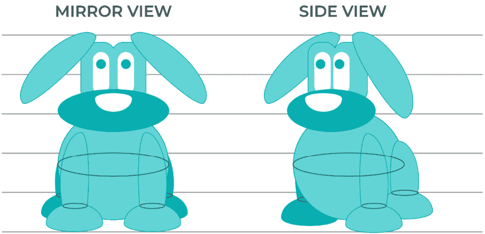

# 第二章：创造错觉：用 2D 经典动画的基本原则开始滚动

动画究竟是什么？从动画的基本 GIF 到大型动态图形电影，我们几乎可以在每个在线作品中找到动画。但是，为什么动画如此重要？因为通过在我们的网站和应用程序中添加动画和微动画，它将以多种方式帮助我们与用户沟通。它将吸引注意力，增加用户参与度，传达反馈，帮助我们引导用户和用户行为，并丰富**用户体验**（**UX**）。

在本章中，我们将专注于**2D 经典动画**及其**12 个原则**。我们首先将简要回顾动画的历史和基础，以及用于创造错觉的不同技术。

一旦我们了解了这些，我们将学习**动画的 12 个原则**，这将帮助我们使我们的动画看起来更逼真。我们还将学习如何仅用铅笔和纸张来设置一切，从绘制我们的第一个概念到创建我们自己的故事书，使我们的动画易于理解。

然后，我们将学习我们将要在**After Effects**（**AE**）中实现的不同方面，例如关键帧、运动、变换、时间和缓动。

到本章结束时，你将能够区分用于创建 2D 动画的不同技术。你还将了解 12 个原则，使你的动画看起来更真实，并且还将了解我们将在 AE 中使用的主要功能。

在本章中，我们将涵盖以下主题：

+   2D 动画的历史和基础

+   2D 动画的 12 个原则

+   框架、关键帧和中间帧来定义动画中的主要重要时刻

+   将我们的图标从 A 点移动到 B 点

+   使用缓动、时间和时间轴来创建更逼真的动画

+   绘制我们的第一个图标——从概念到分镜脚本

# 技术要求

为了通过本章，你需要以下内容：

+   铅笔

+   纸张

插画技能不是**必需的**！如果你不知道或者不想自己绘制图标，我们会提供下载的文件；然而，我们强烈建议你拿一张纸和一支铅笔，享受一下绘画的乐趣 😊。

# 2D 动画简介

那么，什么是动画？动画是将生命赋予没有生命的东西的能力。当我们谈论**经典 2D 动画**时，我们指的是一系列单独绘制且略有调整的静态图像；当它们结合在一起时，会产生运动的错觉。

从史前时代起，我们可以找到几乎与人类一样古老的动画参考。如果我们追溯到 35000 年前，当人类还住在洞穴里的时候，我们发现了一些有多个腿的动物的绘画，这是他们表示运动概念的方式。

图 2.1 – 八条腿来展示运动

古埃及人和希腊人曾经用略有调整的手臂或腿来绘制单独的图像，以给人留下移动形象的印象。因此，我们可以说动画一直被用于各种文化中。

图 2.2 – 古埃及女神伊西斯在神庙柱子上的形象，以及装饰有运动图像的古希腊陶罐

让我们稍微接近一点时间。在 1640 年，*阿塔纳修斯·基歇尔*创造了*幻灯机*，这是第一个将一些**移动**图像投射到墙上的物品。他是通过在玻璃板上绘制不同的单独插图并以固定速度移动它们来做到这一点的，从而产生了移动图像的错觉：

图 2.3 – 阿塔纳修斯·基歇尔的幻灯机

除了所有这些，1824 年，*彼得·马克·罗杰特*“发现”了**视觉持久性**，我们说“发现”是因为这不是第一次提到这个话题。视觉持久性意味着，在一段时间内，我们的眼睛会保留我们刚刚看到的每一个图像，这就是运动错觉的原因。换句话说，在人类的大脑中，多个图像融合成一个单一的移动图像。

从那时起，其他**光学玩具**相继问世，例如魔术转盘、幻影盘、活动视镜、普拉西诺斯科普和翻页书，它们都负责为人类眼睛创造运动的错觉。

在 1906 年，*托马斯·爱迪生*和纽约报纸卡通画家*詹姆斯·斯图尔特·布莱克顿*（他们在 1896 年相遇，当时*詹姆斯·斯图尔特·布莱克顿*采访了*托马斯·爱迪生*）向公众发布了第一部动画图片，使用了定格摄影技术。它被称为*《滑稽面孔的幽默阶段》*。

图 2.4 – 第一部动画电影《滑稽面孔的幽默阶段》的序列

但是，第一部手绘动画电影和第一部被认为是动画卡通电影的是*《幻想曲》*，由*埃米尔·科尔*制作，于 1908 年在巴黎首映。

几年过去了，1928 年，随着**沃尔特·迪士尼**的到来，*米老鼠*在*《威利号汽船》*中首次亮相，这是第一部带有声音的卡通片，它使用了细胞动画制作。每个单独的帧都是画在赛璐珞上，并用多镜头相机拍摄。背景被放置在不同的图层上，沃尔特·迪士尼设法创造了一种既滑稽又逼真的运动效果。它也被称为第一部同步声卡通。

在 1937 年，迪士尼发布了第一部长篇动画电影，*《白雪公主和七个小矮人》*，这标志着经典二维动画的黄金时代的开始。

除了迪士尼，一些其他动画工作室也开始出现：*马克斯·弗莱舍*制作了《波佩鸭》短片和《 Felix the Cat》（1919 年），被认为是第一位动画电影明星，也是第一位被商品化的；*华纳兄弟*制作了《洛 oney Tunes》、《Merrie Melodies》和《Bugs Bunny》；以及*米高梅*制作的《汤姆和杰瑞》。

第二次世界大战后，情况发生了变化。随着电视的出现，工作室开始使用有限的动画技术制作电视卡通，以节省时间、精力和金钱，当然，以便能够大量生产卡通。

在 1960 年，第一部黄金时段动画系列出现了，由汉纳-巴伯拉制作的《弗林斯通一家》。同一家工作室还制作了《瑜伽熊秀》和《哪里有斯库比狗！》等节目。

**日本动画**，或如我们今天所称呼的**动漫**，在日本同时变得非常流行。它基于有限的动画技术，注重美学，通过放大和精心设计的背景来创造氛围。

在 1979 年，一位年轻的*乔治·卢卡斯*创立了*卢卡斯影业电脑部门*，这家公司在 1986 年被*史蒂夫·乔布斯*收购并更名为*皮克斯*。

到那时，**计算机生成图像**（**CGI**）变得越来越受欢迎，在 1995 年，动画历史上的一个主要时刻发生了。皮克斯的《玩具总动员》上映。其他大型计算机动画公司也出现了，包括*梦工厂*和*照明娱乐*。

但是，动画界不仅仅围绕迪士尼或皮克斯。那里有那么多艺术家和工作室值得专门一提：*吉卜力工作室*、*阿德曼工作室*和*莱卡工作室*，仅举几个例子。

因此，现在我们已经对动画历史有了几点了解，让我们继续到下一部分，学习 2D 动画的 12 个原则，这将帮助我们使我们的动画看起来更真实。

# 2D 动画的 12 个原则

动画一个物体、角色或类型并不是一件容易的事情，但通过一些技巧和技术，它可以变得容易得多，并且会使我们的动画看起来更逼真、更可信。

动画制作的 12 个原则是由迪士尼动画师*奥利·约翰斯顿*和*弗兰克·托马斯*在 1981 年的书《生命的幻觉》中提出的。他们是参与创造迪士尼动画风格的一些人，这 12 个原则背后的想法是制作更逼真的动画，并创造一种错觉，即这些角色是根据物理定律行动的。

我们可以说，《生命的幻觉》已经成为全球任何动画师、设计师、艺术家或对创作动画感兴趣的任何其他人的圣书。当然，这本书是多年前写的，但即便如此，每个原则对动画制作过程都是至关重要的，并且可以应用于动画的数字制作过程。让我们不要浪费时间，继续看看这 12 个原则是什么。

## 挤压和拉伸

**挤压和拉伸**的原则为动画增加了重量和灵活性的概念。在下面的例子中，你可以看到弹跳球在所有阶段都保持相同体积的同时如何拉伸和挤压：

图 2.5 – 挤压和拉伸弹跳球示例

## 期待

我们使用**期待**来为即将发生的动作准备观众。我们可以用它来表示物理动作和非物理动作。例如，想象你即将踢球；在你踢球之前，你首先会做的事情是移动你的脚向后。这个动作就是动作的期待。

非物理动作，例如，当一个角色在另一个角色进入之前看向屏幕的一侧。通过看向一侧，我们是在期待另一个角色的进入动作。

图 2.6 – 足球运动员在踢球前的期待动作

## 场景布置

这个原则基于我们所说的电影和戏剧中的**场景布置**，它被用来引导观众的注意力到我们想要屏幕上的内容，无论是角色还是动作。我们可以通过使用光线和阴影、角色在屏幕上的位置以及摄像机的位置和角度来集中观众的注意力。但是，记住，在布置动作或角色时，重要的是观众一次只看到一个想法。

图 2.7 – 同时布置三个动作与一个动作

## 直通动作和姿势到姿势

动画制作过程有两种不同的方法，**直通动作**和**姿势到姿势**，它们通常会被结合起来使用。

在直通动作中，场景是逐帧动画化，一个接一个，从开始到结束。这个过程用于创建更流畅和新鲜感十足的动作和动画。

姿势到姿势是我们绘制动作的主要时刻，或者我们称之为**关键帧**，当需要更多对动作的控制时使用。

所有这些话，如果我们谈论计算动画，姿势到姿势有更多的优势，因为我们能够计划和绘制主要的关键帧，而中间帧将自动完成。

图 2.8 – 姿势到姿势过程动画中的主要三个关键帧

## 随动和重叠动作

这两个动作都有关联，因为它们都帮助给出更逼真的运动幻觉。**随动**是动作结束时的情况。动作停止，但某些元素仍然在移动。想象一下一个人在跑后停下来；他们的衣服、头发甚至皮肤都会继续移动。

这些部分的微小速度和运动变化将使我们的动画看起来更加逼真；这就是我们所说的**重叠动作**。

图 2.9 – 应用跟进和重叠原理后正方形的运动行为

## 弧线

世界上几乎所有的事物都是以弧形运动的，例如，当我们抛掷一个物体时，它会沿着抛物线轨迹移动。如果我们不考虑**弧线**原理，我们的动画将看起来很僵硬，缺乏表现力。

图 2.11 – 弧形和直线关键帧动画示例

## 二级动作

添加到主要动作的每一个单独的动作都被称为**二级动作**，但不要与跟进和重叠动作混淆。二级动作基本上是小的动作或手势，用来支持角色的主要动作，并用于为动画角色本身增添更多个性。

让我们给你举一个例子。想象一下我们的角色，让我们称他为 Max，正在吃三明治。我们可以用两种不同的方式来表示这个场景：

+   **不带有二级动作**：如果我们不给 Max 添加任何二级动作，他只是张开和闭上嘴巴来吃三明治。没有眨眼，没有添加眉毛动作，只是 Max 的嘴巴和三明治在这里发生变化（如以下图所示）。这看起来很奇怪，对吧？而且，从我们的分镜脚本来看，你能判断出三明治是好吃还是不好吃吗？Max 是否在享受它？我们无法确定。

+   **带有二级动作**：现在，让我们在这里添加一些二级动作。例如，Max 在吃三明治之前会舔嘴唇，在第一口三明治时会闭上眼睛，最后，他会微笑。

你能看出区别吗？通过查看分镜脚本，我们可以看出 Max 对吃三明治很兴奋（舔嘴唇），花时间仔细品尝（咬一口时闭上眼睛），最后，他享受着它。我们可以肯定地说三明治味道很好（因为他笑了）。所有这些帮助我们理解主要动作的小动作都被称为二级动作。

图 2.12 – 无次要动作与次要动作分镜

## 时机

**时机**指的是我们需要用来表示动作的绘图或帧，它可以用来建立重量、情感和比例。我们将在接下来的章节中深入探讨这一点，但让我们先快速看一下这个简单的例子：想象你有两个球，大小相同但重量不同。

假设一个是由木头制成的，另一个是由铁制成的。如果我们击打它们，哪一个会花费更长的时间，或者说，哪一个会花费更多的帧数来移动？正是这样！铁球更重，加速需要更多的时间，所以当我们击打它时，它会移动得更慢，并且移动的距离更短。

图 2.13 – 铁球和木球的时机

## 夸张

在动画中，有时多即是少。**夸张**可以引导我们创造出更深入、更可信的角色。但是，我们如何做到这一点呢？通过夸张角色或物体的动作和情感；如果我们的角色很高兴，让我们让他们更高兴，如果他们生气，让我们让他们更生气，等等。然而，我们始终试图保持平衡，，否则我们的动画会看起来超现实。

图 2.14 – 夸张原则。真实与夸张的立方体堆叠下落动作的例子

## 素描

**实心绘制**意味着通过绘图、阴影、透视和平衡赋予角色某种 3D 外观，使其具有体积和重量。此外，我们必须避免制作对称的角色（或镜像），相反，让我们尝试让左右两侧处于不同的位置。

图 2.15 – 镜像视图与侧面视图

## 吸引力

**吸引力**（或称现实生活中表演中的**魅力**）是任何单个角色为了保持观众兴趣所必须具备的特征。然而，吸引力并不意味着角色必须长得好看；它远远超出了这个范畴。他们需要有趣。例如，如果我们想让我们的角色显得更天真，我们会用圆润和大的形状来描绘脸和眼睛，或者相反，如果我们想让我们的角色成为反派，我们将使用更尖锐的形状和三角形的脸。

图 2.16 – 吸引力示例

这就是我们对 12 个动画原则的概述。所以现在，既然你知道了如何使动画看起来更逼真和吸引人，我们将更深入地探讨我们刚刚讨论的一些原则，但更多地侧重于计算机动画。

# 帧数、关键帧和中间帧

动画这个词来源于拉丁语单词*animātiō*，意思是赋予生命的行为。它是通过一系列连续的绘图来模拟运动，一个接一个地放置，当一起播放时，让我们看到魔法发生。然而，这种运动并不存在，它基于我们在本章前面提到的视觉持久性。

## 帧数

在计算机动画中，这些连续的绘图被称为**帧**，所以每个单独的绘图，用于创建运动幻觉，本身就是一个帧。不仅如此，帧还会决定我们动画的持续时间和质量。所以，想象一下，我们想在 1 秒内将一个物体从点 A 移动到点 B。我们可以选择我们想要使用的帧数，但让我们看看区别。让我们用以下数量的帧在 1 秒内将球从点 A 移动到点 B：

+   **选项 1**：25 帧

+   **选项 2**：5 帧

你能想出会有什么不同吗？

在选项 1 中，我们的眼睛会在 1 秒内看到 25 帧发生，而不是在选项 2 中我们眼睛会捕捉到的 5 帧。结果是，选项 1 将比选项 2 平滑得多。

![图 2.17 – 由 25 帧组成的 1 秒动画与 5 帧动画的比较

![图片 B17930_02_17.jpg]

图 2.17 – 由 25 帧组成的 1 秒动画与 5 帧动画的比较

然而，我们是否需要这么多帧来制作这种动画？这取决于，这就是我们将会讨论**帧率**的地方。但现在，让我们先放下这个新概念；当我们到达在 AE 中设置电影的时候，我们将在*第四章*，*Move It! 使用 After Effects 动画我们的第一个 Lottie*中讨论它。

所以，回到我们的帧；那么关键帧呢？

## 关键帧

关键帧是动作中最重要的帧；动画越简单，我们需要的关键帧就越少。我们通常在动作发生变化时放置关键帧。例如，在*图 2.18*中，运动的起始和结束位置是关键帧，除非我们想在中间让球跳跃，否则我们不需要更多的关键帧来设置我们的动画：

![图 2.18 – 线性运动的起始和结束关键帧

![图片 B17930_02_18.jpg]

图 2.18 – 线性运动的起始和结束关键帧

相反，在*图 2.19*中，我们需要在中间添加一个额外的帧，正好在球的位置将要改变的地方，就像一个拐点：

![图 2.19 – 弹跳球的三个关键帧

![图片 B17930_02_19.jpg]

图 2.19 – 弹跳球的三个关键帧

## 中间帧

但是，那么其他帧会发生什么呢？我们称它们为**中间帧**，这些是我们为了从关键帧 1 到关键帧 2 创建运动所必需的帧。这些中间帧并不是定义我们的动画，而是使其看起来更平滑。

在经典的 2D 动画中，有人负责逐个手动绘制所有这些中间帧；在计算机动画中，我们使用的工具或软件可能会为我们做这件事，我们称之为**补间**。

图 2.20 – 五帧动作中的中间帧

AE 是这些工具之一，它会为我们生成中间帧，这样我们就可以专注于确定关键帧。在 AE 中，我们可以将这些关键帧应用不同的参数来改变它们的方面，例如颜色、位置、大小、旋转、缩放或放置。这些可以从一个关键帧更改为另一个，而无需我们逐帧创建，这真是太神奇了，因为它为我们节省了大量的努力和时间。在*第四章*，“用 After Effects 制作我们的第一个 Lottie 动画”，我们将学习如何处理任何提到的参数。

所以，在这些例子中，我们刚刚看到了帧、关键帧和中间帧是如何工作的。我们学习了如何表示线性弹跳球动画。太棒了！然而，如果我们将这些帧放置在我们的 AE 文档中并运行它，动画看起来会很奇怪，并且缺乏真实感，你知道为什么吗？

当然，我们缺少了本章前面讨论的重要原则，但你记得是哪些吗？我们正在讨论时序和缓动。所以，让我们更深入地探讨这两个概念，看看我们如何使我们的动画看起来更逼真。

# 时间线、时序和缓动

在上一节中，我们了解了帧是如何工作的；现在，让我们看看我们如何在时间和空间上放置它们，以便我们的动画获得这种真实感。我认为很难单独谈论其中一个概念而不涉及其他概念，所以我将这三个概念放在一起。

## 时间线

首先，让我们谈谈**时间线**，并专注于线性运动。既然我们已经确定了两个关键帧和中间帧，让我们看看如何将它们放置在时间上。我们该如何做呢？我们将我们的帧放置在时间线上。

时间线是将动画所需帧数划分成线的，所以这里又出现了**帧率**。如果我们决定想要 25 帧率的动画，那么我们的时间线中每秒将有 25 帧，所以如果我们有一个 2 秒的动画，我们的时间线中将有 50 帧。不用担心所有这些概念听起来有点抽象；我们知道，如果你从未参与过动画，这可能很难理解，这就是为什么我们将在下一章中也涵盖这些内容。

图 2.21 – 帧率的示意图

让我们回到我们简单的五帧动画。我们首先做的事情是绘制五帧，保持它们之间相同的间距，就像*图 2.22*中所示。正如我们之前提到的，如果我们用 AE 运行这个动画，它会看起来很尴尬，因为球没有加速度，也没有减速。那么我们应该怎么做？对，我们需要检查每一帧的时间，并添加一些缓动。

图 2.22 – 线性运动

## 时间和缓动

正如我们之前提到的，如果我们用 AE 运行我们的动画，它会看起来很尴尬，因为球缺少加速度和减速的感觉。在计算机动画中，我们称之为**缓动**。**缓入**用于加速，**缓出**用于减速。当然，在 AE 中我们可以按一个按钮自动完成这个操作，但我们需要首先了解它是如何工作的，以便知道我们在做什么，对吧？

所以，如果我们必须在我们五帧动画中表现这一点，我们会将第二帧和第四帧移动到极端位置附近，以表示加速度并减缓运动感，就像*图 2.23*中所示：

图 2.23 – 在我们的五帧时间线中展示出入的缓动

我们将在讨论 AE 及其特性时再次回到这一点，但我们认为在继续前进之前，你理解这些概念非常重要。

现在，你已经学习了关于时间线、时间和缓动的基础知识，让我们开始享受乐趣，继续到下一节。让我们创建我们的第一个图标！

# 绘制我们的图标

我们知道，在这些最后几节中，我们走过了很多历史和理论。你已经学到了很多新单词和概念，但对我们来说，你首先学习经典动画的基础，然后再开始使用动画工具是非常重要的。因为工具就是工具。当然，它们非常棒，会节省我们大量的时间和精力，但首先，我们需要在脑海中规划我们的动画，以便将其呈现出来！所以，去拿一张纸和一支铅笔，开始享受乐趣吧！

让我们想象我们已经成为了动画师；当然，我们是！我们刚刚和客户开了一个会。假设我们的客户通过自己的应用程序销售 T 恤；然而，当支付完成时，屏幕上什么也没有出现，所以用户一直感到困惑，因为他们不确定购买是否成功，这消耗了大量的客户服务资源。

那么，你认为用户理解购买后发生什么的最佳解决方案是什么？你认为……在购买流程结束时有一个确认屏幕？简单的东西，只是一个图标和简短的文字？

图 2.24 – 确认屏幕线框图

太棒了！所以我们已经有了我们的想法，并绘制了线框图；当然，我们可以就这样留下它，加一点颜色，使用正确的字体，然后*voilà*，把它交给技术团队，但来吧，让我们做一些更有趣的事情。毕竟，客户是在为我们的客户的应用程序花钱，所以让我们让他们感到有回报。

让我们思考一下图标；图标必须让用户知道购买已经完成，所以我们必须传达积极的信息。一个笑脸、一个竖起的大拇指或一个勾号就可以完成任务，但让我们记住，我们希望在其他地方重用这个图标，所以它不应该太具体。更通用的东西，可以在任何动作成功执行时使用。

所以，我会选择勾号选项。它很简单，当我们看到它时，我们立刻就知道动作已经完成。太好了！我们知道我们想要什么，所以让我们把它画出来。

![图 2.25 – 检查的不同风格

![img/B17930_02_25.jpg]

图 2.25 – 检查的不同风格

别太担心在白纸上开始；只需让自己随心所欲地发挥，否则，有很多地方可以给你灵感。只需在网上键入`check icon`，进入图片，就会有大量的例子让你获得灵感。此外，如果你不想自己画，还有一些网站你可以下载已经制作好的矢量图标，例如[`www.flaticon.com/`](https://www.flaticon.com/)或[`www.freepik.com/`](https://www.freepik.com/).

对，我们已经绘制了图标，下一步是什么？让我们发挥创意；让我们思考图标如何移动，以及我们希望图标如何移动，所以让我们制作故事板。

# 故事板

太棒了！我们已经与客户交谈，我们理解了问题和用户的担忧和需求，并提出了一个想法。我们决定在流程结束时添加一个带有勾号的新屏幕，以强调购买已经完成的概念。我们已经绘制了图标，我们知道我们想要什么，现在怎么办？我们是打开 AE 吗？还不！

的确，我们已经绘制了图标并准备好插图，所以我们可以直接跳到任何矢量插图工具，但我们知道我们想要我们的图标做什么吗？例如，图标将如何出现在新屏幕上？从透明到不透明？从小到大？从左到右？我们必须做出所有这些决定，以便准备好在 AE 中开始设置一切。

当然，你可以边做边决定，尤其是如果我们谈论的是一个简单的动画，但我们想展示正确的流程，所以如果你有一个更复杂的动画，你会知道如何进行。

这就是**故事板**介入的地方。故事板发生在前期制作阶段，它将帮助我们决定/预览我们的*尚未完成的图标*将如何变得生动！所以，让我们思考我们希望图标通过动作和过渡如何表现。

总要记住，故事板的目的是呈现想法，比如当我们最初绘制我们的图标时；在我们深入细节之前，我们就知道我们想要什么以及我们想要如何实现，因此不需要高保真度的故事板草图。我们只需用手绘或者使用插图工具和简单的矢量图形，无论你更舒服哪种方式。你会同意，这样做可以节省很多时间，然后我们可以将这些时间投入到在 AE 中制作流畅的动画中。

那么，回到我们的图标，我在这里大声思考：

1.  我希望当用户首次访问屏幕时，图标不会立即出现在眼前。

1.  然后，图标出现在屏幕的中间。

1.  它从小到大，从透明到不透明逐渐显现。

1.  一旦图标变得足够大，一些火花就会从中冒出。

1.  当白色气泡变大时，勾选图标开始绘制。

1.  火花从图标处移开。

1.  火花从不透明变为透明，然后消失。

太好了，我们已经在脑海中清晰了这个想法，现在让我们尝试将其转化为我们的故事板。但我们如何做到呢？让我们画出来！

图 2.26 – 勾选图标故事板

你会同意，在我们脑海中有一个想法是一回事，将其转化为文字是另一回事，而当我们快速草图并制作故事板时，一切才变得有意义。那时，魔法就开始发生，我们准备好开始使用工具了。

# 摘要

因此，回顾本章内容，我们经历了许多事情，从古代到现代的历史回顾。我们学习了动画的 12 个原则。我们遇到了客户，了解了他们的问题，并提出了解决方案。我们从构思到草图，再到准备开始动画自己的图标，确保我们清楚自己想要什么以及如何实现，这一切都得益于故事板。

我们离我们的图标上线和运行只有一步之遥！但是，让我们一步一步来...我邀请你继续阅读下一章，了解 AE 环境，在我们跳到书的第二部分之前，我们将开始动画我们的勾选图标。那么，我们下一章见！
