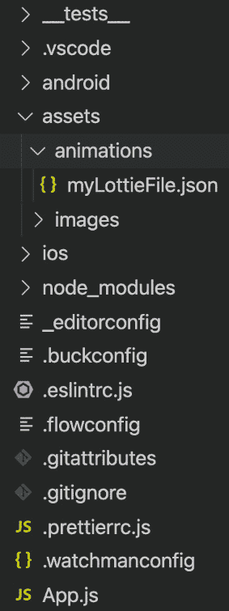
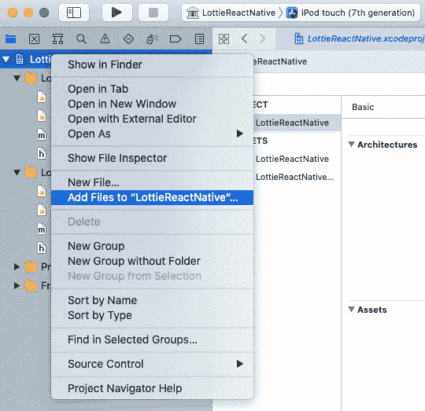

# 第九章：让我们做一些魔法：集成您的第一个 Lottie 动画

我们的应用程序现在已准备好在其屏幕上显示 Lottie 动画。在本章中，我们将学习如何集成 Lottie 文件，无论是从[`lottiefiles.com/`](https://lottiefiles.com/)下载的还是在我们自己的 Adobe **After Effects** (**AE**)中生成的。成功执行此集成的要求如下：

+   拥有一个使用 Bodymovin 插件从 AE 导出的 Lottie 动画的 JSON 文件或从 LottieFiles 下载的 JSON 文件。

+   在遵循了*第八章*中描述的步骤，*安装 lottie-react-native*之后，准备好 React Native 项目。

最终结果将是我们的应用程序在初始屏幕上显示提供的 Lottie 动画。本章我们将涵盖以下主题：

+   理解 Lottie 文件

+   在 React Native 应用程序中使用 Lottie 文件

+   在 TypeScript 应用程序中使用`lottie-react-native`

+   寻找`lottie-react-native`的文档

+   使用远程 Lottie 文件

# 理解 Lottie 文件元素

正如我们在前面的章节中看到的，Lottie 文件是我们使用 Bodymovin 插件转换和导出的 AE 动画的 JSON 表示。作为一个 JSON 对象，我们可以在文本编辑器中打开它，并看到 Lottie 文件只是存储需要渲染的资产及其在动画每一帧上应用的变换的键值对的集合。

让我们看看一个样本 Lottie 文件：

```js
{
```

```js
   "v":"4.8.0",
```

```js
   "meta":{
```

```js
      "g":"LottieFiles AE "
```

```js
   },
```

```js
   "fr":30,
```

```js
   "w":500,
```

```js
   "h":250,
```

```js
   "nm":"Comp 1",
```

```js
   "assets":[],
```

```js
   "layers":[
```

```js
      {
```

```js
        "nm":"Ellipses 3",
```

```js
        "ks":{
```

```js
            ...
```

```js
         },
```

```js
         "shapes":[
```

```js
            {
```

```js
               "ty":"gr",
```

```js
               "nm":"Ellipse 1",
```

```js
               "mn":"ADBE Vector Group",
```

```js
               "hd":false
```

```js
               ...
```

```js
            }
```

```js
         ],
```

```js
         ...
```

```js
      }
```

```js
   ],
```

```js
   "markers":[]
```

```js
}
```

Lottie 文件通常比这个要大得多，但我们为了教育目的已经对其进行了总结。现在让我们来看看这个样本文件中最重要的值：

+   `"v"`：指定此文件是哪个版本的文件。它对动画没有直接影响，因为它仅作为开发者和设计师的信息。

+   `"meta"`：关于文件的一般信息，例如名称和许可证。

+   `"fr"`：也称为**帧率**，表示动画应该以每秒多少帧渲染。

+   `"w"`：动画的宽度。

+   `"h"`：动画的高度。

+   `"assets"`：在动画中显示的外部资产列表。

+   `"layers"`：我们动画中使用的每个 AE 层的详细信息。

+   `"layers/ks"`：关于如何在特定帧上显示特定层的信息。

+   `"layers/shapes"`：每个层上使用的形状，包括它们的元数据和渲染选项。

通常，最好在 AE 中修改我们的 Lottie 动画，但更改导出的 Lottie JSON 文件中的值是可能的，并且可能会影响动画本身。

# 在 React Native 应用程序中使用 Lottie 文件

一旦我们将动画导出为 Lottie 文件，我们就可以将其集成到任何 React Native 应用中，并在任何 iOS 或 Android 设备上启动动画。在本节中，我们将展示如何在示例空白 React Native 应用的主屏幕上完成此操作，但这个过程可以扩展到任何 React Native 应用中的任何屏幕或组件。

我们首先要做的是在我们的应用内部的一个文件夹中存储我们的 Lottie 文件。我们需要确保我们可以在我们的 React 组件和屏幕中导入此文件夹中的文件。例如，我们可以将我们的 Lottie 文件存储在 `assets` 文件夹中，其中存储了应用中使用的所有图像：



图 9.1 – 在应用文件夹结构中存储动画

在这种情况下，我们在 `assets/animations` 文件夹中存储了一个名为 `myLottieFile.json` 的 JSON 文件，因此可以通过简单的 `import` 语句 `require('./assets/animations/myLottieFile.json')` 访问它。

现在我们来看一个示例，说明如何使用建议的文件夹结构中的集成 Lottie 文件来编写 `App.js`：

```js
import React from 'react';
```

```js
import LottieView from 'lottie-react-native';
```

```js
import {SafeAreaView, View, StyleSheet} from 'react-native';
```

```js
const App = () => {
```

```js
  return (
```

```js
    <SafeAreaView>
```

```js
      <View style={styles.container}>
```

```js
        <LottieView
```

```js
          source={require('./assets/animations/myLottieFile.
```

```js
          json')}
```

```js
          autoPlay
```

```js
          loop
```

```js
        />
```

```js
      </View>
```

```js
    </SafeAreaView>
```

```js
  );
```

```js
};
```

```js
const styles = StyleSheet.create({
```

```js
  container: {
```

```js
    width: '100%',
```

```js
    height: '100%',
```

```js
    justifyContent: 'center',
```

```js
    alignItems: 'center',
```

```js
  },
```

```js
});
```

```js
export default App;
```

在此文件中，我们在主屏幕上显示我们的 Lottie 动画，以便用户在打开应用后立即看到它。关于此文件，我们有几点需要考虑：

+   `SafeAreaView` 用于防止动画在带刘海的屏幕设备（例如 iPhone 13）下显示。

+   将 `LottieView` 放在尺寸容器中很重要，以防止动画调整大小或被裁剪。这就是为什么我们使用一个包含 `LottieView` 组件的 `100%` 宽度和高度尺寸视图。

+   `LottieView` 是一个 React 组件，它将渲染 Lottie 动画。它需要一个源属性来导入包含动画的 JSON 文件。它还接受一些属性来控制和配置动画。我们将在本章中更深入地探讨这些属性。

传递给 `LottieView` 组件的属性也值得关注：

+   `source`：这需要接收导入的动画 JSON 文件。导入动画的路径，就像在 JavaScript 中的 `require` 语句一样，可以是绝对路径或相对于父组件/屏幕的相对路径。

+   `autoPlay`：当指定（或设置为 `true`）时，这将在组件挂载后立即使应用开始播放。这通常用于父组件只有在动画运行时才有意义的情况。

+   `loop`：当指定（或设置为 `true`）时，这将重复动画，直到组件卸载。

前面的组件示例是 Lottie 动画在 React Native 应用内部渲染的最简单表示，但它是一个很好的例子，说明了将 `LottieView` 组件放置在尺寸容器中的重要性。

如果你的应用使用类而不是函数组件，你应该知道 `lottie-react-native` 仍然可以以非常相似的方式导入和使用。

让我们看看一个 Lottie 文件如何集成到基于类的 React Native 应用程序中的例子：

```js
import React from 'react';
```

```js
import LottieView from 'lottie-react-native';
```

```js
import {SafeAreaView, View, StyleSheet} from 'react-native';
```

```js
export default class App extends React.Component {  render() {    return (
```

```js
      <SafeAreaView>
```

```js
           <View style={styles.container}>
```

```js
                <LottieView source={require('./animation.
```

```js
                json')} autoPlay loop />;
```

```js
           </View>
```

```js
      </SafeAreaView>
```

```js
    )  }}
```

```js
const styles = StyleSheet.create({
```

```js
  container: {
```

```js
    width: '100%',
```

```js
    height: '100%',
```

```js
    justifyContent: 'center',
```

```js
    alignItems: 'center',
```

```js
  },
```

```js
});
```

与上一个例子类似，基于类的应用程序中的主要区别是需要返回 `render` 方法内部的渲染组件。其中一个基本属性（`colorFilters`）允许用户控制和更改层的颜色。

让我们看看这个属性如何被用来做到这一点：

```js
import React from 'react';
```

```js
import LottieView from 'lottie-react-native';
```

```js
import {SafeAreaView, View, StyleSheet} from 'react-native';
```

```js
const App = () => {
```

```js
  return (
```

```js
    <SafeAreaView>
```

```js
      <View style={styles.container}>
```

```js
        <LottieView
```

```js
          source={require('./assets/animations/myLottieFile.
```

```js
          json')}
```

```js
          autoPlay
```

```js
          loop
```

```js
          colorFilters={[
```

```js
             {
```

```js
               keypath: 'button', color: '#F00000',
```

```js
             },{
```

```js
               keypath: 'Sending Loader',color: '#F00000',
```

```js
    },
```

```js
           ]}
```

```js
        />
```

```js
      </View>
```

```js
    </SafeAreaView>
```

```js
  );
```

```js
};
```

```js
const styles = StyleSheet.create({
```

```js
  container: {
```

```js
    width: '100%',
```

```js
    height: '100%',
```

```js
    justifyContent: 'center',
```

```js
    alignItems: 'center',
```

```js
  },
```

```js
});
```

```js
export default App;
```

在这种情况下，`LottieView` 组件中的 `colorFilters` 属性正在修改两个层的颜色（在 AE 中应该使用相同的名称定义），无论在动画创建过程中定义为何种颜色，都将其渲染为黑色。

TypeScript 已经成为现代 React Native 应用的默认语言。在上一个例子中，我们使用了纯 JavaScript，但 `LottieView` 组件是 TypeScript 兼容的。

在下一节中，我们将展示用户在使用 `lottie-react-native` 的 TypeScript 应用程序中可能遇到的注意事项。

# 在你的 TypeScript 应用中使用 lottie-react-native

`lottie-react-native` 库包括类型，因此 `LottieView` 组件可以轻松地集成到 TypeScript 应用程序中。这些类型在库代码的 `lottie-react-native/src/js/index.d.ts`（类型定义文件）路径中定义。它们也可以通过库的仓库在 [`github.com/lottie-react-native/lottie-react-native/blob/master/src/js/index.d.ts`](https://github.com/lottie-react-native/lottie-react-native/blob/master/src/js/index.d.ts) 中访问。

除了定义适用于 `LottieView` 的属性和方法外，此文件还包括以下对象的类型：

+   `AnimationObject`：当 Lottie JSON 文件转换为 JavaScript 对象时的类型

+   `ColorFilter`：用于在动画中改变颜色的过滤器类型

+   `TextFilterIOS`：用于在 iOS 设备上改变字体的过滤器类型

+   `TextFilterAndroid`：用于在 Android 设备上改变字体的过滤器类型

使用 `lottie-react-native` 时遇到的主要问题是我们在应用程序中导入 Lottie 组件（`LottieView`）的方式。根据我们在项目中如何配置 TypeScript，我们可能需要以不同的方式导入它：

+   如果你的 `tsconfig.json` 文件定义了 `"esModuleInterop": false`，你将需要使用 `require` 以以下方式导入 `LottieView`：`const LottieView = require("lottie-react-native");`。

+   如果你的 `tsconfig.json` 文件定义了 `"esModuleInterop": true` 和 `"allowSyntheticDefaultImports": true`（`true` 是默认值），你将需要以标准的 ES6 方式导入 `LottieView`：`import LottieView from "lottie-react-native";`。

让我们看看如何在之前开发的示例代码中实现这两种方式：

```js
import React from 'react';
```

```js
import {SafeAreaView, View, StyleSheet} from 'react-native';
```

```js
import LottieView from 'lottie-react-native'; // if you have "esModuleInterop": true
```

```js
// import LottieView = require('lottie-react-native'); // otherwise you have "esModuleInterop": false
```

```js
const App = () => {
```

```js
  return (
```

```js
    <SafeAreaView>
```

```js
      <View style={styles.container}>
```

```js
        <LottieView
```

```js
          source={require('./assets/animations/myLottieFile.
```

```js
          json')}
```

```js
          autoPlay
```

```js
          loop
```

```js
        />
```

```js
      </View>
```

```js
    </SafeAreaView>
```

```js
  );
```

```js
};
```

在下一节中，我们将看到如何找到最佳资源，以解决使用 `lottie-react-native` 库时的其他注意事项。

# 寻找 lottie-react-native 的文档

当使用第三方库时遇到困难可能是一种令人沮丧的经历，但在`lottie-react-native`的情况下，库的公共仓库中有一个庞大的知识库可供访问：[`github.com/lottie-react-native/`](https://github.com/lottie-react-native/)。

这个知识库包括以下元素：

+   `lottie-react-native`（在基本层面上）。这个文件作为对库的良好介绍，应该是寻找与库使用相关的帮助时的第一个资源。

+   使用`LottieView`组件来控制我们应用中的动画。

+   **TypeScript 注意事项** ([`github.com/lottie-react-native/lottie-react-native/blob/master/docs/typescript.md`](https://github.com/lottie-react-native/lottie-react-native/blob/master/docs/typescript.md)): 正如在*在 TypeScript 应用中使用 lottie-react-native*部分中看到的，TypeScript 的集成可能会很困难。这份文档解释了我们可能会遇到的问题以及如何绕过这些问题。

+   `lottie-react-native`.

+   **变更日志** ([`github.com/lottie-react-native/lottie-react-native/blob/master/CHANGELOG.md`](https://github.com/lottie-react-native/lottie-react-native/blob/master/CHANGELOG.md)): 列出了为库发布的版本。当遇到特定功能或平台的问题时，这份文档非常有用，我们可以回滚/更新到不存在这些问题的版本。

+   **贡献指南** ([`github.com/lottie-react-native/lottie-react-native/blob/master/CONTRIBUTING.md`](https://github.com/lottie-react-native/lottie-react-native/blob/master/CONTRIBUTING.md)): 这份文档解释了如何请求帮助或向开源仓库贡献代码更新。

+   **拉取请求** ([`github.com/lottie-react-native/lottie-react-native/pulls`](https://github.com/lottie-react-native/lottie-react-native/pulls)): 这是提交给库的贡献列表。用户可以使用这个列表来了解即将推出的修复或关于错误和功能的讨论。

+   **问题** ([`github.com/lottie-react-native/lottie-react-native/issues`](https://github.com/lottie-react-native/lottie-react-native/issues)): 在这里，库用户分享他们的问题、错误或关于库的疑问。当使用库或集成时遇到问题时，这是一个很好的搜索资源。

+   **Lottie for iOS 仓库** ([`github.com/airbnb/lottie-ios`](https://github.com/airbnb/lottie-ios)): Lottie 的 iOS 特定库的信息来源。可以用来搜索 iOS 特定的错误或功能。

+   **Lottie for Android 仓库** ([`github.com/airbnb/lottie-android`](https://github.com/airbnb/lottie-android)): Lottie 的 Android 特定库的信息来源。可以用来搜索 Android 特定的错误或功能。

现在我们已经拥有了开始所需的全部资源，让我们在我们的应用中导入并使用第一个 Lottie 文件。

# 使用远程 Lottie 文件

为了获得最佳性能，动画应包含在应用程序的文件夹结构中，但在某些情况下，使用远程 JSON 文件作为 Lottie 动画以在 React Native 应用程序中渲染可能很有用。在这些情况下，`lottie-react-native` 允许我们通过传递给 `LottieView` 的 `source` 属性透明地指定远程 URL 作为动画的源。

让我们看看如果使用远程动画而不是本地动画，我们的初始示例会是什么样子：

```js
import React from 'react';
```

```js
import LottieView from 'lottie-react-native';
```

```js
import {SafeAreaView, View, StyleSheet} from 'react-native';
```

```js
const App = () => {
```

```js
  return (
```

```js
    <SafeAreaView>
```

```js
      <View style={styles.container}>
```

```js
        <LottieView
```

```js
          source={'https://raw.githubusercontent.          com/lottie-react-native/lottie-react-native/          b96fd04c5d92d2acd55e6eb6cb8c3dd119d1a786/example/js/          animations/LottieLogo1.json'}
```

```js
          autoPlay
```

```js
          loop
```

```js
        />
```

```js
      </View>
```

```js
    </SafeAreaView>
```

```js
  );
```

```js
};
```

```js
const styles = StyleSheet.create({
```

```js
  container: {
```

```js
    width: '100%',
```

```js
    height: '100%',
```

```js
    justifyContent: 'center',
```

```js
    alignItems: 'center',
```

```js
  },
```

```js
});
```

```js
export default App;
```

如此例所示，只需更改 `source` 属性的值。在这种情况下，我们将 `require` 语句替换为一个简单的 URL，该 URL 指向托管在公共服务器上的 JSON Lottie 动画。对于外部源，用户需要确保应用程序始终可以访问外部文件，因为无法访问远程 URL 将显示一个空白区域而不是显示动画本身。

资产（如图像）也可以在 Lottie 文件中使用，并通过 `lottie-react-native` 进行渲染。让我们看看如何通过代码实现这种行为。

## 使用带有资产的 Lottie 文件

Lottie 动画可能包含显示在其中的外部图像，以制作更丰富和更复杂的动画。当使用 AE 和 Bodymovin 插件创建动画时，导出的 JSON 可能包含各种资产，例如以下内容：

```js
...,
```

```js
  "assets": [
```

```js
    {
```

```js
      "id": "image_name",
```

```js
      "w": 200,
```

```js
      "h": 100,
```

```js
      "u": "images/",
```

```js
      "p": "img_name.png"
```

```js
    }
```

```js
  ],
```

```js
  ...
```

在这些情况下，我们的应用程序需要包含其二进制文件内的文件，因此您需要将文件添加到项目中，并从零开始重新构建它，运行 `yarn ios` 或 `yarn android` 以确保应用程序与动画中使用的新的资产一起编译。根据我们针对的平台，将资产添加到项目中的方法不同：

+   在右侧列中可以找到的 `resources` 文件夹，然后点击 **将文件添加到 "LottieReactNative"…** 以选择所需的图像。



图 9.2 – 在 Xcode 中添加动画资产

+   `[项目文件夹]/android/app/src/main/assets`。建立一个 `lottie` 子目录，然后为每个动画创建一个文件夹是一个好习惯。您需要在动画的 `imageAssetsFolder` 属性中引用该文件夹，使用其相对路径。

让我们看看这个例子：

```js
<View style={styles.container}> 
  <LottieView 
    source={require('./assets/animations/myLottieFile.    json')} 
    autoPlay
    loop
    imageAssetsFolder='lottie/animation_name'
  />
</View>
```

一旦您在项目中有了资产，您就可以重命名它们，但您还需要修改包含 Lottie 动画的 JSON 文件，以便通过其新名称识别资产文件：

```js
...,
```

```js
  "assets": [
```

```js
    {
```

```js
      "id": "image_name",
```

```js
      "w": 200,
```

```js
      "h": 100,
```

```js
      "u": "images/",
```

```js
      "p": "new_image_name.png"
```

```js
    }
```

```js
  ],
```

```js
  ...
```

通过这种方式，我们将把闪亮的资产加载到我们的动画中，使它们能够完全渲染外部图像。

# 摘要

在本章中，我们学习了如何使用基本集成，如 TypeScript 类型，将 Lottie 动画加载到 React Native 中，以及如何将外部资产添加到我们的动画中。这使得我们能够在 React Native 应用中显示复杂的动画，但如果我们需要控制播放（例如，根据应用中发生的事件告诉动画开始/停止）会怎样呢？

让我们进入下一章，了解如何在 `lottie-react-native` 中控制 Lottie 动画。
