# 第一章：使用 Vue.js 入门

本章将介绍以下内容：

+   使用 Vue.js 编写 Hello World

+   编写列表

+   创建一个动态和动画列表

+   响应事件，如点击和按键

+   选择开发环境

+   使用过滤器格式化文本

+   使用 Mustaches 调试应用程序（例如 JSON 过滤器）

+   使用 Vue 开发者工具分析应用程序

+   升级到 Vue.js 2

# 简介

Vue 是一个非常强大的框架，但其优势之一是它非常轻量级且容易上手。事实上，在第一个示例中，您将在几分钟内构建一个简单但功能齐全的程序，无需任何设置即可完成。

在本章中，您将学习如何创建重复元素的网页列表（如目录）。此外，您将构建一个带有事件监听器的交互式页面。

为了让您更好地选择开发环境，我们还介绍了一些开发环境。您将使用一些调试技巧来快速开发自己的代码，并更好地理解如何解决应用程序中的错误。

请注意，在撰写本文时，ES5 是浏览器中 JavaScript 最好支持的标准。在这一章中，我将使用 ES5，这样即使您的浏览器不支持更新的 ES6，您也可以跟着学习。请记住，在后续章节中将使用 ES6。目前，Chrome 与大多数 ES6 的重要构造兼容，但通常您应该使用**Babel**使您的应用程序兼容旧版浏览器。当您准备好使用 Babel 时，请参考第八章中的配方*如何使用 Babel 编译 ES6*，以及*组织 + 自动化 + 部署 = Webpack*。

# 用 Vue.js 编写 Hello World

让我们使用 Vue.js 创建最简单的程序，即必备的 Hello World 程序。我们的目标是让您熟悉 Vue 如何操作您的网页以及数据绑定是如何工作的。

# 准备工作

完成这个入门示例，我们只需要使用浏览器。也就是说，我们将使用 JSFiddle 来编写代码：

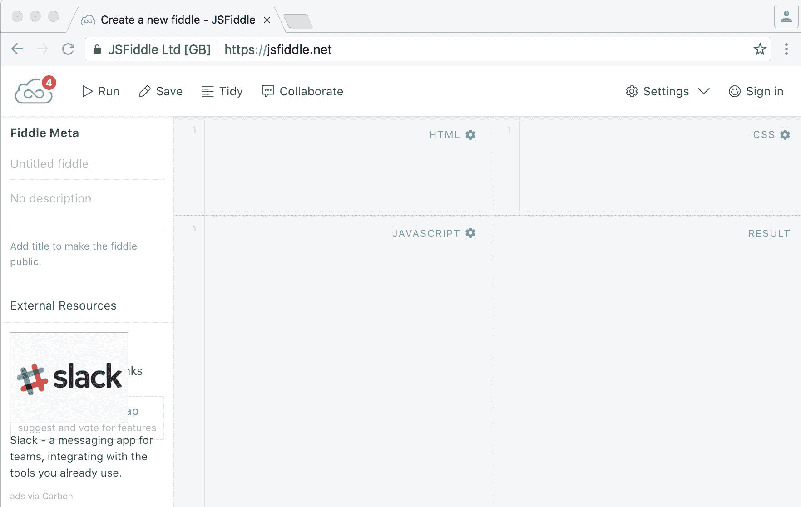

如果您从未使用过 JSFiddle，请不要担心；您即将成为一名专业的前端开发人员，使用 JSFiddle 将成为您口袋中的有用工具：

1.  将您的浏览器导航到[`jsfiddle.net`](https://jsfiddle.net)：

您将看到一个空白页面分为四个象限。左下方是我们将编写 JavaScript 代码的地方。按顺时针方向，我们有一个 HTML 部分，一个 CSS 部分，最后是我们预览的结果页面。

开始之前，我们应该告诉 JSFiddle 我们想要使用 Vue 库。

1.  在 JavaScript 象限的右上角，点击齿轮图标并从列表中选择 Vue 2.2.1（你会找到多个版本，“edge”代表最新版本，在撰写时对应的是 Vue 2）。

现在我们准备好编写我们的第一个 Vue 程序了。

# 具体步骤如下：

1.  在 JavaScript 部分写入：

```js
        new Vue({el:'#app'})

```

1.  在 HTML 象限中，创建`<div>`：

```js
        <div id="app">

          {{'Hello ' + 'world'}}

        </div>

```

1.  点击左上角的运行按钮，我们可以看到页面显示 Hello world：

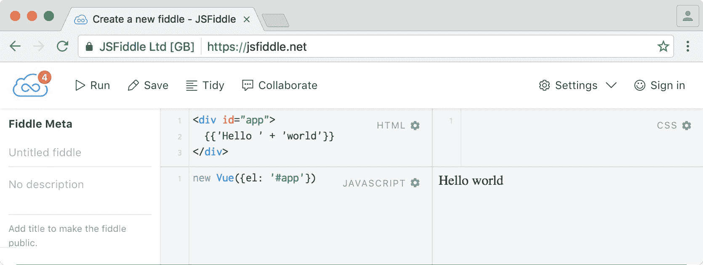

# 工作原理如下：

`new Vue({el:'#app'})`将实例化一个新的 Vue 实例。它接受一个选项对象作为参数。这个对象在 Vue 中是核心的，它定义和控制数据和行为。它包含了创建 Vue 实例和组件所需的所有信息。在我们的例子中，我们只指定了`el`选项，它接受一个选择器或一个元素作为参数。`#app`参数是一个选择器，将返回页面中以`app`作为标识符的元素。例如，在这样的页面中：

```js
<!DOCTYPE html> 

<html> 

  <body> 

    <div id="app"></div> 

  </body> 

</html>

```

我们在具有 ID 为`app`的`<div>`中编写的所有内容都将在 Vue 的范围之内。

现在，JSFiddle 会将我们在 HTML 象限中编写的所有内容包装在 body 标签中。这意味着，如果我们只需要在 HTML 象限中写入`<div>`，JSFiddle 会负责将其包装在 body 标签中。

还有一点要注意，将`#app`放置在`body`或`html`标签上会抛出错误，因为 Vue 建议我们将应用挂载在普通元素上，选择`body`也是同样的情况。

花括号（或者叫 handlebars）是告诉 Vue 将其内部的所有内容解析为代码的一种方法。引号是 JavaScript 中声明字面字符串的一种正常方法，所以 Vue 只会返回`hello`和`world`的字符串拼接。没有什么花哨的东西，我们只是将两个字符串拼接在一起并显示结果。

# 更多内容

我们可以利用这一点做一些更有趣的事情。如果我们是外星人，想要同时问候多个世界，我们可以这样写：

```js
We conquered 5 planets.<br/> 

{{'Hello ' + 5 + ' worlds'}}

```

我们可能会追踪不住我们征服了多少个世界。没问题，我们可以在花括号内进行数学运算。另外，让我们将`Hello`和`worlds`放在花括号之外：

```js
We conquered {{5 + 2}} planets.<br/> 

Hello {{5 + 2}} worlds

```

在花括号内使用原始数字表示世界的数量会显得很混乱。我们将使用数据绑定将其放在实例中的一个命名变量中：

```js
<div id="app"> 

  We conquered {{countWorlds}} planets.<br/> 

  Hello {{countWorlds}} worlds 

</div>

new Vue({ 

  el:'#app', 

  data: { 

    countWorlds: 5 + 2 

  } 

})

```

这是整洁应用程序的实现方式。现在，每次我们征服一个星球，我们只需要编辑`countWorlds`变量。反过来，每次我们修改这个变量，HTML 将自动更新。

恭喜，您已经完成了进入 Vue 世界的第一步，现在可以使用响应式数据绑定和字符串插值构建简单的交互式应用程序。

# 编写列表

生产列表的欲望似乎是人类天性中固有的一部分。通过观察一个井然有序的列表在计算机屏幕上滚动，人们可以获得一种深深满足的感觉。

借助 Vue，我们可以使用出色的外观和极大的便利性制作各种类型的列表。

# 准备工作

在本篇文章中，我们将使用基本的数据绑定，如果您遵循了最初的教程，您已经很熟悉它了。

# 具体操作如下...

我们将以几种不同的方式构建列表：使用一系列数字、使用数组以及使用对象。

# 一系列数字

要开始创建列表，请像前面的教程中一样设置您的 JSFiddle，并添加 Vue.js 作为框架。选择 Vue 2.2.1（或 Vue（edge））：

1.  在 JavaScript 部分编写如下内容：

```js
        new Vue({el:'#app'})

```

1.  在 HTML 中编写如下内容：

```js
        <div id="app"> 

          <ul> 

            <li v-for="n in 4">Hello!</li> 

          </ul> 

        </div>

```

这将导致一个列表，其中*Hello!*重复出现四次。几秒钟后，您的第一个列表就完成了，做得好！

我们可以使用这种技术编写一个倒计时 - 在 HTML 中，将<div>标签的内容替换为以下内容：

```js
<div id="app"> 

  <ul> 

    <li v-for="n in 10">{{11-n}}</li> 

    <li>launch missile!</li> 

  </ul> 

</div>

```

# 数组

1.  在 HTML 中，为了得到相同的结果，编辑列表以反映以下内容：

```js
        <ul> 

            <li v-for="n in [10,9,8,7,6,5,4,3,2,1]">{{n}}</li> 

            <li>launch missile!</li> 

        </ul>

```

尽管这个列表与上一个列表相同，但我们不应该在 HTML 标记中放置字面数组。

1.  最好使用一个包含数组的变量。将前面的代码修改为以下内容：

```js
        <ul> 

          <li v-for="n in countdown">{{n}}</li> 

          <li>launch missile!</li> 

        </ul>

```

1.  然后在 JavaScript 中放置数组倒计时：

```js
        new Vue({ 

          el:'#app', 

          data: { 

            countdown: [10,9,8,7,6,5,4,3,2,1] 

          } 

        })

```

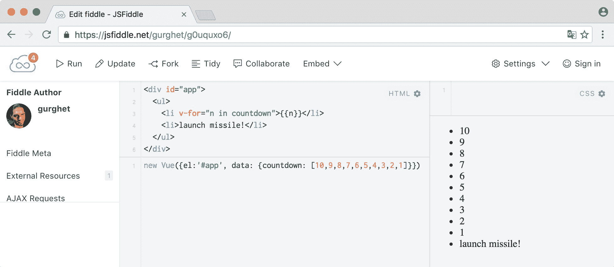

# 使用索引表示的数组

当枚举一个数组时，我们还可以访问索引，由变量`i`在下面的代码中代表:

1.  HTML 如下:

```js
        <div id="app"> 

          <ul> 

            <li v-for="(animal, i) in animals">

              The {{animal}} goes {{sounds[i]}}

            </li> 

          </ul> 

        </div>

```

1.  在代码部分中，写:

```js
        new Vue({ 

          el: '#app', 

          data: { 

            animals: ['dog', 'cat', 'bird'], 

            sounds: ['woof', 'meow', 'tweet'] 

          } 

        })

```

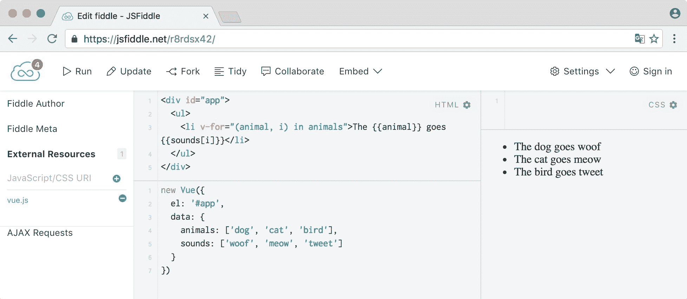

# 对象

前面的例子可以进行重构，以匹配动物的名称和声音，这样索引的意外错位就不会影响我们的列表。

1.  HTML 如下:

```js
        <div id="app"> 

          <ul> 

            <li v-for="(sound, name) in animals"> 

              The {{name}} goes {{sound}} 

            </li> 

          </ul> 

        </div>

```

1.  我们需要在 JavaScript 中创建`animals`对象:

```js
        new Vue({ 

          el: '#app', 

          data: { 

            animals: { 

              dog: 'woof', cat: 'meow', bird: 'tweet' 

            } 

          } 

        })

```

# 工作原理...

列表的工作原理非常简单; 这里对语法进行了更多解释。

# 数字范围

变量`n`在`<li>`标签内是可见的。为了证明这一点，你可以快速构建一个倒计时列表，如下所示:

```js
<ul> 

  <li v-for="n in 10">{{11 - n}}</li> 

  <li>launch missile!</li> 

</ul>

```

我们写`11`而不是`10`，因为在 Vue 中枚举是从 1 开始计数的；这意味着`10`中的`n`将从`1`开始计数，而不是从`0`开始计数，而有些人可能会期望从`0`开始，并一直增加到`10`。如果我们希望倒计时从`10`开始，那么我们必须写`11`。最后一个数将是`10`，所以在导弹发射前，我们将会有`1`作为最后一个数字。

`v-for="n in 10"`的作用是调用**枚举**; 具体来说，我们正在枚举一个数字范围（从 1 到 10）。

# 数组

Vue 也允许我们枚举数组。一般的语法如下:

```js
v-for="(element, index) in array"

```

如上所示，如果我们只想要数组元素，索引和括号可以省略。

这种枚举形式是有序的。换句话说，数组中元素的有序序列将与屏幕上看到的相同；而当枚举对象时则不是这样。

# 对象

语法是`v-for =“（value，property）”`，如果你想的话也可以加上索引`v-for =“（value，property，index）”`。后者不推荐使用，因为如前所述，枚举属性的顺序是不固定的。实际上，在大多数浏览器中，顺序与插入顺序相同，但不保证一定如此。

# 创建一个动态和动画列表

在 Vue 中，大部分数据都是响应式的。实际上，这意味着如果我们的视图模型中有变化，我们将立即看到结果。这就是让您专注于应用本身，抛开所有绘图逻辑的原因。在本篇中，我们还将了解此系统的一些限制。

# 准备工作

要完成这个教程，你应该知道如何使用基本的数据绑定（在第一个教程中介绍）以及如何创建列表（第二个教程）。

# 操作步骤

在之前的教程中，我们为导弹发射倒计时构建了一个列表：

```js
<div id="app"> 

  <ul> 

    <li v-for="n in countdown">{{n}}</li> 

    <li>launch missile!</li> 

  </ul> 

</div>

```

```js
new Vue({

  el:'#app',

  data: {

    countdown: 

      [10,9,8,7,6,5,4,3,2,1]

  }

})

```

如果它能被动画化就好了！我们可以调整 JavaScript 代码，以使倒计时在秒数增加时添加数字：

1.  将上述代码复制到 JSFiddle 的 HTML 和 JavaScript 区域，除了我们将自己填充倒计时，所以将其设置为空数组。

要获取倒计时变量，我们必须通过 Vue 实例本身传递该变量。

1.  将 Vue 实例分配给一个变量以供以后参考：

```js
        var vm = new Vue({

          el:'#app',

          data: {

            countdown: []

          }

        })

```

这样我们就可以使用`vm`来访问 Vue 实例。

1.  从 10 开始初始化倒计时：

```js
        var counter = 10

```

1.  设置一个函数，该函数重复将剩余秒数添加到现在为空的`countdown`数组中：

```js
        setInterval(function () { 

          if (counter > 0) { 

            vm.countdown.push(counter--) 

          } 

        }, 1000)

```

# 它是如何工作的...

我们要做的是获取`countdown`数组的引用，并借助于`setInterval`将其填充为递减的数字。

我们通过在`vm.countdown.push(counter--)`行中设置的`vm`变量来访问`countdown`，因此每次向数组添加新数字时，我们的列表都将更新。

这段代码非常简单，只需注意我们必须使用`push`函数将元素添加到数组中。使用方括号表示法添加元素将无效：

```js
vm.countdown[counter] = counter-- // this won't work

```

数组将被更新，但是由于 JavaScript 的实现方式，这种赋值方式将跳过 Vue 的响应式系统。

# 还有更多内容

现在运行代码将一次添加一个倒计时数字；很好，但是最后一个元素`发射导弹`呢？我们希望它只在最后出现。

为了做到这一点，在 HTML 中我们可以直接进行一个小的技巧：

```js
<ul> 

  <li v-for="n in countdown">{{n}}</li> 

  <li>{{ countdown.length === 10 ? 'launch missile!' : '...' }}</li> 

</ul>

```

这个解决方案不是我们所能做到的最好的；在`v-show`的示例中了解更多内容。

我们刚刚了解到，如果我们希望在视图中更新，不能使用方括号表示法向响应式数组中添加元素。对于使用方括号修改元素和手动更改数组长度也是如此：

```js
vm.reactiveArray[index] = 'updated value' // won't affect the view 

vm.reactiveArray.length = 0 // nothing happens apparently

```

您可以使用 splice 方法克服这个限制：

```js
vm.reactiveArray.splice(index, 1, 'updated value') 

vm.reactiveArray.splice(0)

```

# 对于点击和按键等事件的响应

每个应用程序的一个基本部分是与用户的交互。Vue 提供了简化的方式来拦截大多数用户事件，并将它们与相关操作连接起来。

# 准备工作

要成功完成这个示例，您应该知道如何创建一个列表。如果不知道，请查看第二章的*使用计算属性过滤列表*这个示例，以及*Vue.js 基本特性*。

# 如何操作...

以下代码片段显示了如何对`click`事件作出反应：

1.  填写以下 HTML：

```js
        <div id="app"> 

          <button v-on:click="toast">Toast bread</button> 

        </div>

```

1.  至于 JavaScript，写下以下内容：

```js
        new Vue({el:'#app', methods:{toast(){alert('Tosted!')}}})

```

1.  执行代码！一个事件监听器将会安装在按钮上。

1.  点击按钮，您会看到一个弹出窗口，上面写着*Toasted！*

# 它是如何工作的...

运行上述代码将在按钮上安装一个事件处理程序。语法是`v-on:DOMevent="methodEventHandler"`。处理程序必须是一个方法，即在 methods 选项中的一个函数。在上面的示例中，`toast`就是处理程序。

# 双向数据绑定

在大多数情况下，v-on 属性可以满足您的需求，特别是当事件来自元素时。另一方面，对于某些任务来说，它可能有时过于冗长。

例如，如果我们有一个文本框，并且我们想要使用文本框的内容更新一个变量，并确保文本框始终具有变量的更新值（这称为**双向数据绑定**），我们必须编写几个处理程序。

然而，这个操作是由`v-model`属性完成的，如下面的代码所示：

```js
<div id="app"> 

  <button v-on:click="toast">Toast bread</button> 

  <input v-model="toastedBreads" /> 

  Quantity to put in the oven: {{toastedBreads}} 

</div>

new Vue({ 

  el: '#app', 

  methods: { 

    toast () { 

      this.toastedBreads++ 

    } 

  }, 

  data: { 

    toastedBreads: 0 

  } 

})

```

玩一下这个应用程序，并注意到保持文本框同步不需要处理程序。每次更新`toastedBreads`时，文本也会更新；反之，每次你写一个数字，数量也会更新。

# 还有更多

如果你遵循本章的第一个示例，你会记得我们向一个变量打招呼，变量可以包含数量不定的单词；我们可以使体验更加互动。让我们建立一个我们想要问候的行星列表：

```js
<div id="app"> 

  <ul> 

    <li v-for="world in worlds">{{world}}</li> 

  </ul> 

</div>

new Vue({ 

  el: '#app', 

  data: { 

    worlds: ['Terran', 'L24-D', 'Ares', 'New Kroy', 'Sebek', 'Vestra'] 

  } 

})

```

我们希望能够追踪新征服的星球并删除我们摧毁的星球。这意味着在列表中添加和删除元素。考虑以下 HTML：

```js
<ul> 

  <li v-for="(world, i) in worlds"> 

    {{world}} 

  <button @click="worlds.splice(i, 1)">Zap!</button> 

  </li> 

</ul> 

<input v-model="newWorld"/> 

<button @click="worlds.push(newWorld)">Conquer</button>

```

在这里，`@`符号是`v-on`的简写：让我们来看看修改的地方：

+   我们添加了一个按钮来删除行星（我们需要在`v-for`中写出索引）

+   我们放置了一个文本框，它绑定到数据变量`newWorld`

+   我们放置了一个相应的按钮，将文本框中的内容添加到列表中

运行这段代码将会起作用。但是如果你看一下控制台，你会看到在更新文本字段时会有一个警告。

```js
[Vue warn]: Property or method "newWorld" is not defined on the instance but referenced during render. Make sure to declare reactive data properties in the data option. (found in root instance)

```

这是因为我们没有在 Vue 实例中声明`newWorld`，但这很容易修复：

```js
new Vue({ 

  el: '#app', 

  data: { 

    worlds: ['Terran', 'L24-D', 'Ares', 'New Kroy', 'Sebek', 'Vestra'], 

    newWorld: '' 

  } 

})

```

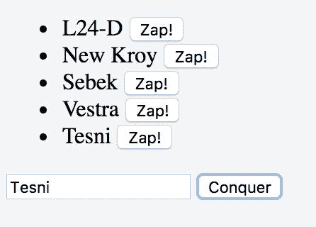

# 选择开发环境

我们将探索一些不同的开发方式，从简单的 JSFiddle 方法到更健壮的 WebStorm 支持方法。由于我们想要使用库来为我们的软件添加新功能，所以我将为您提供一个添加库的指南，无论您选择的开发方法如何。

# 操作步骤如下：

我将从最简单的方法开始，然后为您呈现一些更复杂的用于大型项目的方法。

# 仅使用浏览器

有一系列的网站（如 JSFiddle、CodePen 和 JS Bin 等）可以让您直接在浏览器中编写 Vue 应用程序，这些网站非常适合测试新功能并尝试本书中的示例。另一方面，它们在代码组织方面的限制太多，无法开发更复杂的项目。在本章的第一个示例中，使用了这种开发方式，请参考该示例以了解如何仅使用浏览器进行开发。一般来说，您应该通过使用这种方式来学习，并将其转化为更结构化的项目，具体取决于您正在开发的内容。

# 仅使用浏览器添加依赖项

每当我提到一个外部库时，您可以在互联网上搜索相关的`.js`文件，最好通过 CDN（内容分发网络）来分发，并将其添加到 JSFiddle 的左侧菜单中。让我们尝试一下 moment.js。

1.  在浏览器中打开一个新的 JSFiddle（将浏览器指向[`jsfiddle.net/`](https://jsfiddle.net/)）。

1.  在另一个标签页中，在你喜欢的搜索引擎中搜索`momentjs CDN`。

1.  第一个结果应该会带你到一个 CDN 网站，上面有一列链接；你应该最终能找到一些像`https://somecdn.com/moment.js/X.X.X/moment.js`的链接，其中*X*代表版本号。

1.  复制你找到的链接，然后回到 JSFiddle。

1.  在左侧边栏的“External Resources”部分，粘贴你的链接，然后按下“Enter”键。

对于许多库来说这样就足够了；有些库不支持这种方式，你就需要用其他方式将它们包含在 JSFiddle 中。

# 文本编辑器

最简单的方式是使用文本编辑器和浏览器。对于简单的、自包含的组件来说这完全合法。

现在有很多文本编辑器可供选择。我喜欢使用的是 Microsoft Visual Studio Code（[`github.com/Microsoft/vscode`](https://github.com/Microsoft/vscode)）。如果你使用其他编辑器也没什么大不了的，只是恰巧 Code 有一个针对 Vue 的插件：

1.  创建一个名为`myapp.html`的新文件，在其中编写如下内容：

```js
        <!DOCTYPE html> 

        <html> 

          <head> 

            <title>Vue.js app</title> 

          </head> 

          <body> 

            <div id="app"> 

              {{'hello world'}} 

            </div> 

            <script 

              src="https://cdnjs.cloudflare.com/ajax

               /libs/vue/2.0.0/vue.js">

            </script> 

            <script> 

              new Vue({el:'#app'}) 

            </script> 

          </body> 

        </html>

```

1.  在浏览器中打开刚刚创建的文件。

Vue 会从[`cdnjs.com/`](https://cdnjs.com/)下载，然后文本`hello world`应该会显示出来（如果看到了花括号，则可能出现了问题，请检查控制台是否有错误）。

这种方法类似于 JSFiddle 的方法：在顶部有一个 HTML 部分、一个 JavaScript 部分和一个 CSS 部分。我们只是将所有内容都控制在自己手中。此外，这种方式我们还可以使用 Vue 开发者工具（查看配方“使用 Vue 开发者工具扫描你的应用程序”了解介绍）。

# 用文本编辑器添加依赖项

在此配置中添加外部库只需将另一个`<script>`标签添加到你的文件中，然后将源属性设置为相应的链接。如果我们想添加`moment.js`，我们按照之前解释的方式查找该库，然后将以下代码片段添加到我们的页面中：

```js
<script src="https://somecdn.com/moment.js/X.X.X/moment.js "></script>

```

请注意，你需要将找到的链接粘贴到前面代码片段中虚假链接的位置。

# Node 包管理器（npm）

与 Vue 项目一起工作的规范方式，也是 Vue 社区官方支持的方式，涉及使用 npm，尤其是一个名为`vue-cli`的 npm 包。

如果您对 npm 不太熟悉，将其列入您计划广泛使用 JavaScript 进行开发的事项清单中是一个好主意。

简而言之，npm 是一个用于组织和共享代码的工具，超越了在项目中使用其他人的代码。更正式地说，它是一个用于 JavaScript 的软件包管理器。我们将在本书中使用一些基本命令，以及一些更高级的命令，但是我鼓励您自己学习更多：

1.  安装 npm。由于它与 Node.js 捆绑在一起，因此最好直接安装 Node.js。您可以在[`nodejs.org/en/download/`](https://github.com/Microsoft/vscode)上找到安装说明。

1.  安装完 npm 后，打开命令行并输入`npm install -g vue-cli`，这将安装`vue-cli`。选项`-g`表示全局安装，这意味着无论您身在何处，都可以输入`vue`来运行该程序。

1.  创建一个作为工作区的新目录。我们将把所有项目放在这个目录中。

1.  输入`vue list`，我们可以从官方 Vue 模板仓库中获取所有可用的模板。其他来源的模板也可以使用。

`simple`模板将创建一个类似于前面几段所做内容的页面。我邀请您运行`vue init simple`并检查一下；请注意它与我们所做的内容之间的差异。我们现在要做的是更进一步。我们将使用更复杂的模板，该模板包括一个打包工具。有一个用于`webpack`和`browserify`的模板；我们选择使用第一个。

如果您对`webpack`或`browserify`不太熟悉，它们是用于控制从源代码和资源（图像、CSS 文件等）到定制捆绑包的 JavaScript 程序的构建过程的程序。例如，对于单个`.js`文件：

1.  输入`vue init webpack-simple`，程序将询问您有关项目的一些问题。如果您不知道如何回答，请按下*Enter*键使用默认选项。

我们也可以选择等效地选择`browserify-simple`模板；这两个库可以达到相同的结果。

1.  完成脚手架后，输入`npm install`。这将负责下载和安装我们编写 Vue 应用所需的所有 npm 软件包。

完成后，您将已经拥有一个具备功能的演示应用程序。

1.  输入`npm run dev`来运行你的应用程序。进一步的指导会在屏幕上出现，并告诉你访问一个特定的网址，但你的浏览器很有可能会自动打开。

1.  将浏览器定位到指定的地址。你应该能够立即看到演示应用程序。

通过`vue-cli`创建的源文件中，你会发现两个值得注意的文件。第一个文件是你的应用程序的入口点，`src/main.js`。它将包含类似以下的内容：

```js
import Vue from 'vue' 

import App from './App.vue'

new Vue({ 

 el: '#app', 

 render: h => h(App) 

})

```

这段代码加载在你刚刚看到的`index.html`页面中。它只是告诉主 Vue 实例在被`#app`选择的元素中（在我们的情况下是一个带有`id="app"`属性的`<div>`元素）加载和渲染`App`组件。

你将在`App.vue`文件中找到一种自包含的方式来编写 Vue 组件。关于组件的更多内容将在其他教程中介绍，但现在请将其视为一种更进一步划分你的应用程序以保持其有序的方法。

以下代码与官方模板中的代码不同，但概括了一般的结构：

```js
<template> 

  <div id="app"> 

     

    <h1>\{{ msg }}</h1> 

  </div> 

</template>

<script> 

export default { 

  data () { 

    return { 

      msg: 'Hello Vue 2.0!' 

    } 

  } 

} 

</script> 

<style> 

body { 

  font-family: Helvetica, sans-serif; 

} 

</style>

```

你可以看到将代码划分为 HTML、JavaScript 和 CSS 是一种重复出现的模式。在这个文件中，我们可以看到与我们在第一个例子中在 JSFiddle 中看到的类似的东西。

在`<template>`标签中，我们放置我们的 HTML，在`<script>`标签中放置 JavaScript 代码，并使用`<style>`标签为我们的应用程序添加一些样式。

运行`npm run dev`后，你可以尝试在这个文件中编辑`msg`变量；在保存修改后，网页会自动重新加载组件。

# 使用 npm 添加依赖项

要在此配置中添加外部库，只需键入`npm install`后跟库的名称。然后在你的代码中，使用以下类似的方式使用它：

```js
import MyLibrary from 'mylibrary'

```

我们可以使用以下命令导入`moment.js`：

```js
npm install moment

```

然后在我们的 JavaScript 中添加以下行：

```js
import moment from 'moment'

```

# IDE

如果你有一个非常庞大的项目，很有可能你已经在使用 IntelliJ 或 Webstorm 等工具。在这种情况下，我建议你在大部分工作中坚持使用嵌入的控制台，并只使用诸如语法高亮和代码补全等功能。这是因为 Vue 的开发工具还不成熟，你很可能会花更多的时间来配置工具，而不是实际编程：

1.  打开 Webstorm 并创建一个新的空项目：

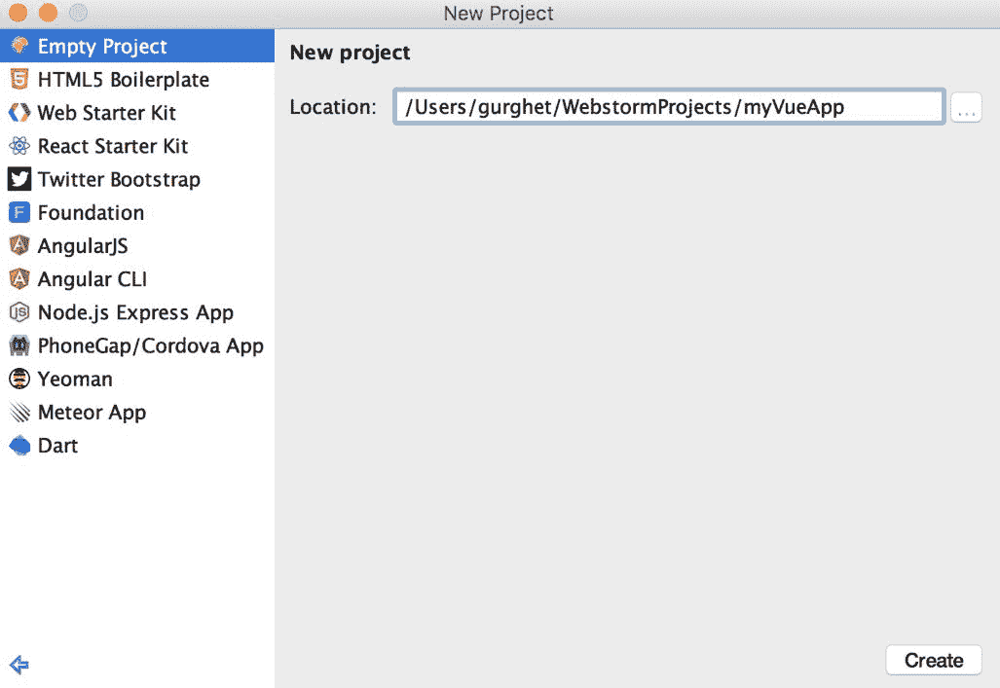

1.  在左下角，你应该能够打开控制台或终端：

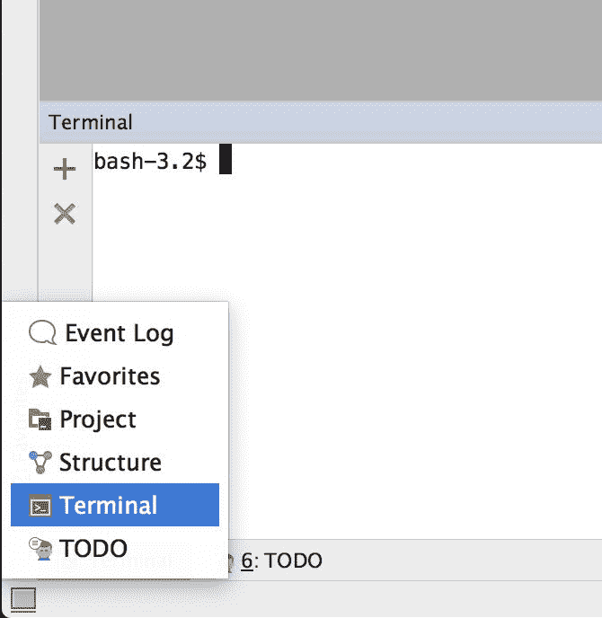

1.  从这个提示中，你应该能够按照前面的段落中所解释的那样使用 npm。如果你还没有看过，请阅读一下。在我们的例子中，我们假设已经安装了 Node 和 vue-cli。

1.  输入`vue init simple`并回答问题；你应该得到类似于以下内容的东西：

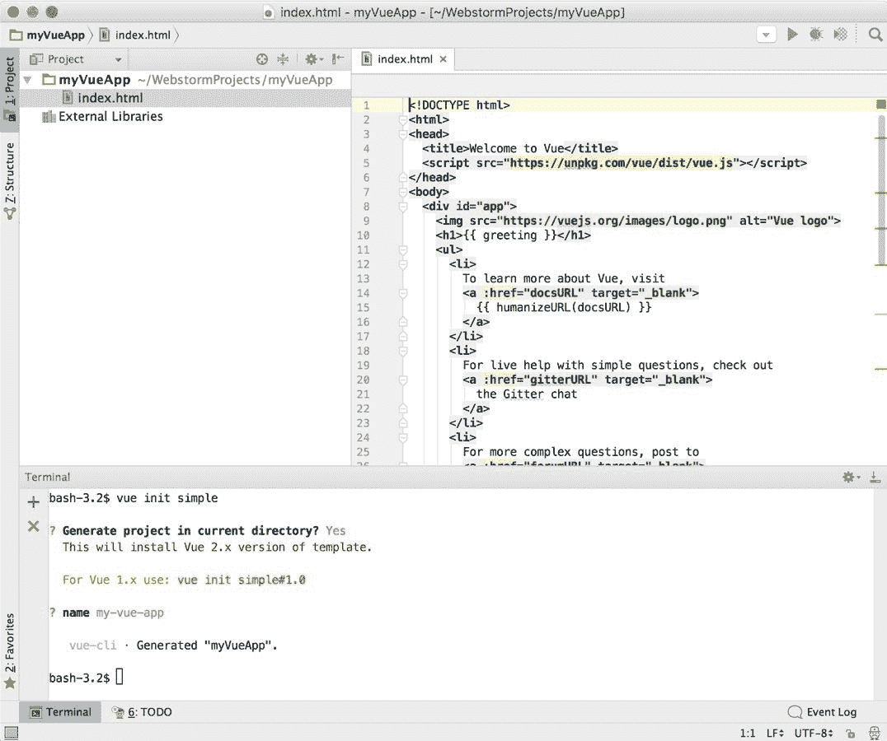

1.  双击打开`index.html`文件。

1.  将鼠标悬停在`index.html`文件的右上角，你应该能够看到浏览器图标；点击其中一个：

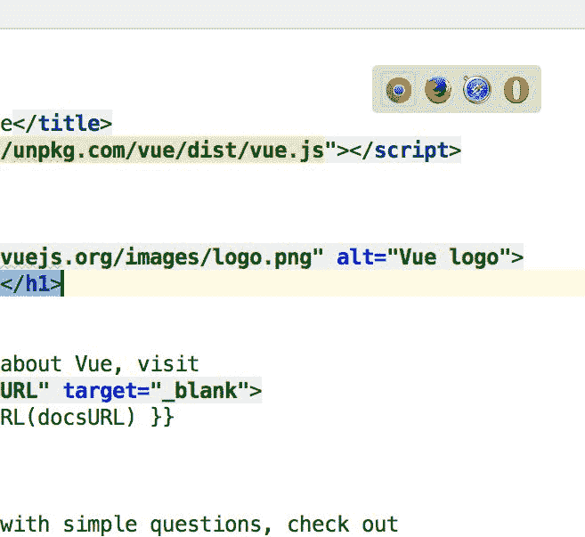

1.  你的示例应用程序已经启动运行了！

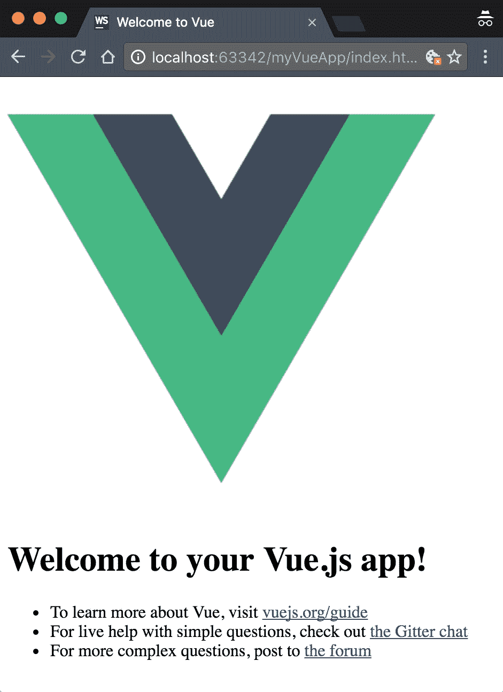

# 总结

你可以在专门的案例中了解更多关于这个的工作原理。在这里，我希望你对使用 Vue 进行开发的可能性有一个概述。对于快速原型，你可以使用 JSFiddle。当你需要自己的环境或者只需要使用 Vue 开发工具的时候，使用文本编辑器就足够了。然而，对于大多数严肃的项目，你应该熟悉 npm、webpack 或者 Browserify，并使用 vue-cli 来创建你的新项目。

# 使用过滤器格式化你的文本

Vue 的第一个版本附带了一些文本过滤器，用于帮助格式化文本和解决一些常见问题。

在这个新版本中，没有内置的过滤器（除了下一个案例中介绍的 JSON 等效过滤器）。我认为这是因为编写自己的过滤器非常容易，而且在专门情况下可以很容易地找到在线库来完成更好的工作。最后，过滤器的用途有些变化：它们现在更多用于后处理，而不是实际的过滤和排序数组。

为了演示创建过滤器有多容易，我们将重新创建 Vue 旧版本中的一个过滤器：capitalize。

# 准备工作

你不需要任何特殊的知识来完成这个案例。

# 操作步骤

有时候我们有一些字符串漂浮在我们的变量中，比如标签。当我们把它们放在句子中间时，它们工作得很好，但是在句子或者项目符号的开头，它们看起来就不太好了。

我们想要编写一个过滤器，可以将我们放入其中的任何字符串都变成大写。如果，例如，我们希望字符串`hello world`以大写字母`H`开头，我们希望能够这样写：

```js
{{'hello world' | capitalize }}

```

如果我们尝试在 Vue 应用程序中将其作为 HTML 运行，它会报错`[Vue warn]: Failed to resolve filter: capitalize`。

让我们创建这个过滤器并将它添加到 Vue 的内部过滤器列表中：

1.  写下以下 JavaScript 代码以注册一个过滤器并实例化 Vue：

```js
        Vue.filter('capitalize', function (string) { 

          var capitalFirst = string.charAt(0).toUpperCase() 

          var noCaseTail = string.slice(1, string.length) 

            return capitalFirst + noCaseTail 

        }) 

        new Vue({el:'#app'})

```

1.  在 HTML 部分中，写下以下内容：

```js
        {{'hello world' | capitalize }}

```

1.  运行代码并注意到文本现在显示为“Hello world”。

# 工作原理如下...

竖线表示以下内容是一个过滤器的名称；在我们的例子中，`capitalize`不在 Vue 的过滤器列表中，因此会有警告。Vue 将按原样打印字符串。

在 Vue 开始之前，它会在资产库中注册我们的过滤器（使用`Vue.filter`）。Vue 有一个内部过滤器对象，并将创建一个新条目：`capitalize`。每次遇到竖线符号时，Vue 都会查找相应的过滤器。记得在 Vue 实例的实际创建之前写好它，否则 Vue 将找不到它。

过滤器的工作原理非常基本的 JavaScript，事实上，使用 ES6 来编写这个过滤器会更好：

```js
Vue.filter('capitalize', function (string) { 

  var [first, ...tail] = string 

  return first.toUpperCase() + tail.join('') 

})

```

如果您不熟悉 ES6，这里有一个简要的解释。第二行被称为**解构**赋值字符串；我们将字符串解释为一个字符数组，将第一个字符分割为第一个字符，并将所有其他字符放入`tail`中。这是将数组的不同部分分配给多个变量的更快的方法。可能看起来神秘的另一点是`join('')`。由于`tail`现在是一个字符数组，我们需要一些方法将单个字母重新连接成一个紧凑的字符串。`join`的参数表示单个字符之间的分隔符。我们不想要任何分隔符，所以传递一个空字符串。

在下一章中，您将找到更多关于过滤器的用例，并涵盖其他实际用途。

# 使用`mustaches`（例如`JSON`过滤器）调试应用程序

在前面的用例中，我们全面了解了过滤器，并说 Vue 除了`JSON`过滤器的等效功能之外没有内置过滤器。这个过滤器非常有用，虽然使用它来调试并不是真正正统的做法，但有时它确实能让生活更轻松。现在我们可以直接使用它而不需要自己编写。

# 操作步骤如下...

为了看到实际效果，我们可以在 Vue 实例中简单显示一个对象的值。

1.  编写以下 JavaScript：

```js
        new Vue({ 

          el: '#app', 

          data: { 

            cat: { 

              sound: 'meow' 

            } 

          } 

        })

```

这只是在我们的代码中创建了一个包含字符串的 `cat` 对象。

1.  编写以下 HTML：

```js
        <p>Cat object: {{ cat }}</p>

```

1.  运行您的应用程序并注意到 `cat` 对象以所有其美丽的形式输出，就像 `JSON.stringify` 一样。

# 工作原理如下...

`Cat` 将显示 `cat` 对象的内容。在旧的 Vue 中，要获得这个结果，我们必须写成 `{{ cat | json }}`。

需要小心的一件事是我们对象中的循环。如果我们的对象包含循环引用，并且用花括号括起来，这将不起作用。这些对象比你想象的更常见。例如，HTML 元素是包含对父节点的引用的 JavaScript 对象；父节点反过来包含对其子节点的引用。任何这样的树结构都会导致花括号打印对象的无限描述。当你实际这样做时，Vue 只是抛出一个错误并拒绝工作。你在控制台中看到的错误实际上是由用于打印 `JSON.stringify`对象的内部方法抛出的。

使用花括号的一个实际情况是当同一个值在多个位置被改变时，或者当你想快速检查变量的内容时。花括号甚至可以用于演示目的，正如你在本书中将看到的用法那样。

# 用 Vue 开发者工具对应用进行透视

使用花括号是显示对象内容的一种快捷方式。然而，它也有一些限制；其中一个在前面的示例中详细说明了，就是它默认情况下无法处理包含循环引用的对象。一个不会出现这个限制并且具有更多调试功能的工具是 Vue 开发者工具。有一个 Chrome 扩展程序，可以在开发的每一步中帮助您，可视化组件的状态，它们在页面中的位置以及更多。它还与 **Vuex**（在后面的示例中介绍）深度集成，并具有一个时间机器功能，可以直接从浏览器中倒回事件流。

# 准备工作

要安装它，只需在 Chrome Web Store 的扩展类别中下载扩展。只需搜索 Vue.js devtools 即可找到它，点击**添加到 Chrome**按钮，然后您就可以开始使用了：

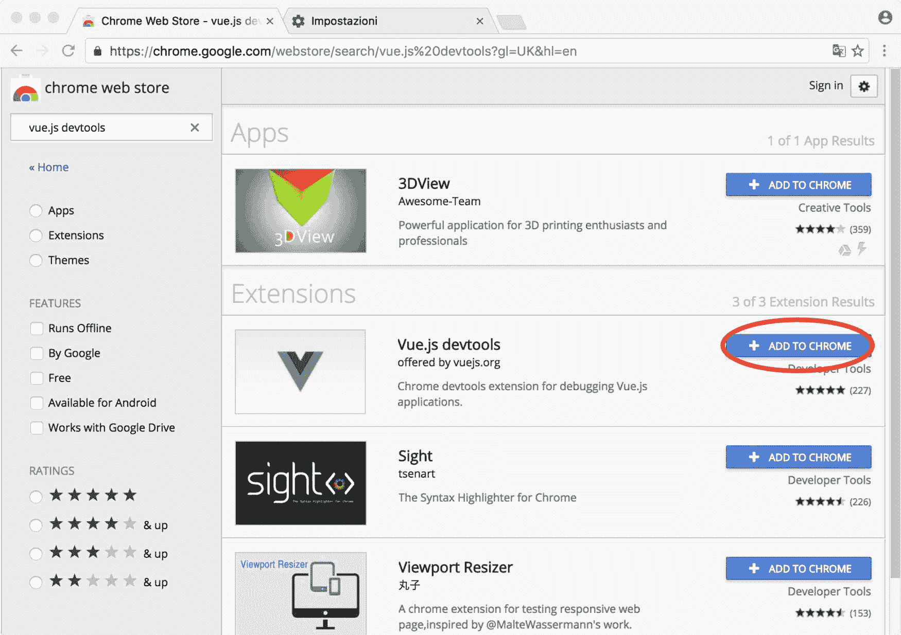

不幸的是，您将无法在某些配置中使用它；特别是它目前似乎无法在 `iframe` 环境和 JSFiddle 中工作，所以为了看到它，您至少要使用在*选择开发环境*示例中概述的*one page approach*。

。

# 怎么做...

1.  访问 Chrome 开发者工具（通常使用 *c* *md* + *opt* + *I* 或 *Ctrl* + *Shift* + *I* ），你会看到一个新的标签页说 Vue。点击它将呈现出开发者工具。

为了使其能够在通过`file://`协议打开的页面上运行，您需要在 Chrome 的扩展管理面板中检查允许访问文件 URL 以便为该扩展程序添加权限。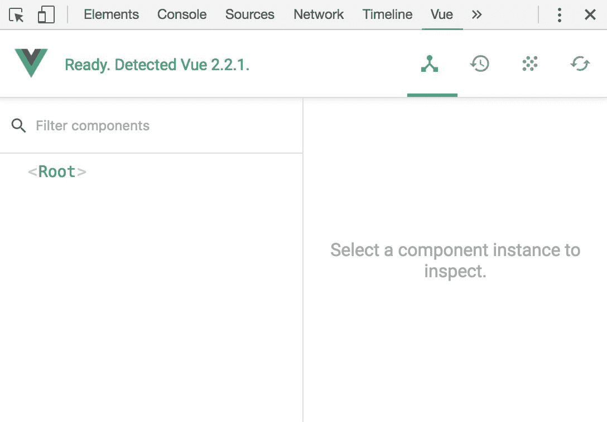

您将看到一个按层次结构排列在页面上的组件树，通过选择它们，您将能够实时深入地查看所有的变量。

1.  单击树中的各个对象以查看详细信息：

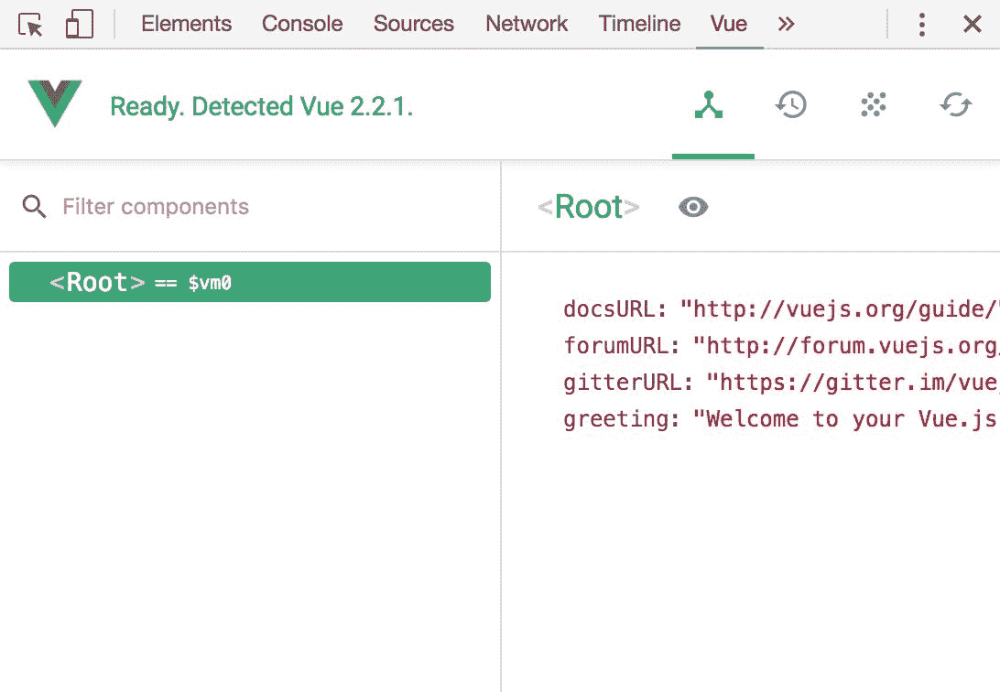

此外，您还将看到一个有用的按钮：检查 DOM 按钮（眼睛）将滚动页面到元素的位置，并在 Chrome 开发人员工具中显示 DOM 表示。此外，当您单击一个组件（详见插图中的根组件）时，您将在控制台中可以使用一个名为`$vm0`的变量。例如，您可以执行方法或检查变量。

1.  单击根组件，并在控制台中输入以下内容以探索`$vm0.docsUrl`属性：

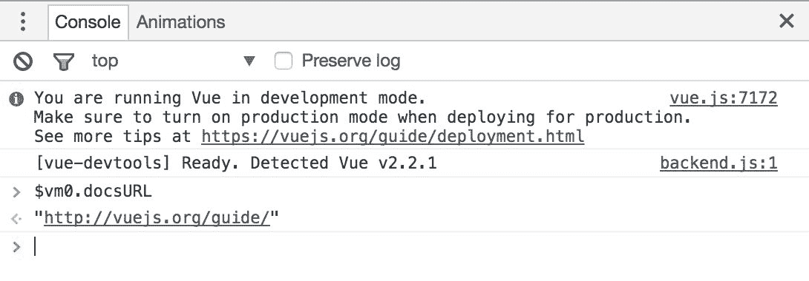

# 升级到 Vue.js 2

如果您需要将 Vue 应用程序升级到 2 版本，大部分代码都可以正常使用。但是，有几个功能需要进行一些修改。有些是简单的重命名，有些则比较复杂。

# 操作步骤如下：

为了让您的迁移开始，Chris Fitz（Vue 核心团队成员）创建了一个小助手应用程序，它将扫描您的代码并指导您进行迁移：

1.  使用以下 npm 命令安装 Vue Migration Helper:

```js
 npm install -g git://github.com/vuejs/vue-migration-helper.git

```

1.  导航到您的应用程序文件夹。

1.  使用以下命令运行程序：

```js
 vue-migration-helper

```

需要进行更改的所有行将被突出显示。更新完成后，或者如果您仍然有疑问，您应该查看官方文档迁移页面[`rc.vuejs.org/guide/migration.html`](https://rc.vuejs.org/guide/migration.html)。

# 它的工作原理是...

阅读文档将帮助您了解需要更新的关键点。在这里，我将为您提供一些最具挑战性修改的基本原理。

# $broadcast、$dispatch 和 events 选项的弃用

方法`$broadcast`和`$dispatch`现在已与旧版本相同的语法合并到`$emit`方法中。不幸地是，将每个`$broadcast`和`$dispatch`实例都替换为`$emit`并不保证总是有效，因为现在用于管理事件的模式有些不同。

在 Vue 1 中，事件沿着层次结构树向下（对于`$broadcast`）或向上（对于`$dispatch`）以及水平（对于`$emit`）的路径传播。

说实话，我从来都不喜欢有两种（如果算上旧的 `$emit` ，则是三种）方法来触发事件。即使在最小的上下文中，它也很令人困惑，因为你必须问自己“这个事件是给父级还是子级的？”大部分情况下，这个区分并不重要，你只是想要调用你的方法。但是，不会有免费的午餐；为了使一切在新的范式下运行，我们必须添加一个移动部件到系统中。

现在，所有事件都应该通过一个或多个中央枢纽传递。这个中央枢纽的角色可以由一个 Vue 实例来承担，因为它们实现了必要的接口。

当触发一个`v-on`消费的事件时，你只需要用`$emit`替换`$broadcast`，因为事件不需要传递很远。另一方面，如果你在事件方面定义一个组件的接口，你将不得不告别事件选项，因为它将不再起作用。这是通过所有事件通过一个中央枢纽传递的直接结果 - 事件选项将不知道在哪里注册所有事件。这是只有一个发射方法的代价：它向所有方向触发，但只在一个精确的管道中触发。

假设你有一个专门的空的 Vue 实例作为事件中心：

```js
var eventBus = new Vue()

```

如果你正在编写一个茶壶组件，并且你想要注册 brew 事件，你可以在 created 钩子中写入以下内容：

```js
new Vue({ 

  el: '#app', 

  components: { 

   comp1: { 

         template: '<div/>', 

         created () { 

         eventBus.$on('brew', () => { 

         console.log('HTTP Error 418: I'm a teapot') 

        }) 

      } 

    }, 

    comp2: { 

         template: '<div/>', 

         created () { 

         eventBus.$emit('brew') 

      } 

    } 

  } 

})

```

HTML 如下：

```js
<div id="app"> 

  <comp1></comp1> 

  <comp2></comp2> 

</div>

```

每当使用`eventBus.$emit('brew')`触发`brew`事件时，控制台将输出一条消息。

正如你所看到的，这个示例不太可扩展。你不能在 created 钩子中注册很多事件，然后期望轻松跟踪它们的功能以及它们在哪个中央枢纽中注册。对于这些更复杂的场景，建议的做法是使用后面介绍的 Vuex。

你编写的任何组件都可以充当事件中心。你还可以使用 API 方法`$off`来删除监听器，以及`$once`来监听事件，但只监听一次。

# 数组过滤器的弃用

如果你有很多经过过滤的`v-for`列表，我有个坏消息告诉你。即使在实际情况中，最常见的过滤器用法是与`v-for`一起使用，社区还是选择移除了这个特性。原因主要是因为有很多过滤器，经常连在一起使用，很难理解和维护。

推荐的过滤列表的新方法是使用计算属性。幸运的是，我们有一整个关于如何做到这一点的示例。在下一章节中查看示例*使用计算属性过滤列表*。

# Vue.config.delimiters 的弃用

自定义定界符不作用于组件级别。如果需要，可以创建两个使用不同定界符的不同组件。

这个升级非常简单，并且允许你编写组件，以便在其他模板引擎中使用：

```js
<div id="app"> 

  {!msg!} 

</div>

new Vue({ 

 el: '#app', 

 data: { 

   msg:'hello world' 

 }, 

 delimiters: ['{!','!}'] 

})

```

# 生命周期钩子的重命名

生命周期现在有更一致的命名，能够帮助长期记住它们的名称：

| **旧的钩子** | **新的钩子** |
| --- | --- |
| `init` | `beforeCreate` |
| `created` | `created` |
| `beforeCompile` | `created` |
| `没有等价项` | `beforeMount` |
| `compiled` | `mounted` |
| `ready` | `mounted` |
| `attached` | `没有等价项` |
| `detached` | `没有等价项` |
| `没有等价项` | `beforeUpdate` |
| `没有等价项` | `updated` |
