# 第二章：Vue.js 的基本功能

本章将介绍以下内容：

+   学习如何使用计算属性

+   使用计算属性对列表进行筛选

+   使用计算属性对列表进行排序

+   使用过滤器格式化货币

+   使用过滤器格式化日期

+   根据条件显示和隐藏元素

+   根据条件添加样式

+   通过 CSS 过渡为您的应用程序增添一些乐趣

+   输出原始 HTML

+   创建带有复选框的表单

+   创建带有单选按钮的表单

+   创建带有选择元素的表单

# 介绍

在本章中，您将找到开发完全功能、交互式、独立的 Vue 应用程序所需的所有构建块。在第一个示例中，您将创建计算属性，这些属性封装了用于创建更语义化应用程序的逻辑；然后，您将使用过滤器和`v-html`指令进一步探索一些文本格式化。您将使用条件渲染和过渡创建一个图形吸引人的应用程序。最后，我们将构建一些表单元素，例如复选框和单选按钮。

从现在开始，所有示例都将专门使用 ES6 编写。在撰写本文时，如果您使用 Chrome 9x 和 JSFiddle 进行跟随，它们应该能够无缝运行；如果您将此代码集成到一个更大的项目中，请记得使用 Babel（有关更多信息，请参见第八章中的*使用 Babel 编译 ES6*示例，*组织+自动化+部署=Webpack*）。

# 学习如何使用计算属性

计算属性是 Vue 组件中依赖于其他更原始数据的某些计算的数据。当这些原始数据是响应式的时，计算属性会自动更新并响应式地更新。在这个上下文中，原始数据是一个相对的概念。您当然可以基于其他计算属性构建计算属性。

# 准备工作

在开始准备这个示例之前，请确保熟悉`v-model`指令和`@event`表示法。如果您不确定，可以在前一章中完成*对点击和按键等事件做出反应*示例。

# 操作步骤

一个简单的例子将清晰地说明计算属性是什么：

```js
<div id="app"> 

  <input type="text" v-model="name"/> 

  <input type="text" id="surname" value='Snow'/> 

  <button @click="saveSurname">Save Surname</button> 

  <output>{{computedFullName}}</output> 

</div> 

let surname = 'Snow' 

new Vue({ 

  el: '#app', 

  data: { 

    name: 'John' 

  }, 

  computed: { 

    computedFullName () { 

      return this.name + ' ' + surname 

    } 

  }, 

  methods: { 

    saveSurname () { 

      surname = this.$el.querySelector('#surname').value 

    } 

  } 

})

```

运行此示例将显示两个输入字段：一个用于名字，一个用于姓氏，以及一个专门保存姓氏的按钮。检查 JavaScript 代码将发现，虽然名字是在对象的数据部分声明的，但姓氏是在 Vue 实例之外的开头声明的。这意味着它不会被 Vue 识别为反应性变量。我们可以通过编辑来检查，名字会影响计算值，而编辑姓氏则不会，即使姓氏变量本身实际上发生了变化，我们可以在浏览器控制台中检查到：

1.  在 JSFiddle 上运行应用程序；你会在输入字段中看到`John`和`Snow`，并且由于`computedFullName`的结果，你会看到以下内容：

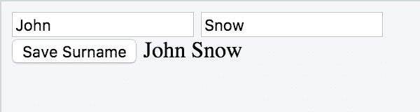

1.  将`John`替换为`Johnny`，你会看到计算属性实时变化。这是因为变量名是响应式的：

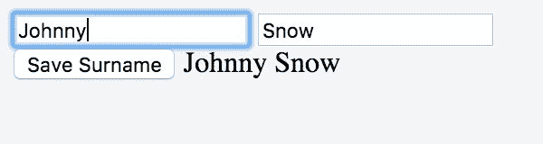

1.  将`Snow`替换为`Rain`，然后点击“保存姓氏”。不会发生任何事情，因为`surname`不是响应式的。它不会触发视图的更新。让我们来检查它是否确实被保存了：

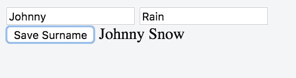

1.  用`John`替换`Johnny`。计算属性中的姓氏立即变为“Rain”。这是因为更改名字触发了计算属性的更新：

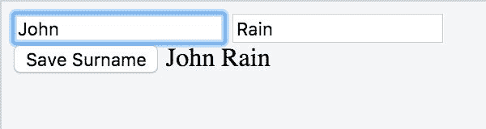

我们刚刚实验证实了，尽管变量的更改被保存到内存中，但当编辑非响应式变量时，并不会触发视图刷新。

值得注意的是，对于反应性来说，在这里也存在相同的限制--如果变量是数组，在使用方括号表示法更改元素不起作用，不使用`$remove`删除元素也不起作用。有关计算属性的其他限制，您应该看一下官方文档[`vuejs.org/v2/guide/computed.html`](https://vuejs.org/v2/guide/computed.html)。

# 还有更多...

在下文中，通过“依赖项”一词，我指的是在计算属性内部使用的反应性变量。当依赖项发生变化时，计算属性会被计算出来。

计算属性不适用于记忆数据，但如果直接设置值而不是通过其依赖项间接操作值更合理的话，可以定义一个 setter。而且，如果计算属性返回一个对象，每次都会是一个新对象，而不是之前版本的修改版。最后，只有所有依赖项都发生了变化，计算属性才会被调用。

这个缓存机制和 setter 的定义将在以下几节中进行分析。

# 缓存计算属性

虽然在 methods 选项中的函数在每次调用时都会执行，但在 computed 中的函数将根据依赖项进行缓存，而这些依赖项又是由函数中发现的所有响应式内容定义的。

在接下来的示例中，我们将探讨组合计算属性，但您可以很容易地想象出在计算属性上进行非常繁重的计算的情况：

```js
computed: { 

  trillionthDigitOfPi () { 

    // hours of computations and terabytes later... 

    return 2 

  } 

}

```

然后，您可以反复使用相同的属性，而无需重新计算：

```js
unnecessarilyComplexDoubler (input) { 

  return input * this.trillionthDigitOfPi 

}

```

每次调用此函数时，我们只需获取`trillionthDigitOfPi`的缓存值；不需要再次进行计算。

# 计算属性的 setter

有时，我们有一个计算属性，它真正表示我们模型中的一个明确对象，并且直接编辑它比修改其依赖关系更加清晰。

在表格工厂的背景下，我们希望指定要构建的表格数量或腿的数量：

```js
<div id="app"> 

  <label>Legs: <input v-model="legCount" type="range"></label><br> 

  <label>Tops: <input @input="update" :value="tableCount"></label><br> 

  <output> 

    We are going to build {{legCount}} legs 

    and assembly {{tableCount}} tables. 

  </output> 

</div>

```

我们的状态仅由`legCount`确定，并且表格的数量将自动确定。创建一个新的 Vue 实例：

```js
new Vue({ 

  el: '#app', 

  data: { 

    legCount: 0 

  }   

}

```

要知道表格的数量，我们有一个`tableCount`计算属性：

```js
computed: { 

  tableCount: { 

    get () { 

      return this.legCount / 4 

    }, 

    set (newValue) { 

      this.legCount = newValue * 4 

    } 

  } 

}

```

`get`部分通常是任何时候属性的值，setter 允许我们直接设置表格的数量（以及腿的数量）。然后，我们可以编写`update`方法，该方法在更改表格数量时触发：

```js
update (e) { 

  this.tableCount = e.target.value 

}

```

# 使用计算属性过滤列表

在早期版本的 Vue 中，过滤器在`v-for`指令中用于提取一些值。它们仍然被称为过滤器，但不再以这种方式使用。它们被降级为用于文本的后处理。老实说，我从来都不真正理解如何在 Vue 1 中使用过滤器来过滤列表，但在版本 2 中使用计算属性是过滤列表的唯一正确方式。

借助这个示例，您可以从最简单的待办事项列表到最复杂的太空船物料清单中对列表进行筛选。

# 准备工作

您应该对 Vue 列表有一定的了解，并了解计算属性的基础知识；如果不了解，阅读*编写列表*和*学习如何使用计算属性*这两篇文章将帮助您了解基础知识。

# 操作步骤：

要开始使用这个食谱，我们需要一个示例列表来筛选我们最喜欢的元素。假设我们在*ACME 研究与开发实验室*工作，我们负责在任何领域复制一些实验。我们可以从以下列表中选择一个实验：

```js
data: { 

  experiments: [ 

    {name: 'RHIC Ion Collider', cost: 650, field: 'Physics'}, 

    {name: 'Neptune Undersea Observatory', cost: 100, field: 'Biology'}, 

    {name: 'Violinist in the Metro', cost: 3, field: 'Psychology'}, 

    {name: 'Large Hadron Collider', cost: 7700, field: 'Physics'}, 

    {name: 'DIY Particle Detector', cost: 0, field: 'Physics'} 

  ] 

}

```

让我们使用一个简单的`<ul>`元素立即打印出列表：

```js
<div id="app"> 

  <h3>List of expensive experiments</h3> 

  <ul> 

    <li v-for="exp in experiments"> 

      {{exp.name}} ({{exp.cost}}m 

) 

    </li> 

  </ul> 

</div>

```

如果你不是物理学的铁粉，你可能想从这个列表中筛选掉物理实验。为此，我们创建一个新的变量，它将只保存`nonPhysics`实验。这个变量将作为一个计算属性：

```js
computed: { 

  nonPhysics () { 

    return this.experiments.filter(exp => exp.field !== 'Physics') 

  } 

}

```

当然，我们现在希望列表从这里绘制一个元素：

```js
<li v-for="exp in nonPhysics"> 

  {{exp.name}} ({{exp.cost}}m 

) 

</li>

```

如果我们现在启动程序，只有非物理实验会出现在列表中：

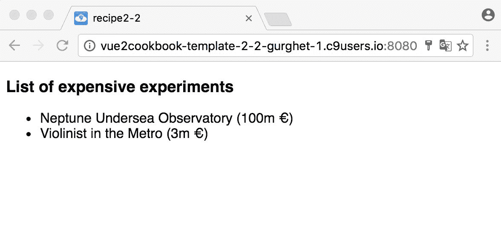

# 它的工作原理是...

`nonPhysics`计算属性将包含带有指定处理方式的数组副本。它将简单地检查字段不是`Physics`的实验，并将新数组传递给`v-for`进行渲染。

正如你所看到的，过滤是完全任意的。我们可以选择从一个变量中获取一个单词，而不是`Physics`，该变量再从一个文本框中获取：

```js
<input v-model="term"> // HTML 

// inside the Vue instance 

data: { 

  term: '' 

}, 

computed: { 

  allExceptTerm () { 

    return this.experiments 

      .filter(exp => exp.field.indexOf(this.term) === -1) 

  } 

}

```

# 更多内容...

事实证明，我们想重现这样的实验，但我们的预算有限；超过 300 万欧元的任何东西都在我们的限制之外。让我们创建一个过滤器：

```js
lowCost () { 

  return this.experiments.filter(exp => exp.cost <= 3) 

}

```

如果我们使用这个过滤器替换之前的过滤器，我们仍然可以看到*自己动手做粒子探测器*的物理实验。由于我们不喜欢物理学，我们希望结合这两个过滤器。

在旧版的 Vue 中，你可以在`v-for`中同时使用两个过滤器；在这里，我们将刚刚创建的计算属性移动到方法部分，并将它们转换成纯函数：

```js
methods: { 

  nonPhysics (list) { 

    return list.filter(exp => exp.field !== 'Physics') 

  }, 

  lowCost (list) { 

    return list.filter(exp => exp.cost <= 3) 

  } 

}

```

这样，过滤器就是可组合的；我们可以在`v-for`中这样使用它们：

```js
<li v-for="exp in nonPhysics(lowCost(experiments))"> 

  {{exp.name}} ({{exp.cost}}m 

) 

</li>

```

减少 HTML 中的逻辑的另一种方法是将所有内容封装在一个专用的计算属性中：

```js
filteredExperiments () { 

  return this.lowCost(this.nonPhysics(this.experiments)) 

}

```

HTML 变为如下所示：

```js
<li v-for="exp in filteredExperiments"> 

  {{exp.name}} ({{exp.cost}}m 

) 

</li>

```

最后，在经过所有这些过滤后，列表中唯一剩下的元素是*地铁里的小提琴手*，而且公平地说，300 万欧元是小提琴的成本，而不是整个实验的成本。

# 使用计算属性对列表进行排序

在 Vue 1 中，使用过滤器对`v-for`进行排序是被考虑移除的另一件事情，在当前版本中没有幸存下来。

使用计算属性对列表进行排序提供了更大的灵活性，我们可以实现任何自定义的排序逻辑。在这个示例中，您将创建一个包含一些数字的列表；我们将使用它们对列表进行排序。

# 准备工作

要完成这个示例，您只需要对列表和计算属性有一些熟悉；您可以通过《编写列表》和《学习如何使用计算属性》这两个示例来了解它们。

# 操作步骤

让我们编写一个世界上最大的水坝列表。

首先，我们需要一个包含三列（名称，国家，电力）的 HTML 表格：

```js
<div id="app"> 

<table> 

  <thead> 

    <tr> 

      <th>Name</th> 

      <th>Country</th> 

      <th>Electricity</th> 

    </tr> 

  </thead> 

  <tbody> 

  </tbody> 

</table> 

</div>

```

此外，我们还需要 Vue 实例的 JavaScript 代码，目前只包含了一组小型水坝的数据库、它们的位置以及它们产生的电力：

```js
new Vue({ 

  el: '#app', 

  data: { 

    dams: [ 

      {name: 'Nurek Dam', country: 'Tajikistan', electricity: 3200}, 

      {name: 'Three Gorges Dam', country: 'China', electricity: 22500}, 

      {name: 'Tarbela Dam', country: 'Pakistan', electricity: 3500}, 

      {name: 'Guri Dam', country: 'Venezuela', electricity: 10200} 

    ] 

  } 

})

```

在`<tbody>`标签内，我们放置了一个`v-for`，它将简单地迭代我们刚刚创建的水坝列表：

```js
<tr v-for="dam in dams"> 

  <td>{{dam.name}}</td> 

  <td>{{dam.country}}</td> 

  <td>{{dam.electricity}} MegaWatts</td> 

</tr>

```

这将渲染为以下表格：

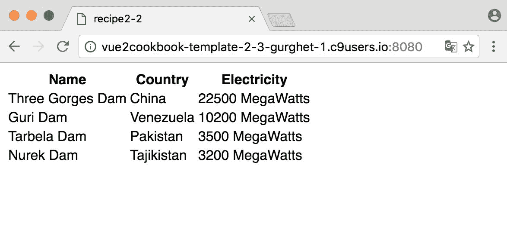

我们希望按照已安装的电力对这些水坝进行排序。为此，我们将创建一个计算属性`damsByElectricity`，它将返回一个有序的水坝集合：

```js
computed: { 

  damsByElectricity () { 

    return this.dams.sort((d1, d2) => d2.electricity - d1.electricity); 

  } 

}

```

在添加计算属性后，我们只需要在 HTML 中写入`damsByElectricity`而不是 dams。其他都保持不变，行为也相同：

```js
<tr v-for="dam in damsByElectricity"> 

  <td>{{dam.name}}</td> 

  <td>{{dam.country}}</td> 

  <td>{{dam.electricity}} MegaWatts</td> 

</tr>

```

# 它的工作原理是...

我们刚刚创建的计算属性`damsByElectricity`将返回一个数组，它将是`this.dams`的一个排序克隆。与计算属性一样，结果将被缓存（或记住）；每次我们需要结果时，如果原始列表没有变化，函数将不会被调用，缓存的结果将被返回。

`sort`函数接受两个参数：列表的两个成员。如果第二个成员在第一个成员之后，则返回值必须是正数；如果相反，则返回值必须是负数。

通过`d2.electricity - d1.electricity`获得的顺序是降序的；如果我们想要升序的顺序，我们需要交换两个操作数或将它们乘以*-1*。

# 更多内容...

我们可以通过将点击事件绑定到表头中的字段来扩展我们的列表，以便反转排序，这样当我们点击`Electricity`时，将以反方向对水坝进行排序。

我们将使用条件样式；如果您对它不熟悉，在完成《有条件地添加样式》这个示例后，您将会了解它。

为了清楚地表明我们的排序方式，我们应引入两个 CSS 类：

```js
.ascending:after { 

  content: "25B2" 

} 

.descending:after { 

  content: "25BC" 

}

```

在这里，内容是指向上的箭头的 Unicode 表示，表示升序，而指向下的箭头表示降序。

首先，我们应该使用变量 order 跟踪顺序，当升序时 order 为 1，当降序时 order 为-1：

```js
data: { 

  dams: [ 

    // list of dams 

  ], 

  order: 1 // means ascending 

},

```

条件样式是一个简单的三元运算符。有关条件样式的更多信息，请参阅《条件样式》中的章节：

```js
<th>Name</th> 

<th>Country</th> 

<th v-bind:class="order === 1 ? 'descending' : 'ascending'" 

    @click="sort">Electricity</th>

```

这里，sort 方法的定义如下：

```js
methods: { 

  sort () { 

    this.order = this.order * -1 

  } 

}

```

我们需要做的最后一件事是编辑 damsByElectricity 计算属性以考虑顺序：

```js
damsByElectricity () { 

  return this.dams.sort((d1, d2) => 

    (d2.electricity - d1.electricity) * this.order); 

}

```

这样，当 order 为-1 时，顺序将被反转，表示升序：

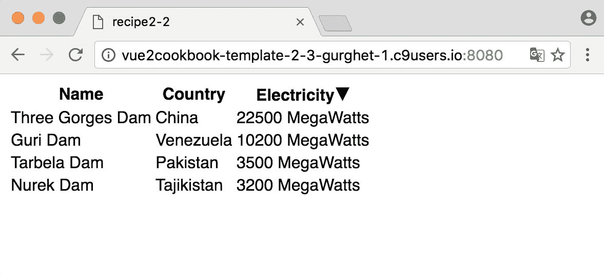

# 使用过滤器格式化货币

在 Vue 1 中，格式化货币有一定的局限性；我们将使用优秀的 accounting.js 库来构建一个更强大的过滤器。

# 准备工作

过滤器的基础知识在“使用过滤器格式化文本”一章中得到了探讨；在此之前，你需要构建一个基本过滤器，确保你完成了那部分，然后再回到这里。

# 操作步骤

将 accounting.js 添加到你的页面中。有关如何操作的更多详细信息，请参考[`openexchangerates.github.io/accounting.js/`](https://vuejs.org/v2/guide/computed.html)。不过，如果你在使用 JSFiddle，你可以将其作为外部资源添加到左侧菜单。你可以添加一个 CDN 链接来提供资源，例如[`cdn.jsdelivr.net/accounting.js/0.3.2/accounting.js`](http://openexchangerates.github.io/accounting.js/)。

这个过滤器非常简单：

```js
Vue.filter('currency', function (money) { 

  return accounting.formatMoney(money) 

})

```

你可以在 HTML 中尝试使用一行代码：

```js
I have {{5 | currency}} in my pocket

```

它将默认显示为美元，并打印"I have $5.00 in my pocket"。

# 工作原理是这样的...

当你在 JSFiddle 中或手动在页面中添加`accounting.js`时（或者使用`import`导入），你将使`accounting`对象可用。这样，你可以在过滤器中使用外部库（以及代码的任何其他地方）。

# 还有更多...

货币通常出现在表格中，它们需要对齐；让我们看看如何做到这一点。我们从如下 HTML 表格开始：

```js
<div id="app"> 

<table> 

  <thead> 

    <tr> 

      <th>Item</th> 

      <th>Price</th> 

    </tr> 

  </thead> 

  <tbody> 

    <tr v-for="item in inventory"> 

      <td>{{item.name}}</td> 

      <td>{{item.price}} 

    </td> 

  </tr> 

  </tbody> 

</table> 

</div>

```

我们正在遍历一个库存，当然，我们需要在 JavaScript 中指定它：

```js
new Vue({ 

  el:'#app', 

  data: { 

    inventory: [ 

      {name: 'tape measure', price: '7'}, 

      {name: 'stamp', price: '0.01'}, 

      {name: 'shark tooth', price: '1.5'}, 

      {name: 'iphone', price: '999'} 

    ] 

  } 

})

```

这时，我们有一个价格在页面上呈现的表格，但是没有货币符号，没有小数点后的位数一致性，也没有对齐。

我们计划使用我们的过滤器来帮助我们添加这三个。

在继续之前，最敏锐的读者可能会注意到我使用字符串来表示价格。为什么不用数字？这是因为 JavaScript 中的数字是浮点数；换句话说，它们不精确，因为小数位数是“浮动的”。

如果我们的销售中有一个售价为 0.83 欧元的小猫钥匙链，并且我们对此进行 50％的折扣，那么我们应该以 0.415 欧元的价格出售。由于不存在 0.5 分钱，我们将进行一些四舍五入。

一个客户在我们的在线商店上浏览，并对我们关于小猫的折扣感到惊讶。他购买了 3 个。如果你计算一下，应该是 1.245 欧元；我们对其应用`Math.round`函数，应该会得到 1.25 欧元。我们可以用以下代码进行检查：

```js
Math.round(1.245 * 100) / 100 

// output: 1.25

```

然而，请考虑到我们编码了所有的计算：

```js
var kittenKeychain = 0.83 

var kittyDiscount = 0.5 

var discountedKittenKeychain = kittenKeychain * kittyDiscount 

var boughtKeychains = discountedKittenKeychain * 3 

Math.round(boughtKeychains * 100) / 100 

// outputs: 1.24

```

在这个过程中我们损失了一分钱。设想一下，如果有一个大型应用程序处理成千上万的此类交易，或者设想一下如果这不是一个价格而是一个汇率。设想一下你需要将这个结果返回给后端，并且计算结果不匹配。误差可能会累积，最终的数字可能会有很大的差异。这只是一个小例子，但是在处理货币时使用浮点数还有更多的可能出错的地方。

使用字符串（或整数）表示货币可以给您想要的精度级别。

使用我们之前的过滤器将在小数点后引入美元符号和两个数字，但我们还是缺乏我们想要的对齐方式。我们应该为我们的 CSS 添加一个新的样式：

```js
.price { 

  text-align: right 

}

```

将价格列分配给类名为 price 的类将确保在小数点上对齐。以下是完整的代码：

```js
<div id="app"> 

<table> 

  <thead> 

    <tr> 

      <th>Item</th> 

      <th>Price</th> 

      </tr> 

  </thead> 

  <tbody> 

    <tr v-for="item in inventory"> 

      <td>{{item.name}}</td> 

      <td class="price">{{item.price | dollars}}</td> 

    </tr> 

  </tbody> 

</table> 

</div>

```

以下是用于 JavaScript 的代码：

```js
Vue.filter('dollars', function (money) { 

  return accounting.formatMoney(money) 

}) 

new Vue({ 

  el:'#app', 

  data: { 

    inventory: [ 

      {name: 'tape measure', price: '7'}, 

      {name: 'stamp', price: '0.01'}, 

      {name: 'shark tooth', price: '1.5'}, 

      {name: 'iphone', price: '999'} 

    ] 

  } 

})

```

# 使用过滤器格式化日期

有时，您需要一个比基本过滤器更强大的过滤器。您必须多次使用类似的过滤器，但每次都有微小的变化。过多的过滤器可能会造成混乱。这个关于日期的示例将说明问题和解决方案。

# 准备工作

在继续之前，通过阅读“在第一章中使用过滤器格式化文本”这一节，使自己更加熟悉过滤器；如果您已经了解过滤器，请继续阅读。

# 如何操作

假设我们正在策划一个学习历史的互动页面。我们有一个包含以下内容的 Vue 实例和 JavaScript 代码：

```js
new Vue({ 

  el:'#app', 

  data: { 

    bastilleStormingDate: '1789-07-14 17 h' 

  } 

})

```

在我们的数据中，我们有一个以字符串形式非正式地写入的日期在我们的实例数据中。我们的 HTML 可以包含法国大革命的时间线，并且在某个时候可以包含以下内容：

```js
<div id="app"> 

  The Storming of the Bastille, happened on {{bastilleStormingDate | date}} 

</div>

```

我们需要一个能够完成句子的过滤器。为此，一个可能的库是优秀的`moment.js`，而且，为了我们的目的，我们选择了本地化版本：[`cdnjs.cloudflare.com/ajax/libs/moment.js/2.14.1/moment-with-locales.js`](https://cdnjs.cloudflare.com/ajax/libs/moment.js/2.14.1/moment-with-locales.js)。

在添加了库之后，编写以下过滤器：

```js
Vue.filter('date', function (date) { 

  return moment(date).format('LL') 

})

```

这将显示一个格式良好的日期：`The Storming of the Bastille, happened on July 14, 1789`。

如果我们想要一个多语言网站，并且希望日期以法语格式显示呢？`moment.js`库对于本地化非常好；实际上，让我们用法语写同样的文本：

```js
La prise de la Bastille, survenue le {{bastilleStormingDate | date}}

```

我们必须使用以下内容修改我们的过滤器：

```js
Vue.filter('date', function (date) { 

  moment.locale('fr') 

  return moment(date).format('LL') 

})

```

我们的结果是`La prise de la Bastille, survenue le 14 juillet 1789`，非常好！然而，我们不想在每个页面中硬编码语言。最好的方法是在过滤器中添加一个参数。我们希望可以通过变量将语言传递给过滤器，就像这样：

```js
La prise de la Bastille, survenue le {{bastilleStormingDate | date('fr')}}

```

为了实现这一点，我们必须在过滤器声明中添加第二个参数：

```js
Vue.filter('date', function (date, locale) { 

  moment.locale(locale) 

  return moment(date).format('LL') 

})

```

这样，我们就可以通过页面中的一个变量将语言作为参数传递了，例如，根据选择的语言而定。

# 有条件地显示和隐藏元素

有条件地显示和隐藏网页上的元素对某些设计来说是基本的。你可以有一个弹出窗口，一组你想要逐个显示的元素，或者只在点击按钮时显示的东西。

在这个示例中，我们将使用条件显示，并了解重要的`v-if`和`v-show`指令。

# 准备工作

在进入这个示例之前，请确保你对计算属性有足够的了解，或者请查看《使用计算属性过滤列表》一节。

# 如何做到这一点...

让我们构建一个只在夜晚可见的幽灵：

```js
<div id="ghost"> 

  <div v-show="isNight"> 

    I'm a ghost! Boo! 

  </div> 

</div>

```

`v-show`保证只有在`isNight`为`true`时才会显示`<div>`幽灵。例如，我们可以写为：

```js
new Vue({ 

  el: '#ghost', 

  data: { 

    isNight: true 

  } 

})

```

这将使幽灵可见。为了使示例更真实，我们可以将`isNight`作为一个计算属性来写：

```js
new Vue({ 

    el: '#ghost', 

    computed: { 

      isNight () { 

        return new Date().getHours() < 7 

    } 

  } 

})

```

如果你在 JSFiddle 中加载这个程序，你将在午夜后和早上 7 点之前看到幽灵。如果你真的等不及要看到幽灵，你可以作弊并在夜间插入一个时间，例如：

```js
return (new Date('4 January 03:30')).getHours() < 7

```

# 它是如何工作的...

`v-show`指令计算`isNight`计算属性，并在元素的`style`属性中放置一个`display: none`。

这意味着该元素完全由 Vue 渲染；它只是看不见，就像幽灵一样。

另一个用于条件显示元素的指令是`v-if`指令。行为与`v-show`相同，只是在 DOM 中找不到该元素。当`v-if`评估为`true`时，该元素将被动态添加，没有元素样式的参与。要试用它，只需将`v-show`替换为`v-if`：

```js
<div id="ghost"> 

  <div v-if="isNight"> 

    I'm a ghost! Boo! 

  </div> 

</div>

```

一般来说，如果没有区别，使用`v-show`更好，因为从长远来看，它需要更少的资源。另一方面，如果你甚至不确定某些元素是否会出现在页面上，使用`v-if`可以让用户节省一些 CPU 时间（你永远不知道你的应用何时会爆红，并拥有数百万用户；通过选择正确的方式，你可以节省大量能量！）。

顺便说一句，在午夜之前不要等在页面前面。什么都不会发生。计算属性仅在其中的响应式属性发生更改时重新评估。在这种情况下，我们有一个非响应式的`Date`，因此不会触发任何更新。

# 有条件地添加样式

现代网页架构的一个伟大特性是可以在 CSS 中打包大量的显示逻辑。这意味着您可以拥有非常干净且表达力强的 HTML，同时通过 CSS 创建令人印象深刻的交互页面。

Vue 在表达 HTML 和 CSS 之间的关系方面特别擅长，并允许您将复杂的逻辑封装为易于使用的函数。

在本示例中，我们将探讨使用 Vue 进行样式设置的基础知识。

# 操作步骤如下：

我们将构建一个文本区域，当您接近允许的最大字符数时会发出警告：

```js
<div id="app"> 

  <textarea 

    v-model="memeText" 

    :maxlength="limit"> 

  </textarea> 

  {{memeText.length}} 

</div>

```

所写的文本将与`memeText`变量绑定，文本的`length`将通过双大括号写在末尾。

当仅剩下 10 个字符时，我们想要更改背景颜色。为此，我们必须创建一个名为`warn`的 CSS 类：

```js
.warn { 

  background-color: mistyrose 

}

```

我们将在`textarea`上使用此类来表示即将达到的写入上限。让我们看一下 JavaScript 代码：

```js
new Vue({ 

  el: '#app', 

  data: { 

    memeText: 'What if I told you ' + 

              'CSS can do that', 

    limit: 50 

  } 

})

```

这只是我们的模型；我们想要添加一个名为`longText`的函数，当我们达到 40 个字符时（距离 50 个字符还有 10 个字符）评估为 true：

```js
computed: { 

  longText () { 

    if (this.limit - this.memeText.length <= 10) { 

        return true 

    } else { 

        return false 

    } 

  } 

}

```

现在一切就位，来条件性地添加 warn 样式。为此，我们有两个选项：**对象语法**和**数组语法**。我们先尝试使用对象语法：

```js
<div id="app"> 

  <textarea 

    v-model="memeText" 

    :class="{ warn: longText }" 

    :maxlength="limit"> 

  </textarea> 

  {{memeText.length}} 

</div>

```

这意味着，每当`longText`评估为`true`（或一般为真值）时，类`warn`将被添加到`textarea`中。

# 工作原理...

如果您尝试在文本区域中输入超过 39 个字符，背景色将变为薄雾的玫瑰色。通常，*n*个类的对象语法如下所示：

```js
:class="{ class1: var1, class2: var2, ..., classn: varn }"

```

然而，有几种代替此语法的方法。首先，您不需要在 HTML 中编写完整的对象；您还可以绑定到一个对象。一般的做法如下所示：

```js
<div :class="classes"></div> // in HTML 

// in your Vue instance 

data: { 

  classes: { 

    warn: true 

  } 

}

```

此时，操纵类对象将向`<div>`添加或移除`warn`类。一种更聪明的绑定方式是绑定到一个计算属性，该计算属性本身返回一个对象：

```js
<div :class="classes"></div> 

computed: { 

  classes () { 

    return { 

      warn: true 

    } 

  } 

}

```

当然，将一些自定义逻辑放在计算属性中会更容易：

```js
computed: { 

  classes () { 

    const longText = this.limit - this.memeText.length <= 10 

    return { 

      warn: longText 

    } 

  } 

}

```

# 通过 CSS 过渡为应用程序增加一些乐趣

过渡是在元素被插入、更新和从 DOM 中移除时应用的效果。

对于本示例，我们将为朋友们建立一个小谜题。当他们想知道答案时，它将以淡入效果出现。

# 准备工作

要完成本课程，您应该已经了解条件显示和条件渲染。 *条件显示和隐藏元素* 将教您如何做到这一点。

# 具体操作步骤...

让我们在 HTML 中设置谜题：

```js
<div id="app"> 

  <article> 

    They call me fruit.<br> 

    They call me fish.<br> 

    They call me insect.<br> 

    But actually I'm not one of those. 

    <div id="solution" @click="showSolution = true"> 

      I am a <span id="dragon" v-show="showSolution">Dragon</span> 

    </div> 

  </article> 

</div>

```

Vue 实例的初始化非常简单，您只需编写以下内容：

```js
new Vue({ 

    el: '#app', 

  data: { 

    showSolution: false 

  } 

})

```

在 CSS 中，我们希望清楚地表明`<div>`解决方案可以被点击，因此我们添加了以下规则：

```js
#solution { 

  cursor: pointer; 

}

```

现在应用程序可以工作了，但是您会立即看到 Dragon。我们想为我们的谜题增添一些优雅的效果，并通过淡入效果使龙出现。

我们需要两个 CSS 类；第一个类在解决方案出现时将被应用一次：

```js
.fade-enter { 

  opacity: 0 

}

```

第二个类将在第一个类之后持续存在：

```js
.fade-enter-active { 

  transition: opacity .5s;  

}

```

最后，我们将解决方案包装在一个过渡中：

```js
I am a <transition name="fade"> 

  <span id="dragon" v-show="showSolution">Dragon</span> 

</transition>

```

# 工作原理...

过渡的名称是 CSS 类选择器的第一个单词`(fade )`，Vue 将根据元素出现或从屏幕上消失来查找它们。如果未指定名称并且只使用了`<transition>`，Vue 将使用过渡名称`v`作为 CSS。

在我们的情况下，之前看不见的龙正出现了，所以`fade-enter`将在一个刻度中应用（刻度是刷新视图的一个周期，但你可以把它看作是动画中的一个帧）。这意味着在开始时`<span>`实际上是不可见的，因为透明度将被设置为`0`。

之后，`fade-enter`类将被移除，而附加在`fade-enter`上的`fade-enter-active`现在是唯一剩下的类。从该类的规则可以看出，透明度将在半秒钟内变为`1`。1 是在哪里指定的？这是默认值。

Vue 在过渡中要寻找的完整类集如下：

+   `name-enter`：这是`enter`的起始类；它在元素插入之前应用，并在一帧之后被移除。

+   `name-enter-active`：这是`enter`的持续类。它在元素插入之前应用，并在过渡/动画完成时被移除。使用它来定义过渡的特性，如持续时间和缓动。

+   `name-enter-to`：这是`enter`的结束类。在移除了`name-enter`时应用。

+   `name-leave`：这是`leave`的起始类。在触发`leave`过渡时应用，并在一帧之后被移除。

+   `name-leave-active`：这是`leave`的持续类。在触发`leave`过渡时应用，并在过渡/动画完成时被移除。

+   `name-leave-to`：这取代了`name-leave`。

这里，`name`是您过渡的名称（在未指定名称时为`v`）。

# 还有更多...

过渡很酷，但是在这个示例中有一个遮挡我们视图的树，这破坏了过渡的声誉。为了跟进，请考虑以下 HTML：

```js
<div id="app"> 

  <p> 

    Transitions are awesome, careful<br/> 

    please don't use them always. 

  </p> 

  <transition name="fade"> 

     

  </transition> 

</div>

```

一小段 CSS 如下所示：

```js
#tree { 

  position: absolute; 

  left: 7.5em; 

  top: 0em; 

  cursor: pointer; 

} 

.fade-leave-active { 

  transition: opacity .5s; 

  opacity: 0 

}

```

最后，需要一个简单的 Vue 实例：

```js
new Vue({ 

    el: '#app', 

  data: { 

    show: true 

  } 

})

```

当我们运行应用程序时，我们得到的结果如下所示：

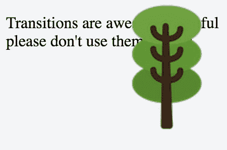

点击树会显示真正的消息。

# 输出原始 HTML

有时，您需要插入 HTML 内容，例如换行符（`<br>`），到您的应用程序数据中。这可以通过使用`v-html`指令轻松实现。

在这个示例中，我们将构建一个感谢信。

# 准备工作

对于这个示例，您不需要任何特殊的知识，但我们将建立在一些基本的 Vue 功能之上；如果您在本章节或上一章节中完成了一个示例，您就可以开始了。

# 如何做...

假设你有一个朋友约翰。在收到礼物之前，你想要准备一封格式化的感谢信，但是你不知道他会送给你什么。你预先写了三份文本：

```js
new Vue({ 

    el: '#app', 

  data: { 

    htmlTexts: [ 

    'Dear John,<br/>thank you for the <pre>Batman vs Superman</pre> DVD!', 

    'Dear John,<br/>thank you for <i>Ghostbusters 3</i>!', 

    'Dear John,<br/>thanks, <b>Gods of Egypt</b> is my new favourite!' 

    ] 

  } 

})

```

考虑到你会将这个变量直接输出在花括号内，如下所示：

```js
<div id="app"> 

  {{htmlTexts[0]}} 

</div>

```

问题在于，这种情况下，你会得到纯文本和所有的 HTML 乱码：

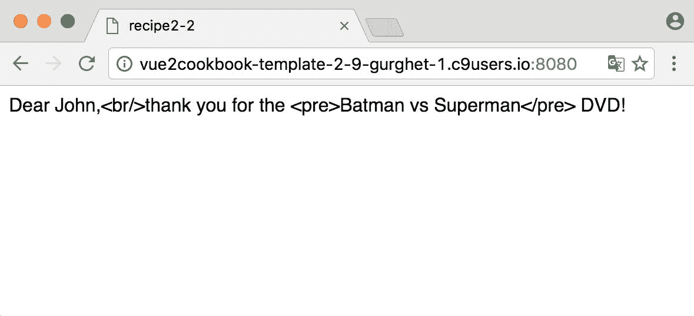

这不是你要寻找的；你希望你的感谢信按照 HTML 标签的格式进行良好的排版。

你需要做的是使用`v-html`指令，如下所示：

```js
<div id="app" v-html="htmlTexts[0]"> 

</div>

```

这样，HTML 标签就不会被 Vue 转义，并且会在我们的组件中按原样解释：

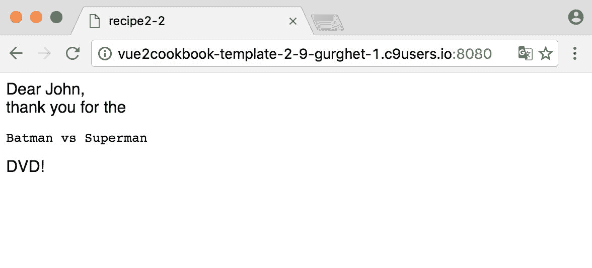

# 工作原理是这样的...

一般情况下，输出原始 HTML 是非常危险的。解释网站安全性超出了本书的范围，但只是为了让你有一个想法，想象一下你的网站上有一个评论部分，有人在评论中放置了一个``标签。如果你将其解释为 HTML 并展示给其他用户，你可能会让你的用户下载一个他们并不一定想要的图片；如果这个图片不属于你，你可能会因此被收取你没有计划的带宽费用。现在你可以扩展这个理由。如果一个用户在评论中放置了一个`<script>`标签，这将带来更大的风险，因为脚本可以做几乎任何事情。

默认情况下，Vue 通过不让你默认输出 HTML 来避免这个问题；这就是为什么我们需要特殊的`v-html`指令来查看它。也就是说，始终确保你对输出内容有完全控制。

# 还有更多...

还有另一种输出原始 HTML 的方法；这种方法更加先进，但更加清晰和可维护，尤其是对于那些严重依赖 HTML 格式化的组件来说。

在这些更加矫揉造作的情况下，你可以选择使用详细介绍在第九章的*创建一个函数式组件*配方中涵盖的**函数式组件**，但这里你将找到一个扩展了我们刚才所做的示例。

你应该写的 HTML 如下所示：

```js
<div id="app"> 

  <thanks gift="Batman" decoration="strong"></thanks> 

</div>

```

你已经可以看到意图很明确：使用 HTML `<strong>`作为装饰来写一封关于蝙蝠侠礼物的感谢信。创建`<thanks>`组件的 JavaScript 代码如下所示：

```js
Vue.component('thanks', { 

    functional: true, 

  render: function (createElement, context) { 

    let decoratedGift = 

      createElement(context.props.decoration, context.props.gift) 

    return createElement('p', ['Dear John, thanks for ', decoratedGift]) 

  }, 

  props: { 

    gift: String, 

    decoration: String 

  } 

})

```

当然，你还需要 Vue 实例。

# 创建一个带有复选框的表单

在当今的 Web 应用中，询问用户的输入是基本的。向用户展示多个选择使界面更有趣，对于结构化输入是必要的。

在这个教程中，你将学习如何通过构建确认页面来创建复选框，用于你自己的打印店！

# 准备工作

我们已经了解了 Vue 中的数据绑定是如何工作的，所以你可以开始操作了。否则，请返回第一个教程，收集 200 积分，然后继续阅读第一章中的*响应点击和按键事件*教程，以了解更多关于`v-model`指令的内容。

# 操作步骤

假设你需要为你的火星打印店设置三个不同的打印机：

+   - 单色打印机

+   - 等离子彩色打印机

+   - 3D DNA 克隆打印机

确认页面基本上只是一个表单：

```js
<div id="app"> 

  <form> 

    <!-- list of printers go here --> 

  </form> 

</div>

```

我们将使用`v-model`而不是名称来将我们的模型绑定到视图上：

```js
<label> 

  <input type="checkbox" v-model="outputPrinter" value="monochrome"/> 

  Monochrome 

</label>

```

每个具有相同`v-model`的`<input>`复选框都将参与一个反应性数组，在实时更新中插入和删除数组中的项。让我们在 Vue 实例中声明这个数组：

```js
new Vue({ 

    el:'#app', 

  data:{ 

    outputPrinter: [] 

  } 

})

```

这只是一个普通的数组。所有选中的打印机将自动插入和从数组中移除。以下是完整的 HTML 代码：

```js
<div id="app"> 

  <form> 

    <fieldset> 

      <legend>What printers you want to use?</legend> 

      <label> 

        <input type="checkbox" v-model="outputPrinter" value="monochrome"/> 

        Monochrome</label><br> 

      <label> 

        <input type="checkbox" v-model="outputPrinter" value="plasma"/> 

        Plasma Color</label><br> 

      <label> 

        <input type="checkbox" v-model="outputPrinter" value="cloner"/> 

        3D DNA Cloner</label><br> 

      <input type="submit" value="Print now"/> 

    </fieldset> 

  </form> 

</div>

```

这将生成一个类似下面的表单：

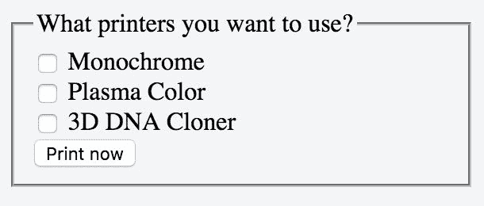

在你的应用程序的任何地方的`<div>`标签内放置`{{ outputPrinter }}`，并通过选择打印机来实时查看数组的变化。

# 工作原理...

如果你选中第一个和最后一个打印机，数组将如下所示：

```js
outputPrinter: ['monochrome', 'cloner']

```

然后，你可以使用这个数组将其通过 AJAX 发送到一个 Web 服务或进一步进行其他操作。

在 Vue 中，复选框只是普通的`<input>`元素，唯一的区别是我们实际上不需要在传统表单中使用的 name 属性。这是因为我们将不需要第二个页面来提交我们的值（通常使用 name 属性读取值的页面）。

# 更多内容...

要进入我所说的“第二个页面”，只需点击提交按钮。这是默认行为，在我们的情况下并不是我们想要的；因为我们通常不喜欢在处理 Vue 时需要改变页面，我将向你展示如何阻止默认行为。

现代网站倾向于在同一页上为你的操作提供反馈，有时甚至不会中断你的工作流程（如果你想在同一会话中克隆另外五个或六个实体怎么办？）

让我们将其变得更加有用。首先，我们必须阻止按钮的默认操作，即改变页面；为此，我们使用 prevent 修饰符：

```js
<input type="submit" value="Print now" @click.prevent="printHandler"/>

```

`printHandler`将是我们 Vue 实例中的一个方法，它将为我们提供一些反馈。您可以自由地添加处理程序，例如一个弹出窗口告诉您打印正在进行中；也许您可以返回主页。

在这个示例中，我们将使用警报弹出窗口来检查按钮是否正常工作：

```js
methods: { 

  printHandler () { 

    let printers = this.outputPrinter 

    alert('Printing with: ' + 

      (printers.length ? printers.join(', ') : 'none') + '.') 

  } 

}

```

# 创建一个带单选按钮的表单

单选按钮让您在多个选项中选择一个选项。当用户选择一个单选按钮时，任何先前选择的单选按钮将被取消选择。其常见用途是在创建注册表单时选择男性或女性。

# 准备工作

这个案例类似于“创建一个带复选框的表单”案例，因为我们使用了类似的技术。我建议你完成这两个案例，以成为 Vue 表单黑带。

# 操作步骤…

首先，我们需要一些可选择的内容，所以我们在 Vue 实例中编写一个数组：

```js
new Vue({ 

  el: '#app', 

  data: { 

    genders: ['male', 'female', 'alien'], 

    gender: undefined 

  } 

})

```

我们将使用变量 gender（单数）来保存所选选项的值。从这里开始，我们可以通过几行代码来设置一个表单：

```js
<div id="app"> 

  <form> 

    <fieldset> 

      <legend>Choose your gender</legend> 

      <label> 

        <input type="radio" v-model="gender" value="male"/> 

          Male 

      </label><br> 

      <label> 

        <input type="radio" v-model="gender" value="female"/> 

          Female 

      </label> <br>

      <label> 

        <input type="radio" v-model="gender" value="alien"/> 

          Alien 

      </label> 

    </fieldset> 

  </form> 

</div>

```

您可以运行应用程序，它将工作；但是，您需要在 form 后面添加一个胡子括号，以查看发生了什么：

```js
<div> 

  Choosen gender: '{{ gender }}' 

</div>

```

这样，您可以看到单选按钮的点击如何影响内部数据：

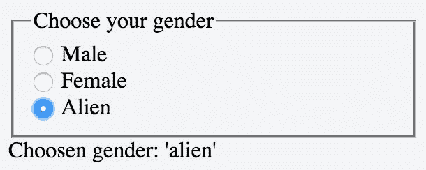

# 工作原理…

这里我们只插入了三个单选按钮。由于它们都有`v-model =“gender”`，它们在逻辑上属于同一组。这意味着在任何给定的时间只能选择一个值。我们可以在同一个表单中有任意多个组。

# 进一步了解...

在这个案例中，单选按钮的值完全是固定的：

```js
<input type="radio" v-model="gender" value="male"/>

```

我们可以修改`value =“male”`，使用`v-bind：value`使其动态响应。这会将值绑定到我们传递给它的任何变量。例如，假设我们的模型中有一个性别数组：

```js
genders: ['male', 'female']

```

我们可以像这样重写前面的单选按钮：

```js
<input type="radio" v-model="gender"**:value="genders[1]"**

/>

```

在这里，`:value`是`v-bind：value`的简写形式。

为了将我们学到的知识付诸实践，让我们构建一个简单的游戏。

假设您是一位农民，您的农场一开始没有动物。每天，动物市场上都有新的动物出售。您一次只能买一只。我们可以使用单选按钮来表示这个选择！

所以我们在我们的模型中有一个动物数组，一个包含我们每天选择的动物的变量，以及一个表示我们养殖场的农场数组（最初为空）。我们使用`i`变量添加了一点随机性，以保存表示当天可用动物的随机数：

```js
data:{ 

  animals: ['

', '

', '

'], 

  animal: undefined, 

  farm: [], 

  i: 0 

}

```

我使用表情符号来表示动物，因为它们非常有趣。如果你不知道在哪里找到它们，只需从[`emojipedia.org/`](http://emojipedia.org/)复制并粘贴它们，然后搜索动物。

我们可以从最初使用的相同 HTML 开始；我们只需要改变图例：

```js
<legend>Today's animals</legend>

```

此时，我们应该添加一个动物列表供选择，但我们希望它是动态的，也就是说，每天都有不同的动物对：

```js
<label> 

  <input type="radio" v-model="animal" :value="animals[i]"/> 

  {{animals[i]}} 

</label><br> 

<label> 

  <input type="radio" v-model="animal" :value="animals[i+1]"/> 

  {{animals[i+1]}} 

</label><br>

```

这意味着随着`i`变量的改变，单选按钮的值（和标签）将会改变。

唯一剩下的就是一种购买动物、将其添加到农场并等待下一天的方法。我们将在提交按钮中总结所有这些：

```js
<input type="submit" value="Add to Farm" @click.prevent="addToFarm"/>

```

在这里，`addToFarm`方法由以下内容定义：

```js
addToFarm () { 

    if (this.animal === undefined) { return } 

    this.farm.push(this.animal) 

    this.i = Math.floor(Math.random() * (this.animals.length - 1)) 

  this.animal = undefined 

}

```

如果没有选择动物，则不执行任何操作；否则，将动物添加到农场，为下一天生成一个随机数，并重置选择。要查看你的农场，请将以下内容添加到你的 HTML 中：

```js
<div> 

  Your farm is composed by {{ farm.join(' ') }} 

</div>

```

你的应用程序将如下所示：

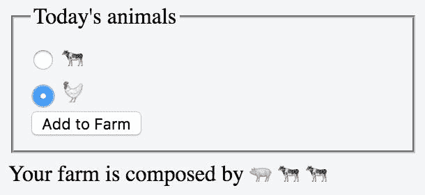

# 创建一个带有选择元素的表单

当单选按钮无法满足需求时，选择元素或“下拉列表”用于表单，无论是因为选择太多还是因为无论有多少选项，它们始终占据相同的空间。

# 准备工作

我建议您在深入研究选择元素之前先完成有关数据绑定或表单的教程。有关单选按钮的教程将使您熟悉单选按钮，其功能类似于选择元素。

# 如何操作...

在本教程中，我们将创建一个简单的国家选择器。我将首先在没有 Vue 的帮助下编写选择器，只是为了复习 HTML。首先，创建一个`form`，在其中放置`select`元素：

```js
<form> 

  <fieldset> 

    <legend>Choose your country</legend> 

      <!-- here goes the select element --> 

  </fieldset> 

</form>

```

在`fieldset`中，编写`select`元素的代码：

```js
<select> 

  <option>Japan</option> 

  <option>India</option> 

  <option>Canada</option> 

</select>

```

运行应用程序。从一开始就有一个可工作的选择元素。结构非常简单。每个`<option>`将增加可选择的事物列表。

目前，对于这个元素来说，还没有太多可以做的。让我们将选择的国家与 Vue 绑定到一个变量上。您需要编辑您的 HTML：

```js
<select v-model="choosenCountry">

```

现在，您需要将`choosenCountry`添加到您的模型中：

```js
new Vue({ 

    el:'#app', 

  data:{ 

    choosenCountry: undefined 

  } 

})

```

不要忘记用`<div id="app">`将表单包围起来，否则 Vue 将无法识别它。

现在运行应用程序，你会注意到，之前下拉菜单以日本为默认选择，现在它遵循了我们在代码中的初始化。

这意味着初始状态下没有选择任何国家。我们可以添加一个花括号来查看变量的当前状态：

```js
<div> 

  {{choosenCountry}} 

</div>

```

国家选择器将如下所示：

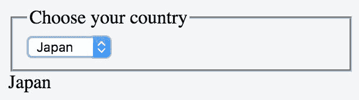

# 它是如何工作的...

当你使用`v-model`将`<select>`元素绑定时，所选选项将填充绑定的变量。

请注意，如果为选项设置了值，变量将使用该值，而不是标签中写的内容。例如，你可以这样写：

```js
<select> 

  <option value="1">Japan</option> 

  <option value="2">India</option> 

  <option value="7">Canada</option> 

</select>

```

这样可以确保每个国家都绑定到一个数值。

# 还有更多...

通常，国家和城市以层次结构的方式排列。这意味着我们需要两个或更多的下拉菜单来确定用户的出生地，例如。在本段中，我们将使用生物学的等价物来选择动物：

```js
clans: { 

  mammalia: { 

    'have fingers': { 

      human: 'human', 

      chimpanzee: 'chimpanzee' 

    }, 

    'fingerless': { 

      cat: 'cat', 

      bear: 'bear' 

    } 

  }, 

  birds: { 

    flying: { 

      eagle: 'eagle', 

      pidgeon: 'pidgeon' 

    }, 

    'non flying': { 

      chicken: 'chicken' 

    } 

  } 

}

```

我们将把顶层称为`clan`，第二层称为`type`，最后一层将是一个动物。我知道这是一种非正统的分类动物的方式，但对于这个例子来说，它是有效的。

让我们为 Vue 模型添加两个保存状态的变量：

```js
clan: undefined, 

type: undefined

```

现在我们可以添加第一个`select`元素：

```js
<select v-model="clan"> 

  <option v-for="(types, clan) in clans">{{clan}}</option> 

</select>

```

这将创建一个下拉菜单，其中包含以下内容：

+   哺乳动物

+   鸟类

在这种特殊情况下，变量`types`实际上没有起作用。

我们希望用特定`clan`的`type`填充第二个下拉菜单：

```js
<select v-model="type"> 

  <option v-for="(species, type) in clans[clan]">{{type}}</option> 

</select>

```

当变量`clan`有值时，这个选择元素将让你选择动物的类型。请注意，尽管我们为物种添加了第三个选择：

```js
<select> 

  <option v-for="(animals, species) in clans[clan][type]">{{species}}</option> 

</select>

```

它会导致我们的程序出错，因为`clans[clan]`是未定义的，Vue 将尝试对其进行求值。为了纠正这个问题，我们可能希望只有在第一个和第二个选择有值时才显示第三个选择元素。为此，我们可以使用`v-show`指令，但问题是 Vue 会渲染带有`v-show`的元素，只有在渲染之后才会隐藏它们。这意味着错误仍然会被抛出。

正确的方法是使用`v-if`，如果内部条件不满足，则阻止元素的渲染，如下所示：

```js
<select v-if="clans[clan]"> 

  <option v-for="(animals, species) in clans[clan][type]">{{species}}</option> 

</select>

```

现在，继续选择你最喜欢的动物层次结构吧！
