# 第四章：Vue 与互联网通信

本章将涵盖以下内容：

+   使用 Axios 发送基本的 AJAX 请求

+   在发送数据之前验证用户数据

+   创建表单并将数据发送到服务器

+   在请求过程中处理错误

+   创建 REST 客户端（和服务器！）

+   实现无限滚动

+   在发送请求之前处理请求

+   防止 XSS 攻击您的应用程序

# 介绍

Web 应用程序很少能够独立工作。使它们有趣的实际上是它们能够以前几年不存在的创新方式与世界进行通信。

Vue 本身并不包含任何机制或库来进行 AJAX 请求或打开 Web 套接字。因此，在本章中，我们将探讨 Vue 如何与内置机制和外部库交互以连接到外部服务。

您将首先使用外部库进行基本的 AJAX 请求。然后，您将探索一些在表单中发送和获取数据的常见模式。最后，有一些适用于实际应用程序的示例以及如何构建 RESTful 客户端的方法。

# 使用 Axios 发送基本的 AJAX 请求

**Axios**是 Vue 推荐的用于进行 HTTP 请求的库。它是一个非常简单的库，但它具有一些内置功能，可以帮助您执行常见操作。它实现了使用 HTTP 动词进行请求的 REST 模式，并且还可以在函数调用中处理并发（同时生成多个请求）。您可以在[`github.com/mzabriskie/axios`](https://github.com/mzabriskie/axios)上找到更多信息。

# 准备工作

对于这个示例，您不需要对 Vue 有任何特殊的了解。我们将使用 Axios，它本身使用**JavaScript promises**。如果您从未听说过 promises，您可以在[`developers.google.com/web/fundamentals/getting-started/primers/promises`](https://developers.google.com/web/fundamentals/getting-started/primers/promises)上了解一些基础知识。

# 操作步骤

您将构建一个简单的应用程序，每次访问网页时都会给您一条智慧的建议。

您首先需要在应用程序中安装 Axios。如果您使用 npm，只需执行以下命令：

```js
    npm install axios

```

如果您正在使用单页应用程序，可以从 CDN 导入以下文件，位于[`unpkg.com/axios/dist/axios.js`](https://unpkg.com/axios/dist/axios.js)。

很不幸，我们将使用的建议单服务无法与 JSFiddle 一起使用，因为该服务运行在 HTTP 上，而 JSFiddle 运行在 HTTPS 上，您的浏览器很可能会出现错误。您可以在本地 HTML 文件上运行此示例。

我们的 HTML 如下所示：

```js
<div id="app"> 

  <h2>Advice of the day</h2> 

  <p>{{advice}}</p> 

</div>

```

我们的 Vue 实例如下所示：

```js
new Vue({ 

  el: '#app', 

  data: { 

    advice: 'loading...' 

  }, 

  created () { 

    axios.get('http://api.adviceslip.com/advice') 

      .then(response => { 

        this.advice = response.data.slip.advice 

      }) 

      .catch(error => { 

        this.advice = 'There was an error: ' + error.message 

      }) 

  } 

})

```

打开您的应用程序，获取一条令人耳目一新的建议：

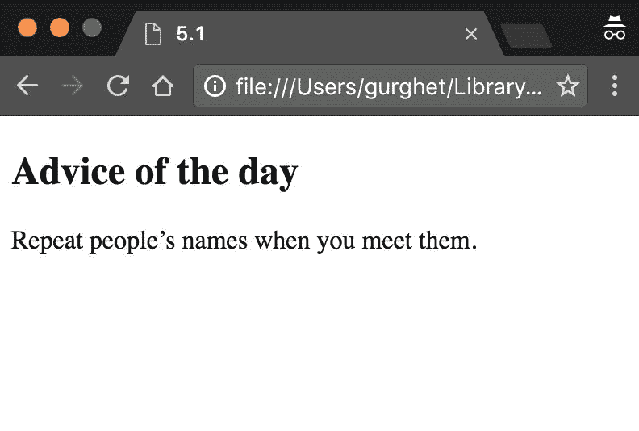

# 工作原理...

当我们的应用程序启动时，将调用 created 钩子并运行带有 Axios 的代码。第一行执行一个 GET 请求到 API 端点：

```js
axios.get('http://api.adviceslip.com/advice')

```

这将返回一个 promise。我们可以在任何 promise 上使用`then`方法来处理 promise 成功解析的结果：

```js
.then(response => { 

  this.advice = response.data.slip.advice 

})

```

响应对象将包含有关我们请求结果的一些数据。可能的响应对象如下所示：

```js
{ 

  "data": { 

    "slip": { 

      "advice": "Repeat people's name when you meet them.", 

      "slip_id": "132" 

    } 

  }, 

  "status": 200, 

  "statusText": "OK", 

  "headers": { 

    "content-type": "text/html; charset=UTF-8", 

    "cache-control": "max-age=0, no-cache" 

  }, 

  "config": { 

    "transformRequest": {}, 

    "transformResponse": {}, 

    "timeout": 0, 

    "xsrfCookieName": "XSRF-TOKEN", 

    "xsrfHeaderName": "X-XSRF-TOKEN", 

    "maxContentLength": -1, 

    "headers": { 

      "Accept": "application/json, text/plain, */*" 

    }, 

    "method": "get", 

    "url": "http://api.adviceslip.com/advice" 

  }, 

  "request": {} 

}

```

我们导航到我们想要交互的属性；在我们的例子中，我们想要`response.data.slip.advice`，这是一个字符串。我们将字符串复制到实例状态中的变量 advice 中。

最后一部分是当我们的请求或第一个分支中的代码出现问题时：

```js
.catch(error => { 

  this.advice = 'There was an error: ' + error.message 

})

```

我们将在“恢复请求期间的错误”中更深入地探讨错误处理。现在，让我们手动触发一个错误，只是为了看看会发生什么。

触发错误的最便宜的方法是在 JSFiddle 上运行应用程序。由于浏览器检测到 JSFiddle 处于安全连接状态，而我们的 API 处于 HTTP 上（不安全），现代浏览器将会报错并阻止连接。您应该会看到以下文本：

```js
There was an error: Network Error

```

这只是您可以尝试的许多可能错误之一。请注意，您可以将 GET 端点编辑为某个不存在的页面：

```js
axios.get('http://api.adviceslip.com/non-existent-page')

```

在这种情况下，您将收到 404 错误：

```js
There was an error: Request failed with status code 404

```

有趣的是，即使请求成功进行，但第一个分支中存在错误，您也将进入错误分支。

将`then`分支更改为以下内容：

```js
.then(response => { 

  this.advice = undefined.hello 

})

```

众所周知，JavaScript 无法读取未定义对象的“hello”属性：

```js
There was an error: Cannot read property 'hello' of undefined

```

就像我告诉过你的那样。

# 在发送用户数据之前验证用户数据

一般来说，用户讨厌表单。虽然我们无法改变这一点，但我们可以通过提供有关如何填写表单的相关说明来减少用户的不便。在本示例中，我们将创建一个表单，并利用 HTML 标准为用户提供如何填写表单的良好指导。

# 准备工作

这个食谱不需要先前的知识就可以完成。虽然我们将构建一个表单（*使用 Axios 发送基本的 AJAX 请求*食谱），但我们将伪造 AJAX 调用并集中在验证上。

# 操作步骤如下：

我们将构建一个非常简单的表单：一个用于用户名的字段，一个用于用户电子邮件的字段，以及一个提交信息的按钮。

在 HTML 中输入以下内容：

```js
<div id="app"> 

  <form @submit.prevent="vueSubmit"> 

    <div> 

      <label>Name</label> 

      <input type="text" required> 

    </div> 

    <div> 

      <label>Email</label> 

      <input type="email" required> 

    </div> 

    <div> 

      <label>Submit</label> 

      <button type="submit">Submit</button> 

    </div> 

  </form> 

</div>

```

Vue 实例非常简单，如下所示：

```js
new Vue({ 

  el: '#app', 

  methods: { 

    vueSubmit() { 

      console.info('fake AJAX request') 

    } 

  } 

})

```

运行此应用程序，并尝试使用空字段或错误的电子邮件提交表单。您应该会看到浏览器本身提供的帮助：

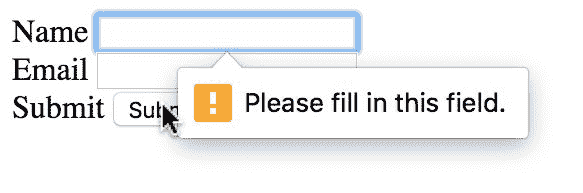

然后，如果您尝试输入无效的电子邮件地址，您将看到以下内容：

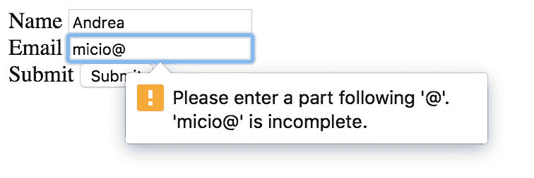

# 工作原理如下：

我们使用了原生的 HTML5 验证 API，该 API 在内部使用模式匹配来检查我们输入的内容是否符合某些规则。

考虑以下行中的 required 属性：

```js
<input type="text" required>

```

这确保当我们提交表单时，字段实际上是填充的，而在其他输入元素中具有`type="email"`确保内容类似于电子邮件格式。

此 API 非常丰富，您可以在[`developer.mozilla.org/en-US/docs/Web/Guide/HTML/Forms/Data_form_validation`](https://developer.mozilla.org/en-US/docs/Web/Guide/HTML/Forms/Data_form_validation)上阅读更多信息。

很多时候，问题在于要利用此 API，我们需要触发本机验证机制。这意味着我们不允许阻止提交按钮的默认行为：

```js
<button type="submit" @click.prevent="vueSubmit">Submit</button>

```

这不会触发本机验证，表单将始终被提交。另一方面，如果我们执行以下操作：

```js
<button type="submit" @click="vueSubmit">Submit</button>

```

表单将得到验证，但由于我们没有阻止提交按钮的默认行为，表单将被发送到另一个页面，这将破坏单页应用程序的体验。

诀窍是在表单级别拦截提交：

```js
<form @submit.prevent="vueSubmit">

```

这样，我们就可以拥有表单的本机验证和我们真正喜欢的现代浏览体验。

# 创建一个表单并将数据发送到服务器

HTML 表单是与用户交互的标准方式。您可以收集他们的数据以在网站中注册，让他们登录，甚至进行更高级的交互。在这个食谱中，您将使用 Vue 构建您的第一个表单。

# 准备工作

这个食谱非常简单，但它假设您已经了解 AJAX，并且希望将您的知识应用于 Vue。

# 操作步骤如下：

假设我们有一个博客，我们想要写一篇新文章。为此，我们需要一个表单。以下是您布局 HTML 的方式：

```js
<div id="app"> 

  <h3>Write a new post</h3> 

  <form> 

    <div> 

      <label>Title of your post:</label> 

      <input type="text" v-model="title"> 

    </div> 

    <div> 

      <label>Write your thoughts for the day</label> 

      <textarea v-model="body"></textarea> 

    </div> 

    <div> 

      <button @click.prevent="submit">Submit</button> 

    </div> 

  </form> 

</div>

```

我们有一个用于标题的框，一个用于新帖子正文的框，以及一个发送帖子的按钮。

在我们的 Vue 实例中，这三个东西以及用户 ID 将成为应用程序状态的一部分：

```js
new Vue({ 

  el: '#app', 

  data: { 

    userId: 1, 

    title: '', 

    body: '' 

  } 

})

```

此时，我们只需要添加一个方法，当我们点击提交按钮时将数据发送到服务器。由于我们没有服务器，我们将使用一个非常有用的**Typicode**服务。它基本上是一个虚假的 REST 服务器。我们将发送一个请求，服务器将以逼真的方式响应，即使实际上什么都不会发生。

这是我们的方法：

```js
methods: { 

  submit () { 

    const xhr = new XMLHttpRequest() 

    xhr.open('post', 'https://jsonplaceholder.typicode.com/posts') 

    xhr.setRequestHeader('Content-Type',  

                         'application/json;charset=UTF-8') 

    xhr.onreadystatechange = () => { 

    const DONE = 4 

    const CREATED = 201 

    if (xhr.readyState === DONE) { 

      if (xhr.status === CREATED) { 

          this.response = xhr.response 

        } else { 

          this.response = 'Error: ' + xhr.status 

        } 

      } 

    } 

    xhr.send(JSON.stringify({ 

      title: this.title, 

      body: this.body, 

      userId: this.userId 

    })) 

  } 

}

```

为了查看服务器的实际响应，我们将将响应变量添加到我们的状态中：

```js
data: { 

  userId: 1, 

  title: '', 

  body: '', 

 response: '...'

}

```

在我们的 HTML 表单之后，添加以下内容：

```js
<h3>Response from the server</h3> 

<pre>{{response}}</pre>

```

当您启动页面时，您应该能够与服务器进行交互。当您写一篇帖子时，服务器将回显该帖子并回答帖子 ID：

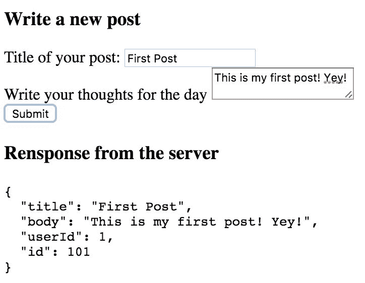

# 它是如何工作的...

大部分魔法发生在`submit`方法中。在第一行中，我们创建了一个`XMLHttpRequest`对象，这是一种用于进行 AJAX 请求的本机 JavaScript 机制：

```js
const xhr = new XMLHttpRequest()

```

然后，我们使用`open`和`setRequestHeader`方法配置一个新的连接；我们想要发送一个 POST 请求，并且我们将随之发送一些 JSON：

```js
xhr.open('post', 'http://jsonplaceholder.typicode.com/posts') 

xhr.setRequestHeader('Content-Type', 'application/json;charset=UTF-8')

```

由于我们正在与 RESTful 接口交互，POST 方法意味着我们期望我们的请求修改服务器上的数据（特别是创建一个新的帖子），并且多次发出相同的请求将每次获得不同的结果（即我们将创建一个新的、不同的帖子 ID）。

这与更常见的 GET 请求不同，GET 请求不会修改服务器上的数据（除了日志之外），并且始终会产生相同的结果（前提是服务器上的数据在请求之间不会更改）。

有关 REST 的更多详细信息，请参阅*创建 REST 客户端（和服务器！）*配方。

以下行都与响应有关：

```js
xhr.onreadystatechange = () => { 

  const DONE = 4 

  const CREATED = 201 

  if (xhr.readyState === DONE) { 

    if (xhr.status === CREATED) { 

      this.response = xhr.response 

    } else { 

      this.response = 'Error: ' + xhr.status 

    } 

  } 

}

```

这将在我们的对象中安装一个处理程序，每当我们的对象发生某种变化时。如果`readyState`更改为`DONE`，这意味着我们从服务器获得了响应。接下来，我们检查状态码，它应该是`201`，以表示已创建新资源（我们的新帖子）。如果是这样，我们设置我们放在花括号中的变量以获得快速反馈。否则，我们将接收到的错误消息放入同一变量中。

在设置事件处理程序之后，我们需要做的最后一件事是实际发送请求以及我们的新帖子的数据：

```js
xhr.send(JSON.stringify({ 

  title: this.title, 

  body: this.body, 

  userId: this.userId 

}))

```

# 还有更多...

另一种解决相同问题的方法是使用 Axios 发送 AJAX 请求。如果你需要了解 Axios 是什么，请查看“使用 Axios 发送基本的 AJAX 请求”这个教程。

`submit`方法的代码将变为以下内容（记得将 Axios 添加为依赖项）：

```js
submit () { 

  axios.post('http://jsonplaceholder.typicode.com/posts', { 

    title: this.title, 

    body: this.body, 

    userId: this.userId 

  }).then(response => { 

    this.response = JSON.stringify(response,null,'  ') 

  }).catch(error => { 

    this.response = 'Error: ' + error.response.status 

  }) 

}

```

这段代码与使用原生浏览器对象完全等效，但比原生浏览器对象更具表达力和简洁性。

# 在请求过程中处理错误

从计算机的角度来看，对外部服务的请求需要很长时间。从人类的角度来看，就像是将卫星发送到木星并等待其返回地球。你无法百分之百确定旅行是否会完成，以及旅行实际需要多长时间。网络经常不稳定，最好做好准备，以防我们的请求无法成功完成。

# 准备工作

这个教程有点复杂，但不涉及高级概念。然而，你应该熟悉使用 Vue。

我们将在这个教程中使用 Axios。如果你不确定它具体是什么，请完成“使用 Axios 发送基本的 AJAX 请求”这个教程。

# 如何实现...

你将为在珠穆朗玛峰上订购披萨的网站构建一个网站。该地区的互联网连接非常差，因此在放弃订购披萨之前，我们可能希望重试几次。

这是我们的 HTML 代码：

```js
<div id="app"> 

  <h3>Everest pizza delivery</h3> 

  <button @click="order"  

          :disabled="inProgress">Order pizza!</button> 

  <span class="spinner" v-show="inProgress">

</span> 

  <h4>Pizza wanted</h4> 

  <p>{{requests}}</p> 

  <h4>Pizzas ordered</h4> 

  <span v-for="pizza in responses"> 

    {{pizza.id}}:{{pizza.req}} 

  </span> 

</div>

```

我们有一个按钮用于下订单，在订单进行中时将被禁用 - 一个进行中的订单列表（目前只包含一个订单）和一个已经订购的披萨列表。

我们可以添加一个旋转的小披萨来使等待更加愉快。添加以下 CSS 代码使小披萨旋转：

```js
@keyframes spin { 

  100% {transform:rotate(360deg);} 

} 

.spinner { 

  width: 1em; 

  height: 1em; 

  padding-bottom: 12px; 

  display: inline-block; 

  animation: spin 2s linear infinite; 

}

```

我们的 Vue 实例将跟踪一些事物；编写以下代码来开始构建实例：

```js
new Vue({ 

  el: '#app', 

  data: { 

    inProgress: false, 

    requests: new Object(null), 

    responses: new Object(null), 

    counter: 0, 

    impatientAxios: undefined 

  } 

})

```

我想使用 JavaScript 的 set 来处理请求和响应；不幸的是，在 Vue 中，set 不是响应式的；我们可以使用最接近的对象，目前为空对象，即我们将请求和响应初始化为空对象。

`impatientAxios`变量将在创建时填充。通常，Axios 会等待浏览器等待响应的时间。由于我们不耐烦，我们将创建一个 Axios，在 3 秒后断开连接：

```js
created () { 

  this.impatientAxios = axios.create({ 

    timeout: 3000  

  }) 

}

```

我们需要构建的最后一件事是 order 方法。由于我们没有一个 Web 服务器来进行实际的请求，我们将使用`http://httpstat.us/200`端点，该端点对我们的所有请求都简单地回答 200 OK。

```js
methods: { 

  order (event, oldRequest) { 

    let request = undefined 

    if (oldRequest) { 

      request = oldRequest 

    } else { 

      request = { req: '

', id: this.counter++} 

   } 

   this.inProgress = true 

   this.requests[request.id] = request 

   this.impatientAxios.get('http://httpstat.us/200') 

    .then(response => { 

      this.inProgress = false 

      this.responses[request.id] = this.requests[request.id] 

      delete this.requests[request.id] 

    }) 

    .catch(e => { 

      this.inProgress = false 

      console.error(e.message) 

      console.error(this.requests.s) 

      setTimeout(this.order(event, request), 1000) 

    }) 

}

```

为了按照预期运行此程序，请在 Chrome 中打开它，并使用*Cmd* + *Opt* + *I*（在 Windows 上为*F12*）打开开发者工具：

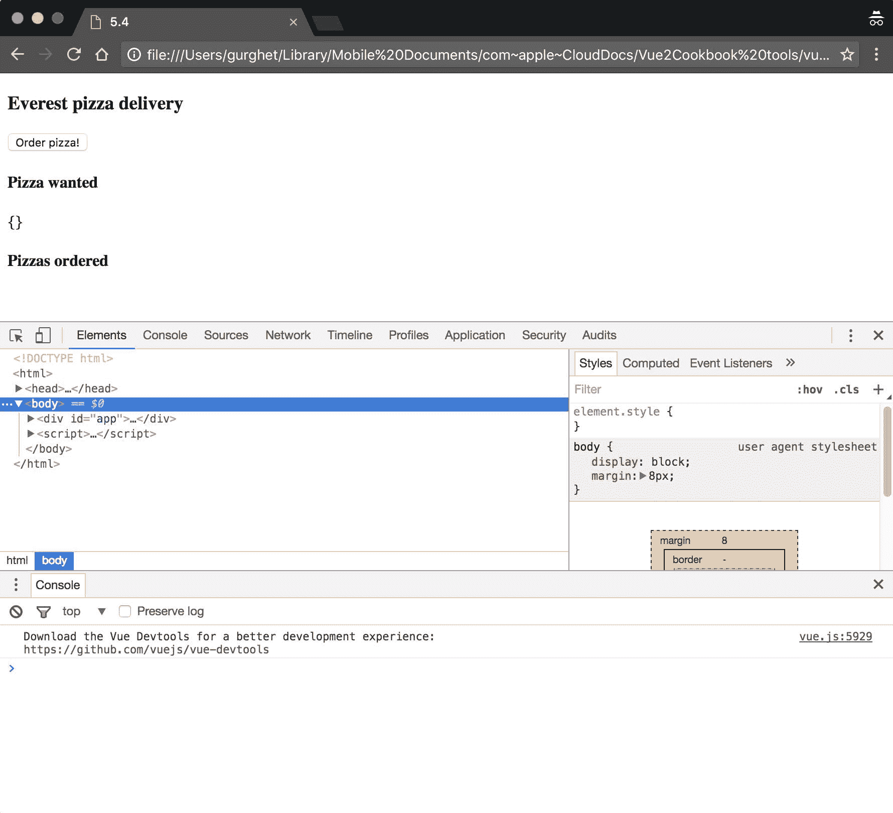

切换到 Network 选项卡，打开下拉菜单，您会看到 No Throttling：

**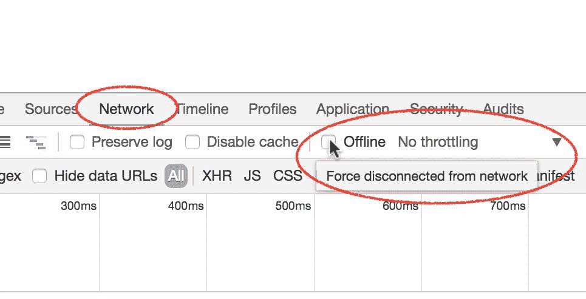**

点击它以显示下拉菜单：

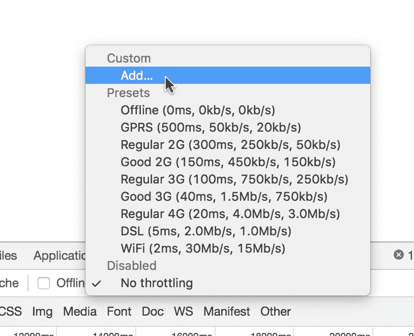

添加一个名为`Everest`的新自定义限速，下载和上传速度为`1kb/s`，延迟为`1,000`毫秒，如下图所示：

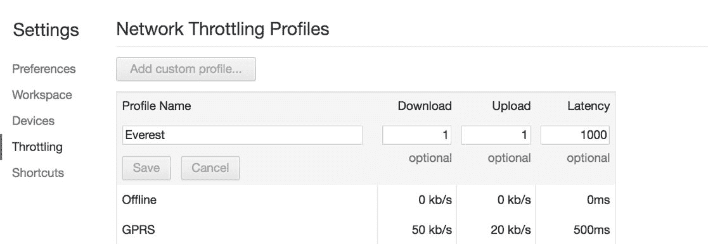

然后，您可以选择该类型的限速并尝试订购一些比萨。如果幸运的话，由于 Axios 的持久性，您最终应该能够订购一些比萨。

如果您没有成功或者所有的比萨都被正确订购，请尝试调整参数；这个过程的很大一部分实际上是随机的，并且高度依赖于机器。

# 工作原理...

处理不稳定连接的方法有很多，有许多库与 Axios 集成，并具有更高级的重试和重新尝试策略。在这里，我们只看到了一种基本策略，但是像**Patience JS**这样的库有更高级的策略，并且它们并不难使用。

# 创建一个 REST 客户端（和服务器！）

在这个示例中，我们将学习有关 REST 以及如何构建 REST 客户端。要构建一个 REST 客户端，我们需要一个公开 REST 接口的服务器；我们也将构建它。等一下！在一本关于 Vue 的书的示例中，整个 REST 服务器只是一个附注？跟着做，您不会失望的。

# 准备工作

从某种意义上说，这个示例相当高级，因为您需要熟悉客户端和服务器的架构，并且至少听说过或阅读过 REST 接口。您还需要熟悉命令行并安装 npm。您可以在*选择开发环境*示例中了解更多信息。

还需要安装 Axios；在本章的第一个示例中可以了解更多信息。

# 如何操作...

我记得几年前，构建一个 REST 服务器可能需要几天甚至几周的时间。您可以使用`Feather.js`，它将快速且（希望是）无痛。打开命令行并使用以下命令通过 npm 安装它：

```js
    npm install -g feathers-cli

```

安装完成后，创建一个目录，在其中运行服务器，进入该目录，并启动 Feathers：

```js
    mkdir my-server

    cd my-server

    feathers generate app

```

回答所有问题时使用默认值。当进程完成时，输入以下命令创建一个新的资源：

```js
 feathers generate service

```

其中一个问题是资源的名称；将其称为`messages`，但除此之外，其他问题都使用默认值。

使用`exit`命令退出 feathers-cli，并使用以下命令启动新的服务器：

```js
    npm start

```

几秒钟后，您的 REST 服务器应该已经启动，并且应该在端口`3030`上监听。你能诚实地说这很困难吗？

上述命令序列适用于 Feathers 版本 2.0.0。

您可能正在使用其他版本，但使用较新版本仍然可以轻松获得相同的结果；请查看在线安装指南[`feathersjs.com/`](https://feathersjs.com/)。

接下来，您将构建一个与服务器无缝通信的 Vue 应用程序。现在，由于服务器通过 HTTP 在本地环境中运行，您将无法使用 JSFiddle，因为它只支持 HTTPS，并且认为 HTTP 是不安全的。您可以使用之前描述的其他方法，或者使用 HTTP 上的服务，例如[codepen.io](http://codepen.io)或其他服务。

您将编写一个管理粘性消息的应用程序。我们希望能够查看、添加、编辑和删除它们。

在 HTML 中键入以下内容：

```js
<div id="app"> 

  <h3>Sticky messages</h3> 

  <ol> 

    <li v-for="message in messages"> 

      <button @click="deleteItem(message._id)">Delete</button> 

      <button @click="edit(message._id, message.text)"> 

        edit 

      </button> 

      <input v-model="message.text"> 

    </li> 

  </ol> 

  <input v-model="toAdd"> 

  <button @click="add">add</button> 

</div>

```

我们的 Vue 实例状态将包含一个记录消息的列表，以及要添加到列表中的临时消息：

```js
new Vue({ 

  el: '#app', 

  data: { 

    messages: [], 

    toAdd: '' 

  }, 

})

```

我们想要做的第一件事是向服务器请求消息列表。编写用于此的 created 钩子：

```js
created () { 

  axios.get('http://localhost:3030/messages/') 

    .then(response => { 

      this.messages = response.data.data 

    }) 

},

```

为了创建新消息，编写一个方法，该方法绑定到添加按钮的点击事件，并将输入框中的内容发送到服务器：

```js
methods: { 

  add () { 

    axios.post('http://localhost:3030/messages/', { 

      text: this.toAdd 

    }) 

      .then(response => { 

        if (response.status === 201) { 

          this.messages.push(response.data) 

          this.toAdd = '' 

        } 

      }) 

  } 

}

```

类似地，编写一个用于删除消息和编辑消息的方法：

```js
deleteItem (id) { 

  console.log('delete') 

  axios.delete('http://localhost:3030/messages/' + id) 

    .then(response => { 

      if (response.status < 400) { 

        this.messages.splice( 

          this.messages.findIndex(e => e.id === id), 1) 

      } 

    }) 

}, 

edit (id, text) { 

  axios.put('http://localhost:3030/messages/' + id, { 

    text 

  }) 

    .then(response => { 

      if (response.status < 400) { 

        console.info(response.status) 

      } 

    }) 

}

```

启动应用程序，您将能够管理您的粘性消息板：

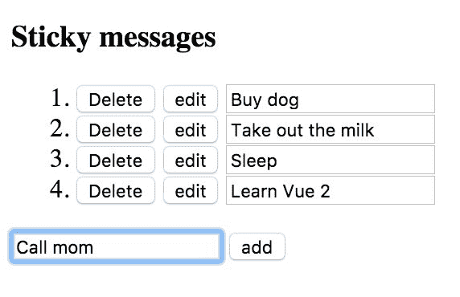

为了向自己证明您确实与服务器通信，您可以刷新页面或关闭并重新打开浏览器，您的笔记仍将存在。

# 工作原理...

**REST**表示**REpresentational State Transfer**，意思是您将传输某个资源状态的表示。在实践中，我们使用一组**动词**来传输我们消息状态的表示。

使用 HTTP 协议，我们可以使用以下动词：

| **动词** | **属性** | **描述** |
| --- | --- | --- |
| `GET` | 幂等，安全 | 用于检索资源的表示 |
| `POST` |  | 用于上传新资源 |
| `PUT` | 幂等 | 用于上传现有资源（修改它） |
| `DELETE` | 幂等 | 用于删除资源 |

幂等意味着如果我们使用相同的动词两次，资源不会发生任何变化，而安全则意味着根本不会发生任何变化。

在我们的应用程序中，我们只在创建过程中使用 GET 动词。当我们看到列表因其他操作而改变时，这只是因为我们在前端上镜像了服务器上的操作。

POST 动词用于向列表中添加新消息。请注意，即使在粘性消息中使用相同的文本，它也不是幂等的，因为当按下添加按钮时，我们仍然会创建一个与 ID 不同的新消息。

按下编辑按钮会触发 PUT，而删除按钮，嗯，你可以想象它使用 DELETE 动词。

Axios 通过使用动词本身命名其 API 的方法来使这一点非常清晰。

# 实现无限滚动

无限滚动是使用 Vue 和 AJAX 可以实现的一个很好的例子。它也非常流行，并且可以改善某些类型内容的交互。您将构建一个与无限滚动一起工作的随机单词生成器。

# 准备工作

我们将使用 Axios。查看“使用 Axios 发送基本 AJAX 请求”这个示例，了解如何安装它以及它的基本功能。除此之外，您不需要了解太多内容就可以跟随进行。

# 如何实现...

为了使我们的应用程序工作，我们将从[`www.setgetgo.com/randomword/get.php`](http://www.setgetgo.com/randomword/get.php)端点请求随机单词。每次将浏览器指向此地址时，您都会得到一个随机单词。

整个页面将仅由一个无限列表组成。编写以下 HTML：

```js
<div id="app"> 

  <p v-for="word in words">{{word}}</p> 

</div>

```

随着我们向下滚动，单词列表需要增长。因此我们需要两样东西：了解用户何时到达页面底部，以及获取新单词。

为了知道用户何时到达页面底部，我们在 Vue 实例中添加一个方法：

```js
new Vue({ 

  el: '#app', 

  methods: { 

    bottomVisible () { 

      const visibleHeight = document.documentElement.clientHeight 

      const pageHeight = document.documentElement.scrollHeight 

      const scrolled = window.scrollY 

      const reachedBottom = visibleHeight + scrolled >= pageHeight 

      return reachedBottom || pageHeight < visibleHeight 

    } 

  } 

})

```

如果页面滚动到底部或页面本身小于浏览器，则返回`true`。

接下来，我们需要添加一个机制，将此函数的结果绑定到状态变量`bottom`并在用户滚动页面时更新它。我们可以在`created`钩子中实现这一点：

```js
created () { 

  window.addEventListener('scroll', () => { 

    this.bottom = this.bottomVisible() 

  }) 

}

```

状态将由`bottom`变量和随机单词列表组成：

```js
data: { 

  bottom: false, 

  words: [] 

}

```

现在我们需要一个方法来将单词添加到数组中。将以下方法添加到现有方法中：

```js
addWord () { 

  axios.get('http://www.setgetgo.com/randomword/get.php') 

    .then(response => { 

      this.words.push(response.data) 

      if (this.bottomVisible()) { 

        this.addWord() 

      } 

    }) 

}

```

该方法将递归调用自身，直到页面有足够的单词填满整个浏览器视图。

由于这种方法需要在到达底部时调用，我们将观察底部变量，并在其为`true`时触发该方法。在 Vue 实例的`data`之后添加以下选项：

```js
watch: { 

  bottom (bottom) { 

    if (bottom) { 

      this.addWord() 

    } 

  } 

}

```

我们还需要在`created`钩子中调用`addWord`方法来启动页面：

```js
created () { 

  window.addEventListener('scroll', () => { 

    this.bottom = this.bottomVisible() 

  }) 

 this.addWord()

}

```

如果现在启动页面，您将获得一个无限流的随机单词，这在您需要创建新密码时非常有用！

# 工作原理...

在这个示例中，我们使用了一个名为`watch`的选项，它使用以下语法：

```js
watch: { 

 'name of sate variable' (newValue, oldValue) { 

   ... 

  } 

}

```

这是计算属性的对应物，当我们对一些响应式变量的更改后不感兴趣时使用。实际上，我们只是用它来触发另一个方法。如果我们对一些计算结果感兴趣，我们将使用计算属性。

# 在发送请求之前处理请求

本示例将教您如何使用拦截器在请求发送到互联网之前编辑请求。在某些情况下，这可能非常有用，例如当您需要在所有请求到服务器的请求中提供授权令牌时，或者当您需要一个单一点来编辑 API 调用的执行方式时。

# 准备工作

本示例使用了 Axios（*使用 Axios 发送基本 AJAX 请求*示例）；除此之外，完成*在发送用户数据之前验证用户数据的方法*示例将非常有用，因为我们将构建一个小型表单进行演示。

# 操作步骤...

在本示例中，您将为一个假设的评论系统构建一个脏话过滤器。假设我们的网站上有一篇文章可能引发争论：

```js
<div id="app"> 

  <h3>Who's better: Socrates or Plato?</h3> 

  <p>Technically, without Plato we wouldn't have<br> 

  much to go on when it comes to information about<br> 

  Socrates. Plato ftw!</p>

```

在那篇文章之后，我们放置了一个评论框：

```js
  <form> 

    <label>Write your comment:</label> 

    <textarea v-model="message"></textarea> 

    <button @click.prevent="submit">Send!</button> 

  </form> 

  <p>Server got: {{response}}</p> 

</div>

```

我们还在表单之后添加了一行用于调试从服务器获取的响应。

在我们的 Vue 实例中，我们编写了所有支持代码将评论发送到我们的服务器，这里的服务器将是[`jsonplaceholder.typicode.com/comments`](http://www.setgetgo.com/randomword/get.php)，一个行为类似真实服务器的虚拟 REST 接口。

这是在按下提交按钮时触发的提交方法：

```js
methods: { 

  submit () { 

    axios.post('http://jsonplaceholder.typicode.com/comments', 

    { 

      body: this.message 

    }).then(response => { 

      this.response = response.data 

    }) 

  } 

}

```

Vue 实例的状态只有两个变量：

```js
data: { 

  message: '', 

  response: '...' 

}

```

像往常一样，我们希望将其挂载到`<div>`应用程序中：

```js
new Vue({ 

  el: '#app', 

...

```

一旦实例被挂载，我们希望在 Axios 中安装单词过滤器；为此，我们利用 Vue 的`mounted`钩子：

```js
mounted () { 

  axios.interceptors.request.use(config => { 

    const body = config.data.body.replace(/punk/i, '***') 

    config.data.body = body 

    return config 

  }) 

}

```

现在我们可以启动应用程序并尝试编写我们的脏话评论：

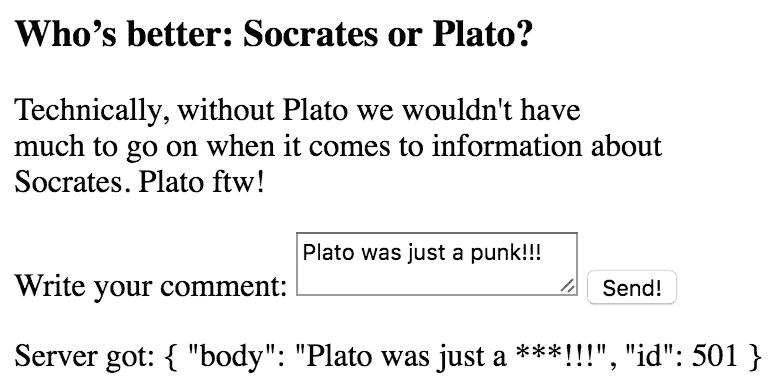

# 工作原理...

在`mounted`钩子中，我们正在安装一个所谓的`拦截器`。特别是，它是一个请求拦截器，这意味着它会在将请求发送到互联网之前对其进行操作：

```js
axios.interceptors.request.use(config => { 

  const body = config.data.body.replace(/punk/i, '***') 

  config.data.body = body 

  return config 

})

```

`config`对象包含许多我们可以编辑的内容。它包含头部和 URL 参数。它还包含 Axios 配置变量。您可以查看 Axios 文档以获取最新列表。

我们正在获取与 POST 请求一起发送的数据部分，并检查是否找到了`punk`这个词。如果是这样，它将被星号替换。返回的对象将成为当前请求的新配置。

# 防止 XSS 攻击您的应用程序

编写没有考虑安全性的应用程序将不可避免地导致漏洞，特别是如果它必须在 Web 服务器上运行。跨站脚本攻击（XSS）是当今最流行的安全问题之一；即使您不是安全专家，也应该了解它的工作原理以及如何在 Vue 应用程序中防止它。

# 准备工作

除了 Axios 之外，这个示例不需要任何先前的知识。您可以在*使用 Axios 发送基本 AJAX 请求*的示例中找到有关 Axios 以及如何安装它的更多信息。

# 操作步骤...

您应该首先了解后端如何提供 CSRF 令牌（在下一段中会详细介绍）。我们假设服务器会在您的浏览器中放置一个名为 XSRF-TOKEN 的 cookie。

您可以模拟您的服务器，在浏览器控制台（开发者工具）中使用`document.cookie = 'XSRF-TOKEN=abc123'`命令设置一个 cookie。

Axios 会自动读取这样的 cookie，并在下一次请求中传输它。

考虑到我们在代码中调用了一个 Axios 的`get`请求，如下所示：

```js
methods: { 

  sendAllMoney () { 

    axios.get('/sendTo/'+this.accountNo) 

  } 

}

```

Axios 将获取该 cookie 并添加一个名为 X-XSRF-TOKEN 的新头部到请求中。您可以通过在 Chrome 的开发者工具中点击请求的名称，在网络选项卡中查看这样的头部：

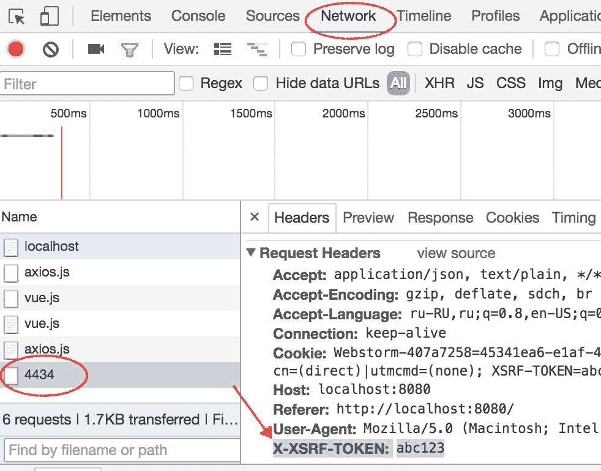

# 工作原理...

为了防止 XSS 攻击，您必须确保没有用户输入可以出现在您的应用程序中作为代码。这意味着您必须非常小心地使用`v-html`属性（*输出原始 HTML*的示例）。

不幸的是，您无法控制页面外发生的事情。如果您的用户收到一封包含与您的应用程序中的操作相对应的链接的虚假电子邮件，点击电子邮件中的链接将触发该操作。

让我们举一个具体的例子；你开发了一个银行应用程序*VueBank*，你的应用程序的用户收到了以下虚假电子邮件：

```js
Hello user!

Click here to read the latest news.

```

正如你所看到的，这封邮件甚至与我们的应用程序无关，`here`超链接隐藏在邮件本身的 HTML 中。实际上，它指向`http://vuebank.com?give_all_my_money_to_account=754839534`地址。

如果我们已经登录了 VueBank，该链接可能会立即生效。这对我们的财务状况不利。

为了防止这类攻击，我们应该让后端为我们生成一个**CSRF**（**跨站请求伪造**）令牌。我们将获取该令牌并将其与请求一起发送，以证明该请求来自用户。前面的链接将变为

`http://vuebank.com?give_all_my_money_to_account=754839534&csrf=s83Rnj`。

由于令牌每次都是随机生成的，邮件中的链接无法正确伪造，因为攻击者不知道服务器给网页的令牌。

在 Vue 中，我们使用 Axios 发送令牌。通常，我们不会将其作为链接的一部分发送，而是作为请求的头部；实际上，Axios 会为我们执行此操作，并自动将令牌放入下一个请求中。

您可以通过设置`axios.defaults.xsrfCookieName`变量来更改 Axios 将获取的 cookie 的名称，并且可以通过操作`axios.defaults.xsrfHeaderName`变量来编辑返回令牌的头部的名称。
