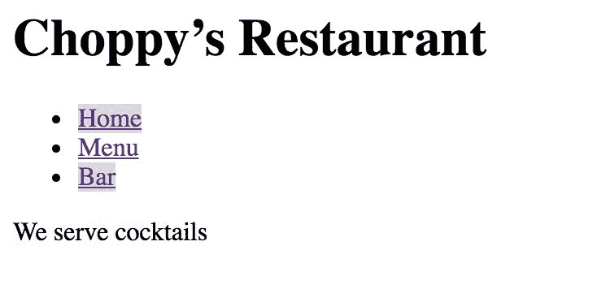
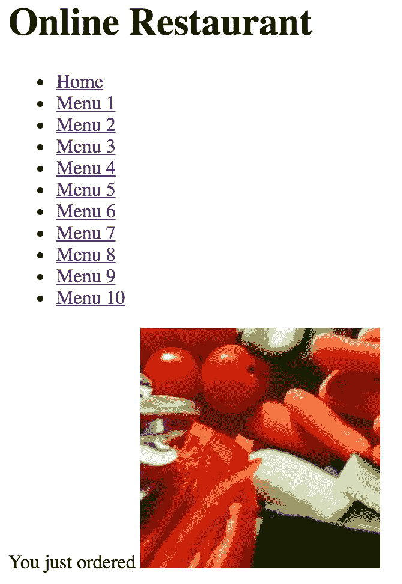
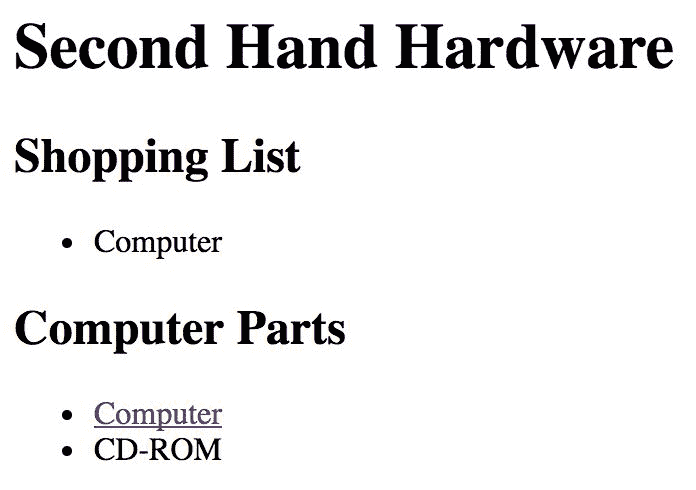
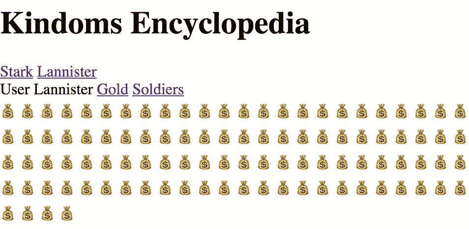
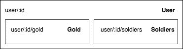
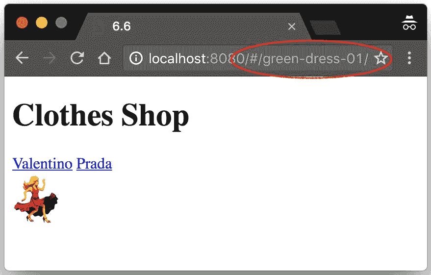
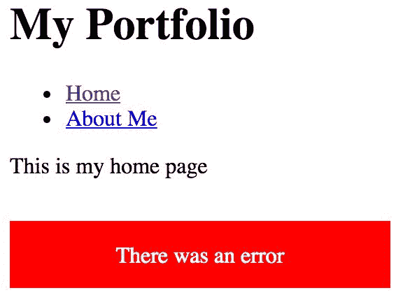
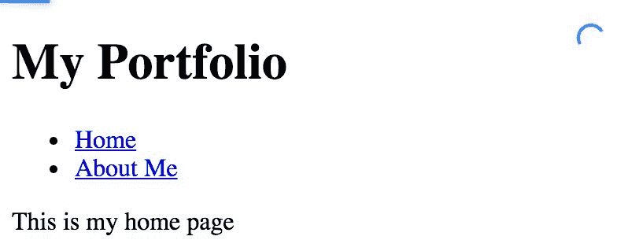
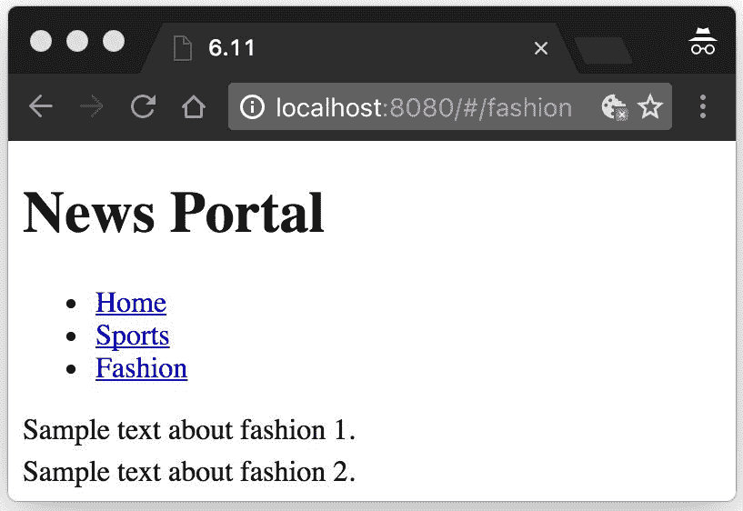
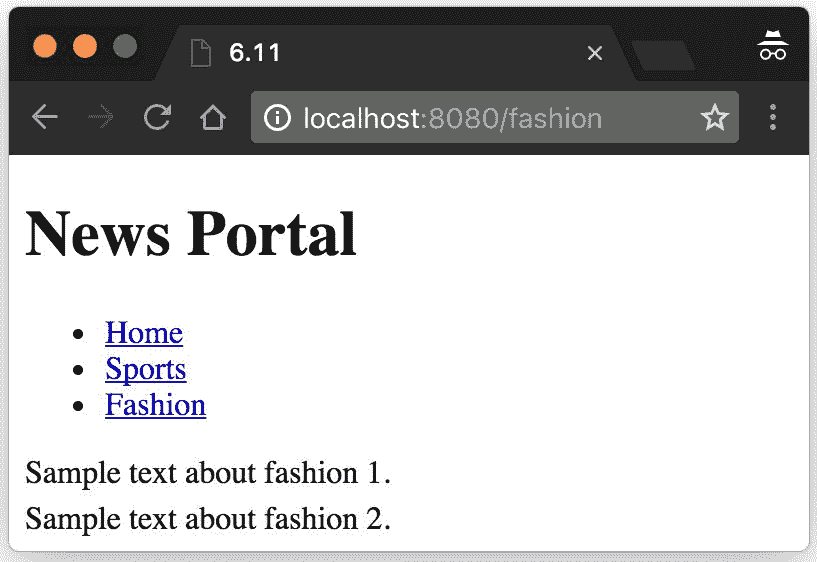

# 第五章：单页应用程序

在本章中，将涵盖以下内容：

+   使用 vue-router 创建 SPA

+   在切换路由之前获取数据

+   使用命名动态路由

+   在页面中使用多个 router-view

+   按层次组织路由

+   使用路由别名

+   在路由之间添加过渡效果

+   管理路由错误

+   在加载页面时添加进度条

+   如何重定向到另一个路由

+   在返回时保存滚动位置

# 介绍

许多现代应用程序都基于 SPA（单页应用程序）模型。从用户的角度来看，这意味着整个网站在单个页面上看起来类似于一个应用程序。

这是好的，因为如果做得正确，它可以增强用户体验，主要是减少等待时间，因为没有新页面需要加载-整个网站都在一个页面上。这就是 Facebook、Medium、Google 和许多其他网站的工作方式。

URL 不再指向 HTML 页面，而是指向应用程序的特定状态（通常看起来像不同的页面）。在实践中，在服务器上，假设您的应用程序位于`index.html`页面中，这是通过将请求“关于我”的用户重定向到`index.html`来实现的。

后者页面将采用 URL 的后缀，并将其解释为**路由**，而路由将创建一个类似页面的组件，其中包含个人简介信息。

# 使用 vue-router 创建 SPA

Vue.js 通过其核心插件 vue-router 实现了 SPA 模式。对于 vue-router，每个路由 URL 对应一个组件。这意味着我们将告诉 vue-router 当用户访问特定 URL 时如何行为，以其组件为基础。换句话说，在这个新系统中，每个组件都是旧系统中的一个页面。

# 准备工作

对于这个示例，您只需要安装 vue-router 并对 Vue 组件有一些了解。

要安装 vue-router，请按照以下说明操作：[`router.vuejs.org/en/installation.html`](https://router.vuejs.org/en/installation.html)。

如果您正在使用 JSFiddle 进行跟随，可以添加类似于[`unpkg.com/vue-router/dist/vue-router.js`](https://unpkg.com/vue-router/dist/vue-router.js)的链接。

# 操作步骤

我们正在为一家餐厅准备一个现代化的网站，并将使用 SPA 模式。

该网站将包括三个页面：主页、餐厅菜单和酒吧菜单。

整个 HTML 代码将如下所示：

```js
<div id="app">

  <h1>Choppy's Restaurant</h1>

  <ul>

    <li>Home</li>

    <li>Menu</li>

    <li>Bar</li>

  </ul>

  <router-view></router-view>

</div>

```

`<router-view>`组件是 vue-router 的入口点。它是组件显示为页面的地方。

列表元素将变成链接。目前，它们只是列表元素；要将它们转换为链接，我们可以使用两种不同的语法。将第一个链接包装在以下行中：

```js
<li><router-link to="/">

Home</router-link>

</li>

```

另一个示例如下：

```js
<li><router-link to="/menu">

Menu</router-link>

</li>

```

我们可以使用的另一种语法是以下内容（用于 Bar 链接）：

```js
<li>

  <router-link

    tag="li" to="/bar"

      :event="['mousedown', 'touchstart']"

    >

    <a>Bar</a>

  </router-link>

</li>

```

这种更冗长但更明确的语法可以用于将自定义事件绑定到特定的路由。

要告诉 Vue 我们要使用 vue-router 插件，请在 JavaScript 中写入以下内容：

```js
Vue.use(VueRouter)

```

我们在开始时列出的三个页面的部分将由这三个虚拟组件扮演（将它们添加到 JavaScript 中）：

```js
const Home = { template: '<div>Welcome to Choppy's</div>' }

const Menu = { template: '<div>Today we have cookies</div>' }

const Bar = { template: '<div>We serve cocktails</div>' }

```

现在，您终于可以创建路由器了。其代码如下：

```js
const router = new VueRouter({})

```

这个路由器没有做太多事情；我们必须添加路由（对应于 URL）及其关联的组件：

```js
const router = new VueRouter({

 routes: [ 

 { path: '/', component: Home }, 

 { path: '/menu', component: Menu }, 

 { path: '/bar', component: Bar } 

 ] 

})

```

现在我们的应用程序几乎完成了；我们只需要声明一个简单的`Vue`实例：

```js
new Vue({

  router,

  el: '#app'

})

```

我们的应用程序现在可以工作了；在启动之前，添加此 CSS 规则以获得稍微更好的反馈：

```js
a.router-link-active, li.router-link-active>a {

  background-color: gainsboro;

}

```

当您打开应用程序并点击 Bar 链接时，您应该看到类似以下屏幕截图的内容：



# 它是如何工作的...

您的程序首先要做的是将 vue-router 注册为插件。vue-router 反过来注册路由（它们是 URL 的一部分）并将组件连接到每个路由。

当我们首次访问应用程序时，浏览器上的 URL（您无法在 JSFiddle 中看到它在更改，因为它在 iframe 中）将以`index.html/#/`结尾。井号后面的所有内容都是 vue-router 的路由。在这种情况下，它只是一个斜杠（`/`），因此它与第一个主页路由匹配。

当我们点击链接时，`<router-view>`的内容会根据我们与该路由关联的组件而更改。

# 还有更多...

敏锐的读者肯定会发现可以解释为错误的问题-在运行应用程序之前，我们添加了一些 CSS 样式。`.router-link-active`类会在`<router-link>`组件中自动注入，每当页面对应于实际指向的链接时。

当我们点击“菜单”和“栏目”时，背景颜色会发生变化，但似乎仍然会停留在“主页”链接上。这是因为`<router-link>`组件执行的匹配不是**精确**的。换句话说，`/bar`和`/menu`包含`/`字符串，因此`/`总是匹配的。

一个快速修复的方法是添加与第一个`<router-link>`完全相同的属性：

```js
<li><router-link to="/" exact

>Home</router-link></li>

```

现在，只有当路由完全匹配主页链接时，“主页”链接才会被突出显示。

还要注意的一点是规则本身：

```js
a.router-link-active, li.router-link-active>a {

  background-color: gainsboro;

}

```

为什么我们要匹配两个不同的东西？这取决于你如何编写路由链接。

```js
<li><router-link to="/" exact>Home</router-link></li>

```

前面的代码将被翻译为以下 DOM 部分：

```js
<li><a href="#/" class="router-link-active"

>

Home</a></li>

```

而：

```js
<router-link tag="li" to="/" exact>Home</router-link>

```

变成：

```js
<li class="router-link-active"

>Home</li>

```

请注意，在第一种情况下，类被应用于子锚点元素；在第二种情况下，它被应用于父元素。

# 在切换路由之前获取数据

在 Vue 的早期版本中，我们有一个专门的方法来从互联网上获取数据，然后再切换路由。在 Vue 2 中，我们有一个更通用的方法来处理这个问题，以及在切换路由之前可能需要处理的其他事情。

# 准备工作

为了完成这个示例，您需要已经了解 vue-router 的基础知识以及如何进行 AJAX 请求（在最后一章中会详细介绍）。

# 如何做到这一点…

我们将编写一个由两个页面组成的简单网页作品集：一个主页和一个关于我页面。

为了完成这个示例，我们需要将 Axios 添加为依赖项。

基本布局可以从以下 HTML 代码中清楚地看出：

```js
<div id="app">

  <h1>My Portfolio</h1>

  <ul>

    <li><router-link to="/" exact>Home</router-link></li>

    <li><router-link to="/aboutme">About Me</router-link></li>

  </ul>

  <router-view></router-view>

</div>

```

在 JavaScript 中，您可以开始构建您的`AboutMe`组件：

```js
const AboutMe = {

  template: `<div>Name:{{name}}<br>Phone:{{phone}}</div>`

}

```

它只显示一个姓名和一个电话号码。让我们在组件的`data`选项中声明这两个变量，如下所示：

```js
data () {

  return {

    name: undefined,

    phone: undefined  

  } 

}

```

在实际加载组件到场景之前，vue-router 将在我们的对象中查找一个名为`beforeRouteEnter`的选项；我们将使用它来从服务器加载姓名和电话号码。我们使用的服务器将提供一些虚假数据，仅用于显示，如下所示：

```js
beforeRouteEnter (to, from, next) {

  axios.post('https://schematic-ipsum.herokuapp.com/', {

    "type": "object",

    "properties": {

      "name": {

        "type": "string",

        "ipsum": "name"

      },

      "phone": {

        type": "string",

        "format": "phone"

      }

    }

  }).then(response => {

    next(vm => {

      vm.name = response.data.name

      vm.phone = response.data.phone 

    })

  })

}

```

对于另一个组件，主页，我们只需编写一个小组件作为占位符：

```js
const Home = { template: '<div>This is my home page</div>' }

```

接下来，您需要注册`router`及其`paths`：

```js
Vue.use(VueRouter)

const router = new VueRouter({

  routes: [

    { path: '/', component: Home },

    { path: '/aboutme', component: AboutMe },  

  ] 

})

```

当然，您还需要注册一个`Vue`根实例，如下所示：

```js
new Vue({

  router,

  el: '#app'

})

```

当您启动应用程序并点击“关于我”链接时，您应该看到类似于以下内容的东西：


请注意，当您点击链接时，页面不会重新加载，但显示个人简介仍然需要一些时间。这是因为它正在从互联网获取数据。

# 工作原理如下：

`beforeRouteEnter`钩子函数接受三个参数：

+   `to`：这是一个表示用户请求的路由的`Route`对象。

+   from：这也是一个表示当前路由的`Route`对象。在出现错误时，用户将保留在该路由上。

+   `next`：这是一个函数，当我们准备继续切换路由时可以使用它。如果使用 false 调用此函数，将阻止路由的更改，在出现错误时非常有用。

当调用上述函数时，我们使用 Axios 调用了一个 Web 服务，该服务提供了一个名称字符串和一个电话号码字符串。

当我们在此钩子函数内部时，重要的是要记住我们无法访问`this`。这是因为此钩子函数在组件实际实例化之前运行，因此没有`this`可供引用。

当服务器响应时，我们在`then`函数内部，并且希望将服务器返回的名称和电话赋值给变量，但是正如前面所说，我们无法访问`this`。next 函数接收到我们的组件的引用作为参数。我们使用它来将变量设置为接收到的值：

```js
...

}).then(response => {

  next(vm => {

    vm.name = response.data.name

    vm.phone = response.data.phone

  })

})

```

# 使用命名动态路由

手动注册所有路由可能会耗费时间，并且当路由事先未知时，这是不可能的。vue-router 允许您使用参数注册路由，以便您可以为数据库中的所有对象创建链接，并覆盖其他用户选择路由的用例，遵循某种模式，这将导致需要手动注册太多的路由。

# 准备工作

除了 vue-router 的基础知识（参考“使用 vue-router 创建单页应用程序”配方），您不需要任何其他信息来完成此配方。

# 操作步骤如下：

我们将开设一个在线餐厅，提供十种不同的菜肴。我们将为每道菜创建一个路由。

我们网站的 HTML 布局如下：

```js
<div id="app">

  <h1>Online Restaurant</h1>

  <ul>

    <li>

      <router-link :to="{ name: 'home' }" exact>

        Home

      </router-link>

    </li>

    <li v-for="i in 10">

      <router-link :to="{ name: 'menu', params: { id: i } }">

        Menu {{i}}

      </router-link>

    </li>

    </ul>

  <router-view class="view"></router-view>

</div>

```

这将创建 11 个链接，一个用于主页，十个用于菜肴。

在 JavaScript 部分注册`VueRouter`之后，代码如下：

```js
Vue.use(VueRouter)

```

创建两个组件；一个将作为主页的占位符：

```js
const Home = { template: `

  <div>

    Welcome to Online Restaurant

  </div>

` }

```

其他路由将连接到一个`Menu`组件：

```js
const Menu = { template: `

  <div>

    You just ordered

    

  </div>

` }

```

在前面的组件中，我们使用`$route`引用全局路由对象，并从 URL 中获取`id`参数。`Lorempixel.com`是一个提供示例图片的网站。我们为每个`id`连接不同的图片。

最后，使用以下代码创建路由本身：

```js
const router = new VueRouter({

  routes: [

    { path: '/', name:'home', component: Home }, 

    { path: '/menu/:id', name: 'menu', component: Menu },

  ]

})

```

你可以看到菜单的路径包含`/:id`，这是一个占位符，用于表示 URL 中的`id`参数。

最后，编写一个根`Vue`实例：

```js
new Vue({

  router,

  el: '#app'

})

```

现在你可以启动应用程序，应该能够看到所有的菜单项。点击其中任何一个应该会点菜：



# 工作原理...

代码中有两个主要部分贡献于创建不同菜品的路由。

首先，我们使用冒号语法注册了一个通用路由，并为其指定了一个名称，代码如下：

```js
{ path: '/menu/:id', name: 'menu', component: Menu }

```

这意味着我们可以有一个以`/menu/82`结尾的 URL，`Menu`组件将显示，并且`$route.params.id`变量将设置为`82`。所以，以下行应该根据以下内容进行更改：

```js


```

在渲染的 DOM 中，上述行将被以下行替换：

```js


```

不要在现实生活中寻找这样的图片。

请注意，我们还为此路由指定了一个名称。这并不是必需的，但它使我们能够编写代码的第二个主要部分，如下所示：

```js
<router-link :to="{ name: 'menu', params: { id: i } }

">

  Menu {{i}}

</router-link>

```

我们可以传递一个对象给`to`属性，而不是写一个字符串，并指定`params`。在我们的例子中，参数由`v-for`包装给出。这意味着，例如，在`v-for`的第四个循环中：

```js
<router-link :to="{ name: 'menu', params: { id: 4} }">

  Menu 4

</router-link>

```

这将导致 DOM 如下所示：

```js
<a href="#/menu/4" class="">Menu 4</a>

```

# 在页面中有多个`<router-view>`时

拥有多个`<router-view>`可以让您拥有可以使用更复杂布局组织的页面。例如，您可以拥有侧边栏和主视图。本篇介绍了这方面的内容。

# 准备工作

本篇不使用任何高级概念。但建议您熟悉 vue-router 并学习如何安装它。请参阅本章的第一篇文章以了解更多信息。

# 操作步骤

本篇将使用大量代码来说明问题。但是，机制非常简单。

我们将构建一个二手硬件商店。我们将拥有一个主视图和一个侧边栏；这些将是我们的`router-view`。侧边栏将包含我们的购物清单，以便我们始终知道我们要购买的物品，并且没有干扰。

整个 HTML 代码非常简短，因为它只包含一个标题和两个`router-view`组件：

```js
<div id="app">

  <h1>Second-Hand Hardware</h1>

    <router-view name="list"></router-view>

    <router-view></router-view>

</div>

```

在这种情况下，列表被命名为`router-view`。第二个没有名称，因此默认命名为`Vue`。

在 JavaScript 中注册`vue-router`：

```js
Vue.use(VueRouter)

```

之后，注册路由：

```js
const router = new VueRouter({

  routes: [

    { path: '/',

      components: {

        default: Parts,

        list: List

      }

    },

    { path: '/computer',

      components: {

        default: ComputerDetail,

        list: List

      }

    }

  ]

})

```

组件不再是一个单独的对象，而是一个包含两个组件的对象：一个用于`list`，另一个用于默认的`router-view`。

按照示例编写`list`组件，放在路由代码之前：

```js
const List = { template: `

  <div>

    <h2>Shopping List</h2>

      <ul>

        <li>Computer</li>

      </ul>

  </div>

` }

```

这将只显示计算机作为我们应该记得购买的项目。

部件组件如下所示；在路由代码之前编写它：

```js
const Parts = { template: `

  <div>

    <h2>Computer Parts</h2>

    <ul>

      <li><router-link to="/computer">Computer</router-link></li>

      <li>CD-ROM</li>

    </ul>

  </div>

` }

```

它包含一个链接，用于查看有关正在销售的计算机的更多信息；下一个组件绑定到该页面，因此在路由代码之前编写它：

```js
const ComputerDetail = { template: `

  <div>

    <h2>Computer Detail</h2>

    <p>Pentium 120Mhz, CDs sold separately</p>

  </div>

` }

```

当然，不要忘记添加`Vue`实例：

```js
new Vue({

  router,

  el: '#app'

})

```

启动应用程序时，您应该看到两个路由视图一个在另一个上方。如果您希望它们并排显示，可以添加一些 CSS 样式：



# 工作原理...

在将`<router-view>`组件添加到页面时，您只需记住为其添加一个名称以便在路由注册期间引用：

```js
<router-view name="view1"></router-view>

<router-view name="view2"></router-view>

<router-view></router-view>

```

如果不指定名称，路由将被称为默认路由：

```js
routes: [

  { path: '/',

    components: {  

      default: DefaultComponent,

      view1: Component1,

      view2: Component2

    }

  }

]

```

这样，组件将显示在各自的`router-view`元素中。

如果未为命名视图指定一个或多个组件，则与该名称关联的`router-view`将为空。

# 按层次组织您的路由

在许多情况下，您的网站的组织树可能很复杂。在某些情况下，可能存在明确的分层组织，您可以遵循并使用嵌套路由，vue-routes 可以帮助您保持一切井然有序。最好的情况是，URL 的组织方式与组件的嵌套方式完全对应。

# 准备工作

在本示例中，您将使用 Vue 的组件和其他基本功能。您还将使用动态路由。请参阅*使用命名动态路由*示例以了解更多信息。

# 操作步骤...

在本示例中，您将为一个虚构的世界构建一个在线会计网站。我们将有两个用户-`Stark`和`Lannister`-我们将能够看到这两个用户拥有多少黄金和士兵。

我们网站的 HTML 布局如下：

```js
<div id="app">

  <h1>Kindoms Encyclopedia</h1>

  <router-link to="/user/Stark/">Stark</router-link>

  <router-link to="/user/Lannister/">Lannister</router-link>

  <router-view></router-view>

</div>

```

我们有一个标题和两个链接-一个用于`Stark`，一个用于`Lannister`-最后是`router-view`元素。

我们将`VueRouter`添加到插件中：

```js
Vue.use(VueRouter)

```

然后，我们注册路由：

```js
const router = new VueRouter({

  routes: [

    { path: '/user/:id', component: User,

      children: [ 

        {

          path: 'soldiers',

          component: Soldiers

        },

        {

          path: 'gold',

          component: Gold

        }

      ]

    }

  ]

})

```

我们所说的是注册一个动态路由`/user/:id`，在`User`组件内部，将有另一个`router-view`，其中包含金币和士兵的嵌套路径。

刚才提到的三个组件按照所示编写，在路由代码之前添加它们：

```js
const User = { template: `

  <div class="user">

    <h1>Kindoms Encyclopedia</h1>

    User {{$route.params.id}}

    <router-link to="gold">Gold</router-link>

    <router-link to="soldiers">Soldiers</router-link>

    <router-view></router-view>

  </div>

`}

```

正如预期的那样，在`User`组件内部还有另一个`router-view`入口，其中包含嵌套的`routes`组件。

然后，在路由代码之前编写`Soldiers`和`Gold`组件：

```js
const Soldiers = { template: `

  <div class="soldiers">

    <span v-for="soldier in $root[$route.params.id].soldiers"> 

    </span>

  </div>

`}

const Gold = { template: `

   div class="gold">

    <span v-for="coin in $root[$route.params.id].gold">

    </span>

  </div>

`}

```

这些组件将根据 Vue 根实例数据选项中的金币或士兵变量显示相应数量的表情符号。

这是 Vue 根实例的样子：

```js
new Vue({

  router,

  el: '#app',

  data: {

    Stark: {

      soldiers: 100,

      gold: 50  

    },

    Lannister: {

      soldiers: 50,

      gold: 100

    }

  }

})

```

启动应用程序将使您能够直观地表示两个用户的金币和士兵数量：



# 工作原理...

为了更好地理解嵌套路由的工作原理，可以看一下以下图表：



我们的示例中只有两个级别。第一个级别是顶级，由大的包裹矩形表示，对应于`/user/:id`路由，意味着每个可能匹配的 ID 都在同一级别上。

而内部矩形则是一个嵌套路由和嵌套组件。它对应于金币路由和 Gold 组件。

当嵌套路由对应于嵌套组件时，这是正确的选择。还有两种其他情况需要考虑。

当我们有嵌套组件但没有嵌套路由时，我们只需在嵌套路由前加上斜杠`/`。这将使其表现得像顶级路由。

例如，考虑将我们的代码更改为以下内容：

```js
const router = new VueRouter({

  routes: [

    { path: '/user/:id', component: User,

      children: [

        {

          path: 'soldiers',

          component: Soldiers

        },

        {

          path: '/gold'

,

          component: Gold

        }

      ] 

    }

  ]

})

```

在`/gold`路由前加上斜杠将使`Gold`组件在我们将浏览器指向`/gold`URL 时出现，而不是`/user/Lannister/gold`（在这种情况下将导致错误和空白页面，因为未指定用户）。

另一种相反的情况是有嵌套路由但没有相同级别的组件。在这种情况下，只需使用常规语法注册路由。

# 使用路由别名

有时需要有多个指向同一页的 URL。这可能是因为页面更改了名称，或者因为页面在站点的不同部分中有不同的引用方式。

特别是当页面更改名称时，也非常重要在许多设置中保留以前的名称。链接可能会断开，页面可能无法从网站的某些部分访问。在这个示例中，您将防止出现这种情况。

# 准备工作

对于这个示例，您只需要对 vue-router 组件有一些了解（如何安装和基本操作）。有关 vue-router 的更多信息将从“使用 vue-router 创建 SPA”示例开始。

# 操作步骤

假设我们有一个时尚网站，负责给服装命名的员工 Lisa 为两件衣服创建了两个新链接：

```js
<router-link to="/green-dress-01/">Valentino</router-link>

<router-link to="/green-purse-A2/">Prada</router-link>

```

开发人员在 vue-router 中创建了相应的路由：

```js
const router = new VueRouter({

  routes: [

    {

      path: '/green-dress-01',

      component: Valentino01

    },

    {

      path: '/green-purse-A2',

      component: PradaA2

    }

  ]

})

```

后来发现这两件衣服不是绿色的，而是红色的。Lisa 并不怪罪，因为她是色盲。

现在您负责更改所有链接以反映列表的真实颜色。首先要做的是更改链接本身。在您编辑后，HTML 布局如下所示：

```js
<div id="app">

  <h1>Clothes Shop</h1>

  <router-link to="/red-dress-01/">Valentino</router-link>

  <router-link to="/red-purse-A2/">Prada</router-link>

  <router-view></router-view>

</div>

```

您将`VueRouter`插件添加到`Vue`中：

```js
Vue.use(VueRouter)

```

然后，注册新的`routes`以及旧路由的别名：

```js
const router = new VueRouter({

  routes: [

    {

      path: '/red-dress-01',

      component: Valentino01,

      alias: '/green-dress-01'

    },

    {

      path: '/red-purse-A2',

      component: PradaA2,

      alias: '/green-purse-A2'

    }

  ]

})

```

以下是所提到的组件的样子：

```js
const Valentino01 = { template: '<div class="emoji">

</div>' }

const PradaA2 = { template: '<div class="emoji">

</div>' }

```

在启动应用程序之前，请记得实例化一个`Vue`实例：

```js
new Vue({

  router,

  el: '#app'

})

```

您可以添加一个 CSS 规则，使表情符号看起来像图片，如下面的屏幕截图所示：

```js
.emoji {

  font-size: 3em;

}

```



# 工作原理

即使我们更改了所有链接，我们也无法控制其他实体如何链接到我们的页面。对于搜索引擎（如 Google），没有办法告诉它们删除对旧页面的链接并使用新页面。这意味着如果我们不使用别名，我们可能会遇到大量的破损链接和 404 页面，甚至可能来自我们支付费用链接到不存在页面的广告商的负面宣传。

# 在路由之间添加过渡效果

我们在“第三章”中详细探讨了过渡效果和动画。在这里，我们将在更改路由时使用它们，而不是更改元素或组件。同样的观察也适用于这里。

# 准备工作

在尝试这个示例之前，我强烈建议您完成“第三章”中的一些示例，即“过渡和动画”，以及本示例。这个示例是到目前为止学到的概念的混合体。

# 操作步骤

在这个教程中，我们将为一个餐厅的网站建立一个鬼魂餐厅的网站。除了页面必须淡出而不是立即出现的要求外，它与普通餐厅的网站没有太大的区别。

让我们先来布置一些 HTML 布局：

```js
<div id="app">

  <h1>Ghost's Restaurant</h1>

  <ul>

    <li><router-link to="/">Home</router-link></li>

    <li><router-link to="/menu">Menu</router-link></li>  

  </ul>

  <transition mode="out-in">

  <router-view></router-view>

  </transition>

</div>

```

注意我们如何用`transition`标签包裹了主路由显示端口。设置`out-in`模式是因为我们希望消失的组件的动画在其他组件出现之前完成。如果我们没有设置这个，两个淡出的组件会在短暂的时间内叠加在一起。有关更详细的讨论，您可以参考*在过渡中让元素在进入阶段之前离开*的教程。

现在，让我们创建两个页面/组件：

```js
const Home = { template: '<div>Welcome to Ghost's</div>' }

const Menu = { template: '<div>Today: invisible cookies</div>' }

```

现在，让我们注册`routes`：

```js
Vue.use(VueRouter)

const router = new VueRouter({

  routes: [

    { path: '/', component: Home },

    { path: '/menu', component: Menu }

  ]

})

```

在启动应用程序之前，实例化一个`Vue`对象：

```js
new Vue({

  router,

  el: '#app'

})

```

为了使过渡效果生效，您需要添加一些 CSS 规则：

```js
.v-enter-active, .v-leave-active {

  transition: opacity .5s;

}

.v-enter, .v-leave-active {

  opacity: 0

}

```

现在启动您的应用程序。您成功地在页面切换之间添加了淡入淡出的过渡效果。

# 工作原理...

将整个`<router-view>`包装在一个过渡标签中将为所有组件执行相同的过渡效果。

如果我们想为每个组件设置不同的过渡效果，我们有另一种选择：我们必须将各个组件自己包装在过渡中。

例如，假设我们有两个过渡效果：spooky 和 delicious。我们希望在`Home`组件出现时应用第一个过渡效果，在`Menu`组件出现时应用第二个过渡效果。

我们需要修改我们的组件，如下所示：

```js
const Home = { template: `

  <transition name="spooky">

    <div>Welcome to Ghost's</div>

  </transition>

` }

const Menu = { template: `

  <transition name="delicious">

    <div>Today: insisible cookies!</div>

  </transition>

` }

```

# 管理路由错误

如果我们访问的页面不存在或无法正常工作，那么前往链接就没有太多意义。传统上，当发生这种情况时，我们会看到一个错误页面。在 SPA 中，我们更强大，我们可以完全阻止用户前往那里，并显示一个礼貌的消息，说明页面不可用。这极大地增强了用户体验，因为用户可以立即采取其他操作，而无需返回。

# 准备工作

为了跟上，您应该完成*在切换路由之前获取数据*的教程。

本教程将在此基础上进行构建，并假设您已经将所有相关代码放置在适当的位置。

# 如何操作...

正如前面所说，我们将编辑*在切换路由之前获取数据*教程的结果代码来管理错误。只是为了提醒您，当我们转到`/aboutme`页面时，我们正在从互联网上加载信息。我们希望在信息不可用的情况下避免转到该页面。

对于这个示例，像之前的示例一样将 Axios 添加为依赖项。

首先，使用下面的代码来丰富 HTML 布局：

```js
<div id="app">

  <h1>My Portfolio</h1>

  <ul>

    <li><router-link to="/" exact>Home</router-link></li>

    <li><router-link to="/aboutme">About Me</router-link></li>

  </ul>

  <router-view></router-view>

 <div class="toast" v-show="showError"> 

 There was an error 

 </div> 

</div>

```

这是一个弹出消息，每当出现错误时都会显示在屏幕上。使用以下 CSS 规则为其添加一些样式：

```js
div.toast {

  width: 15em;

  height: 1em;

  position: fixed;

  bottom: 1em;

  background-color: red;

  color: white;

  padding: 1em;

  text-align: center;

}

```

接下来要做的是有一个全局机制将`showError`设置为`true`。在 JavaScript 代码的顶部，声明`vm`变量：

```js
let vm

```

然后，将我们的`Vue`根实例分配给它：

```js
vm =

 new Vue({

  router,

  el: '#app',

 data: { 

 showError: false 

 } 

})

```

我们还将`showError`变量添加到数据选项中。

最后要做的是在显示个人简介信息之前，实际上管理数据检索时的错误。

将下面的代码添加到`beforeRouteEnter`钩子中：

```js
beforeRouteEnter (to, from, next) {

  axios.post('http://example.com/

', {

    "type": "object",

    "properties": {

      "name": {

        "type": "string",

        "ipsum": "name"

      },

      "phone": {

        "type": "string",

        "format": "phone"

      }

    }

  }).then(response => {

  next(vm => {

    vm.name = response.data.name

    vm.phone = response.data.phone

  })

}).catch(error => { 

 vm.showError = true 

 next(false) 

 }) 

}

```

接下来的（false）命令将使用户停留在原地，我们还将端点编辑为`example.com`，这将在`POST`请求上返回错误代码：



# 工作原理...

Axios 将从`example.com`接收到一个错误，这将触发对我们调用 post 时创建的 promise 的拒绝。promise 的拒绝将反过来触发传递给 catch 的函数。

值得注意的是，在代码的这一点上，`vm`指的是根`Vue`实例；这是因为该代码总是在`Vue`实例初始化并分配给`vm`之后执行的。

# 为页面添加进度条以加载页面

确实，使用 SPA，用户不必等待新页面加载，但他仍然需要等待数据加载。在*在切换路由之前获取数据*示例中，我们在点击按钮进入`/aboutme`页面后还需要等待一段时间。没有任何提示数据正在加载，然后突然页面出现了。如果用户至少有一些反馈页面正在加载，那不是很好吗？

# 准备工作

为了跟上，您应该完成*在切换路由之前获取数据*示例。

本示例将在此基础上构建，并假设您已经有了所有相关的代码。

# 如何操作...

如前所述，我假设您已经有了从*在切换路由之前获取数据*示例中得到的所有代码，并且已经正常工作。

对于这个示例，我们将使用一个额外的依赖项--`NProgress`，一个在屏幕顶部显示加载进度条的小工具。

将以下两行代码添加到页面的头部或 JSFiddle 的依赖项列表中（也有一个 npm 包）：

```js
<link rel="stylesheet" href="https://cdn.bootcss.com/nprogress/X/nprogress.css">

<script src="https://cdn.bootcss.com/nprogress/X/nprogress.js"></script>

```

在这里，`X`是`NProgress`的版本。在编写时，版本号为 0.2.0，但你可以在网上查找。

完成这一步后，下一步是定义我们希望进度条具有的行为。

首先，我们希望在点击链接后立即显示进度条。为此，我们可以为点击事件添加一个事件监听器，但如果有一百个链接，这将是一个很差的设计。一个更可持续和清晰的方法是通过为路由创建一个新的钩子，并将进度条的出现与路由的切换连接起来。这也将具有提供一致的应用体验的优势：

```js
router.beforeEach((to, from, next) => {

  NProgress.start()

  next()

})

```

类似地，我们希望在加载成功后进度条消失。这意味着我们希望在回调函数中执行这个操作：

```js
beforeRouteEnter (to, from, next) {

  axios.post('http://schematic-ipsum.herokuapp.com/', {

    "type": "object",

    "properties": {

      "name": {

        "type": "string",

        "ipsum": "name"

      },

      "phone": {

        "type": "string",

        "format": "phone"

      }

    }

  }).then(response => {

 NProgress.done() 

    next(vm => {

      vm.name = response.data.name

      vm.phone = response.data.phone

    })

  })

}

```

现在你可以启动应用程序，你的进度条应该已经工作了：



# 它是如何工作的...

这个示例还证明了利用外部库并不难，只要它们易于安装。

由于`NProgress`组件如此简单且有用，我在这里报告它的 API 作为参考：

+   `NProgress.start()`：显示进度条

+   `NProgress.set(0.4)`：设置进度条的百分比

+   `NProgress.inc()`：稍微增加进度条

+   `NProgress.done()`：完成进度

我们使用了前面两个函数。

作为预防措施，我还建议不要依赖于各个组件调用`done()`函数。我们在`then`函数中调用它，但如果下一个开发人员忘记了呢？毕竟，我们在*任何*路由切换之前都会启动进度条。

最好是在`router`中添加一个新的钩子：

```js
router.afterEach((to, from) => {

  NProgress.done()

})

```

由于`done`函数是幂等的，我们可以随意调用它多次。因此，这不会修改我们应用程序的行为，并且将确保即使将来的开发人员忘记关闭进度条，它也会在路由改变后自动消失。

# 如何重定向到另一个路由

你可能有无数个原因希望重定向用户。你可能希望用户在访问页面之前先登录，或者页面已经移动，你希望用户注意到新的链接。在这个示例中，你将重定向用户到一个新的主页，作为快速修改网站的一种方式。

# 准备工作

这个示例只会使用关于 vue-router 的基本知识。如果你已经完成了*使用 vue-router 创建单页应用*的示例，你就可以开始了。

# 如何做到这一点...

假设我们有一个在线服装店。

这将是网站的 HTML 布局：

```js
<div id="app">

  <h1>Clothes for Humans</h1>

  <ul>

    <li><router-link to="/">Home</router-link></li>

    <li><router-link to="/clothes">Clothes</router-link></li>

  </ul>

  <router-view></router-view>

</div>

```

它只是一个带有指向服装列表的链接的页面。

让我们注册`VueRouter`：

```js
Vue.use(VueRouter)

```

我们的网站有三个页面，分别由以下组件表示：

```js
const Home = { template: '<div>Welcome to Clothes for Humans</div>' }

const Clothes = { template: '<div>Today we have shoes</div>' }

const Sales = { template: '<div>Up to 50% discounts! Buy!</div>' }

```

它们代表主页、服装列表和去年使用的带有一些折扣的页面。

让我们注册一些`routes`：

```js
const router = new VueRouter({

  routes: [

    { path: '/', component: Home }

    { path: '/clothes', component: Clothes },

    { path: '/last-year-sales', component: Sales }

  ]

})

```

最后，我们添加一个根`Vue`实例：

```js
new Vue({

  router,

  el: '#app'

})

```

您可以启动应用程序，它应该可以正常工作，没有任何问题。

黑色星期五明天就要到了，我们忘记了这是全球时尚界最大的活动。我们没有时间重写主页，但去年销售的那个页面可以解决问题。我们将把访问我们主页的用户重定向到那个页面。

为了实现这一点，我们需要修改我们注册的`routes`：

```js
const router = new VueRouter({

  routes: [

    { path: '/', component: Home, redirect: '/last-year-sales'

 },

    { path: '/clothes', component: Clothes },

    { path: '/last-year-sales', component: Sales }

  ]

})

```

只需添加该重定向，我们就能挽救这一天。现在，每当您访问主页时，都会显示销售页面。

# 它是如何工作的...

当匹配到根路由时，`Home`组件将不会被加载。而是匹配到`/last-year-sales`路径。我们也可以完全省略组件，因为它永远不会被加载：

```js
{ path: '/', redirect: '/last-year-sales' }

```

# 还有更多...

在 vue-router 中，重定向比我们刚才看到的更强大。在这里，我将尝试通过重定向为刚刚创建的应用程序增加更多功能。

# 重定向到 404 页面

通过在最后一个路由中添加一个捕获所有路由，可以重定向找不到的页面。它将匹配到其他路由未匹配到的所有内容：

```js
...

{ path: '/404', component: NotFound },

{ path: '*', redirect: '/404' }

```

# 命名重定向

重定向可以与命名路由结合使用（参考“使用命名动态路由”配方）。我们可以通过名称指定目标：

```js
...

{ path: '/clothes', name: 'listing', component: Clothes },

{ path: '/shoes', redirect: { name: 'listing' }}

```

# 带参数的重定向

在重定向时，您还可以保留参数：

```js
...

{ path: '/de/Schuh/:size', redirect: '/en/shoe/:size' },

{ path: '/en/shoe/:size', component: Shoe }

```

# 动态重定向

这是最终的重定向。您可以访问用户尝试访问的路由，并决定要将其重定向到何处（但无法取消重定向）：

```js
...

{ path: '/air', component: Air },

{ path: '/bags', name: 'bags', component: Bags },

{ path: '/super-shirt/:size', component: SuperShirt },

{ path: '/shirt/:size?', component: Shirt},

{ path: '/shirts/:size?',

  redirect: to => {

    const { hash, params, query } = to

    if (query.colour === 'transparent') {

      return { path: '/air', query: null }

    }

    if (hash === '#prada') {

      return { name: 'bags', hash: '' }

    }

    if (params.size > 10) {

      return '/super-shirt/:size'

    } else {

      return '/shirt/:size?'

    }

  }

}

```

# 在返回时保存滚动位置

在 vue-router 中，有两种导航模式：`hash`和`history`。默认模式和前面的示例中使用的模式是`history`。传统上，当您访问一个网站，向下滚动一点并点击链接到另一个页面时，新页面从顶部显示。当您点击浏览器的返回按钮时，页面从先前滚动的高度显示，并且您刚刚点击的链接可见。

当你在 SPA（单页应用）中时，这并不是真实的，或者至少不是自动的。vue-router 的历史模式可以让你模拟这一点，甚至更好的是，可以对滚动行为进行精细控制。

# 准备中

为了完成这个步骤，我们需要切换到历史模式。历史模式只在应用程序在正确配置的服务器上运行时才有效。如何为 SPA 配置服务器超出了本书的范围（但原则是每个路由都从服务器端重定向到`index.html`）。

我们将使用一个 npm 程序来启动一个小型服务器；我们期望您已经安装了 npm（您可以查看“选择开发环境”这个教程来了解更多关于 npm 的信息）。

# 如何做到这一点...

首先，您将安装一个紧凑的服务器用于单页应用程序，以便历史模式能够正常工作。

在您喜欢的命令行中，进入包含您的应用程序的目录。然后，输入以下命令：

```js
    npm install -g history-server

    history-server .

```

运行服务器后，您需要将浏览器指向`http://localhost:8080`，如果您的目录中有一个名为`index.html`的文件，它将被显示出来；否则您将看不到太多内容。

创建一个名为`index.html`的文件，并填写一些样板内容，就像在“选择开发环境”一节中所示。我们希望得到一个只有`Vue`和`vue-router`作为依赖项的空白页面。我们的空白画布应该如下所示：

```js
<!DOCTYPE html>

<html>

<head>

  <script src="https://unpkg.com/vue/dist/vue.js"></script>

  <script src="https://unpkg.com/vue-router/dist/vue-router.js"></script>

</head>

<body>

  <div id="app">

  </div>

  <script>

    new Vue({

      router,

      el: '#app'

    })

  </script>

</body>

</html>

```

作为 HTML 布局，将以下内容放在`body`中：

```js
<div id="app">

  <h1>News Portal</h1>

    <ul>

      <li><router-link to="/">Home</router-link></li>

      <li><router-link to="/sports">Sports</router-link></li>

      <li><router-link to="/fashion">Fashion</router-link></li>

    </ul>

  <router-view></router-view>

</div>

```

我们有一个带有三个链接和一个`router-view`入口点的标题。我们将为体育和时尚页面创建两个长页面：

```js
const Sports = { template: `

  <div>

    <p v-for="i in 30">

      Sample text about sports {{i}}.

    </p>

    <router-link to="/fashion">Go to Fashion</router-link>

    <p v-for="i in 30">

      Sample text about sports {{i + 30}}.

    </p>

  </div>

` }

const Fashion = { template: `

  <div>

    <p v-for="i in 30">

      Sample text about fashion {{i}}.

    </p>

    <router-link to="/sports">Go to Sports</router-link>

    <p v-for="i in 30">

      Sample text about fashion {{i + 30}}.

    </p>

  </div>

` }

```

对于主页组件，我们只需要一个存根：

```js
const Home = { template: '<div>Welcome to BBCCN</div>' }

```

为这个新闻网站编写一个合理的路由器：

```js
Vue.use(VueRouter)

const router = new VueRouter({

  routes: [

    { path: '/', component: Home },

    { path: '/sports', component: Sports },

    { path: '/fashion', component: Fashion } 

  ]

})

```

如果您现在使用浏览器访问之前指定的地址，您应该能看到网站正在运行。

转到体育页面，向下滚动直到看到链接，然后点击它。

注意您正在访问的页面不是从开始显示的。这在传统网站中不会发生，也是不可取的。

点击返回按钮，注意我们回到了上次离开页面的位置；我们希望保留这种行为。

最后，注意页面的 URL 看起来不太自然，而是带有哈希符号；我们希望 URL 看起来更好：



为了实现这一点，让我们将路由器代码修改为以下内容：

```js
const router = new VueRouter({

 mode: 'history',

  routes: [

    { path: '/', component: Home },

    { path: '/sports', component: Sports },

    { path: '/fashion', component: Fashion }

  ],

 scrollBehavior (to, from, savedPosition) { 

 if (savedPosition) { 

 return savedPosition 

 } else { 

 return { x: 0, y: 0 } 

 } 

 } 

})

```

我们添加了一行指定新模式为 history（链接中没有哈希），并定义了`scrollBehavior`函数以返回到上次位置（如果存在）；如果是新页面，它应该滚动到左上角。

您可以通过刷新浏览器并返回到主页来尝试此操作。

打开体育页面，并点击页面中间的链接。新页面现在从开始显示。

点击返回，`savedPosition`被恢复。

注意现在 URL 看起来更好了：



# 工作原理...

当您在浏览器中使用包含哈希符号的 URL 时，浏览器将发送一个不包含哈希后缀的 URL 的请求，也就是说，当您在页面内部有一个事件，该事件转到相同页面但具有不同的哈希后缀时：

```js
http://example.com#/page1

 on  http://example.com#/page2

```

浏览器不会重新加载页面；这就是为什么当用户点击一个只修改哈希而不重新加载页面的链接时，vue-router 可以修改页面的内容。

当您将模式从`hash`更改为`history`时，vue-router 将删除哈希符号，并利用“history.pushState（）”函数。

这个函数添加了另一个虚拟页面并将 URL 更改为其他内容：

```js
http://example.com/page1

 =pushState=> http://example.com/page2

```

浏览器不会发送 GET 请求来查找`page2`；实际上，它什么都不会做。

当您按下返回按钮时，浏览器会恢复 URL，并且 vue-router 会接收到一个事件。然后它将读取 URL（现在是“page1”）并匹配相关的路由。

我们紧凑的历史服务器的作用是将每个 GET 请求重定向到`index.html`页面。这就是为什么当我们尝试直接访问`http://localhost:8080/fashion`时，我们不会得到 404 错误的原因。
