# 第六章：单元测试和端到端测试

本章将介绍以下内容：

+   使用 Jasmine 进行 Vue 测试

+   将 Karma 添加到工作流程中

+   测试应用程序的状态和方法

+   测试 DOM

+   测试 DOM 异步更新

+   使用 nightwatch 进行端到端测试

+   在 nightwatch 中模拟双击

+   不同风格的单元测试

+   使用 Sinon.JS 对外部 API 调用进行存根

+   测量代码的覆盖率

# 介绍

测试是真正区分专业软件和业余软件的关键。根据行业经验和研究，发现软件成本的很大一部分在于在软件投入生产时纠正错误。测试软件可以减少生产中的错误，并使纠正这些错误的成本大大降低。

在本章中，您将学习如何设置测试工具和编写单元测试和集成测试，以加快应用程序开发速度，并使其在复杂性增加时不留下错误。

在完成这些示例后，您将熟悉最流行的测试框架和术语；您将能够自信地发布按预期工作的软件。

# 使用 Jasmine 进行 Vue 测试

Jasmine 是一个用于测试的库，非常易于使用，并且能够直接在浏览器中显示测试结果。在这个示例中，您将构建一个简单的 Vue 应用程序，并使用 Jasmine 进行测试。

# 准备工作

希望您不是从这个示例开始学习 Vue，因为我将假设，就像本章的其他部分一样，您已经了解了在 Vue 中构建简单应用程序的基础知识。

您还应该能够在互联网上找到四个文件。我将在写作时提供链接，但是当然，它们可能会发生变化：

+   [`cdnjs.cloudflare.com/ajax/libs/jasmine/2.5.2/jasmine.css`](https://cdnjs.cloudflare.com/ajax/libs/jasmine/2.5.2/jasmine.css)

+   https://cdnjs.cloudflare.com/ajax/libs/jasmine/2.5.2/jasmine.js

+   [`cdnjs.cloudflare.com/ajax/libs/jasmine/2.5.2/jasmine-html.js`](https://cdnjs.cloudflare.com/ajax/libs/jasmine/2.5.2/jasmine-html.js) 的中文翻译如下：

+   https://cdnjs.cloudflare.com/ajax/libs/jasmine/2.5.2/boot.js

您可以方便地从[`cdnjs.com/libraries/jasmine`](https://cdnjs.com/libraries/jasmine)页面复制粘贴所有链接。

这些文件彼此依赖，因此添加它们的顺序很重要！特别是，`boot.js` 依赖于 `jasmine-html.js`，而 `jasmine-html.js` 又依赖于 `jasmine.js`。

# 如何做到这一点...

Jasmine 是一个由各种模块组成的库。为了使其工作，您需要安装一些与 Jasmine 相关的依赖项。我假设您正在使用 JSFiddle 进行操作。如果您使用的是 npm 或其他方法，您应该能够根据原则简单地推导出需要更改的内容。

要在您的应用程序中安装 Jasmine，您将需要四个不同的依赖项，其中一个仅用于 CSS 样式。

这四个文件的顺序（按依赖关系排序）是：

+   `jasmine.css`

+   `jasmine.js` 是一个用于 JavaScript 测试的开源框架。它提供了一套简洁的语法和功能，用于编写和执行单元测试和集成测试。`jasmine.js` 可以帮助开发人员轻松地编写可靠的测试用例，以确保代码的质量和稳定性。无论是在前端还是后端开发中，`jasmine.js` 都是一个非常有用的工具。

+   `jasmine-html.js`（依赖于前面的 js 文件）

+   `boot.js`（依赖于前面的 js 文件）

你应该能够在 CDNJS 或其他 CDN 上找到所有这些文件。按照显示的顺序安装它们，否则它们将无法正常工作。

当你把所有文件放好后，写下以下 HTML 代码：

```js
<div id="app">

  <p>{{greeting}}</p>

</div>

```

然后，将以下脚本添加为 JavaScript 部分：

```js
new Vue({

  el: '#app',

  data: {

    greeting: 'Hello World!'

  }

})

```

现在可以启动应用程序了，正如预期的那样，屏幕上会出现`Hello World`的消息。

我们希望在对应用程序进行修改和添加新功能时，能够确保我们的应用程序始终显示这条消息。

在这方面，Jasmine 将帮助我们。在 Vue 实例之后，我们编写以下 JavaScript 代码：

```js
describe('my app', () => {

  it('should say Hello World', () => {

    expect(document.querySelector('p').innerText)

      .toContain('Hello World')

  })

})

```

为了使其在 JSFiddle 中工作，需要将 Load Type 设置为 No wrap - in <body>。如果保持默认的 Load Type onLoad，它将在 Vue 有机会启动之前加载 Jasmine。

现在尝试启动应用程序。您将在页面末尾看到 Jasmine 的详细报告，告诉您应用程序是否有问题。

如果一切如预期，您应该会看到一个快乐的绿色条，如下所示：


# 工作原理...

您为 Vue 应用程序编写了第一个单元测试。如果您已经编写了单元测试，那么一切都应该很清楚，因为我们没有使用任何 Vue 特有的功能来编写测试。

无论如何，让我们花点时间分析我们编写的代码；之后，我将提供一些关于在编写真实应用程序时何时编写类似测试的考虑事项。

我们编写的测试在网页上读作“我的应用程序应该说 Hello World”。

这是一条相当通用的消息；然而，让我们仔细看一下代码：

```js
expect(document.querySelector('p').innerText)

  .toContain('Hello World')

```

将其作为一个英语短语来阅读-我们期望文档中的`<p>`元素包含文本`Hello World`。

`document.querySelector('p')`代码选择页面内的第一个`p`元素，确切地说。`innerText`查找 HTML 元素内部并返回可读的文本。然后，我们验证该文本是否包含`Hello World`。

在实际应用中，你不会将测试代码直接写在网页下方。测试对于开发者来说非常重要，可以在每次代码更改后自动验证每个功能是否正常工作，而无需手动验证。另一方面，你不希望用户看到测试结果。

通常情况下，您将拥有一个专门的页面，只有开发人员可以访问，该页面会为您运行所有的测试。

# 还有更多...

在软件开发中有一种广泛的实践叫做**TDD**或者**测试驱动开发**。它鼓励你将软件的功能视为测试。这样一来，你可以通过测试本身的工作来确保软件中的功能正常运行。

在这一部分中，我们将使用 TDD 为我们的食谱添加一个功能。我们希望页面上有一个标题，上面写着“欢迎”。

首先，在 hello world 测试之后，我们将为`describe`函数内的功能编写一个（失败的）测试。

```js
it('should have an header that says `Welcome`', () => {

  expect(document.querySelector('h1').innerText)

    .toContain('Welcome')

})

```

当我们启动测试时，我们应该看到它失败：

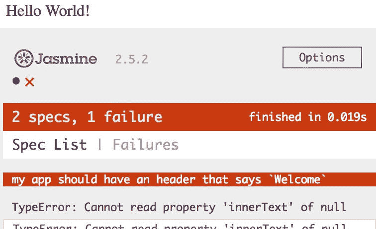

现在，不要太关注堆栈跟踪。你应该注意的重要事情是，我们有一个测试失败的名称（另一个测试仍然有效）。

在实现功能本身之前，编写测试并确保它失败是很重要的。要理解为什么，试着想象一下，我们在实现功能之前编写了测试，然后我们启动它，然后它成功了。这意味着测试实际上并没有起作用，因为我们从一开始就没有实现功能。

如果你认为这只是奇怪和不可能的，请再次思考。在实践中，经常发生这样的情况，一个看起来完全正常的测试实际上并没有测试任何东西，并且无论功能是否损坏，它总是成功的。

在这一点上，我们已经准备好实际实现功能了。我们编辑 HTML 布局，像这样：

```js
<div id="app">

  <h1>Welcome</h1>

  <p>{{greeting}}</p>

</div>

```

当我们启动页面时，结果应该类似于这样：

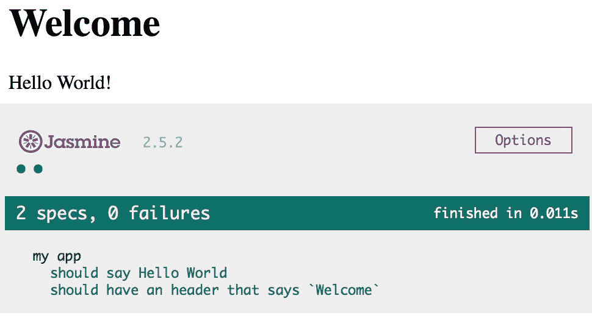

# 为你的工作流添加一些 Karma

Karma 是一个 JavaScript 测试运行器。这意味着它将为您运行测试。软件往往会迅速增长，Karma 为您提供了一种同时运行所有单元测试的方法。它还为您提供了添加监视测试覆盖率和代码质量的工具的能力。

Karma 在 Vue 项目中传统上被使用，并且作为一个工具存在于官方 Vue 模板中。学习 Karma 是您 JavaScript 工具箱的一个很好的补充，即使您不使用 Vue 也是如此。

# 准备工作

我认为已经完成了“使用 Jasmine 测试 Vue”的先决条件。由于 Karma 是一个测试运行器，所以您应该首先能够编写测试。

在这个教程中，我们将使用 npm，所以在继续之前，请确保已经安装了它，并阅读有关如何使用它的基础知识。

# 如何操作...

对于这个教程，我们将需要命令行和 npm，所以在继续之前，请确保已经安装了它。

在一个新的文件夹中，创建一个名为`package.json`的文件，并在其中写入以下内容：

```js
{

  "name": "my-vue-project",

  "version": "1.0.0"

}

```

只要将此文件放在您的文件夹中，就会创建一个新的 npm 项目。我们稍后会编辑这个文件。

在命令行中，进入项目所在的目录，并在其中输入以下命令来安装必要的依赖项：

```js
npm install --save-dev vue karma jasmine karma-jasmine karma-chrome-launcher

```

这将安装 Vue 以及 Karma、Jasmine 和 Karma 的一些插件作为我们项目的依赖项。

如果您现在查看`package.json`，您会看到它已相应地更改。

下一个命令将创建一个名为`karma.conf.js`的文件，其中包含 Karma 的配置：

```js
./node_modules/karma/bin/karma init

```

这将询问您一些问题，除了询问源文件和测试文件的位置时，其他问题都选择默认值。对于该问题，只需写入`*.js`。完成后，您应该能够在目录中看到`karma.conf.js`文件。打开它并快速查看您通过回答问题设置的所有设置。

由于 Karma 不知道 Vue，您需要进行一些小的修改，将 Vue 添加为 Karma 的依赖项。有几种方法可以做到这一点；最快的方法可能是在要加载的文件列表中添加一行。在`karma.conf.js`文件中，在`files`数组中添加以下行：

```js
...    

    // list of files / patterns to load in the browser 

files:

 [ 

'node_modules/vue/dist/vue.js'

 **,** 

'*.js' 

 ],

... 

```

请注意，当您回答问题时，您也可以直接添加该行。

下一步是编写我们要测试的应用程序。

在您的文件夹中，创建一个名为`myApp.js`的文件；在其中写入以下内容：

```js
const myApp = {

  template: `

    <div>

      <p>{{greetings}}</p>

    </div>

  `,

  data: {

    greetings: 'Hello World'

  }

}

```

我们分配给`myApp`的对象只是一个简单的 Vue 实例。

接下来，我们将为其创建一个测试。具体来说，我们将检查组件中是否包含`Hello World`文本。

创建一个名为`test.js`的文件，并在其中写入以下内容：

```js
describe('my app', () => {

  beforeEach(() => {

    document.body.innerHTML = `

      <div id="app"></div>

    `

    new Vue(myApp)

      .$mount('#app')

  })

  it('should say Hello World', () => {

    expect(document.querySelector('p').innerText)

      .toContain('Hello World')

  })

})

```

`beforeEach`块将在每个测试之前运行（现在我们只有一个测试），在检查其他功能之前重置我们的 Vue 应用程序的状态。

现在，我们可以运行我们的测试了。在终端中输入以下命令：

```js
./node_modules/karma/bin/karma start

```

你应该看到 Chrome 启动，如果你回到命令行，你应该收到类似于以下消息：

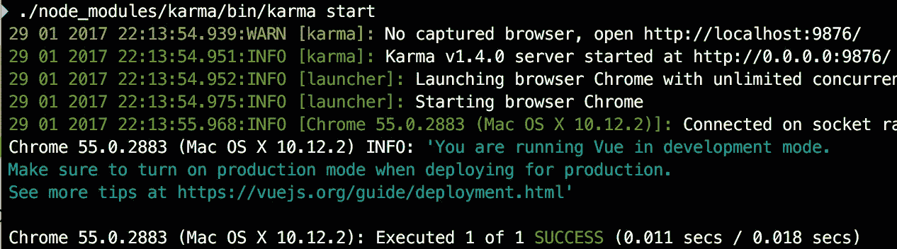

这意味着你的测试成功了。

# 工作原理...

在你的配方完成后，你应该注意你的应用程序的一般结构。你有应用程序本身在`myApp.js`中，然后你有你的测试在`test.js`中。你有一些配置文件，如`karma.conf.js`和`package.json`，你的库在`node_modules`目录中。所有这些文件一起工作，使你的应用程序可测试。

在一个真实的应用程序中，你可能会有更多的源代码和测试文件，而配置文件通常增长得更慢。

在整个设置中，你可能会想知道如何启动应用程序本身。毕竟，没有 HTML，我们只启动了测试；我们从来没有见过这个`Hello World`程序。

实际上，你是对的；这里没有要启动的程序。事实上，我们必须在测试的`beforeEach`中为 HTML 布局编写一个固定装置：

```js
beforeEach(() => {

  document.body.innerHTML = `

    <div id="app"></div>

  `

  new Vue(window.myApp)

    .$mount('#app')

})

```

在上述代码中，我们注入了 HTML，它只包含一个`<div>`元素（其余的布局在`myApp.js`中）在页面中。

然后，我们创建一个新的 Vue 实例，传递在`myApp.js`中定义的`myApp`变量中包含的选项对象；然后我们使用`$mount('#app')` Vue API，在我们刚刚注入的`<div>`元素中实际地实现应用程序。

# 还有更多...

每次从`node_modules`目录中调用 Karma 可能会很烦人。有两种方法可以使这更愉快：我们可以全局安装 Karma，或者我们可以将 Karma 添加到我们的 npm 脚本中；我们将两者都做。

首先，让我们将 Karma 添加到我们的 npm 脚本中。进入`package.json`文件，并添加以下代码块：

```js
...

"version": "1.0.0",

  "scripts": {

    "test": "./node_modules/karma/bin/karma start"

  },

"devDependencies": {

...

```

现在，你可以输入`npm run test`，Karma 将自动启动。接下来，我们可以使用以下命令全局安装 Karma：

```js
npm install -g karma

```

现在我们可以编写诸如`karma init`和`karma start`之类的命令，并且它们将被识别。我们还可以编辑我们的`package.json`，像这样：

```js
...

"version": "1.0.0",

  "scripts": {

    "test": "karma start"

  },

"devDependencies": {

...

```

# 测试应用程序的状态和方法

在这个示例中，我们将编写一个单元测试来直接触摸和检查我们的 Vue 实例的状态。测试组件状态的优势是我们不必等待 DOM 更新，即使 HTML 布局发生变化，状态变化也会慢得多，从而减少了测试所需的维护量。

# 准备工作

在尝试这个示例之前，您应该完成*将一些 Karma 添加到您的工作流程*，因为我们将描述如何编写测试，但我们不会提及测试环境的设置。

# 如何做...

假设我们有一个应用程序，它用`Hello World!`来问候您，但它还有一个按钮可以将问候语翻译成意大利语，即`Ciao Mondo!`。

为此，您需要在一个新文件夹中创建一个新的 npm 项目。在那里，您可以使用以下命令安装此示例所需的依赖项：

```js
npm install --save-dev vue karma jasmine karma-jasmine karma-chrome-

   launcher

```

要设置 Karma，就像在前一个示例中一样，运行以下命令：

```js
./node_modules/karma/bin/karma init

```

除了问题`您的源文件和测试文件的位置是什么？`，保留默认答案；对于这个问题，您应该用以下两行回答：

+   `node_modules/vue/dist/vue.js`

+   `*.js`

创建一个名为`test.js`的文件，并在其中编写一个`beforeEach`，以便将应用程序恢复到其起始状态，以便可以独立于其他测试进行测试：

```js
describe('my app', () => {

  let vm

  beforeEach(() => {

    vm = new Vue({

      template: `

        <div>

          <p>{{greetings}}</p>

          <button @click="toItalian">

            Translate to Italian

          </button>

        </div>

      `,

      data: {

        greetings: 'Hello World!'

      },

      methods: {

        toItalian () {

          this.greetings = 'Ciao Mondo!'

        }

      } 

    }).$mount()

  })

})

```

请注意，您在开始时声明了`vm`变量来引用我们的 Vue 实例。

在`beforeEach`之后（但在`describe`内部），添加以下（目前为空）测试：

```js
it(`should greet in Italian after

  toItalian is called`, () => {

})

```

在测试的第一部分中，您将使组件达到所需的状态（在调用`toItalian`之后）：

```js
it(`should greet in Italian after

    toItalian is called`, () => {

 vm.toItalian()

})

```

现在，我们想要检查问候语是否已更改：

```js
it(`should greet in Italian after

    toItalian is called`, () => {

  vm.toItalian()

 expect(vm.greetings).toContain('Ciao Mondo')

})

```

现在，为了证明每个测试之前状态都被重置了，添加以下内容：

```js
it('should greet in English', () => {

  expect(vm.greetings).toContain('Hello World')

})

```

如果状态真的被重置了，它应该包含英文问候语，如果你启动测试（使用`./node_modules/karma/bin/karma start`命令），你会发现（如果没有错误的话）确实是这样的。

# 工作原理...

由于我们有 Vue 实例本身的引用，我们可以直接在测试中访问方法和状态变量。

我希望你花一些时间欣赏测试的名称。第一个标题为`should greet in Italian after toItalian is called`。它没有提到页面或图形，并且没有对前提条件做任何假设。请注意，按钮从未被点击过，事实上，在测试标题中也没有提到按钮。

如果我们将测试标题命名为`should display 'Ciao Mondo' when Translate button is clicked on`，那么我们就会撒谎，因为我们从未检查问候语是否实际显示，并且我们在测试中从未点击按钮。

在真实应用程序中，正确命名测试非常重要，因为当你有成千上万个测试时，如果有一个测试失败，你首先读到的是标题或测试应该检查的内容。如果标题误导了，你将花费很多时间追逐一个错误的线索。

# 测试 DOM

在这个示例中，您将学习一种技术，可以快速测试 DOM 或网页本身是否符合预期，即使 Vue 组件不在页面中。

# 准备工作

对于这个示例，您应该已经有一个已经设置好并且工作正常的测试环境；如果您不知道这是什么意思，请完成*使用 Jasmine 进行 Vue 测试*示例。

我假设您已经安装了 Jasmine 并且可以执行测试。

基本上，您只需要一个网页（JSFiddle 可以）和这四个已安装的依赖项：

+   `jasmine.css`

+   `jasmine.js`

+   `jasmine-html.js`

+   `boot.js`

如果您正在使用 JSFiddle 或手动添加它们，请记住按指定的顺序添加它们。

在“使用 Jasmine 进行 Vue 测试”配方中找到这些文件的链接。

# 操作步骤如下：

假设您正在编写一个显示“Hello World！”问候语的组件；您希望测试该问候语是否实际显示，但您正在测试的网页已经足够复杂，您希望在隔离环境中测试您的组件。

事实证明，您不必实际显示组件来证明它的工作。您可以在文档之外显示和测试您的组件。

在您的测试文件或页面的测试部分中，编写以下设置来显示问候语：

```js
describe('my app', () => {

  let vm

  beforeEach(() => {

    vm = new Vue({

      template: '<div>{{greetings}}</div>',

      data: {

        greetings: 'Hello World'

      }

    })

  })

})

```

为了将我们的 Vue 实例实现为一个文档之外的元素，我们只需要添加`$mount()` API 调用：

```js
beforeEach(() => {

    vm = new Vue({

      template: '<div>{{greetings}}</div>',

      data: {

        greetings: 'Hello World'

      }

    }).$mount()

  })

```

由于我们有对`vm`的引用，我们现在可以测试我们的组件以访问在文档之外渲染的元素：

```js
it('should say Hello World', () => {

  expect(vm.$el.innerText).toContain('Hello World')

})

```

`vm.$el`元素代表我们的组件，但无法从正常的 DOM 中访问。

# 工作原理如下：

在初始化时，Vue 实例会检查是否有`el`选项。在我们的示例中，我们通常包含一个`el`选项，但这次我们有一个模板：

```js
vm = new Vue({

  template: '<div>{{greetings}}</div>',

  data: {

    greetings: 'Hello World'

  }

}).$mount()

```

当 Vue 实例具有`el`选项时，它会自动挂载到该元素（如果找到）；在我们的情况下，Vue 实例等待`$mount`调用。我们不提供任何参数给函数，因此组件会在文档之外渲染。

此时，从 DOM 中检索它的唯一方法是通过`$el`属性。一旦组件被挂载，`$el`属性始终存在，无论组件是手动挂载还是自动挂载。

从那里，我们可以像访问任何普通组件一样访问它，并测试一切是否符合我们的预期。

# 测试 DOM 的异步更新。

在 Vue 中，当组件的状态发生变化时，DOM 会相应地发生变化；这就是为什么我们称之为响应式状态的原因。唯一需要注意的是，更新不是同步的；我们必须等待额外的时间来实际传播这些变化。

# 准备中

对于这个配方，我假设你已经完成了“使用 Jasmine 进行 Vue 测试”的配方，并且知道如何编写基本测试。

# 如何做到这一点...

我们将编写的测试是 Vue 更新机制工作原理的示例。从那里，您将能够自己编写异步测试。

在我们的测试套件的`beforeEach`函数中，编写以下 Vue 实例：

```js
describe('my app', () => {

  let vm

  beforeEach(() => {

    vm = new Vue({

      template: `

        <div>

          <input id="name" v-model="name">

          <p>Hello from 

            <span id="output">{{name}}</span>

          </p>

        </div>

      `,

      data: {

        name: undefined

      }

    }).$mount()

  })

})

```

这将创建一个组件，其中包含一个文本框和一个 span 元素，该 span 元素将包含`Hello from ...`短语以及文本框中输入的任何内容。

我们将如何测试这个组件是，在文本框中编写`Herman`（通过编程方式，而不是手动），然后等待 DOM 更新。当 DOM 更新后，我们检查是否出现了`Hello from Herman`这个短语。

让我们从`beforeEach`函数之后的一个空测试开始：

```js
it('should display Hello from Herman after Herman is typed in the text-box', done => {

  done()

})

```

前面的测试已经通过了。请注意，我们正在接收`done`参数，然后将其作为函数调用。只有在调用`done()`之后，测试才会通过。

将`<span>`元素分配给一个变量以方便操作，然后将文本`Herman`插入到文本框中。

```js
it('should display Hello from Herman after Herman is typed in the text-box', done => {

 const outputEl = vm.$el.querySelector('#output')

 vm.$el.querySelector('#name').value = 'Herman'

  done()

})

```

当我们修改状态时，我们必须等待 DOM 更新，但反之则不然；当我们修改了 DOM 时，我们可以立即检查`name`变量是否已更改。

```js
it('should display Hello from Herman after Herman is typed in the text-box', done => {

  const outputEl = vm.$el.querySelector('#output')

  vm.$el.querySelector('#name').value = 'Herman'

 expect(vm.name = 'Herman')

  done()

})

```

在您编辑测试时，启动它以检查是否正常工作。

接下来，我们将为`Vue`组件的下一个更新周期安装一个监听器，称为 tick。

```js
it('should display Hello from Herman after Herman is typed in the text-box', done => {

  const outputEl = vm.$el.querySelector('#output')

  vm.$el.querySelector('#name').value = 'Herman'

  expect(vm.name = 'Herman')

 vm.$nextTick(() => {

    done()

 })

})

```

`$nextTick`块中的所有内容只有在 DOM 更新后才会运行。我们将检查`<span>`元素的内容是否已更改。

```js
it('should display Hello from Herman after Herman is typed in the text-box', done => {

  const outputEl = vm.$el.querySelector('#output')

  vm.$el.querySelector('#name').value = 'Herman'

 expect(outputEl.textContent).not.toContain('Herman')

  expect(vm.name = 'Herman')

  vm.$nextTick(() => {

 expect(outputEl.textContent).toContain('Herman')

    done()

  })

})

```

请注意，在进行下一次操作之前，我们还会验证 DOM 是否未更改。

# 工作原理如下...

官方文档中指出：

<q>Vue 以**异步**方式执行 DOM 更新。每当观察到数据变化时，它将打开一个队列并缓冲在同一事件循环中发生的所有数据变化。</q>

因此，许多测试需要使用`$nextTick`辅助函数。然而，目前正在努力创建更好的工具来处理测试和同步性，因此，尽管本文档说明了问题，但可能不是处理测试的最新方法。

# 使用 Nightwatch 进行端到端测试

有时单元测试并不能满足需求。我们可能需要集成两个独立开发的功能，并且尽管每个功能都经过了单元测试并且可以正常工作，但没有简单的方法来同时测试它们。此外，这也违背了单元测试的目的-测试软件的原子单元。在这种情况下，可以进行集成测试和端到端（end-to-end）测试。Nightwatch 是一种模拟用户在网站上点击和输入的软件。这可能是我们想要的最终验证整个系统是否正常工作的方式。

# 准备工作

在开始进行这个稍微高级的示例之前，您应该已经熟悉命令行和 npm。如果您对它们不熟悉，请查看*选择开发环境*示例。

# 操作步骤...

为这个示例创建一个新文件夹，并在其中创建一个名为`index.html`的新文件。

这个文件将包含我们的 Vue 应用程序，也是我们要测试的内容。在这个文件中写入以下内容：

```js
<!DOCTYPE html>

<html>

<head>

  <title>Nightwatch tests</title>

  <script src="https://unpkg.com/vue/dist/vue.js"></script>

</head>

<body>

  <div id="app">

  </div>

  <script>

  </script>

</body>

</html>

```

正如您所看到的，这只是一个小型 Vue 应用程序的常规样板。在`<div>`标签内放置一个标题和一个按钮；当我们点击按钮时，将显示文本`Hello Nightwatch!`：

```js
<div id="app">

  <h2>Welcome to my test page</h2>

  <button @click="show = true">Show</button>

  <p v-show="show">Hello Nightwatch!</p>

</div>

```

在`<script>`标签内，写入以下 JavaScript 代码使其工作：

```js
<script>

  const vm = new Vue({

    el: '#app',

    data: {

      show: false

    }

  })

</script>

```

我们的应用程序已经完成；现在我们进入了示例的测试部分。

执行以下命令来安装您的依赖项：

```js
npm install -g selenium-standalone http-server nightwatch

```

这将安装 Selenium 服务器，这是自动化浏览器操作所必需的，也是使 nightwatch 工作的真正原因。`http-server`命令将有助于在不必记住长文件路径的情况下提供我们的工作网站。最后，它将安装 nightwatch 本身，它在很大程度上是 Selenium 的包装器和 JavaScript API。

当 npm 完成安装所有这些工具后，创建一个名为`nightwatch.json`的新文件，其中包含 nightwatch 的配置，并在其中写入以下内容：

```js
{

  "src_folders" : ["tests"],

  "test_settings" : {

    "default" : {

      "desiredCapabilities": {

        "browserName": "chrome"

      }

    }

  }

}

```

第一个设置表示您将在名为 tests 的文件夹中编写所有测试（我们将创建该文件夹）；第二个设置只是将 Chrome 设置为我们运行测试的默认浏览器。

现在，在`test`目录下创建一个`test.js`文件。在该文件中，我们将测试应用程序。我们将验证当应用程序启动时，`<p>`标签是不可见的，并且当我们点击按钮时，它应该出现。

一个空的测试看起来像这样：

```js
module.exports = {

  'Happy scenario' :client => {}

}

```

在这里，客户端是浏览器（在本例中为 Chrome）。

我们将在`http://localhost:8080`地址上提供我们的应用程序，所以首先我们希望浏览器转到这个地址。为此，我们将编写以下代码：

```js
module.exports = {

  'Happy scenario' :client => {

    client

 .url('http://localhost:8080')

  }

}

```

接下来，我们等待页面加载；我们通过等待具有`id="app"`的`<div>`出现来间接实现这一点：

```js
module.exports = {

  'Happy scenario' :client => {

    client

      .url('http://localhost:8080')

 .waitForElementVisible('#app', 1000)

  }

}

```

第二个参数是在考虑测试失败之前愿意等待的毫秒数。

接下来，我们希望确保标题也正确显示，并且没有可见的`<p>`元素：

```js
module.exports = {

  'Happy scenario' :client => {

    client

      .url('http://localhost:8080')

      .waitForElementVisible('#app', 1000)

      .assert.containsText('h2', 'Welcome to')

 .assert.hidden('p')

  }

}

```

然后，我们点击按钮并断言`<p>`元素是可见的并且包含单词`Nightwatch`：

```js
module.exports = {

  'Happy scenario' :client => {

    client

      .url('http://localhost:8080')

      .waitForElementVisible('#app', 1000)

      .assert.containsText('h2', 'Welcome to')

      .assert.hidden('p')

      .click('button')

 .waitForElementVisible('p', 1000)

 .assert.containsText('p', 'Nightwatch')

 .end();

  }

}

```

`end()`函数将标记测试已成功，因为没有更多需要检查的内容。

要实际运行此测试，您需要运行以下命令：

```js
selenium-standalone install

```

这将安装 Selenium，然后打开三个不同的命令行。在第一个命令行中，使用以下命令启动 Selenium 服务器：

```js
selenium-standalone start

```

在第二个命令行中，进入你的食谱文件夹的根目录，即`index.html`所在的位置，并启动`http-server`：

```js
http-server .

```

启动后，它会告诉你你的网站在`http://localhost:8080`上提供服务。这就像我们在测试中写的地址一样。你现在可以导航到该地址查看应用程序的运行情况：

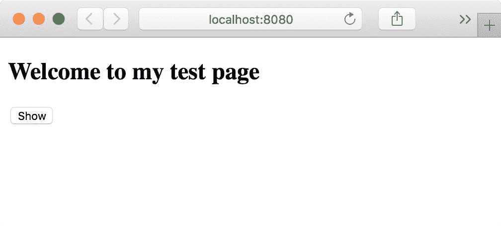

最后，在第三个命令行中，再次进入你的食谱文件夹，并输入以下命令：

```js
nightwatch

```

如果一切顺利，你会看到浏览器在你眼前闪烁，并在一瞬间（取决于你的计算机速度）显示应用程序，在控制台中，你应该看到类似于这样的内容：

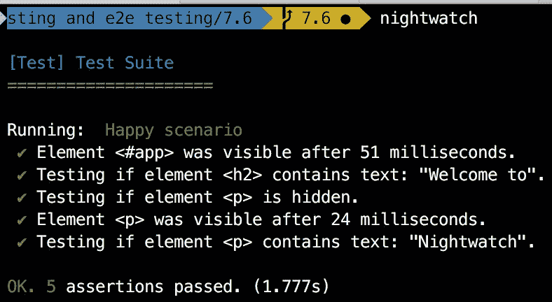

# 工作原理...

如果这个食谱看起来很费劲，不要灰心，Vue 模板已经在其中解决了所有的设置。你知道所有这些机制是如何工作的，但是当我们在后面的食谱中使用 Webpack 时，你只需要一个命令来运行端到端测试，因为一切都已经设置好了。

注意端到端测试的标题是相当通用的，它指的是一个特定的操作流程，而不是详细描述上下文和期望的内容。这在端到端测试中很常见，因为通常最好先构建用户故事，然后将它们分支，并为每个分支命名一个特定的场景。所以，举个例子，如果我们期望从服务器得到一个响应，但没有返回，我们可以测试一个场景，在这个场景中我们会出现一个错误，并将测试称为*服务器错误场景*。

# 在 nightwatch 中模拟双击

这个食谱对于那些在 nightwatch 中模拟双击而苦苦挣扎的人来说是一种享受。作为其中之一，我对此表示同情。事实证明，在 nightwatch 中有一个`doubleClick`函数，但至少在作者的意见中，它并不像预期的那样工作。

# 准备就绪

这个配方适用于刚开始使用 nightwatch 并且在这个特定问题上遇到困难的开发人员。你想学习如何模拟双击进行测试，但你不了解 nightwatch 吗？回到上一个配方。

我假设你已经设置好了 nightwatch，并且可以启动测试。我还假设你已经安装了前面配方中的所有命令。

# 工作原理...

假设你有一个 Vue 应用程序，它在一个`index.html`文件中：

```js
<!DOCTYPE html>

<html>

<head>

  <title>7.6</title>

  <script src="https://unpkg.com/vue/dist/vue.js"></script>

</head>

<body>

  <div id="app">

    <h2>Welcome to my test page</h2>

    <button id="showBtn" @dblclick="show = true">

      Show

    </button>

    <p v-show="show">Hello Nightwatch!</p>

  </div>

</body>

</html>

```

在`<div>`元素之后，添加以下脚本：

```js
<script>

  const vm = new Vue({

    el: '#app',

    data: {

      show: false

    }

  })

</script>

```

你可以使用`http-server`来提供你的应用程序。在浏览器中打开`http://localhost:8080`，然后尝试双击按钮以使文本出现。

现在，如果我们想要测试这个，我们查看 nightwatch 的 API，发现它有一个名为`doubleClick()`的函数调用。

然后我们可以编写一个类似于前面配方中的测试：

```js
'Happy scenario' : function (client) {

  client

    .url('http://localhost:8080')

    .waitForElementVisible('#app', 1000)

    .assert.containsText('h2', 'Welcome to')

    .assert.hidden('p')

    .doubleClick('button') // not working

    .waitForElementVisible('p', 1000)

    .assert.containsText('p', 'Nightwatch')

    .end();

 }

```

除了这个不会按预期工作。正确的方法是：

```js
'Happy scenario' : function (client) {

  client

    .url('http://localhost:8080')

    .waitForElementVisible('#app', 1000)

    .assert.containsText('h2', 'Welcome to')

    .assert.hidden('p')

    .moveToElement('tag name', 'button', 0, 0)

 .doubleClick()

    .waitForElementVisible('p', 1000)

    .assert.containsText('p', 'Nightwatch')

    .end();

 }

```

只有在你首先*移动*到你想要双击的元素上时，双击才起作用；只有这样，你才能调用`doubleClick`而不带任何参数。

# 工作原理...

`moveToElement`函数的参数如下：

+   `selector`：我们使用`tag name`作为选择器

+   `tag` / `selector`：我们寻找`button`标签；如果我们在这里使用了另一个选择器，我们会使用不同的格式

+   `xoffset`：这是虚拟鼠标在 x 坐标上的位置；对我们来说，0 是可以的，因为即使在按钮的边缘，点击也是有效的

+   `yoffset`：这与前面的参数类似，但在 y 轴上

在正确位置后，有一系列的命令可以释放事件。我们使用了`doubleClick`，但还有其他命令。

# 不同风格的单元测试

我们在之前的示例中发现并使用了 Jasmine。在这个示例中，我们将探索和比较不同的单元测试风格。这是特别相关的，因为 Vue 模板预装了 Mocha 和 Chai。Chai 使您能够以三种不同的风格编写测试。

# 准备工作

这个示例不需要任何特定的先前知识，但我强烈建议您完成“使用 Jasmine 进行 Vue 测试”的示例。

# 操作步骤

为了使这个示例工作，您需要两个依赖项：Mocha 和 Chai。您可以在 Google 上很快找到它们；只需记住，Mocha 有两个不同的文件：`mocha.js`和`mocha.css`。如果您希望显示得漂亮，您必须同时添加它们。

如果您正在使用 JSFiddle，请按照通常的方式继续；否则，请确保依赖项中也有 Vue。

我们的 HTML 布局将如下所示：

```js
<div id="app">

  <p>{{greeting}}</p>

</div>

<div id="mocha">

</div>

```

mocha 部分是显示所有结果的地方。

在 JavaScript 部分，编写最简单的`Vue`应用程序并将其分配给一个变量：

```js
const vm = new Vue({

  el: '#app',

  data: {

    greeting: 'Hello World!'

  }

})

```

我们将编写一个测试来查看`Hello world`文本是否真的被显示出来。

在`Vue`应用程序完成后，写入以下内容：

```js
mocha.setup('bdd')

chai.should()

describe('my app', () => {

  it('should say Hello World', () => {

    vm.$el.innerText.should.contain('Hello World')

  })

})

mocha.run()

```

上述代码准备了`mocha`和`chai`（通过安装`describe`，`it`和`should`函数），然后断言我们组件的内部文本应该包含`Hello World`。相当易读，不是吗？

您可以启动应用程序，然后您将看到这个：

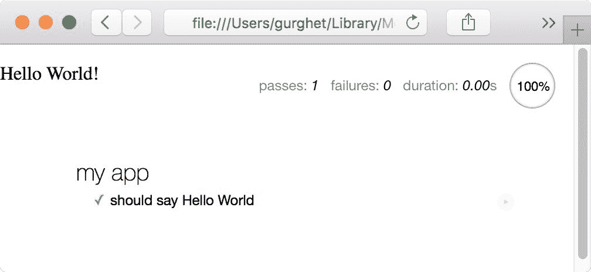

chai 还允许我们以另外两种方式编写完全相同的测试。第一种方式如下所示：

```js
 vm.$el.innerText.should.contain('Hello World')

```

要使用第二种方式，您必须在之前添加`const expect = chai.expect`：

```js
expect(vm.$el.innerText).to.contain('Hello World')

```

最后，在之前添加`const assert = chai.assert`行：

```js
assert.include(vm.$el.innerText,

  'Hello World',

  'Component innerText include Hello World')

```

在 assert 风格中，将消息作为附加参数添加是惯用的做法，以使测试在出现问题时更加详细。

# 它是如何工作的...

Chai 是一个简单的库，它实现了一些函数，并在某些条件不满足时抛出异常。另一方面，Mocha 运行某些代码片段，收集异常，并尝试以友好的方式向用户显示它们。

虽然使用哪种风格主要是品味问题，但这三种风格之间存在一些细微的差别。

+   `Should`更加雄辩和可读。不幸的是，它扩展了`Object`，将`should`函数添加到了所有对象上。如果你不知道如何对待最后一句话，你不应该介意，但正确的行为方式是奔跑并尖叫痛苦；永远不要扩展`Object`。

+   `Assert`意味着对每个断言编写详细的描述，如果你为每个测试编写多个断言，这通常是很好的。就个人而言，我认为每个测试最多只应该有一个断言，并且应该集中在标题上进行描述。

+   `Expect`不扩展`Object`，非常可读且平衡良好，通常我更喜欢使用它而不是其他替代方案。

# 使用 Sinon.JS 进行外部 API 调用的存根化

通常，在进行端到端测试和集成测试时，您将运行并准备好后端服务器以响应您的请求。我认为有很多情况下这是不可取的。作为前端开发人员，您会抓住每一个机会责怪后端人员。

# 准备工作

完成这个示例不需要特殊的技能，但您应该将 Jasmine 安装为依赖项；这在*使用 Jasmine 进行 Vue 测试*示例中有详细说明。

# 如何操作...

首先，让我们安装一些依赖项。对于这个示例，我们将使用 Jasmine 来运行整个测试；您可以在*使用 Jasmine 进行 Vue 测试*示例中找到详细的说明（这四个文件分别是`jasmine.css`，`jasmine.js`，`jasmine-html.js`和`boot.js`，按照这个顺序）。

在继续之前，还要安装 Sinon.JS 和 Axios；您只需要添加与它们相关的`js`文件。

我们将构建一个在点击按钮时检索帖子的应用程序。在 HTML 部分中，编写以下内容：

```js
<div id="app">

  <button @click="retrieve">Retrieve Post</button>

  <p v-if="post">{{post}}</p>

</div>

```

相反，JavaScript 部分将如下所示：

```js
const vm = new Vue({

  el: '#app',

  data: {

    post: undefined

  },

  methods: {

  retrieve () {

    axios

      .get('https://jsonplaceholder.typicode.com/posts/1')

      .then(response => {

        console.log('setting post')

        this.post = response.data.body

      })

    }

  }

})

```

如果您现在启动应用程序，应该能够看到它正在工作：

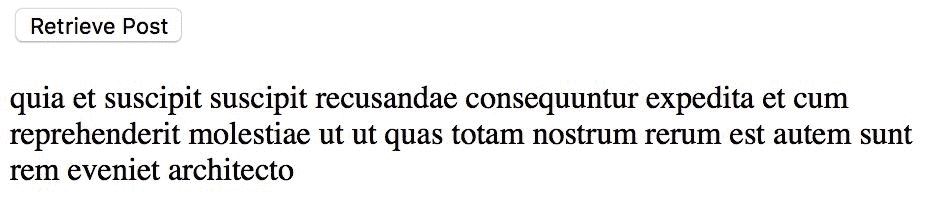

现在我们想要测试应用程序，但我们不想连接到真实的服务器。这将需要额外的时间，并且不可靠；相反，我们将从服务器获取一个正确的样本响应并使用它。

Sinon.JS 有一个沙盒的概念。这意味着每当一个测试开始时，一些依赖项（如 Axios）都会被覆盖。每个测试结束后，我们可以丢弃沙盒，一切都恢复正常。

使用 Sinon.JS 的空测试如下所示（在`Vue`实例之后添加）：

```js
describe('my app', () => {

  let sandbox

  beforeEach(() => sandbox = sinon.sandbox.create())

  afterEach(() => sandbox.restore())

})

```

我们想要为 axios 的`get`函数存根调用：

```js
describe('my app', () => {

  let sandbox

  beforeEach(() => sandbox = sinon.sandbox.create())

  afterEach(() => sandbox.restore())

  it('should save the returned post body', done => {

    const promise = new Promise(resolve => 

 resolve({ data: { body: 'Hello World' } })

 )

 sandbox.stub(axios, 'get').returns(promise)

 ...

 done()

 })

})

```

我们在这里覆盖了 axios。我们说现在`get`方法应该返回`resolved`的 promise：

```js
describe('my app', () => {

  let sandbox

  beforeEach(() => sandbox = sinon.sandbox.create())

  afterEach(() => sandbox.restore())

 it

('

should save the returned post body'

,

 done

 =>

 {

    const promise = new Promise(resolve => 

      resolve({ data: { body: 'Hello World' } })

    )

    sandbox

.

stub

(

axios

,

 'get'

).

returns

(

promise

)

    vm

.

retrieve

()

    promise.then(() => {

      expect

(

vm

.

post

).

toEqual

(

'Hello World'

)

      done

()

    }) 

  }) 

})

```

由于我们返回了一个 promise（我们需要返回一个 promise，因为`retrieve`方法正在调用它的`then`方法），所以我们需要等待它解析。

我们可以启动页面并查看它是否工作：

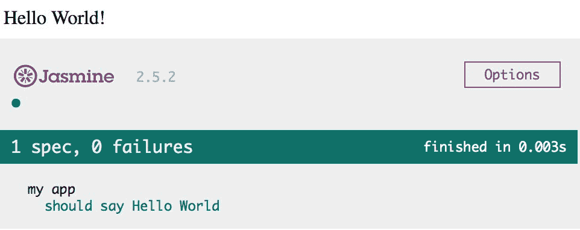

如果您使用 JSFiddle，请记住将加载类型设置为 No wrap - in `<body>`，否则 Vue 将没有机会启动。

# 它是如何工作的...

在我们的案例中，我们使用沙盒来存根其中一个依赖项的方法。这样，axios 的`get`方法就不会被触发，我们会收到一个类似于后端将给我们的对象。

存根 API 响应将使您与后端及其怪癖隔离开来。如果出现问题，您不会在意，而且您可以在不依赖于后端正确运行的情况下运行测试。

有许多库和技术可以存根 API 调用，不仅与 HTTP 相关。希望这个示例为您提供了一个起步。

# 测量代码的覆盖率

代码覆盖率是评估软件质量最常用和易于理解的指标之一。如果一个测试执行了特定的代码部分，那么该代码被认为是被覆盖的。这意味着该特定代码部分正常工作且包含错误的可能性较小。

# 准备就绪

在测量代码覆盖率之前，请确保完成“将一些 Karma 添加到你的工作流程”这个步骤，因为我们将使用 Karma 来帮助我们。

# 如何操作...

创建一个新目录，并在其中放置一个名为`package.json`的文件。在其中写入以下内容：

```js
{

 "name": "learning-code-coverage",

 "version": "1.0.0"

}

```

这将创建一个 npm 项目。在同一目录中，运行以下命令来安装我们的依赖项：

```js
npm install vue karma karma jasmine karma-jasmine karma-coverage karma-chrome-launcher --save-dev

```

`package.json`文件会相应地更改。

`karma-coverage`插件使用底层软件 Istanbul 来测量和显示我们的测试覆盖率。

为了使下一步更容易一些，我们将全局安装 Karma（如果你还没有安装）。运行以下命令：

```js
npm install -g karma

```

当安装了 Karma 后，在你的目录中运行以下命令；它将创建一个 Karma 配置文件：

```js
karma init

```

除非它要求你加载文件，否则回答所有问题的默认值；在这种情况下，写下以下两行：

+   `node_modules/vue/dist/vue.js`

+   `*.js`

在此之后留一个空行以确认。

这将加载 Vue 和以`js`扩展名结尾的所有文件到目录的根目录中。

打开 Karma 创建的文件；它应该被称为`karma.conf.js`，并且应该与其他文件一起在你的目录中。

应该有一个类似以下的部分：

```js
preprocessors: {

},

```

在 preprocessors 对象中，插入 coverage，如下所示：

```js
preprocessors: {

  'myApp.js': ['coverage']

},

```

这意味着我们想要使用 coverage 预处理器对`myApp.js`文件进行预处理。`myApp.js`文件将包含我们要测试的应用程序。

紧接着，在`reporters`数组中添加 coverage：

```js
reporters: ['progress', 'coverage'

],

```

这将使 coverage 报告生成一个包含覆盖率测量的网页。

为了使设置正常工作，您需要在`frameworks`和`files`之间设置另一个属性，称为`plugins`：

```js
plugins: [

 'karma-jasmine',

 'karma-coverage',

 'karma-chrome-launcher'

],

```

接下来，我们将编写一个简单的 Vue 应用程序进行测试。

创建一个名为`myApp.js`的文件；我们将创建一个猜数字游戏。

在文件中写入以下内容：

```js
const myApp = {

  template: `

    <div>

      <p>

        I am thinking of a number between 1 and 20.

      </p>

      <input v-model="guess">

      <p v-if="guess">{{output}}</p>

    </div>

  `

}

```

用户将输入一个数字，输出将显示一个提示或者一个文本来庆祝胜利，如果数字正确。将以下状态添加到`myApp`对象中：

```js
data: {

  number: getRandomInt(1, 20),

  guess: undefined

}

```

在文件的顶部，您可以添加一个名为`getRandomInt`的函数，如下所示：

```js
function getRandomInt(min, max) {

  return Math.floor(Math.random() * (max - min)) + min;

}

```

我们还需要一个计算属性来显示提示：

```js
computed: {

  output () {

    if (this.guess < this.number) {

      return 'Higher...'

    }

    if (this.guess > this.number) {

      return 'Lower...'

    }

    return 'That's right!'

  }

}

```

我们的应用程序已经完成。让我们测试一下它是否按预期工作。

在目录的根目录下创建一个名为`test.js`的文件，并编写以下测试：

```js
describe('my app', () => {

  let vm

  beforeEach(() => {

    vm = new Vue(myApp).$mount()

    vm.number = 5

  })

  it('should output That's right! if guess is 5', () => {

    vm.guess = 5

    expect(vm.output).toBe('That's right!')

  })

})

```

要运行测试，请使用以下命令：

```js
karma start

```

如果前面的命令在已经安装了`karma-coverage`插件的情况下没有要求安装该插件，您可以全局安装插件，或者使用本地安装的 Karma 从`./node-modules/karma/bin/karma start`运行测试。

如果您的浏览器打开了，请返回控制台，当测试完成时，按下*Ctrl* + *C*停止 Karma。

如果一切顺利，您应该会看到一个名为 coverage 的新文件夹，其中包含一个名为 Chrome 的目录。您还应该在其中找到一个名为`index.html`的文件。打开它，您会看到一个类似于这样的页面：

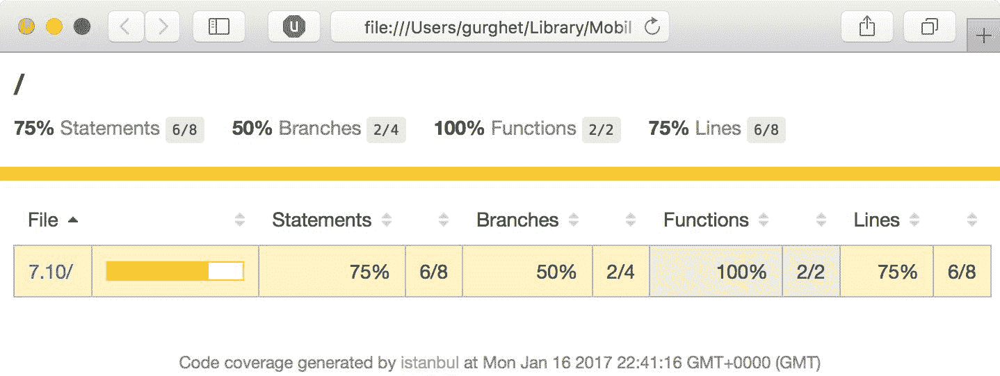

从一开始，我们就可以看到黄色表示出现了问题。我们测试了 100％的函数，但只测试了 50％的 if 分支。

如果您浏览并打开`myApp.js`文件的详细信息，您会发现我们没有测试`if`语句的两个分支：

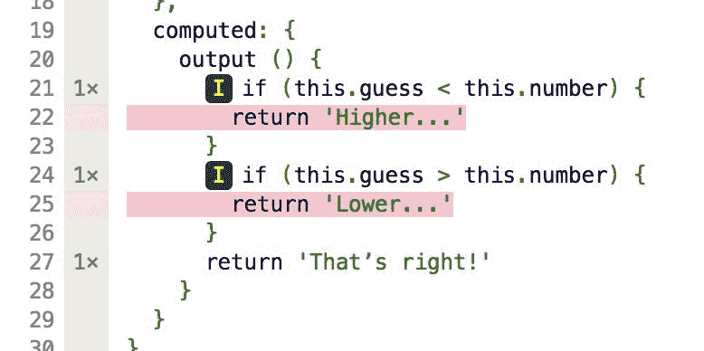

这些分支内部可能会出现错误，我们甚至可能不知道！

尝试在测试文件中添加以下两个测试：

```js
it('should output Lower... if guess is 6', () => {

  vm.guess = 6

  expect(vm.output).toBe('Lower...')

})

it('should output Higher... if guess is 4', () => {

  vm.guess = 4

  expect(vm.output).toBe('Higher...')

})

```

现在，如果您运行测试并打开报告，它看起来会更加绿色：

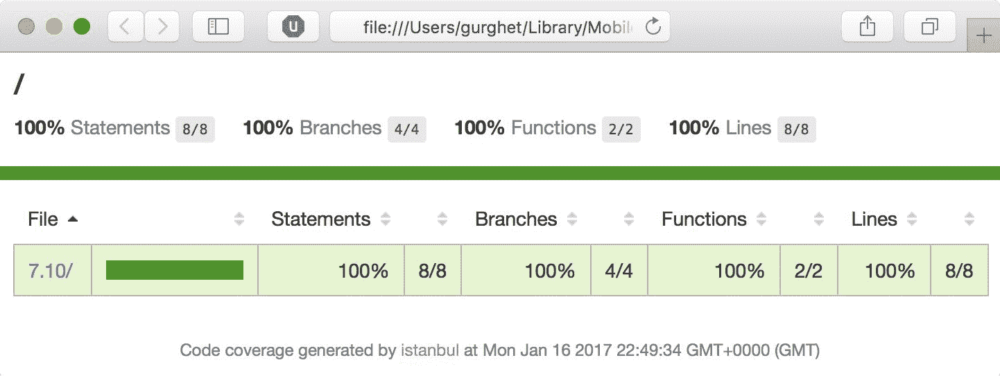

# 工作原理如下...

我们甚至没有打开应用程序，但我们已经非常确定它能正常工作，这要归功于我们的测试。

此外，我们有一份报告显示我们覆盖了 100%的代码。尽管我们只测试了猜数字游戏的三个数字，但我们覆盖了所有可能的分支。

我们永远无法确定我们的软件没有错误，但这些工具对我们开发人员在添加功能到我们的软件时非常有帮助，而不必担心可能会出现问题。
