# 第七章：组织+自动化+部署=Webpack

在本章中，我们将讨论以下主题：

+   从组件中提取逻辑以保持代码整洁

+   使用 Webpack 打包您的组件[预览](https://cdp.packtpub.com/vue_js_2_cookbook/wp-admin/post.php?post=70&action=pdfpreview)

+   使用 Webpack 组织您的依赖项

+   在 Webpack 项目中使用外部组件

+   使用热重载进行连续反馈的开发

+   使用 Babel 编译 ES6

+   在开发过程中运行代码检查器

+   只使用一个命令构建压缩和开发.js 文件

+   将您的组件发布到公共场所

# 引言

Webpack 与 npm 结合是一个非常强大的工具。本质上，它只是一个打包工具，将一些文件及其依赖项打包成一个或多个可消费的文件。它现在已经进入第二个版本，并且对于 Vue 开发人员来说比以前更重要。

Webpack 将使您能够方便地在单个文件中编写组件，并可通过命令进行发布。它将使您能够使用不同的 JavaScript 标准，如 ES6，以及其他语言，这都要归功于**加载器**，这个概念将在后续的示例中反复出现。

# 从组件中提取逻辑以保持代码整洁

Vue 组件有时可能变得非常复杂。在这些情况下，最好将它们拆分并尝试使用抽象隐藏一些复杂性。放置此类复杂性的最佳位置是外部 JavaScript 文件。这样做的好处是，如果需要的话，更容易与其他组件共享提取的逻辑。

# 准备工作

这个示例是中级水平的。在来到这里之前，您应该已经完成了第一章中的“选择开发环境”示例，以及“开始使用 Vue.js”，并且应该知道如何使用 npm 设置项目。

还要确保您已经全局安装了`vue-cli`包，使用以下命令：

```js
npm install -g vue-cli

```

# 如何做...

我们将构建一个复利计算器；您将发现在初始投资后您将拥有多少钱。

# 创建一个干净的 Webpack 项目

创建一个新目录，并使用以下命令在其中创建一个新的`Vue`项目：

```js
vue init webpack

```

您可以选择问题的默认值。

运行`npm install`来安装所有所需的依赖项。

然后，导航到目录结构中的`src/App.vue`，并删除文件中的几乎所有内容。

最终结果应该如下所示：

```js
<template>

  <div id="app">

  </div>

</template>

<script>

export default {

  name: 'app'

}

</script>

<style>

</style>

```

我已经为您完成了这个任务，您可以使用以下命令来使用另一个模板：

`vue init gurghet/webpack`

# 构建复利计算器。

要构建复利计算器，您需要三个字段：初始资本或本金、年利率和投资期限。然后，您将添加一个输出字段来显示最终结果。以下是相应的 HTML 代码：

```js
<div id="app">

  <div>

    <label>principal capital</label>

    <input v-model.number="principal">

  </div>

  <div>

    <label>Yearly interestRate</label>

    <input v-model.number="interestRate">

  </div>

  <div>

    <label>Investment length (timeYears)</label>

    <input v-model.number="timeYears">

  </div>

  <div>

    You will gain:

    <output>{{final}}</output>

  </div>

</div>

```

我们使用`.number`修饰符，否则我们放入的数字将被 JavaScript 转换为字符串。

在 JavaScript 部分，通过编写以下代码声明三个模型变量：

```js
export default {

  name: 'app',

  data () {

    return {

      principal: 0,

      interestRate: 0,

      timeYears: 0

    }

  }

}

```

为了计算复利，我们采用数学公式：

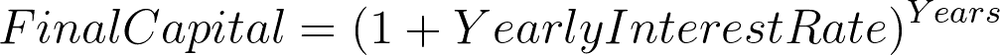

在 JavaScript 中，可以这样写：

```js
P * Math.pow((1 + r), t)

```

您需要将此添加到`Vue`组件中作为计算属性，如下所示：

```js
computed: {

  final () {

    const P = this.principal

    const r = this.interestRate

    const t = this.timeYears

    return P * Math.pow((1 + r), t)

  }

}

```

您可以使用以下命令运行应用程序（从您的目录启动）：

```js
npm run dev

```

现在我们的应用程序可以工作了，您可以看到将 0.93 美元存入一个年利率为 2.25%的银行账户并沉睡 1000 年后我们将获得多少钱（43 亿美元！）：

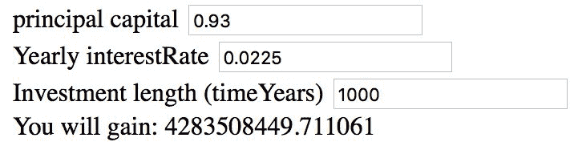

目前，代码中的公式并不重要。但是，如果我们有另一个组件也执行相同的计算，我们也希望更明确地表明我们正在计算复利，而不关心此范围内的公式实际上是什么。

在`src`文件夹中创建一个名为`compoundInterest.js`的新文件；在其中编写以下代码：

```js
export default function (Principal, yearlyRate, years) {

  const P = Principal

  const r = yearlyRate

  const t = years

  return P * Math.pow((1 + r), t)

}

```

然后相应地修改`App.vue`中的代码：

```js
computed: {

  final () {

    return compoundInterest(

 this.principal,

 this.interestRate,

 this.timeYears

 )

  }

}

```

另外，请记住在 JavaScript 部分的顶部导入我们刚刚创建的文件：

```js
<script>

 import compoundInterest from './compoundInterest'

  export default {

  ...

```

# 它是如何工作的...

在组件中工作或者一般编程时，将代码的范围减小到只有一个抽象层级会更好。当我们编写一个计算函数来返回最终的资本值时，我们只需要担心调用正确的函数-适用于我们目的的函数。公式的内部在更低的抽象层级上，我们不想处理它。

我们所做的是将所有繁琐的计算工作放在一个单独的文件中。然后，我们使用以下代码从文件中导出函数：

```js
export default function (Principal, yearlyRate, years) {

...

```

这样，当我们从`Vue`组件导入文件时，默认情况下该函数可用：

```js
import compoundInterest from './compoundInterest'

...

```

所以，现在`compoundInterest`是我们在另一个文件中定义的函数。此外，这种关注点的分离使我们能够在代码的任何地方使用此函数来计算复利，甚至在其他文件中（潜在地也可以是其他项目中）。

# 使用 Webpack 打包您的组件

Webpack 允许您将项目打包成压缩的 JavaScript 文件。然后，您可以分发这些文件或自己使用它们。当您使用`vue-cli`附带的内置模板时，Webpack 会配置为构建一个完整的工作应用程序。有时我们想要构建一个库以发布或在另一个项目中使用。在这个示例中，您将调整 Webpack 模板的默认配置以发布一个组件。

# 准备工作

只有在您安装了 npm（参考第一章中的*选择开发环境*示例，*开始使用 Vue.js*）并熟悉`vue-cli`和 Webpack 模板后，这个示例才会有意义。

# 如何做...

对于这个教程，您将构建一个可重用的组件，可以抖动您放入其中的任何内容；为此，我们将使用优秀的 CSShake 库。

基于 Webpack 模板创建一个新的干净项目。您可以查看之前的教程来了解如何做到这一点，或者您可以使用我制作的预构建模板。您可以通过创建一个新目录并运行此命令来使用我的模板：

```js
vue init gurghet/webpack

```

如果您不知道它们的含义，请选择默认答案。记得运行`npm install`来引入依赖项。

首先，让我们重命名一些东西：将`App.vue`文件重命名为`Shaker.vue`。

在其中，将以下内容作为 HTML 模板写入：

```js
<template>

  <span id="shaker" class="shake">

    <link rel="stylesheet" type="text/css" href="https://csshake.surge.sh/csshake.min.css">

    <slot></slot>

  </span>

</template>

```

请注意，与原始模板相比，我们将`<div>`更改为`<span>`。这是因为我们希望我们的抖动器成为一个内联组件。

组件本身已经完成了；我们只需要在 JavaScript 部分进行一些微小的美化编辑：

```js
<script>

  export default {

    name: 'shaker

'

  }

</script>

```

为了手动测试我们的应用程序，我们可以按照以下方式修改`main.js`文件（突出显示的文本是修改后的代码）：

```js
// The Vue build version to load with the `import` command

// (runtime-only or standalone) has been set in webpack.base.conf with an alias.

import Vue from 'vue'

import Shaker from './Shaker'

/* eslint-disable no-new */

new Vue({

  el: '#app',

 template: `

    <div>

      This is a <Shaker>test</Shaker>

    </div>

  `, 

  components: { Shaker

 }

})

```

这将创建一个示例页面，如下图所示，在其中我们可以使用热重载来原型化我们的组件。通过运行以下命令来启动它：

```js
npm run dev

```

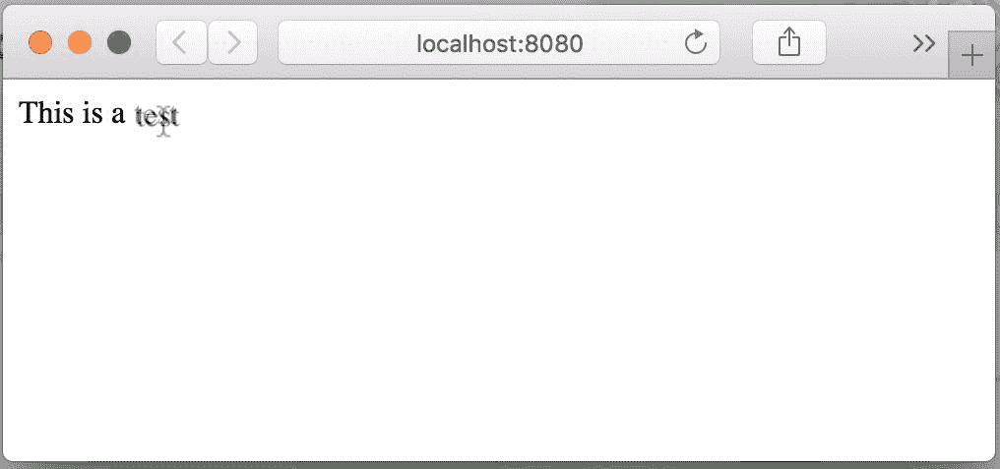

将光标放在单词`test`上应该使其抖动。

现在，我们希望将此组件打包到一个单独的 JavaScript 文件中，以便将来可以重用。

默认模板中没有此配置，但很容易添加一个。

首先，在`build`文件夹中的`webpack.prod.js`文件中进行一些修改。

让我们摆脱一些我们在发布库时不需要的插件；找到文件中的`plugins`数组。它是一个包含以下代码形式的插件数组：

```js
plugins: [

  new Plugin1(...),

  new Plugin2(...),

  ...

  new PluginN(...)

]

```

我们只需要以下插件：

+   `webpack.DefinePlugin`

+   `webpack.optimize.UglifyJsPlugin`

+   `webpack.optimize.OccurrenceOrderPlugin`

摆脱所有其他插件，因为我们不需要它们；最终的数组应该是这样的：

```js
plugins: [

  new webpack.DefinePlugin({

    'process.env': env

  }),

  new webpack.optimize.UglifyJsPlugin({

    compress: {

      warnings: false

    }

  }),

  new webpack.optimize.OccurrenceOrderPlugin()

]

```

第一个允许您添加一些其他配置，第二个插件将文件进行了缩小，第三个插件将优化生成文件的大小。

我们还需要编辑的另一个属性是`output`，因为我们希望简化输出路径。

原始属性如下所示：

```js
output: {

  path: config.build.assetsRoot,

  filename: utils.assetsPath('js/[name].[chunkhash].js'),

  chunkFilename: utils.assetsPath('js/[id].[chunkhash].js')

}

```

原始代码会创建一个`js`目录中的一系列输出文件。方括号中有一些变量；因为您只有一个自包含模块用于我们的应用程序，我们将其称为*shaker*。我们需要获得以下代码：

```js
output: {

  path: config.build.assetsRoot,

 filename: utils.assetsPath('shaker.js') 

}

```

由于，正如刚才所说，您希望组件是自包含的，我们需要进行一些其他的修改，这也取决于您的需求。

如果您希望组件内置任何 CSS 样式（在我们的情况下，我们使用的是外部 CSS 库），您应该禁用`ExtractTextPlugin`；我们已经从列表中删除了该插件，但仍有其他文件在使用它。在`vue-loader.conf.js`文件中找到`extract`选项（某些版本中的`vue`部分）并将其替换为以下代码：

```js
... {

  loaders: utils.cssLoaders({

    ...

    extract: false

  })

}

```

我们的组件通常会包含 Vue 库；如果您想在 Vue 项目中使用该组件，您不需要这个库，因为它会造成重复的代码。您可以告诉 Webpack 只在外部搜索依赖项而不包含它们。在您刚刚修改的`webpack.prod.js`文件中的`plugins`之前添加以下属性：

```js
externals: {

  'vue': 'Vue'

}

```

这将告诉 Webpack 不将 Vue 库写入捆绑包中，而是只需使用一个全局的名为`Vue`的变量，在我们的代码中导入`vue`依赖项时使用它。Webpack 配置几乎完成了；我们只需要在`module`属性之前添加另一个属性：

```js
var webpackConfig = merge(baseWebpackConfig, {

  entry: {

 app: './src/dist.js'

 },

  module: {

  ...

```

这将从`dist.js`文件开始编译代码。等一下，这个文件还不存在。让我们创建它并在内部添加以下代码：

```js
import Vue from 'vue'

import Shaker from './Shaker'

Vue.component('shaker', Shaker)

```

在最终的 JavaScript 压缩文件中，Vue 依赖将被外部引用，然后我们将组件全局注册。

作为最后的更改，我建议修改保存压缩文件的文件夹。在`config/index.js`文件中，编辑以下行：

```js
assetsSubDirectory: 'static',

```

将上述行与以下代码进行交换：

```js
assetsSubDirectory: '.',

```

现在使用 npm 运行命令来构建压缩文件：

```js
npm run build

```

您将看到一个类似于以下内容的输出：

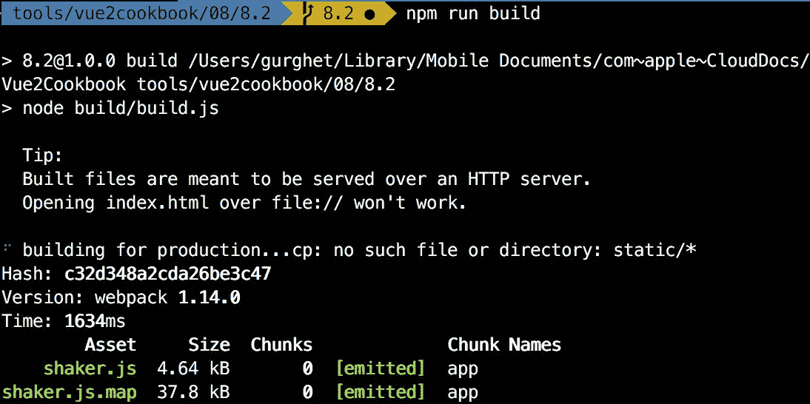

为了测试我们的文件，我们可以使用 JSFiddle。

复制您在`dist/shaker.js`中创建的文件的内容，然后转到[`gist.github.com/`](https://gist.github.com/)（您可能需要注册），将文件的内容粘贴到文本区域内。将其命名为`shaker.js`：

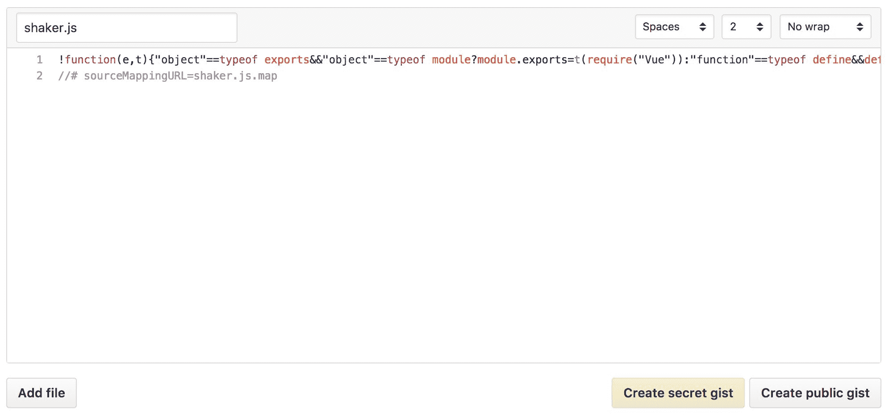

由于文本是单行的，使用“No wrap”选项时您将看不到太多内容。点击“创建公共 gist”，当您看到下一页时，点击“Raw”，如下图所示：

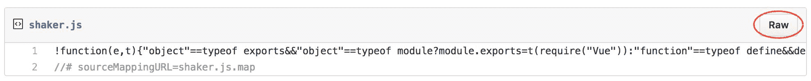

复制地址栏中的 URL，然后转到[`rawgit.com/`](http://rawgit.com/)，在那里您可以粘贴链接：

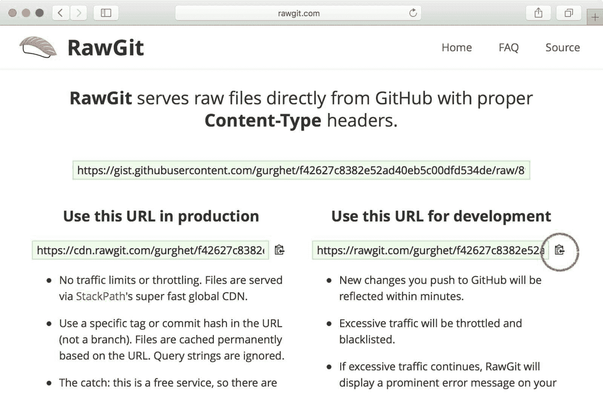

点击并复制右侧获得的链接。恭喜，您刚刚将您的组件发布到了 Web 上！

现在转到 JSFiddle 并选择 Vue 作为库。您现在可以在左侧添加您复制的链接，您的组件就可以使用了：

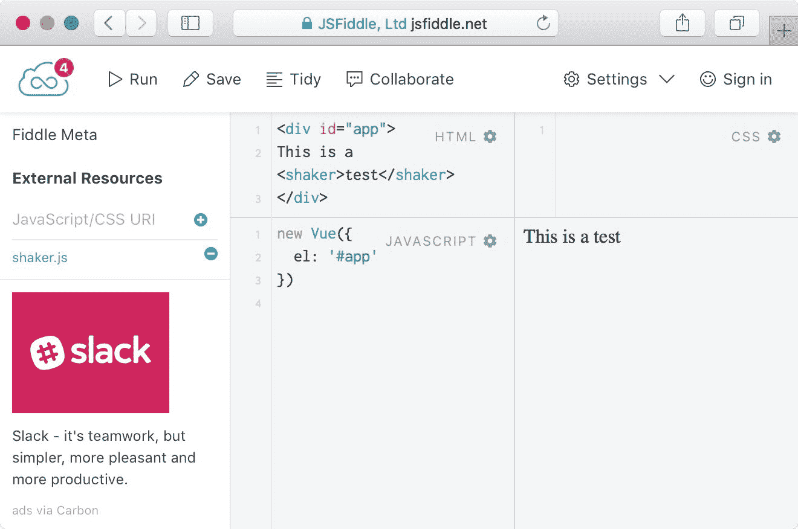

# 工作原理...

官方模板中的 Webpack 配置相当复杂。另一方面，不要试图一下子理解所有内容，否则您会陷入困境，也无法学到太多东西。

我们创建了一个**UMD**（**通用模块定义**）模块，它将尝试查看是否有可用的 Vue 依赖，并将自身安装为一个组件。

您甚至可以为您的组件添加 CSS 和样式，我们配置的 Webpack 将会将样式与组件一起发布。

# 还有更多...

在本章的“将组件发布到公共场所”示例中，您将学习如何将组件发布到 npm 发布注册表中。我们将使用与此不同的方法，但您可以在那里找到将其发布到注册表的缺失步骤。

# 使用 Webpack 组织您的依赖关系

Webpack 是一个用于组织代码和依赖关系的工具。此外，它还提供了一种开发和构建 JavaScript 文件的方式，这些文件包含了我们传递给它们的所有依赖和模块。我们将在这个示例中使用它来构建一个小型的 Vue 应用程序，并将所有内容打包到一个单独的文件中。

# 准备就绪

这个示例不需要任何特殊的技能，只需要使用 npm 和一些命令行的知识。您可以在本章的“使用 Webpack 组织您的依赖关系”示例中了解更多信息。

# 如何做到...

为您的示例创建一个新的文件夹，并在其中创建一个包含以下内容的`package.json`文件：

```js
{

 "name": "recipe",

 "version": "1.0.0"

}

```

这在我们的文件夹中定义了一个 npm 项目。当然，如果你知道你在做什么，你可以使用`npm init`或`yarn init`。

我们将为这个示例安装 Webpack 2。要将其添加到您的项目依赖项中，请运行以下命令：

```js
npm install --save-dev webpack@2

```

`--save-dev`选项意味着我们不会在最终产品中发布 Webpack 的代码，而只会在开发过程中使用它。

创建一个新的`app`目录，并在其中创建一个`App.vue`文件。

这个文件将是一个简单的`Vue`组件；它可以像下面这样简单：

```js
<template>

  <div>

    {{msg}}

  </div>

</template>

<script>

export default {

  name: 'app',

  data () {

    return {

      msg: 'Hello world'

    }

  }

}

</script>

<style>

</style>

```

我们需要告诉 Webpack 如何将`.vue`文件转换为`.js`文件。为此，我们在根文件夹中创建一个名为`webpack.config.js`的配置文件；这个文件将被 Webpack 自动识别。在这个文件中，写入如下内容：

```js
module.exports = {

  module: {

    rules: [

      {test: /.vue$/, use: 'vue-loader'}

    ]

  }

}

```

规则中的行表示以下内容：

<q>嘿 Webpack，当你看到一个以`.vue`结尾的文件时，使用`vue-loader`将其转换为 JavaScript 文件。</q>

我们需要使用以下命令使用 npm 安装这样的加载器：

```js
npm install --save-dev vue-loader

```

此加载器内部使用其他依赖项，这些依赖项不会自动安装；我们需要通过运行以下命令手动安装它们：

```js
npm install --save-dev vue-template-compiler css-loader

```

我们还可以趁此机会安装 Vue 本身：

```js
npm install --save vue

```

现在我们的`Vue`组件已经准备好了。我们需要编写一个页面来放置它并尝试它。在`app`文件夹中创建一个名为`index.js`的文件。我们将在 Vue 实例中实例化该组件。在`index.js`中写入以下内容：

```js
import Vue from 'vue'

import App from './App.vue'

new Vue({

  el: '#app',

  render: h => h(App)

})

```

这将在具有`id="app"`的元素内挂载 Vue 实例，并且它将包含一个单独的组件-我们的`App.vue`。

我们还需要一个 HTML 文件。在根目录中创建`index.html`，并使用以下代码：

```js
<!DOCTYPE html>

<html>

  <head>

    <title>Webpack 2 demo</title>

  </head>

  <body>

    <div id="app"></div>

    <script src="dist/bundle.js"></script>

  </body>

</html>

```

我们不想直接引用`app/index.js`，这是因为`index.js`本身并不包含太多内容。它有一个浏览器无法识别的`import`语句。Webpack 可以轻松地创建包含`index.js`及其所有依赖项的`dist/bundle.js`。要做到这一点，请运行以下命令：

```js
./node_modules/webpack/bin/webpack.js app/index.js dist/bundle.js

```

这应该生成类似于以下内容的输出：

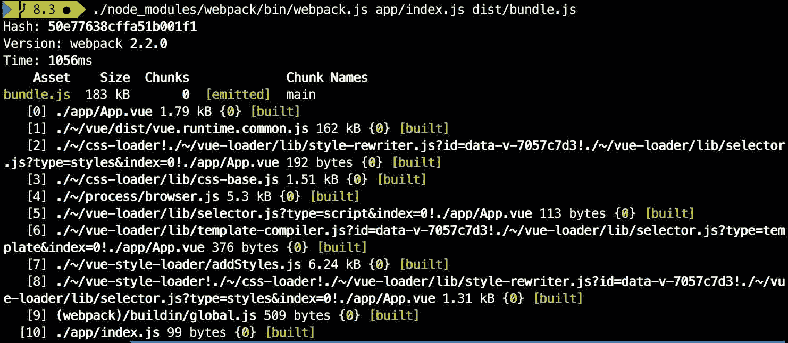

现在，您可以打开`index.html`，您将看到组件正在工作。

然而，每次都运行这个长命令并不那么有趣。Webpack 和 npm 可以做得更好。

在`webpack.config.js`中添加以下属性：

```js
module.exports = {

  entry: './app/index.js',

 output: {

 filename: 'bundle.js',

 path: __dirname + '/dist'

 },

  module: {

  ...

```

这将指定 Webpack 的入口点和结果文件的保存位置。

我们还可以在`package.json`中添加一个脚本：

```js
"scripts": {

  "build": "webpack"

}

```

现在，运行`npm run build`将产生与我们使用的长命令相同的效果。

# 它是如何工作的...

在这个示例中，我们基本上创建了一个同时包含 Vue 和我们编写的组件的 JavaScript 文件（`bundle.js`）。在`index.html`中，没有 Vue 的痕迹，因为它被嵌入在`bundle.js`中。

当我们有很多依赖关系时，这种工作方式要好得多。我们不再需要在页面的头部或正文中添加很多标签。此外，我们不必担心加载不需要的依赖关系。

作为额外的奖励，Webpack 具有将我们的最终文件和其他高级优化压缩的能力和灵活性，这是通过手动加载依赖项无法实现的。

# 在您的 Webpack 项目中使用外部组件

在自己的项目中使用外部 Vue 组件通常很简单。然而，有时候事情并不那么简单。特别是，在官方模板中有一些 Webpack 的配置（奇怪的是）实际上会阻止您使用某些外部组件。在这个示例中，我们将安装 Bulma 项目中的一个模态对话框组件。

# 准备工作

在这个示例中，我们将调整 Webpack 配置。建议在开始此任务之前完成“使用 Webpack 组织依赖项”示例。

# 如何操作...

我们将从一个全新的 Webpack 项目开始。您可以使用`vue-cli`和官方 Webpack 模板创建一个新项目。然而，我建议您使用我的 Webpack 模板开始，这是一个干净的模板。要这样做，请在一个新的目录中运行以下命令：

```js
vue init gurghet/webpack

```

我们将安装`vue-bulma-modal`，这是一个使用 Bulma CSS 框架编写的 Vue 组件：

```js
npm install --save vue-bulma-modal bulma

```

在上述命令中，我们还安装了`bulma`，其中包含实际的 CSS 样式。

为了使样式起作用，我们需要将它们转换为 Webpack 的 JavaScript 代码；这意味着我们需要安装一些加载器：

```js
npm install --save-dev node-sass sass-loader

```

SASS 加载器已经配置好了，所以不需要做任何修改。但我们将修改与 Babel 加载器相关的 Webpack 配置（在“使用热重载进行连续反馈开发”示例中了解更多信息）。

在官方模板中（但这可能会改变，请注意），有一行代码阻止 Webpack 编译依赖项。打开`build/webpack.base.conf.js`文件，找到以下代码块：

```js
{

  test: /.js$/,

  loader: 'babel-loader',

  include: [

    path.join(projectRoot, 'src')

  ],

 exclude: /node_modules/

},

```

根据您使用的 Webpack 版本，您可能需要稍微调整加载器语法。例如，在旧版本的 Webpack 中，您需要写`babel`而不是`babel-loader`。

您必须删除突出显示的行，并改为编写以下内容：

```js
{

  test: /.js$/,

  loader: 'babel-loader',

  include: [

    path.join(projectRoot, 'src'),

 path.join(projectRoot, 'node_modules/vue-bulma-modal')

  ]

},

```

这告诉 Webpack 使用`babel-loader`编译我们刚刚安装的组件。

现在，在`App.vue`中编写以下 HTML 布局：

```js
<template>

  <div id="app">

    <card-modal

      @ok="accept"

      ok-text="Accept"

      :visible="popup"

      @cancel="cancel"

    >

      <div class="content">

        <h1>Contract</h1>

          <p>

            I hereby declare I have learned how to

            install third party components in my

            own Vue project.

          </p>

        </div>

      </card-modal>

    <p v-if="signed">It appears you signed!</p>

  </div>

</template>

```

然后，您可以按照 JavaScript 中所示的逻辑编写代码：

```js
<script>

import { CardModal } from 'vue-bulma-modal'

export default {

  name: 'app',

  components: { CardModal },

  data () {

    return {

      signed: false,

      popup: true

    }

  },

  methods: {

    accept () {

      this.popup = false

      this.signed = true

    },

    cancel () {

      this.popup = false

    }

  }

}

</script>

```

要实际使用 Bulma 样式，我们需要启用 SASS 加载器并导入`bulma`文件。添加以下行：

```js
<style lang="sass">

@import '~bulma';

</style>

```

请注意，我们在第一行中指定了样式的语言（我们编写的是 SCSS，但在这种情况下我们按原样编写）。

如果您现在尝试使用`npm run dev`命令运行应用程序，您将看到 Bulma 模态对话框以其全部辉煌出现：

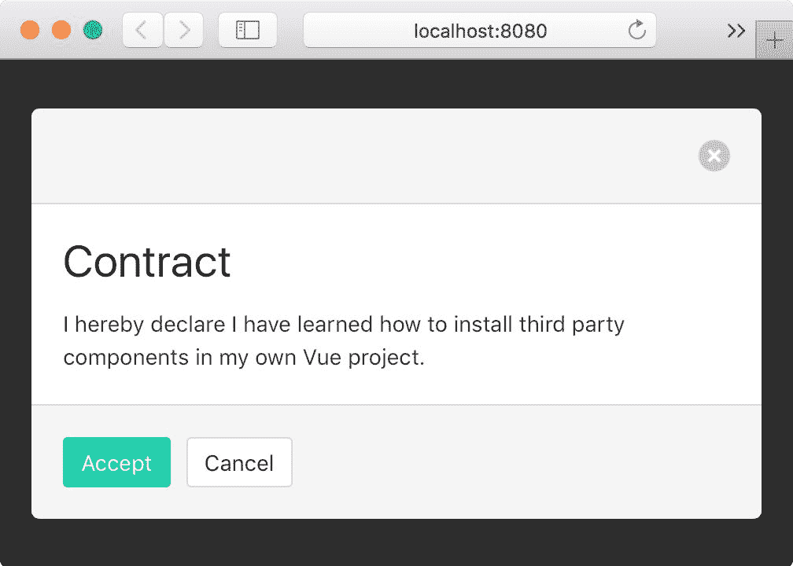

# 工作原理如下...

官方的 Webpack 模板包含了一个配置规则，不要编译`node_modules`目录中的文件。这意味着 Web 组件的作者被鼓励分发一个已经编译好的文件，否则用户将在他们的项目中导入原始的 JavaScript 文件（因为 Webpack 不会编译它们），从而在浏览器中引发各种错误。就个人而言，我认为这不是一个好的工程实践。这种设置的一个问题是，由于您在项目中导入的文件是针对一个版本的 Vue 进行编译的，所以如果您使用较新版本的 Vue，组件可能无法正常工作（实际上过去确实发生过这种情况）。

更好的方法是导入原始文件和组件，让 Webpack 将它们编译成一个单独的文件。不幸的是，大多数在外部可用的组件都已经编译好了，所以虽然使用官方模板很快就可以导入它们，但更有可能遇到兼容性问题。

在导入外部组件时，首先要做的是检查它们的`package.json`文件。让我们看看`vue-bulma-modal`包在此文件中包含了什么：

```js
{

  "name": "vue-bulma-modal",

  "version": "1.0.1",

  "description": "Modal component for Vue Bulma",

 "main": "src/index.js", 

  "peerDependencies": {

    "bulma": ">=0.2",

    "vue": ">=2"

  },

  ...

  "author": "Fangdun Cai <cfddream@gmail.com>",

  "license": "MIT"

}

```

当我们在 JavaScript 中编写以下行时，`main`属性引用的文件是我们导入的文件：

```js
import { CardModal } from 'vue-bulma-modal'

```

`src/index.js`文件中包含以下代码：

```js
import Modal from './Modal'

import BaseModal from './BaseModal'

import CardModal from './CardModal'

import ImageModal from './ImageModal'

export {

  Modal,

  BaseModal,

  CardModal,

  ImageModal

}

```

这不是一个编译文件；它是原始的 ES6 代码，我们知道这一点是因为在常规的 JavaScript 中没有定义`import`。这就是为什么我们需要 Webpack 来为我们编译它。

另一方面，考虑到我们编写了以下内容：

```js
<style lang="sass">

@import '~bulma';

</style>

```

使用波浪号（`~`），我们告诉 Webpack 像处理模块一样解析样式，因此，我们真正导入的是`bulma`包的`package.json`中`main`属性所引用的文件，如果我们检查一下，它看起来如下：

```js
{

  "name": "bulma",

  "version": "0.3.1",

  ...

 "main": "bulma.sass",

  ...

}

```

由于我们使用 SASS 语法导入了一个 SASS 文件，所以我们需要在 Vue 组件中指定`lang="sass"`。

# 使用热重载进行连续反馈的开发

热重载是一项非常有用的技术，它允许您在浏览器中查看结果而无需刷新页面即可进行开发。这是一个非常紧密的循环，可以真正加快开发过程。在官方的 Webpack 模板中，默认安装了热重载。在本教程中，您将学习如何自己安装它。

# 准备工作

在尝试这个教程之前，您应该对 Webpack 的工作原理有一个大致的了解；本章中的“使用 Webpack 组织依赖项”教程将为您提供帮助。

# 如何做到这一点...

在一个新的目录中创建一个新的 npm 项目，可以使用`npm init -y`或`yarn init -y`。我个人更喜欢第二种方法，因为生成的`package.json`更加简洁。

要安装 Yarn，你可以使用`npm install -g yarn`命令。Yarn 的主要好处是你将能够将你的依赖锁定到已知版本。这可以防止在团队合作中出现错误，当应用程序从 Git 克隆时，可能会有略微不同的版本引入不兼容性。

你将创建一个数字咒骂罐。每次你说脏话，你就会向一个长期目标的咒骂罐捐赠一定金额的钱。

创建一个名为`SwearJar.vue`的新文件，并在其中添加以下代码：

```js
<template>

  <div>

    Swears: {{counter}} $$

    <button @click="addSwear">+</button>

  </div>

</template>

<script>

export default {

  name: 'swear-jar',

  data () {

    return {

      counter: 0

    }

  },

  methods: {

    addSwear () {

      this.counter++

    }

  }

}

</script>

```

你将把这个组件插入到一个网页中。

在同一个目录下创建一个名为`index.html`的文件，并写入以下代码：

```js
<!DOCTYPE html>

<html>

  <head>

    <title>Swear Jar Page</title>

  </head>

  <body>

    <div id="app"></div>

    <script src="bundle.js"></script>

  </body>

</html>

```

`bundle.js`文件将由 Webpack（在内存中）为我们创建。

你需要的最后一个应用程序文件是一个包含 Vue 根实例的 JavaScript 文件。在同一个目录下创建一个名为`index.js`的文件，并将以下内容放入其中：

```js
import Vue from 'vue'

import SwearJar from './SwearJar.vue'

new Vue({

  el: '#app',

  render: h => h(SwearJar)

})

```

现在你需要创建一个名为`webpack.config.js`的文件，告诉 Webpack 一些事情。第一件事是我们应用程序的入口点（`index.js`）以及我们想要放置编译文件的位置：

```js
module.exports = {

  entry: './index.js',

  output: {

    path: 'dist',

    filename: 'bundle.js'

  }

}

```

接下来，我们将告诉 Webpack 将`.vue`文件转换为 JavaScript 文件，使用`vue-loader`：

```js
module.exports = {

  entry: './index.js',

  output: {

    path: 'dist',

    filename: 'bundle.js'

  },

  module: {

 rules: [

 {

 test: /.vue$/,

 use: 'vue-loader'

 }

 ]

 }

}

```

为了使一切正常工作，我们仍然需要安装我们在代码中隐含的依赖项。我们可以使用以下两个命令来安装它们：

```js
npm install --save vue

npm install --save-dev vue-loader vue-template-compiler webpack webpack-dev-server

```

特别是最后一个--`webpack-dev-server`--是一个开发服务器，将帮助我们进行热重载开发。

运行以下命令启动服务器：

```js
./node_modules/webpack-dev-server/bin/webpack-dev-server.js --output-path / --inline --hot --open

```

实际上，让我们将这个命令放在一个 npm 脚本中。

打开`package.json`并添加以下行：

```js
"scripts": {

  "dev": "webpack-dev-server --output-path / --inline --hot --open"

}

```

现在我们可以运行`npm run dev`，我们将得到与下面的截图中所示相同的结果--一个浏览器将弹出：

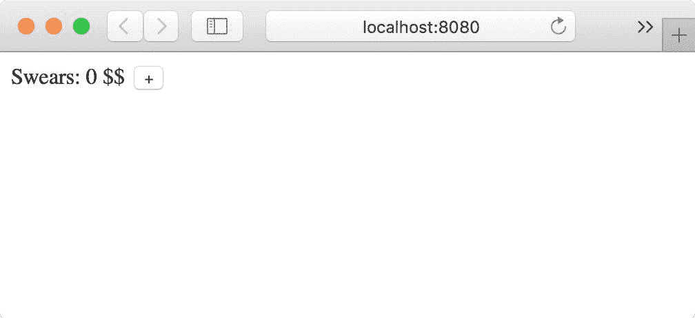

点击加号按钮将使计数器增加，但是这个应用程序的样式呢？让我们让它更有吸引力。

打开你的代码编辑器和窗口并排放置，并对`SwearJar.vue`进行以下修改：

```js
<template>

  <div>

    <p>

Swears: {{counter}} $$</p>

    <button @click="addSwear">Add Swear

</button>

  </div>

</template>

```

保存文件，你会看到页面自动更新。更好的是，如果计数器已经设置为大于零的值，状态将会保留，这意味着如果你有一个复杂的组件，在每次修改后你不需要手动将其带回相同的状态。尝试将脏话计数设置为某个数字并编辑模板。大多数情况下，计数器不会被重置为零。

# 它是如何工作的...

Webpack 开发服务器是非常有帮助的软件，它让你能够以非常紧密的反馈循环进行开发。我们使用了很多参数来使其运行：

```js
webpack-dev-server --output-path / --inline --hot --open

```

所有这些参数在`webpack.config.js`中是相同的。相反，我们将这些参数放在命令行中是为了方便。`--output-path`是 Webpack 服务器将服务的`bundle.js`的位置；在我们的例子中，我们说我们希望它在根路径下服务，所以它将有效地将`/bundle.js`路径绑定到实际的`bundle.js`文件。

第二个参数`--inline`将在我们的浏览器中注入一些 JavaScript 代码，以便我们的应用程序可以与 Webpack 开发服务器通信。

`--hot`参数将激活热模块替换插件，它将与`vue-loader`（实际上是与其中的`vue-hot-reload-api`）通信，并且将重新启动或重新渲染（保留状态）页面中的每个 Vue 模型。

最后，`--open`只是为我们打开默认的浏览器。

# 使用 Babel 编译 ES6

ES6 有很多有用的功能，在这个示例中，你将学习如何在你的项目中使用它。值得注意的是，ES6 目前在浏览器上有很好的支持。你不会在 80%的浏览器中遇到兼容性问题，但是根据你的受众，你可能需要甚至要接触仍在使用 Internet Explorer 11 的人，或者你可能只是想最大化你的受众。此外，一些用于开发和 Node.js 的工具仍然不完全支持 ES6，因此即使是开发也需要使用 Babel。

# 准备就绪

在这个示例中，我们将使用 npm 和命令行。如果你在第一章的*选择开发环境*示例中完成了*开始使用 Vue.js*，那么你可能已经准备好了。

# 如何做...

创建一个带有空的 npm 项目的新目录。你可以使用`npm init -y`命令，或者如果你已经安装了 Yarn，你可以在目录中使用`yarn init -y`。这个命令将在目录中创建一个新的`package.json`文件。（请参考 Yarn 上的*使用热重载进行连续反馈开发*示例中的注意事项。）

对于这个 npm 项目，除了 Vue 之外，我们还需要一些其他的依赖项：Webpack 和 Babel（以 Webpack 的 loader 形式）。是的，我们还需要`vue-loader`来使用 Webpack。要安装它们，请执行以下两个命令：

```js
npm install --save vue

npm install --save-dev webpack babel-core babel-loader babel-preset-es2015 vue-loader vue-template-compiler

```

在同一个目录下，让我们编写一个使用 ES6 语法的组件；让我们称之为`myComp.vue`：

```js
<template>

  <div>Hello</div>

</template>

<script>

var double = n => n * 2

export default {

  beforeCreate () {

    console.log([1,2,3].map(double))

  }

}

</script>

```

这个组件除了将`[2,4,6]`数组打印到控制台外，没有做太多事情，但是它在下一行使用了箭头语法：

```js
var double = n => n * 2

```

这对于一些浏览器和工具来说是无法理解的；我们需要使用 Webpack 编译这个组件，但是我们需要使用 Babel loader 来完成。

创建一个新的`webpack.config.js`文件，并在其中写入以下内容：

```js
module.exports = {

  entry: 'babel-loader!vue-loader!./myComp.vue',

  output: {

    filename: 'bundle.js',

    path: 'dist'

  }

}

```

这将告诉 Webpack 从我们的`myComp.vue`文件开始编译，但在此之前，它将通过`vue-loader`处理它，将其转换为 js 文件，然后通过`babel-loader`将箭头函数转换为更简单和更兼容的形式。

我们可以使用不同且更标准的配置来实现相同的效果：

```js
module.exports = {

 entry: './myComp.vue', 

  output: {

    filename: 'bundle.js'

  },

  module: {

    rules: [

      {

        test: /.vue$/,

        use: 'vue-loader'

      },

      {

        test: /.js$/,

        use: 'babel-loader'

      }

    ]

  }

}

```

这是一个更通用的配置，它表示每当我们遇到以`.vue`结尾的文件时，应该使用`vue-loader`进行解析和处理，以及以`.js`结尾的文件应该使用`babel-loader`进行处理。

要配置 Babel 加载器，有几个选项；我们将遵循推荐的方式。在项目文件夹中创建一个名为`.babelrc`的文件（注意初始点），并指定我们要应用`es2015`预设，写入以下代码：

```js
{

  "presets": ["es2015"]

}

```

最后，我总是喜欢在`package.json`文件中添加一个新的脚本，以便更容易地启动命令。在文件末尾（但在最后一个大括号之前）添加以下行：

```js
"scripts": {

  "build": "webpack"

}

```

然后运行`npm run build`。这将在`dist`目录中创建一个名为`bundle.js`的文件；打开它并搜索包含例如`double`的行。你应该会找到类似于这样的内容：

```js
...

var double = function double(n) {

  return n * 2;

};

...

```

这是我们的`var double = n => n * 2`，从 ES6 转换为*常规*JavaScript。

# 它是如何工作的...

`es2015` Babel 预设是一组 Babel 插件，旨在将 ECMAScript2015（ES6）语法转换为更简单的 JavaScript。例如，它包含了`babel-plugin-transform-es2015-arrow-functions`插件，它可以将箭头函数转换为：

```js
var addOne = n => n + 1

```

将箭头函数转换为更简单的 JavaScript，如下所示：

```js
var addOne = function addOne(n) {

  return n + 1

}

```

为了选择文件及其相应的加载器，我们在`webpack.config.js`中填写了测试字段，并为匹配的`.vue`文件编写了以下内容：

```js
test: /\.vue$/

```

这个语法是一个正则表达式，它总是以一个正斜杠开始，以另一个正斜杠结束。它匹配的第一个字符是点，表示为`\.`，因为`.`字符已经被用于其他目的。点后面必须跟着`vue`字符串，字符串的结束字符表示为美元符号。如果把它们都放在一起，它将匹配所有以`.vue`结尾的字符串。对于`.js`文件也是类似的。

# 在开发过程中运行代码检查器

对代码进行 linting 可以大大减少在开发过程中累积的小错误和低效，它保证了团队或组织中的编码风格的一致性，并使您的代码更易读。与偶尔运行 linter 不同，将其始终运行是有用的。本教程将教您如何在 Webpack 中实现此功能。

# 准备工作

在本教程中，我们将再次使用 Webpack。您将使用`webpack-dev-server`构建一个紧密循环，该循环在*使用热重载进行连续反馈开发*教程中有所涵盖。

# 如何实现...

在一个新的文件夹中，创建一个新的 npm 项目（可以使用`npm init -y`或`yarn init -y`）。

在文件夹中，创建一个名为`src`的新目录，并在其中放置一个名为`MyComp.vue`的文件。让文件包含以下代码：

```js
<template>

  <div>

    Hello {{name}}!

  </div>

</template>

<script>

export default {

  data () {

    return {

      name: 'John',

      name: 'Jane'

    }

  }

}

</script>

```

我们已经发现了一个问题-`John`的 name 属性将被后面的具有相同键的属性`Jane`覆盖。让我们假装没有注意到这一点，并将组件放在一个网页中。为此，我们需要另一个文件，名为`index.js`，在`src`目录中。在其中写入以下代码：

```js
import Vue from 'vue'

import MyComp from './MyComp.vue'

new Vue({

  el: '#app',

  render: h => h(MyComp)

})

```

在根目录中，放置一个名为`index.html`的文件，其中包含以下代码：

```js
<!DOCTYPE html>

<html>

  <head>

    <title>Hello</title>

  </head>

  <body>

    <div id="app"></div>

      <script src="bundle.js"></script>

    </body>

</html>

```

现在我们需要一个`webpack.config.js`文件来告诉 Webpack 如何编译我们的文件；在其中写入以下内容：

```js
module.exports = {

  entry: './src/index.js',

  module: {

    rules: [

      { 

        test: /.vue$/,

        use: 'vue-loader'

      }

    ]

  }

}

```

这只是告诉 Webpack 从`index.js`文件开始编译，并且每当它找到一个`.vue`文件时，将其转换为 JavaScript 与`vue-loader`。除此之外，我们还希望使用一个 linter 扫描所有的文件，以确保我们的代码中没有愚蠢的错误。

将以下 loader 添加到`rules`数组中：

```js
{

  test: /.(vue|js)$/,

  use: 'eslint-loader',

  enforce: 'pre'

}

```

`enforce: 'pre'`属性将在其他 loader 之前运行此 loader，因此它将应用于您编写的代码而不是其转换。

我们最后需要做的是配置 ESLint。在根目录中创建一个名为`.eslintrc.js`的新文件，并在其中添加以下内容：

```js
module.exports = {

  "extends": "eslint:recommended",

  "parser": "babel-eslint",

  plugins: [

    'html'

  ]

}

```

我们在这里说了几件事。首先是我们想要应用于我们的代码的一组规则；换句话说，我们的规则集（现在为空）正在扩展推荐的规则集。其次，我们使用`babel-eslint`解析器而不是默认的解析器。最后，我们使用 HTML ESLint 插件，它将帮助我们处理`.vue`文件并提取其中的 JavaScript 代码。

现在我们已经准备好启动我们的开发机器了，但首先我们需要使用以下命令安装依赖项：

```js
npm install --save vue

npm install --save-dev babel-eslint eslint eslint-loader eslint-plugin-html vue-loader vue-template-compiler webpack webpack-dev-server

```

我们可以直接启动 Webpack 开发服务器，但我强烈建议将以下代码添加到`package.json`文件中：

```js
"scripts": {

  "dev": "webpack-dev-server --entry ./src/index.js --inline --hot --open"

}

```

现在，如果我们启动`npm run dev`，浏览器应该打开并显示以下错误的组件：

`<q>Hello Jane!</q>`

您还应该能够在控制台中看到问题：

`11:7  error  Duplicate key 'name'  no-dupe-keys`

这意味着我们有两个具有相同“name”的键。通过删除该属性来纠正错误：

```js
data () {

  return {

    name: 'John'

  }

}

```

在控制台中，当您保存 Vue 组件后，您应该注意到 Webpack 已经再次执行了编译，这次没有错误。

# 工作原理是...

基本上，在此处发生的是，linter 加载器在其他编译步骤之前处理文件并将错误写入控制台。这样，您就可以在不断开发的过程中看到代码中的不完美之处。

ESLint 和 Webpack 在 Vue 官方模板中可用。现在您知道，如果出于某种原因，您想要修改 ESLint 规则，可以从`.eslintrc.js`文件中进行修改，并且如果您想要使用其他 linter，可以在 Webpack 配置文件中使用另一个加载器。

# 只使用一个命令来构建一个压缩和一个开发的.js 文件

在开发组件时，您可能需要一个可靠的流程来发布构建的文件。一个常见的操作是发布库/组件的两个版本：一个用于开发目的，一个用于在生产代码中使用，通常是经过压缩的。在这个配方中，您将调整官方模板，同时发布一个经过压缩和一个开发的 JavaScript 文件。

# 准备就绪

如果您已经在构建和分发自己的组件，那么这个配方就有意义。如果您想了解更多信息，我建议您参考“使用 Webpack 打包您的组件”配方。

# 如何操作...

我们将从官方的 Webpack 模板开始一个项目。您可以使用自己的模板，或者使用`vue init webpack`创建一个新项目，并使用“npm install”安装依赖项。

进入`build`目录。当您运行`npm run build`命令时，实际上是在该目录中运行`build.js`文件。

如果您检查文件，您会在末尾找到类似以下内容的内容：

```js
webpack(webpackConfig, function (err, stats) {

...

})

```

这相当于使用相同配置在命令行中启动 Webpack，指定在第一个参数`webpackConfig`中指定的配置。为了获得一个经过压缩和一个非经过压缩的文件，我们必须将`webpackConfig`带到一个公共的基准，然后只指定开发和生产版本之间的差异。

为此，请进入同一目录中的`webpack.prod.conf.js`。在这里，您可以看到我们正在传递的配置；特别是，您会发现`UglifyJsPlugin`，它负责压缩文件（如果您查看插件数组）。删除该插件，因为它代表了两个版本之间的主要区别。

现在，在 Webpack 命令之前，在`build.js`中写入以下内容：

```js
const configs = [

  {

    plugins: [

      new webpack.optimize.UglifyJsPlugin({

        compress: {

          warnings: false

        },

        sourceMap: true

      })

    ]

  },

  {

    plugins: []

  }

]

```

现在你有了一个包含两个不同配置的数组，一个带有压缩文件所需的插件，一个没有。如果你将它们与`webpack.prod.conf.js`中的配置合并，你将得到不同的结果。

为了合并这两个配置，我们将使用`webpack-merge`包。在文件顶部添加以下行：

```js
var merge = require('webpack-merge')

```

然后，将 Webpack 命令的第一行修改为以下内容：

```js
configs.

map(c =>

 webpack(merge(webpackConfig, c)

, function (err, stats) {

...

```

这将启动与我们在配置数组中指定的配置数量一样多的不同合并配置。

现在你可以运行`npm run build`命令了，但问题是文件将具有相同的名称。从`webpack.prod.conf.js`中剪切输出属性，并将其粘贴到`config`数组中，现在它应该是这样的：

```js
const configs = [

  {

    output: {

 path: <whatever is your path>,

 filename: 'myFilename.min.js'),

 <other options you may have>

 },

    plugins: [

      new webpack.optimize.UglifyJsPlugin({

        compress: {

          warnings: false

        }

      })

    ]

  },

  {

    output: {

 path: <whatever is your path>,

 filename: 'myFilename.js'),

 <other options you may have>

 },

    plugins: []

  }

]

```

如果你现在构建你的项目，你将得到一个压缩和一个开发文件。当然，你可以根据需要个性化你的配置，使它们变得非常不同。例如，你可以在一个配置中添加源映射，而将另一个配置保持不变。

# 它是如何工作的...

我们首先创建了一个表示 Webpack 配置差异的对象数组。然后，我们使用`webpack-merge`的帮助将每个配置片段映射到一个更大的公共配置中。当我们现在调用`npm run build`命令时，两个配置将依次运行。

将文件名的后缀命名为`min`是一种常见的约定，表示该文件已经被压缩并准备好在生产环境中使用。

# 发布你的组件到公共领域

在某个时刻，当你想要回馈社区时，会有一个时刻。也许你建了一个“放屁按钮”，或者你建了一个自动化股票期权交易者；无论你建了什么，JavaScript 和 Vue 社区都会很高兴欢迎你。在市场营销和许可方面还有很多事情要做，但在这个教程中，你将集中关注更多的技术方面。

# 准备工作

这个教程是针对那些想要与 Vue 社区分享他们的工作的人。在*使用 Webpack 打包你的组件*教程中，你会找到如何调整官方 Webpack 模板以正确打包你的组件；这个教程可以看作是第二部分。不过我们不会使用官方模板。

# 如何操作...

我在这个教程中采用的方法是使用*Guillaume Chau*的优秀`vue-share-components`模板。我们将从这个起点构建一个笑话按钮。

在命令行中，创建一个新的目录并在其中输入以下命令：

```js
vue init Akryum/vue-share-components

```

它会询问你一些问题；你可以从下面的图片中复制回答。需要注意的是，你（可悲地）不能使用`joke-button`作为你的项目名称，因为在编写这个教程时我已经注册了它。不过，你可以想出一个类似的名称（在继续之前，你可能需要检查该名称在`npm`注册表中是否可用）：

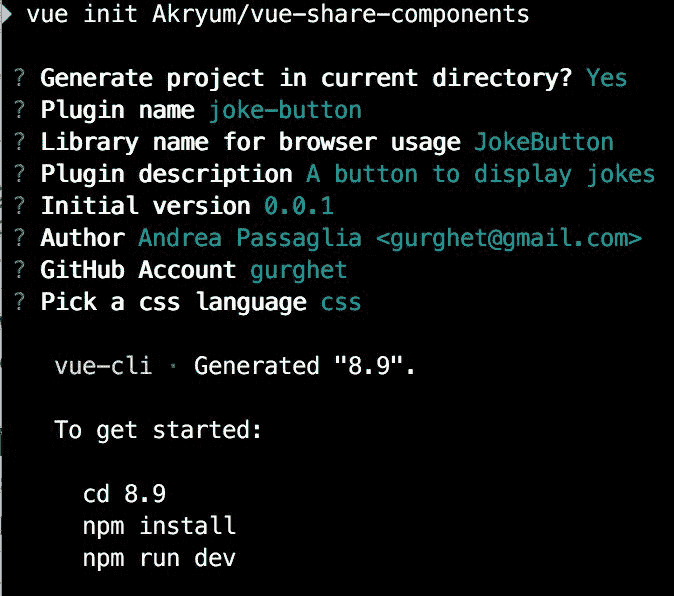

项目创建完成后，你可以像控制台输出一样使用`npm install`安装依赖项。

在项目内部，让我们创建一个笑话按钮组件。在`component`文件夹内，你会找到一个`Test.vue`组件；将其重命名为`JokeButton.vue`并使其看起来像以下代码：

```js
<template>

  <div class="test">

    <button @click="newJoke">New Joke</button>

    <p>{{joke}}</p>

  </div>

</template>

<script>

const jokes = [

 'Chuck Norris/'s keyboard has the Any key.',

 'Chuck Norris can win at solitaire with only 18 cards.',

 'Chuck Norris/' first job was as a paperboy. There were no survivors.',

 'When Chuck Norris break the build, you can/'t fix it.',

]

export default {

  name: 'joke-button',

  data () {

    return {

      joke: '...',

    }

  },

  methods: {

    newJoke () {

      this.joke = jokes[Math.floor(Math.random() * jokes.length)]

    },

  },

}

</script>

```

显然，你可以创建你喜欢的组件；这只是一个例子。

在`index.js`文件中，你会看到导入和安装了`Test`组件；你需要安装`JokeButton`代替。需要更改的行已经被标出：

```js
import JokeButton

 from './components/JokeButton

.vue'

// Install the components

export function install (Vue) {

  Vue.component('jokeButton

', JokeButton

)

  /* -- Add more components here -- */

}

// Expose the components

export {

  JokeButton

,

  /* -- Add more components here -- */

}

...

```

我们的组件已经准备好了！

现在你需要去 npm 网站注册一个账号（如果你还没有的话）。

前往[npmjs.com](https://www.npmjs.com/)：

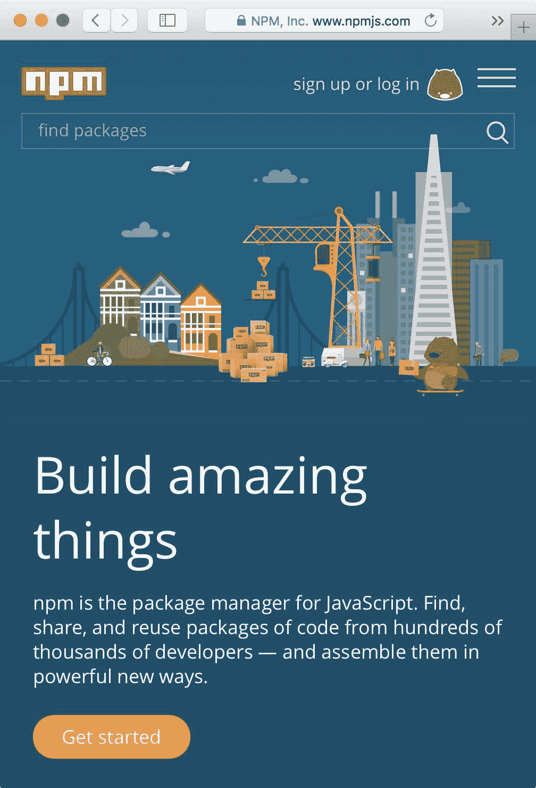

点击注册并输入你的详细信息，就像我在这里做的一样：

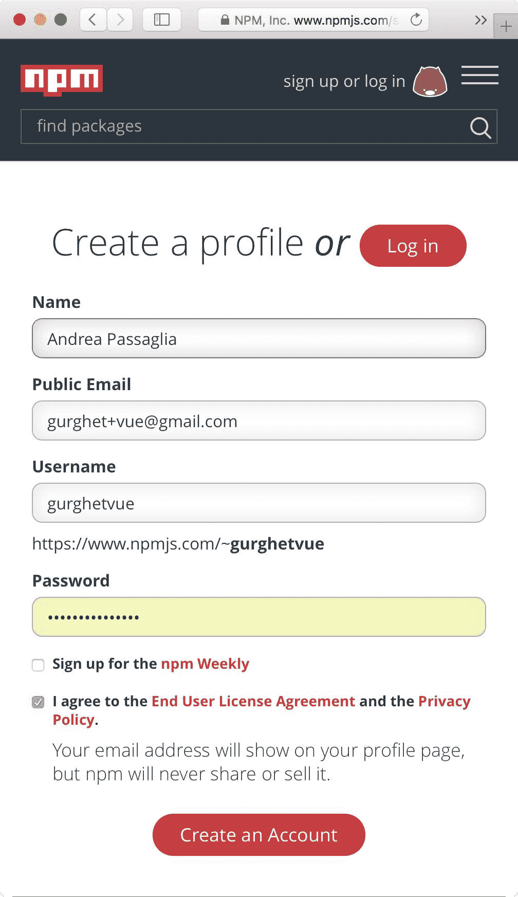

当然，如果你喜欢的话，你可以订阅 npm 每周的新闻通讯。

注册完成后，你就完成了，可以回到命令行了。你必须使用以下命令从终端登录到 npm 注册表：

```js
npm adduser

```

你将看到类似于这样的内容：

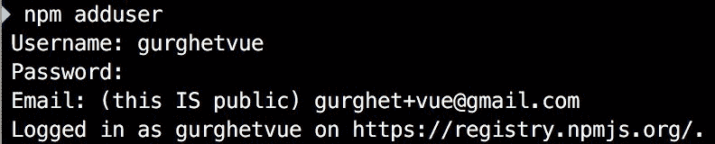

你将需要输入刚刚为 npm 网站输入的密码。

下一个命令将会在公共仓库中发布你的库：

```js
npm publish

```

现在你甚至可以查找你的包，确保你会在下面的截图中找到它：

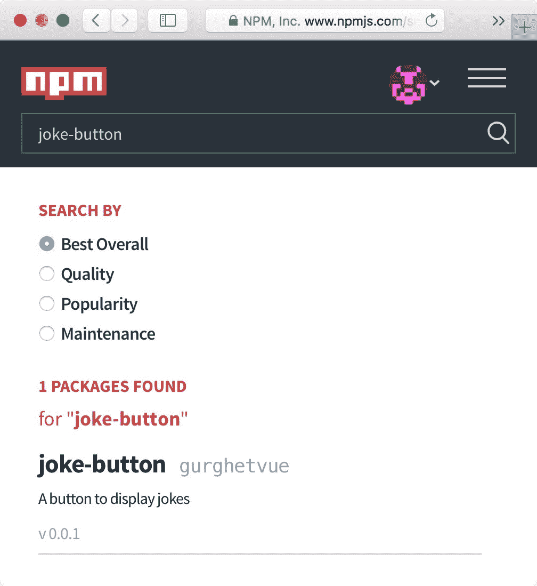

要尝试它，你可以在你自己的 `README` 中找到说明，多酷啊！

# 它是如何工作的...

`vue-share-components` 比官方模板更简单，所以通过检查它是一个很好的学习方式。

我们可以首先看一下 `package.json` 文件。以下几行是相关的：

```js
...

"main": "dist/joke-button.common.js",

"unpkg": "dist/joke-button.browser.js",

"module": "index.js",

"scripts": {

  "dev": "cross-env NODE_ENV=development webpack --config config/webpack.config.dev.js --progress --watch",

  "build": "npm run build:browser && npm run build:common",

  "build:browser": "cross-env NODE_ENV=production webpack --config config/webpack.config.browser.js --progress --hide-modules",

  "build:common": "cross-env NODE_ENV=production webpack --config config/webpack.config.common.js --progress --hide-modules",

  "prepublish": "npm run build"

},

...

```

`main` 属性是我们在程序中写入以下命令时实际得到的内容：

```js
import JokeButton from 'JokeButton'

```

或者，我们在添加以下代码时获得它：

```js
var JokeButton = require("JokeButton")

```

所以，`JokeButton` 变量实际上将包含在我们的 `joke-button.common.js` 中导出的内容。

你可以编辑 `package.json` 的 `main` 属性，直接指向一个 `.vue` 组件。这样，你就把编译组件的责任交给了用户。虽然这对用户来说更多了一些工作，但当你想要自由地编译最新版本的 Vue 时，这也是有帮助的。

在后一种情况下，如果你的组件的一些逻辑是在 `external.js` 文件中导出的（就像本章的第一个示例中一样），请始终记得在 Webpack 规则中添加目录，如下所示：

`{`

`  test: /.js$/,`

`  loader: 'babel-loader',`

`  include: [resolve('src'), resolve('test'), resolve('node_modules/myComponent')]`

`},`

unpkg 是 [unpkg.com](https://unpkg.com/#/) 的特定部分，它是一个 CDN。这非常好，因为一旦我们发布了项目，我们的脚本将会在 [`unpkg.com/joke-button`](https://unpkg.com/joke-button) 上发布，并且它将指向适用于浏览器的 `joke-button.browser.js` 文件。

`prepublish`脚本是一个特殊的脚本，在使用`npm publish`命令将项目发布到 npm 之前调用。这消除了在发布组件之前忘记构建文件的可能性（这在我身上发生过很多次，所以我被迫人为地增加软件版本，手动构建文件，然后再次发布）。

另一个有趣的事实是`webpack.config.common.js`和`webpack.config.browser.js`之间的区别，前者输出`joke-button.common.js`文件，后者输出`joke-button.browser.js`文件。

第一个文件的输出设置如下：

```js
output: {

  path: './dist',

  filename: outputFile + '.common.js',

  libraryTarget: 'commonjs2',

},

target

:

 '

node' 

,

```

因此，它将输出一个公开 commonJS 接口的库；这是为非浏览器环境定制的，您需要使用 require 或 import 来使用该库。另一方面，用于浏览器的第二个文件具有以下输出：

```js
output: {

  path: './dist',

  filename: outputFile + '.browser.js',

  library: globalName,

  libraryTarget: 'umd',

},

```

UMD 将在全局范围内公开自身，无需导入任何内容，因此它非常适合浏览器，因为我们可以将文件包含在 Vue 网页中并自由使用组件。这也是可能的，多亏了`index.js`的自动安装功能：

```js
/* -- Plugin definition & Auto-install -- */

/* You shouldn't have to modify the code below */

// Plugin

const plugin = {

 /* eslint-disable no-undef */

 version: VERSION,

 install,

}

export default plugin

// Auto-install

let GlobalVue = null

if (typeof window !== 'undefined') {

 GlobalVue = window.Vue

} else if (typeof global !== 'undefined') {

 GlobalVue = global.Vue

}

if (GlobalVue) {

 GlobalVue.use(plugin)

}

```

这段代码的作用是将安装函数（用于在 Vue 中注册组件）封装在`plugin`常量中，并同时导出它。然后，它检查是否定义了`window`或`global`，如果是这样，它获取代表 Vue 库的`Vue`变量，并使用插件 API 来安装组件。
