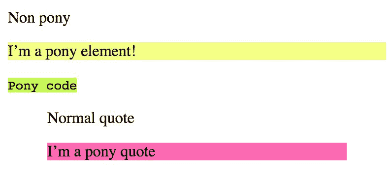
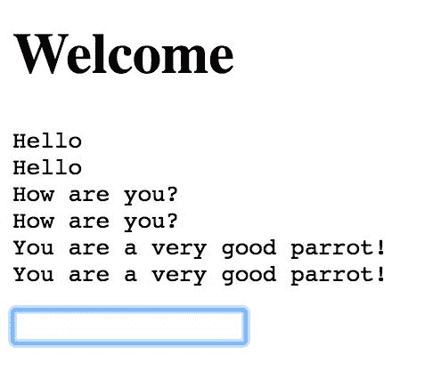
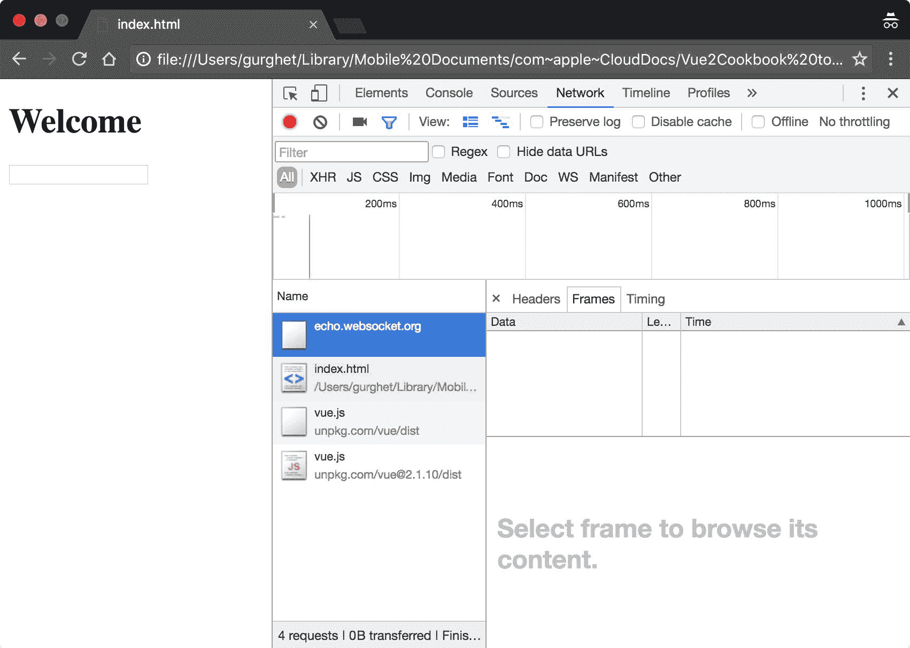
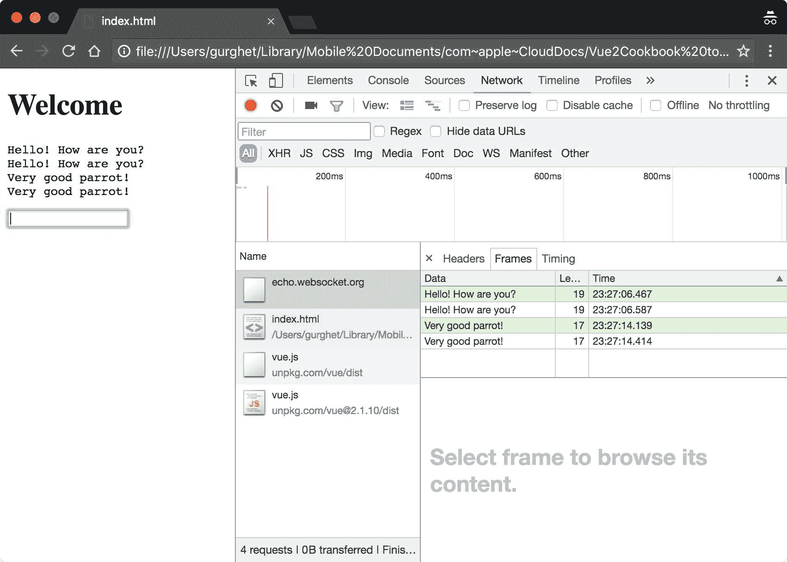
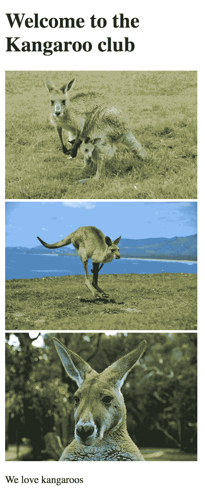
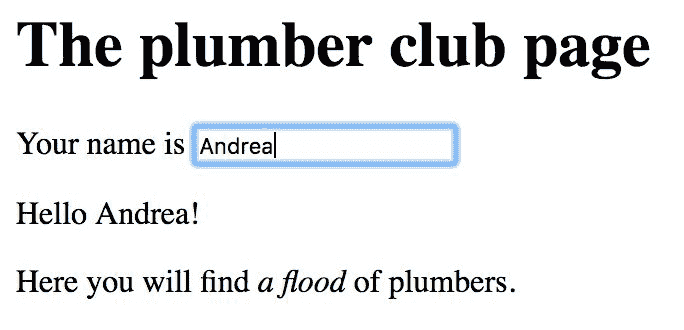
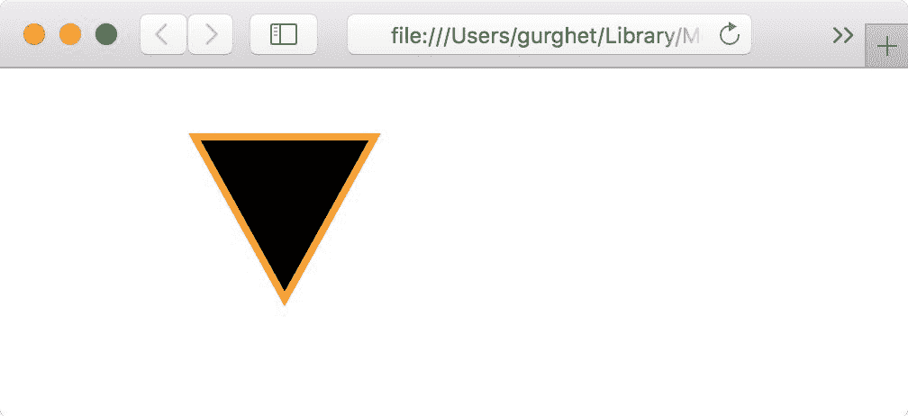
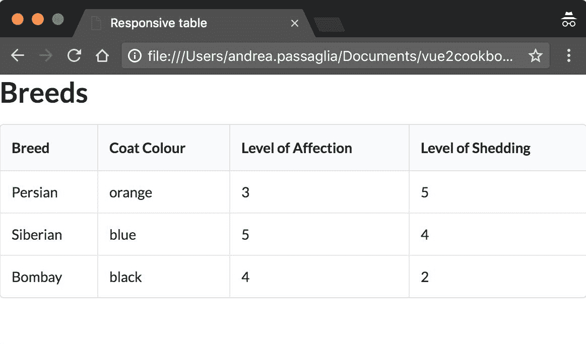
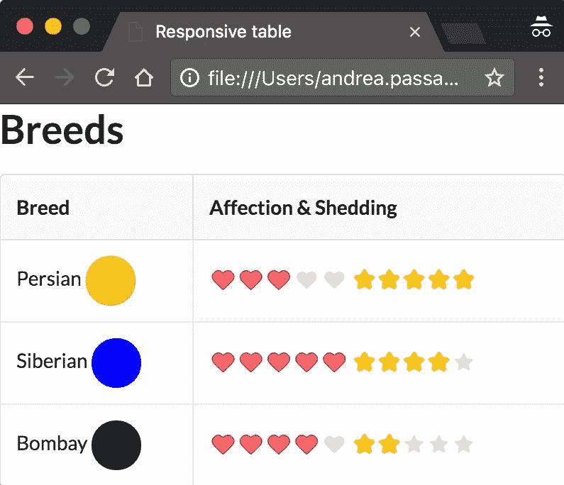
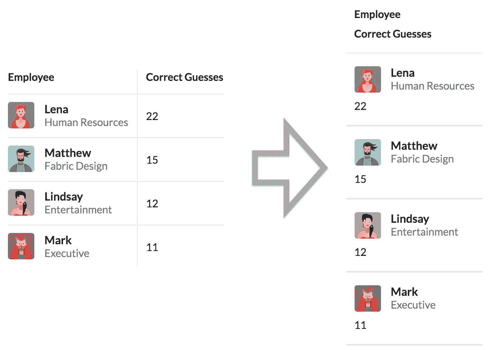

# 第八章：高级 Vue.js - 指令、插件和渲染函数

在本章中，我们将讨论以下主题：

+   创建一个新的指令

+   在 Vue 中使用 WebSockets

+   为 Vue 编写插件

+   手动渲染一个简单的组件

+   渲染带有子元素的组件

+   使用 JSX 渲染组件

+   创建一个功能性组件

+   使用高阶组件构建响应式表格

# 介绍

指令和插件是以可重用的方式打包功能并使其在应用程序和团队之间易于共享的方法；在本章中，您将构建其中的一些。渲染函数是 Vue 在幕后实际工作的方式，将模板转换为 Vue 语言，然后再次转换为 HTML 和 JavaScript；如果您需要优化应用程序的性能并处理一些特殊情况，它们将非常有用。

通常情况下，应尽量避免在可能的情况下使用这些高级功能，因为它们在过去有点被滥用。通常，许多问题可以通过编写一个良好的组件并分发组件本身来解决；只有在这种情况不成立时，您才应该考虑使用高级功能。

本章面向稍有经验的开发者，您可能不会在其他示例中找到逐步详细说明的水平，但我努力使它们完整。

# 创建一个新的指令

指令类似于小型函数，您可以使用它们快速地插入到您的代码中，主要是为了改善用户体验，并向您的图形界面添加新的低级功能。

# 准备工作

尽管这个示例在高级章节中，但它非常容易完成。指令之所以被称为“高级”是因为通常应该优先选择组合来为应用程序添加功能和样式。当组件无法满足需求时，可以使用指令。

# 如何操作...

我们将构建一个`v-pony`指令，将任何元素转换为小马元素。小马元素具有粉色背景，并在单击时更改颜色。

小马元素的 HTML 代码如下所示：

```js
<div id="app">

  <p v-pony>I'm a pony paragraph!</p>

  <code v-pony>Pony code</code>

  <blockquote>Normal quote</blockquote>

  <blockquote v-pony>I'm a pony quote</blockquote>

</div>

```

为了显示差异，我包含了一个普通的`blockquote`元素。在我们的 JavaScript 部分，写入以下内容：

```js
Vue.directive('pony', {

  bind (el) {

    el.style.backgroundColor = 'hotpink'

  }

})

```

这是如何声明新指令的。当指令绑定到元素时，将调用`bind`钩子。现在我们只是设置背景颜色。我们还希望在每次点击后更改颜色。要做到这一点，您必须添加以下代码：

```js
Vue.directive('pony', {

  bind (el) {

    el.style.backgroundColor = 'hotpink'

    el.onclick = () => {

 const colGen = () => 

 Math.round(Math.random()*255 + 25)

 const cols =

 [colGen() + 100, colGen(), colGen()]

 const randRGB =

 `rgb(${cols[0]}, ${cols[1]}, ${cols[2]})`

 el.style.backgroundColor = randRGB

 }

  }

})

```

在这里，我们正在创建一个`onclick`监听器，它将生成一个偏向红色的随机颜色，并将其分配为新的背景颜色。

在我们的 JavaScript 末尾，不要忘记创建一个`Vue`实例：

```js
new Vue({

  el: '#app'

})

```

您可以启动应用程序以查看指令的效果：



不要忘记点击文本以更改背景颜色！

# 工作原理...

声明新指令的语法如下所示：

```js
Vue.directive(<name: String>, {

  // hooks

})

```

这将注册一个新的全局指令。在 hooks 对象内部，您可以定义两个重要的函数：`bind`，您在本示例中使用的函数，以及`update`，它在其中包含的组件每次更新时触发。

每个钩子函数至少被调用三个参数：

+   `el`：HTML 元素

+   `binding`：指令可以接收一个参数；binding 是一个包含参数值的对象

+   `vnode`：此元素的 Vue 内部表示

我们使用`el`参数直接编辑元素的外观。

# 在 Vue 中使用 WebSockets

WebSockets 是一种新技术，它使用户和托管应用程序的服务器之间可以进行双向通信。在这项技术出现之前，只有浏览器可以发起请求和连接。如果页面上有更新，浏览器必须不断地轮询服务器。使用 WebSockets，这不再是必需的；在建立连接后，服务器只有在需要时才能发送更新。

# 准备工作

您不需要为此示例做任何准备，只需要了解 Vue 的基础知识。如果您不知道什么是 WebSockets，您实际上不需要知道，只需将其视为服务器和浏览器之间连续双向通信的通道。

# 如何操作...

对于这个示例，我们需要一个充当客户端的服务器和浏览器。我们不会构建一个服务器；相反，我们将使用一个已经存在的服务器，通过 WebSockets 将您发送的任何内容回显。因此，如果我们发送`Hello`消息，服务器将回复`Hello`。

您将构建一个聊天应用程序，该应用程序将与此服务器进行通信。编写以下 HTML 代码：

```js
<div id="app">

  <h1>Welcome</h1>

  <pre>{{chat}}</pre>

  <input v-model="message" @keyup.enter="send">

</div>

```

`<pre>`标签将帮助我们渲染聊天记录。由于我们不需要`<br/>`元素来换行，我们可以使用特殊字符`n`表示换行。

为了使我们的聊天工作，我们首先必须在 JavaScript 中声明我们的 WebSocket：

```js
 const ws = new WebSocket('ws://echo.websocket.org')

```

之后，我们声明我们的`Vue`实例，其中包含一个`chat`字符串（用于保存到目前为止的聊天记录）和一个`message`字符串（用于保存我们当前正在编写的消息）：

```js
new Vue({

  el: '#app',

  data: {

    chat: '',

    message: ''

  }

})

```

我们仍然需要定义`send`方法，该方法在文本框中按下*Enter*时调用：

```js
new Vue({

  el: '#app',

  data: {

    chat: '',

    message: ''

  },

  methods: {

 send () {

 this.appendToChat(this.message)

 ws.send(this.message)

 this.message = ''

 },

 appendToChat (text) {

 this.chat += text + 'n'

 }

 }

}

```

我们将`appendToChat`方法分解出来，因为我们将使用它来附加我们收到的所有消息。为此，我们必须等待组件被实例化。`created`钩子是一个安全的地方：

```js
...

created () {

  ws.onmessage = event => {

    this.appendToChat(event.data)

  }

}

...

```

现在启动应用程序与您的个人回声室聊天：



# 工作原理...

要查看您构建的内容的内部，请打开 Chrome 开发者工具（！[](img/Image00161.jpg) | 更多工具 | 开发者工具或*Opt* + *Cmd* + *I*）：



转到网络选项卡并重新加载页面；您应该看到`echo.websocket.orl` WebSocket，如屏幕截图所示。输入一些内容，消息将出现在帧选项卡中，如下所示：



绿色消息是您发送的消息，而白色消息是您接收的消息。您还可以检查消息的长度（以字节为单位）以及发送或接收的确切时间。

# 为 Vue 编写一个插件

插件是我们想要在应用程序中拥有的一组实用工具或全局新行为。Vuex 和 vue-router 是 Vue 插件的两个著名例子。插件可以是任何东西，因为编写插件意味着在非常低的层次上进行操作。你可以编写不同类型的插件。对于这个示例，我们将专注于构建具有全局属性的指令。

# 准备工作

这个示例将基于*创建一个新的指令*，只是我们将添加一些用于全局协调的功能。

# 如何做...

对于这个示例，我们将为一个袋鼠欣赏俱乐部建立一个网站。主页 HTML 的布局如下：

```js
<div id="app">

  <h1>Welcome to the Kangaroo club</h1>

  

  

  

  <p>We love kangaroos</p>

</div>

```

你可以将袋鼠图片的链接更改为你喜欢的链接。

在 JavaScript 部分，我们暂时实例化一个空的`Vue`实例：

```js
new Vue({

  el: '#app'

})

```

如果我们现在打开页面，会得到这个结果：



现在，我们想在网站上添加一个有趣的注释。我们希望页面上的元素（除了标题）以随机的时间间隔跳动。

为了实现这个目标，你将实现的策略是将所有需要跳动的元素注册到一个数组中，然后定期选择一个随机元素并使其跳动。

我们首先需要定义 CSS 中的跳动动画：

```js
@keyframes generateJump {

  20%{transform: translateY(0);}

  40%{transform: translateY(-30px);}

  50%{transform: translateY(0);}

  60%{transform: translateY(-15px);}

  80%{transform: translateY(0);}

}

.kangaroo {

  animation: generateJump 1.5s ease 0s 2 normal;

}

```

这样做的效果是创建一个名为`kangaroo`的类，当应用于一个元素时，它会沿着 y 轴跳动两次。

接下来，编写一个函数，在 JavaScript 中将这个类添加到指定的元素上：

```js
const jump = el => {

  el.classList.add('kangaroo')

  el.addEventListener('animationend', () => {

    el.classList.remove('kangaroo')

  })

}

```

`jump`函数会添加`kangaroo`类，并在动画完成后将其移除。

我们希望在注册的元素中随机选择一个执行此操作：

```js
const doOnRandomElement = (action, collection) => {

  if (collection.length === 0) {

    return

  }

  const el = 

    collection[Math.floor(Math.random()*collection.length)]

  action(el)

}

```

`doOnRandomElement`函数接受一个动作和一个集合，并将该动作应用于一个随机选择的元素。然后，我们需要在随机的时间间隔内调度它：

```js
const atRandomIntervals = action => {

  setTimeout(() => {

    action()

    atRandomIntervals(action)

  }, Math.round(Math.random() * 6000))

}

```

`atRandomIntervals`函数接受指定的函数，并在小于 6 秒的随机时间间隔内调用它。

现在我们已经拥有了构建使元素跳跃的插件所需的所有函数：

```js
const Kangaroo = {

  install (vueInstance) {

    vueInstance.kangaroos = []

    vueInstance.directive('kangaroo', {

      bind (el) {

       vueInstance.kangaroos.push(el)

      }

    })

    atRandomIntervals(() => 

      doOnRandomElement(jump, vueInstance.kangaroos))

  }

}

```

Kangaroo 插件在安装时创建一个空数组；它声明了一个新的指令`kangaroo`，该指令将所有包含在其中的元素注册到数组中。

然后在随机的时间间隔内，从数组中随机选择一个元素，并调用跳跃函数。

要激活插件，在声明`Vue`实例之前（但在声明`Kangaroo`之后）需要添加一行代码：

```js
Vue.use(Kangaroo)

new Vue({

  el: '#app'

})

```

我们必须选择跳动的元素，也就是除了标题以外的所有元素：

```js
 <div id="app">

   <h1>Welcome to the Kangaroo club</h1>

   

   

   

   <p v-kangaroo

>We love kangaroos</p>

 </div>

```

如果现在运行您的应用程序，您将看到图像或文本每隔几秒钟像袋鼠一样跳动。

# 工作原理...

本质上，Vue 插件只是一种将一些功能组合在一起的方式。没有太多限制，创建插件的唯一要做的就是声明一个安装函数。一般的语法如下所示：

```js
MyPlugin.install = (vueInstance, option) => {

  // ...

}

```

要使用您刚刚创建的插件，编写以下代码：

```js
Vue.use(MyPlugin, { 

/* any option you need */

 }) 

```

这里，第二个参数是传递给`install`函数的可选对象。

由于插件是全局实体，您应该尽量少使用它们，只用于您预见会影响整个应用程序的功能。

# 手动渲染一个简单的组件

Vue 将您的 HTML 模板转换为渲染函数。通常，您应该坚持使用模板，因为它们更简单。有几种情况下，渲染函数变得非常有用。在这里，我们展示了一个简单的例子，其中渲染函数很有用。

# 准备工作

这是有关渲染函数的第一个示例。如果您已经了解 Vue 的基础知识，您将理解其中的一切。

# 如何实现...

渲染函数的第一个用例是当您只想要一个显示另一个组件的`Vue`实例时。

编写一个空的 HTML 布局，如下所示：

```js
 <div id="app"></div>

```

我们有一个名为 Greeter 的组件，我们希望将其显示为主要的`Vue`实例。在 JavaScript 部分，添加以下代码：

```js
const Greeter = {

  template: '<p>Hello World</p>'

}

```

在这里，我们必须想象我们从其他地方获取了`Greeter`组件，并且由于组件已经很好地打包，我们不想修改它。相反，我们将它传递给`Vue`主实例：

```js
const Greeter = {

  template: '<p>Hello World</p>'

}

new Vue({

 el: '#app',

 render: h => h(Greeter)

})

```

如果我们现在启动应用程序，我们只会看到`Greeter`组件。主`Vue`实例只充当包装器。

# 工作原理...

渲染函数替换了`Vue`实例中的模板。当调用渲染函数时，传递的参数是所谓的`createElement`函数。为了简洁起见，我们将其命名为`h`。这个函数接受三个参数，但现在只需要注意我们传递的第一个参数（也是唯一一个参数）是`Greeter`组件。

理论上，您可以在`h`函数内联编写组件。在实际项目中，这并不总是可能的，这取决于运行时是否存在 Vue 模板编译器。当您使用官方的 Webpack 模板时，您会被问到是否要在分发软件时包含 Vue 模板编译器。

`createElement`函数的参数在这里列出：

1.  作为第一个参数，唯一必需的参数，您可以选择传递三种不同的内容：

+   Vue 组件的选项，就像我们的示例中一样

+   表示 HTML 标签的字符串（例如`div`、`h1`和`p`）

+   一个返回 Vue 组件的选项对象或表示 HTML 标签的字符串的函数

1.  第二个参数必须是一个名为**Data Object**的对象。这个对象将在下一个示例中解释。

1.  第三个参数是一个数组或字符串：

+   数组表示要放在组件内部的元素、文本或组件的列表

+   您可以编写一个将被渲染为文本的字符串

# 渲染带有子元素的组件

在这个示例中，您将使用渲染函数完全构建一个简单的网页，其中包含一些元素和组件。这将让您近距离观察 Vue 如何编译您的模板和组件。如果您想构建一个高级组件，并且想要一个完整的示例来启动，这可能会很有用。

# 准备工作

这是一个完整的构建组件的渲染函数的示例。通常情况下，您不需要在实践中这样做；这只推荐给高级读者。

# 如何做到这一点...

您将为一个水管工俱乐部构建一个页面。页面将如下所示：



每当我们在名称文本框中写入一个名称时，它将被写入问候中，就像`v-model`指令一样。

对于这个示例，我们从末尾开始而不是从开头开始，因为通常当您不得不使用`render`函数时，您对您想要的结果有一个非常清晰的想法。

在我们应用程序的 HTML 部分，让我们从一个空标签开始：

```js
<div id="app"></div>

```

在 JavaScript 中，在`render`函数中写入一个空的`<div>`元素：

```js
new Vue({

  el: '#app',

  render: h => h('div')

})

```

我们将首先放入的是标题，如下所示：

```js
new Vue({

  el: '#app',

  render: h => h(

    'div',

    [

 h('h1', 'The plumber club page')

 ]

  )

})

```

所有其他的元素和组件都将适应我们刚刚为标题创建的数组。

我们需要一个`<input>`元素，它将接收值并显示问候语。为此，我们可以构建一个`Vue`组件。

在下面的代码中，我们使用的是一个常规的 JavaScript 函数，而不是箭头函数；这是因为我们想要一个对组件本身的引用。箭头函数不允许您修改`this`的作用域，而`this`取决于函数的调用方式，并且可以选择地绑定到常规函数中的任何变量。在我们的情况下，它将绑定到实例组件。

在页面标题之后，我们在同一个数组中添加以下组件：

```js
h(

  {

    render: function (h) {

      const self = this

      return h('div', [

        'Your name is ',

        h('input', {

          domProps: {

            value: self.name

          },

          on: {

            input (event) {

              self.name = event.target.value

            }

          }

        }),

        h(

          'p',

          'Hello ' + self.name + 

            (self.exclamation ? '!' : ''))

      ])

    },

    data () { return { name: '' } },

    props: ['exclamation']

  },

  {

    props: {

      exclamation: true

    }

  }

)

```

该组件有三个选项：`render`，`data`和`props`函数。

`createElement`函数的第二个参数是为我们的 props 实际分配值：

```js
{

  props: {

    exclamation: true

  }

}

```

这将等同于在声明组件时写`：exclamation="true"`。

您可以轻松理解组件的`data`和`props`选项。让我们来看看我们在`render`函数中写了什么。

在函数的第一行，我们将`self = this`设置为一种方便的方式，以便在添加任何嵌套函数时引用组件。然后，我们返回一个`createElement`函数（`h`）的结果，该函数在一个 div 标签内将三个元素放置在 DOM 中。第一个是原始文本`Your name is`，然后是两个元素：一个输入框和一个段落。

在使用渲染函数时，我们没有`v-model`指令的直接等价物。相反，我们手动实现它。我们将值绑定到名称，然后添加一个监听器到输入事件，该事件将把状态变量`name`的值设置为文本框中的内容。

然后，我们插入一个段落元素，根据`exclamation`属性的值添加一个感叹号，组成问候语。

在组件之后，我们可以在同一个数组中添加以下内容，如图所示：

```js
 'Here you will find ', h('i', 'a flood '), 'of plumbers.'

```

如果您做得正确，您应该能够运行应用程序并看到整个页面。

# 它是如何工作的...

在这个例子中，我们看到了 Vue 在编译我们的模板时发生的一瞥；再次强调，您不建议在常规组件中这样做。大多数情况下，结果将更冗长，几乎没有收益。另一方面，有几种情况下编写渲染函数实际上可能会产生更好或更健壮的代码，并涵盖一些难以用模板表达的功能。

# 使用 JSX 渲染组件

JSX 在 React 社区非常流行。在 Vue 中，您不必使用 JSX 来构建组件的模板；您可以使用更熟悉的 HTML。然而，如果您被迫编写大量的渲染函数，JSX 是您可以做的下一件最好的事情。

# 准备工作

在尝试这个示例之前，最好先玩一下渲染函数。之前的示例提供了一些练习。

# 如何做...

JSX 需要一个 Babel 插件才能工作。在这个示例中，我假设你是在 webpack 模板中工作。

要安装 Babel 插件，可以运行以下命令：

```js
npm install

 babel-plugin-syntax-jsx

 babel-plugin-transform-vue-jsx

 babel-helper-vue-jsx-merge-props

 --save-dev

```

在`.babelrc`文件中，在`plugins`数组中添加以下内容：

```js
 "

plugins" 

: [

 ...

  "

transform-vue-jsx" 

]

```

像往常一样运行`npm install`来安装所有依赖项。

现在，打开`main.js`并删除其中的所有内容。用以下代码替换它：

```js
import Vue from 'vue'

/* eslint-disable no-new */

new Vue({

  el: '#app',

  render (h) {

    return <div>{this.msg}</div>

  },

  data: {

    msg: 'Hello World'

  }

})

```

如果你从未见过 JSX，那么这一行是有点奇怪的。只要注意我们在前面的代码中没有在`render`选项中使用箭头函数。这是因为我们在内部使用了`this`，我们希望它绑定到组件上。

你可以使用`npm run dev`命令看到你的页面已经工作了。

# 它是如何工作的...

Babel 插件将把 JSX 代码转换为 JavaScript 的`render`函数。

我不建议在 Vue 中使用 JSX。我唯一能想到它有用的时候是当你需要将`render`函数与 JavaScript 混合使用，并且需要一种快速和可读的方式来定义模板。除此之外，使用 JSX 没有太多优势。

# 更多内容...

让我们稍微复杂一点的代码，至少让我们了解 JSX 如何与 props 配合使用。

在主`Vue`实例之前定义一个新的组件：

```js
const myComp = {

  render (h) {

    return <p>{this.myProp}</p>

  },

  props: ['myProp']

}

```

让我们在我们的`Vue`实例中使用这个组件，并通过 props 传递`msg`变量：

```js
new Vue({

  el: '#app',

  render (h) {

    return <div>

      <myComp myProp={this.msg}/>

    </div>

  },

  data: {

    msg: 'Hello World'

  },

  components: {

    myComp

  }

})

```

语法与 HTML 模板略有不同。特别要注意如何传递 props 以及如何使用驼峰命名和自闭合标签。

# 创建一个功能组件

组件的一个轻量级版本是功能组件。功能组件没有实例变量（因此没有`this`）并且没有状态。在这个示例中，我们将编写一个简单的功能组件，它通过 HTML 接收一些指令并将它们转换为绘图。

# 准备就绪

在尝试这个示例之前，你至少应该熟悉 Vue 中的渲染函数。你可以使用之前的示例来做到这一点。

# 如何实现...

当你编写一个`<svg>`元素时，通常需要将数据放在其中的元素的属性中才能真正绘制形状。例如，如果你想绘制一个三角形，你需要写以下内容：

```js
<svg>

  <path d="M 100 30 L 200 30 L 150 120 z"/>

</svg>

```

`d`属性内的文本是一系列指令，用于移动虚拟光标进行绘制：`M`将光标移动到`<svg>`内的坐标(100, 30)，然后`L`绘制一条线直到(200, 30)，然后再次绘制到坐标(150, 120)。最后，`z`关闭我们正在绘制的路径，结果始终是一个三角形。

我们想要用一个组件来绘制一个三角形，但我们不喜欢属性，而且我们想用我们自己的语言来编写，所以我们会写以下内容以获得相同的结果：

```js
<orange-line>

  moveTo 100 30 traceLine 200 30 traceLine 150 120 closePath

</orange-line>

```

这是一个完美的功能组件的工作，因为没有需要管理的状态，只是从一个组件到一个元素的转换。

你的 HTML 布局将简单地如下所示：

```js
<div id="app">

  <orange-line>

    moveTo 100 30 traceLine 200 30 traceLine 150 120 closePath

  </orange-line>

</div>

```

然后，在 JavaScript 中布局你的功能性组件：

```js
const OrangeLine = {

  functional: true,

  render (h, context) {

    return h('svg',

      []

    )

  }

}

```

你必须指定组件将是功能性的，使用`functional: true`；然后渲染函数与通常略有不同。第一个参数仍然是`createElement`函数，但传递的第二个参数是我们组件的上下文。

我们可以通过`context.children`访问组件 HTML 中写的文本（绘制命令）。

你可以看到我已经添加了一个空的`<svg>`元素。在其中，有一个空的子元素数组；我们将只把`<path>`元素放在那里，如下所示：

```js
render (h, context) {

  return h('svg',

    [

      h('path', {

 attrs: {

 d: context.children.map(c => {

 return c.text

 .replace(/moveTo/g, 'M')

 .replace(/traceLine/g, 'L')

 .replace(/closePath/g, 'z')

 }).join(' ').trim(),

 fill: 'black',

 stroke: 'orange',

 'stroke-width': '4'

 }

 })

    ]

  )

}

```

这段代码创建了一个路径元素，然后设置了一些属性，比如`fill`和`stroke`。`d`属性从组件内部获取文本，进行一些替换，然后返回它。

我们只需要在 JavaScript 中创建`Vue`实例：

```js
new Vue({

  el: '#app',

  components: {

    OrangeLine

  }

})

```

现在，加载应用程序，我们应该看到一个三角形，如下面的截图所示：



# 工作原理...

Vue 允许您创建非常轻量级的组件，因为它们没有任何内部状态。但是这也带来了一些限制，例如，我们可以将一些逻辑放在哪里来处理用户输入（以元素的子元素或 props 的形式）只能在渲染函数中。

我们传递的上下文包含以下属性：

+   `props`：这是由用户传递的。

+   `children`：这实际上是一个虚拟节点数组，是我们组件在模板中的子元素。在这里我们没有实际的 HTML 元素，只有 Vue 的表示。

+   `slots`：这是一个返回插槽的函数（在某些情况下可以替代 children）。

+   `data`：这是传递给组件的整个数据对象。

+   `parent`：这是对父组件的引用。

在我们的代码中，我们通过以下方式提取了组件内部的文本：

```js
context.children.map(c => {

  return c.text

    .replace(/moveTo/g, 'M')

    .replace(/traceLine/g, 'L')

    .replace(/closePath/g, 'z')

}).join(' ').trim()

```

我们正在获取包含在 children 中的虚拟节点数组，并将每个节点映射到其文本。由于我们只在 HTML 中放置了一些文本，节点数组将是一个单例，只有一个节点：我们输入的文本。因此，在这种特殊情况下，执行`var a = children.map(c => someFunction(c))`等同于执行`var a = [someFunction(children[0])]`。

我们不仅提取文本，还替换了一些我发明的用于描述`svg`命令的术语，用真实的命令替换。`join`函数将把数组中的所有字符串（在我们的情况下只有一个）拼接在一起，`trim`函数将删除所有的空格和换行符。

# 使用高阶组件构建响应式表格

当我们需要决定要实际包装哪个组件时，功能组件是非常好的包装器。在这个示例中，您将编写一个响应式表格，根据浏览器宽度显示不同的列。

# 准备工作

这个示例是关于功能组件的。如果您想热身一下，可以尝试完成前一个示例。

# 如何实现...

对于这个示例，我们将使用优秀的语义 UI CSS 框架。要使用它，您必须将 CSS 库作为依赖项或`<link>`标签包含进来。例如，您可以将以下代码放在 HTML 的`<head>`中：

```js
<link rel="stylesheet" href="https://cdnjs.cloudflare.com/ajax/libs/semantic-ui/2.2.7/semantic.css" />

```

如果您使用的是 JSFiddle，内部的链接就足够了。

您还需要在页面中添加另一个标签，以便在移动设备上显示良好：

```js
<meta name="viewport" content="width=device-width">

```

这告诉移动浏览器页面的宽度等于设备的宽度。如果您不添加这个，移动设备可能会认为页面比手机大得多，并试图显示全部内容，从而显示您的应用的缩小版本。

我们将设计一个猫品种的表格。您可以在 Vue 实例状态中看到所有的数据。在您的 JavaScript 中编写如下代码：

```js
new Vue({

  el: '#app',

  data: {

    width: document.body.clientWidth,

  breeds: [

    { name: 'Persian', colour: 'orange', affection: 3, shedding: 5 },

    { name: 'Siberian', colour: 'blue', affection: 5, shedding: 4 },

    { name: 'Bombay', colour: 'black', affection: 4, shedding: 2 }

  ]

  },

  created() {

    window.onresize = event => {

      this.width = document.body.clientWidth

    }

  },

  components: {

    BreedTable

  }

})

```

我们声明了`width`变量来改变页面的布局，由于页面的宽度本质上不是响应式的，我们还在`window.onresize`上安装了一个监听器。对于一个真实的项目，您可能需要更复杂的东西，但对于这个示例，这就足够了。

另外，请注意我们如何使用`BreedTable`组件，代码如下：

```js
const BreedTable = {

  functional: true,

  render(h, context) {

    if (context.parent.width > 400) {

      return h(DesktopTable, context.data, context.children)

    } else {

      return h(MobileTable, context.data, context.children)

    }

  }

}

```

我们的组件所做的就是将所有的`context.data`和`context.children`传递给另一个组件，这个组件将是`DesktopTable`或`MobileTable`，具体取决于分辨率。

我们的 HTML 布局如下：

```js
<div id="app">

  <h1>Breeds</h1>

  <breed-table :breeds="breeds"></breed-table>

</div>

```

`breeds`属性将传递给`context.data`中的选定组件。

我们的桌面表格看起来很普通：

```js
const DesktopTable = {

  template: `

    <table class="ui celled table unstackable">

      <thead>

        <tr>

          <th>Breed</th>

          <th>Coat Colour</th>

          <th>Level of Affection</th>

          <th>Level of Shedding</th>

        </tr>

      </thead>

      <tbody>

        <tr v-for="breed in breeds">

          <td>{{breed.name}}</td>

          <td>{{breed.colour}}</td>

          <td>{{breed.affection}}</td>

          <td>{{breed.shedding}}</td>

        </tr>

      </tbody>

    </table>

  `,

  props: ['breeds']

}

```

顶部的类是语义 UI 的一部分，它们将使我们的表格看起来更好。特别是`unstackable`类，它禁用了 CSS 执行的自动堆叠。我们将在下一节中详细介绍这个。

对于移动端的表格，我们不仅希望编辑样式，还希望对列进行分组。品种将与颜色一起显示，情感与脱毛程度一起显示。此外，我们希望以紧凑的样式来表达它们。表头将如下所示：

```js
const MobileTable = {

  template: `

    <table class="ui celled table unstackable">

      <thead>

       <tr>

         <th>Breed</th>

         <th>Affection & Shedding</th>

       </tr>

     </thead>

   ...

```

我们不仅仅是拼写外套的颜色，还会画一个小圆圈来表示颜色：

```js
...

<tbody>

  <tr v-for="breed in breeds">

    <td>{{breed.name}}

      <div 

        class="ui mini circular image"

        :style="'height:35px;background-color:'+breed.colour"

      ></div>

    </td>

  ...

```

此外，我们在移动端表格中使用心形和星级评分代替了情感和脱毛程度的数字：

```js
      ...

      <td>

        <div class="ui heart rating">

          <i 

            v-for="n in 5"

            class="icon"

            :class="{ active: n <= breed.affection }"

          ></i>

        </div>

        <div class="ui star rating">

          <i 

            v-for="n in 5"

            class="icon"

            :class="{ active: n <= breed.shedding }"

          ></i>

        </div>

      </td>

    </tr>

  </tbody>

</table>

```

同时，不要忘记像`DesktopTable`组件中那样声明`breeds`属性。

现在在浏览器中启动你的应用程序。你可以看到当表格被压缩到足够小的时候，它会将列进行分组：



下面的截图显示了数字被心形和星级评分所替代：



# 它的工作原理是...

响应式页面根据浏览器的宽度来改变布局，在用户使用平板电脑或智能手机浏览网站时非常重要。

大多数组件只需要开发一次，响应式页面只需要根据不同的尺寸多次进行样式设计。与为移动端优化的独立网站相比，这样可以节省很多开发时间。

通常，在响应式页面中，表格从列式布局变为堆叠式布局，如下图所示：



我从来不喜欢这种方法，但它的一个明显缺点是，如果你让表格在一侧看起来很好，那么在另一侧看起来就不那么好。这是因为你必须以相同的方式设计单元格，而响应式布局会将它们堆叠起来。

我们的`BreedTable`组件会动态地在两个组件之间切换，而不仅仅依赖于 CSS。由于它是一个功能性组件，与完整组件相比非常轻量级。

在实际应用中，使用`onresize`事件是有问题的，主要是因为性能受损。在生产系统中，通过 JavaScript 实现响应性的解决方案需要更加结构化。例如，考虑使用定时器或使用`matchMedia`。

最后要注意的是，Vue 实例从未注册这两个子组件；这是因为它们从未出现在模板中，而是直接在代码中作为对象引用。
