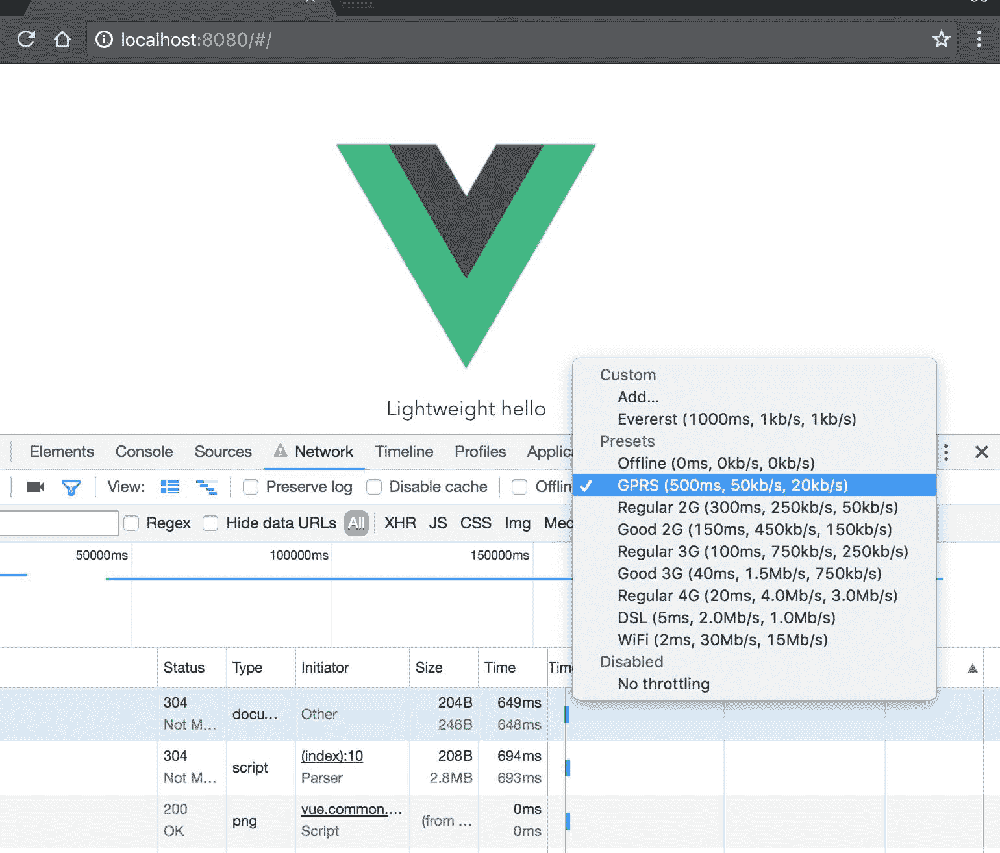
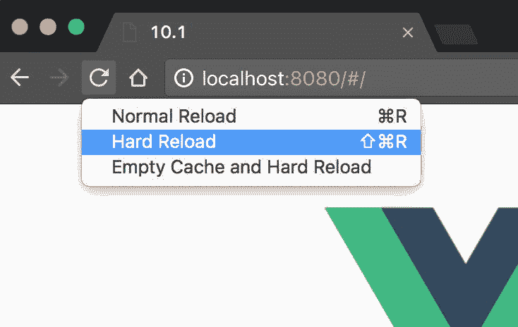
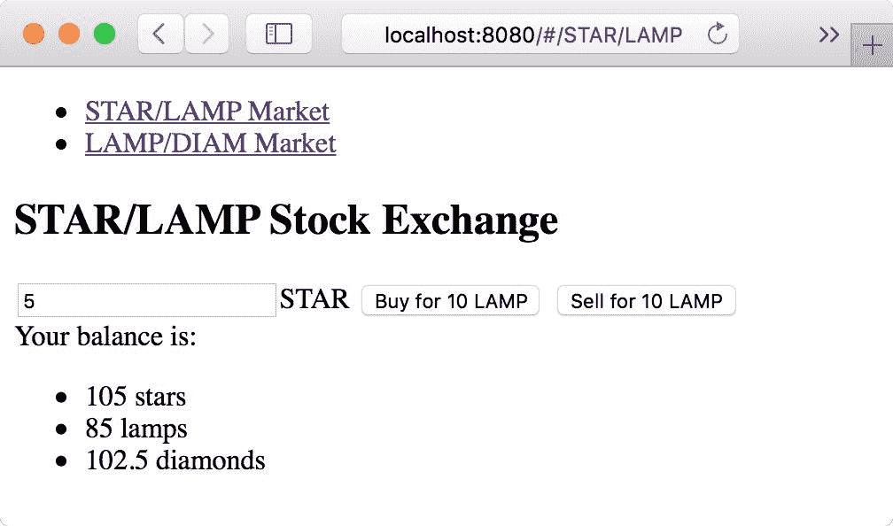
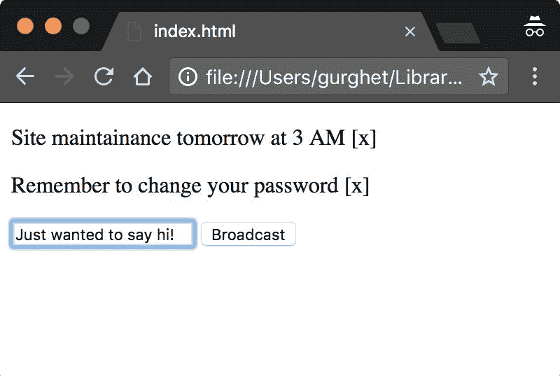
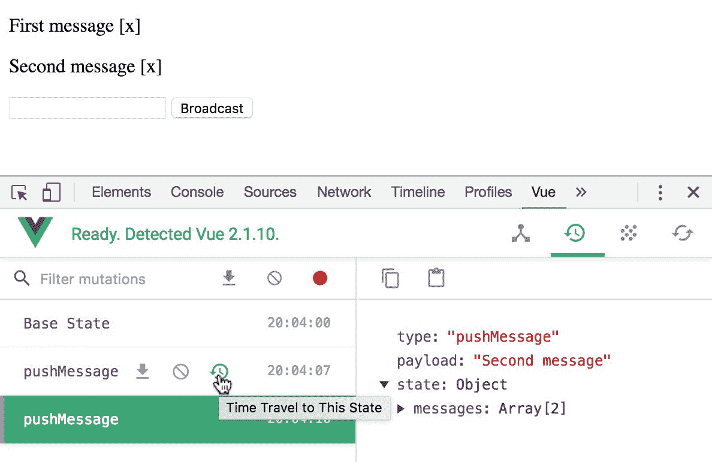
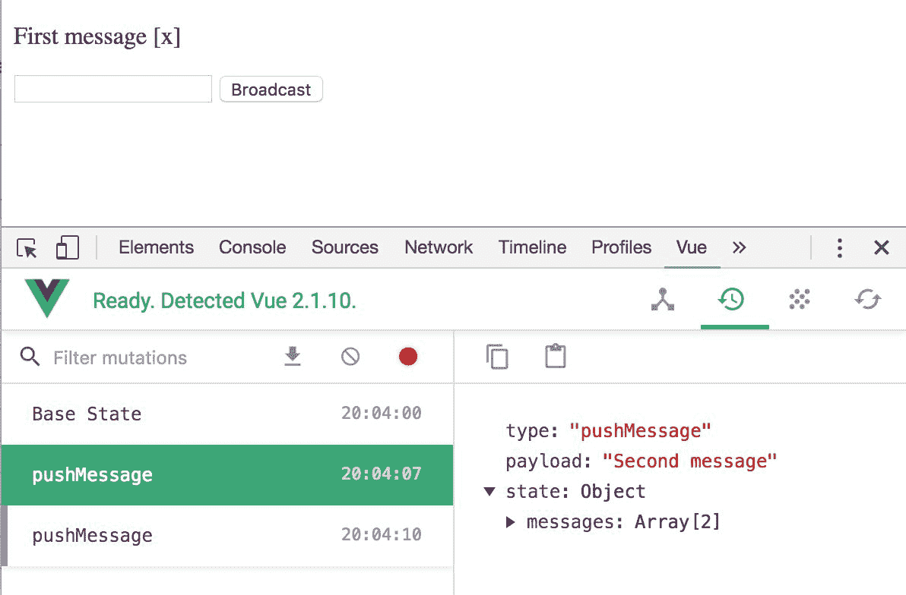
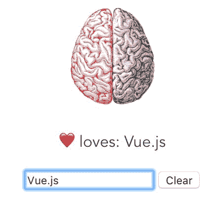

# 第九章：使用 Vuex 的大型应用程序模式

在本章中，我们将介绍以下配方：

+   在 vue-router 中动态加载页面

+   构建一个简单的应用程序状态存储

+   了解 Vuex 的 mutations

+   在 Vuex 中列出您的操作

+   使用模块分离关注点

+   构建 getter 以帮助检索数据

+   测试您的存储

# 介绍

在本章中，您将学习 Vuex 的工作原理以及如何使用它来支持可扩展的应用程序。Vuex 实现了一种在前端框架中流行的模式，它将不同的关注点分开管理一个大型全局应用程序状态。只有 mutations 可以改变状态，所以您只需要在一个地方查找。大部分逻辑以及所有异步逻辑都包含在 actions 中；最后，getters 和 modules 进一步帮助在计算派生状态和将代码拆分为不同文件时分散认知负荷。

除了配方之外，您还会发现在开发实际的大型应用程序时我发现有用的一些智慧之粒；有些与命名约定有关，有些则是为了避免错误的小技巧。

如果您完成了所有的配方，您将准备好开发具有较少错误和无缝协作的大型前端应用程序。

# 在 vue-router 中动态加载页面

很快，您将构建具有大量组件的大型 Vue 网站。加载大量 JavaScript 可能会产生浪费和无用的前期延迟。在第四章的*关于组件的一切*中的*异步加载组件*配方中，我们已经看到了如何远程检索组件的提示。在这里，我们将使用类似的技术来加载由 vue-router 路由加载的组件。

# 准备就绪

这个配方需要了解 vue-router。如果您愿意，您可以通过在第四章的*关于组件的一切*中的*异步加载组件*来更好地了解发生了什么。

# 如何操作...

通过创建一个新目录并运行以下命令，使用`vue-cli`创建一个新项目：

```js
vue init webpack

```

你可以根据自己的喜好回答问题，只要在要求时将`vue-router`添加到模板中即可。

我们将创建两个组件：一个将是我们的主页，它将是小而轻巧的，另一个组件将非常大且加载速度非常慢。我们想要实现的是立即加载主页，而不必等待浏览器下载巨大的组件。

在`components`文件夹中打开`Hello.vue`文件。删除所有内容，只留下以下内容：

```js
<template>

  <div>

    Lightweight hello

  </div>

</template>

```

在同一文件夹中，创建另一个名为`Massive.vue`的文件，并在其中写入以下内容：

```js
<template>

  <div>

   Massive hello

  </div>

</template>

<script>

/* eslint-disable no-unused-vars */

const a = `

```

在最后一行留下一个打开的反引号，因为我们必须用大量无用的数据膨胀文件。保存并关闭`Massive.vue`。

在控制台中，进入与文件存储在同一目录的位置，并使用以下文件将大量垃圾数据放入其中：

```js
yes "XXX" | head -n $((10**6)) >> Massive.vue

```

这个命令的作用是将`XXX`行重复附加到文件中 10⁶次；这将使文件增加 400 万字节，使其对于快速浏览体验来说太大了。

现在我们需要关闭我们打开的反引号。现在不要尝试打开文件，因为你的文本编辑器可能无法打开这么大的文件；相反，使用以下命令：

```js
echo '`</script>' >> Massive.vue

```

我们的`Massive`组件现在已经完成。

打开`router`文件夹中的`index.js`文件，并添加组件及其路由：

```js
import Massive from '@/components/Massive'

...

export default new Router({

  routes: [

    {

      path: '/',

      name: 'Hello',

      component: Hello

    },

 {

 path: '/massive',

 name: 'Massive',

 component: Massive

 }

  ]

})

```

使用`npm install`安装所有依赖项后，我们现在可以使用`npm run dev`命令启动我们非常大的应用程序了。

应用程序将加载得非常快，但这是因为它直接从本地存储加载；为了模拟更真实的情况，打开开发者工具的网络选项卡，并选择网络限制。选择一些慢速的网络，比如 GPRS 或者较好的 3G，这是我们大多数人可能拥有的：



现在右键单击刷新按钮，选择强制刷新以绕过缓存（或按*Shift* + *Cmd* + *R*）：



您会注意到页面在几分钟内不会加载。您可以通过在刷新按钮变成 X 时再次点击来停止页面的加载。

要修复这个问题，请返回到`router`文件夹中的`index.js`文件。删除以下行，其中导入`Massive`组件：

```js
import Massive from '@/components/Massive'

```

前面的行告诉 Webpack 将`Massive`组件中包含的所有代码包含在一个 js 包中。相反，我们希望告诉 Webpack 将`Massive`组件保持为一个单独的包，并且只在必要时加载它。

不要直接导入组件，使用以下代码声明`Massive`：

```js
const Massive = resolve =>

 require(['../components/Massive.vue'], resolve)

```

Webpack 将把这个特殊的语法转换成一个单独的文件，它将被懒加载。保存并进行另一个硬刷新，同时将限制速度设置为较慢的速度（如 GPRS 到良好的 3G）。几秒钟后，您应该能够看到 hello 页面。如果您想加载`Massive`组件，只需将`massive`添加到 URL 中，但您将需要等待一段时间。

# 它是如何工作的...

现在显然在真实应用程序中不会有这么大的组件，但您可以很容易地看到，如果`Massive`组件代表应用程序的所有其他组件，它们可能很快达到如此大的大小。

这里的技巧是异步加载它们；Webpack 将帮助您将它们分成较小的包，以便只在需要时加载。

# 还有更多...

有一种替代的语法可以懒加载导入组件。它可能成为未来的 ECMA 标准，所以您应该知道它。打开`router`目录中的`index.js`文件，并完全删除对`Massive`组件的导入或我们在这个示例中添加的`Massive`常量行。

在路由中，尝试在指定`/massive`路由的组件时使用以下代码：

```js
routes:

 [ 

 { 

path:

'/'

, 

name:

'Hello'

, 

component:

Hello 

 }, 

 {

 path:

'/massive'

, 

name:

'Massive'

, 

 component: import('@/components/Massive') 

 } 

] 

```

这将等同于我们之前所做的，因为 Webpack 将获取该行，并且不会直接导入 Massive 组件的代码，而是创建一个不同的 js 文件，进行懒加载加载。

# 为应用程序状态构建一个简单的存储

在这个示例中，您将了解在构建大型应用程序时使用 Vuex 的基本原理。这个示例有点不正规，因为为了理解 Vuex 存储的工作原理，我们将直接操作它；在真实的应用程序中，您永远不应该这样做。

# 准备就绪

在尝试这个示例之前，您应该完成*第四章*中的“使用 Vuex 使两个组件通信”。

# 操作步骤如下...

在一个新目录中运行以下命令，基于 Webpack 模板创建一个新项目：

```js
vue init webpack

```

您如何回答这个问题并不重要。运行`npm intall`并使用`npm install vuex --save`或`yarn add vuex`（如果使用 yarn）安装 Vuex。

打开`src`文件夹中的`main.js`文件，并添加以下突出显示的行以完成安装 Vuex：

```js
import Vue from 'vue'

import App from './App'

import router from './router'

import store from './store'

/* eslint-disable no-new */

new Vue({

 el: '#app',

 router,

 store,

 template: '<App/>',

 components: { App }

})

```

当然，现在没有`store`模块，所以您需要创建一个。为此，请在`src`文件夹下创建一个文件夹，并将其命名为`store`。在其中创建一个名为`index.js`的文件。在`main.js`文件中，我们没有指定使用`index.js`文件，但当没有指定文件而只有文件夹时，这是默认行为。

我们将实现一个简化的股票市场。我们有三种资产：星星（STAR），灯（LAMP）和钻石（DIAM）。我们将定义两个路线：一个用于 STAR/LAMP 市场，另一个用于 LAMP/DIAM 市场。

在 store 文件夹中的`index.js`文件中编写以下内容：

```js
import Vue from 'vue'

import Vuex from 'vuex'

Vue.use(Vuex)

const store = new Vuex.Store({

  state: {

    STAR: 100,

    LAMP: 100,

    DIAM: 100,

    rate: {

      STAR: {

        LAMP: 2

      },

      LAMP: {

        DIAM: 0.5

      }

    }

  }

})

export default store

```

我们正在创建一个新的`Vuex`存储，用于保存我们的余额。最初，我们每种资产有 100 个；在存储中，星星和灯之间以及灯和钻石之间的汇率也是固定的。

在`components`目录下创建一个名为`Market.vue`的新组件。它将具有以下模板：

```js
<template>

  <div class="market">

    <h2>{{symbol1}}/{{symbol2}} Stock Exchange</h2>

    <div class="buy-sell">

      <input v-model.number="amount">{{symbol1}}

      <button @click="buy">

        Buy for {{rate*amount}} {{symbol2}}

      </button>

      <button @click="sell">

        Sell for {{rate*amount}} {{symbol2}}

      </button>

    </div>

  </div>

</template>

```

`symbol1`和`symbol2`代表两个交易的资产。在这个组件的 JavaScript 中，我们定义了`sell`和`buy`方法，直接在全局的`Vuex`存储中进行操作：

```js
<script>

export default {

  name: 'market',

  data () {

    return {

      amount: 0

    }

  },

  computed: {

    rate () {

      return this.$store.state.rate[this.symbol1][this.symbol2]

    }

  },

  props: ['symbol1', 'symbol2'],

  methods: {

    buy () {

      this.$store.state[this.symbol1] += this.amount

      this.$store.state[this.symbol2] -= this.amount * this.rate

    },

    sell () {

      this.$store.state[this.symbol1] -= this.amount

      this.$store.state[this.symbol2] += this.amount * this.rate

    }

  }

}

</script>

```

你永远不应该像我在这里所做的那样直接操作状态。你应该始终使用 mutations。在这里，我们跳过了中间人，以保持这个示例的简洁性。在下一个示例中会更多地介绍 mutations。

你需要在`index.js`中的`router`文件夹中以以下方式使用这个组件：

```js
import Vue from 'vue'

import Router from 'vue-router'

import Market from '@/components/Market'

Vue.use(Router)

export default new Router({

  routes: [

    {

      path: '/',

      redirect: '/STAR/LAMP'

    },

    {

      path: '/:symbol1/:symbol2',

      component: Market,

      props: true

    }

  ]

})

```

在上面的代码中，我们使用`Market`组件来处理包含一对交易符号的任何路由。作为主页，我们使用了 STAR/LAMP 市场。

为了显示一些导航链接到不同的市场和我们当前的余额，我们可以使用以下模板编辑`App.vue`组件：

```js
<template>

  <div id="app">

    <nav>

      <ul>

        <li>

          <router-link to="/STAR/LAMP">STAR/LAMP Market</router-link>

        </li><li>

          <router-link to="/LAMP/DIAM">LAMP/DIAM Market</router-link>

        </li>

      </ul>

    </nav>

    <router-view></router-view>

    <div class="balance">

      Your balance is:

      <ul>

        <li>{{$store.state.STAR}} stars</li>

        <li>{{$store.state.LAMP}} lamps</li>

        <li>{{$store.state.DIAM}} diamonds</li>

      </ul>

    </div>

  </div>

</template>

```

对于这个组件，我们不需要任何 JavaScript 代码，所以你可以删除`<script>`标签。

我们的应用现在已经准备好了；启动它并开始进行交易。下面的图片是我们完成的应用程序，不包含在`App.vue`中的样式：



# 它是如何工作的...

底部的余额就像是全局状态的一个总结。通过访问每个组件中由 Vuex 插件注入的`$store`变量，我们可以影响其他组件。当你想要将变量的作用域扩展到组件本身之外时，你可以很容易地想象如何使用这种策略在一个大型应用程序中。

一些状态可能是局部的，例如如果你需要一些动画或者你需要一些变量来显示组件的模态对话框；不把这些值放在存储中是完全可以的。否则，在一个地方拥有一个结构化的集中状态会有很大帮助。在接下来的示例中，你将使用更高级的技术来更好地利用 Vuex 的强大功能。

# 理解 Vuex 的 mutations

在 Vuex 应用程序中，改变状态的正确方式是通过 mutations 的帮助。mutations 是一种非常有用的抽象，用于将状态变化分解为原子单位。在这个示例中，我们将探索这一点。

# 准备工作

虽然不需要对 Vuex 了解太多就可以完成这个示例，但建议先完成前一个示例。

# 如何操作...

将 Vuex 作为项目的依赖项添加进来（CDN 地址为`https://unpkg.com/vuex`）。我假设你正在使用 JSFiddle 进行跟随；否则，请记得在存储代码之前放置`Vue.use(Vuex)`。

我们将构建的示例应用程序是向网站用户广播通知。

HTML 布局如下所示：

```js
<div id="app">

  <div v-for="(message, index) in messages"> 

    <p style="cursor:pointer">{{message}}

      <span @click="close(index)">[x]</span>

    </p>

  </div>

  <input v-model="newMessage" @keyUp.enter="broadcast">

  <button @click="broadcast">Broadcast</button>

</div>

```

我们的想法是有一个文本框用于编写消息，广播的消息将显示在顶部，最新的消息将首先显示。可以通过点击小 x 来关闭消息。

首先，让我们构建一个存储库，用于保存广播消息的列表，并枚举我们可以对该列表进行的可能的变化：

```js
const store = new Vuex.Store({

  state: {

    messages: []

  },

  mutations: {

    pushMessage (state, message) {

      state.messages.push(message)

    },

    removeMessage (state, index) {

      state.messages.splice(index, 1)

    }

  }

})

```

所以，我们有一个消息列表；我们可以将一个消息推送到列表的顶部，或者通过知道其索引来删除一个消息。

接下来，我们需要编写应用程序本身的逻辑：

```js
new Vue({

  store,

  el: '#app',

  data: {

    newMessage: ''

  },

  computed: Vuex.mapState(['messages']),

  methods: {

    broadcast () {

      store.commit('pushMessage', this.newMessage)

      this.newMessage = ''

    },

    close (index) {

      store.commit('removeMessage', index)

    }

  }

})

```

现在，您可以启动应用程序并开始向我们的虚拟用户广播消息了：



# 工作原理...

我认为值得注意的是突变的名称；它们被称为`pushMessage`和`removeMessage`，但在这个应用程序中它们实际上是在屏幕上显示消息并（虚构地）向用户广播消息。将它们称为`showMessage`或`broadcastMessage`和`hideMessage`会更好吗？不，因为突变本身和突变的特定效果之间必须有明确的意图分离。当我们决定让用户有能力忽略这些通知或在实际广播通知之前引入延迟时，问题就变得清晰了。然后我们将有一个`showMessage`突变，它实际上不显示消息。

我们使用的计算语法如下所示：

```js
computed: Vuex.mapState(['messages'])

```

当您将 Vuex 作为 ES6 模块导入时，您不必在表达式中显式使用 Vuex。您只需要写

`import { mapState } from 'Vuex'`。

然后，`mapState`函数将可用。

`mapState`方法接受一个字符串数组作为参数，在存储中查找与字符串同名的`state`变量，并创建一个同名的计算属性。您可以使用任意多个变量进行此操作。

# 还有更多...

如果您在本地 npm 项目上跟随，打开 Vue 开发者工具（不幸的是，在使用 JSFiddle 时无法使用 Vue 开发者工具），您将看到每个消息都会发出一个新的突变。考虑一下，您点击了小时钟：



实际上，您可以使用它来撤消突变，如下图所示：



注意当点击时间旅行选项时，状态没有改变；这是因为紫色丝带仍然在最后一个状态。要检查不同的状态，只需点击突变名称。

这个调试机制是可能的，因为突变总是同步的；这意味着可以在突变之前和之后对状态进行快照，并通过时间进行导航。在下一个示例中，您将学习如何使用 Vuex 执行异步操作。

# 在 Vuex 中列出您的操作

您的所有突变都必须是同步的，那么如何等待超时或使用 Axios 进行 AJAX 请求呢？操作是下一级的抽象层，将帮助您解决这个问题。在操作内部，您可以提交多个突变并进行异步操作。

# 准备就绪

突变是操作的构建块，因此强烈建议您在尝试此操作之前完成前面的示例。

我们将使用“构建应用程序状态的简单存储”示例中的设置；您也可以使用自己的设置，但无论如何，此示例都基于官方 Webpack 模板的轻微修改。

# 如何做...

您将构建一个流行的 Xkcd 网站的克隆。实际上，它将更像是一个包装器，而不是一个真正的克隆，因为我们将重用网站上的面板。

基于 Webpack 模板创建一个 Vue 项目，使用`vue init webpack`。我们将首先在`config`文件夹中的`index.js`中将 API 连接到 Xkcd 网站。将以下行放入`proxyTable`对象中：

```js
module.exports = {

  ...

  dev: {

    proxyTable: {

      '/comic': {

        target: 'https://xkcd.com',

        changeOrigin: true,

        pathRewrite: (path, req) => {

          const num = path.split('/')[2]

          return `/${num}/info.0.json`

        }

      }

    },

  ...

```

这将将我们发出的所有请求重定向到`/comic`到 Xkcd 网站。

在`src`中，创建一个新的`store`目录，并在其中创建一个`index.js`文件；在这里，开始构建应用程序存储：

```js
import Vue from 'vue'

import Vuex from 'vuex'

Vue.use(Vuex)

const store = new Vuex.Store({

  state: {

    currentPanel: undefined,

    currentImg: undefined,

    errorStack: []

  },

  actions: {},

  mutations: {}

}

export default store

```

您应该像在之前的示例中那样在`main.js`中导入它。我们想要跟踪当前面板编号、面板图像的链接和可能的错误。修改状态的唯一方法是通过突变，而操作可以执行异步工作。

当应用程序加载时，我们计划显示最新的漫画。为此，我们创建一个操作：

```js
actions: {

  goToLastPanel ({ commit }) {

    axios.get(endpoint)

      .then(({ data }) => {

        commit('setPanel', data.num)

        commit('setImg', data.img)

      }).catch(error => {

        commit('pushError', error)

      })

  }

 ...

```

为了使此代码工作，我们需要声明端点并安装 Axios：

```js
...

import axios from 'axios'

...

const endpoint = '/comic/'

```

编写相应的变异应该很容易：

```js
mutations: {

  setPanel (state, num) {

    state.currentPanel = num

  },

  setImg (state, img) {

    state.currentImg = img

  },

  pushError (state, error) {

    state.errorStack.push(error)

  }

}

```

我们将重用`Hello.vue`组件，并将以下模板放在其中：

```js
<template>

  <div class="hello">

    <h1>XKCD</h1>

    

  </div>

</template>

```

要在加载时显示最后一个面板，可以在组件中使用以下 JavaScript 代码：

```js
<script>

import { mapState } from 'vuex'

export default {

  name: 'hello',

  computed: mapState(['currentImg']),

  created () {

    this.$store.dispatch('goToLastPanel')

  }

}

</script>

```

此外，您可以删除大部分`App.vue`模板，只保留以下内容：

```js
<template>

  <div id="app">

    <router-view></router-view>

  </div>

</template>

```

# 它是如何工作的...

`proxyTable`对象将配置`http-proxy-middleware`。每当我们开发一个较大的 Web 应用程序的 UI，并在`localhost`上启动我们的开发服务器时，这非常有用，但我们的 API 响应到另一个 Web 服务器。当我们想要使用 CORS 并且不允许其他网站使用我们的 API 时，这一点尤为重要。Xkcd API 不允许`localhost`使用 Web 服务。这就是为什么，即使我们尝试直接使用 Xkcd API，我们的浏览器也不会让我们这样做。`changeOrigin`选项将使用 Xkcd 作为主机发送请求，从而使 CORS 变得不必要。

要从组件中调用一个动作，我们使用了`dispatch`函数。还可以传递第二个参数，第一个参数是动作本身的名称。然后，在定义动作时，将第二个参数作为第二个参数传递。

关于命名的最后一点说明——在我的观点中，动作是异步的，而变异是同步的，因此没有必要在动作的名称中显式地表明异步性。

# 使用模块分离关注点

在构建大型应用程序时，Vuex 存储可能会变得拥挤。幸运的是，可以使用模块将应用程序的不同关注点分成单独的部分。

# 准备工作

如果您想使用模块，可以将此示例作为参考。您应该已经了解足够多的 Vuex 知识。

对于这个示例，您需要对 Webpack 有一定的了解。

# 如何操作...

在这个示例中，我们将以稍微简化的方式对一个完全功能的人体进行建模。每个器官都将有一个单独的模块。

使用 `vue init webpack` 创建一个新的 Webpack 模板，并安装 `npm install vuex`。创建一个包含 `src/store/index.js` 文件的新目录。在其中，写下以下内容：

```js
import Vue from 'vue'

import Vuex from 'vuex'

Vue.use(Vuex)

const store = new Vuex.Store({

  modules: {

    brain,

    heart

  }

})

export default store

```

`heart` 模块是这样的；在 store 声明之前放置它：

```js
const heart = {

  state: { loves: undefined },

  mutations: {

    love (state, target) {

      state.loves = target

    },

    unlove (state) {

      state.loves = undefined

    }

  }

}

```

注意，在 mutations 中传递的状态不是根状态，而是模块的本地状态。

然后是大脑，它被分为左右两个脑叶；在 store 之前写下以下内容：

```js
const brain = {

  modules: {

    left: leftLobe,

    right: rightLobe

  }

}

```

你可以将它们实现为简单的布尔状态（在它们所依赖的大脑之前写下它们）：

```js
const leftLobe = {

  namespaced: true,

  state: { reason: true },

  mutations: {

    toggle (state) { state.reason = !state.reason }

  }

}

const rightLobe = {

  namespaced: true,

  state: { fantasy: true },

  mutations: {

   toggle (state) { state.fantasy = !state.fantasy }

  }

}

```

将 `namespaced` 设置为 true 会修改你调用 mutator 的方式。由于它们都被称为 `toggle`，现在你可以指定是哪个脑叶，例如，对于左脑，突变字符串变为 `left/toggle`，其中 `left` 表示它是大脑中用于引用左脑的键。

要查看你的 store 在运行中的情况，你可以创建一个使用所有 mutations 的组件。对于大脑，我们可以有两个脑叶的图片，如下所示：

```js


```

这将创建两个红铅笔绘制的脑叶图；注意嵌套方式中模块名称的使用。以下的 `off` CSS 规则将使脑叶变灰：

```js
.off {

  filter: grayscale(100%)

}

```

为了调用 mutations，我们在正确的方法中使用上述字符串：

```js
methods: {

  left () {

    this.$store.commit('left/toggle')

  },

  right () {

    this.$store.commit('right/toggle')

  }

}

```

你还可以创建一个输入文本框并调用其他两个 mutations，如下所示：

```js
...

love () {

  this.$store.commit('love', this.partner)

},

clear () {

  this.$store.commit('unlove')

  this.partner = undefined

}

...

```

这很简单，但是如何获取所爱的名称呢？你可以在模板中使用这些胡子：

```js
<p>

 loves: {{$store.state.heart.loves}}</p>

<input v-model="partner" @input="love">

<button @click="clear">Clear</button>

```

显然，你必须在 Vue 实例上声明 `partner` 变量：



# 它是如何工作的...

我们已经看到如何使用模块将应用程序的关注点分割成不同的单元。随着项目规模的增长，这种能力可能变得重要。

通常的模式是，在一个 mutation 中，你可以直接访问本地状态：

```js
const leftLobe = {

  namespaced: true,

  state: { reason: true },

  mutations: {

    toggle (state) {

      // here state is the left lobe state

      state.reason = !state.reason

    }

  }

}

```

在 mutation 中，只能访问本地状态是有意义的。例如，大脑不能改变心脏，反之亦然，但是动作呢？如果我们在模块内声明一个动作，我们会传递一个名为 context 的对象，它看起来像这样：

```js
{

  "getters":{},

  "state":{

    "reason":true

  },

  "rootGetters":{},

  "rootState":{

    "brain":{

      "left":{

        "reason":true

      },

      "right":{

        "fantasy":false

      }

    },

    "heart":{

      "loves": "Johnny Toast"

    }

  }

}

```

所以，如果我们想在左侧叶子中声明一个动作，并且我们想要影响心脏，我们必须做以下操作：

```js
actions: {

  beNerd ({ rootState }) {

    rootState.heart.loves = 'Math & Physics'

  }

}

```

# 构建 getter 来帮助检索数据

你不想在状态中保留太多数据。保留重复或派生数据尤其危险，因为它很容易使数据不同步。Getter 可以帮助你解决这个问题，而不会将负担转移到组件上，因为所有逻辑都集中在一个地方。

# 准备工作

如果你已经具备一些 Vuex 知识并且想要扩展你的视野，那么这个教程适合你。

# 如何做到这一点...

想象一下，你正在构建一个比特币钱包。你想给用户一个关于他们余额的概览，并且你希望他们看到对应的欧元数量。

使用`vue init webpack`和`npm install vuex`创建一个新的 Webpack 模板。创建一个新的`src/store/index.js`文件，并在其中写入以下内容：

```js
import Vue from 'vue'

import Vuex from 'vuex'

Vue.use(Vuex)

const store = new Vuex.Store({

  state: {

    bitcoin: 600,

    rate: 1000,

    euro: 600000

  }

})

export default store

```

这段代码容易出错。第一个错误可能是欧元金额的计算错误，如果我们没有正确进行乘法运算。第二种错误可能是在交易过程中告诉用户`bitcoin`和`euro`余额，导致其中一个金额过时和错误。

为了解决这些问题，我们使用`getters`：

```js
const store = new Vuex.Store({

  state: {

    bitcoin: 600,

    rate: 1000

  },

  getters: {

    euro: state => state.bitcoin * state.rate

  }

})

```

这样，`euro`金额永远不会在状态中，而是始终计算得出。此外，它集中在存储中，所以我们不需要在组件中添加任何内容。

现在，从模板中轻松检索两个金额：

```js
<template>

  <div>

    <h1>Balance</h1>

    <ul>

      <li>{{$store.state.bitcoin}}฿

</li>

      <li>{{$store.getters.euro}}&euro;</li>

    </ul>

  </div>

</template>

```

这里，`&#3647 ;`是比特币符号的 HTML 实体。

# 它是如何工作的...

如果我们不谈论输入数据，那么为派生数据设置一个`getter`总是一个好主意。我们还没有讨论过 getter 的一个显著特点是它们能够与其他 getter 进行交互并接受一个参数。

# 访问其他 getter

当调用 getter 时传递的第二个参数是包含其他`getter`的对象：

```js
getters

:

{ 

 ...

  getCatPictures: state => state.pictures.filter(pic => isCat(pic)) 

 getKittens

:

(

state

,

 getters

)

=

>

{ 

 return

 getters

.

getCatPictures()

.

filter

(cat

=

>

 !isAdult(cat)

) 

 } 

} 

```

在我们的示例中，我们可以调用`euro` getter 来获得一些派生数据，例如我们可以用平均价格为 150,000 欧元的比特币购买多少房屋：

```js
const store = new Vuex.Store({

  state: {

    bitcoin: 600,

    rate: 1000

  },

  getters: {

    euro: state => state.bitcoin * state.rate,

    houses: (state, getters) => 

getters.euro() / 150000

})

```

# 传递参数

如果一个 getter 返回一个带有参数的函数，那么该参数将是 getter 的参数：

```js
getters: {

  ...

  getWorldWonder: state => nth => state.worldWonders[nth]

}

```

在我们的示例中，一个实际的例子可以在前一段中的 getter 中指定房屋的平均成本：

```js
const store = new Vuex.Store({

  state: {

    bitcoin: 600,

    rate: 1000

  },

  getters: {

    euro: state => state.bitcoin * state.rate,

    houses: (state, getters) => averageHousePrice => {

 return getters.euro() / averageHousePrice

 }

})

```

# 测试你的商店

正如你从*第七章*中所了解的，测试是专业软件中最重要的部分。由于商店通常定义应用程序的业务逻辑，因此对其进行测试对于应用程序可能是至关重要的。在这个示例中，你将为 Vuex 商店编写测试。

# 准备工作

这个示例需要来自*第七章*的知识，即*单元测试和端到端测试*以及对 Vuex 的熟悉；你可以从本章的早期示例中获得它。

# 如何做...

首先，我将定义一些我们的商店必须实现的功能；然后你将编写测试来证明这些功能是否存在并且正常工作。

# 软件要求

我们的商店由待办事项列表中的项目组成，如下所示：

```js
state: {

  todo: [

    { id: 43, text: 'Buy iPhone', done: false },

    ...

  ],

  archived: [

    { id: 2, text: 'Buy gramophone', done: true },

    ...

  ]

}

```

我们有两个要求：

+   我们必须有一个`MARK_ITEM_AS_DONE`变异，将`done`字段从 false 更改为 true

+   我们必须有一个`downloadNew`操作，从服务器下载最新的项目并将它们添加到列表中

# 测试变异

要能够测试你的变异，你必须使它们在测试文件中可用。为此，你必须从商店中提取变异对象。考虑类似于这样的东西：

```js
import Vuex from 'vuex'

import Vue from 'vue'

Vue.use(Vuex)

const store = new Vuex.Store({

  ...

  mutations: {

    ...

    MARK_ITEM_AS_DONE (state, itemId) {

      state.todo.filter(item => {

        return item.id === itemId

      }).forEach(item => {

        item.done = true

      })

      state.archived.filter(item => {

        return item.id === itemId

      }).forEach(item => {

        item.done = true

      })

    }

  }

}) 

export default store

```

您必须将其提取到类似以下的内容中：

```js
export const mutations = { ... }

const store = new Vuex.Store({ ... })

export default store

```

这样，您可以在测试文件中使用以下代码导入 mutations：

```js
import { mutations } from '@/store'

```

满足需求 1 的测试可以编写如下：

```js
describe('mutations', () => {

  it(`MARK_ITEM_AS_DONE mutation must change the

        done field from false to true for a todo`, () => {

    const state = {

      todo: [

        { id: 43, text: 'Buy iPhone', done: false }

      ],

      archived: [

        { id: 40, text: 'Buy cat', done: false }

      ]

    }

    mutations.MARK_ITEM_AS_DONE(state, 43)

    expect(state.todo[0].done).to.be.true

  })

})

```

如果您使用官方的 Webpack 模板，可以使用`npm run unit`运行测试。默认情况下，这将使用 PhantomJS，它不实现某些功能。您可以使用 Babel polyfills，或者只需进入`karma.conf.js`并在`browsers`数组中将`PhantomJS`替换为`Chrome`。记得使用`npm install karma-chrome-launcher --save-dev`安装 Chrome launcher。

# 测试 actions

**测试 actions**意味着测试操作是否提交了预期的 mutations。我们对 mutations 本身不感兴趣（至少在单元测试中不感兴趣），因为它们已经单独测试过了。但是，我们可能需要模拟一些依赖项。

为了避免依赖于 Vue 或 Vuex（因为我们不需要它们，而且它们可能会污染测试），我们在 store 目录中创建一个新的`actions.js`文件。使用`npm install axios`安装 Axios。`actions.js`文件可以如下所示：

```js
import axios from 'axios'

export const actions = {

  downloadNew ({ commit }) {

    axios.get('/myNewPosts')

      .then(({ data }) => {

        commit('ADD_ITEMS', data)

      })

  }

}

```

为了测试需求 2，我们首先模拟应该下载新的待办事项的服务器调用：

```js
describe('actions', () => {

const actionsInjector = 

  require('inject-loader!@/store/actions')

const buyHouseTodo = {

  id: 84,

  text: 'Buy house',

  done: true

}

const actions = actionsInjector({

  'axios': {

    get () {

      return new Promise(resolve => {

        resolve({

          data: [buyHouseTodo]

        })

      })

    }

  }

}).default

}

```

这将确保对`axios`的 get 方法的任何调用都将始终返回一个新的待办事项。

然后，我们希望确保在调度时调用`ADD_ITEMS` mutation：

```js
describe('actions', () => {

  const actionsInjector = 

    require('inject-loader!@/store/actions')

    const buyHouseTodo = {

      id: 84,

      text: 'Buy house',

      done: true

    }

    const actions = actionsInjector({

      'axios': {

        get () {

          return new Promise(resolve => {

            resolve({ data: [buyHouseTodo] })

          })

        }

      }

    }).default

    it(`downloadNew should commit ADD_ITEMS

    with the 'Buy house' todo when successful`, done => {

    const commit = (type, payload) => {

      try {

        expect(type).to.equal('ADD_ITEMS')

        expect(payload).to.deep.equal([buyHouseTodo])

        done()

      } catch (error) {

        done(error)

      }

    }

  actions.downloadNew({ commit })

  })

})

```

# 工作原理如下... 

虽然对 mutations 的测试非常简单，但我认为对 actions 的测试值得更多解释。

由于我们不想依赖外部服务来执行操作，我们不得不模拟`axios`服务。我们使用了`inject-loader`，它接受原始库并使用任意代码模拟我们指定的部分（`@`符号是`src`的简写）；在我们的情况下，我们模拟了`axios`库，特别是`get`方法。我们必须使用 CommonJS 语法（使用`require`）因为这是告诉 Webpack 在导入时使用加载器的唯一方式。

在测试中，我们所做的是模拟`commit`函数。通常，这个函数调用一个修改状态的 mutation。我们只想知道是否调用了正确的 mutation，并且传入了正确的参数。此外，我们不得不将所有内容包装在一个`try`块中；如果没有它，测试将超时失败，我们将丢失错误信息。相反，现在我们立即失败，并且可以从控制台中读取导致测试失败的错误。
