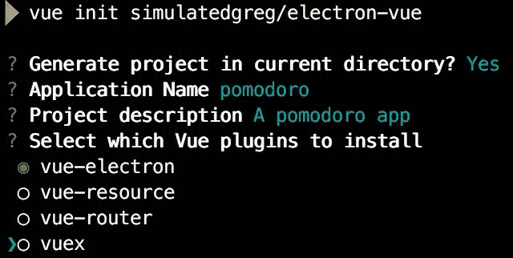
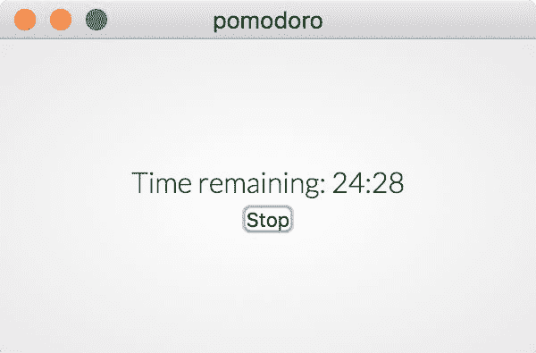
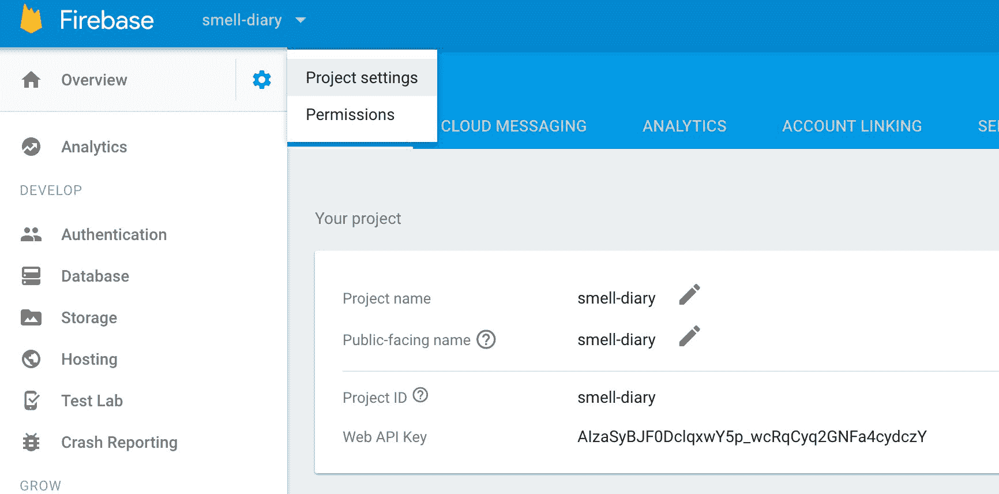
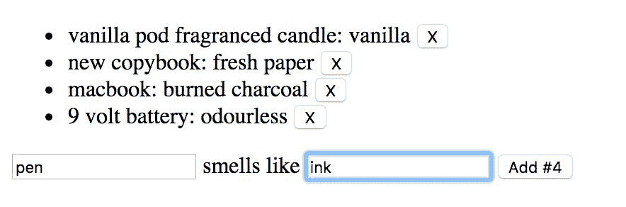
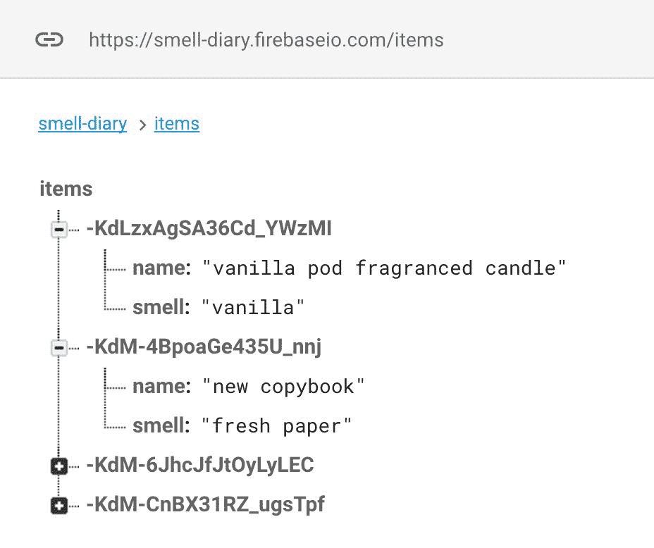
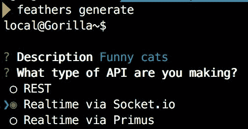
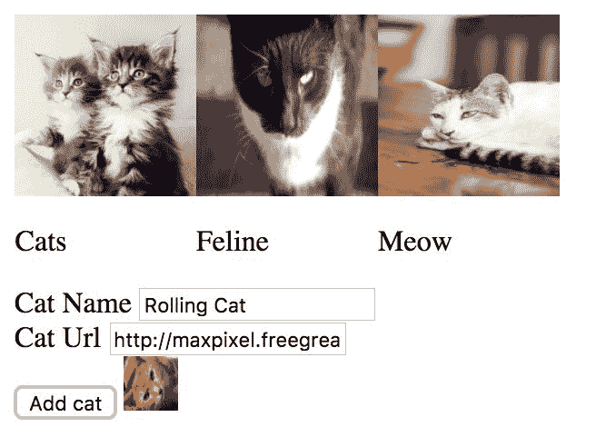
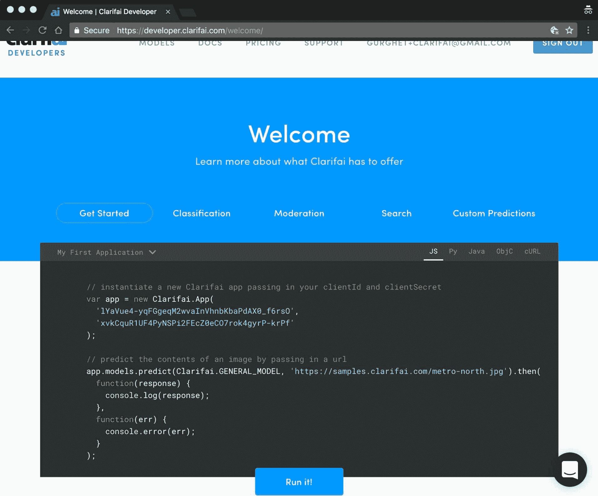
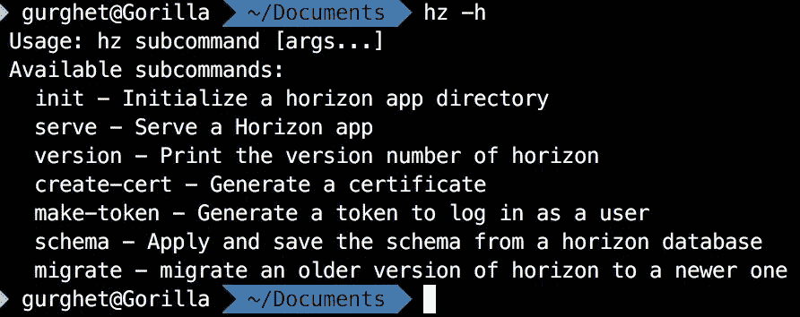
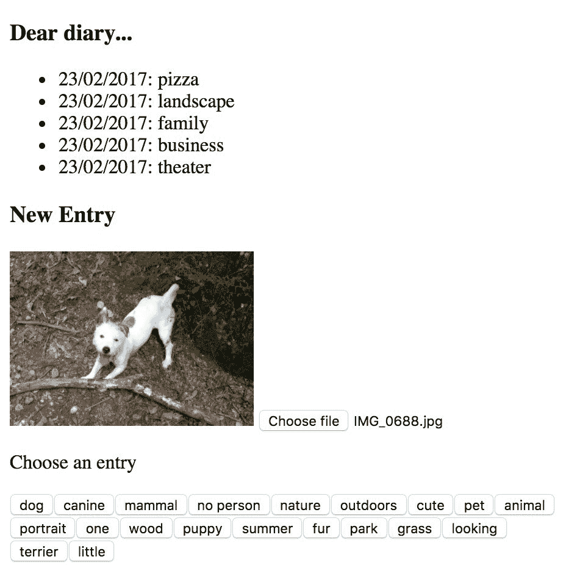

# 第十章：与其他框架集成

在本章中，我们将探讨以下主题：

+   使用 Electron 构建通用应用程序

+   使用 Vue 和 Firebase

+   使用 Feathers 创建实时应用程序

+   使用 Horizon 创建响应式应用程序

# 介绍

Vue 很强大，但如果你需要一个后端，它就不能独自完成太多事情；至少你需要一个服务器来部署你的软件。在本节中，您将实际上使用流行的框架构建小而完整、可工作的应用程序。Electron 用于将 Vue 应用程序带到桌面。Firebase 是一个现代化的云后端，最后，FeatherJS 是一个简约但功能齐全的 JavaScript 后端。当您完成这些后，您将拥有与它们交互并快速构建专业应用程序所需的所有工具。

# 使用 Electron 构建通用应用程序

Electron 是一个用于创建在 Mac、Linux 和 Windows 上运行的通用应用程序的框架。它的核心是一个简化版本的 Web 浏览器。它已被用于创建广泛使用的应用程序，如 Slack 和 Visual Studio Code 等。在这个示例中，您将使用 Electron 构建一个简单的应用程序。

# 准备工作

要构建这个应用程序，我们将只使用基本的 Vue 功能。Electron 超出了本书的范围，但对于这个示例，不需要了解 Electron 的知识；事实上，这是学习更多关于 Electron 的好起点。

# 如何做到这一点...

在这个示例中，我们将构建一个小而完整的应用程序——一个番茄钟应用程序。番茄钟是一个大约 25 个时间单位的间隔，在这个间隔中，您应该专注于工作。它被称为这个名字，因为通常使用一个番茄形状的厨房计时器来测量时间。这个应用程序将跟踪时间，这样您就不必购买一个昂贵的厨房计时器了。

使用 Electron-Vue 脚手架是启动一个 Vue 项目与 Electron 的最佳方式（你不说！）。可以通过以下命令轻松实现：

```js
vue init simulatedgreg/electron-vue pomodoro

```

您可以使用默认值进行回答，但当被问及要安装哪个插件时，只需选择`vue-electron`。使用`npm intall`安装所有依赖项，如果愿意，您可以在进行必要的修改时保持应用程序处于热重载状态，使用`npm run dev`。您可以通过点击角落的*x*来隐藏开发工具：



首先，我们希望我们的应用程序尽可能小。让我们转到`app/src/main/index.js`文件；此文件控制我们应用程序的生命周期。将窗口大小更改为以下内容：

```js
mainWindow = new BrowserWindow({

  height: 200,

  width: 300

})

```

然后，我们实际上不希望在`app/src/render/components`文件夹中有样板组件，所以您可以删除所有内容。相反，创建一个`Pomodoro.vue`文件并将此模板放入其中：

```js
<template>

  <div class="pomodoro">

    <p>Time remaining: {{formattedTime}}</p>

    <button v-if="remainingTime === 1500" @click="start">Start</button>

    <button v-else @click="stop">Stop</button>

  </div>

</template>

```

为了使其工作，我们还需要编写 JavaScript 部分，如下所示：

```js
<script>

export default {

  data () {

    return {

      remainingTime: 1500,

      timer: undefined

    }

  },

  methods: {

    start () {

      this.remainingTime -= 1

      this.timer = setInterval(() => {

        this.remainingTime -= 1

        if (this.remainingTime === 0) {

          clearInterval(this.timer)

        }

      }, 1000)

    },

    stop () {

      clearInterval(this.timer)

      this.remainingTime = 1500

    }

  }

}

</script>

```

这样，点击程序中的开始按钮将每秒减少 1 秒。点击停止按钮将清除计时器并将剩余时间重置为 1500 秒（25 分钟）。计时器对象基本上是`setInterval`操作的结果，而`clearInterval`只是停止计时器正在执行的任何操作。

在我们的模板中，我们希望有一个`formattedTime`方法，以便以`mm:ss`格式显示时间，这比仅剩余秒数（即使这更加极客）更易读，因此我们需要添加计算函数：

```js
computed: {

  formattedTime () {

    const pad = num => ('0' + num).substr(-2)

    const minutes = Math.floor(this.remainingTime / 60)

    const seconds = this.remainingTime - minutes * 60

    return `${minutes}:${pad(seconds)}`

  }

}

```

要将此组件添加到应用程序中，请转到`App.vue`文件并编辑以下行，替换`landingPage`占位符元素：

```js
<template>

  <div id="#app">

 <pomodoro></pomodoro>

  </div>

</template>

<script>

 import Pomodoro from 'components/Pomodoro'

  export default {

    components: {

 Pomodoro

    }

  }

</script>

```

使用`npm run dev`启动应用程序，您现在应该能够在工作或学习时跟踪时间：



您甚至可以使用`npm run build`命令构建应用程序的可分发版本。

# 它是如何工作的...

我们实现的计时器对于时间跟踪来说并不特别准确。让我们来审查一下代码：

```js
this.timer = setInterval(() => {

  this.remainingTime -= 1

  if (this.remainingTime === 0) {

    clearInterval(this.timer)

  }

}, 1000)

```

这意味着我们每秒减少剩余时间。问题在于`setInterval`函数本身不是 100%准确的，可能会在 1000 毫秒之前或之后触发函数，这取决于机器的计算负载；这样，误差的边界可以累积并成为相当大的数量。更好的方法是在每次调用函数时检查时钟并在每个循环中调整误差，尽管我们不会在这里涵盖这个问题。

# 使用 Vue 和 Firebase

使用 Vue 和 Firebase 作为后端非常容易，这要归功于 VueFire - 一个包含 Firebase 绑定的插件。在这个示例中，您将开发一个完全功能的气味数据库。

# 准备工作

Firebase 超出了本书的范围，但是我假设您对基本概念有所了解。除此之外，您真的没有太多需要了解的，因为我们将在其上构建一个非常基本的 Vue 应用程序。

# 如何做...

在开始编写代码之前，我们需要创建一个新的 Firebase 应用程序。要做到这一点，您必须登录[`firebase.google.com/`](https://firebase.google.com/)并创建一个新的应用程序。在我们的例子中，它将被称为`smell-diary`。您还需要记下您的 API 密钥，该密钥可以在项目设置中找到：



此外，您需要禁用身份验证；转到数据库部分，在规则选项卡中将读取和写入都设置为 true：

```js
{

  "rules": {

    ".read": true,

    ".write": true

  }

}

```

我们已经完成了 Firebase 的配置。

打开一个干净的 HTML5 样板或 JSFiddle，使用`Vue`作为库。我们将需要以下依赖项，以脚本标签的形式放在文件的头部：

```js
 <script src="https://unpkg.com/vue/dist/vue.js"></script>

 <script src="https://www.gstatic.com/firebasejs/3.6.9/firebase.js"></script>

 <script src="https://unpkg.com/vuefire/dist/vuefire.js"></script>

```

VueFire 将自动检测到 Vue（因此顺序很重要）并将其安装为插件。我们将构建一个非常简单的数据库来跟踪我们周围事物的气味。以下是我们应用程序的 HTML 布局：

```js
<div id="app">

  <ul>

    <li v-for="item in items">

      {{item.name}}: {{item.smell}}

    <button @click="removeItem(item['.key'])">X</button>

    </li>

  </ul>

  <form @submit.prevent="addItem">

    <input v-model="newItem" />

    smells like

    <input v-model="newSmell" />

    <button>Add #{{items.length}}</button>

  </form>

</div>

```

在我们应用的 JavaScript 部分，我们需要指定 API 密钥以与 Firebase 进行身份验证，写入以下内容：

```js
const config = {

  databaseURL: 'https://smell-diary.firebaseio.com/'

}

```

然后，我们将配置提供给 Firebase 并获取数据库的控制权：

```js
const firebaseApp = firebase.initializeApp(config)

 const db = firebaseApp.database()

```

这可以在`Vue`实例之外完成。VueFire 插件在`Vue`实例中安装了一个名为`firebase`的新选项；我们必须指定我们想要使用`item`变量访问 Firebase 应用中的`/items`：

```js
new Vue({

  el: '#app',

  firebase: {

    items: db.ref('/items')

  }

})

```

`newItem`和`newSmell`变量将临时保存我们在输入框中输入的值；然后，`addItem`和`removeItem`方法将发布和删除我们数据库中的数据：

```js
data: {

  newItem: '',

  newSmell: ''

},

methods: {

  addItem () {

    this.$firebaseRefs.items

      .push({

        name: this.newItem,

        smell: this.newSmell

      })

    this.newItem = ''

    this.newSmell = ''

  },

  removeItem (key) {

    this.$firebaseRefs.items

      .child(key).remove()

  }

}

```

如果你现在启动你的应用，你已经可以添加你最喜欢的香味和找到它们的方法了：



# 它是如何工作的...

Firebase 作为一个简单的键值存储。在我们的例子中，我们从来没有存储值，而是总是添加子项；你可以在 Firebase 控制台上查看你创建的内容。



键是自动创建的，它们包含空值和 32 层嵌套数据。我们使用一层嵌套来为每个对象插入名称和气味。

# 使用 Feathers 创建实时应用

大多数现代应用程序是实时的，不是传统意义上的实时，而是指它们不需要重新加载页面就可以更新。实现这一点的最常见方法是通过 WebSockets。在这个示例中，我们将利用 Feathers 和 Socket.io 来构建一个猫数据库。

# 准备工作

这个示例没有先决条件，但是如果你想要更多的上下文，你可以在开始这个示例之前完成*创建一个 REST 客户端（和服务器！）*示例。

# 如何操作...

要完成这个示例，你需要 Feathers 的命令行；使用以下命令安装它：

```js
npm install -g feathers-cli

```

现在，运行`feathers generate`，它将为你创建所有的样板代码。当被询问到 API 时，选择 Socket.io：



其他问题可以保持默认值。在 Feather 控制台中，输入`generate service`创建一个新的服务。你可以将其命名为 cats，并将其他问题保持默认值。

在`public`文件夹中，打开`index.html`并删除除了 HTML5 模板之外的所有内容。你需要在头部添加三个依赖项：

```js
 <script src="//cdnjs.cloudflare.com/ajax/libs/vue/2.1.10/vue.js"></script>

 <script src="//cdnjs.cloudflare.com/ajax/libs/socket.io/1.7.3/socket.io.js"></script>

 <script src="//unpkg.com/feathers-client@¹.0.0/dist/feathers.js"></script>

```

在`body`标签中，按照以下方式编写 HTML 布局：

```js
<div id="app">

  <div v-for="cat in cats" style="display:inline-block">

    

    <p>{{cat.name}}</p>

  </div>

  <form @submit.prevent="addCat">

    <div>

      <label>Cat Name</label>

      <input v-model="newName" />

    </div>

    <div>

      <label>Cat Url</label>

      <input v-model="newUrl" />

    </div>

    <button>Add cat</button>

    

  </form>

</div>

```

第一个`<div>`标签是一个猫的画廊。然后，构建一个表单来添加你收集到的猫的新图片。

在`body`标签中，你可以使用以下代码配置 Feathers 服务：

```js
<script>

  const socket = io('http://localhost:3030')

  const app = feathers()

    .configure(feathers.socketio(socket))

  const catService = app.service('cats')

```

这是为了配置将连接到 WebSockets 的浏览器的客户端。`catService`方法是对猫数据库的处理。接下来，我们编写`Vue`实例：

```js
  new Vue({

    el: '#app',

    data: {

      cats: [],

      newName: '',

      newUrl: ''

    },

    methods: {

      addCat () {

        catService.create({

          name: this.newName,

          url: this.newUrl

        })

        this.newName = ''

        this.newUrl = ''

      }

    },

```

最后，在启动时我们需要请求数据库中的所有猫，并安装一个监听器以防其他用户创建新的猫：

```js
    mounted () {

      catService.find()

        .then(page => {

          this.cats = page.data

        })

      catService.on('created', cat => {

        this.cats.push(cat)

      })

    }

 })

 </script>

```

如果你使用`npm start`运行应用程序，你可以在控制台中看到 URL，打开另一个浏览器窗口，观察它实时变化：



# 工作原理...

实时查看添加的猫显然是现代应用的发展方向。Feathers 让你可以轻松创建它们，并且只需少量的代码，这要归功于底层的 Socket.io，而 Socket.io 又使用了 WebSockets。

WebSockets 并不复杂，Feathers 在这种情况下只是监听通道中的消息，并将其与将某些内容添加到数据库的操作关联起来。

当你可以仅仅更换数据库和 WebSocket 提供程序，或者切换到 REST 而不需要修改 Vue 代码时，Feathers 的强大之处就显现出来了。

# 使用 Horizon 创建一个响应式应用

Horizon 是一个构建响应式、实时可扩展应用的平台。它在内部使用 RethinkDB，并且与 Vue 完全兼容。在这个示例中，你将构建一个自动个人日记。

# 准备工作

这个示例只需要一些 Vue 的基础知识，但真的没有其他太多的东西。

但在开始之前，请确保您安装了 RethinkDB。您可以在他们的网站上找到更多信息（[`www.rethinkdb.com/docs/install/`](https://www.rethinkdb.com/docs/install/)）。如果您有 Homebrew，可以使用`brew install rethinkdb`来安装它。

此外，您将需要一个 Clarifai 令牌。要免费获取一个，请访问[`developer.clarifai.com/`](https://developer.clarifai.com/)并注册。您将看到您应该在应用程序中编写的代码，如下图所示：



特别是，您将需要`clientId`和`clientSecret`，它们以以下方式显示：

```js
var

 app = 

new

 Clarifai.App( 

 'your client id would be printed here'

, 

 'your client secret would be here' 

);

```

记下这段代码，或者准备好将其复制粘贴到你的应用程序中。

# 如何做...

写日志是一项困难的任务，您每天都要写很多东西。在这个示例中，我们将构建一个自动日志，它将根据我们在一天中拍摄的照片来为我们写作。

Horizon 将帮助我们记住一切，并在我们的设备之间同步日记。在安装了 RethinkDB 之后，使用以下命令安装 Horizon：

```js
npm install -g horizon

```

现在，您将拥有新的命令`hz`。通过输入`hz -h`来检查它；您应该会看到类似以下的内容：



要创建将托管我们新应用程序的目录，请输入以下内容：

```js
hz init vue_app

```

然后，进入新创建的`vue_app`目录，查看`dist`文件夹中的`index.html`。这个文件将是我们服务器的入口点，用编辑器打开它。

您可以清除所有内容，只留下一个空的 HTML5 样板，其中包含一个空的`<head>`和`<body>`。在头部部分，我们需要声明对 Vue、Horizon 和 Clarifai 的依赖关系，如下所示：

```js
 <script src="https://unpkg.com/vue"></script>

 <script src="/horizon/horizon.js"></script>

 <script src="https://sdk.clarifai.com/js/clarifai-latest.js"></script>

```

请注意，Horizon 不是来自 CDN，而是来自本地依赖。

我们首先要为我们的日志制定一个模板。我们有两个部分。在第一个部分，我们将列出我们过去做过的事情。在 HTML 的主体中写入以下内容：

```js
<div id="app">

  <div>

    <h3>Dear diary...</h3>

    <ul>

      <li v-for="entry in entries">

        {{ entry.datetime.toLocaleDateString() }}:

        {{ entry.text }}

      </li>

    </ul>

  </div>

...

```

在第二部分中，我们将输入新的条目：

```js
  ...

  <h3>New Entry</h3>

  

  <input type="file" @change="selectFile" ref="file">

  <p v-if="tentativeEntries.length">Choose an entry</p>

  <button v-for="tentativeEntry in tentativeEntries" @click="send(tentativeEntry)">

    {{tentativeEntry}}

  </button>

</div>

```

在此之后，打开一个`<script>`标签，我们将在其中编写以下所有的 JavaScript 代码。

首先，我们需要登录到 Clarifai：

```js
var app = new Clarifai.App(

 '7CDIjv_VqEYfmFi_ygwKsKAaDe-LwEzc78CcW1sA',

 'XC0S9GHxS0iONFsAdiA2xOUuBsOhAT0jZWQTx4hl'

 )

```

显然，您需要输入您从 Clarifai 获取的`clientId`和`clientSecret`。

然后，我们需要启动 Horizon 并获得我们将要创建的`entries`集合的句柄：

```js
const horizon = new Horizon()

const entries = horizon('entries')

```

现在，我们终于可以编写我们的`Vue`实例，其中包含三个状态变量：

```js
new Vue({

  el: '#app',

  data: {

    tentativeEntries: [],

    data_uri: undefined,

    entries: []

  },

  ...

```

`tentativeEntries`数组将包含我们可以从中选择的日记的可能条目列表；`data_uri`将包含我们要用作今天所做的事情的参考图像（base64 编码）；`entries`是所有过去的条目。

当我们加载一张图片时，我们要求 Clarifai 提供可能的条目：

```js
...

methods: {

  selectFile(e) {

  const file = e.target.files[0]

  const reader = new FileReader()

  if (file) {

    reader.addEventListener('load', () => {

      const data_uri = reader.result

      this.data_uri = data_uri

      const base64 = data_uri.split(',')[1]

      app.models.predict(Clarifai.GENERAL_MODEL, base64)

        .then(response => {

          this.tentativeEntries =

            response.outputs[0].data.concepts

            .map(c => c.name)

        })

      })

    reader.readAsDataURL(file)

  }

},

...

```

然后，当我们按下发送按钮时，我们告诉 Horizon 的 entries 集合存储这个新条目：

```js
    ...

    send(concept) {

      entries.store({

        text: concept,

         datetime: new Date()

      }).subscribe(

        result => console.log(result),

        error => console.log(error)

      )

      this.tentativeEntries = []

      this.$refs.file.value = ''

      this.data_uri = undefined

    }

  }

})

```

最后，我们希望在页面加载时在屏幕上显示最后十个条目，并且每次添加新条目时，它都会实时弹出。在 Vue 实例中的方法之后，添加以下钩子：

```js
created() {

  entries.order('datetime', 'descending').limit(10).watch()

    .subscribe(allEntries => {

      this.entries = [...allEntries].reverse()

  })

}

```

要运行 Horizon 服务器，请使用以下命令：

```js
hz serve --dev

```

上述代码的输出如下：

前往指定地址（第一行，而不是管理员界面），您将看到以下内容：

您会注意到，如果您有其他浏览器窗口打开，它们将实时更新。现在，您终于可以每天写一篇日记而无需打字了！

# 它是如何工作的...

我们的应用程序使用了一种被称为响应式的模式。它的核心可以在创建的句柄中清楚地看到：

```js
entries.order('datetime', 'descending').limit(10).watch()

  .subscribe(allEntries => {

    this.entries = [...allEntries].reverse()

  })

```

第一行返回的是所谓的响应式中的 observable。Observable 可以被视为事件的源。每当一个事件被触发时，订阅该源的订阅者将对其进行处理。在我们的例子中，我们正在获取整个 entries 集合，而被抛出的事件是对该集合的修改。每当我们接收到这种类型的事件时，我们会更新`entries`数组。

我不会在这里提供对响应式编程的深入解释，但我想强调这种模式非常有助于可扩展性，因为你可以很容易地实现对数据流的控制；`limit(10)`就是一个例子。
