# 第八章：使用 Vitest 和 Cypress 测试你的应用程序

无论你在编写代码方面有多少经验，测试你的应用程序都是必须的，以确保代码库的质量。市面上有各种各样的测试工具，但在这本书中，我们将学习 Vitest 用于单元测试和 Cypress 用于端到端测试。

测试是一个很大的主题，在本章中，我们将学习两种测试方法的基础，省略了你在职业生涯过程中可能遇到的更高级的技术。

首先，我们将学习不同的测试方法以及它们各自如何有助于产生高质量的软件。然后，我们将通过学习如何使用 Vitest 和 Vue Test Utils 来测试应用程序中的单个组件来介绍单元测试。接着，我们将把注意力从单个组件转移到整个应用程序上，通过引入使用 Cypress 的**E2E**（**端到端**）测试来实现。然后，我们将编写一个端到端测试来覆盖一个小用户旅程，在进入最后一部分之前，这部分将用于介绍诸如模拟和间谍等高级主题。

本章包括以下部分：

+   测试金字塔

+   使用 Vitest 进行单元测试

+   使用 Cypress 进行端到端测试

+   介绍高级测试技术

到本章结束时，你将获得对测试的一般基本理解。你将能够在你未来的项目中设置 Vitest 和 Cypress，并知道如何在单元测试和端到端测试中编写基本测试。最后，你还将接触到你在职业生涯中可能遇到的未来测试技术。

# 技术要求

在本章中，分支被命名为`CH08`。要拉取这个分支，请运行以下命令或使用你选择的 GUI 来支持你进行此操作：

```js
git switch CH08.
```

该分支包含从上一章更新的所有文件。

本章的代码文件可以在[`github.com/PacktPublishing/Vue.js-3-for-Beginners`](https://github.com/PacktPublishing/Vue.js-3-for-Beginners)找到。

# 测试金字塔

清洁代码、编码标准和同行评审是良好应用程序的重要组成部分，但它们并不是唯一的。事实上，一个良好且可靠的应用程序不仅是良好开发的来源，也是应用程序内良好测试覆盖率的结果。

测试覆盖范围非常广泛。一些公司进行非常少的测试，通过向最终用户发布新代码以寻找错误和错误，让他们成为实际的测试者，而其他公司则投入时间和预算来开发全面的测试集，并将它们添加到他们的流程中。

即使公司在测试上投入的时间不同，所有开发者至少可以同意，增加测试通常会导致向用户发布的错误更少，并且应用程序更加灵活。

可以为应用程序开发多个测试级别，并且它们被分为层，这些层共同形成一个金字塔（因此得名*测试金字塔*）。

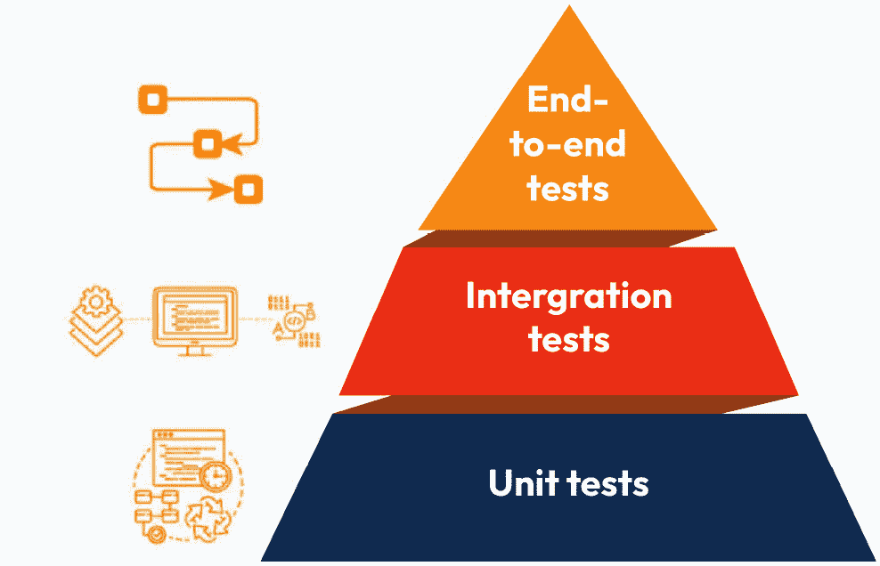

图 8.1：测试金字塔

金字塔的底部是单元测试所在的位置。单元测试检查单个单元，这通常是一个组件或辅助文件。这些测试运行非常快，因此通常以大量产生。然后，我们有集成测试，这是系统不同部分连接在一起以确保所有部分都能协同工作的地方。集成测试可以通过将代码和数据库集成在一起来测试方法是否成功地将条目添加到数据库中，因此得名*集成测试*。这些测试运行时间更长，需要更大的架构，因此预计它们的使用频率将低于单元测试。在金字塔中向上移动，我们发现端到端测试。端到端测试封装了由质量保证团队运行的手动测试，以及使用 Cypress 或 Playwright 等工具运行的自动端到端测试。手动端到端测试由质量保证团队手动运行，而自动端到端测试由 Cypress 或 Playwright 等工具运行。单个端到端测试覆盖整个用户旅程，由于其范围很大，你只需要少量测试来覆盖你的整个应用程序。

对于本书的范围，我们将涵盖单元测试和端到端测试。由于端到端工具的进步，集成测试将不会涉及，因为它们的有用性正在逐渐降低。

测试类型之间的差异不仅由它们可以捕获的不同错误定义，还由它们的“开发成本”和“运行速度”定义。让我们看看以下图表中不同测试的表现：

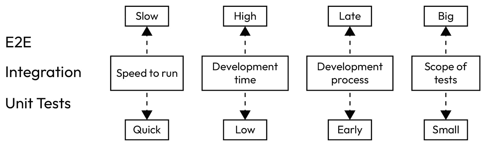

图 8.2：不同测试类型的比较

如果一个应用程序只做端到端测试，它会在开发后期才捕获到错误，从而减慢开发过程。相反，如果一个应用程序只做单元测试，它将无法捕捉到由系统不同部分协同工作产生的错误和不一致性，因为单元测试专注于单个单元，因此不能确保应用程序的不同部分按预期工作。

测试在成本上也有差异。测试成本是以编写测试所需的时间和努力来衡量的，以及它的“运行速度”，这指的是单个测试所需的时间。

在一个理想的世界里，测试的所有方面都应该是您开发过程的一部分。但这远非事实。在我的职业生涯中，我参与了许多项目，我可以数出只有少数企业真正拥有了自己的测试，实施了整个金字塔。不幸的是，对于许多企业来说，测试被视为一种额外负担（即，一种不直接产生收入的成本）。

在继续到下一章并开始开发我们的第一个测试之前，尝试定义使测试有价值的内容是很重要的。我们已经讨论了测试在客户端之前早期捕获 bug 的能力。但这并非唯一的好处；事实上，当被上级管理层问及为什么他们应该投资于测试时，我通常会通过引入“增加灵活性和降低变更风险”这一主题来证明我的观点。

## 增加灵活性和降低变更风险

在进行大型迁移时，首要任务是确保所有端到端测试都已设置。同样，在开发重设计时，组件的单元测试是必不可少的。经过良好测试的应用程序不仅会降低达到客户端的 bug 级别，而且在更新时也更加灵活。知道您可以轻松测试应用程序的主要功能，并且如果有什么东西退步或损坏，可以迅速得到通知，这是敏捷开发的关键方面，有助于使应用程序成功并降低对代码库进行更改的风险。

我希望这足以让您理解测试的重要性。现在是时候继续前进，学习如何在我们的应用程序中编写测试了。在现有应用程序中实施测试可能相当棘手，而且在开始之前，您还需要克服更高的学习曲线，但这一投资的回报对于您的职业生涯和代码质量是无价的。

让我们看看 Vitest 如何设置和实施，以测试我们伴侣应用程序的一些组件。

# 使用 Vitest 进行单元测试

Vitest 是 JavaScript 生态系统中的主要单元测试框架之一，其语法与 Jest 非常相似。在本章中，您将获得的大部分知识都可以转移到其他测试框架，因为它们都遵循一个非常相似的结构。

Vitest 已经在我们的应用程序中设置好了，但我们将介绍添加到您的新或现有应用程序所需的基本步骤。

## 在您的应用程序中安装 Vitest

需要的第一步是安装 **Vitest** 和 **Vue Test Utils** 包，它们分别是测试运行器和 Vue 组件测试框架。我们可以在应用程序的根目录中打开终端并运行以下命令来实现：

```js
npm install -D vitest @vue/test-utils
```

现在包已经安装，我们只需要将一个脚本添加到 `package.json` 文件中，这样我们就可以在将来简单地运行它：

```js
...
"scripts": {
  "dev": "vite",
  "build": "vite build",
  "preview": "vite preview",
  "test:unit": "vitest"
}...
```

使用的命令字符串是任意的，但命名它为`"test:unit"`是常见的做法。这将允许我们稍后定义`"test:e2e"`，并清楚地定义两种不同的测试过程。

要运行 Vitest，我们只需在终端中运行新创建的脚本，使用`npm run test:unit.`。结果应该是这样的：

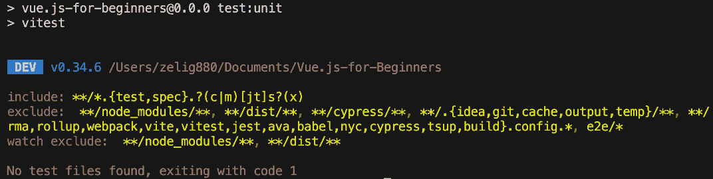

图 8.3：测试结果的终端截图

控制台终端应该显示错误消息，`theButton.vue`。

## 编写我们的第一个单元测试

现在一切准备就绪，是时候开始使用我们的基础按钮组件编写第一个测试了。

单元测试有一个非常重要的目标——测试你应用程序的单个单元。在 Vue.js 这样的框架中，单元被定义为组件、组合式或存储文件。

当测试一个逻辑单元时，你应该关注其功能，而不是其静态内容，如文本。

创建一个仅比较文本值的文本焦点测试，不仅不会为我们的应用程序提供任何好处，而且由于其易变性（由于测试将不得不每次我们更改组件的副本时都进行更改）而难以维护。

在创建测试文件之前，让我们打开`TheButton.vue`并看看这个组件的哪个部分可以被测试：

```js
<template>
<button
  :class="theme"
>
  {{ value }}
</button>
</template>
<script setup>
defineProps({
  value: {
    type: [String, Number],
    required: true
  },
  width: {
    type: String,
    default: "100px"
  },
  theme: {
    type: String,
    default: "light",
    validator: (value) => ["light", "dark"].includes(value)
  }
})
</script>
<style scoped>
...
</style>
```

我们的组件是一个标准的按钮，因此它包括我们期望的所有基本功能。这个组件的一些测试场景可能如下：

+   检查组件是否成功渲染，确保组件结构没有错误

+   检查默认样式是否默认加载

+   检查主题属性是否可以更改主题

这三个初始测试对我们开始这个主题非常有帮助。正如我之前所说，测试可能有一个相当陡峭的学习曲线，所以从小处开始，并逐渐建立知识是很好的。

现在是时候创建我们的测试文件了。测试文件按照`nameOfFileTested.spec.js`的格式命名，所以在我们这个例子中，它将是 TheButton.spec.js。

我们可以在任何我们想要的文件夹中创建测试文件，但遵循项目标准并始终如一地遵循它是良好的实践。在我们的例子中，我们将在`__tests__`文件夹中创建这个文件。文件的完整路径应该是这样的：

```js
/src/components/__tests__/TheButton.spec.js
```

在我们开始讨论测试结构之前，我们需要导入一些模块，这将允许我们创建测试。我们将从`@vue/test-utils`导入`expect`、`describe`和`it`的`mount`方法，最后是组件本身。我们的测试文件顶部的`import`语句应该看起来像这样：

```js
import { expect, describe, it } from 'vitest'
import {mount} from "@vue/test-utils";
import component from '../atoms/TheButton.vue'
```

现在我们已经设置了导入，是时候开始学习如何构建测试结构了。测试的结构遵循回调方法，其中每个方法都有一个回调到另一个方法，依此类推。

即使这种做法，也被称为回调地狱，通常是 JS 中的不良实践，但它为你的测试提供了最佳的结构。

要编写一个结构良好的单元测试，我们可以使用 Given、When 和 Then 语法来回答以下三个问题：

+   我们在测试什么（Given）？

+   我们在测试什么场景（When）？

+   预期结果是什么（Then）？

然后，我们可以通过创建一个简单的句子来使用`Given`、`When`和`Then`来创建自己的测试用例。所以，在我们的按钮例子中，句子可以是这样的：“Given `TheButton.vue`，when *它被挂载*，then *它应该* *正确渲染*。”

通过前面的句子，我们现在可以编写我们的第一个单元测试。

首先用文字编写你的测试

通过首先用句子来编写测试，将有助于你更好地定义测试并确保你完全覆盖了组件。阅读和比较几个句子比在测试编写后做同样的事情要简单。

为了结构化我们的测试，我们将利用 Vitest 提供的`describe`和`it`方法：

```js
describe('TheButton.vue', () => {
  describe('when mounted', () => {
    it('renders properly', () => {
      // Test goes here
    });
  });
});
```

测试使用`describe`方法来定义上述 Given 和 When 语法，使用`it`方法来定义实际的测试（Then）。一个测试可以有多个嵌套描述。测试名称非常重要，因为测试框架在测试失败时会在错误消息中使用它们。拥有一个非常结构化的名称将有助于你在测试失败时节省时间。让我们尝试第一次运行我们的空测试并查看输出。要运行我们的测试，我们需要打开终端，访问`project`文件夹，并运行以下**npm**命令：

```js
npm run test:unit
```

前一个命令的输出应该是以下内容：

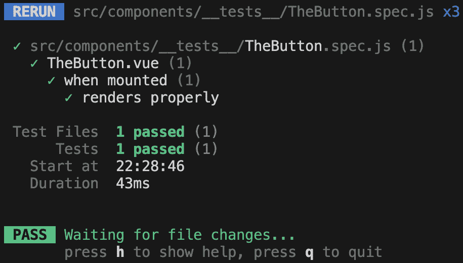

图 8.4：Vitest 的终端输出

测试结果遵循我们在测试中定义的相同嵌套结构。在`describe`和`it`方法中使用的单词形成一个可读的单词。如果错误在本地或任何部署环境中触发，日志将显示文件名，然后是我们用来声明测试的不同单词。在我们的例子中将是*TheButton.vue when mounted* *渲染正确*。

Vitest 速度快——非常快

在上一节中，我们提到单元测试速度快，但尚未提到在所有单元测试框架中，Vitest 是最快的。其速度应归因于 Vite 服务器，Vitest 就是基于这个服务器构建的。

我们的第一个测试还没有测试任何东西，因为它有一个空的主体。让我们回到去看我们如何测试我们的组件。为了完成这个任务，我们将使用 Vue Test Utils 提供的`mount`方法和`expect`方法，后者用来告诉单元测试引擎我们想要测试的内容。

`mount` 方法用于通过在测试框架中渲染组件来初始化组件，而 `expect` 用于定义我们的测试用例。

在每个测试中，我们首先设置我们的组件和可能需要的任何状态。在我们的例子中，我们只需要挂载它：

```js
const wrapper = mount(component, {});
```

接下来，我们将通过检查它是否包含一个 `button` 元素来断言我们的组件已成功渲染：

```js
expect(wrapper.html()).toContain('button');
```

`expect` 方法接受被测试的值作为其参数，然后将其链接到对给定值的测试。Vitest 随带大量断言。

例如，如果我们想创建一个检查两个数字是否相等的测试，我们会这样做：

```js
const numberFive = 5;
expect(numberFive).toEqual(5);
```

完整的测试文件应该看起来像这样：

```js
import { expect, describe, it } from 'vitest'
import component from '../atoms/TheButton.vue'
import {mount} from "@vue/test-utils";
describe('TheButton.vue', () => {
  describe('when mounted', () => {
    it('renders properly', () => {
      const wrapper = mount(component, {});
      expect(wrapper.html()).toContain('button');
    });
  });
});
```

因此，总结一下，我们了解到测试遵循一个非常结构化的方法。它们要求我们定义我们要测试的内容，以及我们正在考虑的场景和断言。

让我们再添加一个测试，以创建以下测试句子：“Given `TheButton.vue`，when *it is mounted*，then it *defaults to the* *light theme*。”

如您从句子的前两部分中可以看到，`Given` 和 `When` 是相同的，这意味着我们可以重用现有的代码块，只需再添加另一个测试。

为了检查是否应用了正确的主题，我们将检查 CSS 类 `light` 是否已应用于组件。

```js
import { expect, describe, it } from 'vitest'
import component from '../atoms/TheButton.vue'
import {mount} from "@vue/test-utils";
describe('TheButton.vue', () => {
  describe('when mounted', () => {
    it('renders properly', () => {
      const wrapper = mount(component, {});
      expect(wrapper.html()).toContain('button');
    });
    it('defaults to light theme', () => {
      const wrapper = mount(component, {});
      expect(wrapper.classes()).toContain('light');
    });
  });
});
```

如前一个代码块中突出显示的文本所示，添加遵循相同设置的额外测试相当简单。为了完成新的测试，我们再次使用 `mount` 来初始化组件的一个版本。然后我们使用 `wrapper.classes()` 提取组件的所有类，并使用 `expect().toContain()` 断言这包含 `light`。

由于两个测试都有相同的 When，我们能够重用 `describe` 方法 `describe('when mounted'..)`。这样做将帮助我们逻辑上分割测试。

测试会自动更新，所以当文件保存时，我们的终端应该输出新的结果，显示两个通过测试：

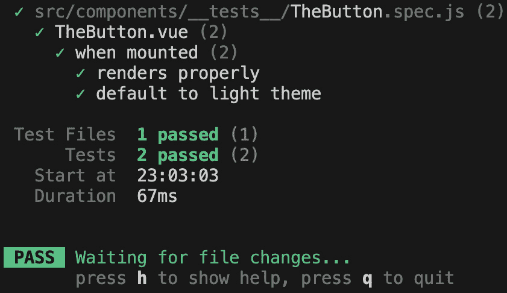

图 8.5：Vitest 测试结果显示两个通过测试

你的回合

编写最后一个单元测试来完成 `TheButton.vue` 的测试。最后一个测试应该测试当传递正确的属性时，组件是否渲染了深色主题。研究 Vue Test Utils 和 Vitest 文档，了解如何在挂载组件时定义属性。下一章分支将包括为你准备的测试，这样你可以检查你的测试是否编写正确。

单元测试是一个很大的主题，这只是一个非常简单的介绍，以提供一些必要的基本信息。每个项目都会创建略有不同的测试，这可能是由于项目结构、组件的分解，甚至是使用的命名约定。因此，真正学习如何编写测试的最佳方式是实践。

在我们继续前进之前，我想分享一个额外的技巧，以确保你正确地测试你的代码。实际上，在编写单元测试时，让它们过于依赖组件的内部结构是很常见的。单元测试的预期是测试当给定特定输入时，单个代码单元会**输出**什么。这意味着你应该能够测试一个组件，而无需打开文件，只需知道它接受的属性和它发出的 UI/事件即可。在编写你的单元测试时，始终关注输入和输出，并将实现细节排除在测试之外。

在本节中，我们介绍了单元测试，并讨论了如何使用 Vitest 来测试我们的组件。我们学习了编写单元测试所需的语法，并介绍了 Vue Test Utils 以帮助我们处理 Vue 组件。然后，我们讨论了测试名称的重要性，以及它是如何遵循“给定、当、然后”方法的。

在下一节中，我们将攀登金字塔，学习如何编写端到端测试。我们将能够重用本节学到的部分知识，并继续学习如何使我们的代码更加可靠。

# 使用 Cypress 进行端到端测试

是时候将我们的测试焦点从单元测试提供的微观层面，转移到端到端测试提供的宏观层面了。如果单元测试关注单个组件的单个状态，端到端测试将帮助我们测试完整的用户旅程。

正如我之前提到的，我们将能够使用之前章节中学到的知识，因为端到端测试的结构与我们在 Vitest 中学到的类似。

让我们将这一节分解为三个不同的部分。首先，我们将学习如何在你的应用程序中安装 **Cypress**。然后，我们将学习端到端测试文件的基礎结构和它在项目中的位置。最后，我们将通过为我们的应用程序编写端到端测试来结束这一节。

在 JS 行业中最常用的端到端（E2E）工具是 Cypress 和 Playwright。Cypress 已经存在了相当长的时间，并且目前占据了很大的市场份额。Playwright 相对较新，但由于它与 IDE 的集成以及广泛的浏览器模拟，它正在迅速增加市场份额。

就像单元测试一样，市场上不同工具的语法非常相似，所以你在一个中学习的多数功能和语法，如果你后来决定切换，也可以用在另一个中。

让我们从将 Cypress 安装到你的项目中开始。

## 将 Cypress 安装到你的项目中

今天的 JS 生态系统为我们提供了具有惊人用户体验的工具，它们提供了非常简单的安装过程，而 Cypress 就是其中之一。

我们的 Companion App 已经包含了一组测试，它们是通过我们介绍的 Vue 项目初始化安装的。然而，了解如何将 Cypress 添加到您的新项目或现有项目中有助于学习。由于 Cypress 已经是 Companion App 的一部分，您将不得不在新的文件夹中遵循以下步骤。

在[cypress.io](http://cypress.io)提供的官方文档中提供了两种安装方法，一种是**直接下载**，另一种是**npm 安装**。

我们将使用`npm`包管理器来跟随安装。为此，在您首选的终端中访问您项目的根目录，并输入以下命令：

```js
npm install cypress
```

下一步是运行 Cypress。这可以通过以下`npx`命令实现（注意命令是`npx`而不是`npm`）：

```js
npx cypress open
```

几秒钟后，您应该会看到一个欢迎屏幕。

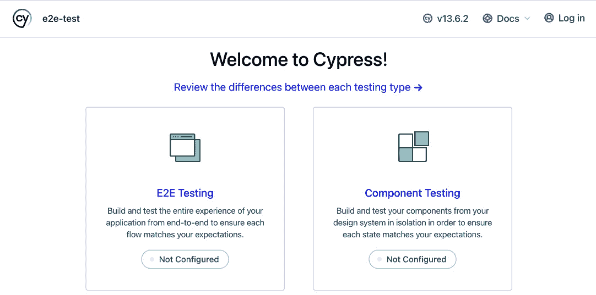

图 8.6：Cypress 的启动仪表板

Cypress 可以设置为端到端和组件测试。*图 8.6*中的向导将我们的测试标记为**未配置**。让我们通过点击左侧块开始配置端到端测试。这样做将生成一组示例文件，我们需要运行我们的第一个测试。

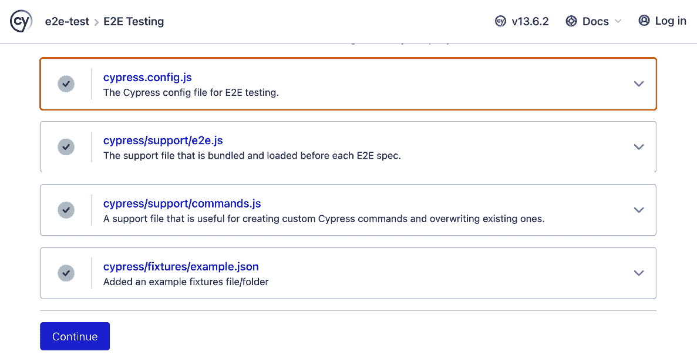

图 8.7：Cypress 向导测试文件创建

向导创建了四个文件。第一个是主配置文件，位于我们项目的根目录下，文件名为`cypress.config.js`，其中包含所有与 Cypress 相关的设置。第二个和第三个是支持示例文件，用于创建可重用的命令；命令是为更高级的用户准备的，本书没有涉及。最后一个文件是一个可访问于`cypress/fixtures/example.json`的固定示例 JSON 文件。固定文件用于保存可重用的信息，例如文本输入或 API 响应。

如果我们在安装向导中继续前进，我们将看到一个浏览器选择屏幕。这个屏幕将在每次运行 Cypress 时显示，并允许您选择您想要使用的浏览器。

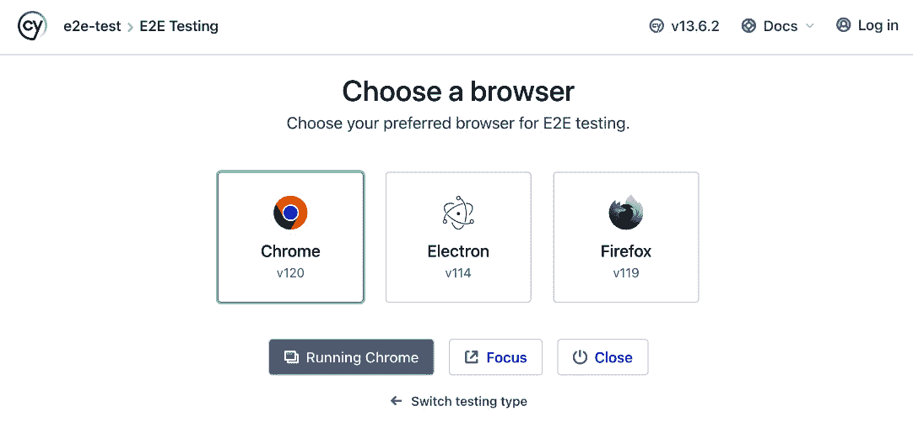

图 8.8：Cypress 的“选择浏览器”屏幕

让我们通过点击 Chrome 打开测试运行器。

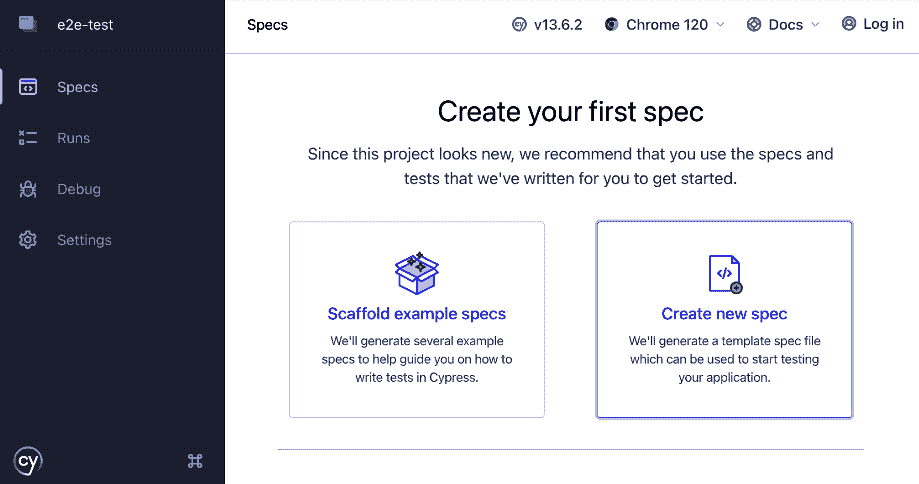

图 8.9：Cypress 的 chrome 测试运行器的第一个实例

由于我们选择了 Chrome 作为测试运行器，我们将在一个新的 Chrome 窗口中开始。这个运行器将提供创建示例测试或生成测试模板的能力。

我们将在安装向导的这个点上停止；是时候回到我们的 Companion App，继续我们的旅程，了解更多关于端到端测试和 Cypress 的信息了。

安装和阅读示例测试

“scaffold example specs” 提供的测试非常广泛且编写良好。这些示例测试为您提供了对 E2E 测试可以实现的惊人洞察。在进入下一章之前，花几分钟安装并阅读这些测试。

## 学习 E2E 测试的文件格式和文件位置

在上一节中，我们学习了如何将 Cypress 安装到我们的项目中。在本节中，我们将在创建第一个测试之前学习这些 E2E 测试文件的文件位置和格式。请记住，我们现在正在我们的 Companion App 中工作，所以你应该用你选择的 IDE 打开它。

我们 E2E 测试的位置在 Cypress 配置文件中定义。正如我们在上一节中学到的，这个文件位于我们应用程序的根目录，称为 `cypress.config.js`。此文件包含一些设置，其中之一被称为 `specPattern`。此配置设置告知 Cypress 在哪里找到测试：

```js
specPattern: 'cypress/e2e/**/*.{cy,spec}.{js,jsx,ts,tsx}'
```

此模式期望 E2E 文件位于 `cypress/e2e` 文件夹中，并且文件名以 `cy,spec` 和 `js,jsx,ts` 以及 `tsx` 的组合结尾。

因此，一个测试文件可以命名为 `mytest.spec.ts` 或 `mytest.cy.js`，如果它位于 `cypress/e2e` 文件夹中，Cypress 测试运行器将能够看到并利用它。

让我们创建第一个测试，命名为 `homepage`。因为我想要区分单元测试和 E2E 测试，所以我会以 `cy.js` 结尾这个文件（单元测试以 `spec.js` 结尾）。新文件的完整位置如下：

```js
Cypress/e2e/homepage.cy.js
```

现在文件已经创建，是时候学习如何构建这些文件了。正如我之前提到的，E2E 测试和单元测试的结构有一些相似之处。事实上，这两个测试都遵循相同的语法，分别以回调和 `describe`、`it` 方法为基础的结构。

测试脚手架应该看起来像这样：

```js
describe('Homepage', () => {
  it('default journey', () => {});
});
```

如您所见，代码结构非常明显，就像 Vitest 提供的那样，唯一的区别是，在这种情况下，我们不需要导入 `describe` 和 `it` 方法，因为它们会自动为我们导入。

另一个小的不同之处在于测试的名称。当我们在一个单元测试中定义一个名称时，它是测试的一个重要部分，具有定义良好的 `Given`、`When` 和 `Then` 方法。在 E2E 测试中，名称的重要性略低，主要是因为这些测试可以具有很大的范围，例如对主页的全面检查，并且提供一句话来定义我们正在测试的内容并不总是可能的。

在我们继续前进之前，我们将尝试在我们的应用程序中运行 E2E 测试，并学习执行此操作所需的步骤。

在上一节中，我们使用了 `npx cypress open` 来启动 Cypress。这仍然可以使用，但我们的 `package.json` 中有一些脚本供我们使用，这些脚本带有额外的配置，简化了我们的开发体验：

```js
"test:e2e": "start-server-and-test preview http://localhost:4173 'cypress run --e2e'",
"test:e2e:dev": "start-server-and-test 'vite dev --port 4173' http://localhost:4173 'cypress open --e2e'"
```

应用程序提供了两个脚本，`"test:e2e"`和`"test:e2e:dev"`。第一个用于在预览构建上运行 E2E，而第二个用于在带有**热重载**的开发构建上运行测试。这将允许我们在 E2E 测试运行器准备运行的同时对我们的应用程序进行修改。

尝试通过在终端中运行以下命令来运行开发 E2E 测试环境：

```js
npm run test:e2e:dev
```

此命令的结果应该是我们之前看到的 Cypress 仪表板。就像之前一样，你应该点击**E2E 测试**，并选择**Chrome**作为运行测试的浏览器。

结果应该是一个 Chrome 浏览器，如下面的截图所示：


图 8.10：Chrome 中的 Cypress 测试仪表板

浏览一下

在继续本章之前，你应该花几分钟时间熟悉测试运行器。了解它提供的内容以及它是如何工作的，将非常有利于你未来的学习和 E2E 测试的使用。

要运行我们的测试，点击测试名称`homepage.cy.js`。这将加载 Cypress 测试运行器：

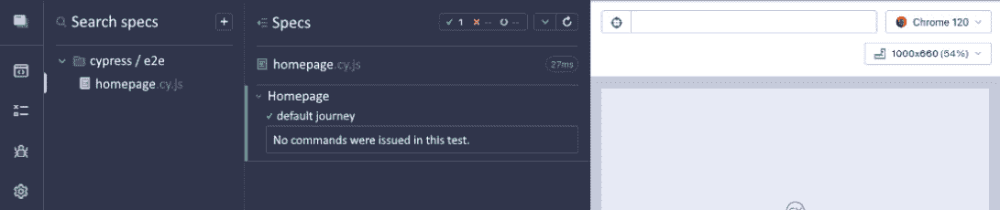

图 8.11：Cypress 测试运行器

目前，测试运行器并不十分有用，因为我们唯一的测试是空的。

现在，是时候进入下一节了，我们将要在 Cypress 中编写我们的第一个测试。

## 编写你的第一个 E2E 测试

E2E 测试通常被称为**旅程**。这个名字来源于它封装了特定用户的旅程。这些可能包括完成**联系我们**表单所需的步骤，或者购买产品所需的步骤。

由于我们当前应用程序的大小，这个旅程将会相当小，但仍然可以确保我们构建一个稳定的程序。

我们的测试将完成以下方面：

+   访问网站

+   显示应用程序标题

+   确保帖子被加载

+   检查没有评论的帖子是否显示正确的空消息

+   检查带有评论的帖子是否正确显示评论。

E2E 测试是按顺序编写的，就像你手动完成相同的旅程一样。因此，我们将从使用`cy.visit`命令访问主页开始我们的测试：

```js
describe('Homepage', () => {
  it('default journey', () => {
    cy.visit('/');
  });
});
```

当使用`visit`命令时，你可以传递任何相对 URL。在我们的场景中，我们只需传递一个正斜杠，因为我们将要访问主页。

基础 URL 预设

注意，我们能够通过使用单个正斜杠来访问主页，因为我们已经在`cypress.config.js`中设置了一个`baseUrl`预设。如果没有`baseUrl`设置，你将不得不在`cy.visit`命令中插入完整的 URL。

接下来，我们将检查是否存在标题`Companion App`。这是通过使用两个新方法`get`和`should`实现的：

```js
...
cy.visit('/');
cy.get('h1').should('be.visible');
...
```

`get`方法就像`document.querySelector`一样，允许你在页面上选择一个给定的元素。`should`方法允许你设置一个预期——也就是说，它定义了测试是成功还是失败。`should`方法接受一个参数，这是我们测试选择器的逻辑。这些参数被称为**链式调用器**，有数百种不同的可能性。学习所有可用**链式调用器**的最好方法是查阅文档([`docs.cypress.io/guides/references/assertions`](https://docs.cypress.io/guides/references/assertions))或使用 IntelliSense IDE。

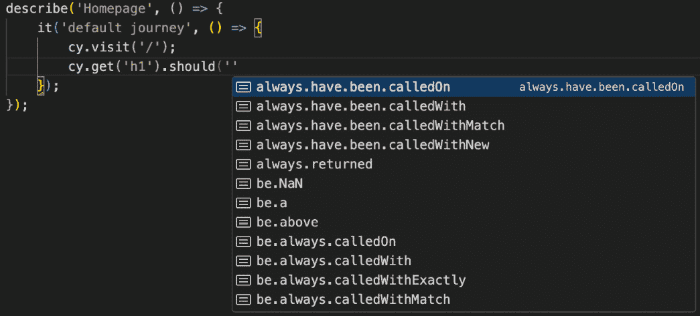

图 8.12：链式调用器的 IntelliSense 弹出窗口

当你编写测试预期时，链式调用器列表会自动显示在你的 IDE 中。

无论你使用文档还是 IDE，如图*图 8**.12*所示，真正重要的是你要熟悉这些不同的链式调用器，并了解你可以使用什么，不能使用什么。

在前面的例子中，我们只是在调用`should`方法时传递了一个参数，但它也可以接受两个参数。第二个参数用于在第一个参数定义的条件需要传递值时传递一个值。例如，我们可能需要比较屏幕上元素的数量与一个变量，比较两个字符串，或者确保 API 返回的值与特定对象匹配。在我们的当前测试中，我们只是检查`<H1>`是否存在，但我们并没有真正检查它是否是正确的标题，因此我们可以将我们的实现更改为使用两个参数：

```js
...
cy.visit('/');
cy.get('h1').should('contain.text', 'Companion App');
...
```

当使用`contain.text`时，我们比较我们选择的元素的`innerText`字符串与一个任意值。

我们端到端（E2E）测试的下一步将是确保帖子成功加载，通过使用`get`方法获取元素和`have.length`链式调用器来确保结果值是我们预期的：

```js
...
cy.get('h1').should('contain.text', 'Companion App');
cy.get('.SocialPost').should('have.length', 5);
...
```

当应用程序正确加载时，它将加载五个帖子，为了在我们的测试中检查这一点，我们选择所有具有`SocialPost`类的元素，并使用`should('have.length',` `value)`语法比较它们的长度。

接下来，我们需要测试评论组件。我们将通过点击`SocialPost.vue`组件来实现这一点，我们会发现找到按钮的最佳方式是使用一个大的选择器，`.SocialPost .interactions button`。这个选择器不是一个最佳解决方案，不仅因为它非常冗长，而且还因为它过于依赖于组件的结构，因此非常脆弱。为了避免使用复杂的选择器，我们可以添加一个端到端（E2E）属性。这通常是通过给一个元素添加一个`data-cy`属性并用于测试目的来定义的（`cy`在数据中代表 cypress）。

在你的代码中添加一个数据属性将使你的测试更加健壮，避免与 CSS 类和 HTML 元素结构变化相关的易变测试的创建。

在继续我们的测试之前，让我们打开 `SocialPost.vue` 并添加所需的属性：

```js
<TheButton
  @click="onShowCommentClick"
  value="Show comment"
  width="auto"
  theme="dark"
  data-cy="showCommentButton"
/>
```

`data-cy` 只是一个简单的数据属性，但它已成为行业标准，并被许多开发者用于为端到端测试提供直接选择器。我们现在能够更新我们的测试以使用新声明的 `showCommentButton` 属性来选择我们的按钮：

```js
cy.get('.SocialPost').should('have.length', 5);
cy.get('[data-cy="showCommentButton"]').first().click();
```

由于我们页面上有五篇帖子，但我们只想点击第一篇，我们将使用一个名为 `first` 的辅助方法来检索 `get()` 返回的第一个元素。然后，我们通过调用 `click` 方法来结束链，模拟在按钮上点击鼠标。结果应该是加载的评论组件。

如果你检查显示我们的测试运行器的浏览器窗口，你应该能够看到加载在第一个元素中的 `comment` 组件。

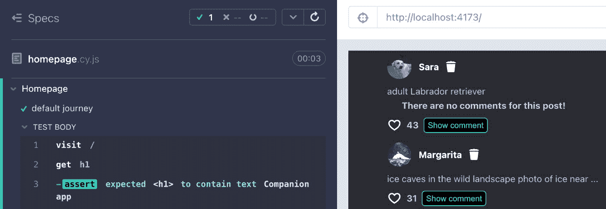

图 8.13：Cypress 测试显示已加载评论的 Companion App

接下来，我们将使用上一节学到的知识来测试带有评论的帖子的正确渲染。如图 *图 8.13* 所示，第一篇帖子没有评论。为了更好地提高我们的覆盖率，我们还应该找到一个带有评论的帖子。一个带有评论的帖子在最后一篇帖子（编号 5）中找到，因此我们可以使用它来确保评论被正确显示。

根据我们所学的，我们应该能够编写一个看起来像这样的测试：

```js
cy.get('[data-cy="showCommentButton"]').first().click();
cy.get('.SocialPostComments').should('contain.text', 'There are no comments for this post!');
cy.get('[data-cy="showCommentButton"]').last().click();
cy.get('.SocialPostComments').last().should('not.contain.text', 'There are no comments for this post!');
```

代码显示了三个命令。第一个检查社交帖子评论组件的内容。我们使用主类 `.SocialPostComments` 来选择组件，并使用 `contain.text` 命令。此命令检查该选择器的 `innerText` 字符串，并将其与作为参数传递的字符串进行比较。在我们的情况下，我们传递了 `There are no comments for this post!`。然后，我们通过复制之前使用的命令并替换 `first()` 为 `last()` 来点击最后一篇帖子。最后，我们再次复制我们最近使用的命令来检查字符串的内容，并通过在链式调用前添加单词 `not` 来检查相反的情况。在创建端到端测试时，通常会有测试某个东西（例如，一个字符串或一个数字）的命令，然后是一个测试该断言不再发生的命令。由于这种重复出现的场景，端到端框架为您提供了在链式调用前添加单词 `not` 的能力来检查相反的情况。因此，如果这个 `should('contain.text', 'hello')` 检查元素是否包含单词 `hello`，那么 `should('not.contain.text', 'hello')` 就检查相反的情况——即确保选定的元素不包含单词 `hello`。

这是我们端到端旅程的结束。在下一节中，我们将介绍本章尚未涵盖但可能对您的未来测试体验非常有用的高级技术。

# 介绍高级测试技术

在本节的结尾，我们将介绍几个属于测试但在此章节中未涉及的主题。正如我在本章开头提到的，测试是一个非常大的主题，这只是一个快速介绍，以确保你知道如何开始并创建简单的测试。然而，这绝对不是一本完整的指南，还需要进一步的学习。

本节的目标是解释一些你在未来创建端到端测试或单元测试时可能会遇到测试的方面。其中一些适用于端到端和单元测试，而其他则是单一测试方法的独特之处。

测试是一个非常有趣的主题，因为你所学到的关于测试的知识完全取决于你所从事的工作。因此，有些人可能需要学习如何编写高度依赖外部 API 的测试，因此专注于实现存根和模拟，而其他开发者可能从事依赖于状态管理的应用程序，可能需要学习使用状态测试组件的方方面面。

让我们深入探讨，分享一些关于这三个主题的讨论：

+   模拟

+   监视

+   `浅层挂载`

我们将从模拟开始。

## 模拟

模拟是单元测试和端到端测试中使用的两种方法。模拟的定义如下：

“模拟是测试过程中用来隔离并集中关注被测试代码，而不是外部依赖的行为或状态，通过模拟方法或对象来实现。”

在编写测试时，有些情况下你可能想避免使用真实服务（方法或对象）。例如，你可能想在每次测试运行时避免创建订单，或者不得不使用付费 API 来获取一些模拟数据。另一个例子是模拟原生的 API，如 fetch 和 IntersectionObserver。

为了避免这些外部依赖，我们可以创建一个模拟方法或对象来模拟真实的第三方应用或服务。这被称为**模拟**。

模拟是确保你的测试范围明确且不依赖于外部因素的一种基本技术。

## 监视

**间谍**与模拟非常相似；实际上，它们赋予你分析特定方法使用情况的能力。然后，这些信息可以用于测试预期——例如，能够断言一个方法被调用了*X*次。与模拟的主要区别在于，间谍实际上不会改变原始方法，只是监听其使用情况。

**监视**对于确保应用程序的正确执行非常有用，而不会干扰实际的方法。添加监视器与使用代理非常相似，所有对监视方法的请求都会首先通过测试框架。

你可能需要监视存储中的某个操作以确保它在测试执行期间被调用，监视日志方法以确保正确的值传递给它，或者关注窗口对象中的全局方法。

虚拟化是为了防止我们使用外部服务，而监视（spying）则更多地旨在为我们提供一个工具，以便在测试中进行正确的假设和断言。

就像虚拟化一样，我们可以使用测试框架提供的工具来监视方法和模块。

## shallowMount（仅限单元测试）

这个最后的功能仅适用于单元测试，更确切地说，是用于测试组件。在*使用 Vitest 进行单元测试*部分，我们使用了`mount`方法来创建组件的实例，但还有一个可用的方法，称为`shallowMount`，在本节中，我们将解释它们之间的主要区别。

单元测试全部关乎速度，在编写单元测试时，始终选择使用更少资源并更快完成测试的更快方法至关重要。这些经济性之一可能来自于我们初始化组件的方式。

当使用`mount`时，Vue Test Utils 会渲染组件及其包含的任何其他组件。因此，在`app.vue`上运行`mount`将渲染其中的完整应用程序。由于单元测试预期将专注于特定的单元，你可能只需要渲染你正在测试的组件，而不是其子组件。

为了实现这一点，我们可以使用`shallowMount`。

`shallowMount`将渲染组件，但随后通过仅渲染占位符 HTML 来**模拟**子组件。这样做将减少测试所需的资源，并使其性能更优。

选择使用哪一个取决于你的偏好和应用程序的整体架构。我个人更喜欢为大多数组件使用`mount`，以确保它们即使在依赖项的情况下也能正确加载，而对于具有多个子组件的复杂组件，我则依赖`shallowMount`。

# 摘要

在本章中，我们介绍了测试金字塔，涵盖了测试的重要性以及软件开发中可用的不同测试实践。然后，我们转向单元测试，学习了如何使用 Vitest 和 Vue Test Utils 测试我们的应用程序。接着，我们上升到了测试金字塔，并介绍了使用 Cypress 的端到端测试。我们创建了一个覆盖简单用户旅程的小测试，并学习了一些选择和测试应用程序的技术。最后，我们通过介绍测试生态系统中的未来测试功能来结束本章，这些功能可能对未来的学习有所帮助。

轮到你了

花几个小时尝试和测试更多组件，以了解更多关于单元测试的知识，并扩展我们的端到端测试的用户旅程。确保阅读官方文档，其中包含了两个测试框架的所有可用命令，并且是查找所需信息的最佳资源。

在下一章中，我们将介绍两个高级技术，称为`slot`和`Refs`。
