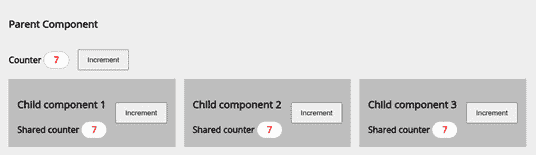
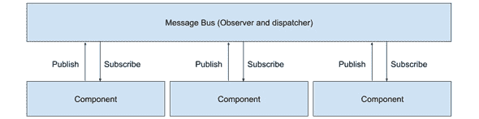
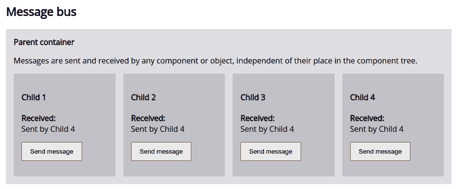
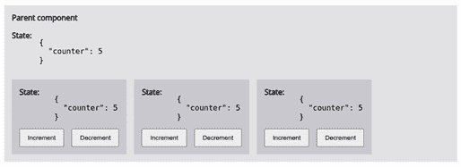
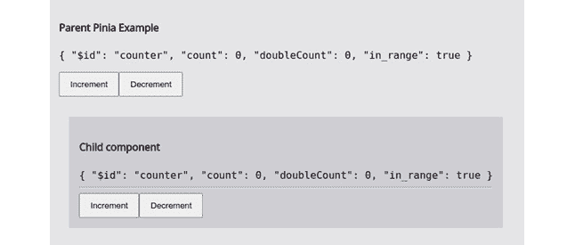
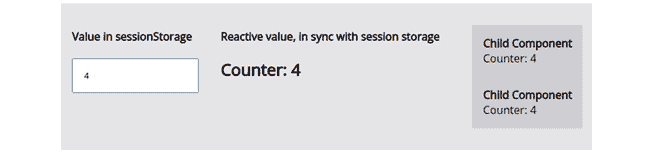
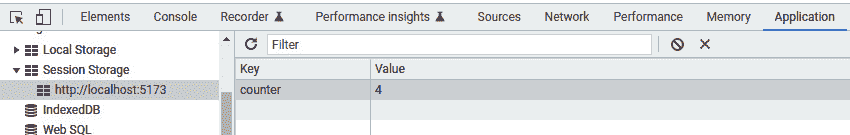

# 第七章：数据流管理

在前面的章节中，我们专注于理解 Vue 3 框架，并为创建 Web 应用程序提供上下文。在本章中，我们将关注我们的组件之间如何相互通信以及共享信息，以使我们的应用程序得以运行。我们之前已经简要地触及了这个话题，但现在我们将通过同时实现这些模式来深入探讨一些模式。应用适当的信息工作流程是一项重要的技能，它可以使应用程序成功或失败。特别是，我们将看到以下方法和代码示例：

+   父子兄弟通信

+   使用**单例**和**观察者**模式实现消息总线

+   使用可组合组件实现基本反应式状态

+   使用功能强大的 Pinia 反应式存储实现集中式数据仓库

+   审查浏览器提供的替代方案以共享和存储信息

+   在行动中实验反应性、可组合组件和代理模式

如我们之前所做的那样，我们将一次构建一个概念，逐步增加复杂性。到本章结束时，你将看到清晰的实现示例，这样你就可以根据你应用程序的需求决定何时应用每一个。其中一些更适合小型应用程序，而另一些则更适合大型、复杂的应用程序。你将更好地准备控制你应用程序的信息工作流程。

# 技术要求

本章将探讨概念，并将模式应用于控制组件之间的通信和信息流。你应该能够跟随本文本中展示的代码，但要更好地理解和体验上下文，你将受益于检查本章的完整应用程序代码，该代码可在本书的存储库中找到：[`github.com/PacktPublishing/Vue.js-3-Design-Patterns-and-Best-Practices/tree/main/Chapter07`](https://github.com/PacktPublishing/Vue.js-3-Design-Patterns-and-Best-Practices/tree/main/Chapter07)。

如果你正在启动一个新的项目，只需遵循第三章中设置工作项目的说明，如*设置一个* *工作项目*。

查看以下视频以查看代码在行动：[`packt.link/ZKTBJ`](https://packt.link/ZKTBJ)

# 组件的基本通信

我们之前已经看到，父组件及其子组件有相当简单直接的方式进行通信。父组件通过`props`将数据传递给子组件，而子组件通过触发事件（`emits`）来吸引父组件的注意。就像函数中参数和参数的可比性一样，`props`通过复制接收简单数据，并通过引用接收复杂类型（对象、数组等）。然后，我们可以传递一个包含成员函数的普通对象，从父组件传递给子组件，并让子组件运行这些函数来访问父组件的数据。尽管“这样做”是可行的，但这更像是一种暗模式或反模式，因为它隐藏了关系，使得理解数据流变得困难。在组件树中向上传递数据的正确方式是通过事件（`emits`）。话虽如此，我们必须指出，子组件之间是“无知”的，这意味着它们没有直接相互通信的方式。我们可以传递一个反应性变量，让每个涉及的组件访问它，这当然是一个可行的替代方案，如果不是一个干净的方案。在某些情况下，这可以提供一个简单的解决方案，但同样，它可能导致隐藏的副作用。

为了以干净的方式管理数据的工作流程，我们有几种遵循良好实践和设计模式的替代方案。作为一个一般规则和原则，声明变量的组件是它的所有者，并且应该是操作它的组件。考虑到这一点，在最基本的通信中，信息需要由父组件维护和处理，并在子组件之间共享。我们可以利用 Vue 的反应性系统来传播信息。关键在于只有父组件会操作它。让我们通过一个例子来看看这在实践中是如何工作的，实现一个小型的简单应用程序，如图*图 7**.1*所示：



图 7.1 – 直接基本通信和反应性

在这个应用程序中，父组件有三个直接子组件，并与它们共享一个反应性计数器。所有组件都显示一个带有计数器值的标签，并有一个按钮来触发增加...但是只有父组件执行实际的数据操作。Vue 处理反应性，这意味着当父组件修改值时，子组件也会接收到它们。这很简单——让我们看看实现这一点的关键部分：

/basic/ParentBasic.vue

```js
<script setup>
import {ref} from "vue"
import ChildComponent from "./Child.vue"
const _counter = ref(0);                                  //1
function incrementCounter() {                             //2
   _counter.value++;
}
</script>
<template>
<div>
   <strong>Counter </strong>
   <span>{{ _counter }}</span>
   <button @click="incrementCounter()">                   //3
       Increment
   </button>
</div>
<section>
<ChildComponent title="Child component 1"
  :counter="_counter" @increment="incrementCounter()">    //4
</ChildComponent>
<ChildComponent title="Child component 2"
  :counter="_counter" @increment="incrementCounter()">
</ChildComponent>
<ChildComponent title="Child component 3"
  :counter="_counter"
  @increment="incrementCounter()"></ChildComponent>
</section>
</template>
```

在这个组件中，我们声明了一个 `_counter` 响应式变量（第 `//1` 行）和一个 `incrementCounter()` 函数来操作其值（第 `//2` 行）。我们像在第 `//3` 行看到的那样，在父按钮的点击事件中触发这个函数。现在，为了看到这个模式的实现，我们只需将我们的响应式 `_counter` 变量作为属性传递给每个子组件，并将我们的 `incrementCounter()` 函数链接到每个子组件的增量事件（第 `//4` 行）。足够简单——让我们看看每个子组件是如何实现其部分的：

/basic/Child.vue

```js
<script setup>
const
    $props=defineProps(['counter', 'title']),         //1
    $emit=defineEmits(['increment'])
function incrementCounter(){$emit("increment")}      //2
</script>
<template>
<h3>{{$props.title}}</h3>
<span class="badge">{{$props.counter}}</span>        //3
<button @click="incrementCounter()">                 //4
    Increment
</button>
</template>
```

我们子组件的实现同样简单。我们首先在第 `//1` 行定义了接收计数器变量的属性，还定义了我们的 `increment` 自定义事件，以便我们可以通知父组件。为了做到这一点，我们在第 `//2` 行创建了一个函数。在我们的模板中，我们在第 `//3` 行显示我们的属性，并在第 `//4` 行触发我们的增量函数。请注意，我们的子组件并没有修改计数器。这是父组件的责任，所以我们尊重这个模式。

这是一个我们将非常频繁使用的模式，但它确实有一些限制。例如，当数据需要达到父组件、兄弟组件或孙组件时会发生什么？我们是否需要向上和向下传递数据，即使组件没有使用它？我们可以这样做，但同样，这很混乱，冗长，并不是最好的方法。我们有更好的工具来做这件事。

在 *第四章* “使用组件的用户界面组合”中，我们看到了父组件可以通过使用 `provide` 和 `inject` 将数据和功能传递给树中的任何子组件。由于那里提供的例子相当全面，我们在这里不再重复。我鼓励您回顾如何创建和注入提供。我们不再重复，让我们继续我们的议程中的下一个项目，以便在组件树中的任何地方共享信息：实现一个 **消息总线**（也称为 **事件总线**）。

# 使用单例和观察者模式实现事件总线

消息总线是我们在 *第二章* “软件设计原则与模式”中看到的 *观察者模式* 的一个实现。为了简要回顾主要概念，我们试图创建一个对象或结构，它可以接收和发出事件，我们的组件可以订阅并对其做出反应。这个模式独立于组件树结构运行，因此任何 *组件和服务* 都可以加以利用。从视觉上，我们可以将这种关系表示如下：



图 7.2 – 组件与消息总线关系的简化视图

从前面的图中，我们可以立即看出消息总线对每个组件都是平等对待的。每个组件将其一个或多个方法订阅到特定的事件，同时也有相同的发布事件的权限。这使得它非常灵活，因为事件也可以传输数据。

让我们通过一个实现示例将这些概念转化为代码。我们首先创建一个服务，使用单例模式，为我们提供一个消息总线。在我们的例子中，我们只是包装了`mitt`包，它提供了这个功能（参见 https://github.com/developit/mitt#usage）。

可以使用以下终端命令在我们的应用程序中安装`mitt`包：

```js
$ npm install mitt
```

我们的服务看起来如下：

/services/MessageBus.js

```js
import mitt from "mitt"
const messageBus = mitt()
export default messageBus
```

这将给我们一个事件发射器和调度器的单例，即我们的消息总线。在我们的例子中，我们将通过它发送文本消息，每个接收组件将显示它。我们的组件将看起来像这样：

/bus/Child.vue

```js
<script setup>
import messageBus from '../services/MessageBus';         //1
import {ref, onMounted, onBeforeUnmount} from 'vue';
const
   $props=defineProps(['title']),
   message=ref("")                                       //2
    onMounted(()=>{
        messageBus.on("message", showMessage)})                 //3
    onBeforeUnmount(()=>{
        messageBus.off("message",showMessage)})
    function showMessage(value){                               //4
        message.value=value;}
    function sendMessage(){                                    //5
        messageBus.emit("message",`Sent by ${$props.title}`)}
</script>
<template>
    <h4>{{$props.title}}</h4>
    <strong>Received: </strong>
    <div>{{message}}</div>
    <button @click="sendMessage()">Send message</button>       //6
</template>
```

在这个例子中，我们从第`//1`行开始导入我们的`messageBus`对象（检查你的实现中的正确路径），并声明一个初始化为空字符串的`message`响应式变量。注意我们如何也导入并使用组件的生命周期中的`onMounted()`和`onBeforeUnmount()`方法，从第`//3`行开始订阅和取消订阅`message`事件。我们注册的函数在第`//4`行，它从事件接收一个值，我们将其传递给我们的内部变量以在模板中显示。我们还需要一个函数来发布事件以通知他人，这个函数可以在第`//5`行找到。在这种情况下，我们发布组件的标题。这个函数由按钮触发，如第`//6`行所示。

如果你用一些额外的最小化样式运行应用程序示例，这段代码将产生类似以下的结果：



图 7.3 – 通过观察者模式实现的数据共享

这种处理数据工作流程的方法在它所做的事情上相当有效，但也有局限性。事件是通知多个组件同时触发动作的好方法，而不管它们在组织树中的位置。当一个应用程序有多个子系统需要响应应用程序状态变化时，这是一个很好的模式。然而，当主要处理应用程序数据时，这种模式有一个重要的缺点：每个组件都保留信息的内部副本。这使得内存处理效率相当低，因为数据的传播意味着在我们的应用程序的不同部分进行复制。有些情况下这是必要的或期望的，但绝对不是每个情况都如此。如果我们有 50、100 或 1,000 个组件订阅了同一个事件，它们都会拥有相同的数据副本吗？如果每个组件需要独立于其他组件处理和可能修改数据，这可以正常工作...但如果我们想更好地利用 Vue 的响应式并提高我们的内存处理，我们需要使用不同的方法。这就是我们接下来将要看到的基本响应式应用程序状态。

# 实现基本响应式状态

如前所述，使用消息总线共享数据的一个缺点是相同数据的多个副本，包括处理事件的额外开销。相反，我们可以利用 Vue 的响应式引擎，特别是 `reactive()` 辅助构造函数来创建一个单一实体来保存我们的应用程序状态。就像之前一样，我们可以用单例模式包装这个响应式对象，以便在组件和纯 JavaScript 函数、对象和类之间共享。值得一提的是，这是 Vue 3 和新组合 API 的一个重大优势。

从示例代码中，我们将得到一个基本的例子，如下所示：



图 7.4 – 用于状态管理的共享响应式对象

正如您在前面的屏幕截图中所看到的，在这个例子中，状态是由这个示例的所有组件共享（或访问）的。任何子组件都可以修改其任何值，并且变化会立即在整个应用程序中反映出来。与之前的例子相比，这种模式的实现既简单又直接。让我们首先通过创建一个包含我们的响应式状态的服务来深入了解它：

/service/SimpleState.js

```js
import {reactive} from "vue"                       //1
const _state=reactive({counter: 0})                //2
function useState(){return _state;}                //3
export default useState;
```

如果这段代码看起来很简单，那是因为它确实很简单。我们创建一个 JavaScript 文件，并从 Vue 中导入 `reactive` 构造函数（行 `//1`）。然后，我们声明一个带有初始对象的响应式常量（行 `//2`）。这将是我们通过 `useState()` 函数返回的应用程序状态，该函数遵循组合组件的模式（行 `//3`）。这个函数是我们的模块导出。

利用这种集中式状态也非常简单，正如我们在这里可以看到的：

/simple/ChildSimple.vue

```js
<script setup>
    import useState from "../../services/SimpleState"          //1
    const $state=useState()
</script>
<template>
    <strong>State: </strong><br>
    <pre>{{$state}}</pre>                                      //2
    <div>
    <button @click="$state.counter++">Increment</button>       //3
    <button @click="$state.counter--">Decrement</button>
    </div>
</template>
```

我们通过导入 `useState` 工厂函数开始我们的组件，并使用它声明一个响应式常量（行 `//1`）。我们就像使用任何其他变量一样在我们的模板中使用这个响应式变量（行 `//2`），同样地，我们可以直接访问对象的成员字段来修改它们，就像修改任何其他对象一样，正如你在行 `//3` 中所看到的。完成这些后，正如预期的那样，一旦组件修改了任何值，这个变化就会在整个应用程序中传播。

这种简单的方法非常有用，适用于从小型到中型甚至更大的应用程序。它有许多好处，例如以下这些：

+   实现和理解都很简单。

+   它利用了 Vue 的响应性系统。

+   它是灵活的，因为我们可以在初始化后添加新的响应式成员。

+   它建立了一个单一的真实来源，意味着我们的状态是应用程序数据的集中存储库。没有必要保持内部或私有变量同步。

如果考虑我们至今为止所看到的选项，这无疑是一个巨大的进步。然而，在某些情况下，这些选项可能还不够：

+   如果在函数修改其值之前其他组件已经进行了修改，会发生什么？

+   这种方法不允许我们处理需要在每个组件中实现的计算数据

+   调试可能很困难，因为没有针对开发者工具的具体支持

正如之前提到的，这种方法适合简单的需求。对于更稳健的方法，我们将深入研究 Vue 项目提供的官方中央状态管理解决方案：**Pinia**。

# 使用 Pinia 实现一个强大的响应式存储

中央状态管理不仅仅是一个属于 Vue 的概念，同样的模式也可以在其他库和框架中找到。就像我们基本的响应式示例一样，**Pinia** 是一个中央状态管理工具，它为我们提供了一个单一的真实来源，这意味着其值的变化会以响应式的方式传播到整个应用程序的任何使用位置。这种状态在应用程序的组件之间是共享的，并使我们能够通过一个定义良好的接口访问 Vue 提供的完整范围的响应式工具。如果我们首先构建一个示例来展示使用它的结果，那么理解 Pinia 会更容易。运行代码示例将给我们类似以下的结果：



图 7.5 – 使用 Pinia 的中央状态管理

在这个例子中，我们构建了一个商店，它不仅暴露了响应式状态，还实现了计算值。作为一个官方支持的项目，Pinia 还公开了 Options 和 Composition APIs 的实现。要使用 Pinia，我们首先需要在项目的根目录中用以下命令将其包含到我们的项目中：

```js
$ npm install pinia
```

安装完成后，我们应该创建一个存储并将其附加到我们的应用程序中，以便所有组件都可以使用。存储就像我们上一节中的响应式单例，意味着一个将具有要在我们的应用程序中共享的响应式字段的对象，以及相关的业务逻辑。因此，每个存储将包含以下项目：`data`、称为`getters`的计算属性和称为`actions`的方法。我们将其定义在自己的文件中作为一个模块，定义每个项目。使用选项 API，存储将看起来像这样：

选项 API 基本存储

```js
import { defineStore } from 'pinia';                    //1
const useCounterStore = defineStore('counter', {        //2
  state: () => {return {count: 0, in_range: false}},    //3
  getters: {
    doubleCount: (state) => {                           //4
      if(state.count>=0){
            return state.count *2;
      }else{
       return 0
      }
  }, inRange: (state)=>return state.count>=0},
  actions: {                                            //5
    increment(){this.count++},
    decrement(){this.count--;}
  },
})
export {useCounterStore}
```

在这个存储中，我们首先从`Pinia`包中导入`defineStore`构造函数（第`//1`行），并使用它来创建存储（第`//2`行）。此构造函数接收两个参数：

+   存储的名称，作为一个字符串。这必须在存储中是唯一的，因为它在内部用作 ID。

+   具有以下成员的存储定义的对象：

    +   `state`（第`//3`行）：这是一个返回对象的函数。请注意，我们没有声明它为响应式。Pinia 将负责这一点。

    +   `getters`（第`//4`行）：这是一个对象，其成员将成为计算属性。每个成员将状态作为第一个参数接收，作为一个响应式对象。

    +   `actions`（第`//5`行）：这同样是一个对象，其成员是函数，可以访问和修改状态，但必须通过使用`this`关键字来访问它。

使用选项 API 定义存储是理解其组成部分的好方法。然而，`getters`和`actions`之间的语法变化可能会令人困惑，并导致无意中的错误，因为一个通过参数访问状态，而另一个通过使用`this`引用来访问。然而，如果我们花点时间看看构造函数，我们可以看到`getters`和`actions`类似于*计算属性和组件方法*（函数）。有了这个想法，让我们看看如何使用组合 API 重写这个存储，这是我们将在示例代码中使用的：

/stores/counter.js

```js
//Composition API
import {ref,computed} from 'vue'                          //1
import {defineStore} from 'pinia'
const useCounterStore=defineStore('counter',()=>{         //2
    const
        count = ref(0),                                   //3
        in_range=ref(true),
        doubleCount = computed(() => {                    //4
             if(count.value>=0){
                 return count.value *2;
             }else{
                 return 0
        }}),
        inRange = computed(()=>return count.value>=0);
    function increment() {count.value++}                  //5
    function decrement(){count.value--;}
    return {                                              //6
        count, doubleCount, inRange,
        increment, decrement
    }
})
```

使用组合 API 使得存储看起来更像我们的应用程序的其他部分，因为我们采用了相同的方法。我们首先从 Vue 中导入所需的构造函数，就像使用相同 API 的组件一样，在第 `//1` 行。这次，当我们使用 `defineStore` 构造函数时，我们传递一个函数（或箭头函数），该函数将返回构成存储的响应式属性和方法。您可以在第 `//2` 行中看到这一点，然后在第 `//6` 行的 `return` 对象。正如您所预期的，在该函数内部，我们声明我们的响应式属性（第 `//3` 行）和计算属性（第 `//4` 行），以及方法（第 `//5` 行）。响应式属性将成为响应式属性。计算属性将成为我们的获取器，函数将成为动作。到目前为止，这种语法没有我们习惯使用的 `<script setup>` 标签的语法糖，但函数体是相同的（心态）方法，我们与组件一起使用。

现在我们有了存储（并且我们可以有多个），在我们实际上可以使用它之前，我们需要在我们的应用程序中实现 Pinia。为此，在我们的 `main.js` 文件中，包括以下突出显示的行：

./main.js

```js
import { createApp } from 'vue'
import { createPinia } from 'pinia'
import App from './App.vue'
const app = createApp(App)
app.use(createPinia())
app.mount('#app')
```

此步骤是启用整个应用程序的 Pinia 引擎所必需的。现在剩下的就是导入我们组件中需要的存储。例如，如果您查看示例存储库，您将找到此文件：

/pinia/ChildPinia.vue

```js
<script setup>
import { useCounterStore } from '../../stores/counter';   //1
const $store=useCounterStore()                            //2
</script>
<template>
    <h4>Child component</h4>
    <code :class="{'red': !$store.in_range}">             //3
        {{$store}}
    </code>
    <button @click="$store.increment()">                  //4
        Increment</button>
    <button @click="$store.decrement()"
        :disabled="!$store.in_range">Decrement
    </button>
</template>
<style scoped>
.red{color: red;}
</style>
```

我们在第 `//1` 行导入存储构造函数，并在第 `//2` 行创建我们的响应式对象。要使用它们的值或执行它们的方法，我们直接使用点（`.`）符号，就像它们是普通对象一样。注意在第 `//3` 行我们如何访问 `in_range` 的值，稍后，在第 `//4` 行，我们执行 `increment()` 函数。正如我们所期望的，任何对存储值的修改都将自动同步到我们的应用程序中。

与之前的方法不同，Pinia 存储和状态是可追踪的，并显示在开发者工具中。对于中等大小以上的应用程序，当需要集中状态时，使用 Pinia 几乎是必需的。

Pinia 是 Vue 3 的官方解决方案，用于集中状态管理，取代了 Vue 2 分支的 Vuex。在实践中，它们实现了相同的功能，但前者有一些优势，这使得 Vue 团队选择了它并赞助它。深入审查不是我们目的的主题，但以下是一个简短的变更或 Pinia 的优势列表：

+   对存储的不同方法。在 Pinia 中，每个存储都是其自己的模块，并且它们都是动态的。Vuex 则有一个单一的存储，模块以分区形式存在。

+   Pinia 的语法和 API 比 Vuex 简单且不那么冗长。

+   更好的 TypeScript 支持，以及 IDE 自动完成功能的可发现性。

+   支持选项和组合 API。

+   更好地利用 Vue 的新响应式模型。

+   开发者工具支持。

+   一个用于扩展 Pinia 的插件架构。

从 Vuex 到 Pinia 的转变使得对使用它的项目进行一步替换升级变得困难。然而，Pinia 团队在官方网站上发布了一个很好的迁移指南，您可以通过以下链接找到：[`pinia.vuejs.org/cookbook/migration-vuex.html`](https://pinia.vuejs.org/cookbook/migration-vuex.html)。对于 Pinia 中所有可用选项的完整参考，我建议阅读官方文档在 [`pinia.vuejs.org`](https://pinia.vuejs.org)。

使用 Pinia，我们已经看到了控制组件（和服务！）之间数据流的最常见和相关的模式，但这些并非我们唯一可用的选项。我们将看到现代网络浏览器提供的默认存储库，以及如何使用它们。

# 浏览器数据存储 – 会话、本地和 IndexedDB

浏览器提供其他功能来本地存储数据，这些数据不仅可以被任何其他组件读取，也可以被同一页面上运行的任何脚本读取。我们不会讨论 cookies，但新提供作为键值存储的方法：`SessionStore` 和 `LocalStore`。但这些并非唯一选项，因为浏览器还提供了一个名为 `IndexedDB` 的数据库，它提供了更多的存储空间，并且可以在我们应用程序窗口的不同线程中访问到。我们将在 *第八章* 中更详细地了解，即 *使用 Web Workers 的多线程*，而在这里，我们首先将专注于理解每个的基本概念和限制。

`SessionStorage` 是为每个页面来源创建的一个只读对象。它只存储可以通过简单接口访问和检索的字符串数据。这些数据仅在 *浏览器标签页* 的持续时间存在，并且在刷新期间持续存在。这种用途的一个明显例子是持久化表单数据。该对象附加到 `window` 对象（`window.sessionStorage`）上，并且可以被页面上的任何脚本访问。

`LocalStorage` 在功能和数据存储方面与 `SessionStorage` 类似。它具有相同的接口，并且也限制在页面的相同来源。主要区别在于它超越了页面的生命周期，并且在同一来源的所有打开页面上共享。网站和应用可以使用它来存储数据并在同一浏览器的多个会话中检索数据。

`SessionStorage` 和 `LocalStorage` 具有相同的接口：

+   `.setItem(item_name, item_data)`: 在这里，`item_name` 是一个字符串，它唯一标识 `item_data`，它也是一个字符串

+   `.getItem(item_name)`: 获取存储在 `item-_name` 下的字符串数据，如果未找到则返回 null

+   `.removeItem(item_name)`: 通过 `item_name` 从存储中删除数据

+   `.clear()`: 从存储中删除所有数据

前面的方法代表了这两个存储的 API 端点的全部。很简单——我们可以将数据序列化以记录在这些存储中。例如，要存储一个 JSON 对象，我们会使用以下方法（我们可以省略`window`对象引用，因为它被认为是一个全局对象）：

```js
localStorage.setItem("MyData", JSON.stringify({…});
```

然后，为了检索它，我们会使用以下方法：

```js
let data=localStorage.getItem("MyData")
if(data){
   data=JSON.parse(data);
}
```

两个存储库都有一些限制和一些注意事项：

+   浏览器之间没有为每个存储库可以存储多少字符设置标准限制。字符串以 UTF-16 格式存储，因此每个字符可能占用 2 个字节或更多（见[`en.wikipedia.org/wiki/UTF-16`](https://en.wikipedia.org/wiki/UTF-16)），这使得计算变得困难。规范建议每个存储至少 5 MB。

+   当这些存储空间耗尽时，一些浏览器会崩溃页面，而另一些则会提示用户同意扩展存储空间。

+   存储和检索数据的访问是顺序的，可能会阻塞渲染过程，使页面/应用程序看起来无响应...但这只发生在长时间操作中。

+   对于`sessionStorage`，复制标签页也会复制存储。相反，对于`localStorage`，两个标签页将访问相同的信息。

+   无论是 localStorage 还是 sessionStorage，都不是响应式的，也不提供监听值变化的监听器。

前面的限制绝不是威胁或建议不要使用它们的理由。相反，它们是使用它们的边界和限制，因为所有数据都存储在用户的浏览器本地，并且没有任何东西被发送回服务器（如 cookies 所做的那样）。

与这些 Web 存储对象相比，`IndexedDB`是一个完全不同的系统。它是一个事务型数据库的完整实现，在唯一键下存储 JavaScript 对象。我们可以打开多个数据库，与它们建立连接，并定义模式，所有操作都是异步的，因此没有应用程序阻塞。大小限制也已扩展，软限制为 50 MB。如果数据库增长超过这个限制，用户将被提示同意扩展它，并给予更多空间。理论上，根据每个浏览器的实现，它可以占用与可用空间一样多的空间。实际上，每个浏览器都有自己与本地操作系统协商可用空间的方式，因此无法给出适用于所有情况的硬性数字。

好奇心

Chrome 引擎提供了一个标志，可以在没有限制的情况下构建`IndexedDB`引擎，除了可用的磁盘空间。这个标志也可以在混合框架如 NW.js 或从源构建浏览器时激活。

`IndexedDB`存在一个主要问题，那就是它的 API 复杂且繁琐，因此很少有应用程序会直接访问它。相反，由于`IndexedDB`非常灵活且快速，有许多库在其之上创建了自己的数据库实现，或者提供了一个更简单的接口（例如使用外观模式）。这些库和框架的精选列表可以在**Mozilla 开发者网络**文档中找到（https://developer.mozilla.org/en-US/docs/Web/API/IndexedDB_API#see_also）。在我们的*第八章*“使用 Web Workers 的多线程”的实现示例中，我们将使用这些库之一。为了本章的目的，只需记住每个浏览器都为你提供了一个强大的数据库，你可以通过各种模式和途径访问它。

# 尝试使用反应性和代理模式

是时候在*第二章*“软件设计原则与模式”中看到的模式的光照下，将本章学到的知识付诸实践了，通过一个小型的实验项目。我们希望创建一个选项，使`sessionStorage`数据表现得像一个反应式中央状态管理器，这样我们就可以在组件中使用它。这种方法的可能用途包括在刷新期间持久化用户输入的数据、通知组件数据变化等等。

由于`SessionStorage`没有提供我们可以监听的 API，我们的方法将是使用装饰器模式创建一个代理处理程序，以匹配并保持存储中的值与内部和私有反应属性同步。我们将将其封装在*单例*中，并使用*中央状态*管理器方法在应用程序中共享它。让我们首先创建我们的核心服务：

/services/sessionStorage.js

```js
import { reactive } from 'vue';
let handler = {                                                  //1
    props: reactive({}),                                         //2
    get(target, prop, receiver) {                                //3
        let value = target[prop]
        if (value instanceof Function) {
            return (...args) => {
                return targetprop
            }
        } else {
            value = target.getItem(prop)
            if (value) {
                this.props[prop] = value;
            }
            return this.props[prop]
        }
    },
    set(target, prop, value) {                                   //4
        target.setItem(prop, value)
        this.props[prop] = value
        return true;
    }
}
const Decorator= new Proxy(window.sessionStorage, handler);      //5
function useSessionStorage(){                                    //6
     return Decorator;
}
export { useSessionStorage }
```

在这个`service`模块中，我们将使用`Proxy`对象的本地 JavaScript 实现来捕获对`window.sessionStorage`对象 API 的特定调用。在 JavaScript 中，Proxy 对象的使用相当高级，所以我建议你查看 MDN 上的文档：[`developer.mozilla.org/en-US/docs/Web/JavaScript/Reference/Global_Objects/Proxy`](https://developer.mozilla.org/en-US/docs/Web/JavaScript/Reference/Global_Objects/Proxy)。我们首先从 Vue 导入`reactive()`构造函数，然后创建一个名为`handler`的普通对象（行`//1`），它将充当我们的代理/装饰器。这个对象将被放置以拦截对原始`sessionStorage`的调用。在它内部，我们声明一个`prop`属性作为反应式（行`//2`），并用一个空对象初始化它。这个对象将与存储同步。然后，我们创建两个陷阱（或拦截器）：一个用于获取或读取操作（行`//3`），另一个用于设置或写入操作（行`//4`）。

`get()` 函数接收三个参数，其中我们只使用两个。目标指的是 `sessionStorage`，而 `prop` 是请求的方法或属性的名称。因为 `prop` 可以是任一者，所以我们用 `if` 语句测试它是否是函数，如果是，我们返回一个接收所有参数并返回带有它们的原始函数调用的函数。如果不是函数，则从存储库中检索项目，测试它是否是我们内部反应性属性的一部分，并最终返回值。这确保了我们的内部 `props` 对象与装饰器实现之前创建的值保持同步。

`set()` 函数比较简单，因为我们只需取传递的值并将其存储在两个地方：我们的内部属性和存储库中。

在我们的处理程序准备好后，在行 `//5` 中，我们使用原生 JavaScript 构造函数创建一个 `Decorator` 代理对象，并在行 `//6` 中提供一个 `useSessionStorage()` 函数，以便我们可以将其作为单例导出。

在创建我们的装饰器后，现在我们可以在组件中使用它，与 Vue 3 中的标准方法相同：

/session_storage/ChildSession.vue

```js
<script setup>
    import {useSessionStorage} from "../../services/SessionStorage"
    const $sessionStorage = useSessionStorage()
</script>
<template>
    <strong>Child Component</strong>
    Counter: {{ $sessionStorage.counter }}
</template>
```

注意，现在我们可以将此对象用作 Pinia 存储或简单的反应性对象，并且 `sessionStorage` 的值将始终同步并持久化，即使我们刷新页面。要查看完整示例，请检查 GitHub 仓库中代码示例的实现。当你运行它时，你会看到一个类似这样的部分：



图 7.6 – 我们的反应式 $sessionStorage 对象示例

在这个例子中，我们还实现了一个带有输入元素的父组件。当你修改值时，它会自动同步并反映在子组件中，同时也在 `sessionStorage` 中。如果你打开浏览器的开发者工具并导航到 **Web Storage** 部分，你会看到这种反映。以下是 Chrome 在 Ubuntu 系统上的截图：



图 7.7 – 示例中的会话存储项

与此同时，我们为会话存储实现了这种模式，我们也可以通过一些修改将其应用于本地存储。

# 摘要

在本章中，我们详细介绍了控制我们组件、服务和现代浏览器提供的持久存储之间数据流的不同方法和方法。我们还花时间通过实验会话存储和装饰器模式来整合我们的知识，创建一个反应式/持久中央状态。我们花了时间区分方法，并看到了每种方法的实现代码。所有这些新技能都用于 Vue 3 应用程序的开发中。

在下一章中，我们将探讨通过使用高级 JavaScript 工具（如 web workers）来提高我们应用程序的性能。

# 复习问题

使用这些问题来复习你在本章中学到的内容：

+   我们有哪些方法可以用来在兄弟组件之间共享数据？

+   消息/事件总线是什么，它何时最有用？

+   中心状态管理方法是什么，我们如何实现它？

+   会话存储和本地存储之间有什么区别？

+   我们如何查看在会话或本地存储中存储了哪些信息？
