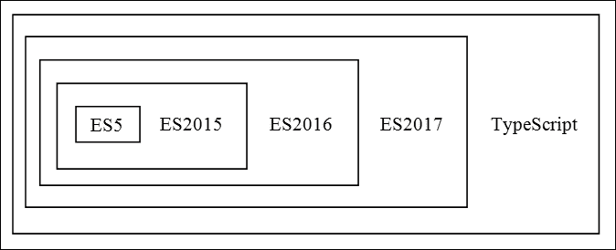
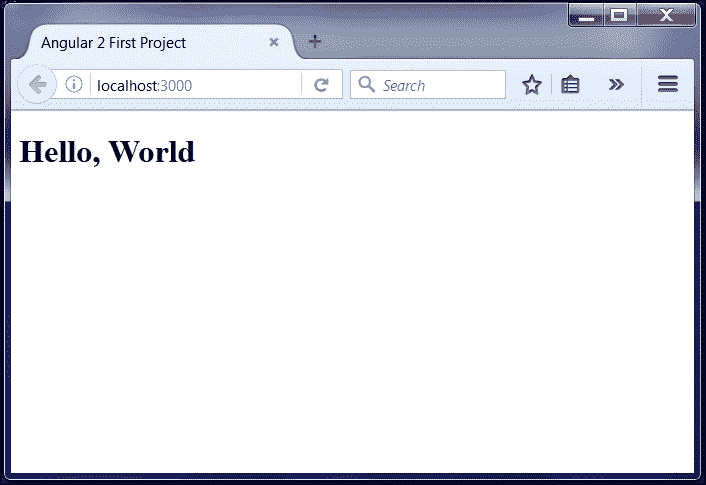
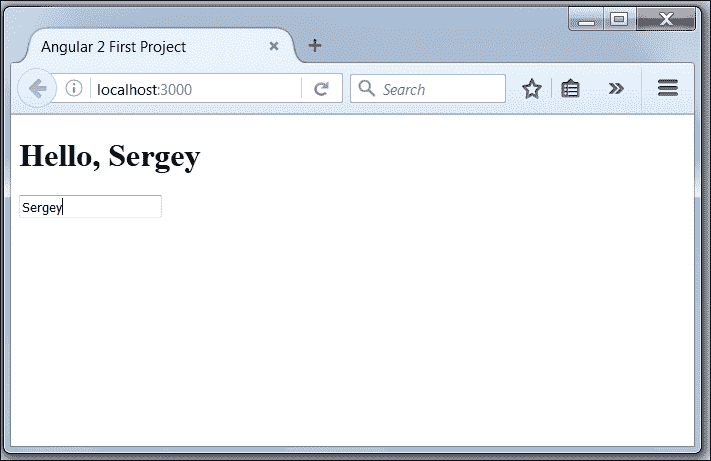
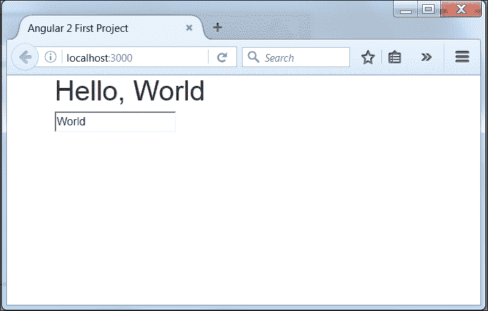
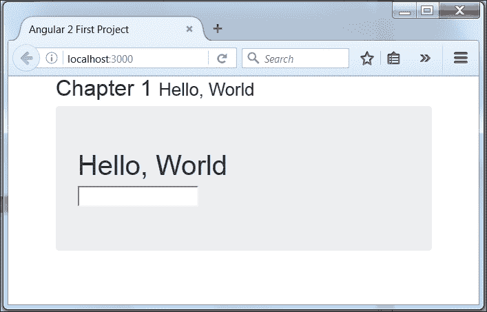
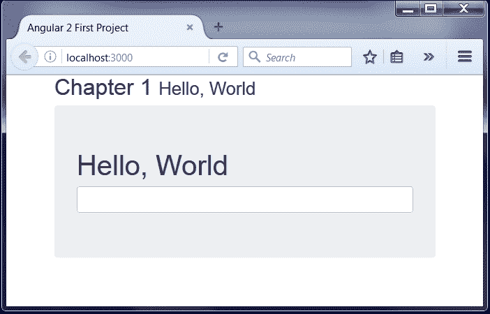
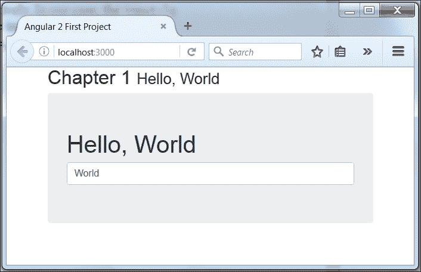

# 第一章：说你好！

让我们按照几个步骤来建立一个尽可能简单的应用程序的开发环境，向你展示使用 Angular 2 和 Bootstrap 4 轻松地启动和运行 Web 应用程序有多容易。在本章结束时，你将对以下内容有扎实的理解：

+   如何设置你的开发环境

+   TypeScript 如何改变你的开发生活

+   Angular 和 Bootstrap 的核心概念

+   如何使用 Bootstrap 创建一个简单的 Angular 组件

+   如何通过它显示一些数据

# 设置开发环境

让我们来设置你的开发环境。这个过程是学习编程中最容易被忽视和经常令人沮丧的部分之一，因为开发人员不想考虑它。开发人员必须了解如何安装和配置许多不同的程序，然后才能开始真正的开发。每个人的电脑都不一样；因此，相同的设置可能在你的电脑上无法工作。我们将通过定义你需要设置的各种环境的各个部分来暴露和消除所有这些问题。

## 定义一个 shell

**Shell** 是你的软件开发环境的必需部分。我们将使用 Shell 来安装软件并运行命令来构建和启动 Web 服务器，为你的 Web 项目注入生命。如果你的电脑安装了 Linux 操作系统，那么你将使用一个叫做**Terminal**的 Shell。有许多基于 Linux 的发行版，它们使用不同的桌面环境，但大多数都使用相同的键盘快捷键来打开 Terminal。

### 注意

在 Ubuntu、Kali 和 Linux Mint 中使用键盘快捷键*Ctrl* + *Alt* + *T*来打开 Terminal。如果对你不起作用，请查看你的 Linux 版本的文档。

如果你的 Mac 电脑安装了 OS X，那么你也将使用 Terminal shell。

### 注意

使用键盘快捷键*command* + *space*来打开**Spotlight**，输入 Terminal 进行搜索和运行。

如果你的电脑安装了 Windows 操作系统，你可以使用标准的**命令提示符**，但我们可以做得更好。一会儿我会告诉你如何在你的电脑上安装 Git，并且你将免费获得 Git Bash。

### 注意

你可以在 Windows 上使用`Git Bash` shell 程序打开一个 Terminal。

每当我需要在 Terminal 中工作时，我会在本书的所有练习中使用 Bash shell。

## 安装 Node.js

**Node.js**是我们将用作跨平台运行时环境来运行服务器端 Web 应用程序的技术。它是基于 Google 的 V8 JavaScript 引擎的本地、平台无关的运行时和大量用 JavaScript 编写的模块的组合。Node.js 附带了不同的连接器和库，帮助您使用 HTTP、TLS、压缩、文件系统访问、原始 TCP 和 UDP 等。作为开发人员，您可以在 JavaScript 中编写自己的模块，并在 Node.js 引擎内运行它们。Node.js 运行时使构建网络事件驱动的应用服务器变得容易。

### 注意

术语*package*和*library*在 JavaScript 中是同义的，因此我们将它们互换使用。

Node.js 广泛利用**JavaScript 对象表示法**（**JSON**）格式在服务器和客户端之间进行数据交换，因为它可以在几个解析图中轻松表达，特别是没有 XML、SOAP 和其他数据交换格式的复杂性。

您可以使用 Node.js 开发面向服务的应用程序，做一些与 Web 服务器不同的事情。最受欢迎的面向服务的应用程序之一是**node package manager**（**npm**），我们将使用它来管理库依赖关系、部署系统，并为 Node.js 的许多**平台即服务**（**PaaS**）提供商提供基础。

如果您的计算机上没有安装 Node.js，您应该从[`nodejs.org/en/download`](https://nodejs.org/en/download)下载预构建的安装程序，或者您可以使用来自[`nodejs.org/en/download/package-manager`](https://nodejs.org/en/download/package-manager)的非官方包管理器。安装后，您可以立即开始使用 Node.js。打开终端并键入：

```ts
 **node --version** 

```

Node.js 将以安装的运行时的版本号作出响应：

```ts
 **v4.4.3** 

```

请记住，我计算机上安装的 Node.js 版本可能与您的不同。如果这些命令给您一个版本号，那么您已经准备好开始 Node.js 开发了。

## 设置 npm

npm 是 JavaScript 的包管理器。您可以使用它来查找、共享和重用来自世界各地许多开发人员的代码包。包的数量每天都在急剧增长，现在已经超过 250K。npm 是 Node.js 的包管理器，并利用它来运行自身。npm 包含在 Node.js 的安装包中，并在安装后立即可用。打开终端并键入：

```ts
 **npm --version** 

```

npm 必须以版本号的形式响应您的命令：

```ts
 **2.15.1** 

```

我的 Node.js 带有特定版本的 npm。npm 经常更新，所以您需要使用以下命令切换到最新版本：

```ts
 **npm install npm@latest -g** 

```

您可能会遇到使用 npm 搜索或安装软件包时的权限问题。如果是这种情况，我建议按照[`docs.npmjs.com/getting-started/fixing-npm-permissions`](https://docs.npmjs.com/getting-started/fixing-npm-permissions)上的说明操作，不要使用超级用户权限来修复它们。

以下命令为我们提供了有关 Node.js 和 npm 安装的信息：

```ts
 **npm config list** 

```

有两种方法可以安装 npm 软件包：本地安装或全局安装。在您希望将软件包用作工具时，最好进行全局安装：

```ts
 **npm install -g <package_name>** 

```

如果您需要找到全局安装软件包的文件夹，可以使用以下命令：

```ts
 **npm config get prefix** 

```

全局安装软件包很重要，但最好在不需要时避免。大多数情况下，您会进行本地安装。

```ts
 **npm i <package_name>** 

```

您可以在项目的`node_modules`文件夹中找到本地安装的软件包。

## 安装 Git

如果您不熟悉 Git，那您真的错过了很多！Git 是一个分布式版本控制系统，每个 Git 工作目录都是一个完整的仓库。它保留了完整的更改历史，并具有完整的版本跟踪功能。每个仓库都完全独立于网络访问或中央服务器。您可以在计算机上保存 Git 仓库并与同事共享，或者利用许多在线 VCS 提供者。您应该仔细查看的大公司是 GitHub、Bitbucket 和 Gitlab.com。每个都有自己的好处，取决于您的需求和项目类型。

Mac 计算机已经安装了 Git 到操作系统中，但通常 Git 的版本与最新版本不同。您可以通过官方网站[`git-scm.com/downloads`](https://git-scm.com/downloads)上提供的一组预构建安装程序来更新或安装 Git 到您的计算机上。安装完成后，您可以打开终端并输入：

```ts
 **git -version** 

```

Git 必须以版本号做出响应：

```ts
 **git version 2.8.1.windows.1** 

```

正如我所说，对于使用安装了 Windows 操作系统的计算机的开发人员，您现在可以在系统上免费使用 Git Bash。

## 代码编辑器

可以想象有多少用于代码编辑的程序存在，但我们今天只谈论免费、开源、可以在任何地方运行的微软 Visual Studio Code。您可以使用任何您喜欢的程序进行开发，但在我们未来的练习中，我将只使用 Visual Studio Code，请从[`code.visualstudio.com/Download`](http://code.visualstudio.com/Download) 安装它。

# TypeScript 的速成课程

TypeScript 是由微软开发和维护的开源编程语言。它最初于 2012 年 10 月公开发布，并由 C#的首席架构师、Delphi 和 Turbo Pascal 的创始人 Anders Hejlsberg 进行了介绍。

TypeScript 是 JavaScript 的一种类型化超集，可以编译为普通的 JavaScript。任何现有的 JavaScript 也都是有效的 TypeScript。它提供了类型检查、显式接口和更容易的模块导出。目前，它包括**ES5**，**ES2015**，**ES2016**，实际上有点像提前获得明天的 ECMAScript 的一些功能，这样我们就可以今天就使用一些这些功能。

以下是 ECMAScript 和 TypeScript 之间的关系：



如果您已经熟悉 JavaScript 语言，使用 TypeScript 编写代码相对简单。可以在 TypeScript playground [`www.typescriptlang.org/play`](http://www.typescriptlang.org/play) 中使用 IntelliSense、查找引用等功能，直接从浏览器中进行操作。

## 类型

TypeScript 提供了静态类型检查操作，可以在开发周期中捕捉到许多错误。TypeScript 通过类型注解实现了编译时的类型检查。TypeScript 中的类型始终是可选的，因此如果您更喜欢 JavaScript 的常规动态类型，则可以忽略它们。它支持原始类型的`number`，`boolean`和`string`类型注解，以及动态类型结构的`any`。在下面的示例中，我为`function`的`return`和参数添加了类型注解：

```ts
function add(first: number, second: number): number { 
  return first + second; 
} 

```

在编译的某一时刻，TypeScript 编译器可以生成一个仅包含导出类型签名的声明文件。带有扩展名`.d.ts`的结果声明文件以及 JavaScript 库或模块可以稍后由第三方开发人员使用。您可以在以下网址找到许多流行 JavaScript 库的声明文件的广泛集合：

+   **DefinitelyTyped** ([`github.com/DefinitelyTyped/DefinitelyTyped`](https://github.com/DefinitelyTyped/DefinitelyTyped) )

+   **Typings** 注册表 ([`github.com/typings/registry`](https://github.com/typings/registry) )

## 箭头函数

JavaScript 中的函数是头等公民，这意味着它们可以像其他任何值一样传递：

```ts
var result = [1, 2, 3] 
  .reduce(function (total, current) {   
    return total + current; 
  }, 0); // 6 

```

`reduce` 中的第一个参数是匿名函数。匿名函数在许多场景中非常有用，但太啰嗦了。TypeScript 引入了一种新的、不那么啰嗦的语法来定义匿名函数，称为 **箭头函数** 语法：

```ts
var result = [1, 2, 3] 
  .reduce( (total, current) => {   
    return total + current; 
  }, 0); // 6 

```

甚至更简洁：

```ts
var result = [1, 2, 3] 
  .reduce( (total, current) => total + current, 0); // 6 

```

在定义参数时，如果参数只是一个标识符，甚至可以省略括号。所以数组的常规 `map` 方法：

```ts
var result = [1, 2, 3].map(function (x) {  
  return x * x  
}); 

```

可以更加简洁：

```ts
var result = [1, 2, 3].map(x => x * x); 

```

两种语法 `(x) => x * x` 和 `x => x * x` 都是允许的。

箭头函数的另一个重要特性是它不会遮蔽 `this`，而是从词法作用域中获取它。假设我们有一个构造函数 `Counter`，它在超时中增加内部变量 `age` 的值并将其打印出来：

```ts
function Counter() { 
  this.age = 30; 
  setTimeout(() => { 
    this.age += 1; 
    console.log(this.age); 
  }, 100); 
} 
new Counter(); // 31 

```

使用箭头函数的结果是，`Counter` 作用域中的 `age` 在 `setTimeout` 的回调函数中是可用的。以下是转换为 JavaScript ECMAScript 5 代码：

```ts
function Counter() { 
    var _this = this; 
    this.age = 30; 
    setTimeout(function () { 
        _this.age += 1; 
        console.log(_this.age); 
    }, 100); 
} 

```

以下变量在箭头函数内部都是词法作用域的：

+   `arguments`

+   `super`

+   `this`

+   `new.target`

## 块作用域变量

在 ES5 中，使用 `var` 声明的所有变量都是函数作用域的，它们的作用域属于封闭函数。以下代码的结果可能令人困惑，因为它返回 `undefined`：

```ts
var x = 3; 
function random(randomize) { 
    if (randomize) { 
        // x initialized as reference on function 
        var x = Math.random();  
        return x; 
    } 
    return x; // x is not defined 
} 
random(false); // undefined 

```

`x` 是 `random` 函数的内部变量，与第一行定义的变量没有任何关系。在最后一行调用 `random` 函数的结果返回 `undefined`，因为 JavaScript 解释 `random` 函数中的代码如下：

```ts
function random(randomize) { 
    var x; // x is undefined 
    if (randomize) { 
        // x initialized as reference on function 
        x = Math.random(); 
        return x; 
    } 
    return x; // x is not defined 
} 

```

在 TypeScript 中，这段令人困惑的代码可以通过新的块作用域变量声明来修复：

+   `let` 是 `var` 的块作用域版本

+   `const` 类似于 `let`，但只允许初始化变量一次

TypeScript 编译器使用新的块作用域变量声明会抛出更多错误，并防止编写复杂和损坏的代码。让我们在前面的例子中将 `var` 改为 `let`：

```ts
let x = 3; 
function random(randomize) { 
    if (randomize) { 
        let x = Math.random(); 
        return x; 
    } 
    return x; 
} 
random(false); // 3 

```

现在我们的代码按预期工作了。

### 注意

我建议使用 `const` 和 `let` 来使代码更清晰、更安全。

## 模板文字

如果我们需要字符串插值，通常会将变量的值与字符串片段组合在一起，例如：

```ts
let out: string = '(' + x + ', ' + y + ')'; 

```

TypeScript 支持模板文字--允许嵌入表达式的字符串文字。您可以直接使用模板文字的字符串插值功能：

```ts
let out: string = `(${x}, ${y})`; 

```

如果需要多行字符串，模板文字可以再次帮助：

```ts
Let x = 1, y = 2; 
let out: string = ` 
Coordinates 
 x: ${x},  
 y: ${y}`; 
console.log(out); 

```

最后一行打印结果如下：

```ts
Coordinates 
 x: 1,  
 y: 2 

```

### 注意

我建议使用模板文字作为更安全的字符串插值方式。

## for-of 循环

我们通常使用`for`语句或 JavaScript ES5 中`Array`的`forEach`方法来迭代元素：

```ts
let arr = [1, 2, 3]; 
// The for statement usage 
for (let i = 0; i < arr.length; i++) { 
    let element = arr[i]; 
    console.log(element); 
} 
// The usage of forEach method 
arr.forEach(element => console.log(element)); 

```

每种方法都有其好处：

+   我们可以通过`break`或`continue`中断`for`语句

+   `forEach`方法更简洁

TypeScript 具有`for-of`循环，结合了这两种方法：

```ts
const arr = [1, 2, 3]; 
for (const element of arr) { 
    console.log(element); 
} 

```

`for-of`循环支持`break`和`continue`，并且可以使用`entries`方法的`index`和`value`来使用每个数组：

```ts
const arr = [1, 2, 3]; 
for (const [index, element] of arr.entries()) { 
    console.log(`${index}: ${element}`); 
} 

```

## 默认值、可选和剩余参数

我们经常需要检查函数的输入参数并为它们分配默认值：

```ts
function square(x, y) { 
  x = x || 0; 
  y = y || 0; 
  return x * y; 
} 
let result = square(4, 5); // Out 20 

```

TypeScript 有语法来处理参数的默认值，使之前的函数更短、更安全：

```ts
function square(x: number = 0, y: number = 0) { 
  return x * y; 
} 
let result = square(4, 5); // Out 20 

```

### 注意

参数的默认值只有在其`undefined`值时才会被赋值。

JavaScript ES5 中函数的每个参数都是可选的，因此省略的参数等于`undefined`。为了使其严格，TypeScript 希望在我们想要可选的参数末尾加上一个问号。我们可以将`square`函数的最后一个参数标记为可选，并使用一个或两个参数调用该函数：

```ts
function square(x: number = 0, y?: number) { 
 if (y) { 
   return x * y; 
 } else { 
  return x * x; 
 } 
} 
let result = square(4); // Out 16 
let result = square(4, 5); // Out 20 

```

### 注意

任何可选参数必须跟在必需参数后面。

在某些情况下，我们需要将多个参数作为一组处理，或者我们可能不知道函数需要多少个参数。JavaScript ES5 在函数范围内提供了`arguments`变量来处理它们。在 TypeScript 中，我们可以使用一个形式变量来保存其余的参数。编译器使用省略号后面给定的名称构建传递的参数数组，以便我们可以在函数中使用它：

```ts
function print(name: number, ...restOfName: number[]) { 
  return name + " " + restOfName.join(" "); 
} 
let name = print("Joseph", "Samuel", "Lucas"); 
// Out: Joseph Samuel Lucas 

```

## 接口

接口是定义项目内外合同的方式。我们在 TypeScript 中使用接口只是为了描述类型和数据的形状，以帮助我们保持代码无误。与许多其他语言相比，TypeScript 编译器不会为接口生成任何代码，因此它没有运行时成本。TypeScript 通过 interface 关键字定义接口。让我们定义一个类型`Greetable`：

```ts
interface Greetable { 
  greetings(message: string): void; 
} 

```

它有一个名为`greetings`的成员函数，接受一个字符串参数。以下是我们如何将其用作参数类型：

```ts
function hello(greeter: Greetable) { 
  greeter.greetings('Hi there'); 
} 

```

## 类

JavaScript 具有基于原型的面向对象编程模型。我们可以使用对象文字语法或构造函数来实例化对象。它的基于原型的继承是在原型链上实现的。如果您来自面向对象的方法，当您尝试基于原型创建类和继承时，可能会感到不舒服。TypeScript 允许基于面向对象的类的方法编写代码。编译器将类转换为 JavaScript，并在所有主要的 Web 浏览器和平台上运行。这是类`Greeter`。它有一个名为`greeting`的属性，一个`constructor`和一个`greet`方法：

```ts
class Greeter { 
  greeting: string; 
  constructor(message: string) { 
    this.greeting = message; 
  } 
  greet() { 
    return "Hello, " + this.greeting; 
  } 
} 

```

要引用类的任何成员，我们需要在前面加上`this`。要创建类的实例，我们使用`new`关键字：

```ts
let greeter = new Greeter("world"); 

```

我们可以通过继承来扩展现有的类以创建新的类：

```ts
class EmailGreeter extends Greeter {  
  private email: string;  
  constructor(emailAddr: string, message: string) {  
    super(message); 
    this.email = emailAddr;  
  }  
  mailto() {  
    return "mailto:${this.email}?subject=${this.greet()}";  
  }  
} 

```

在类`EmailGreeter`中，我们展示了 TypeScript 中继承的几个特性：

+   我们使用`extends`来创建一个子类

+   我们必须在构造函数的第一行调用`super`以将值传递给基类

+   我们调用基类的`greet`方法来创建一个`mailto`的主题

TypeScript 类支持`public`、`protected`和`private`修饰符，以访问我们在整个程序中声明的成员。类的每个成员默认为 public。不需要使用关键字标记所有`public`成员，但您可以显式标记它们。如果需要限制从外部访问类的成员，则使用 protected 修饰符，但请记住它们仍然可以从派生类中访问。您可以将构造函数标记为 protected，以便我们无法实例化该类，但可以扩展它。`private`修饰符限制了仅在类级别上访问成员。

如果您查看`EmailGreeter`的构造函数，我们必须声明一个私有成员`email`和一个构造函数参数`emailAddr`。相反，我们可以使用参数属性来让我们在一个地方创建和初始化成员：

```ts
class EmailGreeter extends Greeter { 
  constructor(private email: string, message: string) { 
    super(message); 
  } 
  mailto() { 
    return "mailto:${this.email}?subject=${this.greet()}"; 
  } 
} 

```

您可以在参数属性中使用任何修饰符。

### 注意

使用参数属性将声明和赋值 consoli 在一个地方。

TypeScript 支持使用 getter 和 setter 来组织拦截对象成员的访问。我们可以使用以下代码更改原始的`Greeter`类：

```ts
class Greeter {  
  private _greeting: string; 
  get greeting(): string { 
    return this._greeting; 
  } 
  set greeting(value: string) { 
    this._greeting = value || ""; 
  } 
  constructor(message: string) { 
    this.greeting = message; 
  } 
  greet() { 
    return "Hello, " + this.greeting; 
  } 
} 

```

我们在“问候语”的 setter 中检查`value`参数，并在将其分配给私有成员之前，根据需要将其修改为空字符串。

TypeScript 还通过静态修饰符支持类成员。这里的`Types`类仅包含静态成员：

```ts
class Types {  
  static GENERIC: string = ""; 
  static EMAIL: string = "email"; 
} 

```

我们可以通过在类名前加上访问这些值：

```ts
console.log(Types.GENERIC); 

```

TypeScript 通过抽象类为我们提供了极大的灵活性。我们无法创建它们的实例，但我们可以使用它们来组织基类，从而可以派生出每个不同的类。我们可以使用一个关键字将`greeting`类转换为抽象类：

```ts
abstract class BaseGreeter {  
  private _greeting: string; 
  get greeting(): string { 
    return this._greeting; 
  } 
  set greeting(value: string) { 
    this._greeting = value || ""; 
  } 
  abstract greet(); 
} 

```

方法`greet`被标记为`abstract`。它不包含实现，必须在派生类中实现。

## 模块

当我们编写代码时，通常将其分成函数和这些函数内部的块。程序的大小可能会迅速增加，个别函数开始混为一体。如果我们将它们分成像模块这样的大型组织单位，可以使这样的程序更易读。在编写程序的开始阶段，您可能不知道如何构造它，可以使用无结构的原则。当您的代码变得稳定时，可以将功能片段放入单独的模块中，以便跟踪、更新和共享。我们将 TypeScript 的模块存储在文件中，每个文件恰好一个模块，每个模块一个文件。

JavaScript ES5 没有内置对模块的支持，我们使用 AMD 或 CommonJS 语法来处理它们。TypeScript 支持模块的概念。

作用域和模块如何相互依赖？JavaScript 的全局作用域无法访问执行模块的作用域。它为每个单独的执行模块创建自己的作用域，因此模块内声明的所有内容都无法从外部访问。我们需要显式导出它们以使其可见，并导入它们以使用它们。模块之间的关系是根据导出和导入在文件级别上定义的。任何文件都定义了顶级的`export`或`import`，并被视为一个模块。这里有一个`string-validator.ts`文件，其中包含导出的声明：

```ts
export interface StringValidator { 
  isAcceptable(s: string): boolean; 
} 

```

我创建了另一个文件`zip-validator.ts`，其中包含几个成员，但只导出其中一个，以隐藏另一个成员：

```ts
const numberRegexp = /^[0-9]+$/; 
export class ZipCodeValidator implements StringValidator { 
  isAcceptable(s: string) { 
    return s.length === 5 && numberRegexp.test(s); 
  } 
} 

```

如果您的模块扩展其他模块，可以重新导出声明。这里的`validators.ts`包含一个模块，包装其他验证器模块，并将它们的所有导出组合在一个地方：

```ts
export * from "./string-validator"; 
export * from "./zip-validator"; 

```

现在我们可以使用一种导入形式导入验证器模块。这是一个模块的单个导出：

```ts
import { StringValidator } from "./validators";  
let strValidator = new StringValidator(); 

```

为了防止命名冲突，我们可以重命名导入的声明：

```ts
import { ZipCodeValidator as ZCV } from "./validators"; 
let zipValidator = new ZCV(); 

```

最后，我们可以将整个模块导入到单个变量中，并使用它来访问模块导出：

```ts
import * as validator from "./validators";  
let strValidator = new validator.StringValidator(); 
let zipValidator = new validator.ZipCodeValidator(); 

```

## 泛型

TypeScript 的作者们竭尽全力帮助我们编写可重用的代码。其中一个帮助我们创建可以与各种类型一起工作而不是单一类型的代码的工具是**泛型**。泛型的好处包括：

+   允许您编写代码/使用方法，这些方法是类型安全的。`Array<string>`保证是一个字符串数组。

+   编译器可以对代码进行编译时检查，以确保类型安全。任何尝试将`number`分配到字符串数组中都会导致错误。

+   比使用`any`类型更快，以避免转换为所需的引用类型。

+   允许您编写适用于许多具有相同基本行为的类型的代码。

这是我创建的类，向您展示泛型有多么有用：

```ts
class Box<T> { 
    private _value : T;  
    set value(val : T) {  
        this._value = val;  
    }  
    get value() : T {  
        return this._value;  
    }  
} 

```

这个类保留特定类型的单个值。我们可以使用相应的 getter 和 setter 方法来设置或返回它：

```ts
var box1 = new Box<string>();  
box1.setValue("Hello World");  
console.log(box1.getValue());  
var box2 = new Box<number>();  
box2.setValue(1);  
console.log(box2.getValue()); 
var box3 = new Box<boolean>();  
box3.setValue(true);  
console.log(box3.getValue()); 
// Out: Hello World 
// Out: 1 
// Out: true 

```

# 什么是 promises？

承诺代表异步操作的最终结果。有许多支持在 TypeScript 中使用承诺的库。但在开始讨论这个之前，让我们先谈一下执行 JavaScript 代码的浏览器环境。

## 事件循环

每个浏览器选项卡都有一个事件循环，并使用不同的任务来协调事件、用户交互、运行脚本、渲染、网络等。它有一个或多个队列来保持任务的有序列表。其他进程围绕事件循环运行，并通过向其队列添加任务与其通信，例如：

+   计时器在给定时间后等待，然后将任务添加到队列

+   我们可以调用`requestAnimationFrame`函数来协调 DOM 更新

+   DOM 元素可以调用事件处理程序

+   浏览器可以请求解析 HTML 页面

+   JavaScript 可以加载外部程序并对其进行计算

上面列表中的许多项目都是 JavaScript 代码。它们通常足够小，但如果运行任何长时间的计算，可能会阻塞其他任务的执行，导致用户界面冻结。为了避免阻塞事件循环，我们可以：

+   使用**web worker API**在浏览器的不同进程中执行长时间运行的计算

+   不同步等待长时间运行的计算结果，并允许任务通过事件或回调异步通知我们结果

## 通过事件实现的异步结果

以下代码使用基于事件的方法来说服我们，并添加事件侦听器以执行内部的小代码片段：

```ts
var request = new XMLHttpRequest(); 
request.open('GET', url); 

request.onload = () => { 
    if (req.status == 200) { 
        processData(request.response); 
    } else { 
        console.log('ERROR', request.statusText); 
    } 
}; 

request.onerror = () => { 
    console.log('Network Error'); 
}; 

request.send(); // Add request to task queue 

```

代码的最后一行中的`send`方法只是向队列添加另一个任务。如果您多次接收结果，则此方法很有用，但对于单个结果来说，此代码相当冗长。

## 通过回调实现的异步结果

要通过回调管理异步结果，我们需要将回调函数作为参数传递给异步函数调用：

```ts
readFileFunctional('myfile.txt', { encoding: 'utf8' }, 
    (text) => { // success 
        console.log(text); 
    }, 
    (error) => { // failure 
        // ... 
    } 
); 

```

这种方法非常容易理解，但它也有其缺点：

+   混淆输入和输出参数

+   特别是在代码中组合了许多回调时，处理错误会变得复杂

+   从组合的异步函数返回结果更加复杂

## 通过承诺实现的异步结果

如我之前提到的，承诺代表将来发生的异步操作的最终结果。承诺具有以下优点：

+   您可以编写更干净的代码，而无需回调参数

+   您不需要调整底层架构的代码以交付结果

+   您的代码可以轻松处理错误

承诺可能处于以下状态之一：

+   **待定状态**：异步操作尚未完成

+   **已解决状态**：异步操作已完成，承诺具有值

+   **Rejected state**：异步操作失败，承诺有一个原因，指示失败的原因

承诺在解析或拒绝后变为不可变。

通常，您编写代码从函数或方法返回承诺：

```ts
function readFile(filename, encode){ 
  return new Promise((resolve, reject) => { 
    fs.readFile(filename, enccode, (error, result) => { 
      if (error) { 
        reject(error); 
      } else { 
        resolve(result); 
      } 
    }); 
  }); 
} 

```

我们使用 `new` 关键字与函数构造函数一起创建承诺。我们在构造函数中添加一个具有两个参数的工厂函数，该函数执行实际工作。两个参数都是回调函数。一旦操作成功完成，工厂函数将使用结果调用第一个回调。如果操作失败，它将使用原因调用第二个函数。

返回的承诺有几种方法，如 `.then` 和 `.catch`，以通知我们执行的结果，以便我们可以相应地采取行动：

```ts
function readJSON(filename){
 return readFile(filename, 'utf8').then((result) => {
 console.log(result);
 }, (error) => {
 console.log(error);
 });
} 

```

我们可以调用另一个操作返回的承诺，快速转换原始操作的结果：

```ts
function readJSON(filename){ 
  return readFile(filename, 'utf8').then((result) => { 
    return JSON.parse(result); 
  }, (error) => { 
    console.log(error); 
  } 
} 

```

# Angular 2 概念

**Angular 2** 是一个用于构建 Web、移动和桌面应用程序的开发平台。它基于 Web 标准，使 Web 开发更简单、更高效，与 Angular JS 1.x 完全不同。Angular 2 的架构建立在 Web 组件标准之上，以便我们可以为其定义自定义 HTML 选择器和程序行为。Angular 团队开发 Angular 2 以在 ECMAScript 2015、TypeScript 和 Dart 语言中使用。

## Angular 2 的构建块

任何构建在 Angular 2 上的 Web 应用程序包括：

+   具有 Angular 特定标记的 HTML 模板

+   指令和组件管理 HTML 模板

+   包含应用程序逻辑的服务

+   特殊的 `bootstrap` 函数帮助加载和启动 Angular 应用程序

## 模块

Angular 2 应用程序是许多模块的组合。Angular 2 本身是一组以 `@angular` 前缀开头的模块，组合成库：

+   `@angular/core` 是主要的 Angular 2 库，包含所有核心公共 API

+   `@angular/common` 是一个限制 API 用于可重用组件、指令和表单构建的库

+   `@angular/router` 是支持导航的库

+   `@angular/http` 是帮助我们通过 HTTP 异步工作的库

## 元数据

元数据是我们可以通过 TypeScript 装饰器附加到底层定义的信息，告诉 Angular 如何修改它们。装饰器在 Angular 2 中扮演着重要的角色。

## 指令

指令是 Angular 2 的基本构建块，允许您将行为连接到 DOM 中的元素。有三种类型的指令：

+   属性指令

+   结构指令

+   组件

指令是一个带有分配的`@Directive`装饰器的类。

## 属性指令

属性指令通常改变元素的外观或行为。我们可以通过将其绑定到属性来改变多种样式，或者使用它将文本呈现为粗体或斜体。

## 结构指令

结构指令通过添加和移除其他元素来改变 DOM 布局。

## 组件

该组件是一个带有模板的指令。每个组件由两部分组成：

+   定义应用程序逻辑的类

+   视图，由组件控制，并通过属性和方法的 API 与其交互

组件是一个带有分配的`@Component`装饰器的类。

## 模板

组件使用模板来呈现视图。它是常规的 HTML，具有自定义定义的选择器和特定于 Angular 的标记。

## 数据绑定

Angular 2 支持*数据绑定*，以通过组件的属性或方法更新模板的部分。*绑定标记*是数据绑定的一部分；我们在模板上使用它来连接两侧。

## 服务

Angular 2 没有对服务的定义。任何值、函数或特性都可以是服务，但通常它是一个为特定目的创建的类，并带有分配的`@Injectable`装饰器。

## 依赖注入

依赖注入是一种设计模式，它帮助通过外部实体配置对象并解决它们之间的依赖关系。松散耦合系统中的所有元素对彼此的定义知之甚少或根本不知道。我们几乎可以用替代实现替换任何元素，而不会破坏整个系统。

# SystemJS 加载器和 JSPM 包管理器

我们已经讨论了 TypeScript 模块，现在是时候谈谈我们可以用来加载脚本中的模块的工具了。

## SystemJS 加载器

**SystemJS**是一个通用的动态模块加载器。它在 GitHub 上托管源代码，地址为[`github.com/systemjs/systemjs`](https://github.com/systemjs/systemjs)。它可以以以下格式在 Web 浏览器和 Node.js 中加载模块：

+   ECMAScript 2015（ES6）或 TypeScript

+   AMD

+   CommonJS

+   全局脚本

SystemJS 通过模块命名系统加载具有精确循环引用、绑定支持和资产的模块，如 CSS、JSON 或图像。开发人员可以通过插件轻松扩展加载器的功能。

我们可以将 SystemJS 加载器添加到我们未来的项目中：

+   通过直接链接到**内容传送网络**（**CDN**）

+   通过 npm 管理器安装

在这两种情况下，我们在代码中包含对 SystemJS 库的引用，并通过`config`方法进行配置：

```ts
<!DOCTYPE html> 
<html> 
  <head> 
    <script src="https://jspm.io/system.js"></script>   
    <script src="https://jspm.io/system.js"></script>

    <script>
      System.config({
      packages: {
      './': {
      defaultExtension: false
            }
         }
      });
    </script>

    <script>
    System.import('./app.js');
    </script>
  </head> 
  <body> 
    <div id="main"></div> 
  </body> 
</html> 

```

我们将在本章稍后讨论通过 npm 管理器进行安装。

## JSPM 包管理器

SystemJS 的开发人员遵循单一职责原则，并实现了一个仅执行一项任务的加载器。为了使模块在项目中可用，我们需要使用包管理器。我们在开头谈到了 npm 包管理器，现在我们将谈论坐落在 SystemJS 之上的 JSPM 包管理器。它可以：

+   从任何注册表（如 npm 和 GitHub）下载模块

+   使用单个命令将模块编译成简单、分层和自执行的捆绑包

JSPM 包管理器看起来像 npm 包管理器，但它将浏览器加载器放在首位。它可以帮助您组织无缝的工作流程，以便在浏览器中轻松安装和使用库。

# 编写您的第一个应用程序

现在，当一切就绪时，是时候创建我们的第一个项目了，实际上它是一个 npm 模块。打开终端并创建名为`hello-world`的文件夹。我特意遵循 npm 包命名约定：

+   包名长度应大于零且不得超过 214

+   包名中的所有字符必须为小写

+   包名可以包含/包括连字符

+   包名必须包含任何 URL 安全字符（因为名称最终成为 URL 的一部分）

+   包名不应以点或下划线字母开头

+   包名不应包含任何前导或尾随空格

+   包名不能与`node.js/io.js`核心模块或保留/黑名单名称相同，如`http`、stream、`node_modules`等。

将文件夹移入并运行命令：

```ts
 **npm init** 

```

npm 将询问您几个问题以创建`package.json`文件。该文件以 JSON 格式保存有关您的包的重要信息：

+   项目信息如名称、版本、作者和许可证

+   项目依赖的一组包

+   一组预配置的用于构建和测试项目的命令

`package.js`可能如下所示：

```ts
{ 
  "name": "hello-world", 
  "version": "1.0.0", 
  "description": "The Hello World", 
  "author": " Put Your Name Here", 
  "license": "MIT" 
  "scripts": { 
    "test": "echo "Error: no test specified" && exit 1" 
  } 
} 

```

我们已经准备好配置我们的项目了。

## TypeScript 编译配置

运行 Visual Studio 代码并打开项目文件夹。我们需要创建一个配置文件，指导 TypeScript 编译器在哪里找到源文件夹和所需的库，以及如何编译项目。从 **文件** 菜单创建 `tsconfig.json` 文件，并复制/粘贴以下内容：

```ts
{ 
  "compilerOptions": { 
    "target": "es5", 
    "module": "commonjs", 
    "moduleResolution": "node", 
    "sourceMap": true, 
    "emitDecoratorMetadata": true, 
    "experimentalDecorators": true, 
    "removeComments": false, 
    "noImplicitAny": false 
  }, 
  "exclude": [ 
    "node_modules", 
    "typings/main", 
    "typings/main.d.ts" 
  ] 
} 

```

让我们更仔细地看一下 `compilerOptions`：

+   `target` 选项指定 ECMAScript 版本，例如 `es3`，`es5` 或 `es6`。

+   `module` 选项指定模块代码生成器，可以是以下之一：`none`，`commojs`，`amd`，`system`，`umd`，`es6` 或 `es2015`。

+   `moduleResolution` 选项确定模块的解析方式。使用 `node` 来进行 `Node.js/io.js` 风格的解析，或者使用 `classic`。

+   `sourceMap` 标志告诉编译器生成相应的 `map` 文件。

+   `emitDecoratorMetadata` 会为源中装饰的声明发出设计类型元数据。

+   `experimentalDecorator` 启用对 ES7 装饰器的实验性支持，比如迭代器、生成器和数组推导。

+   `removeComments` 会移除除版权头注释以外的所有注释，这些注释以 `/*!` 开头。

+   `noImplicitAny` 会在具有隐含的 `any` 类型的表达式和声明上引发错误。

您可以在这里找到编译器选项的完整列表：[`www.typescriptlang.org/docs/handbook/compiler-options.html`](https://www.typescriptlang.org/docs/handbook/compiler-options.html)。

TypeScript 编译器需要 JavaScript 库的类型定义文件，这些文件位于我们项目的 `node_modules` 中，因为它无法本地识别它们。我们可以通过 `typings.json` 文件来帮助它。您应该创建该文件并复制/粘贴以下内容：

```ts
{
   "ambientDependencies": {
     "es6-shim": "registry:dt/es6-shim#0.31.2+20160317120654"
   }
} 

```

我们应该提供足够的信息给 typings 工具来获取任何 typings 文件：

+   dt 注册表位于 DefinitelyTyped 源中。这个值可以是 npm，git

+   `DefinitelyTyped` 源中的包名是 `es6-shim`。

+   我们正在寻找更新于 `2016.03.17 12:06:54` 的版本 `0.31.2`。

## 任务自动化和依赖项解析

现在，是时候将应用程序所需的库添加到 `package.json` 文件中了。请相应地更新它：

```ts
{ 
  "name": "hello-world", 
  "version": "1.0.0", 
  "description": "The Hello World", 
  "author": "Put Your Name Here", 
  "license": "MIT", 
  "scripts": { 
    "start": "tsc && concurrently "npm run tsc:w" "npm run lite" ", 
    "lite": "lite-server", 
    "postinstall": "typings install", 
    "tsc": "tsc", 
    "tsc:w": "tsc -w", 
    "typings": "typings" 
  }, 
  "dependencies": { 
    "@angular/common":  "~2.0.1", 
    "@angular/compiler":  "~2.0.1", 
    "@angular/core":  "~2.0.1", 
    "@angular/http":  "~2.0.1", 
    "@angular/platform-browser":  "~2.0.1", 
    "@angular/platform-browser-dynamic":  "~2.0.1", 
    "@angular/router":  "~3.0.1", 
    "@angular/upgrade": "~2.0.1", 

    "systemjs": "0.19.39", 
    "core-js": "².4.1", 
    "reflect-metadata": "⁰.1.8", 
    "rxjs": "5.0.0-beta.12", 
    "zone.js": "⁰.6.25", 

    "angular-in-memory-web-api": "~0.1.1", 
    "bootstrap": "4.0.0-alpha.4" 
  }, 
  "devDependencies": { 
    "concurrently": "³.0.0", 
    "lite-server": "².2.2", 
    "typescript": "².0.3", 
    "typings":"¹.4.0" 
  } 
} 

```

我们的配置包括 `scripts` 来处理常见的开发任务，比如：

+   `postinstall` 脚本在包安装后运行

+   `start` 脚本由 npm 的 `start` 命令运行

+   任意脚本 `lite`，`tsc`，`tsc:w` 和 `typings` 都可以通过 `npm run <script>` 来执行。

您可以在以下网页上找到更多文档：[`docs.npmjs.com/misc/scripts`](https://docs.npmjs.com/misc/scripts)。

完成配置后，让我们运行 `npm` 管理器来安装所需的软件包。返回到终端并输入以下命令：

```ts
 **npm i** 

```

在安装过程中，您可能会看到以红色开始的警告消息：

```ts
 **npm WARN** 

```

如果安装成功完成，您应该忽略它们。安装完成后，npm 执行 `postinstall` 脚本来运行 `typings` 安装。

# 创建和引导 Angular 组件

Angular 2 应用程序必须始终具有顶层组件，其中包含所有其他组件和逻辑。让我们创建它。转到 Visual Studio 代码并在根目录下创建一个名为 `app` 的子文件夹，我们将在其中保存源代码。在 `app` 文件夹下创建文件 `app.component.ts`，并复制/粘贴以下内容：

```ts
// Import the decorator class for Component 
import { Component } from '@angular/core'; 

@Component({ 
  selector: 'my-app', 
  template: '<h1> Hello, World</h1>' 
}) 
export class AppComponent { } 

```

正如您所看到的，我们通过 `@Component` 装饰器向 `AppComponent` 类添加了元数据。此装饰器告诉 Angular 如何通过以下选项的配置来处理该类：

+   `selector` 定义了我们的组件将链接的 HTML 标签的名称

+   我们在 `providers` 属性中传递任何服务。在此注册的任何服务都将对该组件及其子组件可用

+   我们可以将任意数量的样式文件赋予 `styles` 特定组件

+   `template` 属性将保存组件的模板

+   `template url` 是指向包含视图模板的外部文件的 URL

我们需要导出 `AppComponent` 类，以使其从其他模块可见，并且 Angular 可以实例化它。

Angular 应用程序是由多个使用 `NgModule` 装饰器标记的模块组成。任何应用程序必须至少有一个根模块，因此让我们在 `app.module.ts` 文件中创建 `AppModule`：

```ts
import { NgModule } from '@angular/core'; 
import { BrowserModule } from '@angular/platform-browser'; 

@NgModule({ 
  imports: [ BrowserModule ] 
}) 
export class AppModule { } 

```

WebBrowser 是专为 Web 浏览器而设计的模块和提供程序的集合，例如 document DomRootRenderer 等。我们将 WebBrowser 导入应用程序模块，以使所有这些提供程序和模块在我们的应用程序中可用，从而减少所需的样板代码编写量。Angular 包含 `ServerModule`：用于服务器端的类似模块。

现在我们需要启动我们的应用程序。在 `app` 文件夹下创建 `main.ts` 文件，并复制/粘贴以下内容：

```ts
import { platformBrowserDynamic } from  
     '@angular/platform-browser-dynamic'; 

import { AppModule } from './app.module'; 

const platform = platformBrowserDynamic(); 

platform.bootstrapModule(AppModule); 

```

最后但并非最不重要的是，我们依赖于`bootstrap`函数来加载顶层组件。我们从`'@angular/platform-browser-dynamic'`中导入它。Angular 有一种不同类型的`bootstrap`函数：

+   Web 工作者

+   在移动设备上进行开发

+   在服务器上渲染应用程序的第一页

Angular 在实例化任何组件后执行几项任务：

+   它为其创建了一个影子 DOM

+   将选定的模板加载到影子 DOM 中

+   它创建了所有配置了'providers'和'viewProviders'的可注入对象

最后，Angular 2 会对所有模板表达式和语句进行评估，与组件实例进行比较。

现在，在 Microsoft Visual Studio 代码中在根文件夹下创建`index.html`文件，并包含以下内容：

```ts
<html> 
  <head> 
    <title>Angular 2 First Project</title> 
    <meta charset="UTF-8"> 
    <meta name="viewport" content="width=device-width, initial-scale=1"> 
    <link rel="stylesheet" href="styles.css"> 

    <!-- 1\. Load libraries --> 
     <!-- Polyfill(s) for older browsers --> 
    <script src="node_modules/core-js/client/shim.min.js"> 
    </script> 

    <script src="node_modules/zone.js/dist/zone.js"></script> 
    <script src="node_modules/reflect-metadata/Reflect.js"> 
    </script> 
    <script src="node_modules/systemjs/dist/system.src.js"> 
</script> 

    <!-- 2\. Configure SystemJS --> 
    <script src="systemjs.config.js"></script> 
    <script> 
      System.import('app') 
      .catch(function(err){ console.error(err);  }); 
    </script> 
  </head> 

  <!-- 3\. Display the application --> 
  <body> 
    <my-app>Loading...</my-app> 
  </body> 
</html> 

```

因为我们正在引用`systemjs.config.js`文件，让我们在根文件夹中创建它，其中包含以下代码：

```ts
(function (global) { 
  System.config({ 
    paths: { 
      // paths serve as alias 
      'npm:': 'node_modules/' 
    }, 
    // map tells the System loader where to look for things 
    map: { 
      // our app is within the app folder 
      app: 'app', 
      // angular bundles 
      '@angular/core': 'npm:@angular/core/bundles/core.umd.js', 
      '@angular/common': 'npm:@angular/common/bundles/common.umd.js', 
      '@angular/compiler': 'npm:@angular/compiler/bundles/compiler.umd.js', 
      '@angular/platform-browser': 'npm:@angular/platform-browser/bundles/platform-browser.umd.js', 
      '@angular/platform-browser-dynamic': 'npm:@angular/platform-browser-dynamic/bundles/platform-browser-dynamic.umd.js', 
      '@angular/http': 'npm:@angular/http/bundles/http.umd.js', 
      '@angular/router': 'npm:@angular/router/bundles/router.umd.js', 
      '@angular/forms': 'npm:@angular/forms/bundles/forms.umd.js', 
      // other libraries 
      'rxjs':                      'npm:rxjs', 
      'angular-in-memory-web-api': 'npm:angular-in-memory-web-api', 
    }, 
    // packages tells the System loader how to load when no filename and/or no extension 
    packages: { 
      app: { 
        main: './main.js', 
        defaultExtension: 'js' 
      }, 
      rxjs: { 
        defaultExtension: 'js' 
      }, 
      'angular-in-memory-web-api': { 
        main: './index.js', 
        defaultExtension: 'js' 
      } 
    } 
  }); 
})(this); 

```

## 编译和运行

我们已经准备好运行我们的第一个应用程序。返回终端并键入：

```ts
 **npm start** 

```

此脚本运行两个并行的 Node.js 进程：

+   TypeScript 编译器处于监视模式

+   静态的`lite-server`加载`index.html`并在应用程序文件更改时刷新浏览器

在您的浏览器中，您应该看到以下内容：



### 提示

您可以在`chapter_1/1.hello-world`文件夹中找到源代码。

## 添加用户输入

现在我们需要包含我们的文本输入，并指定我们想要使用的模型。当用户在文本输入中键入时，我们的应用程序会在标题中显示更改后的值。此外，我们应该将`FormsModule`导入到`AppModule`中：

```ts
import { NgModule }      from '@angular/core'; 
import { BrowserModule } from '@angular/platform-browser'; 
 **import { FormsModule }   from '@angular/forms';** 

import { AppComponent }   from './app.component'; 

@NgModule({ 
  imports:      [ BrowserModule, **FormsModule** 

 ], 
  declarations: [ AppComponent ], 
  bootstrap:    [ AppComponent ] 

}) 
export class AppModule { } 

```

这是`app.component.ts`的更新版本：

```ts
import { Component } from '@angular/core'; 

@Component({ 
  selector: 'my-app', 
  template: ` 
<h1>Hello, {{name || 'World'}}</h1>  
 **<input type="text" [(ngModel)]="name" placeholder="name">** 

`}) 
export class AppComponent {  
  name: string = 'World'; 
} 

```

`ngModel`属性在该元素上声明了一个模型绑定，我们在输入框中输入的任何内容都将被 Angular 自动绑定到它。显然，这不会通过魔术显示在我们的页面上；我们需要告诉框架我们想要在哪里回显它。要在页面上显示我们的模型，我们只需要用双大括号包裹它的名称：

```ts
 **{{name}}** 

```

我将其放在了我们的`<h1>`标签中的 World 位置，并在浏览器中刷新了页面。如果您在输入框中输入您的姓名，您会注意到它会实时自动显示在您的标题中。Angular 为我们完成了所有这些工作，而我们没有写一行代码：



现在，虽然这很棒，但如果我们可以有一个默认值，这样在用户输入他们的名字之前就不会看起来不完整，那就更好了。令人惊奇的是，花括号之间的所有内容都被解析为 Angular 表达式，因此我们可以检查并查看模型是否有值，如果没有，它可以回显`'World'`。Angular 将其称为表达式，只需添加两个管道符号，就像在 TypeScript 中一样：

```ts
{{name || 'World'}}  

```

记住这是 TypeScript，这就是为什么我们需要在这里包含引号，让它知道这是一个字符串，而不是模型的名称。删除它们，您会注意到 Angular 再次显示为空。这是因为名称和`World`模型都未定义。

### 提示

您可以在`chapter_1/2.hello-input`文件夹中找到源代码。

# 集成 Bootstrap 4

现在我们已经创建了我们的`Hello World`应用程序，并且一切都按预期工作，是时候参与 Bootstrap 并为我们的应用程序添加一些样式和结构了。在撰写本书时，Bootstrap 4 处于 alpha 版本，因此请记住您的应用程序的代码和标记可能略有不同。我们需要将 Bootstrap 4 样式表添加到`index.html`文件中：

```ts
<meta name="viewport" content="width=device-width, initial-scale=1"> 
 **<link rel="stylesheet" href="node_modules/bootstrap/dist/css/bootstrap.css">** 

<link rel="stylesheet" href="styles.css"> 

```

应用程序目前左对齐，一切看起来很拥挤，所以让我们首先用一些脚手架解决这个问题。Bootstrap 带有一个很棒的*移动优先*响应式网格系统，我们可以利用它来包含一些`div`元素和类。不过，首先让我们在内容周围获取一个容器，以立即清理它：

### 注意

移动优先是一种首先为最小屏幕设计/开发并添加设计元素而不是减少元素的方法。

```ts
<div class="container">  
  <h1>Hello, {{name || 'World'}}</h1>  
  <input type="text" [(ngModel)]="name">  
</div> 

```

如果您调整浏览器窗口大小，您应该开始注意到框架的一些响应性，并看到它的折叠：



现在，我认为将其包装在 Bootstrap 称为 Jumbotron 的东西中是个好主意（在以前的 Bootstrap 版本中，这被称为 hero unit）。这将使我们的标题更加突出。我们可以通过将我们的`H1`和`input`标签包装在一个带有`jumbotron`类的新`div`中来实现这一点：

```ts
<div class="container"> 
  <div class="jumbotron"> 
    <h1>Hello, {{name || 'World'}}</h1> 
   <input type="text" ng-model="name"> 
  </div> 
</div> 

```


它开始看起来好多了，但我对我们的内容触及浏览器顶部并不太满意。我们可以通过一个页面标题让它看起来更好，但是那个输入框对我来说看起来还是不合适。

首先，让我们整理一下页面标题：

```ts
<div class="container"> 
  <div class="page-header"> 
    <h2>Chapter 1 <small>Hello, World</small></h2> 
  </div> 
  <div class="jumbotron"> 
    <h1>Hello, {{name || 'World'}}</h1> 
    <input type="text" [(ng-model)]="name"> 
  </div> 
</div> 

```



我在这里包含了章节编号和标题。在我们的`<h2>`标签中的`<small>`标签给我们的章节编号和标题之间提供了一个很好的区分。page-header 类本身只是给我们一些额外的边距和填充，以及底部的细微边框。

我认为我们最需要改进的是输入框。Bootstrap 带有一些很酷的输入样式，所以让我们包含进去。首先，我们需要在文本输入中添加 form-control 类。这将把宽度设置为 100%，并且在我们聚焦在元素上时，还会带出一些漂亮的样式，比如圆角和发光。

```ts
<input type="text" [(ngModel)]="name" class="form-control"> 

```



好多了，但是对我来说，与标题相比，它看起来有点小。Bootstrap 提供了两个额外的类，我们可以包含其中一个，要么使元素更小，要么更大：`form-control-lg`和`form-control-sm`。在我们的情况下，我们想要的是`form-control-lg`类，所以继续添加到输入框中。

```ts
<input type="text" [(ngModel)]="name"  
       class="form-control form-control-lg"> 

```



### 提示

你可以在`chapter_1/3.hello-bootstrap`中找到源代码。

# 读累了记得休息一会哦~

**公众号：古德猫宁李**

+   电子书搜索下载

+   书单分享

+   书友学习交流

**网站：**[沉金书屋 https://www.chenjin5.com](https://www.chenjin5.com)

+   电子书搜索下载

+   电子书打包资源分享

+   学习资源分享

# 摘要

我们的应用程序看起来很棒，而且正好按照预期工作，所以让我们回顾一下我们在第一章学到的东西。

首先，我们看到了如何设置工作环境并完成 TypeScript 速成课程。

我们创建的`Hello World`应用程序虽然非常基础，但演示了一些 Angular 的核心功能：

+   组件指令

+   应用程序引导

+   双向数据绑定

所有这些都是可能的，而不需要写一行 TypeScript，因为我们创建的组件只是为了演示双向数据绑定。

使用 Bootstrap，我们利用了许多可用的组件，比如 Jumbotron 和 page-header 类，为我们的应用程序增添了一些样式和内容。我们还看到了框架的新的移动优先响应式设计，而不会用不必要的类或元素来混乱我们的标记。

在第二章中，*使用 Bootstrap 组件*，我们将探索更多 Bootstrap 基础知识，并介绍本书将要构建的项目。
