# 第三章：高级 Bootstrap 组件和自定义

在本章中，我们将继续探索 Bootstrap 4 的世界。您将遇到新的组件，并且我们将继续通过展示我们在上一章开始构建的项目来演示 Bootstrap 4 的使用。在本章结束时，您将对以下内容有扎实的理解：

+   如何使用 Jumbotron 显示内容

+   如何使用 Bootstrap 创建幻灯片放映

+   如何在文本中使用排版

+   如何创建输入、按钮和列表组

+   通过图片和标签吸引注意力

+   使用下拉菜单和表格

# 如何吸引顾客的注意力

欢迎页面向网站用户展示核心营销信息，并且需要从他们那里获得额外的关注。我们可以使用两种不同的组件来实现这一点。让我们从以下开始：

1.  打开终端，创建名为`ecommerce`的文件夹并进入。

1.  将项目的内容从文件夹`chapter_3/1.ecommerce-seed`复制到新项目中。

1.  运行以下脚本以安装 npm 模块：

```ts
 **npm install** 

```

1.  使用下一个命令启动 TypeScript 监视器和轻量级服务器：

```ts
 **npm run start** 

```

此脚本将打开一个网页浏览器并导航到项目的欢迎页面。现在，我们准备开始开发。

## 使用 Jumbotron 显示内容

我们可以使用**Jumbotron**组件来吸引人们对营销信息的重要关注。它是一个轻量级组件，样式为大文本和密集填充。我们需要展示：

+   营销信息

+   标语

+   顾客的基本信息

打开`app.component.html`页面，找到导航栏下的第一个容器，并将其内容更改为 Jumbotron 组件：

```ts
<div class="jumbotron"> 
  <h1>FRESH ORGANIC MARKET</h1> 
  <p>Nice chance to save a lot of money</p> 
  <hr> 
  <p>We are open 7 Days a Week 7:00am to 10:00pm</p> 
</div> 

```

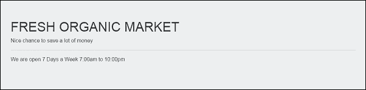

您可以使用`jumbotron-fluid`类和`container`或`container-fluid`类来强制 Jumbotron 使用整个页面的宽度。

我在 Jumbotron 中使用了标准的 HTML 标记元素，但使用不同的样式可能会更好。

## 排版

在上述代码中，我们使用了没有任何类的文本元素，以查看 Bootstrap 如何在页面上呈现它们。它使用全局默认的`font-size`为`16px`和`line-height1,5`。`Helvetica Neue，Helvetica，Arial，Sans Serf`是 Bootstrap 4 的默认`font-family`。每个元素都有一个`box-sizing`，以避免由于填充或边框而超出宽度。段落元素的底部边距为`1rem`。页面声明了白色的`background-color`。任何链接到 Bootstrap 4 样式表的页面都会使用这些页面范围的默认值。

### 标题

所有标题元素，`<h1>`到`<h6>`，都具有`500`的权重和`1.1`的`line-height`。Bootstrap 的开发人员已经从中删除了`margin-top`，但为了方便间距，添加了`0.5rem`的`margin-bottom`。

在需要显示一些内联文本的情况下，您可以使用`h1`到`h6`类来样式化模仿标题的元素：

```ts
<p class="h1">.h1 (Semibold 36px)</p> 
<p class="h2">.h2 (Semibold 30px)</p> 
<p class="h3">.h3 (Semibold 24px)</p> 
<p class="h4">.h4 (Semibold 18px)</p> 
<p class="h5">.h5 (Semibold 14px)</p> 
<p class="h6">.h6 (Semibold 12px)</p> 

```

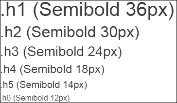

### 子标题

如果您需要包含次级标题或比原始文本小的文本，可以使用`<small>`标签：

```ts
<h1>Heading 1 <small>Sub-heading</small></h1> 
<h2>Heading 2 <small>Sub-heading</small></h2> 
<h3>Heading 3 <small>Sub-heading</small></h3> 
<h4>Heading 4 <small>Sub-heading</small></h4> 
<h5>Heading 5 <small>Sub-heading</small></h5> 
<h6>Heading 6 <small>Sub-heading</small></h6> 

```

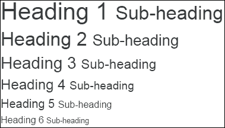

我们可以使用`text-muted`类显示淡化和较小的文本：

```ts
<h3> 
  The heading 
  <small class="text-muted">with faded secondary text</small> 
</h3> 

```

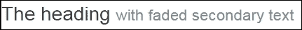

### 显示标题

当标准标题不够用，您需要引起用户对特殊事物的注意时，我建议使用`display-*`类。有四种不同的大小，这意味着您可以使用四种不同的样式呈现`<h1>`元素：

```ts
<h1 class="display-1">Display 1</h1> 
<h1 class="display-2">Display 2</h1> 
<h1 class="display-3">Display 3</h1> 
<h1 class="display-4">Display 4</h1> 

```

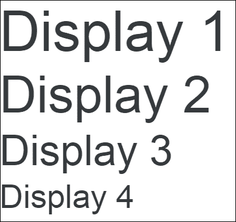

### 引导

我们可以将`lead`类添加到任何段落中，使其与其他文本脱颖而出：

```ts
<p class="lead"> 
This is the article lead text. 
</p> 
<p> 
This is the normal size text. 
</p> 

```

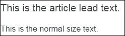

让我们更新 Jumbotron 组件，使其看起来更好：

```ts
<div class="jumbotron"> 
  <h1 class="display-3">FRESH ORGANIC MARKET</h1> 
  <p class="lead">Nice chance to save a lot of money</p> 
  <hr class="m-y-2"> 
  <p>We are open 7 Days a Week 7:00am to 10:00pm</p> 
</div> 

```

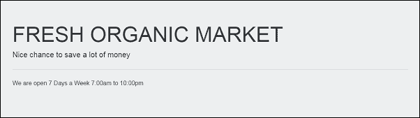

营销信息看起来很漂亮，口号也很到位，但我们没有改变顾客的基本信息，因为没有必要。

### 内联文本元素

这是一组不同的样式，我们可以将其用作内联文本：

```ts
<p>The **mark** 

 tag is <mark>highlight</mark> text.</p> 
<p>The **del** 

 tag marks <del>text as deleted.</del></p> 
<p>The **s** 

 tag marks <s> text as no longer accurate.</s></p> 
<p>The **ins** 

 tag marks <ins>text as an addition to the document.</ins></p> 
<p>The **u** 

 tag renders <u>text as underlined.</u></p> 
<p>The **small** 

 tag marks <small>text as fine print.</small></p> 
<p>The **strong** 

 tag renders <strong>text as bold.</strong></p> 
<p>The **em** 

 tag mark renders <em>text as italicized.</em></p> 

```

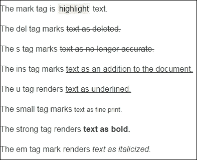

### 缩写

要将任何文本标记为缩写或首字母缩略词，我们可以使用`<abbr>`标签。当您将鼠标悬停在其上时，它会突出显示其他文本，并提供扩展版本，帮助您使用`title`属性：

```ts
<p>The Ubuntu is <abbr >OS</abbr>.</p> 

```

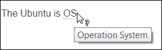

`initialism`类使缩写字体略小。

### 块引用

我们可以使用`blockquote`标签和类在文档中引用另一个来源的内容：

```ts
< **blockquote** 

 class=" **blockquote** 

"> 
  <p>Love all, trust a few, do wrong to none.</p> 
</ **blockquote** 

> 

```

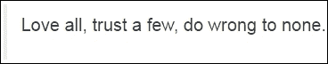

此外，我们可以使用嵌套的`footer`和`cite`标签在`blockquote`底部添加作者。

```ts
<blockquote class="blockquote"> 
  <p>Love all, trust a few, do wrong to none.</p> 
  < **footer** 

 class="blockquote-footer">William Shakespeare in  
    < **cite** 

>All's Well That Ends Well</ **cite** 

> 
  </ **footer** 

> 
</blockquote> 

```

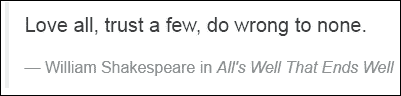

您喜欢将块引用对齐到右侧吗？让我们使用`blockquote-reverse`类：

```ts
<blockquote class="blockquote blockquote-reverse"> 
  <p>Love all, trust a few, do wrong to none.</p> 
  <footer class="blockquote-footer">William Shakespeare in  
    <cite>All's Well That Ends Well</cite> 
  </footer> 
</blockquote> 

```

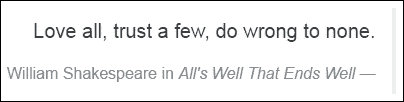

### 地址

我们使用`address`元素在页面底部显示客户联系信息：

```ts
<footer class="footer"> 
  <div class="container"> 
    <address> 
      <strong>Contact Info</strong><br> 
      0000 Market St, Suite 000, San Francisco, CA 00000,
      (123) 456-7890, <a href="mailto:#">support@dream-bean.com</a> 
    </address> 
  </div> 
</footer> 

```

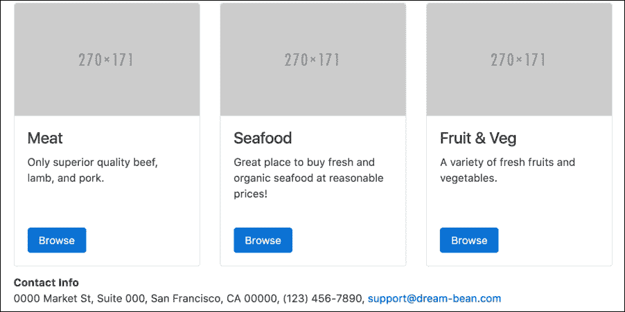

### 注意

您可以在`chapter_3/2.ecommerce-jumbotron`文件夹中找到源代码

## 使用轮播显示内容

我们可以使用的另一个组件来吸引顾客的额外注意是旋转木马。它帮助我们创建优雅和交互式的图像或文本幻灯片。旋转木马是不同组件的组合，每个组件都扮演着非常具体的角色。

### 旋转木马容器

容器包裹所有其他内容，因此插件 JavaScript 代码可以通过`carousel`和`slide`类找到它。它必须具有旋转木马控件和内部组件正常运行所需的`id`。如果希望旋转木马在页面加载时开始动画，请使用`data-ride="carousel"`属性：

```ts
<div id=" **welcome-products** 

"  
     class=" **carousel slide** 

" data-ride=" **carousel** 

"> 

```

### 旋转木马内部

该容器将旋转木马项目作为可滚动内容，并使用`carousel-inner`类对其进行标记：

```ts
<div class=" **carousel-inner** 

" role="listbox"> 

```

### 旋转木马项目

`carousel-item`类保持幻灯片的内容，例如图像、文本或它们的组合。您需要使用`carousel-caption`容器包装基于文本的内容。使用`active`类将项目标记为已初始化，没有它，旋转木马将不可见。

```ts
<div class=" **carousel-item active** 

"> 
   
  <div class=" **carousel-caption** 

"> 
    <h3>Bread & Pastry</h3> 
  </div> 
</div> 

```

### 旋转木马指示器

旋转木马可能有指示器来显示和控制幻灯片播放，可以通过单击或轻触来选择特定幻灯片。通常，它是一个带有`carousel-indicators`类的有序列表。列表上的每个项目都必须具有保持旋转木马容器`id`的`data-target`属性。因为它是一个有序列表，所以不需要对其进行排序。如果需要在当前位置周围改变幻灯片位置，请使用`data-slide`属性来接受关键字`prev`和`next`。另一个选项是使用`data-slide-to`属性传递幻灯片的索引。使用`active`类来标记初始指示器：

```ts
<ol class=" **carousel-indicators** 

"> 
  <li data-target=" **#welcome-products" data-slide-to="0"** 

      class="active"></li> 
  <li data-target= **"#welcome-products" data-slide-to="1"** 

></li> 
  <li data-target= **"#welcome-products" data-slide-to="2"** 

></li> 
</ol> 

```

### 旋转木马控件

您可以使用另一种方式通过旋转木马控件按钮显示幻灯片。在这种情况下，两个锚元素扮演按钮的角色。将特定按钮与`carousel-control`一起添加`left`或`right`类。在`href`属性中使用旋转木马容器`id`作为链接。将`prev`或`next`设置为`data-slide`属性：

```ts
<a class=" **left carousel-control** 

" href= **"#welcome-products"** 

   role= **"button" data-slide="prev"** 

> 
  <span class="icon-prev" aria-hidden="true"></span> 
  <span class="sr-only">Previous</span> 
</a> 
<a class=" **right carousel-control** 

" href= **"#welcome-products"** 

   role= **"button" data-slide="next"** 

> 
  <span class="icon-next" aria-hidden="true"></span> 
  <span class="sr-only">Next</span> 
</a> 

```

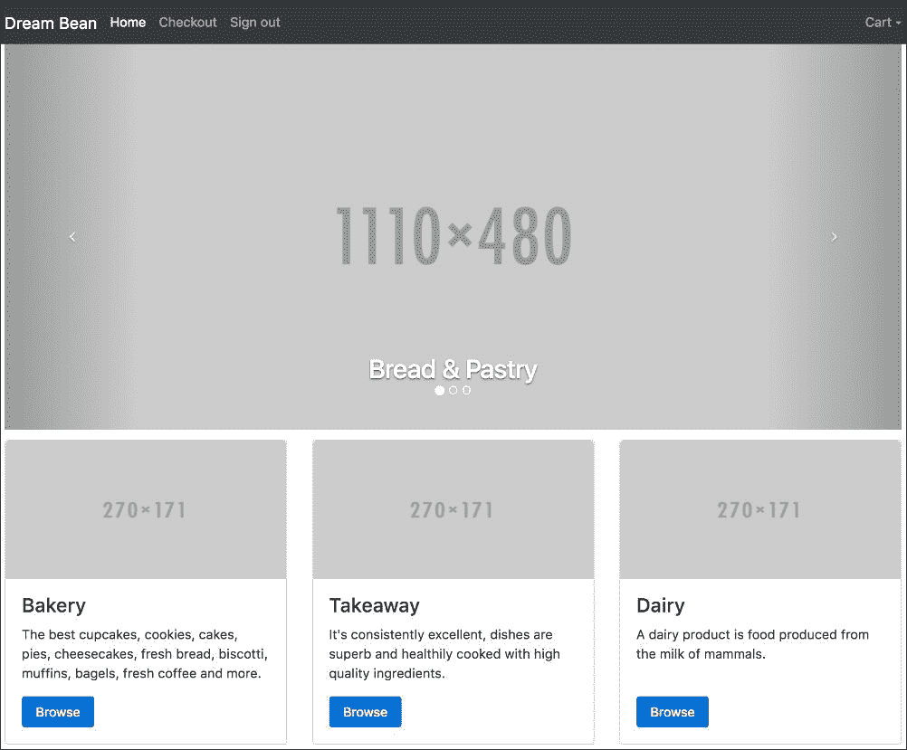

让我们比较欢迎页面的最终结果和线框图：

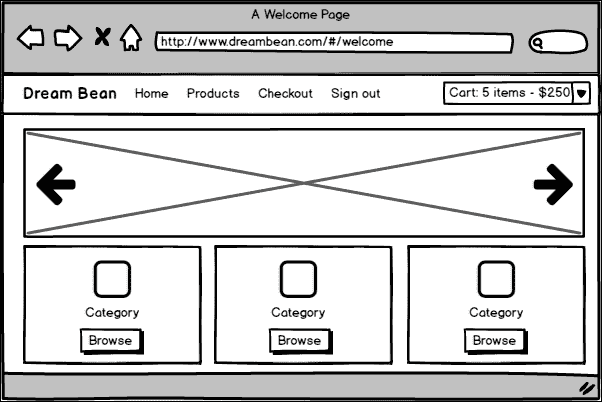

欢迎页面的线框图

正如您所看到的，它们看起来完全相同。实际上，我们已经完成了欢迎页面，现在是时候继续进行产品页面的开发了。

### 注意

您可以在`chapter_3/3.ecommerce-carousel`文件夹中找到源代码

# 产品页面布局

让我们看一下产品页面的线框图，并想象将其分成行和列，就像我们为欢迎页面所做的那样：

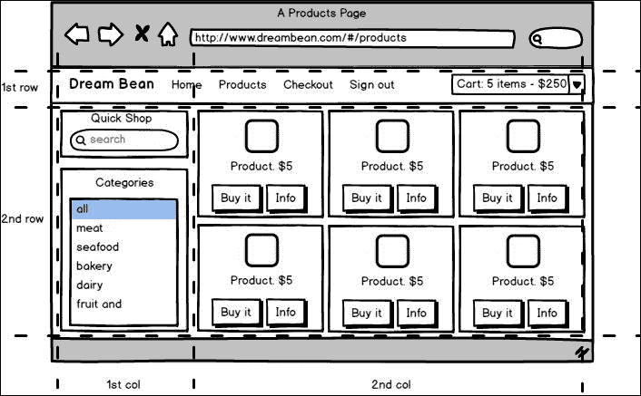

第一行仍然包含我们的导航标题，但我把其他内容放到了另一行。有两列，一列是**快速购物**和**分类**，另一列是一组产品。为什么我要把产品页面分成这样？答案很简单。Bootstrap 总是先按行渲染内容，然后再按列渲染。在布局较小的设备上，第一行的标题通常会折叠成汉堡菜单。在底部，它会显示第二行，包括**快速购物**，**分类**，以及垂直对齐的一组产品。

我克隆了上一个项目并清理了代码，但保留了导航标题和页脚，因为我不想将产品页面的开发与原始页面混在一起。让我们先讨论第一列中的组件。

## 快速购物组件

这个组件只是一个带有按钮的搜索输入。我没有实现业务逻辑，只是设计页面。这是基于我们在第二章中探讨过的卡片元素，*使用 Bootstrap 组件*。我想使用输入组件，让我们看看它能做什么。

## 输入组

这是一组表单控件和文本组合在一行中。它旨在通过在输入字段的两侧添加文本、按钮或按钮组并将它们对齐来扩展表单控件。创建输入组件非常容易。只需用标有`input-group`类的元素包装`input`，并附加或前置另一个带有`input-group-addon`类的元素。您可以在任何表单之外使用输入组，但我们需要用`form-control`类标记输入元素，以使其宽度达到 100%。

### 注意

仅对文本输入元素使用输入组。

### 文本附加

这是一个带有附加组件的文本字段的示例：

```ts
<div class="input-group"> 
  <input type="text" class="form-control"  
         placeholder="Pricein USD"> 
  <span class=" **input-group-addon** 

">.00</span> 
</div> 

```

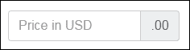

另一个带有前置附加组件的示例是：

```ts
<div class="input-group"> 
  <span class=" **input-group-addon** 

">https://</span> 
  <input type="text" class="form-control"  
         placeholder="Your address"> 
</div> 

```

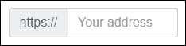

最后，我们可以将它们全部组合在一起：

```ts
<div class="input-group"> 
  <span class=" **input-group-addon** 

">$</span> 
  <input type="text" class="form-control"  
         placeholder="Price per unit"> 
  <span class=" **input-group-addon** 

">.00</span> 
</div> 

```

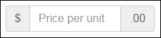

### 尺寸

有两个表单尺寸类，`input-group-lg`和`input-group-sm`，可以使输入组比标准尺寸更大或更小。你需要将其中一个应用到标有`input-group`类的元素上，其中的内容将自动调整大小：

```ts
<div class="input-group **input-group-lg** 

"> 
  <input type="text" class="form-control" 
         placeholder="Large"> 
  <span class="input-group-addon">.00</span> 
</div> 
<div class="input-group"> 
  <input type="text" class="form-control" 
         placeholder="Standard"> 
  <span class="input-group-addon">.00</span> 
</div> 
<div class="input-group **input-group-sm** 

"> 
  <input type="text" class="form-control" 
         placeholder="Small"> 
  <span class="input-group-addon">.00</span> 
</div> 

```

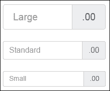

### 复选框和单选按钮附件

我们可以使用复选框或单选按钮选项来代替文本附件：

```ts
<div class="input-group"> 
 **<span class="input-group-addon">** 

 **<input type="checkbox">** 

 **</span>** 

  <input type="text" class="form-control" 
         placeholder="Select"> 
</div> 

<div class="input-group"> 
 **<span class="input-group-addon">** 

 **<input type="radio">** 

 **</span>** 

  <input type="text" class="form-control" 
         placeholder="Choose"> 
</div> 

```

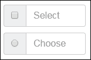

### 按钮附件

最常见的元素是按钮，你可以在输入组中使用它们。只需增加一层额外的复杂性：

```ts
<div class="input-group"> 
  <input type="text" class="form-control"  
         placeholder="Search for..."> 
 **<span class="input-group-btn">** 

 **<button class="btn btn-secondary" type="button">Go!</button>** 

 **</span>** 

</div> 

```


### 下拉菜单附件

我们可以使用按钮来显示下拉菜单。我们稍后在本章中会讲到下拉菜单。以下代码演示了如何使用下拉菜单：

```ts
<div class="input-group"> 
  <input type="text" class="form-control"> 
  <div class="input-group-btn"> 
    <button type="button"  
            class="btn btn-secondary dropdown-toggle" 
            data-toggle="dropdown"> 
      Action 
    </button> 
    <div class="dropdown-menu dropdown-menu-right"> 
      <a class="dropdown-item" href="#">Action</a> 
      <a class="dropdown-item" href="#">Another action</a> 
      <a class="dropdown-item" href="#">Something else here</a> 
      <div role="separator" class="dropdown-divider"></div> 
      <a class="dropdown-item" href="#">Separated link</a> 
    </div> 
  </div> 
</div> 

```

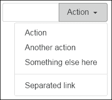

### 分段按钮

有时将按钮和下拉菜单分开可能会很有用，这样布局也会更清晰：

```ts
<div class="input-group"> 
  <input type="text" class="form-control"> 
  <div class="input-group-btn"> 
    <button type="button" class="btn btn-secondary">Action</button> 
    <button type="button" class="btn btn-secondary dropdown-toggle" 
            data-toggle="dropdown"> 
      <span class="sr-only">Toggle Dropdown</span>&nbsp; 
    </button> 
    <div class="dropdown-menu dropdown-menu-right"> 
      <a class="dropdown-item" href="#">Action</a> 
      <a class="dropdown-item" href="#">Another action</a> 
      <a class="dropdown-item" href="#">Something else here</a> 
      <div role="separator" class="dropdown-divider"></div> 
      <a class="dropdown-item" href="#">Separated link</a> 
    </div> 
  </div> 
</div> 

```

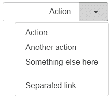

现在我们知道如何使用输入组，让我们创建一个**快速购物**组件：

```ts
<div class="container"> 
  <div class="row"> 
    <div class="col-md-3"> 
      <div class="card"> 
        <div class="card-header"> 
          Quick Shop 
        </div> 
        <div class="card-block"> 
          <div class="input-group"> 
            <input type="text" class="form-control"  
                   placeholder="Search for..."> 
            <span class="input-group-btn"> 
              <button class="btn btn-secondary"  
                      type="button">Go!</button> 
            </span> 
          </div> 
        </div> 
      </div> 
      <!-- /.card --> 
    </div> 
    <!-- /.col --> 
  </div> 
  <!-- /.row --> 
</div> 
<!-- /.container --> 

```

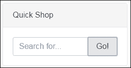

### 注意

你可以在`chapter_3/4.ecommerce-input-group`文件夹中找到源代码。

## 类别组件

类别组件位于**快速购物**下面。我想使用列表组件来保存顾客可以选择的类别。

## 列表组

这是一个灵活的组件，用于轻松显示无序元素列表，比如简单的项目或自定义内容。只需用`list-group`类标记任何无序列表元素，并用`list-group-item`标记每个项目，就可以快速创建**列表组**组件：

```ts
<ul class="list-group"> 
  <li class="list-group-item">Apple</li> 
  <li class="list-group-item">Banana</li> 
  <li class="list-group-item">Grapefruit</li> 
  <li class="list-group-item">Carrot</li> 
</ul> 

```

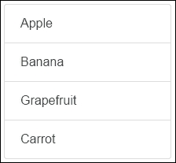

### 带标签的列表

有时我们需要显示关于每个项目的更多信息，比如数量、活动等。为此，我们可以为每个项目和列表组自动添加**标签**，以将其定位到右侧：

```ts
<ul class="list-group"> 
  <li class="list-group-item"> 
    <span class="tag tag-default tag-pill  
                 pull-xs-right">15</span> 
    Apple 
  </li> 
  <li class="list-group-item"> 
    <span class="tag tag-default tag-pill  
                 pull-xs-right">5</span> 
    Banana 
  </li> 
  <li class="list-group-item"> 
    <span class="tag tag-default tag-pill  
                 pull-xs-right">0</span> 
    Grapefruit 
  </li> 
  <li class="list-group-item"> 
    <span class="tag tag-default tag-pill  
                 pull-xs-right">3</span> 
    Carrot 
  </li> 
</ul> 

```

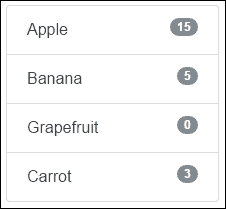

### 链接列表组

我们可以快速创建一个带有链接列表组件的垂直菜单。这种列表基于`div`标签而不是`ul`。这个列表的整个项目都是一个锚元素，它可以是：

+   可点击

+   可悬停

+   通过`active`类进行突出显示

+   通过同名类进行禁用

```ts
<div class="list-group"> 
  <a href="#" class="list-group-item">Apple</a> 
  <a href="#" class="list-group-item active">Banana</a> 
  <a href="#" class="list-group-item **disabled** 

">Grapefruit</a> 
  <a href="#" class="list-group-item">Carrot</a> 
</div> 

```

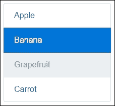

### 按钮列表组

如果您愿意，可以使用按钮代替锚元素，然后您需要更改每个项目的标签名称，并在其中添加`list-group-item-action`类。我们可以使用`active`或`disabled`使项目显示不同：

```ts
<div class="list-group"> 
  <button type="button" class="list-group-item list-group-item-action active ">Apple</button> 
  <button type="button" class="list-group-item item list-group-item-action ">Banana</button> 
  <button type="button" class="list-group-item item list-group-item-action disabled">Grapefruit</button> 
  <button type="button" class="list-group-item item list-group-item-action ">Carrot</button> 
</div> 

```

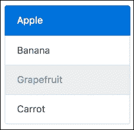

### 注意

在列表组中使用标准的`btn`类是被禁止的。

### 上下文类

您还可以使用上下文类样式化单独的列表项。只需将上下文类后缀添加到`list-group-item`类中。具有`active`类的项目会显示为变暗版本：

```ts
<div class="list-group"> 
  <a href="#" class="list-group-item  
           list-group-item-success">Apple</a> 
  <a href="#" class="list-group-item  
           list-group-item-success active">Watermelon</a> 
  <a href="#" class="list-group-item  
           list-group-item-info">Banana</a> 
  <a href="#" class="list-group-item  
           list-group-item-warning">Grapefruit</a> 
  <a href="#" class="list-group-item  
           list-group-item-danger">Carrot</a> 
</div> 

```

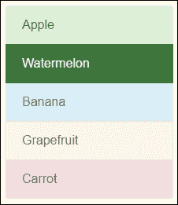

### 自定义内容

最后，您可以在列表组件的每个项目中添加 HTML，并使用锚元素使其可点击。Bootstrap 4 为标题和文本内容提供了`list-group-item-heading`和`list-group-item-text`类。具有`active`类的项目会显示为自定义内容的变暗版本：

```ts
<div class="list-group"> 
  <a href="#" class="list-group-item list-group-item-success"> 
    <h4 class=" **list-group-item-heading** 

">Apple</h4> 
    <p class=" **list-group-item-text** 

">It is sweet.</p> 
  </a> 
  <a href="#" class="list-group-item list-group-item-success **active** 

"> 
    <h4 class=" **list-group-item-heading** 

">Watermelon</h4> 
    <p class=" **list-group-item-text** 

"> 
      It is a fruit and a vegetable. 
    </p> 
  </a> 
</div> 

```

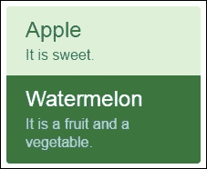

现在，是时候创建我们的**类别**组件了：

```ts
<div class="card"> 
  <div class="card-header"> 
    Categories 
  </div> 
  <div class="card-block"> 
    <div class="list-group"> 
      <a href="#" class="list-group-item">All</a> 
      <a href="#" class="list-group-item">Meat</a> 
      <a href="#" class="list-group-item">Seafood</a> 
      <a href="#" class="list-group-item">Bakery</a> 
      <a href="#" class="list-group-item">Dairy</a> 
      <a href="#" class="list-group-item">Fruit & Vegetables</a> 
    </div> 
  </div> 
</div> 

```

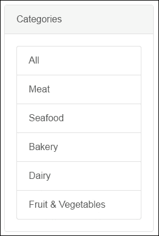

我们已经完成了第一列，现在继续开发第二列，其中包含一组产品的网格。

### 注意

您可以在`chapter_3/5.ecommerce-list-group`文件夹中找到源代码。

## 创建产品网格

我们需要在第二列内显示一组产品的行和列网格。

### 嵌套行

我们可以在任何列内嵌套额外的行，以创建类似于我们所拥有的更复杂的布局：

```ts
<div class="col-md-9"> 
  <div class="row"> 
    <div class="col-xs-12 col-sm-6 col-lg-4"> 
      <!-- The Product 1 --> 
    </div> 
    <!-- /.col --> 
    <div class="col-xs-12 col-sm-6 col-lg-4"> 
      <!-- The Product 2 --> 
    </div> 
    <!-- /.col --> 
    <div class="col-xs-12 col-sm-6 col-lg-4"> 
      <!-- The Product N --> 
    </div> 
    <!-- /.col --> 
  </div> 
</div> 

```

我们在一行内创建所需的列数，Bootstrap 会根据视口大小正确显示它们：

+   在超小视口上，一列占据整个大小

+   小视口上的两列

+   大型视口上的三列

## 产品组件

以类似的方式，我们使用卡片在产品组件中显示信息和控件：

```ts
<div class="card"> 
   
  <div class="card-block text-xs-center"> 
    <h4 class="card-title">Product 1</h4> 
    <h4 class="card-subtitle"> 
      <span class="tag tag-success">$10</span> 
    </h4> 
    <hr> 
    <div class="btn-group" role="group"> 
      <button class="btn btn-primary">Buy</button> 
      <button class="btn btn-info">Info</button> 
    </div> 
  </div> 
</div> 
<!-- /.card --> 

```

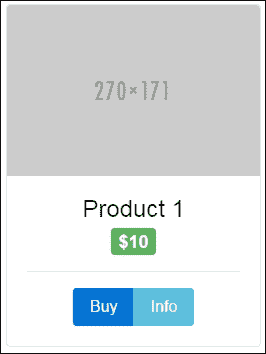

让我们稍微谈谈我们在这里使用的元素。

### 注意

您可以在`chapter_3/6.ecommerce-grid-in-grid`文件夹中找到源代码。

## 图片

在卡片元素中使用图片时，我认为讨论具有响应行为和图片形状的图片是个好主意。

### 响应式图片

您可以使用`img-fluid`类使任何图片具有响应性。它会将以下内容应用于图片，并与父元素一起缩放：

+   将`max-width`属性设置为`100%`

+   将`height`属性设置为`auto`

```ts
<div class="container"> 
  <div class="row"> 
    <div class="col-md-3"> 
       
    </div> 
  </div> 
</div> 

```

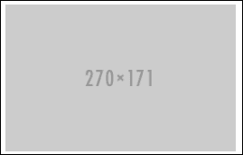

### 图片形状

在需要呈现图像的情况下：

+   使用`img-rounded`类来实现圆角

+   在圆圈内，使用`img-circle`类

+   使用`img-thumbnail`类作为缩略图

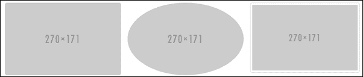

### 图像对齐

要水平对齐图像，我们可以使用文本对齐或辅助浮动类：

+   在图片的父元素上使用`text-*-center`类来使其居中

+   在图像上应用`center-block`类可以使其居中

+   使用`pull-*-left`或`pull-*-right`类将图像浮动到左侧或右侧

```ts
<div class="container"> 
  <div class="row"> 
    <div class="col-md-6 table-bordered"> 
      This is text around pull image to left 
       
    </div> 
    <div class="col-md-6 table-bordered"> 
      This is text around pull image to right 
       
    </div> 
    <div class="col-md-6 table-bordered"> 
      This is text around center block image 
       
    </div> 
    <div class="col-md-6 **text-xs-center** 

 table-bordered"> 
      This is centered<br> 
       
    </div> 
  </div> 
</div> 

```

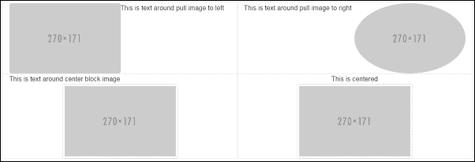

我在上面的代码中只使用了`table-border`类来显示边框。

## 标签

如果我需要在文本字符串中突出显示一些信息，我会使用标签。要创建一个标签，我需要将`tag`类与上下文`tag-*`一起应用到`span`元素上：

```ts
<div class="container"> 
  <div class="row"> 
    <div class="col-md-12"> 
      <h1>Example heading 
        <span class=" **tag tag-default** 

">Default</span> 
      </h1> 
      <h2>Example heading 
        <span class=" **tag tag-primary** 

">Primary</span> 
      </h2> 
      <h3>Example heading 
        <span class=" **tag tag-success** 

">Success</span> 
      </h3> 
      <h4>Example heading 
        <span class=" **tag tag-info** 

">Info</span> 
      </h4> 
      <h5>Example heading 
        <span class=" **tag tag-warning** 

">Warning</span> 
      </h5> 
      <h6>Example heading 
        <span class=" **tag tag-danger** 

">Danger</span> 
      </h6> 
    </div> 
  </div> 
</div> 

```

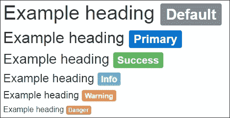

标签使用父元素的相对字体大小，因此它始终按比例缩放以匹配其大小。如果您需要标签看起来像徽章，请使用`tag-pill`类来实现：

```ts
<div class="container"> 
  <div class="row"> 
    <div class="col-md-12"> 
      <span class="label **label-pill** 

 label-default">Default</span> 
      <span class="label **label-pill** 

 label-primary">Primary</span> 
      <span class="label **label-pill** 

 label-success">Success</span> 
      <span class="label **label-pill** 

 label-info">Info</span> 
      <span class="label **label-pill** 

 label-warning">Warning</span> 
      <span class="label **label-pill** 

 label-danger">Danger</span> 
    </div> 
  </div> 
</div> 

```


## 按钮组

我们可以使用**按钮组**组件将按钮水平或垂直分组在一起。按钮默认是水平排列的。要创建一个按钮组，请在带有`btn-group`类的容器中使用带有`btn`类的按钮：

```ts
<div class="container"> 
  <div class="row"> 
    <div class="col-md-12"> 
      <div class=" **btn-group** 

" role="group"> 
        <button type="button" class=" **btn btn-default** 

">Left</button> 
        <button type="button" class=" **btn btn-secondary** 

">Middle</button> 
        <button type="button" class=" **btn btn-danger** 

">Right</button> 
      </div> 
    </div> 
  </div> 
</div> 

```

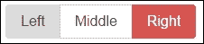

### 大小

有两种尺寸可以使按钮组件比标准尺寸更大或更小。将`btn-group-lg`或`btn-group-sm`类添加到按钮组件中，可以一次调整组中所有按钮的大小：

```ts
<div class="btn-group btn-group-lg" role="group"> 
  <button type="button" class="btn btn-default">Left</button> 
  <button type="button" class="btn btn-secondary">Middle</button> 
  <button type="button" class="btn btn-danger">Right</button> 
</div><br><br> 
<div class="btn-group" role="group"> 
  <button type="button" class="btn btn-default">Left</button> 
  <button type="button" class="btn btn-secondary">Middle</button> 
  <button type="button" class="btn btn-danger">Right</button> 
</div><br><br> 
<div class="btn-group btn-group-sm" role="group"> 
  <button type="button" class="btn btn-default">Left</button> 
  <button type="button" class="btn btn-secondary">Middle</button> 
  <button type="button" class="btn btn-danger">Right</button> 
</div> 

```

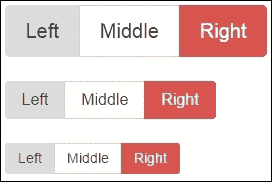

### 按钮工具栏

我们可以将按钮组合成一个更复杂的**按钮工具栏**：

```ts
<div class="btn-toolbar" role="toolbar"> 
  <div class="btn-group" role="group"> 
    <button type="button" class="btn btn-primary">Create</button> 
    <button type="button" class="btn btn-secondary">Edit</button> 
    <button type="button" class="btn btn-danger">Delete</button> 
  </div> 
  <div class="btn-group" role="group"> 
    <button type="button" class="btn btn-default">Fetch</button> 
  </div><br><br> 
</div> 

```

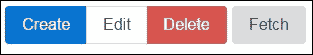

### 嵌套下拉菜单

我们可以将下拉菜单作为按钮组的一部分嵌套到另一个按钮组中：

```ts
<div class=" **btn-group** 

" role="group"> 
  <button type="button" class="btn btn-secondary">Create</button> 
  <button type="button" class="btn btn-secondary">Delete</button> 

  <div class=" **btn-group** 

" role="group"> 
    <button id=" **btnGroupDrop1** 

" type="button"  
            class="btn btn-secondary **dropdown-toggle** 

" 
            **data-toggle="dropdown"** 

 aria-haspopup="true"  
            aria-expanded="false"> 
      Actions 
    </button> 
    <div class=" **dropdown-menu** 

" aria-labelledby=" **btnGroupDrop1** 

"> 
      <a class="dropdown-item" href="#">Get One</a> 
      <a class="dropdown-item" href="#">Get Many</a> 
    </div> 
  </div> 
</div> 

```

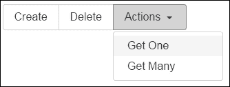

此外，您可以使用按钮组件创建一个分割下拉菜单组件：

```ts
<div class="btn-group" role="group"> 
  <button type="button" class="btn btn-secondary">Actions</button> 
  <button id="btnGroupDrop1" type="button"  
          class="btn btn-secondary dropdown-toggle" 
          data-toggle="dropdown" aria-haspopup="true"  
          aria-expanded="false"> 
    <span class="sr-only">Toggle Dropdown</span>&nbsp; 
  </button> 
  <div class="dropdown-menu" aria-labelledby="btnGroupDrop1"> 
    <a class="dropdown-item" href="#">Get One</a> 
    <a class="dropdown-item" href="#">Get Many</a> 
  </div> 
</div> 

```

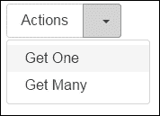

### 垂直按钮组

如果需要将按钮组垂直排列，请将`btn-group`替换为`btn-group-vertical`类：

```ts
<div class="btn-group-vertical" role="group"> 
  <button type="button" 
          class="btn btn-default">Left</button> 
  <button type="button" 
          class="btn btn-secondary">Middle</button> 
  <button type="button" 
          class="btn btn-danger">Right</button> 
</div> 

```

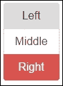

垂直按钮组不支持分割下拉菜单。

## 下拉菜单

我们经常谈论下拉菜单，让我们更仔细地看看它们。下拉菜单是一个用于显示链接列表的切换覆盖层。它是几个组件的组合。

### 下拉菜单容器

这个包装了所有其他元素。通常，它是一个带有`dropdown`类的`div`元素，或者另一个使用`position: relative`的元素。

### 下拉触发器

这是用户可以点击或点击以展开下拉菜单的任何项目。我们需要用`dropdown-toggle`类标记它，并设置`data-toggle="dropdown"`属性。

### 带有项目的下拉菜单

下拉菜单本身是具有`dropdown-item`类的元素的组合，包装器包含所有标记为`dropdown-menu`类的元素。这是一个无列表的组件。对于菜单项，您可以使用锚点或按钮元素：

```ts
<div class=" **dropdown** 

"> 
  <button class="btn btn-secondary **dropdown-toggle** 

" type="button" 
     id="dropdownMenu1" **data-toggle="dropdown"** 

 aria-haspopup="true" 
     aria-expanded="false"> 
    Action 
  </button> 
  <div class=" **dropdown-menu** 

" aria-labelledby="dropdownMenu1"> 
    <a class=" **dropdown-item** 

" href="#">Create</a> 
    <a class=" **dropdown-item** 

" href="#">Edit</a> 
    <a class=" **dropdown-item** 

" href="#">Delete</a> 
  </div> 
</div> 

```

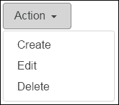

### 菜单对齐

下拉菜单默认向左对齐。如果需要向右对齐，则需要向其应用`dropdown-menu-right`类。我已经向父元素添加了`text-xs-right`类来将整个组件对齐到右侧：

```ts
<div class="col-md-3 **text-xs-right** 

"> 
  <div class="dropdown"> 
    <button class="btn btn-secondary dropdown-toggle"  
            type="button" id="dropdownMenu1"  
            data-toggle="dropdown" aria-haspopup="true"  
            aria-expanded="false"> 
      Action 
    </button> 
    <div class="dropdown-menu **dropdown-menu-right** 

"  
         aria-labelledby="dropdownMenu1"> 
      <a class="dropdown-item" href="#">Create</a> 
      <a class="dropdown-item" href="#">Edit</a> 
      <a class="dropdown-item" href="#">Delete</a> 
    </div> 
  </div> 
</div> 

```

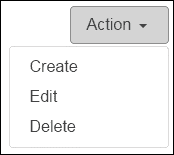

### 菜单标题和分隔符

下拉菜单可以有几个标题元素。您可以使用标题元素和`dropdown-header`类来添加它们：

```ts
<div class="dropdown"> 
  <button class="btn btn-secondary dropdown-toggle" type="button"  
          id="dropdownMenu1" data-toggle="dropdown"  
          aria-haspopup="true" aria-expanded="false"> 
    Action 
  </button> 
  <div class="dropdown-menu" aria-labelledby="dropdownMenu1"> 
    <h6 class="dropdown-header">Document</h6> 
    <a class="dropdown-item" href="#">Create</a> 
    <a class="dropdown-item" href="#">Edit</a> 
    <a class="dropdown-item" href="#">Delete</a> 
    <h6 class="dropdown-header">Print</h6> 
    <a class="dropdown-item" href="#">Print Now</a> 
    <a class="dropdown-item" href="#">Configuration</a> 
  </div> 
</div> 

```

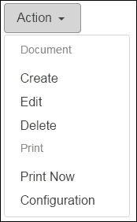

### 菜单分隔符

我们不仅可以使用标题，还可以使用分隔符来分隔菜单项的组。使用`dropdown-divider`类将菜单项标记为分隔符：

```ts
<div class="dropdown"> 
  <button class="btn btn-secondary dropdown-toggle" type="button"  
          id="dropdownMenu1" data-toggle="dropdown"  
          aria-haspopup="true" aria-expanded="false"> 
    Action 
  </button> 
  <div class="dropdown-menu" aria-labelledby="dropdownMenu1"> 
    <a class="dropdown-item" href="#">Create</a> 
    <a class="dropdown-item" href="#">Edit</a> 
    <a class="dropdown-item" href="#">Delete</a> 
    <div class=" **dropdown-divider** 

"></div> 
    <a class="dropdown-item" href="#">Print Now</a> 
    <a class="dropdown-item" href="#">Configuration</a> 
  </div> 
</div> 

```

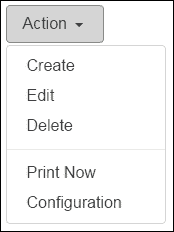

### 禁用菜单项

如果需要，我们可以通过`disabled`类禁用菜单项：

```ts
<div class="dropdown"> 
  <button class="btn btn-secondary dropdown-toggle" type="button"  
          id="dropdownMenu1" data-toggle="dropdown"  
          aria-haspopup="true" aria-expanded="false"> 
    Action 
  </button> 
  <div class="dropdown-menu" aria-labelledby="dropdownMenu1"> 
    <a class="dropdown-item" href="#">Create</a> 
    <a class="dropdown-item" href="#">Edit</a> 
    <a class="dropdown-item **disabled** 

" href="#">Delete</a> 
  </div> 
</div> 

```

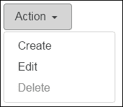

## 表格

有新的类来构建一致样式和响应式的表格。因为我们需要**表格**来设计购物车组件，我现在想看一下它。这是一个选择加入的功能，所以通过添加`table`类很容易将任何表格转换为 Bootstrap 表格。结果是我们有一个带有水平分隔线的基本表格：

```ts
<table class=" **table** 

"> 
  <thead> 
    <tr> 
      <th>#</th> 
      <th>First Name</th> 
      <th>Last Name</th> 
      <th>Username</th> 
    </tr> 
  </thead> 
  <tfoot> 
    <tr> 
      <th colspan="4">Number <strong>2</strong></th> 
    </tr> 
  </tfoot> 
  <tbody> 
    <tr> 
      <th scope="row">1</th> 
      <td>Mark</td> 
      <td>Otto</td> 
      <td>@mdo</td> 
    </tr> 
    <tr> 
      <th scope="row">2</th> 
      <td>Jacob</td> 
      <td>Thornton</td> 
      <td>@fat</td> 
    </tr> 
  </tbody> 
</table>  

```

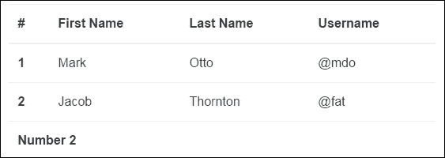

### table-inverse

`table-inverse`类反转了表格的颜色：

```ts
<table class="table **table-inverse** 

"> 

```

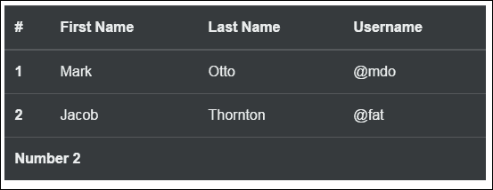

### 条纹行

我们可以使用`table-striped`类改变行的背景颜色：

```ts
<table class="table **table-striped** 

"> 

```

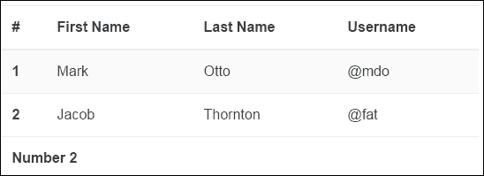

### 边框表

如果需要四周都有边框的表格，请使用`table-bordered`类：

```ts
<table class="table **table-bordered** 

"> 

```


### 使行可悬停

在鼠标悬停在表格行上时实现*悬停*效果，请使用`table-hover`类：

```ts
<table class="table **table-hover** 

"> 

```


### 表头选项

有两个类可以改变`table`的`thead`元素。添加`thead-default`类可以应用略带灰色背景颜色：

```ts
<table class="table"> 
  <thead class=" **thead-default** 

"> 

```


`thead-inverse`类可以反转`thead`的文本和背景颜色：

```ts
<table class="table"> 
  <thead class=" **thead-inverse** 

"> 

```


### 使表格更小

我们可以用`table-sm`类将表格的填充减半，使其变小：

```ts
<table class="table table-sm"> 

```


### 上下文类

有五个上下文类可以应用于单独的行或单元格：`table-active`、`table-success`、`table-info`、`table-warning`和`table-danger`。

### 响应式表格

响应式表格支持在小型和超小型设备（小于 768px）上的水平滚动。在大于小型的设备上，你不会看到任何区别。用带有`table-responsive`类的`div`元素包裹表格，就可以实现这种效果：

```ts
<div class="table-responsive"> 
  <table class="table"> 
    ... 
  </table> 
</div> 

```

### 重排表格

有一个`table-reflow`类可以帮助表格内容重新流动：

```ts
<table class="table **table-reflow** 

"> 
  <thead> 
    <tr> 
      <th>#</th> 
      <th>First Name</th> 
      <th>Last Name</th> 
      <th>Username</th> 
    </tr> 
  </thead> 
  <tbody> 
    <tr> 
      <th scope="row">1</th> 
      <td>Mark</td> 
      <td>Otto</td> 
      <td>@mdo</td> 
    </tr> 
    <tr> 
      <th scope="row">2</th> 
      <td>Jacob</td> 
      <td>Thornton</td> 
      <td>@fat</td> 
    </tr> 
  </tbody> 
</table> 

```


## 购物车组件

我们还没有触及产品页面线框上的最后一个组件：购物车。这是购物车信息和下拉菜单的结合，包含顾客添加到购物车的商品表格：

我们将购物车信息显示为按钮文本：

```ts
<button class="btn btn-primary dropdown-toggle" type="button"  
        id="cartDropdownMenu" data-toggle="dropdown"  
        aria-haspopup="true" aria-expanded="false"> 
          Cart: 2 item(s) - $20.00 
</button> 

```

我使用了一个反转的、有边框的表格来打印顾客添加到购物车的一组产品：

```ts
<div class="dropdown-menu dropdown-menu-right"  
     aria-labelledby="cartDropdownMenu"> 
  <table class="table table-bordered table-inverse"> 
   <thead> 
     <tr> 
       <th>Name</th><th>Amount</th><th>Qty</th><th>Sum</th> 
     </tr> 
   </thead> 
   <tfoot> 
     <tr> 
       <td colspan="4" style="text-align:center"> 
         Total:<strong>$20.00</strong><br> 
         <div class="btn-group"> 
           <button class="btn btn-primary">View Cart</button> 
           <button class="btn btn-success">Checkout</button> 
          </div> 
        </td> 
      </tr> 
    </tfoot> 
    <tbody> 
      <tr> 
        <td >Product 1</td><td >$10</td><td >x1<br> 
          <span class="delete-cart">Del</span> 
        </td> 
        <td >$10.00</td> 
      </tr> 
      <tr> 
        <td >Product 2</td><td >$5.00</td><td >x2<br> 
          <span class="delete-cart">Del</span> 
        </td> 
        <td >$10.00</td> 
      </tr> 
    </tbody> 
  </table> 
</div> 

```

我结合了我们学到的一切，现在产品页面看起来是这样的：


### 注意

你可以在`chapter_3/7.ecommerce-dropdown`文件夹中找到源代码。

# 总结

在本章中，我们涵盖了很多内容，现在是时候中断我们的旅程，休息一下，回顾一切了。

Bootstrap 让我们很容易地用 Jumbotron 和轮播幻灯片抓住了顾客的注意力。

我们还研究了 Bootstrap 中包含的强大响应式网格系统，并创建了一个简单的两列布局。在这个过程中，我们了解了五种不同的列类前缀，还嵌套了我们的网格。为了调整我们的设计，我们发现了一些框架中包含的辅助类，让我们能够浮动、居中和隐藏元素。

在本章中，我们详细了解了如何在项目中使用输入、按钮和列表组。像下拉菜单和表格这样简单但强大的组件帮助我们更快速、更高效地创建我们的组件。

在第四章 *创建模板*中，我们将更深入地探讨 Bootstrap 的基础知识，并继续构建我们在本章和上一章开始开发的项目。

在下一章中，读者将学习如何使用一些内置的 Angular 2 指令来创建 UI 模板。读者将熟悉模板语法。我们将向您展示如何在 HTML 页面中绑定属性和事件，并使用管道来转换显示。
