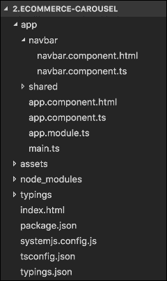

# 第四章：创建模板

在本章中，我们将学习如何使用内置的 Angular 2 指令构建 UI 模板。您将熟悉模板语法，以及如何在 HTML 页面中绑定属性和事件，并使用管道转换显示。当然，我们需要讨论 Angular 2 背后的设计原则。

在本章结束时，您将对以下内容有扎实的理解：

+   模板表达式

+   各种绑定类型

+   输入和输出属性

+   使用内置指令

+   本地模板变量

+   管道和 Elvis 运算符

+   自定义管道

+   设计应用程序的组件

# 深入了解 Angular 2

我们已经读了三章，但还没有涉及 Angular 2。我认为现在是时候邀请 Angular 2 上台，演示这个框架如何帮助我们创建项目组件。正如我在第一章中提到的，*说你好！*，Angular 2 的架构建立在标准 Web 组件的基础上，因此我们可以定义自定义 HTML 选择器并对其进行编程。这意味着我们可以创建一组 Angular 2 元素来在项目中使用。在之前的章节中，我们设计并开发了两个页面，您可以在那里找到许多重复的标记，因此我们也可以在那里重用我们的 Angular 2 组件。

让我们开始：

+   打开终端，创建名为`ecommerce`的文件夹并进入

+   将项目的内容从文件夹`chapter_4/1.ecommerce-seed`复制到新项目中

+   运行以下脚本以安装`npm`模块：

```ts
 **npm install** 

```

+   使用以下命令启动 TypeScript 监视器和 lite 服务器：

```ts
 **npm run start** 

```

此脚本打开 Web 浏览器并导航到项目的欢迎页面。现在打开 Microsoft Visual Studio 代码并从`app`文件夹中打开`app.component.html`。我们准备分析欢迎页面。

# 欢迎页面分析

欢迎页面的结构相当简单，因此我想创建以下 Angular 2 组件，以封装当前标记和未来的业务逻辑：

+   带有菜单的`Navbar`

+   基于 carousel Bootstrap 组件的幻灯片放映

+   基于 card Bootstrap 组件的产品网格

在开发项目时，我将遵循 Angular 2 *风格指南*（[`angular.io/docs/ts/latest/guide/style-guide.html`](https://angular.io/docs/ts/latest/guide/style-guide.html)），以使我们的应用代码更清洁、易于阅读和维护。我建议在你的计划中遵循我的示例，否则，开发结果可能是不可预测的，而且成本极高。

## 单一职责原则

我们将在项目的所有方面应用**单一职责原则**，因此每当我们需要创建一个组件或服务时，我们将为其创建新文件，并尽量保持在最多 400 行代码内。保持一个文件中只有一个组件的好处是显而易见的：

+   使代码更具可重用性，减少错误

+   易于阅读、测试和维护

+   防止与团队在源代码控制中发生冲突

+   避免不必要的代码耦合

+   组件路由可以在运行时进行惰性加载

## 命名约定

命名约定对于可读性和可维护性至关重要是公开的。能够找到文件并理解其包含的内容可能会对未来的开发产生重大影响，因此我们应该在命名和组织文件时保持一致和描述性，以便一目了然地找到内容。约定包括以下规则：

+   所有功能的推荐模式描述了名称，然后是其类型：`feature.type.ts`

+   描述性名称中的单词应该用破折号分隔：`feature-list.type.ts`

+   其中包括`service`、`component`、`directive`和`pipe`等类型的命名是众所周知的：`feature-list.service.ts`

## 桶

有桶模块——导入、聚合和重新导出其他模块的 TypeScript 文件。它们有一个目的——减少代码中的`import`语句数量。它们提供了一个一致的模式，从一个文件夹中引入桶中导出的所有内容。这个文件的常规名称是`index.ts`。

# 应用程序结构

我们将应用代码保存在`app`文件夹中。为了方便快速访问文件，建议尽可能保持扁平的文件夹结构，直到创建新文件夹有明显的价值为止。

## 按功能划分的文件夹结构

对于小型项目，你可以将所有文件保存在`app`文件夹中。我们的项目有许多功能，所以我们将每个功能放在它们的文件夹中，包括 TypeScript、HTML、样式表和规范文件。每个文件夹的名称代表它所具有的功能。

## 共享文件夹

有一些功能我们可以在多个地方使用。最好将它们移动到`shared`文件夹中，并根据需要将它们分开放置到文件夹中。如果项目中存在功能，请定义整体布局并将其保存在这里。

# 导航组件

整个应用程序需要一个导航组件，因此我们需要在`navbar`文件夹中创建`navbar.component.ts`和`navbar.component.html`文件。以下是我们项目的文件夹结构：



打开`navbar.component.ts`文件，并粘贴以下内容：

```ts
import { Component } from '@angular/core'; 

@Component({ 
  selector: 'db-navbar', 
  templateUrl: 'app/navbar/navbar.component.html' 
}) 
export class NavbarComponent {} 

```

在代码中，我们刚刚使用`@Component`装饰器定义了`NavbarComponent`类，告诉 Angular 该类是一个组件。我们在这里使用`import`语句来指定模块，TypeScript 编译器可以在其中找到`@Component`装饰器。

## 装饰器

装饰器是 ECMAScript 2016 的一个提议标准，并作为 TypeScript 的一个关键部分，定义了一种可重用的结构模式。每个装饰器都遵循`@expression`的形式。`expression`是一个在运行时评估的函数，提供有关装饰语句的信息，以改变其行为和状态。我们可以使用**装饰器函数**，它作为`expression`的评估结果返回，来自定义装饰器应用于声明的方式。可以将一个或多个装饰器附加到任何类、方法、访问器、属性或参数声明上。

`@Component`是一个类装饰器，应用于`NavbarComponent`类的构造函数，用于以下目的：

+   修改通过一组参数传递的类定义

+   添加建议的方法来组织组件的生命周期

我们必须为每个`@Component`装饰器定义`selector`参数，并使用`kebab-case`进行命名。*样式指南*建议通过`selector`将组件标识为元素，因为这为代表模板内容的组件提供了一致性。我使用`db-navbar`选择器名称来命名`NavigationComponent`，这是一个组合名称。

+   - `db`前缀显示了 Dream Bean 公司的名称缩写

+   `navbar`作为功能的名称

### 注意

始终使用前缀为选择器名称，以防止与其他库中的组件名称冲突。

模板是`@Component`装饰器的必需部分，因为我们将其与在页面上放置内容相关联。您可以在代码中提供`template`作为内联字符串或`templateUrl`作为外部资源。最好将模板的内容保留为外部资源：

+   当它有超过三行时

+   因为一些编辑器不支持内联模板的语法提示

+   因为不与内联模板混合在一起时，组件的逻辑更容易阅读

现在，打开`app.component.html`，找到顶部的`nav`元素。将其与内容剪切并粘贴到`navbar.component.html`中，并替换为：

```ts
<db-navbar></db-navbar> 

```

现在我们需要将`NavbarComponent`添加到`AppModule`中。打开`app.module.ts`，在那里添加对`NavbarComponent`的引用：

```ts
import { NgModule } from '@angular/core'; 
import { BrowserModule } from '@angular/platform-browser'; 

/* 
 * Components 
 */ 
import { AppComponent }  from './app.component'; 
 **import { NavbarComponent } from './navbar/navbar.component';** 

@NgModule({ 
  imports: [BrowserModule], 
  declarations: [AppComponent, **NavbarComponent** 

], 
  bootstrap: [AppComponent] 
}) 
export class AppModule { } 

```

## 组件树

每个 Angular 应用程序都有一个顶级元素来显示内容。在我们的应用程序中，它是一个`AppComponent`。在第三章中，*高级引导组件和自定义*，我们将欢迎页面拆分为引导组件，现在我们将它们移动到单独的模块中，并借助 Angular 框架将它们组合在一起。Angular 框架将应用程序呈现为组件树，从顶级元素、其子级以及更深层次。当我们需要向任何组件添加子级时，我们通过 Angular 模块的`declarations`属性进行注册。`NavigatorComponent`不属于任何 Angular 特性模块，因此我在最顶层模块`AppModule`中注册它。

让我们回到`navbar.component.html`，找到其他重复的元素。在显示导航栏的地方，我们有导航项：

```ts
<div class="nav navbar-nav"> 
  <a class="nav-item nav-link active" href="#"> 
    Home <span class="sr-only">(current)</span> 
  </a> 
  <a class="nav-item nav-link" href="#">Checkout</a> 
  <a class="nav-item nav-link" href="#">Create Account</a> 
  <a class="nav-item nav-link" href="#">Login</a> 
</div> 

```

因为在标记中有重复项，我建议创建一个链接数组并将其保存在`NavbarComponent`中作为属性，这样 Angular 可以在这里显示它们。

## NavItem 对象

我建议您创建一个单独的`NavItem`接口来保存有关导航的信息，因为每个项目都应该有`href`、`label`和`active`属性：

```ts
export interface NavItem { 
  // Navigation link 
  href: string; 
  // Navigation Label 
  label: string; 
  // Status of Navigation Item 
  active: boolean; 
} 

```

复制并粘贴代码到`NavbarComponent`类的顶部和最后一个导入语句之间。现在我们可以将`navItems`属性添加到`NavbarComponent`中，以公开导航项：

```ts
@Component({ 
  selector: 'db-navbar', 
  templateUrl: 'app/navbar/navbar.component.html' 
}) 
export class NavbarComponent { 
  // App name 
  appName: string = 'Dream Bean'; 
  // Navgation items 
  navItems: NavItem[] = [ 
    {href: '#', label: 'Home', active: true}, 
    {href: '#', label: 'Products', active: false}, 
    {href: '#', label: 'Checkout', active: false}, 
    {href: '#', label: 'Sign out', active: false} 
  ]; 
} 

```

我添加了`appName`属性，以便将应用程序名称从模板中排除。我们已经准备好使用数据绑定，但在这样做之前，让我们更仔细地看一下模板表达式和语句。

# 模板表达式

**模板表达式**是数据绑定的核心部分。其主要目的是执行表达式以产生一个值，以便 Angular 可以将其分配给 HTML 元素、指令或组件的绑定属性。我们可以以两种形式将表达式放入模板中：

+   在插值大括号内。Angular 首先评估大括号内的内容，然后转换为字符串：`{{a + 1 - getVal()}}.`

+   在引号内设置视图元素的属性为模板表达式的值时：`<button [disabled]="isUnchanged">Disabled</button>.`

模板表达式基于类似 JavaScript 的语言。我们可以使用任何 JavaScript 表达式，但有以下限制：

+   禁止使用`=`，`+=`，`-=`等赋值操作符

+   不要使用`new`关键字

+   不要创建带有`;`或`,`的链式表达式

+   避免使用递增`++`和递减`--`运算符

+   不支持位运算符`|`和`&`以及新的模板表达式运算符`|`和`?`

## 表达式上下文

模板表达式的内容仅属于组件实例，不能引用全局上下文中的变量或函数。组件实例提供了模板表达式可以使用的一切。通常是表达式的上下文，但也可以包括除组件以外的对象，如模板引用变量。

## 模板引用变量

**模板引用变量**是模板内的 DOM 元素或指令的引用。您可以将其用作任何本机 DOM 元素和 Angular 2 组件的变量。我们可以在某人、兄弟或任何子元素上引用它。我们可以以两种形式定义它：

+   在前缀哈希(`#`)和变量名内：

```ts
        <input **#product** 

 placeholder="Product ID"> 
        <button (click)="findProduct(product.value)">Find</button> 

```

+   使用`ref-`前缀和变量名的规范替代：

```ts
        <input **ref-product** 

 placeholder="Product ID"> 
        <button (click)="findProduct(product.value)">Find</button> 

```

在这两个位置，变量`product`将其`value`传递给`findProduct`方法。`(click)`是数据绑定的形式，我们将很快讨论它。

## 表达式指南

Angular 框架的作者建议在模板表达式中遵循这些指南：

+   它们应该只改变目标属性的值。禁止对其他应用程序状态进行更改。

+   它们必须尽快执行，因为它们比其他代码执行更频繁。当计算昂贵时，考虑缓存计算值以获得更好的性能。

+   请避免创建复杂的模板表达式。通常，您可以从属性中获取值或调用方法。将复杂逻辑移到组件的方法中。

+   请创建幂等表达式，它们总是返回相同的值，直到其中一个依赖值发生变化。在事件循环期间不允许更改依赖值。

## 表达式操作符

模板表达式语言包括一些特定场景的操作符。

### Elvis 操作符

有很常见的情况是，我们想要绑定到视图的数据是暂时未定义的。比如我们渲染一个模板并同时从服务器获取数据。在获取调用是异步的情况下，数据是不确定的。由于 Angular 默认不知道这一点，它会抛出错误。在下面的标记中，我们看到`product`可能等于`null`：

```ts
<div>Product: {{product.name | uppercase}}</div> 

```

渲染视图可能会因为`null`引用错误而失败，或者更糟糕的是完全消失：

```ts
TypeError: Cannot read property 'name' of null in [null] 

```

每次编写标记时，都需要进行分析。如果您决定`product`变量绝对不应该是`null`，但实际上却是`null`，那么您会发现应该捕获和修复的编程错误，因此这就是抛出异常的原因。相反，`null`值可能会出现在属性中，因为获取调用是异步的。在最后一种情况下，视图必须在没有异常的情况下呈现，并且`null`属性路径必须显示为空白。我们可以通过几种方式解决这个问题：

+   包括未定义的检查

+   确保数据始终具有初始值

它们都很有用并且有价值，但看起来很繁琐。例如，我们可以在`ngIf`中包裹代码，并检查`product`变量及其属性的存在：

```ts
<div ***ngIf="product && product.name">** 

  Product: {{product.name | uppercase}} 
</div> 

```

这段代码值得注意，但如果路径很长，它会变得繁琐且难看。没有什么解决方案比*Elvis*操作符更优雅。Elvis 或**安全导航操作符**是保护模板表达式在属性路径中避免`null`或`undefined`异常的便捷方式。

```ts
<div>Product: {{product?.name | uppercase}}</div> 

```

当遇到第一个 null 值时，Angular 停止表达式评估，显示为空白，并且应用程序不会崩溃。

### 管道操作符

模板的主要目的之一是显示数据。我们可以直接将字符串值的原始数据显示到视图中。但大多数时候，我们需要将原始日期转换为简单格式，给原始浮点数添加货币符号，等等，因此我们知道有些值在显示之前需要一点处理。我觉得我们在许多应用程序中都需要相同的转换。Angular 框架为我们提供了管道，一种在模板中声明的显示值转换的方法。

管道是简单的函数，接受一个输入值并返回一个转换后的值。我们可以在模板表达式中使用它们，使用管道操作符 (`|`)：

```ts
<div>Product: {{product.name | **uppercase** 

}}</div> 

```

`uppercase` 是我们放在管道操作符之后的管道函数。可以通过多个管道链接表达式：

```ts
<div>Product: {{product.name | **uppercase** 

 | **lowercase** 

}}</div> 

```

管道链总是从第一个管道将产品名称转换为 `大写` 开始，然后转换为 `小写`。可以向管道传递参数：

```ts
<div>Expiry Date: {{product.expDate | **date:'longDate'** 

}}</div> 

```

这里有一个带有配置参数的管道，指示将到期日期转换为长日期格式：`1969 年 8 月 2 日`。Angular 2 中提供了一系列常见的管道：

+   `async` 管道订阅可观察对象或承诺，并返回它发出的最新值。

+   `date` 根据请求的格式将值格式化为字符串。

+   `i18nSelect` 是一个通用选择器，显示与当前值匹配的字符串。

+   `percent` 将数字格式化为本地百分比。

+   `大写` 实现了文本的大写转换。

+   `number` 将数字格式化为本地文本。即基于活动区域设置的组大小和分隔符等区域特定配置。

+   `json` 使用 `JSON.stringify` 转换任何输入值。用于调试。

+   `replace` 创建一个新字符串，其中某些或所有模式的匹配项被替换为替换项。

+   `currency` 将数字格式化为本地货币。

+   `i18nPlural` 将值映射到正确复数形式的字符串。

+   `lowercase` 将文本转换为小写。

+   `slice` 创建一个只包含元素的子集（切片）的新列表或字符串。

### 自定义管道

我们可以根据需要创建类似于 `json` 的自定义管道，如下所示：

+   从 Angular 核心模块导入 `Pipe` 和 `PipeTransform`

+   创建一个实现 `PipeTransform` 的 `JsonPipe` 类

+   将 `@Pipe` 装饰器应用到 `JsonPipe` 类，并给它一个名字 `db-json`

+   使用 `string` 类型的输入值编写 `transform` 函数

这是我们管道的最终版本：

```ts
import {Pipe, PipeTransform} from '@angular/core'; 

@Pipe({name: 'db-json'}) 
export class JsonPipe implements PipeTransform { 
  transform(value: any): string { 
    return JSON.stringify(value); 
  } 
} 

```

现在我们需要一个组件来演示我们的管道：

```ts
import {Component} from '@angular/core'; 
import { **JsonPipe** 

} from './shared/json.pipe'; 

@Component({
selector: 'receiver',
template: `
<h2>Receiver</h2>
<p>Received: {{data | db-json}}</p>
`
})
export class PowerBoosterComponent {  
  data: any = {x: 5, y: 6}; 
} 

```

# 模板语句

**模板语句** 是数据绑定的另一个重要部分。我们使用模板语句来响应由绑定目标（如元素、指令或组件）引发的事件。它基于类似 JavaScript 的语言，就像模板表达式一样，但 Angular 解析方式不同，因为：

+   它支持基本赋值 `=`

+   它支持使用 `;` 或 `,` 连接表达式

## 语句上下文

语句表达式，就像模板表达式一样，只能引用绑定事件的组件实例或模板引用变量。您可以在事件绑定语句中使用保留的 `$event`，它表示引发事件的有效负载。

## 语句指南

Angular 框架的作者建议避免创建复杂的语句表达式。通常，您可以为属性分配一个值或调用方法。将复杂逻辑移到组件的方法中。

# 数据绑定

我在第一章 *说你好！* 中简单提到了**数据绑定**，但现在我们要更深入地了解 Angular 框架的这个关键工具。数据绑定是通过组件的属性或方法更新模板的机制。

数据绑定流支持数据源和目标 HTML 元素之间的三个方向：

+   从数据源到目标 HTML 的单向绑定。这组包括插值、属性、属性、类和样式绑定类型：

```ts
        {{expression}} 
        [target] = "expression" 
        bind-target = "expression" 

```

+   从目标 HTML 到数据源的单向绑定。这是事件数据绑定：

```ts
        (target) = "statement" 
        on-target = "statement" 

```

+   双向数据绑定：

```ts
        [(target)] = "expression" 
        bindon-target = "expression" 

```

`target` 是指令或组件的输入属性，用于接收外部数据。在开始使用之前，我们必须明确声明任何输入属性。有两种方法可以做到这一点：

使用 `@Input` 装饰器标记属性：

```ts
 **@Input()** 

 product: Product; 

```

将属性标识为指令或组件元数据的 `inputs` 数组的元素：

```ts
@Component({ 
 **inputs:** 

 ['product'] 
}) 

```

托管父元素可以使用 `product` 属性名称：

```ts
<div> 
  <db-product [ **product** 

]="product"></db-product> 
</div> 

```

可以使用 *别名* 为属性获取不同的公共名称，以满足传统的期望：

```ts
@Input( **'bestProduct'** 

) product: Product; 

```

现在任何托管父元素都可以使用 `bestProduct` 属性名称而不是 `product`：

```ts
<div> 
  <db-product **[bestProduct]** 

="product"></db-product> 
</div> 

```

## HTML 属性与 DOM 属性

HTML 属性和 DOM 属性不是同一回事。我们只使用 HTML 属性来初始化 DOM 属性，不能以后更改它们的值。

### 注意

模板绑定与 DOM 属性和事件一起工作，而不是 HTML 属性。

## 内插

当我们需要在页面上显示组件的属性值时，我们使用双大括号标记告诉 Angular 如何显示它。让我们以这种方式更新`navbar.component.html`中的代码：

```ts
<a class="navbar-brand" href="#"> **{{appName}}** 

</a> 

```

Angular 会自动从`NavbarComponent`类中提取`appName`属性的值，并将其插入到页面中。当属性发生变化时，框架会更新页面。内插只是一种语法糖，让我们的生活更轻松。实际上，它是属性绑定的一种形式之一。

## 属性绑定

**属性绑定**是一种设置元素、组件或指令属性的技术。我们可以以这种方式更改前面的标记：

```ts
<a class="navbar-brand" href="#" [ **innerHTML** 

]="appName"></a> 

```

我们可以通过`ngClass`属性来更改类：

```ts
<div [ **ngClass** 

]="classes">Binding to the classes property</div> 

```

以下是如何更改组件或指令的属性：

```ts
<product-detail [ **product** 

]="currentProduct"></product-detail> 

```

由于模板表达式可能包含恶意内容，Angular 在显示它们之前会对值进行消毒。内插和属性绑定都不允许带有脚本标记的 HTML 泄漏到 Web 浏览器中。

## 属性绑定

HTML 元素有一些属性没有相应的 DOM 属性，比如`ARIA`，`SVG`和表格跨度。如果你尝试编写这样的代码：

```ts
<tr><td colspan="{{1 + 1}}">Table</td></tr> 

```

因为表格数据标签具有`colspan`属性，但没有`colspan`属性，所以您将立即收到以下异常：

```ts
browser_adapter.js:77 EXCEPTION: Error: Uncaught (in promise): Template parse errors: 
Can't bind to 'colspan' since it isn't a known native property (" 
<tr><td [ERROR ->]colspan="{{1 + 1}}">Three-Four</td></tr> 
") 

```

在这种特殊情况下，我们可以使用**属性绑定**作为属性绑定的一部分。它使用前缀`attr`后跟一个点(`.`)和属性的名称。其他都一样：

```ts
<tr><td [attr.colspan]="1 + 1">Three-Four</td></tr> 

```

## 类绑定

Angular 提供了对**class binding**的支持。类似于属性绑定，我们使用前缀`class`，可选地跟着一个点(`.`)和 CSS 类的名称。

```ts
<div class="meat special">Meat special</div> 

```

我们可以将其替换为绑定到所需类名`meatSpecial`的字符串：

```ts
<div [ **class** 

]="meatSpecial">Meat special</div> 

```

或者添加模板表达式`isSpecial`来评估真或假，告诉 Angular 向目标元素添加或移除`special`类：

```ts
<div [ **class.special** 

]="isSpecial">Show special</div> 

```

### 注意

使用**NgClass**指令同时管理多个类名。

## 样式绑定

可以通过**样式绑定**管理目标元素的样式。我们使用前缀`style`，可选地跟着一个点(`.`)和 CSS 样式属性的名称：

```ts
<button **[style.color]** 

="isSpecial?'red':'green'">Special</button> 

```

### 注意

使用**NgStyle**指令一次设置多个内联样式时。

在属性绑定中，数据始终是单向流动的，从组件的数据属性到目标元素。我们不能使用属性绑定从目标元素获取值或调用目标元素上的方法。如果元素引发事件，我们可以通过事件绑定来监听它们。

## 事件绑定

页面上的任何用户操作都会生成事件，因此 Angular 框架的作者引入了**事件绑定**。这种绑定的语法非常简单，由括号内的**目标事件**、等号和带引号的模板语句组成。目标事件是事件的名称：

```ts
<button **(click)** 

="onSave()">Save</button> 

```

如果愿意，您可以使用事件绑定的规范格式。它支持在名称前面加上`on-`前缀，而不需要括号，如下所示：

```ts
<button **on-click** 

="onSave()">Save</button> 

```

在事件的名称在元素上不存在或输出属性未知的情况下，Angular 会报告这个错误为`未知指令`。

我们可以使用**事件对象名称**`$event`传递的有关事件的信息。Angular 使用目标事件来确定`$event`的形状，如果 DOM 元素生成事件，则`$event`是一个 DOM 事件对象，并且它包含`target`和`target.value`属性。检查这段代码：

```ts
<div #product> 
  <input [value]="product.name" 
         (input)="product.name=$event.target.value"><br> 
  {{product.name}} 
</div> 

```

我们定义了局部变量 product，并将输入元素的值绑定到其名称，并附加输入事件以侦听更改。当用户开始输入时，组件会生成 DOM 输入事件，并且绑定会执行该语句。

## 自定义事件

JavaScript 提供了一打事件，适用于各种情况，但有时我们想要为特定需求触发自定义事件。使用它们会很好，因为自定义事件在应用程序中提供了出色的解耦。JavaScript 提供了`CustomEvent`，可以执行各种令人惊叹的操作，但 Angular 暴露了一个`EventEmitter`类，我们可以在*指令*和*组件*中使用它来发出自定义事件。我们需要做的是创建一个`EventEmitter`类型的属性，并调用`emit`方法来触发事件。可以传递任何消息负载。这个关于 Angular 的属性作为输出，因为它从指令或组件向外部触发事件。我们必须在开始使用之前明确声明任何输出属性。有两种方法可以做到这一点：

用`@Output`装饰器标记属性：

```ts
 **@Output()** 

 select:EventEmitter<Product> 

```

将属性标识为指令或组件元数据的`outputs`数组的元素：

```ts
@Component({ 
  **outputs:** 

 ['select'] 
}) 

```

如果需要，我们可以使用*别名*为属性提供不同的公共名称，以满足传统的期望：

```ts
 **@Output('selected')** 

 select:EventEmitter<Product> 

```

假设客户在产品网格中选择产品。我们可以在标记中监听鼠标`click`事件，并在组件的`browse`方法中处理它们：

```ts
<a class="btn btn-primary" (click)="browse(product)">Browse</a> 

```

当方法处理鼠标事件时，我们可以使用选定的`product`触发自定义事件：

```ts
import {Component, Input, Output, EventEmitter} from  
       '@angular/core'; 

export class Product { 
  name: string; 
  price: number; 
} 

@Component({ 
  selector: 'db-product', 
  templateUrl: 'app/product/product.component.html' 
}) 
export class ProductComponent { 
  @Input product: Product; 

  @Output() select:EventEmitter<Product> =  
            new EventEmitter<Product>(); 

  browse($event) { 
    this.select.emit(<Product>$event); 
  } 
} 

```

从现在开始，任何托管父组件都可以绑定到`ProductComponent`触发的`select`事件。

```ts
<db-product [product]="product"  
            (select)="productSelected($event)"></db-product> 

```

当`select`事件触发时，Angular 调用父组件中的`productSelected`方法，并将`Product`传递给`$event`变量。

## 双向数据绑定

大多数情况下，我们只需要单向绑定，其中数据从组件到视图或反之。通常，我们不捕获需要应用回 DOM 的输入，但在某些情况下，这可能非常有用。这就是为什么 Angular 支持**双向数据绑定**。如前所示，我们可以使用属性绑定将数据输入到指令或组件属性中，借助方括号：

```ts
<input **[value]** 

="product.selected"></input> 

```

相反的方向用括号括起来的事件名称表示：

```ts
<input **(input)** 

="product.selected=$event.target.value">Browse</a> 

```

我们可以结合这些技术，借助`ngModel`指令来兼顾两者的优点。有两种形式的双向数据绑定：

+   括号放在方括号内。很容易记住，因为它的形状像“盒子里的香蕉”：

```ts
        <input **[(ngModel)]** 

="product.selected"></input> 

```

+   使用规范前缀`bindon-`：

```ts
        <input **bindon-ngModel** 

="product.selected"></input> 

```

当 Angular 解析标记并遇到这些形式之一时，它使用`ngModel`输入和`ngModelChange`输出来创建双向数据绑定，并隐藏幕后的细节。

### 注意

`ngModel`指令仅适用于`ControlValueAccessor`支持的 HTML 元素。

在自定义组件中无法使用`ngModel`，直到我们实现合适的值访问器。

# 内置指令

Angular 具有少量强大的内置指令，可以涵盖我们在模板中需要执行的许多常规操作。

## NgClass

我们使用类绑定来添加和移除单个类：

```ts
<div [ **class.special** 

]="isSpecial">Show special</div> 

```

在需要同时管理多个类的情况下，最好使用`NgClass`指令。在使用之前，我们需要创建一个`key:value`控制对象，其中键是 CSS 类名，值是布尔值。如果值为`true`，Angular 会将键中的类添加到元素中，如果为`false`，则会将其移除。这是返回`key:value`控制对象的方法：

```ts
 **getClasses()** 

 { 
  let classes =  { 
    modified: false, 
    special: true 
  }; 
  return classes; 
} 

```

因此，现在是添加`NgClass`属性并将其绑定到`getClasses`方法的时候了：

```ts
<div [ **ngClass** 

]=" **getClasses** 

()">This is special</div> 

```

## NgStyle

样式绑定有助于根据组件的状态设置内联样式。

```ts
<button [ **style.color** 

]="isSpecial?'red':'green'">Special</button> 

```

如果我们需要设置许多内联样式，最好使用`NgStyle`指令，但在使用之前，我们需要创建`key:value`控制对象。对象的键是样式名称，值是适用于特定样式的任何内容。这是`key:value`控制对象：

```ts
getStyles() { 
  let styles =  { 
    'font-style':  'normal', 
    'font-size':   '24px' 
  }; 
  return styles; 
} 

```

让我们添加`NgStyle`属性并将其绑定到`getStyles`方法：

```ts
<div [ **ngStyle** 

]=" **getStyles** 

()"> 
  This div has a normal font with 8 px size. 
</div>  

```

## NgIf

我们可以使用不同的技术来管理 DOM 中元素的外观。其中一种使用`hidden`属性来隐藏页面中任何不需要的部分：

```ts
<h3 [ **hidden** 

]="!specialName"> 
  Your special is: {{specialName}} 
</h3> 

```

在上述代码中，我们将`specialName`变量绑定到 HTML 的`hidden`属性。另一个方法是使用内置指令如`NgIf`来完全添加或移除页面中的元素：

```ts
<h3 * **ngIf** 

="specialName"> 
  Your special is: {{specialName}} 
</h3> 

```

隐藏和删除之间的差异是实质性的。不可见元素的好处是显而易见的：

+   它显示得非常快

+   它保留了先前的状态并准备好显示

+   不需要重新初始化

隐藏元素的副作用是：

+   它仍然存在于页面上，其行为继续

+   它占用资源，利用与后端的连接等

+   Angular 会持续监听事件并检查可能影响数据绑定等的变化

`NgIf`指令的工作方式不同：

+   它完全移除了组件和所有子元素

+   已移除的元素不会占用资源

+   Angular 停止变更检测，分离元素并销毁它。

### 注意

我建议您使用 `ngIf` 来移除不需要的组件，而不是隐藏它们。

## NgSwitch

如果我们想要基于某些条件仅显示一个元素树中的一个元素树，我们可以使用 `NgSwitch` 指令。为了使其工作，我们需要：

+   定义一个包含带有 switch 表达式的 `NgSwitch` 指令的容器元素

+   为每个元素定义一个带有 `NgSwitchCase` 指令的内部元素

+   不要超过一个带有 `NgSwitchDefault` 指令的项

`NgSwitch` 根据 `NgSwitchCase` 中的匹配表达式和从 switch 表达式评估的值来插入嵌套元素：

```ts
<div [ **ngSwitch** 

]="condition"> 
  <p * **ngSwitchWhen** 

="true">The true value</p> 
  <p * **ngSwitchWhen** 

="false">The false value</p> 
  <p * **ngSwitchDefault** 

>Unknown value</p> 
</div> 

```

如果找不到匹配的表达式，则显示带有 `NgSwitchDefault` 指令的元素。

## NgFor

与 `NgSwitch` 相反，`NgFor` 指令会渲染集合中的每个项。我们可以将其应用于简单的 HTML 元素或组件，语法如下：

```ts
<div ***ngFor** 

="let product of products">{{product.name}}</div> 

```

分配给 `NgFor` 指令的文本不是模板表达式。它是 **微语法** ——Angular 解释如何迭代集合的语言。此外，Angular 将指令翻译为一组新的元素和绑定。`NgFor` 指令遍历 `products` 数组以返回 `Product` 的实例，并复制应用到它的 DIV 元素的实例。表达式中的 `let` 关键字创建了一个称为 `product` 的 *模板输入变量*，可在宿主及其子元素的作用域中使用，因此我们可以像在插值 `{{product.name}}` 中所做的那样使用它的属性。

### 注意

模板输入变量既不是模板，也不是状态引用变量。

有时候了解当前迭代元素的更多信息会很有用。`NgFor` 指令提供了几个类似于索引的导出值：

+   `index` 值设置为从 0 到集合长度的当前循环迭代

+   `first` 是一个布尔值，指示该项是否是迭代中的第一个

+   `last` 是一个布尔值，指示该项是否是集合中的最后一项

+   `even` 是一个布尔值，指示该项是否具有偶数索引

+   `odd` 是一个布尔值，指示该项是否具有奇数索引

因此，我们可以使用这些值中的任何一个来捕获一个本地变量，并在迭代上下文中使用它：

```ts
<div *ngFor="let product of products; let **i=index** 

"> 
     {{ **i** 

 + 1}} - {{product.name}} 
</div> 

```

现在，让我们想象一个从后端查询到的产品数组。每次刷新操作都会返回包含一些甚至全部更改项目数量的列表。因为 Angular 不知道这些更改，它会丢弃旧的 DOM 元素，并用新的 DOM 元素重新构建一个新的列表。在列表中有大量项目时，`NgFor`指令可能表现不佳，冻结 UI，并使 Web 应用程序完全无响应。如果我们给 Angular 提供一个跟踪集合中项目的函数，就可以解决这个问题，从而避免这种 DOM 重建的噩梦。跟踪依赖于对象标识，这样我们就可以使用一个或多个属性来比较集合中的新旧项目。术语*对象标识*是指基于`===`标识运算符的对象相等性。以下是一个根据产品的 ID 属性进行跟踪的示例：

```ts
<div *ngFor="let product of products; trackBy: product.id; let i=index"> 
     {{i + 1}} - {{product.name}} 
</div> 

```

因此，我们可以使用跟踪函数，如下所示：

```ts
trackByProductId(index: number, product: Product): any {  
  return product.id;  
} 

```

是时候将跟踪函数添加到`NgFor`指令表达式中了：

```ts
<div *ngFor="let product of products; trackBy:trackByProductId; 
             let i=index"> 
  {{i + 1}} - {{product.name}} 
</div> 

```

跟踪函数无法删除 DOM 更改，但可以减少 DOM 更改的数量，使 UI 更加流畅和响应更快。

# 读累了记得休息一会哦~

**公众号：古德猫宁李**

+   电子书搜索下载

+   书单分享

+   书友学习交流

**网站：**[沉金书屋 https://www.chenjin5.com](https://www.chenjin5.com)

+   电子书搜索下载

+   电子书打包资源分享

+   学习资源分享

# 结构指令

我们经常在内置指令中看到星号前缀，但我还没有解释它的目的。现在是时候揭开 Angular 开发人员对我们隐藏的*秘密*了。

我们正在开发单页面应用程序，有时候，我们需要高效地操作 DOM。Angular 框架通过几个内置指令来根据应用程序状态显示和隐藏页面的部分。一般来说，Angular 有三种指令：

+   **组件**：这是一个带有模板的指令，在我们的项目中会创建很多这样的组件。

+   **属性指令**：这种指令改变元素的外观或行为。

+   **结构指令**：这种指令通过添加或删除 DOM 元素来改变 DOM 布局。

结构指令使用 HTML 5 的`template`标签来管理页面上组件的外观。模板允许声明 HTML 标记片段作为原型。我们可以将它们插入到页面的任何位置——头部、主体或框架集，但不显示：

```ts
<template id="special_template"> 
  <h3>Your are special</h3> 
</template> 

```

使用模板必须克隆并将其插入到 DOM 中：

```ts
// Get the template 
var template: HTMLTemplateElement =  
    <HTMLTemplateElement>document. 
    querySelector("#special_template"); 
// Find place where  
var placeholder: HTMLElement =  
    <HTMLElement>document. 
    querySelector("place"); 
// Clone and insert template into the DOM 
placeholder.appendChild(template.content.cloneNode(true)); 

```

Angular 将结构指令的内容保存在`template`标签中，用`script`标签替换，并在必要时使用它。由于模板形式冗长，Angular 开发人员引入了**语法糖**——用于隐藏冗长的指令的星号（`*`）前缀：

```ts
<h3 *ngIf="condition">Your are special</h3> 

```

当 Angular 读取和解析上述 HTML 标记时，它将星号替换回模板形式：

```ts
<template [ngIf]="condition"> 
  <h3>Your are special</h3> 
</template> 

```

## 自定义结构指令

让我们创建类似于`NgIf`的结构指令，我们可以使用它根据条件在页面上显示内容。在 Microsoft Studio Code 中打开项目，并创建`if.directive.ts`文件，内容如下：

```ts
import {Directive, Input} from '@angular/core'; 

@Directive({ selector: '[dbIf]' }) 
export class IfDirective { 
} 

```

我们导入`Directive`将其应用于`IfDirective`类。我们可以在任何 HTML 元素或组件中将我们的指令作为属性使用。因为我们要操作模板的内容，所以我们需要`TemplateRef`。此外，Angular 使用特殊的渲染器`ViewContainerRef`来渲染模板的内容，因此我们需要导入它们并将它们作为私有变量注入到构造函数中：

```ts
import {Directive, Input} from '@angular/core'; 
import {TemplateRef, ViewContainerRef} from '@angular/core'; 

@Directive({ selector: '[dbIf]' }) 
export class IfDirective { 
    constructor( 
        private templateRef: TemplateRef<any>, 
        **private viewContainer: ViewContainerRef** 

    ) { } 
} 

```

最后，属性用于保持布尔条件，以便指令根据该值添加或移除模板：它必须与指令同名，另外我们可以将其设置为只读：

```ts
@Input() set dbIf(condition: boolean) { 
    if (condition) { 
        **this.viewContainer.createEmbeddedView(this.templateRef);** 

    } else { 
        **this.viewContainer.clear();** 

    } 
} 

```

如果`condition`为`true`，则前面的代码调用视图容器创建引用模板内容的嵌入式视图，否则将其移除。这是我们指令的最终版本：

```ts
import {Directive, Input} from '@angular/core'; 
import {TemplateRef, ViewContainerRef} from '@angular/core'; 

@Directive({ selector: '[dbIf]' }) 
export class IfDirective { 
    constructor( 
        private templateRef: TemplateRef<any>, 
        private viewContainer: ViewContainerRef 
    ) { } 

    @Input() set dbIf(condition: boolean) { 
        if (condition) { 
            this.viewContainer. 
                 createEmbeddedView(this.templateRef); 
        } else { 
            this.viewContainer.clear(); 
        } 
    } 
} 

```

现在我们可以将我们的指令添加到宿主组件的`directives`数组中，以便在使用`NgIf`的地方使用它。

### 提示

您可以在`chapter_4/2.ecommerce-navbar`找到源代码。

# 类别产品组件

我们将继续为我们的应用程序创建 Angular 组件。现在，我们对模板了如指掌，是时候创建`Category`产品了。让我们创建`category`目录和文件`category.ts`。复制并粘贴以下代码：

```ts
export class Category { 
    // Unique Id 
    id: string; 
    // The title 
    title: string; 
    // Description 
    desc: string; 
    // Path to image 
    image: string; 
} 

```

因此，每个产品类别都有唯一的标识符、标题、描述和图片。现在创建文件`category-card.component.ts`，复制并粘贴以下代码：

```ts
import {Component, Input, Output, EventEmitter}  
from '@angular/core'; 

import {Category} from './category'; 

@Component({ 
    selector: 'db-category-card', 
    templateUrl:  
      'app/category/category-card.component.html' 
}) 
export class CategoryCardComponent { 
    @Input() category: Category; 
    @Output() select: EventEmitter<Category> =  
                  new EventEmitter<Category>(); 

    browse() { 
        this.select.emit(this.category); 
    } 
} 

```

这是一个我们在类别网格中使用的类别组件。它具有输入属性`category`和输出事件`select`。让我们看看标记是什么样的：

```ts
<div class="col-xs-12 col-sm-6 col-md-4"> 
    <div class="card"> 
     
    <div class="card-block"> 
        <h4 class="card-title">{{category.title}}</h4> 
        <p class="card-text">{{category.desc}}</p> 
        <a class="btn btn-primary" (click)="browse()">Browse</a> 
    </div> 
    </div> 
</div> 
<!-- /.col --> 

```

这是从`app.component.html`中的标记的精确副本。我们在所有地方使用插值数据绑定。现在创建`category-slide.component.ts`，复制并粘贴以下代码：

```ts
import {Component, Input, Output, EventEmitter} from '@angular/core'; 

import {Category} from './category'; 

@Component({ 
    selector: 'db-category-slide', 
    templateUrl:  
      'app/category/category-slide.component.html' 
}) 
export class CategorySlideComponent { 
    @Input() category: Category; 
    @Output() select: EventEmitter<Category> =  
                  new EventEmitter<Category>(); 

    browse() { 
        this.select.emit(this.category); 
    } 
} 

```

这个文件的源代码看起来非常类似于卡片类别，但标记不同：

```ts
 
<div class="carousel-caption"> 
    <h2>{{category.title}}</h2> 
</div> 

```

这是轮播组件的 HTML 副本。现在是创建我们的第一个 Angular 特性模块的时候了。创建文件`category.module.ts`并包含以下内容：

```ts
import { NgModule } from '@angular/core'; 
import { CommonModule } from '@angular/common'; 
import { RouterModule } from '@angular/router'; 

import { CategoryCardComponent } from './category-card.component'; 
import { CategorySlideComponent } from './category-slide.component'; 

@NgModule({ 
    imports: [CommonModule, RouterModule], 
    declarations: [CategoryCardComponent, CategorySlideComponent], 
    exports: [CategoryCardComponent, CategorySlideComponent] 
}) 
export class CategoryModule { } 

```

正如我们所知，Angular 模块是一个用`NgModule`装饰器装饰的类。让我们看看我们用它定义了什么：

+   有`CategoryCardComponent`和`CategorySlideComponent`组件属于该模块，所以我们必须将它们声明为其他组件、指令和管道一样在`declarations`属性内声明

+   我们通过`exports`属性公开了`CategoryCardComponent`和`CategorySlideComponent`组件，以便其他组件模板可以使用它们

+   最后，我们在`imports`属性内导入了`CommonModule`和`RouterModule`，因为我们在这个模块中使用了它们的组件和服务

现在我们可以在其他模块或应用程序模块中包含这个模块文件，以使导出可用。打开`app.module.ts`文件并相应地更新它：

```ts
import { NgModule } from '@angular/core'; 
import { BrowserModule } from '@angular/platform-browser'; 

/** 
 * Modules 
 */ 
 **import { CategoryModule } from './category/category.module';** 

/* 
 * Components 
 */ 
import { AppComponent }  from './app.component'; 
import { NavbarComponent } from './navbar/navbar.component'; 

@NgModule({ 
  imports: [BrowserModule, CategoryModule], 
  declarations: [AppComponent, NavbarComponent], 
  bootstrap: [AppComponent] 
}) 
export class AppModule { } 

```

这个改变使得`CategoryCardComponent`和`CategorySlideComponent`组件立即对应用程序组件可用。我定义了两个变量`slideCategories`和`cardCategories`来保存网格和幻灯片中卡片的数据。

以下是`app.component.html`中的更改：

```ts
<!-- Indicators --> 
<ol class="carousel-indicators"> 
  <li data-target="#welcome-products" 
*ngFor="let category of slideCategories; let first=first; let i=index" 
      attr.data-slide-to="{{i}}" [ngClass]="{active: first}"></li> 
</ol> 

```

我们在这里使用`NgFor`指令与`first`和`index`值来初始化第一个组件的`data-slide-to`属性和`active`类：

```ts
<!-- Content --> 
<div class="carousel-inner" role="listbox"> 
  <div *ngFor="let category of slideCategories; let first=first" 
        class="carousel-item" [ngClass]="{active: first}"> 
    <db-category-slide 
      [category]="category" (select)="selectCategory($event)"> 
    </db-category-slide> 
  </div> 
</div> 

```

在这个标记中，我们形成了轮播图像的内容，所以我们在`carousel-inner`组件中使用了`NgFor`指令。我们使用第一个值来管理第一个组件的活动类：

```ts
<div class="row"> 
    <db-category-card *ngFor="let category of cardCategories" 
      [category]="category" (select)="selectCategory($event)"> 
    </db-category-card> 
  </div> 

```

这是最后的更改，我们利用`NgFor`指令创建了卡片网格。

### 提示

你可以在`chapter_4/3.ecommerce-category`找到源代码。

# 总结

我们一直在谈论 Angular 应用程序的结构以及保持扁平化文件夹结构的重要性。因为我们遵循单一职责原则，我们每个文件只创建一个组件，并尽量保持它小。对于每个 Angular 应用程序来说，拥有一个共享文件夹是最佳实践。

我们已经谈了很多关于装饰器、组件树和模板。我们知道模板表达式和模板语句是数据绑定的关键部分。它们都基于类似 JavaScript 的受限版本。

模板表达式包括 Elvis 和管道运算符，用于特定场景。数据绑定支持三种流向，包括插值、属性绑定、属性绑定、类绑定、样式绑定、事件绑定和双向绑定。

Angular 有几个非常强大的指令，帮助我们操作 DOM 元素，如`NgFor`，`NgIf`，`NgClass`，`NgStyle`和`NgSwitch`。我们学会了为什么要使用星号前缀以及什么是结构指令。

在第五章中，*路由*，我们将使用 Bootstrap 设置顶部导航。您将熟悉 Angular 的组件路由以及如何配置它。此外，我们将继续构建在前几章中开始开发的项目。
