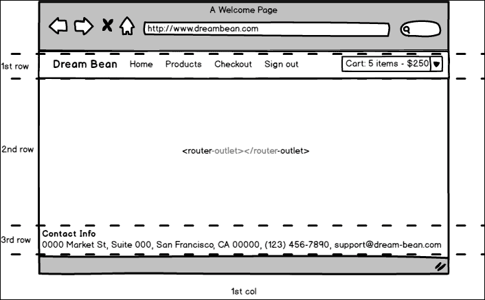
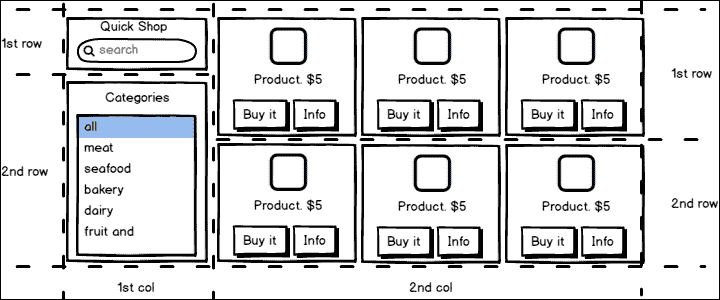
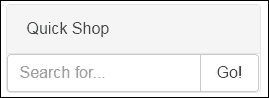
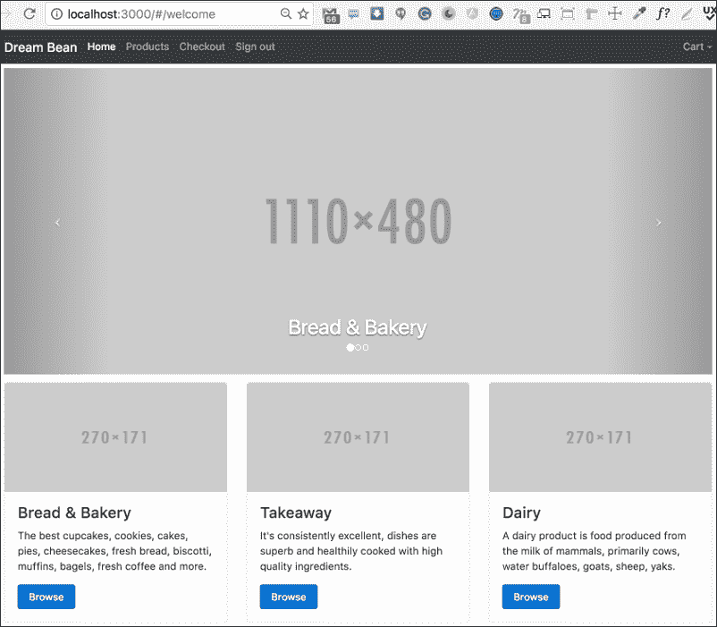

# 第五章：路由

许多 Web 应用程序需要多个页面或视图，Angular 很好地配备了其路由器来处理这一点。路由器使用 JavaScript 代码并在用户执行应用程序任务时管理视图之间的导航。在本章中，我们将看看如何创建静态路由，以及包含参数的路由，以及如何配置它们。我们还将发现一些可能会遇到的问题。在本章中，我们将使用 Angular 设置顶部导航。

在本章结束时，您将对以下内容有扎实的理解：

+   组件路由器

+   路由器配置

+   路由器链接和路由器出口

+   为我们的应用程序创建组件和导航

# 现代 Web 应用程序

你已经多次听说过**单页应用程序**（**SPA**），但为什么要开发这样的 Web 应用程序？有什么好处吗？

使用 SPAs 的主要想法非常简单-用户希望使用看起来和行为像本机应用程序的 Web 应用程序。 SPA 是一个 Web 应用程序，它加载单个 HTML 页面，并在用户与其上的多个组件交互时动态更新它。一些组件支持许多状态，例如打开，折叠等。使用服务器端渲染实现所有这些功能很难做到，因此大部分工作发生在客户端，即 JavaScript 中。这是通过通过具有处理数据的模型层和从模型读取的视图层来将数据与数据的呈现分离来实现的。

这个想法给代码带来了一定程度的复杂性，并经常导致改变人们对开发过程的看法。现在我们开始考虑应用程序的概念部分，文件和模块结构，引导性能问题等。

# 路由

由于我们正在制作 SPA，并且不希望有任何页面刷新，因此我们将使用 Angular 的路由功能。路由模块是 Angular 的重要部分。一方面，它有助于在用户浏览应用程序时更新浏览器的 URL。另一方面，它允许更改浏览器的 URL 以通过 Web 应用程序进行导航，从而允许用户创建书签以深入 SPA 中的位置。作为奖励，我们可以将应用程序拆分为多个包并按需加载它们。

随着 HTML 5 的引入，浏览器获得了通过编程方式创建新的浏览器历史记录条目的能力，而不需要新的请求来改变显示的 URL。这是通过使用历史记录的`pushState`方法来实现的，它将浏览器的导航历史记录暴露给 JavaScript。因此，现代框架不再依赖锚点技巧来导航路由，而是可以依靠`pushState`来执行历史记录操作而无需重新加载。

Angular 路由器使用这个模型来将浏览器 URL 解释为导航到客户端生成的视图的指令。我们可以传递可选参数给视图组件，以帮助它决定呈现什么具体内容。

让我们从以下开始：

1.  打开终端，创建文件夹`ecommerce`并进入。

1.  将项目文件夹`chapter_5/1.ecommerce-seed`中的内容复制到新项目中。

1.  运行以下脚本安装 NPM 模块：

```ts
 **npm install** 

```

1.  使用以下命令启动 TypeScript 监视器和轻量级服务器：

```ts
 **npm run start** 

```

这个脚本打开了网页浏览器并导航到项目的欢迎页面。

## 路由路径

在开始之前，让我们确切地规划一下梦幻豆杂货店网站所需的路由：

+   欢迎视图使用`/#/welcome`路径。这将是我们应用程序的入口点，它将以网格和幻灯片放映方式列出所有类别。

+   产品视图利用`/#/products`路径。我们将能够在选择的类别中看到商品。

+   我们在`/#/product/:id`上显示产品视图。在这里，我们将显示关于产品的信息。这里和下一个示例中的`:id`是路由参数的标记。我们将在本章后面讨论它。

+   `/#/cart`路径是我们将在其中看到购物车视图列出用户购物车中的所有商品的地方。

+   在`/#/checkout/:id`路径的结账视图中，我们将包括一个表单，允许用户添加联系信息；它还提供订单信息和购买条件。

这些是我们所有必要的路由；现在让我们看看如何创建它们。

## 安装路由器

路由器被打包为 Angular 内的一个模块，但它不是 Angular 核心的一部分，所以我们需要在`systemjs.config.js`文件的引导配置中手动包含它：

```ts
// angular bundles 
'@angular/core': 'npm:@angular/core/bundles/core.umd.js', 
'@angular/common': 'npm:@angular/common/bundles/common.umd.js', 
'@angular/compiler': 'npm:@angular/compiler/bundles/compiler.umd.js', 
'@angular/platform-browser': 'npm:@angular/platform-browser/bundles/platform-browser.umd.js', 
'@angular/platform-browser-dynamic': 'npm:@angular/platform-browser-dynamic/bundles/platform-browser-dynamic.umd.js', 
'@angular/http': 'npm:@angular/http/bundles/http.umd.js', 
 **'@angular/router': 'npm:@angular/router/bundles/router.umd.js',** 

'@angular/forms': 'npm:@angular/forms/bundles/forms.umd.js', 

```

## 基本 URL

如果我们决定使用路由，则应将`base`元素作为`head`标记中的第一个子元素添加。此标记中的引用解析相对 URL 和超链接，并告诉路由器如何组成导航 URL。对于我们的项目，我将`"/"`分配给`base`元素的`href`，因为`app`文件夹是应用程序根目录：

```ts
<base href="/"> 

```

如果我们将应用程序部署到特定上下文的服务器上，例如`portal`，那么我们必须相应地更改这个值：

```ts
<base href="/portal"> 

```

## Angular 路由器

从一个视图实际路由到另一个视图是通过**Angular 路由器**完成的。这是一个可选的服务，并表示特定 URL 的组件视图。它有自己的库包，我们必须在使用之前从中导入：

```ts
import { RouterModule } from '@angular/router'; 

```

# 路由器配置

应用程序只能有一个路由器。我们应该配置它，以便它知道如何将浏览器的 URL 映射到相应的`Route`并确定要显示的组件。这样做的主要方法是使用带有路由数组的`RouterModule.forRoot`函数，它用它引导应用程序。

## 创建基本路由

创建文件`app.routes.ts`并从路由器包中导入必要的元素：

```ts
import { Routes, RouterModule } from **'@angular/router'** 

; 

```

现在创建常量以保持应用程序路由：

```ts
const routes: Routes = [ 
  { path: 'welcome', component: WelcomeComponent }, 
  { path: 'products', component: ProductListComponent }, 
  // { path: 'products/:id', component: ProductComponent } 
]; 

```

我们定义了描述导航方式的路由对象数组。每个路由将一个 URL“路径”映射到要显示的“组件”。路由器解析和构造 URL，帮助我们使用以下内容：

+   对基本元素的路径引用，消除了使用前导斜杠的必要性

+   绝对路径

## 查询参数

路由器配置中的第二项只指向`products`，但正如我之前提到的，我们将能够在选择的类别中看到商品。听起来我们想要在我们的 URL 中包含的信息是可选的：

+   我们可以在不带额外信息的情况下离开请求以获取所有产品

+   我们可以使用特定类别来获取属于该类别的产品

这种类型的参数不容易适应 URL 路径，因此通常很难或不可能创建所需的模式匹配，以将传入的 URL 转换为命名路由。幸运的是，Angular 路由器支持**URL** **查询字符串**，用于在导航期间传递任意信息。

## 路由器参数

`routes`数组中的第三个元素在其路径中有一个`id`。这是一个**路由参数**的标记；与视图组件对应的值将使用它来查找和呈现产品信息。在我们的示例中，URL `'product/20'`保留了`id`参数的值`20`。`ProductComponent`可以使用这个值来查找并显示 ID 等于`20`的产品。这个路由被注释掉，因为我们还没有实现`ProductComponent`。

## 路由参数与查询参数

以下是一般规则，帮助您选择要使用的参数。当满足以下条件时，请使用路由参数：

+   该值是必需的

+   该值对于导航到另一个路由是必要的

当满足以下条件时，请使用查询参数：

+   该值是可选的

+   该值是复杂的或包含多变量。

## 在引导中注册路由

最后，我们应该使用`RouterModule.forRoot`方法返回一个包含配置和准备就绪的路由服务提供程序和所需路由库的新`RouterModule`实例：

```ts
export const routing = RouterModule.forRoot(routes); 

```

之后，我们需要在`AppModule`中注册返回的模块：

```ts
/* 
 * Routing 
 */ 
import {routing}  from './app.routes'; 

@NgModule({ 
  imports: [BrowserModule, FormsModule,  
            routing, CategoryModule], 
  declarations: [AppComponent, NavbarComponent], 
  bootstrap: [AppComponent] 
}) 
export class AppModule { } 

```

# 重定向路由

通常，当用户输入 Dream Bean 网站的地址时，他/她提供网站域名：[`www.dreambean.com`](http://www.dreambean.com)。

此 URL 不匹配任何配置的路由，并且 Angular 此刻无法显示任何组件。用户必须点击某个链接以导航到视图，或者我们可以教会配置使用`redirectTo`属性显示特定路由：

```ts
const routes: Routes = [ 
  { path: '', redirectTo: 'welcome', pathMatch: 'full' }, 
  { path: 'welcome', component: WelcomeComponent }, 
  { path: 'products', component: ProductListComponent }, 
  //{ path: 'products/:id', component: ProductComponent } 
]; 

```

在进行这些更改之后，如果用户导航到原始 URL，路由器将从初始 URL（`''`）转换为默认 URL（`'welcome'`）并显示欢迎视图。

重定向的路由具有一个必需属性`pathMatch`，告诉路由器如何将 URL 与路径匹配。对于这个值，我们有两个选项：

+   `full`表示所选路由必须与整个 URL 匹配

+   `prefix`指示路由器将重定向路由与以`path`中的前缀值开头的任何 URL 匹配。

# 路由出口

现在，一旦我们解决了路由器配置，就该在屏幕上展示一些组件了。但等等——我们需要一个地方放它们，这就是为什么路由出口要登场了。

`RouterOutlet`是 Angular 动态填充的占位符，根据应用的路由。`RouterOutlet`是之前导入的`RouterModule`的一部分，所以我们不需要在其他地方导入它。这是一个将 SPA 分成三行的线框图：



SPA 的线框图

在第一行，我们保留`NavigationComponent`；在最后一行，是页脚容器。中间的所有空间是`RouterOutlet`将显示相应视图的地方。

## 欢迎视图

我们配置了应用程序路由并将它们添加到`AppModule`，所以现在我们需要创建欢迎视图，因为它是路由的重要部分。创建一个`welcome`文件夹，并在其中创建两个文件`welcome.component.html`和`welcome.component.ts`。现在将`app.component.html`的内容移动到`welcome.component.html`中，并替换它。标记将`RouterOutlet`表示为一个组件：

```ts
<db-navbar></db-navbar> 
<router-outlet></router-outlet> 
<footer class="footer"> 
  <div class="container"> 
    <address> 
      <strong>Contact Info</strong><br> 
      0000 Market St, Suite 000, San Francisco, CA 00000, (123) 456-7890, 
      <a href="mailto:#">support@dream-bean.com</a> 
    </address> 
  </div> 
</footer> 

```

将以下内容复制粘贴到`welcome.component.ts`中：

```ts
/* 
 * Angular Imports 
 */ 
import {Component} from '@angular/core'; 

@Component({ 
  selector: 'db-welcome', 
  templateUrl: 'app/welcome/welcome.component.html' 
}) 
export class WelcomeComponent { } 

```

我将几乎所有的代码从`AppComponent`中移动到`WelcomeComponent`中，并且它的大小大大减小了。

```ts
/* 
 * Angular Imports 
 */ 
import {Component} from '@angular/core'; 

@Component({ 
  selector: 'my-app', 
  templateUrl: 'app/app.component.html', 
}) 
export class AppComponent { } 

```

我使用链接从欢迎视图导航到带有选定类别的产品视图，而不是调用`selectCategory`方法，所以我也删除了最后一个。

## 页脚组件

现在，当你知道如何创建一个组件时，你可以自己动手做。创建`footer`文件夹，`footer.component.ts`和`footer.component.html`。这里，`footer.component.ts`的源代码如下：

```ts
/* 
 * Components 
 */ 
import {Component} from '@angular/core'; 

@Component({ 
  selector: 'db-footer', 
  templateUrl: 'app/footer/footer.component.html' 
}) 
export class FooterComponent {} 

```

正如你所看到的，它看起来和我们之前创建的其他组件一样。将`application.component.html`中的页脚容器的内容移动到`footer.component.html`中，并用`FooterComponent`标签替换它，现在我们应用的 HTML 看起来非常整洁：

```ts
<db-navbar></db-navbar> 
 **<router-outlet></router-outlet>** 

<db-footer></db-footer> 

```

## 类别数据

我将类别数据保留为`AppComponent`的一部分，因为在我们开始开发时，这是一种快速明显的方式。现在，随着应用程序的增长，是时候将所有类别数据移动到类别文件中了。打开`category.ts`文件，将以下源代码复制到那里：

```ts
export interface Category { 
    // Unique Id 
    id: string; 
    // The title 
    title: string; 
    // Description 
    desc: string; 
    // Path to small image 
    imageS: string; 
    // Path to large image 
    imageL: string; 
} 

var categories: Category[] = [ 
    { id: '1', title: 'Bread & Bakery', imageL: 'http://placehold.it/1110x480', imageS: 'http://placehold.it/270x171', desc: 'The best cupcakes, cookies, cakes, pies, cheesecakes, fresh bread, biscotti, muffins, bagels, fresh coffee and more.' }, 
    { id: '2', title: 'Takeaway', imageL: 'http://placehold.it/1110x480', imageS: 'http://placehold.it/270x171', desc: 'It's consistently excellent, dishes are superb and healthily cooked with high quality ingredients.' }, 
    { id: '3', title: 'Dairy', imageL: 'http://placehold.it/1110x480', imageS: 'http://placehold.it/270x171', desc: 'A dairy product is food produced from the milk of mammals, primarily cows, water buffaloes, goats, sheep, yaks.' }, 
    { id: '4', title: 'Meat', imageL: 'http://placehold.it/1110x480', imageS: 'http://placehold.it/270x171', desc: 'Only superior quality beef, lamb, pork.' }, 
    { id: '5', title: 'Seafood', imageL: 'http://placehold.it/1110x480', imageS: 'http://placehold.it/270x171', desc: 'Great place to buy fresh seafood.' }, 
    { id: '6', title: 'Fruit & Veg', imageL: 'http://placehold.it/1110x480', imageS: 'http://placehold.it/270x171', desc: 'A variety of fresh fruits and vegetables.' } 
]; 

export function getCategories() { 
    return categories; 
} 

export function getCategory(id: string): Category { 
    for (let i = 0; i < categories.length; i++) { 
        if (categories[i].id === id) { 
            return categories[i]; 
        } 
    } 
    throw new CategoryNotFoundException(`Category ${id} not found`); 
} 

export class CategoryNotFoundException extends Error { 
    constructor(message?: string) { 
        super(message); 
    } 
} 

```

`getCategories`函数返回类别列表。`getCategory`返回根据 ID 找到的类别，或抛出`CategoryNotFoundException`。

## 分类卡视图

让我们打开`category-card.component.html`文件，并将标记更改如下：

```ts
<div class="col-xs-12 col-sm-6 col-md-4"> 
    <div class="card"> 
     
    <div class="card-block"> 
        <h4 class="card-title">{{category.title}}</h4> 
        <p class="card-text">{{category.desc}}</p> 
        <a class="btn btn-primary"  
 **(click)="filterProducts(category)">Browse</a>** 

    </div> 
    </div> 
</div> 

```

当用户点击**浏览**按钮时，Angular 会调用带有指定类别参数的`filterProducts`方法。

打开`category-card.component.ts`文件，从库中导入`Router`，并在组件的构造函数中添加引用：

```ts
import {Component, Input} from '@angular/core'; 
 **import {Router} from '@angular/router';** 

import {Category} from './category'; 

@Component({ 
    selector: 'db-category-card', 
    templateUrl:  
      'app/shared/category/category-card.component.html' 
}) 
export class CategoryCardComponent { 
    @Input() category: Category; 

    constructor( **private router: Router** 

) {} 

    filterProducts(category: Category) { 
 **this.router.navigate(['/products'],** 

 **{queryParams: { category: category.id} });** 

    } 
} 

```

注意`filterProducts`方法。我们在应用程序的引导中使用了一个配置好的路由器，并且在这个组件中可用。因为我们决定使用查询参数，所以我调用了一个导航方法，并传递了相同的名称作为第二个参数对象。我们可以传递任何信息，Angular 会将其转换为 URL 的查询字符串，就像这样：

```ts
/products?category=1 

```

我们已经完成了欢迎视图，现在转到产品视图。

## 产品数据

我们还没有使用后端服务器返回产品数据，所以让我们创建`product.ts`文件，内容如下：

```ts
export interface Product { 
    // Unique Id 
    id: string; 
    // Ref on category belongs to 
    categoryId: string; 
    // The title 
    title: string; 
    // Price 
    price: number; 
    // Mark product with specialproce 
    isSpecial: boolean; 
    // Description 
    desc: string; 
    // Path to small image 
    imageS: string; 
    // Path to large image 
    imageL: string; 
} 

var products: Product[] = [ 
    // Bakery 
    { id: '1', categoryId: '1', title: 'Baguette/French Bread', price: 1.5, isSpecial: false, imageL: 'http://placehold.it/1110x480', imageS: 'http://placehold.it/270x171', desc: 'Great eaten fresh from oven. Used to make sub sandwiches, etc.' }, 
    { id: '2', categoryId: '1', title: 'Croissants', price: 0.5, isSpecial: true, imageL: 'http://placehold.it/1110x480', imageS: 'http://placehold.it/270x171', desc: 'A croissant is a buttery, flaky, viennoiserie-pastry named for its well-known crescent shape.' }, 
    // Takeaway 
    { id: '3', categoryId: '2', title: 'Pizza', price: 1.2, isSpecial: false, imageL: 'http://placehold.it/1110x480', imageS: 'http://placehold.it/270x171', desc: 'Pizza is a flatbread generally topped with tomato sauce and cheese and baked in an oven.' }, 
    // Dairy 
    { id: '4', categoryId: '3', title: 'Milk', price: 1.7, isSpecial: false, imageL: 'http://placehold.it/1110x480', imageS: 'http://placehold.it/270x171', desc: 'Milk is a pale liquid produced by the mammary glands of mammals' }, 
    { id: '5', categoryId: '3', title: 'Cream Cheese', price: 2.35, isSpecial: false, imageL: 'http://placehold.it/1110x480', imageS: 'http://placehold.it/270x171', desc: 'Cream cheese is a soft, mild-tasting fresh cheese with a high fat content.' }, 
    // Meat 
    { id: '6', categoryId: '4', title: 'Pork Tenderloin', price: 5.60, isSpecial: false, imageL: 'http://placehold.it/1110x480', imageS: 'http://placehold.it/270x171', desc: 'The pork tenderloin, in some countries called pork fillet, is a cut of pork. ' }, 
    { id: '7', categoryId: '4', title: 'Ribs, Baby Back', price: 4.85, isSpecial: false, imageL: 'http://placehold.it/1110x480', imageS: 'http://placehold.it/270x171', desc: 'Pork ribs are a cut of pork popular in North American and Asian cuisines. ' }, 
    { id: '8', categoryId: '4', title: 'Ground Beef', price: 9.20, isSpecial: false, imageL: 'http://placehold.it/1110x480', imageS: 'http://placehold.it/270x171', desc: 'Ground beef, beef mince, minced beef, minced meat is a ground meat made of beef that has been finely chopped with a large knife or a meat grinder.' }, 
    // Seafood 
    { id: '9', categoryId: '5', title: 'Tuna', price: 3.45, isSpecial: false, imageL: 'http://placehold.it/1110x480', imageS: 'http://placehold.it/270x171', desc: 'A tuna is a saltwater finfish that belongs to the tribe Thunnini, a sub-grouping of the mackerel family - which together with the tunas, also includes the bonitos, ackerels, and Spanish mackerels.' }, 
    { id: '10', categoryId: '5', title: 'Salmon', price: 4.55, isSpecial: false, imageL: 'http://placehold.it/1110x480', imageS: 'http://placehold.it/270x171', desc: 'Salmon is the common name for several species of ray-finned fish in the family Salmonidae.' }, 
    { id: '11', categoryId: '5', title: 'Oysters', price: 7.80, isSpecial: false, imageL: 'http://placehold.it/1110x480', imageS: 'http://placehold.it/270x171', desc: 'The word oyster is used as a common name for a number of different families of saltwater clams, bivalve molluscs that live in marine or brackish habitats.' }, 
    { id: '12', categoryId: '5', title: 'Scalops', price: 2.70, isSpecial: false, imageL: 'http://placehold.it/1110x480', imageS: 'http://placehold.it/270x171', desc: 'Scallop is a common name that is primarily applied to any one of numerous species of saltwater clams or marine bivalve mollusks in the taxonomic family Pectinidae, the scallops.' }, 
    // Fruit & Veg 
    { id: '13', categoryId: '6', title: 'Banana', price: 1.55, isSpecial: false, imageL: 'http://placehold.it/1110x480', imageS: 'http://placehold.it/270x171', desc: 'The banana is an edible fruit, botanically a berry, produced by several kinds of large herbaceous flowering plants in the genus Musa.' }, 
    { id: '14', categoryId: '6', title: 'Cucumber', price: 1.05, isSpecial: false, imageL: 'http://placehold.it/1110x480', imageS: 'http://placehold.it/270x171', desc: 'Cucumber is a widely cultivated plant in the gourd family, Cucurbitaceae. ' }, 
    { id: '15', categoryId: '6', title: 'Apple', price: 0.80, isSpecial: false, imageL: 'http://placehold.it/1110x480', imageS: 'http://placehold.it/270x171', desc: 'The apple tree is a deciduous tree in the rose family best known for its sweet, pomaceous fruit, the apple.' }, 
    { id: '16', categoryId: '6', title: 'Lemon', price: 3.20, isSpecial: false, imageL: 'http://placehold.it/1110x480', imageS: 'http://placehold.it/270x171', desc: 'The lemon is a species of small evergreen tree native to Asia.' }, 
    { id: '17', categoryId: '6', title: 'Pear', price: 4.25, isSpecial: false, imageL: 'http://placehold.it/1110x480', imageS: 'http://placehold.it/270x171', desc: 'The pear is any of several tree and shrub species of genus Pyrus, in the family Rosaceae.' } 
]; 

export function getProducts() { 
    return products; 
} 

export function getProduct(id: string): Product { 
    for (let I = 0; I < products.length; i++) { 
        if (products[i].id === id) { 
            return products[i]; 
        } 
    } 
    throw new ProductNotFoundException(`Product ${id} not found`); 
} 

export class ProductNotFoundException extends Error { 
    constructor(message?: string) { 
        super(message); 
    } 
} 

```

如果你仔细看，你会发现与`category.ts`文件有相似之处。我只是遵循命名约定。

## 产品视图

产品视图提供了所选类别中所有商品的列表。从中，客户可以查看所有产品信息，并将列出的任何产品添加到他或她的购物车中。用户还可以导航到任何提供的类别，或使用**Quick Shop**功能按名称搜索产品。



产品视图的线框图

这个组件的布局是由两列组成的：

+   第一列包含**Quick Shop**和**类别**列表

+   第二列是一个嵌套的列，组合成行

## 快速购物组件

这是一个用于搜索的`input-group`字段，并使用`Quick Shop`来查看杂货店中的产品。我们使用 URL 查询字符串来传递搜索信息，就像我们为类别所做的那样，因为我们不知道用户会在搜索字段中输入什么。创建`product`文件夹，我们将在其中添加所有属于`product`的组件和服务。

让我们在`product`文件夹中创建`product-search.component.html`，内容如下：

```ts
<div class="card"> 
    <div class="card-header">Quick Shop</div> 
    <div class="input-group"> 
        <input #search type="text" class="form-control"  
               placeholder="Search for..."> 
        <span class="input-group-btn"> 
            <button class="btn btn-secondary" type="button"  
                    (click)="searchProduct(search.value)">Go! 
            </button> 
        </span> 
    </div> 
</div> 

```

我使用了 Bootstrap 4 的`input-groups`，里面有一个按钮在`Card`组件中。模板引用变量`search`使我们直接访问输入元素，这样当用户输入产品名称并点击**Go!**按钮时，我们可以在`searchProduct`方法中使用文本值。创建`product-search.component.ts`文件，并创建类似于`CategoryCard`的`ProductSearch`组件：

```ts
import {Component} from '@angular/core'; 
import {Router} from '@angular/router'; 

import {Product} from './product'; 

@Component({ 
    selector: 'db-product-search', 
    templateUrl: 'app/product/product-search.component.html' 
}) 
export class ProductSearchComponent { 

    constructor(private router: Router) {} 

    searchProduct(value: string) { 
 **this.router.navigate(['/products'],** 

 **{ queryParams: { search: value} });** 

    } 
} 

```

我使用`Router`的导航方法通过以下 URL 搜索产品名称：

```ts
/products?search=Apple 

```



现在，我们准备创建`CategoryList`组件，以便用户可以使用它来选择类别。

## 类别列表组件

在第三章中，*高级 Bootstrap 组件和自定义*，我们介绍了灵活的 Bootstrap 4 `list-group`组件。`Categories`是一个无序项目列表，所以我们可以使用这个特定的列表来快速渲染类别。我使用相同的机制来更新 URL，使用`CategoryCard`组件中使用的特定类别。在`category`文件夹中创建`category-list.component.html`，内容如下：

```ts
<div class="card"> 
    <div class="card-header">Categories</div> 
    <div class="card-block"> 
        <div class=" **list-group list-group-flush** 

"> 
 **<a class="list-group-item"** 

 ***ngFor="let category of categories"** 

 **(click)="filterProducts(category)">** 

 **{{category.title}}</a>** 

        </div> 
    </div> 
</div> 

```

`Card`组件包装了`list-group`。内置的`NgFor`指令帮助组织对类别的迭代，以显示项目。创建`category-list.component.ts`，并复制并粘贴以下代码：

```ts
/* 
 * Angular Imports 
 */ 
import {Component} from '@angular/core'; 
import {Router} from '@angular/router'; 

/* 
 * Components 
 */ 
import {Category, getCategories} from './category'; 

@Component({ 
    selector: 'db-category-list', 
    templateUrl: 'app/category/category-list.component.html' 
}) 
export class CategoryListComponent { 

    categories: Category[] = getCategories(); 

    constructor(private router: Router) {} 

    filterProducts(category: Category) { 
        this.router.navigate(['/products'], {  
          queryParams: { category: category.id}  
        }); 
    } 
} 

```

我们使用`category`文件中的`getCategories`函数将它们全部分配给`categories`变量。

## 更新 CategoryModule

您应该按照以下方式更新`CategoryModule`：

```ts
import {NgModule} from '@angular/core'; 
import {CommonModule} from '@angular/common'; 
import {FormsModule} from '@angular/forms'; 
import {RouterModule} from '@angular/router'; 

 **import {CategoryListComponent} from './category-list.component';** 

import {CategoryCardComponent} from './category-card.component'; 
import {CategorySlideComponent} from './category-slide.component'; 

@NgModule({ 
    imports: [CommonModule, FormsModule, RouterModule], 
    declarations: [CategoryListComponent, CategoryCardComponent, CategorySlideComponent], 
    exports: [CategoryListComponent, CategoryCardComponent, CategorySlideComponent] 
}) 
export class CategoryModule {} 

```

我导出了`CategoryListComponent`，因为我们将在其他模块中使用它。

# 路由链接

大多数情况下，用户在页面之间导航是由于他们在链接上执行的操作，比如单击锚标签。我们可以将路由器绑定到页面上的链接，这样当用户单击链接时，它将导航到适当的应用程序视图。

### 注意

路由器在浏览器的历史日志中记录活动，以便返回和前进按钮按预期工作。

Angular 团队引入了`RouterLink`指令到锚标签，将其绑定到包含路由链接参数数组的模板表达式。让我们借助`RouterLink`创建`Product Card`组件。

# 产品卡

我认为将产品呈现为卡片是一个好主意。我在`product`文件夹中创建了`product-card.component.html`，内容如下：

```ts
<div class="col-xs-12 col-sm-6 col-md-4"> 
    <div class="card"> 
         
        <div class="card-block"> 
            <h4 class="card-title">{{product.title}}</h4> 
            <p class="card-text">{{product.desc}}</p> 
            <a class="btn btn-primary" 
 **[routerLink]="['/product', product.id]">Browse</a>** 

        </div> 
    </div> 
</div> 

```

在我们的代码中，`RouterLink`绑定在锚标签中。注意我们绑定到`routerLink`的模板表达式。显然，它是一个数组，这意味着我们可以添加多个项目，Angular 将它们组合起来构建 URL。我们可以单独指定路由的所有部分，比如`"product/1"`，但我故意将它们留作数组的分离项目，因为这样更容易维护。让我们解析一下：

+   第一项标识父根`"/product"`路径

+   对于这个父元素没有参数，比如`"product/groups/1"`，所以我们完成了

+   第二项标识产品的子路由，并需要 ID

`RouterLink`的导航非常灵活，因此我们可以使用链接参数数组编写具有多级路由的应用程序。

在`product`文件夹中创建一个`product-card.component.ts`。`RouterLink`属于`RouterModule`，所以现在可以在标记上使用它。复制并粘贴以下代码到`product-card.component.ts`中：

```ts
import {Component, Input} from '@angular/core'; 

import {Product} from './product'; 

@Component({ 
    selector: 'db-product-card', 
    templateUrl: 'app/product/product-card.component.html' 
}) 
export class ProductCardComponent { 
    @Input() product: Product; 
} 

```

我们将从`ProductGreedComponent`绑定数据到`ProductCardComponent`的实例中，通过`product`属性。

# 产品网格组件

我们需要以三列和多行的网格形式显示产品。卡片组件是显示产品信息并导航到产品视图的最合适的组件。行中的所有卡片必须具有相同的宽度和高度。我们如何在父网格布局的特定位置显示它们？让我们在`product`文件夹中创建`product-grid.component.html`和`product-grid.component.ts`文件。复制并粘贴以下代码到`product-grid.component.ts`文件中：

```ts
/* 
 * Angular Imports 
 */ 
import {Component} from '@angular/core'; 

/* 
 * Components 
 */ 
import {Product, getProducts} from './product'; 

@Component({ 
    selector: 'db-product-grid', 
    templateUrl: 'app/product/product-grid.component.html' 
}) 
export class ProductGridComponent { 
    products: Product[] = getProducts(); 
} 

```

## 卡片组

我们可以使用**Bootstrap 4 Card**组来呈现多个卡片作为单个附加元素，具有相等的宽度和高度。我们只需要将所有卡片放在带有`card-group`类的父元素中。复制并粘贴以下代码到`product-grid.component.html`文件中：

```ts
<div class= **"card-group"** 

> 
    <db-product-card *ngFor="let product of products" 
        [product]="product"></db-product-card> 
</div> 

```

结果不是我想要的，因为一些卡片彼此附着：

！卡片组

## 卡片列

另一个布局是来自 Bootstrap 4 的`card-columns`。它允许您在每列中显示多个卡片。每列中的每张卡片都堆叠在另一张卡片上。在`card-columns`类中包含所有卡片。复制并粘贴以下代码到`product-grid.component.html`文件中：

```ts
<div class= **"card-columns"** 

> 
    <db-product-card *ngFor="let product of products" 
        [product]="product"></db-product-card> 
</div> 

```

结果看起来很有趣：

！卡片列

## 卡片桌

最后的布局是来自 Bootstrap 4 的卡片桌。它类似于卡片组，只是卡片之间没有连接。这需要两个包装元素：`card-deck-wrapper`和`card-deck`。它使用表格样式来设置`card-deck`的大小和间距。`card-deck-wrapper`用于在`card-deck`上消除边框间距。

让我们回到`product-card.component.html`文件，并使用以下内容进行更新：

```ts
<div class= **"card-deck-wrapper"** 

> 
    <div class= **"card-deck"** 

> 
        <div class="card" *ngFor="let product of products"> 
            <div class="card-header text-xs-center"> 
                {{product.title}} 
            </div> 
             
            <div class="card-block text-xs-center"  
                   [ngClass]="setClasses(product)"> 
                <h4 class="card-text"> 
                  Price: ${{product.price}} 
                </h4> 
            </div> 
            <div class="card-footer text-xs-center"> 
                <a class="btn btn-primary"  
                   (click)="buy(product)">Buy Now</a> 
                <a class="btn btn-secondary"  
                   [routerLink]="['/product', product.id]"> 
                     More Info 
                </a> 
            </div> 
            <div class="card-block"> 
                <p class="card-text">{{product.desc}}</p> 
            </div> 
        </div> 
    </div> 
</div> 

```

卡片桌足够完美地使用一行，所以我们在`ProductCardComponent`中公开`products`输入：

```ts
import {Component, Input} from '@angular/core'; 

import {Product} from './product'; 

@Component({ 
    selector: 'db-product-card', 
    templateUrl: 'app/product/product-card.component.html', 
    directives: [ROUTER_DIRECTIVES] 
}) 
export class ProductCardComponent { 
    @Input() products: Product[]; 

    setClasses(product: Product) { 
        return { 
            'card-danger': product.isSpecial, 
            'card-inverse': product.isSpecial 
        }; 
    } 

    buy(product: Product) { 
        console.log('We bought', product.title); 
    } 
} 

```

`setClasses`方法帮助更改卡片的背景，如果产品有`special`价格。当用户点击**立即购买**按钮时，我们调用`buy`方法。

有了这一切，我们可以更新`ProductGridComponent`的标记：

```ts
<db-product-card *ngFor="let row of products"   
                  [products]="row"></db-product-card> 

```

相当整洁，不是吗？

但在使用我们漂亮的组件之前，我们需要将产品数组转换为每行三个产品的数组。请注意`ProductGridComponent`构造函数中的代码：

```ts
import {Component} from '@angular/core'; 

import {Product, getProducts} from './product'; 

@Component({ 
    selector: 'db-product-grid', 
    templateUrl: 'app/product/product-grid.component.html' 
}) 
export class ProductGridComponent { 
    products: any = []; 

    constructor() { 
        let index = 0; 
        let products: Product[] = getProducts(); 
        let length = products.length; 

        this.products = []; 

        while (length) { 
            let row: Product[] = []; 
            if (length >= 3) { 
                for (let i = 0; i < 3; i++) { 
                    row.push(products[index++]); 
                } 
                this.products.push(row); 
                length -= 3; 
            } else { 
                for (; length > 0; length--) { 
                    row.push(products[index++]); 
                } 
                this.products.push(row); 
            } 
        } 
    } 
} 

```

我们将产品分成多行，每行最多包含三列。

## 将它们全部组合在一起

现在我们创建一个组件，将所有其他产品组件组合起来，以便在路由器出口标记提供的位置显示它们。请欢迎`ProductListComponent`！

创建一个`product-list.component.ts`文件，内容如下：

```ts
/* 
 * Angular Imports 
 */ 
import {Component} from '@angular/core'; 

/* 
 * Components 
 */ 

@Component({ 
  selector: 'db-products', 
  templateUrl: 'app/product/product-list.component.html' 
}) 
export class ProductListComponent {} 

```

现在，创建`product-list.component.html`，并复制并粘贴下一个标记：

```ts
<div class="container"> 
    <div class="row"> 
        <div class="col-md-3"> 
            <db-product-search></db-product-search> 
            <db-category-list></db-category-list> 
        </div> 
        <div class="col-md-9"> 
            <db-product-grid></db-product-grid> 
        </div> 
    </div> 
</div> 

```

正如你所看到的，它在第一列中绘制了`ProductSearchComponent`和`CategoryListComponent`，在第二列中绘制了`ProductGridComponent`，这与我们的线框相对应。

## 产品模块

在`product`文件夹中的最后两个角色是`ProductModule`。创建`product.module.ts`文件如下：

```ts
import {NgModule} from '@angular/core'; 
import {CommonModule} from '@angular/common'; 
import {FormsModule} from '@angular/forms'; 
import {RouterModule} from '@angular/router'; 

import {ProductListComponent} from './product-list.component'; 
import {ProductCardComponent} from './product-card.component'; 
import {ProductSearchComponent} from './product-search.component'; 
import {ProductGridComponent} from './product-grid.component'; 

import {CategoryModule} from '../category/category.module'; 

@NgModule({ 
    imports: [CommonModule, FormsModule, RouterModule, CategoryModule], 
    declarations: [ProductListComponent, ProductCardComponent, ProductSearchComponent, ProductGridComponent], 
    exports: [ProductListComponent, ProductCardComponent, ProductSearchComponent, ProductGridComponent] 
}) 
export class ProductModule {} 

```

它导入了`CategoryModule`以及系统模块。我们声明并导出了之前创建的所有四个组件。

## 更新 AllModule

现在，有了`CategoryModule`和`ProductModule`，我们需要使它们所有的组件都可用于应用程序，以便我们可以将它们导入到`AppModule`中：

```ts
import {NgModule} from '@angular/core'; 
import {BrowserModule} from '@angular/platform-browser'; 
import {FormsModule} from '@angular/forms'; 

/** 
 * Modules 
 */ 
 **import {CategoryModule} from './category/category.module';** 

 **import {ProductModule} from './product/product.module';** 

/* 
 * Components 
 */ 
import {AppComponent}  from './app.component'; 
import {NavbarComponent} from './navbar/navbar.component'; 
import {FooterComponent} from './footer/footer.component'; 
import {WelcomeComponent} from './welcome/welcome.component'; 

/* 
 * Routing 
 */ 
import {routing}  from './app.routes'; 

@NgModule({ 
  imports: [BrowserModule, FormsModule, routing, 
 **CategoryModule, ProductModule],** 

  declarations: [AppComponent, NavbarComponent, FooterComponent, 
    WelcomeComponent], 
  bootstrap: [AppComponent] 
}) 
export class AppModule { } 

```

`NavbarComponent`，`FooterComponent`和`WelcomeComponent`直接属于`AppModule`。

### 提示

您可以在`chapter_5/2.ecommerce-router`找到源代码。

# 读累了记得休息一会哦~

**公众号：古德猫宁李**

+   电子书搜索下载

+   书单分享

+   书友学习交流

**网站：**[沉金书屋 https://www.chenjin5.com](https://www.chenjin5.com)

+   电子书搜索下载

+   电子书打包资源分享

+   学习资源分享

# 路由更改事件

正如我们在查看路由器配置时提到的，当用户导航到以下 URL 时，`ProductListComponent`可以表示产品视图：

```ts
/products?category=1 

```

或者

```ts
/products?search=apple 

```

`ActivatedRouter`类包含与加载在出口中的组件相关联的路由信息。我们可以订阅路由更改事件，以通知`ProductGridComponent`有关 URL 查询参数发生的变化。打开`product-grid.component.ts`文件，从库中导入`ActivatedRouter`，并将其注入到构造函数的`router`属性中。现在我们可以订阅路由更改：

```ts
constructor(private router: ActivatedRouter) { 
        this.router 
            .queryParams 
            .subscribe(params => { 
                let category: string = params['category']; 
                let search: string = params['search']; 
                // Return filtered data from getProducts function 
                let products: Product[] =  
                  getProducts(category, search); 
                // Transform products to appropriate data  
                // to display 
                this.products = this.transform(products); 
            }); 
    } 

```

在上面的代码中，我们正在监听只在`queryParams`中发生的更改，并使用它们来过滤`getProducts`函数中的数据。稍后，借助`transform`方法，我们将把过滤后的产品转换成适合显示的数据。

```ts
transform(source: Product[]) { 
    let index = 0; 
    let length = source.length; 

    let products = []; 

    while (length) { 
        let row: Product[] = []; 
        if (length >= 3) { 
            for (let i = 0; i < 3; i++) { 
                row.push(source[index++]); 
            } 
            products.push(row); 
            length -= 3; 
        } else { 
            for (; length > 0; length--) { 
                row.push(source[index++]); 
            } 
            products.push(row); 
        } 
    } 

    return products; 
} 

```

最后，我们必须改变`getProducts`函数的签名，因为现在我们可以传递两个参数：

```ts
 export function getProducts(category?: string, search?: string) { 
    if (category) { 
        return products.filter( 
          (product: Product, index: number, array: Product[]) => { 
            return product.categoryId === category; 
        }); 
    } else if (search) { 
        let lowSearch = search.toLowerCase(); 
        return products.filter( 
          (product: Product, index: number, array: Product[]) => { 
            return product.title.toLowerCase(). 
              indexOf(lowSearch) != -1; 
        }); 
    } else { 
        return products; 
    } 
} 

```

这个函数根据我们发送给函数的参数，可以按类别过滤数据，搜索文本，或保持原样。保存代码，尝试使用过滤后的数据进行操作：


# 路由策略

我们已经配置了所有必要的路由，并且现在可以访问它们的单独视图。这很棒，但也许你不喜欢 URL 中跟随`#`符号的路径。正如我提到的，现代 web 浏览器支持`pushState`技术，可以在不向服务器发送请求的情况下改变浏览器的位置和历史记录。`Router`使用这种方法来构建 URL。Angular 路由器使用不同的`LocationStrategy`来支持新旧两种方式：

+   `PathLocationStrategy`提供了默认的基于`pushState`的 HTML 5 样式

+   `HashLocationStrategy`利用 URL 样式中的哈希符号。

选择策略对于未来的开发至关重要，因为以后更改它不会很容易，所以最好在合适的时候做。如果您的服务器不支持在找不到路由时重定向到备用页面的能力，您可以使用`HashLocationStrategy`。我们在开发中使用的`lite-server`可能支持这个功能。

打开`app.module.ts`文件，从 common 模块导入策略：

```ts
import {LocationStrategy, HashLocationStrategy ,  
        PathLocationStrategy} from '@angular/common';  

```

我们将`PathLocationStrategy`或`HashLocationStrategy`注册为`LocationStrategy`的提供者：

```ts
@NgModule({ 
  imports: [BrowserModule, FormsModule,  
            routing, CategoryModule, ProductModule], 
  declarations: [AppComponent, NavbarComponent, FooterComponent,  
                WelcomeComponent], 
 **providers: [{provide: LocationStrategy, useClass: HashLocationStrategy}],** 

  bootstrap: [AppComponent] 
}) 
export class AppModule { } 

```

保存并检查应用程序在浏览器 URL 中是否有或没有哈希的工作方式。



### 提示

您可以在`chapter_5/3.ecommerce-router-search`找到源代码。

# 摘要

在本章中，我们将我们的应用程序从单页面转变为多页面视图和多路由应用程序，我们可以在 Dream Bean 杂货店上构建。在编写任何代码之前，我们首先规划了应用程序中的基本路由。

然后，我们构建了包含参数的静态和动态路由。

最后，我们看了如何使用 HTML 5 的`pushState`来删除 URL 中的`#`符号，以及如何链接两种类型的路由。

在第六章中，*依赖注入*，我们将讨论依赖注入，教读者如何解耦应用程序的需求，以及如何创建一个一致的数据源作为服务。此外，我们将继续构建我们在前几章中开始开发的项目。
