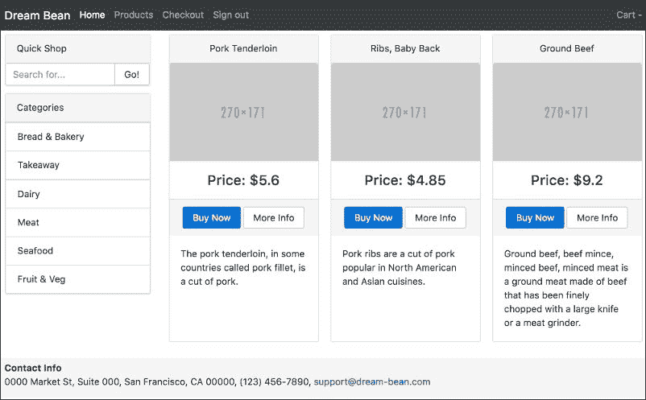
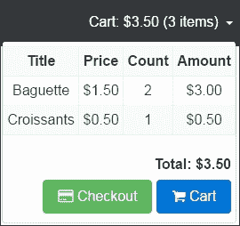
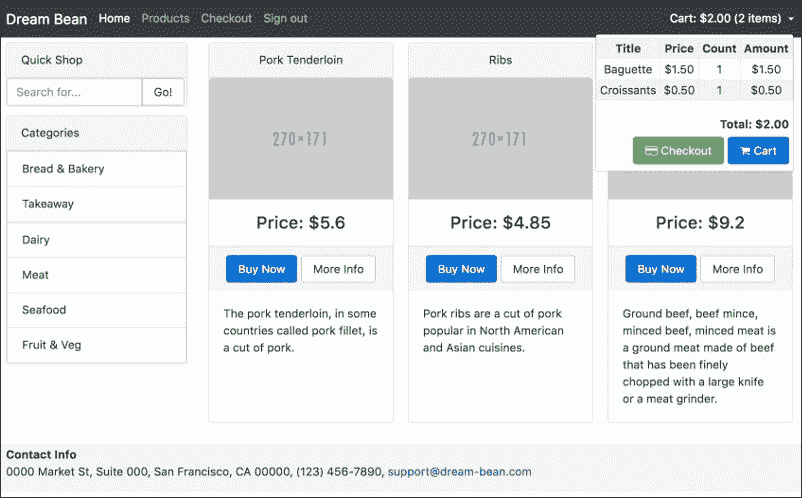

# 第六章：依赖注入

本章介绍了依赖注入，教您如何解耦应用程序的需求以及如何创建一个一致的数据源作为服务。您将了解注入器和提供者类。我们还将讨论 Injectable 装饰器，这是创建对象所必需的。

在本章结束时，您将对以下内容有扎实的理解：

+   什么是依赖注入？

+   关注点的分离

+   创建一个服务

+   注入器和提供者类

+   Injectable 和 inject 装饰器

+   为我们的应用程序创建数据服务

# 什么是依赖注入？

在这里，我将讨论**依赖注入**的概念，并提供一些具体的例子，希望能够演示它试图解决的问题以及它为开发人员带来的好处。Angular 主要基于依赖注入，您可能已经熟悉或不熟悉。如果您已经了解依赖注入的概念，可以安全地跳过本章，直接阅读下一章。

依赖注入可能是我所知道的最著名的设计模式之一，您可能已经使用过它。我认为这是最难解释清楚的设计模式之一，部分原因是由于大多数依赖注入介绍中使用的无意义的例子。我尝试提出更适合 Angular 世界的例子。

# 一个现实生活的例子

想象一下，您开了自己的业务，经常需要乘飞机出差，所以需要安排航班。您总是使用航空公司的电话号码自己预订航班。

因此，您的典型旅行计划例程可能如下所示：

+   决定目的地和期望的到达日期和时间

+   给航空公司打电话，传达必要的信息以预订航班

+   取票并上路

现在，如果您突然更改了首选机构及其联系机制，您将受到以下重新学习情景的影响：

+   新的机构及其新的联系机制（假设新机构提供基于互联网的服务，预订方式是通过互联网而不是通过电话）

+   必要的预订通过的典型对话顺序（数据而不是语音）

您需要调整自己以适应新情景。这可能会导致大量时间花在重新调整过程上。

假设你的业务正在发展，你在公司里雇了一个秘书，所以每当你需要出差时，你只需给他或她发送一封电子邮件，说明目的地、期望的到达日期和时间。机票会为你预订好，并送到你手上。

现在，如果首选机构发生了变化，秘书会意识到这种变化，并可能重新调整他或她的工作流程，以便与机构进行沟通。然而，你不需要重新学习。你仍然按照以前的协议继续，因为秘书以一种方式进行了所有必要的适应，这意味着你不需要做任何不同的事情。

在这两种情况下，你都是客户，并且依赖机构提供的服务。然而，第二种情况有一些不同之处：

+   你不需要知道机构的联系点——秘书会为你做这件事

+   你不需要知道机构通过语音、电子邮件、网站等方式进行活动的确切对话顺序，因为你知道与秘书的特定标准对话序列

+   你所依赖的服务以一种方式提供给你，如果服务提供者发生变化，你不需要重新调整

这就是*现实生活*中的依赖注入。

# 依赖注入

我们项目中使用的 Angular 和自定义组件都是一组协作组件的一部分。它们彼此依赖以完成其预期目的，并且它们需要知道：

+   要与哪些组件进行通信？

+   在哪里找到它们？

+   如何与它们沟通？

当访问方式发生变化时，这些变化可能需要修改许多组件的源。以下是我们可以使用的可能解决方案，以防止组件的剧烈变化：

+   我们可以将位置和实例化的逻辑嵌入到我们通常的组件逻辑中

+   我们可以创建*外部*代码片段来承担位置和实例化的责任，并在必要时提供引用

我们可以将最后一个解决方案看作是我们*现实生活*示例中的*秘书*。当定位任何外部依赖项的方式发生变化时，我们不需要更改组件的代码。这个解决方案是依赖注入的实现，其中一个*外部*代码片段是 Angular 框架的一部分。

使用依赖注入需要声明组件，并让框架处理实例化、初始化、排序和根据需要提供引用的复杂性。

将依赖项传递给使用它的依赖对象是依赖注入。组件可以以至少三种常见方式接受依赖项：

+   **构造函数注入**：在这种情况下，依赖项通过类构造函数提供。

+   **Setter 注入**：在这种情况下，注入器利用组件公开的 setter 方法来注入依赖项。

+   **接口注入**：在这种情况下，依赖项提供了一个方法，该方法将依赖项注入到传递给它的任何组件中。

## 构造函数注入

该方法要求组件在构造函数中提供依赖项的参数。我们在`ProductGridService`组件的代码中注入了`Router`实例：

```ts
 **constructor(private router: ActivatedRoute) {** 

    this.router 
        .queryParams 
        .subscribe(params => { 
            let category: string = params['category']; 
            let search: string = params['search']; 
            // Return filtered data 
            let products: Product[] =  
              getProducts(category, search); 
            // Transform products to appropriate data 
            // to display 
            this.products = this.transform(products); 
        }); 
} 

```

构造函数注入是最可取的方法，可以用来确保组件始终处于有效状态，但它缺乏能够稍后更改其依赖项的灵活性。

## 其他注入方法

Setter 和接口方法在 Angular 框架中没有实现。

## 组件与服务

Angular 2 在 Web 应用程序的代码上有所区别：

+   代表视觉部分的组件

+   可重用的数据服务

数据服务是一个简单的类，提供了返回或更新一些数据的方法。

# ReflectiveInjector

`ReflectiveInjector`是一个注入容器，我们将其用作替代`new`运算符，用于自动解析构造函数的依赖项。当应用程序中的代码询问构造函数中的依赖项时，`ReflectiveInjector`会解析它们。

```ts
import {Injectable, ReflectiveInjector} from '@angular/core'; 

@Injectable() 
export ProductGridService { 
  constructor(private router: ActivatedRoute) {...} 
} 

const injector = ReflectiveInjector.resolveAndCreate  
      ([ActivatedRoute, ProductGridService]); 
const service = injector.get(ProductGridService); 

```

使用`resolveAndCreate`方法，`ReflectiveInjector`创建了一个`Injector`的实例。我们将服务提供者数组传递给注入器以配置它，否则它将不知道如何创建它们。

使用`Injector`，创建`ProductGridService`非常容易，因为它完全负责提供和注入`ActivatedRoute`到`ProductGridService`中。

让我们讨论为什么我们导入并应用了`Injectable`装饰器到类中？

## 可注入装饰器

我们在应用程序中为特定需求创建多种类型。其中一些可能依赖于其他类型。我们必须使用`Injectable`装饰器标记任何可用于注入器的类型。注入器使用类构造函数的元数据来获取参数类型，并确定实例化和注入的依赖类型。任何依赖类型都必须用`Injectable`装饰器标记，否则在尝试实例化时，注入器将报告错误。

### 注意

为每个服务类添加`@Injectable()`以防止依赖注入错误。

我们必须显式地为我们的所有服务类导入和应用`Injectable`装饰器，以使它们可用于注入器进行实例化。没有这个装饰器，Angular 就不知道这些类型的存在。

## 注入装饰器

正如我所提到的，注入器使用类构造函数的元数据来确定依赖类型：

```ts
constructor(private router: ActivatedRoute) {...} 

```

注入器使用 TypeScript 生成的元数据将`ActivatedRoute`类型的实例注入到构造函数中。对于注入 TypeScript 原语，如`string`、`boolean`或数组，我们应该定义并使用 Opaque Token：

```ts
import { OpaqueToken } from '@angular/core'; 

export let APP_TITLE = new OpaqueToken('appTitle'); 

```

现在，有了定义的`APP_TITLE`标记，我们可以在依赖提供者的注册中使用它：

```ts
providers: [{ provide: APP_TITLE, useValue: 'Dream Bean' }] 

```

当我们将应用程序标题注入到我们应用程序的任何构造函数中时，我们使用`@Inject`装饰器：

```ts
import {Inject} from '@angular/core'; 

constructor(@Inject('APP_TITLE') private appTitle) {...} 

```

我们很快会谈到标记。

## 可选装饰器

在类具有可选依赖项的情况下，我们可以使用`@Optional`装饰器来标记构造函数参数：

```ts
import {Optional} from '@angular/core'; 

constructor(@Optional('config') private config) { 
  if (config) { 
    // Use the config 
    ... 
  } 
} 

```

我在上面的代码中添加了条件语句，因为我预期`config`属性将等于`null`。

## 配置注入器

在上面的示例中，我使用了`ReflectiveInjector`的`resolveAndCreate`方法来创建`Injector`，但在现实生活中，这是不必要的。

```ts
const injector = ReflectiveInjector.resolveAndCreate  
      ([ActivatedRoute, ProductGridService]); 

```

在应用程序的启动过程中，Angular 框架为我们创建了一个应用程序范围的注入器：

```ts
platformBrowserDynamic().bootstrapModule(AppModule); 

```

我们必须通过注册创建应用程序所需服务的提供者来配置注入器。我们可以通过两种方式来做到这一点：

+   在`NgModule`中注册提供者

+   在`AppComponent`中注册提供者

哪一个更好？注入到`AppModule`中的服务在整个应用程序中都是广泛可用的，并且可以注入到惰性加载模块及其组件中。注入到`AppComponent`中的服务仅对该组件及其子组件可用，并且不可用于惰性加载模块。

### 注意

在根`AppModule`中注册应用程序范围的提供者，而不是在`AppComponent`中。

我们可以在适当的情况下配置注入器以使用替代提供者：

+   提供的对象行为或外观与原始对象相似

+   提供替代类

+   提供一个工厂函数

例如对于`AppModule`类：

```ts
@NgModule({ 
  imports: [BrowserModule, FormsModule,  
            routing, CategoryModule, ProductModule], 
  declarations: [AppComponent, NavbarComponent, FooterComponent,  
                WelcomeComponent], 
 **providers: [ProductService],** 

  bootstrap: [AppComponent] 
}) 
export class AppModule { } 

```

在注册注入器中提供者时，我们使用了一种简写表达式。Angular 将其转换为以下冗长格式：

```ts
[{provide: Router, useClass: Router] 

```

首先的`provide`属性是作为键的*标记*：

+   定位依赖值

+   注册提供者

第二个属性`useClass`是一个类似于许多其他*use*东西的定义对象，如`useValue`、`useExisting`等，并告诉框架如何创建依赖关系。借助*use*定义，我们可以快速切换实现，定义常量和工厂函数。让我们来看看它们。

## 类提供者

大多数时候，我们将利用`useClass`定义来要求不同的类提供服务。我们可以创建我们自己的`BetterRouter`类作为原始类的扩展，并注册它，如下所示：

```ts
[{ provide: Router, **useClass: BetterRouter** 

 }] 

```

注入器知道如何构建`BetterRouter`并将其解决。

## 别名类提供者

在需要使用同一个单例的许多提供者的情况下，我们可以使用`useExisting`定义：

```ts
class BetterRouter extends Router {} 

var injectorClass = ReflectiveInjector.resolveAndCreate([ 
  BetterRouter, {provide: Router, **useClass:** 

 BetterRouter} 
]); 
var injectorAlias = ReflectiveInjector.resolveAndCreate([ 
  BetterRouter, {provide: Router, **useExisting:** 

 BetterRouter} 
]); 

```

看下面的例子，`useExisting`如何帮助组织模拟请求：

```ts
var injector = Injector.resolveAndCreate([ 
    HTTP_PROVIDERS, 
    MockBackend, 
    { provide: XHRBackend, useExisting: MockBackend } 
]); 
var http = injector.get(Http); 
var backend = injector.get(MockBackend);  

```

下面的代码演示了如何使用`MockBackend`而不是真实的后端，进行 AJAX 请求：

```ts
var people = [{name: 'Jeff'}, {name: 'Tobias'}]; 

// Listen for any new requests 
 **backend.** 

connections.observer({ 
  next: connection => { 
    var response = new Response({body: people}); 
    setTimeout(() => { 
      // Send a response to the request 
      connection.mockRespond(response); 
    }); 
  } 
}); 

 **http.** 

get('people.json').observer({ 
  next: res => { 
    // Response came from mock backend 
    console.log('first person', res.json()[0].name); 
  } 
}); 

```

`useExisting`另一个有用的地方是提供自定义管道、自定义指令或自定义验证器的多个值：

```ts
@Directive({ 
    selector: '[custom-validator]', 
    providers: [{ provide: NG_VALIDATORS,  
 **useExisting: CustomValidatorDirective, multi: true }]** 

}) 
class CustomValidatorDirective implements Validator { 
    validate(c: Control): { [key: string]: any } { 
        return { "custom": true }; 
    } 
} 

```

借助`multi`选项，可以将`CustomValidatorDirective`添加到默认集合中，使其在应用程序中全局可用。

## 值提供者

有时我们需要在应用程序中使用配置对象、字符串或函数，并不总是类的实例。在这里，接口定义了配置的结构：

```ts
export interface **Config** 

 { 
  url: string; 
  title: string; 
} 

export const **CUSTOM_CONFIG:** 

 Config = { 
  url: 'www.dreambean.com', 
  title: 'Dream Bean Co.' 
}; 

```

我们可以使用`useValue`定义注册现成的对象。没有`Config`类，所以我们不能用它来作为标记。相反，我们可以使用字符串字面量来注册和解析依赖项：

```ts
providers: [{ provide: **'app.config', useValue: CUSTOM_CONFIG** 

}]
```

现在我们可以通过`@Inject`装饰器将其注入到任何构造函数中：

```ts
constructor(@Inject( **'app.config'** 

) config: **Config** 

) { 
  this.title = config.title + ':' + config.url; 
} 

```

不幸的是，使用字符串标记会导致命名冲突的潜在问题。Angular 提供了一个优雅的解决方案，使用`Opaque Token`来处理非类依赖项：

```ts
import { OpaqueToken } from '@angular/core'; 

export let **CONFIG** 

 = new **OpaqueToken** 

('app.config'); 

```

我们正在使用值提供者在注入器中注册`CUSTOM_CONFIG`：

```ts
providers: [{ provide: **CONFIG, useValue:** 

 **CUSTOM_CONFIG** 

 }] 

```

将其注入到任何构造函数中：

```ts
constructor(@Inject( **CONFIG** 

) config: **Config** 

) { 
  this.title = config.title + ':' + config.url; 
} 

```

### 多个值

借助`multi`选项，可以随后向相同的绑定添加其他值：

```ts
bootstrap(AppComponent, [ 
   provide('languages', {useValue: 'en', multi:true }), 
   provide('languages', {useValue: 'fr', multi:true }) 
); 

```

在代码的某个地方，我们可以获得`languages`的多个值：

```ts
constructor(@Inject('languages') languages) { 
  console.log(languages); 
  // Logs: "['en','fr']" 
} 

```

### 工厂提供者

在需要根据在引导程序发生后的任何时刻更改的信息动态创建依赖值的情况下，我们可以应用`useFactory`定义。

让我们想象我们使用`SecurityService`来授权用户。`CategoryService`必须了解有关用户的信息。授权可以在用户会话期间动态更改，因为他或她可以随时多次登录和注销。直接将`SecurityService`注入`CategoryService`会导致将其注入到应用程序的所有服务中。

解决方案非常巧妙，使用原始的布尔`authorization`属性来控制`CategoryService`，而不是使用`SecurityService`：

```ts
categories: Category[] = [...]; 

constructor(private **authorized:** 

 boolean) { } 

getCategories() { 
 **return this.authorized ? this.categories : [];** 

} 

```

授权属性将动态更新，因此我们不能使用值提供者，而必须通过工厂函数接管创建新的`CategoryService`实例：

```ts
let categoryServiceFactory = (securityService: SecurityService) => { 
   return new CategoryService(securityService.authorized); 
} 

```

在工厂提供者中，我们将`SecurityService`与工厂函数一起注入：

```ts
export let categoryServiceProvider = {  
    provide: CategoryService, 
    useFactory: categoryServiceFactory, 
    deps: [ **SecurityService** 

] 
}; 

```

# 注入器的层次结构

Angular 1 在整个应用程序中只有一个注入器，并且它很好地管理了所有依赖项的创建和解析。每个注册的依赖项都变成了单例，因此在整个应用程序中只有一个实例可用。这种解决方案有一个副作用，即您需要在应用程序的不同部分注入相同依赖项的多个实例。因为 Angular 2 应用程序是一个组件树，该框架具有**分层依赖注入**系统——注入器树与应用程序的组件树并行存在。每个组件都有自己的注入器，或者与树中同一级别的其他组件共享。当树底部的组件请求依赖项时，Angular 会尝试在该组件的注入器中查找已注册的提供者。如果该级别上不存在提供者，注入器会将请求传递给其父注入器，依此类推，直到找到能够处理请求的注入器。如果祖先用尽，Angular 会抛出异常。这种解决方案帮助我们在不同级别和组件上创建相同依赖项的不同实例。特定服务实例仍然是单例，但仅在主机组件实例及其子级的范围内。

让我们开始：

+   打开终端，创建名为`ecommerce`的文件夹并进入其中

+   将项目的内容从文件夹`chapter_6/1.ecommerce-seed`复制到新项目中

+   运行以下脚本以安装`npm`模块：

```ts
 **npm install** 

```

+   使用以下命令启动 TypeScript 监视器和轻量级服务器：

```ts
 **npm start** 

```

此脚本将打开 Web 浏览器并导航到项目的欢迎页面。

# 类别服务

我在第五章中提到了*路由*，在实现 SPA 时，需要将数据与呈现逻辑解耦的必要性。我在类别和产品视图中部分实现了这一点。`CategoryListComponent`和`WelcomeComponent`使用了从`getCategories`函数返回的类别。现在它还没有受到影响，但当我们开始从服务器获取和更新数据时，我们将需要更多的函数。最好将实现细节隐藏在单个可重用数据服务类中，以便在多个组件中使用它。

让我们将类别数据获取业务重构为一个提供类别的单一服务，并与所有需要它们的组件共享该服务。

将 `category.ts` 重命名为 `category.service.ts`，以遵循服务名称以小写字母拼写，后跟 `.service` 的命名约定。如果服务名称由多个单词组成，我们将以小写的 `dash-case` 拼写基本文件名。在文件顶部添加一个导入语句：

```ts
import { **Injectable** 

} from '@angular/core'; 

```

现在创建 `CategoryService` 类，并将 `categories` 变量、`getCategories` 和 `getCategory` 函数移到其中。

```ts
 **@Injectable()** 

export class **CategoryService** 

 { 
    **categories:** 

 Category[] = [ 
        { id: '1', title: 'Bread & Bakery', imageL: 'http://placehold.it/1110x480', imageS: 'http://placehold.it/270x171', desc: 'The best cupcakes, cookies, cakes, pies, cheesecakes, fresh bread, biscotti, muffins, bagels, fresh coffee and more.' }, 
        { id: '2', title: 'Takeaway', imageL: 'http://placehold.it/1110x480', imageS: 'http://placehold.it/270x171', desc: 'It's consistently excellent, dishes are superb and healthily cooked with high quality ingredients.' }, 
        { id: '3', title: 'Dairy', imageL: 'http://placehold.it/1110x480', imageS: 'http://placehold.it/270x171', desc: 'A dairy product is food produced from the milk of mammals, primarily cows, water buffaloes, goats, sheep, yaks, horses.' }, 
        { id: '4', title: 'Meat', imageL: 'http://placehold.it/1110x480', imageS: 'http://placehold.it/270x171', desc: 'Only superior quality beef, lamb, and pork.' }, 
        { id: '5', title: 'Seafood', imageL: 'http://placehold.it/1110x480', imageS: 'http://placehold.it/270x171', desc: 'Great place to buy fresh seafood.' }, 
        { id: '6', title: 'Fruit & Veg', imageL: 'http://placehold.it/1110x480', imageS: 'http://placehold.it/270x171', desc: 'A variety of fresh fruits and vegetables.' } 
    ]; 

   **getCategories()** 

 { 
        return this.categories; 
    } 

    **getCategory** 

(id: string): Category { 
        for (let i = 0; i < this.categories.length; i++) { 
            if (this.categories[i].id === id) { 
                return this.categories[i]; 
            } 
        } 
        throw new CategoryNotFoundException( 
           `Category ${id} not found`); 
    } 
} 

```

不要忘记将对 `categories` 属性的所有引用添加 `this`。

## 类别服务的注射器提供者

我们必须在注射器中注册服务提供者，告诉 Angular 如何创建服务。这样做的最佳位置是在 `NgModule` 的 `providers` 属性中。我们只需要一个类别的实例，所以当我们将 `CategoryModule` 导入 `AppModule` 时，Angular 将注册并创建来自 `CategoryService` 类的单例，可在整个应用程序中使用。打开 `category.module.ts` 文件，导入 `CategoryService` 并使用以下代码更改 `@NgModule` 装饰器：

```ts
import {CategoryService} from './category.service'; 

@NgModule({ 
    imports: [CommonModule, FormsModule, RouterModule], 
    declarations: [CategoryListComponent, CategoryCardComponent, CategorySlideComponent], 
    exports: [CategoryListComponent, CategoryCardComponent, CategorySlideComponent], 
 **providers: [CategoryService]** 

}) 
export class CategoryModule {} 

```

转到您的网络浏览器并打开浏览器控制台。我们会收到一大堆问题，主要是关于文件名错误，`category.ts` 被重命名为 `category.service.ts`。我们可以轻松解决这个问题。另一个问题是使用函数 `getCategory` 和 `getCategories`。为了解决这个问题，我们需要导入 `CategoryService`：

```ts
import {Category, **CategoryService** 

} from './category.service'; 

```

并将其注入到所有必要位置的构造函数中：

```ts
export class CategoryListComponent { 

    categories: Category[]; 

    constructor(private router: Router,  
 **private categoryService: CategoryService) {** 

 **this.categories = this.categoryService.getCategories();** 

    } 

    filterProducts(category: Category) { 
        this.router.navigate(['/products'],  
             { queryParams: { category: category.id} }); 
    } 
} 

```

暂时将所有变量的初始化移动到构造函数中，类似于前面示例中的 `categories`。

## 产品服务

将 `product.ts` 重命名为 `product.service.ts`。创建 `ProductService` 类，并将 `products` 变量、`getProducts` 和 `getProduct` 函数移到其中：

```ts
export class ProductService { 

    private **products:** 

 Product[] = [ 
 // ... 
    ]; 
    **getProducts** 

(category?: string, search?: string) { 
        if (category) { 
            return this.products.filter((product: Product, index: number, array: Product[]) => { 
                return product.categoryId === category; 
            }); 
        } else if (search) { 
            let lowSearch = search.toLowerCase(); 
            return this.products.filter((product: Product, index: number, array: Product[]) => { 
                return product.title.toLowerCase().indexOf(lowSearch) != -1; 
            }); 
        } else { 
            return this.products; 
        } 
    } 

   **getProduct** 

(id: string): Product { 
        for (let i = 0; i < this.products.length; i++) { 
            if (this.products[i].id === id) { 
                return this.products[i]; 
            } 
        } 
        throw new ProductNotFoundException(`Product ${id} not found`); 
    } 
} 

```

修复所有类中的 `import`，以引用旧方法。

## 产品服务的注射器提供者

我们对 `ProductService` 采取相同的步骤来注册服务提供者。因为我们只需要一个应用程序中的服务实例，所以我们可以在 `ProductModule` 中注册它。打开 `product.module.ts` 文件，导入 `ProductService` 并使用以下代码更改 `@NgModule` 装饰器：

```ts
import {ProductService} from './product.service'; 

@NgModule({ 
    imports: [CommonModule, FormsModule, ReactiveFormsModule, RouterModule, CategoryModule], 
    declarations: [ProductListComponent, ProductCardComponent, ProductSearchComponent, ProductGridComponent], 
    exports: [ProductListComponent, ProductCardComponent, ProductSearchComponent, ProductGridComponent], 
 **providers: [ProductService]** 

}) 
export class ProductModule {} 

```

现在重新启动应用程序，以再次查看所有产品和类别：



### 提示

您可以在 `chapter_6/2.ecommerce-di` 找到此源代码。

# 购物车

购物车是一种软件，充当在线商店的目录，并允许用户选择最终购买的商品。它被称为购物篮。购物车（或篮子）允许用户在浏览产品在线目录时收集商品。用户应单击“立即购买”按钮将所选商品添加到购物车中。购物车中的总金额和商品数量显示在导航栏组件中。用户可以转到结账或查看购物车以管理购买商品的数量。

购物车必须存储用户放入购物车中的商品。商品应该是：

+   可获取以显示购物车内容

+   可更新以更改购物车中商品的数量

+   可移除

考虑到这一点，让我们首先创建基本的购物车功能：添加、更新和删除商品，并定义一个简单的项目类，并浏览代码的使用。

让我们创建`cart`文件夹和`cart.service.ts`文件。我们将在该文件中实现模型定义，如`Cart`和`CartItem`，以及`CartService`。

## 购物车模型和 CartItem

在开始时，`Cart`类需要一个内部数组来存储购物车中的所有`items`：

```ts
export class Cart { 
    count: number = 0; 
    amount: number = 0; 
    items: CartItem[] = []; 
} 

```

接下来，它必须“计算”所有项目的数量并保持“金额”。 `CartItem`是一个定义购物车可以使用的数据结构的接口：

```ts
import {Product} from '../product/product.service'; 

export interface CartItem { 
    product: Product; 
    count:  number; 
    amount: number; 
} 

```

## 购物车服务

`CartService`保持`cart`实例，以使其在整个应用程序中可用：

```ts
 **cart:** 

 Cart = new Cart(); 

```

`addProduct`方法应将商品添加到购物车中：

```ts
 **addProduct** 

(product: Product) { 
    // Find CartItem in items 
    let item: CartItem = this.findItem(product.id); 
    // Check was it found? 
    if (item) { 
        // Item was found. 
        // Increase the count of the same products 
        item.count++; 
        // Increase amount of the same products 
        item.amount += product.price; 
    } else { 
        // Item was not found. 
        // Create the cart item 
        item = { 
            product: product, 
            count: 1, 
            amount: product.price 
        }; 
        // Add item to items 
        this.cart.items.push(item); 
    } 
    // Increase count in the cart 
    this.cart.count++; 
    // Increase amount in the cart 
    this.cart.amount += product.price; 
} 

```

该方法接受一个`Product`类型的参数，并尝试找到包含相同产品的项目。该方法需要增加产品数量并增加找到的购物车项目的金额。否则，它将创建新的`CartItem`实例并将产品分配给它。最后，它增加了购物车中的总商品数量和金额。

接下来，该类的`removeProduct`方法可用于快速从购物车中删除产品：

```ts
 **removeProduct** 

(product: Product) { 
    // Find CartItem in items 
    let item: CartItem = this.findItem(product.id); 
    // Check is item found? 
    if (item) { 
        // Decrease the count 
        item.count--; 
        // Check was that the last product? 
        if (!item.count) { 
            // It was last product 
            // Delete item from items 
            this.remove(item); 
        } 
        // Decrease count in the cart 
        this.cart.count--; 
        // Decrease amount in the cart 
        this.cart.amount -= product.price; 
    } 
} 

```

该方法接受一个产品类型的参数，并尝试找到包含相同产品的项目。该方法需要减少与此购物车项目相关联的商品数量。它删除包含零个产品的购物车项目。最后，它减少了购物车中的总商品数量和金额。

`removeItem`方法删除特定项目，并减少了购物车中的总商品数量和金额：

```ts
removeItem(item: CartItem) { 
    // Delete item from items 
    this.remove(item); 
    // Decrease count in the cart 
    this.cart.count -= item.count; 
    // Decrease amount in the cart 
    this.cart.amount -= item.amount; 
} 

```

以下私有方法`findItem`帮助通过`Product` id 找到`CartItem`：

```ts
private **findItem** 

(id: string): CartItem { 
    for (let i = 0; i < this.cart.items.length; i++) { 
        if (this.cart.items[i].product.id === id) { 
            return this.cart.items[i]; 
        } 
    } 
    return null; 
} 

```

最后一个私有方法`remove`，减少了购物车中商品的数量：

```ts
private **remove** 

(item: CartItem) { 
    // Find the index of cart item 
    let indx: number = this.cart.items.indexOf(item); 
    // Check was item found 
    if (indx !== -1) { 
        // Remove element from array 
        this.cart.items.splice(indx, 1); 
    } 
} 

```

## 购物车菜单组件

我认为购物车设计中必须存在的关键方面是，用户一眼就能看到购物车中有多少商品。您需要让用户了解购物车中有多少商品，这样用户就可以在不使用下拉菜单的情况下知道他们添加了什么商品到购物车中。

### 注意

确保购物者可以轻松看到购物车中的商品，并且它们出现在页面上方，而不是在另一页上。

这是一个非常重要的 UX 设计模式。如果你将购物车内容保留在侧边栏或页面右上方附近，你就可以简化结账流程，让购物者更容易在网站上移动并随时跟踪商品和订单总额。



考虑到这一点，让我们创建`cart-menu.component.ts`和`cart-menu.component.html`。将以下代码复制并粘贴到`cart-menu.component.ts`文件中：

```ts
import {Component, Input} from '@angular/core'; 

import {Cart, CartService} from './cart.service'; 

@Component({ 
    selector: 'db-cart-menu', 
    templateUrl: 'app/cart/cart-menu.component.html' 
}) 
export class CartMenuComponent { 

    private cart: Cart; 

    constructor(private cartService: CartService) { 
        this.cart = this.cartService.cart; 
    } 
} 

```

本地`cart`变量的目的是在视图上表示内容，并在用户添加或移除产品到购物车后更新它。

我们在下拉菜单的标签中显示商品总数和金额：

```ts
<ul class="nav navbar-nav float-xs-right"> 
    <li class="nav-item dropdown"> 
        <a class="nav-link dropdown-toggle" data-toggle="dropdown"  
           href="#" role="button" aria-haspopup="true"  
           aria-expanded="false"> 
            Cart: {{cart. **amount | currency:'USD':true:'1.2-2'** 

}}  
                  ({{cart.count}} items) 
        </a> 
        <div class="dropdown-menu dropdown-menu-right"  
             aria-labelledby="cart"> 
        <!-- ... --> 

```

注意带有以下参数的货币管道：

+   第一个参数是 ISO 4217 货币代码，例如`USD`代表美元，`EUR`代表欧元。

+   * 第二个位置是一个布尔值，指示是否在输出中使用货币符号（例如`$`）或货币代码（例如`USD`）

+   在最后一个位置，我们以以下格式添加数字信息：`minIntegerDigits.minFractionDigits-maxFractionDigits`

我建议在这里和所有其他需要显示货币金额的地方使用这个管道。

我们在 Bootstrap 4 表格中显示购物车的内容：

```ts
<div class="table-responsive"> 
    <table class="table table-sm table-striped table-bordered  
           table-cart"> 
        <tbody> 
            <tr> 
                <td class="font-weight-bold">Title</td> 
                <td class="font-weight-bold">Price</td> 
                <td class="font-weight-bold">Count</td> 
                <td class="font-weight-bold">Amount</td> 
            </tr> 
            <tr *ngFor="let item of cart.items"> 
                <td>{{item.product.title}}</td> 
                <td>{{item.product.price |  
                       currency:'USD':true:'1.2-2'}}</td> 
                <td>{{item.count}}</td> 
                <td>{{item.amount |  
                        currency:'USD':true:'1.2-2'}}</td> 
            </tr> 
        </tbody> 
    </table> 
</div> 

```

在菜单底部，我们显示总金额和两个按钮，用于跳转到`购物车`和`结账`：

```ts
<div class="row"> 
    <div class="col-md-12"> 
        <div class="total-cart float-xs-right"> 
            <b>Total:  
              {{cart.amount | currency:'USD':true:'1.2-2'}} 
            </b> 
        </div> 
    </div> 
</div> 
<div class="row"> 
    <div class="col-md-12"> 
        <a [routerLink]="['/cart']"  
           class="btn btn-primary float-xs-right btn-cart"> 
            <i class="fa fa-shopping-cart" aria-hidden="true"></i>  
 **Cart** 

        </a> 
        <a [routerLink]="['/checkout']"  
           class="btn btn-success float-xs-right btn-cart"> 
            <i class="fa fa-credit-card" aria-hidden="true"></i>  
 **Checkout** 

       </a> 
    </div> 
</div> 

```

## 购物车模块

让我们将`CartManuComponent`和`Cart Service`添加到`CartModule`中，以便在整个应用程序中轻松访问它们：

```ts
import {NgModule} from '@angular/core'; 
import {CommonModule} from '@angular/common'; 
import {RouterModule} from '@angular/router'; 

import {CartMenuComponent} from './cart-menu.component'; 
import {CartService} from './cart.service'; 

@NgModule({ 
    imports: [CommonModule, RouterModule], 
    declarations: [CartMenuComponent], 
    exports: [CartMenuComponent], 
    providers: [CartService] 
}) 
export class CartModule {} 

```

我们需要将`CartModule`添加到`AppModule`中：

```ts
//... 
import { **CartModule** 

 } from './cart/cart.module'; 
//... 
@NgModule({ 
  imports: [ 
    BrowserModule, FormsModule, ReactiveFormsModule, 
    routing, **CartModule** 

, CategoryModule, ProductModule], 
  declarations: [AppComponent, NavbarComponent, FooterComponent, 
    WelcomeComponent], 
  bootstrap: [AppComponent] 
}) 
export class AppModule { } 

```

## 更新导航栏

打开`navbar.component.html`并找到购物车占位符：

```ts
<ul class="nav navbar-nav float-xs-right"> 
  <li class="nav-item dropdown"> 
    <a class="nav-link dropdown-toggle" data-toggle="dropdown"  
       href="#" role="button" aria-haspopup="true"  
       aria-expanded="false">Cart</a> 
    <div class="dropdown-menu"> 
      <span>The Cart Placeholder</span> 
    </div> 
  </li> 
</ul> 

```

将其更改为更加优雅的样式：

```ts
<db-cart-menu></db-cart-menu> 

```

## 通过服务更新购物车

我们必须做的最后一件事是将`CartService`注入到`ProductGrid`组件中，并开始监听`addToCart`事件。在同名方法中，我们调用`CartService`的`addProduct`将所选商品添加到购物车中：

```ts
 **addToCart** 

(product:Product) { 
    this.cartService. **addProduct** 

(product); 
} 

```

现在，尝试点击不同产品上的**立即购买**，并查看导航栏中发生的变化。单击下拉菜单以显示购物车内容：



### 提示

您可以在`chapter_6/3.ecommerce-cart`找到源代码。

# 总结

现在，您将熟悉 Angular 依赖注入的使用。正如我们所见，我们将 Angular 代码分成了可视组件和服务。它们彼此依赖，并且依赖注入提供了引用透明性。依赖注入允许我们告诉 Angular 我们的可视组件依赖于哪些服务，框架将为我们解决这些问题。

我们创建了产品和类别的类，以将功能隐藏到可重用的服务中。此外，我们创建了购物车组件和服务，并将最后一个与产品连接起来，以便用户可以将产品添加到购物车中。

在第七章中，*处理表单*，我们将讨论如何使用与表单创建相关的 Angular 2 指令，以及如何将基于代码的表单组件链接到 HTML 表单。此外，我们将继续构建我们在前几章中开始开发的项目。

# 读累了记得休息一会哦~

**公众号：古德猫宁李**

+   电子书搜索下载

+   Booklist sharing

+   书友学习交流

**网站：**[沉金书屋 https://www.chenjin5.com](https://www.chenjin5.com)

+   电子书搜索下载

+   电子书打包资源分享

+   学习资源分享
