# 第七章：使用表单

本章将向读者展示如何使用与表单创建相关的 Angular 2 指令，以及如何使用基于代码的表单组件来创建 HTML 表单。本章将使用 Bootstrap 4 来增强表单的外观，并指示我们的 Web 应用程序的无效输入。

在本章结束时，您将对以下内容有扎实的理解：

+   Bootstrap 4 表单

+   Angular 2 表单指令

+   单向和双向数据绑定

+   如何向表单添加验证

+   连接我们应用程序的各个部分

让我们从以下步骤开始：

1.  打开终端，创建一个名为`ecommercem`的文件夹并打开它。

1.  将项目内容从文件夹`chapter_7/1.ecommerce-seed`复制到新项目中。

1.  运行以下脚本以安装 NPM 模块：

```ts
 **npm install** 

```

1.  使用以下命令启动 TypeScript 监视器和 lite 服务器：

```ts
 **npm start** 

```

这个脚本打开了网页浏览器并导航到项目的欢迎页面。

# HTML 表单

HTML 表单是网页文档的一个部分，包含：

+   文本

+   图片

+   标记

+   特殊元素，如控件，如复选框、单选按钮等

+   描述控件目的的标签

用户通过输入文本或选择下拉菜单来修改控件，完成表单并将其提交到后端进行处理。每个控件都有一个`name`属性，表单用它来收集特定的数据。这些名称很重要，因为：

+   在客户端，它告诉浏览器给每个数据片段起什么名字

+   在服务器端，它让服务器通过名称处理每个数据片段

表单通过`action`和`method`属性定义了向服务器发送数据的位置和方式。表单通常有一个提交按钮，允许用户向服务器发送数据。

# Bootstrap 表单

Bootstrap 4 提供了默认样式的表单控件和布局选项，以创建一致的渲染效果，适用于各种浏览器和设备。

### 注意

为了正确渲染，所有输入都必须有一个`type`属性。

## 表单控件

Bootstrap 支持特定的类来自定义以下表单控件：

+   `form-group`类用于任何一组表单控件。您可以将其与`fieldset`或`div`等块级元素一起使用。

+   `form-control`类用于文本输入、选择菜单和文本区域。

+   `form-control-file`是唯一适用于文件输入的类。

+   有`form-check`和`formcheck-inline`类，我们可以用它们来处理复选框和单选按钮。

## 表单布局

所有的表单默认都是垂直堆叠的，因为 Bootstrap 4 将`display: block`和`width: 100%`应用到所有的表单控件上。我们可以使用额外的类来改变这种布局。

## 标准表单

使用`form-group`类快速创建表单：

```ts
<form> 
  <div class="form-group"> 
    <label for="user_name">User Name</label> 
    <input type="text" class="form-control" id="user_name"> 
  </div> 
  <div class="form-group"> 
    <label for="password">Password</label> 
    <input type="password" class="form-control" id="password"> 
  </div> 
</form> 

```

这个类为标签和控件周围添加了`margin-bottom`，以获得最佳间距：

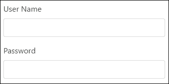

## 内联表单

如果需要将表单元素在单个水平行中左对齐布局，请使用`form-inline`类。

### 注意

表单只在宽度大于 768px 的视口中内联对齐控件。

表单控件的行为不同，因为它们接收到的是`width:auto`而不是`width: 100%`。为了使它们垂直对齐，使用`display: inline-block`。您可能需要手动调整各个控件的宽度和对齐方式：

```ts
<form  class="form-inline"> 
  <div class="form-group"> 
    <label for="user_name">User Name</label> 
    <input type="text" class="form-control" id="user_name"> 
  </div> 
  <div class="form-group"> 
    <label for="password">Password</label> 
    <input type="password" class="form-control" id="password"> 
  </div> 
</form> 

```

### 注意

每个表单控件都应该有`label`元素。

我只是在表单元素中添加了`form-inline`类来水平布局元素：

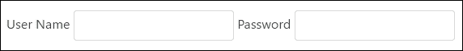

## 隐藏标签

您可以隐藏标准和内联表单的标签，以便使用占位符：

```ts
<form  class="form-inline"> 
  <div class="form-group"> 
    <label class="sr-only" for="user_name">User Name</label> 
    <input type="text" class="form-control" id="user_name"  
 **placeholder="User Name">** 

  </div> 
  <div class="form-group"> 
    <label class="sr-only" for="password">Password</label> 
    <input type="password" class="form-control" id="password"  
 **placeholder="Password">** 

  </div> 
</form> 

```

我们只需为每个标签添加`sr-only`类：

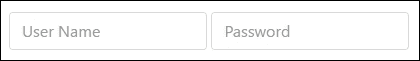

为什么我们不能删除表单中的标签使它们不可见？这个问题的答案在于辅助技术的使用，比如对于有限能力的人来说，屏幕阅读器。如果我们不为每个输入添加标签，屏幕阅读器会错误地渲染表单。Bootstrap 的作者特意设计了`sr-only`类，只为屏幕阅读器隐藏页面布局中的信息。

## 表单控件尺寸

表单控件有两种额外的尺寸，除了默认的尺寸，我们可以使用它们来增加或减小表单的尺寸：

+   使用`form-control-lg`来增加输入控件的尺寸

+   使用`form-control-sm`来减小输入控件的尺寸

## 帮助文本

有时我们需要显示与表单控件相关的帮助文本。Bootstrap 4 支持标准和内联表单的帮助文本。

您可以使用`form-text`类来创建块级帮助。它包括`display: block`并为易于与前面的输入控件间隔添加一些顶部边距：

```ts
<form> 
  <div class="form-group"> 
    <label for="user_name">User Name</label> 
    <input type="text" class="form-control" id="user_name"> 
  </div> 
  <div class="form-group"> 
    <label for="password">Password</label> 
    <input type="password" class="form-control" id="password"> 
 **<p id="passwordHelpBlock" class="form-text text-muted">** 

 **The password must be more than 8 characters long.** 

 **</p>** 

  </div> 
</form> 

```

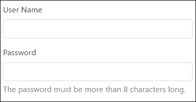

使用`text-muted`类与任何典型的内联元素（如`span`或`small`）一起创建内联表单的帮助文本：

```ts
<form  class="form-inline"> 
  <div class="form-group"> 
    <label for="user_name">User Name</label> 
    <input type="text" class="form-control" id="user_name"> 
  </div> 
  <div class="form-group"> 
    <label for="password">Password</label> 
    <input type="password" class="form-control" id="password"> 
 **<small id="passwordHelpInline" class="text-muted">** 

 **Must be 8-20 characters long.** 

 **</small>** 

  </div> 
</form> 

```


## 表单网格布局

我们可以使用 Bootstrap 4 网格为表单创建更结构化的布局。以下是一些指南：

+   将表单包装在具有`container`类的元素中

+   将`row`类添加到`form-group`

+   使用`col-*-*`类来指定标签和控件的宽度

+   将`col-form-label`类添加到所有标签上，以使它们垂直对齐相应的控件

+   将`col-form-legend`添加到传奇元素，以使它们看起来与常规标签类似

让我们使用网格更新我们的标记：

```ts
<div class="container"> 
  <form> 
    <div class="form-group row"> 
      <label for="user_name" class="col-sm-2 col-form-label"> 
        User Name 
      </label> 
      <div class="col-sm-10"> 
        <input type="text" class="form-control" id="user_name"> 
      </div> 
    </div> 
    <div class="form-group row"> 
      <label for="password" class="col-sm-2 col-form-label"> 
        Password 
      </label> 
      <div class="col-sm-10"> 
        <input type="password" class="form-control" id="password"> 
      </div> 
    </div> 
    <div class="form-group row"> 
      <label class="col-sm-2">Connection</label> 
      <div class="col-sm-10"> 
        <div class="form-check"> 
          <label class="form-check-label"> 
            <input class="form-check-input" type="checkbox">  
              Secure (SSL) 
          </label> 
        </div> 
      </div> 
    </div> 
    <div class="form-group row"> 
      <div class="offset-sm-2 col-sm-10"> 
        <button type="submit" class="btn btn-primary">Sign in 
        </button> 
      </div> 
    </div> 
  </form> 
</div> 

```

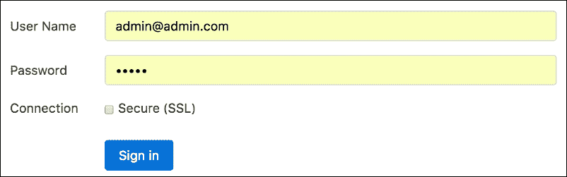

## 堆叠复选框和单选按钮

Bootstrap 4 通过`form-check*`类改进了复选框和单选按钮的布局和行为。这两种类型只有一个类，可以帮助垂直堆叠和间距兄弟元素。标签和输入必须具有适当的`form-check-label`和`form-check-input`类，以实现这种魔术。

```ts
<div class="container"> 
  <form> 
    <div class="form-group row"> 
    <label for="user_name" class="col-sm-2 col-form-label"> 
      User Name 
    </label> 
    <div class="col-sm-10"> 
      <input type="text" class="form-control" id="user_name"> 
      </div> 
    </div> 
    <div class="form-group row"> 
      <label for="password"  
             class="col-sm-2 col-form-label">Password</label> 
      <div class="col-sm-10"> 
        <input type="password" class="form-control" id="password"> 
      </div> 
    </div> 
    <fieldset class="form-group row"> 
      <legend class="col-form-legend col-sm-2">Language</legend> 
      <div class="col-sm-10"> 
        <div class="form-check"> 
          **<label class="form-check-label"> 
            <input class="form-check-input" type="radio"  
                   name="language" id="lngEnglish" value="english"  
                   checked> 
            English 
          </label>** 

        </div> 
        <div class="form-check"> 
          **<label class="form-check-label"> 
            <input class="form-check-input" type="radio"  
                   name="language" id="lngFrench" value="french"> 
            French 
          </label>** 

        </div> 
        <div class="form-check disabled"> 
          **<label class="form-check-label"> 
            <input class="form-check-input" type="radio"  
                   name="language" id="lngSpain" value="spain"   
                   disabled> 
            Spain 
          </label>** 

        </div> 
      </div> 
    </fieldset> 
  </form> 
</div> 

```

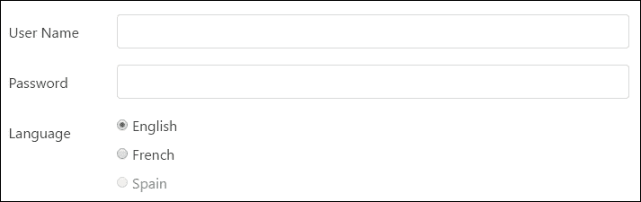

## 内联复选框和单选按钮

在需要复选框或单选按钮水平排列的情况下，您可以：

+   将`form-check-inline`类添加到标签元素

+   将`form-check-input`添加到输入

```ts
<form  class="form-inline"> 
  <div class="form-group"> 
    <label for="user_name">User Name</label> 
    <input type="text" class="form-control" id="user_name"> 
  </div> 
  <div class="form-group"> 
    <label for="password">Password</label> 
    <input type="password" class="form-control" id="password"> 
    <small id="passwordHelpInline" class="text-muted"> 
      Must be 8-20 characters long. 
    </small> 
  </div> 
  <div class="form-group"> 
 **<label class="form-check-inline">** 

 **<input class="form-check-input" type="radio" name="language"** 

 **id="lngEnglish" value="english" checked>** 

 **English** 

 **</label>** 

 **<label class="form-check-inline">** 

 **<input class="form-check-input" type="radio" name="language"** 

 **id="lngFrench" value="french">** 

 **French** 

 **</label>** 

 **<label class="form-check-inline">** 

 **<input class="form-check-input" type="radio" name="language"** 

 **id="lngSpain" value="spain" disabled>** 

 **Spain** 

 **</label>** 

  </div> 
</form> 

```

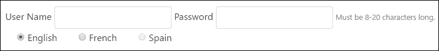

## 静态控件

在需要显示纯文本而不是输入字段的情况下，可以使用带有`form-control-static`类的段落元素：

```ts
<div class="container"> 
  <form> 
    <div class="form-group row"> 
      <label for="user_name" class="col-sm-2 col-form-label"> 
        User Name 
      </label> 
      <div class="col-sm-10"> 
 **<p class="form-control-static">Admin</p>** 

      </div> 
    </div> 
    <div class="form-group row"> 
      <label for="password" class="col-sm-2 col-form-label"> 
        Password 
      </label> 
      <div class="col-sm-10"> 
        <input type="password" class="form-control" id="password"> 
      </div> 
    </div> 
  </form> 
</div> 

```

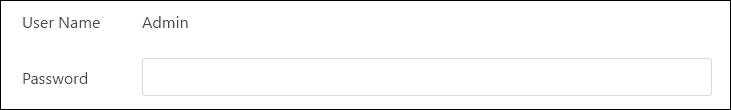

## 禁用状态

我们可以使用相同名称的属性禁用一个或多个控件上的输入：

```ts
<form> 
  <div class="form-group"> 
    <label for="user_name">User Name</label> 
    **<input type="text" class="form-control" id="user_name"  
           value="Admin" disabled>** 

  </div> 
  <div class="form-group"> 
    <label for="password">Password</label> 
    <input type="password" class="form-control" id="password"> 
    <p id="passwordHelpBlock" class="form-text text-muted"> 
      The password must be more than 8 characters long. 
    </p> 
  </div> 
</form> 

```

禁用的输入字段显示为较浅颜色，并带有`not-allowed`光标：

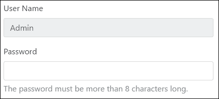

### 注意

使用自定义 JavaScript 代码禁用锚点和字段集，因为 IE 11 及以下的浏览器不完全支持此属性。

## 只读输入

为了防止修改任何输入字段，可以使用只读属性：

```ts
<form> 
  <div class="form-group"> 
    <label for="user_name">User Name</label> 
    **<input type="text" class="form-control" id="user_name"  
           value="Admin" readonly>** 

  </div> 
  <div class="form-group"> 
    <label for="password">Password</label> 
    <input type="password" class="form-control" id="password"> 
    <p id="passwordHelpBlock" class="form-text text-muted"> 
      The password must be more than 8 characters long. 
    </p> 
  </div> 
</form> 

```

这些字段看起来较浅，带有标准光标：

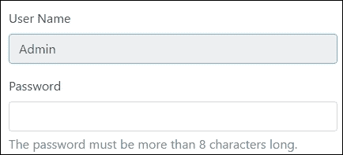

## 验证样式

Bootstrap 支持三种验证状态，并为表单控件提供适当的样式：

+   `has-success`类定义了成功状态

+   `has-danger`类定义了危险状态

+   `has-warning`类定义了警告状态

我们应该将这些类应用到父元素，这样所有的`control-label`、`form-control`或`text-muted`元素都将继承验证样式。我们可以在文本输入中使用反馈图标，比如`form-control-success`、`form-control-warning`和`form-control-danger`。为了给予额外的验证注意，我们可以使用`form-control-feedback`样式的上下文验证文本。它会根据父`has-*`类自适应颜色：

```ts
<form> 
    <div class="form-group **has-success** 

"> 
        <label class="control-label" for="username">Success 
        </label> 
        <input type="text" class="form-control  
               **form-control-success** 

" id="username"> 
        <div class=" **form-control-feedback** 

">That username's is  
           ok.</div> 
    </div> 

    <div class="form-group **has-warning** 

"> 
        <label class="control-label" for="password">Warning 
        </label> 
        <input type="password" class="form-control  
           **form-control-warning** 

" id="password"> 
        <div class=" **form-control-feedback** 

">The password is  
           weak</div> 
    </div> 

    <div class="form-group **has-danger** 

"> 
        <label class="control-label" for="card">Card</label> 
        <input type="card" class="form-control  
           **form-control-danger** 

"  
            id="card"> 
        <div class=" **form-control-feedback** 

">We accept only VISA and  
             Master cards</div> 
    </div> 
</form> 

```

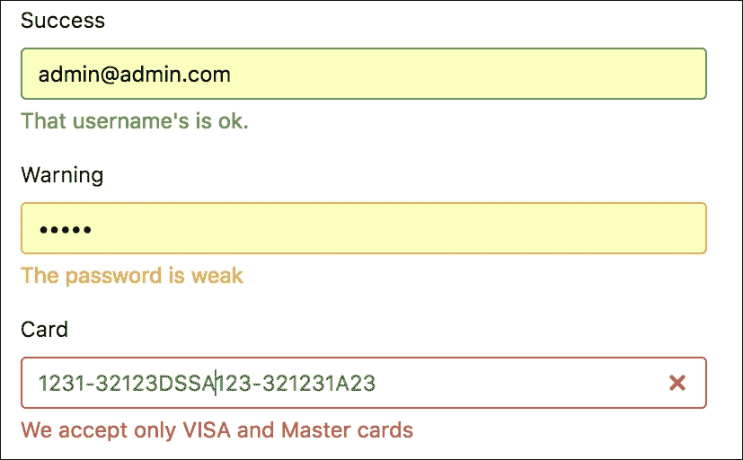

# 无表单搜索

查看`product-search.component.html`文件中的标记：

```ts
<div class="card"> 
    <div class="card-header">Quick Shop</div> 
    <div class="input-group"> 
 **<input #search type="text" class="form-control"** 

 **placeholder="Search for...">** 

 **<span class="input-group-btn">** 

 **<button class="btn btn-secondary" type="button"** 

 **(click)="searchProduct(search.value)">Go!</button>** 

 **</span>** 

    </div> 
</div> 

```

我这里没有使用`form`标签。为什么？答案相当棘手。表单标签主要用于以下情况：

+   您想执行非 AJAX 请求或向服务器发送文件

+   您需要以编程方式捕获`submit`或`reset`事件

+   您想要向表单添加验证逻辑

对于其他情况，我们可以放弃它。搜索字段背后的逻辑是在不向服务器发出任何请求的情况下，使用适当的信息更新 URL。这就是为什么搜索是无表单的。

搜索表单存在一个问题；即使搜索字段为空，**Go**按钮也始终处于启用状态。这会导致不合适的搜索结果。我们需要添加验证来解决这个问题，这里有两个选项：

+   开始监听搜索字段的键事件，以管理**Go**按钮的`enabled`属性

+   添加验证，并让 Angular 管理**Go**按钮的`enabled`属性

让我们两者都做一下，看看有什么区别。

## 事件对象中的用户输入

用户与网页交互，修改控件，这会触发 DOM 事件。我们使用事件绑定来监听那些更新组件和模型的事件，并借助一些简单的语法：

```ts
<div class="card"> 
    <div class="card-header">Quick Shop</div> 
    <div class="input-group"> 
        <input #search type="text" class="form-control"     
               placeholder="Search for..."  
 **(keyup)="searchChanged($event)">** 

        <span class="input-group-btn"> 
            <button class="btn btn-secondary" type="button"  
 **[disabled]="disabled"** 

                (click)="searchProduct(search.value)">Go!</button> 
        </span> 
    </div> 
</div> 

```

`$event`的形状取决于哪个元素引发了事件。当用户在输入元素上输入内容时，它会触发键盘事件，并在`ProductSearchComponent`的`searchChanged`方法中监听：

```ts
import {Component} from '@angular/core'; 
import {Router} from '@angular/router'; 

@Component({ 
    selector: 'db-product-search', 
    templateUrl: 'app/product/product-search.component.html' 
}) 
export class ProductSearchComponent { 

 **disabled: boolean = true;** 

    constructor(private router: Router) {} 

    searchProduct(value: string) { 
        this.router.navigate(['/products'], { queryParams: {  
        search: value} }); 
    } 

 **searchChanged(event: KeyboardEvent) {** 

 **// Get an input element** 

 **let element:HTMLInputElement =** 

 **<HTMLInputElement>event.target;** 

 **// Update the disabled property depends on value** 

 **if (element.value) {** 

 **this.disabled = false;** 

 **} else {** 

 **this.disabled = true;** 

 **}** 

 **}** 

} 

```

首先，我们从事件`target`中找到输入元素，并更改与`submit`按钮的相同名称属性绑定的组件的`disabled`属性。默认情况下，禁用值等于 true，提交按钮被灰掉：

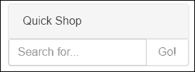

当用户输入要搜索的文本时，触发的事件会使按钮更新 URL：

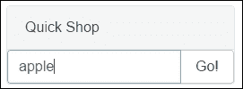

## 来自模板引用变量的用户输入

我们可以使用`#search`模板引用变量直接从输入元素中获取值，就像这样：

```ts
<div class="card"> 
    <div class="card-header">Quick Shop</div> 
    <div class="input-group"> 
        <input #search type="text" class="form-control"  
              placeholder="Search for..."  
 **(keyup)="searchChanged(search.value)">** 

        <span class="input-group-btn"> 
            <button class="btn btn-secondary" type="button"  
                [disabled]="disabled" 
                (click)="searchProduct(search.value)">Go!</button> 
        </span> 
    </div> 
</div> 

```

`searchChanged`方法的代码变得更小了：

```ts
searchChanged(value: string) { 
    // Update the disabled property depends on value  
    if (value) { 
        this.disabled = false; 
    } else { 
        this.disabled = true; 
    } 
} 

```

### 注意

选择使用模板引用变量将值传递给组件监听方法，而不是 DOM 事件。

您可以在`chapter_7/2.ecommerce-key-event-listenning`找到源代码。

# 产品视图

在产品网格中显示的产品卡片组件有一个**更多信息**按钮。当用户点击按钮时，它会导航到产品视图，您可以进行以下操作：

+   显示产品信息

+   检查产品的可用性

+   通过点击**加入购物车**或**从购物车中移除**来更新产品的数量

+   点击**继续购物**返回产品列表

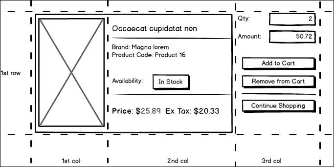

产品视图的线框图

让我们创建`product-view.component.html`。这个视图的内容相当大，所以我会按列来解释它。

## 产品图片

在第一列中，我们展示了产品的图片。产品界面有大图的参考，所以在屏幕上呈现它很简单：

```ts
<div class="container"> 
    <div class="row"> 
      <div class="col-md-5"> 
 **** 

     </div> 
     <!-- ... --> 

```

这是这一列的样子：


## 产品信息

第二列保存了关于产品的信息。我决定使用 Bootstrap 4 的卡片组件来在屏幕上呈现信息：

```ts
<div class="col-md-4"> 
    <div class="card"> 
        <div class="card-block"> 
            <h4 class="card-title">{{product.title}}</h4> 
            <p class="card-text">{{product.desc}}</p> 
        </div> 
        <ul class="list-group list-group-flush"> 
            <li class="list-group-item">ID: {{product.id}}</li> 
            <li class="list-group-item">Category:  
                {{product.categoryId | categoryTitle}}</li> 
        </ul> 
        <div class="card-footer"> 
            <p class="card-text">Availability: In Stock</p> 
        </div> 
    </div> 
    <div class="card" *ngIf="!product.isSpecial"> 
        <div class="card-block"> 
            <h4 class="card-title">Price:  
              {{product.price | currency:'USD':true:'1.2-2'}}</h4> 
        </div> 
    </div> 
    <div class="card card-inverse card-danger"  
         *ngIf="product.isSpecial"> 
        <div class="card-block"> 
            <h4 class="card-title">Price:  
              {{product.price | currency:'USD':true:'1.2-2'}}</h4> 
        </div> 
    </div> 
</div> 

```

这里有三张卡片。第一张包含产品的一般信息，比如`title`和`description`。接下来的列表保存了产品的`id`和`category`。我们使用`categoryTitle`管道来打印出类别标题。最后，我们用虚假数据打印出可用性信息。我们将在下一章更新这个块，所以现在就保持原样。

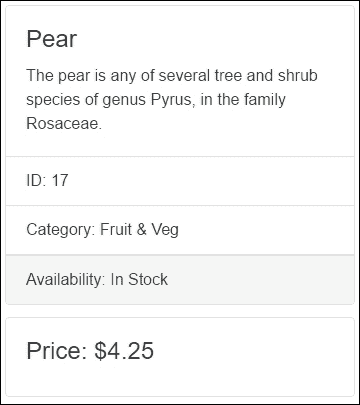

第二和第三张卡片相互对立，并根据产品的`isSpecial`属性的值呈现信息。当这个属性为`true`时，我们会以交替的颜色显示价格：

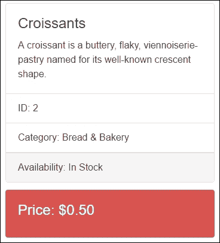

## CategoryTitle 管道

正如在第四章中提到的，*创建模板*，Angular 框架为我们提供了管道：一种在模板中声明的显示值转换的方法。管道是一个简单的函数，接受一个输入值并返回一个转换后的值。在我们的情况下，我们在购物车项目中保留了类别 ID，但我们需要显示类别的标题。出于这个原因，我们创建了文件`category.pipe.ts`，内容如下：

```ts
import {Pipe, PipeTransform} from '@angular/core'; 
import {Category, CategoryService} from './category.service'; 

/* 
 * Return category title of the value 
 * Usage: 
 *   value | categoryTitle 
 * Example: 
 *   {{ categoryId |  categoryTitle }} 
 *   presume categoryId='1' 
 *   result formats to 'Bread & Bakery' 
*/ 
@Pipe({ name: 'categoryTitle' }) 
export class CategoryTitlePipe implements PipeTransform { 

    constructor(private categoryService: CategoryService) { } 

    transform(value: string): string { 
        let category: Category = this.categoryService.getCategory(value); 
        return category ? category.title : ''; 
    } 
} 

```

此外，我们更新了`CategoryModule`来声明和导出`CategoryTitlePipe`：

```ts
import {NgModule} from '@angular/core'; 
import {CommonModule} from '@angular/common'; 
import {RouterModule} from '@angular/router'; 

import {CategoryListComponent} from './category-list.component'; 
 **import {CategoryTitlePipe} from './category.pipe';** 

import {CategoryCardComponent} from './category-card.component'; 
import {CategorySlideComponent} from './category-slide.component'; 

import {CategoryService} from './category.service'; 

@NgModule({ 
    imports: [CommonModule, RouterModule], 
    declarations: [CategoryListComponent, CategoryTitlePipe,  
                   CategoryCardComponent, CategorySlideComponent], 
    exports: [CategoryListComponent, CategoryTitlePipe,  
              CategoryCardComponent, CategorySlideComponent], 
    providers: [CategoryService] 
}) 
export class CategoryModule {} 

```

现在，`CategoryTitlePipe`在整个应用程序中都可用。

## 产品视图中的购物车信息

我在购物车组件的最后一列中使用了 Bootstrap 4 表单布局，以保留和管理来自购物车的信息，如下所述。

### 数量和金额

产品的数量和金额对于购物的用户至关重要。为了在视图上呈现它们，我将相同名称的组件属性绑定到模板中：

```ts
<div class="form-group row">
    <label for="first_name" class="col-xs-3 form-control-label">Quantity</label>
    <div class="col-xs-9">
        <h4 class="form-control-static">{{quantity}}</h4>
    </div>
</div>

<div class="form-group row">
    <label for="last_name" class="col-xs-3 form-control-label">Amount</label>
    <div class="col-xs-9">
        <h4 class="form-control-static">{{amount | currency:'USD':true:'1.2-2'}}</h4>
    </div>
</div> 

```

### 操作

用户使用**加入购物车**和**从购物车中移除**按钮来增加和减少购物车中产品的数量。这些按钮调用`CartService`的适当方法来对购物车进行必要的更改：

```ts
    <div class="form-group row"> 
        <div class="col-xs-12"> 
 **<a class="btn btn-primary btn-block"** 

 **(click)="addToCart()">Add to Cart</a>** 

 **<a class="btn btn-warning btn-block"** 

 **(click)="removeFromCart()">Remove from Cart</a>** 

        </div> 
    </div> 
    <div class="form-group row"> 
        <div class="col-xs-12"> 
 **<a class="btn btn-secondary btn-block"** 

 **[routerLink]="['/products']">Continue Shopping</a>** 

        </div> 
    </div> 
</form> 

```

最后，我们有一个**继续购物**按钮，帮助用户返回到产品视图。

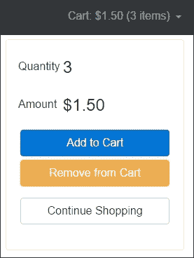

用户每次向购物车中添加或移除产品时，更改都会发生在产品视图中，该视图会更新导航栏中的购物车菜单中的信息。

## 产品视图组件

现在让我们创建`product-view.component.ts`，其中包含以下代码：

```ts
import { Component } from '@angular/core'; 
import { ActivatedRoute } from '@angular/router'; 

import { Product, ProductService } from './product.service'; 
import { Cart, CartItem, CartService } from  
    '../cart/cart.service'; 

@Component({ 
    selector: 'db-product-view', 
    templateUrl: 'app/product/product-view.component.html' 
}) 
export class ProductViewComponent { 
    product: Product; 
    cartItem: CartItem; 

    get quantity(): number { 
        return this.cartItem ? this.cartItem.count : 0; 
    } 

    get amount(): number { 
        return this.cartItem ? this.cartItem.amount : 0; 
    } 

    constructor(private route: ActivatedRoute,  
                private productService: ProductService,  
                private cartService: CartService) { 
        this.route 
            .params 
            .subscribe(params => { 
                // Get the product id 
                let id: string = params['id']; 
                // Return the product from ProductService 
                this.product = this.productService.getProduct(id); 
                // Return the cart item 
                this.cartItem = this.cartService.findItem(id); 
            }); 
    } 

    addToCart() { 
     this.cartItem = this.cartService.addProduct(this.product); 
    } 

    removeFromCart() { 
     this.cartItem = this.cartService.removeProduct(this.product); 
    } 
} 

```

在`ProductViewComponent`中有两个属性，`product`和`cartItem`，用于获取模板中的信息。我们使用`product`属性在产品视图的第二列中显示信息。`cartItem`属性保留了与产品相关联的购物车中的项目的引用：

```ts
export interface CartItem { 
    product: Product; 
    count: number; 
    amount: number; 
} 

```

我们只需要在产品视图的第三列中显示`count`和`amount`，但这是不可能的，需要额外的工作：

第一个问题是，我们无法在将产品添加到购物车之前显示`CartItem`的信息。为了解决这个问题，我们引入了`count`和`amount`属性的 getter 方法：

```ts
get quantity(): number { 
    return this.cartItem ? this.cartItem.count : 0; 
} 

get amount(): number { 
    return this.cartItem ? this.cartItem.amount : 0; 
} 

```

当用户第一次将产品添加到购物车或从中删除最后一个时，另一个问题就会发生。作为解决方案，我们需要在调用`addToCart`和`removeFromCart`方法时重新分配来自购物车的`cartItem`：

```ts
addToCart() { 
    this.cartItem = this.cartService.addProduct(this.product); 
} 

removeFromCart() { 
    this.cartItem = this.cartService.removeProduct(this.product); 
} 

```

我们使用`ActivatedRoute`服务在构造函数中检索路由的参数。由于我们的参数是作为`Observable`提供的，我们通过名称订阅它们以获取`id`参数，并告诉`productService`和`cartService`获取适当的信息。我们将保留对此`Subscription`的引用，以便稍后整理事情。

## 将 ProductView 添加到 ProductModule

打开`product.module.ts`文件以在那里引用`ProductView`：

```ts
import {NgModule} from '@angular/core'; 
import {CommonModule} from '@angular/common'; 
import {RouterModule} from '@angular/router'; 

import {ProductListComponent} from './product-list.component'; 
 **import {ProductViewComponent} from './product-view.component';** 

import {ProductCardComponent} from './product-card.component'; 
import {ProductSearchComponent} from './product-search.component'; 
import {ProductGridComponent} from './product-grid.component'; 

import {ProductService} from './product.service'; 

import {CategoryModule} from './category/category.module'; 

@NgModule({ 
    imports: [CommonModule, RouterModule, CategoryModule], 
    declarations: [ProductListComponent, **ProductViewComponent** 

,  
         ProductCardComponent, ProductSearchComponent,  
         ProductGridComponent], 
    exports: [ProductListComponent, **ProductViewComponent** 

,  
         ProductCardComponent, ProductSearchComponent,  
         ProductGridComponent], 
    providers: [ProductService] 
}) 
export class ProductModule {} 

```

`ProductView`现在在整个应用程序中可用。

## 带参数的产品视图路由定义

我们必须在`app.routes.ts`中更新路由配置，这样，当用户选择产品时，Angular 就会导航到`ProductViewComponent`：

```ts
/* 
 * Angular Imports 
 */ 
import {Routes, RouterModule} from '@angular/router'; 

/* 
 * Components 
 */ 
import {WelcomeComponent} from './welcome/welcome.component'; 
import {ProductListComponent} from  
       './product/product-list.component'; 
 **import {ProductViewComponent} from** 

 **'./product/product-view.component';** 

/* 
 * Routes 
 */ 
const routes: Routes = [ 
  { path: '', redirectTo: 'welcome', pathMatch: 'full' }, 
  { path: 'welcome', component: WelcomeComponent }, 
  { path: 'products', component: ProductListComponent }, 
 **{ path: 'products/:id', component: ProductViewComponent },** 

]; 

/* 
 * Routes Provider 
 */ 
export const routing = RouterModule.forRoot(routes); 

```

第三个路由中的`id`是路由参数的标记。在 URL 中，比如`/product/123`，`123`就是`id`参数的值。相应的`ProductViewComponent`使用该值来查找并呈现其`id`等于`123`的产品。

## 导航到产品视图

当用户在产品视图中的卡片上点击**更多信息**按钮时，路由器使用作为数组提供的信息来构建导航到产品视图的导航 URL：

```ts
<div class="card-deck-wrapper"> 
    <div class="card-deck"> 
        <div class="card" *ngFor="let product of products"> 
            <div class="card-header text-xs-center"> 
                {{product.title}} 
            </div> 
             
            <div class="card-block text-xs-center"  
                 [ngClass]="setClasses(product)"> 
                <h4 class="card-text">Price:  
                    ${{product.price}}</h4> 
            </div> 
            <div class="card-footer text-xs-center"> 
                <button class="btn btn-primary"  
                  (click)="buy(product)">Buy Now</button> 
 **<a class="btn btn-secondary"** 

 **[routerLink]="['/products', product.id]">** 

 **More Info** 

 **</a>** 

            </div> 
            <div class="card-block"> 
                <p class="card-text">{{product.desc}}</p> 
            </div> 
        </div> 
    </div> 
</div> 

```

以下是产品视图的三列的外观：

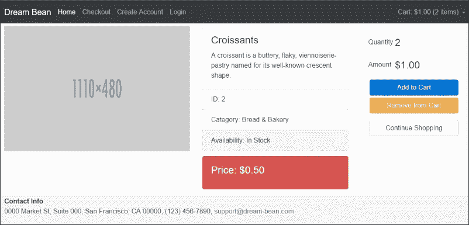

### 提示

您可以在`chapter_7/3.ecommerce-product-view`找到源代码。

# Angular 2 表单

我们之前没有在项目中使用过 Angular 2 表单，所以现在是时候揭开那些主要灵活的工具了。根据 Web 应用程序从用户请求的信息的性质，我们可以将其分为静态和动态表单：

+   我们使用模板驱动的方法来构建静态表单

+   我们使用模型驱动的方法来构建动态表单

## 表单设置

在使用新的 Angular 2 表单模块之前，我们需要安装它。打开终端窗口，导航到 Web 项目，并使用以下命令运行 npm 包管理器：

```ts
 **$ npm install @angular/forms --save** 

```

现在，当表单模块安装完成后，我们在应用程序引导期间启用它。打开`app.module.ts`文件，并使用以下代码进行更新：

```ts
/* 
 * Angular Imports 
 */ 
import { NgModule } from '@angular/core'; 
import { BrowserModule } from '@angular/platform-browser'; 
 **import { FormsModule, ReactiveFormsModule } from '@angular/forms';** 

import { RouterModule } from '@angular/router'; 

/** 
 * Modules 
 */ 
import { CartModule } from './cart/cart.module'; 
import { CategoryModule } from './category/category.module'; 
import { ProductModule } from './product/product.module'; 

/* 
 * Components 
 */ 
import { AppComponent } from './app.component'; 
import { NavbarComponent } from './navbar/navbar.component'; 
import { FooterComponent } from './footer/footer.component'; 
import { WelcomeComponent } from './welcome/welcome.component'; 

/* 
 * Routing 
 */ 
import { routing } from './app.routes'; 

@NgModule({ 
  imports: [ 
    BrowserModule, **FormsModule, ReactiveFormsModule,** 

    routing, CartModule, CategoryModule, ProductModule], 
  declarations: [AppComponent, NavbarComponent, FooterComponent, 
    WelcomeComponent], 
  bootstrap: [AppComponent] 
}) 
export class AppModule { } 

```

我们在`AppModule`中注册了两个不同的模块，因为：

+   `FormsModule`用于模板驱动表单

+   `ReactiveFormsModule`用于响应式或动态表单

我们很快就会发现它们两个。

## 模板驱动表单

这种方式是构建表单最简单的方式，几乎不需要应用程序代码。我们在模板中使用内置的 Angular 2 指令来声明性地创建表单，这些指令在幕后为我们执行所有的魔术。让我们谈谈在表单中可以使用的 Angular 2 特定指令。

## NgForm 指令

`NgForm`指令创建一个顶级`FormGroup`实例，提供有关表单当前状态的信息，例如：

+   JSON 格式的表单值

+   表单有效性状态

查看 Angular 2 源代码中的`form_group_directive.ts`中`FormGroupDirective`类的指令定义：

```ts
@Directive({ 
  selector: '[formGroup]', 
  providers: [formDirectiveProvider], 
  host: {'(submit)': 'onSubmit()', '(reset)': 'onReset()'}, 
 **exportAs: 'ngForm'** 

}) 
export class FormGroupDirective extends ControlContainer implements Form, OnChanges { // 

```

指令元数据的`exportAs`属性通过名称`ngForm`向模板公开`FormGroupDirective`的实例，因此在任何模板中，我们都可以使用模板变量引用它：

```ts
<form #myForm="ngForm"> 
    ... 
</form> 

```

模板变量`myForm`可以访问表单值，因此我们可以使用 handle 函数来管理提交的值，就像这样：

```ts
<form #myForm="ngForm" (ngSubmit)="handle(myForm.value)"> 
    ... 
</form> 

```

`ngSubmit`是一个事件信号，用户触发表单提交时会触发该事件。

## NgModel 指令

`NgModel`指令有助于在`NgForm`实例上注册表单控件。我们必须为每个表单控件指定`name`属性。通过`ngModel`和`name`属性的组合，表单控件将自动出现在表单的`value`中：

```ts
<form #myForm="ngForm" (ngSubmit)="handle(myForm.value)"> 
    <label>User Name:</label> 
    <input type="text" name="name" **ngModel** 

> 
    <label>Password:</label> 
    <input type="password" name="password" **ngModel** 

> 

    <button type="submit">Submit</button> 
</form> 

```

让我们在`handle`函数中打印表单的`value`：

```ts
handle(value) { 
    console.log(value); 
} 

```

结果以 JSON 格式打印出来：

```ts
{ 
  name: 'User', 
  password: 'myPassword' 
} 

```

我们可以使用`ngModel`作为属性指令，通过表达式将现有模型绑定到表单控件。我们可以用两种方式来处理这个问题。

**单向绑定**通过属性绑定将现有值应用于表单控件：

```ts
<form #myForm="ngForm" (ngSubmit)="handle(myForm.value)"> 
    <label>User Name:</label> 
    <input type="text" name="name" [ngModel]="name"> 
    <label>Password:</label> 
    <input type="password" name="password" [ngModel]="password"> 
    <label>Phone:</label> 
    <input type="text" name="phone" [ngModel]="phone"> 
    <label>Email:</label> 
    <input type="email" name="email" [ngModel]="email"> 

    <button type="submit">Submit</button> 
</form> 

```

在`MyForm`类中，我们有同名的属性：

```ts
@Component({...}) 
export class MyForm { 

 **name: string = 'Admin';** 

 **password: string;** 

 **phone: string;** 

 **email: string = 'admin@test.com';** 

    handle(value) { 
        console.log(value); 
    } 
} 

```

**双向绑定**将表单控件上的更改反映到属性的现有值，反之亦然：

```ts
<form #myForm="ngForm" (ngSubmit)="handle(myForm.value)"> 
    <label>User Name:</label> 
    <input type="text" name="name" [(ngModel)]="name"> 
    <p>Hi {{name}}</p> 
    <button type="submit">Submit</button> 
</form> 

```

## 使用 NgModel 跟踪更改状态和有效性

每当我们手动或以编程方式操作表单控件时，`NgModel`都会跟踪发生在它们上面的状态更改。根据这些信息，`NgModel`会更新具有特定类的控件。我们可以使用这些类来组织视觉反馈，以反映组件的状态：

+   `ng-untouched`类标记尚未访问的控件

+   `ng-touched`类标记访问过的控件

+   类`ng-pristine`标记具有未更改值的控件

+   类`ng-dirty`标记具有更改值的控件

+   类`ng-invalid`标记无效控件

+   类`ng-valid`标记有效控件

因此，我们应该能够使用`ng-valid`或`ng-invalid`类来向用户提供有关无效表单控件的反馈。让我们打开`ecommerce.css`文件并添加以下样式：

```ts
.ng-valid[required], .ng-valid.required  { 
  border-left: 2px solid green; 
} 

.ng-invalid:not(form)  { 
  border-left: 2px solid red; 
} 

```

现在，所有标记为必填字段的控件将显示绿色的左边框，而所有无效字段将具有红色的左边框。

## NgModelGroup 指令

我们可以将表单控件分组到控件组中。表单本身就是一个控件组。可以跟踪组中控件的有效状态。就像控件使用`ngModel`指令一样，组使用`NgModelGroup`指令：

```ts
<form #myForm="ngForm" (ngSubmit)="handle(myForm.value)"> 
    <fieldset **ngModelGroup="user"** 

> 
        <label>User Name:</label> 
        <input type="text" name="name" ngModel> 
        <label>Password:</label> 
        <input type="password" name="password" ngModel> 
    </fieldset> 
    <fieldset **ngModelGroup="contact"** 

> 
        <label>Phone:</label> 
        <input type="text" name="phone" ngModel> 
        <label>Email:</label> 
        <input type="email" name="email" ngModel> 
    </fieldset> 
    <button type="submit">Submit</button> 
</form> 

```

我们可以使用`fieldset`或`div`元素来分组控件。借助`ngModelGroup`，我们可以将控件语义上分组为`user`和`contact`信息：

```ts
{ 
  user: { 
    name: 'User', 
    password: 'myPassword' 
  }, 
  contact: { 
    phone: '000-111-22-33', 
    email: 'test@test.com' 
  } 
} 

```

## 基于模型的表单

这种方法有助于构建无需 DOM 要求的表单，并使其易于测试。这并不意味着我们不需要模板。我们需要它们与基于模型的方式结合使用。我们在模板中创建表单并创建代表 DOM 结构的表单模型。我们可以在这里使用两种不同的 API：

+   基于`FormGroup`和`FormControl`类的低级 API

+   基于`FormBuilder`类的高级 API

任何表单都是一个`FormGroup`。任何`FormGroup`代表一组`FormControls`。让我们想象一下我们有以下模板：

```ts
<form> 
    <label>User Name:</label> 
    <input type="text" name="name"> 
    <label>Password:</label> 
    <input type="password" name="password"> 
    <label>Phone:</label> 
    <input type="text" name="phone"> 
    <label>Email:</label> 
    <input type="email" name="email"> 

    <button type="submit">Submit</button> 
</form> 

```

现在为我们的表单创建一个模型：

```ts
import { Component } from '@angular/core'; 
import { FormGroup, FormControl } from '@angular/forms'; 

@Component({...}) 
export class MyForm { 

  myForm:FormGroup = new FormGroup({ 
    name: new FormControl('Admin'), 
    password: new FormControl(), 
    contact: new FormGroup({ 
      phone: new FormControl(), 
      email: new FormControl() 
    }) 
  }); 
} 

```

`myForm`代表我们在模板中的表单。我们为表单的每个字段创建`FormControl`，并为每个组创建`FormGroup`。在第一个属性中，我们为名称分配默认值。`FormGroup`可以包含另一个组，并有助于创建层次结构以复制 DOM 结构。

## FormGroup 指令

现在，我们需要使用 Angular 2 的`FormGroup`指令将模型绑定到表单元素。我们需要将表达式评估分配到`FormGroup`实例中：

```ts
<form [formGroup]="myForm"> 
  ... 
</form> 

```

## FormControlName 指令

下一个非常重要的步骤是将模型属性与表单元素关联起来。我们使用`FormControlName`而不是 name 属性来注册控件：

```ts
import {Component} from '@angular/core'; 
import {FormControl, FormGroup, Validators} from '@angular/forms'; 

@Component({ 
  selector: 'logon-form', 
  template: ` 
    <form [formGroup]="form" (ngSubmit)="onSubmit()"> 
      <div *ngIf="userName.invalid">Name is too short. </div> 
      <input formControlName="userName" placeholder="User name"> 
      <input formControlName="password" placeholder="Password"> 
      <input formControlName="phone" placeholder="Phone"> 
      <input formControlName="email" placeholder="Email"> 
      <button type="submit">Submit</button> 
   </form>` 
}) 
export class LogonFormGroup { 
  form = new FormGroup({ 
    userName: new FormControl('', Validators.minLength(2)), 
    password: new FormControl('', Validators.minLength(5)), 
    phone: new FormControl(''), 
    email: new FormControl('') 
  }); 

  get userName(): any { return this.form.get('userName'); } 
  get password(): any { return this.form.get('password'); } 

  constructor() { 
    this.form.setValue({userName: 'admin', password: '12345', phone: '123-123', email: 'mail@example.com'}); 
  } 

  onSubmit(): void { 
    console.log(this.form.value);   
    // Will print {userName: 'admin', password: '12345',  
    // phone: '123-123', email: 'main@example.com'} 
  } 
} 

```

该指令将`FormControl`和`FormGroup`中的`userName`和`password`与同名的 DOM 元素保持同步。任何变化都是以编程方式发生的，`FormGroup`属性将立即写入 DOM 元素，反之亦然。我们使用`get`和`set`方法来访问和更新表单属性。

## FormGroupName 指令

在有一组控件的情况下，我们可以使用`FormGroupName`指令将一组控件与父`FormGroupDirective`（正式为`FormGroup`选择器）关联起来。您应该通过名称属性指定要链接到哪个嵌套的`FormGroup`元素，因此单独组织子组元素的验证可能非常方便：

```ts
import {Component} from '@angular/core'; 
import {FormControl, FormGroup, Validators} from '@angular/forms'; 

@Component({ 
  selector: 'logon-form', 
  template: ` 
    <form [formGroup]="form" (ngSubmit)="onSubmit()"> 
      <p *ngIf="userName.invalid">Name is invalid.</p> 
      <input formControlName="userName" placeholder="User name"> 
      <input formControlName="password" placeholder="Password"> 
      <fieldset **formGroupName** 

="contact"> 
        <input formControlName="phone"> 
        <input formControlName="email"> 
      </fieldset> 
      <button type="submit">Submit</button> 
    </form>` 
}) 
export class LogonFormComponent { 
  form = new FormGroup({ 
    userName: new FormControl('', Validators.minLength(2)), 
    password: new FormControl('', Validators.minLength(5)), 

    contact: new FormGroup({ 
      phone: new FormControl(''), 
      email: new FormControl('') 
    }) 
  }); 
  get userName(): any { return this.form.get(userName'); } 
  get password(): any { return this.form.get('password'); } 
  get phone(): any { return this.form.get('contact.phone'); } 
  get email(): any { return this.form.get('contact.email'); } 

  constructor() { 
    this.form.setValue({userName: 'admin', password: '12345',  
       phone: '123-123', email: 'mail@example.com'}); 
  } 

  onSubmit() { 
    console.log(this.form.value);    
    // Will print: {userName: 'admin', password: '12345',  
    // phone: '123-123', email: 'main@example.com'} 
    console.log(this.form.status);   
    // Will print: VALID 
  } 
} 

```

我们使用`FormGroup`的`get`方法来访问属性。个别控件可以通过点语法来访问，如前面的代码所示。

## FormBuilder 类

`FormBuilder`从用户指定的配置创建一个`AbstractControl`表单对象。因此，我们不需要创建`FormGroup`，`FormControl`和`FormArray`元素，我们构建配置来构造模型。我们只需要在构造函数中注入它，并调用`group`方法来创建表单组：

```ts
import {Component} from '@angular/core'; 
import {FormBuilder, FormGroup} from '@angular/forms'; 

@Component({...}) 
export class MyForm { 
  myForm:FormGroup; 

  constructor(private **formBuilder: FormBuilder** 

) {} 

  ngOnInit() { 
    this.myForm = **this.formBuilder.group** 

({ 
      name: [], 
      password: , 
      contect: this.formBuilder.group({ 
        phone: [], 
        email: [] 
      }) 
    }); 
  } 
} 
import {Component, Inject} from '@angular/core'; 
import {FormBuilder, FormGroup, Validators} from '@angular/forms'; 

@Component({ 
  selector: 'logon-form', 
  template: ` 
    <form [formGroup]="form"> 
      <div formGroupName="name"> 
        <input formControlName="first" placeholder="First"> 
        <input formControlName="last" placeholder="Last"> 
      </div> 
      <input formControlName="email" placeholder="Email"> 
      <button>Submit</button> 
    </form> 
    <form [formGroup]="form" (ngSubmit)="onSubmit()"> 
      <p *ngIf="userName.invalid">Name is invalid.</p> 
      <input formControlName="userName" placeholder="User name"> 
      <input formControlName="password" placeholder="Password"> 
      <fieldset **formGroupName** 

="contact"> 
        <input formControlName="phone"> 
        <input formControlName="email"> 
      </fieldset> 
      <button type="submit">Submit</button> 
    </form> 
    <p>Value: {{ form.value | json }}</p> 
    <p>Validation status: {{ form.status }}</p> 
  ` 
}) 
export class LogonFormComponent { 
  form: FormGroup; 
  constructor(@Inject(FormBuilder) fb: FormBuilder) { 
    this.form = fb.group({ 
      userName: ['', Validators.minLength(2)], 
      password: ['', Validators.minLength(5)], 

      contact: fb.group({ 
        phone: [''], 
        email: [''] 
      }) 
    }); 
  } 

  get userName(): any { return this.form.get(userName'); } 
  get password(): any { return this.form.get('password'); } 
  get phone(): any { return this.form.get('contact.phone'); } 
  get email(): any { return this.form.get('contact.email'); } 

  constructor() { 
    this.form.setValue({userName: 'admin', password: '12345',  
       phone: '123-123', email: 'mail@example.com'}); 
  } 

  onSubmit() { 
    console.log(this.form.value);    
    // Will print: {userName: 'admin', password: '12345',  
    // phone: '123-123', email: 'main@example.com'} 
    console.log(this.form.status);   
    // Will print: VALID 
  } 
} 

```

因此，我们有了更简洁的代码。

## FormControl 指令

在本章的开头，我们谈到了无形搜索表单。这个表单只有一个元素，我们根本不需要`FormGroup`。Angular 有一个`FormControl`指令，它不必在`FormGroup`内。它只将其添加到单个表单控件中：

```ts
<div class="card"> 
    <div class="card-header">Quick Shop</div> 
    <div class="input-group"> 
        <input #search type="text" class="form-control"  
              placeholder="Search for..."  
 **[formControl]="seachControl">** 

        <span class="input-group-btn"> 
            <button class="btn btn-secondary" type="button"  
                [disabled]="disabled" 
                (click)="searchProduct(search.value)">Go!</button> 
        </span> 
    </div> 
</div> 

```

脚本的更新版本如下：

```ts
import {Component} from '@angular/core'; 
import {Router} from '@angular/router'; 
 **import {FormControl} from '@angular/forms';** 

@Component({ 
    selector: 'db-product-search', 
    templateUrl: 'app/product/product-search.component.html' 
}) 
export class ProductSearchComponent { 

    disabled: boolean = true; 
 **seachControl: FormControl;** 

    constructor(private router: Router) {} 

 **ngOnInit() {** 

 **this.seachControl = new FormControl();** 

 **this.seachControl.valueChanges.subscribe((value: string) => {** 

 **this.searchChanged(value);** 

 **});** 

 **}** 

    searchProduct(value: string) { 
        this.router.navigate(['/products'], { queryParams:  
                                         { search: value} }); 
    } 

    searchChanged(value: string) { 
        // Update the disabled property depends on value  
        if (value) { 
            this.disabled = false; 
        } else { 
            this.disabled = true; 
        } 
    } 
} 

```

## 内置验证器

我无法想象没有验证器的表单。Angular 2 带有几个内置验证器，我们可以使用声明式指令或使用`FormControl`，`FormGroup`或`FormBuilder`类进行命令式使用。以下是它们的列表：

+   带有`required`验证器的表单控件必须具有非空值

+   带有`minLength`的表单控件必须具有最小长度的值

+   带有`maxLength`的表单控件必须具有最大长度的值

+   带有`pattern`的表单控件必须具有与给定正则表达式匹配的值

以下是如何在声明式中使用它们的示例：

```ts
<form novalidate> 
  <input type="text" name="name" ngModel **required** 

> 
  <input type="password" name="password" ngModel **minlength="6"** 

> 
  <input type="text" name="city" ngModel **maxlength="10"** 

> 
  <input type="text" name="phone" ngModel  
 **pattern="^(\+\d{1,2}\s)?\(?\d{3}\)?[\s.-]\d{3}[\s.-]\d{4}$">** 

</form> 

```

请记住，`novalidate`不是 Angular 2 的一部分。这是一个 HTML5 布尔表单属性。当表单提交时，它不会验证输入字段。

我们可以使用相同的验证器来命令性地使用`FormGroup`和`FormControl`：

```ts
@Component({...}) 
export class MyForm { 
  myForm: FormGroup; 

  ngOnInit() { 
    this.myForm = new FormGroup({ 
      name: new FormControl('', Validators.required)), 
      password: new FormControl('', Validators.minLength(6)), 
      city: new FormControl('', Validators.maxLength(10)), 
      phone: new FormControl('', Validators.pattern( 
        '[^(\+\d{1,2}\s)?\(?\d{3}\)?[\s.-]\d{3}[\s.-]\d{4}$')) 
    }); 
  } 
} 

```

如前所述，我们可以使用`FormBuilder`和更少冗长的代码：

```ts
@Component({...}) 
export class MyForm { 
  myForm: FormGroup; 

  constructor(private fb: FormBuilder) {} 

  ngOnInit() { 
    this. myForm = this.fb.group({ 
      name: ['', Validators.required], 
      password: ['', Validators.minLength(6)], 
      city: ['', Validators.maxLength(10)], 
      phone: ['', Validators.pattern( 
         '[^(\+\d{1,2}\s)?\(?\d{3}\)?[\s.-]\d{3}[\s.-]\d{4}$')] 
    }); 
  } 
} 

```

在这两种情况下，我们必须使用`formGroup`指令将`myForm`模型与 DOM 中的表单元素关联起来：

```ts
<form novalidate [ **formGroup** 

]=" **myForm** 

"> 
... 
</form> 

```

## 创建自定义验证器

Angular 2 有一个接口`Validator`，可以由可以充当验证器的类来实现：

```ts
export interface Validator {  
    validate(c: AbstractControl): { 
        return [key: string]: any 
    }; 
} 

```

让我们创建一个函数来验证邮政编码的正确性。在`shared`文件夹中创建文件`zip.validator.ts`，并使用以下代码：

```ts
import {FormControl} from '@angular/forms'; 

export function validateZip(c: FormControl) { 
  let ZIP_REGEXP:RegExp = new RegExp('[A-Za-z]{5}'); 

  return ZIP_REGEXP.test(c.value) ? null : { 
    validateZip: { 
      valid: false 
    } 
  }; 
} 

```

`validateZip`函数期望`FormControl`作为参数，并且如果值不匹配正则表达式，则必须返回一个错误对象，如果值有效，则返回 null。现在，我们可以导入`validateZip`函数并在我们的类中使用它：

```ts
import {Component} from '@angular/core'; 
import { **validateZip** 

} from '../shared/zip.validator'; 
import {FormBuilder, FormGroup, Validators} from '@angular/forms'; 

@Component({...}) 
export class MyForm { 
  form: FormGroup; 

  constructor(private **fb: FormBuilder** 

) {} 

  ngOnInit() { 
    this.form = this.fb.group({ 
      name: ['', Validators.required], 
      password: ['', Validators.minLength(6)], 
      city: ['', Validators.maxLength(10)], 
      zip: ['', **validateZip** 

] 
    }); 
  } 
} 

```

## 创建自定义验证器指令

我们可以使用 Angular 2 内置的验证器命令式地或声明式地，借助一些内部代码来执行表单控件上的验证器。所有内置和自定义验证器都必须在多提供者依赖令牌`NG_VALIDATORS`中注册。正如您在第六章中所记得的，*依赖注入*，提供者的多属性允许将多个值注入到相同的令牌中。Angular 注入`NG_VALIDATORS`，实例化表单，并对表单控件进行验证。让我们创建自定义验证指令，我们可以在模板驱动的表单中使用。打开`zip.valdator.ts`并复制粘贴以下代码：

```ts
import {FormControl} from '@angular/forms'; 
import {Directive,forwardRef} from '@angular/core'; 
import {NG_VALIDATORS} from '@angular/forms'; 

export function validateZip(c: FormControl) { 
  let ZIP_REGEXP:RegExp = new RegExp('[A-Za-z]{5}'); 

  return ZIP_REGEXP.test(c.value) ? null : { 
    validateZip: { 
      valid: false 
    } 
  }; 
} 

@Directive({ 
  selector: '[validateZip][ngModel],[validateZip][formControl]', 
  providers: [ 
    {provide: NG_VALIDATORS, useExisting: forwardRef(() =>  
       ZipValidator), multi: true} 
  ] 
}) 
export class ZipValidator { 

  validator: Function = validateZip; 

  validate(c: FormControl) { 
    return this.validator(c); 
  } 
} 

```

现在在表单中，我们可以使用`ZipValidator`作为指令：

```ts
<form novalidate> 
  <input type="text" name="name" ngModel **required** 

> 
  <input type="password" name="password" ngModel **minlength="6"** 

> 
  <input type="text" name="city" ngModel **maxlength="10"** 

> 
  <input type="text" name="zip" ngModel **validateZip** 

> 
</form> 

```

# 购物车视图

购物车视图列出了用户购物车中持有的所有商品。它显示了每件商品的产品详细信息，并且用户可以从这个页面：

+   通过单击**清空购物车**从购物车中删除所有商品

+   更新任何列出的商品的数量

+   通过单击**继续**购物返回产品列表

+   通过单击**结账**进行结账

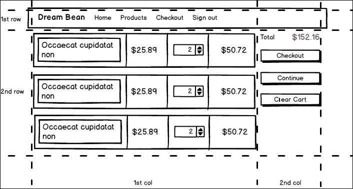

购物车视图的线框

购物车视图的重要部分是由网格中动态内容组成的。看一下线框的第一列。有一排类似的数据，我们可以用来显示、修改和验证。为此，我们可以使用 Angular 静态表单来在视图上呈现购物车的内容。

让我们创建`cart-view.component.html`。在第一列，我们需要打印出添加到购物车的产品信息：

```ts
<div *ngIf="cart.count"> 
    <form #form="ngForm"> 
        <div class="table-responsive"> 
            <table class="table table-sm table-striped  
                          table-bordered table-cart"> 
                <tbody> 
                    <tr> 
                        <td class="font-weight-bold">Title</td> 
                        <td class="font-weight-bold">Price</td> 
                        <td class="font-weight-bold">Count</td> 
                        <td class="font-weight-bold">Amount</td> 
                    </tr> 
                    <tr *ngFor="let item of cart.items"> 
                        <td>{{item.product.title}}</td> 
                        <td>{{item.product.price |  
                            currency:'USD':true:'1.2-2'}}</td> 
                        <td> 
                            <input type="number"  
              name="{{item.product.id}}" min="1"  
              [ngModel]="item.count" 
              (ngModelChange)="item.count = update($event, item)"> 
                        </td> 
                        <td>{{item.amount |  
                              currency:'USD':true:'1.2-2'}}</td> 
                    </tr> 
                </tbody> 
            </table> 
        </div> 
    </form> 
</div> 
<div class="emty-cart" *ngIf="!cart.count">The cart is empty!</div> 

```

我们在这里使用模板驱动方法，并将表单变量分配给公开的`ngForm`。我将双向绑定格式拆分为两个语句：

+   `[ngModel]="item.count"`：这用作属性绑定。

+   `(ngModelChange)="item.count = update($event, item)"`：这用作事件绑定。

每当用户更新`count`值时，此代码调用`update`方法来添加或从购物车中删除产品：

```ts
import {Component, Input} from '@angular/core'; 
import {Cart, CartItem, CartService} from './cart.service'; 

@Component({ 
    selector: 'db-cart-view', 
    templateUrl: 'app/cart/cart-view.component.html' 
}) 
export class CartViewComponent { 

    private cart: Cart; 

    constructor(private cartService: CartService) { 
        this.cart = this.cartService.cart; 
    } 

    clearCart() { 
        this.cartService.clearCart(); 
    } 

 **update(value, item: CartItem) {** 

 **let res = value - item.count;** 

 **if (res > 0) {** 

 **for (let i = 0; i < res; i++) {** 

 **this.cartService.addProduct(item.product);** 

 **}** 

 **} else if (res < 0) {** 

 **for (let i = 0; i < -res; i++) {** 

 **this.cartService.removeProduct(item.product);** 

 **}** 

 **}** 

 **return value;** 

 **}** 

} 

```

因为我们有一个**清空购物车**按钮，我们需要在`CartService`中实现同名的方法：

```ts
clearCart() { 
    this.cart.items = []; 
    this.cart.amount = 0; 
    this.cart.count = 0; 
} 

```

## 购物车视图路由定义

我更新了`app.routes.ts`中的路由器配置，以反映必要的更改以导航到`CartViewComponent`：

```ts
const routes: Routes = [ 
  { path: '', redirectTo: 'welcome', pathMatch: 'full' }, 
  { path: 'welcome', component: WelcomeComponent }, 
  { path: 'products', component: ProductListComponent }, 
  { path: 'products/:id', component: ProductViewComponent }, 
 **{ path: 'cart', component: CartViewComponent }** 

]; 

```

## 导航到购物车视图

当用户在购物车菜单的标记中单击**购物车**按钮时，路由器使用链接中的信息导航到购物车视图：

```ts
<div class="row"> 
    <div class="col-md-12"> 
 **<a [routerLink]="['/cart']"** 

           class="btn btn-primary pull-xs-right btn-cart"> 
            <i class="fa fa-shopping-cart" aria-hidden="true"></i>  
            Cart 
        </a> 
        <a [routerLink]="['/checkout']"  
           class="btn btn-success pull-xs-right btn-cart"> 
            <i class="fa fa-credit-card" aria-hidden="true"></i>  
              Checkout 
        </a> 
    </div> 
</div> 

```

我们需要更新`CartModule`，将`CartViewComponent`添加到`NgModule`的`declarations`属性中：

```ts
import {NgModule} from '@angular/core'; 
import {CommonModule} from '@angular/common'; 
import {FormsModule, ReactiveFormsModule} from '@angular/forms'; 
import {RouterModule} from '@angular/router'; 

import {CartMenuComponent} from './cart-menu.component'; 
 **import {CartViewComponent} from './cart-view.component';** 

import {CartService} from './cart.service'; 

@NgModule({ 
    imports: [CommonModule, FormsModule, ReactiveFormsModule, RouterModule], 
    declarations: [CartMenuComponent, **CartViewComponent** 

], 
    exports: [CartMenuComponent, **CartViewComponent** 

], 
    providers: [CartService] 
}) 
export class CartModule {} 

```

这是购物车视图的屏幕截图：

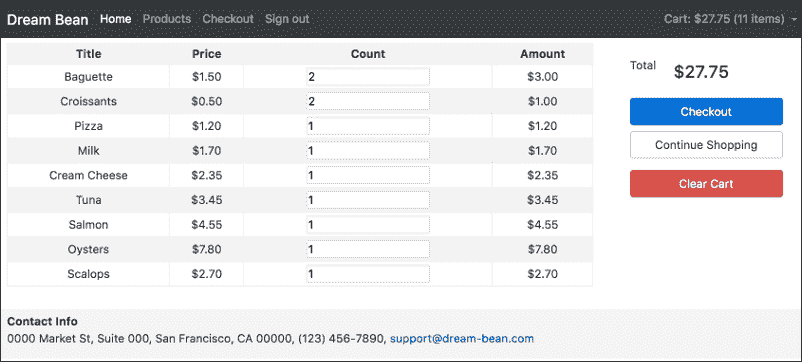

### 提示

您可以在`chapter_7/4.ecommerce-cart-view`找到源代码。

# 结账视图

结账视图显示客户详细信息表单，购买条件和订单信息。客户应填写表单，接受付款，并单击**提交**按钮开始付款流程。

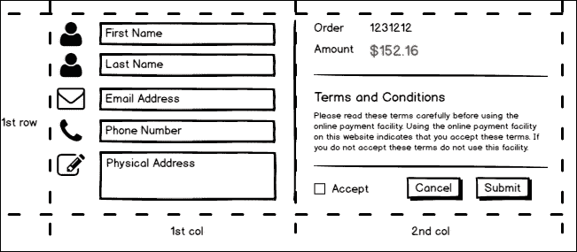

结账视图的线框图

创建`checkout`文件夹和`checkout-view.component.ts`文件：

```ts
import {Component, Input} from '@angular/core'; 
import {FormGroup, FormBuilder, Validators} from '@angular/forms'; 

import {Cart, CartItem, CartService} from '../cart/cart.service'; 

@Component({ 
    selector: 'db-checkout-view', 
    templateUrl: 'app/checkout/checkout-view.component.html' 
}) 
export class CheckoutViewComponent { 

    private cart: Cart; 
    form: FormGroup; 

    constructor(private cartService: CartService,  
                private fb: FormBuilder) { 
        this.cart = this.cartService.cart; 
    } 

    ngOnInit() { 
        this.form = this.fb.group({ 
            firstName: ['', Validators.required], 
            lastName: ['', Validators.required], 
            email: ['', Validators.required], 
            phone: ['', Validators.required], 
            address: [] 
        });  
    } 

    submit() { 
        alert('Submitted'); 
        this.cartService.clearCart(); 
    } 
} 

```

我在这里使用了模型驱动方法来创建表单的定义。当用户单击**提交**按钮时，它会显示消息并清空购物车。创建`checkout-view.component.html`并将以下内容复制到那里：

```ts
<form [formGroup]="form"> 
    <div class="form-group row"> 
        <label for="firstName"  
               class="col-xs-2 col-form-label">First Name:</label> 
        <div class="col-xs-10"> 
            <input class="form-control" type="text" value=""  
                   id="firstName" formControlName="firstName"> 
            <p [hidden]="form.controls.firstName.valid ||  
                         form.controls.firstName.pristine"  
                         class="form-text alert-danger"> 
               The First Name is required 
            </p> 
        </div> 
    </div> 
    <div class="form-group row"> 
        <label for="lastName" class="col-xs-2 col-form-label"> 
            Last Name:</label> 
        <div class="col-xs-10"> 
            <input class="form-control" type="text" value=""  
                 id="lastName" formControlName="lastName"> 
                 <p [hidden]="form.controls.lastName.valid ||  
                                form.controls.lastName.pristine"  
                                class="form-text alert-danger"> 
                     The Last Name is required 
                  </p> 
        </div> 
    </div> 
    <div class="form-group row"> 
        <label for="email"  
            class="col-xs-2 col-form-label">Email:</label> 
        <div class="col-xs-10"> 
            <input class="form-control" type="email" value=""  
                  id="email"> 
            <p [hidden]="form.controls.email.valid ||  
                         form.controls.email.pristine"  
                         class="form-text alert-danger"> 
                The Email is required 
            </p> 
        </div> 
    </div> 
    <div class="form-group row"> 
        <label for="phone"  
              class="col-xs-2 col-form-label">Phone:</label> 
        <div class="col-xs-10"> 
            <input class="form-control" type="phone" value=""  
                   id="phone"> 
            <p [hidden]="form.controls.phone.valid ||  
                         form.controls.phone.pristine"  
                         class="form-text alert-danger"> 
                The Phone is required 
            </p> 
        </div> 
    </div> 
    <div class="form-group row"> 
        <label for="address"  
             class="col-xs-2 col-form-label">Address:</label> 
        <div class="col-xs-10"> 
            <input class="form-control" type="text" value=""   
                id="address"> 
        </div> 
    </div> 
</form> 

```

我们有几个必填字段，所以当它们为空时，Angular 2 通过`NgModel`将它们的条变成红色。这是可以接受的，以指示问题，但不足以说明出了什么问题。我们可以使用验证错误消息来显示控件是否无效或未被触摸。看一下我从前面的代码中复制的标记：

```ts
<input class="form-control" type="text" value=""  
       id="firstName" formControlName="firstName"> 
<p [hidden]="form.controls.firstName.valid ||  
             form.controls.firstName.pristine"  
             class="form-text alert-danger"> 
    The First Name is required 
</p> 

```

我们直接从表单模型中读取`FormControl`状态的信息。我们检查`firstName`字段是否有效，或者是否是原始的，并显示或隐藏错误消息。

最后，我们将**提交**按钮的禁用属性绑定到表单的有效性，因此只有在表单的所有字段都有效时，用户才有机会将数据发送到服务器：

```ts
<div class="col-xs-9"> 
    <button class="btn btn-primary" (click)="submit()"  
           **[disabled]="!form.valid"** 

>Submit</button> 
    <button class="btn btn-secondary"  
           [routerLink]="['/products']">Continue Shopping</button> 
</div> 

```

## 检查视图路由定义

更新`app.routes.ts`中的路由器配置以添加`CheckoutViewComponent`：

```ts
const routes: Routes = [ 
  { path: '', redirectTo: 'welcome', pathMatch: 'full' }, 
  { path: 'welcome', component: WelcomeComponent }, 
  { path: 'products', component: ProductListComponent }, 
  { path: 'products/:id', component: ProductViewComponent }, 
  { path: 'cart', component: CartViewComponent }, 
 **{ path: 'checkout', component: CheckoutViewComponent }** 

]; 

```

## 导航到结账视图

当用户在购物车菜单的标记上单击**结账**按钮时，路由器会导航到该视图：

```ts
<div class="row"> 
    <div class="col-md-12"> 
        <a [routerLink]="['/cart']"  
           class="btn btn-primary pull-xs-right btn-cart"> 
            <i class="fa fa-shopping-cart" aria-hidden="true"></i>  
            Cart 
        </a> 
 **<a [routerLink]="['/checkout']"** 

           class="btn btn-success pull-xs-right btn-cart"> 
            <i class="fa fa-credit-card" aria-hidden="true"></i>  
              Checkout 
        </a> 
    </div> 
</div> 

```

`CheckoutViewComponent`不属于任何模块，因此我们需要将其添加到`AppModule`中：

```ts
/* 
 * Components 
 */ 
import {AppComponent}  from './app.component'; 
import {NavbarComponent} from './navbar/navbar.component'; 
import {FooterComponent} from './footer/footer.component'; 
import {WelcomeComponent} from './welcome/welcome.component'; 
 **import {CheckoutViewComponent} from** 

 **'./checkout/checkout-view.component';** 

/* 
 * Routing 
 */ 
import {routing}  from './app.routes'; 

@NgModule({ 
  imports: [BrowserModule, FormsModule, ReactiveFormsModule,  
            routing, CartModule, CategoryModule, ProductModule], 
  declarations: [AppComponent, NavbarComponent, FooterComponent,  
                WelcomeComponent, **CheckoutViewComponent** 

], 
  bootstrap: [AppComponent] 
}) 
export class AppModule { } 

```

这是带有验证错误消息的结账视图的屏幕截图：

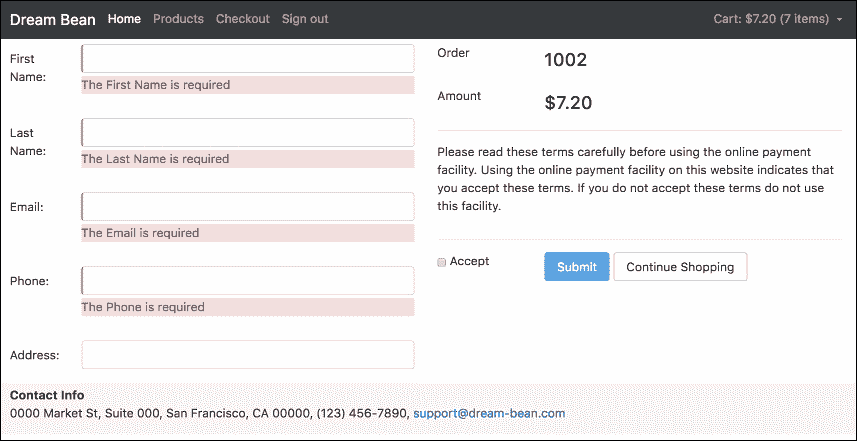

### 提示

您可以在`chapter_7/5.ecommerce-checkout-view`找到源代码。

# 总结

在本章中，我们发现了如何使用 Bootstrap 4 创建表单。我们知道 Bootstrap 支持从简单到复杂的不同布局。

我们调查了 Angular 2 表单模块，现在可以创建基于模型和基于模板的表单。

我们把应用程序的所有部分都连接起来了，现在看起来非常好。

在第八章中，*高级组件*，我们将讨论组件的生命周期以及可以在组件不同阶段使用的方法。本章还讨论了如何创建多组件应用程序。像往常一样，我们将继续构建我们在之前章节中开始开发的项目。
