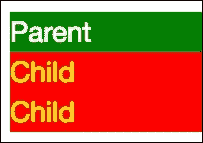

# 第八章：高级组件

本章描述了组件的生命周期以及可以在生命周期的不同阶段使用的方法。在本章中，我们将分析此周期的每个阶段，并学习如何充分利用在组件从一个阶段转移到另一个阶段时触发的钩子方法。本章还讨论了如何创建多组件应用程序。读者将能够使用 Bootstrap 为应用程序添加更多功能。

在本章结束时，您将对以下内容有扎实的理解：

+   组件生命周期钩子接口

+   生命周期钩子方法

+   实现钩子接口

+   变更检测

+   组件之间的通信

# 指令

指令是 Angular 2 的基本构建块，允许您将行为连接到 DOM 中的元素。有三种类型的指令：

+   属性指令

+   结构指令

+   组件

指令是一个带有分配的类`@Directive`装饰器。

## 属性指令

属性指令通常改变元素的外观或行为。我们可以通过绑定属性来改变多个样式或使用它来渲染文本为粗体或斜体。

## 结构指令

结构指令通过添加和删除其他元素来改变 DOM 布局。

## 组件

组件是带有模板的指令。每个组件由两部分组成：

+   我们定义应用程序逻辑的类

+   由组件控制的视图，通过属性和方法的 API 与其交互

组件是一个带有分配的类`@Component`装饰器。

# 指令生命周期

要为任何项目开发自定义指令，您应该了解 Angular 2 指令生命周期的基础知识。指令在创建和销毁之间经历了许多不同阶段：

1.  实例化

1.  初始化

1.  变更检测和渲染

1.  内容投影（仅适用于组件）

1.  视图之后（仅适用于组件）

1.  销毁

# Angular 生命周期钩子

Angular 提供了指令生命周期钩子，使我们能够在发生这些关键时刻时采取行动。我们可以在 Angular `core`库中实现一个或多个生命周期钩子接口。每个接口都有一个单一的方法，其名称是以`ng`为前缀的接口名称。接口对于 TypeScript 是可选的，如果定义了接口，Angular 将调用钩子方法。

### 注意

我建议实现生命周期钩子接口到指令类中，以便从强类型和编辑器工具中受益。

# 读累了记得休息一会哦~

**公众号：古德猫宁李**

+   电子书搜索下载

+   书单分享

+   书友学习交流

**网站：**[沉金书屋 https://www.chenjin5.com](https://www.chenjin5.com)

+   电子书搜索下载

+   电子书打包资源分享

+   学习资源分享

# 实例化

注入器使用`new`关键字创建指令实例。每个指令最多可以包含一个构造函数声明。如果一个类不包含构造函数声明，将提供自动构造函数。构造函数的主要目的是创建对象的新实例并为其设置初始属性。Angular 2 使用构造函数进行依赖注入，因此我们可以保存对依赖实例的引用以供以后使用：

```ts
export class CategoryListComponent { 

    categories: Category[]; 

    constructor(private router: Router,  
                private categoryService: CategoryService) { 
        this.categories = this.categoryService.getCategories(); 
    } 

    filterProducts(category: Category) { 
        this.router.navigate(['/products'], {  
          queryParams: { category: category.id}  
        }); 
    } 
} 

```

在上面的例子中，`CategoryListComponent`类有一个构造函数，其中有两个参数引用`Router`和`CategoryService`。

# 初始化

在每个指令中都有数据绑定的输入属性，并且 Angular 在初始化阶段保存了绑定属性的值：

```ts
export class CategorySlideComponent { 
    @Input() category: Category; 
    @Output() select: EventEmitter<Category> =  
       new EventEmitter<Category>(); 
} 

```

`CategorySlideComponent`类有一个与模板中同名属性绑定的类别。

我们可以实现`OnInit`和`OnChanges`接口来做出相应的响应：

+   当数据绑定的输入属性值发生变化时，Angular 调用`ngOnChanges`方法

+   Angular 在第一次`ngOnChanges`之后调用`ngOnInit`方法，并向我们发出信号，表明组件已经初始化

在下面的代码中，我们实现了`OnInit`接口来创建表单控件并开始监听其值的变化：

```ts
@Component({ 
    selector: 'db-product-search', 
    templateUrl: 'app/product/product-search.component.html', 
    changeDetection: ChangeDetectionStrategy.OnPush 
}) 
export class ProductSearchComponent implements OnInit { 

    disabled: boolean = true; 
    seachControl: FormControl; 

    constructor(private router: Router,  
                private changeDetection: ChangeDetectorRef) {} 

 **ngOnInit() {** 

 **this.seachControl = new FormControl();** 

 **this.seachControl.valueChanges.subscribe((value: string)** 

 **=> {** 

 **this.searchChanged(value);** 

 **this.changeDetection.markForCheck();** 

 **});** 

 **}** 

... 
} 

```

大多数情况下，我们依赖`ngOnInit`方法有以下原因：

+   我们需要在构造函数之后执行初始化

+   在 Angular 设置输入属性后，完成组件设置

这个方法是一个完美的位置，用于从服务器获取数据或根据输入属性更新内部状态的繁重初始化逻辑。

# 变更检测和渲染

这个阶段故意结合了 Angular 2 用来为应用程序注入生命的两种重要技术。一方面，框架的变更检测模块负责监视程序的内部状态的变化。它可以检测任何数据结构的变化，从基本类型到对象数组。另一方面，Angular 的渲染部分使这些变化在 DOM 中可见。Angular 将这两种技术结合在一个阶段中，以最小化工作量，因为重建 DOM 树是昂贵的。

## NgZone 服务

大多数情况下，应用程序状态的变化是因为应用程序中发生了以下异步任务：

+   用户或应用程序触发的事件

+   指令和管道属性变化

+   从 AJAX 响应中调用回调函数

+   来自定时器的回调函数调用

Angular 使用 Zone 库中的执行上下文`NgZone`来钩入这些异步任务以检测变化、处理错误和进行分析。当代码进入或退出区域时，区域可以执行几个重要的操作，例如：

+   启动或停止计时器

+   保存堆栈跟踪

+   覆盖执行代码的方法

+   将数据与各个区域关联等

每个 Angular 应用程序都有一个包装可执行代码的全局区域对象，但我们也可以使用`NgZone`服务在 Angular 区域内外执行工作。 `NgZone`是一个扩展了标准区域 API 并向执行上下文添加了一些附加功能的分支区域。 Angular 使用`NgZone`来 monkey-patch 全局异步操作，例如`setTimeout`和`addEventListener`以更新 DOM。

## 变更检测

Angular 框架中的每个指令都有一个变更检测器，因此我们可以定义如何执行变更检测。指令的分层结构将变更带入了舞台上的检测器树，因此 Angular 始终使用单向数据流作为一种工具，将数据从父级传递给子级。

大多数情况下，Angular 的变更检测发生在属性上，并相应地更新视图，与数据结构无关：

```ts
@Component({ 
    selector: 'db-product-card', 
    templateUrl: 'app/product/product-card.component.html' 
}) 
export class ProductCardComponent { 
 **@Input() products: Product[];** 

 **@Output() addToCart: EventEmitter<Product> =** 

 **new EventEmitter<Product>();** 

    setClasses(product: Product) { 
        return { 
            'card-danger': product.isSpecial, 
            'card-inverse': product.isSpecial 
        }; 
    } 

    buy(product: Product) { 
      this.addToCart.emit(product); 
    } 
} 

```

属性绑定用于向`product`提供数据，事件绑定用于通知其他组件进行任何更新，并将其委托给存储。 `product`是一个指向具有许多字段的真实对象的引用：

```ts
export interface Product { 
    // Unique Id 
    id: string; 
    // Ref on category belongs to 
    categoryId: string; 
    // The title 
    title: string; 
    // Price 
    price: number; 
    // Mark product with special price 
    isSpecial: boolean; 
    // Description 
    desc: string; 
    // Path to small image 
    imageS: string; 
    // Path to large image 
    imageL: string; 
} 

```

即使任何字段都可以更改，`product`引用本身仍然保持不变。由于框架变更检测系统可以在几毫秒内执行数百甚至数千次检查指令属性的更改而不会降低性能，因此 Angular 将在每次执行大量的检查变更时执行大量的检查变更。有时这种大规模的变更检测可能非常昂贵，因此我们可以根据每个指令选择变更检测策略。

指令的内部状态仅取决于其输入属性，因此如果这些属性从一次检查到下一次没有发生变化，那么指令就不需要重新渲染。请记住，所有的 JavaScript 对象都是可变的，因此变更检测应该检查所有输入属性字段，以在必要时重新渲染指令。如果我们使用不可变结构，那么变更检测可以更快。让我们看看可能发生的情况。

## 不可变对象

不可变对象是不会改变的。它始终只有一个内部状态，如果我们想对这样的对象进行更改，我们将始终得到对该更改的新引用。

## 变更检测策略

Angular 支持以下变更检测策略：

+   `Default`策略意味着变更检测器将深度检查每个脏检查的属性

+   `OnPush`策略意味着变更检测器将检查每个脏检查的属性引用的变化

我们可以通过装饰器的`changeDetection`属性指示 Angular 可以为特定指令使用哪种变更检测策略：

```ts
@Component({ 
    selector: 'db-product-card', 
    templateUrl: 'app/product/product-card.component.html', 
 **changeDetection: ChangeDetectionStrategy.OnPush** 

}) 
export class ProductCardComponent { 
... 
} 

```

只有当通过输入属性提供给指令的所有值都是不可变的时，`OnPush`策略才能正常工作。

### 注意

不要在`OnPush`检测策略中使用可变值，因为这可能会使 Angular 应用程序处于不一致或不可预测的状态。

Angular 会自动触发变更检测，以检查指令在`OnPush`模式下是否发生以下情况：

+   当任何指令输入属性发生变化时

+   每当指令触发事件时

+   当属于该指令的任何可观察对象触发事件时

## 以编程方式触发变更检测

如前所述，每个指令都有一个自动工作的变更检测器。在需要以编程方式触发变更检测的情况下，我们可以使用`ChangeDetectionRef`类。我们可以在发生变化的地方调用该类的`markForCheck`方法，这样它就会标记从该指令到根的路径，以便在下一次变更检测运行时进行检查：

```ts
import {Component, ChangeDetectionStrategy, ChangeDetectorRef}   
    from '@angular/core'; 
import {Router} from '@angular/router'; 
import {FormControl} from '@angular/forms'; 

@Component({ 
    selector: 'db-product-search', 
    templateUrl: 'app/product/product-search.component.html', 
    changeDetection: ChangeDetectionStrategy.OnPush 
}) 
export class ProductSearchComponent { 

    disabled: boolean = true; 
    seachControl: FormControl; 

    constructor(private router: Router,  
                private changeDetection: ChangeDetectorRef) {} 

    ngOnInit() { 
        this.seachControl = new FormControl(); 
        this.seachControl.valueChanges.subscribe((value: string)  
        => { 
            this.searchChanged(value); 
 **this.changeDetection.markForCheck();** 

        }); 
    } 

    searchProduct(value: string) { 
        this.router.navigate(['/products'], {  
          queryParams: { search: value}  
        }); 
    } 

    searchChanged(value: string) { 
        // Update the disabled property depends on value  
        if (value) { 
            this.disabled = false; 
        } else { 
            this.disabled = true; 
        } 
    } 
} 

```

在前面的代码中，我们触发了变更检测，因为字符串值来自`searchControl`，而该值始终是不可变的。

正如我们所提到的，我们可以实现`OnChanges`接口来检测指令的输入属性的变化，并相应地做出响应：

+   当数据绑定的输入属性值发生变化时，Angular 调用`ngOnChanges`方法。大多数情况下，我们不使用这个方法，但如果需要根据输入属性改变内部状态的依赖关系，这就是合适的地方。

在下面的代码中，我们使用`OnChanges`接口来监视`category`输入属性的变化：

```ts
import {Component, Input, OnChanges, SimpleChanges}  
   from '@angular/core'; 
import {Router} from '@angular/router'; 

import {Category} from './category.service'; 

@Component({ 
    selector: 'db-category-card', 
    templateUrl: 'app/category/category-card.component.html' 
}) 
export class CategoryCardComponent implements OnChanges { 
 **@Input() category: Category;** 

    constructor(private router: Router) {} 

 **ngOnChanges(changes: SimpleChanges): void {** 

 **for (let propName in changes) {** 

 **let change = changes[propName];** 

 **let current  = JSON.stringify(change.currentValue);** 

 **let previous = JSON.stringify(change.previousValue);** 

 **console.log(`${propName}: currentValue = ${current},** 

 **previousValue = ${previous}`);** 

 **}** 

 **}** 

    filterProducts(category: Category) { 
        this.router.navigate(['/products'], {  
          queryParams: { category: category.id}  
        }); 
    } 
} 

```

当将值分配给`category`时，`ngOnChanges`方法打印以下信息：

```ts
category: currentValue = {"id":"1", "title":"Bread & Bakery", "imageL":"http://placehold.it/1110x480", "imageS":"http://placehold.it/270x171",  "desc":"The best cupcakes, cookies, cakes, pies, cheesecakes, fresh bread, biscotti, muffins, bagels, fresh coffee and more."}, previousValue = {} 

```

`SimpleChanges`类保留了每个更改的属性名称的当前值和先前值，因此我们可以遍历并记录它们。

我们可以在指令中实现`DoCheck`接口来检测并对 Angular 无法捕捉到的变化做出反应。Angular 在每次变化检测周期中调用`ngDoCheck`方法。请谨慎使用此方法，因为 Angular 会以极高的频率调用它，因此实现必须非常轻量级。

# 内容投影（仅适用于组件）

一般来说，组件是一个 HTML 元素，可能包含文本或标记等内容。Angular 2 使用带有`ng-content`标记的特定入口点将内容注入到组件模板中。这种技术被称为**内容投影**，Angular 使用 Shadow DOM 来实现。

Angular 2 利用 Web 组件标准并使用一组以下技术：

+   用于结构性 DOM 更改的模板

+   Shadow DOM 用于样式和 DOM 封装

我们在项目中使用了模板，现在是时候谈谈 Angular 如何在不同的封装类型中使用 Shadow DOM 了。

Shadow DOM 允许我们将 DOM 逻辑隐藏在其他元素后面，并在其范围内应用样式。Shadow DOM 内部的所有内容对其他组件不可用，因此我们称之为封装。事实上，Shadow DOM 是一种新技术，并非所有的 Web 浏览器都支持它，因此 Angular 使用模拟来模仿 Shadow DOM 的行为方式。

Angular 中有三种封装类型：

+   `ViewEncapsulation.None`：Angular 不使用 Shadow DOM 和样式封装

+   `ViewEncapsulation.Emulated`：Angular 不使用 Shadow DOM，但模拟样式封装

+   `ViewEncapsulation.Native`：Angular 使用原生 Shadow DOM 并获得所有的好处

我们将使用`@Component`装饰器的`encapsulation`属性来指示 Angular 使用哪种封装类型。

## 组件样式

在 Angular 2 中，我们可以为整个文档和特定组件应用样式。这种变化带来了另一种粒度级别，并有助于比常规样式表更模块化的设计。组件样式与任何全局样式都不同。组件样式中的任何选择器都在该组件及其子元素的范围内应用。组件样式带来以下好处：

+   我们可以在组件的上下文中使用任何 CSS 类或选择器，而不必担心与应用程序其他部分中使用的类和选择器发生名称冲突。

+   组件中封装的样式对应用程序的其余部分是不可见的，也不能在其他地方更改。我们可以更改或删除组件样式而不影响整个应用程序的样式。

+   组件样式可以放在单独的文件中，并且可以与 TypeScript 和 HTML 代码共存，这使得项目代码更加结构化和有组织。

### 特殊选择器

组件样式可能包括几个特殊选择器。所有这些都来自 Shadow DOM 世界。

#### :host 伪类

托管组件的任何元素都称为宿主。从托管组件中的宿主元素中定位宿主元素的样式的唯一方法是使用`:host`伪类选择器：

```ts
:host { 
  display: block; 
  border: 1px solid black; 
} 

```

在前面的代码片段中，我们更改了父组件模板中的显示和边框样式。在需要有条件地应用宿主样式时，可以使用另一个选择器作为样式函数形式的参数：

```ts
:host(.active) { 
  border-width: 3px; 
} 

```

前面的样式只有在宿主具有`active`类时才适用。

#### :host-context 伪类

想象一下，当您为 Web 应用程序创建主题并希望根据其他选择器的存在或不存在应用特定样式到您的组件时。您可以轻松地使用`:host-context`函数来实现：

```ts
:host-context(.theme-dark) p { 
  background-color: gray; 
} 

```

前面代码的逻辑是在组件宿主元素到文档根部之间查找`theme-dark` CSS 类，并将`gray`应用于组件内所有段落元素的`background-color`样式。

#### /deep/选择器

组件的样式仅适用于其模板。如果我们需要将它们应用于所有子元素，那么我们需要使用`/deep/`选择器：

```ts
:host /deep/ h4 { 
  font-weight: bold; 
} 

```

前面代码片段中的`/deep/`选择器将把`bold`应用于组件中所有`h4`标题元素的`font-weight`样式，通过子组件树一直到所有子组件视图。

`/deep/`选择器有一个别名`>>>`，我们可以在模拟视图封装中互换使用。

## 非视图封装

Angular 不使用此类型的 Shadow DOM 和样式封装。让我们想象一下，在我们的项目中有一个`ParentComponent`：

```ts
import {Component, Input, ViewEncapsulation} from '@angular/core'; 

@Component({ 
  selector: 'my-parent', 
  template: ` 
  <div class="parent"> 
    <div class="parent__title"> 
     {{title}} 
    </div> 
    <div class="parent__content"> 
        <ng-content></ng-content> 
    </div> 
  </div>`, 
  styles: [` 
    .parent { 
      background: green; 
      color: white; 
    } 
  `], 
 **encapsulation: ViewEncapsulation.None** 

}) 
export class ParentComponent { 
  @Input() title: string; 
} 

```

在`AppComponent`的代码中，我们有以下内容：

```ts
import { Component } from '@angular/core'; 

@Component({ 
  selector: 'my-app', 
  template: ` 
 **<my-parent >** 

 **<my-child></my-child>** 

 **</my-parent>`** 

}) 
export class AppComponent { } 

```

`ParentComponent`有自己的样式，它可以用另一个组件覆盖它，因为它将稍后应用于文档头部：

```ts
<head> 
  ... 
  <style> 
    .parent { 
      background: green; 
      color: white; 
    } 
  </style> 
  <style>.child[_ngcontent-ced-3] { 
    background: red; 
    color: yellow; 
  }</style> 
</head> 

```

Angular 生成以下在浏览器中运行的 HTML 代码：

```ts
<my-app> 
  <my-parent  ng-reflect-> 
    <div class="parent"> 
      <div class="parent__title"> 
       Parent 
      </div> 
      <div class="parent__content"> 
        <my-child _nghost-fhc-3=""> 
          <div _ngcontent-fhc-3="" class="child"> 
            Child 
          </div> 
        </my-child> 
      </div> 
    </div> 
  </my-parent> 
</my-app> 

```

没有 Shadow DOM 的参与，应用程序将样式应用于整个文档。Angular 用子组件的内容替换了`ng-content`。


## 模拟视图封装

模拟视图是 Angular 用来创建组件的默认视图封装。Angular 不使用 Shadow DOM，但模拟样式封装。让我们改变`encapsulation`属性的值来看看区别。这是 Angular 为模拟视图封装生成的样式：

```ts
<head> 
  ... 
  <style>.parent[_ngcontent-xdn-2] { 
    background: green; 
    color: white; 
  }</style><style>.child[_ngcontent-xdn-3] { 
    background: red; 
    color: yellow; 
  }</style> 
</head> 

```

父组件的样式看起来不同，并属于特定元素。这就是 Angular 模拟样式封装的方式：

```ts
<my-app> 
    <my-parent  _nghost-xdn-2=""  
               ng-reflect-> 
        <div _ngcontent-xdn-2="" class="parent"> 
            <div _ngcontent-xdn-2="" class="parent__title"> 
                Parent 
            </div> 
            <div _ngcontent-xdn-2="" class="parent__content"> 
                <my-child _nghost-xdn-3=""> 
                    <div _ngcontent-xdn-3="" class="child"> 
                        Child 
                    </div> 
                </my-child> 
            </div> 
        </div> 
    </my-parent> 
</my-app> 

```

页面的标记部分看起来与非视图封装非常相似。

## 原生视图封装

原生视图是最简单的封装之一。它使用原生 Shadow DOM 来封装内容和样式。Angular 不需要为父组件生成任何样式：

```ts
<head> 
  ... 
  <style>.child[_ngcontent-sgt-3] { 
      background: red; 
      color: yellow; 
    }</style> 
</head> 

```

现在，父组件的样式对其他应用程序以及标记代码都不可用：

```ts
<my-app> 
  <my-parent  ng-reflect-> 
 **#shadow-root** 

      <style>.child[_ngcontent-sgt-3] { 
        background: red; 
        color: yellow; 
      }</style> 
      <style>.parent { 
        background: green; 
        color: white; 
      }</style> 
      <div class="parent"> 
        <div class="parent__title"> 
          Parent 
        </div> 
        <div class="parent__content"> 
            <my-child _nghost-sgt-3=""> 
                <div _ngcontent-sgt-3="" class="child"> 
                    Child 
                </div> 
            </my-child> 
        </div> 
    </div> 
  </my-parent> 
</my-app> 

```

如果我们需要投影多个子内容，我们可以使用带有专用`select`属性的`ng-content`：

```ts
import {Component, Input, ViewEncapsulation} from '@angular/core'; 

@Component({ 
  selector: 'my-parent', 
  template: ` 
  <div class="parent"> 
    <div class="parent__title"> 
     {{title}} 
    </div> 
    <div class="parent__content"> 
 **<ng-content></ng-content>** 

    </div> 
    <div class="parent__content"> 
 **<ng-content select=".another"></ng-content>** 

    </div> 
  </div>`, 
  styles: [` 
    .parent { 
      background: green; 
      color: white; 
    } 
  `], 
  encapsulation: ViewEncapsulation.Native 
}) 
export class ParentComponent { 
  @Input() title: string; 
} 

```

请记住，`select`属性期望 Angular 可以在`document.querySelector`中使用的字符串值。在应用程序组件中，我们有类似的东西：

```ts
import { Component } from '@angular/core'; 

@Component({ 
  selector: 'my-app', 
  template: ` 
  <my-parent > 
 **<my-child></my-child>** 

 **<my-child class="another"></my-child>** 

  </my-parent>` 
}) 
export class AppComponent { } 

```

这是 Angular 生成的结果标记：

```ts
<div class="parent"> 
    <div class="parent__title"> 
        Parent 
    </div> 
    <div class="parent__content"> 
 **<my-child _nghost-cni-3="">** 

 **<div _ngcontent-cni-3="" class="child">** 

 **Child** 

 **</div>** 

 **</my-child>** 

    </div> 
    <div class="parent__content"> 
 **<my-child class="another" _nghost-cni-3="">** 

 **<div _ngcontent-cni-3="" class="child">** 

 **Child** 

 **</div>** 

 **</my-child>** 

    </div> 
</div> 

```



### 提示

您可以在`chapter_8/1.view-encapsulation`找到源代码。

现在，我们知道内容投影是 Angular 从组件外部导入 HTML 内容并将其插入到模板的设计部分的方式。当 Angular 把外部内容投影到组件中时，它会调用 `AfterContentInit` 和 `AfterContentChecked` 接口的钩子方法：

+   在 Angular 把外部内容投影到其视图中并且内容已初始化后，它会调用 `ngAfterContentInit` 方法

+   在 Angular 检查它投影到其视图中的外部内容的绑定后，它会调用 `ngAfterContentChecked` 钩子方法

我们可以使用其中任何一个来操作内容元素的属性。为了组织对一个或多个内容元素的访问，我们必须获取父组件的属性并用 `@ContentChild` 或 `@ContentChildren` 进行装饰。Angular 使用传递给装饰器的参数来选择内容元素：

+   如果参数是一个类型，Angular 将找到与相同类型的指令或组件绑定的元素

+   如果参数是一个字符串，Angular 将解释它为一个选择器，以查找相应的元素

Angular 在调用 `ngAfterContentInit` 方法之前设置装饰属性的值，以便我们可以在方法内部访问它。稍后，当 Angular 检查和更新内容元素时，它会调用 `ngAfterContentChecked` 来通知我们包含元素已更新。让我们看看如何使用它。这是我们将用作父组件内容的子组件：

```ts
import {Component, Input} from '@angular/core'; 

@Component({ 
  selector: 'my-child', 
  template: ` 
  <div class="child"> 
    Child is {{status}} 
  </div>`, 
  styles: [` 
    .child { 
      background: red; 
      color: yellow; 
    } 
  `] 
}) 
export class ChildComponent {  
  @Input() status: string = 'Not Ready'; 
} 

```

我们将查看子组件的 `status` 属性，并从父组件在控制台上打印出值：

```ts
import {Component, Input, AfterContentInit, AfterContentChecked,  
        ContentChild} from '@angular/core'; 

import {ChildComponent} from './child.component'; 

@Component({ 
  selector: 'my-parent', 
  template: ` 
  <div class="parent"> 
    <div class="parent__title"> 
     {{title}} 
    </div> 
    <div class="parent__content"> 
        <ng-content></ng-content> 
    </div> 
  </div>`, 
  styles: [` 
    .parent { 
      background: green; 
      color: white; 
    } 
  `] 
}) 
export class ParentComponent implements  
             AfterContentInit, AfterContentChecked { 
  @Input() title: string; 

  // Query for a CONTENT child of type ChildComponent` 
 **@ContentChild(ChildComponent) contentChild: ChildComponent;** 

 **ngAfterContentInit() {** 

    // contentChild is set after the content has been initialized 
    console.log('AfterContentInit. Child is',  
                 this.contentChild.status); 
    this.title = 'Parent'; 
  } 

 **ngAfterContentChecked() {** 

    console.log('AfterContentChecked. Child is',  
                 this.contentChild.status); 
    // contentChild is updated after the content has been checked 
    if (this.contentChild.status == 'Ready') { 
      console.log('AfterContentChecked (no change)'); 
    } else { 
      this.contentChild.status = 'Ready'; 
    } 
  } 
} 

```

让我们将它们组合在应用程序组件模板中：

```ts
import { Component } from '@angular/core'; 

@Component({ 
  selector: 'my-app', 
  template: ` 
 **<my-parent >** 

 **<my-child></my-child>** 

 **</my-parent>`** 

}) 
export class AppComponent { } 

```

现在，运行应用程序，我们将在控制台上得到以下登录信息：

```ts
 **AfterContentInit. Child is Not Ready** 

 **AfterContentChecked. Child is Not Ready** 

 **AfterContentChecked. Child is Ready** 

 **AfterContentChecked (no change)** 

```

### 提示

您可以在 `chapter_8/2.after-content` 找到此源代码。

# 视图之后（仅适用于组件）

当 Angular 完成组件视图及其子视图的初始化时，它会调用两个钩子接口 `AfterViewInit` 和 `AfterViewChecked` 的方法。我们可以利用初始化的时刻来更新或操作视图元素：

+   当 Angular 完成组件视图及其子视图的初始化时，它会调用 `ngAfterViewInit` 方法

+   Angular 在检查组件视图的绑定和其子视图的视图之后调用 `ngAfterViewChecked` 方法

我们可以使用其中任何一个来操作视图元素。为了组织对一个或多个视图元素的访问，我们必须在父组件中拥有该属性，并用`@ViewChild`或`@ViewChildren`装饰它。Angular 使用传递到装饰器的参数来选择视图元素：

+   如果参数是一个类型，Angular 将找到一个与相同类型的指令或组件绑定的元素

+   如果参数是一个字符串，Angular 会将其解释为一个选择器，以找到相应的元素

在调用`ngAfterViewInit`方法之前，Angular 会设置装饰属性的值。稍后，在检查和更新视图元素后，它会调用`ngAfterViewChecked`来通知我们视图元素已更新。让我们看看我们如何使用它。这是我们将在父组件模板中使用的子组件：

```ts
import {Component, Input} from '@angular/core'; 

@Component({ 
  selector: 'my-child', 
  template: ` 
  <div class="child"> 
    Child is {{status}} 
  </div>`, 
  styles: [` 
    .child { 
      background: red; 
      color: yellow; 
    } 
  `] 
}) 
export class ChildComponent {  
  @Input() status: string = 'Not Ready'; 
} 

```

我们正在观察子组件的`status`属性，并将从父组件打印出值：

```ts
import {Component, Input, AfterViewInit, AfterViewChecked,  
        ViewChild, ChangeDetectionStrategy} from '@angular/core'; 

import {ChildComponent} from './child.component'; 

@Component({ 
  selector: 'my-parent', 
 **changeDetection: ChangeDetectionStrategy.OnPush,** 

  template: ` 
  <div class="parent"> 
    <div class="parent__title"> 
     {{title}} 
    </div> 
    <div class="parent__content"> 
 **<my-child></my-child>** 

    </div> 
  </div>`, 
  styles: [` 
    .parent { 
      background: green; 
      color: white; 
    } 
  `] 
}) 
export class ParentComponent implements  
 **AfterViewInit, AfterViewChecked {** 

  @Input() title: string; 

  // Query for a VIEW child of type `ChildComponent` 
 **@ViewChild(ChildComponent) viewChild: ChildComponent;** 

  ngAfterViewInit() { 
    // viewChild is set after the view has been initialized 
    console.log('AfterViewInit. Child is', this.viewChild.status); 
    this.title = 'Parent'; 
  } 

  ngAfterViewChecked() { 
    console.log('AfterViewChecked. Child is',  
                 this.viewChild.status); 
    // viewChild is updated after the view has been checked 
    if (this.viewChild.status == 'Ready') { 
      console.log('AfterViewChecked (no change)'); 
    } else { 
      this.viewChild.status = 'Ready'; 
    } 
  } 
} 

```

请记住，我们在这段代码中使用`OnPush`变更检测，以防止循环调用`ngAfterViewChecked`方法。这是应用程序组件模板：

```ts
import { Component } from '@angular/core'; 

@Component({ 
  selector: 'my-app', 
  template: ` 
 **<my-parent >** 

 **</my-parent>`** 

}) 
export class AppComponent { } 

```

现在，运行应用程序，我们将得到以下登录控制台：

```ts
 **AfterViewInit. Child is Not Ready** 

 **AfterViewChecked. Child is Not Ready** 

 **AfterViewChecked. Child is Ready** 

 **AfterViewChecked (no change)** 

```

### 提示

你可以在`chapter_8/3.after-view`找到这个的源代码。

# 从父到子的通信

组织父子组件之间的通信并不是微不足道的，所以让我们谈谈我们可以使用的不同技术来实现这一点。

## 通过输入绑定进行父到子的通信

每个指令可能有一个或多个输入属性。我们可以将子组件的任何属性与静态字符串或父组件变量绑定，以组织它们之间的通信。这是子组件：

```ts
import {Component, Input, Output, EventEmitter, OnInit }  
       from '@angular/core'; 

@Component({ 
  selector: 'my-child', 
  template: ` 
  <div class="child"> 
 **{{desc}} belongs to {{parent}} with {{emoji}}** 

  </div>`, 
  styles: [` 
    .child { 
      background: red; 
      color: yellow; 
    } 
  `] 
}) 
export class ChildComponent {  
 **@Input() desc: string;** 

 **@Input('owner') parent: string;** 

 **private _emoji: string;** 

 **@Input() set emoji(value: string) {** 

 **this._emoji = value || 'happy';** 

 **}** 

 **get emoji(): string {** 

 **return this._emoji;** 

 **}** 

@Output() status: EventEmitter<string> =  
              new EventEmitter<string>(); 

  ngOnInit(): void { 
    this.status.emit('Ready'); 
  } 
} 

```

它有三个用`@Input`装饰器标记的输入属性：

+   属性`desc`由其自然名称装饰

+   属性`parent`用别名装饰，以便父组件将其视为`owner`的名称

+   属性`emoji`是一组 getter/setter 方法的组合，这样我们可以添加一些逻辑来为私有变量分配值

它有一个输出属性`status`，用于从子级到父级进行通信。我特意添加了一个`OnInit`钩子接口，这样我们可以在创建子级后向父级发送消息。这是父组件：

```ts
import {Component, Input} from '@angular/core'; 

@Component({ 
  selector: 'my-parent', 
  template: ` 
  <div class="parent"> 
    <div class="parent__title"> 
     {{title}}. Child is {{status}} 
    </div> 
    <div class="parent__content"> 
 **<my-child [desc]="'Child'"** 

 **[owner]="title"** 

 **[emoji]="'pleasure'"** 

 **(status)="onStatus($event)" ></my-child>** 

    </div> 
  </div>`, 
  styles: [` 
    .parent { 
      background: green; 
      color: white; 
    } 
  `] 
}) 
export class ParentComponent { 
  @Input() title: string; 
  status: string; 

  onStatus(value: string) { 
    this.status = value; 
  } 
} 

```

父组件设置子组件的所有输入属性，并在`onStatus`方法中监听`status`事件。创建后，子组件会发出状态事件，父组件会在标题附近打印该信息。


### 提示

您可以在`chapter_8/4.parent-child-input-binding`找到此源代码。

## 通过本地变量进行父子通信

父元素无法访问子组件的属性或方法。我们可以在父模板中创建一个模板引用变量，以便访问子组件的类成员：

```ts
import {Component, Input} from '@angular/core'; 

@Component({ 
  selector: 'my-parent', 
  template: ` 
  <div class="parent" [ngInit]="child.setDesc('You are mine')"> 
    <div class="parent__title"> 
     {{title}} 
    </div> 
    <div class="parent__content"> 
        <my-child #child></my-child> 
    </div> 
  </div>`, 
  styles: [` 
    .parent { 
      background: green; 
      color: white; 
    } 
  `] 
}) 
export class ParentComponent { 
  @Input() title: string; 
} 

```

在前面的父组件中，我们创建了`child`本地模板变量，并在`NgInit`指令中使用它来调用子组件的`setDesc`方法：

```ts
import {Component, Input} from '@angular/core'; 

@Component({ 
  selector: 'my-child', 
  template: ` 
  <div class="child"> 
    {{desc}} 
  </div>`, 
  styles: [` 
    .child { 
      background: red; 
      color: yellow; 
    } 
  `] 
}) 
export class ChildComponent {  
  @Input() desc: string; 

  setDesc(value: string) { 
    this.desc = value; 
  } 
} 

```

我们使用了`NgInit`指令来初始化子组件的`desc`属性：

```ts
import {Directive, Input} from '@angular/core'; 

@Directive({ 
  selector: '[ngInit]' 
}) 
export class NgInit { 
  @Input() ngInit; 

  ngOnInit() { 
    if(this.ngInit) {  
        this.ngInit();  
    } 
  } 
} 

```

### 提示

您可以在`chapter_8/5.parent-child-local-variable`找到此源代码。

## 通过调用 ViewChild 进行父子通信

当我们需要从父组件访问子组件时，我们可以使用`AfterViewInit`和`AfterViewChecked`钩子。Angular 在创建组件的子视图后调用它们。以下是子组件：

```ts
import {Component, Input} from '@angular/core'; 

@Component({ 
  selector: 'my-child', 
  template: ` 
  <div class="child"> 
    {{desc}} 
  </div>`, 
  styles: [` 
    .child { 
      background: red; 
      color: yellow; 
    } 
  `] 
}) 
export class ChildComponent {  
  @Input() desc: string; 
} 

```

父组件导入必要的类并实现`AfterViewInit`接口：

```ts
import {Component, Input, AfterViewInit, ViewChild}  
   from '@angular/core'; 

import {ChildComponent} from './child.component'; 

@Component({ 
  selector: 'my-parent', 
  template: ` 
  <div class="parent"> 
    <div class="parent__title"> 
     {{title}} 
    </div> 
    <div class="parent__content"> 
 **<my-child></my-child>** 

    </div> 
  </div>`, 
  styles: [` 
    .parent { 
      background: green; 
      color: white; 
    } 
  `] 
}) 
export class ParentComponent implements AfterViewInit { 
  @Input() title: string; 

 **@ViewChild(ChildComponent)** 

 **private child: ChildComponent;** 

 **ngAfterViewInit()
 {** 

 **this.child.desc = "You are mine";** 

 **}** 

} 

```

我们通过之前介绍的`@ViewChild`装饰器将子组件注入到父组件中。在这种情况下，`AfterViewInit`接口非常重要，因为在 Angular 显示父视图并调用`ngAfterViewInit`方法之前，`child`组件是不可用的。

### 提示

您可以在`chapter_8/6.parent-child-viewchild`找到此源代码。

## 通过服务进行父子通信

组织父子通信的另一种可能方式是通过一个公共服务。我们将服务分配给父组件，并在该父组件和其子组件之间锁定服务实例的范围。此子树之外的任何单个组件都无法访问该服务或它们的通信。在这里，子组件可以通过构造函数注入来访问服务：

```ts
import {Component, Input, OnDestroy} from '@angular/core'; 
import {Subscription} from 'rxjs/Subscription'; 
import {CommonService} from './common.service'; 

@Component({ 
  selector: 'my-child', 
  template: ` 
  <div class="child"> 
    {{desc}} 
  </div>`, 
  styles: [` 
    .child { 
      background: red; 
      color: yellow; 
    } 
  `] 
}) 
export class ChildComponent implements OnDestroy {  
  @Input() desc: string; 

  subscription: Subscription; 

  constructor(private common: CommonService) { 
    this.subscription = this.common.childQueue.subscribe( 
      message => { 
        this.desc = message; 
      } 
    ); 
  } 

  ngOnDestroy() { 
    // Clean after yourself 
    this.subscription.unsubscribe(); 
  } 
} 

```

我们在构造函数中对来自父组件的消息进行订阅。请在实现时注意`OnDestroy`接口。`ngOnDestroy`方法中的代码是一个内存泄漏保护步骤。父组件已经注册了一个`CommonService`作为提供者，并通过构造函数注入：

```ts
import {Component, Input, OnInit} from '@angular/core'; 
import {CommonService} from './common.service'; 

 @Component({ 
  selector: 'my-parent', 
  template: ` 
  <div class="parent"> 
    <div class="parent__title"> 
     {{title}} 
    </div> 
    <div class="parent__content"> 
        <my-child></my-child> 
    </div> 
  </div>`, 
  styles: [` 
    .parent { 
      background: green; 
      color: white; 
    } 
  `], 
 **providers: [CommonService]** 

}) 
export class ParentComponent implements OnInit { 
  @Input() title: string; 

  constructor(private common: CommonService) { 
 **this.common.parentQueue.subscribe(** 

 **message => {** 

 **this.title = message;** 

 **}** 

 **);** 

  } 

  ngOnInit() { 
 **this.common.toChild("You are mine");** 

  } 
} 

```

在这里我们不需要内存泄漏保护步骤，因为父组件控制着注册提供者的生命周期。

### 提示

您可以在`chapter_8/7.parent-child-service`找到此源代码。

# 销毁

这个阶段是最后一个存在指令的阶段。我们可以实现`OnDestroy`接口来捕获这一时刻：

+   在销毁指令之前，Angular 会调用`ngOnDestroy`方法

+   Angular 在这个方法中添加了清理逻辑，以取消订阅可观察对象并分离事件处理程序，以避免内存泄漏

我们可以通知另一个组件（父组件或同级组件），指令即将消失。我们必须释放分配的资源，取消订阅可观察对象和 DOM 事件监听器，并取消来自服务的所有回调。

# 总结

在本章中，我们了解了组件的生命周期以及可以在不同阶段使用的方法。我们了解到 Angular 具有具有钩子方法的接口，以及如何充分利用这些钩子方法，这些钩子方法在组件从一个阶段转移到另一个阶段时触发。

我们揭示了 Angular 变化检测的工作原理以及我们如何管理它。我们讨论了如何组织组件之间的通信。

在第九章中，*通信和数据持久性*，我们将学习如何进行 HTTP 请求并在 Firebase 平台上存储数据。我们将学习如何使用内置的 HTTP 库来处理端点。此外，我们还将学习如何使用可观察对象来处理数据。在本章末尾，我们将学习如何将 Firebase 作为应用程序的持久性层。与往常一样，我们将继续构建我们在之前章节中开始开发的项目。
