# 第一章：快速开始

你准备好迈向 Angular 的精通了吗？我猜你是的，有了这本书和你的决心，你一定会成功的。你购买了这本书，我不仅要感谢你，还要在这里向你做出承诺。事实上，是两个承诺。第一个是，如果你认真阅读材料，应用你在学习过程中获得的知识，并且在这些页面中和我一起构建示例应用程序，你就会在迈向 Angular 的精通之路上取得很大进展。

如果你和我一样，你的书架上堆满了成百上千本技术书籍，而你已经读过大部分。有些书开始的速度极其缓慢，深陷于理论和历史细枝末节，而其他书则开始得太快，让读者不知所措，想知道自己是不是太笨，无法理解材料。事实上，介绍读者可能全新的材料，而不让他们在阅读新获得的 400 多页技术书时打瞌睡，是一件棘手的事情。所以，我尊敬的初学者 Angular 大师，这就是我对你的第二个承诺。我承诺尽我所能找到技术和实际之间的平衡，让这本书在向你介绍新材料的同时，尽可能地有趣。

承诺已经说得很清楚了，让我们一起开始 Angular 精通之旅，快速浏览一下我们将在这个简洁但非常重要的第一章中涵盖的内容。

我们将迅速设置你的开发环境，并构建我们的第一个 Angular 应用程序，以便立即获得一些成就感。在编写它时，我们会略过细节，但在那之后，我们将更详细地介绍一些关键的 Angular 基础知识，然后结束本章。这些最基本的知识是你应该熟悉的第一件事情，因为在学习更高级的内容时，我们会一遍又一遍地使用它们。

在我们涵盖了这些基础知识之后，我们将从 Angular 语言转换，并且我们将看一下我们将在本书的其余部分一起构建的完整应用程序。作为一个奖励（在本书中有一些奖励，我希望能给您带来很多价值），我们还将涉及设计原则、线框图和一种很少使用的设计策略，称为纸质原型设计——其重点是可用性测试。纸质原型设计大约自 1985 年左右开始流行，并且在大约 2008 年左右被精益 UX 设计所取代。然而，我总是惊讶于我的许多客户甚至从未听说过纸质原型设计，但当他们尝试时，他们发现它给他们带来的价值，我也感到很高兴。

我们将在本章末尾对纸质原型设计进行高层次的介绍，紧接着线框图部分，这是讨论纸质原型设计的最合逻辑的地方。我们还将涉及一些 UX 设计原则，但不涉及精益 UX 设计过程本身，因为那会让我们偏离本书的重点。然而，如果您对精益 UX 设计过程感兴趣，这是一个很好的起点：[`www.interaction-design.org/literature/article/a-simple-introduction-to-lean-ux`](https://www.interaction-design.org/literature/article/a-simple-introduction-to-lean-ux)。

好的，我尊敬的初学者 Angular 大师，你准备好开始了吗？太好了！让我们开始吧！

本章我们将涵盖的主题有：

+   Angular 的发展

+   Angular 的构建模块

+   设置您的开发环境

+   编写您的第一个 Angular 应用程序

+   Angular 基础知识

+   我们的示例项目

+   纸质原型设计的过程

# Angular 的发展

Angular 是一个基于前端 JavaScript 的 Web 应用程序框架，为您提供了构建强大的单页应用程序（SPA）所需的一切，包括厨房水槽。我们将一起构建的应用程序是一个 SPA，并且我们将在此过程中讨论 SPA 策略。

虽然 Angular 不是第一个基于 JavaScript 的前端 Web 应用程序框架，但它很可能是其中最强大的一个。这可能是因为 Angular 专注于 SPA，因为构建 SPA 应用程序比在您的网页上提供双向数据绑定要复杂得多。

Angular 最初发布于 2010 年晚秋。自那时以来，已经出现了数十个竞争库和框架，包括一些也具有大规模采用和大规模生产实施的库，如 Ember.js、Backbone.js 和 React.js。尽管 Angular 可能具有最高的学习曲线（我们将看到为什么会这样），但它仍然是其中最强大的一个。

乍一看，Angular 的命名和版本控制可能会令人困惑。这有几个原因，如下：

+   **Angular 的 1.x 版本**：基本上，任何在 Angular 2 之前发布的版本通常被称为 AngularJS。

+   AngularJS 不再处于积极开发模式。它已被置于长期支持模式下。

+   Angular 框架正在积极开发，因此开发人员在讨论它们时需要明确指出他们所指的是两个 Angular 框架中的哪一个。幸运的是，它们分别有两个完全专门的网站：[`angularjs.org/`](https://angularjs.org/)和[`angular.io`](https://angular.io)。Angular 团队采用了语义化版本控制，从 2.0.0 版本开始。您可以在这里阅读更多关于语义化版本控制的信息：[`semver.org`](https://semver.org)。

+   Angular 2 是对 Angular 1.x（即 AngularJS）的完全重写，因此与 AngularJS 不兼容。虽然 Angular 4 并不是对 Angular 2 的完全重写，但它的核心库有一些变化，需要团队将其主要版本号从 2 增加到 4。版本 3 被完全跳过。

+   从 Angular 2 开始的所有发布通常被称为 Angular 2+，或者简单地称为 Angular。

+   由于采用了语义化版本控制，Angular 团队从未发布过 Angular 3，因此直接从 Angular 2 到 Angular 4。具体来说，路由器包的版本存在不一致，已经分发为版本 3.3.0。我们将在第四章中详细介绍 Angular 中的路由。不要让这使您感到困惑。只需知道从未有过 Angular 3。没什么大不了的。在 Windows 操作系统世界中，也从未有过 Windows 9。这些事情都会发生。

阅读完上述列表后，您可以看到为什么在 Angular 周围往往会有一些混淆。然而，只要记住以下两点，就会变得非常简单：

+   您真的应该只使用 Angular，而不是 AngularJS（除非您有一个非常好的理由）。

+   除了没有 Angular 3 之外，每年将有两个主要版本发布；它们应该在编号方案上是连续的（即 8、9 等），并且预计它们将向后兼容——至少在相同的主要版本号内（根据语义版本控制的精神）。

您可以在这里查看官方的 Angular 发布时间表：[`github.com/angular/angular/blob/master/docs/RELEASE_SCHEDULE.md`](https://github.com/angular/angular/blob/master/docs/RELEASE_SCHEDULE.md)。由于 Angular 是对 AngularJS 平台的完全重写，与 AngularJS 相去甚远，我们将完全跳过 AngularJS，首先看一下 Angular 的构建块——组件。跟上我吗？好的，让我们快速前进。

# Angular 的构建块

添加新功能是发布新框架的事情，但幸运的是，基本的底层架构并不经常改变。当它改变时，通常不是完全的彻底改变。除了完全不同于其前身的 Angular 2.0 之外，到目前为止，所有主要版本发布基本上包含相同的架构。

现在让我们来看看框架的核心架构组件。

# 组件

组件就像小部件一样，负责在屏幕上的视图区域显示自己以及它们消耗和/或操作的数据。Angular 应用程序就像一个组件树，Angular 提供了组件之间双向通信的机制——从父级到子级和从子级到父级。

# 模板

组件依赖于它们的模板来呈现它们的数据。模板是您定义组件外观的地方，您可以添加样式来装饰您喜欢的任何方式。组件可以包含其模板（即 HTML）和其样式（即 CSS），直接在自身内部，或者引用模板和样式文件在自身外部。归根结底，世界上最花哨的前端框架产生 HTML、CSS 和 JavaScript，因为这三样是浏览器唯一理解的东西。

# 指令

在您为组件创建的模板中，Angular 使您能够使用称为指令的强大构造来更改 DOM。有用于控制屏幕上的渲染方式（即组件视图）的指令，例如重复 HTML 片段，根据条件逻辑显示内容，隐藏或显示内容，过滤数据数组等等。

# 模块

Angular 是模块化的。也就是说，它的功能被封装在称为 NgModule 的模块中，并且它们本身就是库。模块非常适合以有组织的方式将代码组合在一起。例如，有用于帮助处理表单、路由和与 RESTful API 通信的模块。许多第三方库被打包为 NgModule，因此您可以将它们整合到您的 Angular 应用程序中。其中两个例子是 Material Design 和 AngularFire - 我们将在后面的章节中查看这两个库。

# 服务

服务实际上并不是 Angular 的一个特定部分，而是一个非常普遍的概念，代表着应用程序组件可能需要消耗的封装功能、函数和特性。诸如日志记录、数据检索或几乎任何计算或查找服务等功能可以被编写为服务 - 这些服务可以存在于您的应用程序中，也可以存在于外部。您可以将服务视为提供某种*服务*（例如查找两个邮政编码之间的距离）并且做得很好的高度专业化的类。与组件一样，不仅有大量的第三方服务可以在您的 Angular 应用程序中使用，而且您还可以创建自己的自定义服务。我们将在第十二章中学习如何做到这一点，*集成后端数据服务*。

# 依赖注入

**依赖注入**（**DI**）或**控制反转**（**IoC**）是一种非常有用和常见的软件设计模式。这种模式用于将对象*注入*到依赖于它们的对象中。依赖于其他对象的对象可以直接使用它，而不需要担心它在哪里加载，或者如何实例化它 - 你只需在需要时使用它，就好像它在你需要它的时候就出现了。服务非常适合注入到我们的应用程序中。我们将学习如何在 Angular 中使用 DI，以及如何使用 Angular 的**命令行界面**（**CLI**）来生成我们自己设计的可注入服务。

在我们继续设置开发环境之前，这里有一些关于 Angular 的有趣事实：

+   AngularJS 是使用 JavaScript 构建的，而 Angular 是使用 TypeScript 构建的。虽然在编写 Angular 应用程序时这增加了一定程度的抽象，但使用 TypeScript 在构建更大的应用程序和更大的团队时提供了一些重要的优势-我们很快就会谈到这些。

+   AngularJS 基于控制器，而 Angular 是基于组件的。您将在第六章中学习有关组件的所有必要知识，**构建 Angular 组件**。

+   单页应用程序以难以实现**搜索引擎优化**（**SEO**）而臭名昭著，但 Angular 对 SEO 友好。

+   使用 Angular 也可以构建原生移动应用程序。

+   使用 Angular 也可以构建跨平台的桌面应用程序。

+   Angular 也可以在服务器上运行，使用 Angular Universal。

您必须承认，这是一个相当令人印象深刻和令人兴奋的清单。这些事情以及更多其他事情使学习 Angular 成为一项值得的努力，市场正在寻求 Angular 的专业知识。

# 设置您的开发环境

要开始使用 Angular，您需要安装**Angular CLI**；要安装它，您首先需要安装 Node.js 和**npm**（**node 包管理器**）。如果您已经安装了 Node.js 和 npm，太好了！如果没有，不用担心-它们很容易安装，我将在书的后面附录 A“使用 Angular 进行 Web 开发的工具链”中带您完成安装过程。在附录 A 中，我还将带您安装 Angular CLI 以及如何使用它构建 Angular 应用程序。为了简洁起见，从现在开始我将简称 Angular CLI 工具为 CLI。

如果您不确定是否已安装 NodeJS 和 npm，您可以通过在命令行上分别输入`$ node -v`和`$ npm -v`来快速检查。同样，您可以在命令行上输入`$ ng -v`来查看是否已安装 CLI。如果您收到版本号，那么您已安装了该特定工具（如我所示的下面的截图）。

**注意**：不要在命令开头输入`$`。`$`表示命令提示符，您要输入的命令的入口点。基于 Unix 的操作系统，如 macOS 和 Linux 系统，通常使用`$`或`%`作为命令提示符，具体取决于所使用的 shell，或者系统上的配置文件中指定的任何自定义设置。Windows 操作系统通常使用大于号`>`作为命令提示符。

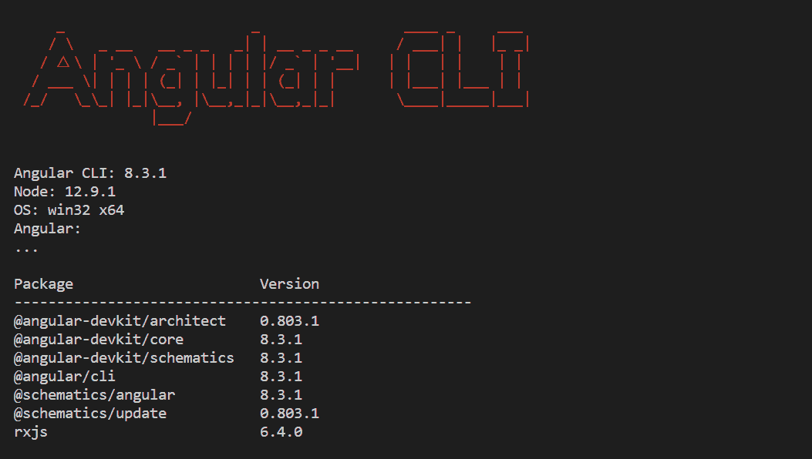

如果其中任何命令无法识别，请快速跳转到附录 A，安装工具，然后立即回到这里。我会等着你。

我们还需要一个代码编辑器。今天有许多代码编辑器可用，包括一些免费的。虽然任何代码编辑器都可以，但我建议您在编写本书时至少使用 Visual Studio Code 进行 Angular 开发。原因是 Visual Studio Code 是免费的，跨平台的，是一个优秀的代码编辑器。这也是我在写这本书时使用的代码编辑器，所以当我建议使用某个扩展时，您可以轻松安装相同的扩展。

上述内容就是本章的全部内容。当我们开始构建示例项目时，需要我们有一个本地数据库，您还需要安装 MongoDB。MongoDB，也称为 Mongo，是一个很棒的免费跨平台 NoSQL 数据库。我会在附录 B，*MongoDB*中带您完成 Mongo 的安装过程。

此外，还有其他软件需要安装，例如 Chrome 扩展程序，我会在适当的时候告诉您它们是什么以及在哪里找到它们。现在，让我们开始编写一些 Angular 代码。

# 编写您的第一个 Angular 应用程序

当您开始尝试 Angular 代码时，作为您掌握这个强大的框架，通常有两种选择。第一种是使用在线代码编辑器，如 JSFiddle、Plunker、StackBlitz 等。在附录 C 中，*使用 StackBlitz*，您将学习如何基本使用 StackBlitz，以便您可以不时地使用它来测试一些快速代码，而无需在开发环境中需要测试项目。您可以在 StackBlitz 网站上访问：[`stackblitz.com`](https://stackblitz.com)。

第二种方法是使用您自己的本地开发环境——因为我们已经在前一节中设置了它，您可以创建一个项目，其唯一目的是运行一些快速示例代码，如果您宁愿使用本地开发环境而不是在线代码编辑器。我的目标是向您展示您有选择的余地——学习 Angular 并不只有一种方法来尝试一些代码。

当您使用在线代码编辑器（如 StackBlitz）时，您唯一需要安装的软件是浏览器——没有任何其他工具。虽然这使事情变得非常容易，但代价是您在所能做的事情上受到极大限制。话虽如此，我鼓励您尝试在线代码编辑器，但在本书中我们将只使用我们的开发环境。所以，让我们做到这一点，并在短短几分钟内一起创建一个小应用程序——我们将构建一个待办事项列表应用程序。

# 使用您的开发环境

从现在开始，我们将使用我们的终端、CLI 和 Visual Studio Code。前往[`code.visualstudio.com`](https://code.visualstudio.com)，在那里您可以下载适用于您选择的操作系统的 Visual Studio Code 安装包。

# 您的文件位置

在设置本地环境时，您当然可以将目录和文件放在任何您喜欢的地方。如果您有一个存放 Web 应用项目的文件夹，请立即转到该文件夹。如果您没有专门的项目存放位置，现在是养成有条理习惯的好时机。例如，在我的电脑上，我有一个名为`dev`的文件夹，用于我所做的任何开发。在我的`dev`文件夹中，我有一个名为`playground`的文件夹，其中有一个我正在学习或玩耍的每种技术的子文件夹。我喜欢在编写代码时使用 Mac，因此我存放 Angular *play stuff*的完整路径是`/Users/akii/dev/playground/angular`（如前几页终端屏幕截图底部所示）。同一屏幕截图还显示了我在写作时安装的 Node.js、npm 和 CLI 的版本。如果这样的目录结构适合您，请尽管使用。如果您已经有组织工作的方式，请使用它。重要的是要非常有纪律性和一致性地组织您的开发环境。

# 生成我们的待办事项列表应用程序

现在我们需要的安装已经完成 - 这意味着我们可以使用 CLI 工具 - 转到您的终端并在命令提示符处键入以下内容`$ ng new to-dolist --style=scss --routing`，然后按*Enter*。

`ng`命令运行 CLI 工具，其`new`命令指示它创建一个新的 Angular 应用程序。在这种情况下，应用程序的名称是`to-dolist`。您会注意到还有两个命令行标志，这是`new`命令的特殊选项。style 标志告诉 CLI 我们想要使用`scss`，而不是`css`，routing 标志告诉 CLI 我们希望它默认集成和设置路由。在本书中，我们将使用 SASS，而不是 CSS，并且 SCSS 是 Sass 文件的文件扩展名。作为提醒，我们将在第三章中进行 Sass 的速成课程，*Bootstrap - 网格布局和组件*。

第一次使用 CLI 创建您的 Angular 应用程序时，它将花费 45 秒到一分钟多的时间为您创建项目。这是因为它需要为您下载和安装各种东西，然后再创建项目的文件夹结构。但是，创建后续的 Angular 应用程序时，CLI 不会花费太长时间。

# 提供我们的待办事项应用程序

一旦 CLI 完成创建应用程序，您可以通过转到项目目录（`$ cd to-dolist`）并发出`$ ng serve`命令来运行它。这将使 CLI 运行您的应用程序。CLI 的内置 Web 服务器默认情况下将在 localhost 端口`4200`上监听。顺便说一句，CLI 的 Web 服务器会监视您的项目文件，当它注意到文件中的更改时，它会重新加载应用程序 - 您无需停止服务器并再次发出服务器命令。这在开发过程中进行大量更改和调整时非常方便。接下来，打开浏览器并访问`http://localhost:4200`，您应该会看到类似以下内容的东西，这证明了 CLI 正在正确工作：

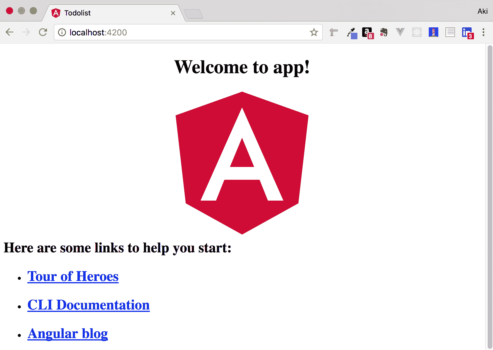

现在 CLI 已为您创建了待办事项列表应用程序，请在 Visual Studio Code 中打开该文件夹（注意：为简洁起见，我将把 Visual Studio Code 称为 IDE）。您应该在 IDE 的左侧面板中看到待办事项列表项目的文件夹结构，类似于以下内容（除了待办事项文件夹，您目前还没有；我们将在即将到来的组件子部分中介绍如何使用 CLI 生成它）。

以下是 IDE 中 to-do 列表项目的屏幕截图（`app.component.ts`文件已打开）：

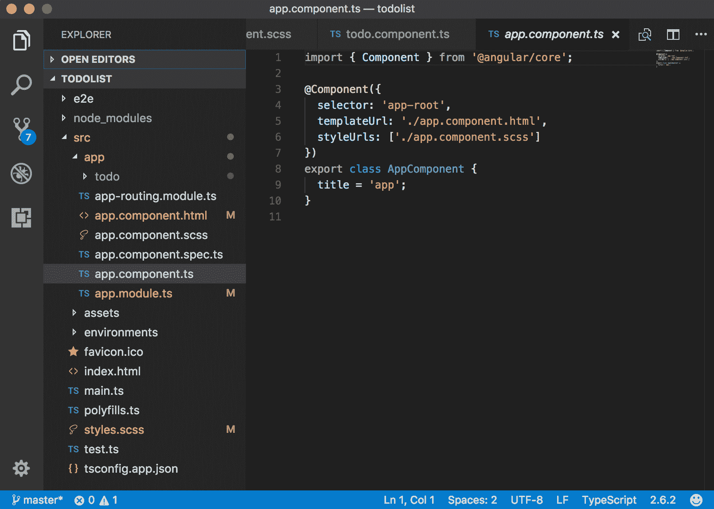

在开发 Angular 应用程序时，您将花费大部分时间在`src | app`文件夹中工作。

# Angular 基础知识

组件是 Angular 的基本构建块。实际上，您可以将 Angular Web 应用程序视为一个组件树。当您使用 CLI 为 Angular 应用程序生成外壳时，CLI 还会为您自动生成一个组件。文件名为 app.component.ts，位于`src/app`文件夹中。应用程序组件是 Angular 应用程序的引导方式，意味着它是加载的第一个组件，所有其他组件都被拉入其中。这也意味着组件可以嵌套。之前的屏幕截图显示了我们的项目目录结构，`src/app`文件夹已展开，并且`app.component.ts`在 IDE 的文件编辑器窗口中打开。`.ts`文件扩展名表示它是一个 TypeScript 文件。有趣的是，当您编写 Angular 应用程序时，您使用的是 TypeScript 而不是 JavaScript。实际上，Angular 团队使用 TypeScript 编写 Angular！

在以下*组件*部分之后，您将找到我们 Angular 应用程序的完整代码清单。有六个文件需要编辑。其中三个已经在您使用 CLI 生成的应用程序中可用。另外三个将在您使用 CLI 生成待办事项组件后在项目中可用，这是您比较项目结构和之前屏幕截图时目前缺少的目录。您将在以下*组件*部分中了解如何做到这一点，这就是为什么完整的代码清单被插入在后面。不要担心 - 跟着走，相信自己可以掌握 Angular，一切都会好起来的。如果你不相信我，就躺在地板上，慢慢地喃喃地说这些话，“这也会过去”，三次。

# 组件

这一部分是关于 Angular 组件的高层次概述 - 对 Angular 组件是什么的足够覆盖。《第六章》《构建 Angular 组件》完全专门讨论了 Angular 组件，我们将深入研究它们。可以将本节视为窥探组件幕后的一点，当我们讨论组件时，我们将拉开窗帘，好好看看“奥兹国的组件巫师”。请记住，在《奥兹国的巫师》故事中，多萝西和小伙伴们都害怕巫师，但当他最终在窗帘后面显露出来时，他们很快就不再害怕了。

正如前面提到的，你可以将组件视为 Angular 的基本构建块，将你的 Angular 应用程序视为嵌套组件树。按钮、进度条、输入字段、整个表格、高级的东西如轮播图，甚至自定义视频播放器 - 这些都是组件。你网页上的组件可以相互通信，Angular 有一些规则和协议来指导它们如何进行通信。在本书结束时，你将对组件的方方面面非常熟悉。你必须熟悉，因为这就是 Angular 大师的方式！

当你编写一个组件文件时，就像下面的代码一样，它有三个主要部分。第一部分是导入部分。中间部分是组件装饰器，你可以在这里指定组件的模板文件（定义组件的外观）和组件的样式文件（用于为组件设置样式）。

**注意**：由于我们使用了`style=scss`标志，我们得到的文件是 SCSS，而不是传统的 CSS 类型文件。导出部分是组件文件中的最后一部分，是组件所有逻辑的放置位置。组件的 TypeScript 文件中可以放入比下面代码片段中显示的更多内容，我们将在《第六章》《构建 Angular 组件》中看到。

```ts
import { Component } from '@angular/core'; 
@Component({
  selector: 'app-root',
  templateUrl: './app.component.html',
  styleUrls: ['./app.component.scss']
})
export class AppComponent {
  title = 'app';
}
```

CLI 在创建我们的应用程序时默认为我们创建了应用程序组件，但是我们如何创建自己的组件呢？生成新组件的最简单方法是使用 CLI 并发出以下命令：`$ ng generate component name-of-component`。因此，要生成一个名为`to-doitem`的新组件，我们将在命令提示符中键入`$ ng generate component to-doitem`。请记住要在`src | app`文件夹内执行此操作。CLI 将生成此组件并将其插入到自己的文件夹中，新创建的文件夹的名称将与组件相同。

在这个文件夹中，您将看到四个新文件，它们的名称都以`to-doitem.component`开头，因为我们的组件名称是`todoitem`，嗯，它是一个组件。我们将在后面讨论以`spec.ts`结尾的文件用于什么，但您可能已经猜到其他三个文件的用途。让我们验证您可能已经在想的内容；组件文件本身的确是名为`todoitem.component.ts`的文件。该文件包含对其他两个文件的引用：`todoitem.component.html`，它是组件的模板（HTML 代码，用于定义其标记结构），以及`todoitem.component.scss`文件，它将保存组件的样式。此外，CLI 修改了一个名为`app.module.ts`的现有文件。我们将在稍后更详细地讨论这个文件，但现在，您需要知道的是，该文件充当了应用程序组件的注册表。

您可能会想，“这是很多文件。它们都是必需的吗？”对此的简短回答是否定的。在第五章中，*Flex-Layout – Angular 的响应式布局引擎*，我们将看到如何消除`.html`文件和`.scss`文件，只需将所有组件的*内容*（HTML 和样式）放入组件文件中。然而，Angular 团队提供了将所有这些内容分开的机制的原因是为了使应用程序的代码整洁有序。稍后您可以感谢他们。

在使用 CLI 生成组件时的一个很好的快捷语法是键入`$ ng g c name-of-component`，其中`g`是生成的缩写，`c`是组件的缩写。

除了从头开始创建自己的组件，我们将在第五章中深入研究，*Flex-Layout – Angular 的响应式布局引擎*。

# 待办事项列表应用程序的代码清单

现在您已经生成了待办事项组件，您在`todo`文件夹内有四个新文件。您将编辑其中三个文件，使其看起来像下面的代码清单。您还需要编辑项目中已经存在的三个文件，（在这里我们将打开窗帘，见到巫师），我们还可以将其他库和框架的组件集成到我们的应用程序中。我们将在第六章中看看如何使用 NG Bootstrap 进行此操作，以及在第七章中使用 Angular Material，*模板、指令和管道*。Angular 的组件不少，随着时间的推移可用的数量只会增加。

每当我学习新技术并跟着书籍、博客文章或其他内容时，我都会手动输入所有内容，即使文件可以下载。是的，手动输入可能是一个乏味的过程，但它会激发您的大脑，并且材料和概念开始被吸收。简单地下载文件并将内容剪切粘贴到您的应用程序中并不会产生同样的效果。我会让您决定您想要走哪条路。如果您选择下载代码，本书开头有相应的说明：

+   `todo.component.html`（在`src | app | todo`文件夹内）的代码清单如下所示：

```ts
<div class="container dark">
    <div class="column">
    <p>Add a todo item</p>
    </div>
    <div class="column">
    <p>Todo list ({{ itemCount }} items)</p>
    </div>
    </div>
    <div class="container light">
    <div class="column">
    <p class="form-caption">Enter an item to add to your todo list</p>
    <form>
    <input type="text" class="regular" name="item" placeholder="Todo item ..." 
      [(ngModel)]="todoItemText">
    <input type="submit" class="submit" value="Add todo" (click)="addTodoItem()">
    </form>
    </div>
    <div class="column">
    <p class="todolist-container" *ngFor="let todoItem of todoItems">
    {{ todoItem }}
    </p>
    </div>
    </div>
```

+   `todo.component.ts`（在`src | app | todo`文件夹内）的代码清单如下所示：

```ts
import { Component, OnInit } from '@angular/core';
@Component({
    selector: 'app-todo',
    templateUrl: './todo.component.html',
    styleUrls: ['./todo.component.scss']
})
export class TodoComponent implements OnInit {
itemCount: number;
todoItemText: string;
todoItems = [];
ngOnInit() {
this.itemCount = this.todoItems.length;
}
addTodoItem() {
this.todoItems.push(this.todoItemText);
this.todoItemText = '';
this.itemCount = this.todoItems.length;
}
}
```

+   `todo.component.scss`（在`src | app | todo`文件夹内）的代码清单如下所示：

```ts
.container {
    display: grid;
    grid-template-columns: 50% auto;
    }
    .column {
    padding: .4em 1.3em;
    }
    .dark {
    background: #2F4F4F;
    }
    .light {
    background: #8FBC8F;
    }
    input.regular {
    border: 0;
    padding: 1em;
    width: 80%;
    margin-bottom: 2em;
    }
    input.submit {
    border: 0;
    display: block;
    padding: 1em 3em;
    background: #eee;
    color: #333;
    margin-bottom: 1em;
    cursor: pointer;
    }
    .todolist-container {
    background: rgb(52, 138, 71);
    padding: .6em;
    font-weight: bold;
    cursor: pointer;
    }
    .form-caption {
    }
```

+   以下是`app.component.html`（在`src | app`文件夹内）的代码清单。第一章，*快速入门*：待办事项列表（快速示例应用）：

```ts
<br> <br>
<app-todo></app-todo>
<router-outlet></router-outlet>
```

+   `app.module.ts`（在`src | app`文件夹内）的代码清单如下所示：

```ts
import { BrowserModule } from '@angular/platform-browser';
import { NgModule } from '@angular/core';
import { FormsModule } from '@angular/forms';
import { AppRoutingModule } from './app-routing.module';
import { AppComponent } from './app.component';
import { TodoComponent } from './todo/todo.component';
@NgModule({
declarations: [
AppComponent,
TodoComponent
],
imports: [
BrowserModule,
AppRoutingModule,
FormsModule
],
providers: [],
bootstrap: [AppComponent]
})
export class AppModule { }
```

+   `styles.scss`（在`src`文件夹内）的代码清单如下所示：

```ts
/* You can add global styles to this file, and also import other style files */
body {
font-family: Arial, Helvetica, sans-serif;
color: #eee;
background: #869bbd;
padding: 4em;
}
a {
color: #fff;
text-decoration: none;
}
ul {
list-style-type: none;
margin: 0 0 2em 0;
padding: 0;
}
ul li {
display: inline;
margin-right: 25px;
}
ul li a {
font-size: 1.5em;
}
```

太棒了！现在您已经把所有的代码放在了正确的位置。您还记得如何运行您的 Angular 应用程序吗？在命令提示符处输入`$ ng serve`，一旦出现编译成功的消息，打开浏览器并转到`http://localhost:4200`。应用程序是否正常工作？如果是，恭喜您建立了您的第一个 Angular 应用程序！如果不是，请检查拼写错误。

玩一下您的新应用程序。我们还没有花时间添加编辑待办事项或删除它们的功能，但您可以通过点击浏览器的刷新按钮来清除它。

为什么刷新页面后会清空数据？这是因为我们使用的是单页应用，没有将输入的数据持久化到数据库中。当我们构建更大的应用程序时，我们一定会确保在本章末尾向您介绍的应用程序中添加持久化数据的能力。

# 插值

插值是从组件类中的变量获取值并在组件模板中呈现的方法。如果您还记得，组件的逻辑放在组件类的导出部分。这也是您想要使用插值的变量所在的地方，以便在模板中呈现它们的值（即在网页上呈现）。假设您有一个名为`items`的变量，其值目前为`4`。要在模板中呈现该值，您可以使用一对双大括号，变量位于其中。变量和组件逻辑都写在类内部。

别担心——在整本书中，我们会看到很多使用插值的代码片段，但现在，您可以看到这个示例代码，展示了它的作用。目前，这段代码是无意义的，是硬编码的，但它确实演示了插值。

第一个屏幕截图是组件文件（`home.component.ts`）；变量在第 10 行声明：

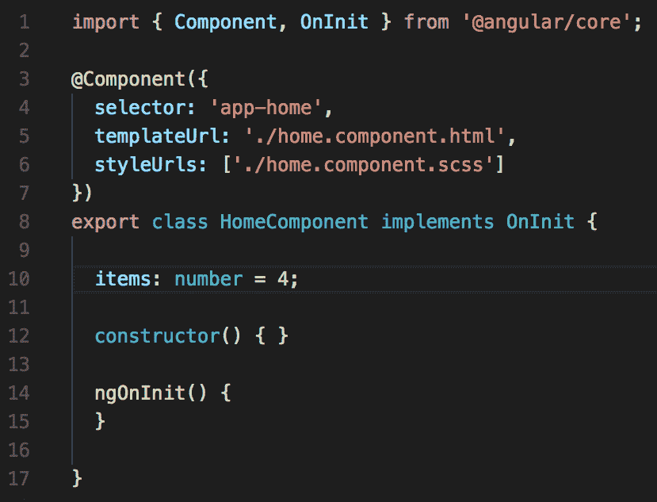

第二个屏幕截图是组件的模板文件（`home.component.html`）。注意第 6 行的一对双大括号：

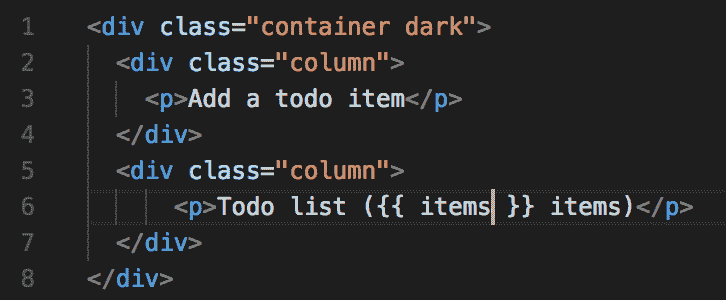

最后一个屏幕截图显示了呈现的值，这里是`4`。这就是插值的基础。在整本书中，随着我们在我们的注释相册上的工作，我们会看到更高级的用法： 

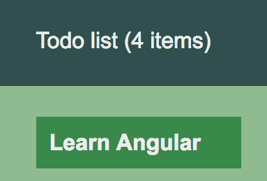

# 模板化和样式

在*组件*部分的最后几段中，我们已经提到了有关模板和样式的内容。现在我们有一个小项目可用——我们用 CLI 创建的一个——我们可以看看这在代码中是什么样子。在 IDE 中打开您的 Angular 项目，并打开`app.component.ts`文件。这个应用组件文件的第 5 和第 6 行包含了它关联模板（`.html`文件）和样式文件（`.scss`）的引用。以下是我 IDE 中打开项目的屏幕截图，`app.component.ts`文件已打开：

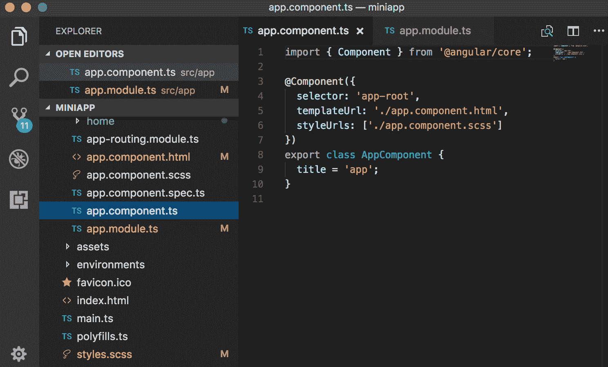

# 属性绑定

在 Angular 中，我们可以进行两种数据绑定，即单向和双向。内插类似于单向数据绑定。这是因为在这两种情况下，数据都是从组件类流向组件模板，而不是相反。属性绑定是数据绑定，因为数据被绑定到属性。

也可以进行双向属性绑定，意思是不仅可以将组件属性的值绑定到模板，而且模板也可以改变组件属性的值。这在 Angular 中通过`ngModel`实现。不用担心这个，我们稍后会看到双向属性绑定。只需知道在 Angular 中，单向和双向属性绑定都是可能的。

实现单向属性绑定非常简单。您只需要在组件模板中的 HTML 属性周围加上方括号，并将变量分配给它。要看一下单向属性绑定在代码中是什么样子的快速示例，请查看接下来的三张屏幕截图。

第一张屏幕截图是组件文件（`home.component.ts`）；变量`txtPlaceholder`在第 11 行声明：

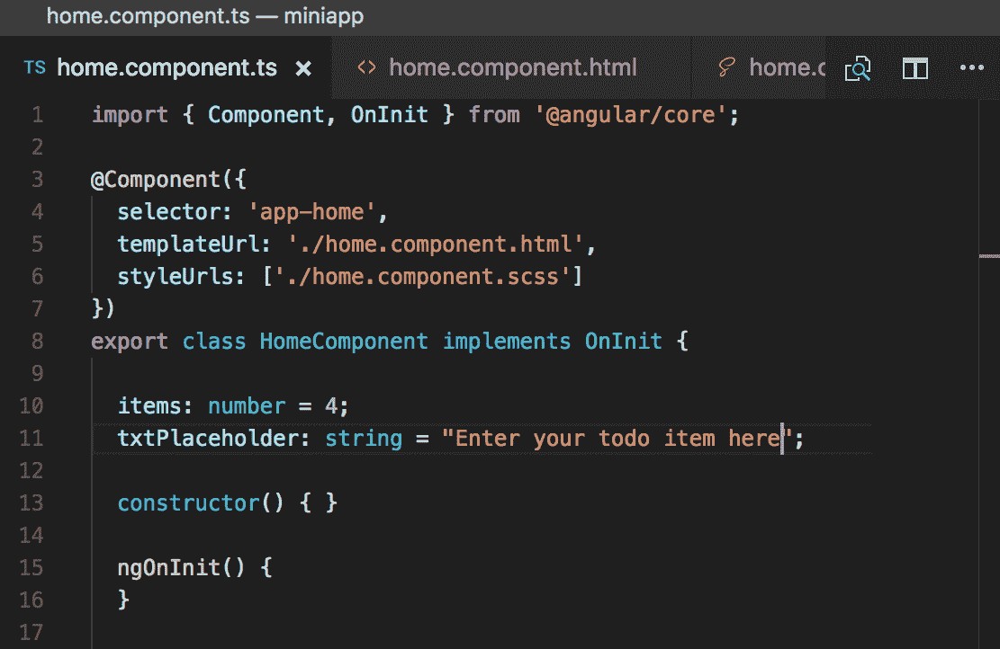

下一张屏幕截图是组件的模板文件（`home.component.html`）。在第 14 行，您可以看到输入元素的占位符属性周围有方括号：

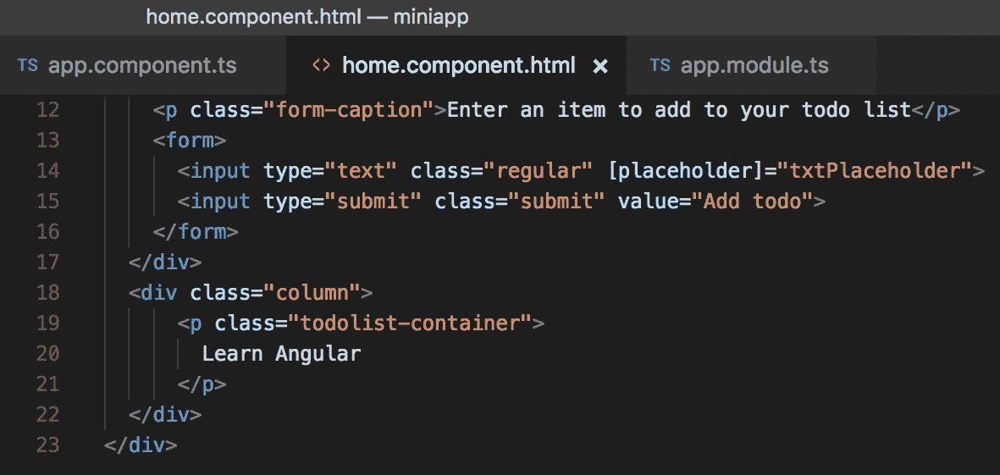

最后一张屏幕截图是应用程序在浏览器中运行的情况。您可以看到文本“在此输入您的待办事项”被插入为文本框的占位文本，通过单向属性绑定：

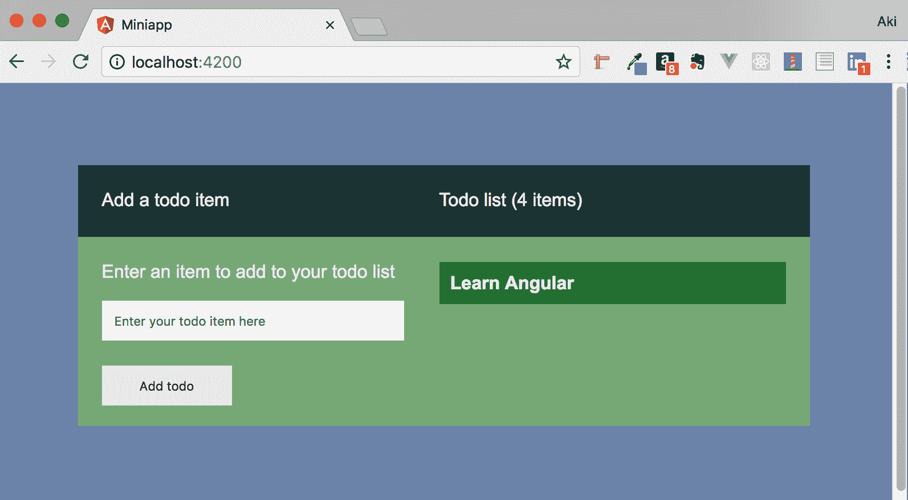

# 事件绑定

在 Angular 中，事件绑定简单地意味着在组件内的元素上注册一个事件，当该事件发生时，将触发调用一个函数。换句话说，一个事件将调用一个函数。你可以让 Angular 监听大量的事件，比如按钮被点击，鼠标悬停在图像上，或者当用户在文本框中按下键时，还有很多其他事件。当然，你可以编写任何你能想到的函数来实现其他功能，比如调用 web 服务，改变背景页面的颜色，计算 Pi 的值到 1000 位小数，或者几乎任何你想要的其他功能。但是，我们如何在我们的 Angular 应用程序中设置事件绑定，以便将我们感兴趣的事件，绑定到我们感兴趣的元素，运行我们想要的函数呢？幸运的是，Angular 团队为我们做到了这一点。

假设我们想通过点击或悬停鼠标等事件进行一些用户交互 - 我们可以使用事件绑定来映射功能。

现在，这个例子并不是很有趣，但我们有我们的待办事项列表应用程序，可以查看我们已经编写的代码。如果你已经输入了代码清单。

# 我们的示例项目

学习一门新的编程语言，或者学习一个新的框架，是一个动手实验和重复的问题。即使是《生活大爆炸》中的谢尔顿博士也不能只靠读一本关于 Angular 的书就学会它。然而，只是跟随随机的代码示例并不是一件有趣的事情，而且到最后，你实际上并没有任何可以使用的东西。因此，我们在学习 Angular 的过程中采取的方法是构建一个完整的网络应用程序，这样做既有趣又实用，因为你可以部署并自己使用它。

# 注释照片相册

我们将一起构建的应用程序是基于我推出的一个在线服务之一，名为 Vizcaro。Vizcaro 是一个照片分享服务，但与其分享单个照片不同，你分享相册（一组照片）。此外，照片和相册将被注释，因此你可以为它们添加标题和说明。我们的版本不会拥有我在线服务提供的所有功能，但它将有足够的部分，使它成为一个很好的网络应用程序，以便学习本书中的材料。

# 设计原则

通常有两种设计类型：设计用户界面（GUI）的方式，以及设计软件组件（API 接口、服务、组件等）的方式。在本书中，我们将涵盖许多代码设计原则。Angular 是一个设计非常出色的软件，这对我们来说非常好，因为它为我们提供了一个完美的机会，在学习 Angular 本身的同时讨论软件设计，以及在构建我们的应用程序时。在本书的剩余部分中，我们还将涵盖用户界面设计原则，特别是在使用线框来指导我们构建模板时。

一般来说，当讨论用户界面设计时，会使用 UX 设计这个术语。从维基百科借来 UX 设计的定义：

“UX 设计是通过改善产品的可用性、可访问性和提供的互动乐趣来增强用户对产品的满意度的过程。”

这是一个很好的定义，适用于不仅仅是软件产品。

# 线框

线框从 80 年代初就开始存在。它们的重点，至少最初，是桌面应用程序中屏幕的功能（请记住，当时还没有网络应用程序），以及其一般布局。它们并不是用来展示最终设计的样子，包括字体选择、颜色和屏幕上控件的其他属性。实质上，它们是“纸上原型”。相反，纸上原型是使用线框的过程。值得注意的是，名词“线框”和“模型”可以互换使用，它们是同一回事。我将在本章末尾简要介绍纸上原型的过程。

# 线框工具

正如你可能已经猜到的，或者已经知道的，有几种工具可用于创建线框图，用于布局你的应用程序，比如 Balsamiq Mockups，Mockflow 和 Visio。对于我的 Web 应用程序，以及本书中，我更喜欢使用 Balsamiq Mockups。你最终使用哪种工具，或者已经在使用哪种工具，都无关紧要。事实上，即使你的线框图是用笔在你最喜欢的快餐餐厅餐巾纸的背面手绘的，我也觉得很酷。说真的，重要的是在编写一行代码之前养成创建线框图的习惯。为什么？因为这是明智的做法，可以节省大量时间。此外，这给了你一个完美的机会来真正思考你将要构建的东西。而且，这是你可以向用户展示的东西，以便在编写一行代码之前获得他们对可用性的反馈。还有更多好处；它让你对如何为应用程序设计数据模型以及可能使用的服务的 API 有了一些想法。你会在没有商业计划的情况下开始一项业务吗？你会在没有蓝图的情况下建造你的梦想之家吗？构建 Web 应用程序不应该有任何不同，使用线框图规范页面。永远。明白了吗？

# 我们注释的相册的线框图

我们将使用 10 个线框图来构建我们的应用程序，每个屏幕都有一个。以下是它们的列表，每个屏幕截图前都有简短的描述。

# 主页

每个 Web 应用程序都需要某种起始页面。它通常有许多名称，通常是这些之一：主页，登陆页面，索引页面或闪屏页面。我们的将是直接的。没有 Flash 动画或彩虹色的背景；它将是一个简单的页面，让用户知道网站的功能，并希望在五到七秒内完成。如果不能，你可能会永远失去访问者。

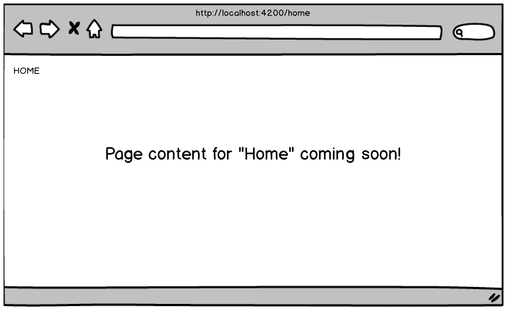

# 仪表板

大多数网络应用程序没有仪表板页面，但那些有的通常会提供用户拥有的*东西*摘要，他们上次登录的时间，以及公司希望引起用户注意的任何通知。如果您使用在线银行业务，很可能您的银行在线银行网络应用程序有一个仪表板页面 - 它可能是账户列表（支票、储蓄、信用卡、汽车贷款等），以及您在这些账户上的余额。

我们将构建一个用户将用来创建相册的应用程序，因此我们的仪表板将包含我们上传的照片数量，相册数量，上次登录时间等：


# 图片上传

由于我们的应用程序应该让用户创建相册，我们最好让他们有办法上传照片！是的 - 我们将专门为上传一张照片而设立一个整个网页，因为我们将在上传后使用同一个页面来预览它 - 并且*撤消*上传。您会惊讶地知道，有一个著名的照片分享网站直到您转到照片列表才会显示您刚刚上传的内容！立即确认您打算上传的照片实际上就是已上传的照片：


# 照片准备

上传照片是我们注释相册应用程序的第一步。我们将为*准备*照片专门设置另一个网页。这是我们将允许用户调整图像大小并对其进行注释（给它一个名称和标题）的地方。查看相册时，照片的标题将显示出来：

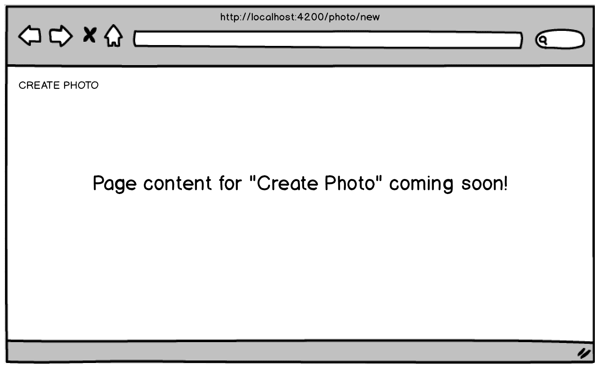

# 创建相册

在用户可以在他们的相册中添加照片之前，他们必须能够创建相册。以下网页将用于此目的：

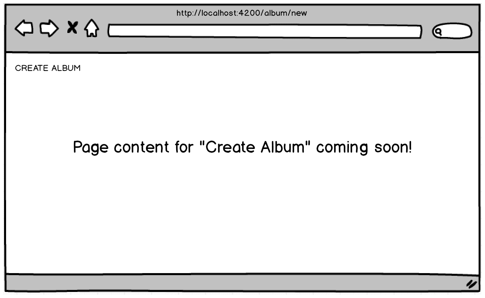

# 照片列表

您总是需要考虑可用性以及如何设计尽可能直观的用户界面。此页面将显示用户上传的所有照片列表。此外，他们可以在同一页面上编辑任何照片的名称和标题。您的用户需要跳转的页面越少，他们就会越开心：


# 相册列表

这个页面为相册做了前一页为照片所做的事情——提供了用户创建的所有相册的列表，并提供了一种直观的方式来编辑它们的名称和描述（而不是照片的标题），而无需转到另一个网页：


# 工作台

工作台是用户可以将照片拖放到相册的地方。这将是我们让用户直观地将特定照片与特定相册关联的方式。顺便说一句，我们的拖放功能不仅直观而且功能强大，还会为用户增添一些乐趣。从心理上讲，用户希望在网站上“玩耍”。拖放——虽然不是令人惊叹的体验——比从照片下拉菜单中选择照片，然后从相册下拉菜单中选择相册，最后点击“连接”或“关联”按钮更有趣。前一种方法会让用户满意，而后一种方法会让他们发脾气，然后离开网站，再也不回来了。

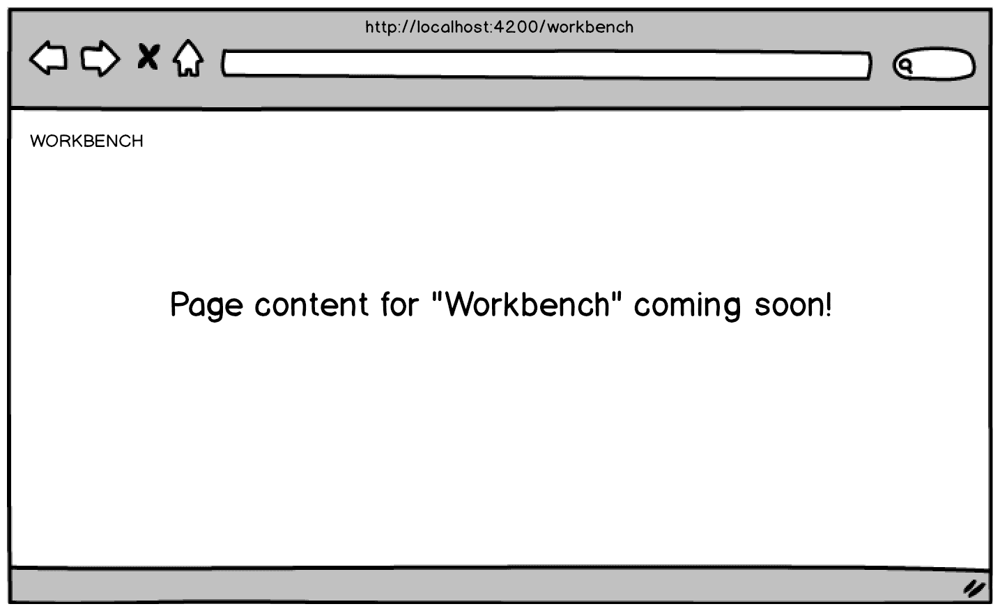

# 相册查看器

归根结底，用户希望以一种引人入胜的方式查看他们的相册。拖放的东西很有趣，但他们不是为了这个而来。他们来这里是为了看到儿子生日派对的照片，女儿高中毕业的照片，或者他们梦想家园的照片。这对他们来说是一个重要的页面；这是他们使用我们网站的工作将为他们付出的地方。让我们不要让他们失望：

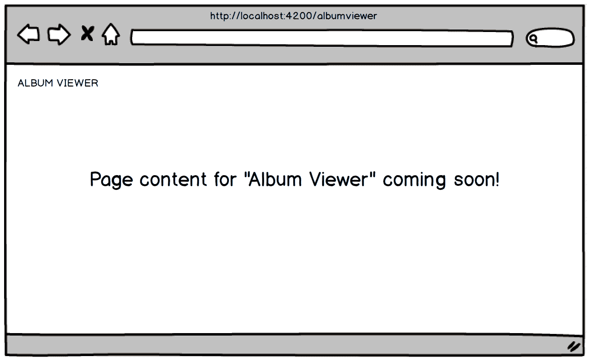

这就结束了我们在本书剩余部分将要构建的带注释的相册、线框和本章计划涵盖的材料的介绍。然而，我想快速讨论一下纸面原型，作为本章的结束，并将其与我们的 Angular 应用程序的规划联系起来。

# 纸面原型

正如本章开头提到的，纸面原型设计是一个过程。我们还提到纸面原型设计的核心重点是可用性测试。我们没有提到的是，纸面原型设计应该成为你的开发团队使用的软件开发方法论的一部分——无论是瀑布模型还是某种敏捷形式。具体来说，纸面原型设计应该在需求文档交付给项目经理后立即进行。这就是纸面原型设计是什么以及它在哪里适用的高层视图。

让我们现在来看一下在较低层面上的流程机制，也就是开发团队与即将开发的应用程序的用户之间的互动。

纸面原型设计的机制或流程是首先创建线框图并打印出来（我知道，会有更多的树被砍伐，全球变暖会变得更加严重，但纸面原型设计很重要）。一旦纸质版本摆在你面前，你的老板、客户或一群预期用户（比如焦点小组），你或其他人会像点击鼠标一样*使用*纸面原型，就好像它已经完成并投入生产一样。你会要求他们假装它是实际的完成应用程序。起初听起来很傻，但人类有着令人难以置信的想象力，只需很少的努力，他们就会像使用真正的东西一样使用它！这不是催眠，而是一种非常神奇的事情开始发生。除了在一开始解释你要求他们做什么以及为什么要求他们这样做时，他们会开始自发地大声谈论他们正在采取的行动，或者正在考虑采取的行动，比如，“好的，现在我需要填写这个表格并提交”，或者“按钮在哪里可以撤销我刚刚做的事情。我犯了一个错误”。通过这种练习，你从人们那里得到的最好的信息是他们提出了如何改进某些东西的建议，比如“如果我能轻松地导航回到我...”你能想象编写网页然后意识到被要求进行的更改具有深远影响并且需要耗费大量时间吗？这经常发生。

你意识到通过这样做你得到了什么了吗？你有了测试用户，而且你还没有写一行代码！这是一个非常有力的练习！试一试，然后给我发电子邮件分享你的故事。

所以，当我向客户解释这一点时——不是作为用户，而是如何向他们的用户和/或客户展示纸质原型制作过程时，我通常会被问到，*但这是纸张。我们怎么改变屏幕呢？*我会尽我所能地回答——通过向他们展示一个例子。我通常会带着一套线框的样本。不仅是为了演示纸质原型制作过程，也是为了展示一个良好的线框的例子。我把登录屏幕放在我们坐着的桌子上，然后让他们用手指作为鼠标指针登录，并在他们想象中的键盘上输入。在他们轻笑并和我一起假装在线框下输入他们的用户名和密码后，他们点击登录按钮，然后我成为了电脑——我拿起登录线框，放下仪表盘线框。他们通常停止轻笑，看着仪表盘页面，停顿几秒钟，然后看着我点头说，*这很酷。我明白了*。

# 总结

这一章涵盖了各种各样的主题，我知道。这是不可避免的，因为没有一个最佳的起点适用于所有读者。例如，一些读者知道线框是什么，并且已经使用了多年，而其他读者可能刚刚听说过这个术语，甚至连那都不知道。这是本书的第三版，但它与前两版有很大不同，即使它基本上是相同的，这并不意味着读者已经阅读了前两版。你可以把这一章看作是一种漏斗——一个足够宽的漏斗，将各种经验水平和不同知识的读者引入学习 Angular 和本书涵盖的其他共生技术的共同轨道。从第二章开始，*ECMAScript 和 TypeScript Crash Course*，漏斗方法结束了。其余的章节将更加专注于手头的主题。所以，感谢你和我一起坚持下来。不过，我希望在翻阅这前几十页时，有一些事情是值得的，即使你对 Angular 并不完全陌生。

回顾一下，我们涵盖了 Angular 的演变，包括其语义版本和发布计划。虽然 NodeJS、npm 和 CLI 的安装在附录 A 中有介绍，但本章是引导该讨论的基础，并且我们使用 CLI 来构建我们的第一个 Angular 应用程序和一个待办事项列表应用程序。我们将应用程序命名为待办事项列表，因为我们是开发人员，而不是营销人员（眨眼）。我们还介绍了如何使用 StackBlitz 来构建相同的 Angular 应用程序，而不依赖于我们的本地开发环境。然后，我们介绍了 Angular 的第一个非常基本的构建模块，你需要很好地了解它们，因为它们将在你构建任何 Angular 应用程序时一再使用。具体来说，这些是模板化、属性绑定、事件绑定和类绑定。最后，我们介绍了我们将在整本书中一起构建的注释相册应用程序，并在此过程中介绍了 UX 设计原则、线框图和纸质原型。哇！天哪！

在下一章中，我们将首先了解 JavaScript 和 TypeScript 之间的关系。然后，正如其名称所示，我们将对 TypeScript 进行快速入门，并介绍它相对于 JavaScript 的优势。
