# 第三章：Bootstrap - 网格布局和组件

嘿——您已经到达第三章，*Bootstrap – 网格布局和组件*。太棒了！接下来的议程是倒一杯您最喜欢的饮料，因为这是一个重要的章节，您会希望保持清醒。然而，这并不全是工作，因为这一章是我们一起开始构建示例应用程序的地方，我们应该能够在其中玩得开心。在这个过程中，我们还将涵盖各个领域的相当多的材料。以下是我们将要涵盖的内容列表：

+   我们将正式介绍我们的示例应用程序，名为 Listing Carousel，并提出一些建议，说明您可以如何将此应用程序转化为您可能更喜欢的其他事情——可以是在本书旁边（而不是构建 Listing Carousel），或者在完成本书后，如果您首先与我一起构建 Listing Carousel。

+   我们将介绍我们在整本书中如何逐步构建我们的应用程序的计划，并且您还将看到我们有一些备选技术可供选择，用于构建 Listing Carousel，或者您可能会在本书结束时受到启发，选择构建自己喜欢的应用程序。

+   我们还将研究 Sass，这是一种使编写项目中的 CSS 变得更容易、更有组织的技术。

+   我们肯定会研究 Bootstrap——它的两个主要部分：响应式网格和一些组件。

+   在第一章，*快速入门*中，我们偷偷看了一些将构成我们示例应用程序的线框图。好吧，这一章是我们将编写 HTML 代码，利用 Bootstrap，将线框图变为现实的地方。

+   作为额外材料，我们还将研究软件项目从构思到实现的过程，使用一个真实的案例研究，即 Listing Carousel。这包括项目阶段，如分析、需求收集、用例图、线框图和实施。

在本章结束时，我们的网页将是硬编码的，不会有任何 Angular 代码。随着我们在书中的进展，我们将逐渐将它们转变为一个完全成熟的 Angular 应用程序，通过添加路由、Angular 组件、模板、数据等。

# 关于本章不包括的内容

本章涵盖了很多内容，包括 Sass 和 Bootstrap 的响应式网格以及其中的一些组件。然而，本章并不全面涵盖您需要了解的这些内容。原因很简单——不仅有专门讲解 Bootstrap 的书籍，而且 Bootstrap 的官方网站是查找 Bootstrap 文档的理想地方。重复他们的文档不是这本书页面的好用处，也不是您的时间和辛苦赚来的钱的好用处。相反，更明智的做法是以实际的方式介绍 Bootstrap 的网格和组件——比如在本书中一起构建一个应用程序，并在需要时参考官方文档。

顺便说一句，同样的情况也适用于[第五章]，*Flex-Layout – Angular's Responsive Layout Engine*，[第八章]，*使用 NG Bootstrap*，和[第九章]，*使用 Angular Material*，因为每种技术都有它们自己的官方文档。

我的工作是做以下事情：

+   向您介绍这些技术（并指向它们的官方文档）

+   演示它们如何以实际、有趣和引人入胜的方式应用

+   鼓励您通读整本书，这样您就可以成为一个 Angular 网页开发大师

顺便说一句，Angular 当然也有自己的官方文档，但其中包含的内容太多，甚至开始都可能让人望而却步。根据我的经验，学习新技术的更有趣的方法是通过教程，而这本书正是这样一本全面的教程，通过构建一个应用程序来学习，每章节中都有额外的解释和一些额外的材料。如果我做得好的话，您应该能够使用 Angular 构建几乎任何您可能需要（或想要）构建的应用程序。这就是目标。

现在让我们来看看“列表轮播”，这是我们将一起构建的示例应用。

# 我们的示例应用

“列表轮播”是我们这本书的示例应用，它是一个真实的在线应用，为房地产经纪人（即专业的房地产销售人员）提供了一个机会，以引人入胜和信息丰富的方式与他们在社交媒体上的联系人分享他们的房源。我的一家公司拥有并运营它。

我选择这个应用的原因并不是让你偷我的代码，然后试图和我竞争（这样做完全不酷，也不推荐），而是因为通过一些调整，你可以把这个应用变成你自己的在线服务。例如，你可以很容易地把这个应用变成一个分类广告应用（比如 Craigslist 或 Kijiji），只需添加搜索功能，或者通过添加搜索功能，甚至可以变成一个约会/婚介网站，再加一点代码。或者，如果你喜欢美食，可以把它变成一个餐厅网站。让餐厅注册并在轮播中列出他们的菜单——每张幻灯片上放一道菜或开胃菜，然后餐厅老板可以与他们的社交媒体圈分享他们的菜单。或者，如果你喜欢有新的方式分享相册，你可以把这个应用变成类似的东西。我以前想过一个主意，就是创建一个人们可以展示他们的作品集的网站（比如艺术家、建筑师和摄影师）——随意去建立类似的东西并且发挥它。选择真的是无限的。重点是，我想为这本书想出一个有趣的应用——一个能给你一些动力来完成整本书的应用。为什么？很简单——因为我知道如果你只是读它，这本书对你来说就不会像它本来可以给你的那样有价值。所以，承诺和我一起深入代码并构建一些你会喜欢的东西。谁知道，也许你会想出一个有利可图的在线业务的好主意！我的目标是让你在阅读这本书的时间投资变得有意义，如果我成功了，你就可以给这本书一个五星好评（眨眼）。这听起来不错吗？

# 游戏计划

我们有一个逐步的游戏计划，以 Listing Carousel 作为我们一起讨论这本书材料的焦点。虽然这本书并没有明确地分成部分（也就是说，章节的分组），但我们现在可以通过将我们需要为构建应用程序做的工作分成三个主要阶段来松散地将它们分组。跟着我一起做，这一切都会有意义——给我们一个将材料（也就是书的章节）与我们将一起构建的应用程序相结合的方法，同时给我们一个我们的目标。

在开始驾驶之前知道你要去哪里，随时能够认清自己的位置是很好的。像这样拥有一份路线图/游戏计划会让整个过程更加愉快，从而最大程度地增加你会完整地阅读这本书的机会，而不仅仅是偶尔查找一些内容。这本书的设计并不像一本食谱书，而是旨在教你如何烹饪。你将通过实践学会烹饪（这是一种双关语），通过准备一道适当复杂的菜肴来要求一定水平的知识和技能来正确烹饪。这本书有四个主要的好处：

+   它为你提供了所有的食材，甚至是你准备这道菜所需的替代食材（也就是选择）。

+   它为你提供了厨师所需的知识、教授了烹饪餐点所需的过程和技能。

+   它以一种系统的方式做这些事情，让你尽可能有效和高效地学习。

+   餐点的选择是代表你可能需要烹饪的大多数菜肴复杂性的一道菜。换句话说，如果你学会了如何烹饪这道菜（也就是我们的示例应用程序），你应该有信心能够准备任何你被要求准备的菜肴。

撇开烹饪类比不谈，这本书的承诺是教会你如何通过一种方法论的过程来使用 Angular 构建一个实际的应用程序。毕竟，如果你想一想，这就是你买这本书的原因，不是吗？否则，你可以试图在这里那里搜索，希望最终能把一切拼凑在一起。那既不有趣，也不是学习 Angular 的聪明方式。当你想学习新东西，或者把基本技能提升到更高水平——无论是什么，不仅仅是 Angular——你都需要有一个明确的目标，并制定一个到达目标的路线图/计划。好吧，我们知道我们的目标，那就是构建列表轮播、学习 Angular，以及一大堆其他好东西。所以现在让我们来看看我们的计划。

在构建我们的应用程序的第一阶段，我们需要决定要构建什么，它将具有什么功能，以及它将是什么样子。一旦我们确定了所有范围和线框图，下一步就是为我们的应用程序建立骨架。到这个阶段结束时，我们的应用程序很可能只是硬编码的——只是一些 HTML 和 CSS。我们唯一的组件将是我们从 Bootstrap 组件库中选择使用的组件。你可以把这看作是我们的应用程序有了皮肤和骨骼，但还没有内在或跳动的心脏。

在构建我们的应用程序的第二阶段，嗯，你猜对了，我们将开始给我们的皮肤和骨骼应用程序添加一些内在！具体来说，它将是 Angular 的内在！请记住，在第一阶段，我们根本没有使用 Angular——一点也没有——这是有意的。虽然我们的应用程序在第二阶段结束时肯定会比第一阶段更有活力，但它的行为会更像一个机器人——非常机械化。如果你记得电影《绿野仙踪》，它会像铁皮人一样——非常活跃，但没有心脏。这个第二阶段（也就是给我们的应用程序一些内在）将包括第四章，“路由”，第七章，“模板，指令和管道”，以及第六章，“构建 Angular 组件”。

最后，在构建应用的第 3 阶段，我们将最终给我们的铁皮人一个心脏！是的！好了，是什么让我们的应用有了心脏？答案是数据和 API！数据就像是我们应用的血液，而 API 就像是心脏——接收数据并推送数据。我打赌你从来没有以这种方式思考过 Web 应用，从现在开始，你将无法以其他方式思考它们（微笑）。这第三阶段将包括第十章，*使用表单*，第十二章，*集成后端数据服务*，第十一章，*依赖注入和服务*，以及第十四章，*高级 Angular 主题*。

第十三章，*单元测试*，和第十五章，*部署 Angular 应用程序*，实际上并不是任何阶段的一部分，但它们发挥着非常重要的支持作用。在这两章中，我们将学习如何测试我们为应用程序编写的代码，以及如何以几种不同的方式部署它。

这就是我们对我们的整体规划的大致了解。让我们再仔细看一下我们构建应用程序第一阶段的五步游戏计划，然后我们将进入我们的第一个技术主题，SASS。

+   **步骤 1**：在本章中，我们将研究 Bootstrap 的响应式网格，以及几个 Bootstrap 的组件：

+   我将解释 Bootstrap 的网格如何工作，并如何帮助我们布置网页。

+   在构建页面时，我将介绍我们将在页面上使用的 Bootstrap 组件，并且我们将使用我们的线框图来指导我们，结合 Bootstrap 的网格。

+   **步骤 2**：在第五章中，*Flex-Layout – Angular's Powerful Responsive Layout Engine*，我们将用 Flex-layout 替换 Bootstrap 的网格系统。我们只会在一些网页上这样做，其他网页仍然会使用 Bootstrap 的网格。我们这样做有两个原因：

+   向您展示总是有备选方案可用，并且您通常可以混合和匹配这些备选方案。

+   能够混合和匹配为我们提供了一条路径，可以在不需要一次完成所有工作的情况下用另一种技术替换另一种技术。我们不想完全重建所有东西，我们只想重新做一些最初构建的东西的一部分，以学习如何应用特定的替代技术。

+   **步骤 3**：在第六章中，*构建 Angular 组件*，我们将看看如何构建自己的组件以在网页中使用。由于在创建我们自己的组件时，我们控制 HTML 和 CSS，我们可以利用 Bootstrap 的组件来创建我们自己的 Angular 组件的外观和感觉。注意：第七章，*模板、指令和管道*，也是其中的一部分，因为这两章是相关的。

+   **步骤 4**：在第八章中，*使用 NG Bootstrap*，我们将发现有现成的*Angular-ready* Bootstrap 组件。就像我们将为我们的一些页面用 Flex-layout 替换 Bootstrap 的网格一样，我们也将用 NG Bootstrap 项目的组件做同样的事情——即用 NG Bootstrap 项目的组件替换一些 Bootstrap 组件。我们这样做的动机是意识到有许多不同的第三方组件可以方便地用于我们的 Angular 应用程序，包括基于 Bootstrap 组件的组件。

+   **步骤 5**：在第九章中，*使用 Angular Material*，我们将再次替换一些 Bootstrap 组件，但这一次，它们与 Bootstrap 组件没有任何关系。Angular Material 项目有精美设计的组件，专门为在 Angular 应用程序中使用而设计，我们将学习如何将其中一些组件整合到我们的应用程序中。

同样，这里需要注意的重要事情是，我们在布置网页和选择使用的组件方面有技术选择，包括创建我们自己的自定义组件，当构建我们的 Angular 应用程序时。此外，正如你将在第十二章中看到的，*集成后端数据服务*，你在服务器端和数据库技术栈方面几乎有无限选择。而且，在第十四章中，*高级 Angular 主题*，我们将探索一些第三方身份验证 API，我们可能希望利用它们来代替从头开始编写我们自己的应用程序。

是的！我们有很多有趣的东西要一起在这本书中讨论。也就是说，让我们先专注于首要的事情，开始利用本章提供的好东西：Sass，Bootstrap，软件项目的典型演变（即，从构思到实现），并使用 Bootstrap 构建我们的列表轮播页面（即，构建应用程序的第一阶段）。我将在第七章的开头为构建应用程序的第二阶段提供类似的计划，*模板，指令和管道*，并在第十二章的开头为构建应用程序的第三阶段提供最终计划，*集成后端数据服务*。

我知道要涵盖的内容很多，但回顾我们的计划是我们要做的重要事情——知道我们在哪里，我们要去哪里总是有帮助的。现在，让我们加快速度，在我们讨论 Bootstrap 之前迅速过一遍 Sass 速成课程。

# Sass 速成课程

对于大多数技术来说，包括本书中提到的所有技术，如 ES6，Bootstrap，Node 和 MongoDB，都可以写成整本书。Sass 也不例外。这个速成课程的目标不是让你成为 Sass 专家，也不是为了重复 Sass 的官方文档。由于空间限制，速成课程的目标只是向你介绍 Sass，并激励你自己进一步探索它，无论是在你完成这本书之后，还是与之并行进行，因为 Sass 是一个非常酷的技术。

Bootstrap 团队已经采用了 Sass 来进行 Bootstrap 项目的开发，而其他技术（比如 Compass）也是基于 Sass 构建的。严格来说，你不必知道如何使用 Sass 来编写 Angular 应用程序，甚至不需要通过本书来学习，但这是一项值得学习的技术，所以我鼓励你自己更仔细地了解一下。现在让我们一起来学习一些 Sass 的基础知识。

# 什么是 Sass？

+   Sass 是 Syntactically Awesome StyleSheets 的缩写，但当然，Sass 比缩写更有趣味！Sass 是 CSS 的扩展，为我们编写 Web 应用程序的 CSS 提供了额外的功能和灵活性。编译后，Sass 会为我们生成格式良好的 CSS。具体来说，Sass 为 CSS 带来的附加功能包括嵌套规则、变量、条件逻辑、数学运算、混合等。此外，Sass 还使得在 Web 项目中更容易维护和组织样式表。在这个速成课程中，我们将学习这些内容。

+   Sass 与所有版本的 CSS 兼容，不仅仅是 CSS3 和 CSS4。

+   由于 Angular CLI 的存在，Sass 可以很好地融入我们的 Angular 应用程序中，因为 CLI 默认为我们编译组件中的 Sass。

+   Sass 的官方网站可以在这里找到：[`sass-lang.com/`](https://sass-lang.com/)。

# Compass 框架

Compass 是一个构建在 Sass 之上的 CSS 编写框架，提供了一些不错的附加功能，并且还会将你的 Sass 编译成 CSS。如果你在非 Angular 项目上工作，Compass 是一个选择（记住，Angular CLI 会为我们的 Angular 项目编译 Sass 为 CSS）。我们不会在本书中涵盖 Compass，但我至少想让你注意到这项技术，因为我知道作为 Web 开发人员，你不仅会使用 Angular 这项技术。然而，作为 Web 开发人员，我们无法避免使用 CSS！

这里的要点是，你可以简单地在 Angular 项目中使用 Angular CLI 来使用 Sass，但是对于非 Angular 项目，尤其是如果你的项目倾向于使用大量 CSS，可以考虑使用 Compass。

大公司使用 Compass。我知道其中两家，并且我每天都在使用它们的在线服务，它们分别是 LinkedIn（[`www.linkedin.com/`](https://www.linkedin.com/)），这是世界上最大的面向就业的社交网络服务，以及 Heroku（[`www.heroku.com`](https://www.heroku.com/)），这是一个非常受欢迎的云应用平台。

您可以在官方网站[`compass-style.org/`](http://compass-style.org/)上了解有关 Compass 的所有信息。另一个提供有关 Sass 和 Compass 教程的不错的在线参考资料名为*The Sass Way*，网址为[`www.thesassway.com/`](http://www.thesassway.com/)。

# 两种 SASS 样式

Sass 有两种语法风格：旧语法依赖缩进，而新语法使用大括号而不是缩进。两种语法风格之间的另一个区别是，旧风格不需要在行末加上分号，而新风格需要。这两种风格的文件扩展名也不同——旧风格的文件扩展名是`.sass`，而当前风格的文件扩展名是`.scss`。

现在让我们快速看一下每种 CSS 语法的一个示例。第一个代码块是旧风格（`.sass`），第二个代码块以新的语法风格（`.scss`）产生相同的效果。我们将在整本书中都使用新风格。

这里给出的示例代码是用于编写`.sass`语法的：

```ts
$blue: #0000ff
$margin: 20px

.content-navigation
  border-color: $blue
  color: lighten($blue, 10%)
 .border padding: $margin / 2 margin: $margin / 2 border-color: $blue  
```

这里给出的示例代码是用于编写`.scss`语法的：

```ts
$blue: #0000ff;
$margin: 16px;

.content-navigation {
 border-color: $blue;
 color: lighten($blue, 10%);
}

.border {
 padding: $margin / 2; 
 margin: $margin / 2; 
 border-color: $blue;
}
```

两种语法风格之间的主要区别在于，旧风格旨在简洁，而新风格旨在更符合传统 CSS 语法的开发人员的习惯。

在前面的代码块中，您可能已经注意到了`$blue`和`$margin`。这些不是 CSS 项目，而是变量的示例。您可能还注意到了除法运算符。变量和数学计算只是您的 Sass 代码中可能包含的一些内容。我们将在接下来的部分中看到这些以及更多 Sass 功能。

无论您使用哪种语法——旧的还是新的——编译结果都是相同的。如果您将前面的任何一个代码块运行到在线编译器，比如*Sass* Meister*（我马上也会提到这个工具），生成的 CSS 将是以下内容：

```ts
.content-navigation {
  border-color: #0000ff;
  color: #3333ff;
}

.border {
  padding: 10px;
  margin: 10px;
  border-color: #0000ff;
}
```

# 安装 Ruby

Sass 是用 Ruby 编写的，因此我们需要在计算机上安装 Ruby。要下载并安装最新版本，请转到 Ruby 的官方网站：[`www.ruby-lang.org/en/downloads/`](https://www.ruby-lang.org/en/downloads/)。要查看您的计算机上是否已安装 Ruby，请在命令行或终端上运行此命令：`$ ruby -v`。

如果 Ruby 已安装，输出将显示版本号。例如，当我执行`$ ruby -v`时，我的终端输出是`ruby 2.4.1p111 (2017-03-22 revision 58053) [x86_64-darwin16]`。从 2.3 版本开始的任何版本都足够满足我们的需求。

# 安装 Sass

安装了 Ruby 后，安装 Sass 就非常简单。请前往[`sass-lang.com/install`](https://sass-lang.com/install)并按照说明操作。

就像您可以通过在终端或命令行中运行`$ ruby -v`来获取 Ruby 的版本一样，您也可以使用 Sass 执行相同的操作。在终端或命令行中执行以下命令`$ sass -v`，以查看您系统上的 Sass 版本。我的系统输出如下：

```ts
Sass 3.5.5 (Bleeding Edge).
```

# Sass 的在线工具

有几个在线工具可以用来将 Sass 文件编译成 CSS 文件。我喜欢的一个工具叫做*Sass Meister*，您可以在这里访问：[`www.sassmeister.com`](https://www.sassmeister.com/)。

我喜欢它，因为它非常易于使用，并且在 Sass 语法出现问题时提供了不错的帮助。它还支持旧样式和新样式的 Sass 语法，并允许您从几种不同的 Sass 编译器中进行选择。您可以在窗格顶部的 Options 菜单选项下找到这些设置。

要使用该工具，只需在左窗格中编写您的 Sass 代码，编译后的 CSS 将显示在右窗格中。注意所选的选项，确保激活的选项是您想要的。

# Sass 的离线工具

就像在线工具一样，我们有几个选项可以选择使用离线工具将 Sass 文件编译成 CSS 文件。我使用 Koala，因为它易于使用，跨平台，并且免费。您可以从项目网站免费下载 Koala：[`koala-app.com/`](http://koala-app.com/)。

Koala 让您不仅可以处理 Sass，还可以用它来编译和/或压缩 Less、JavaScript、CoffeeScript，甚至可以与 Compass 框架一起使用。

学习如何使用 Koala 的最佳方法是阅读官方文档，可以在[`github.com/oklai/koala/wiki#docs`](https://github.com/oklai/koala/wiki#docs)找到。但是，如果您只是暂时使用 Koala 来编译您的 Sass 文件，让我在这里快速概述一下步骤，以免您需要在书本和在线文档之间来回跳转。

您需要做的就是使用您选择的任何文本编辑器（如 Sublime Text 或 Visual Studio Code）创建一个 Web 项目，并在项目的根文件夹中创建一个 CSS 文件夹和一个 Sass 文件夹。当然，您不需要一个完成的项目，您只需要非常基本的文件夹结构。创建项目结构后，您可以打开 Koala 开始使用它为您编译 Sass 文件。以下是基本步骤：

1.  创建一个空的项目结构，至少包括以下内容：

+   根文件夹中有一个空的`index.html`页面

+   在根文件夹中有一个 CSS 文件夹，其中有一个空的`styles.css`文件

+   在根文件夹中有一个 Sass 文件夹，其中有一个空的 style `.scss`文件

1.  打开 Koala 应用程序。

1.  单击左上角的大加号（+），导航到您项目的根文件夹，并选择它。此时，Koala 将找到您的`styles.scss`和`styles.css`文件。

1.  在 Koala 的右侧窗格中右键单击`styles.scss`文件，选择设置输出路径，然后在文件资源管理器中导航到并选择您的`styles.css`文件

遵循上述步骤就是您需要做的一切，以便设置 Koala 来为您编译 Sass 文件。编译的输出将被插入到您的`styles.css`文件中。

# Sass 功能和语法

现在让我们来看看一些 Sass 的功能，这些功能在您的应用程序中最有可能使用。我们不会在我们的示例应用程序中使用所有这些功能，但我想向您展示一些 Sass 提供的很酷的东西。

# 嵌套

使用 Sass，您可以将 CSS 规则嵌套在彼此之内。Sass 不仅更易于阅读，而且有助于避免大量重复的 CSS 选择器。这对于高度嵌套的 CSS 规则尤其有效。让我们看一个简单的例子：

```ts
/* Here is some basic Sass that uses nesting */

#outer-frame p {
  color: #ccc;
   width: 90%;
  .danger-box {
    background-color: #ff0000;
    color: #fff;
  }
} 
```

前面的 Sass 代码将被编译，生成相应的 CSS 代码：

```ts
/* This is the CSS that the above Sass is compiled to */

#outer-frame p {
 color: #ccc;
 width: 90%;
}
#outer-frame p .danger-box {
 background-color: #ff0000;
 color: #fff;
}
```

# 变量

Sass 变量就像你期望的那样：它们存储您想要在整个样式表中重用的信息。这样可以节省时间和烦人的错误。就像其他语言中的全局变量一样，您只需要在一个地方定义它们，所以如果它们需要更改，您只需要在一个地方更改变量，而不是更改 CSS 样式中的所有出现。

您几乎可以存储任何东西。这是一个示例，我们在其中存储了字体信息和字体颜色：

```ts
/* Here is the Sass code defining the variables */

$font-stack: Helvetica, sans-serif;
$primary-color: #333;
body {
 font: 100% $font-stack;
 color: $primary-color;
}
```

前面的 Sass 代码将被编译，生成相应的 CSS 代码：

```ts
/* Here is the CSS that the above Sass is compiled to */

body {
  font: Helvetica, sans-serif;
  color: #ccc;
}
```

# 数学运算

由于 Sass 编译为 CSS，您可以让它为您执行数学计算，而不是自己执行。您还可以让数学运行在变量上，而不是像下面的例子中的硬编码数字一样。当然，这样做非常方便：

```ts
/* Here is Sass that has some math in it */

.main-container { width: 100%; }
article {
 float: right;
 width: 700px / 960px * 100%;
}
```

前面的 Sass 代码将被编译，生成相应的 CSS 代码：

```ts
/* Here is the CSS that the above Sass is compiled to */

.main-container {
 width: 100%;
}
article {
 float: right;
 width: 72.91667%;
}
```

# 导入

Sass 使您能够使用`@import`指令将一个样式表导入到另一个样式表中。这就像它听起来的那样，非常简单。让我们来看一个例子。在以下三个代码列表中，第一个是基本样式（`base.scss`）表，适用于整个站点，第二个是用于报告页面（`reports.scss`）的样式表。第三个是在 Sass 编译期间报告样式表导入基本样式表时得到的结果 CSS 样式表。请注意，在 Sass 中使用`@import`指令时不需要文件扩展名：

```ts
/* base.scss */
body {
 margin: 10px;
 padding: 10px;
 font: Helvetica, sans-serif;
 color: #333;
 background-color: #eee;
}

/* reports.scss */
@import 'base';
p {
 margin: 5px;
 padding: 5px;
 color: #0000CD;
 background-color: #EEE8AA;
}
```

前面的 Sass 代码将被编译，生成相应的 CSS 代码：

```ts
body {
 margin: 10px;
 padding: 10px;
 font: Helvetica, sans-serif;
 color: #333;
 background-color: #eee;
}
p {
 margin: 5px;
 padding: 5px;
 color: #0000CD;
 background-color: #EEE8AA;
}
```

# 扩展

使用`@extend`让您可以从一个选择器向另一个选择器共享一组 CSS 属性。一个选择器可以使用`@extend` Sass 指令从另一个选择器继承。以下示例显示了一组三个相关样式（活动的，非活动的和终止的）的常见样式属性。

```ts
%common-status-styles {
 width: 200px;
 height: 75px;
 padding: 10px;
 color: #333;
}

.active {
 @extend %common-status-styles;
 background-color: green;
 border-color: #001a00;
}

.inactive {
 @extend %common-status-styles;
 background-color: yellow;
 border-color: #999900;
}

.terminated {
 @extend %common-status-styles;
 background-color: pink;
 border-color: #ff5a77;
}
```

当前面的 Sass 代码被编译时，它会变成以下 CSS：

```ts
.active, .inactive, .terminated {
 width: 200px;
 height: 75px;
 padding: 10px;
 color: #333;
}

.active {
 background-color: green;
 border-color: #001a00;
}

.inactive {
 background-color: yellow;
 border-color: #999900;
}

.terminated {
 background-color: pink;
 border-color: #ff5a77;
}
```

# 混合

混合器就像命名模板。它们是 Sass 允许您将 CSS 或 Sass 声明（即 CSS 样式）分组并为其命名的方式。这样，您可以根据需要在其他 CSS 类中包含这些声明，而无需复制和粘贴-这样做会在以后需要更改时造成一些混乱。在某种意义上，它们也像变量，因为您只需要在一个地方更改某些内容（即在混合器本身），但它们比变量更强大，这就是为什么我提到它们像模板。实际上，混合器甚至可以使用变量进行参数化。让我们看一个例子，前面的描述应该清楚地说明了我所说的混合器就像模板的意思。

这是我喜欢在我的网站中使用的下拉菜单的样式示例。我们将参数化宽度，以便我们可以创建不同大小的下拉菜单。请注意使用`@mixin`指令：

```ts
@mixin custom-dropdown($dropdown-width) {
 -webkit-appearance: button;
 -webkit-border-radius: 2px;
 -webkit-box-shadow: 0px 1px 3px rgba(0, 0, 0, 0.1);
 -webkit-padding-end: 20px;
 -webkit-padding-start: 2px;
 -webkit-user-select: none;
 background-image: url(https://www.maxfusioncloud.com/static/img/15xvbd5.png), 
   -webkit-linear-gradient(#FAFAFA, #F4F4F4 40%, #E5E5E5);
 background-position: 97% center;
 background-repeat: no-repeat;
 border: 1px solid #AAA;
 color: #555;
 font-size: 10pt;
 margin: 0px;
 overflow: hidden;
 padding: 5px 12px 6px 6px;
 text-overflow: ellipsis;
 white-space: nowrap;
 width: $dropdown-width;
}
```

以下是我们如何使用混合器（请注意使用`@include`指令）：

```ts
.small-dropdown { @include custom-dropdown(75px); }
.medium-dropdown { @include custom-dropdown(115px); }
.large-dropdown { @include custom-dropdown(155px); }
```

这将编译为以下 CSS：

```ts
.small-dropdown {
 -webkit-appearance: button;
 -webkit-border-radius: 2px;
 -webkit-box-shadow: 0px 1px 3px rgba(0, 0, 0, 0.1);
 -webkit-padding-end: 20px;
 -webkit-padding-start: 2px;
 -webkit-user-select: none;
 background-image: url(https://www.maxfusioncloud.com/static/img/15xvbd5.png), 
    -webkit-linear-gradient(#FAFAFA, #F4F4F4 40%, #E5E5E5);
 background-position: 97% center;
 background-repeat: no-repeat;
 border: 1px solid #AAA;
 color: #555;
 font-size: 10pt;
 margin: 0px;
 overflow: hidden;
 padding: 5px 12px 6px 6px;
 text-overflow: ellipsis;
 white-space: nowrap;
 width: 75px;
}

.medium-dropdown {
 -webkit-appearance: button;
 -webkit-border-radius: 2px;
 -webkit-box-shadow: 0px 1px 3px rgba(0, 0, 0, 0.1);
 -webkit-padding-end: 20px;
 -webkit-padding-start: 2px;
 -webkit-user-select: none;
 background-image: 
   url(https://www.maxfusioncloud.com/static/img/15xvbd5.png), 
   -webkit-linear-gradient(#FAFAFA, #F4F4F4 40%, #E5E5E5);
 background-position: 97% center;
 background-repeat: no-repeat;
 border: 1px solid #AAA;
 color: #555;
 font-size: 10pt;
 margin: 0px;
 overflow: hidden;
 padding: 5px 12px 6px 6px;
 text-overflow: ellipsis;
 white-space: nowrap;
 width: 115px;
}

.large-dropdown {
 -webkit-appearance: button;
 -webkit-border-radius: 2px;
 -webkit-box-shadow: 0px 1px 3px rgba(0, 0, 0, 0.1);
 -webkit-padding-end: 20px;
 -webkit-padding-start: 2px;
 -webkit-user-select: none;
 background-image: 
   url(https://www.maxfusioncloud.com/static/img/15xvbd5.png), 
   -webkit-linear-gradient(#FAFAFA, #F4F4F4 40%, #E5E5E5);
 background-position: 97% center;
 background-repeat: no-repeat;
 border: 1px solid #AAA;
 color: #555;
 font-size: 10pt;
 margin: 0px;
 overflow: hidden;
 padding: 5px 12px 6px 6px;
 text-overflow: ellipsis;
 white-space: nowrap;
 width: 155px;
}
```

到目前为止，您可以看到 Sass 有多酷，它可以为您节省多少时间，以及您如何使用它来避免代码重复和避免犯愚蠢的剪切和粘贴错误。

如果所有这些还不够酷的话，Sass 还通过其内置函数为您提供了很多强大的功能。有很多内置函数，这就是为什么 Sass 如此强大和实用。您可以在这里查看它们：[`sass-lang.com/documentation/Sass/Script/Functions.html`](http://sass-lang.com/documentation/Sass/Script/Functions.html)。我们只会涵盖一个，只是为了向您展示如何在接下来的*内置函数*部分中使用函数的示例。

# 占位符

占位符旨在与`@extend`指令一起使用。使用占位符的规则集，但不使用`@extend`指令，将不会呈现为 CSS。使用占位符的一个有效用例是，如果您正在编写一个用于代码重用的 Sass 库。您可以编写一个包含占位符的 Sass 文件，该文件旨在包含在您或其他人编写的另一个 Sass 文件中。如果 Sass 文件中的规则集导入了作为库的其他 Sass 文件，并且规则集扩展了您的库中的占位符，则在编译 Sass 文件时，它将呈现为 CSS 文件。如果没有规则集扩展占位符，则占位符将不会呈现/打印到 CSS 文件中。

让我们来看一个例子。注意，占位符前缀为百分号（`%`）：

```ts
%warning-placeholder {
 color: red;
 font-weight: bold;
 font-size: 1.5em;
}

.warning {
  @extend %warning-placeholder;
}
```

Sass 代码编译为以下 CSS：

```ts
.warning {
  color: red;
  font-weight: bold;
  font-size: 1.5em;
}
```

# 内置函数

当我们介绍 Sass 的扩展功能时，每个类的边框颜色比其对应的背景颜色暗 20%。为了找到比另一个颜色暗 20%的颜色，你需要进行一些繁琐的数学运算，如果以后决定更改百分比，就需要进行更多繁琐的数学运算。幸运的是，Sass 为我们提供了内置函数，可以做各种事情，包括变暗和变亮颜色等等。

现在，让我们重新审视之前在*扩展*部分看到的 Sass 代码，并且这次使用变量和内置的变暗函数来更灵活地编写它，以便让 Sass 为我们做数学运算。这样，如果以后选择更改百分比，就会变得很容易。以下 Sass 代码的编译输出将与之前*扩展*部分的编译输出完全相同，因此我们不会在这里重复。

```ts
/* Example of using variables and a built-in function */

$active-color: green;
$active-border-color: darken($active-color,20%);
$inactive-color: yellow;
$inactive-border-color: darken($inactive-color,20%);
$terminated-color: pink;
$terminated-border-color: darken($terminated-color,20%);

%common-status-styles {
 width: 200px;
 height: 75px;
 padding: 10px;
 color: #333;
}

.active {
 @extend %common-status-styles;
 background-color: $active-color;
 border-color: $active-border-color;
}

.inactive {
 @extend %common-status-styles;
 background-color: $inactive-color;
 border-color: $inactive-border-color;
}

.terminated {
 @extend %common-status-styles;
 background-color: $terminated-color;
 border-color: $terminated-border-color;
} 
```

# 自定义函数

Sass 通过使用其现成的内置函数为我们提供了很大的能力，但有时，没有什么能替代自定义函数——为手头的项目做出你想要的功能。Sass 团队的成员知道这一点，因此为我们提供了一种在 Sass 文件中添加自定义函数的方法。

为了结束这个 Sass 速成课程，让我们快速看一下如何创建自定义函数。我们的函数将根据两个参数计算宽度百分比，目标宽度的列数和我们拥有的总列数。

在这个简短的例子中，你会注意到我们做了以下几点：

+   使用变量

+   进行一些简单的数学运算

+   使用内置的 Sass 函数（即百分比）

+   引入两个新的 Sass 命令：`@function`和`@return:`

```ts
@function column-width-percentage($cols, $total-cols) { 
 @return percentage($cols/$total-cols); 
}

.col-1 { 
 width: column-width-percentage(4, 12); 
}

.col-5 { 
 width: column-width-percentage(5, 12); 
}
```

这将编译为以下 CSS：

```ts
.col-1 {
 width: 33.33333%;
}

.col-5 {
 width: 41.66667%;
}
```

我希望你能在网页开发中找到 Sass 的用武之地。现在看起来可能有点多余，但当你花些时间去尝试时，我相信你会发现聪明的方法来利用 Sass 帮助你更好地组织你的 CSS，并帮助减少代码重复的问题。

现在让我们转变一下方向，快速看一下 Bootstrap。

# Bootstrap 速成课程

在本节中，我们将重点介绍 Bootstrap，特别是其响应式网格和组件。我们将只介绍足够多的 Bootstrap 网格，让您对如何使用它有一个坚实的开始。我们还将只介绍 Bootstrap 的五个组件，让您开始。Bootstrap 拥有远远超过五个组件，而且您可以以许多方式自定义每一个组件。然而，这是 Bootstrap 的速成课程，而不是详尽的手册——要试图详尽地介绍 Bootstrap，需要的是一本全面的手册。Bootstrap 是一个庞大的库，有大量的选项供您使用，因此重要的是向您展示基础知识，并告诉您在哪里获取有关 Bootstrap 的更多信息，而不是试图详尽地介绍它。好消息是，这个 Bootstrap 的速成课程是让您快速上手的最快方法。

采取这种方法的原因如下：

+   我们不会在示例应用程序中使用所有的 Bootstrap 组件

+   我们的示例应用程序也将使用 ng-bootstrap 组件和 Angular Material 组件进行制作（我们将在后面的章节中介绍：第八章，*使用 NG Bootstrap*，和第九章，*使用 Angular Material*）

+   对我们来说，Bootstrap 最重要的部分将是 Bootstrap 的网格——我们将对网格进行比我们将要查看的五个组件更详细的介绍

然而，与 Sass 速成课程不同，我们将看到如何实际使用 Bootstrap，因为我们将直接在本章中的主页布局中使用它。

# 什么是 Bootstrap？

Bootstrap 是一个用于构建响应式网站的 CSS 框架，重点是移动优先。虽然还有其他前端呈现框架，但 Bootstrap 仍然是这个领域的霸主，不仅因为它拥有最多的关注度，而且它可能拥有最多的*运行次数*。我所说的运行次数是指它在网站中被使用的次数，因此它比其他 CSS 框架更加经受考验。Bootstrap 的领先关注度（即流行程度）主要是由于以下三个原因：

+   它是其类别中最早的框架之一（因此竞争几乎不存在）

+   它得到了世界顶级社交网站（即 Twitter）的支持

+   该项目自 2011 年 8 月开始存在，因此非常成熟。

另外，正如我们将在第八章中看到的，*使用 NG Bootstrap*，ng-bootstrap 项目的目标是使用 Bootstrap 4 创建 Angular 小部件，这充分说明了 Angular 社区对 Bootstrap 的看法。

第三版保持了 Angular 和 Bootstrap 之间的关系之所以如此真实的原因是因为它们各自在各自的领域都是领导者，并且它们之间是共生兼容和互补的。事实上，这两个框架就足以构建强大的 Web 应用程序的前端部分——只需选择任何你喜欢的后端构建，因为如今所有的后端框架都可以生成和消费 JSON，包括仍在运行 COBOL 程序的大型机。这是因为 JSON 已经成为通过消息集成系统的最流行方式。

# 动机

如果你曾经尝试过在不使用框架的情况下构建一个在不同视口大小（即，形态因素/屏幕大小）上运行良好的网站，那么你很容易就能理解使用 Bootstrap 的动机——从头开始构建这样的东西既乏味又困难。移动计算确实加剧了对类似 Bootstrap 的需求，而它的出现是不可避免的。虽然对于几乎任何框架都可以说同样的话，即你可能不应该花时间重新发明轮子，除非你有极好的理由这样做，但可以说（对于绝大多数网站，甚至 Web 应用程序）前端比后端更加重要。在过去几年里，客户端已经成为了新宠。我并不是在暗示后端不重要——事实恰恰相反，i，*集成后端数据服务*，完全致力于构建后端。然而，我建议的是，当移动计算出现时，我们已经有了足够多的后端技术和大量的框架可供选择，但缺乏前端框架。

我将在结束这个动机部分时添加的最后一条评论是，在商业世界中一举两得可以为公司带来竞争优势（即，市场速度）和/或财务优势（即，成本节约）—因此在软件开发中也不例外。如果你可以构建一次东西，在这种情况下是一系列网页，并且在移动和桌面上使用相同的客户端代码，而不是构建两套一切（甚至考虑到平板电脑，甚至三套），你应该意识到节约了时间和金钱。这就是承诺—不幸的是，它并不总是兑现。然而，在这些领域获得一些优势肯定比没有获得任何优势要好。

# Bootstrap 在我们示例应用程序中的作用

对于我们的示例应用程序，Bootstrap 将仅用于两个目的：

+   使用其响应式网格布局网页

+   利用一些现成的组件快速构建样式良好的 UI

# 安装 Bootstrap

出于学习目的，安装 Bootstrap 与我们将在 Angular 应用程序中安装 ng-bootstrap 是不同的。本章重点介绍 Bootstrap 的网格系统以及一些组件，因此我们将通过暂时不创建 Angular 应用程序或完全不使用 Angular 来保持简单。在本章结束时，我们将只有我们的皮肤和骨头应用程序（如前所述），然后将其转换为一个完整的 Angular 应用程序。

让我们从将 Bootstrap 集成到我们的 HTML 中的最小且最快的方式开始。要使用 Bootstrap 提供的所有功能，我们只需要添加一个样式表和三个 JavaScript 文件的资源链接。

以下是创建演示如何将 Bootstrap 引入的空 HTML 页面的 HTML 代码：

```ts
<!DOCTYPE html>
<html>
  <head>
    <title>Chapter 3 - Bootstrap: Responsive Grid Layout & 
       Components</title>
    <link rel="stylesheet" href="https://maxcdn.bootstrapcdn.com/
         bootstrap/4.0.0/css/bootstrap.min.css" crossorigin="anonymous”>
    <script src="https://code.jquery.com/jquery-3.2.1.slim.min.js” 
         crossorigin="anonymous"></script>
    <script src="https://cdnjs.cloudflare.com/ajax/libs/popper.js/
         1.12.9/umd/popper.min.js" crossorigin="anonymous"></script>
    <script src="https://maxcdn.bootstrapcdn.com/bootstrap/4.0.0/
         js/bootstrap.min.js” crossorigin="anonymous"></script>
  </head>
<body>
This page is intentionally blank. It's sole purpose is to show the HTML code that needs to be added to integrate Bootstrap.
</body>
</html>
```

根据先前 HTML 代码中链接文件的顺序，以下是一个 CSS 文件和三个 JavaScript 文件的用途：

+   `bootstrap.min.css`文件是 Bootstrap 的压缩样式表，其中定义了所有默认样式

+   `jquery-3.2.1.slim.min.js`文件是包含 jQuery 库的压缩 JavaScript 文件，并且被引用，因为 Bootstrap 本身依赖于 jQuery

+   `popper.min.js`文件是另一个名为 Popper 的第三方库的压缩 JavaScript 文件，并且被引用，因为 Bootstrap 利用其中的功能来实现其工具提示组件

+   最后，`bootstrap.min.js`文件是 Bootstrap 本身的压缩 JavaScript 文件，用于各种组件，如模态和下拉组件，这些组件需要 JavaScript 来运行

您还会注意到这些链接是指向 CDN（即内容传送网络）的资源。虽然有其他安装 Bootstrap 在我们网站上的方法，但使用 CDN 的优点有三个：

+   我们不需要在我们的网页项目中下载和包含文件

+   客户加载我们的网页的时间被最小化，因为这些资源可能在他们访问我们之前的其他网站时已经被下载到他们的浏览器中

+   服务器经过优化，用于传送这些资产（使用缓存和其他托管策略）

当我们在本章后面看 Navs 和 Navbar 组件时，我们将考虑在我们的主页上添加导航栏。

# Bootstrap 的响应式网格系统

从我的角度来看，特别是作为一个专注于 Angular 的 Web 开发人员，Bootstrap 提供的最重要的东西是响应式网格。原因是有许多来自许多不同库的 Web / HTML 组件可供选择进行 Web 开发（例如 NG Bootstrap 和 Angular Material，我们将在后面的章节中介绍），因此，我们并不仅仅局限于只使用 Bootstrap 的组件。然而，无论您最终使用哪些组件，或者如果您创建自己的组件（正如我们将在第六章中学习的那样，*构建 Angular 组件*），Bootstrap 网格仍然可以用于构建响应式布局，并极大地简化我们创建设计良好的 Web 应用程序的繁重任务。

Bootstrap 的网格使我们能够轻松地为各种视口（即屏幕）大小布局我们的页面。我们只需使用特殊的 Bootstrap 类来指示在我们的页面上为我们的应用程序可能运行的不同视口大小定位事物。

如果你曾经想知道 Bootstrap 是否是建立在其他东西之上的，答案是，毫不奇怪地，“是”。库和框架经常相互依赖。这就是开源世界中现代软件的构建方式。毕竟，当我们已经有完全可靠的轮子可供使用时，为什么要重新发明轮子呢？我们已经从之前关于安装 Bootstrap 的部分中看到，Bootstrap 依赖于 jQuery 和 Popper。Bootstrap 的响应式网格系统是建立在 CSS3 中引入的 CSS Flexbox 之上的。

在 CSS4 中有一个更新的网格系统，称为 CSS Grid，但 Bootstrap 4 没有使用它。Bootstrap 使用 CSS Flexbox。这并不意味着 Bootstrap 落后于时代，因为更新并不一定意味着更好。使用 CSS Grid 可以使一些事情变得更容易，而使用 CSS Flexbox 可以使其他事情变得更容易。

稍后，当我们讨论 Bootstrap 预定义的用于在网格内垂直和水平对齐事物的类时，如果你熟悉 CSS Flexbox，这些类名可能会让你感到熟悉。这是因为 Bootstrap 在内部使用 CSS Flexbox，并且类名是受其类名启发而来的。

网格本身有三个主要部分（容器、行和列），每个部分都是在 Bootstrap 的 CSS 文件中定义的类，这就是为什么需要在我们的页面中引用它。

这就是俗语变得有点混乱的地方，所以让我快速解释一下。正如你所知，HTML 中没有名为“容器”、“行”或“列”的元素。但是，在 HTML 中我们有 div 元素，在 Bootstrap 中，我们用一个类来装饰它，特别是用容器、行或列的类。但是当我们谈论 Bootstrap 时，假装这些类型的 HTML 元素会更容易。让我澄清一下，因为从现在开始我将把 Bootstrap 行称为行元素，把 Bootstrap 列称为列元素。我的意思是：

+   说“容器元素”比说“具有容器类的 div 元素”更容易（在代码中，这就是“容器元素”的样子：`<div class="container">`）

+   说“行元素”比说“具有行类的 div 元素”更容易（在代码中，这就是“行元素”的样子：`<div class="row">`）

+   更容易说“列元素”，而不是不得不说“具有列类的 div 元素”（在代码中，这就是“列元素”的样子：`<div class="col">`）

好了，希望这样说得通。

# 容器

容器是网格中的根元素，或顶层元素。它包含一个或多个行，这些行必须嵌套在容器内，而行又可以包含零个或多个列。要创建一个 Bootstrap 网格，我们首先创建一个容器，为此，我们只需创建一组 HTML `div`元素，并将容器类分配给第一个`div`元素。

在代码中看起来是这样的：

```ts
<div class="container">
</div>
```

哈！你明白我为什么提到前面关于容器元素的东西了吗？这是一个混乱的方式来尝试解释它。所以，现在让我们用我们的新术语来重新表达一下。

要创建一个 Bootstrap 网格，首先添加一个容器元素，就像这样：

```ts
<div class="container">
</div>
```

啊，这样说和读起来容易多了！好了，回到我们正常的节目安排…

你可以有两种类型的容器，它们的类名使它们彼此区分开来：

```ts
<!-- fixed-width container centered in the middle the viewport 
--> <div class="container"></div> 

<!-- full-width container that spans the entire viewport width (no margins) 
--> <div class="container-fluid"></div>
```

# 行

行元素必须嵌套在容器元素中。（哈！我喜欢这个元素的东西。试着在写作中解释它而不做类似的事情！）Bootstrap 网格必须至少包含一行，并且可以包含所需的行数。

在前一个容器代码的基础上，以下是具有两行的网格代码的样子：

```ts
<div class="container"> 
  <div class="row"> 
  </div> 
  <div class="row"> 
  </div> 
</div> 
```

一行不一定要包含一列——例如，你可能只是想在网格中的两行之间留出空白，但它最多可以包含 12 列。

然而，重要的是要注意，一行中的列数与嵌套列元素的数量不成比例（我们将在下一节中看一下 Bootstrap 对列的概念）。这是因为一行中的总列数与该行中的列元素数量是独立的。

让我通过在上一行代码中添加三个示例来澄清这个概念。我将解释`class="col-4"`，`class="col-6"`，以及一般来说，`class="col-x"`（其中 x 是从 1 到 12 的整数）的含义，紧接着是以下三个网格示例。

在第一个示例中，网格有两行，每行都有三列等宽：

```ts
<div class="container"> 
  <div class="row"> 
    <div class="col-4"> 
    </div>
    <div class="col-4"> 
    </div> 
    <div class="col-4"> 
    </div> 
  </div> 
  <div class="row"> 
    <div class="col-4"> 
    </div>
    <div class="col-4"> 
    </div> 
    <div class="col-4"> 
    </div> 
  </div> 
</div>
```

在第二个示例中，网格只有一行，有两列等宽：

```ts
<div class="container"> 
  <div class="row"> 
    <div class="col-6"> 
    </div>
    <div class="col-6"> 
    </div> 
  </div> 
</div>
```

在第三个例子中，网格也只有一行，有两列，但它们的宽度不相等。事实上，第一列只占总宽度的 25%，第二列占了剩下的 75%。

```ts
<div class="container"> 
  <div class="row"> 
    <div class="col-3"> 
    </div>
    <div class="col-9"> 
    </div> 
  </div> 
</div>
```

好了，现在我们已经看过三个网格示例，我们可以讨论一下 `"col-x"` 类名到底是什么意思。网格允许每行最多有 12 列，你在行中嵌入的每个列元素可以跨越 1 到 12 列——这就是 x 代表的意思。举个例子，如果我们在行中有一个列元素，并且希望它跨越可用的 12 列中的 8 列，我们的类名将是`col-8`，我们的列元素将如下所示：`<div class="col-8">`。关键是我们行中的列的总数（也就是我们类名中 x 的总和）不应该超过 12。但是，它可以少于 12。

此外，你的网格中的每一行可以有不同数量的列，每个列的宽度也可以不同。在讨论一些有趣的方法之前，让我们快速看一个例子，你可以通过向行元素添加预定义的 Bootstrap 类来对齐行内的列。

```ts
<div class="container"> 
  <div class="row"> 
    <div class="col-10"> 
    </div>
    <div class="col-2"> 
    </div> 
  </div> 
  <div class="row"> 
    <div class="col-4"> 
    </div>
    <div class="col-3"> 
    </div>
    <div class="col-5"> 
    </div> 
  </div> 
</div>
```

在前面的代码中的网格有两行，第一行有两列宽度不等，第二行有三列宽度不等。

每当你有一个网格时，你需要关心的是如何在其中对齐。Bootstrap 有预定义的类，可以用于行元素，以便对其中的列元素进行对齐。

以下是其中一些类：

+   justify-content-center（居中对齐列）

+   justify-content-start（左对齐列）

+   justify-content-end（右对齐列）

+   justify-around-end（均匀间隔列）

+   justify-between-end（将所有可用空间放在两列之间）

这些类的有趣之处在于它们影响封装行中列的水平对齐，只有当所有列元素跨越的列数总和少于 12 时，你才能看到它们的效果。这正是为什么允许少于 12 列的跨度的原因。

这是一个包含少于 12 列跨度的行元素的例子：

```ts
<div class="container"> 
  <div class="row justify-around-end"> 
    <div class="col-4"> 
    </div>
    <div class="col-4"> 
    </div> 
  </div> 
</div>
```

在先前的示例中，我们有一个包含两列的一行网格。然而，由于跨度的列少于 12 列，将应用水平对齐（由于`justify-around-end`类），这将产生可见效果，即将列居中，并在列周围插入可用的未使用空间（在这种情况下为行宽的三分之一）。这将使列两侧出现边距，它们之间的边距加倍。

其他提到的类别具有不同的水平对齐效果，与它们旁边的项目描述不同。我鼓励你尝试使用这些类别来熟悉它们。

# 列

列元素必须嵌套在行元素中，就像之前的示例所示。我们已经看到了多少列元素可以放入一行中，这取决于它们各自的列宽度。

网格中的列基本上是网格中的单元格，是您的内容（即文本、图像等）要插入的位置。如果您有一个包含六行四列元素的网格，您有 24 个单元格可供放置您的内容。

就像你可以使用行元素上的特殊类别来对齐列元素一样，你也可以使用列元素上的特殊类别来对齐列元素内的内容。

以下是您可以在列元素上使用的一些类别，以便对齐其中的内容：

+   `align-self-start`将强制特定单元格的内容位于单元格顶部

+   `align-self-end`将强制特定单元格的内容位于单元格底部

+   `align-self-center`将强制特定单元格的内容位于单元格的垂直中心

# 不同的视口大小

关于 Bootstrap 的网格，我想要讨论的最后一件事可能是最重要的。什么使得网格具有响应性？也就是说，网格如何适应不同的视口尺寸？这个问题有两个方面的答案。首先，大多数 HTML 布局（甚至是那些根本没有设计为响应式的普通布局）在不同尺寸的屏幕上查看时都有一定的灵活性。然而，虽然标准网页的布局在平板电脑和普通 19 英寸显示器上的渲染可能仍然可以接受，但对于一个在平板上看起来不错，但目前正在普通手机上查看的网站来说，情况往往会变得混乱，甚至根本无法使用，比如 iPhone 7 或类似尺寸的 Android 设备。这就是我们需要一些设计干预的地方，也是 Bootstrap 网格适应设备视口尺寸的第二种方式，即对类和列的类名进行特殊调整。

你会记得我们一直在为列元素使用的类名具有以下一般形式：

```ts
<div class="col-x">
```

为了使网格具有响应性，Bootstrap 包含了让我们通过在`col`和`x`之间的类名中添加一个符号来调整类的能力（即从 1 到 12 的整数）。

例如，以下是带有其中一个这些符号的列元素类的样子（实际上，它不是一个符号，而是一个新的类名，但是为了解释起见，你可以把它看作是一个符号）：

```ts
<div class="col-sm-4">
```

我将解释一下`col-sm-4`中的`sm`是什么意思，但实际上，在实践中，你会在列元素上看到不止一个类名。例如，以下是列元素上可能的一组类名：

```ts
 <div class="col-xs-12 col-sm-4 col-md-3" >
```

好的，让我们解释一下这组类是用来做什么的。为了做到这一点，让我首先列出可用的符号及其含义：

| **视口尺寸** | **超小** | **小** | **中** | **大** | **超大** |
| --- | --- | --- | --- | --- | --- |
| 网格断点 | <576px | >=576px | >=768px | >=992px | >=1200px |
| 最大容器宽度 | 无 | 540px | 720px | 960px | 1140px |
| 符号 | xs | sm | md | lg | xl |
| 典型设备 | iPhone、iPod、Android 手机 | iPad 1、iPad 2、iPad Mini | 旧显示器（低分辨率，800x600）、一些旧 Android 平板 | 普通现代显示器、大多数现代 Android 平板 | 高分辨率现代显示器、iPad 3、iPad 4、Android 平板 |
| 类前缀 | .col-xs- | .col-xs- | .col-md- | .col-lg- | .col-xl- |

在上表中，从底部的第三行开始，我列出了对你可用的五个符号。在倒数第二行，我列出了符号和网格断点适用的典型目标设备。我将在一会儿讨论网格断点，但我只想说我列出的这些目标设备是经验法则——它们并非一成不变。例如，Android 平板电脑在五个视口大小列中出现了三次。这是因为有许多 Android 平板电脑制造商，甚至更多尺寸的显示器（即视口）可供选择。笔记本电脑也是如此。然而，基于苹果产品的视口大小是众所周知的，数量较少——这就是我按名称列出它们的原因。可以说，通过查看典型设备的行，你可以相当清楚地了解你可能想要使用哪个列类。

掌握了视口大小和之前的表格的知识，现在让我们解密这个列元素和类别的含义：

```ts
<div class="col-xs-12 col-sm-4 col-md-3" >
```

这个列元素包含一组三个类，每个类基本上指示浏览器如何根据视口大小呈现列和其内容。从技术上讲，视口大小是显示器的最大尺寸（以像素为单位）。以分辨率设置为 1600 x 900 的 13 英寸笔记本电脑显示器为例，其视口大小为 1600 像素宽，900 像素高。然而，在实际情况下，视口大小是浏览器窗口的尺寸，而不是笔记本电脑显示器本身的尺寸。这在我们谈论响应式网页设计时是一个重要的区别，因为在使用台式机或笔记本电脑时，人们可以调整他们的浏览器大小——这会强制网页重新呈现——因此，这确实是 Bootstrap 的视角和我们的目的所在的视口大小。

回到解密上一列元素的过程，参考上一个视口大小表，并提到浏览器调整大小如何决定我们作为开发者关心的视口大小，我们现在可以解密这三个类别指示浏览器要做什么：

+   `col-xs-12`：这告诉浏览器，当视口宽度小于 576 像素时，该列应跨越所有 12 列。换句话说，该列应占据整个行的可用宽度。

+   `col-sm-4`：这告诉浏览器，当视口宽度在 576 到 767 像素之间时，该列应占用 12 个可用列中的四列。换句话说，该列应占据行宽的 1/3。

+   `col-md-3`：这告诉浏览器，当视口宽度为 768 像素或更多时，该列应占用 12 个可用列中的三列。换句话说，该列应占据行宽的 1/4。

我们本可以通过添加带有类前缀`.col-lg-`和`.col-xl-`的类来控制视口宽度为 992 像素或更多时列的呈现，但在我们刚刚看到的例子中，我们似乎并不在乎——也就是说，无论视口有多宽（甚至是 2400 像素！），我们的列宽都会按比例占据行宽的 25%。

各位先生女士，这就是你如何设计一个网页，同时保持网格单元格中内容在成千上万个视口尺寸上的呈现方式。通过利用 Bootstrap 的网格，我们不再需要编写多个版本的网页来让它们在不同尺寸的显示器上显示我们想要的样子。相当酷，不是吗？

# Bootstrap 组件

正如本章开头提到的，我不想在讲解组件时简单地重复 Bootstrap 的文档。相反，我将简要讨论我们将使用的 Bootstrap 的五个组件，展示它们的一些基本代码，并指向 Bootstrap 官方文档，让你可以了解更多关于这些组件的选项，其中有很多——远远超出了这本书的覆盖范围。

# 按钮组件

按钮无处不在——不，我指的不是你最喜欢的衬衫上的按钮。如果你曾经乘坐电梯（嘿，有些人绝对拒绝进入电梯），你肯定会看到按钮，并按下其中一个按钮会把你带到你想去的地方。电视遥控器也是一样的——但是它不是把你带到另一个地方（至少目前还没有，但也许在未来，你们永远不知道），它是把你的思绪从舒适的客厅带到另一个地方。这些按钮执行功能性、有意义的任务。网页上的按钮呢？可以说，它们也传输东西——比如，当你点击表单上的提交按钮时，它传输信息。但也许按钮同样重要的功能是帮助使你的网页更具吸引力和直观。幸运的是，Bootstrap 让我们可以轻松地向我们的网页添加漂亮的样式按钮——比浏览器在添加按钮元素时呈现的默认灰色按钮精致 100 倍。

让我们看看一些这些类，同时探索一些 Bootstrap 预定义的按钮类（即样式）。

无需任何调整，我们可以通过给按钮元素分配两个类来轻松插入一个漂亮的样式按钮，就像这样：

```ts
<button type="button" class="btn btn-primary">Click me</button>
```

那个按钮是蓝色的，但是我们可以通过其他类来访问其他默认颜色：

+   `btn-secondary`: 浅炭灰色，白色字体

+   `btn-success`: 浅绿色，白色字体

+   `btn-danger`: 红色，白色字体

+   `btn-warning`: 金黄色，黑色字体

+   `btn-info`: 蓝绿色，白色字体

+   `btn-light`: 浅灰色，黑色字体

+   `btn-dark`: 几乎是黑色，白色字体

还有一个将按钮变成链接的类：`btn-link`

如果你更喜欢白色一些，或者颜色更轻一些，Bootstrap 有一组与前面的类匹配的类，称为*轮廓按钮*。颜色和类名是相同的，唯一的区别是在*btn*和*secondary, success, danger*等之间加上*outline*这个词。按钮是透明的，除了轮廓或边框，当然，按钮上的文本的字体颜色也是不同的。

这些类名看起来是这样的：

+   `btn-outline-secondary`: 浅炭灰色轮廓，字体颜色相同

+   `btn-outline-success`: 浅绿色轮廓，字体颜色相同

+   `btn-outline-danger`: 红色轮廓，字体颜色相同

+   `btn-outline-warning`：金菊色轮廓，字体颜色相同

+   `btn-outline-info`：青色轮廓，字体颜色相同

+   `btn-outline-light`：浅灰色轮廓，字体颜色相同

+   `btn-outline-dark`：几乎黑色轮廓，字体颜色相同

所有这些按钮都有默认的高度和字体大小。但是，正如您可能已经猜到的那样，Bootstrap 有一种方法可以通过分别添加`.btn-lg`或`.btn-sm`类来使默认按钮变大或变小。以下是它的样子：

+   `<button type="button" class="btn btn-primary btn-lg">我很大</button>`

+   `<button type="button" class="btn btn-primary btn-sm">我很小</button>`

您可以在这里阅读有关 Bootstrap 按钮的所有信息：[`getbootstrap.com/docs/4.0/components/buttons/`](https://getbootstrap.com/docs/4.0/components/buttons/)

# 警报组件

当用户在网页上执行操作，例如在其用户资料中更新其电话号码时，让他们知道更新是否成功或不成功总是很好。有时这些用户反馈消息被称为“闪现消息”（因为它们通常只出现片刻，然后消失，以免使屏幕混乱）。Bootstrap 称它们为“警报”，通过向`div`元素添加预定义的警报类和 role 属性来创建它们。

在大多数情况下，它们的着色和命名方案与按钮组件相当一致。以下是可用的警报：

+   `<div class="alert alert-primary" role="alert">这是一个主要警报</div>`

+   `<div class="alert alert-secondary" role="alert">这是一个次要警报</div>`

+   `<div class="alert alert-success" role="alert">这是一个成功警报</div>`

+   `<div class="alert alert-danger" role="alert">这是一个危险警报</div>`

+   `<div class="alert alert-warning" role="alert">这是一个警告警报</div>`

+   `<div class="alert alert-info" role="alert">这是一个信息警报</div>`

+   `<div class="alert alert-light" role="alert">这是一个浅色警报</div>`

+   `<div class="alert alert-dark" role="alert">这是一个黑暗警报</div>`

Bootstrap 的警报不仅外观漂亮，而且非常整洁。您可以在其中嵌入链接（毕竟它只是 HTML），甚至插入一个可选的关闭按钮。警报组件是 Bootstrap 依赖 jQuery 库的一个很好的例子，因为它需要用于关闭警报组件。

警报值得学习，这样您就可以在应用程序中利用它们。这是 Bootstrap 关于其警报组件的文档链接：[`getbootstrap.com/docs/4.0/components/alerts/`](https://getbootstrap.com/docs/4.0/components/alerts/)。

# 导航栏组件

导航栏组件非常丰富 - 您可以做很多事情 - 但本质上，它是 Bootstrap 为您提供一个漂亮样式的网页顶部导航栏的方式。丰富性来自于可以使用的一些子组件。这些包括以下内容：

+   `.navbar-brand` 用于您公司、产品或项目名称

+   `.navbar-nav` 用于全高度和轻量级导航（包括对下拉菜单的支持）

+   `.navbar-toggler` 用于与我们的折叠插件和其他导航切换行为一起使用

+   `.form-inline` 用于任何表单控件和操作

+   `.navbar-text` 用于添加垂直居中的文本字符串

+   `.collapse.navbar-collapse` 用于通过父断点对`navbar`内容进行分组和隐藏

在这里展示所有这些项目的示例将成本过高，而受益甚微。与其在这里这样做，不如在本章后面向您展示如何使用 Bootstrap 来构建我们示例应用程序的导航菜单。代码可以在本章末尾的代码列表中找到。接下来的页面中的第一个线框显示了一个标志占位符、一个菜单以及登录和立即尝试按钮。线框代表我们打算构建的页面的草稿。我们的导航栏看起来可能会有所不同，但将包含线框上显示的所有部分。

有关 Bootstrap 的 Navs 和 Navbar 组件的更多文档可以在这里找到：[`getbootstrap.com/docs/4.0/components/navs/`](https://getbootstrap.com/docs/4.0/components/navs/) 和 [`getbootstrap.com/docs/4.0/components/navbar/`](https://getbootstrap.com/docs/4.0/components/navbar/)。

# 模态组件

模态组件是吸引用户注意力的好方法，可以用它们来创建灯箱、用户通知等。我喜欢用它们来弹出表单，让用户直接从列出这些项目的页面上添加和编辑项目。这样，所有项目列表的功能（即查看、添加、编辑和删除）都在一个页面上完成。以这种方式使用模态组件会导致直观的清晰设计。

与导航栏组件一样，这里展示示例并不是展示模态框的最佳方式。我将通过代码（在适当的时候引用代码清单）来向你展示我们将如何创建下面线框中显示的模态表单。当你看到线框时，你会发现我在页面中非常慷慨地使用了模态框。我甚至用它们来实现网站的登录和注册功能。

这里有几个关于 Bootstrap 模态组件的演示，你可以在这里查看：[`getbootstrap.com/docs/4.0/components/modal/`](https://getbootstrap.com/docs/4.0/components/modal/)

我们只涵盖了 Bootstrap 提供的四个常用组件，但这已经足够让我们一窥预定义组件的功能。还有许多其他可以使用的组件，你可以在官方 Bootstrap 网站上找到它们：[`getbootstrap.com/docs/4.0/components/`](https://getbootstrap.com/docs/4.0/components/)

同样，我们没有涵盖所有 Bootstrap 的组件，因为官方文档已经完成了这项工作，并且做得很好。此外，我们将在后面的章节中使用 NG Bootstrap 组件、Angular Material 组件和我们将一起创建的自定义组件。

# 清单轮播 - 正式介绍

软件项目的演变是一件非常有趣的事情，它遵循一系列非常合乎逻辑的阶段。以下是我们将涵盖的阶段 - 这对于任何软件项目都是真实的：

1.  创意生成/概念。

1.  分析/可行性研究：对产品概念进行可行性研究的目的是审查项目的投资回报率（即投资回报率）。换句话说，这个项目是否值得公司投入资源（时间、金钱、人才等）？

1.  需求收集。

1.  使用案例。

1.  线框。

1.  实施。

有了这些软件项目阶段的概述，让我们来看一个使用清单轮播的真实例子。

# 创意生成/概念

软件项目的想法可以来自任何地方，任何时间，但在绝大多数情况下，这些想法都是受到解决组织在其生命周期中不可避免地遇到的问题的启发。主要的问题类别有解决低效和通过创建一个比竞争对手更好（即与众不同）的竞争产品在市场上创造机会。换句话说，软件项目通常可以被视为是一个高效的举措或竞争优势的举措。解决这两种类型的问题是每个不断发展的组织在其存在的某个时刻，或者在其整个存在期间都会遇到的需求。

那么，Listing Carousel 是如何构想出来的呢？作为前房地产销售员，转行成为 IT 专业人员，我很容易想到一种更好的方式，让房地产经纪人能够更好地向他们的社交媒体圈子传播他们的新房源，并以比目前其他主要选项更具信息性的方式展示他们的房源。虽然房地产经纪人可以通过多种方式推广他们的房源，但我发现他们缺乏两个基本的东西：

+   他们的房源可以轻松地在他们的社交媒体圈子（即 Instagram 和 Facebook）中传播

+   以一种稍微更具吸引力的方式呈现房产，同时更好地描述房产

所以，我的问题是我必须创建一个与其他软件服务明显不同的软件产品。解决办法是考虑之前列出的两个产品差异化因素，并假设我可以获得所需的技术来实现它。因此，对于 Listing Carousel 来说，可以说这个软件项目是作为竞争优势的举措构想出来的。

太好了！我有一个潜在的软件项目要做！接下来呢？嗯，正如本节开头提到的，下一个阶段是进行可行性研究。回想一下，对产品概念进行可行性研究的目的是审查项目的投资回报率，并进行研究，看所需技术是否已经可获得，或者是否可以创建？让我们简要地看一下接下来的内容。

# 分析 - 可行性研究

项目分析的这个阶段将决定是否继续进行。进行可行性研究的正确方法是准备一个商业计划，并向投资者展示。为什么？公司经理编写商业计划并向投资者（或公司的副总裁、总裁或首席执行官——对于内部软件项目）展示的原因是因为他们需要一份可以与投资者分享以衡量项目兴趣的文件。如果投资者有兴趣进行投资，那么这意味着该项目具有价值。

这个完美的文件是正式的商业计划，因为它包含了投资者想要看到的所有重要信息的摘要，即：

+   市场分析：市场是否有空间容纳另一个类似产品？市场潜力是多少？

+   竞争分析：我们的产品/服务将如何不同？我们将在成本、质量还是功能上竞争？

+   所需资源：项目需要什么人员？需要多少人时来构建并推向市场？

+   预算：项目总共需要多少资金预算（IT、销售、运营成本等）？

+   财务预测：在接下来的 12 个月、两年、三年和五年内可以预期的收入是多少？何时达到盈亏平衡点？

+   退出策略：我们要经营公司多久？如何收回我们的投资？

你可能会问我是否真的为一个规模相当小的软件项目准备了详细的商业计划。答案是——当然！为什么？简而言之，我需要看看实施该项目是否值得我的时间和金钱。具体来说，我花了必要的时间准备商业计划，原因如下：

+   市场分析：无论你觉得一个想法有多好，你都需要尽职调查，以合理确定市场对你即将进入的产品或服务是否有需求。如果有市场空间，那么你就有潜在的机会。在我的情况下，我相信 Listing Carousel 有市场空间，并且它在竞争激烈的市场中具有足够的差异化，可以给我带来竞争优势。

+   **开发成本和时间**：时间和金钱都是宝贵的资源——开发软件产品或服务都需要。你在一个项目上投资的每一美元意味着你不能在另一个项目上投资。你的时间也是如此。你在做某事上花费的每个小时意味着你放弃了做其他事情的时间。所以，明智地选择你投入资源的地方！在我的情况下，我有一些钱用于一个有趣的项目——所以金钱部分已经得到解决。时间呢？这对我来说是一个困难的决定。虽然我实际上没有时间，但我喜欢这个项目，我有一些朋友是房地产经纪人——所以我决定，去他妈的，让我们试试吧。所以，我知道我需要投入多少钱，大致需要投入多少时间。

+   **预期收入**：仅仅因为我要投入的必要资源（即时间和金钱）对我来说是可以接受的，并不意味着一切已成定局。下一步是进行一些计算，看看我是否会随着时间获利，以及能赚多少。如果投资回报率足够高，那就可以继续进行。在我的情况下，投资回报率实际上并不如我希望的那么好，事实上几乎为零！换句话说，我可能只能勉强保本。然而，你也必须听从直觉，而我的直觉告诉我，也许我最终能够出售软件服务，这将使项目变得有价值。在撰写本文时，我尚未出售 Listing Carousel，但它开始有了一点点利润。

+   **退出策略**：在着手建立任何业务之前——我把 Listing Carousel 视为一个独立的业务——你必须考虑一个退出策略。什么是退出策略？它基本上定义了你如何摆脱经营和/或服务公司的义务。公司不会自己运行，所以除非你想永远与公司结婚，你需要从一开始就有一个退出策略。我无法在这本书中再多花时间详细阐述这一点，但可以说的是，我构建了公司的结构，使我的退出策略早已考虑在内。

# **需求收集**

软件项目的这个阶段构成了项目计划的基础，项目经理使用该计划来确保项目按计划和预算进行。需求通常是从最终客户（内部或外部）那里收集的，但如果您正在构建市场上尚不存在的新产品，需求也可以来自想法板。

例如，对于列表走马灯，我向一些房地产经纪朋友请教，告诉他们我想要构建什么，以及我想要使它与他们已经在使用的东西不同。以下是我们提出的部分需求清单：

+   能够创建走马灯式照片查看器（每个列表/属性一个，其中可以包含任意数量的照片）

+   用户有能力上传照片

+   能够为每张照片做注释（即，在照片底部添加说明）

+   能够翻转照片，显示照片上所示内容的详细描述

+   用户有能力将照片链接到走马灯

+   用户有能力在走马灯中订购/重新订购照片

+   用户有能力在 Facebook 上发布列表的走马灯

+   用户有能力在 Instagram 上发布列表的走马灯

+   用户有能力在他们可以访问的任何网站上手动放置一个魔术链接，以在模态灯塔中打开列表的走马灯

+   在列表的走马灯自动滚动显示照片时播放背景音乐的能力

+   每个走马灯都将被分配一个唯一的短链接，以便用户可以通过电子邮件或短信发送给任何他们喜欢的人

我们不会将所有这些功能都构建到我们的示例应用程序中，因为书中没有足够的空间来这样做，但我们将构建重要的功能。我们将省略的两个功能是魔术链接和播放音乐背景音轨。我不会做任何承诺，但我可能会在不久的将来在我的博客*AngularMotion.io*上发布有关如何构建魔术链接的博文。

# 线框图

这个阶段是规划和布局应用程序的外观和感觉的阶段。

以下是我们将要构建的页面的 12 个线框图（注意：有几个线框图太长，无法作为一个屏幕截图，比如欢迎页面，因此它们有多个屏幕截图）。

我们将在接下来的章节中实施其中一些线框图，并学习如何实施一些布局和组件。

# 实施

这就是关键所在。我们将使用刚刚审查过的线框图编写一些网页代码，以帮助我们进行指导。我们还需要一个网络服务器，这样我们就可以在构建页面时在浏览器中提供我们的新页面。

# 安装我们的临时网络服务器

我们将在第十二章中使用 Node 的内置网络服务器，*集成后端数据服务*。但是，由于在达到那一点之前我们还有一段时间，我们需要一个简单的临时解决方案。

我们以前没有讨论过浏览器，因为没有必要这样做，但现在有必要了。虽然使用哪种浏览器查看 Angular 应用程序并不重要，但在我们一起阅读本书时，使用相同的浏览器会更容易，尽管不是必需的。我在开发 Web 应用程序时首选的浏览器是 Chrome。与大多数浏览器一样，Chrome 有许多其他开发人员创建的扩展，可以提供从订阅通知到调试工具等各种功能。您可以从这里下载适合您选择操作系统的 Chrome：[`www.google.com/chrome/`](https://www.google.com/chrome/)。您可以在 Chrome Web Store 中搜索并安装 Chrome 的扩展：[`chrome.google.com/webstore/category/extensions`](https://chrome.google.com/webstore/category/extensions)。在本书中，我们将使用 Chrome，特别是它的一些扩展，来完成一些任务。

首要任务是安装一个 Chrome 扩展，它将帮助我们为我们的应用程序构建页面。它被称为*Web Server for Chrome*，您可以在 Chrome Web Store 中搜索并安装它。我没有直接包含链接，因为 URL 非常长。

此扩展允许您选择文件所在的文件夹以及要监听的端口。您还可以选择其他选项。默认情况下启用的一个常见选项是自动显示`index.html`文件。例如，假设您为端口号输入`8887`，您将指向`http://127.0.0.1:8887`，并且您指定的文件夹中的`index.html`页面将自动在浏览器中提供。一旦您配置了这两个设置，您就可以查看我们创建的页面。

# 欢迎页面

我们将使用 Bootstrap 组件和网格布局来实现的第一个线框是欢迎首页。

看一下下面的线框截图。我们有一个包含应用程序 logo 占位符、导航菜单以及右侧的登录和立即尝试按钮的页眉部分。然后是一个展示应用程序标题的巨幕页眉。接下来，我们的内容部分被划分，以便我们可以将内容添加到页面上：

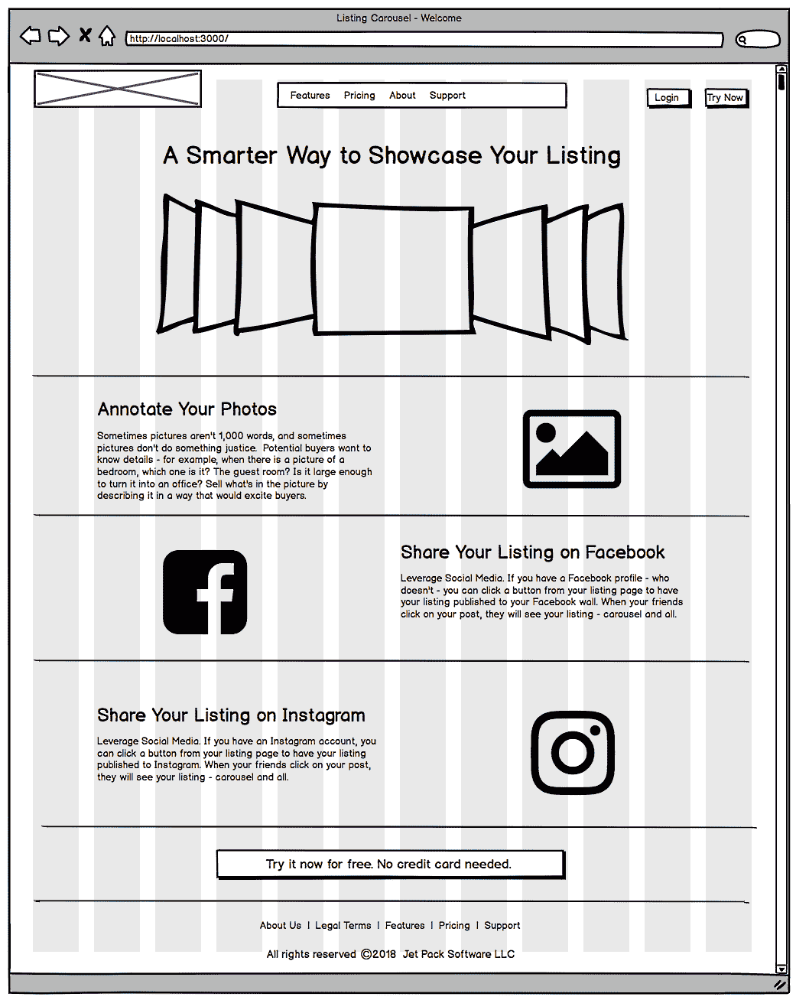

我们现在将继续实现上述线框截图的代码实现。我们首先将实现页眉部分，并使用`<nav>`标签来对所有页眉部分的代码进行分类，包括 logo、菜单和操作按钮：

```ts
<nav  class="navbar navbar-default navbar-fixed-top">
 <div  class="container">
 <div  class="navbar-header">
 <button  type="button"  class="navbar-toggle"               data-toggle="collapse" data-target="#myNavbar">
 <span  class="icon-bar"></span>
 <span  class="icon-bar"></span>
 <span  class="icon-bar"></span>             </button>
 <a  class="navbar-brand"  href="#myPage">Logo</a>
 </div>
 <div  class="collapse navbar-collapse"  id="myNavbar">
 <ul  class="nav navbar-nav mr-auto">
 <li><a  href="#features">Features</a></li>
 <li><a  href="#pricing">Pricing</a></li>
 <li><a  href="#about">About</a></li>
 </ul>
 </div>
 <div  class="collapse navbar-collapse ">
 <ul  class="nav navbar-nav navbar-right">
 <li><a  href="#features">Login</a></li>
 <li><a  href="#pricing">Try Now</a></li>
 </ul>
 </div>
 </div> </nav>
```

在上面的代码中，我们正在实现一个`nav`标签元素，并使用 Bootstrap 导航栏类，`navbar-default`，`navbar-fixed-top`，`navbar-brand`，`navbar-collapse`等。这些类具有默认功能，几乎涵盖了导航部分的所有方面。在上面的代码中值得注意的一点是`navbar-collapse`类，它有助于自动呈现各种设备屏幕分辨率。我们还添加了一些菜单链接，如功能、定价和关于。我们还添加了我们的操作项目，登录和立即尝试。

在浏览器中启动页面，我们应该看到如下截图所示的输出：

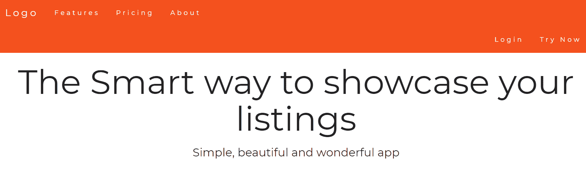

接下来，我们需要为内容部分制作布局。巨幕和内容部分。我们将使用`jumbotron`类与`div`部分，对于内容部分，我们将使用 Bootstrap 网格列类，`row`，`col-sm-8`和`col-sm-4`：

```ts
<div  class="jumbotron text-center">
  <h1>The Smart way to showcase your listings</h1>  <p>Simple, beautiful and wonderful app</p>  </div> <!-- Container (About Section) -->
<div  id="about"  class="container-fluid">
 <div  class="row">
 <div  class="col-sm-8">
 <h2>Annotate your prices</h2><br>
 <h4>Some pictures aren't 1000 words and sometimes pictures 
     don't do something justice</h4><br>
 </div>

 <div  class="col-sm-4">
 <span  class="glyphicon glyphicon-signal logo"></span>
 </div>
 </div> </div> <div  class="container-fluid bg-grey">
 <div  class="row">
 <div  class="col-sm-4">
 <span  class="glyphicon glyphicon-globe logo slideanim"></span>
 </div>
 <div  class="col-sm-8">
 <h2>Our Values</h2><br>
 <h4><strong>MISSION:</strong> Our mission lorem ipsum dolor sit amet, 
    consectetur adipiscing elit, sed do eiusmod tempor incididunt ut labore 
    et dolore magna aliqua. Ut enim ad minim veniam, quis nostrud 
    exercitation ullamco laboris nisi ut aliquip ex ea commodo consequat.</h4> <br> <p><strong>VISION:</strong> Our vision Lorem ipsum dolor sit amet, 
    consectetur adipiscing elit, sed do eiusmod tempor incididunt ut labore 
    et dolore magna aliqua. Ut enim ad minim veniam, quis nostrud 
    exercitation ullamco laboris nisi ut aliquip ex ea commodo 
    consequat. Lorem ipsum dolor sit amet, consectetur adipiscing elit, sed do eiusmod tempor incididunt ut labore et dolore magna aliqua. Ut enim ad minim veniam, quis nostrud exercitation ullamco laboris nisi ut aliquip ex ea commodo consequat.</p> </div> </div> </div>
```

现在，让我们分析上面的代码，以了解一些重要的要点。我们正在利用强大的 Bootstrap 网格工具来创建我们的应用程序布局，使用列类来创建在各种屏幕分辨率上呈现的布局。在浏览器中运行应用程序，我们应该能看到如下截图所示的输出：

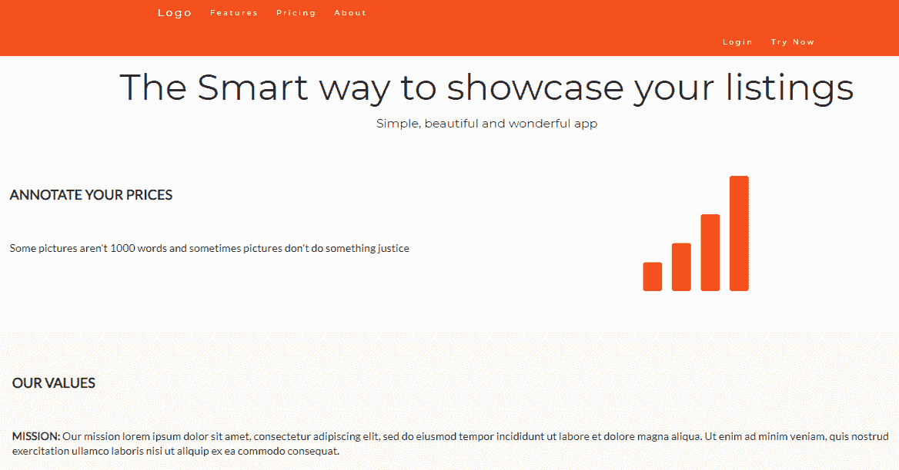

到目前为止，干得不错，伙计们。我们刚刚使用 Bootstrap 布局组件创建了我们的第一个欢迎页面布局。我们将继续使用相同的组件，并构建更多的线框，以使您感到舒适。在下一节中，我们将学习如何使用 Bootstrap 模态组件创建注册和登录界面。

# 注册

接下来，我们将使用 Bootstrap 的模态组件来实现我们的注册和登录页面。

让我们来看一下下面的线框。这是一个简单的模态窗口，带有一些表单字段输入元素：

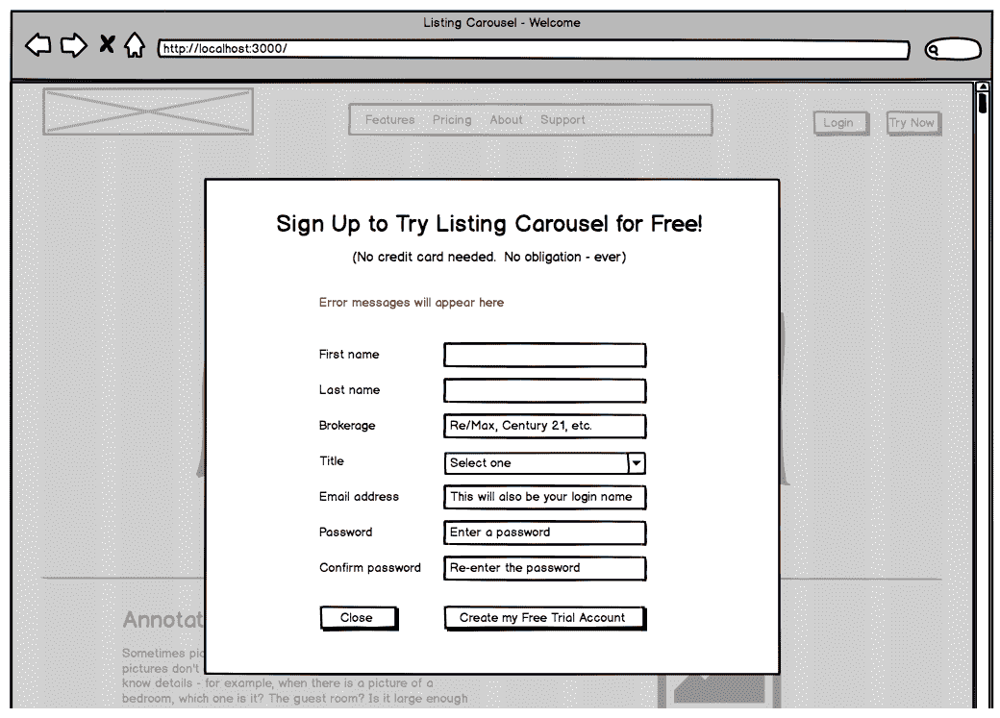

让我们继续实现代码。以下是创建模态窗口的示例代码：

```ts
<div  class="modal fade"  id="signup-modal"  tabindex="-1"  role="dialog"      aria-labelledby="myModalLabel"  aria-hidden="true"  style="display: 
        none;">
  <div  class="modal-dialog">
  <div  class="loginmodal-container">
  <h1>Signup Account</h1><br>
  <form>
  <input  type="text"  name="firstname"  placeholder="Firstname">
  <input  type="text"  name="lastname"  placeholder="Last Name">
  <input  type="text"  name="brokrage"  placeholder="Brokrage">
  <input  type="text"  name="user"  placeholder="Username">
  <input  type="password"  name="pass"  placeholder="Password">
  <input  type="submit"  name="login"  class="login 
                loginmodal-submit" value="Sign Up">
  </form>  <div  class="login-help">
  <a  href="#">Register</a> - <a  href="#">Forgot Password</a>
  </div>
  </div>
  </div>
  </div>
```

在上面的代码中，我们使用了 Bootstrap 的模态组件和模态类 modal 和 modal-dialog。在模态对话框内容中，我们使用输入表单元素——名字、姓氏、经纪人、用户和密码创建了注册表单。在浏览器中启动页面，我们应该能看到如下截图所示的输出：

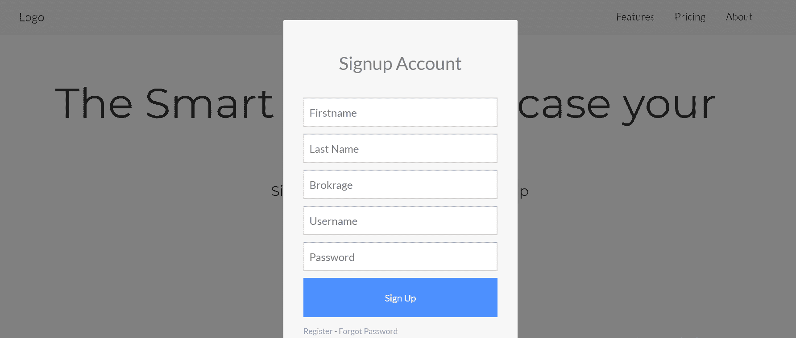

这是构建我们应用程序的一个很好的开端。在下一节中，我们将使用相同的 Bootstrap 模态组件来构建我们的登录页面。

# 登录

在前一节中，我们已经学习了如何在模态窗口内创建注册表单。在本节中，我们将学习如何在模态窗口内创建登录界面。方法和原则与我们创建注册页面的方式完全相同。

让我们来看一下下面的登录线框，我们马上就要实现它：

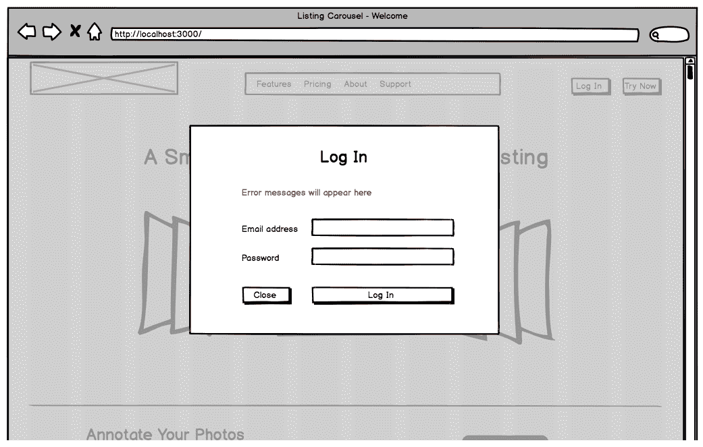

是时候行动起来了。我们将首先创建一个模态窗口，然后可以绑定一个点击事件来打开对话框窗口：

```ts
<div  class="modal fade"  id="login-modal"  tabindex="-1"  role="dialog"     aria-labelledby="myModalLabel"  aria-hidden="true"  style="display: 
     none;">
 <div  class="modal-dialog">
 <div  class="loginmodal-container">
 <h1>Login to Your Account</h1><br>
 <form>
  <input  type="text"  name="user"  placeholder="Username">
  <input  type="password"  name="pass"  placeholder="Password">
  <input  type="submit"  name="login"  class="login 
                   loginmodal-submit"  value="Login">

  </form>
             <div  class="login-help">
 <a  href="#">Register</a> - <a  href="#">Forgot Password</a>
 </div>
 </div>
 </div> </div>
```

在上面的代码中，我们实现了一个带有另一个表单的模态窗口，这次是用于登录功能，包括一些表单元素——用户名和密码以及一个提交按钮。在浏览器中启动页面，我们应该能看到以下输出：

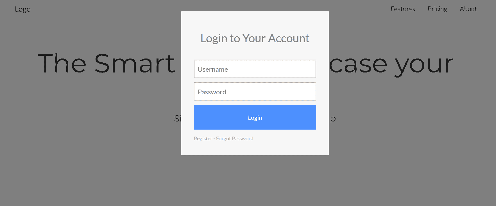

我们的应用程序现在几乎成形了。我相信你和我一样兴奋。让我们继续实现列表页面。

# 列表

在之前的章节中，我们使用 Bootstrap 组件创建了我们的主页、注册和登录页面。在本节中，我们将创建我们的列表页面。看一下以下线框图。我们需要循环遍历我们的列表，并显示一个网格部分，在那里我们将显示到目前为止所有的列表。简单吗？当然：

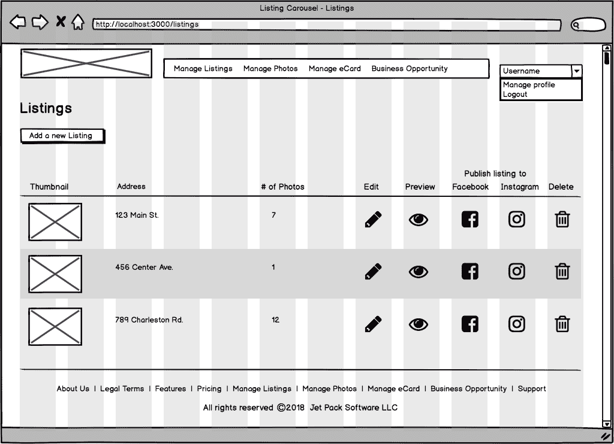

我们需要使用 Bootstrap 的高级布局和网格组件来创建上述布局。看一下以下示例代码。我们可以以多种方式实现上述布局。我们可以使用 Bootstrap 网格列来设计布局，或者我们可以使用表格元素来设计结构。在这个例子中，我将向您展示如何使用表格元素来做到这一点，网格结构留给您作业：

```ts
<div  class="container-fluid">
 <table  class="table table-hover shopping-cart-wrap">
 <thead  class="text-muted">
 <tr>
 <th  scope="col"  width="150">Thumbnail</th>
 <th  scope="col">Caption</th>
 <th  scope="col">Property</th>
 <th  scope="col"  width="200"  class="text-right">Action</th>
 </tr>
 </thead>
 <tbody>
 <tr>
 <td>
 <figure  class="media">
 <div  class="img-wrap"></div>
 </figure>         </td>
 <td>  Master Bedroom  </td>
 <td>  789 Charelston Rd  </td>
 <td  class="text-right">  <a  title=""            href=""  class="btn btn-outline-success"  ata-toggle="tooltip"            data-original-title="Save to Wishlist">            <i  class="fa fa-heart"></i></a>  <a  href=""               class="btn btn-outline-danger">Remove</a>            </td>
  </tr>
  <tr>
  <td>          <figure  class="media">
 <div  class="img-wrap"></div>
 </figure>         </td>
 <td>  Kitchen  </td>
 <td>  789 Charelston Rd  </td>
 <td  class="text-right">         <a  title=""  href=""  class="btn btn-outline-success"           data-toggle="tooltip"  data-original-title="Save to Wishlist">           <i  class="fa fa-heart"></i></a>         <a  href=""  class="btn btn-outline-danger btn-round">Remove</a>            </td> </tr>
 <tr>
 <td>
 <figure  class="media">
 <div  class="img-wrap"></div>
 </figure>         </td>
 <td>  Den  </td>
 <td>  789 Charelston Rd  </td>
 <td  class="text-right">         <a  title=""  href=""  class="btn btn-outline-success"            data-toggle="tooltip" data-original-title="Save to Wishlist">            <i  class="fa fa-heart"></i></a>         <a  href=""  class="btn btn-outline-danger btn-round">Remove</a>
 </td> </tr> </tbody> </table> </div>  <!-- card.// -->
```

在上面的代码中，我们使用`container-fluid`类创建了一个容器，在容器内部，我们创建了一个表格和行结构来显示我们的列表。在更实际的情况下，数据将始终来自后端 API 或服务。对于我们的示例和学习目的，我们在这里存根化了数据。在浏览器中启动页面，我们应该看到如下截图所示的输出：

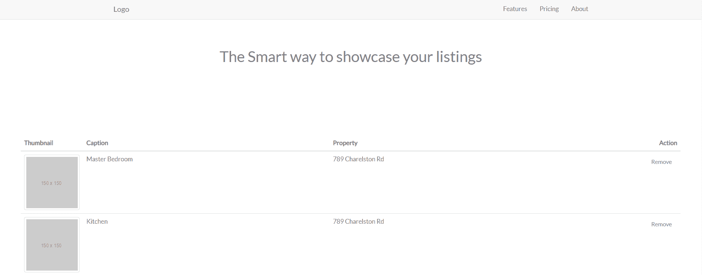

如果您看到前面截图中显示的输出，请给自己一个鼓励。我们在学习中取得了很大的进步。到目前为止，我们已经使用各种不同的 Bootstrap 组件和网格布局创建了四个页面。

在下一节中，我们将探索应用程序的一些其他线框图，我会留给你练习。大多数线框图将使用相同的组件、布局和网格布局。

# 创建列表

在本节中，我将与您分享**创建列表**页面的线框图。可以使用 Bootstrap 组件和布局轻松创建创建列表页面。相反，我们将在下一章中学习如何使用 Flex-layout 来实现这一点。以下是您参考的线框图：

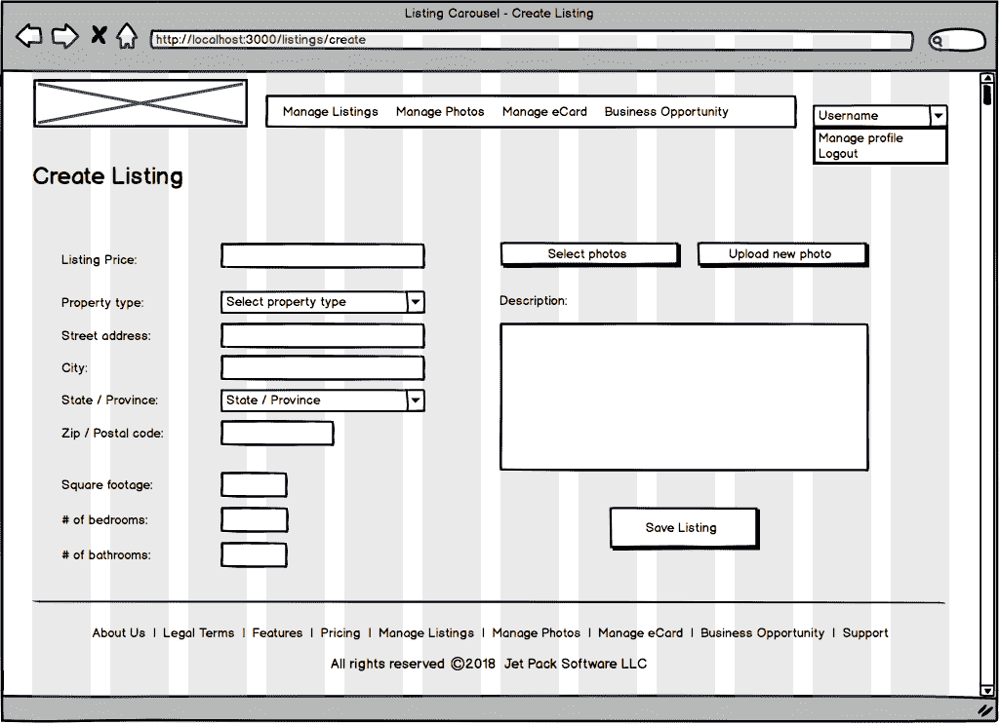

在下一节中，我们将看到**编辑列表**页面的设计和线框图细节。

# 编辑列表

在本节中，我们将学习**编辑列表**屏幕的设计和线框图。如果您仔细观察，**编辑列表**页面与**创建列表**页面类似，只是数据在加载时被填充。

与**创建列表**屏幕一样，我们将在下一章中使用 Flex-layout 设计**编辑列表**页面。

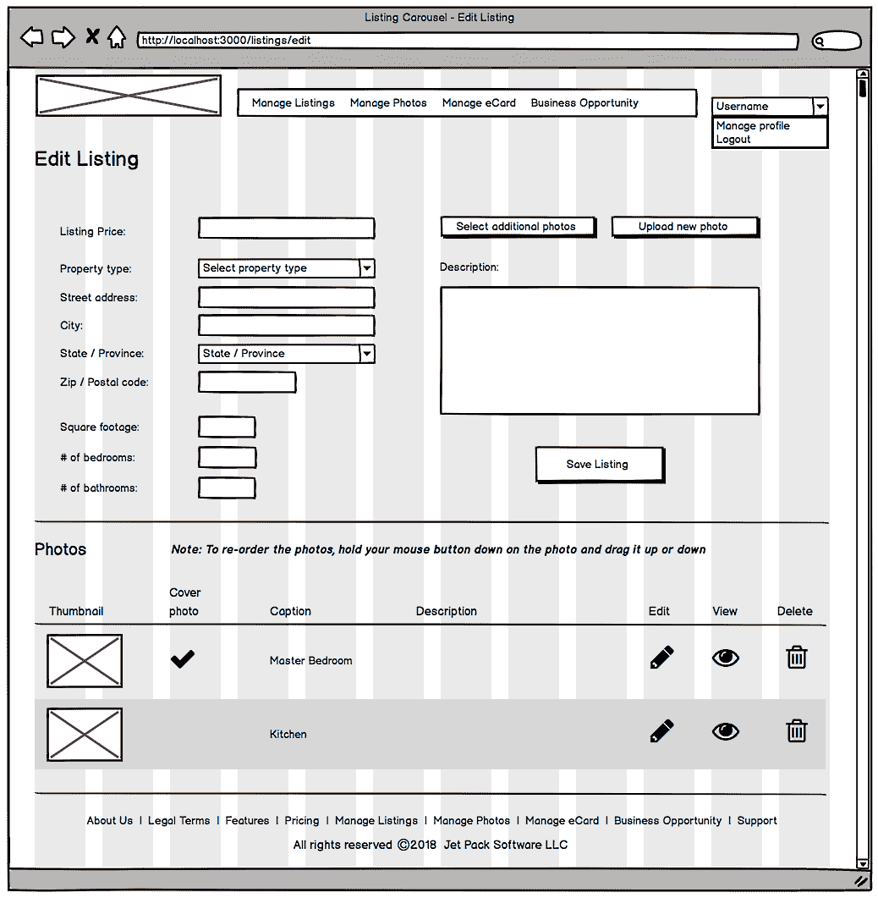

# 线框图集合

在本节中，我们将看到其他页面的设计线框图，这些页面将在接下来的章节中创建。

以下是**列表预览**页面的设计线框图：

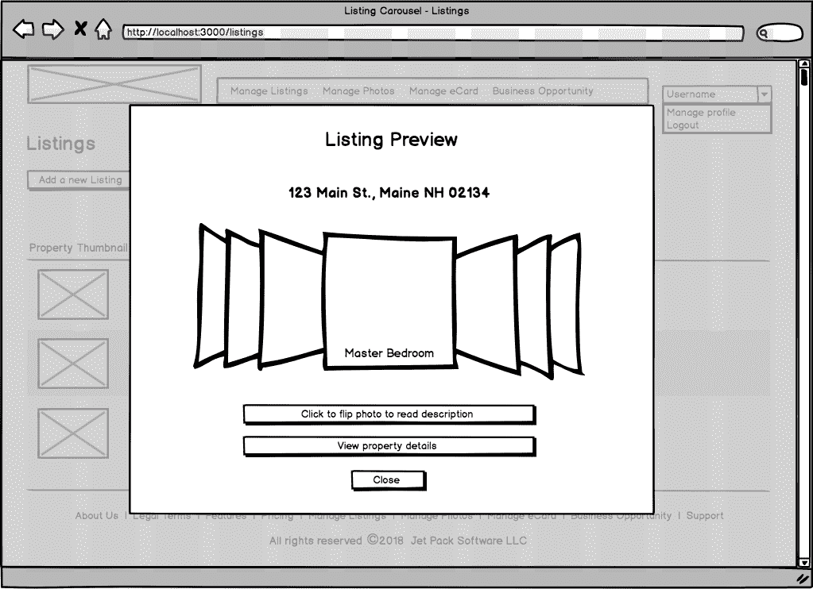

以下是物业详情的设计线框图。如果您注意到，我们将使用相同的 Bootstrap 模态窗口组件。当我们打开模态窗口时，我们应该看到物业详情：

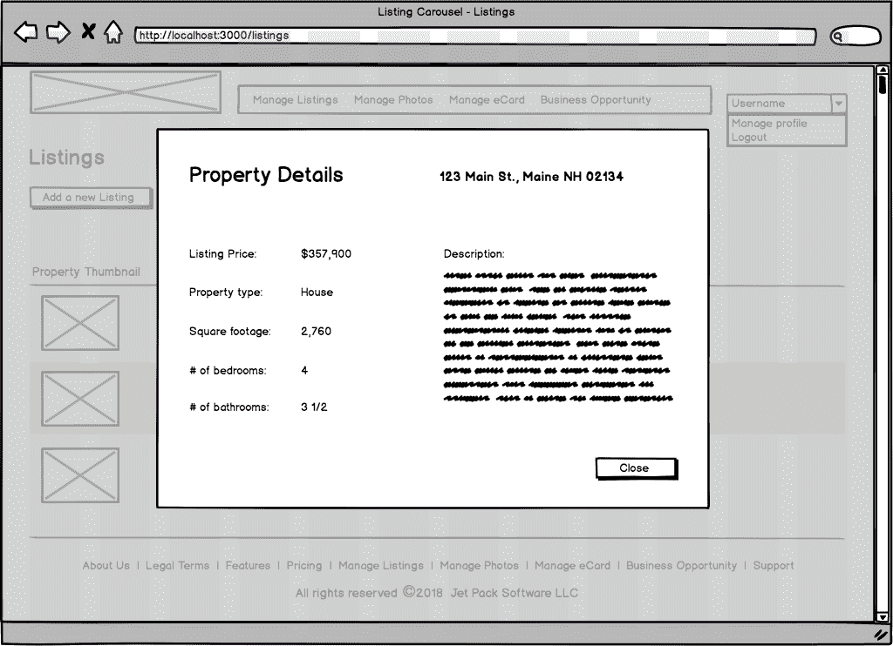

现在，我们将学习如何为**照片**页面设计线框图。如果您仔细观察，布局结构看起来与**列表**页面相似。我们将不得不使用常见库创建可重用的设计，这些设计可以在各种页面和模板中重复使用：

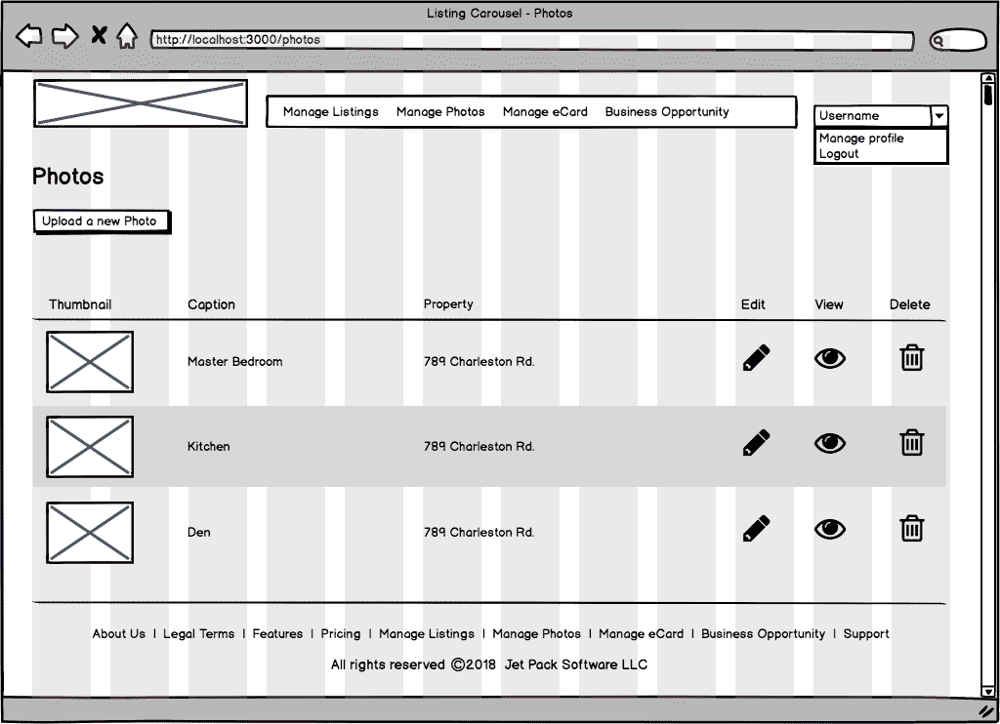

接下来是**上传照片**页面。我们将再次创建一个模态窗口组件，并通过它提供文件上传选项，以便我们可以轻松上传照片：

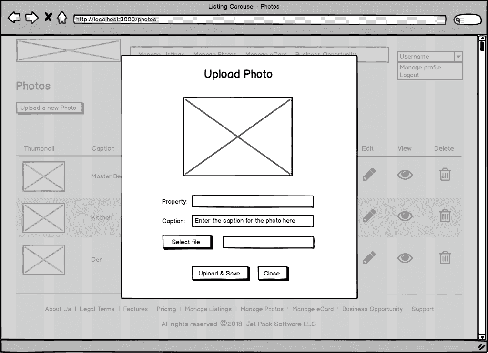

现在，让我们继续**编辑照片**线框图。我们再次利用 Bootstrap 的模态窗口组件来设计我们的**编辑照片**页面。我们将使用 Angular 的数据绑定来绑定模态窗口中的数据：

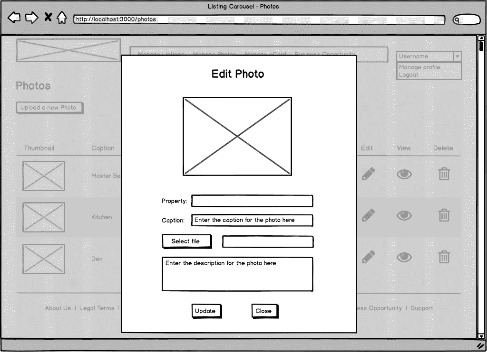

最后，我们将探索**照片预览**页面。我们可以使用模态窗口 Bootstrap 组件显示照片。我们将关闭常见的操作按钮以关闭或编辑模态窗口：

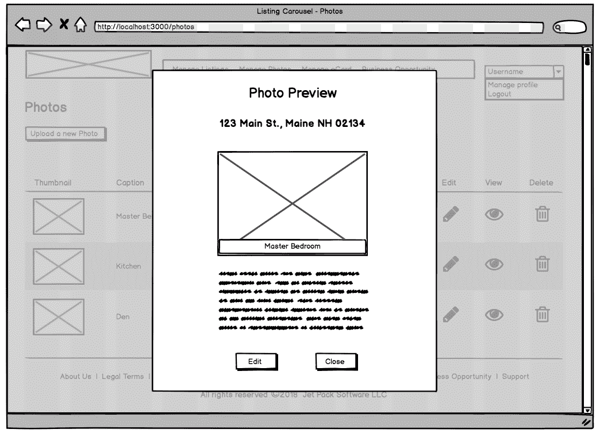

在本章中，我们做了相当多的工作，学习了 Bootstrap 网格和布局组件。作为实际学习示例的一部分，我们创建了一些页面并设计了我们将在应用程序中使用的线框图。

# 总结

这一章充满了各种好东西。你现在应该了解我们将要构建的示例应用程序，我们构建阶段的高层游戏计划，以及我们将采取的第一阶段构建的五个步骤过程。

然后，我们讨论了 Sass 是什么，以及它的一些功能如何帮助我们创建应用程序的 CSS。我们将研究一些工具，帮助你在编写应用程序的 Sass 时。接下来，我们了解了 Bootstrap 是什么，以及如何将其集成到你的应用程序中。我们学习了 Bootstrap 的网格是什么，以及如何使用它的基础知识，以及一些 Bootstrap 的组件以及如何使用它们。

最后，我们研究了软件项目的演变，从构思到实施。在这里，我们涵盖了不同类型的分析，需求的收集以及一些用例。我们还涵盖了线框图，详细介绍了每个线框图的目标，以及基本的设计原则（在描述线框图时提到）。

到目前为止，在本书中，除了我们在第一章中构建的快速待办事项应用程序外，我们甚至还没有接触过 Angular。这将会改变——从下一章开始，第四章，*路由*。在这一章中，我们将使用 CLI 创建应用程序的 Angular 外壳（就像我们在书的开头所做的那样）。但是，我们将为其添加路由。我将在我们逐步进行的过程中解释什么是路由，以及如何为我们的应用程序配置路由。

所以，在你翻页之前，给自己一个鼓励，伸展一下，也许倒一杯你最喜欢的饮料。干得好，我的 Angular 初学者同伴们。通过了这前三章，你现在已经准备好迎接 Angular 了！
