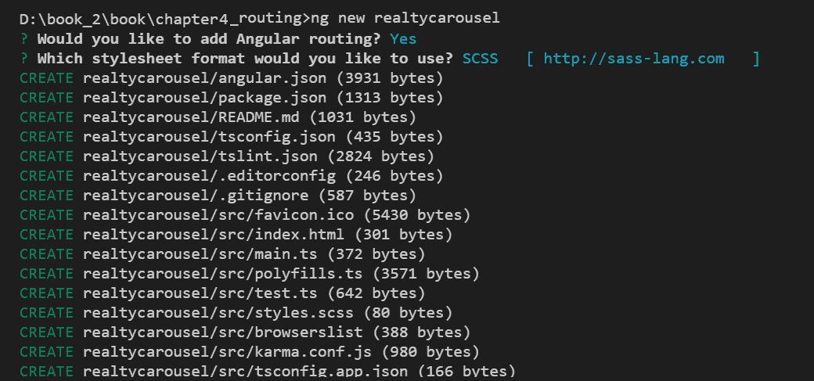
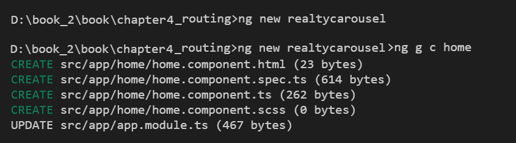
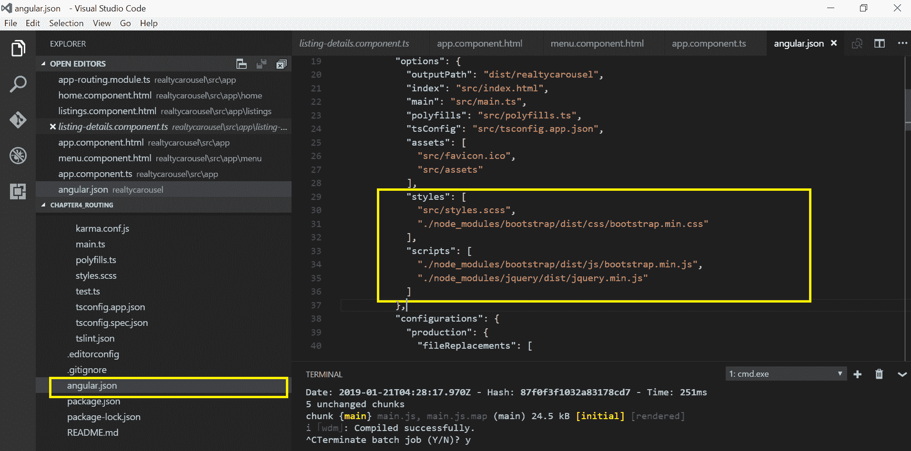
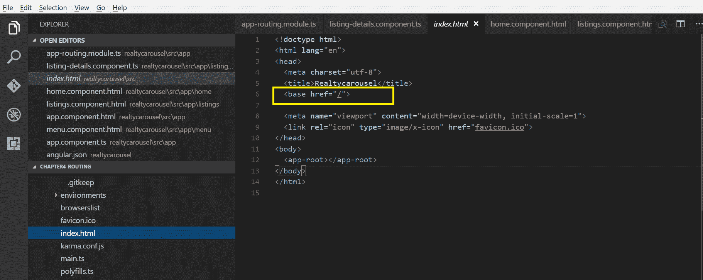
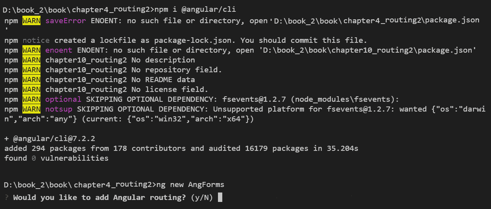
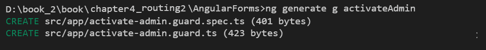
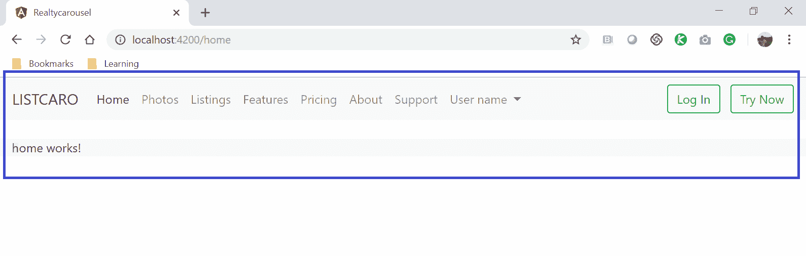

# 第四章：路由

上一章是一个庞然大物，但它是必要的，因为它需要给你提供两种你可能会使用的技术的速成课程，或者应该考虑在你的网页开发项目中使用的技术（无论你的项目是否利用 Angular）。另外，第三章《Bootstrap - 网格布局和组件》也有助于为本书的其余部分铺平道路。

与之相比，本章要小得多，但它标志着我们进入 Angular 的真正开端。从这一点开始，每一章，甚至第十二章《集成后端数据服务》，其中主要关注在 Node 和 MongoDB 中构建后端服务，都包含 Angular 的内容（具体来说，如何使用 Angular 的 HTTP 客户端以及如何将代码封装在 Angular 服务中）。

关于本章的另一个注意事项是，大多数关于 Angular 的书籍在介绍 Angular 模板和组件之前并不介绍路由，这是可以接受的；但我们不会遵循这种方法。尽管路由和组件模板是密不可分的，这也是大多数书籍在介绍组件之后再讨论路由的原因，但理解组件并不是理解路由的先决条件。

更一般地说，大多数编程书籍都试图提前呈现所有的材料和概念，然后在以后的某个时候回过头来尝试以某种方式实现它们。这种方法的问题之一是，它违反了我们大脑在吸收和内化新信息时的工作方式。通常最好立即以小的增量步骤使用新信息。

本书的重点是尽可能实用，尽快实现，并以最大程度地保留和理解新材料的方式。因此，为了实现这一点，我们将在整本书中一起构建我们的示例应用程序，学习我们需要的主题，而不是在之前。这意味着我们经常会实现尚未完全解释的内容。它们将在实现它们时向您解释，或者在之后立即解释——当您的大脑处于最佳状态，并寻找模式以促进理解时。

所以，不要担心头等跳进去——通常这是最好的方式。我是你的向导，我会一直陪伴你到书的最后。

在本章中，我们将一起学习以下内容：

+   为 Angular 应用程序定义路由是什么

+   使用 CLI 创建应用程序的外壳以及它的前几个组件

+   为我们的应用程序配置路由

+   研究路由重定向、参数化路由和路由守卫

+   完成我们应用程序的路由配置。

+   研究路由策略

有很多内容要涵盖（即使是像这样的小章节），所以让我们开始吧！

# 什么是 Angular 中的路由？

在 Angular 中，路由简单地将请求的 URL 映射到一个组件。这往往会让从另一个具有路由的技术（特别是不是单页面应用程序框架的技术）转向 Angular 的人感到困惑。让我稍微解释一下。

Angular 应用程序只有一个页面（因此，术语单页面应用程序），我们将在创建 Angular 应用程序时看到。Angular 组件有模板，这些模板是用于设计结构和布局的标准 HTML 元素。正如我们将在第六章中看到的 *构建 Angular 组件*，它们也有样式。

正如书的第一章中提到的，Angular 应用程序可以被看作是组件树。这意味着组件可以包含其他组件，并且这种组件的嵌套可以根据应用程序的需要继续进行。

因此，尽管组件有模板（注意：一些 web 框架将 web 页面称为模板），Angular 的路由将 URL 路径映射到组件，而不是 web 页面或模板。当请求的 URL 渲染为组件的模板时（我们马上就会看到这是如何发生的），不仅会渲染该组件的模板，还会渲染所有嵌套组件的模板。由 Angular 路由映射到的顶级组件可能包含其他子组件，这些子组件又可以包含其他子组件，依此类推。这就是组件树的含义。

在大多数情况下，Angular 应用程序中的数据是从父组件流向其直接子组件的。它不会从父组件流向其孙子组件。此外，数据也不会向上流动。这是一个单向流动-从父级到子级。我说“在大多数情况下”，因为有一些技术和库可以改变部分行为-例如，组件可以通过中介相互通信，我们将在本书后面讨论。但是，按设计，没有外部干预，数据是从父级到子级流动的。

随着我们在本书中的进展，您将熟悉所有这些。您现在唯一需要理解的是，要理解路由，URL 被映射到组件而不是页面，因为 Angular 应用程序只有一个页面。Angular 应用程序中唯一的页面是`index.html`页面，位于 app 目录中。在[第六章]中，我们将看到我们的默认组件如何加载到`index.html`页面中。现在，让我们回到路由。

# 使用 CLI 创建应用程序的外壳

这就是一切的开始。我们现在已经到达了使用 CLI 创建应用程序的起点以及我们需要连接到路由配置的第一批组件的点。我们已经学习了如何安装 CLI，甚至一起创建了我们的第一个 Angular 应用程序-尽管我们的待办事项应用程序很小，只是为了让我们入门-在[第一章]中。

如果您还没有安装 CLI，那么现在肯定要安装了。一旦您完成了这个步骤（希望您已经完成了），启动 CLI，让我们开始吧！

首要任务是在您的计算机上创建一个目录，您将在其中放置所有的 Angular 项目。不要为我们的示例应用程序创建一个目录，因为 CLI 会为您完成这项工作。只需在文件系统上创建一个文件夹，并从命令行（如果您的操作系统是 Windows）或终端（如果您的操作系统是 Mac 或 Linux）中导航到该文件夹。为了简洁起见，从现在开始，我将称其为您的终端，文件夹为目录。

接下来，我们将使用 CLI 来创建我们应用程序的骨架（即根目录），以及 CLI 为我们创建的所有必需的 Angular 应用程序所需的文件和子目录。输入以下命令：

```ts
ng new realtycarousel 
```

**注意**：这将需要大约一分钟的时间来完成。

如果你看到最后一行输出为 Project realtycarousel successfully created.，那么现在你应该有一个名为`realtycarousel`的目录，其中包含我们应用程序的所有文件。

上述命令的输出如下截图所示：



现在让我们测试一下是否可以运行它。使用`cd`命令导航到你的`realtycarousel`目录：

```ts
cd realtycarousel
```

接下来，使用 CLI 的服务器命令启动我们的 Angular 应用程序：

```ts
ng serve  
```

你应该在终端看到一堆行输出。如果其中一行类似于`*** NG Live Development* Server is listening on localhost:4200, open your browser on http://localhost:4200/ **`，并且最后一行是`webpack: Compiled successfully`，那么你应该打开浏览器并将其指向`http://localhost:4200`。

如果你看到一个带有 Angular 标志的页面，这意味着一切都设置正确了。你现在有一个空的 Angular 应用程序。

你可以按下*Ctrl* + *C*来停止 CLI 的开发服务器。

接下来，让我们添加几个组件，我们将在路由配置中引用它们。同样，现在不要担心组件。我们将在第六章 *构建 Angular 组件* 和 第七章 *模板、指令和管道* 中深入研究它们。

依次运行以下 CLI 命令列表：

```ts
ng g c home
ng g c signup ng g c login
ng g c logout
ng g c account
ng g c listings
ng g c createListing
ng g c editListing
ng g c previewListing
ng g c photos
ng g c uploadPhoto
ng g c editPhoto
ng g c previewPhoto
ng g c pageNotFound
```

第一个命令的输出如下截图所示：



当我们创建所有其他组件时，我们应该看到类似的输出。

我们现在有了我们需要的第一组组件。虽然它们的模板现在是空的，但这已经足够让我们为我们的应用程序配置路由了。

由于我们将在应用程序中使用 Bootstrap 进行一些操作，例如其导航栏和响应式网格，我们需要安装 Bootstrap 以及其依赖项。在第三章中，*Bootstrap - 网格布局和组件*，我们只是在`index.html`页面的头部引用了一些 CDN URL，以便能够使用 Bootstrap。但是，我们现在将以不同的方式安装 Bootstrap - 我们将使用`npm`。

您需要在系统上安装 Node.js 才能使用**node package manager**（**npm**）。

要安装 Bootstrap、jQuery 和 Popper，请在终端中运行以下命令：

```ts
npm install bootstrap@4 jquery popper --save
```

我们已经安装了库，现在是时候在我们的配置文件中包含它们，以便它们在整个应用程序中可用。

打开`angular.json`文件，并在相应的部分中包含样式表和 JavaScript 文件，如下面的代码片段所示：

```ts
"styles": [
    "styles.css",
    "./node_modules/bootstrap/dist/css/bootstrap.min.css"
],
"scripts": [
    "../node_modules/jquery/dist/jquery.min.js",
    "./node_modules/bootstrap/dist/js/bootstrap.min.js"
] 
```

屏幕截图显示了编辑后的`angular.json`文件：



一切准备就绪！

现在我们已经拥有了我们需要为应用程序设置路由的核心文件。我们还确保安装了 Bootstrap，因为我们将在本章中为我们的应用程序创建导航栏。此外，我们的导航链接将包含 Angular 用于路由的特殊标签，这也是我们此时需要安装 Bootstrap 的另一个原因。

让我们再次使用我们的 IDE（最好使用 Visual Studio Code，但您可以使用您喜欢的任何 IDE）打开我们的项目，这样我们就可以查看项目结构。此外，在下一节“完成我们的路由配置”中，我们将对一些文件进行更改以进行设置，因此您需要一种方便打开和编辑这些文件的方式。

现在在您的 IDE 中打开项目后，导航到`app`目录，该目录位于`src`目录内。作为 Angular 开发人员，我们将在`app`目录中度过绝大部分时间。在`app`目录中，您会找到许多以*app*开头的文件。这些文件组成了我们应用程序中的根组件（即应用程序组件），当我们来到第六章 *构建 Angular 组件*时，我们将会检查这些文件的每个文件的作用，您将会非常熟悉 Angular 组件。您将在`app`目录中看到许多子目录，每个子目录都是我们刚刚创建的组件，比如 about、account、home 等。

请记住，Angular 应用程序的编写语言是 TypeScript，这就是`.ts`文件扩展名的含义。让我们开始为我们的应用程序配置路由。

# 首先要了解的是基本概念

在这一部分，我们将在开始为我们的 Angular 应用程序添加路由之前，快速了解一些基本概念的概述。在基本概念中，我们将学习`Base Href`、`RouterLink`和`RouterLinkActive`，这些是我们在使用 Angular 路由时需要在模板中实现的内容。

# Base Href

为了在应用程序内部组合链接，每个 Angular 应用程序都应该在父级别定义`base href`。

打开由 Angular CLI 生成的应用程序，并查看`index.html`文件。我们将看到基本`href`定义为`/`，这将解析为根或顶级层次结构。

以下截图显示了由 Angular CLI 生成的默认基本`href`配置：



# RouterLink 和 RouterLinkActive

在第七章中，*模板、指令和管道*，我们将详细了解组件、指令和模板。现在，只需了解，就像 HTML5 中的锚元素和`href`属性一样，Angular 提供了一种绑定链接和 URL 资源的方式：

```ts
<nav>
 <a routerLink="/home" routerLinkActive="active">Home</a>
 <a routerLink="/listings" routerLinkActive="active">Listings</a>
</nav>
```

在上述代码中，我们添加了两个链接。请注意，我们已经在链接中添加了`routerLink`属性，这将帮助我们分别绑定`/home`和`/listings`的值。

还要注意，我们已经添加了`routerLinkActive`属性，并将值分配为`active`。每当用户点击链接时，Angular 路由将知道并使其处于活动状态。有些人称之为魔术！

# 为我们的应用程序配置路由

是时候为我们的应用程序添加 Angular 路由了。

我们有两种实现路由的选项：

+   我们可以使用 Angular CLI 在项目创建期间添加路由

+   或者我们可以手动添加 Angular 路由到我们的应用程序中

首先，让我们探索简单的方法，使用 Angular CLI 添加路由。

Angular CLI 为我们提供了一种简单的方法来为我们的 Angular 应用程序添加路由功能。在生成新项目时，Angular CLI 将提示我们选择是否要为我们的应用程序添加路由。

以下截图显示了在 CLI 中显示添加 Angular 路由选项：



当我们选择在我们的应用程序中添加路由选项时，我们使用 Angular CLI 创建文件，导入所需的模块，并创建路由规则集。

现在，让我们手动为我们的项目添加路由。让我们看看如何在我们的应用程序中配置路由。

为了配置我们的路由，我们需要按照以下步骤进行：

1.  打开`app.module.ts`文件

1.  在文件顶部的`import`部分添加以下`import`语句：

```ts
import { NgModule } from '@angular/core';
import { Routes, RouterModule } from '@angular/router';
```

`RouterModule`包含路由服务和路由指令。

`Routes`模块定义了路由类型（记住，TypeScript 为 JavaScript 添加了变量类型）。

1.  在`app-routing.module.ts`文件中编写一些路由和规则集：

```ts
const appRoutes: Routes = [
  { path: ‘home’, component: HomeComponent },
  ...
  { path: ‘’, redirectTo: ‘/home’, pathMatch: ‘full’ },
  { path: ‘**’, component: PageNotFoundComponent  }
];
```

这段代码只显示了三个映射：

+   `HomeComponent`的映射

+   重定向的映射

+   通配符或*catch-all*的 URL 请求的映射

第一个映射对象是最简单的情况。URL 路径（即域名后面的部分）映射到一个组件，没有任何参数（注意路由可以被参数化，我们很快会在*参数化路由*部分看到）。这个路由的作用是指示 Angular 在请求的 URL 路径以 home 结尾时呈现`HomeComponent`模板。

第二个映射对象是如何将一个路径重定向到另一个 URL 和路由的示例。这通常被称为路由重定向。在我们的情况下，路径是一个空字符串，这意味着当仅在浏览器位置栏中输入域名时，Angular 的路由机制将重定向请求（即更改 URL 中的路径）到`/home`。由于有一个处理`/home`的映射对象，它将被触发，从而呈现`HomeComponent`模板。这是网站的常见做法——输入域名通常会将用户带到主页或索引网页。在我们的情况下，由于我们正在构建 SPA（这就是 Angular web 应用程序），没有主页，而是一个主页组件，这意味着主页组件的模板被呈现以模拟主页。

第三个映射对象是通配符匹配的一个示例，并且放置在最后一个映射对象。当 Angular 的路由机制解析请求的 URL 时，它会从上到下将其与映射对象进行比较。如果 URL 不匹配任何映射规则集，将触发最后一个映射对象。对于我们的应用程序来说，这意味着如果没有匹配项，将呈现`PageNotFoundComponent`模板。

1.  现在是时候导入我们的`appRoutes`了；这是我们告诉 Angular 我们的路由的方式。`appRoutes`是一个包含我们路由映射的常量，让我们接着创建它：

```ts
imports: [
 BrowserModule,
 RouterModule.forRoot(appRoutes)
]
```

1.  最后，我们需要将`app-routing.module.ts`文件导入到`app.module.ts`中。

`app-routing.module.ts`文件的完整代码清单在本章后面的*完成我们的路由配置*部分中。

我们已经将路由直接添加到`app.module.ts`文件中。将路由配置文件分离出来是一个很好的做法。更好的做法是，在创建项目时始终使用 Angular CLI 直接添加路由。

就是这样；我们已经在我们的项目中实现了路由。在下一节中，我们将详细了解如何添加更多路由，向我们的路由添加参数，并创建子路由。

# 参数化路由

参数化路由是具有变量值作为 URL 路径一部分的路由。例如，一个常见的例子是当我们通过 ID 引用某些内容时，如下所示：

+   `/listing/23`（在我们的房地产网站上显示属性＃23）

+   `/listing/55`（在我们的房地产网站上显示属性＃55）

+   `/listing/721`（在我们的房地产网站上显示属性＃721）

显然，必须配置数百个路由不仅会很繁琐、低效和容易出错，而且这些路由的维护（即删除路由和添加新路由，因为属性列表的库存发生了变化）将会很麻烦。

幸运的是，Angular 允许参数化路由，可以解决这些问题。

看一下以下代码片段中更新的路由：

```ts
const routes: Routes = [
{ path: 'home'},
{ path: 'listings/:id', component: ListingDetailsComponent },
{ path: ‘’, redirectTo: ‘/home’, pathMatch: ‘full’ },
{ path: ‘**’, component: PageNotFoundComponent  } ];
```

仔细看，在前面的路由中，我们添加了一个捕获列表`id`的路由，并且我们还将其映射到`ListingDetailsComponent`组件。

换句话说，我们还可以说我们已经为列表创建了一个通用模板，并且根据运行时传递的动态值，组件将显示相应的数据。

那很容易。如果我们有一个涉及创建子路由的更复杂的场景呢？继续阅读。

# 子路由

到目前为止，我们创建的路由都是非常简单和直接的用例。在复杂的应用程序中，我们将需要使用深度链接，这指的是在许多级别下追踪链接。

让我们看一些例子：

+   `/home/listings`（显示家中的列表）

+   `/listing/55/details`（显示列表＃55 的详细信息）

+   `/listing/721/facilities`（显示列表＃721 的设施）

这就是子路由对我们非常有用的地方。

在以下示例中，我们在 home 路由路径内创建了一个子路由：

```ts
const routes: Routes = [
{ path: 'home',
 component: HomeComponent,
 children: [
 { path: 'listings',
    component: ListingsComponent}
 ]
},
{path: 'listings/:id', component: ListingDetailsComponent },
{path: '', redirectTo: '/home', pathMatch: 'full'}
];
```

在前面的代码中，我们为*home*路径定义了`children`，再次指定了`path`和`component`，这将对应于子路由路径。

好的，很好。这是好东西。

如果我们想在用户访问特定路由之前添加一些验证呢？就像俱乐部外面的保镖一样？那个保镖就叫做路由守卫。

# 路由守卫

与大多数 Web 应用程序一样，有一些资源（即页面/组件模板）是每个人都可以访问的（例如**欢迎页面**、**定价页面**、**关于我们**页面和其他信息页面），还有一些资源只能被授权用户访问（例如仪表板页面和帐户页面）。这就是路由守卫的作用，它是 Angular 防止未经授权用户访问应用程序受保护部分的方式。当有人尝试访问保留给授权用户的 URL 时，他通常会被重定向到应用程序的公共主页。

在传统的 Web 应用程序中，检查和验证是在服务器端代码中实现的，实际上没有选项可以在客户端验证用户是否可以访问页面。但是使用 Angular 路由守卫，我们可以在客户端实现检查，甚至不需要访问后端服务。

以下是我们可以在应用程序中使用的各种类型的守卫，以增强授权安全性的各种类型的守卫：

+   `CanActivate`：帮助检查路由是否可以被激活

+   `CanActivateChild`：帮助检查路由是否可以访问子路由

+   `CanDeactivate`：帮助检查路由是否可以被停用

+   `Resolve`：帮助在激活任何路由之前检索路由数据

+   `CanLoad`：验证用户是否可以激活正在进行懒加载的模块

在我们开始实际操作之前，我想给你快速概述一下 Angular 路由守卫，比如在哪里使用它们，如何使用它们，返回类型是什么，等等。路由守卫总是作为服务注入的（即，我们有`@injectable`并且需要注入它）。守卫总是返回一个布尔值，`true`或`false`。我们可以让我们的路由守卫返回可观察对象或承诺，内部将其解析为布尔值。

我们将继续在上一节中创建的示例上继续工作和扩展。我们将添加一个新组件并将其命名为**CRUD**。作为用户，当您尝试访问`crud`路由时，我们将检查路由返回`true`时。我们将允许用户导航并查看模板；否则，应用程序将抛出错误提示。

让我们直接进入代码，实现路由守卫。就像我们学习如何生成组件或服务一样，我们可以使用`ng`命令生成路由守卫。在终端中运行以下命令：

```ts
ng generate g activateAdmin
```

我们刚刚生成了一个名为`activateAdmin`的新路由守卫。上述命令的输出显示在这里：



让我们看看 Angular CLI 生成的文件。在编辑器中打开`activate-admin.guard.ts`文件。看一下文件中生成的默认代码：

```ts
import { Injectable } from '@angular/core';
import { CanActivate, ActivatedRouteSnapshot, RouterStateSnapshot } from '@angular/router';
import { Observable } from 'rxjs';

@Injectable({
  providedIn: 'root'
})
export class ActivateAdminGuard implements CanActivate {
  canActivate(
    next: ActivatedRouteSnapshot,
    state: RouterStateSnapshot): Observable<boolean> | Promise<boolean> 
     | boolean {
    return true;
  }
}
```

前几行只是从 Angular 路由器中导入所需的`CanActivate`、`ActivatedRouteSnapShot`和`RouterStateSnapshot`模块。接下来，我们知道由于路由守卫是可注入的，通过使用`@injectable`

装饰器，我们正在告知 Angular 将其注入到根内。我们正在创建一个名为`ActivatedAdminGuard`的类，其中已经创建了一个名为`canActivate`的方法。请注意，该方法必须返回一个布尔值，要么是`true`要么是`false`。我们已经创建了我们的路由守卫，现在让我们在`app-routing.module.ts`文件中创建一个路由。

看一下`app-routing.module.ts`文件的更新代码：

```ts
import { NgModule } from '@angular/core';
import { Routes, RouterModule } from '@angular/router';
import { CrudComponent } from './crud/crud.component';
import { LoginComponent } from './login/login.component';
import { RegisterComponent } from './register/register.component';
import {ActivateAdminGuard } from './activate-admin.guard';

const routes: Routes = [
    { path: 'login', component: LoginComponent },
    { path: 'register', component: RegisterComponent },
    { path: 'crud', component: CrudComponent, canActivate:[ActivateAdminGuard] }

    ];

@NgModule({
    imports: [RouterModule.forRoot(routes)],
    exports: [RouterModule]
})
export class AppRoutingModule { }
```

请注意，在路由中，我们已经添加了`canActivate`接口，并且对于我们的`crud`路径，当我们尝试启动`crud`路由时，由于`canActivate`方法返回`true`，用户将能够看到组件模板。

现在，继续将值设置为`false`，看看会发生什么。

如果你看到应用程序的路由返回到`base href`，不要感到惊讶。

# 完成我们的路由配置

如前几节所承诺的，我将分享整个`AppModule`的源代码，包括路由配置。以下代码可能看起来很长或令人害怕，但相信我，它实际上非常简单和直接。

在学习本章的过程中，我们生成了许多组件并创建了它们的路由路径。我们只是导入这些组件并用它们的路径更新`appRoutes`。就是这样。我保证。

这是`app.module.ts`文件的完整清单：

```ts
import { BrowserModule } from '@angular/platform-browser';
import { NgModule } from '@angular/core';
import { RouterModule, Routes } from '@angular/router';
import { AppComponent } from './app.component';
import { HomeComponent } from './home/home.component';
import { SignupComponent } from './signup/signup.component';
import { LoginComponent } from './login/login.component';
import { ListingsComponent } from './listings/listings.component';
import {ListingDetailsComponent } from './listing-deatails/listing-details.component';
import { EditListingComponent } from './edit-listing/edit-listing.component';
import { PreviewListingComponent } from './preview-listing/preview-listing.component';
import { PhotosComponent } from './photos/photos.component';
import { UploadPhotoComponent } from './upload-photo/upload-photo.component';
import { EditPhotoComponent } from './edit-photo/edit-photo.component';
import { PreviewPhotoComponent } from './preview-photo/preview-photo.component';
import { PageNotFoundComponent } from './page-not-found/page-not-found.component';
import { FeaturesComponent } from './features/features.component';
import { PricingComponent } from './pricing/pricing.component';
import { AboutComponent } from './about/about.component';
import { SupportComponent } from './support/support.component';
import { AccountComponent } from './account/account.component';
import { LogoutComponent } from './logout/logout.component';

const appRoutes: Routes = [
 { path: 'home', component: HomeComponent },
 { path: '', redirectTo: '/home', pathMatch: 'full' },
 { path: 'signup', component: SignupComponent },
 { path: 'login', component: LoginComponent },
 { path: 'logout', component: LogoutComponent },
 { path: 'account', component: AccountComponent },
 { path: 'features', component: FeaturesComponent },
 { path: 'pricing', component: PricingComponent },
 { path: 'about', component: AboutComponent },
 { path: 'support', component: SupportComponent },
 { path: 'listings', component: ListingsComponent },
 { path: 'listing/:id', component: ListingDetailsComponent },
 { path: 'listing/edit', component: EditListingComponent },
 { path: 'listing/preview', component: PreviewListingComponent },
 { path: 'photos', component: PhotosComponent },
 { path: 'photo/upload', component: UploadPhotoComponent },
 { path: 'photo/edit', component: EditPhotoComponent },
 { path: 'photo/preview', component: PreviewPhotoComponent },
 { path: '**', component: PageNotFoundComponent }
];
@NgModule({
 declarations: [
 AppComponent,
 HomeComponent,
 SignupComponent,
 LoginComponent,
 ListingsComponent,
 CreateListingComponent,
 EditListingComponent,
 PreviewListingComponent,
 PhotosComponent,
 UploadPhotoComponent,
 EditPhotoComponent,
 PreviewPhotoComponent,
 PageNotFoundComponent,
 FeaturesComponent,
 PricingComponent,
 AboutComponent,
 SupportComponent,
 AccountComponent,
 LogoutComponent
 ],
imports: [
 BrowserModule,
 RouterModule.forRoot(appRoutes)
],
providers: [],
bootstrap: [AppComponent]
})
export class AppModule { }
```

我们刚刚创建了我们的路由，但我们需要通过创建一些链接来更新我们的模板文件，这些链接将具有前面定义的路由的路径。

任何应用程序中最重要的一点就是一个设计良好的菜单，它有助于引导用户并增加良好的用户体验。

使用 Bootstrap `nav`组件，我们将在下一节为我们的应用程序设计一个菜单。

# Bootstrap 导航栏和路由链接指令

在我们结束本章之前，让我们回顾一下并为我们的应用程序创建 Bootstrap 导航栏。如果你还记得上一章，第三章，*Bootstrap - 网格布局和组件*，我曾提到我们将在本章中涵盖 Bootstrap 导航组件。之所以这样做是因为我们将使用路由指令将我们的导航栏与我们的路由绑定在一起，所以最好的地方就是在本章中进行覆盖，因为它属于路由的范畴。

在上一节中，我让你手动在浏览器栏中输入路由路径 URL 以查看路由是否正常工作，本节中，我们将把所有路由 URL 添加到 Bootstrap `navbar`组件中，这样用户就可以直接点击导航，而不是手动输入。

在本章的开头，我们简要提到了`routerLink`和`routerLinkActive`。现在是时候看到它们的实际效果了。

让我们看一下`app.component.html`文件，这是我们应用程序组件的模板。如果你熟悉 ASP.NET 中的主页面的概念，或者 Rails 中的布局页面，那么你可以将应用程序组件模板视为 Angular 应用程序的等价物。这是因为应用程序组件是将形成我们的应用程序的组件树中的顶级组件。我提出主布局的概念的原因是，无论 HTML 被插入到其中，服务器都会通过在布局页面中呈现调用页面来保留它。虽然这在 Angular 中并不是发生的事情，因为它不是服务器端技术，但在概念上是正确的。

我的意思是，无论我们将什么 HTML 插入到应用程序组件的模板中，当其他组件在其中呈现时，它通常仍然可见。这使得应用程序组件模板成为保存我们的导航栏的理想位置，因为无论选择哪个组件模板来由我们的路由规则集呈现给用户请求的给定 URL，它都将始终可见。

这是我们的`app.component.html`文件的代码清单：

```ts
<div>
 <nav class="navbar navbar-expand-lg navbar-light bg-light">
 <a class="navbar-brand" href="/">LISTCARO</a>
 <button class="navbar-toggler" type="button" data-toggle="collapse" 
   data-target="#navbarSupportedContent" 
   aria-controls="navbarSupportedContent" aria-expanded="false" 
   aria-label="Toggle navigation">
 <span class="navbar-toggler-icon"></span>
 </button>
 <div class="collapse navbar-collapse" id="navbarSupportedContent">
 <ul class="navbar-nav mr-auto">
 <li routerLinkActive="active" class="nav-item"> 
 <a routerLink="/" class="nav-link">Home</a>
 </li>
 <li routerLinkActive="active" class="nav-item"> 
 <a routerLink="photos" class="nav-link">Photos</a>
 </li> 
 <li routerLinkActive="active" class="nav-item"> 
 <a routerLink="listings" class="nav-link">Listings</a>
 </li> 
 <li routerLinkActive="active" class="nav-item"> 
 <a routerLink="features" class="nav-link">Features</a>
 </li>
 <li routerLinkActive="active" class="nav-item"> 
 <a routerLink="pricing" class="nav-link">Pricing</a>
 </li>
 <li routerLinkActive="active" class="nav-item"> 
 <a routerLink="about" class="nav-link">About</a>
 </li>
 <li routerLinkActive="active" class="nav-item"> 
 <a routerLink="support" class="nav-link">Support</a>
 </li>
 <li class="nav-item dropdown">
 <a class="nav-link dropdown-toggle" href="#" id="navbarDropdown" 
   role="button" data-toggle="dropdown" aria-haspopup="true" 
   aria-expanded="false">
 User name
 </a>
 <div class="dropdown-menu" aria-labelledby="navbarDropdown">
 <a routerLink="account" class="dropdown-item">Account</a>
 <div class="dropdown-divider"></div>
 <a routerLink="logout" class="dropdown-item">Log out</a>
 </div>
 </li>
 </ul>
 <form class="form-inline my-2 my-lg-0">
 <button class="btn btn-outline-success my-2 my-sm-0" type="submit">
   Log In</button>
 <button class="btn btn-outline-success my-2 my-sm-0" type="submit">
   Try Now</button>
 </form>
 </div>
 </nav>
 <br />
 <router-outlet></router-outlet>
</div>
```

深呼吸，让我们分析前面的代码行。我们正在使用 Angular 指令和属性以及 Bootstrap 内置类。所以让我们开始：

+   我们正在创建一个菜单`navbar`元素`<nav>`，在 Bootstrap 中提供，并分配内置的`navbar`类，`navbar-expand-lg navbar-light bg-light`。

+   我们还使用`navbar-brand`类创建了应用程序的标志的元素和占位符。

+   使用`navbar-nav`类，我们正在定义一组链接。

+   我们正在使用锚标签`<a>`添加一些链接，并分配`nav-link`类，这将形成菜单部分的链接。

+   我们还使用`dropdown-menu`类创建了一个下拉菜单，并使用`dropdown-item`向菜单添加项目。

+   对于 Angular 指令和属性，我们正在使用`routerLink`和`routerLinkActive`，如*首先要做的事情-基本概念*部分所述，`routerLink`属性用于绑定链接的 URL 资源。

+   为了突出显示活动链接，我们正在使用`routerLinkActive`属性。您会注意到，对于所有链接，我们已经将属性值分配为`active`。Angular 在运行时将检测到链接被点击并将其突出显示。

太棒了，到目前为止做得很好。我们已经为我们的应用程序实现了一个`nav`菜单。我们离看到我们的应用程序运行只有一步之遥。

# 指定渲染组件模板的位置

我们需要告诉 Angular 我们希望在哪里显示映射组件的组件模板，以符合我们的路由规则集。对于我们的应用程序，我们希望路由器调用的组件在我们的导航栏下呈现。

Angular 有一个指令可以做到这一点，`<router-outlet>`，它在`RouterModule`中定义。

在我们添加用于创建 Bootstrap 导航栏的 HTML 下面，添加以下一行 HTML：

```ts
<router-outlet></router-outlet>
```

这就是告诉 Angular 路由服务调用的组件应该呈现在哪里所需的一切。

# 运行我们的应用程序

既然我们已经完成了为我们的应用程序配置路由，让我们快速试一下。

您还记得如何构建和启动我们的 Angular 应用程序吗？对了！使用 CLI 并像这样发出`serve`命令：

```ts
ng serve
```

确保在执行此操作时，您位于应用程序的根文件夹中。

一次性启动应用程序并在浏览器中打开 localhost 的快捷方式是使用`ng server`命令与`open`选项，就像这样：

```ts
ng serve --open
```

您应该看到的是浏览器地址栏中的 URL 指向`http://localhost:4200/home`，这是 Angular 路由在起作用。`ng serve`命令与`open`选项一起发出了`http://localhost:4200`的 URL，但这触发了路由重定向到`/home`。很酷，对吧？

当我们运行应用程序时，我们应该看到以下截图中显示的输出：



在下一节中，我们将学习一些我们可以在应用程序中实现的路由策略。

# 路由策略

Angular 中有两种客户端路由策略：

+   `HashLocationStrategy`（通常用于客户端目的，如锚标签）

+   `PathLocationStrategy`（这是默认值）

要启用`HashLocationStrategy`，在`app.module.ts`文件中，我们有`RouterModule.forRoot(appRoutes)`，在`forRoot`方法的第二个参数中添加`{ useHash: true }`。应该是这样的：

```ts
RouterModule.forRoot(appRoutes, { useHash: true })
```

使用`HashLocationStrategy`的 URL 在其路径中有一个井号（#）。以下是一个例子：

[`madeuplistofpeople.com/superheros#cloudman`](http://madeuplistofpeople.com/superheros#cloudman)

前面的 URL 表示对服务器的[`madeuplistofpeople.com/superheros`](http://madeuplistofpeople.com/superheros)的 get 请求。

从井号（#）开始的所有内容都不是请求的一部分，因为浏览器只会发送井号左边的所有内容到服务器。

URL 的`#cloudman`部分仅由客户端使用，通常情况下，浏览器会自动滚动到页面上的锚标签（在本例中，滚动到具有`name`属性为`cloudman`的锚标签）。

`HashLocationStrategy`策略的一个用途是使用井号来存储应用程序状态，这对于实现 SPA 的客户端路由非常方便。

例如，考虑以下 URL：

+   [`madeuplistofpeople.com/#/about`](http://madeuplistofpeople.com/#/about)

+   [`madeuplistofpeople.com/#/search`](http://madeuplistofpeople.com/#/search)

+   [`madeuplistofpeople.com/#/contactus`](http://madeuplistofpeople.com/#/contactus)

这种 URL 模式非常适合 SPA，因为发送到服务器的唯一请求是[`madeuplistofpeople.com`](http://madeuplistofpeople.com)，基本上就是一个页面。客户端将以其编程的任何方式处理不同的哈希片段（即从井号到右侧井号的末尾）。

总结一下，`PathLocationStrategy`的一个重要概念是 Angular 利用了一个名为 pushstate 的 HTML5 历史 API。我们可以使用 pushstate API 更改 URL，同时抑制浏览器发送新请求（即更改后的 URL）到服务器的传统默认操作。这使得可以实现客户端路由，而无需使用井号（#）。这就是为什么它是 Angular 中默认的客户端路由策略的原因。

然而，也有一个缺点。如果浏览器刷新，将向服务器发出请求，服务器将用返回的内容重置您的应用程序。换句话说，除非您实施了本地存储策略，否则您的应用程序将丢失其状态。

# 摘要

这是一个相当简短的章节，但我们仍然涵盖了很多内容。在本章中，我们为我们的应用程序创建了骨架，包括创建我们的路由映射到的组件。然后，我们逐步配置了我们应用程序的路由。这包括导入两个必需的模块（即 RoutingModule 和 Routes），编写路由规则集的映射对象形式，并指定路由组件的呈现位置。

我们还将 Bootstrap 安装并集成到我们的应用程序中，并在根组件的模板中创建了我们的 Bootstrap 导航栏。然后，我们看了一下如何让 Angular 意识到已安装的节点包，特别是 Bootstrap 和 jQuery，因为这是我们安装 Bootstrap 及其依赖项（即 jQuery 和 Popper）的方式。

尽管在本章中我们没有使用参数化路由和路由守卫，但我们在这里提到它们，因为我们将在本书的后面部分使用它们——在第十二章 *集成后端数据服务* 和 *第十四章 *高级 Angular 主题*，并且根据本书的精神，在我们需要它们的时候讨论它们，而不是提前，我们将推迟它们的演示直到适当的时间。

最后，我们看了一下 Angular 让我们可以选择的两种客户端路由策略。

在本章中，我们一再提到了“组件”这个词，因为路由将 URL 路径映射到组件。我们甚至使用 CLI 创建了几个组件，但我们没有花时间去理解组件。这完全没关系，因为正如我们所提到的，你不需要理解组件就能理解路由。现在我们已经掌握了路由，我们将在接下来的章节中看看组件。但在我们开始之前，还有另一个简短的章节[第五章]，*Flex-layout – Angular 的响应式布局引擎*，我们将快速介绍一下。这是一个有点奇怪的章节，因为 Flex-layout 是 Bootstrap 响应式网格的替代方案，因此完全不需要构建 Angular 应用程序。然而，我认为这可能会引起你的兴趣。说到这里，让我们把注意力转向 Flex-layout。
