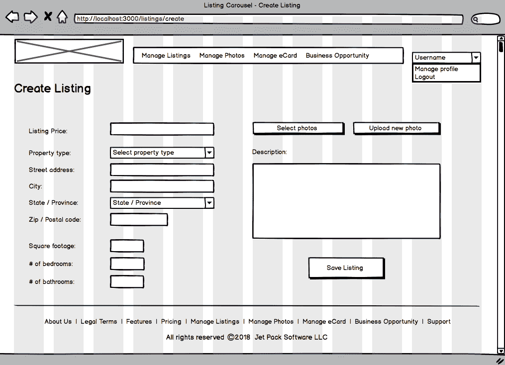
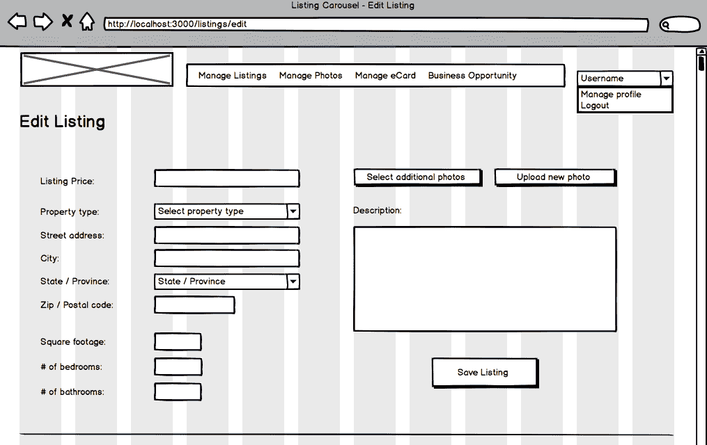
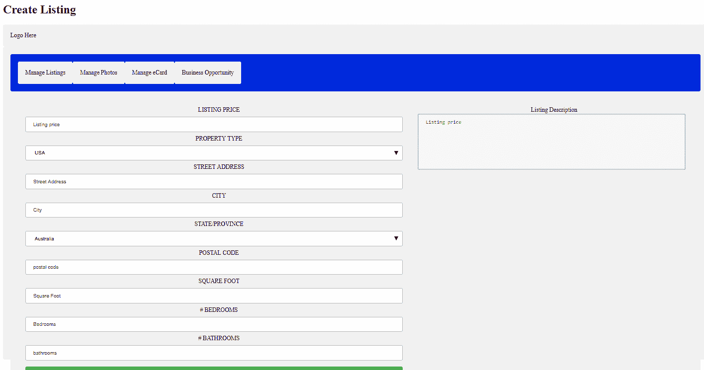

# 第五章：Flex-Layout - Angular 的响应式布局引擎

Flex-Layout 是一个基于 TypeScript 的 Angular 布局引擎。它是在 Angular 项目中布置组件的替代方法，而不是使用 Bootstrap 的网格。Flex-Layout 起源于 AngularJS Material，这是一个由谷歌团队创建的 UI 组件框架，由 Thomas Burleson 领导，他是 Angular 大会上的知名演讲者。我还没有机会参加 Angular 大会，比如 ng-conf 或 AngularMix，但我会的。也许我会在那里见到你！全球范围内有许多关于 Angular 的会议，所以你知道你在明智地学习一项需求量很高且将会持续存在的技术。我想我还没有对你说过这个，所以我现在会说。恭喜！恭喜你选择了这样一个伟大的技术来在你的项目中使用，甚至可能作为构建你职业生涯的基石技术。

当我发现可以改变我为客户和自己创建软件的方式的技术时，我忍不住感到兴奋，现在我可以和你分享我的兴奋！所以，请原谅我稍微偏离了手头的材料。

好的，现在让我们来看看这一章我们将要涵盖的内容。

+   为什么这一章被包括在书中

+   我们组件布局的四种可用技术

+   为什么 FlexBox CSS 可能是最佳选择

+   Flex-Layout 是什么，为什么你应该考虑使用它？

+   整合 Flex-Layout

+   Flex-Layout API

+   在使用 Flex-Layout 时的设计策略

+   将我们的线框和组件与本书的章节和主题相关联

+   实现我们选择的线框

# 为什么这一章被包括在书中

这是一个非常简短的章节。事实上，这可能是本书中最短的章节。然而，我想包括它是为了给你提供选择，特别是在拥有替代技术来替代 Bootstrap 方面。在合理范围内，你拥有的选择越多，你就越好。此外，一些开发者喜欢使用 Bootstrap，而另一些则不喜欢。我怀疑这是因为 Bootstrap 的布局系统是一个网格。我不知道有多少开发者喜欢被限制在这样的东西里。不要误会，我并不是在抨击 Bootstrap（Bootstrap 是一项很棒的技术，甚至在本书的标题中都有它的名字！），但 Flex-Layout 确实感觉更加灵活。一些开发者更愿意使用类似 Flex-Layout 这样的东西的另一个原因是它更加友好。例如，你使用专门的元素，而不是使用带有特殊属性的 DIV 元素。有时这被称为采用声明性方法，有时对开发者来说更自然。这可能现在对你来说有些难以理解，但在本章结束时你会明白的。

# 我们组件布局的四种可用技术

作为网页开发者，除非你有幸在团队中有一个网页设计师，否则我们必须花时间来布局页面上的组件。

顺便说一句，让我们为我们未来的讨论确定一些术语。在前几章中，我已经交替使用了*组件*和*页面*这两个术语，但现在是时候更加精确了。你知道，Angular 应用默认是单页应用，因此只有一个页面。我在书中已经多次提到，Angular 应用就像一个组件树，一切都始于根组件。组件是可组合的，也就是说一个组件可以由其他组件组成。这会导致什么结果呢？嗯，我们需要一个网页来渲染我们的根组件，从那一刻起，我们的根组件引入其他组件，这些组件又引入其他组件。最终的结果是，我们的组件递归地渲染自己，以产生我们有多个页面的错觉。当然，我们并没有多个页面。我们只有一个网页，我们的应用程序的架构方式是每个*页面*都有一个主要的包含组件。这意味着当你看到我提到*页面*时，实际上是指该*页面*上的主要组件，而不是*组件*。

回顾一下我们在第四章 *路由*中编写的代码，现在应该开始对你有意义了。具体来说，给定的 URL 映射到一个组件。对于不是单页应用的传统 Web 应用程序，URL 映射到视图或“页面”。好的，让我们把注意力转回到布局策略的考虑和可用选项。

在我们的应用程序中布置组件包括以下四个必要条件：

+   在容器中布置我们的组件（即父组件和子组件）

+   调整我们的组件大小

+   将我们的组件相对放置在一起

+   组件的样式

我并不自诩是样式或 CSS 方面的专家。我几乎无法搭配我穿的衣服。虽然我们在第三章中看到了一些 CSS，*Bootstrap - 网格布局和组件*，在我们的 SASS 速成课程中（在接下来的章节中我们肯定会看到更多的 CSS），但这不是一本关于设计和样式的书。Packt Publishing 出版了一些关于 CSS 的优秀书籍。在本章中，我们只关注在容器中布局我们的组件。为此，我们有四种可以选择的技术：表格、浮动和清除、FlexBox CSS 和 CSS Grid。

是的，当然，Flex-Layout 也是我们的选择，因为我们选择了 Angular（微笑）。然而，我列出的四种布局技术适用于网页开发一般情况——无论是前端框架、库，还是普通的 HTML 和 CSS。正如我们在第三章中所看到的，*Bootstrap - 网格布局和组件*，Bootstrap 是一个建立在 FlexBox CSS 之上的 CSS 框架，因此也适用于网页开发一般情况。

回到我们对布局技术的讨论，让我们对比一下通常可用于网页开发的四种技术，看看是否有一个明显的赢家。从那里，我们将继续本章的细节，看看 Flex-Layout 是什么，以及为什么我们应该使用它。

# 表格

每个网页开发者（2000 年之前出生）都听说过并可能使用过`TABLE`标签。这是从哪里来的？嗯，很久以前，在一个遥远的星球上，一群外星程序员发明了 HTML 表格标签。这些外星人很快厌倦了使用这种布局技术，所以他们禁止了它的使用，并放逐了所有教授表格标签的网页开发书籍。与此同时，在地球上的某个地方，大约在 1994 年，一位对布局问题感到沮丧的网页开发者被一本看起来像技术书籍的东西砸到了头上。它的标记似乎是某种形式的象形文字，对年轻的技术人员来说都是无法理解的，除了那个熟悉的标记语言。第一章的标题只是`<TABLE>`。

开玩笑的是，虽然表格在网页开发的早期阶段非常有帮助，但现在它们是一种古老的布局技术，经常受到指责。以下是一些表格不再是布局页面元素的默认方法的原因：

+   它们往往会在我们的网页和组件中混乱标记

+   它们是维护的噩梦，因为使用表格移动东西非常乏味

+   它们是刚性的——比网格更加刚性，以至于我们有时不得不诉诸于嵌套表格，这当然加剧了前两个要点

然而，尽管存在这些负面因素，使用表格仍然是一个有效的选择，这就是为什么我在这里将其列为主要的四个选项之一。

# 使用浮动和清除进行定位

CSS 有一些非常酷的功能。我最喜欢的是其中一些处理定位的声明。具体来说，我指的是两个 CSS 声明，即浮动和清除。这些声明可以应用于块级元素，如`<div>`，以及内联元素，如``。块级元素是占据父元素空间的元素，而内联元素乐意分享它们所在父元素的水平空间。

*浮动*元素（如`<div>`）的概念是，它放弃了占据整个水平线的需求。简而言之，它将其空间折叠为仅消耗所需的空间，而不是贪婪地利用水平空间，其他元素现在可以驻留在其旁边，而不是被推到下面。当被浮动的元素不占据整个空间时，旁边浮动的元素在水平空间不足时会换行到下一行。话虽如此，您可以开始看到如何通过使用 CSS 浮动声明来浮动元素来实现一定程度的响应式设计。

*清除*的目的是控制浮动的效果。当您在元素上使用 CSS 声明清除时，基本上是在指示该元素不要浮动到更高的水平空间上，即使有空间可以浮动。请记住，浮动元素意味着元素将占据它可以占据的最高垂直空间，前提是有空间，并且它的相邻元素也已经被浮动（特别是对于希望独占整个水平空间的块级元素）。当没有足够的空间时，它会换行到下一个可用的位置，如果有足够的空间，它会浮动到其他元素的旁边。唯一的例外是，如果您在其样式或类中应用了清除声明，它将始终表现为换行，即使上方有空间。我们对此了解吗？很好。

通过*浮动*和*清除*定位元素确实有效，您可以使用它们创建一些相当复杂的布局。但随着视口尺寸变小，它们的效果可能并不总是您想要看到的。在响应式布局的世界中，尽可能多地控制布局至关重要，而仅限于浮动和清除通常会使布局重新排列成为一项挑战，尤其是在各种视口尺寸下，至少与下面两个选项给予您的精度一样多。另一件需要习惯的事情是，浮动元素需要根据您是将元素向左还是向右浮动来重新排列页面上的元素列表。

我在*浮动*和*清除*上花了更多时间的原因是，有太多开发人员没有花时间让它深入人心。这里的要点是，您可以仅使用这种布局技术走得很远，根据项目的性质和要求，这可能是医生开的处方。当然，关于*浮动*和*清除*的设计策略还有更多要说，但那是另一本书。像往常一样，我建议尝试使用这种布局技术/策略。

# FlexBox CSS

FlexBox CSS 是一个随着 CSS3 而出现的布局技术。这是一个非常强大的东西，这也是为什么其他框架，比如 Bootstrap 和 Flex-Layout，都是建立在它之上的。但 FlexBox CSS 最好的地方在于，它几乎被所有通用的浏览器所理解。使用 FlexBox，我们既可以获得巨大的浏览器覆盖范围，又可以为应用程序提供令人钦佩的布局灵活性。

我不会再多说 FlexBox CSS，因为很可能你不会直接使用它。我可以假设这样做的原因有三个：

+   Bootstrap 是建立在 FlexBox CSS 之上的，你可能更有可能使用 Bootstrap 网格而不是直接使用 FlexBox CSS

+   对于 Flex-Layout 也是一样的，因为它基本上是在 FlexBox CSS 的基础上包装了一个很好的 API，使其更容易使用

# CSS Grid

CSS Grid FlexBox CSS 是一个随着 CSS4 而出现的布局技术。它也是一个非常强大的东西，它使一些事情比使用 FlexBox CSS 更容易，但与此同时，有些事情比使用 FlexBox CSS 更难实现。作为 CSS 世界相对较新的补充，它并没有被广泛整合到通常使用的浏览器中。

# 为什么 FlexBox CSS 可能是最佳选择

在阅读了前面几段的内容后，谁是赢家对你来说应该不会有什么意外。显然是 FlexBox CSS。让我们用一个因素列表来总结选择布局选项时应该考虑的因素：

+   浏览器覆盖范围：作为开发者，我们非常关心我们的 Web 应用的覆盖范围。

+   易用性：我知道这有点牵强，因为 Bootstrap 的网格和 Flex-Layout 都是建立在它之上的，使其更容易使用。但一旦你掌握了 FlexBox CSS，大多数布局要求都可以比较容易地处理。

+   易于维护：这个因素是从前一个要点中得出的。但大多数开发者感到惊讶的是，在典型应用的生命周期中，开发者参与其中的时间有 20%是在构建它，而 80%的时间是在维护它，所以最后一个要点不能过分强调。

同样，我们不认为 Bootstrap 和 Flex-Layout 是布局技术，因为它们是在基础布局技术之上的工具/框架。

# 什么是 Flex-Layout，为什么应该使用它？

我们已经讨论了为什么对于我们来说，布局组件的最佳选项是 FlexBox CSS，但这是关于 Flex-Layout 的一章，所以我现在需要向你介绍它。所以让我们现在做到这一点，然后我将列出一些原因，为什么你应该考虑使用它，而不是直接使用 FlexBox CSS（再次强调，因为 Flex-Layout 是建立在 FlexBox CSS 之上的）。

Flex-Layout 的主页可以在这里找到：[`www.github.com/angular/flex-layout`](https://www.github.com/angular/flex-layout)。

以下是一些关于 Flex-Layout 的要点：

+   它是一个独立的库。

+   它是 Angular 原生的（并且是 TypeScript 实现）。

+   它与 CLI 集成。

+   它有静态 API，用于容器，以及其他静态 API，用于容器子元素。这些 API 具有以下特点：

+   它们是声明性的

+   它们支持数据绑定和变化检测

+   它们是在 HTML 中使用的指令

+   对于我们来说，没有 CSS 需要编写，因为它会动态地为我们注入

与 FlexBox CSS 相比，使用它的一些优势，以及从前面的要点中可以得出以下结论：

+   你不必是 CSS 专家（事实上，正如你很快会看到的，我们甚至不会使用 CSS 样式表）

+   它完美适配 Angular（事实上，它是 Angular 原生的）

+   有 API 可以帮助开发人员更快地开发应用程序

另一个需要知道的好处是，由于 Flex-Layout 是一个独立的（即自包含的）库，它可以与或无需 Angular Material 一起使用。我们将在第九章中查看 Angular Material，那里我们将使用它的一些组件。同样，这些组件可以用作 ng-Bootstrap 的替代品，或与 ng-Bootstrap 一起使用。我们将在第八章中查看 ng-Bootstrap，*使用 NG Bootstrap*。

我在前面的要点列表中提到了 Flex-Layout 具有静态 API。我没有提到的是它还有响应式 API。我们将在接下来的章节中介绍 Flex-Layout 的静态 API，但我把它的响应式 API 留给你阅读（我在该章节的末尾包含了 Flex-Layout 文档的链接）。

然而，我想简要谈一下响应式 API。响应式 API 是为了让您创建自适应的 UX（即，为不同的视口大小创建略有不同的布局）。为了做到这一点，您还需要利用 MediaQueries，而不仅仅是 FlexBox CSS。是的，这是一章关于 Flex-Layout，那么为什么我要提到您需要结合 FlexBox CSS 利用 MediaQueries 呢？我提到这一点是为了指出 Flex-Layout 团队在这个领域（即，响应式 UX，而不仅仅是布局）已经为我们做好了准备。他们通过为静态 API 提供扩展来将 MediaQueries 抽象化，这意味着我们不必手工编写繁琐的规则集——因为他们在静态 API 上创建了扩展，我们可以利用在那里学到的知识并将扩展应用于在我们的 HTML 中创建自适应的 UX。这真的非常聪明！

# 集成 Flex-Layout

Flex-Layout 库作为一个自包含的模块，所以我们只需要在一个地方导入它。与上一章的路由集成更加直接。

现在让我们将 Flex-Layout 添加到我们的项目中。我们需要做的第一件事是安装该库。在您的终端中，导航到我们在第四章中开始创建的`realtycarousel`应用程序的根文件夹，并输入以下内容：

```ts
 npm install --save @angular/flex-layout
```

这将安装该库，这样我们就可以在任何一个 Angular 应用程序中导入它。

注意：如果您的 CLI 输出警告，比如类似于`"``@angular/flex-layout@5.0.0-beta.14`需要`@angular/cdk@⁵.0.0`的对等依赖，但没有安装。您必须自己安装对等依赖"（这就是发生在我身上的事情），只需像其他任何东西一样安装即可，如下所示：

```ts
npm install --save @angular/cdk@⁵.0.0
```

接下来，我们需要将其导入到我们的`RealtyCarousel`应用程序中。为此，我们需要向应用程序的主模块添加一些内容。在 IDE 中打开您的`RealtyCarousel`项目，然后从`src/app`目录中打开`app.module.ts`文件。在文件顶部的其他导入语句中，添加以下导入语句：

```ts
  import { FlexLayoutModule } from '@angular/flex-layout';  
```

（在我们为`RouterModule`添加的`import`语句的下面就可以了。）

我们还需要在`@NgModule`部分的导入数组中包含`FlexLayoutModule`，就像这样：（就在`RouterModule.forRoot(appRoutes)`语句下面，我们为`RouterModule`添加的那样。）

到此为止。我们现在可以利用 Flex-Layout 的功能。几乎我们在 Flex-Layout 中做的任何其他事情都是在我们的 HTML 中完成的。

让我们接下来看一下 Flex-Layout API，这是我们将在页面中利用 Flex-Layout 的方式（即组件模板）。

# Flex-Layout API

与 FlexBox CSS 相比，Flex-Layout 更容易使用的原因是它具有抽象出 CSS 的 API。我们仍然需要 CSS（记住，浏览器只能理解 HTML、JavaScript 和 CSS），但我所说的 CSS 将被抽象化是指当我们的应用程序被转译时，Angular Flex-Layout 会为我们注入 CSS。正如我所提到的，Flex-Layout 甚至没有 CSS 样式表，我们也不需要编写任何 CSS。

以下是 Flex-Layout API 的表格，详细说明了它们的用途，以及一个快速的语法示例：

| **类型** | **API** | **用于** | **示例** |
| --- | --- | --- | --- |
| 静态（对于容器） | `fxLayout` | 定义流的方向（即 flex-direction）。 | `<div fxLayout="row" fxLayout.xs="column">` `</div>` |
| 静态（对于容器） | `fxLayoutAlign` | 定义元素的对齐方式。 | `<div fxLayoutAlign="start stretch">` `</div>` |
| 静态（对于容器） | `fxLayoutWrap` | 定义元素是否应该换行。 | `<div fxLayoutWrap>` `</div>` |
| 静态（对于容器） | `fxLayoutGap` | 设置元素之间的间距。 | `<div fxLayoutGap="15px">` `</div>` |
| 静态（对于子元素） | `fxFlex` | 指定在其容器流布局中调整宿主元素的大小。 | `<div fxFlex="1 2 calc(15em + 20px)">` `</div>` |
| 静态（对于子元素） | `fxFlexOrder` | 定义 FlexBox 项目的顺序。 | `<div fxFlexOrder="2">` `</div>` |
| 静态（对于子元素） | `fxFlexOffset` | 在其容器流布局中偏移 FlexBox 项目。 | `<div fxFlexOffset="20px">` `</div>` |
| 静态（对于子元素） | `fxFlexAlign` | 类似于`fxLayoutAlign`，但适用于特定的 FlexBox 项目（而不是全部）。 | `<div fxFlexAlign="center">` `</div>` |
| 静态（对于子元素） | `fxFlexFill` | 将元素的尺寸最大化到其父容器的尺寸。 | `<div fxFlexFill>` `</div>` |

这些 API 有选项和默认值。例如，`fxLayout` API 默认为行，但也有列，以及行反转和列反转。

另外，在`fxLayout` API 的示例中，`.xs`与 Bootstrap 网格有类似的概念，它提供了一种允许不同视口尺寸的方式。因此，在前面表格中的第一个示例中，常规视口的布局将使元素在行内从左到右流动，而对于小视口，元素将堆叠在单列中。

在前面表格中的示例中，还有一个有趣的地方是在`fxFlex` API 中进行了计算。这有点像我们在第三章的 SASS 快速入门中所看到的，*Bootstrap - 网格布局和组件*，尽管 SASS 是由 Ruby 编译的，而 Flex-Layout 是由 TypeScript 编译的。

我不会在这里列举所有的选项，因为你购买这本书不是为了阅读文档，就像我写这本书不只是为了复制文档一样。当然，我会指引你去查找 Flex-Layout 的文档。你可以在他们的官方网站找到：[`github.com/angular/flex-layout/wiki/API-Documentation`](https://github.com/angular/flex-layout/wiki/API-Documentation)。

幸运的是，Flex-Layout 团队在文档方面做得非常出色。他们的维基还包括了几个实时布局演示，你可以看一看。这是直接链接：[`tburleson-layouts-demos.firebaseapp.com/#/docs`](https://tburleson-layouts-demos.firebaseapp.com/#/docs)。

# 使用 FlexBox 时的设计策略

由于 Flex-Layout 更多地是一种流动的方式，而不是网格，因此通常更容易考虑应用程序的垂直部分并为它们分配自己的容器。这是因为容器内的部分会随着视口尺寸变小而自动向下包裹。容器内的元素应该被视为属于一起。与 Bootstrap 等网格系统相比，思维方式是不同的；网格中的单元格标记了元素的物理边界。单元格内的元素不会自动换行，因为在设计/布局时，您会将元素插入特定的单元格中。另一种概念化网格和 FlexBox 之间的差异的方法是将网格视为二维的（即行和列 - 就像电子表格一样），将 FlexBox 视为一维的（即它要么水平流动，要么垂直流动）。

一旦您有了垂直容器的想法，您就可以考虑从左到右流动的子容器，然后随着视口尺寸变小，子容器向下包裹 - 当它向下包裹时，所有具有该子容器的元素都会一起移动。请记住，当我提到子容器时，我指的是 FlexBox 容器可以嵌套 - 这就是为什么开发人员可以控制布局的大部分原因。在布局页面时，将流程视为“从外到内”。这意味着您应该将页面分成大的垂直部分 - 例如标题、主体和页脚 - 然后深入到每个部分中添加子容器，这些子容器将从左到右流动。

很难用言语描述“流动”，因此像往常一样，最好的方法是尝试使用您的容器和元素，并研究随着视口尺寸调整它们的流动行为。本章包括三个组件模板（即*页面）的代码清单，以及它们的线框图。您将看到我如何为这些组件模板设计布局。在此过程中，我还会告诉您我为什么做出了一些决定。

# 将我们的组件与本书的章节和主题相关联

到目前为止，我们还没有讨论我们将在何时何地实施我们的组件。部分原因是直到第四章 *路由*，我们甚至都没有开始编写任何 Angular 代码，唯一的例外是我们在第一章 *快速入门*中的待办事项列表迷你应用。然而，现在我们已经开始编写 Angular 代码，现在是时候做了。

开始讨论的一个好地方是选择我们将使用 Flex-Layout 布局的组件模板。由于这本书更多地关注 Bootstrap 而不是 Flex-Layout，我们将使用 Bootstrap 的网格来布局我们应用程序中其余的组件模板，这占了大部分。

我们要做的第一件事是列出我们的线框图，作为参考，它们代表我们应用的*页面*（即组件模板），我们将选择其中三个，在接下来的部分*实现我们选择的线框图*中实现它们。然后，我们将看一下接下来的表格，它将向您展示我们将实现哪些组件模板，以及哪些章节，具体来说，我们将把它们与哪些主题配对。

以下是我们从第一章 *快速入门*中的 13 个线框图的列表：

+   首页

+   注册

+   登录

+   编辑个人资料（不在书中涵盖范围内）

+   房产列表（不在书中涵盖范围内）

+   创建列表

+   编辑列表

+   预览列表

+   房产详情（不在书中涵盖范围内）

+   照片列表

+   上传照片/创建卡片

+   编辑照片（不在书中涵盖范围内）

+   预览照片

以下是我们将在本书中一起实现的线框图的表格，以及它们关联的章节和主题的列表。您可以将其用作在概念上将我们的应用程序组合在一起的路线图，也就是说，从高层次上，您将知道我们将在哪一章中实现应用程序中组件模板的各个部分：

| **线框图/组件模板** | **关联章节** | **关联主题** |
| --- | --- | --- |
| 首页 | 3 | Bootstrap 网格 |
| 注册 | 3, 8, 10 | 模态对话框，ng-Bootstrap（输入框），表单 |
| 登录 | 14 | 认证 |
| 创建列表 | 5, 14 | Flex-Layout, 自定义验证 |
| 编辑列表 | 5, 10 | Flex-Layout, 表单 |
| 预览列表 | 5, 6, 9 | Flex-Layout, 组件，Angular Material（芯片） |
| 照片列表 | 6, 7 | 组件，模板 |
| 上传照片/创建照片卡 | 10 | 表单 |
| 预览照片 | 6, 9 | 组件，Angular Material（卡片） |

上表显示了我们将在我们的线框（即组件模板）中实施的主题。例如，通过查看从顶部开始的第四行，我们可以看到当我们实施我们的创建列表线框（即我们的`CreateListingComponent`）时，我们将使用本章的 Flex-Layout，以及来自第十四章 *高级 Angular 主题*的自定义验证。

请记住，每个线框都需要组件——尽管在相关章节列中没有列出第六章 *构建 Angular 组件*，以及相关主题列中的组件。我之所以对一些线框这样做，比如照片列表和预览照片，是因为我们将会更多地讨论组件，而不是比如注册或编辑列表线框。此外，某些线框将使我们更加关注其他主题。例如，您可以看到对于上传照片线框，我们将更多地关注表单，来自第十章 *使用表单*。

由于我们不会跳来跳去，这意味着在我们阅读本书时，我们将会多次回顾我们的大部分页面（即组件模板），两次、三次，甚至四次。

# 实施我们选择的线框

我在本章中选择要与您实施的三个线框（即组件模板）如下：

+   创建列表（包括因为视图中有许多部分和元素）

+   编辑列表（出于与创建列表相同的原因而包括）

+   预览列表（包括因为视图中有非常少的元素）

在上述线框的列表中，您可能已经注意到有三个线框被标记为*不在书中涵盖范围内*。以下是线框排除列表，以及排除原因：

+   **编辑个人资料**：这被排除在外，因为它只是另一个编辑表单（与编辑列表屏幕非常相似）

+   **房产列表**：这被排除在外，因为它只是另一个列表屏幕（很像照片列表屏幕）

+   **房产详情**：这被排除在外，因为从 Angular 的角度来看，这是一个无趣的静态屏幕

+   **编辑照片**：这个被排除了，因为这只是另一个编辑表单

但不要担心。我们将在剩下的页面中一起构建的应用程序的所有代码，包括书中不会实现的四个线框的代码，以及非基于 UI 的代码（例如 第十二章 中的基于 Python 的 API，*集成后端数据服务*，等等），都可以通过下载获得。我已经为你准备好了。

最后一个值得注意的点，然后我们将继续进行一些 Flex-Layout 编码。你可以看出我们的应用程序将需要一些线框被多次重新访问，以便我们可以完成它——也就是说，我们将分阶段构建我们的应用程序，看起来像是一种混乱的来回方式。这不是因为作者疯了——正如他的一些朋友喜欢给你讲述一些强有力的案例，证明恰恰相反——而是出于设计。记住，本书的理念是最大限度地提高你对材料的吸收效果，这样你就可以尽快成为 Angular 大师。在尽可能的范围内，我们将立即实施我们所涵盖的材料，以便它立即有意义，并且牢固。这就是目标，也是为什么我想包括前面的表格（即，将线框与章节和主题相关联）。

我的疯狂通常都是有条不紊的方法（眨眼）。现在让我们把注意力转向本章的三个线框的实现。

# 创建列表线框

在本节中，我们将汇集所有的知识和理解，学习为创建列表页面创建我们的应用程序页面。看一下下面的线框，我们将使用 Flex-Layout 将其转换为代码：



另一个线框显示，我们将需要一个标题部分和一个两列布局来容纳表单和输入元素。

我们将首先在我们的应用程序中创建一个新组件，并将其命名为“创建列表”。在组件模板文件中，让我们向模板添加以下示例代码：

```ts
<h1>Create Listing</h1> <div  fxLayout="row"  fxLayoutAlign="space-between">
 Logo Here  </div> <div  class="bounds">
 <div  class="content"  fxLayout="row"  class="menu">
 <div  fxFlexOrder="1">Manage Listings</div>
 <div  fxFlexOrder="2">Manage Photos</div>
 <div  fxFlexOrder="3">Manage eCard</div>
 <div  fxFlexOrder="4">Business Opportunity</div>
 </div>
 <div  class="content"  fxLayout="row"  fxLayout.xs="column"  
            fxFlexFill  >
 <div  fxFlex="60"  class="sec1"  fxFlex.xs="55">  
        <form  action="/action_page.php">

 <label  for="lprice">Listing Price</label>
 <input  type="text"  id="lprice"  name="lprice"                 placeholder="Listing price">

 <label  for="country">Property Type</label>
 <select  id="country"  name="country">
 <option  value="australia">USA</option>  <option  value="canada">UK</option>
 <option  value="usa">UAE</option>
 </select>

 <label  for="laddress">Street Address</label>
  <input  type="text"  id="laddress"  name="laddress"              placeholder="Street Address">  <label  for="city">City</label>
  <input  type="text"  id="city"  name="city"  placeholder="City">  <label  for="state">State/Province</label>
 <select  id="state"  name="state">
 <option  value="New York">Australia</option>
 <option  value="New Jersey">Canada</option>
 <option  value="Texas">USA</option>
 </select>         <label  for="pcode">Postal Code</label>
 <input  type="text"  id="pcode"  name="pcode"              placeholder="postal code">

 <label  for="sfoot">Square Foot</label>
 <input  type="text"  id="sfoot"  name="sfoot"              placeholder="Square Foot">   <label  for="bedrooms"># Bedrooms</label>
 <input  type="text"  id="bedrooms"  name="bedrooms"              placeholder="Bedrooms">
  <label  for="bathrooms"># Bathrooms</label>
 <input  type="text"  id="bathrooms"  name="bathrooms"              placeholder="bathrooms">  <input  type="submit"  value="Submit">
 </form>
  </div>
  <div  fxFlex="40"  class="sec2"  >  <label  for="ldescription">Listing Description</label>
 <textarea  id="ldescription"  name="ldescription"              placeholder="Listing price"></textarea>
 </div>  </div>  </div>
```

在上面的代码中，我们使用`fxLayout`创建了一行，为我们的标志创建了一个占位符。接下来，我们创建了菜单链接，并使用`fxFlexOrder`对菜单链接进行排序。现在，我们需要创建一个两列布局，所以我们现在在`fxLayout`行内创建了两个子元素，每个`fxFlex`分别为 60 和 40。在这两列中，我们将放置我们的表单输入元素，以创建表单，如线框所示。运行应用程序，我们应该看到输出，如下面的截图所示：

现在，是时候进行一些代码操作了。我们将在我们的 Angular 项目中创建一个名为 edit-listing 的新组件，并在组件模板文件中重用相同的代码，以快速准备好**编辑列表**页面：

我们已经准备好了**创建列表**页面的布局。如果你仔细看，我们的标签并不完全在输入字段旁边。需要更新什么？没错，我们需要在主列内创建一个子列。通过作业来尝试一下。现在，同样的，我们可以轻松实现我们的编辑列表页面。

# 编辑列表线框

在上一节中，我们创建了我们的**创建列表**页面。在本节中，我们将学习为我们的编辑列表页面实现页面布局。看一下我们将要实现的示例。它不是看起来和**创建列表**页面完全一样吗？没错。

**创建**和**编辑列表**页面的布局大部分都是相同的，除了在启动**编辑**页面时加载数据，而在**创建**屏幕上，最初不会加载任何数据：





```ts
<h1>Edit Listing</h1>

<div fxLayout="row" fxLayoutAlign="space-between">
    Logo Here
  </div>

  <div class="bounds">

      <div class="content" 
         fxLayout="row" class="menu">

            <div fxFlexOrder="1">Manage Listings</div>
            <div fxFlexOrder="2">Manage Photos</div>
            <div fxFlexOrder="3">Manage eCard</div>
            <div fxFlexOrder="4">Business Opportunity</div>

      </div>

    <div class="content" 
         fxLayout="row"
         fxLayout.xs="column" 
         fxFlexFill >

        <div fxFlex="60" class="sec1" fxFlex.xs="55">

            <form action="/action_page.php">

              <label for="lprice">Listing Price</label>
              <input type="text" id="lprice" name="lprice" 
                   placeholder="Listing price">

              <label for="country">Property Type</label>
              <select id="country" name="country">
                <option value="australia">USA</option>
                <option value="canada">UK</option>
                <option value="usa">UAE</option>
              </select>

              <label for="laddress">Street Address</label>
              <input type="text" id="laddress" name="laddress" 
                    placeholder="Street Address">

              <label for="city">City</label>
              <input type="text" id="city" name="city" 
                    placeholder="City">

              <label for="state">State/Province</label>
              <select id="state" name="state">
                <option value="New York">Australia</option>
                <option value="New Jersey">Canada</option>
                <option value="Texas">USA</option>
              </select>

              <label for="pcode">Postal Code</label>
              <input type="text" id="pcode" name="pcode" 
                   placeholder="postal code">

              <label for="sfoot">Square Foot</label>
              <input type="text" id="sfoot" name="sfoot" 
                   placeholder="Square Foot">

              <label for="bedrooms"># Bedrooms</label>
              <input type="text" id="bedrooms" name="bedrooms" 
                    placeholder="Bedrooms">

              <label for="bathrooms"># Bathrooms</label>
              <input type="text" id="bathrooms" name="bathrooms" 
                     placeholder="bathrooms">

              <input type="submit" value="Submit">
            </form>
        </div>
        <div fxFlex="40" class="sec2" >

            <label for="ldescription">Listing Description</label>
            <textarea id="ldescription" name="ldescription" 
                 placeholder="Listing price"></textarea>

        </div>

    </div>
```

在上面的代码中，我们创建了两行，一行用于标题部分，另一行用于内容行。在内容行内，我们使用`fxRow`创建了两个子列，它们将用表单输入字段元素填充。输出将与创建列表页面完全相同。

# 总结

本章提供了对令人兴奋的技术的快速介绍。当然，可以专门撰写一本专门介绍 FlexBox CSS 和 Flex-Layout 的小书，所以仅仅在几页中介绍并不能充分展现它应有的价值。如果有一个行业变化迅速，那就是我们的行业，因此应该提到替代技术 - 如果技术足够令人兴奋，甚至可能获得自己的章节 - 无论是哪本技术书籍和哪些技术。这正是 Flex-Layout 和这本书的情况。我希望向你深入介绍 Flex-Layout。

我们从快速回顾四种布局技术的选项开始，解释了为什么 FlexBox CSS 是其中最佳选择。然后我向你介绍了 Flex-Layout，并提出了一些令人信服的理由，说明为什么你应该考虑使用它而不是 FlexBox。接下来，我们看到了如何将 Flex-Layout 集成到我们的 Angular 项目中，并查看了一些其 API。最后，我们回到了我们的线框图（即组件），并将它们与本书中的章节相关联，然后实现了与本章相关的组件。

我希望你喜欢这一章，并且会尽量在你的网页开发项目中尝试使用 Flex-Layout。我预测许多 Angular 开发者将选择 Flex-Layout 作为布局组件的首选工具。对于我的下一个项目，我已经倾向于使用 Flex-Layout 而不是 Bootstrap 的网格来设计所有组件模板。

在下一章中，我们将学习任何 Angular 应用程序的构建块 - 组件。我们将深入学习并使用 Angular 组件创建一些很酷的东西。祝阅读愉快。
