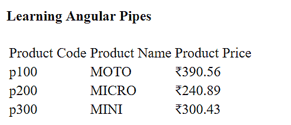

# 第七章：模板、指令和管道

模板定义了组件在网页上的显示和布局方式。Angular 提供了几个内置指令，让开发人员控制他们的组件的显示方式——从是否显示或隐藏组件，到在页面上多次渲染组件。内置指令还提供了一种将类和样式绑定到组件的机制。

在第六章，*构建 Angular 组件*中，我们看了组件的结构以及如何将我们的应用程序分解为一棵组件树。

在本章中，您将学习如何控制组件在其父模板中的显示。具体来说，我们将一起讨论以下内容：

+   模板

+   指令

+   管道

# 模板

在上一章中，我们已经了解了组件模板是什么以及如何创建它们。然而，到目前为止，我们只看到了静态 HTML。在本节中，我想稍微放大一下，和您一起看一些模板语法，这些语法允许我们创建动态 HTML，这当然是 Angular 的主要目标之一。

在 Angular 中，模板语法为我们提供了一种机制，使我们的 HTML 动态化——具体来说，用于数据绑定、属性绑定和事件绑定。在本章中，我们将看看这三种绑定类型。Angular 赋予我们创建生成动态 HTML 模板或操作 DOM 的能力，是通过一组符号。

以下是我们可以使用的六个基本符号：

+   `{{ }}` 用于字符串插值和单向数据绑定

+   `[( )]` 用于双向数据绑定

+   `#` 用于变量声明

+   `( )` 用于事件绑定

+   `[ ]` 用于属性绑定

+   `*` 用于前置结构指令，例如`ngFor`，正如我们将看到的

# 指令

指令的三种类型是：组件、属性指令和结构指令。然而，我们实际上只会涵盖其中的两种——属性指令和结构指令。原因是我们已经花了整整一章的时间来覆盖第一种指令，也就是组件。没错！组件实际上是隐藏的指令！具体来说（这说明了组件与属性和结构指令的区别），组件是具有模板的指令。当然，这必须意味着属性和结构指令没有模板。

好的，那么指令到底是什么？让我们给术语“指令”一个明确定义，以消除在讨论接下来的两种指令之前可能引起的任何混淆。我们将使用的定义是：Angular 指令是提供特定 DOM 操作的构造。DOM（或 HTML DOM）是文档对象模型的缩写，不是 Angular 的东西，而是浏览器的东西。所有现代浏览器在加载网页时都会创建一个 DOM，这是一个可以被 JavaScript 访问的对象树。没有 DOM，Angular（以及任何其他操作 DOM 的 Web 框架）都不会存在。

正如我们在第六章中所看到的，构建 Angular 组件符合我们对指令的定义，因为它们确实是提供特定 DOM 操作的构造。它们的模板不仅被注入到我们的页面中（替换它们的自定义 HTML 标签），而且它们本身包含数据、属性和事件绑定，进一步操作 DOM。

我们已经以各种方式充分解释了组件，并将在接下来的章节中看到它们在实现我们的线框时的实际应用。

剩下的两种指令类型不会在我们的页面或视图中注入任何 HTML 模板，因为它们没有任何模板。然而，它们会操作 DOM，正如我们之前对指令的定义所要求的那样。现在让我们来看看这两种类型的指令分别是做什么的。

# 属性指令

属性指令通过改变特定 DOM 元素的外观或行为来操作 DOM。这些类型的指令被括号括起来，是 HTML 元素的属性。括号是符号（我们在本章开头列出的五种符号之一），它们向 Angular 发出信号，告诉它可能需要改变指令所属元素的外观或行为。

最后一句话很啰嗦，让我们看一个你最有可能使用的属性指令的代码示例。我所指的指令名为`hidden`，它将导致 Angular 要么显示要么隐藏它的元素：

```ts
<div [hidden]="usertype != 'admin'">
  This element, and its contents, will be hidden for all users that are not Admins. 
</div>
```

在前面的代码中，我们隐藏了`div`元素和所有非管理员用户类型的嵌入式 HTML。在这里，`usertype`和`admin`当然是应用上下文的东西，只是用作示例来说明 Angular 可以做什么。

更一般地说，`hidden`属性指令与要评估的表达式相关联。表达式必须评估为布尔值（即`true`或`false`）。如果表达式评估为`true`，Angular 将从视图中隐藏该元素。相反，如果表达式评估为`false`，Angular 将不做任何改变，并且该元素将在视图中显示。

就像我在之前的章节中所做的那样，我会确保将您指向官方在线文档。正如您现在所知，我不喜欢其他许多 IT 书籍采取的方法，即机械地重复文档。虽然在某种程度上是不可避免的，但有些书籍的大部分页面都是这样。因此，我将继续远离这种陷阱，并将继续以更好的方式添加所有可能的价值。

也就是说，属性指令的官方在线文档可以在[`angular.io/guide/attribute-directives`](https://angular.io/guide/attribute-directives)找到。

# 结构指令

结构指令通过添加或删除特定的 DOM 元素来操作 DOM。就像我们有语法可以用来向 Angular 发出信号，告诉它我们有一个需要注意的属性指令一样，使用括号符号，我们也有结构指令的等价物。

我们用来向 Angular 发出信号，告诉它我们有一个结构指令需要注意的语法是星号（*）。结构指令以星号为前缀，这向 Angular 发出信号，告诉它可能需要向 DOM 添加或删除元素。正如我在本章开头列举的那样，星号是我们可以在模板语法中使用的符号之一。

# NgFor

正如我们看一个属性指令的代码示例，你最有可能使用的，现在让我们来看一个结构指令的代码示例，你可能会经常使用——`NgFor`：

```ts
<ul>
 <li *ngFor='let car of [{"make":"Porsche", "model":"Carrera"}, {"make":"Ferrari", "model":"488 Spider"}]'>
   {{ car.make }}: {{ car.model }}
 </li>
</ul>
```

之前的`ngFor`代码示例输出如下：

```ts
Porsche: Carrera
Ferrari: 488 Spider
```

在上面的代码中，有几件事我想指出；首先是`*ngFor`结构指令。让我们用项目符号形式来看一下这些：

+   `ngFor`接受一个可迭代对象，并循环遍历它，向 DOM 添加元素

+   指令语法的一般形式是 `*ngFor="let <value> of <collection>"`

+   `NgFor`（注意大写 N）指的是定义指令的类

+   `ngFor`（注意小写 n）既是属性名称，也是`NgFor`类的一个实例

+   其余的结构指令遵循与`NgFor`相同的大小写约定（参见前两个项目符号）。

+   我们可以嵌套使用`ngFor`（就像我们可以嵌套使用`for each`...in 循环一样）

接下来，我提供给`ngFor`指令的集合并不代表我们通常如何向指令传递数据。我之所以以这种方式编码是为了简洁。我们通常会这样做，即在组件类中定义数据（即我们的集合），并将其分配给一个变量，然后在附加到指令的语句中使用该变量。

# 访问迭代的索引值

我们经常会对迭代的索引值感兴趣——也许是为了抓取每个第 n 个对象，或者按照 x 的数量分组，或者可能我们想要实现某种自定义分页。无论需要读取迭代的当前索引值是什么，我们都可以使用`index`关键字将索引设置为表达式中的变量。

以下是一些演示这一点的示例代码：

```ts
<ul> 
  <li *ngFor="let car of cars; let i = index">
    Car #{{ i + 1 }}: {{ car.model }}
  </li>
</ul>
```

在上面的代码示例中，让我们假设汽车集合是在其他地方填充的，比如在组件类中。

此外，Angular 会为我们更新每次迭代的索引值，而我们所要做的就是引用它。

请注意，我们使用 `{{ i + 1 }}` 来输出汽车编号。这是因为，与大多数数组或可迭代对象一样（在大多数语言中，但肯定在 JavaScript 和 TypeScript 中），索引是从零开始的。另外，请注意，双大括号内的表达式 `i + 1` 不仅仅是一个变量。在 Angular 中，双大括号内插入的任何内容都会被评估。如果我们愿意，甚至可以在那里插入函数调用。

结构指令的官方在线文档可在 [`angular.io/guide/structural-directives`](https://angular.io/guide/structural-directives) 上找到。

# 内置指令

我们有几个内置指令可供我们使用。让我们在接下来的部分中看看这些。

+   `NgFor`（我们已经涵盖了这个，作为结构指令的第一个示例）

+   `NgIf`

+   `NgSwitch`、`NgCase` 和 `NgDefault`

+   `NgStyle`

+   `NgClass`

+   `NgNonBindable`

# NgIf

当我们想要在 DOM 中显示或移除元素时，我们使用 `NgIf` 指令。我们向指令传递一个表达式，它必须求值为布尔值。如果求值为 `true`，元素将在视图上显示。相反，如果表达式求值为 `false`，元素将从 DOM 中移除。

请注意，我们还可以绑定到 `hidden` 属性（属性绑定将在下文中描述）来实现相同的视觉效果，但是属性绑定方法和使用 `NgIf` 指令之间存在区别。区别在于，使用 `hidden` 的属性绑定只是隐藏元素，而使用 `NgIf` 指令会从 DOM 中实际移除元素。

以下是代码中 `NgIf` 的样子（在我们的汽车示例中的上下文中，假设我们有一个 `horsepower` 属性）：

```ts
<ul *ngFor="let car of cars">
  <li *ngIf="car.horsepower > 350">
    The {{ car.make }} {{ car.model }} is over 350 HP. 
  </li>
</ul>
```

在大多数传统编程语言中，当有一系列传统的 `if`、`then` 和 `else` 语句中要检查的替代事物时，有时使用 `switch` 语句（如果语言支持）更有意义。Java、JavaScript 和 TypeScript 是支持这种条件构造的语言的例子（当然还有许多其他语言）。Angular 也给了我们这种能力，所以我们可以更加表达和高效地编写我们的代码。

让我们在下一节中看看在 Angular 中如何实现这一点。

# NgSwitch、NgCase 和 NgDefault

在一些编程语言中，比如 Java、JavaScript 和 TypeScript，`switch`语句不能单独使用。它需要与其他语句和关键字一起使用，即`case`和`default`。Angular 的`NgSwitch`指令的工作方式完全相同，`NgSwitch`与`NgCase`和`NgDefault`一起使用。

让我们通过创建一个包含我们的汽车数据、样式和模板的组件来丰富一下这里稍微大一点的例子，该组件使用`NgSwitch`，`NgCase`和`NgDefault`：

```ts
@Component({
  selector: 'car-hp',
  template: `
    <h3>Cars styled by their HP range</h3>
    <ul *ngFor="let car of cars" [ngSwitch]="car.horsepower"> 
      <li *ngSwitchCase="car.horsepower >= 375" class="super-car">
        {{ car.make }} {{ car.model }} 
      </li>
      <li *ngSwitchCase="car.horsepower >= 200 && car.horsepower 
          < 375" class="sports-car">
        {{ car.make }} {{ car.model }}
      </li>
      <li *ngSwitchDefault class="grandma-car">
        {{ car.make }} {{ car.model }}
      </li>
    </ul>
  `,
  styles: [`
    .super-car {
      color:#fff;
      background-color:#ff0000;
    },
    .sports-car {
      color:#000;
      background-color:#ffa500; 
    },
    .grandma-car {
      color:#000;
      background-color:#ffff00; 
    } 
  `],
  encapsulation: ViewEncapsulation.Native 
})
class CarHorsepowerComponent {
  cars: any[] = [
    {
      "make": "Ferrari",
      "model": "Testerosa",
      "horsepower": 390
    },
    {
      "make": "Buick",
      "model": "Regal",
      "horsepower": 182 
    }, 
    {
      "make": "Porsche",
      "model": "Boxter",
      "horsepower": 320
    }, 
    {
      "make": "Lamborghini",
      "model": "Diablo",
      "horsepower": 485
    }
  ];
}
```

在前面的代码中，我们构建了一个完整的组件

`CarHorsepowerComponent`。在父组件模板中，Angular 将用我们在`CarHorsepowerComponent`中创建的模板替换我们自定义的 HTML 元素`<car-hp>`的实例（这是因为我们将`car-hp`分配给了我们的`CarHorsepowerComponent`类的组件注解的`selector`属性）。

我们还在组件类中包含了传递给`NgFor`指令的集合数据，而不是在之前的例子中内联在分配给`NgFor`指令的表达式中。

这是一个简单的例子，其模板遍历我们的汽车集合，并根据当前汽车的马力应用三种样式之一到汽车的品牌和型号上-这是通过`NgSwitch`、`NgCase`和`NgDefault`指令实现的。具体来说，这是结果：

+   如果汽车的马力等于或大于 375 马力，我们将认为它是一辆超级跑车，并且将汽车的品牌和型号以白色字体呈现在红色背景上

+   如果汽车的马力等于或大于 200 马力，但小于 375 马力，我们将认为它只是一辆跑车，并且将汽车的品牌和型号以黑色字体呈现在橙色背景上

+   如果汽车的马力低于 200 马力，这是我们的*默认*（或*通用*）情况，我们将认为它是一辆适合祖母开车的汽车，并且将汽车的品牌和型号以黑色字体呈现在黄色背景上-因为大多数祖母都觉得蜜蜂的颜色搭配很吸引人

当然，祖母的评论只是为了娱乐价值，我并不是故意冒犯任何需要花费整整 8 秒，*甚至更多*时间从 0 到 60 英里/小时加速的人（眨眼）。说实话，我的一辆车（2016 年本田思域）只有 158 马力——相信我，我曾经在上坡路上被一位开英菲尼迪 Q50 的祖母超过。这就是为什么在那可怕的经历之后的几天内，我买了一些更强大的东西（大笑）。

我想在上一个示例中指出的最后一件事是`NgSwitch`指令的使用方式。您会注意到我以不同的格式编写了它，即`[ngSwitch]="car.horsepower"`，而不是`*ngSwitch="car.horsepower"`。这是因为在使用结构指令时，Angular 对我们施加了一条规则，即我们不能有多个使用星号符号作为指令名称前缀的结构指令。为了解决这个问题，我们使用了属性绑定符号`[ ]`（一对方括号）。

# NgStyle

`NgStyle`指令用于设置元素的样式属性。让我们重新设计之前的`CarHorsepowerComponent`示例，该示例用于演示`NgSwitch`，`NgCase`和`NgDefault`，以展示如何使用`NgStyle`更好地实现相同的期望结果（即有条件地设置元素样式）：

```ts
@Component({
  selector: 'car-hp',
  template: `
    <h3>Cars styled by their HP range</h3>
    <ul *ngFor="let car of cars"> 
      <li [ngStyle]="{ getCarTextStyle(car.horsepower) }" >
        {{ car.make }} {{ car.model }}
      </li> 
    </ul>
  `,
  encapsulation: ViewEncapsulation.Native 
})
class CarHorsepowerComponent {
  getCarTextStyle(horsepower) {
    switch (horsepower) {
      case (horsepower >= 375):
        return 'color:#fff; background-color:#ff0000;';
      case (horsepower >= 200 && horsepower < 375):
        return 'color:#000; background-color:#ffa500;';
      default:
        return 'color:#000; background-color:#ffff00;';
    }
  }
  cars: any[] = [
    {
      "make": "Ferrari",
      "model": "Testerosa",
      "horsepower": 390
    },
    {
      "make": "Buick",
      "model": "Regal",
      "horsepower": 182 
    }, 
    {
      "make": "Porsche",
      "model": "Boxter",
      "horsepower": 320
    }, 
    {
      "make": "Lamborghini",
      "model": "Diablo",
      "horsepower": 485
    }
  ];
}
```

在我们重新设计原始的`CarHorsepowerComponent`类时，我们通过将逻辑移入类中的一个函数来简化了组件模板。我们删除了组件注释的样式属性，而是创建了一个函数（即`getCarTextStyle`）来返回样式文本给调用函数，以便我们可以设置正确的样式。

虽然这是一种更清晰的方法，但我们可以做得更好。由于我们正在为汽车文本设置样式，我们可以完全更改样式类，而不是通过文本传递实际的样式规则集。

在下一节中，关于`NgClass`，我们将再次重写我们的代码，以了解如何完成这一点。

# NgClass

`NgClass`指令类似于`NgStyle`指令，但用于设置样式类（从组件注释的样式属性中的 CSS 规则集），而不是通过原始 CSS 规则集设置样式。

以下代码示例是最后三个代码示例中最好的选择，以实现我们想要做的事情：

```ts
@Component({
  selector: 'car-hp',
  template: `
    <h3>Cars styled by their HP range</h3>
    <ul *ngFor="let car of cars"> 
      <li [ngClass]=" getCarTextStyle(car.horsepower) " >
        {{ car.make }} {{ car.model }}
      </li> 
    </ul>
  `,
  styles: [`
    .super-car {
      color:#fff;
      background-color:#ff0000;
    },
    .sports-car {
      color:#000;
      background-color:#ffa500; 
    },
    .grandmas-car {
      color:#000;
      background-color:#ffff00; 
    } 
 `], 
 encapsulation: ViewEncapsulation.Native 
})
class CarHorsepowerComponent {
  getCarTextStyle() {
    switch (horsepower) {
      case (horsepower >= 375):
        return 'super-car';
      case (horsepower >= 200 && horsepower < 375):
        return 'sports-car';
      default:
        return 'grandmas-car';
    }
  }
  cars: any[] = [
    {
      "make": "Ferrari",
      "model": "Testerosa",
      "horsepower": 390
    },
    {
      "make": "Buick",
      "model": "Regal",
      "horsepower": 182 
    }, 
    {
      "make": "Porsche",
      "model": "Boxter",
      "horsepower": 320
    }, 
    {
       "make": "Lamborghini",
       "model": "Diablo",
       "horsepower": 485
    }
  ];
}  
```

在这里，我们保留了组件注释的`styles`属性，保持了模板的轻量和清晰，我们的函数只返回要分配给我们的`NgClass`指令的 CSS 类的名称。

# NgNonBindable

我们要介绍的最后一个指令是`NgNonBindable`指令。当我们希望 Angular 忽略模板语法中的特殊符号时，就会使用`NgNonBindable`。为什么我们要这样做呢？嗯，假设你和我决定创建一个在线的 Angular 教程，而网站本身要使用 Angular 进行编码。如果我们想要将文本`{{ my_value }}`呈现到视图中，Angular 会尝试在当前范围内查找`my_value`变量来绑定值，然后插入文本。由于这不是我们希望 Angular 做的事情，我们需要一种方法来指示 Angular，“嘿，顺便说一句，现在不要尝试评估和字符串插值任何东西，只需像对待任何其他普通文本一样呈现这些符号”。

比如，这是一个`span`元素的样子：

```ts
<p>
To have Angular perform one-way binding, and render the value of my_value onto the view, we use the    double curly braces symbol like this: <span ngNonBindable>{{ my_value }}</span>
</p>
```

请注意`NgNonBindable`指令在开放的`<span>`标记中的位置。当 Angular 看到`ngNonBindable`时，它将忽略双大括号，并且不会单向绑定任何内容。相反，它将让原始文本呈现到视图中。

# 使用 NgModel 指令进行数据绑定

我们在示例中看到了单向数据绑定的一个例子，该示例演示了如何使用`NgFor`指令。换句话说，单向数据绑定是使用双大括号符号`{{ }}`完成的。我们在双大括号中包含的变量（例如示例中的`car.make`和`car.model`）是单向绑定的（即从组件类到模板），转换为字符串，并呈现到视图中。它不允许将任何更改绑定回组件类。

为了实现双向数据绑定，从而也允许在视图中绑定对组件类的更改，我们必须使用`NgModel`指令。

当我们实现我们的线框时，我们将看到这一点，但现在让我向你展示一下它是什么样子的。为了使用`NgModel`，我们必须首先从`forms`包中导入一个名为`FormsModule`的 Angular 模块，就像这样：

```ts
import { FormsModule } from '@angular/forms';
```

然后，要使用这个指令，我们会有类似这样的东西：

```ts
<div [(ngModel)]="my_content"></div>
```

将这段代码放在这里不仅会导致视图模板显示组件类中`my_content`的值，而且对视图模板中这个`div`的任何更改都会被绑定回组件类。

# 事件绑定

在我们实现示例应用程序的线框时，我们将看到很多事件绑定。为了绑定我们感兴趣的元素上要监听的事件，我们将事件名称括在括号中（这是我们在模板语法中可以使用的特殊符号之一）。为此，我们分配一个语句在事件触发时运行。

这是一个 JavaScript 警报的例子，当有人点击`<span>`元素时将会触发：

```ts
<span (click)="alert('This is an example of event binding in Angular');"></span>
```

在上面的代码中，我们附加了一个`click`事件，并调用一个带有消息的警报框。

# 属性绑定

我们在先前的例子中已经看到了属性绑定，但为了完整起见，我在这里很简要地给出另一个例子：

```ts
<p class="card-text" [hidden]="true">This text will not show.</p>
```

在这个先前的例子中，我们将要设置的属性括在方括号中（这是我们在模板语法中可以使用的特殊符号之一）。当然，在这个例子中这并不是很有用，因为我已经将布尔值硬编码为`true`，而不是使用要求评估的表达式，但这个例子的重点是集中在`[hidden]`部分。

# 自定义指令

Angular 是可扩展的。我们不仅可以轻松创建自定义组件（这样我们就不受限于使用第三方提供的现成组件），还可以创建自定义属性指令，这样我们就不受限于 Angular 默认提供的内容。

我会留下一些我们在 Angular 中可以做的自定义事情，比如自定义属性指令、自定义管道（我们将在下一节中看到管道是什么），以及自定义表单验证，直到第十四章，*高级 Angular 主题*。我们将在第十章，*使用表单*中看到表单验证。我选择将这本书中涵盖的所有高级内容都放在一个章节中是有充分理由的——让你有时间先消化基础知识。当高级章节出现时，接近书的末尾，你将准备好并更容易吸收那些信息。

# 管道

管道用于格式化我们模板视图中的数据。管道将接受数据作为输入，并将其转换为我们期望的格式，以便向最终用户显示。我们可以在我们项目中的任何 Angular 模板或视图中使用`pipe`属性（`|`）。

在我们开始创建示例之前，让我快速概述一下。假设我们从后端服务获取产品的价格为 100，并根据用户的国家或偏好，我们可能希望以$100 的方式显示价值，如果用户来自美国，或者以 INR 100 的方式显示价值，如果用户来自印度。因此，我们能够在没有任何主要复杂性的情况下转换我们显示价格的方式。这要归功于货币管道运算符。

Angular 提供了许多内置管道，可以直接在我们的模板中使用。此外，我们还可以创建自定义管道来扩展我们应用程序的功能。

以下是 Angular 提供的所有内置管道的列表：

+   小写管道

+   大写管道

+   日期管道

+   货币管道

+   JSON 管道

+   百分比管道

+   小数管道

+   切片管道

我们将通过一些有趣的实际示例来了解每个可用的内置管道。到目前为止，我们可以利用我们在 Angular 项目中创建的任何现有模板文件。

我们需要一些数据，我们想要使用我们的管道来处理和转换。我将在我们的`app.component.ts`文件中快速创建一个数据集：

```ts
products: any[] = [ {  "code": "p100",
  "name": "Moto",
  "price": 390.56
 }, {  "code": "p200",
  "name": "Micro",
  "price": 240.89
 }, {  "code": "p300",
  "name": "Mini",
  "price": 300.43
 } ];
```

我们在应用程序组件中创建了一个产品的样本数据集。好了，现在我们可以在我们的`app.component.html`文件中应用我们的管道了。我们将在模板中保持简单。我们将只创建一个表格并绑定表中的值。如果你今天感觉有点冒险，那就继续使用 Flex-Layout 为我们的应用程序创建一个布局，我们在第五章中学到了*Flex-Layout – Angular's Responsive Layout Engine*：

```ts
<h4>Learning Angular Pipes</h4> <table>
  <tr>
  <td>Product Code</td>
  <td>Product Name</td>
  <td>Product Price</td>
  </tr>
  <tr  *ngFor="let product of products">
  <td>{{product.code}}</td>
  <td>{{product.name}}</td>
  <td>{{product.price}}</td>
  </tr>  </table>
```

在上面的示例代码中，我们创建了一个表格，并使用数据绑定将数据绑定到我们的模板中。现在是时候在我们的模板中使用管道运算符了。要应用任何管道，我们必须在数据中添加管道运算符，如下面的语法所示：

```ts
{{ data | <pipe name> }}
```

我们可以通过应用大写管道轻松地将我们的产品名称转换为大写，如下所示：

```ts
<td>{{product.name | uppercase }}</td>
```

同样地，我们也可以使用小写管道，这将使所有字符变为小写：

```ts
<td>{{product.name | lowercase }}</td>
```

你可能会说那太简单了？确实如此！让我们继续。类似地，我们将使用数字管道操作符来显示或隐藏小数点。

为了显示产品价格，我们想要添加货币；没问题，我们将使用货币管道：

```ts
<td>{{product.price | currency }}</td>
```

在前面的例子中，我们通过添加货币管道来转换了产品价格。剩下的管道操作符就留给你作业了。

当我们使用货币管道时，默认情况下会添加`$ currency`。

我们可以通过给货币管道加参数来自定义它。我们将学习如何向管道操作符传递参数。我们将不得不通过以下方式扩展管道操作符的语法来传递参数：

```ts
{{ data | pipe : <parameter1 : parameter2> }}
```

前面的语法看起来类似于我们学习如何定义管道操作符的方式，只是现在它有两个参数。根据我们的需求，我们可以定义任意数量的参数的管道操作符。在前面的例子中，我们使用了货币操作符，所以让我们传递参数来扩展货币管道操作符：

```ts
<td>{{ product.price | currency: 'INR' }}</td>
```

我们正在向我们的货币管道操作符传递`INR`参数。现在，货币管道操作符的输出将不再是`$`，而是如下所示的屏幕截图中显示的内容：



在本节中，我们已经学会了使用内置的管道操作符。现在，我们将学习如何创建我们自己的自定义管道。

# 自定义管道

Angular 在自定义管道和自定义指令的领域也是可扩展的。然而，我将推迟我们对自定义管道的讨论，直到第十四章，“高级 Angular 主题”。我在这里包含了这一部分作为一个占位符，以及对以后的覆盖的提醒，也是为了完整性。

# 总结

在本章中，我们放大了组件模板，以及我们用于创建它们的模板语法。我们的模板语法包括符号、指令和管道。

我们已经看到指令只是没有模板的组件，它们有两种主要的类型——**属性指令**和**结构指令**。无论它们的类型或类别如何，我们都可以通过将它们添加为元素的属性来将指令与 HTML 元素关联（或附加）。

我们已经介绍了我们可以在模板语法中使用的以下特殊符号。我们还介绍了我们可以在模板语法中使用的内置指令。接下来，我们介绍了事件绑定，以及属性绑定，最后，我们介绍了管道，它为我们提供了格式化数据的方式，以便按照我们期望的方式呈现到视图中。

我们知道 Angular 是可扩展的，并且它为我们提供了创建自定义指令和自定义管道的机制，但我们将推迟讨论任何自定义内容到[第十四章]《高级 Angular 主题》。

在下一章，[第八章]《使用 NG Bootstrap 工作》，我们将重新戴上组件帽子，以便探索`ng-bootstrap`为我们在构建 Angular 应用程序时带来了什么。
