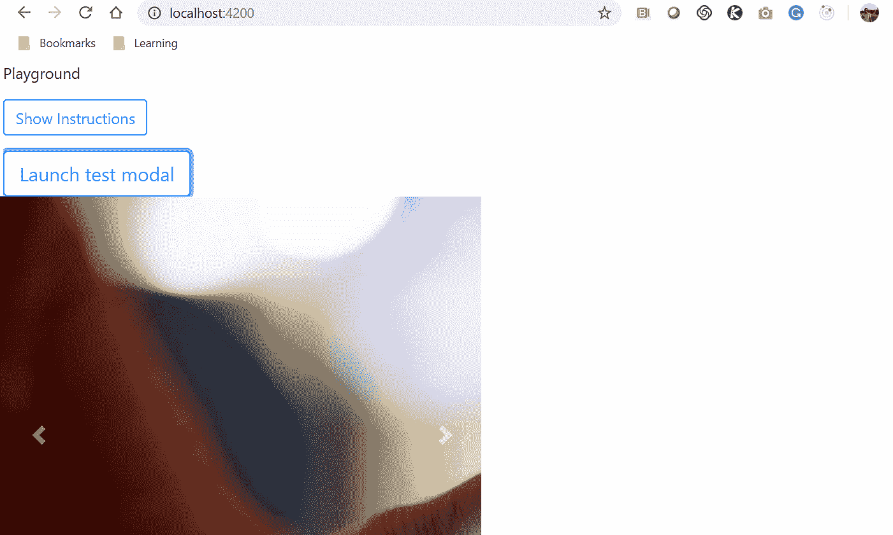

# 第八章：使用 NG Bootstrap

Bootstrap 是最受欢迎的 CSS 框架之一，而 Angular 是最受欢迎的 Web 应用程序框架之一。NG Bootstrap 是一个由 Bootstrap 4 CSS 构建的小部件（即组件）集合。它们专门用于作为 Angular 组件使用，并旨在完全替代由 JavaScript 驱动的 Bootstrap 组件。一些由 JavaScript 驱动的 Bootstrap 组件的示例包括以下内容：

+   轮播

+   折叠

+   模态

+   弹出框

+   工具提示

在本章中，我们将继续探讨组件，但将重点放在 ng-bootstrap 上，这是一个第三方 Angular 组件库，而不是 Angular 代码库的一部分。这一章和第九章，*使用 Angular Material*，都是相对较短的章节，但我想把它们包括在这本书中，原因与我包括第五章，*Flex-Layout – Angular's Responsive Layout Engine*相同-那就是给你选择的机会。在这一章的背景下，这意味着你可以选择为你的 Angular 应用程序利用的现成组件。

ng-bootstrap 没有官方的缩写，但为了方便起见，在本章中，我将给它一个。我们将把 NG Bootstrap 称为 NGB-事实证明，这也是键盘上有趣的输入（因为字母之间的距离如此接近）。试试看。

就像本书中的其他章节一样，我不会消耗大量页面来简单地重复 NGB 的官方文档，这些文档可以在网上免费获取，只是为了让这本书看起来令人敬畏。我宁愿给你一本 300 到 400 页的书，充满了精心挑选的好东西，让你一直阅读，而不是一本 500-600 页的书，可以用作你辛苦赚来的钱的催眠剂。话虽如此，NGB 的官方在线文档可以在这里找到：

[`ng-bootstrap.github.io`](https://ng-bootstrap.github.io)。

我想最后快速提一下的是，本章和接下来的一章（第八章，*使用 NG Bootstrap*）将比本书中的其他章节更加视觉化。这是因为我们现在开始进入我们示例应用程序的实质内容，并且我们将开始在视觉上构建事物。

现在处理完了杂事，接下来我们将一起讨论本章中要涵盖的内容：

+   集成 NGB

+   NGB 小部件（特别是折叠、模态和轮播）

+   设计规则是我们应该考虑的要点，以帮助避免过度使用小部件

# 集成 NGB

NGB 的存在意义是成为 Bootstrap 需要 JavaScript 的组件的完整替代品（例如本章开头列出的组件）。事实上，在官方网站的*入门*部分的第一页上，他们进一步表示，您不应该使用任何基于 JavaScript 的组件，甚至不应该使用它们的依赖项，如 jQuery 或 Popper.js。这可以在以下网址找到：[`ng-bootstrap.github.io/#/getting-started`](https://ng-bootstrap.github.io/#/getting-started)。

# 安装 NBG

首先要做的事情是：在我们查看使用 NGB 时需要注意的一个警告之前，让我们将其添加到我们的项目中——我还将向您展示如何解决可能遇到的冲突库（通过展示我的`package.json`文件）。

使用`npm`安装 NGB 很简单。但是，与其他模块一样，我们还需要将其导入并在根模块中列出（即`app.module.ts`）。以下是步骤：

1.  运行`npm install`：`npm install --save @ng-bootstrap/ng-bootstrap`

1.  将 NGB 导入到我们的根模块中：`import {NgbModule} from '@ng-bootstrap/ng-bootstrap';`

1.  在导入数组中列出`NgbModule`（作为根模块的`@NgModule`装饰器的参数）如下：`NgbModule.forRoot()`

如果您创建了一个使用 NGB 的 Angular 模块，那么您也需要将 NGB 导入其中。将 NGB 导入其他模块的语法与刚刚概述的导入到根模块中的语法完全相同，但是将 NGB 模块列为模块的`@NgModule`装饰器的参数的语法略有不同。它只是在导入数组中列出为`NgbModule`，而不是`NgbModule.forRoot()`，因为我们必须在根模块中列出它。

那么，我们要如何查看一些组件，而不会无意中搞乱我们示例应用程序的 NGB 部分呢？只有一种方法——我们要确保我们不直接或间接地将 jQuery 或 Popper.js 加载到我们的示例应用程序中，不使用 Bootstrap 组件（确保您理解 Bootstrap 和 NGB 是两个不同的库）。

让我快速澄清一些事情。我们的示例应用程序中安装了 jQuery 和 Popper.js，您可以通过查看我们的`package.json`文件来验证这一点。在其中，您将在依赖项部分看到 jQuery 和 Popper.js 的条目。我们不打算卸载这些库。只要我们不通过同时使用 Bootstrap 来加载它们，它们对我们使用 NGB 是无害的。换句话说，NGB 组件和 Bootstrap 组件不应共存于我们的 Angular 应用程序中。我们可以使用其中一个而不会出现问题，但绝不能同时使用两者。这样清楚吗？好的。

如果您尝试从项目中删除 jQuery 和/或 Popper.js，每当运行项目时，您可能会收到几个编译警告。虽然警告可能不会阻止项目运行，但始终努力实现干净的构建。

确保获得干净的构建有时可能会很麻烦，因为您需要注意库的版本。接下来的代码清单是我的`package.json`文件。当我运行`npm install`然后`npm start`时，我一直能够获得干净的安装编译。如果您没有获得干净的编译，您可能想要将您的`package.json`与我的进行比较，如下所示：

```ts
{
  "name": "listcaro",
  "version": "0.0.0",
  "license": "MIT",
  "scripts": {
    "ng": "ng",
    "start": "ng serve -o",
    "build": "ng build --prod",
    "test": "ng test",
    "lint": "ng lint",
    "e2e": "ng e2e"
  },
  "private": true,
  "dependencies": {
    "@angular/animations": "⁶.0.4",
    "@angular/cdk": "⁶.2.1",
    "@angular/common": "⁶.0.4",
    "@angular/compiler": "⁶.0.4",
    "@angular/core": "⁶.0.4",
    "@angular/flex-layout": "⁶.0.0-beta.16",
    "@angular/forms": "⁶.0.4",
    "@angular/http": "⁶.0.4",
    "@angular/platform-browser": "⁶.0.4",
    "@angular/platform-browser-dynamic": "⁶.0.4",
    "@angular/router": "⁶.0.4",
    "@angular/material": "⁶.2.1",
    "@ng-bootstrap/ng-bootstrap": "².1.0",
    "bootstrap": "⁴.0.0",
    "core-js": "².4.1",
    "jquery": "³.3.1",
    "npm": "⁶.1.0",
    "popper": "¹.0.1",
    "popper.js": "¹.14.3",
    "rxjs": "⁶.0.0",
    "save": "².3.2",
    "zone.js": "⁰.8.26"
  },
  "devDependencies": {
    "typescript": "2.7.2",
    "@angular/cli": "~1.7.4",
    "@angular/compiler-cli": "⁶.0.4",
    "@angular/language-service": "⁵.2.0",
    "@types/jasmine": "~2.8.3",
    "@types/jasminewd2": "~2.0.2",
    "@types/node": "~6.0.60",
    "codelyzer": "⁴.0.1",
    "jasmine-core": "~2.8.0",
    "jasmine-spec-reporter": "~4.2.1",
    "karma": "~2.0.0",
    "karma-chrome-launcher": "~2.2.0",
    "karma-coverage-istanbul-reporter": "¹.2.1",
    "karma-jasmine": "~1.1.0",
    "karma-jasmine-html-reporter": "⁰.2.2",
    "protractor": "~5.1.2",
    "ts-node": "~4.1.0",
    "tslint": "~5.9.1"
  }
}
```

您可以查看可用的 Angular 模块列表及其最新版本号，您可以使用`npm`安装，网址是：[`www.npmjs.com/~angular`](https://www.npmjs.com/~angular)。

# 为什么使用 NGB？

由于无法使用基于 JavaScript 的组件，也无法直接使用 JavaScript 库（如 jQuery 或 Popper.js），您可能会问，*为什么要使用 NGB*？

这是一个很好的问题。以下是简短的答案，以要点形式：

+   Angular 不依赖于 jQuery。它使用自己的 jQuery 实现，称为 jQLite，这是 jQuery 的子集。

+   我们不会失去使用任何由 JavaScript 驱动的 Bootstrap 组件的能力（例如模态框或轮播），因为它们在 NGB 中已经重新设计为 Angular。再次强调，NGB 的唯一目的是完全替代任何由 JavaScript 驱动的 Bootstrap 组件。

+   在构建 Angular 应用程序时的一个经验法则是尽量只使用特定于 Angular 的组件；也就是说，专门为 Angular 制作的组件，比如 NGB 小部件和来自 Angular Material 的组件。当然，这包括创建自定义的 Angular 组件。虽然你可以通过折衷使用非特定于 Angular 的组件来解决问题，但这并不推荐。Angular 功能齐全，正如我们所学到的，它也非常可扩展。很难想象有哪种情况下坚持使用特定于 Angular 的组件、模块、指令、管道、服务等会阻止你做你需要做的事情。

+   NGB 是一个坚实的 Angular 中心组件库，在你不尝试创建被不鼓励的变通方法时运行良好。

# 为 NGB（和 Angular Material 等）创建我们的游乐场

NGB 只有两个依赖项（Angular 和 Bootstrap CSS），幸运的是，我们的示例应用程序已经有了这两个东西——一个是默认的（因为我们的示例应用程序是一个 Angular 应用程序），另一个是在第三章中安装 Bootstrap 时安装的。然而，我们将向我们的示例应用程序添加一些内容，以便我们可以尝试使用 NGB 组件——一个游乐场视图。

在构建任何技术堆栈的 Web 应用程序时，我长期以来的传统做法，不仅适用于 Angular 应用程序，是添加一个页面作为我可以在当前构建的应用程序的上下文中尝试各种东西的地方。我把它称为游乐场。在我们的情况下，我们的游乐场将是一个组件，其模板将作为我们探索一些 NGB 组件时的实验画布。我们还将把它连接到我们的菜单，以便我们可以轻松访问它。

在本书的其余部分，我们将保留我们的游乐场视图，只会在第十五章中删除它，*部署 Angular 应用程序*，在那里我们将学习如何部署我们的应用程序，并不希望我们的游乐场随之而去。

所以，现在让我们这样做。自从我们在第四章中创建的示例应用程序中添加组件以来已经过了一段时间，因此我想借此机会列举出使用 playground 作为示例的步骤（在接下来的各自部分中）。请注意，这是手动向我们的项目添加组件的方式，与几章前使用 CLI 为我们添加的方式不同。

# 创建 playground 目录

我们需要做的第一件事是创建一个目录，用于保存我们 playground 组件所需的文件。我们的每个组件都有自己的目录，并且都是`app`目录的子目录，而`app`目录本身是项目根目录中`src`目录的子目录。

由于我们正在添加一个新组件，我们将遵循我们的惯例并为其创建一个目录。在您的 IDE 中，右键单击`app`目录，选择“新建文件夹”，输入`playground`作为名称，这遵循了我们迄今为止使用的惯例。完成后，我们将有一个地方来插入将共同组成我们组件的文件。

# 创建 playground 组件类

现在我们需要创建我们的 playground 组件类。在您的 IDE 中，右键单击新创建的`playground`目录，然后选择“新建文件”，输入`playground.component.ts`作为名称。`playground.component.ts`文件是我们的`component`类。在此文件中输入以下代码：

```ts
import { Component, OnInit } from '@angular/core';

@Component({
    selector: 'playground',
    templateUrl: './playground.component.html',
    styleUrls: ['./playground.component.css']
})
export class PlaygroundComponent implements OnInit {

    constructor() { }

    ngOnInit() { }

    pageTitle: string = "Playground";

}
```

通过查看我们的 playground`Component`类文件，您会注意到一些事情：

+   除了从`@angular/core`模块中导入组件之外，我们还导入了`OnInit`。这是因为我们给自己一个设置一些变量的地方，如果需要的话，比如用于传递任何子组件。

+   我们已经为我们的类包含了一个构造函数。无论我们是否使用它，它都为我们提供了一种机制，可以在组件的生命周期中触发一些代码。我们现在不会使用它，但我想向您展示，我们的“组件”函数就像传统的面向对象类一样，因此具有我们可以利用的构造函数。

+   我们已经设置了组件以使用外部文件作为其模板和样式，而不是内联。因此，下一步是创建这两个文件（请参见以下两个部分）。

+   我们在类中声明了一个属性（即`pageTitle`），类型为字符串，并将我们视图的名称分配给它。在下一节中，我们的模板将使用单向绑定语法显示此属性。

# 创建游乐场模板文件

我们现在需要为我们的游乐场组件创建模板文件，这将是我们组件的视觉界面。在您的 IDE 中，右键单击`playground`目录，选择`新建文件`，输入`playground.component.html`。`playground.component.html`文件是必需的，因为我们已将其作为参数传递给了我们的组件装饰器。在此文件中输入以下代码：

```ts
<h3> 
{{ pageTitle }} </h3> <hr>  
```

目前这个文件中还没有太多内容，但这将是我们添加 NGB 组件以便进行实验的地方。当然，实验是学习任何对您来说可能是新的技术的最佳方式。目前我们的模板只是通过绑定到我们类的`pageTitle`属性来显示我们的页面名称。

# 创建游乐场 CSS 文件

我们需要为游乐场组件创建的最后一个文件是用来存放其样式的文件。在您的 IDE 中，右键单击`playground`目录，选择`新建文件`，输入`playground.component.css`作为名称。`playground.component.css`文件也是必需的，因为我们已将其作为参数传递给了我们的组件装饰器。在此文件中输入以下代码：

```ts
/* Nothing here yet. This is a placeholder file that we may use later. */
```

前面的代码是不言自明的。目前这个文件中还没有任何样式，但为您创建的每个组件至少创建一个 CSS 文件是个好主意。

# 创建游乐场菜单项

好的。因此，按照前面部分的说明，您现在应该有一个游乐场组件，可以用作几乎任何实验的沙盒。在我们的特定情况下，我们将使用它来实验 NGB 小部件（即组件），但我们还将在第九章 *使用 Angular Material*期间使用这个沙盒。

在我们继续插入第一个 NGB 小部件之前，我们将会看一下。为我们的游乐场视图创建一个临时菜单链接是个好主意，这样我们就可以很容易地从应用程序内部访问它。现在让我们来做这个。

在您的 IDE 中，打开`app.component.html`文件。这是在启动过程中为您的 Angular 应用程序加载的主要或起始模板。这也是我们在《第四章》《路由》中创建菜单的地方。在这个文件中，在清单菜单项之后插入以下代码：

```ts
<li routerLinkActive="active" class="nav-item"> 
  <a routerLink="playground" class="nav-link">Playground</a> 
</li>
```

这个小的 HTML 代码片段所做的只是在我们的菜单中添加一个`playground`导航链接，并指示 Angular 的路由系统在点击时加载游乐场组件（因此加载游乐场模板，然后递归加载任何子组件）。

好的，很好，我们现在已经设置好，准备好看我们的第一个 NGB 小部件了。

# NGB 小部件

如前所述，NGB 小部件是第三方 Angular 组件，旨在取代基于 JavaScript 的 Bootstrap CSS 组件。NGB 有许多小部件可用，但在接下来的章节中，我们只会看到其中的三个。

您可以在以下网址找到完整的 NGB 小部件列表以及它们的文档：[`ng-bootstrap.github.io/#/components/`](https://ng-bootstrap.github.io/#/components/)。

# 折叠

折叠组件是一个有用的东西，可以节省屏幕空间。我们使用这个组件的用例是切换说明的显示或隐藏。当其父组件的模板被渲染时，组件的状态最初将被折叠，但用户可以根据需要切换说明的显示和重新折叠它们。

让我们在代码中看一个快速示例，我们可以在我们的游乐场中尝试，在这个示例中，我们可以切换页面上的一部分内容的显示和隐藏，这部分内容将是假设的说明（目前）。

我们需要修改三个文件才能使其工作。其他 NGB 组件的使用（甚至是我们将在下一章中看到的 Angular Material 组件）工作方式类似，因此我将花时间在每个代码清单后解释事情，因为这是我们一起看的第一个第三方组件。在以后看类似的组件时，如果它们与这些组件有实质性的不同，我会给出解释。

# 我们的父组件

在本章以及《第八章》《使用 NG Bootstrap》中，我们的父组件将始终是我们的游乐场组件。

修改你的 playground 组件模板（即`playground.component.html`文件），使其看起来如下：

```ts
<h3> 
  {{ pageTitle }} 
</h3> 
<hr> 

<ngb-collapse></ngb-collapse>

<br />

This is our page's main content
```

我们在 playground 模板中唯一添加的新内容是`<ngb-collapse></ngb-collapse>`，这是我们的自定义指令，将指示 Angular 在那里插入我们子组件的模板。`ngb-collapse`是我们组件类元数据中的选择器（即我们传递给组件装饰器的对象）。接下来让我们来看看那个文件。

# 我们的 NGB 折叠组件类

我们已经命名了我们的组件类（利用了 NGB 的`collapse`组件）*`NgbCollapseComponent`*—但这段代码在哪里呢？好吧，我们需要创建一个新目录，并在该目录中创建两个新文件，就像我们创建 playground 组件时所做的那样。是的—我们为我们的 playground 组件创建了三个文件，但是对于`NgbCollapseComponent`，我们将跳过 CSS 文件。

首先，创建一个名为`ngb-collapse`的目录。在这个新目录中，创建一个名为`ngb-collapse.component.ts`的文件，并在其中添加以下代码：

```ts
import { Component } from '@angular/core';

@Component({
  selector: 'ngb-collapse',
  templateUrl: './ngb-collapse.component.html'
})
export class NgbCollapseComponent {
  public isCollapsed = true;
}
```

正如你所看到的，我们没有定义`styleUrls`数组，这就是为什么我们不需要为它创建一个文件（如果我们想要给这个组件添加样式，我们会命名为`ngb-collapse.component.css`）。为了实验 NBG 折叠组件，我们只关心创建一个组件类文件和它的模板文件。

我们在组件类文件中感兴趣的另一件事是`isCollapsed`属性。当然，我们可以随意命名它，但重要的是它被声明并且最初设置为`true`。我们将通过将其值绑定到模板文件中的`ngbCollapse`属性来使用这个属性。这样做将导致我们组件模板的一部分被折叠（隐藏）或展开（显示）。请注意，我强调了我们组件中的目标内容将被隐藏或显示，而不是被添加或从 DOM 中移除。如果我们的内容被隐藏（即不可见），它仍然存在于 DOM 中。这是因为 NGB 折叠小部件不作为结构指令。它通过属性绑定实现其隐藏/显示功能。

现在让我们来看第三个文件，我们的组件模板

`NgbCollapseComponent`类。

# 我们的 NGB 折叠组件模板

在`ngb-collapse`目录中创建另一个文件，命名为`ngb-collapse.component.ts`，并在其中添加以下代码：

```ts
<p> 
    <button type="button" class="btn btn-outline-primary" (click)="isCollapsed = !isCollapsed"> 
        {{ isCollapsed ? 'Show' : 'Hide' }} Instructions 
    </button> 
</p> 
<div id="collapseExample" [ngbCollapse]="isCollapsed"> 
    <div class="card">
        <div class="card-body">
            These are the hypothetical instructions for something.
        </div>
    </div>
</div>
```

让我们一起看一下这段代码。我们感兴趣的第一件事是将`click`事件绑定到表达式上，这个表达式基本上在我们的组件类中定义的`isCollapsed`变量之间切换`true`和`false`：

```ts
(click)="isCollapsed = !isCollapsed"  
```

我们的切换按钮的文本始终设置为两个值中的一个。当显示说明时，按钮文本为“隐藏说明”。当说明被隐藏时，按钮文本为“显示说明”。这当然是我们想要的行为，但乍一看，你可能会认为需要一个`if .. else`结构才能使其全部工作。令人惊讶的是，多亏了 Angular 的插值模板语法，只需要很少的代码就可以根据我们的`isCollapsed`变量的值来改变按钮的文本。让我们花点时间来看一下负责确定按钮文本应该是什么的小代码片段，以及它是如何为我们呈现的：

```ts
{{ isCollapsed ? 'Show' : 'Hide' }} Instructions
```

在第七章中，*模板、指令和管道*，我们看了一下我们可以在模板语法中使用的所有符号，比如插值、双向绑定等等。在这种情况下，为我们工作的符号是插值符号（即一对双大括号）。我之所以称它为神奇，是因为它不仅可以用作字符串插值，而且还足够聪明，可以处理表达式甚至函数调用。因此，我们不仅仅局限于将变量名视为简单的字符串插值。

为了确定我们的按钮文本应该是什么，我们使用 JavaScript 的三元运算符语法根据我们的`isCollapsed`变量的值渲染（或插值）文本为两个值中的一个，显示或隐藏。当然，无论布尔值是什么，*说明*文本都将始终被呈现，从而使按钮文本成为“显示说明”或“隐藏说明”。这一切都是简洁而内联完成的。相当酷，不是吗？

# 导入和声明

如果你尝试运行项目，你会得到一些错误。这是因为我们还没有在`app.module.ts`文件中为这个组件设置导入和声明。让我们现在来做这个。

在我们为我们的游乐场组件添加的导入行之后添加这个导入行：

```ts
import { NgbCollapseComponent } from './ngb-collapse/ngb-collapse.component';
```

并将`NgbCollapseComponent`添加到声明数组中。

通过在`app.module.ts`文件的声明数组中导入前述导入并将我们的组件类添加到其中，我们的项目应该可以构建和运行得很好。

干得好。现在让我们继续进行我们的模态组件。

# 模态

模态对话框窗口自从桌面 Windows 操作系统的早期时代（互联网之前）就存在了，并且在网站上也变得很受欢迎——特别是自从 jQuery 出现以来。模态窗口用于与用户进行交互，通常是为了从他们那里获取信息。此外，它们通过调暗背景以及禁用模态区域外的任何交互来帮助设计师将用户的注意力集中在应该的地方。我们使用模态窗口的一个用例是显示登录表单。

让我们看一个在我们的播放中可以尝试的快速示例代码，以显示一个模态窗口。由于 NGB 小部件的集成都遵循相同的模式，我不会像折叠 NGB 小部件那样详细介绍它，但我会指出重要的地方。

我们所有的组件都以相同的方式开始。我们需要为我们的组件创建一个文件夹（让我们将其命名为`ngb-modal`），并且我们需要创建我们的两个文件——一个用于我们的组件类，另一个用于我们的组件模板。让我们分别将它们命名为`ngb-modal.component.ts`和`ngb-modal.component.html`。

接下来的部分是我们的 NGB 模态组件的两个代码清单，然后是必要的导入和声明，就像我们为折叠组件所做的那样。

# 我们的 NGB 模态组件类

在我们的组件类中，我们首先从适当的模块中导入必要的类，然后我们使用`@Component`装饰器装饰我们的类，这样我们就可以将其链接到模板并设置我们的选择器（即，我们将添加到我们的播放模板中的自定义 HTML 标记）。

接下来，我们添加一个构造函数，这样我们就可以注入`NgbModal`服务（注意：我们将在第十二章中介绍依赖注入，*集成后端数据服务*）。

我们的类有一个名为`closeResult`的变量，它由私有方法`getDismissReason`填充，描述了用户如何关闭模态对话框。

我们还有一个`open`方法，负责使模态对话框渲染。正如我们将在下一节的代码清单中看到的（在我们的组件模板中），`open`方法是由我们的游乐场内的按钮点击触发的。

您会注意到 open 方法接受一个参数（在本例中命名为`content`）。我们组件的模板将要在模态对话框中显示的内容包裹在它的`ng-template`标签中，正如您将看到的，这些标签与`#content`模板变量相关联。如果您还记得第七章中的内容，*模板、指令和管道*，模板语法中的井号（即`#`）用于表示一个变量：

```ts
import {Component} from '@angular/core';
import {NgbModal, ModalDismissReasons} from '@ng-bootstrap/ng-bootstrap';

@Component({
  selector: 'ngb-test-modal',
  templateUrl: './ngb-modal.component.html'
})
export class NgbModalComponent {
  closeResult: string;

  constructor(private modalService: NgbModal) {}

  open(content) {
    this.modalService.open(content).result.then((result) => {
    this.closeResult = `Closed with: ${result}`;
  }, (reason) => {
    this.closeResult = `Dismissed ${this.getDismissReason(reason)}`;
  });
}

  private getDismissReason(reason: any): string {
    if (reason === ModalDismissReasons.ESC) {
      return 'by pressing ESC';
    } else if (reason === ModalDismissReasons.BACKDROP_CLICK) {
      return 'by clicking on a backdrop';
    } else {
      return `with: ${reason}`;
    }
  } 
} 
```

现在让我们来看看我们的组件模板，`ngb-modal.component.html`。

# 我们的 NGB 模态组件模板

我们的组件模板不仅负责为模态对话框中显示的内容提供视图，还将为我们提供用户将使用的视觉元素（在本例中为按钮）来触发模态对话框。

以下 HTML 代码是我们的组件模板，稍后我们将用于我们的登录表单（注意：我们将在第十章中涵盖表单，*使用表单*）：

```ts
<ng-template #content let-c="close" let-d="dismiss">
  <div class="modal-header">
    <h4 class="modal-title">Log In</h4>
    <button type="button" class="close" aria-label="Close" (click)="d('Cross click')">
    <span aria-hidden="true">&times;</span>
    </button>
  </div>
  <div class="modal-body">
    <form>
      <div class="form-group">
        <input id="username" class="form-control" placeholder="username" >
        <br>
        <input id="password" type="password" class="form-control" placeholder="password" >
      </div>
    </form>
  </div>
  <div class="modal-footer">
    <button type="button" class="btn btn-outline-dark" (click)="c('Save click')">submit</button>
  </div>
</ng-template>

<button class="btn btn-lg btn-outline-primary" (click)="open(content)">Launch test modal</button>
```

既然我们已经有了我们的组件类和组件模板，我们必须告诉我们应用程序的根模块关于它们——我们将在下一节中做到这一点。

# 导入和声明

就像我们的折叠组件一样，如果您在这一点上尝试运行项目，您会得到一些错误——出于同样的原因——因为我们还没有在`app.module.ts`文件中为这个组件设置导入和声明。你知道该怎么做。

在我们为游乐场和折叠组件添加的导入行之后，添加这个导入行：

```ts
import { NgbModalComponent } from './ngb-modal/ngb-modal.component';
```

并将`NgbModalComponent`添加到声明数组中。

我知道你已经掌握了这个。让我们通过将另一个 NGB 小部件集成到我们的游乐场视图中来进行更多练习——作为奖励，我们将预览一下 Angular 的`HttpClient`模块。我们将使用`HttpClient`模块来获取我们轮播图的图片，并且我们还将在第十一章中使用`HttpClient`模块来调用我们的 API，*依赖注入和服务*。

所以让我们伸展双腿和双臂，用咖啡杯装满咖啡，然后继续前进到更有趣的组件之一（也将是我们示例应用程序的焦点），NGB 轮播。

# 轮播

轮播组件最显著的特点是作为一种工具（即小部件或组件）来按照预定顺序显示一系列图像，就像翻阅相册一样。我们的用例将会是这样：让用户有能力翻阅物业的照片。

让我们看一个快速的示例代码，我们可以在我们的游乐场中尝试显示三张图片。我们将从组件类开始，然后转到组件模板。这些代码清单直接来自 NGB 网站上的轮播示例，网址为：[`ng-bootstrap.github.io/#/components/carousel/examples`](https://ng-bootstrap.github.io/#/components/carousel/examples)。

我将把类的连接，使用`import`语句等等留给你作为练习。提示：这与我们之前在游乐场中添加折叠和模态组件时涵盖的过程完全相同（在它们各自的*导入和声明*部分）。然而，我会在每个代码清单后提到一些事情。

# 我们的 NGB 轮播组件类

在这一部分，我们将实现`ngb-carousel`组件类。以下是更新后的组件类。我们将稍后分析代码：

```ts
import { Component, OnInit } from '@angular/core';
import { HttpClient } from '@angular/common/http';
import { map } from 'rxjs/operators';

@Component({
  selector: 'ngb-test-carousel', 
  templateUrl: './ngb-carousel.component.html',
  styles: [`
    .carousel {
      width: 500px;
    }
 `]
})
export class NgbCarouselComponent implements OnInit {
  images: Array<string>;

  constructor(private _http: HttpClient) {}

  ngOnInit() {
    this._http.get('https://picsum.photos/list')
    .pipe(map((images: Array<{id: number}>) => this._randomImageUrls(images)))
    .subscribe(images => this.images = images);
  }

  private _randomImageUrls(images: Array<{id: number}>): Array<string> {
    return [1, 2, 3].map(() => {
      const randomId = images[Math.floor(Math.random() * images.length)].id;
      return `https://picsum.photos/900/500?image=${randomId}`;
    });
  }
}
```

在我们的组件类`ngb-carousel.component.ts`中有一些事情正在进行。我们从 Angular 的`http`模块中导入`HttpClient`类，还从`rxjs/operators`模块中导入`map`类。`HttpClient`类将在第十一章中更仔细地讨论，*依赖注入和服务*，用于从[`picsum.photos`](https://picsum.photos)获取图像对象的 JSON 列表，这是一个免费服务，提供占位图像，就像他们的网站所说的那样，照片的 Lorem Ipsum。`map`类用于将从`HttpClient`的`GET`请求返回的许多图像对象中随机映射三个到我们的字符串数组变量`images`。

从 API 中获取图像对象发生在我们的组件初始化时，因为`GET`请求发生在`ngOnInit()`组件的生命周期钩子内。

# 我们的 NGB 轮播组件模板

在本节中，我们将实现我们的`ngb-carousel`组件模板文件：

```ts
<ngb-carousel *ngIf="images" class="carousel">
  <ng-template ngbSlide>
    
    <div class="carousel-caption">
      <h3>First slide label</h3>
      <p>Nulla vitae elit libero, a pharetra augue mollis interdum.</p>
    </div>
  </ng-template>
  <ng-template ngbSlide>
    
    <div class="carousel-caption">
      <h3>Second slide label</h3>
      <p>Lorem ipsum dolor sit amet, consectetur adipiscing elit.</p>
    </div>
  </ng-template>
  <ng-template ngbSlide>
    
    <div class="carousel-caption">
      <h3>Third slide label</h3>
      <p>Praesent commodo cursus magna, vel scelerisque nisl consectetur.</p>
    </div>
  </ng-template>
</ngb-carousel>
```

这个模板很简单。除了`img` HTML 元素的`src`属性之外，其他都是硬编码的。在 HTML `img src`属性周围使用方括号是属性绑定的一个例子（正如我们在第七章中学到的，*模板、指令和管道*）。在这种情况下，轮播中的图片数量已知为三张。在实践中，就像我们在示例应用程序中所做的那样，模板通常会使用`*ngFor`结构指令来迭代长度可变的项目数组。

通过几个示例了解了如何将 NGB 小部件集成到我们的 playground 中后，现在我们可以在我们的应用程序中实现它们。

# 将 NGB 集成到我们的示例应用程序中

在前面的*NGBwidgets*部分，我们介绍了一些 NGB 中可用的组件。当然，你现在知道为什么我不会介绍所有可用的组件了，对吧？如果你说，“是的 Aki，我知道为什么。如果你介绍了所有的组件，基本上就是在重复已经可以在其他地方找到的文档”，那么你是正确的！介绍 16 个组件中的 3 个就足够了，几乎占了 19%（这几乎等同于每五页文档中重复一次！）。

但还有另一个原因。我们只打算实现我们介绍过的三个 NGB 组件中的两个，即模态组件和轮播组件，所以没有必要介绍太多其他的内容。好的，让我们继续把我们新学到的知识付诸实践。

我们在前面的部分学习了如何实现模态、轮播和折叠组件。我们为每个组件创建了选择器。对于模态组件，我们创建了一个名为`ngb-test-modal`的选择器；对于轮播组件，我们创建了一个名为`ngb-test-carousel`的选择器；最后，对于折叠组件，我们创建了一个名为`ngb-collapse`的选择器。现在我们需要在`playground.component.html`文件中使用这些选择器，以便小部件在页面上可见。

以下是 playground 组件模板文件的更新代码：

```ts
<p>
 {{pageTitle}} </p> <app-ngb-collapse></app-ngb-collapse> <app-ngb-modal></app-ngb-modal> <app-ngb-carousel></app-ngb-carousel>
```

我们使用了每个组件的选择器添加了指令。在命令行中使用`ng serve`命令运行应用程序，我们应该能看到输出，如下面的截图所示：



我们的应用程序已经集成了小部件，但我们肯定可以在设计上做得更好。在接下来的几节中，我们将学习一些设计原则和最佳实践，这些将在接下来的章节中实施。

# UX 设计原则

几乎所有事情都有经验法则，网页设计也不例外。在网页设计中有应该做和不应该做的事情，既然我们现在真的开始深入研究我们的模板，现在是回顾一些这些设计原则的好时机。

可能有几十个设计原则，但我不是一个专家，所以最好是去找一本专注于 UX 和 GUI/界面设计的好书（我知道 Packt 有一些相关的书）。然而，由于我们正在构建一个应用程序，我们的应用程序由几个组件组成，如果我不介绍这三个基本的设计原则，那就不够周全。

我们不仅将在接下来的三个小节中涵盖它们，而且在构建示例应用程序的模板时，我们将遵守它们。我们之所以有 UX 设计原则之类的东西，归根结底就是一件事——我们希望用户能够快乐！

# 保持简洁

UX 准则 #1：保持简洁。

没有什么比过于繁忙（即混乱）的用户界面更容易让用户头疼。你可能听说过“少即是多”的表达方式，这个表达方式当然也适用于 UX 设计。

人们觉得自己没有时间做任何事情——如果做某事让他们觉得他们在浪费他们宝贵的资源（即时间），他们会比你数到 10 更快地变得不快乐。这如何与第一个 UX 设计原则相关？如果你的页面上有很多东西要看，他们不知道从哪里开始看——如果他们不能很快理解他们所看到的东西，那么你猜对了：他们会变得不快乐。

混乱几乎从来都不是一件好事。想想你的卧室或厨房。当它整洁，每样东西都有一个地方和目的，你可以轻松快速地找到你要找的东西时，你会更快乐吗？还是当你浪费 5 分钟找那个铲子来做早餐，而你几乎没有时间吃时，你会更快乐？答案，我希望是显而易见的。访问网站的用户也是这样想的。

# 保持功能性

UX 准则 #2：保持功能性。

这个 UX 原则与第一个原则相关，因为它与说我们视图上的几乎所有东西都应该有一个功能是一样的。在屏幕上有成千上万个毫无意义的东西的日子已经过去了。你还记得上世纪 90 年代网站的样子吗？Flash 风靡一时。网页看起来像雪球，或者有着大大的跳动的动画按钮，上面写着“立即点击这里”。这些都不再被容忍。如果你的网页上有这样的东西，很有可能你的访客会尽可能快地离开你的网站。如果屏幕上有东西，它最好有一个目的。

如果你想看一个极端的例子，一个网站关注第一和第二（以及即将到来的第三）UX 设计原则，只需看一下谷歌的主页：[`www.google.com/`](https://www.google.com/)。

# 保持明显

UX 原则 #3：保持明显。

没有什么比强迫用户使用大量的脑力、时间和侦探技能来找出他们需要做什么，或者如何在网页应用程序中执行他们想要执行的特定任务更让用户沮丧的了。

您的网页应用程序的用户之所以成为用户，是因为他们需要一个工具来完成某些事情。无论他们想要完成的任务是为了快乐还是工作，都无关紧要。无论他们想要完成什么，他们都不想花费比合理时间更多的时间。如果他们需要花费太多时间来弄清楚事情，猜猜看？是的！他们会变得不快乐！

这第三个 UX 设计原则可能是最难坚持的，但作为应用程序构建者，我们有责任给予它应有的关注。

# 总结

在本章中，我们探讨了 NG Bootstrap——两个免费提供给我们在 Angular 应用程序中使用的第三方组件库中的第一个。我们将在下一章中探讨第二个，Angular Material。

我们学习了如何安装 NGB，然后在应用程序中创建了一个游乐场，这样我们就有了一个可以玩耍（即实验）这些第三方组件的地方，包括临时通过路由将游乐场与菜单连接起来，以便轻松访问我们的游乐场。虽然我们本可以在集成这些组件到应用程序的预期用途之前创建一个完全独立的项目来玩耍，但通常更方便的是在现有基础设施中创建一个游乐场。当然，当我们部署应用程序时，我们可以轻松地删除游乐场和菜单选项及其相应的路由。

设置好我们的游乐场后，我们开始学习如何集成 NGB 的三个小部件：折叠、模态和轮播。

最后，为了结束本章，因为我们现在处于书中的组件和布局部分（而不是后端数据集成和服务部分），现在是一个很好的时机来介绍一些设计原则。因此，我们简要介绍了三个良好设计的主要原则：保持清晰、功能性和明显性。在本书的其余部分，我们将尽力遵守这些设计原则。

现在，戴上你的组件帽子，翻开书页，让我们来看看 Angular 团队为我们设计的华丽组件。合理地利用 Angular Material 组件，可以提高我们示例应用的可用性和美观度。幸运的是，Angular Material 与 Bootstrap 兼容良好，因此在同一个 Angular 项目中同时使用这两个库并不成问题。
