# 第九章：使用 Angular Material

欢迎来到关于 Angular Material 的章节。我必须说，我印象深刻。统计数据显示，购买技术书籍的大多数人并没有读很远。您已经完成了大部分书籍——干得好，Angular 绝地！

这将是一个简短的章节，原因有几个。首先，这本书主要用于构建应用程序，主要使用 Angular 和 Bootstrap。因此，可以将这一章视为我们的额外奖励。另一个原因是，这一章仅旨在介绍在使用 Angular 时与 Bootstrap 一起使用的另一种用户界面（UI）组件库。应该有一本单独的关于 Angular Material 的书，但这一章将在展示库提供的功能和组件方面涵盖很多内容。

我们将了解导航和菜单组件、布局组件、表单字段元素、按钮、对话框和弹出组件，以及许多有趣的元素，您肯定会喜欢，并可能考虑在下一个项目的框架中使用。

总结一下，本章将涵盖的主题有：

+   什么是 Angular Material？

+   安装 Angular Material

+   组件的类别

好的，让我们直接开始，从描述 Angular Material 开始。

# 什么是 Angular Material？

Angular Material 是一个丰富的组件集合，可以轻松地插入到 Angular 应用程序中，并且也适用于 Web、移动和桌面应用程序。Material Design 来自谷歌，是 Angular 的制造商，这意味着对组件以及将来推出的新组件进行了大量的本地支持、优化和性能调整。以下列表显示了在我们的应用程序中使用 Material Design 时我们可以获得的一些好处：

+   UI 组件可以立即使用，无需额外的开发工作

+   我们可以选择性地选择单独使用组件，而不是被迫一次性导入所有模块

+   组件的渲染非常快

+   通过双向或单向数据绑定功能，可以轻松地将数据插入组件中，这是 Angular 的一个非常强大的功能

+   组件在 Web、移动和桌面应用程序中具有相同的外观、感觉和行为，这解决了许多跨浏览器和跨设备的问题

+   性能经过调整和优化，以便与 Angular 应用程序集成

您可以在官方网站[`material.angular.com`](https://material.angular.io/)上找到有关 Angular Material 的所有必要文档。

在本章中继续之前，让我们快速生成一个应用程序，在这个应用程序中我们将实现所有的 Angular Material 组件。运行以下`ng`命令以生成一个名为`AngularMaterial`的新应用程序：

```ts
ng new AngularMaterial
```

一旦命令成功执行，我们应该看到以下截图中显示的输出：

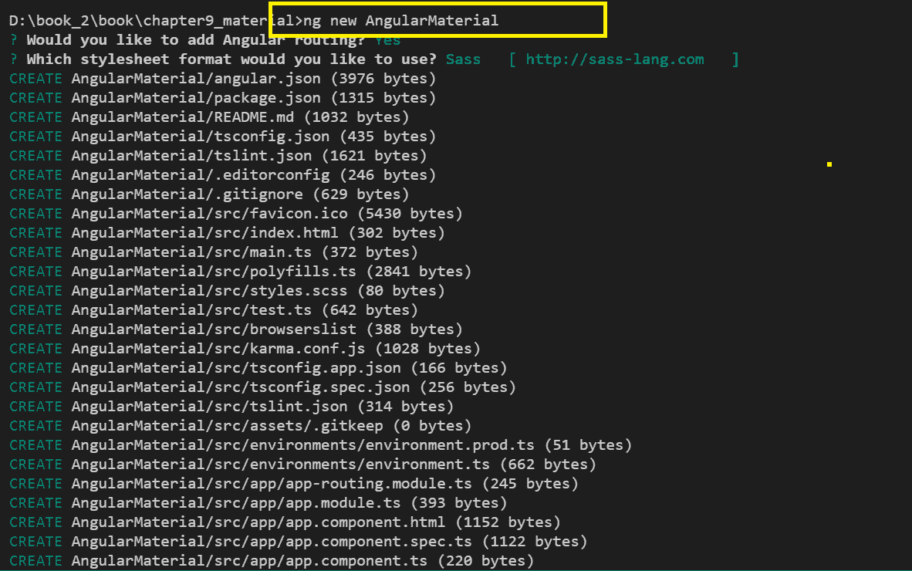

现在我们的应用程序已经生成，让我们学习如何在项目中安装 Angular Material 库。

# 安装 Angular Material

到目前为止，您一定有一种强烈的直觉，即当我们想在 Angular 应用程序中安装任何东西时，我们有一个强大的**命令行界面**（**CLI**）工具。我们将继续使用相同的 CLI，并借助`npm`来安装 Angular Material。

您也可以选择通过 YARN 命令安装 Angular Material—不同的打包系统，同样的结果。

Angular Material 有一个核心依赖和先决条件，需要安装两个包—CDK 和 Animations。所以，让我们先安装这些，然后再安装 Angular Material：

```ts
npm i @angular/cdk --save

npm i @angular/animations --save

npm i @angular/material --save
```

成功运行上述命令后，我们应该看到以下截图中显示的输出：

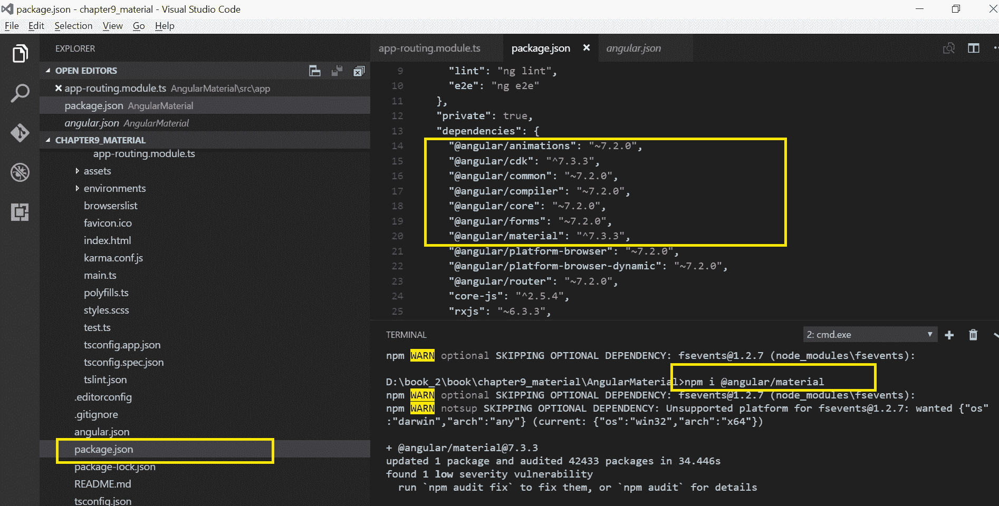

打开`package.json`文件；我们应该看到已安装的包，以及它们旁边列出的相应版本号。如果你看到我们最近安装的三个包，那就意味着我们准备好开始使用 Angular Material 创建一些很棒的 UI 界面了。

一旦我们安装了 Angular Material，我们将需要将所有必需的模块导入到我们的`app.module.ts`文件中。Material 提供了许多模块，每个模块都有特定的目的。例如，如果我们打算使用 Material 卡片，我们将需要导入`MatCardModule`。同样，如果我们想在应用程序中使用 Material 芯片，我们需要导入`MatChipsModule`。虽然我们可以在`AppModule`中确实只导入所需的模块，但在大多数使用 Material UI 的应用程序中，我们将需要所有模块。现在，让我们快速学习如何一次性导入所有模块。我们可以将所有模块导入到一个通用模块中，然后在`app.module.ts`文件中使用新创建的通用模块。首先，在我们的项目结构中创建一个文件，并将其命名为`material-module.ts`，然后我们可以添加以下代码以一次性导入所有模块到这个文件中：

```ts
import  {A11yModule}  from  '@angular/cdk/a11y'; import  {DragDropModule}  from  '@angular/cdk/drag-drop'; import  {ScrollingModule}  from  '@angular/cdk/scrolling'; import  {CdkStepperModule}  from  '@angular/cdk/stepper'; import  {CdkTableModule}  from  '@angular/cdk/table'; import  {CdkTreeModule}  from  '@angular/cdk/tree'; import  {NgModule}  from  '@angular/core'; import  {
  MatAutocompleteModule,
  MatBadgeModule,
  MatBottomSheetModule,
  MatButtonModule,
  MatButtonToggleModule,
  MatCardModule,
  MatCheckboxModule,
  MatChipsModule,
  MatDatepickerModule,
  MatDialogModule,
  MatDividerModule,
  MatExpansionModule,
  MatGridListModule,
  MatIconModule,
  MatInputModule,
  MatListModule,
  MatMenuModule,
  MatNativeDateModule,
  MatPaginatorModule,
  MatProgressBarModule,
  MatProgressSpinnerModule,
  MatRadioModule,
  MatRippleModule,
  MatSelectModule,
  MatSidenavModule,
  MatSliderModule,
  MatSlideToggleModule,
  MatSnackBarModule,
  MatSortModule,
  MatStepperModule,
  MatTableModule,
  MatTabsModule,
  MatToolbarModule,
  MatTooltipModule,
  MatTreeModule, }  from  '@angular/material'; @NgModule({
 exports:  [
  A11yModule,
  CdkStepperModule,
  CdkTableModule,
  CdkTreeModule,
  DragDropModule,
  MatAutocompleteModule,
  MatBadgeModule,
  MatBottomSheetModule,
  MatButtonModule,
  MatButtonToggleModule,
  MatCardModule,
  MatCheckboxModule,
  MatChipsModule,
  MatStepperModule,
  MatDatepickerModule,
  MatDialogModule,
  MatDividerModule,
  MatExpansionModule,
  MatGridListModule,  MatIconModule,
  MatInputModule,
 MatListModule,
 MatMenuModule,
 MatNativeDateModule,
 MatPaginatorModule,
 MatProgressBarModule,
 MatProgressSpinnerModule,
 MatRadioModule,
 MatRippleModule,
 MatSelectModule,
 MatSidenavModule,
 MatSliderModule,
 MatSlideToggleModule,
 MatSnackBarModule,
 MatSortModule,
 MatTableModule,
 MatTabsModule,
 MatToolbarModule,
 MatTooltipModule,
 MatTreeModule,
 ScrollingModule, ] }) export  class  MaterialModule  {}
```

在上述代码中，我们将所有必需的模块导入到文件中。暂时不要担心对先前列出的模块进行分类。当我们学习 Material 提供的组件时，我们会了解这些模块。下一步非常明显——我们需要将这个新创建的模块导入到我们的`app.module.ts`文件中：

```ts
import  {MaterialModule}  from  './material-module';
```

一旦我们导入了模块，不要忘记将其添加到`AppModule`的导入中。就这样。我们已经准备好开始学习和实现由 Angular Material 提供的组件了。

你知道吗？谷歌还发布了一个轻量级的基于 CSS 和 JavaScript 的 Lite 库，Material Design Lite，它开始使用组件的方式与任何其他 UI 库一样。然而，可能有一些组件不具有完全支持。在[`getmdl.io/`](https://getmdl.io/)了解更多信息。

让我们立即开始学习 Angular Material 的组件。 

# 组件类别

作为前端开发人员，你可能已经使用了许多 UI 组件，甚至更好的是，你可能在过去的项目中创建了自己的自定义组件。正如前面提到的，Angular Material 提供了许多组件，可以在我们的应用程序中方便地使用。Angular Material 提供的 UI 组件可以归类为以下类别：

+   布局

+   材料卡片

+   表单控件

+   导航

+   按钮和指示器

+   模态框和弹出窗口

+   表格

为每个类别生成组件是一个好主意，这样当我们开始实现应用程序时，占位符将可用。这些组件将以清晰的分类方式托管所有组件，并且它们将成为您可以用来参考 Material 库中任何组件实现的一站式组件。

首先，让我们为我们的类别生成组件。依次运行以下`ng`命令：

```ts
ng g component MaterialLayouts
ng g component MaterialCards
ng g component MaterialForm
ng g component MaterialNavigation
ng g component MaterialButtons
ng g component MaterialModals
ng g component MaterialTable
```

在成功运行命令后，我们应该看到生成的组件已添加到我们的项目结构中，如下截图所示：

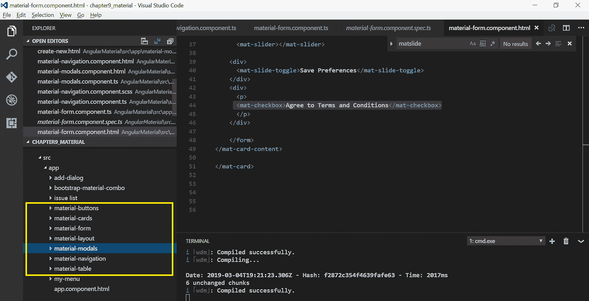

很好。我们已经生成了我们的应用程序；我们已经安装了 Angular Material。我们还将所有所需的模块导入到了我们的`AppModule`文件中，最后，我们为 Material 的 UI 组件中的每个类别生成了组件。在我们开始实现 Material 组件之前，我们需要做的最后一件事是为之前列出的每个类别添加路由。打开`app-routing.module.ts`文件，导入所有新创建的组件，并将路由添加到文件中：

```ts
import { NgModule } from '@angular/core';
import { Routes, RouterModule } from '@angular/router';
import { MaterialFormComponent } from './material-form/material-form.component';
import { MaterialNavigationComponent } from './material-navigation/material-navigation.component';
import { MaterialCardsComponent } from './material-cards/material-cards.component';
import { MaterialLayoutComponent } from './material-layout/material-layout.component';
import { MaterialTableComponent } from './material-table/material-table.component';
import { MaterialModalsComponent } from './material-modals/material-modals.component';
import { MaterialButtonsComponent } from './material-buttons/material-buttons.component';

const routes: Routes = [
 { path: 'material-forms', component: MaterialFormComponent },
 { path: 'material-tables', component: MaterialTableComponent },
 { path: 'material-cards', component: MaterialCardsComponent},
 { path: 'material-layouts', component: MaterialLayoutComponent},
 { path: 'material-modals', component: MaterialModalsComponent },
 { path: 'material-buttons', component: MaterialButtonsComponent },
 { path: 'material-navigation', component: MaterialNavigationComponent }
];

@NgModule({
 imports: [RouterModule.forRoot(routes)],
 exports: [RouterModule]
})
export class AppRoutingModule { }
```

在上述代码中，我们导入了所有新创建的组件，并为每个组件创建了路由路径。到目前为止，一切都很顺利。现在，大舞台已经准备就绪，可以开始了。让我们先从我们的布局开始。

# 导航

任何 Web 应用程序最常见和基本的需求之一是导航菜单或工具栏。Angular Material 为我们提供了多种选项，我们可以选择最适合我们应用程序的菜单类型。

# 使用原理图生成导航组件

我们将从最简单和最快的方式开始，通过使用原理图来将导航添加到我们的应用程序中。没错，离我们的菜单上线只有一步之遥。Angular CLI 提供了原理图，以便获得各种组件。要在我们的应用程序中安装导航菜单，请在 Angular CLI 命令提示符中运行以下命令：

```ts
ng generate @angular/material:nav myMenu
```

在上述命令中，我们使用原理图生成了一个名为`myMenu`的新菜单组件。在成功运行命令后，我们应该看到以下截图中显示的输出：

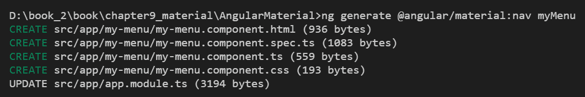

使用`ng serve`命令运行应用程序，我们应该看到以下截图中显示的输出：

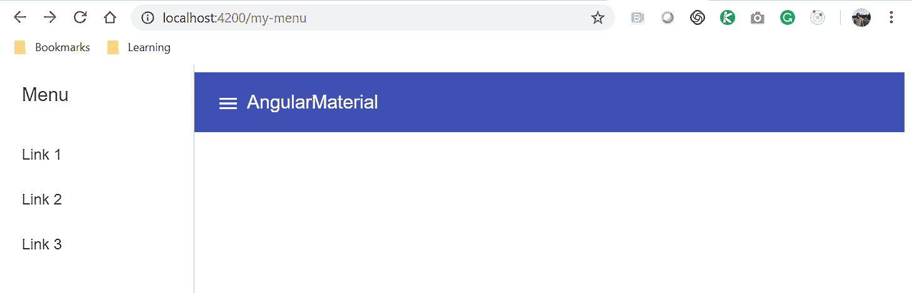

这不是一个非常酷的导航菜单吗？它带有一个顶部标题工具栏和一个可折叠的侧边栏菜单。这个组件是由原理图自动生成的。如果你不是自动生成组件的忠实粉丝，没关系，我们开发人员对这些事情可能会挑剔。让我们看看如何创建我们自己的菜单。

# 自定义 Material 菜单和导航

Angular Material 提供了`MatMenuModule`模块，其中提供了`<mat-menu>`和`MatToolBarModule`指令。还提供了`<mat-toolbar>`，它将用于在我们的应用程序中实现菜单和标题。打开`material-navigation.component.html`文件并添加以下代码：

```ts
<mat-toolbar id="appToolbar" color="primary">
<h1 class="component-title">
 <a class="title-link">Angular Material</a>
 </h1>
 <span class="toolbar-filler"></span>
 <a href="#">Login</a>
 <a href="#">Logout</a>
</mat-toolbar>
```

在上述代码中，我们使用`<mat-toolbar>`作为包装器实现了工具栏指令，并使用`<h1>`添加了一个标题。我们还在标题部分添加了一些链接。使用`ng serve`运行应用程序，我们应该看到以下截图中显示的输出：

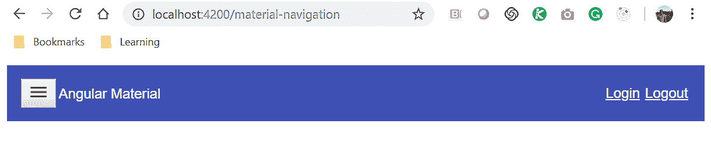

太棒了。让我们再增强一下。我们想要在标题工具栏中添加一个下拉菜单。记得我告诉过你，我们有`MatMenuModule`模块提供的`<mat-menu>`指令吗？让我们在上述代码中的标题工具栏中添加菜单指令如下：

```ts
<mat-toolbar id="appToolbar" color="primary">
<button md-icon-button (click)="sidenav.toggle()" class="md-icon-button sidenav-toggle-button" [hidden]="sidenav.opened">
<mat-icon aria-label="Menu" class="material-icons">menu</mat-icon>
</button>

<h1 class="component-title">
<a class="title-link">Angular Material</a>
</h1>
<span class="toolbar-filler"></span>

<button mat-button [matMenuTriggerFor]="menu" color="secondary">Menu</button>
<mat-menu #menu="matMenu" >
<button mat-menu-item>Item 1</button>
<button mat-menu-item>Item 2</button>
</mat-menu>

<a href="#">Login</a>
<a href="#">Logout</a>
</mat-toolbar>
```

请注意，我们使用`mat-button`属性添加了一个按钮，并绑定了`matMenuTriggerFor`属性。这将显示使用`<mat-menu>`指令定义的下拉菜单。现在让我们使用`ng serve`命令运行应用程序，我们应该看到以下输出：

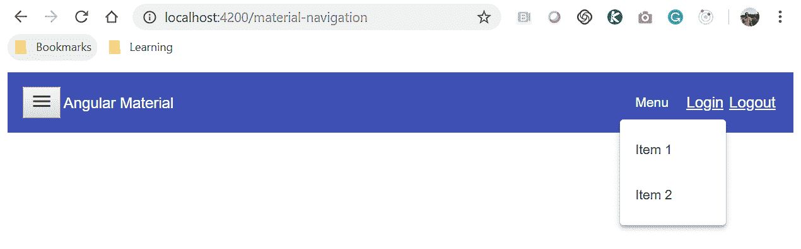

# 自定义侧边栏菜单

太棒了。现在我们有了自制菜单可以使用。我知道你想要更多，对吧？你也想要添加一个侧边栏吗？让我们来做吧。为了将侧边栏添加到我们的应用程序中，Angular Material 为我们提供了一个`MatSidenavModule`模块，其中提供了我们可以在应用程序中使用的`<mat-sidenav>`指令。因此，让我们继续修改上述代码如下：

```ts
<mat-sidenav-container fullscreen>
 <mat-sidenav #sidenav mode="push" class="app-sidenav">
 <mat-toolbar color="primary">
 <span class="toolbar-filler"></span>
 <button md-icon-button (click)="sidenav.toggle()" class="md-icon-button 
   sidenav-toggle-button" [hidden]="!sidenav.opened">
 </button>
 </mat-toolbar>
</mat-sidenav>
<mat-toolbar id="appToolbar" color="primary">
 <button md-icon-button (click)="sidenav.toggle()" class="md-icon-button 
   sidenav-toggle-button" [hidden]="sidenav.opened">
 <mat-icon aria-label="Menu" class="material-icons">menu</mat-icon>
 </button>
 <h1 class="component-title">
 <a class="title-link">Angular Material</a>
 </h1>
 <span class="toolbar-filler"></span>
 <button mat-button [matMenuTriggerFor]="menu" 
   color="secondary">Menu</button>
 <mat-menu #menu="matMenu" >
 <button mat-menu-item>Item 1</button>
 <button mat-menu-item>Item 2</button>
 </mat-menu>
 <a href="#">Login</a>
 <a href="#">Logout</a>
 </mat-toolbar>
</mat-sidenav-container>
```

不要被代码行数吓到。我们只是做了一些改动，比如添加了`<mat-sidenav>`指令，它将包含侧边栏的内容。最后，我们将整个内容包装在`<mat-sidenav-container>`指令内；这很重要，因为侧边栏将覆盖在内容上方。使用`ng serve`命令运行应用程序，我们应该看到以下截图中显示的输出：

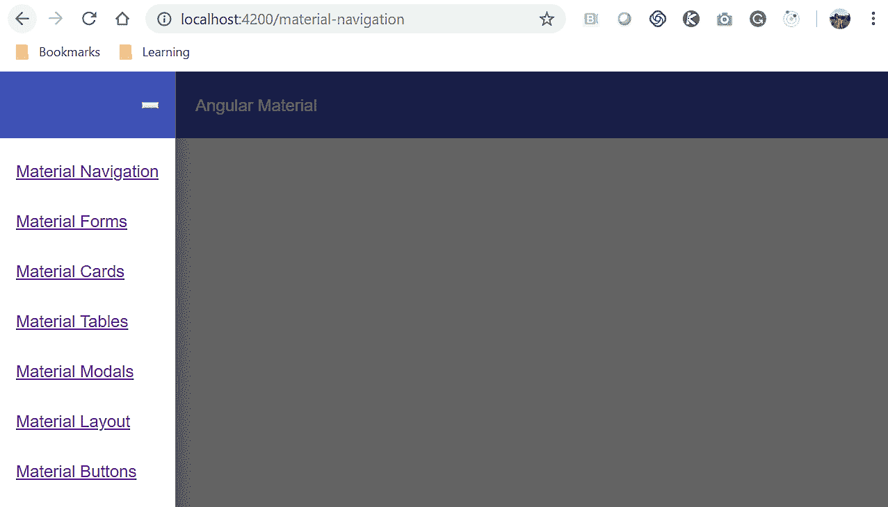

如果你看到了上面截图中显示的输出，给自己一个鼓励。太棒了！你做得非常好。所以，我们已经学会了两种在我们的应用程序中实现导航和菜单的方法。我们可以使用原理图生成导航组件，也可以编写自定义菜单导航组件。无论哪种方式，**用户体验**（**UX**）都是赢家！

现在我们有了导航菜单组件，让我们学习一下 Angular Material 库的其他组件。

# 卡片和布局

在这一部分，我们将学习关于 Angular Material 卡片和布局的知识。Angular Material 的基本布局组件是卡片。卡片包装布局组件还可以包括列表、手风琴或展开面板、选项卡、步进器等等。

# 材料卡片

卡片是用于组合单个主题的数据的文本、图像、链接和操作的内容容器。卡片可以有标题、正文、图像或链接，根据它们的可用性和功能，可以显示给用户。Angular Material 提供了一个名为`MatCardModule`的模块，其中提供了`<mat-card>`指令。我们将使用这个来组合我们应用程序的内容。

创建卡片的基本示例如下：

```ts
<mat-card class="z-depth" >
 <mat-card-title><a href="" primary >Packt Books</a></mat-card-title>
 <mat-card-subtitle>Family of wonderful Authors and Readers
   </mat-card-subtitle>
 <mat-card-content>
 We are learning to create wonderful cards. Each card has some specific 
  data to be displayed to users.
 </mat-card-content>
<mat-card-actions> <button mat-raised-button>Tweet This</button>
  <button mat-raised-button>Share</button></mat-card-actions>
</mat-card>
```

在上面的代码中，我们使用了`MatCardModule`提供的指令。我们将使用`<mat-card>`作为包装指令，以便将内容分组。通过使用`<mat-card-title>`指令，我们设置了卡片的标题。我们使用`<mat-card-subtitle>`指令在`<mat-card>`指令内设置副标题。在`<mat-card-content>`内，我们放置所有需要显示给用户的内容。每个卡片可能有我们希望用户执行的操作，例如分享、编辑、批准等。我们可以使用`<mat-card-actions>`指令显示卡片操作。

使用`ng serve`命令运行应用程序，我们应该看到以下截图中显示的输出：

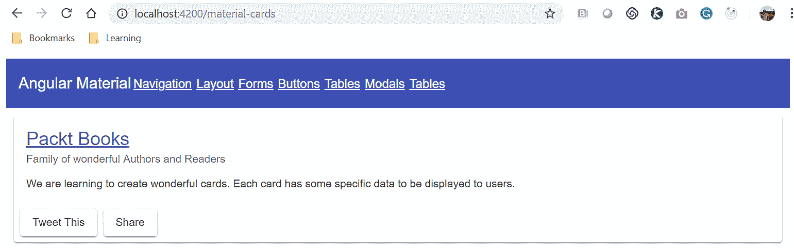

请注意，我们在 Angular Material 卡片内添加了一些内容。您是否想知道卡片内可以显示什么样的内容？只要您想，我们都可以使用。我们可以添加链接、图片、列表、手风琴、步进器等。在下一节中，我们将学习如何将列表添加到我们的卡片中。

# 列表

列表是一组项目的集合。在我们的应用程序中，可以是有序列表，也可以是无序列表。在本节中，我们将学习如何在卡片内添加不同类型的列表。看看下面的示例代码：

```ts
<mat-card class="z-depth" >
 <mat-card-title>Material Lists</mat-card-title>
 <mat-card-content>
 <mat-list>
 <mat-list-item> New York City</mat-list-item>
 <mat-list-item> London</mat-list-item>
 <mat-list-item> Dallas</mat-list-item>
</mat-list>
 </mat-card-content>
</mat-card>
```

在上面的代码中，我们添加了几个城市的列表。我们使用了`MatListModule`中提供的`<mat-list>`和`<mat-list-item>`指令，以便在卡片内创建和显示城市列表。上面的代码输出如下：

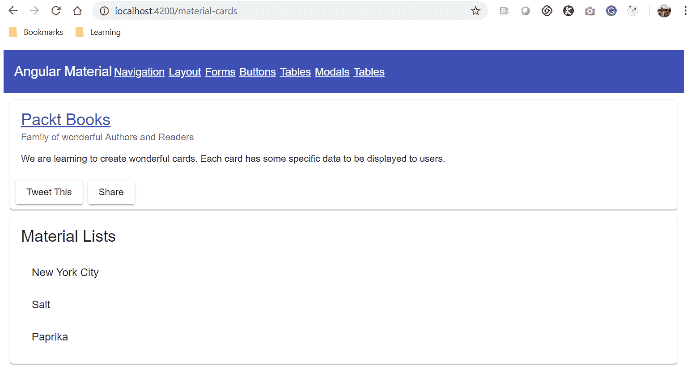

# 带分隔线的列表

我们还可以很容易地为列表项添加`divider`类，以便在视觉上将它们分隔成行。我们需要添加`<mat-divider>`指令以实现该功能。看看下面更新的代码：

```ts
<mat-card class="z-depth" >
 <mat-card-title>Material Lists with Divider</mat-card-title>
 <mat-card-content>
<mat-list>
 <mat-list-item> Home </mat-list-item>
 <mat-divider></mat-divider>
 <mat-list-item> About </mat-list-item>
 <mat-divider></mat-divider>
 <mat-list-item> Contact </mat-list-item>
 <mat-divider></mat-divider>
</mat-list>
</mat-card-content>
</mat-card>
```

# 导航列表

我们可以扩展列表使其可点击，从而将其转换为导航链接。要使列表项可点击，我们需要使用`<mat-nav-list>`指令。看看下面的示例代码：

```ts
<mat-card class="z-depth" >
 <mat-card-title>Material Navigational Lists</mat-card-title>
 <mat-card-content>
<mat-nav-list>
 <a mat-list-item href="#" *ngFor="let nav of menuLinks"> {{ nav }} </a>
</mat-nav-list>
 </mat-card-content>
</mat-card>
```

在上面的代码中，我们使用了`MatListModule`模块中提供的`<mat-nav-list>`和`<mat-list-item>`指令，创建了导航类型的列表和卡片内的列表项。上面的代码输出如下：

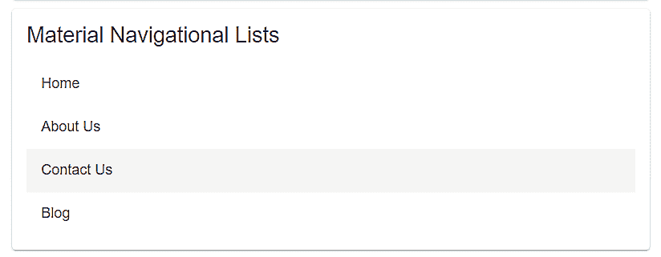

# 手风琴和展开面板

另一个非常酷的 UI 组件是手风琴或展开面板。当我们需要将数据分组在一起时，使用它非常方便。我们需要使用`MatExpansionModule`模块中提供的`<mat-accordion>`和`<mat-expansion-panel>`来实现我们应用程序中的手风琴功能。看看下面的示例代码：

```ts
<mat-card class="z-depth" >
 <mat-card-title>Material Expansion Panels</mat-card-title>
 <mat-card-content>
<mat-accordion>
 <mat-expansion-panel>
 <mat-expansion-panel-header>
 <mat-panel-title>
 Personal Details
 </mat-panel-title>
 </mat-expansion-panel-header>
</mat-expansion-panel>
 <mat-expansion-panel >
 <mat-expansion-panel-header>
 <mat-panel-title>
 Professional Details
 </mat-panel-title>
 <mat-panel-description>
 </mat-panel-description>
 </mat-expansion-panel-header>
 <p>I'm visible because I am open</p>
 </mat-expansion-panel>
</mat-accordion>
 </mat-card-content>
</mat-card>
```

每个`<mat-expansion-panel>`都将有一个`<mat-expansion-panel-header>`，我们可以在其中为展开面板提供标题和描述，并将内容放在`<mat-expansion-panel>`指令本身内。上面的代码输出如下：

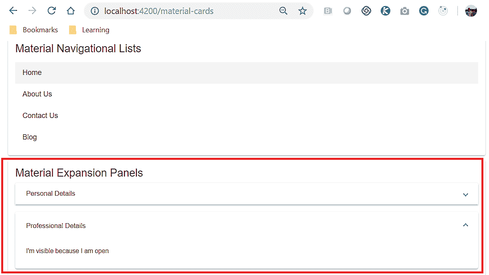

有时我们需要引导用户完成一系列步骤的用例。这就是我们下一个组件发挥作用的地方。它被称为步进器。顾名思义，这将用于设计水平或垂直的步骤，并将一系列步骤分组，用户可以导航到这些步骤。

# 步进器

与我们在*手风琴和展开面板*部分学到的类似，我们需要添加一个`包装器`和一个`<mat-horizontal-stepper>`指令，在其中，我们将创建`<mat-step>`指令。对于我们想要添加的每个步骤，我们需要为我们的应用程序创建一个新的`<mat-step>`指令。我们也可以创建一个垂直步进器。为此，我们将使用`<mat-vertical-stepper>`指令作为`包装器`类。请看下面的代码；我们正在创建一个水平步进器：

```ts
<mat-card class="z-depth" >
<mat-card-title>Material Stepper</mat-card-title>
<mat-card-content>
<mat-horizontal-stepper [linear]="isLinear" #stepper>
<mat-step label="Personal Details">
Step #1
</mat-step>
<mat-step label="Professional Details">
Step #2
</mat-step>
<mat-step>
<ng-template matStepLabel>Done</ng-template>
You are now done.
<div>
<button mat-button matStepperPrevious>Back</button>
<button mat-button (click)="stepper.reset()">Reset</button>
</div>
</mat-step>
</mat-horizontal-stepper>
</mat-card-content>
</mat-card>
```

在上面的代码中，我们创建了一个包含三个步骤的水平步进器。为了定义步进器，我们使用了`<mat-horizontal-stepper>`，用于定义实际步骤，我们使用了`<mat-step>`指令。上面代码的输出如下：

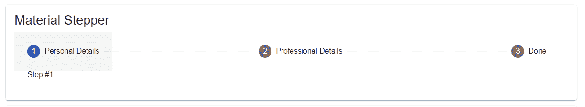

# 标签页

我们要学习的最后一个布局组件是标签页。Angular Material 提供了一个名为`MatTabsModule`的模块，该模块提供了`<mat-tab-group>`和`<mat-tab>`指令，以便我们可以轻松地在我们的应用程序中创建一个标签页组件。请看下面的示例代码：

```ts
<mat-card class="z-depth" >
 <mat-card-title>Material Tabs</mat-card-title>
 <mat-card-content>
 <mat-tab-group>
 <mat-tab label="Personal"> This is a Personal Tab </mat-tab>
 <mat-tab label="Professional"> This is a Professional tab </mat-tab>
 <mat-tab label="Contact"> This is Contacts Tab </mat-tab>
</mat-tab-group>
</mat-card-content>
</mat-card>
```

在上面的代码中，我们使用了`<mat-tab-group>`包装指令，在其中，我们使用了`<mat-tab>`指令来指定每个特定的标签页。每个标签页都有一个标签，将显示在标签页的顶部。在`<mat-tab>`内部，我们将显示每个标签页的内容。请看下面截图中上面代码的输出：

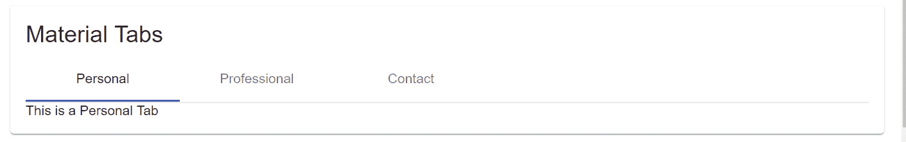

在下一节中，我们将学习关于 Angular Material 表单的知识。继续阅读。

# 表单控件

表单是任何交互式和动态应用程序的主要组成部分。Angular Material 原生支持表单和表单控件，可以轻松地集成到我们的应用程序中。在本节中，我们将学习如何使用 Angular Material 组合表单。

总的来说，表单在 UX/UI 方面已经有了很大的发展。Angular Material 支持涉及文本字段、文本区域、下拉选择选项、单选按钮和复选框等基本表单字段元素。Angular Material 还提供了高级表单元素，例如自动完成、日期选择器、滑动开关等。在我们进行实际示例的过程中，我们将学习如何将所有这些添加到我们的表单中。

Angular Material 提供了许多与表单和表单字段元素相关的模块，包括以下列出的模块：

+   `MatFormFieldModule`

+   `MatInputField`

+   `MatRadioModule`

+   `MatChipModule`

+   `MatProgressBarModule`

+   `MatSelectModule`

+   `MatSlideModule`

+   `MatSlideToggleModule`

+   ``MatListModule``

+   `MatDatePickerModule`

+   `MatAutocompleteModule`

+   `MatCheckboxModule`

如前所述，我们可以单独导入这些，或者像在前一节中的`MaterialModule`文件中那样一次性导入所有模块。我们已经在`AppModule`中导入了我们的模块；我们可以开始将表单字段实现到我们的表单中。我们将把每个`input`和`textarea`表单元素包装在一个`<mat-form-field>`包装指令中。为了实现输入文本框，我们将使用`matInput`属性，以及我们的`HTML`输入标签：

```ts
<mat-form-field>
<input matInput placeholder="Enter Email Address" value="">
</mat-form-field>
```

这非常简单明了，对吧？当然。现在，同样地，我们可以轻松地向我们的表单中添加一个`textarea`字段：

```ts
<mat-form-field class="example-full-width">
<textarea matInput placeholder="Enter your comments here"></textarea>
</mat-form-field>
```

好吧，添加`Input`和`Textarea`表单元素并不是什么难事。接下来，我们将实现单选按钮和复选框字段元素：

```ts
 <mat-radio-group>
 <p>Select your Gender</p>
 <mat-radio-button>Male</mat-radio-button>
 <mat-radio-button>Female</mat-radio-button>
 </mat-radio-group>
```

为了在我们的表单中实现单选按钮，我们将使用`<mat-radio-button>`指令。在大多数情况下，我们还将使用多个单选按钮来提供不同的选项。这就是我们将使用`<mat-radio-group>`包装指令的地方。与单选按钮类似，Material 提供了一个指令，我们可以轻松地将复选框集成到我们的应用程序中。我们将使用`<mat-checkbox>`指令如下：

```ts
<mat-checkbox>
    Agree to Terms and Conditions
</mat-checkbox>
```

该指令由`MatCheckboxModule`模块提供，并提供了许多属性，我们可以用来扩展或处理数据。

为了在我们的表单中实现下拉选项，我们需要使用 HTML 的`<select>`和`<option>`标签。Material 库提供了我们可以轻松使用的指令，以扩展我们表单的功能：

```ts
<mat-form-field>
Select City
<mat-select matNativeControl required>
 <mat-option value="newyork">New York City</mat-option>
 <mat-option value="london">London</mat-option>
 <mat-option value="bangalore">Bangalore</mat-option>
 <mat-option value="dallas">Dallas</mat-option>
</mat-select>
</mat-form-field>
```

在前面的代码中，为了使用`<select>`和`<option>`标签，我们将使用`<mat-select>`和`<mat-option>`指令。我们在这里取得了很好的进展。让我们保持这种势头。我们要实现的下一个表单字段元素是滑块组件。

当用户想要指定起始值和结束值时，滑块可以非常有帮助。当用户可以开始浏览范围并且数据根据所选范围进行过滤时，它可以改善用户体验。要向我们的表单添加滑块，我们需要添加`<mat-slider>`指令：

```ts
<mat-form-field>
Select Range
<mat-slider></mat-slider>
</mat-form-field>
```

那很简单。`MatSliderModule` API 提供了许多选项，以便以许多有用的方式扩展和使用指令。我们可以指定最大和最小范围。我们可以设置间隔值，等等。谈到 UI 中的滑块功能，有一个组件可以使用，称为滑动切换。我们可以使用`<mat-slide-toggle>`指令来实现滑动切换：

```ts
 <mat-slide-toggle>Save Preferences</mat-slide-toggle>
```

我们使用了`MatSlideToggleModule`模块提供的`<mat-slide-toggle>`指令。该 API 提供了许多属性，例如`dragChange`、`toggleChange`、根据需要设置颜色或验证等。

现在我们已经在模板文件中放置了所有前面的表单字段元素，让我们运行应用程序以查看输出。使用`ng serve`命令运行应用程序，我们应该看到以下截图中显示的输出：

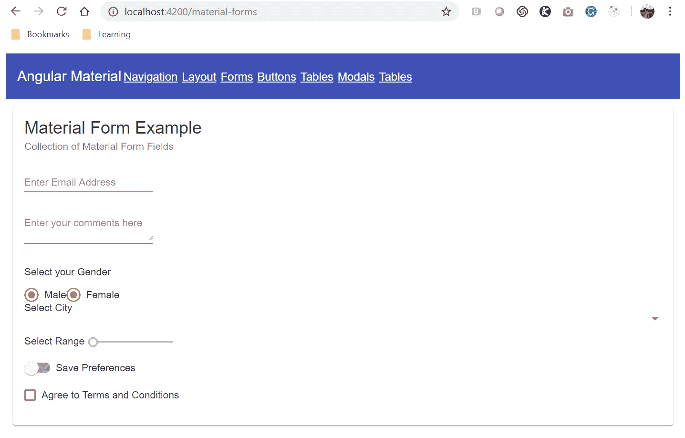

在下一节中，我们将学习由 Angular Material 提供的按钮和指示器组件。

# 按钮和指示器

这里有一个小小的趣闻——你见过没有任何按钮的网站或应用程序吗？如果有的话，请写信给我。

就我的经验而言，按钮是 Web 应用程序的一个组成部分。在本节中，我们将学习有关按钮、按钮组和指示器的所有内容。

Angular Material 提供了许多有用且易于附加到按钮标签的属性，然后，神奇发生了。开始使用 Angular Material 按钮的最简单方法是将`mat-button`属性添加到`<button>`标签中：

```ts
<div>
<button mat-button>Simple Button</button>
<button mat-button color="primary">Primary Button</button>
<button mat-button color="accent">Accent Button</button>
<button mat-button color="warn">Warn Button</button>
<button mat-button disabled>Disabled</button>
<a mat-button routerLink=".">Link</a>
</div>
```

在上述代码中，我们为添加到`material-button.component.html`模板文件中的所有按钮添加了`mat-button`属性。我们还使用了`color`和`disabled`等属性来自定义按钮的外观和行为。上述代码的输出如下：

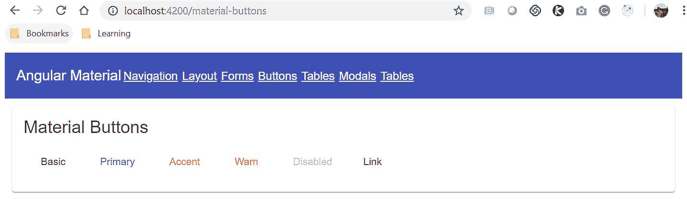

上述截图中的按钮看起来更像链接而不是按钮，对吧？让我们自定义它们，使它们看起来更像按钮。我们可以通过添加`mat-raised-button`属性来轻松实现这一点。请注意，在上一个示例中，我们使用了`mat-button`属性，在这个示例中，我们添加了`mat-raised-button`。更新后的代码如下：

```ts
<div>
  <button mat-raised-button>Basic Button</button>
  <button mat-raised-button color="primary">Primary Button</button>
  <button mat-raised-button color="accent">Accent Button</button>
  <button mat-raised-button color="warn">Warn Button</button>
  <button mat-raised-button disabled>Disabled Button</button>
  <a mat-raised-button routerLink=".">Link</a>
</div>
```

上述代码的输出如下。请注意，现在添加了新属性后，按钮的外观和感觉有所不同：

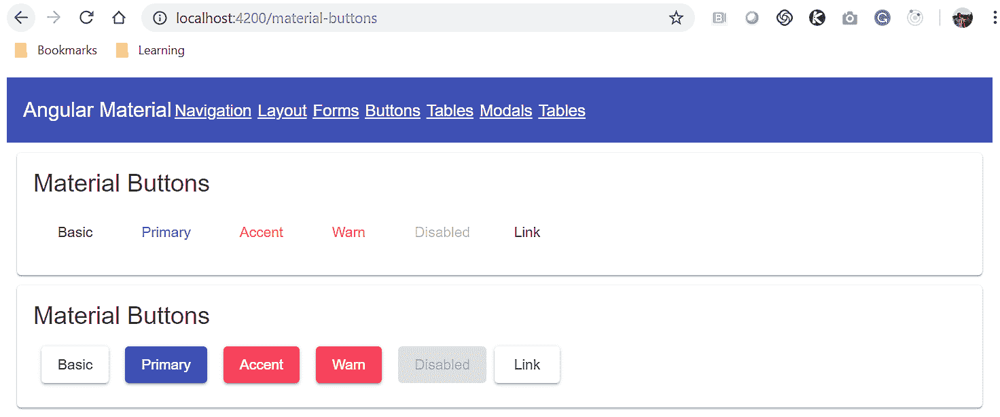

这些是漂亮的按钮！使用预定义的属性可以让我们在整个应用程序中保持按钮的统一性。

接下来，我们将探索 Angular Material 提供的指示器。作为指示器组件的一部分，我们将学习徽章和进度条组件。

徽章是突出显示一些数据以及其他 UI 元素的一种方式。我们可能会遇到一些使用案例，希望在按钮上使用徽章。你可能已经在想，我们是否也可以为按钮添加一些 UX 来设计一些功能呢？是的，我们可以！

Angular Material 提供了一个名为`MatBadgeModule`的模块，其中包含了`matBadge`、`matBadgePosition`和`matBadgeColor`属性的实现，可以轻松地用于设置按钮的徽章。看一下以下示例代码：

```ts
<button mat-raised-button color="primary"
 matBadge="10" matBadgePosition="before" matBadgeColor="accent">
 Left Badge
</button>
```

在上述代码中，我们添加了一个按钮元素，并指定了属性，如`matBadge`、`matBadgePosition`和`matBadgeColor`。上述代码的输出如下：

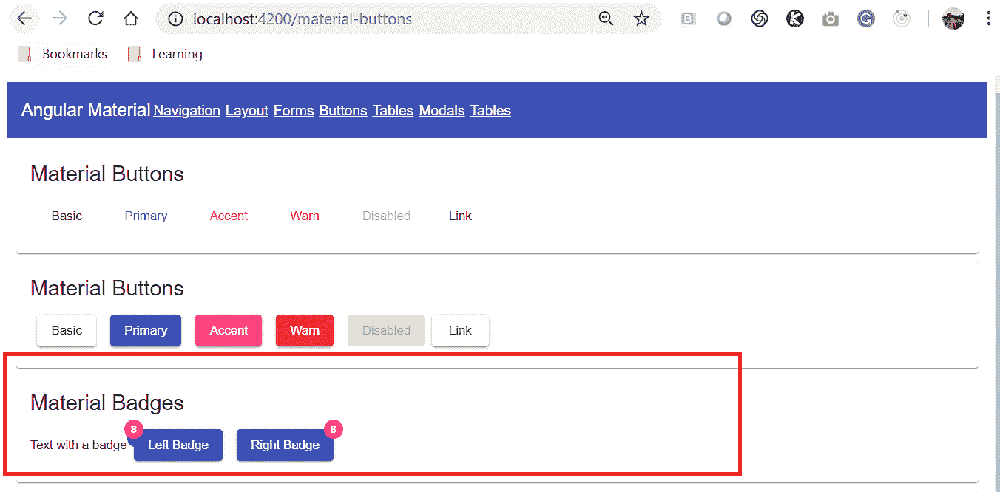

这是一个带徽章的按钮。还有另一个名为 chips 的 UI 组件。我们也可以轻松使用这些来增强 UX。将 Material chips 想象成之前使用过的任何其他应用程序中的*标签*。Angular Material 提供了一个名为`MatChipModule`的模块，其中提供了`<mat-chip-list>`和`<mat-chip>`指令，我们可以轻松地集成到我们的应用程序中。看一下以下示例代码：

```ts
<mat-chip-list>
<mat-chip color="primary" selected>New York</mat-chip>
<mat-chip>London</mat-chip>
<mat-chip>Dallas</mat-chip>
<mat-chip>Accent fish</mat-chip>
</mat-chip-list>
```

在前面的代码中，我们使用了从`MatChipModule`中得到的指令，并将标签组合在一起。前面代码的输出如下：

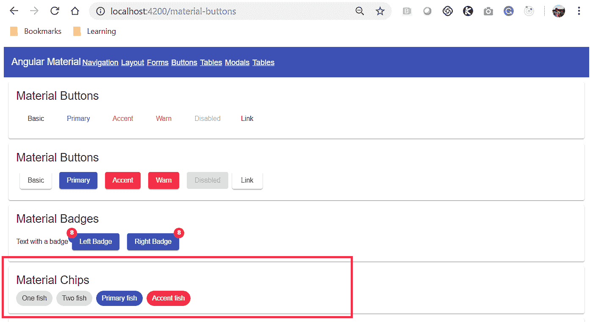

很好。我们将学习实现的下一个指示器是非常重要的；进度条。我们需要向用户显示并告知正在后台执行的操作，或显示处理某些用户数据的进度。在这种情况下，我们需要清楚地使用进度条来显示这一点。

Angular Material 提供了名为`MatProgressBarModule`和`MatProgressSpinnerModule`的模块，使用这些模块，我们可以轻松地向我们的 Web 应用程序添加加载图标或旋转器。使用 API 属性和事件，我们还可以轻松地捕获和处理数据。看一下以下示例代码：

```ts
<mat-spinner></mat-spinner>
```

就这样？真的吗？我们在开玩笑吗？不，我们不是。只需使用这个模块，我们应该在我们的应用程序中看到旋转的轮子。看一下前面代码的输出：

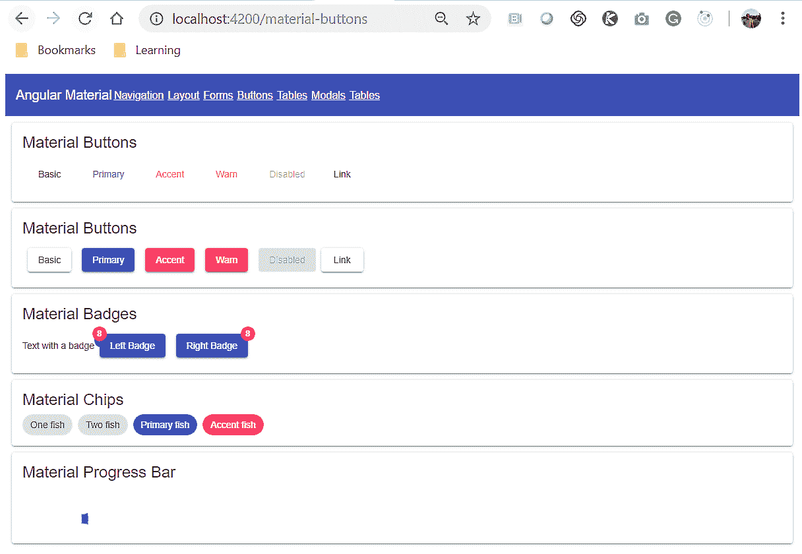

在下一节中，我们将学习 Angular Material 提供的所有有关模态窗口和对话框窗口的信息。

# 弹出窗口和模态窗口

现代 Web 应用程序引入了许多创新的 UX 功能和功能。一个真正突出的功能必须是模态窗口。打开任何主要的 Web 应用程序；它都会有一些模态窗口的实现。Angular Material 库也为我们提供了一种轻松实现模态或对话框弹出窗口的方法。

Angular Material 有一个名为`MatDialogModule`的模块，它提供了我们可以在组件类中使用的各种类。与其他 UI 组件不同，没有指令可以直接在模板文件中使用；相反，我们需要以编程方式实现此功能。在我们开始创建对话框窗口实现之前，我们将需要一个组件来存储模态窗口内容。运行以下命令并生成一个组件。让我们称之为`addDialog`组件：

```ts
ng g c addDialog
```

当命令成功执行时，我们应该看到以下截图中显示的输出：

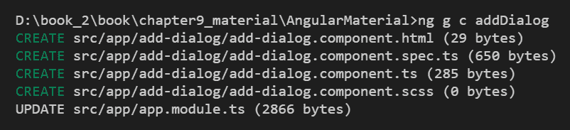

现在，打开新创建的`add-dialog.component.html`文件，并添加一些内容。即使现在只是*Hello World*也可以。

接下来，让我们开始修改我们的`MaterialModalComponent`类，并将以下代码添加到其中：

```ts
import { Component, OnInit, Inject} from '@angular/core';
import { VERSION, MatDialogRef, MatDialog} from '@angular/material';
import {AddDialogComponent} from '../add-dialog/add-dialog.component';

@Component({
 selector: 'app-material-modals',
 templateUrl: './material-modals.component.html',
 styleUrls: ['./material-modals.component.scss']
})
export class MaterialModalsComponent implements OnInit {

constructor(private dialog: MatDialog) { }

ngOnInit() { }

openDialog() {
 const dialogRef = this.dialog.open(AddDialogComponent);
 }
}
```

让我们分析前面的代码。我们将所有所需的模块导入到文件中。然后我们将`VERSION`，`MatDialogRef`和`MatDialog`导入到我们的组件类中。我们还导入了`AddNewComponent`，我们希望在模态窗口中显示它。由于我们在类中导入了`MatDialog`，我们需要将其注入到我们的构造方法中，然后创建一个实例。然后我们将创建另一个名为`openDialog`的方法。在这个方法中，通过使用`MatDialog`实例，我们调用 open 方法并将`AddNewComponent`作为参数传递。我们已经实现了模态窗口的功能，但在实际调用`openDialog`方法之前，这不会起作用。

因此，让我们打开我们的`material-modal.component.html`模板文件，并在其中添加以下行：

```ts
<button mat-raised-button (click)="openDialog()">Pick one</button>
```

这里没有太多要描述的。我们只是添加了一个按钮，并附加了一个`onclick`事件，以便调用`openDialog`方法：简单而甜蜜。让我们使用`ng serve`命令运行应用程序，我们应该看到以下输出：

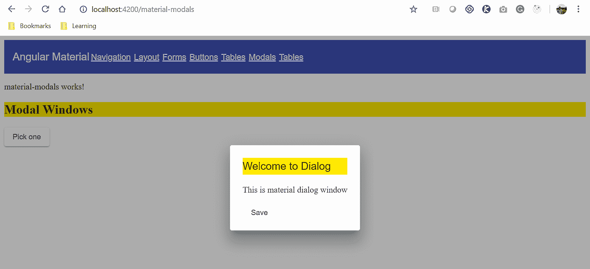

在我的`AddDialogComponent`中，我添加了一些文本和一个按钮。您也可以添加或设计自己的模板。API 提供了许多属性和事件，我们可以与对话框窗口关联起来。

在下一节中，我们将学习 Angular Material 提供的数据表功能。

# 数据表

表格是设计复杂的登录后屏幕功能的关键方面之一。我说在登录屏幕后面，因为这样，搜索引擎优化的争论就不会出现。传统表格的问题在于我们需要自己映射数据、行和列，并实现分页和响应性。多亏了 Angular Material，我们现在可以用一行命令就能生成所有这些。没错，你没看错——只用一个命令，当我们使用原理图时。运行以下命令，我们应该很快就能准备好我们的数据表：

```ts
ng generate @angular/material:table issueList
```

我们使用`ng`命令来指定我们要从 Angular Material 生成表格的原理图，并且应该在名为`issueList`的新组件中创建它。成功运行命令后，我们应该看到以下截图中显示的输出：

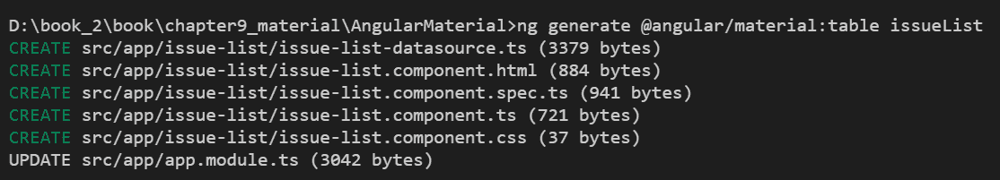

使用`ng serve`命令运行应用程序，并导航到表的路由。我们应该看到以下截图中显示的输出：

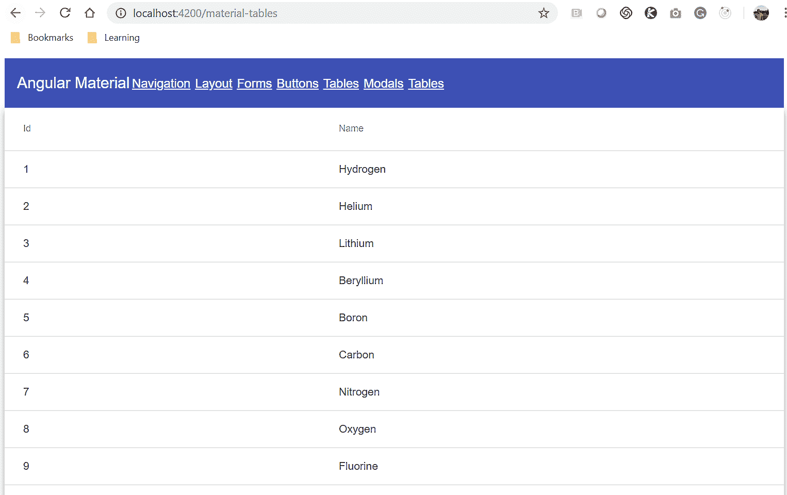

看！我们现在已经准备好使用我们的动态表格了。我们可以自定义数据源的值和需要显示和更新的列，只需使用我们`component`类中的配置。继续尝试一下吧。

# 总结

我们通过为 UI 组件的每个主要类别创建占位符组件来开始本章。这些组件分为各种类别布局、材料卡片、表单控件、导航、按钮和指示器、模态和弹出窗口以及表格。

我们首先创建了导航菜单组件。我们学习了如何使用原理图自动生成导航菜单组件。然后，我们还学习了如何为我们的应用程序实现自定义菜单。接下来，我们开始学习并实现由 Angular Material 提供的布局组件。在布局组件中，我们了解了 Material 卡片。我们学习了如何在 Material 卡片中包含各种内容。我们了解了 Material 支持的各种列表。我们了解了带有分隔线的列表和导航列表。我们还学习了如何实现手风琴和扩展面板，以更好地对数据进行分组和排列。我们还探索了如何使用步进器组件，在设计需要各种步骤的数据的 UX 时非常有用。同样，我们学习了如何使用选项卡来对事物进行分组。

接下来，我们探索了 Material 表单，并学习了如何实现表单字段元素，包括输入、文本区域、单选和复选按钮、滑块和滑动切换。我们还学习了 Material 提供的不同类型的按钮和指示器，包括徽章和标签。然后，我们了解并实现了由 Angular Material 提供的模态框和弹出窗口。

最后，我们了解了数据表，以及原理图如何帮助我们快速在应用程序中设置数据表。

如果我们想要涵盖 Angular Material 组件的每一个细节，就需要一本单独的书。我们试图为您概述不同的可用组件，以及在下一个项目中为什么您可能考虑使用 Material，并在合适的时候适合您/您的客户。这绝对值得一试！
