# 第十章：处理表单

让我们从一个简单的猜谜游戏开始这一章。你能想到任何没有任何形式的网页应用程序，比如注册、登录、创建、联系我们、编辑表单等等；列表是无穷无尽的。（错误答案-甚至 Google 主页上也有一个搜索表单。）

从技术上讲，这是可能的。我 100%确定有一些网站根本不使用表单，但我同样确信它们将是静态的，不会与用户动态交互或互动，这就是本章的主要内容和重点：在我们的 Angular 应用程序中实现和使用表单。

好的，现在让我们来看看本章我们将涵盖的内容：

+   引导表单简介

+   引导表单类

+   引导表单类-扩展

+   角度形式

+   模板驱动表单

+   响应式表单

+   表单验证

+   提交和处理表单数据

# 引导表单

我们将学会使用强大的 Bootstrap 库，它为我们设计和开发应用程序中的表单提供了丰富的类和实用程序，使开发人员和设计人员的生活变得轻松！

# 什么是表单？

表单是一组输入字段的集合，通过键盘、鼠标或触摸输入，使我们能够从用户那里收集数据。

我们将学会将输入元素组合在一起，并构建一些示例表单，比如登录、注册，或者当用户忘记密码时。

在我们开始创建表单之前，这里有一个我们可以在应用程序中使用的可用 HTML 输入元素的快速列表：

+   输入（包括文本、单选框、复选框或文件）

+   文本区

+   选择

+   按钮

+   形式

+   字段集

如果你想快速复习 HTML 标签和元素，你可以访问[W3schools.com](https://www.w3schools.com/)。

掌握了关于表单和可用的 HTML 元素的知识，现在是动手的时候了。

# 引导表单类

在本节中，我们将学习 Bootstrap 框架中可用的类，我们可以在构建表单时使用这些类。每个表单可以包含各种输入元素，如文本表单控件、文件输入控件、输入复选框和单选按钮。`.form-group`类是一种为我们的表单添加结构的简单方法。使用`.form-group`类，我们可以轻松地将输入元素、标签和帮助文本分组，以确保表单中元素的正确分组。在`.form-group`元素内，我们将添加输入元素，并为每个元素分配`.form-control`类。

使用`.form-group`类对元素进行分组的示例如下：

```ts
 <div class="form-group">
 <label for="userName">Enter username</label>
 <input type="text" class="form-control" id="userName" placeholder="Enter username">
 </div>
```

在上述代码中，我们创建了一个包含标签和文本输入元素的表单组。

在同样的线上，我们可以轻松地添加文本输入元素，比如`email`，`password`和`textarea`。以下是添加类型为`email`的输入元素的代码：

```ts
<div class="form-group">
<label for="userEmailAddress">Enter email address</label>
<input type="email" class="form-control" id="emailAddress" placeholder="name@example.com">
</div>
```

同样，我们也可以轻松地添加类型为`password`的输入元素。再次注意，我们正在使用`form-group`作为包装，并将`form-control`添加到元素中：

```ts
<div class="form-group">
<label for="userPassword">Enter password</label>
<input type="password" class="form-control" id="userPassword">
</div>
```

不错。我们学会了在输入元素上使用`form-group`和`form-control`类。现在，让我们将相同的类添加到`textarea`元素上。以下是为`textarea`元素添加类的示例代码：

```ts
<div class="form-group">
<label for="userComments">Example comments</label>
<textarea class="form-control" id="userComments" rows="3"></textarea>
</div>
```

您会注意到所有上述元素都具有相同的结构和分组。对于`select`和`multiple` `select`输入元素，也完全相同。

在以下示例代码中，我们创建了一个`select`下拉元素，并使用了`form-control`类：

```ts
<div class="form-group">
<label for="userRegion">Example select</label>
<select class="form-control" id="userRegion">
<option>USA</option>
<option>UK</option>
<option>APAC</option>
<option>Europe</option>
</select>
</div>
```

我们已经添加了一个`select`下拉元素，并且将允许用户从列表中选择一个选项。只需添加一个额外的属性`multiple`，我们就可以轻松地允许用户选择多个选项：

```ts

<div class="form-group">
<label for="userInterests">Example multiple select</label>
<select multiple class="form-control" id="userInterests">
<option>Biking</option>
<option>Skiing</option>
<option>Movies</option>
<option>Music</option>
<option>Sports</option>
</select>
</div>
```

这很简单明了。让我们继续前进。

现在，让我们继续其他重要的输入元素：复选框和单选按钮。但是，`checkbox`和`radio`元素的类是不同的。

有三个新的类，我们将学习如何为`checkbox`和`radio`元素实现：

+   为了包装元素，我们将使用`form-check`类

+   对于输入类型为`checkbox`和`radio`的元素，我们将使用`form-check-input`

+   对于`checkbox`和`radio`元素，我们需要显示标签，为此我们将使用`form-check-label`类：

```ts
<div class="form-check">
 <input class="form-check-input" type="checkbox" value="" id="Worldwide">
 <label class="form-check-label" for="Worldwide">
 Worldwide
 </label>
</div>
```

在上述代码中，我们使用`.form-check`类，`.form-check-input`和`.form-check-label`来包装我们的`div`和`label`元素。

同样，在类似的线上，我们将使用上述类来添加到输入`radio`元素中：

```ts

<div class="form-check">
 <input class="form-check-input" type="radio" name="gender" id="maleGender" 
    value="option1" checked>
 <label class="form-check-label" for="maleGender">
 Male
 </label>
</div>
<div class="form-check">
 <input class="form-check-input" type="radio" name="gender" id="femaleGender" 
    value="option2">
 <label class="form-check-label" for="femaleGender">
 Female
 </label>
</div>
```

在上述代码中，我们为用户创建了两个单选按钮，以选择他们的性别，并且用户只能在两个选项中选择一个。

在大多数现代 Web 应用程序中，我们需要用户能够上传文件或资源到我们的应用程序。Bootstrap 为我们提供了一个名为"form-control-file"的类，我们可以将其关联到文件上传元素。

我们将使用`form-control-file`类将其应用于我们的输入类型`file`元素。此示例代码如下：

```ts
<div class="form-group">
 <label for="userProfilePic">Upload Profile Pic</label>
 <input type="file" class="form-control-file" id="userProfilePic">
 </div>
```

很好。我们已经学会了如何组合所有元素，从而创建我们美丽而强大的表单。

# Bootstrap 表单类 - 扩展

我们已经学会了创建带有输入元素的表单，并在 Bootstrap 中添加了一些可用的表单类来对元素进行分组，以及改善我们的应用程序。

在本节中，我们将查看 Bootstrap 框架提供的其他附加类和属性，这些类和属性可用于改善用户体验（UX），以及扩展元素的行为：

+   大小

+   只读

+   内联表单

+   使用 Bootstrap 网格类的表单

+   禁用

+   帮助文本

+   `form-group`内的纯文本

我们将逐个讨论上述选项，并学会实现它们并看到它们的效果。

# 大小

我们可以设置表单中输入元素的大小。我们可以使用各种类来控制元素的高度，适用于小、中和大分辨率。

我们已经在上一节中学会了使用`.form-control`类，默认情况下，使用`.form-control-md`类应用了中等大小的高度。还有其他类可用于设置高度为大或小。我们可以分别使用`.form-control-lg`和`.form-control-sm`。

以下是示例代码，我们将使用`.form-control-lg`类将电子邮件地址元素的高度设置为大，并使用`.form-control-sm`类将密码字段设置为小：

```ts
<form>
 <div class="form-group mb-2 mr-sm-2">
   <label for="userEmailAddress">Enter email address</label>
   <input type="email" class="form-control form-control-lg" 
     id="userEmailAddress">
 </div>

 <div class="form-group mb-2 mr-sm-2">
   <label for="userPassword">Enter password</label>
   <input type="password" class="form-control form-control-sm" 
     id="userPassword">
 </div>

<button type="submit" class="btn btn-primary">Submit</button>
</form>
```

我们已将`form-control-lg`和`form-control-sm`类添加到表单控件的电子邮件地址和密码表单元素中，分别。

当我们运行应用程序时，上述代码的输出如下：

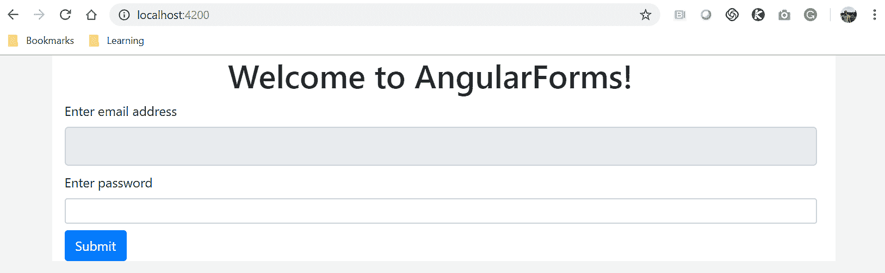

在上面的屏幕截图中，请注意输入元素高度的差异。电子邮件地址文本字段的高度增加了，密码字段很小。

# 只读

我们可能会遇到一个使用情况，需要禁用字段并使其只读。我们可以利用属性`readonly`。通过向任何表单控件元素添加布尔`readonly`属性，我们可以禁用该元素。

显示在用户名字段上使用`readonly`属性的示例代码如下：

```ts
<div class="form-group">
 <label for="userName">Enter username</label>
 <input type="text" class="form-control" id="userName" placeholder="E.g 
    packtpub" **readonly**>
 </div>
```

上述代码的输出如下所示。请注意，电子邮件地址字段已禁用，因此用户将无法添加/编辑该元素：

！[](assets/62eecb1f-cbae-4243-aaa2-f676a93b5724.png)

# 内联表单

设计也是我们如何显示表单的同样重要的方面。我们可能会遇到这样的用例，我们需要将我们的表单水平放置，而不是常规的垂直方式。

Bootstrap 有`.form-inline`类来支持内联或水平表单。当使用`.form-inline`类时，表单元素会自动水平浮动。

以下是一些示例代码，我们在其中使用电子邮件地址和密码创建登录表单。我们使用`form-inline`类使其成为内联表单：

```ts
<form class="form-inline">
 <div class="form-group">
 <label for="userEmailAddress">Enter email address</label>
 <input type="email" class="form-control" id="emailAddress" 
    placeholder="name@example.com">
 </div>

 <div class="form-group">
 <label for="userPassword">Enter password</label>
 <input type="password" class="form-control" id="userPassword">
 </div>
</form>
```

在上述代码中，需要注意的重要事项是使用`.form-inline`类。

上述代码的输出如下：

！[](assets/2938203b-a18e-44d5-bd43-2958357e0bec.png)

默认情况下，使用 Bootstrap 设计的所有表单都是垂直的。

# 使用 Bootstrap 网格类的表单

还记得我们在第三章中学到的 Bootstrap 网格类吗，*Bootstrap-网格布局和组件*？是的，行、列和设计屏幕布局。

在本节中，我们将学习在表单内部使用相同的行和列网格类，这是一个好消息，因为使用这些类，我们可以设计自定义布局并更新表单的外观。

此示例代码如下：

```ts
<form>
 <div class="row">
 <div class="col">
 <label for="userEmailAddress">Enter email address</label>
 <input type="email" class="form-control" id="emailAddress" readonly>
 </div>
 <div class="col">
 <label for="userPassword">Enter password</label>
 <input type="password" class="form-control" id="userPassword">
 </div>
 </div>
</form>
```

在上述代码中，我们不是使用`.form-group`类，而是使用`row`和`col`类，这些类主要用于设计布局。

我们创建一个具有两列的单行，并在每列中添加输入元素。

上述代码的输出如下：

！[](assets/7c02ddc6-166a-4b89-ab2b-8db49242f727.png)

现在是你的作业。尝试使用表单和网格类进行这些有趣的用例：

+   通过向同一行添加更多列 div 元素，可以在同一行中添加更多输入元素

+   向表单添加多行

+   为某些列（第 4 列或第 3 列）分配固定宽度

# 禁用

在开发具有关键和复杂合规要求的 Web 应用程序时，很常见的是我们将不得不根据用户选择禁用某些输入元素。

一个很好的用例是，某些字段不适用于用户选择的特定国家，因此我们需要禁用其他依赖字段。

使用`disabled`属性，该属性接受布尔值，我们可以禁用表单或特定元素。

让我们看看`disabled`属性的作用：

```ts
<form>
 <div class="row">
 <div class="col">
 <label for="userEmailAddress">Enter email address</label>
 <input type="email" class="form-control" id="emailAddress" disabled>
 </div>
 <div class="col">
 <label for="userPassword">Enter password</label>
 <input type="password" class="form-control" id="userPassword">
 </div>
 </div>
</form>
```

在上述代码中，我们使用了`disabled`属性。我们可以在以下截图中看到，电子邮件地址字段完全被禁用：

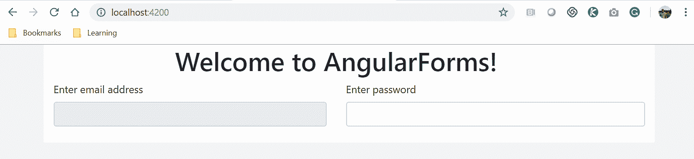

我们可以通过向元素添加`disabled`属性来使任何元素被禁用。这很好，但是如果我们想一次性禁用整个表单怎么办？我们也可以做到。

看一下以下代码：

```ts
<form>
 <fieldset disabled>
 <div class="row">
 <div class="col">
 <label for="userEmailAddress">Enter email address</label>
 <input type="email" class="form-control" id="emailAddress">
 </div>
 <div class="col">
 <label for="userPassword">Enter password</label>
 <input type="password" class="form-control" id="userPassword">
 </div>
 </div>
 </fieldset>
</form>
```

我们在表单内部添加`fieldset`标签，将表单的所有元素包装在一起，并将`disabled`属性应用于`fieldset`元素，这将一次性禁用整个表单。

上述代码的输出如下所示：

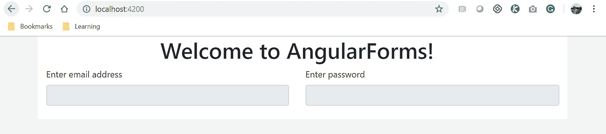

# 表单内的帮助文本

任何优秀的 Web 应用程序都将拥有美观而强大的表单，这些表单可以与用户交流，并创造良好的用户体验。

帮助文本是我们通知用户有关表单中任何错误、警告或必填字段的选项之一，以便用户可以采取必要的行动。

看一下以下代码：

```ts
<form>
 <div class="form-group">
 <label for="userEmailAddress">Enter email address</label>
 <input type="email" class="form-control" id="userEmailAddress">
 <small id="userEmailAddressHelp" class="form-text text-danger">
 Email address cannot be blank.
 Email address should be atleast 3 characters
 </small>
 </div>
 <div class="form-group">
 <label for="userPassword">Enter password</label>
 <input type="password" class="form-control" id="userPassword">
 </div>
</form>
```

在上述代码中，我们在`<small>`标签内添加文本，并分配`.form-text`类和`.text-danger`。

上述代码的输出如下：

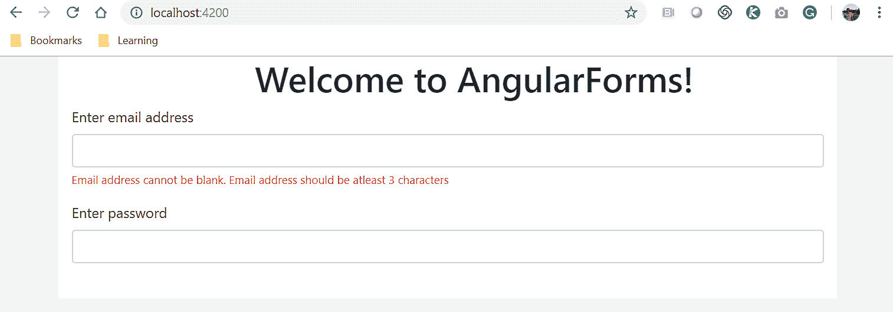

# 将输入元素显示为纯文本

我们可能会遇到这样的要求，我们需要将输入元素显示为纯文本，而不是输入元素。

我们可以通过自定义样式表来简单地实现这一点，或者只需在具有`.form-group`类的元素内使用`.form-control-plaintext`类。

看一下以下代码：

```ts
<form>
 <div class="form-group">
 <label for="userEmailAddress">Enter email address</label>
 <input type="email" class="form-control-plaintext" id="userEmailAddress" 
   placeholder="Enter email address">
 <small id="userEmailAddressHelp" class="form-text text-danger">
 Email address cannot be blank.
 Email address should be atleast 3 characters
 </small>
 </div>
 <div class="form-group">
 <label for="userPassword">Enter password</label>
 <input type="password" class="form-control" id="userPassword">
 </div>
</form>
```

在上述代码中，我们已经将`.form-control-plaintext`类添加到输入元素中。

上述代码的输出如下：

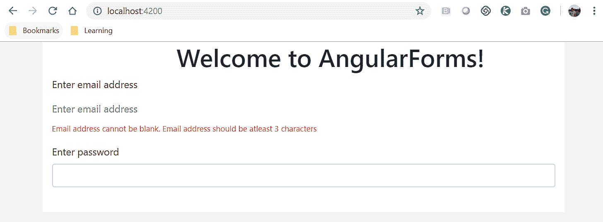

在本节中，我们已经了解了各种类和属性，我们可以使用它们来增强和使我们的表单更具交互性和强大性，最重要的是，为更好的用户设计和体验增添内容。

# Angular 表单

在本节中，Angular 应用程序中的表单真正发挥作用。表单是任何应用程序的核心，也是收集、查看、捕获和处理用户提供的数据的主要构建块。在本节中，我们将继续使用 Bootstrap 库来增强我们表单的设计。

Angular 提供了两种不同的方法来构建应用程序内的表单。

Angular 提供的构建表单的两种方法如下：

+   模板驱动表单：HTML 和数据绑定在模板文件中定义

+   使用模型和验证在`Component`类文件中的响应式或模型驱动表单

尽管表单模型是模板驱动表单和响应式表单之间的共同点，但它们的创建方式不同。

当涉及到模板时，响应式表单和模板驱动表单的主要区别在于数据绑定。在模板驱动表单中，我们使用双向数据绑定将我们的数据模型直接绑定到表单元素。另一方面，使用响应式表单时，我们将我们的数据模型绑定到表单本身（而不是其各个表单元素）。

我们将详细探讨这些方法，了解这些方法的利弊，最后，我们将使用这两种方法构建一些表单。让我们开始吧。

# 模板驱动表单

模板驱动表单，顾名思义，涉及表单的所有繁重工作都在组件模板中进行。这种方法很好，建议在处理简单、直接的表单时使用，而不涉及太多复杂的验证或规则。

所有逻辑都在模板文件中，这基本上意味着我们将利用 HTML 元素和属性。在模板驱动的表单中，我们使用 HTML 来创建表单和输入元素，并将验证规则创建为 HTML 属性。双向数据绑定是关键部分，因此我们可以将表单元素与`Component`类中的属性绑定起来。

Angular 会自动生成表单模型，自动跟踪表单和输入元素的状态供我们使用。我们可以直接将表单作为对象并轻松处理数据。

在使用模板驱动方法时，我们首先导入`FormsModule`，这样我们就可以访问以下指令：

+   `ngForm`

+   `ngModel`

+   `ngModelGroup`

我们需要将`FormsModule`导入到我们的`app.module.ts`文件中。

让我们来看看在我们的应用程序中使用模板驱动表单方法的利弊。

# 模板驱动表单-优点

如果我们应用程序中的表单简单直接，没有太多元数据和验证，模板驱动表单可以非常有用和有帮助。在本节中，我们将强调在我们的应用程序中使用模板驱动表单的优点：

+   模板驱动表单非常容易使用

+   适用于简单和直接的用例

+   易于使用的双向数据绑定，因此代码和复杂性很少

+   Angular 自动跟踪表单和输入元素的状态（如果表单状态不完整，则可以禁用提交按钮）

+   如果表单具有复杂的表单验证或需要自定义表单验证，则不建议使用

# 基于模板的表单 - 缺点

在前一节中，我们已经了解了在应用程序中使用基于模板的表单的优势，并且我们已经就使用基于模板的表单方法的优点进行了充分论证。在本节中，我们将了解在我们的应用程序中使用基于模板的表单的一些缺点：

+   不建议或适用于表单要求复杂且包括自定义表单验证的情况

+   无法完全覆盖单元测试以测试所有用例

# 基于模板的表单 - 重要模块

掌握了使用基于模板的方法的优缺点的知识，我们将立即深入学习如何在我们的应用程序中实现基于模板的表单。我们将首先学习所需的模块，然后逐渐创建我们应用程序中的表单。如前所述，基于模板的表单大多在模板文件中定义。在我们开始创建基于模板的表单示例之前，我们应该了解与表单相关的一些最重要的概念，即`ngForm`和`ngModel`：

+   `ngForm`：这是一个指令，用于在表单指令内部创建控件组

+   `ngModel`：当在`ngForm`内的元素上使用`ngModel`时，所有元素和数据都会在`ngForm`内注册。 

如果 Angular 表单使用`ngForm`和`ngModel`，这意味着该表单是基于模板的。

# 构建我们的登录表单

到目前为止，我们对基于模板的表单有了一个很好的高层次理解。在本节中，我们将把我们的知识付诸实践，通过构建一个表单来实现。让我们使用我们在前一节中学到的类来组合一个表单。

我们将处理的用例是我们应用程序的用户登录表单。首先，我们需要生成我们的登录组件。运行以下`ng`命令以生成登录组件：

```ts
ng g c login
```

前面命令的输出如下所示：

我们需要在`app-routing.module.ts`文件中添加我们的路由路径，以便访问`login`和`register`的路由。

我们正在使用模板驱动方法构建我们的表单，因此我们需要在我们的模板文件中做大部分工作。在开始修改我们的模板文件之前，我们需要将一个必需的模块导入到我们的`app.module.ts`文件中。

打开`app.module.ts`文件并添加以下代码行：

```ts
import {FormsModule} from '@angular/forms';
```

一旦我们将`FormsModule`导入到我们的`app.module.ts`文件中，不要忘记将其添加到`ngModule`内的导入列表中。

更新后的`app.module.ts`文件显示如下：

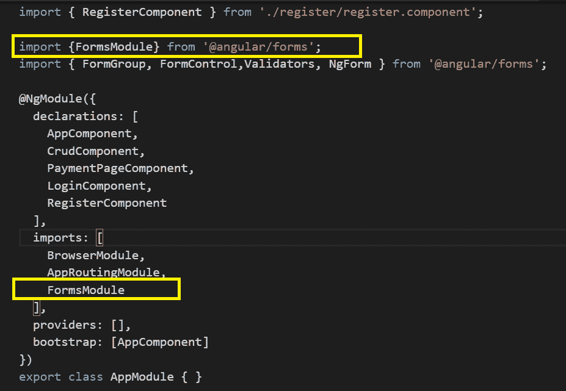

现在，让我们打开我们的登录组件模板文件，并在`login.component.html`文件中创建我们的登录表单。以下是我们将添加到模板文件中的代码：

```ts
<form #loginForm="ngForm" (ngSubmit)="login(loginForm.value)">
 <h3 class="text-center text-primary">Login</h3>
 <div class="form-group">
 <label for="username">Username:</label><br>
 <input type="text" [ngModel]="username" name="username" 
    class="form-control">
 </div>
 <div class="form-group">
 <label for="password">Password:</label><br>
 <input type="password" [ngModel]="password" name="password" 
   class="form-control">
 </div>

<button type="submit" class="btn btn-primary">Sign in</button>

 </form>
```

让我们深入分析上述代码。我们正在使用 HTML 输入元素创建一个表单，并向表单添加用户名、密码和提交按钮。需要注意的重要事项是，对于表单本身，我们告诉模板表单是`ngForm`，`ngForm`将把表单的所有输入元素组合到`#loginForm`模板变量中。对于输入元素，我们添加了`ngModel`属性，并为元素指定了`name`属性。

使用`ngForm`，我们现在可以轻松地检索表单内元素的值。由于我们已经定义了本地`#loginForm`模板变量，我们现在可以轻松地使用它的属性。`loginForm`具有以下属性：

+   `loginForm.value`：返回包含表单内所有输入元素值的对象

+   `loginForm.valid`：根据模板中应用的 HTML 属性验证器返回表单是否有效

+   `loginForm.touched`：根据用户是否触摸/编辑表单返回`true`或`false`

在上述代码中，我们将`loginForm.value`传递给组件。我们可以将任何这些值传递给组件进行处理或验证。请注意，我们还调用了一个`login`方法，我们需要在我们的`Component`类文件中实现它。

现在，让我们在我们的`Component`类中创建一个方法来捕获来自我们的`loginForm`的数据。我们正在收集表单的值并在控制台中显示它：

```ts
import { Component, OnInit } from '@angular/core';
@Component({
 selector: 'app-login',
 templateUrl: './login.component.html',
 styleUrls: ['./login.component.scss']
})
export class LoginComponent {

constructor() { }

login(loginForm) {
 console.log(loginForm);
 console.log(loginForm.controls.username);
}
}
```

使用`ng serve`命令运行应用程序，我们应该看到以下截图中显示的输出：

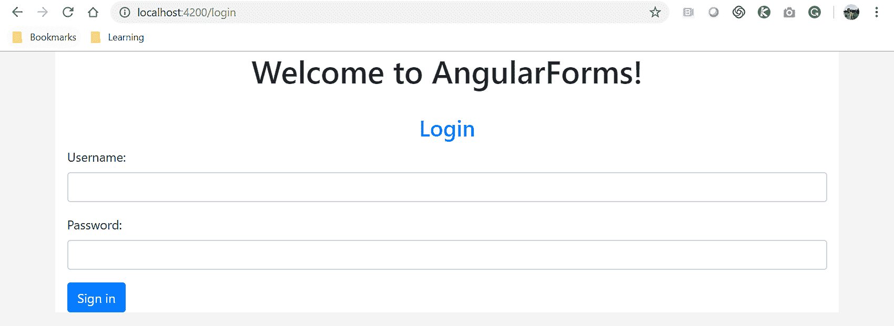

记住，在典型的服务器端脚本中，我们过去常常为表单编写`action`和`method`属性。现在我们不需要再定义这些，因为它们在`Component`类中已经声明和使用了。

这是很好的东西和很好的进展。我们将继续使用前面的登录表单，并很快添加验证。让我们继续深入了解更多信息。

# 基于模型驱动的表单，或者叫做响应式表单

响应式表单也被称为基于模型驱动的表单。在基于模型驱动的表单中，模型是在`Component`类文件中创建的，并负责进行表单验证、处理数据等等。

Angular 在内部构建了 Angular 表单控件的树结构，这样更容易在数据模型和 UI 元素之间推送和管理数据。

我们需要在`Component`类中构建表单模型，通过创建构建块的实例（即`FormControl`和`FormGroup`）来实现。此外，我们还在类中编写验证规则和验证错误消息。我们甚至在类中管理属性（即数据模型），而不是在 HTML 中使用数据绑定。

模板驱动的表单将表单的责任放在模板上，而响应式表单将验证的责任转移到`Component`类上。

在本章中，我们将同时使用这两个术语：基于模型驱动的表单和响应式表单，因为它们都指代同一件事情。

# 基于模型驱动的表单 - 优点

响应式表单在我们的应用程序中创建、验证和应用自定义表单验证非常有用。我们可以轻松地信任基于模型驱动的方法来完成通常与任何复杂表单相关的繁重工作。在本节中，我们将列出并了解在我们的应用程序中使用基于模型驱动的表单的优点：

+   更灵活，适用于更复杂的验证场景和自定义复杂表单验证

+   数据模型是不可变的

+   由于数据模型是不可变的，所以不进行数据绑定

+   使用表单数组动态添加输入元素更容易（例如，在任务表单上添加子任务）

+   使用`HostListener`和`HostBindings`很容易将各种事件绑定到输入元素

+   所有表单控件和验证的代码都在组件内部，这样模板会更简单、更易于维护

+   更容易进行单元测试

# 基于模型驱动的表单 - 缺点

生活中所有美好的事物都有一些缺点。响应式表单也不例外。虽然使用响应式表单的优点和优势肯定可以超过缺点，但学习和理解在应用程序中使用响应式表单的缺点仍然很重要。在本节中，我们将列出在应用程序中使用模型驱动表单的缺点：

+   初学者可能会觉得初始学习曲线太高

+   开发人员应该了解与模型驱动表单一起使用所需的各种模块，比如`ngvalidators`等等

# 模型驱动表单 - 重要模块

我们使用 Angular 提供的两个强大类`formGroup`和`formControl`来创建模型：

+   `FormControl`：跟踪单个表单输入元素的值和状态

+   `FormGroup`：跟踪一组表单控件的值和状态

+   `FormBuilder`：帮助我们使用它们的初始值和验证开发表单

就像我们在模板驱动表单中导入了`FormsModule`一样，我们需要在`app.module.ts`文件中导入`ReactiveFormsModule`。

更新后的`app.module.ts`文件应该如下截图所示：

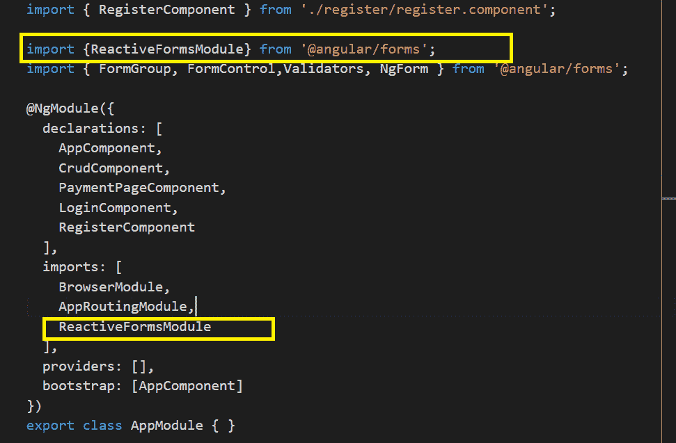

掌握了关于模型驱动表单方法的所有知识，现在是进行实际示例的时候了。

# 响应式表单 - 注册表单示例

在上一节中，我们在讲解模板驱动表单时，为我们的应用程序创建了登录表单。现在是使用响应式表单进行实际练习的时候了。使用不同方法实现登录和注册表单的基本想法是向您展示每种方法的实现差异。没有正确或错误的方法，决定是由应用程序中表单的复杂性和要求驱动的。

在本节中，我们将学习使用模型驱动方法实现我们的新用户注册表单。

首先，我们需要生成我们的`register`组件。运行以下`ng`命令来生成`register`组件：

```ts
ng g c register
```

上述命令的输出如下：

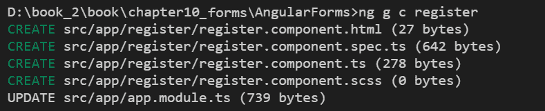

因为我们正在谈论模型驱动表单，所有的辛苦工作都必须在`Component`类中完成。我们仍然需要为我们的响应式表单准备一个模板，但我们不会在模板中添加任何验证或数据绑定。

我们希望我们的注册表单有四个表单元素，即全名、电子邮件地址、密码和条款与条件的字段。

让我们更新`register.component.ts`文件中的`Component`类，并创建一个`formGroup`实例：

```ts
import { Component, OnInit } from '@angular/core';
import { FormGroup, FormControl } from '@angular/forms';

@Component({
  selector: 'app-register',
  templateUrl: './register.component.html',
  styleUrls: ['./register.component.scss']
})
export class RegisterComponent implements OnInit {

registerForm = new FormGroup({
  fullName: new FormControl(),
  emailAddress: new FormControl(''),
  password: new FormControl(''),
  termsConditions: new FormControl('')
 });
 constructor() { }

 ngOnInit() {
 }

 register()
 {
     console.log(this.registerForm.value);
 }

}
```

您会注意到在上面的代码中有很多新东西。让我们慢慢来，一步一步地。我们正在从`angular/core`中导入所需的模块`FormGroup`和`FormControl`。在`Component`类内部，我们正在创建`FormGroup`类的一个实例`registerForm`。您会注意到我们现在正在创建多个`FormControl`实例，每个实例都是我们想要添加到我们的表单中的一个表单元素。

这就是我们需要做的全部吗？目前是的。请记住，如前所述，响应式表单也需要一个基本模板，但所有的逻辑和验证将在组件内部，而不是模板文件中。

现在，让我们更新我们的模板文件。在`register.component.html`文件中，添加以下代码：

```ts
<div>
   <form [formGroup]="registerForm" (ngSubmit)="register()">
 <h3 class="text-center text-primary">New User Registration</h3>
   <div class="form-group">
 <label for="fullName">Your Name</label><br>
   <input type="text" formControlName="fullName" class="form-control">
 </div>
 <div class="form-group">
 <label for="emailAddress">Enter Email Address:</label><br>
   <input type="text" formControlName="emailAddress" class="form-control">
 </div>
 <div class="form-group">
 <label for="password">Password:</label><br>
 <input type="password" formControlName="password" class="form-control">
 </div>
 <div class="form-group">
 <div class="form-check">
 <input class="form-check-input" type="checkbox" 
    formControlName="termsConditions" id="defaultCheck1">
 <label class="form-check-label" for="defaultCheck1">
 I agree to Terms and Conditions
 </label>
 </div>
 </div>
 <button type="submit" class="btn btn-primary">Sign in</button>

 </form>
</div>
```

在上面的代码中，我们正在创建一个动态的响应式表单。在上面的代码中，有许多重要的概念我们需要理解。我们在基于模型的表单中使用`FormGroup`属性。在基于模板的表单中，我们使用`ngForm`。请注意，对于每个表单元素，我们都提到了`FormControlName`属性，而此属性的值必须与在`FormControl`实例声明期间在`Component`类中提到的值完全相同。暂停一下，再读一遍最后几句话。

我们不再需要为元素提及`ngModel`，因为数据绑定已经紧密耦合在`Component`类本身内。我们还附加了一个`ngSubmit`事件，它将调用组件内实现的`register`方法，以在控制台上打印表单值。

太棒了。就是这样。现在使用`ng serve`命令启动您的应用程序，我们应该看到如下截图中显示的输出：

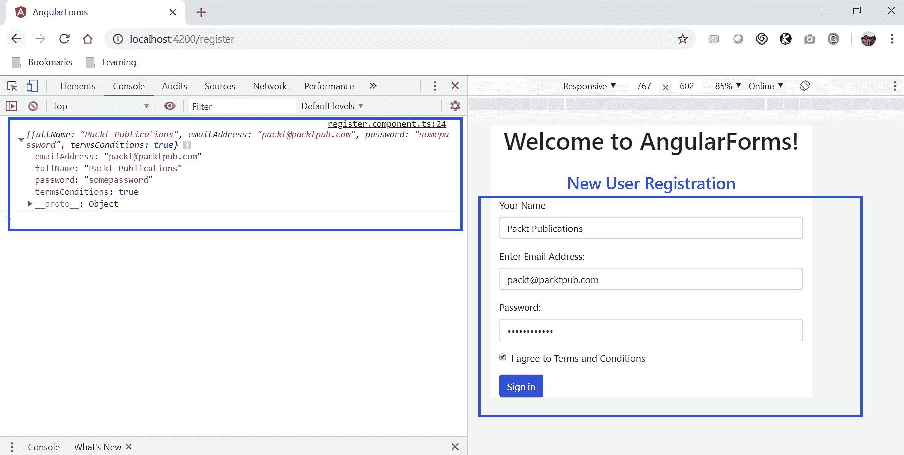

恭喜您使用 Angular 提供的方法成功启动并运行您的表单。我们已经学会了使用基于模板和基于模型的方法构建表单。在接下来的部分，我们将学习通过添加验证和自定义规则来扩展它们。

# Angular 表单验证

到目前为止，我们已经了解到表单对于我们所有的应用程序是多么重要和关键。由于我们将处理来自用户的数据，确保我们接收到的数据是正确和有效的非常重要。

例如，当我们期望用户输入电子邮件地址时，我们不应该允许在电子邮件地址中输入空格或一些特殊字符。再举一个例子，如果我们要求用户输入电话号码，电话号码不应该超过 10 位数（当然不包括国家代码）。

我们可能希望在我们的表单中有许多这样的自定义有效检查点。

在本节中，我们将继续使用登录表单和注册表单，学习如何在模板驱动表单和模型驱动表单中添加验证。

# 模板驱动表单验证

打开我们使用模板驱动方法开发的登录表单。请记住，在模板驱动表单中，验证是在模板本身使用 HTML 属性进行的。

我们可以使用任何 HTML 属性，例如 required、`maxlength`、`minlength`、`size`、`email`、`number`、`length`等，在表单中进行验证。我们还可以利用 HTML 模式属性在我们的表单元素中进行正则表达式检查。

我们可以利用各种类来实现表单验证：

+   `ng-touched`：输入控件已被访问

+   `ng-untouched`：输入控件尚未被访问

+   `ng-dirty`：输入控件数据已更改

+   `ng-pristine`：输入控件数据尚未更改/更新

+   `ng-valid`：输入控件数据是有效的，并使表单有效

+   `ng-invalid`：输入控件数据无效，因此表单无效

在模板驱动的表单中，Angular 会自动跟踪每个输入元素的状态以及表单的状态。因此，我们也可以在我们的 CSS/SCSS 中使用上述类来设计我们的错误通知，例如：

```ts
input.ng-invalid {
 border:2px solid red;
}
```

好了，现在我们已经了解了模板驱动表单中的验证，是时候更新我们的登录表单组件并使其更加时尚。我们将通过向表单元素添加验证来更新`login.component.html`文件。

```ts
<div>
 <form #loginForm="ngForm" (ngSubmit)="login(loginForm.value)">
 <h3 class="text-center text-primary">Login</h3>
  <div class="form-group">
 <label for="username">Username:</label><br>
  <input type="text" ngModel #username="ngModel" name="username" 
      placeholder="Enter username" required class="form-control">
  <span class="text-danger" *ngIf="username.touched && !username.valid"> 
     enter username </span>
 </div>
 <div class="form-group">
 <label for="password">Password:</label><br>
 <input type="password" [ngModel]="password" name="password" 
     required minlength="3" class="form-control">
 </div>
 <button type="submit" class="btn btn-primary" [disabled]="!loginForm.valid">
    Sign in</button>

 </form> 
</div>
```

让我们仔细看一下上面的代码。我们扩展了之前创建的登录表单。请注意，对于用户名表单控件，我们有 HTML 属性`required`，它将设置在表单控件上。如果用户没有为该字段输入任何值并且离开了该字段的焦点，使用`ngIf`条件，我们正在检查用户是否触摸了该字段，并且如果值无效，我们将显示错误消息。对于`password`字段，我们设置了其他 HTML 属性，如`required`和`minlength`验证检查。如果表单控件数据无效，我们不应该启用表单，对吧？这就是我们通过向提交按钮添加`disabled`属性来做的。

现在让我们使用`ng serve`命令运行应用程序，我们应该看到输出，如下面的截图所示：

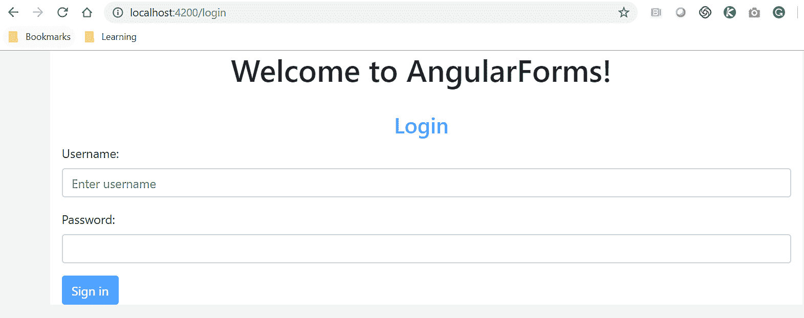

对于您的作业，请尝试在模板驱动表单中尝试这些用例：

+   为用户名表单元素添加最小和最大长度

+   添加一个新的表单元素，并添加验证，它应该是电子邮件格式

# 响应式表单或模型驱动表单验证

到目前为止，我们实现的所有验证都只是在模板文件中使用基本的 HTML 属性。在本节中，我们将学习如何在组件中使用模型驱动表单实现验证。

在之前的章节中，我们已经学会了在我们的`Component`类中使用`formControl`和`formGroup`类创建表单。我们将继续使用相同的注册表单来扩展和实现验证。

我们通过在`register.component.ts`文件中添加验证来为我们的组件添加验证代码。看一下我们将在文件中添加的代码：

```ts
import { Component, OnInit } from '@angular/core';
import { FormGroup, Validators, FormControl } from '@angular/forms';

 @Component({
  selector: 'app-register',
  templateUrl: './register.component.html',
  styleUrls: ['./register.component.scss']
})
export class RegisterComponent implements OnInit {
 registerForm = new FormGroup({ 
   fullName: new FormControl('',[Validators.required, 
   Validators.maxLength(15)]), emailAddress: 
   new FormControl('',[Validators.pattern('[a-zA-Z]*')]),
   password: new FormControl('',[Validators.required]),
   termsConditions: new FormControl('',[Validators.required])
 });

 constructor() { }

 ngOnInit() {
 }

 register()
 {
   console.log(this.registerForm.value);
 }
}
```

在上述代码中，您会注意到我们已经将所需的模块`FormGroup`、`FormControl`和`Validators`导入到我们的`Component`类中。我们已经导入并使用了`FormGroup`和`FormControl`。`Validators`模块是我们现在导入的唯一额外模块。我们将验证器作为选项传递给`FormControl`。对于`fullname`，我们将验证器添加为`required`和`maxLength`。请注意，我们可以为每个`FormControl`传递多个验证器。同样，对于电子邮件地址表单控件，我们正在传递一个验证器模式，其中包含正则表达式检查。我们已经在我们的组件中进行了所有必要的更改和验证。

现在是时候更新我们的模板`register.component.html`文件了：

```ts
<div>
   <form [formGroup]="registerForm" (ngSubmit)="register()">
<h3 class="text-center text-primary">New User Registration</h3>
   <div class="form-group">
<label for="fullName">Your Name</label><br>
<input type="text" formControlName="fullName" class="form-control">
</div>
<div class="form-group">
<label for="emailAddress">Enter Email Address:</label><br>
   <input type="text" formControlName="emailAddress" class="form-control">
</div>
<div class="form-group">
<label for="password">Password:</label><br>
<input type="password" formControlName="password" class="form-control">
</div>
<div class="form-group">
<div class="form-check">
<input class="form-check-input" type="checkbox" formControlName="termsConditions" id="defaultCheck1">
<label class="form-check-label" for="defaultCheck1">
I agree to Terms and Conditions
</label>
</div>
</div>
<button type="submit" class="btn btn-primary" [disabled]="!registerForm.valid">Sign in</button>

</form>
</div>
```

HTML 模板与我们之前为我们的基于模型的表单创建的模板相同。我们为表单添加了一些功能。请注意，我们在提交按钮上添加了`disabled`属性，如果任何表单元素为空或无效，它将禁用表单。

看，我告诉过你，我们的模板文件只是一个占位符，几乎所有的操作都发生在我们的`Component`类中。

现在，让我们使用`ng serve`命令来启动应用程序，我们应该看到输出，就像下面的截图中显示的那样：

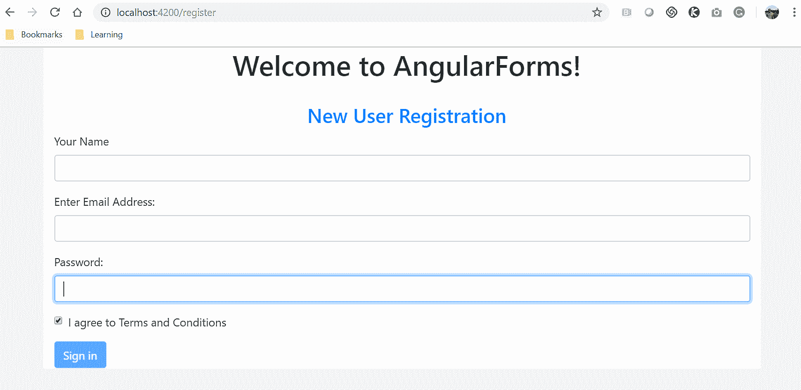

如果你看到了前面的截图，就跳到你的桌子上。因为我们现在已经学会并实现了使用模板驱动和基于模型的方法来创建表单。

如果你在整个章节中注意到了我们涵盖的示例，你也会注意到我们创建了处理表单数据的方法。

在下一节中，我们将专门关注这一点，并学习一些处理表单数据的最佳实践。

# 提交表单数据

到目前为止，我们已经学会了在我们的应用程序中设计和开发我们的表单。在本节中，我们将把事情带到下游系统，即捕获数据并处理数据。

Angular 在这两种方法中都生成了一个表单模型，无论是模板驱动表单还是响应式表单。表单模型保存了表单元素的数据和状态。

在之前的章节中，我们已经创建了一个方法来调用`ngSubmit`。

对于我们的模板驱动登录表单，我们在`login.component.ts`文件中添加了以下代码：

```ts
login(loginForm)
{
  console.log(loginForm);
  console.log(loginForm.username);
}
```

我们将整个表单对象传递给登录方法。现在`loginForm`对象将包含表单控件的所有细节，以及状态。

在我们的注册表单中，我们使用了基于模型驱动的方法生成的实例`formGroup`，这个实例是在我们的`Component`类`register.component.ts`文件中创建的。

以下是我们添加的用于捕获和处理数据的代码：

```ts
register()
 {
   console.log(this.registerForm.value);
 }
```

如果你注意到，对于响应式表单，我们不需要传递任何表单数据，因为我们已经创建了`FormGroup`的`registerForm`实例，所以它可以在我们的类中使用`this`运算符来访问。

一旦我们捕获了用户提供的数据，根据应用程序的要求，我们现在可以在组件内部实现我们的自定义逻辑。

一旦我们捕获数据，我们进行的一些常见活动如下：

+   保护数据，以确保我们不允许垃圾数据进入我们的系统。

+   处理/增强数据，例如将密码转换为加密值。

+   检查是否有任何自动化机器人处理我们的应用程序。

+   使用 Angular 服务向后端服务发出 HTTP 调用。我们有一个专门讨论这个特定主题的章节：第十二章，*集成后端数据服务*。

这就结束了关于 Angular 表单的章节。我们涵盖了很多内容，我相信此时您一定会很兴奋地创建自己的表单，编写自定义验证并处理捕获的数据。

# 总结

表单是任何良好应用程序的核心和灵魂。我们首先学习了 Bootstrap 库提供的出色类和实用工具。我们详细探讨了`form-group`和`form-control`类。我们学习并实现了各种辅助和附加属性，以使我们的表单看起来和行为更好。

我们通过学习 Angular 提供的两种方法，即基于模板的表单和基于模型的表单，深入研究了 Angular 表单。

我们详细了解了每种方法的优缺点，并使用每种方法创建了我们的登录和注册表单。我们还探讨了我们在基于模板的表单和响应式表单中使用的各种类型的验证。

最后，但同样重要的是，我们学习了如何处理我们从表单接收到的表单数据。现在是时候展翅飞翔，创建您自己的精彩表单了。

在开发具有多个开发人员的复杂应用程序时，情况可能会失控。幸运的是，Angular 支持依赖注入和服务，这使我们能够创建可重用的服务并定义接口类。我们可以定义新的数据类型，并确保所有团队成员在不破坏彼此功能的情况下推送代码。我们将如何实现这一点？这将在下一章中介绍。继续阅读！
