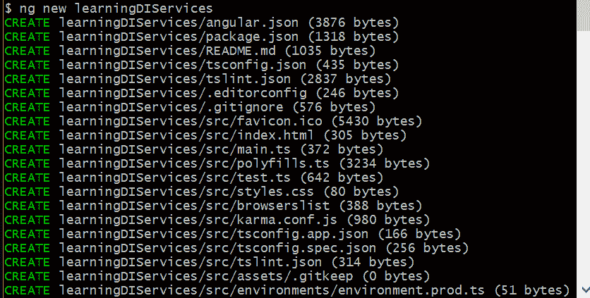
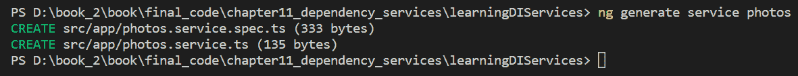
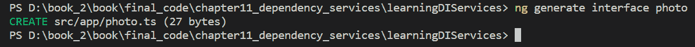

# 第十一章：依赖注入和服务

在本章中，我们将研究**依赖注入**（**DI**）。虽然 DI 不是您必须直接在 Angular 中编程的东西（因为 Angular 会为我们处理所有 DI 管道），但了解它仍然非常有用。这是因为 Angular 在管理其服务时大量使用 DI，以及您在创建 Angular 应用程序时可能编写的任何自定义服务。

在下一章中，我们将研究 Angular 最重要的内置服务之一，即其 HTTP 服务，第十二章，*集成后端数据服务*。没有 HTTP 服务，我们的应用程序将非常无聊，因为它们将无法向外部来源（包括我们自己的后端 API）发送数据或接收数据。因此，本章将有助于我们更好地理解 Angular 如何将诸如其 HTTP 服务之类的服务注入到我们的应用程序中供我们使用。此外，这个主题是进入下一章的完美过渡。

以下是本章将涵盖的主题列表：

+   什么是 DI？

+   它解决了什么问题？

+   使用 DI 的额外优势

+   揭示 Angular 用于使一切正常运行的魔法

+   我们如何防范代码最小化（以及为什么我们需要这样做）

在本章结束时，您将对这种经常被误解的软件设计模式有扎实的理解，更重要的是，它是如何工作的。我敢说，您甚至可能开始感觉比大多数同行更具技术先进性。许多开发人员有时甚至难以定义 DI——因为需要一些努力来理解它。

话不多说，让我们开始吧，通过*注入*更多软件设计知识来发现 DI 的全部内容。

# 什么是 DI？

不废话，DI 是**控制反转**（**IoC**）设计模式的一个特定案例。

为了理解 DI 的高级定义，甚至是 IoC，我们首先需要快速定义设计模式。设计模式是软件设计中常见问题的可重用解决方案。有数十种软件设计模式，它们通常被分类为以下三个高级类别：

+   创建模式

+   结构模式

+   行为模式

在我们的情况下，为了简洁起见，我们可以安全地忽略创建和结构类别的设计模式，因为 DI 是一种行为设计模式。在我们了解 IoC 设计模式之前，让我们先描述一下行为设计模式是什么。

简而言之，行为设计模式关注对象之间的通信方式。其中一种模式被称为观察者设计模式，它基本上规定了对象如何通知其依赖对象其状态何时发生变化。

另一个行为设计模式被称为发布-订阅设计模式，这是一种类似观察者模式但更加复杂的消息模式。另一个行为设计模式是模板方法。这种设计模式的目的是将算法的具体实现推迟到子类中。所有这些设计模式的总体思想都是它们之间的通信方式（即消息）。

拥有了模板方法的定义，我们离理解 DI 的本质更近了一步，但在我们开始之前，还有一个设计模式需要定义。你猜对了——IoC 设计模式。记住，DI 是 IoC 模式的一个特例，所以我们确实需要快速了解一下它是什么。

IoC 颠覆了典型的过程式或命令式代码流程。它不是由自定义对象的代码控制程序流程，而是将实例化的过程推迟到一个框架来完成。这一切马上就会变得清晰起来。有趣的是，有时候这被戏称为“不要打电话给我们，我们会打电话给你”。

我们很快将看一个例子，以便一切都说得通。然而，我需要定义一下我所说的框架实例化依赖对象的意思。你难道不喜欢我们需要了解的所有术语和概念吗？（笑）这个框架通常被称为 IoC 容器。这些容器足够智能，能够检查自定义代码，找出它依赖的其他对象，实例化这些对象，并将它们传递到自定义对象的构造函数中。这与传统方式相反，传统方式是在自定义对象本身内部实例化对象的依赖项。相反，IoC 容器为其执行这些职责。一会儿，我将把这与 Angular 联系起来，并给出 IoC 模式提供的一些非常重要的优势，但我们将从 DI 的角度来讨论——最后！

好的。让我们试着把这一切联系起来，并提供一个示例场景或用例。Angular 框架提供了 IoC 容器的功能——除了提供的所有其他功能之外。由于 Angular 是一个模块化框架，并且封装了大部分功能在分离的服务中，因此它的 IoC 功能也被封装在其中一个服务中——事实上，就是这种情况。

Angular 负责 DI 的服务是其注入器服务，恰如其名，因为它在实例化后将你的自定义类的依赖项注入到你的类构造函数中。不仅如此，它还为你调用自定义方法，回到我之前提到的，*别打电话给我们，我们会打电话给你*。我们所需要做的就是在自定义类的构造函数签名中列出依赖项的名称。

从现在开始，我不会再提 IoC，因为我们正在谈论 DI——再次强调，这在技术上不是 IoC，而是它的一个特例。我之所以提到这一点，是因为许多开发人员将 IoC 和 DI 视为同义词。

那么，让我们问几个问题：由于 DI 是一种设计模式，设计模式解决常见的软件设计问题，DI 解决了什么问题？DI 的优势是什么？这些都是很好的问题，我相信我可以在接下来的两段话中一举解答。

即使是面向对象的代码也存在一个很长时间的问题，那就是一个依赖其他类的类（这也是面向对象的重点——因为我们不希望一个类来完成所有的工作）在自身内部包含了实例化这些依赖关系的代码，并且结果是至少部分逻辑也与之交织在一起。这被称为紧密耦合的代码。紧密耦合的代码有两个问题：首先，实现逻辑通常封装在类内部——这是我们不想要的。我们不希望一个对象了解其他对象的内部工作。例如——如果我们想要更改依赖类中算法的实现，我们很可能也必须更改调用它的类中的代码。由此产生的另一个问题是，这种代码很难测试。我们的类耦合得越紧，对它们进行单元测试就越困难——这个问题已经存在了很长时间。

好的。那么 DI 是如何解决这些问题的呢？我们将会通过一个具体的用例来让我们更清楚地理解一切，但首先让我们描述一下 DI 给我们带来的一些优势。DI 原则的第一个优势是它强制我们编写解耦的代码。我们通过让我们依赖的类（用于其抽象实现）实现接口来实现这一点，我们这样做是因为我们调用的类只需要调用这些对象上的接口方法，而不关心底层类方法的实现细节。当我们以这种方式编写代码时，我们可以替换我们依赖的具有特定实现的类，用另一个具有另一种实现的类，而不需要更改我们的任何调用代码（因为我们的代码调用这些类实现的接口方法）。这有时也被称为按接口编码。还有一点有趣的是：这种技术也被用于一种称为面向方面编程（AOP）的编程风格中。

遵循 DI 设计原则所获得的一个非常有用的东西是，我们可以非常容易地测试我们的代码——与无法轻松测试我们的代码，或者根本无法测试我们的代码相比。我们如何做到这一点呢？通过编写存根和/或模拟类——这些类也实现了我们调用的这些相同的接口。

顺便说一句，存根和模拟之间有一个重要的区别。存根是愚蠢的类，通常只返回一个简单的值（通常是硬编码的）。另一方面，模拟对象通常具有完整的实现，以便测试边缘情况，以及进行数据库操作或进行 RESTful API 调用。模拟可以用来做任何你的测试需要的事情。所以，存根是愚蠢的，而模拟是聪明的。然而，它们的共同之处在于，它们通过具有相同的对象消息模式（也就是，它们的方法是通过接口调用的）来帮助我们对调用类的代码进行单元测试。

呼！我们完成了理论部分！你是不是已经睡着了，还是还在听我说话？啊，你醒着了——好的。现在所有的理论都已经讲完了，让我们来看一个使用 DI 的示例用例，以便我们可以将这些概念牢固地铭刻在我们的脑海中。

假设我们正在为一个在线商店构建一个电子商务应用程序，我们在这里出售我们自制的啤酒。我们的应用程序将需要一个购物车，我们还必须至少有一个商户账户（这是一个通道，被称为支付处理网关，这样我们就可以向我们的客户收取信用卡费用）。在这个假设的情景中，我们有两个商户账户——也许是因为我们想保留一个备用账户，以防主要的商户账户增加他们的折扣率（也就是费用），从而降低我们的利润——但重点是，我们有两个商户账户。

在实现购物车时，我们希望能够在不更改购物车类中的代码的情况下，将一个商家账户替换为另一个商家账户，如果需要的话。我们不希望更改任何代码的原因是，我们可能会在我们的应用程序（在线商店）中意外引入错误，这对顾客来说并不好看。你可能会说——*嘿，我测试我的代码——所以错误都被找出来了*——如果你这样说，那么你正好掉入了使用 DI 为我们的应用程序带来的下一个好处，那就是我们可以通过编写测试类轻松测试我们的应用程序——还记得我们的存根和模拟吗？是的——我们编写存根和模拟，这样我们就可以测试我们的代码。再次感谢 DI，我们不必更改我们的购物车类来实现这一点。我们的存根和模拟实现接口。我们会将银行的 API（即，由第三方编写的商家账户类）封装在一个实现我们接口的自定义类中，这样所有这些类（即我们的存根、模拟和封装的真实银行对象）都可以以完全相同的方式被调用。

很好。所以，作为一个额外的奖励，让我们快速看一下 Angular 如何知道我们的类需要什么，以及它如何为我们调用我们类的构造函数方法。嗯，这并不是魔术，但确实很巧妙。然而，Angular 确实需要我们的一点点前期帮助。当我们为我们的应用程序创建自定义类时，通常会将它们封装为 Angular 服务（我们将在下一章第十二章中看到服务，*集成后端数据服务*）。Angular 要求我们在其中注册这些服务，并且您将看到为什么我们需要在一会儿这样做。

Angular 的注入器服务扫描我们的代码，具体来说，扫描我们类的构造函数签名，并找出其参数。因为我们的参数是我们类需要的服务，它知道这些参数是服务。然后，它将服务名称的文本与自己的服务清单以及我们自己编写的任何自定义服务进行匹配，当找到匹配时，它实例化该服务对象。它之所以能够做到这一点，是因为它知道自己的服务，也知道我们编写的服务，因为我们必须在 Angular 中注册它们。

一旦 Angular 实例化了这些服务对象，下一步就是调用我们类的构造函数，并将对象作为参数传递进去。这就是 Angular 的注入器服务所做的注入过程。再说一遍：*不要打电话给我们，我们会打电话给你*。就像这样，Angular 背后的魔法已经被解释清楚了。不过，这仍然非常酷，我们应该向 Angular 开发团队致敬。

# 生成服务和接口

现在我们已经了解了 DI 和设计模式，在本节中，我们将学习如何创建我们的服务。Angular CLI 为我们提供了在项目内部生成服务的最快最简单的方法。我们将通过运行以下命令创建一个名为`LearningDIServices`的示例项目：

```ts
ng new LearningDIServices
```

我们使用`ng`命令创建一个新的 Angular 项目，并将项目命名为`LearningDIServices`。成功执行命令后，我们应该看到以下截图中显示的输出：



现在我们已经创建了项目目录，使用 Angular CLI，我们将生成一些服务和接口。我们将创建一个名为`Photos`的服务。运行以下命令，我们应该看到服务已添加到我们的项目目录中：

```ts
ng generate service photos
```

成功执行后，我们应该看到以下截图中显示的输出：



我们可以看到生成了两个新文件。一个是服务文件，另一个是用于编写服务测试的规范文件。让我们仔细看看包含自动生成代码的`photo.service.ts`文件：

```ts
import { Injectable } from  '@angular/core'; @Injectable({
 providedIn: 'root' })

export  class PhotosService { constructor() { } }
```

在前面的代码中，我们可以看到`Injectable`类需要从`angular/core`库中导入。`Injectable`类允许我们将服务注入到各种组件类中，以便我们可以重用方法。使用可注入的装饰器，我们明确指出服务需要在根中注入。最后，我们导出我们的`PhotosService`类，其中将包含我们将为我们的应用程序创建的构造方法和其他方法。

与 Angular 组件不同，无需更新`app.module.ts`文件以添加服务的条目。

在之前的章节中，我们学习了接口的概述。现在，让我们快速学习如何在我们的应用程序中使用接口。使用 Angular CLI，我们也可以快速创建接口：

```ts
ng generate interface photo
```

在上面的命令中，我们生成了一个名为`photo`的接口，一旦上面的命令成功执行，我们应该看到以下输出：



让我们仔细看看生成的接口文件。以下是默认生成的代码：

```ts
export  interface Photo { }
```

我们可以看到它是故意留空的。由于接口用于定义实体或模型类，应用程序中创建的每个接口都将是独特的，并且特定于每个应用程序。现在，如果我们想为我们的照片创建一个接口，我们将不得不定义如下：

```ts
export interface Photo {
 photoId: number;
 photoURL: string;
 photoOwner: string;
 isActive: boolean;
}
```

在上面的示例代码中，我们为照片创建了一个带有一些属性和它们的数据类型的接口。这将允许我们为照片创建严格类型的对象。

在本节中，我们学习了如何创建 Angular 服务和接口。即使一些概念不是很清楚，不要担心，我的朋友。我们有一个完整的章节专门向您展示如何在我们的应用程序中生成和实现服务。在下一章中，我们将学习如何实现和使用它们，并将它们集成到我们的组件中。

# 防止代码最小化

有一件我想很快覆盖的最后一件事，那就是代码缩小以及我们如何防范它。代码缩小是通过去除空格以及用非常短的符号替换变量名来压缩我们的代码的过程。这是在我们编译 Angular 应用程序时完成的，这样它就成为了一个更小的包，我们的用户必须下载（一旦我们部署了我们的应用程序）来检索我们的应用程序。但这对我们来说确实存在问题。它可能会通过更改参数名称来破坏我们的一天，然后 Angular 就无法再将名称与服务清单匹配。幸运的是，有一个简单的解决方案。如果我们在参数名称周围添加单引号，我们就可以保护我们的代码免受代码缩小的影响。怎么做呢？好吧，在服务名称周围加上引号会将它们转换为文字字符串，而缩小过程不会压缩或更改字符串——它们会保持原样。这是因为文字字符串在语法之外有意义，不是代码。缩小只是缩小代码（即变量和函数名称以及空格）。这就是你需要知道的关于保护你的代码免受代码缩小的影响的一切。

# 总结

现在你应该对 DI 是什么以及它解决了什么问题感到满意。你也应该能够列举一些优势，从而能够解释为什么 DI 是我们在设计应用程序时要遵循的一个好原则。你还应该能够轻松地解释 Angular 在使一切都能开箱即用方面表现出的看似神奇的技能。最后，你现在也应该知道如何保护你的 DI 代码免受代码缩小的影响。

掌握了这些 DI 知识，我们现在可以继续我们的旅程，探索 Angular 最有用的服务之一，即它的 HTTP 服务，在第十二章中，*集成后端数据服务*。一旦你完成了下一章，你就可以准备编写代码，将你的 Angular 应用程序与几乎任何符合 RESTful API 标准的应用程序和/或服务集成，只要你的应用程序被授权与之通信。这对你来说应该是令人兴奋的！如果是的话，翻页并继续你的 Angular 启蒙之旅。
