# 第十二章：集成后端数据服务

欢迎来到第十二章！这绝对是我最喜欢的一章，因为我们将为我们的应用构建许多端到端的用例。

一个温和的警告——这一章内容密集——充满了大量的信息。你可能需要以较慢的速度阅读，并花更多时间在键盘上，比你在以前的章节中花的时间更多，但我必须说，这是非常值得的努力。

这是一个很好的方式来看待本书的整体进展：

+   到目前为止，我们所看到的一切，包括最近的两章（第十章，*使用表单*，和第十一章，*依赖注入和服务*），都为这一章奠定了基础。有了这些知识，我们现在准备好把它们整合起来，以创建我们的应用。因此，从本质上讲，这一章也是为了回顾我们在以前章节中涵盖的许多主题。

+   这一章对我们来说是一个关键的转折点，因为我们将把迄今为止学到的一切都用在这一章中构建我们应用的 95%。这是一个章节中的大量材料，但我们已经花了很多时间来讨论我们需要构建应用的所有 Angular 方面，所以我们将轻松地完成它。还有一些新的和略微离题的材料——学习如何构建后端 API——这比 Angular 材料更不重要。然而，我们需要有一个 API，所以我选择了一套简单的技术，可以快速上手。我们还要讨论这个问题，以帮助你了解我们将用来构建 API 的技术。

+   在接下来的章节中，我们将为我们的应用添加一些东西（如路由守卫和自定义表单验证），并学习如何测试、调试、保护和部署我们的应用。

因此，从这个角度来看，我们已经准备好了。本章中的许多部分都是我认为重要学习的额外材料，因为我希望你不仅作为一个 Angular 开发者成功，而且作为一个网页开发者成功。这将帮助你提高你的技能，实际示例肯定会增加你作为网页开发者的技术知识。

我们将涵盖以下主题：

+   ListingApp - 概述

+   Angular 应用的基本概念

+   ListingApp - 技术要求

+   为我们的应用构建 APIs

+   Google Firestore 数据库

+   Angular HttpClient

+   集成后端服务

在这本书中，我们花了很多时间讨论了许多事情 - 主要是与 Angular 相关的（如组件、路由、flex-layout、NG Bootstrap、Angular Material 和处理表单），还有一些独立的事情（如线框、ES6、TypeScript 和 Bootstrap）。当然，拥有所有这些知识是很重要的，但我们还没有集成实时数据来使我们的 Angular 应用程序生动起来。然而，正如你从前面的项目列表中所看到的，这将发生改变。这就是 Angular 开发开始变得有趣的地方，也更加实用，因为一个不创建和使用数据的应用程序根本就不是一个应用程序。

好的。让我们立即开始学习构建任何应用程序基础的一些基本概念。然后，我们将看一下构建我们的 ListingApp 所涉及的步骤。

# ListingApp - 概述

在本章中，我们将构建我们的`ListingApp`应用程序。在本节中，我们将介绍功能需求列表。我们的整体应用程序计划可以分为三个主要部分：

+   **UI 层**：UI 方面涉及设计或构建表单、显示数据、路由和验证。

+   **服务或中间件层**：我们将学习如何编写共享服务，这些服务将负责与 API 和数据库进行后端集成。

+   **数据库或虚拟 API 设置**：我们将学习如何使用 JSON Server 设置虚拟 API，并学习如何使用 Firestore 创建我们的 NoSQL 数据库。

这是我们将在本章学习过程中构建的功能用例的完整列表：

+   显示所有列表

+   按 ID 查看列表

+   添加新的列表

+   编辑列表

+   删除列表

+   添加评论

+   更新评论

+   删除评论

+   编辑评论

列出的所有用例都需要我们实现 HTTP 调用。对于一些用例，我们需要进行 POST、GET 和 PUT HTTP 调用。

在我们进一步进行之前，现在是一个很好的时机，回顾我们在整本书中实施的所有学习和功能。我们需要回想一下我们如何设计和开发我们的表单，如何捕获表单数据，如何在组件模板中显示数据，如何使用参数实现路由，以及如何在组件内调用服务中实现的方法。

我们有很多工作要做，还有很多乐趣在等着我们，所以让我们开始吧！

# Angular 应用程序的基本概念

在本章中，我们将学习和构建许多有趣的东西，但在开始之前，我们应该了解一些基本概念，包括强类型语言概念、Angular 模型、可观察对象、NoSQL 数据库和一般的 CRUD 操作。

# 强类型语言

强类型编程语言指的是每种数据类型都是预定义的，并且与变量紧密耦合。看看下面定义的变量：

```ts
int age = 10;
```

我们声明了一个变量，并明确指出变量的类型是整数，这使得很明显变量除了整数之外不能容纳任何其他数据类型。如果我们尝试提供任何不是整数的值，TypeScript 会抛出错误。TypeScript 也是一种强类型语言，因为我们在 TypeScript 中编写我们的 Angular 应用程序，我们可以得出结论，Angular 应用程序遵循强类型格式。

# Typescript 接口

在本节中，我们将学习如何在 TypeScript 中创建我们自己的数据类型，这些类型可以在我们的 Angular 应用程序中使用。

Angular 模型是一种通过将多个数据类型组合成一个对象并定义一个新对象来创建复杂数据结构的方法，然后可以将其作为数据类型本身使用。这是 Angular 确保复杂数据对象遵守某些预定义数据规范的方式。

TypeScript 语言提供了接口，也具有相同的作用。我们还可以利用 ES6 类来定义我们的数据结构。我们可以扩展编程语法来创建我们自定义的数据类型。让我们通过创建一个示例模型来演示这一点。我们将创建一个名为`Listing`的模型，它将具有以下属性：

```ts
export class Listing {
 id: number;
 userId: number;
 title: string;
 status: string;
 price: number;
 active: boolean;
}
```

我们已经创建了一个 Angular 模型，这是一个具有属性的类，例如`id`、`userId`、`title`、`status`、`price`和`active`。现在我们可以在我们的应用程序中使用这个模型作为数据类型。我们可以将这个类导入到所有的组件和服务中，以确保我们的数据映射符合`Listing`数据规范。

在本章中，我们将在构建应用程序时使用先前定义的模型。

# 可观察对象

大多数传统应用程序都是基于请求和响应的架构运行的，这意味着我们的应用程序客户端会向服务器发出数据请求，而服务器会返回响应。在服务器返回响应的同时，我们的应用程序会进入等待模式，直到接收到所有响应，这显然会使应用程序变慢。

这种架构有多个缺点。首先，应用程序等待响应，这会导致应用程序延迟。其次，我们无法处理在一段时间内传入的多个数据。第三，由于我们的应用程序等待直到获得响应，这使得同步调用，我们无法执行异步编程。最后，事件处理对开发人员来说是一场噩梦。那么，我们如何解决上述问题？答案是使用可观察对象。

可观察对象是一种在一段时间内异步返回数据的数组类型。Angular 使用一个名为**Reactive Extensions** (**RxJS**)的第三方库，在框架内部实现了可观察对象，主要用于事件处理、树摇动等。我们还可以轻松导入、创建和订阅自定义可观察对象。

# NoSQL 数据库概念

在本节中，我们将学习有关 NoSQL 数据库的知识。真的吗？NoSQL？我们不打算使用数据库来存储我们的关键数据吗？当然我们会使用数据库来存储我们的数据；但是，它不会是传统的关系型数据库，它具有严格的预定义模式和具有标准数据类型的列。使用 NoSQL 数据库，一切都是面向文档的，我们可以在一个地方存储数据，而不必担心数据类型。NoSQL 数据库保存文档集合。

我们仍然可以执行以下数据库活动：

+   创建文档

+   插入文档

+   编辑现有文档

+   删除文档

我们还可以执行许多高级功能，如索引和身份验证。有许多开源和商业解决方案提供 NoSQL 数据库。以下是一些 NoSQL 数据库提供商的快速列表：

+   MongoDB

+   Redis

+   RavenDB

+   Firestore

+   MemcacheDB

在本章开发我们的应用程序过程中，我们将实现 Firestore 作为我们的后端系统。在下一节中，我们将了解一些涉及这些数据库的重要任务。

# CRUD 操作-概述

每当我们考虑将数据库作为应用程序的后端存储系统时，主要目标是能够添加、检索、搜索或修改数据，这更常被称为 CRUD 操作。

CRUD 代表计算机编程中的创建、读取、更新和删除，这些术语如下所述：

+   **创建**：在数据库中创建或添加新数据。我们通常会在数据库中运行 INSERT 查询。这与 HTTP POST 方法相关联。

+   **读取**：根据过滤器或搜索条件读取或检索数据。我们将在数据库中运行 SELECT 查询来执行此操作。这与 HTTP GET 方法相关联。

+   **更新**：更新或编辑数据库中的现有记录。我们将在数据库中使用 UPDATE 查询。这与 HTTP PUT 方法相关联。

+   **删除**：删除数据库中的现有记录。我们可以使用 DELETE 查询来删除记录，或者只是使用 UPDATE 查询设置一个指示记录已被删除的列。这与 DELETE 方法相关联。

在接下来的章节中，我们将使用这些概念来构建我们的`ListingApp`功能和我们应用程序的技术要求。

# ListingApp - 技术要求

任何良好的动态应用程序都需要我们处理 API，并且我们需要将数据存储在数据库中。本节涵盖了构建任何动态应用程序所需的两个非常重要的技术方面 - JSON API 和动态数据库。我们将使用 JSON 服务器，而对于数据库，我们将使用 Google 的 Firestore 数据库。

# 为 ListingApp 构建 API

在任何项目的开发周期中，作为前端开发人员，我们将需要处理 API 并将其集成到我们的应用程序中。我们需要定义并就我们期望从 API 中得到的 JSON 合同达成一致。在本节中，我们将了解我们在后端开发人员仍在开发实际 API 时可以使用的各种生成 API 的选项。当我们有虚假 API 可用时，开发人员可以独立工作。

有各种各样的工具和库（可免费使用），我们可以用来处理虚假 API。我们将使用 JSON 服务器库来提供我们的 API。所以，让我们从以下步骤开始：

1.  要安装`json-server`库，请在命令行界面中运行以下命令：

```ts
 npm i json-server --save
```

当命令成功运行时，您应该看到以下输出：

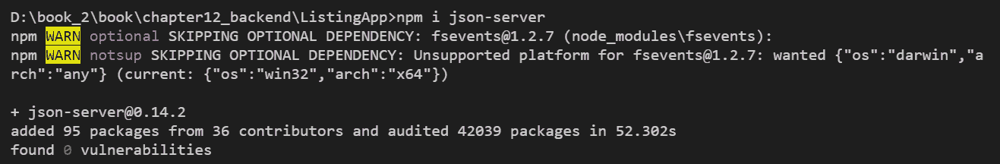

1.  现在我们已经安装了`json-server`库，是时候创建我们的 API 和 JSON 结构了。在我们的项目目录中，我们将创建一个名为 APIs 的新文件夹，并创建一个名为`data.json`的新文件，其中将保存我们的 JSON 数据。创建文件夹和文件后，查看文件夹结构：

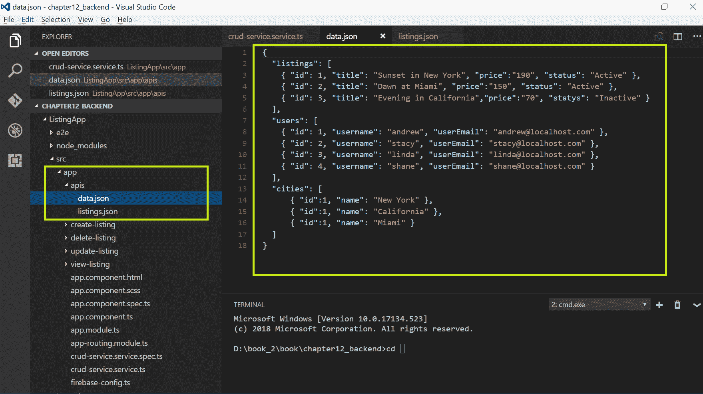

1.  由于我们创建了两个 JSON 文件，现在是时候向文件添加一些列表和用户的 JSON 数据了。通过向`listings.json`文件添加以下数据来打开`listings.json`文件：

```ts
      {
        "listings": [
          { "id": 1, "title": "Sunset in New York", "price":"190", 
             "status": "Active" },
          { "id": 2, "title": "Dawn at Miami", "price":"150", 
              "status": "Active" },
          { "id": 3, "title": "Evening in California","price":"70", 
             "status": "Inactive" }
        ],
        "users": [
          { "id": 1, "username": "andrew", 
            "userEmail": "andrew@localhost.com" },
          { "id": 2, "username": "stacy", 
            "userEmail": "stacy@localhost.com" },
          { "id": 3, "username": "linda", 
            "userEmail": "linda@localhost.com" },
          { "id": 4, "username": "shane", 
            "userEmail": "shane@localhost.com" }
        ],
        "cities": [ 
            { "id":1, "name": "New York" },
            { "id":1, "name": "California" },
            { "id":1, "name": "Miami" }
        ]
       }
```

我们正在为列表、用户和城市创建 JSON 数组的虚拟数据。从技术上讲，在实际应用场景中，这些数据将在运行时从数据库中检索。

1.  要开始提供带有数据的虚假 API，我们需要启动和初始化 JSON 文件。我们将转到我们创建了`data.json`文件的`API`文件夹，并运行以下命令：

```ts
 json-server --watch data.json
```

1.  当我们成功运行命令时，应该看到以下输出：

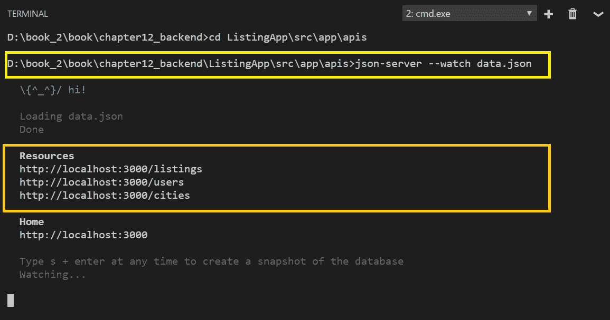

请注意，在资源下，我们可以看到列出的虚假 API；即`http://localhost:3000/listings`。

1.  尝试在浏览器中打开 URL。您应该看到 JSON 数据显示为列表、用户和城市。输出显示在以下截图中：

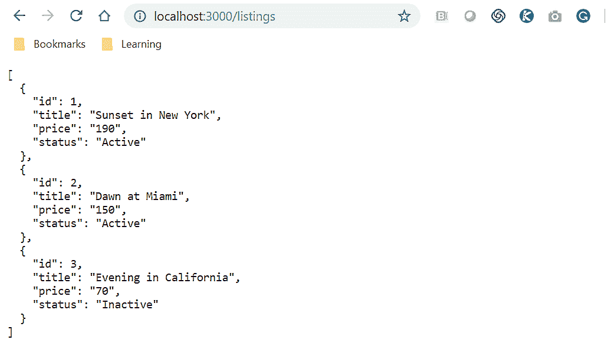

太棒了！现在我们可以在我们的 HTTP 调用中使用这些 API。在我们直接学习 HTTP 功能之前，我们只需要再等待一个部分。对于那些全栈开发人员并且知道如何设置数据库的朋友来说，下一部分肯定是给你们的。我们将学习如何设置我们的 Firestore 数据库，用于存储我们的数据。稍后，我们将使用它来实现我们的应用程序。

# Google Firestore 数据库

Google Firestore 数据库是 Google Cloud 平台的一部分。Google Cloud 的官方网站描述如下：

**Cloud Firestore** 是一个快速、完全托管的、无服务器的、云原生的 NoSQL 文档数据库，简化了在全球范围内为移动应用程序、Web 应用程序和物联网应用程序存储、同步和查询数据。参考：[`cloud.google.com/firestore/`](https://cloud.google.com/firestore/)

Firestore 是由 Google 提供的作为服务的数据库，并提供易于使用的 NoSQL 文档数据库。由于 Firestore 也来自 Angular 的制造商，因此自然会有支持两者之间轻松集成的库。在本节中，我们将学习如何设置 Firestore 数据库。所以，让我们开始：

1.  我们需要使用我们的凭据登录到我们的 Firebase 应用程序。成功登录后，我们应该看到欢迎屏幕，如下面的屏幕截图所示：

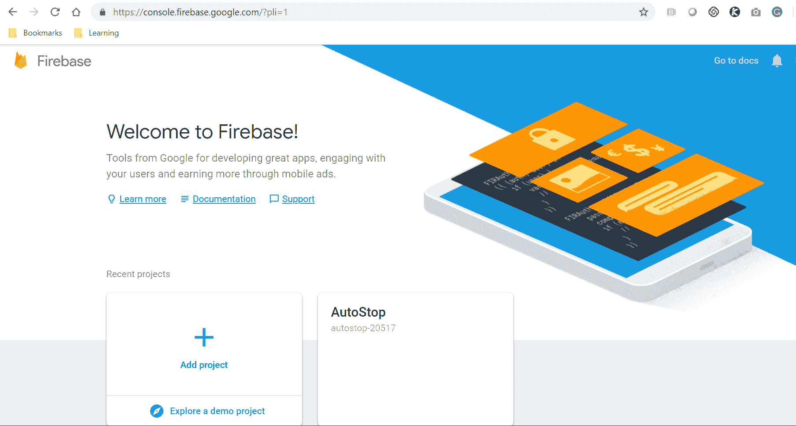

主页将列出我们在 Firebase 应用程序中创建的所有项目，您还会注意到一个大的“添加项目”链接。

1.  现在，让我们通过单击“添加项目”链接为我们的应用程序创建一个新项目。我们将收到一个模态窗口的提示，需要为我们的项目输入一个“项目名称”，如下面的屏幕截图所示：

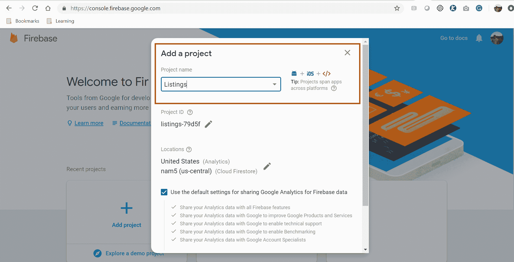

在这里，我们将输入“列表”作为我们的项目名称。一旦我们的项目被配置，我们将被带到新创建的项目页面。

1.  现在，我们在侧边栏菜单中点击“数据库”。我们将被提示选择初始化数据库的模式。我们将为我们的测试选择测试模式，一旦我们执行了实现，我们将切换安全模式：

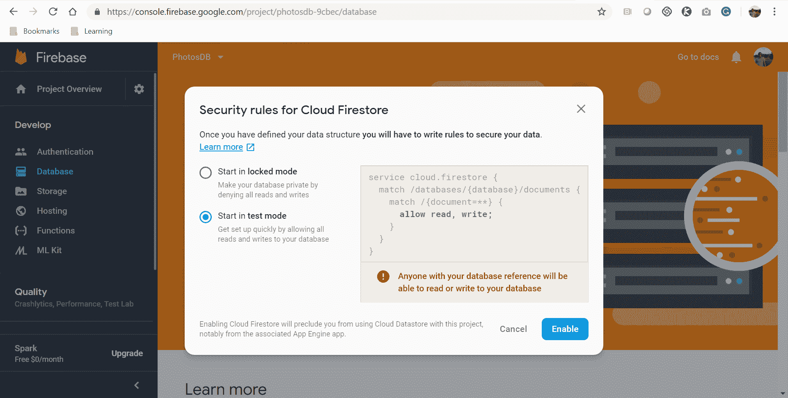

如前面的屏幕截图所示，我们正在使用测试模式中的数据库，这将使我们能够轻松地读取或写入文档。

如果您希望在生产环境中使用数据库，请不要忘记更改数据库的设置。

1.  我们现在将继续创建我们的“评论”集合。我们将添加一个名为`commentId`的唯一标识符。此外，我们正在为将存储在集合中的文档添加三个字段作为模式，如下所示：

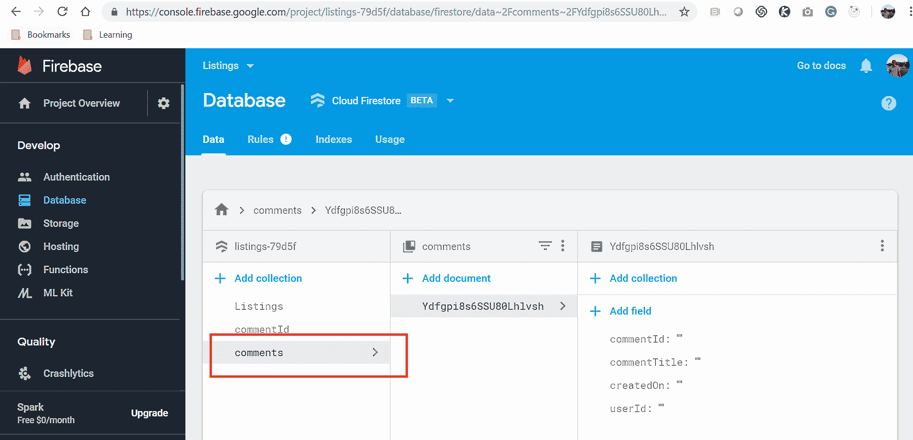

由于 Firestore 是一个 NoSQL 文档数据库，其模式不受任何数据类型的限制。我们现在可以执行 CRUD 操作，例如添加新文档，编辑，甚至删除 Firestore 数据库中的文档。

在过去的两个部分中，我们已经学习了如何使用 JSON Server 创建虚拟 API，并且还使用 Firestore 创建了一个 NoSQL 文档数据库。现在我们已经达到了一个阶段，我们已经学习了开始实现`ListingApp`端到端功能所需的所有基本概念，让我们进入 HTTP 世界吧！

# Angular HttpClient

在本节中，我们将学习 Angular 最重要的方面——`HttpClient`。使用`HttpClient`接口，我们可以执行 HTTP 请求和响应调用。在上一章中，我们学习了依赖注入和服务；在本章中，我们将学习如何编写包含方法的服务，以便我们可以使用`HttpClient`进行 HTTP 调用和处理响应。

`HttpClient`是一个小巧、易于使用、功能强大的库，用于执行 HTTP 请求和响应调用。使用`HttpClient`，我们可以轻松地与后端服务进行通信，该模块支持大多数现代 Web 浏览器。`HttpClient`具有许多高级功能，如拦截器和进度事件。`HttpClient`支持各种 HTTP 方法，包括 GET、POST、PUT、PATCH、DELETE、JSONP 和 options。这些调用中的每一个都会返回一个 observable。我们必须订阅这些 observable 以处理响应。如果我们不订阅，将不会发生任何事情。

`HttpClientModule`位于`@angular/common/http`库中，需要被导入到`app.module.ts`文件中；否则，我们将遇到错误。

我们现在了解了`HttpClient`模块，但在我们开始在应用程序中实现该模块之前，了解一些被添加到`HttpClient`中的关键功能是很重要的：

+   `HttpClient`提供了强类型的响应体。

+   `HttpClient`中的请求/响应对象是不可变的。

+   JSON 格式的响应是默认的。我们不再需要将其映射为 JSON 对象。

+   `HttpClient`提供了拦截器，这在中间件中拦截`HttpRequest`以进行转换或处理响应非常有帮助。

+   `HttpClient`包括可测试性功能。我们可以轻松模拟请求并更有效地处理标头。

在接下来的部分中，我们将学习`HttpClient`模块，它需要被导入到组件或服务中，我们可以在那里进行 HTTP 调用。我们还将学习现代应用程序中可用的 HTTP 动词以及它们的目的。

# HttpClient 和 HTTP 动词

如果前一部分是对`HttpClientModule`和`HttpClient`及其优势的介绍，那么在本节中，我们将深入了解并学习如何编写一些实现`HttpClient`的示例代码。

正如我们之前提到的，`HttpClient`支持 GET、POST、PUT、PATCH、DELETE、JSONP 和 options 方法，这些方法将返回可观察对象。`HttpClient`还提供了模块，可以使用`HttpHeaders`和`HttpParams`轻松传递各种选项和数据。

为了使用`HttpClient`，我们需要将`HttpClientModule`导入到我们的应用程序模块（`app.module.ts`）文件中，还需要将`HttpClient`导入到我们的服务或组件中，并在构造函数中注入`HttpClient`，以便我们可以使用它进行 HTTP 调用。将以下代码添加到您的`app.module.ts`文件中，并不要忘记将其添加到导入模块的列表中：

```ts
// Import the module into the component or service
import { HttpClient } from '@angular/core/http';

// Inside the constructor method inject the HttpClient and create an instance
constructor(private http: HttpClient)
```

现在，让我们实现一些最常用的 HTTP 动词。

我们将分别为 JSON 服务器 API 和 Firestore 数据库实现 HTTP 方法。

# HTTP GET

我们使用 HTTP GET 方法与后端服务通信，从特定 URL 资源中检索信息。获取所有列表的示例代码如下：

```ts
getAllListings():Observable<any>
{
   return this.http.get<Observable>('api/get-listing');
}
```

我们创建了一个名为`getAllListings`的方法，并明确指出该方法将返回任何数据类型的可观察值。我们需要将 URL 传递给 GET 方法。URL 是我们需要传递的必需值。我们还可以传递可选数据，如`Headers`、`Params`、`reportProgress`和`responseType`。GET 方法将返回 RxJS 可观察对象的实例，我们可以订阅以监听响应。

在类似的条件下，我们可以轻松地使用 POST、PUT 和 DELETE 方法创建 HTTP 调用。

# HTTP POST

每当我们需要安全地向服务器发送任何数据或信息，例如用户名、密码和电子邮件时，我们总是使用 POST 方法。HTTP POST 动词总是与创建或添加新数据相关联。它是安全的，不像 GET 方法那样在 URL 中显示数据。在 POST 方法中，我们需要将数据传递给 URL，以及 URL 作为字符串。我们还可以向 POST 方法传递选项，例如 Headers 和 Params。以下是编写示例 HTTP POST 调用的示例代码：

```ts
addNewListing(listing) {
     let httpHeaders  = new HttpHeaders();
     httpHeaders.set('Content-Type', 'application/json');
     let options =  { headers: httpHeaders};

    return this.http.post('api/add-listing', listing, options);

}
```

在前面的代码中，我们正在创建一个名为`addNewListing`的新方法，它接受一个名为 listing 的参数，我们将使用它作为我们的数据。我们正在创建一个`HttpHeaders`的实例，所以我们创建了一个类的对象，并且我们正在将`Content-Type`对象的值设置为`application/json`。然后，我们正在创建变量选项并对其进行格式化以发送标头。最后，我们正在使用`http.post`方法进行 POST 请求。

# HTTP PUT

在这一部分，我们将学习如何进行 HTTP PUT 调用。PUT 方法用于更新或编辑服务器中的现有数据集。HTTP PUT 方法涉及一个两步过程。首先，我们需要检索需要更新的数据，然后使用 POST 方法将更新后的信息传递回服务器。以下是创建 PUT 方法的示例代码：

```ts
this.http.put(url, options);
```

我们需要将 URL 作为 PUT 方法的必需参数传递。幸运的是，有各种可用的选项。例如，我们可以在选项中传递标头、参数等。

# HTTP DELETE

DELETE 是 CRUD 功能的重要操作。我们可以使用 HTTP DELETE 方法轻松执行删除操作。`delete`操作可以根据用例和应用程序的合规性来实现。我们可以进行两种类型的删除操作——软删除和硬删除：

+   **软删除**：在使用软删除时，我们不会从数据库系统中删除或擦除记录；相反，我们会更新记录并设置一个列或字段，并将其标记为已删除，以便用户不会看到这些记录。

+   **硬删除**：请求的数据从数据库系统中永久删除。一旦数据被删除，就无法恢复或恢复。

让我给你举一个很好的例子。如果你试图删除你的谷歌账户，它会通知你，在*x*天内你可以回来恢复你的账户，之后数据将会从他们的服务器上完全删除。

回到我们的实现。我们可以使用`http.delete()`方法来实现应用程序中的 DELETE 功能。示例代码如下：

```ts
this.http.delete(url, options);
```

我们需要将 URL 值作为 PUT 方法的必需参数传递，而选项则是可选的。

# 通过承诺进行 HTTP。

Promises 只是对现实世界承诺的技术实现！假设你答应了老板你会完成分配给你的任务。如果你做到了，那意味着承诺已经实现，如果你没有，那意味着它被拒绝了。同样，HTTP 实现中的 Promise 意味着我们将等待未来的数据，无论是 resolved 还是 rejected，然后我们将根据收到的输出进行一些逻辑处理。

HTTP promises 是一种基于成功或失败状态的未来数据的占位符。这听起来是否类似于常规的 HTTP 调用？是的，它们是，但有一个重大的区别——*promises 是异步的*。当我们在 Angular 中进行 HTTP 调用时，它会等待直到请求完成并收到响应；JavaScript 将继续执行，如果遇到同步赋值/操作，它将立即执行并在它们依赖于先前状态或数据时失败。

一个 promise 接受一个回调方法，该方法将带有两个参数——`resolve`和`reject`。`resolve`意味着该方法将返回一个带有给定消息的 promise 对象，而`reject`意味着 promise 对象被拒绝了。然后，你可以期待`.then`和`.catch`被调用，如果一切顺利或不顺利的话。以下是编写 promise 的示例代码，展示了对`resolve`和`reject`的处理响应：

```ts
//check if the listing status is active
ListingDetails(listing){
let promise = new Promise(function(resolve, reject) {
if(listing.status == 'active') { 
  resolved("listing is active");
}
else {
  reject("listing is not active");
}

promise.then((s => { 
//next steps after the promise has returned resolved
}).catch((err => {
// what to do when it's error or rejected
})

}
```

让我们详细分析前面的代码。我们已经实现了一个 promise，并且按照规定，`callback`方法将会带有两个参数，`resolve`和`reject`。我们检查列表的状态是否为活动状态；如果是，我们就会 resolve 这个 promise；否则，我们会 reject 这个 promise。默认情况下，resolved 方法返回的数据将会传递给`.then`方法，而任何失败或异常将会传递给`.catch`方法。

由于 promises 是异步的，这意味着我们可以链接事件或方法，继续添加一个将在`.then`方法内调用的方法。

太棒了！我们现在掌握了关于 Angular 提供的用于 HTTP 功能的类和模块的所有理论知识。我们了解了`HttpClientModule`，`HttpClient`，最重要的是，我们了解了我们可以在应用程序中使用的各种 HTTP 动词。我们还了解了 HTTP observables 和 promises。

现在，是时候动手写代码了。我们将学习如何创建我们需要使用 HTTP 调用集成的多个数据源。第一个将使用虚假的 JSON 服务器 API，而第二个将使用 Firestore 数据库。在下一节中，我们将学习并创建我们在开始端对端集成功能之前需要的服务。

# 集成后端服务

我们在这里取得了非常好的进展，所以让我们继续前进。软件开发中的最佳实践之一是创建可重用、通用和可维护的代码。在大多数动态应用程序中，我们需要进行大量的 HTTP 调用来根据应用程序的功能需求创建、保存、检索、编辑或删除数据。如果我们没有共享的 HTTP 调用，可能会导致有很多具有 HTTP 实现的方法，并且在长期内很难维护它们。我们如何解决这种情况？你已经知道答案了，我的朋友。没错——通过使用服务。在第十一章中，依赖注入和服务，我们学习了关于 Angular 服务和依赖注入的最佳实践。

Angular 指南明确规定所有 HTTP 调用和功能应该放在服务中，这样可以轻松地重用现有代码。Angular 服务是共享函数，允许我们访问其中定义的属性和方法。我们还将创建自定义服务，在其中实现我们的 HTTP 调用，并可以在各种组件中轻松重用。让我们创建两个服务——一个用于使用 JSON 服务器 API，另一个用于 Firestore 数据库操作。对于使用 JSON 服务器 API，我们将调用我们的`DbOperationsService`服务，对于使用 Firestore 数据库，我们将调用我们的`CRUDService`服务。这些服务中的每一个都将具有用于创建、读取、更新和删除数据的方法。现在，让我们运行以下`ng`命令，它将生成我们的服务：

```ts
ng generate service db-operations
```

在成功执行上述命令后，我们将执行以下命令来生成另一个服务。让我们称之为`crud`。我们将使用以下`ng`命令来生成该服务。

```ts
ng generate service crud
```

成功运行后，我们应该看到服务文件和它们各自的规范文件被生成。到目前为止，一切顺利。当我们开始端到端集成工作时，我们将需要这些服务。这可能看起来很复杂，但相信我，接下来的章节中所有这些都会有很多意义。

# 将 Angular HTTP 与后端 API 集成

这一部分非常重要，因为这是我们在整本书中学到的大部分主题的熔炉。我们将进行完整的端到端集成，从 UI 到服务，再到数据源。

我们需要生成我们将在应用程序中使用的组件。让我们运行以下`ng`命令来生成四个组件：

```ts
ng g component createListing
ng g component viewListing
ng g component deleteListing
ng g component updateListing
```

当这些命令成功运行时，我们应该看到以下截图中显示的输出：

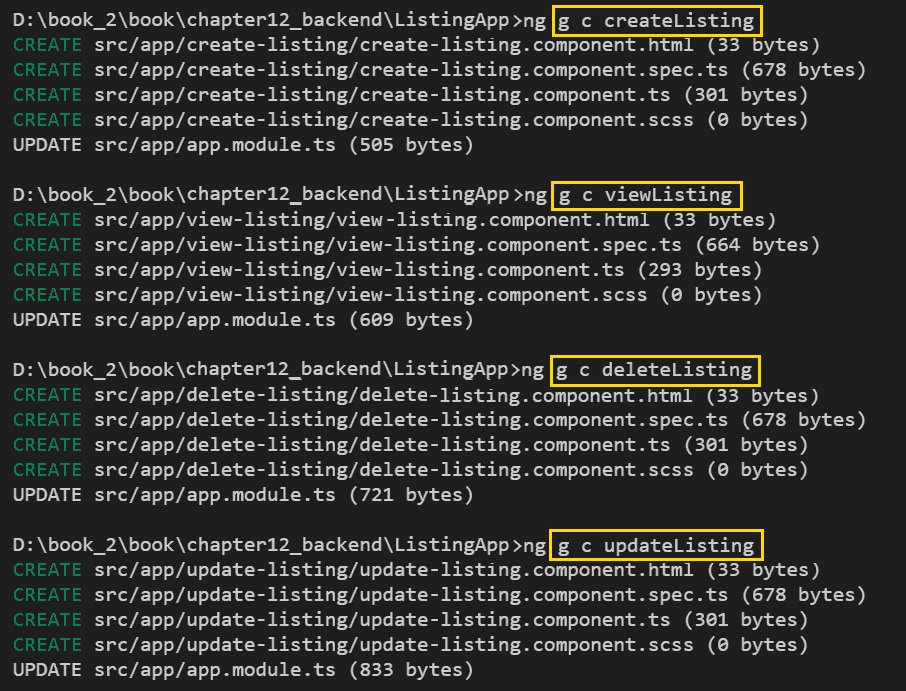

现在我们已经生成了我们的组件，我们将利用在上一节中生成的`DbOperationsService`服务。我们还将使用我们使用 JSON 服务器创建的虚拟 API。我们将实现获取所有列表、查看特定列表、编辑现有列表以及最后删除列表的方法。为了实现这一点，我们需要将`HttpClientModule`导入到我们的`app.module.ts`文件中。我们还需要将`HttpClient`导入到我们的`db-operations.service.ts`服务文件中。我们还将导入`HttpHeaders`模块。这不是强制性的，但是出于良好的实践，我们将在进行 HTTP 调用时导入并使用它。我们将向`db-operations.service.ts`文件添加以下代码：

```ts
import { Injectable } from '@angular/core';
import { HttpClient, HttpHeaders, HttpParams } from '@angular/common/http';

@Injectable({
    providedIn: 'root'
})
export class DbOperationsService {

constructor(private http: HttpClient) { }

getListings(){
    return this.http.get('http://localhost:3000/listings');
}
viewListing(id){
    return this.http.get('http://localhost:3000/listings/'+id);
}
addListing(newList){
    let headers = new HttpHeaders({ 'Content-Type': 'application/json' });
    return this.http.post('http://localhost:3000/listings', newList);
}
editListing(id, newList){
    let headers = new HttpHeaders({ 'Content-Type': 'application/json' });
    return this.http.put('http://localhost:3000/listings/'+id, newList);
}
    deleteListing(id){
    return this.http.delete('http://localhost:3000/listings/'+id);
}

}
```

让我们详细分析前面的代码。首先，我们正在导入所需的模块：`Injectable`、`HttpClient`、`HttpHeaders`和`HttpParams`。然后我们将`HttpClient`注入到我们的构造函数中，并创建一个名为`http`的实例。然后，我们创建了四种方法，分别是`getListings`、`viewListing`、`editListing`和`deleteListing`。在`getListings`方法中，我们使用 HTTP GET 方法调用 API URL。这将从我们之前创建的`data.json`文件中返回所有列表。在`viewListing`中，我们传递 Listing 的 ID 以使用 HTTP GET 方法检索列表的数据。在`addListing`方法中，我们调用 API 并使用 HTTP POST 方法传递数据对象。这将在我们的 JSON 文件中创建一行新数据。接下来是`editListing`方法，它接受两个参数——列表的 ID 和我们需要保存的更新后的数据对象。最后一个方法是`deleteListing`，我们将传递要删除的列表的 ID。

在更实际的世界中，我们需要传递身份验证令牌、额外的安全性、清理数据等等。

我们现在已经制作了我们的自定义服务，其中包括将进行 HTTP 调用的方法。在我们开始处理组件之前，我们将创建一些路由，我们将在其中映射我们生成的组件。打开`app-routing.module.ts`文件，并在其中导入我们所有的组件。然后，我们需要将路由添加到其中，如下面的代码块所示：

```ts
import { NgModule } from '@angular/core';
import { Routes, RouterModule } from '@angular/router';
import {UpdateListingComponent} from './update-listing/update-listing.component';
import {CreateListingComponent} from './create-listing/create-listing.component';
import {ViewListingComponent} from './view-listing/view-listing.component';
import {DeleteListingComponent} from './delete-listing/delete-listing.component';

const routes: Routes = [
  {path:'create-listing', component:CreateListingComponent   },
  { path:'view-listing', component:ViewListingComponent },
  { path:'delete-listing/:id', component:DeleteListingComponent},
  {path:'update-listing/:id', component:UpdateListingComponent}
];

@NgModule({
 imports: [RouterModule.forRoot(routes)],
 exports: [RouterModule]
})
export class AppRoutingModule { }
```

在前面的代码中，我们正在更新我们的`AppRoutingModule`并添加五个路由。我们创建了`create-listing`和`view-listing`路由，并将它们分别映射到`CreateListingComponent`和`ViewListingComponent`。这非常直接了当。对于`delete-listing`和`update-listing`路由，注意我们传递了一个名为 ID 的参数。我们将使用这些参数传递列表 ID 以便删除或更新列表的数据。

现在我们已经创建了我们的服务和路由，它们已经准备好在我们的组件中实现。让我们开始处理我们的组件。首先，我们将从`ViewListingComponent`开始。打开`view-listing.component.ts`文件，并添加检索所有列表的功能，如下面的代码块所示：

```ts
import { Component, OnInit } from '@angular/core';
import {DbOperationsService} from '../db-operations.service';
import { Listing} from '../models/listing';
import {Observable} from 'rxjs';

@Component({
 selector: 'app-view-listing',
 templateUrl: './view-listing.component.html',
 styleUrls: ['./view-listing.component.scss']
})

export class ViewListingComponent implements OnInit {

 listArr: Observable<any[]>;
 viewList:Observable<Listing>;
 isViewPage: boolean = false;

 constructor(private dbOps: DbOperationsService ) { }

 ngOnInit() {
 this.dbOps.getListings().subscribe((data) =>  {this.listArr = data});
 }

 showListing(listing){
 this.isViewPage = true;
 this.dbOps.viewListing(listing.id).subscribe((data) => {this.viewList = data});
 }
}
```

让我们详细分析上述代码。首先，我们需要导入所有必需的模块和类。我们导入了我们创建的`DbOperationsService`。我们还导入了之前创建的 listing 接口类。由于我们将使用`Listing`接口类，我们需要从`rxjs`中导入`Observable`。接下来，我们将声明我们的选择器为`app-view-listing`；我们将在模板`view-listing.component.html`文件中调用这个指令。我们现在将创建三个变量，名为`listArr`，`viewList`和`isViewPage`。请注意，`listArr`和`viewList`被声明为`Observable`。`listArr`和`viewList`变量之间的区别在于，`listArr`是 Listing 类型的 observable 并且是一个数组，而`viewList`是 Listing 类型的`Observable`并且将保存单个列表值。由于我们导入了一个服务，我们需要在构造方法中创建一个名为`dbOps`的实例。我们将在这里实现`ngOnInIt`方法；我们正在使用`dbOps`服务的实例调用`getListings`方法。我们正在订阅该方法，这意味着我们将把数据映射到`listArr`变量上。然后我们将使用`listArr`变量在模板文件中显示它。最后，我们正在创建一个`showListing`方法，我们正在将列表对象传递给它。使用服务的实例，我们正在调用`viewListing`方法并传递列表 ID。我们正在订阅数据并将其映射到`viewList`变量上。

现在，我们需要更新`view-listing.component.html`文件中的模板，并使用`listArr`和`viewList`变量在页面中显示数据，如下面的代码块所示：

```ts
<h4>Show All Listings</h4>

<table class="table table-bordered"> 
 <tbody>
 <tr>
 <th>Title</th>
 <th>Description</th>
 <th>Price</th>
 <th>Status</th>
 <th>Actions</th>
 </tr>
 <tr *ngFor="let listing of listArr;let i = index">
 <td>{{listing.title}}</td>
 <td>{{listing.description}}</td>
 <td>{{listing.price}}</td>
 <td>{{listing.status}}</td>
 <td><a [routerLink]="'/update-listing/'+listing.id">Edit</a> | 
    <a [routerLink]="'/delete-listing/'+listing.id">Delete</a></td>
 </tr>
 </tbody>
</table>
```

在上面的代码中，我们创建了一个表格。使用`ngFor`，我们正在循环从 API 获取的数据，并使用插值在表格行中显示数据。请注意，对于锚标签，我们使用`routerLink`指令动态创建链接，并传递编辑和删除链接的 ID。

我相信你对最终结果感到兴奋。让我们运行`ng serve`命令。您应该看到以下输出：

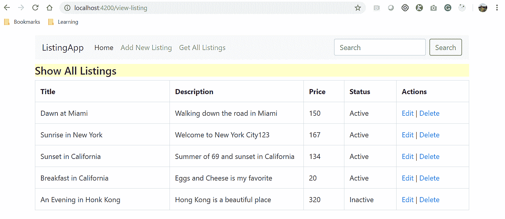

太棒了！现在事情真的开始变得有意思了！看到代码在运行中没有比这更好的鼓励了。我们已经添加了“添加新列表”菜单链接，现在是时候在我们的`createListing`组件中实现该功能了。

打开`createListingComponent`，并通过向其中添加以下代码来修改`create-listing.component.ts`文件：

```ts
import { Component, OnInit } from '@angular/core';
import {DbOperationsService} from '../db-operations.service';

@Component({
 selector: 'app-create-listing',
 templateUrl: './create-listing.component.html',
 styleUrls: ['./create-listing.component.scss']
})

export class CreateListingComponent implements OnInit { 
 userId = 1;
 newListing;
 successMsg;

 constructor(private dbOps: DbOperationsService) { }

 ngOnInit() {
 }
 addNewList(listForm)
 {
  this.newListing = {
 "userId":this.userId,
 "id": 152,
 "title":listForm.title,
 "price":listForm.price,
 "status":listForm.status,
 };

 this.dbOps.addListing(this.newListing).subscribe((data) => {
 this.successMsg = data;
 });
}
}
```

让我们详细分析上述代码。我们正在文件中导入所需的模块。我们还导入了我们之前创建的`DbOperationsService`。我们创建了一些变量，即`userId`、`newListing`和`successMsg`，并分配了一些初始值。我们创建了一个`addNewList`方法，并传递了`listForm`数据。我们还创建了一个类似于我们创建的列表模型的数据结构。接下来，使用服务的实例，我们调用`addListing`方法并传递我们需要保存的数据对象。这将在我们的`data.json`文件中创建一个新记录。最后，我们将结果映射到`successMsg`变量。我们将使用这个变量向用户显示成功消息。

由于我们使用的是虚拟 API，我们已经存根化了 ID 的值。在更实时的情况下，这个 ID 将在数据库端自动递增，并且始终是一个唯一的值。

现在，是时候更新我们的模板文件，以便我们可以使用表单从用户那里获取数据。打开`create-listing.component.html`文件，并将以下代码添加到其中：

```ts
<h4>Add New Listing</h4>
<p>
<div class="container">

<div *ngIf="successMsg">List Added Successful</div>

<form #listingForm="ngForm" (ngSubmit)="addNewList(listingForm)">
 <div class="form-group">
 <label for="title">Enter Listing Title</label>
 <input type="text" [ngModel]="title" name="title" class="form-control" 
    placeholder="Enter title">
 </div>
 <div class="form-group">
 <label for="price">Enter Description</label>
 <input type="text" [ngModel]="description" name="description" 
   class="form-control" placeholder="Enter Description">
 </div>
 <div class="form-group">
 <label for="price">Enter Price</label>
 <input type="number" [ngModel]="price" name="price" class="form-control" 
    placeholder="Enter price here">
 </div>
 <div class="form-group form-check">
 <input type="checkbox" [ngModel]="status" name="status" 
    class="form-check-input">
 <label class="form-check-label" for="status">Active?</label>
 </div>
 <button type="submit" class="btn btn-primary">Add New Listing</button>
</form>
</div>
```

在上述代码中，我们正在使用基于模板的表单创建表单。我们创建了一些表单字段来捕获数据，例如标题、描述、价格和活动状态。我们正在使用模板变量来引用表单和字段。我们还在`ngSubmit`事件上调用`addNewList`方法并提交整个表单。通过运行`ng serve`命令，我们应该看到以下输出：

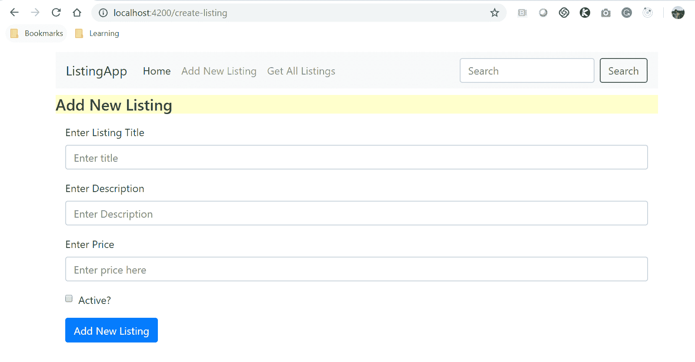

现在，继续向表单字段添加一些数据，然后单击“提交”按钮。如果记录已成功创建，您应该会看到成功消息：

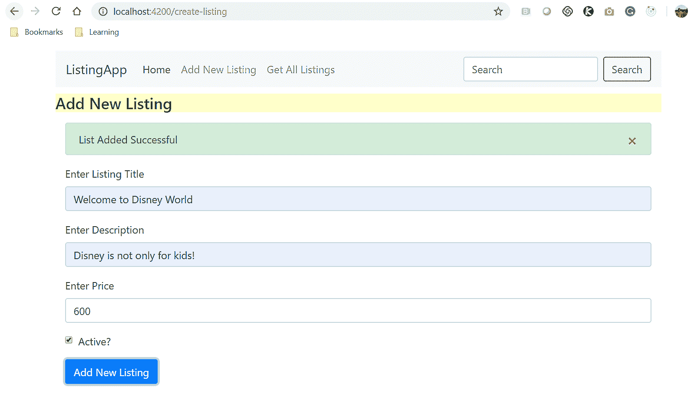

现在，点击菜单中的“获取所有列表”链接。您应该在表中看到新创建的记录显示在列表中。您还记得我们为列表添加了编辑和删除链接吗？现在是时候实现它们了。我们将首先实现编辑功能，然后再实现删除功能。

打开我们的更新列表组件，编辑`update-listing.component.ts`文件，然后将以下代码添加到其中：

```ts
import { Component, OnInit } from '@angular/core';
import { ActivatedRoute } from "@angular/router";
import {DbOperationsService} from '../db-operations.service';
import { Listing} from '../models/listing';
import {Observable} from 'rxjs';

@Component({
    selector: 'app-update-listing',
    templateUrl: './update-listing.component.html',
    styleUrls: ['./update-listing.component.scss']
})
export class UpdateListingComponent implements OnInit {

 listId;
 successMsg = false;
 viewList: Observable<Listing>;

 constructor(private route:ActivatedRoute, private 
   dbOps:DbOperationsService) { }

ngOnInit() {
    this.listId = this.route.snapshot.paramMap.get("id");
    this.dbOps.viewListing(this.listId).subscribe((data) 
     => {this.viewList = data});
 }
editListing(updatedList){
    this.dbOps.editListing(updatedList.id, updatedList).subscribe((data) => {
        this.successMsg = data;
    });
  }
}
```

让我们详细分析前面的代码。我们正在将所需的模块导入到我们的组件文件中。我们正在导入`ActivatedRoute`，我们的服务，列表接口类和可观察对象到组件文件中。为了实现更新功能，我们需要做两件事。首先，我们需要检索传递了 ID 的列表的数据。一旦用户更新了数据并单击“提交”按钮，我们将持久化该列表的数据。我们还需要将路由器和服务注入到我们的构造函数中。在`ngOnInit`方法中，使用路由器快照，我们正在从 URL 中捕获列表的 ID。然后，使用服务的实例，我们正在调用`viewListing`方法来获取基于传递的 ID 的列表的详细信息。最后，我们创建了一个`editListing`方法。使用服务的实例，我们正在调用`editListing`方法，因此我们需要传递两个参数，一个用于传递列表的 ID，另一个用于传递列表的更新数据。

现在，让我们更新我们的模板文件。打开`update-listing.component.html`文件并添加以下代码：

```ts
<div class="container">
<div *ngIf="successMsg">List Updated Successful</div>
<form #editlistingForm="ngForm" (ngSubmit)="editListing(editlistingForm)">
 <div class="form-group">
 <input type="hidden" class="form-control" name="id" 
    [(ngModel)]="viewList.id" ngModel #id>
 </div>
 <div class="form-group">
 <input type="hidden" class="form-control" name="userId" 
    [(ngModel)]="viewList.userId" ngModel #userId>
 </div>
 <div class="form-group">
 <label for="title">Enter Listing Title</label>
 <input type="text" class="form-control" name="title" 
    [(ngModel)]="viewList.title" ngModel #title required>
 </div>
 <div class="form-group">
 <label for="price">Enter Description</label>
 <input type="text" name="description" [(ngModel)]="viewList.description" 
    ngModel #description class="form-control" required>
 </div>
 <div class="form-group">
 <label for="price">Enter Price</label>
 <input type="number" [(ngModel)]="viewList.price" name="price" 
    class="form-control" ngModel #price required>
 </div>
 <div class="form-group form-check">
 <input type="checkbox" [(ngModel)]="viewList.status" 
   checked="{{viewList.status}}" name="status" ngModel 
   #status class="form-check-input" required>
 <label class="form-check-label" for="status">Active?</label>
 </div>
 <button type="submit" [disabled]="!editListingForm.valid" 
   class="btn btn-primary">Update Listing</button>
</form>
</div>
```

在上述代码中，我们再次基于模板驱动的表单方法创建了一个表单。您会注意到编辑表单与创建列表表单非常相似。你几乎是正确的，但有一些重要的区别。请注意，我们现在正在使用`ngModel`进行双向数据绑定，并将值绑定到表单字段。有了这个，当我们获取初始数据时，它会显示在表单字段中。现在，用户可以编辑数据，当单击“更新列表”按钮时，数据将被发送到`addListing`方法并持久化在后端 API 中。现在，让我们看看它的运行情况。通过运行`ng serve`命令，我们应该看到以下输出：

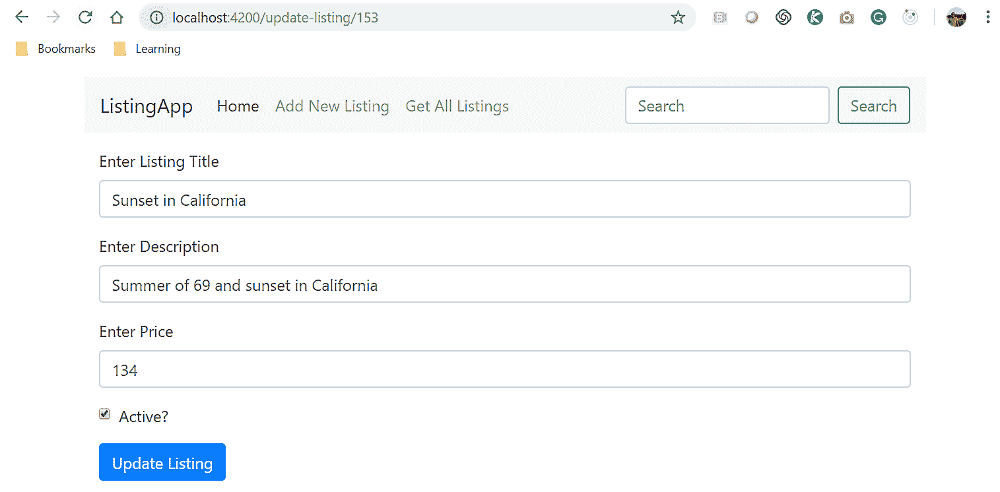

请注意，URL 中包含作为参数传递的列表的 ID。数据已被检索并显示在页面加载上。现在，当用户更新表单中的详细信息并单击“提交”按钮时，这将更新列表的数据。这是你的作业。

好了，我们已经实现了创建、编辑和查看功能。接下来，我们将实现列表的删除功能。请记住，对于删除和编辑功能，用户将始终通过单击锚标签导航到页面。打开`DeleteListingComponent`并更新`delete-listing.component.ts`文件，如下面的代码块所示：

```ts
import { Component, OnInit } from '@angular/core';
import { ActivatedRoute } from "@angular/router";
import {DbOperationsService} from '../db-operations.service';
import { Listing} from '../models/listing';
import {Observable} from 'rxjs';

@Component({
 selector: 'app-delete-listing',
 templateUrl: './delete-listing.component.html',
 styleUrls: ['./delete-listing.component.scss']
})
export class DeleteListingComponent implements OnInit {
viewList:Observable<Listing>;
listId;
successMsg:Observable<Listing>;

constructor(private route:ActivatedRoute, private dbOps:DbOperationsService) { }

ngOnInit() {
 this.listId = this.route.snapshot.paramMap.get("id");
 this.dbOps.deleteListing(this.listId).subscribe((data) => {
 this.successMsg = data;
 });
 }

}
```

让我们详细分析上述代码。我们在组件文件中导入所需的模块；即`ActivatedRoute`、`DbOperationsService`、`Listing`和`Observable`。我们还创建了一些变量——`viewList`、`ListId`和`successMsg`。然后，我们将路由和服务注入到构造方法中。最后，使用`ngOnInIt`方法，我们传递需要删除的列表的 ID。我们订阅数据并将其映射到`successMsg`。

在本节中，我们学习了如何为我们的`ListingApp`实现基本的 CRUD 操作。然后，我们学习了如何对 GET、POST、PUT 和 DELETE 方法进行 HTTP 调用。最后，我们学习了如何使用 JSON Server 创建虚拟 API。在下一节中，我们将学习如何使用云 NoSQL Firestore 数据库实现 CRUD 操作。

# 将 Angular HTTP 与 Google Firebase 集成

在本节中，我们将学习如何为 NoSQL Firestore 数据库实现 HTTP 功能。我们在之前的部分中创建了我们的 Firestore 数据库。现在是集成 Angular HTTP 调用的合适时机，它将调用并与 Firestore 数据库一起工作。

我们将实现哪些用例？对于我们的`ListingApp`，我们将需要一个评论系统。作为用户，我们应该能够添加、编辑、删除和查看评论。所有这些用例都将需要我们调用 API 来保存、检索和删除评论。

Angular Fire 是 Firebase 的官方库。该库提供了许多内置模块，支持诸如身份验证、与 Firestore 数据库的交互、基于 observable 的推送通知等活动。

我们需要在`@angular/fire`下安装此模块。在命令行界面中运行以下命令以安装库：

```ts
npm i @angular/fire 
```

当我们成功运行上述命令时，我们应该看到以下输出：

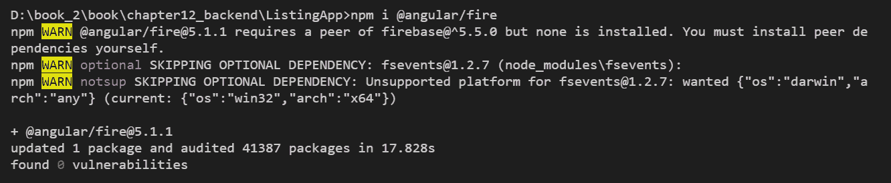

安装完库后，我们将继续创建一个新的自定义服务，用于与 Firestore 数据库集成。

运行以下命令生成一个新的服务：

```ts
ng generate service crudService
```

当我们成功运行上述命令时，我们应该看到以下输出：

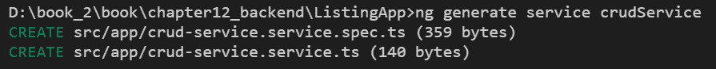

您会注意到生成了两个文件。我们将在服务内实现所有我们的 HTTP 调用。正如我们之前提到的，我们需要创建一些组件，这些组件将映射到每个功能，并在内部调用具有 HTTP 实现的服务。

运行以下`ng generate`命令为评论功能生成组件：

```ts
ng generate component addComments

ng generate component viewComments ng generate component editComments ng generate component deleteComments
```

当我们成功运行上述命令时，我们应该看到以下输出：

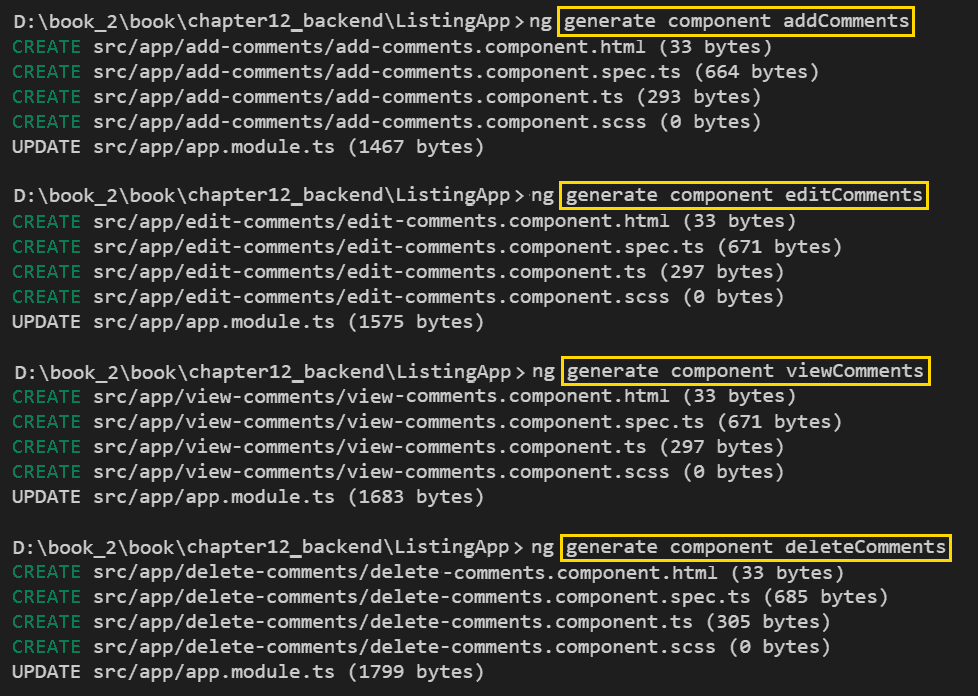

您会注意到组件已经生成并添加到我们的项目目录中。您还会注意到`app.module.ts`文件已经更新，其中包含了组件的条目。

我们已经生成了我们的组件和所需的服务，还安装了 Angular Fire 库。为了在我们的应用程序中使用 Angular Fire 库，我们需要将该库导入到我们的`app.module.ts`文件中。将所需的模块导入到应用程序模块文件中，并在应用程序的导入列表中列出这些模块，如下所示：

```ts
import { BrowserModule } from '@angular/platform-browser';
import { NgModule } from '@angular/core';
import { HttpClientModule} from '@angular/common/http';

import { AppRoutingModule } from './app-routing.module';
import { AppComponent } from './app.component';
import { CreateListingComponent } from './create-listing/create-listing.component';
import { ViewListingComponent } from './view-listing/view-listing.component';
import { DeleteListingComponent } from './delete-listing/delete-listing.component';
import { UpdateListingComponent } from './update-listing/update-listing.component';

import {FormsModule} from '@angular/forms';

import { AngularFireModule} from 'angularfire2';
import {AngularFireDatabaseModule} from 'angularfire2/database';
import { AngularFireAuth } from '@angular/fire/auth';
import { environment } from './firebase-config';
import { AngularFirestore } from '@angular/fire/firestore';
import { AddCommentsComponent } from './add-comments/add-comments.component';
import { EditCommentsComponent } from './edit-comments/edit-comments.component';
import { ViewCommentsComponent } from './view-comments/view-comments.component';
import { DeleteCommentsComponent } from './delete-comments/delete-comments.component';

@NgModule({
  declarations: [
    AppComponent,
    CreateListingComponent,
    ViewListingComponent,
    DeleteListingComponent,
    UpdateListingComponent,
    AddCommentsComponent,
    EditCommentsComponent,
    ViewCommentsComponent,
    DeleteCommentsComponent
  ],
  imports: [
    BrowserModule,
    HttpClientModule,
    AppRoutingModule,
    AngularFireModule.initializeApp(environment.firebaseConfig),
    AngularFireDatabaseModule,
    FormsModule
  ],
  providers: [AngularFirestore],
  bootstrap: [AppComponent]
})
export class AppModule { }
```

在上述代码中需要注意的一点是，我们正在从 Angular Fire 导入所需的模块，并在导入模块列表下列出它们。请注意，我们导入了一个名为`firebase-config`的文件。这些是环境变量，将保存用于与 Firebase 进行身份验证的 API 密钥。我们可以在 Firebase 帐户下找到列出的 API 密钥，如下面的屏幕截图所示：

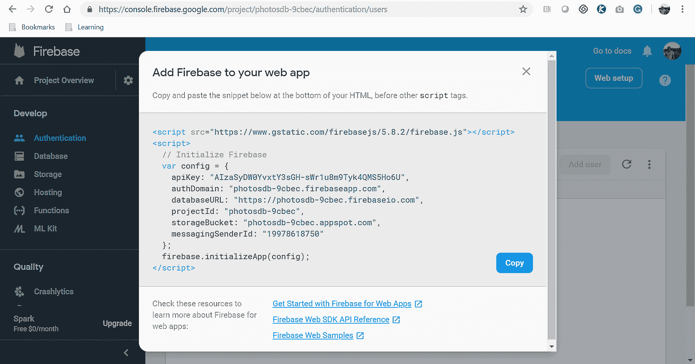

我们需要将详细信息复制到`firebase-config.ts`文件中。以下屏幕截图显示了我们的`ListingApp`中指定的设置：

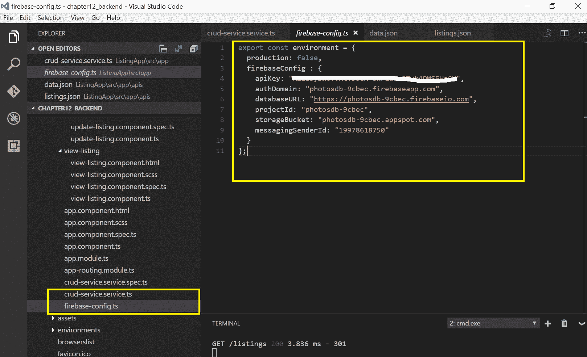

到目前为止，一切顺利。现在我们已经安装了所需的库，导入了模块，并完成了配置设置，现在是时候开始处理我们的应用程序组件了。我们在这里取得了很大的进展。让我们保持这种势头。

现在我们已经创建了我们的组件，我们将快速修改我们的`app-routing.module.ts`文件，并为每个组件创建一个新的路由。

我们已经掌握了 Angular 路由，在第四章 *路由*。如果需要快速复习，请重新阅读该章节。

在以下代码中，我们已经将所有所需的组件类导入到`app-routing.module.ts`文件中，并在路由文件中添加了相应的路由：

```ts
import { NgModule } from '@angular/core';
import { Routes, RouterModule } from '@angular/router';
import {UpdateListingComponent} from './update-listing/update-listing.component';
import {CreateListingComponent} from './create-listing/create-listing.component';
import {ViewListingComponent} from './view-listing/view-listing.component';
import {DeleteListingComponent} from './delete-listing/delete-listing.component';

import { AddCommentsComponent } from './add-comments/add-comments.component';
import { EditCommentsComponent } from './edit-comments/edit-comments.component';
import { ViewCommentsComponent } from './view-comments/view-comments.component';
import { DeleteCommentsComponent } from './delete-comments/delete-comments.component';

const routes: Routes = [
  { path:'create-listing', component:CreateListingComponent },
  { path:'view-listing', component:ViewListingComponent },
  { path:'delete-listing/:id', component:DeleteListingComponent},
  { path:'update-listing/:id', component:UpdateListingComponent},
  { path:'add-comment', component:AddCommentsComponent },
  { path:'view-comment', component:ViewCommentsComponent },
  { path:'delete-comment/:id', component:DeleteCommentsComponent},
  { path:'update-comment/:id', component:EditCommentsComponent}
];

@NgModule({
  imports: [RouterModule.forRoot(routes)],
  exports: [RouterModule]
})
export class AppRoutingModule { }
```

我们将使用四个新创建的路由来在`ListingApp`中实现评论功能。我们将使用 Firestore 数据库添加 CRUD 操作。我们需要将`AngularFirestore`模块导入到我们的服务中，如下所示：

```ts
import { AngularFirestore } from '@angular/fire/firestore';
```

在我们将模块导入到我们的文件后，我们需要在`constructor`方法中注入它，如下所示：

```ts
constructor(private afStore : AngularFirestore, private route: Router ) { }
```

现在我们可以利用`AngularFirestore`模块并使用 Firestore 实现 CRUD 操作。查看`crud-service.service.ts`文件中的完整更新代码。

```ts
import { Injectable } from '@angular/core';
import { AngularFireAuth } from '@angular/fire/auth';
import { environment } from './firebase-config';
import { AngularFirestore } from '@angular/fire/firestore';

@Injectable({
  providedIn: 'root'
})
export class CrudServiceService {

  constructor(private afStore : AngularFirestore) { }

  getComments() {
    return this.afStore.collection('comments');
  }

  deleteComment(id) {
    this.afStore.collection('comments').doc(id).delete();
  }

  addComment(newComment) {
    this.afStore.collection('comments').add(newComment);
  }

  updateComment(id, editedComment) {    
    this.afStore.collection('comments').doc(id).set(editedComment);
  }
}
```

让我们详细分析前面的代码。我们已经导入了所有必需的模块，包括我们的 Angular Fire 模块和我们的`firebase-config`文件。由于我们已经导入了`AngularFireStore`模块，我们需要将其注入到我们的`constructor`方法中并创建一个实例。我们为评论功能的每个操作创建了方法。在`getComments`方法中，我们正在从*comments*集合中检索所有数据。在`deleteComment`方法中，我们正在传递需要删除的评论的 ID。在`addComment`方法中，我们正在传递我们想要存储在我们的集合中的数据。在`updateComment`方法中，我们传递了两个参数；第一个是我们想要更新的评论的 ID，第二个是我们需要在数据库中持久保存的更新数据。

你可能会想为什么我们在这些方法中没有进行任何 HTTP 调用？`AngularFireStore`模块在内部对服务进行 HTTP 调用，并将从 firebase 配置文件中进行身份验证并获取特定于帐户的信息。

在早期的章节中，我们学习了如何从组件发送数据到服务，对吧？沿着同样的思路，继续尝试评论功能。这是你的家庭作业。

# 总结

你感觉如何？你应该感到很棒，应该为自己感到骄傲！这一章节是很多工作，但我们做完了会变得更好。它汇集了我们迄今为止学到的所有方面，如表单、组件、路由、服务等。

对于前端开发人员来说，在本地开发环境中设置一个虚拟 API 总是有助于我们独立工作，而不依赖后端开发人员或 API。我们学习了如何使用 JSON 服务器构建虚拟 API。我们学习了 NoSQL 文档数据库，特别是由谷歌云提供的 Firestore 数据库。我们深入研究了 Angular HTTP 的概念和功能。我们学会了如何进行 HTTP POST、GET、PUT 和 DELETE 调用。我们还使用 JSON 服务器和 Firestore 数据库实现了整个应用程序的功能用例。

到目前为止，我们取得了巨大的进步。我们现在能够端到端地开发 Angular 应用程序，利用 Angular 提供的所有超能力，包括表单、组件、服务、路由等等。在本章结束时，我相信我们能够将 Angular 框架的所有部分整合到一个正常运行的应用程序中。

拥有一个正常运行的应用程序是进步的一个好迹象。但在评估应用程序时的重要因素是查看质量检查或单元测试。

在下一章中，我们将学习如何编写单元测试，以确保在产品开发生命周期的早期发现任何缺陷。编写测试脚本可以确保质量，并且是处理应用程序的所有用例的一个很好的标志，包括应用程序的正常和负面路径。
