# 第十三章：单元测试

您可能已经为传统的服务器端代码编写了单元测试，比如 Java、Python 或 C#。当然，在客户端，单元测试同样重要，在本章中，您将了解 Angular 测试，包括 Jasmine 和 Karma 框架，这两个优秀的工具用于对客户端代码进行单元测试。

我们将一起探讨如何对 Angular 应用的各个部分进行单元测试，例如组件、路由和依赖注入（DI）。

本章将涵盖以下主题：

+   Jasmine 和 Karma 简介

+   测试指令

+   测试组件

+   测试路由

+   测试依赖注入

+   测试 HTTP

# 测试框架简介

在本节中，我们将学习两个重要的测试框架，即 Jasmine 和 Karma。

测试和开发本身一样重要。这是一个备受争议的话题，一些专家认为**测试驱动开发**（TDD）非常重要，这意味着在编写开发代码之前编写测试脚本非常重要。

Angular 框架的美妙之处在于它原生支持测试框架，并提供了许多测试工具，使开发人员的工作变得轻松愉快。我们一点也不抱怨。

Angular 为我们提供了一个核心测试模块，其中有很多我们可以利用的优秀类，并且原生支持两个重要的测试框架，即 Jasmine 和 Karma：

+   我们使用 Jasmine 框架编写我们的测试脚本。

+   我们使用 Karma 框架来执行测试脚本。

# 关于 Jasmine 框架

Jasmine 是一个领先的开源测试框架，用于编写和测试现代 Web 框架的自动化测试脚本。

当然，对于 Angular 来说，Jasmine 已经成为事实上的首选框架。以下摘自官方网站：

"Jasmine 是一个用于测试 JavaScript 代码的行为驱动开发框架。它不依赖于任何其他 JavaScript 框架。它不需要 DOM。它有一个清晰明了的语法，让您可以轻松编写测试。"

编写 Jasmine 测试脚本的理念是基于行为和功能驱动的。测试脚本有两个重要的元素——`describe`和规范（`it`）：

+   `describe`函数用于将相关的规范分组在一起。

+   规范是通过调用`it`函数来定义的。

以下是一个用 Jasmine 编写的示例测试脚本：

```ts
describe("Test suite", function() {
  it("contains spec with an expectation", function() {
    expect(true).toBe(true);
  });
});
```

在编写测试规范的过程中，我们必须使用大量的条件检查来匹配数据、元素、结果、断言条件等等。Jasmine 框架提供了许多匹配器，我们可以在编写测试规范时方便地使用。在前面的示例代码中，toBe 就是一个匹配器的例子。

以下是 Jasmine 中最常用的匹配器列表：

+   等于

+   为真

+   为假

+   大于或等于

+   小于或等于

+   已调用

+   具有类

+   匹配

我们将在接下来的几节中学习如何使用这些匹配器。好的，我们已经编写了我们的测试规范，那么现在怎么办？我们如何运行它们？谁会为我们运行它们？答案可以在下一节找到。

# 关于 Karma 框架

Karma 是一个测试运行器框架，用于在服务器上执行测试脚本并生成报告。

以下内容来自官方网站：

“Karma 本质上是一个工具，它生成一个 Web 服务器，针对每个连接的浏览器执行源代码与测试代码。针对每个浏览器的每个测试的结果都会被检查，并通过命令行显示给开发人员，以便他们可以看到哪些浏览器和测试通过或失败。”

Karma 框架被添加到我们的依赖列表中，因为它包含在 Angular CLI 安装中。在我们继续编写和执行测试脚本之前，验证我们是否已在`package.json`文件中正确安装了 Jasmine 和 Karma 是一个良好的实践。我们还可以验证正在使用的库的版本号。

我敢打赌你已经猜到这也是指定要使用的 Jasmine 和 Karma 的特定版本的地方。

在下面的截图中，我们可以验证我们已将 Jasmine 和 Karma 添加到`package.json`文件中的`devDependencies`列表中：

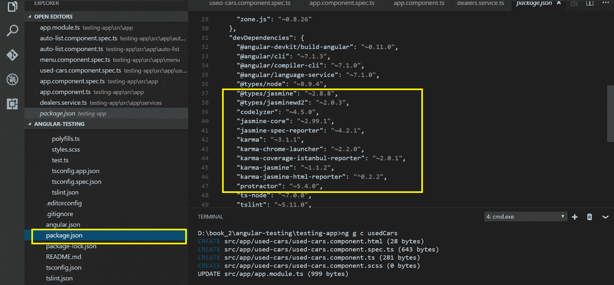

太好了。现在，是时候深入了解 Angular 测试概念并编写一些测试脚本了。

# Angular 测试自动化

我相信你会同意测试自动化是产品开发中最重要的方面之一。在前面的部分中，我们探讨了 Jasmine 和 Karma 框架。在接下来的部分中，我们将通过一些实际示例来学习如何自动化各种 Angular 框架构建模块。我们将学习如何测试 Angular 组件、指令、路由等等。让我们开始吧。

# 测试 Angular 组件

在使用 Angular CLI 的过程中，我们已经生成了多个组件和服务。暂停一下，查看文件和文件夹结构。您会注意到，对于每个组件和服务，都生成了一个`.spec.ts`文件。

恍然大悟！Angular CLI 一直在为相应的组件和服务生成所需的外壳测试脚本。让我们在这里进行一个快速的实践练习。让我们生成一个名为`auto-list`的组件：

```ts
ng g component auto-list
```

Angular CLI 会自动生成所需的文件，并在所需的文件（`AppModule`，`Angular.json`等）中进行条目。

以下截图描述了 CLI 生成的测试规格：

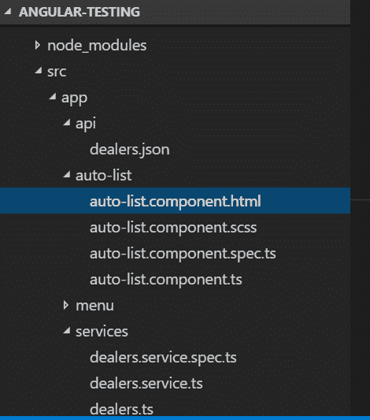

仔细看一下生成的文件。您会看到为组件生成了以下文件：

+   `auto-list.component.html`

+   `auto-list.component.spec.ts`

+   `auto-list.component.ts`

+   `auto-list.component.scss`

我们对 Angular CLI 生成的 spec 文件感兴趣。spec 文件是为相应组件生成的测试脚本。spec 文件将导入基本所需的模块，以及`Component`类。spec 文件还将包含一些基本的测试规格，可以用作起点，或者作为我们的动力。

让我们更仔细地看一下在 spec 文件中生成的代码：

```ts
import { async, ComponentFixture, TestBed } from '@angular/core/testing';
import { AutoListComponent } from './auto-list.component';
```

在上面的代码中，您会注意到所需的模块是从 Angular 测试核心导入的。这当然不是我们将使用的模块的最终列表，而只是基本的起始模块。您还会注意到新创建的组件`AutoListComponent`也被导入到我们的 spec 文件中，这意味着我们可以在 spec 文件中创建我们类的一个实例，并开始模拟测试目的的对象。很酷，对吧？继续看代码行，我们可以看到以下内容：

```ts
describe('AutoListComponent', () => {
    let component: AutoListComponent;
    let fixture: ComponentFixture<AutoListComponent>;
beforeEach(async(() => {
    TestBed.configureTestingModule({
    declarations: [ AutoListComponent]
 })
 .compileComponents();
 }));

beforeEach(() => {
    fixture = TestBed.createComponent(AutoListComponent);
    component = fixture.componentInstance;
    fixture.detectChanges();
});
```

在上面的代码中，您会注意到一些关键点。有一个`describe`语句，用于将相关的测试规格分组在一起。我们将在`describe`函数内创建测试规格。在 spec 文件中定义了两个`beforeEach`方法。

第一个`beforeEach`方法是一个异步 promise，它将设置我们的`TestBed`，这意味着在继续之前必须解决其中声明的所有内容；否则，我们的测试将无法工作。第二个`beforeEach`方法将为测试创建一个`AutoList`组件的实例。您会注意到调用`fixture.detectChanges()`，这会强制 Angular 的变更检测运行并影响测试中的元素。

现在，是时候了解实际的测试规范了，这是在规范文件中生成的：

```ts
it('should create', () => {
 expect(component).toBeTruthy();
 });
```

正如我们之前提到的，Jasmine 测试规范是写在`it`语句内的，这种情况下，只是一个简单的断言，用于检查组件是否存在并且为真，使用`toBeTruthy`匹配器。

这就是我们的规范文件。乐趣在于看到它的工作。让我们运行 Angular 为我们生成的默认测试。要运行 Angular 应用程序中编写的测试，我们在命令行界面上使用`ng test`命令：

```ts
ng test
```

如果你看到一个新窗口被打开，不要惊慌。您会注意到 Karma 运行器打开了一个新的浏览器窗口来执行测试，并生成了测试执行报告。以下截图显示了为我们的组件生成的测试规范的报告：

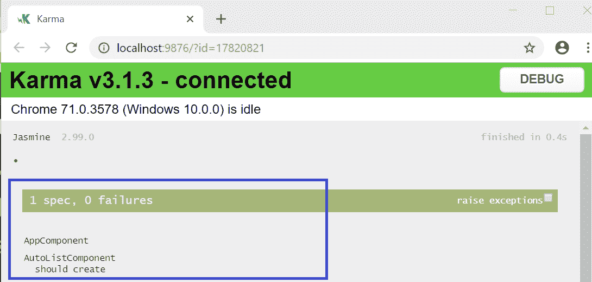

测试通过了。现在，让我们稍微修改一下脚本。我们将在组件中创建一个名为`title`的变量并赋值。在我们的测试规范中，我们将验证该值是否匹配。这是一个直接的用例，相信我，这也是您在应用程序中实现的最常见的用例。让我们打开`app.component.spec.ts`文件并在测试脚本中进行更改：

```ts
it(`should have as title 'testing-app'`, () => {
 const fixture = TestBed.createComponent(AppComponent);
 const app = fixture.debugElement.componentInstance;
 expect(app.title).toEqual('AutoStop');
});
```

在上面的代码中，我们正在编写一个测试规范，并使用`TestBed`创建了`AppComponent`的 fixture 元素。使用 fixture 元素的`debugElement`接口，我们获取了`componentInstance`属性。接下来，我们编写了一个`expect`语句来断言`title`变量的值是否等于`AutoStop`。很整洁。让我们尝试再写一个测试规范。我们要解决的用例是：我们有一个`H1`元素，并且我们想要断言它，如果`H1`标签内的值等于`Welcome to Autostop`。以下是相关的示例代码：

```ts
it('should render title in a h1 tag', () => {
 const fixture = TestBed.createComponent(AppComponent);
 fixture.detectChanges();
 const compiled = fixture.debugElement.nativeElement;
 expect(compiled.querySelector('h1').textContent).toContain('Welcome to 
  AutoStop');
});
```

在上述代码中，我们断言`h1`元素的`textContent`是否包含文本`Welcome to AutoStop`。请注意，在以前的测试规范中，我们使用了`componentInstance`接口，在这个测试规范中，我们使用了`nativeElement`属性。再次使用`ng test`命令运行测试。以下屏幕截图显示了生成的测试报告：

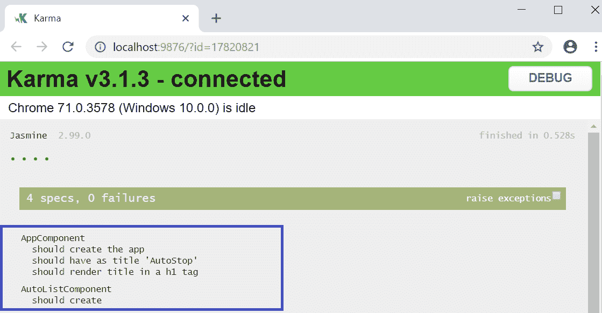

到目前为止，我们已经概述了 Jasmine 和 Karma 框架，还学习了如何运行我们的测试脚本。我们还了解了 Angular 为我们生成的默认 spec 文件，并学习了如何修改测试规范。

在接下来的章节中，我们将学习如何编写测试规范和脚本，以测试 Angular 内置指令、服务、路由等等。

# 测试指令

Angular 提供了许多内置的强大指令，如`ngFor`、`ngIf`等，可以用于扩展原生 HTML 元素的行为和功能。我们在第七章中学习了关于 Angular 模板和指令的知识，快速回顾从未有过害处。Angular 为我们提供了两种类型的指令，我们可以用来开发和扩展元素的行为：

+   内置指令

+   自定义指令

本节的重点是学习如何编写用于内置 Angular 指令（如`ngIf`、`ngFor`、`ngSwitch`和`ngModel`）的测试脚本。在开始编写测试用例之前，我们需要做一些准备工作，以更新我们的组件，以便我们可以开始编写测试用例。我们将编写一些变量，用于保存各种类型的数据。我们将使用`ngFor`在模板中显示数据，并使用`ngIf`编写一些条件检查。

如果您想快速复习 Angular 模板和指令，请参阅第七章 *Templates, Directives, and Pipes*。

我们将继续使用在上一节中创建的相同组件`AutoListComponent`。让我们开始吧。我们的起点将是`AutoListComponent`类，所以让我们修改`auto-list.component.ts`文件：

```ts
import { Component, OnInit } from '@angular/core';

@Component({
 selector: 'app-auto-list',
 templateUrl: './auto-list.component.html',
 styleUrls: ['./auto-list.component.scss']
})
export class AutoListComponent implements OnInit {

cars = [
 { 'id': '1', 'name': 'BMW' },
 { 'id': '2', 'name': 'Force Motors' },
 { 'id': '3', 'name': 'Audi' }
 ];

 tab = "1";

 constructor() { }

 ngOnInit() {
 }

 findAuto() {
     console.log("Method findAuto has been called");
  }

}
```

在上面的代码中，我们添加了一个名为`cars`的 JSON 对象类型的变量，并为其分配了数据。我们将通过在模板中显示数据来使用这些数据。我们还声明了一个名为`tab`的变量，并分配了一个值`1`。我们将在模板中使用`tab`变量进行条件检查。最后，我们添加了一个名为`findAuto`的方法，并在控制台中显示输出。

我们已经修改了我们的组件类。我们还需要更新我们的模板文件，以便在组件内部处理数据。以下是我们将在模板文件`auto-list.component.html`中添加的示例代码：

```ts
<h4 class="c2">ngFor directive</h4>
<ul class="cars-list">
 <li *ngFor="let car of cars">
 <a [routerLink]="[car.id]">{{ car.name }}</a>
 </li>
</ul>

<h4 class="c1">ngIf directive</h4>
<div *ngIf="cars.length" id="carLength">
 <p>You have {{cars.length}} vehicles</p>
</div>

<h4 class="c3">ngSwitch directive</h4>
<div [ngSwitch]="tab" class="data-tab">
 <p>This is ngSwitch example</p>
 <div *ngSwitchCase="1">ngSwitch Case 1</div>
 <div *ngSwitchCase="2">ngSwitch Case 2</div>
</div>
<hr>

<button (click)="findAuto()" id="btn">Click to findAutoDealers</button>
```

在上面的代码中，我们正在对模板文件进行更改。首先，我们使用`ngFor`指令循环行并显示汽车。接下来，我们添加了一个`ngIf`条件来检查汽车的长度是否大于 0，然后我们将显示`carLength`元素的计数。我们已经添加了一个`ngSwitch`指令来检查`tab`变量的值是否设置，并根据选项卡的值来相应地显示相应的选项卡。在我们的情况下，由于选项卡分配的值为`1`，我们将显示第一个选项卡。最后，我们添加了一个按钮，并将`findAuto`方法与单击事件相关联。

很好。我们的组件和模板已经准备好了，现在是时候编写一些良好的测试脚本来测试前面的逻辑，特别是 Angular 内置指令。我们将测试的一些用例包括测试 UI 中显示的汽车数量，测试哪个选项卡是活动的，验证元素内的内容等等。以下是一些用例，并且我们将学习如何为这些用例编写测试脚本：

**用例＃1**：我们有一列汽车，我们想要验证总数为`3`：

```ts
// ngFor test case to test the count is 4
 it('Should have 3 Brands coming from ngFor directive', async(() => {
 const fixture = TestBed.createComponent(AutoListComponent);
 fixture.detectChanges();
 const el = fixture.debugElement.queryAll(By.css('.cars-list > li'));
 expect(el.length).toBe(3);
 }));
```

在上面的代码中，我们正在创建`AutoListComponent`组件的 fixture。我们已经学会了如何使用`debugElement`来定位元素，并且在这个测试规范中，我们使用`queryAll`方法来获取具有`className` `.cars-list > li`的元素列表。最后，我们编写了一个`expect`语句来断言总数是否等于`3`。

使用`ng test`命令运行测试。我们应该看到以下输出：

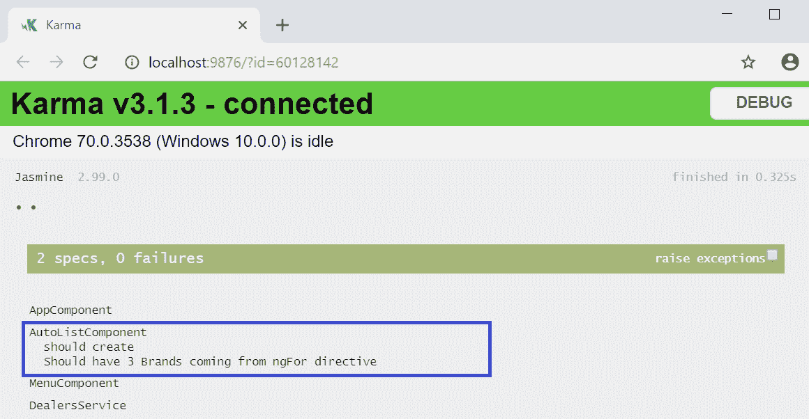

**用例＃2**：我们要验证 HTML 元素内的文本是否包含`vehicles`键盘：

```ts
// ngIf test script
 it('Test ngIf directive in component', async(() => {
 const fixture = TestBed.createComponent(AutoListComponent);
 fixture.detectChanges();
 const compiled = fixture.debugElement.nativeElement;
 const el = compiled.querySelector('#carLength');
 fixture.detectChanges();
 const content = el.textContent;
 expect(content).toContain('vehicles', 'vehicles');
 }));
```

在上述代码中有一些重要的事情需要注意。我们继续使用组件`AutoListComponent`的相同装置元素。这一次，我们使用`debugElement`接口，使用`querySelector`方法来查找具有标识符`carLength`的元素。最后，我们编写一个`expect`语句来断言文本内容是否包含`vehicles`关键字。

让我们再次使用`ng test`命令运行测试。我们应该看到以下输出：

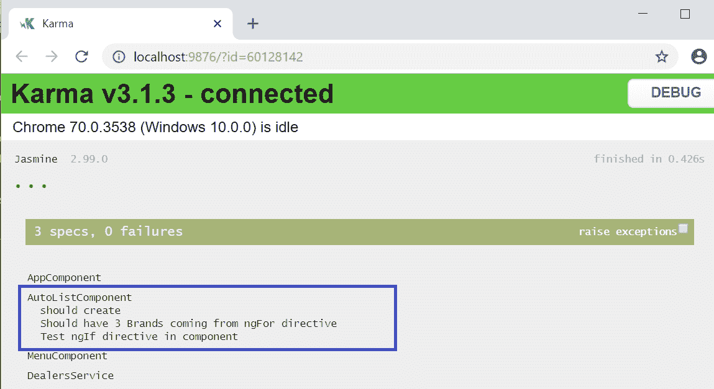

**用例＃3：**我们想使用`ngSwitch`来验证是否选择了`tab1`，如果是，则显示相应的 div：

```ts
// ngSwitch test script
 it('Test ngSwitch directive in component', async(() => {
 const fixture = TestBed.createComponent(AutoListComponent);
 fixture.detectChanges();
 const compiled = fixture.debugElement.nativeElement;
 const el = compiled.querySelector('.data-tab > div');
 const content = el.textContent;
 expect(content).toContain('ngSwitch Case 1');
 }));
```

在上述代码中，我们继续使用`AutoListComponent`组件的 fixture 元素。使用`debugElement`和`querySelector`方法，我们正在使用`className '.data-tab > div'`来定位元素。我们断言`ngSwitch`条件是否为`true`，并显示相应的`div`。由于我们在组件中将选项卡的值设置为`1`，因此选项卡 1 显示在屏幕上，并且测试规范通过：

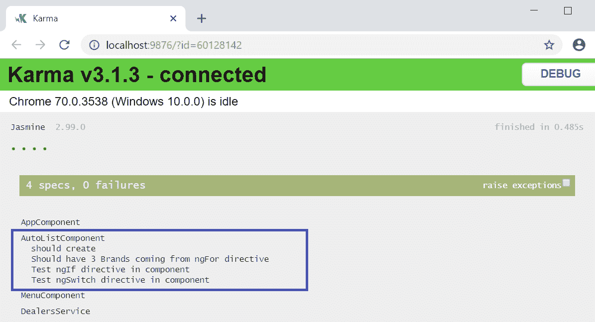

**用例＃4：**测试`AutoListComponent`中定义的方法，并断言该方法是否已被调用：

```ts
// Test button is clicked
 it('should test the custom directive', async(() => {
 const fixture = TestBed.createComponent(AutoListComponent);
 component = fixture.componentInstance;
 fixture.detectChanges();
 spyOn(component, 'findAuto');
 component.findAuto();
 expect(component.findAuto).toHaveBeenCalled();

}));
```

在上述代码中，我们正在创建`AutoListComponent`组件的 fixture。我们使用`spyOn`方法来监听组件实例。我们正在调用`findAuto()`方法。最后，我们编写一个`expect`语句来断言`findAuto`方法是否已被调用，使用`toHaveBeenCalled`。 

使用`ng test`命令运行测试。我们应该看到以下输出：

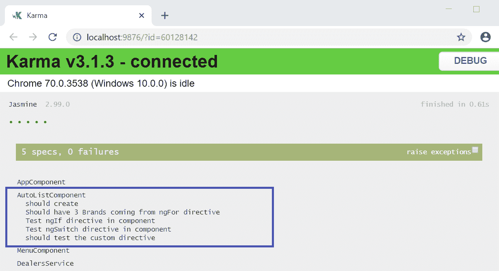

在本节中，我们学习了如何编写单元测试脚本来测试 Angular 内置指令，例如`ngFor`，`ngIf`，`ngSwitch`，最后，断言方法是否被点击和调用。

在下一节中，我们将学习有关测试 Angular 路由的知识。

# 测试 Angular 路由

很可能，您的应用程序中会有多个链接，以导航菜单或深链接的形式存在。这些链接在 Angular 中被视为路由，并且通常在您的`app-routing.module.ts`文件中定义。

我们在第四章中学习并掌握了如何使用 Angular 路由。在本节中，我们将学习如何编写用于测试 Angular 路由和测试应用程序中的链接和导航的测试脚本。

我们的应用程序需要一个漂亮的`menu`组件。使用`ng generate component menu`命令，我们将生成`menu`组件。现在，让我们转到`menu.component.html`并创建一个名为`navbar`的菜单，其中包含两个链接：

```ts
<nav class="navbar navbar-expand-lg navbar-light bg-light">
 <a class="navbar-brand" href="#">AutoStop </a>
 <button class="navbar-toggler" type="button" data-toggle="collapse" 
    data-target="#navbarSupportedContent" aria-controls="navbarSupportedContent" 
    aria-expanded="false" aria-label="Toggle navigation">
 <span class="navbar-toggler-icon"></span>
 </button>

<div class="collapse navbar-collapse" id="navbarSupportedContent">
 <ul class="navbar-nav mr-auto">
 <li class="nav-item active">
 <a class="nav-link" routerLink="/list-cars">Cars <span class="sr-only">
   (current)</span></a>
 </li>
 <li class="nav-item">
 <a class="nav-link" routerLink="/list-trucks">Trucks</a>
 </li>
 </ul>
 </div>
</nav>
```

前面的代码并不花哨，至少目前还不是。这是使用 Bootstrap 生成`navbar`组件的标准代码。仔细看，你会发现我们在菜单栏中定义了两个链接，`list-cars`和`list-trucks`，它们的类是`nav-link`。

现在我们可以围绕菜单功能编写一些测试规范，以测试`navbar`组件，其中将涵盖导航、链接计数等。

**用例＃1**：我们需要测试`navbar`菜单是否恰好有两个链接。

以下是检查是否有确切两个链接的代码：

```ts
// Check the app has 2 links
 it('should check routerlink', () => {
 const fixture = TestBed.createComponent(MenuComponent);
 fixture.detectChanges();
 const compiled = fixture.debugElement.nativeElement;

let linkDes = fixture.debugElement.queryAll(By.css('.nav-link'));
 expect(linkDes.length).toBe(2);

});
```

在前面的代码中，我们正在为我们的`MenuComponent`组件创建一个固定装置。由于我们分配了`nav-link`类，因此很容易定位组件中对应的链接。使用`debugElement`和`queryAll`方法，我们正在查找所有类名为`nav-link`的链接。最后，我们正在编写一个`expect`语句来断言返回的链接数组的长度是否等于`2`。

使用`ng test`命令运行测试。我们应该会看到以下输出：

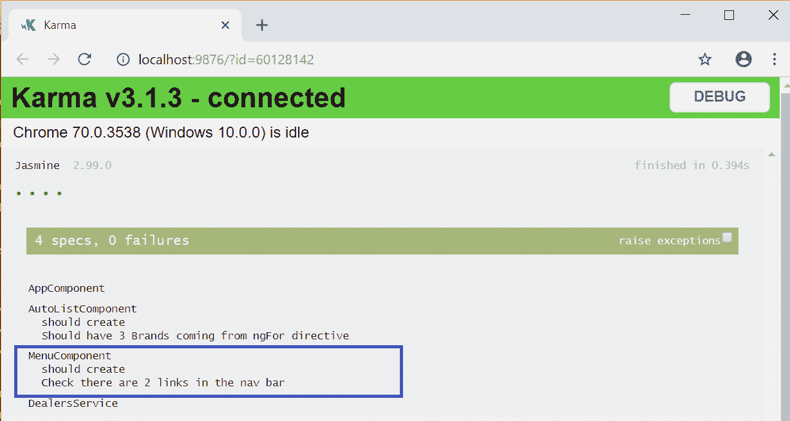

这是测试我们菜单功能的一个良好开端。现在我们知道我们的菜单中有两个链接，我们想要测试的下一个用例是第一个链接是否为`list-cars`。

以下是测试链接数组中第一个链接是否为`list-cars`的代码：

```ts
// Check the app has first link as "List Cars"
 it('should check that the first link is list-cars ', () => {
 const fixture = TestBed.createComponent(MenuComponent);
 fixture.detectChanges();
 const compiled = fixture.debugElement.nativeElement;

 let linkDes = fixture.debugElement.queryAll(By.css('.nav-link'));

 expect(linkDes[0].properties.href).toBe('/list-cars', '1st link should  
    go to Dashboard');
 });
```

在前面的代码中，我们正在为我们的`MenuComponent`组件创建一个固定装置。使用`debugElement`和`queryAll`方法，我们正在查找所有类名为`nav-link`的链接。我们将获得所有具有类名`nav-link`的链接。菜单中可能有多个链接，但我们感兴趣的是通过`index [0]`读取第一个元素的`href`属性，并断言该值是否匹配`/list-cars`。

再次运行`ng test`命令。我们应该会看到我们的测试报告已更新，如下图所示：

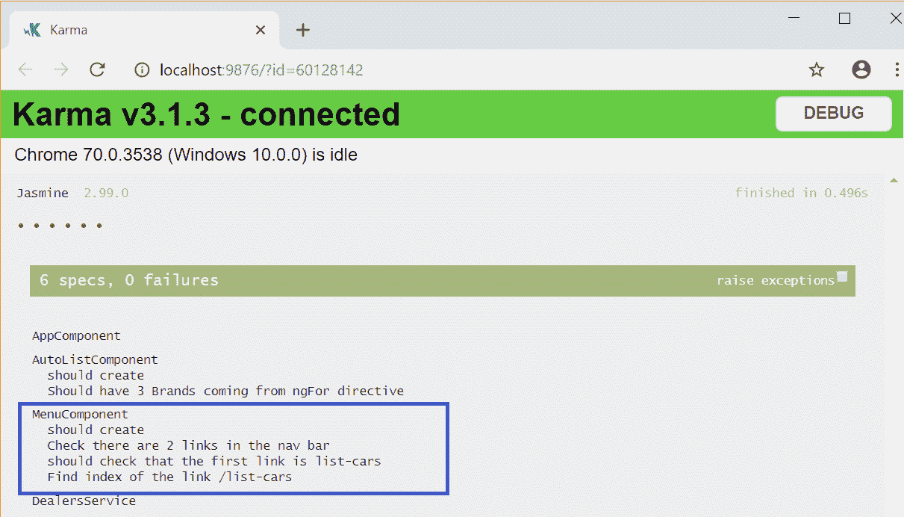

好的，公平的。我们得到了一个线索，即`list-cars`菜单链接是菜单列表中的第一个。如果我们不知道我们正在搜索的链接的索引或位置会怎么样？让我们也解决这个用例。

看一下以下代码片段：

```ts
// Check the app if "List Cars" link exist
 it('should have a link to /list-cars', () => {
 const fixture = TestBed.createComponent(AppComponent);
 fixture.detectChanges();
 const compiled = fixture.debugElement.nativeElement;
 let linkDes = fixture.debugElement.queryAll(By.css('.nav-link'));
 const index = linkDes.findIndex(de => {
 return de.properties['href'] === '/list-cars';
 });
 expect(index).toBeGreaterThan(-1);
 });
```

需要注意的一些事情是，我们正在查找路由路径`/list-cars`的索引，并且我们还在使用分配的类`nav-link`，并使用`queryAll`方法获取所有匹配元素的数组。使用`findIndex`方法，我们正在循环数组元素以找到匹配`href`为`/list-cars`的索引。

再次使用`ng test`命令运行测试，更新后的测试报告应如下所示：


在本节中，我们学习了各种方法来定位路由链接。同样的原则也适用于查找深链接或子链接。

这就是你的作业。

# 测试依赖注入

在之前的章节中，我们学习了如何编写测试脚本来测试 Angular 组件和路由。在本节中，我们将学习如何测试依赖注入以及如何测试 Angular 应用程序中的服务。我们还将学习如何将服务注入到 Angular 组件中，并编写测试脚本来测试它们。

# 什么是依赖注入？

**依赖注入**（**DI**）在 Angular 框架中是一个重要的设计模式，它允许在运行时将服务、接口和对象注入到类中，从而实现灵活性。

DI 模式有助于编写高效、灵活、可维护的可测试和易于扩展的代码。

如果你需要快速回顾，请转到第十一章，*依赖注入和服务*，其中深入介绍和解释了 DI 机制。

# 测试 Angular 服务

在本节中，我们将学习如何通过服务和接口测试 Angular 依赖注入。为了测试一个 Angular 服务，我们首先需要在我们的应用程序中创建一个服务！

在 Angular CLI 中使用`ng generate`命令，我们将在项目文件夹中生成服务：

```ts
ng generate service services/dealers
```

成功执行后，我们应该看到以下文件已被创建：

+   `services/dealers.service.spec.ts`

+   `services/dealers.service.ts`

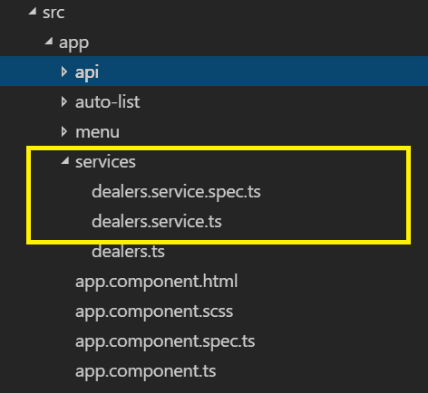

现在我们已经生成了我们的经销商服务和相应的测试规范文件，我们将在服务中添加一些方法和变量，以便在我们的测试规范中使用它们。导航到我们的服务类并更新`dealers.service.ts`文件。更新后的代码应如下所示：

```ts
import { Injectable } from '@angular/core';

@Injectable({
  providedIn: 'root'
})
export class DealersService {
  dealers: any;

  constructor(private http : HttpClient) { }

  getDealers(){
    this.dealers = [
      { id: 1, name: 'North Auto'},
      { id: 2, name: 'South Auto'},
      { id: 3, name: 'East Auto'},
      { id: 4, name: 'West Auto'},
    ];

    return this.dealers;
  }

}
```

在上述代码中，我们进行了简单的更改，以便我们可以围绕经销商服务编写一些测试规范。我们定义了一个`any`类型的变量。我们正在定义一个`getDealers`方法，它将返回一个带有`id`和`name`键对的 JSON 响应。好了，现在让我们想出一些用例来编写我们的测试脚本，比如获取经销商的数量，查找匹配的经销商等。

使用案例＃1：当调用`getDealers`方法时，它应返回经销商列表，计数应等于`4`。

以下是此测试规范：

```ts
it('Test Dependency Injection to get 4 dealers', () => {
const service: DealersService = TestBed.get(DealersService);
let dealers = service.getDealers();
expect(dealers.length).toBe(4);
});
```

使用案例＃2：我们想要检查第一个经销商的名称是否为`North Auto`。

以下是此测试规范：

```ts
it('Test if the first Dealer is North Auto', () => {
const service: DealersService = TestBed.get(DealersService);
let dealers = service.getDealers();
expect(dealers[0].name).toBe('North Auto');
});
```

太棒了！到目前为止，一切顺利。因此，我们已经学会了如何为我们新创建的经销商服务编写测试规范。这只是依赖注入的一部分。作为依赖注入的一部分，我们可能需要在运行时将其他所需的类注入到服务中。

让我们快速创建一个名为`Dealers`的类，并在其中定义两个变量，即`username`和`name`。现在，让我们将此文件保存为`dealers.ts`：

```ts
export class Dealers {

 constructor(
  public username: string = '',
  public name: string = ''
 ) {};

}
```

我们现在将在我们的经销商服务中包含新创建的类，并创建一个方法来初始化该类并创建一个对象来返回一些数据：

```ts
getDealerObject()
 {
 this.dealerObj= new Dealers('World','Auto');
 return this.dealerObj;
 }
```

这将引出我们下一个要测试的用例。

使用案例＃3：测试通过已注入到服务中的类进行依赖注入。

看一下以下代码：

```ts
 it('Test if the dealer returned from object is World Auto', () => {
 const service: DealersService = TestBed.get(DealersService);
 let dealerObj = service.getDealerObject();
 expect(dealerObj.name).toBe('Auto');
 });
```

在上述代码中，我们创建了我们服务的一个实例并调用了`getDealerObject()`方法。我们断言返回的值是否与响应的`name`属性匹配`Auto`。

我们正在调用服务中定义的方法，该方法在内部依赖于`Dealers`类。

使用案例＃4：如果我们只想测试`Dealers`类的属性怎么办？

我们也可以测试。以下是此示例代码：

```ts

it('should return the correct properties', () => {
var dealer = new Dealers();
dealer.username = 'NorthWest';
dealer.name = 'Auto';

expect(dealer.username).toBe('NorthWest');
expect(dealer.name).toBe('Auto');

});
```

现在，让我们运行`ng test`命令。我们应该看到以下输出：

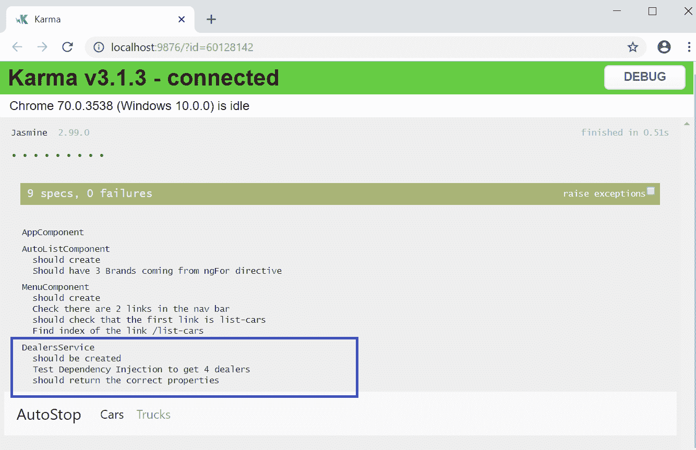

在同一行上，您可以编写测试脚本来测试您的服务、依赖类或接口类。

**用例＃5**：在组件内测试 Angular 服务。

我们将继续测试 Angular 依赖注入。这一次，我们将把我们的服务导入到组件中，并验证它是否按预期工作。

为了实现这个用例，我们需要对`AutoListComponent`进行更改。

看一下我们将在`auto-list.component.ts`文件中进行的更改：

```ts
import { DealersService } from '../services/dealers.service';
constructor(private _dealersService : DealersService) { }
findAuto() {
 this.dealers = this._dealersService.getDealers();
 return this.dealers;
 }
```

在上面的代码中，我们将服务商服务导入到组件中。我们在构造方法中创建了服务的实例。我们添加了一个`findAuto`方法，它使用`class _dealersService`服务的实例调用`getDealers`方法。为了在我们的组件中测试服务，让我们通过添加以下代码修改`auto-list.component.spec.ts`文件：

```ts
import { DealersService } from '../services/dealers.service';
beforeEach(() => {
 fixture = TestBed.createComponent(AutoListComponent);
 component = fixture.componentInstance;
 fixture.detectChanges();
 service = TestBed.get(DealersService);
 });
```

在上面的代码中，我们已经将我们的服务商导入到`AutoListComponent`的测试规范文件中。我们在`beforeEach`方法中使用`TestBed`创建了服务的实例。现在我们可以开始编写我们的测试规范，以测试服务。在`auto-list.component.spec.ts`中添加以下代码：

```ts
it('should click a button and call method findAuto', async(() => {
    const fixture = TestBed.createComponent(AutoListComponent);
    component = fixture.componentInstance;
    fixture.detectChanges();
    spyOn(component, 'findAuto');
    let dealers = component.findAuto();
    expect(dealers.length).toEqual(4);

  }));
```

在上面的代码中，使用组件的实例，我们调用`findAuto`方法，它将从服务返回数据。它期望计数等于`4`。

使用`ng test`命令运行测试。我们应该看到以下输出：

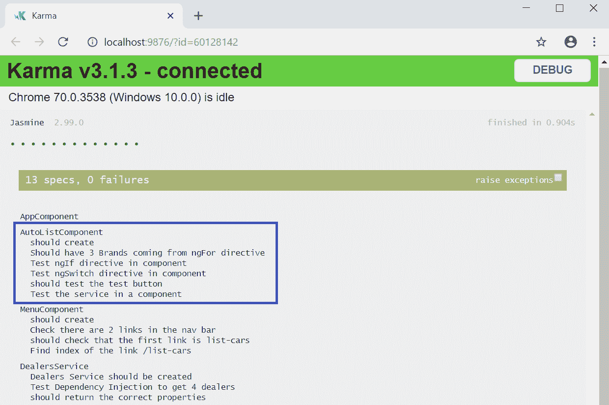

在本节中，我们学习了各种测试 Angular 依赖注入的技术，包括服务、依赖类和在 Angular 组件内测试服务。

# 测试 HTTP

在第十二章中，*集成后端数据服务*，我们学习了如何集成后端服务，还学习了`HTTPModule`和`HTTPClient`。我们还学习了如何向服务器发出 HTTP 请求并处理响应。

在本节中，我们将学习如何编写测试脚本来测试 HTTP 请求和响应。我们将继续使用本章中创建的同一个项目——AutoStop 项目。在我们进一步进行之前，有必要准备好 REST API 端点，以便我们可以在我们的应用程序中使用它们。

我们将学习如何使用公共 API `https://jsonplaceholder.typicode.com/`，这在互联网上是免费的。我们还将创建一个本地服务器，从本地静态 JSON 文件返回模拟的 JSON 响应。

我们必须将`HttpClientModule`和`HttpClientTestingModule`导入到我们的`app.module.ts`文件中。

在我们继续编写用于测试 Angular HTTP 的测试脚本之前，我们需要更新我们在本章中一直使用的经销商服务。我们将实现一些方法，这些方法将进行 HTTP 调用 - POST/GET 以处理数据到 REST API 端点。

我们正在按照以下方式处理`dealers.service.ts`文件：

```ts
import { HttpClient } from '@angular/common/http';
import { HttpHeaders, HttpParams, HttpErrorResponse } from '@angular/common/http';
readonly REST_ENDPOINT = 'https://jsonplaceholder.typicode.com/users';
readonly DEALER_REST_ENDPOINT = 'https://jsonplaceholder.typicode.com/users/1';
private _carurl = 'http://localhost:3000/cars';
```

在上述代码中，我们正在导入所需的 HTTP 模块；即`HttpClient`、`HttpHeaders`、`HttpParams`和`HttpErrorResponse`，并定义了两个具有用户 API URL 和特定用户的 REST 端点。

我们也可以启动本地服务器。您可以使用 JSON 服务器创建本地 API。您可以在[`github.com/typicode/json-server`](https://github.com/typicode/json-server)了解更多信息。

是时候添加一些方法了，通过这些方法我们将对 REST 端点进行 HTTP 调用：

```ts
getAllDealers()
{
this.allDealers = this.http.get(this.REST_ENDPOINT,
{
headers: new HttpHeaders().set('Accept', 'aplication/json')
});
return this.allDealers;
}

getDealerById(){
let params = new HttpParams().set('id', '1');
this.dealerDetails = this.http.get(this.REST_ENDPOINT, {params});
return this.dealerDetails;
}
```

在上述代码中，我们正在创建两个方法，它们进行 HTTP GET 请求。第一个方法`getAllDealers`进行调用，并期望获得用户的 JSON 响应。第二个方法`getDealerById`将传递`id`为`1`，并期望获得单个用户数据的响应。在`getDealerById`方法中，我们使用`HttpParams`来设置要发送到端点的参数。我们还将修改我们的`autoListComponent`组件，向我们的`Component`类中添加一些方法。

我们将向我们的`auto-list.component.ts`文件添加以下代码：

```ts
findAuto() {
 this.dealers = this._dealersService.getDealers();
 return this.dealers;
 }

listAllDealers(){
 this.allDealers = this._dealersService.getAllDealers();
 }

listDealerById(){
 this.showDealerInfo = true;
 this.dealerDetail = this._dealersService.getDealerById();
 return this.dealerDetail;
 }

getCarList() {
 this.carList = this.http.get<Cars[]>(this._carurl);
 }
```

在上述代码中，我们正在添加一些方法，即`findAuto`、`listDealerById`和`getCarList`，它们进行了 HTTP 调用并调用了经销商服务中的方法。

好了，现在我们已经设置好了进行 HTTP 调用的组件和服务，我们可以开始编写我们的 HTTP 测试了。

**用例＃1**：我们要测试是否对特定 URL 进行了`GET`调用。

我们将向`auto-list.component.spec.ts`文件添加以下代码：

```ts
// Test HTTP Request From Component
 it('Test HTTP Request Method', async(() => {
 const fixture = TestBed.createComponent(AutoListComponent);

 component = fixture.componentInstance; 
 httpMock = TestBed.get(HttpTestingController);

 let carList = component.getCarList();

 fixture.detectChanges();
 const req = httpMock.expectOne('http://localhost:3000/cars');

 expect(req.request.method).toBe('GET');
 req.flush({});

 }));
```

在上述代码中，我们正在创建`AutoListComponent`的实例，使用它来调用`getCarList`方法。在`getCarList`方法中，我们正在调用`http://localhost:3000/cars`的 URL 来检索数据。我们创建了一个名为`httpMock`的`HttpTestingController`类的实例。使用`httpMock`实例，我们断言至少应该对该 URL 进行一次调用。

**用例＃2**：我们希望期望结果返回的数据多于`1`：

```ts
it('Test HTTP Request GET Method With subscribe', async(() => {
const fixture = TestBed.createComponent(AutoListComponent);
component = fixture.componentInstance;
component.listDealerById().subscribe(result => 
expect(result.length).toBeGreaterThan(0));

}));
```

在上述代码中，我们使用`AutoListComponent`的实例调用`listDealerById`方法。使用`subscribe`，我们正在映射结果并验证结果数据长度是否大于`0`。

**用例＃3**：我们想要验证从 HTTP 调用返回的数据是否匹配数据。以下是此用例场景的示例代码。

```ts
it('Test if the first Dealer is North Auto', () => {
const service: DealersService = TestBed.get(DealersService);
let dealers = service.getDealers();
expect(dealers[0].name).toBe('North Auto');
});
```

在上述代码中，我们使用`DealersService`实例调用`getDealers`方法。我们断言第一个索引属性名称的数据应为`North Auto`。

使用`ng test`命令运行测试。我们应该看到以下输出，如下面的截图所示：

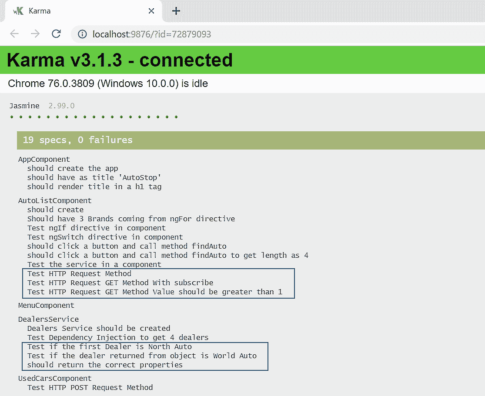

如果您看到了上述输出，那太棒了。

在本节中，我们学习了如何测试进行 HTTP 请求调用的组件、服务和方法。

# 摘要

测试是应用程序生命周期中的重要方面，编写测试脚本对于应用程序开发成功至关重要。我们首先概述了 Angular 支持的框架，即 Jasmine 和 Karma。我们学习了如何使用`ng test`命令运行测试。然后，我们学习了如何使用 Angular 自动生成的 spec 文件来为所有组件和服务编写测试脚本。

我们学习了如何编写测试脚本来测试 Angular 组件、内置指令、服务和路由。我们为内置指令编写了测试脚本，例如`ngFor`、`ngIf`、`ngSwitch`和`ngModel`。我们还涵盖了用于测试 Angular 路由的用例。然后，我们创建了一个`menu`组件，并编写了测试脚本来测试`menu`组件的各种用例。

我们还探讨了测试依赖注入和服务。我们学习了各种用例，并为 Angular 服务和 HTTP 调用编写了测试脚本。

在下一章中，我们将探讨高级的 Angular 主题，如自定义指令和自定义表单验证。

继续阅读！
