# 第十四章：高级 Angular 主题

在之前的章节中，我们学习了如何使用指令和表单验证器。在本章中，我们将通过自定义指令和自定义验证器来扩展我们的知识。我们还将学习如何使用 Angular 构建单页应用（SPA）。

此外，我们将探讨如何将身份验证集成到我们的 Angular 应用程序中，使用两个流行的身份验证提供者：Google Firebase 身份验证和 Auth0。

本章将涵盖以下主题：

+   自定义指令

+   自定义表单验证器

+   构建 SPA

+   用户身份验证

+   使用 Firebase 身份验证进行身份验证

+   使用 Auth0 进行身份验证

+   客户端的连接

# 自定义指令

在本节中，我们将学习如何创建自定义指令。

**首先，让我们了解什么是 Angular 指令。**

Angular 指令是扩展 HTML 功能和元素行为的一种方式。

在之前的章节中，我们学习了并实现了许多内置指令，比如`*ngIf`、`*ngFor`、`*ngSwitch`和`ngModel`。

在本节中，我们将学习如何创建我们自己的自定义指令来扩展 HTML 元素的功能。

**用例：**我们想为表单元素和`onfocus`创建一个自定义指令。背景颜色应设置为浅蓝色，边框为深蓝色，`onblur`事件应以红色突出显示。所以，让我们开始：

1.  让我们使用`ng`命令生成指令：

```ts
 ng g directive onFocusBlur
```

运行上述命令后，屏幕上会显示以下内容：

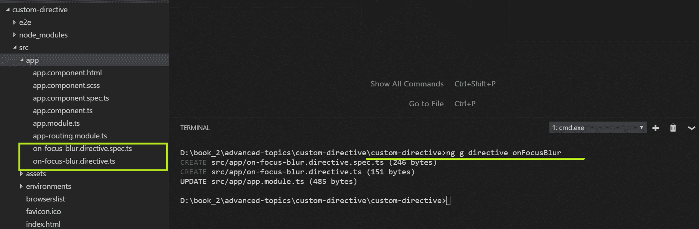

请注意，指令文件已经生成，并且我们的`app.module.ts`文件也已更新，这意味着该指令可以在整个应用程序中使用，在任何组件中使用。

1.  在指令文件`on-focus-blur.directive.ts`中，添加以下代码行：

```ts
      import { Directive } from '@angular/core';
      import { HostListener, HostBinding } from '@angular/core';

      @Directive({
      selector: '[appOnFocusBlur]'
      })
      export class OnFocusBlurDirective {

      constructor() { }

      @HostBinding("style.background-color") backgroundColor;

      @HostListener('focus') onFocus() {
        this.backgroundColor = '#19ffe4';
      }

      @HostListener('blur') onBlur() {
        this.backgroundColor = '#ff1934';
      }

      }
```

在上面的代码中，应注意以下重要事项：

+   我们正在导入所需的模块，即`Directive`、`HostListener`和`HostBinding`。

+   使用`@directive`装饰器，我们通过选择器定义指令的名称。

+   `@HostBinding`用于在元素上设置属性。

+   `@HostListener`用于监听宿主元素上的事件。

+   在上面的示例中，我们绑定了样式背景颜色属性。我们可以在宿主元素上绑定任何样式、类或事件属性。

+   使用`@HostListener`，我们监听事件，并使用`onFocus`改变背景颜色。通过使用`onBlur`，我们重置颜色。

现在，我们可以在应用程序的任何地方使用这个装饰器。

1.  我们将在`app.component.html`文件中的表单控件输入元素中使用它：

```ts
      <input type="text" appOnFocusBlur class="nav-search" >
```

1.  使用`ng serve`命令运行应用程序，并单击`Input button`。我们应该看到以下截图中显示的输出和行为：

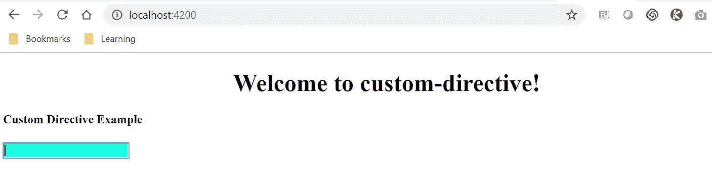

很好。现在我们知道如何编写自定义指令，我们将继续尝试创建我们自己的自定义指令。

在下一节中，我们将学习如何编写自定义表单验证。

# 自定义表单验证

在之前的章节中，我们学习了表单和实现表单验证。我们使用了内置的表单验证或 HTML5 属性验证。但是，在更复杂的场景中，我们将需要实现自定义表单验证。这些验证因应用程序而异。在本节中，我们将学习自定义表单验证。简而言之，Angular 通过`Validators`模块为我们提供了各种选项，通过它们我们可以在 Angular 表单中实现表单验证。

以下代码示例中展示了使用验证器：

```ts
loginForm = new FormGroup({
 firstName: new FormControl('',[Validators.required, 
 Validators.maxLength(15)]),
 lastName: new FormControl('',[Validators.required]),
 });
```

在上述代码中，我们使用`Validators`模块应用了`required`、`maxLength`等验证。

现在，让我们学习如何创建我们自己的自定义表单验证。首先，我们将生成一个组件，在其中我们将实现一个表单和一些元素，以便我们可以应用我们新创建的指令：

```ts
ng g c customFormValidation
```

成功运行上述命令后，我们应该看到以下输出：

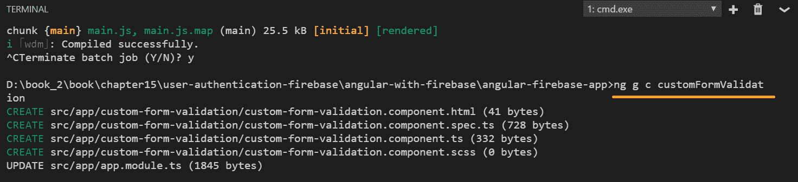

现在我们已经生成了我们的组件，让我们生成一个指令，在其中我们将实现自定义表单验证。

我们将实现一个自定义指令来检查 ISBN 字段。

**什么是 ISBN？** ISBN 是每本出版书籍的唯一标识符。

以下是 ISBN 号码所需的条件：

+   ISBN 号码应该正好是 16 个字符

+   只允许使用整数作为 ISBN。

现在，使用`ng`命令，我们将生成我们的指令：

```ts
ng g directive validISBN
```

成功执行上述命令后，我们应该看到以下截图中显示的输出

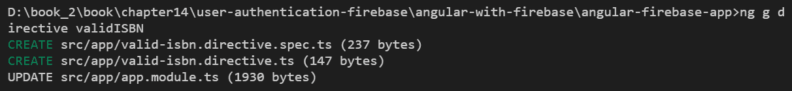

在`valid-isbn.directive.ts`文件中，添加以下代码行：

```ts
import { Directive } from  '@angular/core'; import { NG_VALIDATORS, ValidationErrors, Validator, FormControl } from  '@angular/forms'; 
@Directive({
    selector: '[validISBN]',
    providers: [
         { provide: NG_VALIDATORS, 
            useExisting: ValidISBNDirective, multi: true }
    ]
})  
export  class ValidISBNDirective implements Validator { static validateISBN(control: FormControl): ValidationErrors | null {       
 if (control.value.length <  13) {
 return { isbn: 'ISBN number must be 13 digit long' };        }
 if (!control.value.startsWith('Packt')) {
 return { isbn: 'Value should start with Packt' };        }
 return  null;
    }

    validate(c: FormControl): ValidationErrors | null {        return ValidISBNDirective.validateISBN(c);    }
}
```

让我们详细分析上面的代码片段。首先，使用`ng` CLI 命令，我们生成了一个名为`validISBN`的指令。Angular CLI 将自动生成所需的文件，并预填充基本语法。我们正在导入所需的模块，即`NG_VALIDATORS`、`ValidationErrors`、`Validator`和`FormControl`。我们正在将所需的模块作为我们的提供者的一部分注入。接下来，我们实现了一个名为`validateISBN`的方法，它接受`FormControl`类型的参数。我们将我们的表单控件字段传递给这个方法，它将验证表单控件的值是否与方法中实现的条件匹配。最后，我们在`validate`方法中调用`validateISBN`方法。

现在，我们可以在任意数量的地方使用这个自定义表单验证，也就是说，无论我们需要验证或验证 ISBN 号码的地方。让我们使用`ng serve`命令运行应用程序。我们应该看到以下输出：

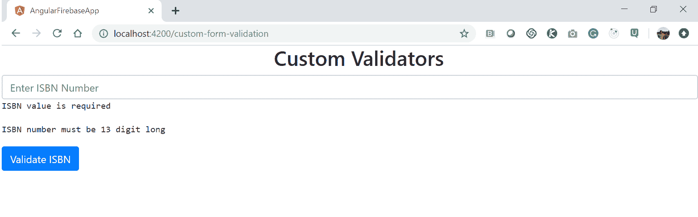

到目前为止，在本章中，我们已经在一些情况下应用了一些开箱即用的想法，并学习了如何构建我们自定义的指令和自定义表单验证。我们还学会了如何轻松地将它们集成到现有或任何新的应用程序中。所有这些也可以成为单页应用的一部分。等等。什么？单页应用？那是什么？在下一节中，我们将学习关于单页应用的一切，并构建我们自己的单页应用。

# 构建单页应用

在本节中，我们将学习构建单页应用。

**什么是单页应用？**

单页应用是一种与用户交互的 Web 应用程序或网站，它通过动态重写当前页面与用户交互，而不是从服务器加载全新的页面。

把它想象成一个只有一个 HTML 文件的应用程序，页面的内容根据用户的请求动态加载。我们只创建在运行时动态渲染在浏览器中的模板。

让我给你一个很好的例子。

在第十五章中，*部署 Angular 应用程序*，使用`ng build`命令，我们生成了 Angular 应用程序的编译代码。

查看由 Angular 生成的编译源代码：

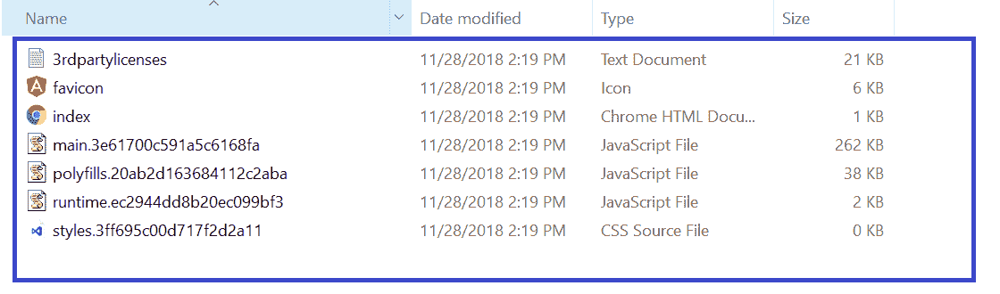

在上面的截图中，你将只看到一个名为`index`的 HTML 文件。

继续打开文件 - 您会发现它是空白的。这是因为 Angular 应用程序是单页面应用程序，这意味着内容和数据将根据用户操作动态生成。

可以说所有的 Angular 应用程序都是单页面应用程序。

以下是构建单页面应用程序的一些优势：

+   页面是动态呈现的，因此我们的应用程序源代码是安全的。

+   由于编译后的源代码在用户的浏览器中呈现，页面加载速度比传统的请求和响应模型快得多。

+   由于页面加载速度更快，这导致了更好的用户体验。

+   使用`Router`组件，我们只加载特定功能所需的组件和模块，而不是一次性加载所有模块和组件。

在本书的整个过程中，我们创建了许多 Angular 应用程序，每个应用程序都是单页面应用程序。

# 用户认证

在本节中，我们将学习如何在我们的 Angular 应用程序中实现用户认证。

在广义上，用户认证包括安全地将用户登录到我们的应用程序中，用户应该能够在安全页面上查看、编辑和创建数据，最后从应用程序中注销！

在现实世界的应用程序中，需要进行大量的额外检查和安全实施，以清理用户输入，并检查他们是否是有效用户，或验证会话超时的身份验证令牌，以及其他数据检查，以确保不良元素不会进入应用程序。

以下是一些重要的用户认证模块：

+   注册新用户

+   现有用户的登录

+   密码重置

+   已登录用户的会话管理

+   一次性密码或双重认证

+   注销已登录的用户

在接下来的章节中，我们将学习如何使用 Firebase 和 Auth0 框架实现上述功能。

# 使用 Firebase 进行用户认证

在本节中，我们将学习如何使用 Firebase 实现用户认证。

**什么是 Firebase？**

Firebase 是由 Google 提供的托管服务。Firebase 为我们提供了诸如分析、数据库、消息传递和崩溃报告等功能，使我们能够快速移动并专注于我们的用户。您可以在[`firebase.com`](https://firebase.com)了解更多有关该服务的信息。现在，让我们立即开始在我们的 Angular 应用程序中实现 Firebase。

第一步是创建一个谷歌账户来使用 Firebase 服务。您可以使用您的谷歌账户登录 Firebase。一旦您成功创建了 Firebase 账户，您应该会看到以下输出：

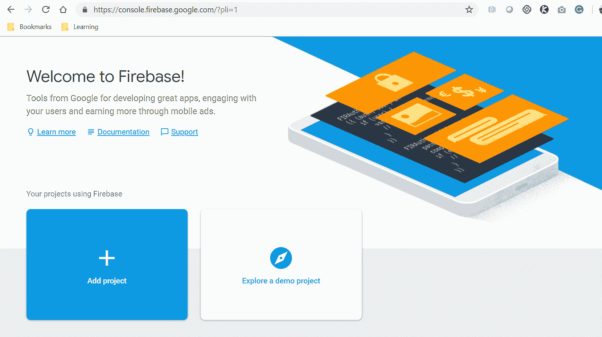

要创建一个新项目，请点击“添加项目”链接。

您将看到以下对话框窗口，提示您输入项目名称；在我们的情况下，我们正在将我们的项目命名为 AutoStop：

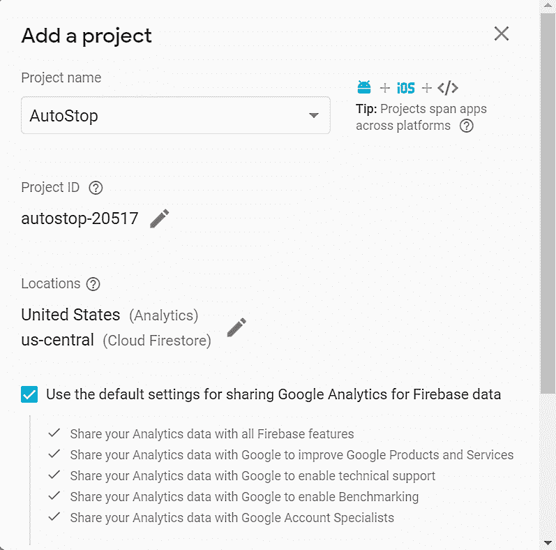

请注意，谷歌将为您的项目分配一个唯一的项目 ID。

现在，点击左侧菜单上的认证链接，设置用户认证功能，我们可以在我们的 Angular 应用程序中嵌入和设置：

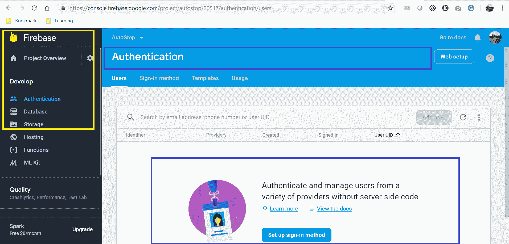

我们可以在这里做很多其他很酷的事情，但现在我们将专注于认证模块。

现在，点击登录方法选项卡，设置如何允许用户登录到我们的 Angular 应用程序的选项：

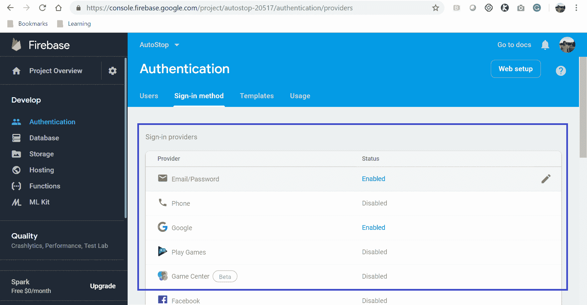

在上述截图中，您将注意到以下重要事项：

+   谷歌 Firebase 提供了各种选项，我们可以启用这些选项，通过这些选项，我们希望我们应用程序的用户登录。

+   我们需要单独启用每个提供者选项。

+   我们已在我们的应用程序中启用了电子邮件/密码和谷歌选项。

+   为了启用 Facebook、Twitter 和其他应用程序，我们需要输入各自服务提供的开发者 API 密钥。

现在，在页面上向下滚动一点，您将看到一个名为授权域的设置选项。

我们将看到 Firebase 应用程序上设置了两个默认值，即 localhost 和一个唯一的子域，在下面的截图中显示：

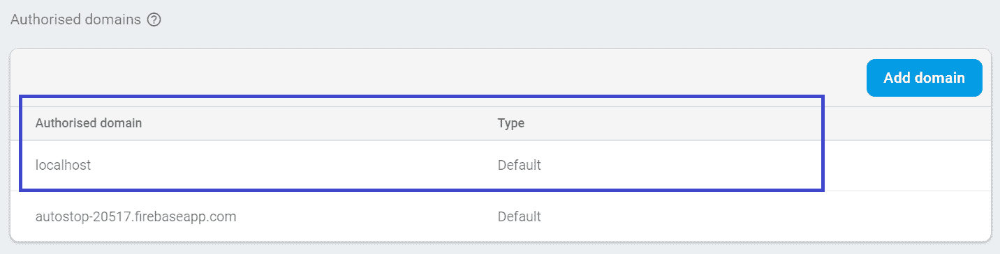

我们已经做出了必要的更改。现在，我们需要设置 Google Firebase 的应用设置。现在是在我们的 Angular 应用程序中实现用户认证的时候了。

**先决条件：**我们期望用户已经有一个正在运行的 Angular 应用程序。

打开 Angular CLI 命令提示符；我们需要安装一些模块。我们需要先安装 Angular Fire2 和 Firebase：

请注意，Angular Fire2 现在是 Angular Fire。

我们需要运行以下命令在我们的应用程序中安装 Angular Fire：

```ts
npm install angularfire2 
```

在成功执行上述命令后，我们应该看到以下截图中显示的输出：

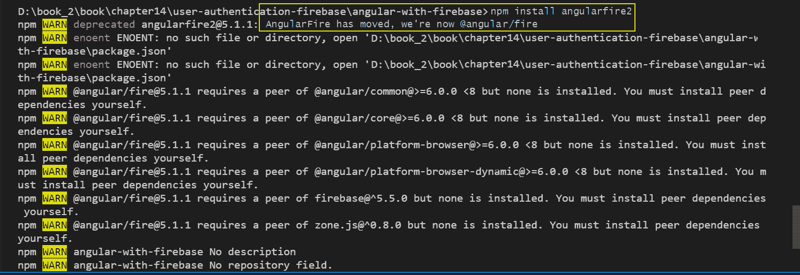

一切就绪。现在，我们需要创建一个处理身份验证功能的服务。

```ts
ng g service appAuth
```

使用`ng`命令，我们正在生成一个名为`appAuth`的新服务：

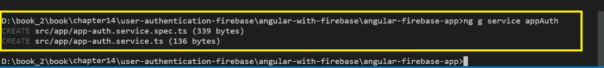

现在，是时候修改`appAuth.service.ts`文件并添加以下代码了：

```ts
import { Injectable } from '@angular/core';
import { AngularFireAuth } from '@angular/fire/auth';
import { auth } from 'firebase/app';
import { Router } from '@angular/router';

@Injectable({
providedIn: 'root'
})
export class AppAuthService {

    private authUser:any;
    private authState:any;
    private loggedInUser = false;
    private userToken ='';

constructor(public afAuth: AngularFireAuth, private router :Router) { }

login() {
this.afAuth.auth.signInWithPopup(new auth.GoogleAuthProvider());

this.loggedInUser = true;

this.afAuth.currentUser.getIdToken(true).then(token => this.userToken = token);

this.afAuth.authState.subscribe((auth) => {
this.authState = auth;
});

this.router.navigate(['/profile']);
}

isLoggedInUser(){
if(this.userToken != '')
return true;
else 
return false;
}

logout() {
this.afAuth.auth.signOut();
this.loggedInUser = false;
this.userToken = '';
}

}
```

在上述代码中，我们正在对`app-auth.service.ts`文件进行更改。应注意以下重要点：

+   我们正在将所需的类，即`AngularFireAuth`，`Auth`和`Router`，导入到服务中。

+   使用`@Injectable`，我们指定该服务在 Angular 树结构中的根级别注入。

+   我们正在定义一些私有变量，我们将在整个应用程序中使用。

+   在构造函数方法中，我们正在注入`AngularFireAuth`和`Router`类。

+   我们正在定义三种方法：`Login`，`Logout`和`isLoggedInUser`。

+   在`login`方法中，我们正在使用`this.afAuth`实例，调用`signInWithPopup`方法，并传递`auth.GoogleAuthProvider`参数，该参数来自我们在本地安装的 Firebase 应用程序：

```ts
this.afAuth.auth.signInWithPopup(new auth.GoogleAuthProvider());
```

+   当调用此方法时，将打开一个新窗口，在其中我们可以看到谷歌登录选项，使用它我们可以登录到应用程序。

+   我们正在将`this.loggedInUser`变量设置为`true`。

+   我们将已登录用户的令牌设置为`this.userToken`变量。

+   我们还订阅以获取`authState`响应。

+   最后，使用路由器实例和使用`navigate`方法，我们将用户重定向到个人资料页面。

+   在`isLoggedInUser`方法中，我们正在验证`userToken`是否已设置。如果用户已正确登录，`userToken`将被设置；否则，该方法将返回`false`。

+   在`logout`方法中，再次使用`afauth`的实例，我们正在调用`signout`方法，这将注销用户。

+   最后，我们将`userToken`设置为`empty`。

太棒了。我们已经在`app-auth.service.ts`文件中完成了所有繁重的工作。现在，是时候在我们的组件中调用这些方法了：`login`，`profile`和`log out`。

在`login.component.html`文件中，我们将添加以下登录表单：

```ts
<div *ngIf="!_appAuthService.loggedInUser">
<form [formGroup]="loginForm" (ngSubmit)="onSubmit()">

<label>
First Name:
<input type="text" formControlName="firstName">
</label>

<label>
Last Name:
<input type="text" formControlName="lastName">
</label>

<button>Login</button>

</form>
</div>
```

在上述代码中，我们只是使用`FormGroup`和`FormControllers`添加了一个 Angular 响应式登录表单。

登录表单的输出显示在以下截图中：

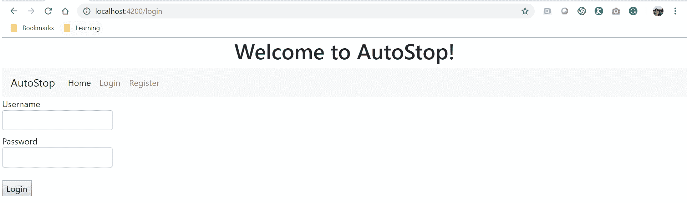

在`profile.component.ts`文件中，我们只是调用了`login`方法：

```ts
onSubmit(){
 this._appAuthService.login();
 console.warn(this.loginForm.value);
 }
```

现在，在`profile.component.ts`文件中，我们添加了一个检查，以查看用户是否已登录：

```ts
<div *ngIf="_appAuthService.isLoggedInUser">
<p>
profile works!
</p>

User Token is {{_appAuthService.userToken}}
</div>
```

当用户导航到个人资料页面时，如果他们已登录，他们将看到详细信息；否则，用户将被重定向到登录页面。

现在，进入最后一部分；我们将在我们的`app.component.html`文件中有一个注销链接：

```ts
<nav>
 <a routerLink='/login' *ngIf="!_appAuthService.isLoggedInUser()">Login</a>
 <a routerLink='/register'>Register</a>
 <a routerLink='/logout' *ngIf="_appAuthService.isLoggedInUser()">Logout</a>
</nav>
```

我们正在添加带有`*ngIf`条件的链接，以在用户已登录或未登录时显示相应的链接：

```ts
 ngOnInit() {
 this._appAuthService.logout();
 this.router.navigate(['/login']);
 }
```

当用户点击注销链接时，我们调用`appAuthService`的注销方法，并在成功注销后将用户重定向回登录页面。

现在，让我们使用`ng serve`命令来运行应用程序。我们应该看到以下输出：

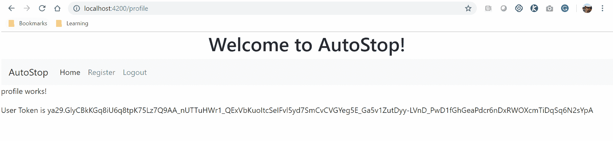

# 使用 Auth0 进行用户身份验证

在本节中，我们将学习如何使用 Auth0 实现用户身份验证。在我们继续在我们的 Angular 应用程序中实现 Auth0 之前，我们需要实现一些先决条件。让我们开始吧：

1.  首先，我们需要在 Auth0.com 上创建一个帐户。成功登录到帐户后，我们应该看到以下仪表板屏幕：

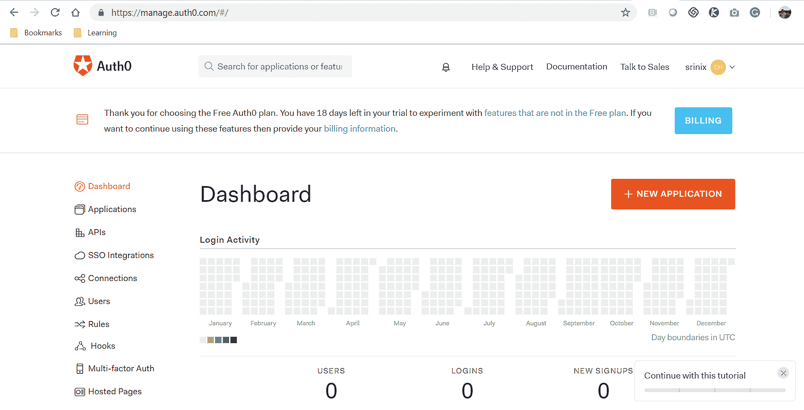

我们将不得不注册我们的应用程序，以便我们可以创建所需的设置来在我们的应用程序中实现`Auth0`。

1.  点击左侧菜单上的“应用程序”链接：

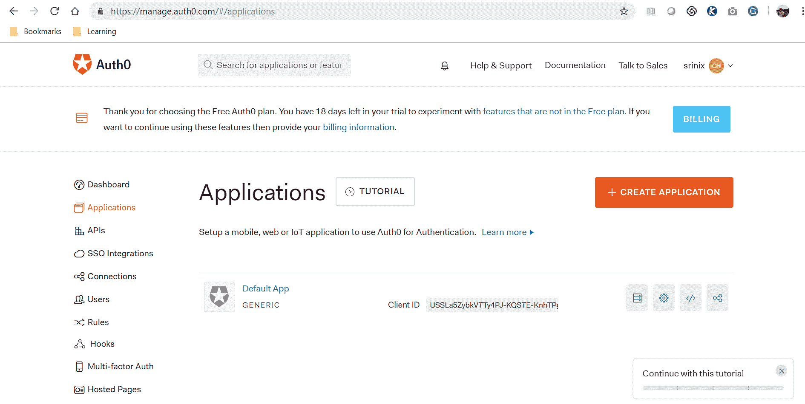

1.  现在，点击“创建应用”按钮创建一个应用：

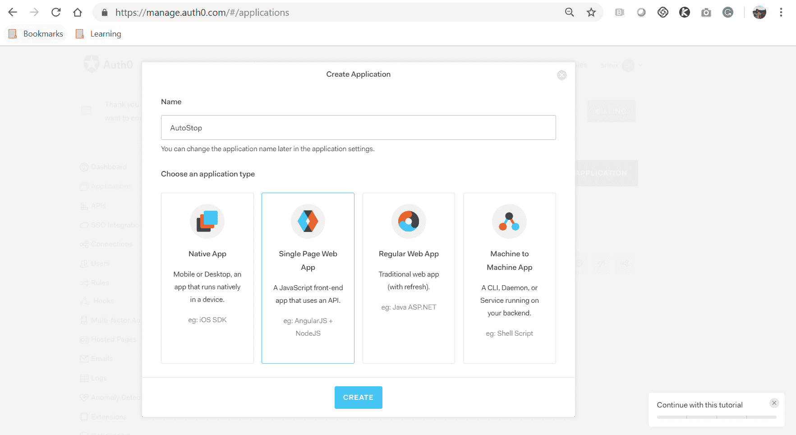

1.  我们需要输入应用程序的名称并选择我们正在构建的应用程序类型。在我们的情况下，这是一个单页 Web 应用程序，所以请继续选择该选项并点击“创建”按钮。

1.  我们需要做的下一件事是更新应用程序的重要设置。因此，点击应用程序名称并导航到“设置”选项卡：

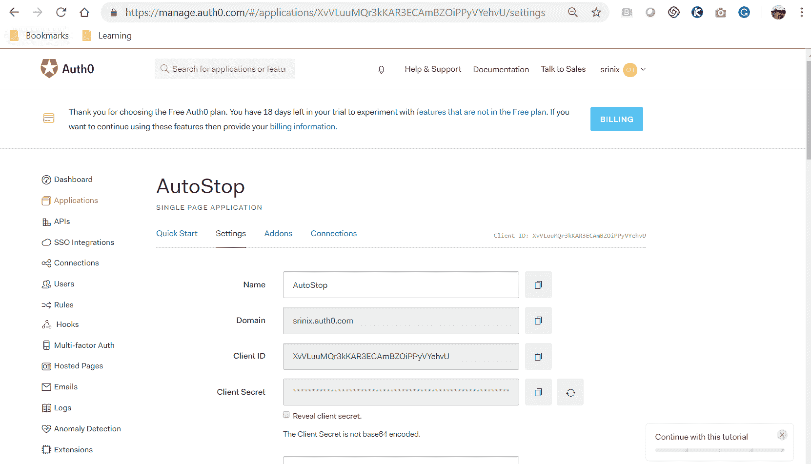

以下是一些需要牢记的重要事项：

+   我们需要更新允许的回调 URL、允许的 Web 起源和允许的起源（CORS）。

+   如果我们更新了允许的 Web 起源和允许的起源的详细信息，我们将收到跨源请求（CORS）错误。

我们已经在 Auth0 中调整了所需的设置，所以现在可以在我们的应用程序中实现 Auth0 了。

为了在我们的应用程序中实现 Auth0，我们需要安装一些模块，即`auth0-js`，`auth0-lock`和`angular2-jwt`：

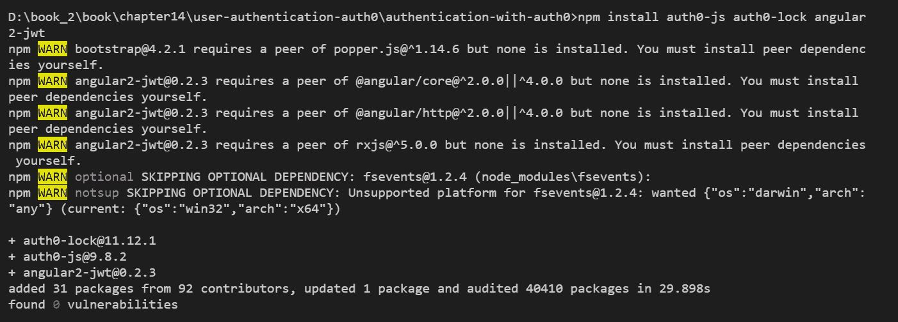

在上述截图中，使用`npm install`命令，我们安装了所需的`Auth0`模块。现在，是时候为我们的应用程序生成服务和组件了。

首先，我们需要生成我们的服务；让我们称之为`authService`。我们需要运行以下命令来生成我们的服务：

```ts
ng g service services/auth
```

在成功执行上述命令后，我们应该看到以下输出：

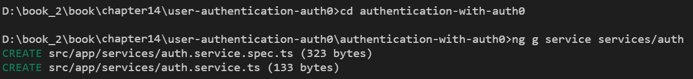

我们可以验证并确认我们的服务已经生成，以及规范文件（用于编写我们的测试规范的文件）。现在我们已经创建了我们的服务，是时候生成组件了。我们将使用`ng` CLI 运行以下命令以生成所需的组件：

```ts
ng g c login
ng g c profile
```

在成功执行上述命令后，我们应该看到以下输出：

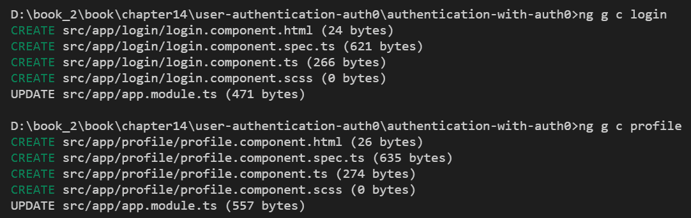

在上述截图中，我们可以验证并确认我们的所需组件，即`login`和`profile`，已成功生成。现在，我们可以继续实现我们组件的功能了。

为了使我们的应用程序更美观，让我们也安装`bootstrap` CSS 框架：

```ts
npm i bootstrap 
```

我们还需要安装`jquery`模块：

```ts
npm i jquery 
```

在成功执行上述命令后，我们应该看到以下输出：

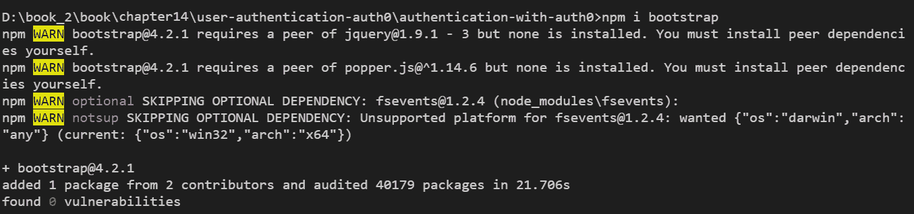

太酷了。现在，是时候在`Nav`组件中添加一些链接了：

```ts
<nav class="navbar navbar-expand-lg navbar-light bg-light">
 <a class="navbar-brand" href="#">Auth0</a>
 <button class="navbar-toggler" type="button" 
    data-toggle="collapse" data-target="#navbarSupportedContent" 
    aria-controls="navbarSupportedContent" aria-expanded="false" 
    aria-label="Toggle navigation">
 <span class="navbar-toggler-icon"></span>
 </button>

<div class="collapse navbar-collapse" id="navbarSupportedContent">
 <ul class="navbar-nav mr-auto">
      <li class="nav-item active">
        <a class="nav-link" href="#">Home 
         <span class="sr-only">(current)</span></a>
      </li>
      <li class="nav-item">
        <a class="nav-link" *ngIf="!authService.isLoggedIn();" 
           (click)="authService.login()">Login</a>
      </li>
      <li class="nav-item">
        <a class="nav-link" *ngIf="authService.isLoggedIn();" >Profile</a>
      </li>
      <li class="nav-item">
        <a class="nav-link" *ngIf="!authService.isLoggedIn();"
           href="#">Register</a>
      </li>
       <li class="nav-item">
        <a class="nav-link" *ngIf="authService.isLoggedIn()" 
           (click)="authService.logout()">Logout</a>
      </li>
    </ul>
 </div>
</nav>
```

在上述代码中，应该注意以下重要点：

+   我们正在使用 Bootstrap 的`nav`组件。

+   我们正在添加一些链接并附加点击事件，例如根据用户状态登录和注销。如果用户已登录，我们将显示注销链接，否则我们将显示注册链接。

+   我们将在我们的 nav.component.ts 文件中实现这些方法。

+   我们正在使用`*ngIf`来检查用户是否已登录，并相应地切换登录和注销链接。

上述代码的输出如下截图所示：

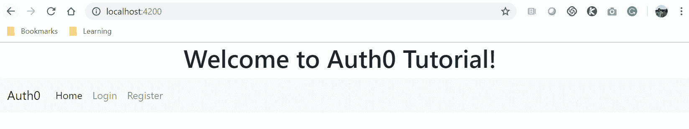

现在我们需要在我们生成的`auth`服务上工作。在`services/auth.service.ts`文件中，我们需要首先导入所需的模块，然后添加我们的方法`login`和`logout`：

```ts
import { tokenNotExpired } from 'angular-jwt';
import { Auth0Lock} from 'auth0-lock';
```

一旦我们导入了`Auth0Lock`和`TokenNotExpired`类，我们将创建实例以便我们可以使用它们。

看一下基本的`Auth0Lock`对象实例创建代码：

```ts
var lock = new Auth0Lock( 'YOUR_CLIENT_ID', 'YOUR_AUTH0_DOMAIN' );
```

为了创建一个`Lock`类的新对象，我们需要将客户端 ID 和域名传递给实例。

让我们在我们的`auth.service.ts`文件中实现这个：

```ts
public _idToken: string;
private _accessToken: string;
private _expiresAt: number;

 lock = new Auth0Lock('XvVLuuMQr3kKAR3ECAmBZOiPPyVYehvU','srinix.auth0.com',{
 allowedConnections: ["Username-Password-Authentication","google-oauth2"],
 rememberLastLogin: false,
 socialButtonStyle: "big",
 languageDictionary: {"title":"Auth0"},
 language: "en",
 responseType: 'token id_token',
 theme: {}
 });
```

在上述代码中，应该注意以下重要点：

+   我们创建了三个变量，分别是`_idToken`、`_accessToken`和`_expiresAt`。

+   我们正在创建一个`Auth0Lock`的实例，并且需要向对象传递参数。

+   `Auth0Lock`对象将需要传递两个必需的参数。第一个参数是`ClientId`，第二个是域名。

+   第三个参数包括`allowedConnections`、主题等选项，因为它说它们是可选的。

+   客户端 ID 和域名可以从 Auth0 应用程序设置中获取，如下面的截图所示：

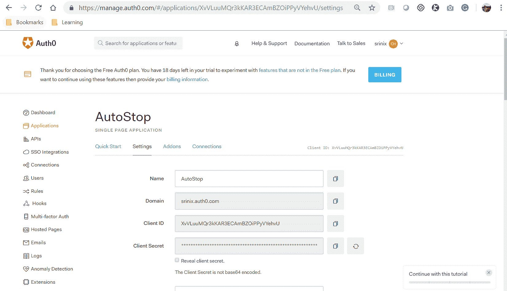

我们现在可以监听附加到`lock`对象的事件：

```ts
constructor(private router: Router) {

this.lock.on('authenticated', (authResult: any) => {
localStorage.setItem("userToken", authResult.accessToken);
this.router.navigate(['/profile']); 
});

this.lock.on('authorization_error', error => {
console.log('something went wrong', error);
});

}
```

在上述代码中，我们正在执行以下步骤：

1.  在`constructor`方法中，我们正在监听`authenticated`和`authorization_error`状态的`on`事件。

1.  当我们从`lock`实例获得认证消息时，我们正在存储一个名为`userToken`的`localStorage`项目，并将`accessToken`设置为其值。

1.  我们还在监听错误消息并将消息记录在控制台中。

现在，是时候实现`login`和`logout`方法了：

```ts
login() {
 this.lock.show(function(err, profile, token){
 console.log(err);
 console.log(profile);
 console.log(token);
 });
 }
```

在`login`方法中，我们正在调用`lock`对象的`show`方法。这将带您进入 Auth0 的对话框，其中有登录、注册或忘记密码的选项。如果您选择了任何社交选项，登录对话框将包含社交选项。

对于`logout`方法，我们只需清除用户登录时设置的`userToken`，并将用户重定向回主页登录页面。

```ts
logout(){
localStorage.setItem('userToken','');
this.router.navigate(['/']);
}
```

清除`userToken`后，应用程序将知道用户未登录。

我们已经实现了`login`和`logout`方法，但我们还需要一个方法来检查用户是否已登录：

```ts
 isLoggedIn() {
 var token = localStorage.getItem('userToken');
 if(token != '')
 {
 return true;
 }
 else {
 return false;
 }
 }
```

在`isLoggedIn`方法中，我们正在检查本地存储中`userToken`变量的值是否设置。如果设置了值，这意味着用户已登录；否则，用户未登录。

只需将服务导入到我们的`app.component.ts`文件中，并将其注入到构造函数中：

```ts
import { Component } from '@angular/core';
import { AuthService } from './services/auth.service';

@Component({
 selector: 'app-root',
 templateUrl: './app.component.html',
 styleUrls: ['./app.component.scss']
})
export class AppComponent {
 title = 'Auth0 Tutorial';
 userToken:string;

 constructor(private authService: AuthService) {}
}
```

就是这样。是不是很简单？

我们应该看到以下输出：

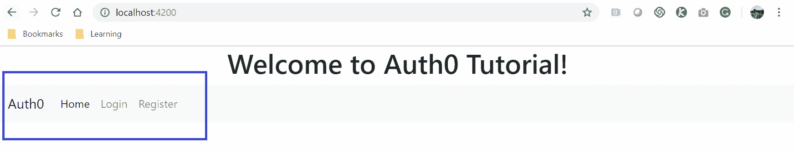

如果我们点击登录链接，我们应该看到 Auth0 对话框弹出窗口：

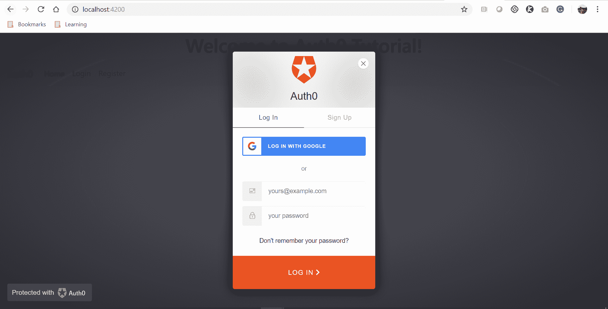

现在，继续点击“注册”选项卡创建一个账户，一旦成功注册，您应该看到该用户也已添加到 Auth0 仪表板中：

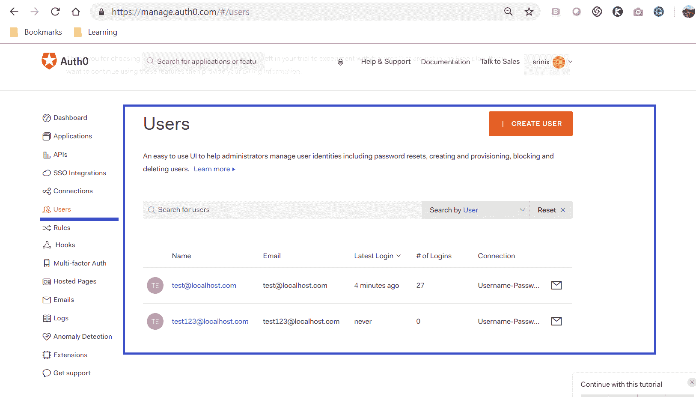

成功登录后，我们应该只能看到注销链接，如下面的屏幕截图所示：

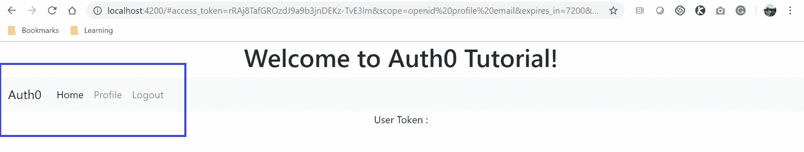

当我们点击注销链接时，用户应该被带回默认的登陆页面，并应该看到登录和注册选项。还要注意 URL 中提供的参数，如`access_token expires_in`等。

太棒了！我们刚刚在我们的应用程序中使用 Auth0 实现了整个用户身份验证。

# 总结

在本章中，我们学习了一些高级的 Angular 主题，从创建自定义指令到扩展原生 HTML 元素的行为。我们还创建了自定义表单验证，这在开发具有许多验证和合规性要求的复杂应用程序时非常有用。我们深入研究了 Angular 单页应用程序，并了解了它们的工作和行为。我们通过原生代码在我们的 Angular 应用程序中实现了用户身份验证。

我们还学习了如何使用现有框架构建和实现安全的用户身份验证管理系统，即 Firebase 和 Auth0。然后，我们学习了如何实现登录、注册和注销功能，以确保我们可以保护应用程序的数据和功能。现在我们已经掌握了前面的概念，可以实现一个完整的、有线的端到端 Angular 应用程序了。

现在我们已经学会了如何开发我们的 Angular 应用程序，唯一隔我们的应用程序和真实用户之间的就是部署我们的应用程序。这是我们下一章的重点。在本书的下一章和最后一章中，我们将学习如何部署我们的 Angular 应用程序。
