# 第十五章：部署 Angular 应用程序

一旦您完成了构建应用程序，它就必须部署到测试环境，供测试团队在将应用程序部署到生产环境供用户使用之前进行测试。虽然您可以在几乎任何地方托管您的应用程序，但有三种主要方式可以打包和部署您的 Angular 应用程序。我们将在本章中探讨这些方法：

+   部署 Angular 应用程序

+   部署复合 Angular 应用程序

+   部署到 GitHub 页面

# 部署 Angular 应用程序

部署我们的应用程序和构建应用程序本身一样重要。毕竟，我们的用户需要访问它；否则，构建它就没有意义，对吧？

在我们详细学习和探索如何部署应用程序之前，有一个运行的服务器是前提条件。服务器可以托管在任何操作系统上，无论是 Windows 还是 Linux，并且可以在任何应用程序服务器上运行，比如 Apache Tomcat 或 IIS。或者，我们可以选择任何可靠的云提供商，比如 AWS、Azure 或 Bluehost，它们提供托管能力。

技术栈可以因项目而异；一些客户更喜欢基于 Java 的微服务，一些可能更喜欢.NET，其他人可能更喜欢 Ruby on Rails。我们需要将我们的 Angular 应用程序与后端 API 集成。客户端代码大部分将是 Angular，这基本上意味着 Angular 应用程序可以部署和运行在任何带有任何后端 API 服务的服务器上。

在本章中，我们将使用 XAMPP 服务器。XAMPP 是 Apache、MySQL 的免费分发版，可以轻松快速地设置我们的本地服务器。您可以在[`www.apachefriends.org/download.html`](https://www.apachefriends.org/download.html)下载它。

# Angular 应用程序的编译选项

我相信您现在已经意识到，我们为 Angular 编写的所有代码都是 TypeScript，并且我们需要使用`ng`命令进行编译和生成可部署文件：`ng build`。这个命令将生成相应的等效 JavaScript 代码，可以直接复制到我们要部署的环境中。

部署 Angular 应用程序非常简单和容易。在实时场景中，构建和部署命令已经集成到构建管道中。一个常见的做法是在一个存储库中运行一个单一的 Angular 项目。然而，我们也可以在一个存储库中运行多个项目。

在本节中，我们将首先了解我们可以考虑用于部署 Angular 应用程序的各种编译选项。在接下来的章节中，我们将学习如何部署独立应用程序，以及如何部署复合 Angular 应用程序。在学习如何部署我们的应用程序之前，了解构建应用程序源代码时会发生什么是很重要的。

Angular 有两种编译选项，根据我们使用的命令和元标志来应用：

+   即时编译

+   提前编译

# 什么是即时编译？

Angular 的**即时**（**JIT**）编译是指在运行时在浏览器中编译代码。这是每当我们运行`ng build`命令时的默认行为：

```ts
ng build
```

这种机制会增加请求和引导时间。更改会在我们的浏览器中反映出来，这在开发应用程序时非常好。这个选项允许开发人员在开发过程中快速测试更改。

# 什么是提前编译？

Angular 的**提前**（**AOT**）编译意味着将源 TypeScript 代码、组件、Angular HTML、库和模块编译成本机 JavaScript，以便它可以在任何浏览器上平稳运行。换句话说，Angular 会在代码被浏览器下载之前进行转换。

让我们来看看 AOT 的一些好处：

+   更好的安全性

+   更快的渲染

+   更小的框架和应用程序大小

+   提前发现错误

提前编译或只是 AOT 编译在运行`ng build --prod`元标志时会默认应用：

```ts
ng build --prod
```

现在我们已经了解了 Angular 提供的不同类型的编译，现在终于是时候实际部署 Angular 应用程序了。在下一节中，我们将学习如何部署 Angular 应用程序。

# 部署独立的 Angular 应用程序

掌握了部署和编译策略的知识，现在是时候部署我们的 Angular 应用程序了。当我们运行`ng build`和`ng build --prod`命令时，会生成本机 JavaScript 文件，我们可以部署到我们的服务器上。如果我们要部署单个项目应用程序，这是很好的。

在本节中，我们将学习如何部署更复杂的用例，比如当我们的 Angular 应用程序中有多个项目时。

为了使我们的读者能够轻松跟随这些步骤，我们将保持我们的应用程序简单。但是，您可以通过部署到目前为止开发的 Angular 项目来练习部署命令。让我们开始创建一个新的 Angular 应用程序：

1.  要安装 Angular CLI，让我们快速使用以下命令：

```ts
 npm i -g @angular/cli
```

上述运行命令的输出如下所示。我们刚刚安装了 Angular CLI，我们将使用它来生成我们的应用程序：

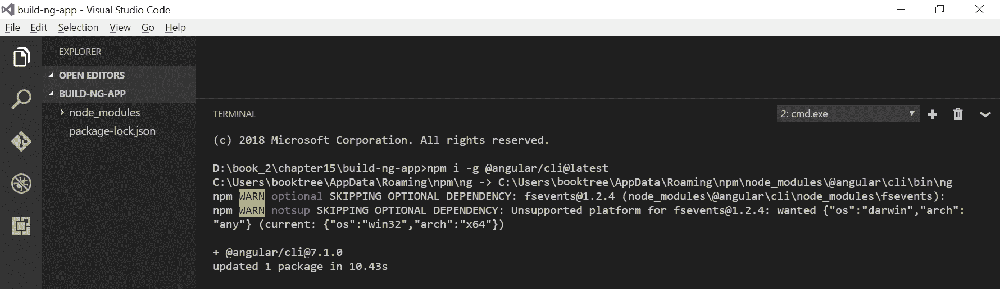

1.  既然我们已经成功安装了 Angular CLI，现在是时候创建一个名为 `prod-ready` 的 Angular 应用程序了：

```ts
 ng new prod-ready
```

使用上述命令，我们已经生成了一个新项目。以下截图显示了生成的输出：

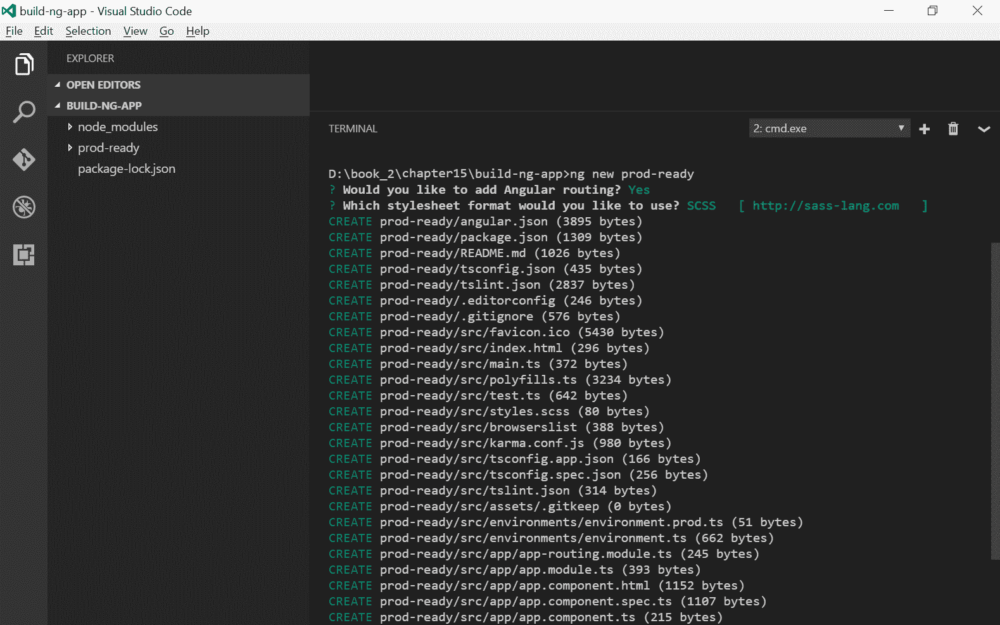

太棒了！我们有了新生成的应用程序。

1.  现在，让我们转到 `prod-ready` 应用程序文件夹，如下所示：

```ts
 cd prod-ready
```

1.  全部完成。我们现在不打算更改或添加任何新组件。现在，我希望您了解部署应用程序的最简单方法。现在，使用 `ng serve` 命令启动应用程序：

```ts
 ng serve
```

上述命令将启动应用程序，我们应该看到以下截图中显示的输出：

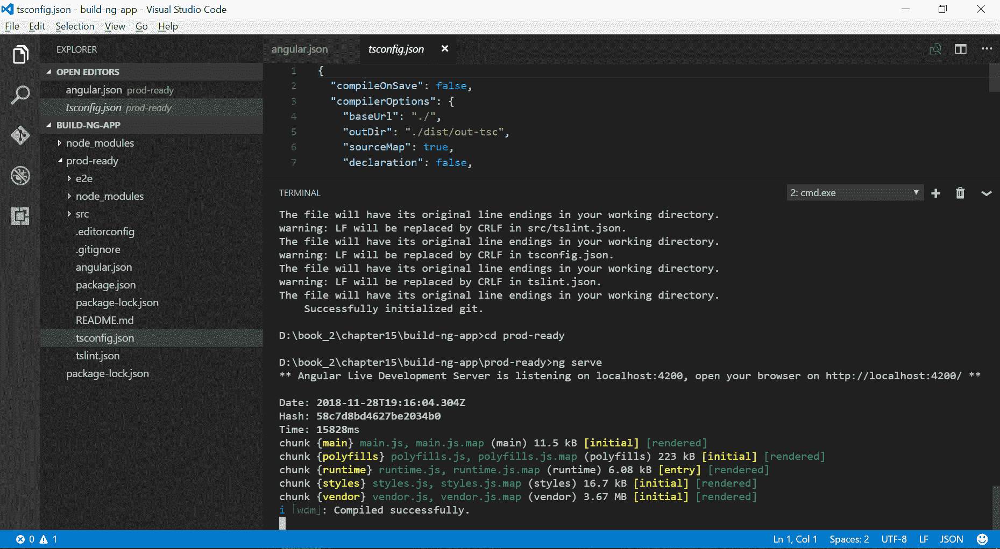

1.  启动浏览器，然后输入 `http://localhost:4200`。默认的原始应用程序应该显示如下：

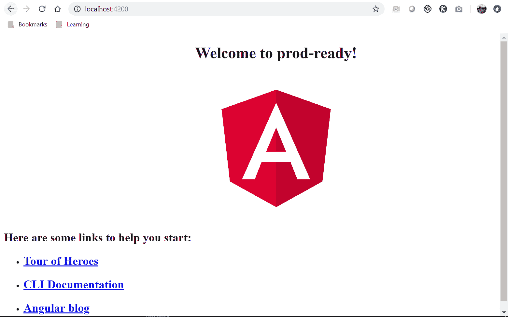

太棒了。到目前为止一切顺利。我们在本地环境中让我们的应用程序正常工作，现在是时候将其部署到我们的应用程序中了！

为了让您对整个部署过程感到舒适，我们将部署原始应用程序，而不进行任何更改。

1.  要部署，请运行以下 `ng` 命令：

```ts
 ng build --prod
```

一旦命令成功运行，您应该看到以下文件夹和文件已被创建。让我们看一下一些重要的注意事项：

+   您应该注意到一个名为 `dist/<defaultProject>` 的新文件夹。

+   您还应该注意到 `dist` 文件夹中创建的以下文件：

+   `运行时`

+   `主要`

+   `填充`

+   `样式`

上述 `build` 命令的输出如下。输出将位于 `dist` 文件夹中，与应用程序名称相同：

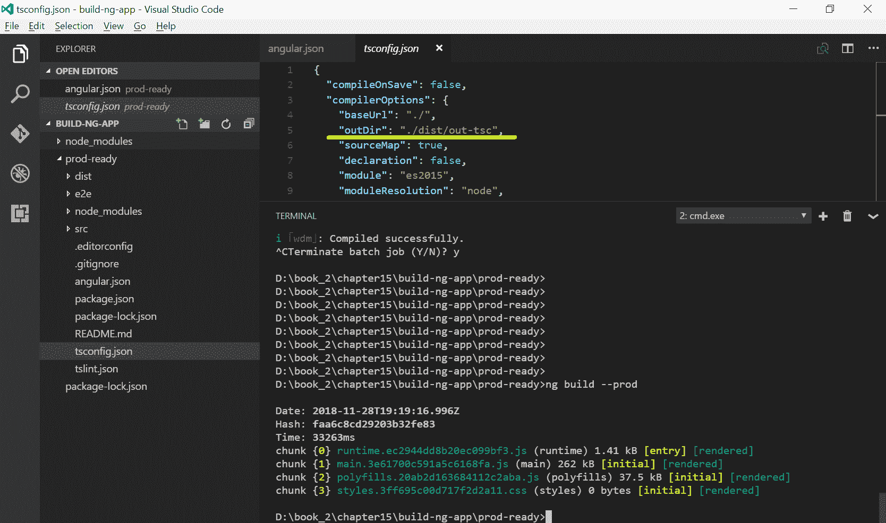

1.  我们不一定要使用默认的文件夹名称；也就是说，我们可以将输出路径和文件夹名称作为参数提供，Angular 将在该文件夹中生成代码。很容易定制我们希望生成文件的输出目录：

```ts
 ng build --prod --output-path dist/compiled
```

运行上述命令，我们应该看到我们的自定义文件夹和文件在我们的文件夹中生成。在上述命令中，我们指定了我们希望我们的文件生成在名为`compiled`的文件夹中，并提供了路径。以下是命令成功运行后的屏幕截图：

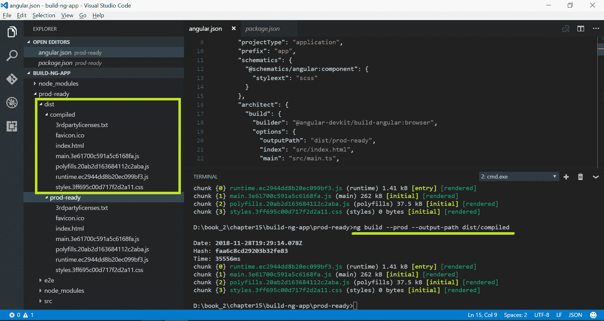

这就是我们需要做的来生成和部署我们的 Angular 应用程序。只需将所有文件复制到服务器的根目录，就完成了。

在下一节中，我们将学习如何部署一个更复杂的 Angular 应用程序架构，然后我们将以多种方式部署复合应用程序。

# 部署复合 Angular 应用程序

在上一节中，我们学习了如何部署一个独立的 Angular 应用程序，这是相当简单的。然而，我们可能会遇到需要构建和部署多个应用程序并运行在单个存储库中的情况。这是可能的吗？当然可以。在本节中，我们将创建一个具有多个项目的 Angular 存储库，并学习如何部署一个复合应用程序。

# 创建和部署多个 Angular 应用程序

在更现实的实际应用程序中，我们将需要运行多个 Angular 应用程序，这些应用程序将由多个项目、库、模块和微服务组成，如下图所示：

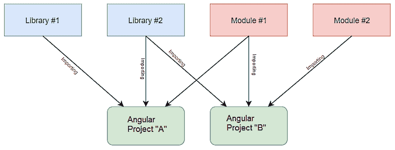

在上图中，一些重要的事项如下所述：

+   有多个 Angular 项目和应用程序。

+   **库 #1** 和 **库 #2** 可以通过导入库在多个项目中重复使用。

+   在开发阶段，我们将创建多个模块，这些模块也可以在多个项目中重复使用。

因此，让我们立即开始创建多个项目、库和模块。最后，我们将以不同的方式打包应用程序。所以，让我们开始让我们的 Angular 应用程序运行起来：

1.  首先要做的是，我们需要生成一个应用程序，我们将使用 Angular CLI 来生成应用程序。我们首先需要使用以下命令安装 Angular CLI：

```ts
 npm install @angular/cli
```

在成功执行上述命令后，我们应该看到以下输出：

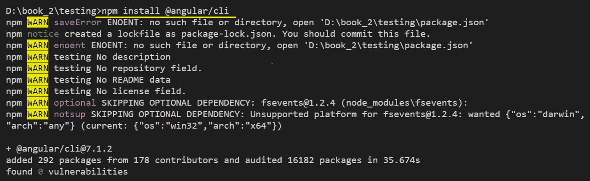

1.  现在我们已经安装了 Angular CLI，让我们使用以下命令创建应用程序。我们将其称为`shopping-cart`。现在，运行以下`ng`命令生成新项目：

```ts
 ng new shopping-cart
```

使用上述命令，我们生成了一个名为`shopping-cart`的新应用程序。上述命令的输出如下：

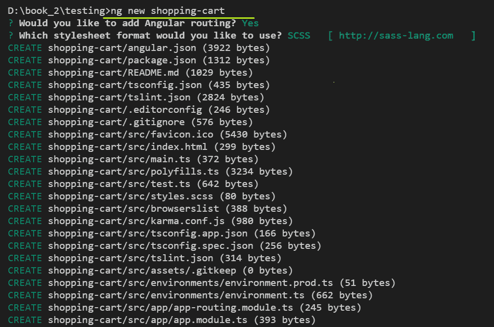

1.  我们现在创建了一个名为`shopping cart`的新应用程序。让我们修改`app.component.html`并添加两个名为`list-jackets`和`list-vendors`的`routerLink`超链接：

```ts
      <div style="text-align:center">
       <h1>
       Welcome to {{ title }}!
       </h1>
      </div>
      <ul>
       <li>
       <h2><a routerLink="/list-jackets" class="nav-link">List 
         Jackets</a></h2>
       </li>
       <li>
       <h2><a routerLink="/list-vendors" class="nav-link">List 
         Vendors</a></h2>
       </li>
      </ul><router-outlet></router-outlet>
```

在上述代码中，我们在`app.component.html`文件中创建了两个链接。结果显示如下：

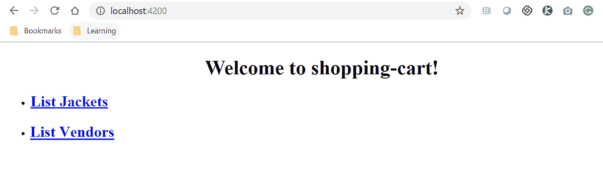

到目前为止，一切都很好。基本上，我们已经有了一个正在运行的 Angular 应用程序。现在，我们将学习如何在同一个存储库中运行和部署多个 Angular 项目。为了做到这一点，我们将按照以下步骤进行：

1.  让我们使用以下命令在同一个存储库中创建一个新应用程序。我们正在生成一个名为`jackets`的新应用程序：

```ts
 ng g application jackets
```

我们使用`ng`命令创建一个名为`jackets`的新应用程序。我们应该看到以下输出：

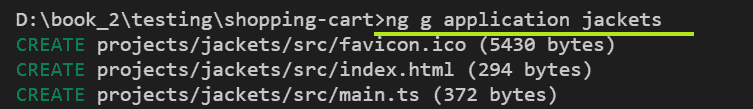

1.  哇哦！使用 Angular CLI 的 schematics，很容易在同一个应用程序中创建多个项目。看一下自动生成的文件以及 Angular CLI 为我们更新的一些文件：

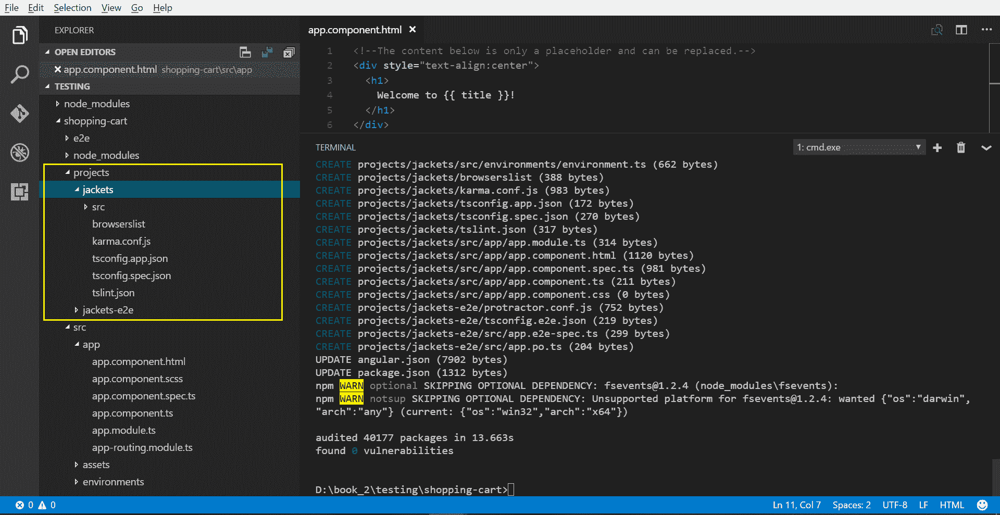

如果您仔细观察，您会注意到以下是我们应用程序结构和文件发生的一些重要变化：

+   一个名为`Projects`的新文件夹被自动生成，并且在`angular.json`文件中生成了相应的条目。

+   在`Projects`文件夹中，我们将看到具有相同默认 vanilla 应用程序文件的新`Jackets`项目已生成。

1.  现在，为了验证是否已添加新的`Jackets`项目，请查看`Angular.json`文件：

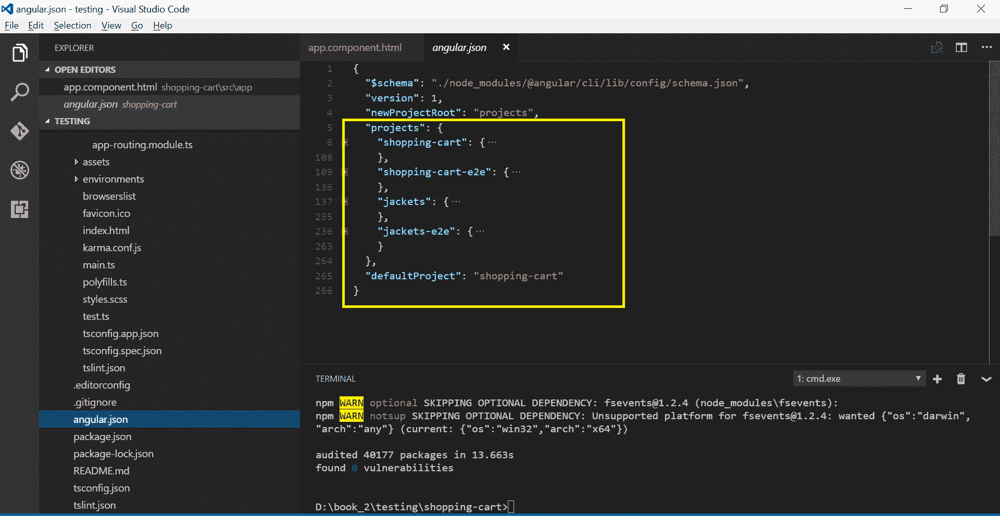

您会注意到在`Angular.json`文件中，我们有针对 shopping-cart、shopping-cart-e2e、jackets 和 jackets-e2e 的项目特定条目。很棒。从技术上讲，我们现在在同一个存储库中运行两个应用程序。

1.  现在是时候通过添加一些组件、库和模块来扩展我们的应用程序了。首先，我们需要在我们的`jackets`项目中创建一个组件。运行以下`ng`命令来生成组件：

```ts
 ng g c jacket-list --skip-import
```

运行上述命令，我们应该看到生成的组件和相应文件。我们应该看到以下输出：

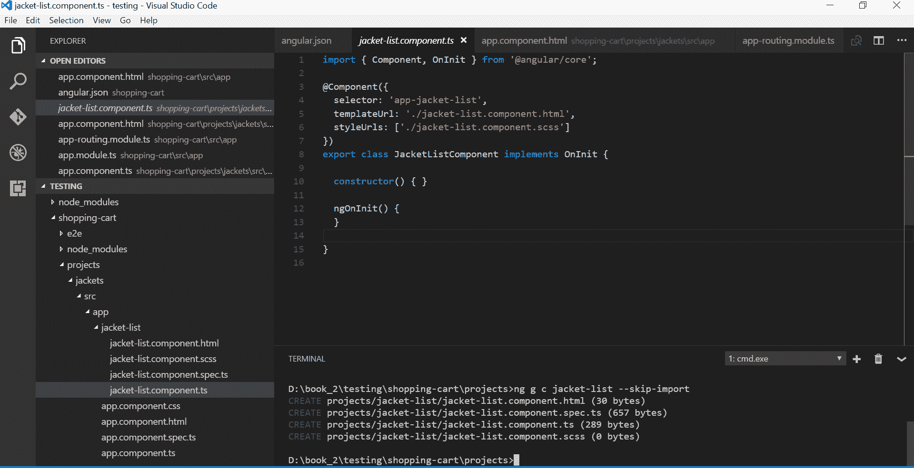

1.  现在我们已经在`Jackets`项目中创建了一个新的组件，是时候将其添加到`app-routing.module.ts`中，以便在`Jackets`项目中可以使用。

在以下代码片段中，我们在`app-routing.module.ts`文件中导入了新创建的组件：

```ts
      import { NgModule } from '@angular/core';
      import { Routes, RouterModule } from '@angular/router';
      import { AppComponent } from './app.component';
 import { JacketListComponent } from 
      '../../projects/jackets/src/app/jacket-list/jacket-list.component';
      import { VendorsComponent } from 
      '../../projects/vendors/src/lib/vendors.component';
```

1.  导入组件后，是时候为我们的组件创建一个路由了：

```ts
      const routes: Routes = [
       {
       path:'home',
       component:AppComponent
       },
       {
       path:'list-jackets',
       component:JacketListComponent
       },
       {
       path:'list-vendors',
       component:VendorsComponent
       }
      ];
```

在上述代码片段中，我们创建了`list-jackets`和`list-vendors`路由，它们分别映射到相应的`JacketListComponent`和`VendorsComponent`组件。在上述代码片段中有两个重要的事项需要注意：

+   我们正在运行多个 Angular 项目。

+   我们正在在各个项目中相互链接组件。

1.  我们已经将路由链接添加到`app.component.html`。现在，让我们通过运行`ng serve`命令启动我们的应用程序：

```ts
 ng serve 
```

1.  在浏览器中输入`http://localhost:4200`，我们应该看到以下输出显示：

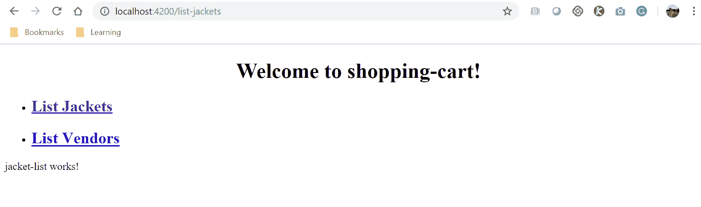

所以，现在我们有两个运行的应用程序，并且我们有跨不同项目共享的组件。

很好。现在，为什么我们不添加一些可以在多个项目之间共享的库呢？让我们开始吧：

1.  我们将创建一个名为`vendors`的新的 Angular 库。我们将使用`ng`命令并将库命名为`vendors`。让我们运行以下命令来生成库：

```ts
 ng g library vendors --prefix=my
```

成功运行上述命令后，我们应该看到以下输出：

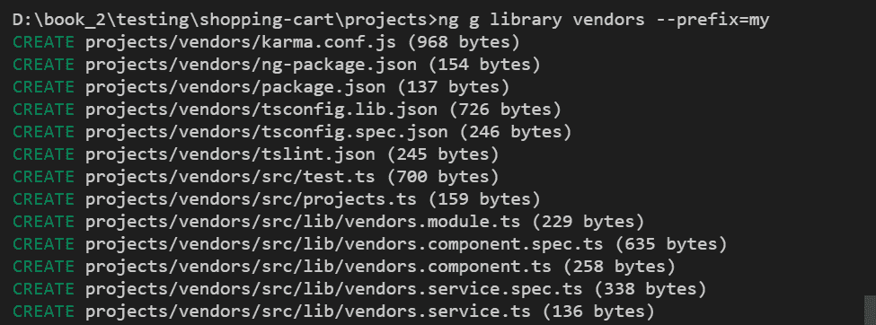

1.  一旦库被生成，Angular CLI 将创建以下文件夹和文件：

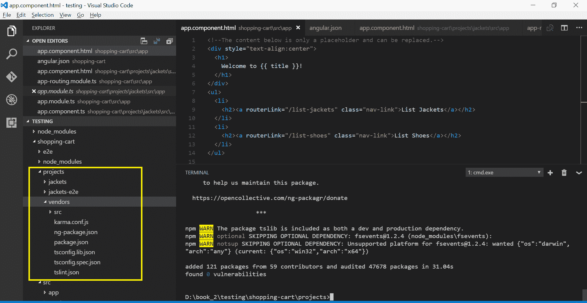

1.  以下是一些重要的事项，一旦命令成功运行：

+   在`Projects`下创建一个新的`Vendors`库项目。

+   Angular 还将在`Angular.json`文件中进行必要的更改和条目。

+   请注意，`projecType`是`library`类型。

以下截图显示了新创建的库项目的显示数据：

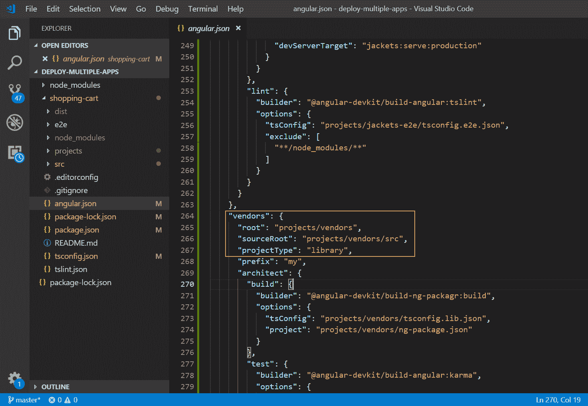

1.  现在，打开`vendors`文件夹，在`src/lib`下编辑`vendors.component.ts`文件并添加一些花哨的文本：

```ts
      import { Component, OnInit } from '@angular/core';

      @Component({
       selector: 'my-vendors',
       template: `
       <p>
       vendors works!
       </p>
       `,
       styles: []
      })
      export class VendorsComponent implements OnInit {

      constructor() { }

      ngOnInit() {
       }

      }
```

1.  记住，我们之前为`vendor`组件创建了路由链接，所以我们应该在应用程序中看到反映出的更改：

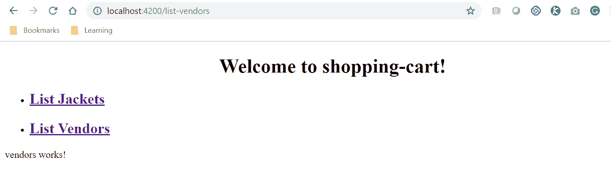

现在我们已经构建了一个具有多个项目、库和路由系统以共享不同组件的 Angular 应用程序，是时候部署应用程序了。

部署很简单，就像我们为独立应用程序所做的一样：

```ts
ng build --prod --base-href "http://localhost/deploy-angular-app/"
```

运行命令后，将发生一些重要的事情：

+   为了生成最终部署文件，我们正在运行`ng build`命令。

+   我们正在使用`--prod`元标志，编译时将应用 AOT 编译。

+   最重要的是，我们需要传递`--base-href`元标志，它将指向服务器的根文件夹/路径。

没有适当的`--base-href`值，Angular 应用程序将无法正常工作，并会给您链接生成的文件的错误。

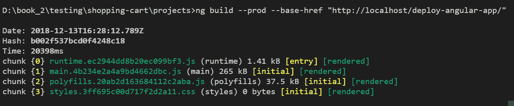

从前面的部分，我们已经知道运行`build`命令后，Angular 将生成编译后的文件夹和文件，如下截图所示：

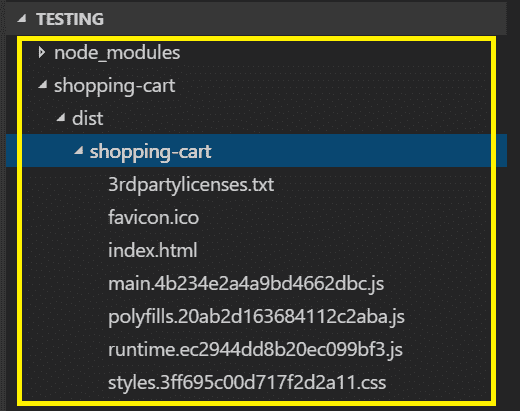

从上面的截图中需要注意的一些重要点：

+   该命令将生成编译文件的输出，其中包含多个项目、库和组件。

+   仔细考虑我们设置的`--base-href`值。我们在本地运行 XAMPP，因此路径指向`localhost`。

现在，让我们将所有代码从`dist`文件夹复制并粘贴到我们的`XAMPP`文件夹中。

使用本地服务器启动 Angular 应用程序，您应该看到以下显示的输出：

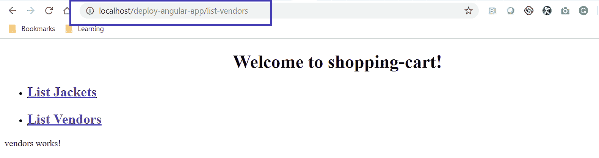

这真的很酷！即便如此，我们还可以大大改进。在更现实的设置中，任何大型的 Angular 实现都将拥有特性团队，由一个团队开发的库或模块应该很容易地与其他团队共享作为一个模块。这就是可重用模块的编写方式。我们将学习如何将 Angular 模块分发为`npm`模块。

# 将 Angular 项目打包为 npm 包

现在，让我们学习如何将我们的 Angular 项目导出为`npm`模块。我们将继续使用在上一个示例中创建的`vendors`库：

1.  请注意，我们*不*希望部署整个应用程序，而是只想部署`vendors`库。我们将使用相同的`ng build`命令来构建`vendors`Angular 项目：

```ts
 ng build vendors
```

1.  一旦命令成功执行，我们将看到 Angular 将在`dist`文件夹下为我们的`vendors`项目生成编译文件，如下所示：

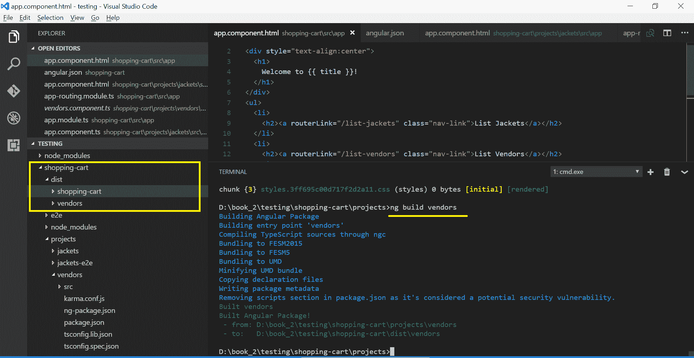

1.  转到`dist/vendors`文件夹并运行以下命令：

```ts
 npm pack
```

我们正在使用`npm pack`命令从当前文件夹生成一个包，其中包含来自`vendors`项目的文件。我们应该看到以下输出：

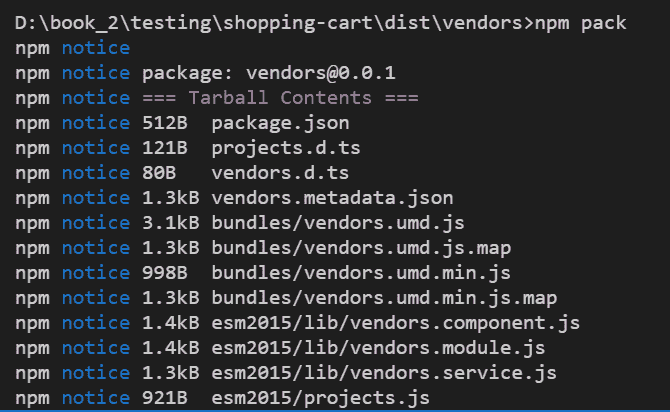

1.  成功执行后，我们将在文件夹中看到创建的`vendors-0.01.tgz`文件。现在我们可以将此文件作为`npm`包进行分发，可以在任何项目中重复使用：

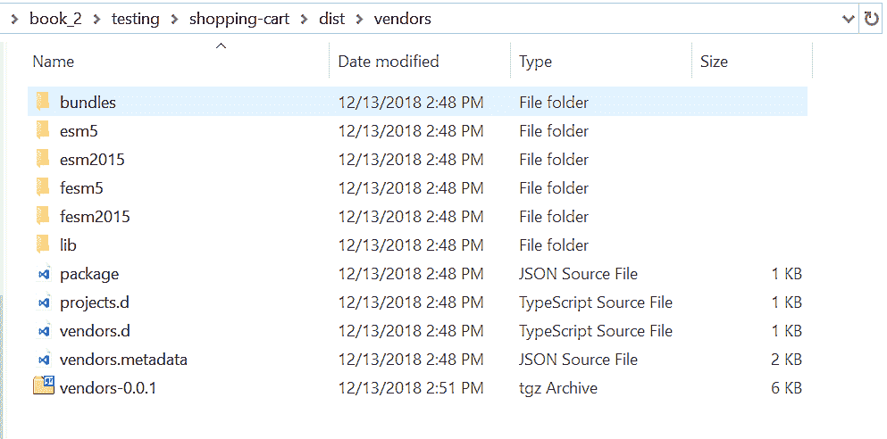

1.  现在让我们进行测试，通过将新生成的`npm`模块安装到我们的应用程序中来进行测试。要安装该包，请运行`npm install`命令，指向`vendors-0.0.1.tgz`：

```ts
 npm install dist\vendors\vendors-0.0.1.tgz
```

1.  完成后，我们应该看到以下输出，通知我们已添加了该包：

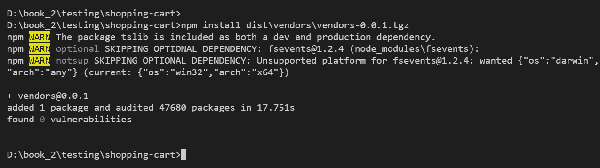

1.  我们还可以验证包是否成功添加到`package.json`文件中。我们应该看到`package.json`中显示如下条目：

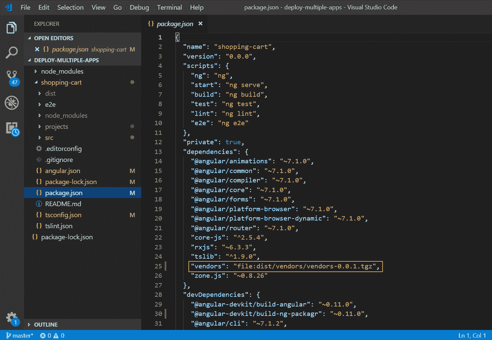

太棒了！在本节中，我们学习了如何将 Angular 应用程序部署为独立应用程序，也学习了如何将其部署为复合应用程序。

我们还学习了如何创建一个 Angular 项目的包，可以在多个 Angular 项目中进行分发和使用。

# 将 Angular 应用程序部署到 GitHub Pages

在之前的部分中，我们学习了如何部署我们的独立应用程序，以及通过导出应用程序的编译源文件将复合应用程序部署到任何服务器。

在本节中，我们将学习如何将我们的 Angular 应用程序部署到 GitHub Pages。

在整本书中，我们创建了许多 Angular 项目，现在是时候免费托管它们了！

# 在 GitHub Pages 中创建和部署应用程序

GitHub Pages 是托管在 GitHub 上的项目的网站。我们说了免费吗？当然，GitHub Pages 是免费的！只需编辑、推送，就可以在您的免费网站上实时查看更改。

让我们逐步看看如何在 GitHub Pages 上创建和托管我们的应用程序：

1.  让我们通过使用`npm install`命令来安装 Angular CLI：

```ts
 npm install @angular/cli
```

1.  命令完成后，是时候创建一个新的 Angular 项目了。让我们称之为`deploying-angular`：

```ts
 ng new deploying-angular
```

成功执行命令后，我们应该看到以下截图：

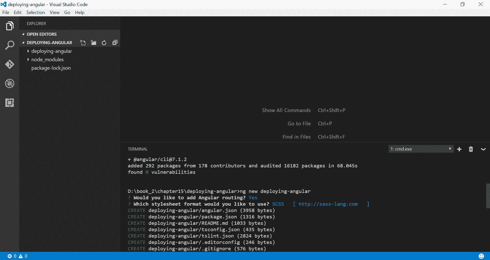

1.  现在是时候初始化一个 Git 仓库了。我们可以通过执行以下命令来做到这一点：

```ts
 git init
```

1.  成功执行后，您将看到仓库已初始化，或者在以下情况下，如果仓库已存在，则将重新初始化如下：

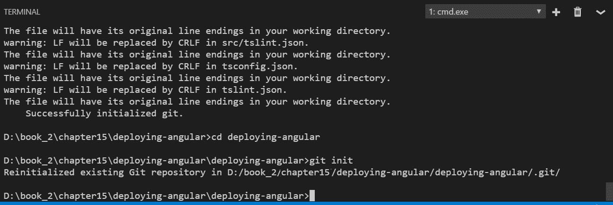

1.  随意对`app.component.html`或任何要修改的文件进行任何更改。然后，一旦准备部署，通过执行`commit` Git 命令来首先提交代码/更改。我们还可以传递`-m`元标志并向提交添加消息：

```ts
 git commit -m "deploying angular"
```

1.  接下来，我们需要将`origin`设置为仓库。以下命令将远程`origin`设置为仓库：

```ts
 git remote add origin      
      https://<token>@github.com/<username>/<repo-name>
```

好的。一切准备就绪。

1.  现在，超级能力来了。要直接将您的 Angular 应用程序部署到 GitHub，我们需要安装一个名为`angular-cli-ghpages`的软件包。这是一个官方分发，可直接将 Angular 应用程序部署到 GitHub Pages：

```ts
 npm install -g angular-cli-ghpages
```

这是我们在运行上述代码后将得到的输出：

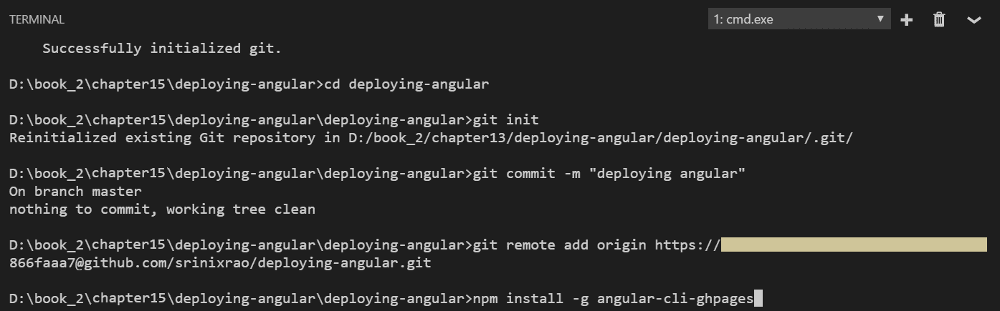

现在我们已经安装了`angular-cli-ghpages`，是时候构建我们的应用程序并获取编译后的源文件了。

1.  让我们使用`--prod`元标志运行`ng build`命令，并设置`--base-href`：

```ts
 ng build --prod --base-href  
      "https://<username>.github.io/deploying-angular"
```

`--base-href`标志指向 GitHub 上的源仓库。您需要在 GitHub 上注册并获取授权令牌，以便托管您的应用程序。

1.  这是`base href` URL，作者的 GitHub 主页，以及相应的`deploying-angular`仓库：

```ts
 ng build --prod --base-href  
      "https://srinixrao.github.io/deploying-angular"
```

1.  构建 Angular 应用程序后，我们将看到编译后的源代码生成在`dist/<defaultProject> -defaultProject`下。编译后的源代码通常是我们指定的应用程序名称作为文件夹名称：

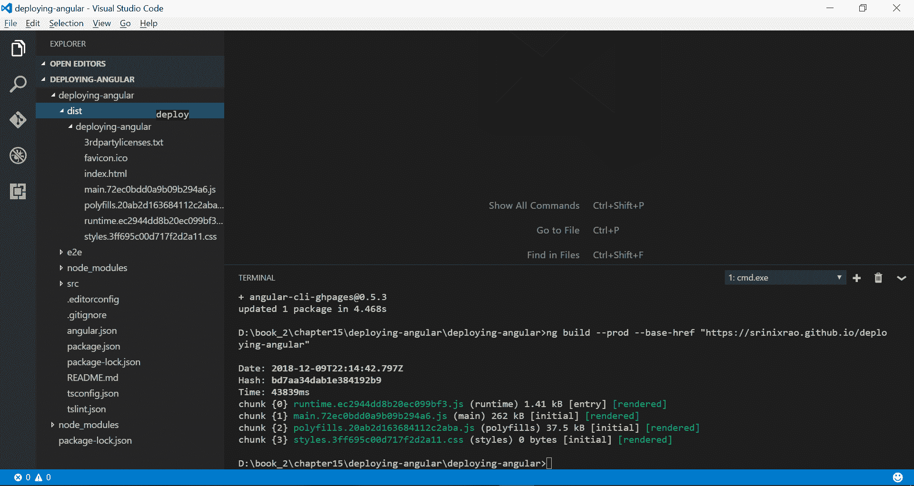

1.  现在我们已经生成了编译文件，是时候将应用程序部署到 GitHub Pages 了。我们通过运行`npx ngh --no-silent`命令来实现这一点：

```ts
 npx ngh --no-silent --dir=dist/deploying-angular
```

1.  请记住，可选地，我们需要提到我们想要部署的相应`dist`文件夹：

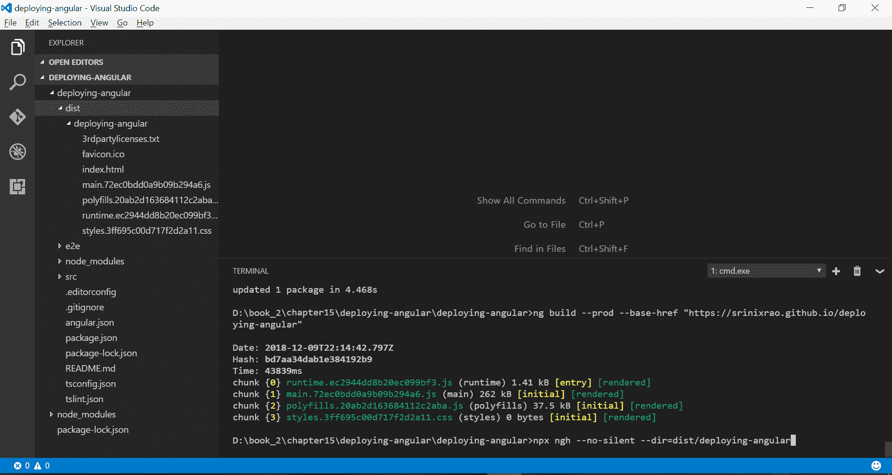

1.  成功执行命令后，我们安装的用于将 Angular 应用程序部署到 GitHub Pages 的包将运行所需的作业，例如清理、获取原始代码、检出代码，最后将最新代码推送到存储库，并准备在 GitHub Pages 上托管：

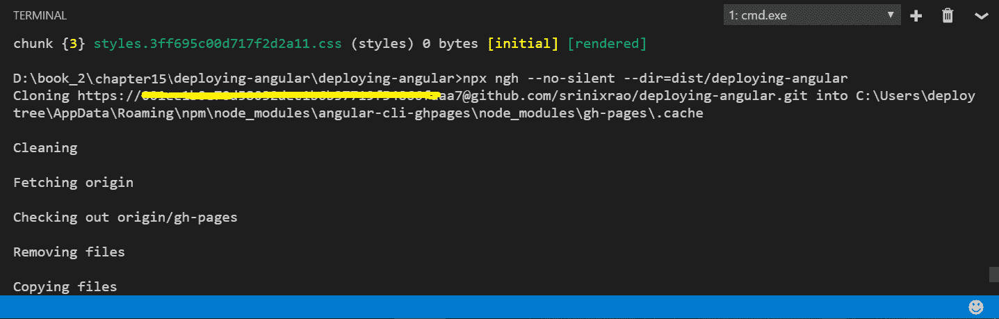

1.  一旦命令执行完毕，请转到您的 GitHub 帐户，并在存储库下点击“设置”。您将看到网站发布到以下网址：

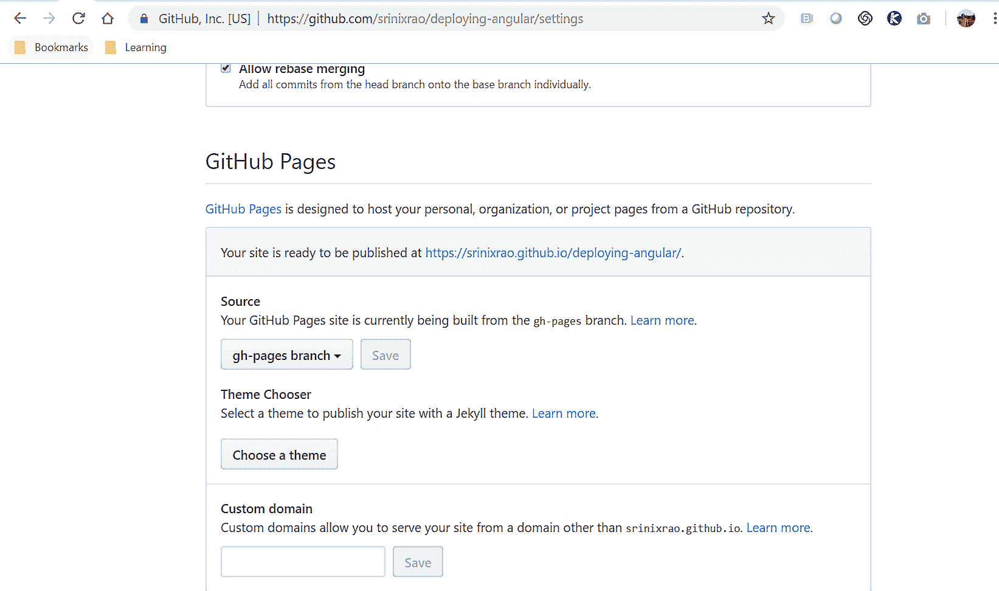

1.  点击存储库下显示的链接，我们应该看到我们的应用程序正在运行！

恭喜！我们刚刚将我们的第一个 Angular 应用程序发布到了 GitHub Pages：

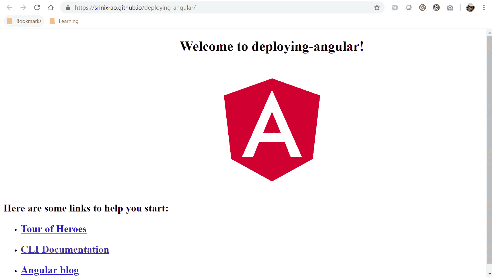

在前面的一系列步骤中，我们学会了如何将我们的 Angular 应用程序部署到 GitHub Pages。在更现实的情况下，我们还需要将 API 或后端服务部署到我们的服务器上。我们可以通过将 API 部署到 Firebase 或自托管服务器来实现。

现在，继续为到目前为止创建的所有项目和应用程序重复相同的步骤。

# 总结

部署应用程序非常重要：我们的所有辛勤工作将在网站上线后展现出来。

部署 Angular 应用程序非常简单，只需生成所需的编译源代码，而且在最新版本的 Angular 中，AOT 编译默认为使用`--prod meta`标志生成的任何构建。我们了解了 AOT 的重要性以及对整体应用程序性能和安全性的关键性。我们学会了部署独立的 Angular 应用程序，以及由多个项目、库和组件组成的复合 Angular 应用程序。

最后，我们学会了如何使用官方的`angular-cli-ghpages`包将我们的 Angular 应用程序部署到 GitHub Pages。

这就是我们在本书的最后一章的结论。在学习过程中，我们从理解 TypeScript 语言的基础知识到学习如何通过实现 Angular 框架的组件、路由系统、指令、管道、表单、后端服务等来构建我们的 Angular 应用程序，我们走了很长一段路。

我们还学习了如何在我们的 Angular 应用中实现各种 CSS 框架，比如 Bootstrap、Angular Material 和 Flex 布局。此外，我们还学会了如何设计和使我们应用的用户界面更具吸引力和互动性。

我们探讨了使用 Jasmine 和 Karma 框架进行单元测试，这确保我们的应用经过了充分测试，并且实现非常稳固。

作为学习 Angular 高级主题的一部分，我们还实现了使用 Auth0 和 Firebase 的用户认证机制。最后，我们讨论了 Angular 应用的部署。

这是使用 Angular 框架开发应用的所有方面的 360 度概述。我们希望你现在有能力使用 Angular 框架构建世界一流的产品。

祝你一切顺利，并期待很快听到你的成功故事。

祝你好运！继续向前，不断进步。
