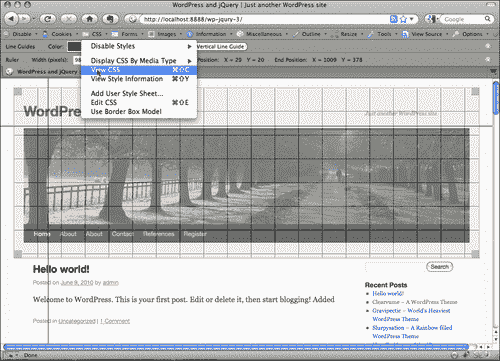
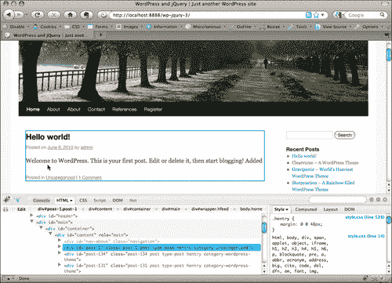
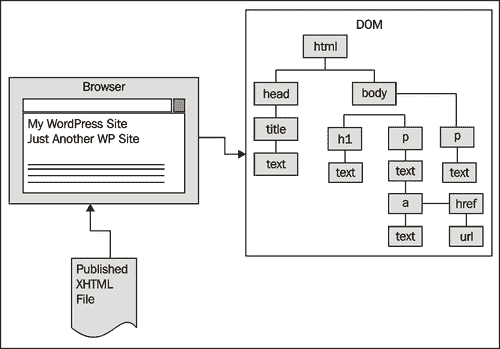
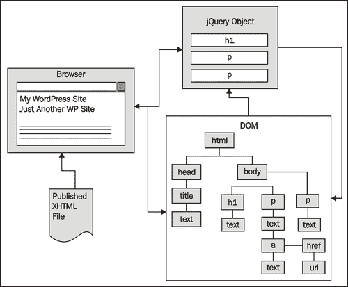
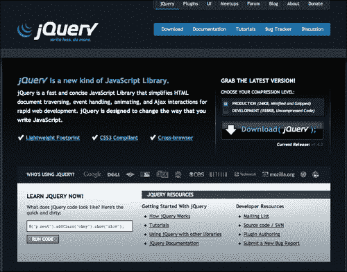
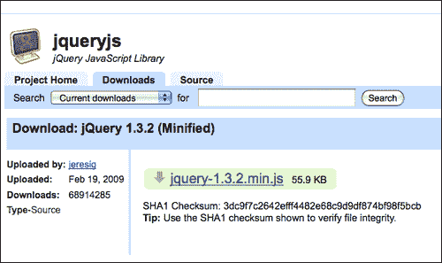
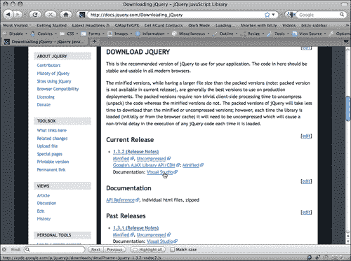
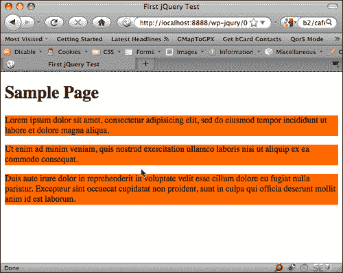
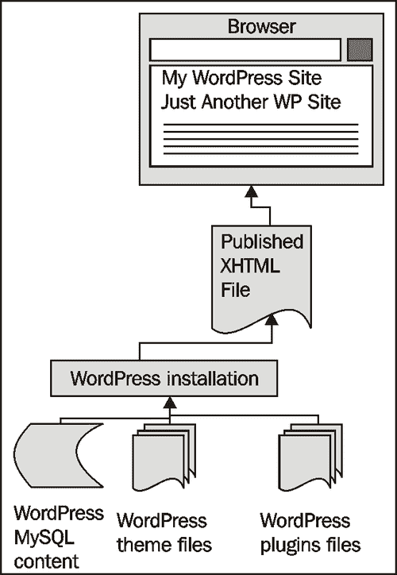
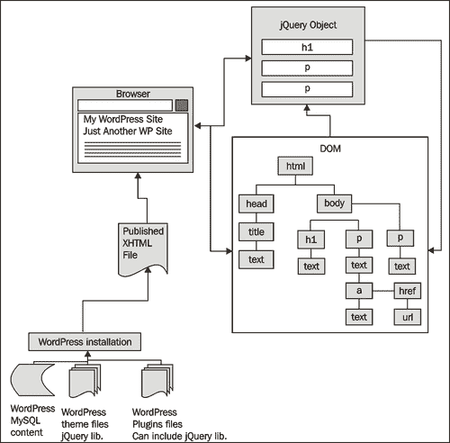

# 第一章：入门：WordPress 和 jQuery

欢迎来到 WordPress 和 jQuery。WordPress 网络发布平台和 jQuery 的 JavaScript 库是当今网络上使用最广泛的两个强大工具之一。将这些工具结合在一起，可以使您的网站的功能和灵活性加倍。这两种技术都易于学习和有趣，可以创造出网络魔法的秘诀。我希望您准备好通过学习 jQuery 如何改善您的 WordPress 开发经验，获得一些有趣和有趣的见解。

在本章中，我们将涵盖以下主题：

+   本书的方法和您应该了解的核心 JavaScript 语言和 WordPress 技能，以便从中获得最大优势

+   您将需要的基本软件工具来启动和运行您的项目

+   jQuery 和 WordPress 的基本概述

如果以下任何部分中的任何内容让您感到困惑，您可能需要更多的背景信息和理解，然后才能继续阅读本书。不过，别担心，我会为您指出一些更多信息的优秀来源。

# 本书的方法

本书介绍了使用 jQuery 与 WordPress 的基本原则和最佳实践。本书不是 JavaScript 和 PHP 编程的介绍，也不是使用 CSS 和 HTML 标记的入门指南。我假设您是 WordPress 网站开发人员和/或 WordPress 主题设计师。也许您只是一个花费足够多时间管理和调试 WordPress 网站的人，以至于您可能符合上述一种或两种角色。不管您如何标记自己，您都在使用 WordPress。WordPress 可以帮助您或您的客户快速简单地发布内容，而您总是在寻找更多、更快、更容易地完成任务的方法。

jQuery 是一个库，可以加速编写自定义 JavaScript 的时间并减少复杂性。我相信您一定知道 JavaScript 对网站有很多用处。它们还可以使网站具有非常酷的功能。虽然我将尽可能深入地介绍 jQuery，但我们不会将 jQuery 视为其他大多数书籍所强调的“重要”的 JavaScript 库实体。相反，我们将把 jQuery 视为一个能够帮助我们更轻松地完成更多工作（是的，用更少的代码）的伟大工具，使用 WordPress。

总结一下：那么，您是 WordPress 用户、开发人员还是设计师？太好了。让我们来看看这个名为 jQuery 的“工具”。它将使您的 WordPress 开发更加轻松，也可能看起来更加美观。准备好开始了吗？

# 您需要了解的核心基础知识

正如我所提到的，这本书是针对 WordPress 用户、视觉主题设计师和开发人员的，他们希望通过使用 jQuery 来学习如何更好地利用 WordPress。我尽力编写本书，以便明确要求客户端和服务器端脚本编写或编程经验并不是必需的。然而，您将至少会发现，对于给定主题的一般熟悉程度会有所帮助。

无论你的网络开发技能或水平如何，都会通过清晰的、一步一步的说明来引导你。让我们来看看你需要熟悉哪些网络开发技能和 WordPress 知识，以便从本书中获得最大的收益。再次强调，如果你觉得需要更多背景知识，我也会为你指引一些好的资源。

## WordPress

首先，你应该已经熟悉了最新、稳定版本的 WordPress。你应该了解如何在网络服务器上或本地计算机上安装和运行 WordPress 的基础知识（特别是因为你需要一个安装来尝试本书中的示例）。不用担心，我会指引你正确的方向，在你的 Mac 或 PC 上获得一个基本的本地 WordPress 安装。此外，许多托管提供商提供简单的一键安装。你需要查看你的托管提供商是否提供 WordPress。我还会指引你到一些其他好的 WordPress 安装资源。让 WordPress 安装和运行通常是使用 WordPress 的最简单的部分。

更深入地说，你需要熟悉 WordPress 管理面板。你需要了解如何向 WordPress 发布系统添加内容以及文章、分类、静态页面和子页面的工作原理。你还需要了解如何使用**媒体**上传工具向文章和页面添加图片，以及创建图库。最后，理解安装和使用不同主题和插件的基础知识也会有所帮助，虽然在本书中我们也会在一定程度上涵盖这些内容。

即使你将和更有技术的 WordPress 管理员一起工作，你也应该对你正在开发的 WordPress 网站有一个概述，以及项目所需的（如果有的话）主题或附加插件或小部件。如果你的网站确实需要特定的主题或附加插件和小部件，你需要在你的 WordPress 开发安装中准备好这些安装或已经安装好（或者**沙盒**——一个用于测试和玩耍而不会弄乱现场网站的地方）。

### 注意

**这本书使用哪个版本的 WordPress？**

本书重点介绍了 2.8、2.9 和 3.0 RC（在本书写作时的候选版本）中引入的新功能。本书涵盖的所有内容都在 WordPress 2.9.2 和 3.0 RC 中进行了测试和检查。尽管本书的案例研究是使用版本 2.9.2 和 3.0 RC 开发的，但任何更新版本的 WordPress 都应该具有相同的核心功能，使您能够使用这些技术来增强主题和插件与 jQuery。每个新版本的 WordPress 的错误修复和新功能都在[`WordPress.org`](http://WordPress.org)上有文档记录。

如果你完全是 WordPress 新手，那么我建议你阅读**April Hodge Silver**和**Hasin Hayder**的《WordPress 2.7 完全手册》。

## 基本编程

无论你了解任何客户端或服务器端语言的编程，都会对你有所帮助，无论是 JavaScript、VBScript、.NET、ASP、PHP、Python、Java、Ruby，你都会做得很好。当然，以下具体的语言也会帮助你。

### JavaScript 和 AJAX 技术

OK，你绝对不需要有任何与 AJAX 相关的经验。但如果你对 JavaScript 有一些了解（这就是"AJAX"中的"J"），那么你就已经迈出了很大的一步。特别是，你应该能够理解如何识别 JavaScript 语句的语法和结构。例如：JavaScript 中变量的样子以及如何使用"`{ }`"（花括号）设置**函数**或**条件**的**块**。你还需要知道如何用";"（分号）正确结束一行 JavaScript 代码。再次强调，你不需要直接的经验，但你应该可以轻松地看一段 JavaScript 代码并理解它是如何设置的。

例如，让我们快速看一下以下代码示例，其中包含了解释性的注释：

```js
<script type="text/javascript"> /*this is an XHTML script tag with the type attribute set to define javascript*/
/*
This is a multi-line Comment.
You can use multi-line comments like this to add instructions or notes about your code.
*/
//This is a single line comment for quick notes
function writeHelloWorld(){ /*this line sets up a function and starts block of code*/
var text1 = "Hello"; //this is a variable called text1
document.write(text1); /*This writes "Hello" to the HTML body via the variable "text1"*/
document.write(" World!"); /*Writes the string " World!" to the HTML body. Note the ";" semi-colons ending each statement above, very important!*/
}// this bracket ends the function block
writeHelloWorld(); /*evokes the function as a statement again, ending with a ";" semi-colon.*/
//this closes the HTML script tag
</script>
```

如果你能明白给定的代码片段中发生了什么，并且自信地说你可以修改变量而不会破坏脚本，或者改变函数的名称以及它被调用的地方，那么你已经足够了解本书的内容。

当然，你对处理不同**类型**的信息，比如**字符串、整数**和**数组**以及**循环**和**if/else**语句等都了解得越多，越好。但同样，仅仅理解一般的语法，现在就足以让你开始使用 jQuery 和这个主题了。

AJAX 实际上并不是一种语言。正如我们将在第七章中所学到的，*AJAX with jQuery and WordPress*，它只是一组用于使用异步 JavaScript 和 XML 的技术，使用 JavaScript 和 HTTP 请求共同开发高度动态页面的技术。开发者喜欢这种方法，因为它使他们能够创建更像桌面程序而不是标准网页的页面。如果你有兴趣在 WordPress 中使用 AJAX，我们将在第七章中详细介绍如何使用 jQuery 来帮助你使用各种 AJAX 技术。但这并不是使用 jQuery 与 WordPress 利用的必不可少的内容。

### 注意

如果你是 JavaScript 新手，并希望快速、有趣地入门，我强烈推荐 W3Schools 网站。这个网站是一个很好的资源，可以让你对所有符合 W3C 标准的 Web 技术有所了解。[`w3schools.com/js/`](http://w3schools.com/js/)。你也可以了解 AJAX: [`w3schools.com/ajax/`](http://w3schools.com/ajax/)。

### PHP

你绝对不必成为 PHP 程序员才能读完这本书，但 WordPress 是用 PHP 构建的，它的主题中使用了大量的 PHP 来实现其魔法！WordPress 插件几乎纯粹是 PHP。想要给 WordPress 主题或插件添加 jQuery 功能，就需要一点 PHP 语法的挑战。

与 JavaScript 一样，如果你至少了解基本的 PHP 语法结构，你在重新输入或复制粘贴 PHP 和 WordPress 模板标签的代码片段时，就会少出错得多，这些代码放在你主题的模板文件中。

PHP 语法与 JavaScript 语法结构类似。PHP 也使用大括号来表示函数、循环和其他条件的代码块。你在 PHP 中的每个语句末尾都需要加上分号，就像在 JavaScript 中一样。主要区别在于，PHP 是通过在`<?php ?>`标签中包裹代码片段来调用的，这些标签不是 XHTML 标签集的一部分，而 JavaScript 是通过将代码片段放在 XHTML 的`<script>`标签内来调用的。此外，PHP 中的变量是用"$"（美元）符号表示的，永久地添加到你创建的变量名之前，而不是像`var`语句一样只在开始时设定。

最大的区别在于，PHP 是一种服务器端脚本语言，而 JavaScript 是客户端脚本。这意味着 JavaScript 在用户的浏览器内下载和运行，而 PHP 代码是在 Web 服务器上进行预解释的，只有最终的 XHTML（有时还有 CSS 和 JavaScript - 你可以用 PHP 做很多事情！）被提供到用户的 Web 浏览器中。

让我们快速看一下一些基本的 PHP 语法：

```js
<?php /*All PHP is evoked using greater-than brackets and a "?" question mark, followed by the letters "php"*/
//This is a single-line comment
/*
This is multi-line
comment block
*/
function newHelloWorld(){/*this sets up a function and code block*/
$text1 = "Hello"; //creates a variable called: $text1
echo $text1." World!"; /*tells the HTML page to print , aka: "echo" the variable $text1 with the string " World!" concatenated onto it.*/
}//this ends the code block
newHelloWorld(); //calls the function as a statement ending with a semi-colon.
//the question mark and closing less-than tag end the PHP code.
?>
```

我相信你立刻就能注意到 PHP 和 JavaScript 之间的一些不同之处，但也有许多相似之处。同样，如果你确信在不破坏功能的情况下可以替换变量值，那么你在 WordPress 和这个标题上都会做得很好。一如既往，你对 PHP 的了解越多，就会越好。

### 提示

**我必须在我的**`<?`**起始块中添加"php"吗？**

你会注意到我将我的 PHP 起始块设置为："`<?php`"。对于一些有一些 PHP 知识或有 WordPress 经验的人来说，你可能熟悉只以`<?`开始和以`?>`结束的 PHP 块。在启用了**简写支持**的服务器上，你可以以"`<?`"开始一个脚本块（以及使用一些其他很酷的 PHP 简写技巧）。

然而，尽管通常启用了简写支持，但并非每个人的 PHP 安装都启用了它。当我的客户或朋友似乎无法让新的插件或主题在他们的 WordPress 安装中正常工作时，这通常会成为罪魁祸首。主题或插件是使用简写编写的，而客户的 PHP 安装没有启用它，出于某种原因，他们的 IT 人员或托管提供者不想启用它。为了尽可能保持兼容性，我们在此书中将使用标准形式（`<?php`）而不是简写形式。

### 注意

如果您想通过了解更多关于 PHP 的信息来更好地理解 WordPress，那么再次，W3School 网站是一个很好的开始！([`w3schools.com/php/`](http://w3schools.com/php/))。

在阅读本书之后，如果您对 PHP 以及 JavaScript、AJAX 和 jQuery 感兴趣，您可能想继续阅读*Audra Hendrix、Bogdan Brinzarea*和*Cristian Darie*的**AJAX 和 PHP：构建现代 Web 应用程序第二版**。

更喜欢通过视觉“亲自实践”学习的人？`lynda.com`有来自全球顶尖 CSS、XHTML/XML、PHP、JavaScript（甚至 jQuery）专家的出色课程选择。您可以订阅在线学习课程，也可以购买 DVD-ROM 进行离线观看。

起初，这些课程或每月订阅可能显得价格不菲，但如果你是一个视觉学习者，花钱和时间在这些课程上是值得的。您可以参考官方网站[`lynda.com`](http://lynda.com)。

# 基本工具

技能是一回事，但您的工具越好，对这些工具的掌握程度越高，您的技能就能发挥得越好（您可以问问任何木匠、高尔夫球手或应用程序程序员关于“行业工具”的绝对重要性）。

## 代码/HTML 编辑器

首先，我们需要处理标记和代码——大量的标记、CSS、PHP 和 jQuery。因此，您需要一个好的代码或 HTML 编辑器。Dreamweaver 是一个很好的选择([`www.adobe.com/products/dreamweaver/`](http://www.adobe.com/products/dreamweaver/))，尽管我更喜欢在 Mac 上使用 Coda (http://www.panic.com/coda/)。在我发现使用 Coda 进行工作之前，我非常喜欢免费编辑器 TextWrangler ([`www.barebones.com/products/textwrangler/`](http://www.barebones.com/products/textwrangler/))。当我在 PC 上工作时，我喜欢使用免费的文本/代码编辑器 HTML-kit ([`www.htmlkit.com/`](http://www.htmlkit.com/))。

有成千上万的编辑器，有些是免费的，有些是昂贵的，功能也各不相同。我和每个开发人员和设计师都谈过的人，都使用不同的工具，并对为什么他们的编辑器是最好的有十分钟的“演讲”。最终，任何一个可以让您启用以下功能的 HTML 或文本编辑器都会很好地工作。我建议您启用/使用以下所有功能：

+   **查看行号：** 在验证和调试过程中非常方便。它可以帮助您在 jQuery 脚本、主题或插件文件中找到特定行，针对这些行，验证工具已返回修复。这对于其他主题或插件的作者给出的指令也很有帮助，这些指令可能涉及到在不同条件下需要自定义或编辑的特定代码行。

+   **查看语法颜色：** 任何值得信赖的代码和 HTML 编辑器通常都有这个功能，默认设置为默认。好的编辑器可以让你选择自己喜欢的颜色。这会以各种颜色显示代码和其他标记，使得区分各种语法类型变得更容易。许多编辑器还可以帮助你识别损坏的 XHTML 标记、CSS 规则或 PHP 代码。

+   **查看不可打印字符：** 你可能不想一直开启这个功能。它可以让你看到硬回车、空格、制表符和其他你可能希望或不希望在你的标记和代码中的特殊字符。

+   **文本自动换行：** 当然，这可以让你在窗口内部换行文本，这样你就不必水平滚动以编辑一行很长的代码。最好学习一下你的编辑器中这个功能的快捷键是什么，和/或者为其设置一个快捷键。你会发现，通过未换行、缩进良好的标记和 PHP 代码进行快速浏览或找到上次停止的地方会更容易；但是，你仍然希望快速地打开换行功能，这样你就可以轻松地看到并将注意力集中在一行长代码上。

+   **通过 FTP 或本地目录加载文件：** 一个允许你通过 FTP 连接或在侧面板中看到本地工作目录的编辑器非常有帮助。它可以帮助你避免手动在你的操作系统资源管理器或查找器中查找文件，也不必通过额外的 FTP 客户端上传。能够在一个应用程序中连接到你的文件只会加快你的工作流程。

    ### 小贴士

    **免费开源 HTML 编辑器：**

    我还使用过 Nvu（[`www.net2.com/nvu/`](http://www.net2.com/nvu/)）和 KompoZer（[`kompozer.net/`](http://kompozer.net/)）。它们都是免费的、开源的，并且适用于 Mac、PC 和 Linux 平台。KompoZer 是从与 Nvu 相同的源代码构建的，并且显然修复了一些 Nvu 存在的问题。（我自己没有遇到 Nvu 的任何主要问题）。这两个编辑器都对我的日常使用来说有些限制，但我确实喜欢能够快速格式化 HTML 文本并将表单对象拖放到页面上。这两个编辑器都有一个**源代码**视图，但在**普通**和**源代码**视图标签之间切换时必须小心。Nvu 和 KompoZer 过于*贴心*了，如果你没有正确设置偏好设置，它们会尝试重写你的手写标记！

    Ubuntu 和 Debian 的 Linux 用户（以及使用 Fink 的 Mac 用户）可能也有兴趣尝试 Bluefish 编辑器([`bluefish.openoffice.nl`](http://bluefish.openoffice.nl))。我在 Ubuntu Linux 上工作时使用 Bluefish。我在 Linux 上更喜欢它，尽管它足够强大，可以被认为更像是一个 IDE（集成开发环境），类似于 Eclipse([`www.eclipse.org`](http://www.eclipse.org))，而不仅仅是一个基本的代码或 HTML 编辑器。对于大多数人来说，像 Bluefish 或 Eclipse 这样的工具可能过于强大，超出了他们在 WordPress 开发和维护中的一般需求。另一方面，如果您认真对待 WordPress 开发，它们可能具有您发现无价的功能，值得下载并尝试。

## Firefox

最后，您需要一个网络浏览器。我强烈建议您使用最新稳定版本的 Firefox 浏览器，可在[`mozilla.com/firefox/`](http://mozilla.com/firefox/)下载。

现在有人可能会问，为什么使用 Firefox？虽然这个浏览器也有其缺点（与任何其他浏览器一样），但总的来说，我认为它是一个非常优秀的 Web 开发工具。对我来说，它和我的 HTML 编辑器、FTP 程序以及图形工具一样重要。Firefox 具有很多优秀的功能，我们将利用这些功能来帮助我们简化 WordPress 和 jQuery 增强以及网站制作。除了内置功能（如 DOM 源选择查看器和遵循由 W3C 指定的 CSS2 和一些 CSS3 标准）之外，Firefox 还有一系列非常有用的**扩展**，例如**Web 开发者工具栏**和**Firebug**，我推荐您使用以进一步增强您的工作流程。

如果您有一些 jQuery 的经验，您可能已经注意到 jQuery 网站上的优秀文档以及大多数 jQuery 书籍，倾向于专注于 jQuery 的细节，使用非常简单和基本的 HTML 标记示例，并添加了最少的 CSS 属性。在 WordPress 中，您将发现自己在使用由其他人创建的主题或插件。您需要一种简单的方法来探索主题、插件和 WordPress 生成的**文档对象模型**（**DOM**）和 CSS，以便通过生成的标记来使 jQuery 实现您想要的效果。Firefox 浏览器及其扩展程序比其他任何浏览器更容易实现这一点。

### Web 开发者工具栏

这是一个很棒的扩展，它为您的 Firefox 浏览器添加了一个工具栏。该扩展也适用于 Seamonkey 套件和新的 Flock 浏览器，这两者都使用 Mozilla 的开源代码，就像 Firefox 一样。[`chrispederick.com/work/web-developer/`](http://chrispederick.com/work/web-developer/)。

该工具栏允许你直接链接到浏览器的 DOM 和错误控制台，以及 W3C 的 XHTML 和 CSS 验证工具。它还允许你以各种方式切换和查看你的 CSS 输出，并允许你查看和实时操纵你的网站输出的各种信息。这个工具栏的用途是无穷无尽的。每当我开发设计或创建 jQuery 增强功能时，似乎都会发现一些以前从未使用过但非常有用的功能。



### Firebug

一种更强大的工具是 Joe Hewitt 的 Firefox 的 Firebug 扩展，位于[`www.getfirebug.com/`](http://www.getfirebug.com/)。请注意，还有一个适用于 Internet Explorer、Safari 和 Opera 的“Firebug Lite”版本。但完整版的 Firebug 对于 Firefox 是最佳选择。

当与 Web 开发者工具栏的功能结合使用时，此扩展功能强大。单独使用时，Firebug 将找到你需要操纵或调试的任何内容：HTML、CSS、JavaScript，无所不包。它甚至可以帮助你实时找到发生在你的 DOM 上的一些小“怪异”情况。有各种有趣的检查器，几乎所有的检查器都是不可替代的。

我最喜欢的 Firebug 功能是查看 HTML、CSS 和 DOM 的选项。Firebug 将向你展示你的框模型，并让你看到每个边缘的尺寸。此外，Firebug 的最新版本允许你实时编辑，轻松尝试不同的修复方案，然后再将其提交到你的实际源文件中。 （Web 开发者工具栏也有一些实时编辑的功能，但我发现 Firebug 接口更加深入和易于使用。）



## 不是必需的，但很有帮助：图像编辑器

我想提到的最后一个工具是图像编辑器。虽然你可以用纯 CSS 做很多酷炫的增强效果，但很可能你会想通过使用图形编辑器（如 GIMP、Photoshop 或 Fireworks）进一步扩展你的 WordPress 设计和 jQuery 增强功能，添加一些时髦的视觉元素，比如酷炫的图标或自定义背景。这些最好通过使用图形编辑器来实现。

Adobe 拥有 Photoshop 和 Fireworks。它还提供了一款轻量且价格较低的 Photoshop 版本，称为 Photoshop Elements，可以进行基本的图像编辑（[`www.adobe.com/products/`](http://www.adobe.com/products/)）。

任何你喜欢的图形编辑器都可以。最好选择一个可以使用图层的编辑器。

### 提示

**免费开源图像编辑器**

如果你预算有限且需要一款优秀的图像编辑器，我推荐 GIMP。它适用于 PC、Mac 和 Linux。你可以从[`gimp.org/`](http://gimp.org/)下载。

另一方面，如果像我一样更喜欢矢量艺术的话，那么尝试一下 Inkscape 吧，它也适用于 PC、Mac 和 Linux。位图图形编辑器很棒，因为它们还可以让你增强和编辑照片，并进行一些绘图。但如果你只想创建漂亮的按钮和图标或其他界面元素和基于矢量的插图，Inkscape 可以让你获得详细的绘图控制，值得一试([`inkscape.org`](http://inkscape.org))。你会发现，本书中的许多图形示例都是主要使用 Inkscape 制作的。

我个人同时使用位图图像编辑器，比如 GIMP 或 Photoshop，以及 Inkscape 这样的强大矢量绘图程序。我发现同时使用这两种类型的图像编辑器来创建大多数网站设计和效果是很有必要的。

# jQuery 背景和要点

jQuery，由**约翰·雷西格**创建，是一个免费的开源 JavaScript 库。它简化了创建高度响应页面的任务，并在所有现代浏览器中表现良好。约翰在开发 jQuery 时特别留意，使其抽象出所有浏览器之间的差异。因此，你可以专注于项目的功能和设计，而不会陷入繁琐的 JavaScript 编码来处理所有不同的浏览器，以及各个浏览器喜欢处理 DOM 和自己的浏览器事件模型的不同方式。

## jQuery 的作用（非常出色）

在其核心，jQuery 擅长通过找到和选择（因此名称中有“query”一词）DOM 元素为**jQuery 对象**，通常称为**包装器**。这使你可以轻松获取和设置页面元素和内容，并使用所有现代浏览器事件模型，允许你为站点添加复杂功能。最后但并非最不重要的一点是，jQuery 还拥有一套非常酷的特效和 UI 库。动画和界面小部件现在完全受你指挥。

### 注意

**等等！DOM？！**

不要惊慌。我知道，我们才刚刚进入第一章，我已经多次提到这个神秘的缩写**DOM**。我将会更多地提到它。学习关于**文档对象模型（Document Object Model）**可以真正增强你对 HTML 的理解，对 WordPress 主题设计和 jQuery 增强也十分有帮助。

它还将帮助你更好地理解如何有效地构建 CSS 规则，并编写更清晰准确的 jQuery 脚本。有关更多信息，当然可以参考 W3Schools 网站：([`w3schools.com/htmldom/`](http://w3schools.com/htmldom/)。

除了所有这些酷炫的 DOM 操作内容，jQuery 有一个不错的易学曲线。你这些 CSS 专家们会特别喜欢掌握 jQuery。再次强调，为了找到最佳的选择元素的方式，约翰开发了 jQuery，以便利用 Web 开发人员对 CSS 的现有知识。你会发现 jQuery 选择器非常简单易用，特别是在你可以几乎像使用 CSS 样式一样轻松地获取和选择一组元素时！

## 我们是如何到达这里的：从 JavaScript 到 jQuery

JavaScript，最初被称为 LiveScript，是在 90 年代初由 Netscape 的开发人员发明的。到 1996 年，Netscape 将 LiveScript 重命名为 JavaScript，以便通过将其与独立开发的 Java（由 Sun Microsystems 开发）相关联来提高其知名度。Java 本身已经存在了几年，因为人们开始通过使用称为“小程序”的单独插件在网站中运行它，所以它变得更加流行。有一些方式，Netscape 的开发人员确保 JavaScript 的语法和功能与 Java 非常相似，但当然也有区别。最大的区别在于 JavaScript 是一个在客户端执行的解释型脚本语言，这意味着它在浏览器中实时运行，而不是像 Java 那样预编译以执行和运行。

解释它所有内容有点复杂，超出了本书的范围，但当然，微软的浏览器 Internet Explorer 与 Netscape 竞争时，采取了完全不同的路线，发布了具有运行微软自己 VBScript 能力的 IE。VBScript 被设计成外观和功能类似于 VisualBasic，但再次作为解释语言，而不是像 VB 那样编译的语言。当 JavaScript 似乎比 VBScript 更受新兴网页开发人员欢迎时，微软推出了 JScript。JScript 被设计成与 JavaScript 非常相似，以吸引 JavaScript 开发人员，而不需要为微软支付任何许可费用，但仍然存在一些差异。然而，如果你非常小心，没有很高的期望，你可以编写一个在 Netscape 中执行为 JavaScript，而在 IE 3.0 中执行为 JScript 的脚本。

是的。多么痛苦啊！直到今天，IE 仍然只执行 VBScript 和 JScript！不同之处在于，微软和 Mozilla（Netscape 的创建基金会）都向 **ECMA International**（一个专注于创建和维护信息通信系统标准的组织）提交了 JavaScript 和 JScript。除了 JavaScript，你还可以感谢 ECMA Int. 制定的标准范围从 CD-ROM 和 DVD 格式规范到像 MSOffice 和 OpenOffice 这样的办公套件中使用的较新的 Open XML 标准。

从 1997 年 JavaScript 首次提交至今已经超过十年了。但截至 2010 年，JavaScript 和 JScript 标准非常相似，现在两者在技术上都被称为 ECMAScript（但谁想一直这样说呢？）。

许多在 90 年代后期和 21 世纪初成长起来的开发人员将 JScript 和 JavaScript 术语混用，而不意识到它们之间有区别！然而，仍然存在差异。IE 在某些方面处理 ECMAScript 与 Firefox 和其他浏览器不同。为了清晰和理智，本标题将继续称 ECMAScript 为 JavaScript。

### 从前，有一种叫做 JavaScript 的东西。

在"黑暗时代"，也就是在 jQuery 在 2006 年初出现之前，为了创建一个更具动态响应事件或使用 JavaScript 操纵 DOM 的页面，你必须花费大量时间编写使用`while`和`foreach`循环，其中可能还有一些或许很多被挤在这些循环内的`if/else`语句，且通常笨拙的 JavaScript。

如果你想要立即调用你的 JavaScript，它必须放置在头标签中或在主体中使用`onload`事件处理程序。问题在于这种方法等待*整个*页面及其所有内容加载，包括诸如 CSS 文件和图像之类的内容。如果你创建了一个循环来选择和操作一组元素，并且想要对该组元素执行额外的更改，那么你必须在另一个循环中重新选择它们，或者有一个带有`if/else`语句的长循环，这可能变得复杂且难以跟踪和维护。

最后，你可能想让页面响应的许多事件通常需要单独调用。我记得有时候不得不为 Firefox（或远古的 Netscape）创建一个事件脚本，为 IE 创建一个单独的事件脚本。偶尔，我甚至会想出一些小创意方法来检测不同的浏览器，或者"欺骗"它们以响应不同的事件，总的来说，这只是为了让页面在两种浏览器之间看起来和响应类似的一些东西。

尽管我喜欢为我的网站编程并添加引人入胜的互动性，但我常常对深入 JavaScript 的努力稍感不满。

### 为什么 jQuery 比 JavaScript 更简单

这一切随着 jQuery 而结束。jQuery 并不是独立存在的，也就是说它不是浏览器支持的新语言。它本质上只是创建更好的、可工作的 JavaScript。正如前面提到的，它是一个 JavaScript 库，提供了更简单、更易于构建的语法。浏览器的 JavaScript 引擎会将 jQuery 语法解释为普通的 JavaScript。jQuery 只是隐藏了你以前用 JavaScript 必须自行完成的许多"丑陋"和复杂的东西，并替你完成了这些工作。

我最初喜欢 jQuery 的一点是它实质上是一个奇妙的"循环引擎"（除了它出色的、清晰的文档）。现在我称之为"循环"，但是那些有更正式编程背景或者对 jQuery 有一些先前经验的人可能已经听说过这个术语：**隐式迭代**。基本上，jQuery 迭代，也就是说，通过所选元素的容器对象重复（又称：循环），而不需要引入一个*显式*的迭代器对象，因此使用术语*隐式*。好了，请忽略复杂的定义，它只是意味着你几乎可以做任何你需要做的事情，而不必编写`foreach`或`while`循环！我和大多数关于 jQuery 的人聊过的人都不知道这才是 jQuery 在幕后真正在做的事情。

比能够轻松循环遍历所选元素更酷的是，使用标准的 CSS 符号可以首先选择它们。然后，如果这两个功能还不够出色的话，一旦你抓到了一组元素，如果你有多个操作要应用于所选元素集，那也没问题！与其一遍又一遍地在选择上调用单独的函数和脚本，不如一次性在一行代码中执行 *多个* 操作。这被称为 **语句链接**。语句链接非常棒，我们将在本标题中经常学习并经常利用它。

最后，jQuery 是非常灵活的，最重要的是可扩展的。在它存在的四年中，已经有数千个第三方插件为它编写。正如我们在本书中将发现的那样，编写自己的 jQuery 插件也非常容易。然而，你可能会发现，对于你更实际的日常 WordPress 开发和维护需求，你不需要这样做！就像 WordPress 为你节省了大量的时间和工作一样，你会发现使用 jQuery 也已经有很多工作完成了。

无论你想创建什么，你可能可以很容易地通过一个 jQuery 插件和对你的 WordPress 主题进行一两个调整来实现。也许你只需要编写一个快速简单的 jQuery 脚本来增强你喜欢的 WordPress 插件之一。在本书中，我们将介绍 jQuery 的基础知识和将其应用于 WordPress 的最常见用法，你很快就会发现可能性是无限的。

### 提示

**了解 jQuery**

本书旨在帮助您为 WordPress 用户常遇到的场景和问题创建解决方案。我希望能帮助您节省一些时间，无需深入研究 WordPress 的精彩但又广泛的 codex 和 jQuery 的 API 文档。但这本书绝不会取代那些资源或 jQuery 和 WordPress 社区成员维护的优秀资源。

对于 jQuery，我强烈建议你查看 jQuery 的文档和 Learning jQuery 网站：

[`docs.jquery.com`](http://docs.jquery.com)

[`www.learningjquery.com`](http://www.learningjquery.com)

## 理解 jQuery 包装器

随着我们在本标题中的深入，你将听到并学到更多关于 jQuery 对象的信息，也被称为“包装器”或“包装器集”，这可能是最合理的，因为它是你选择要处理的一组元素。但由于这是 jQuery 工作的关键，我们现在会进行一个快速介绍。

要完全理解包装器，让我们稍微离开 jQuery。归根结底，一切都始于你的浏览器。你的浏览器有一个 JavaScript 引擎和一个 CSS 引擎。浏览器可以加载、读取和解释格式正确的 HTML、CSS 和 JavaScript（当然，还有大量的 Java、Flash 和许多不同的媒体播放器的插件，但出于本解释的目的，我们不需要担心它们）。

现在这只是一个非常粗糙的高级概述。但我认为这将帮助你理解 jQuery 的工作原理。浏览器接收加载的 HTML 文档并创建文档的映射，称为 DOM（文档对象模型）。DOM 本质上是 HTML 文档对象的树。

您会认出大多数对象作为 HTML 文档中的标记标签，例如`<body>, <h1>, <div>, <p>, <a>`等。DOM 树被展开，显示这些对象之间的父子关系，以及将关系映射到每个对象的属性和内容。例如，看一下以下示例 DOM 树插图：



现在是有趣的部分。如果有 CSS 样式表附加或嵌入到文档中，浏览器的 CSS 引擎会遍历 DOM 树，并根据样式规则为每个元素添加样式。当然，如果文档中附加或嵌入了任何 JavaScript，浏览器的 JavaScript 引擎也能遍历 DOM 树并执行脚本包含的指令。

jQuery 库被附加到您的 XHTML 文档作为 JavaScript 文件。然后，该库能够准备 JavaScript 引擎创建一个对象，该对象将在其中具有所有 jQuery 功能，准备在被调用时使用（也称为 jQuery 对象）。当您创建 jQuery 代码时，您自动调用了 jQuery 对象，并且可以开始使用它。

通常，您将指示 jQuery 对象通过 CSS 选择器遍历 DOM，并将特定元素放入其中。所选元素现在在 jQuery 对象中“包裹”并且您现在可以在所选元素集上执行额外的 jQuery 功能。jQuery 然后可以循环遍历它所包装的每个元素，执行其他功能。当它遇到集合中的最后一个对象并执行了通过语句链传递给它的所有指令时，jQuery 对象停止循环。

以下插图显示了传递给 jQuery 对象的一些 DOM 对象。



## 开始使用 jQuery

很容易开始使用 jQuery。我们将在这里涵盖最直接的基本方法，在下一章中，我们将探讨在 WordPress 中使用 jQuery 的几种其他方法。

### 从 jQuery 网站下载

如果您前往[jQuery 网站](http://jquery.com)，您会发现首页为您提供了两个下载选项：版本为 1.4.2 的生产和开发库，这是本文撰写时最新发布的稳定版本。



生产版已经被压缩和“缩小”成一个更小的文件大小，加载速度会快得多。它的大小为 24KB。开发版则未经压缩，大小为 155KB。虽然体积大得多，但如果你遇到调试问题并需要打开和阅读时，它会更容易阅读。

理想情况下，你应该在创建网站时使用 jQuery 的开发版本，并在发布到线上时切换到生产版本，这样加载速度会快得多。你们中的许多人可能永远不想查看 jQuery 库的内部，但不管怎样，下载两个版本都是个好主意。如果在调试过程中一直显示 jQuery 库中的某行代码出现问题，你可以切换到开发版本以更清楚地了解该代码行试图做什么。我可以告诉你，jQuery 库中的某行代码出现问题的可能性很小！几乎总是你的 jQuery 脚本或插件有问题，但能够查看完整的 jQuery 库可能会让你了解你的脚本代码哪里出了问题，以及为什么库不能与它一起工作。生产和开发库之间没有区别，只有文件大小和人类可读性。



在 jQuery 的主页上，当你点击**下载**时，你将被带到 Google code 网站。然后你可以返回并选择其他版本进行下载。请注意，该库没有以任何方式进行压缩或打包。它下载的是实际的`.js` JavaScript 文件，可以直接放入你的开发环境中使用。如果你点击**下载**按钮，看到 jQuery 代码出现在你的浏览器中，只需点击返回按钮，然后右键单击或按住控制键单击，然后点击**另存为目标**进行下载。

### 提示

**使用 Visual Studio？**

如果你的代码/HTML 编辑器恰好是 Visual Studio，你可以下载一个额外的文档文件，在 Visual Studio 中使用并访问嵌入到库中的注释。这使得 Visual Studio 编辑器在编写 jQuery 脚本时可以进行语句完成，有时也称为 IntelliSense。

要下载定义文件，请点击主页顶部的蓝色**下载**选项卡。在**下载 jQuery**页面上，你会找到指向最新版本中的 Visual Studio 文档文件的链接。



你会将这个文件放在你下载的 jQuery 库（生产版或开发版）的同一位置，然后它应该可以在你的 Visual Studio 编辑器中工作了。

## 包括 jQuery 库

让我们立即设置一个基本的 HTML 文档，其中包含我们刚刚下载的 jQuery 库文件。我已经下载了较小的生产版。

在接下来的标记中，我们将附加库并编写我们的第一个 jQuery 脚本。现阶段不要太担心 jQuery 代码本身。它只是在那里让你看到它的运行情况。我们将在下一章中真正了解 jQuery 功能。

```js
<!DOCTYPE html PUBLIC "-//W3C//DTD XHTML 1.0 Transitional//EN" "http://www.w3.org/TR/xhtml1/DTD/xhtml1-transitional.dtd">
<html  xml:lang="en">
<head>
<title>First jQuery Test</title>
<script type="text/javascript"
src="jquery-1.3.2.min.js"></script>
<script type="text/javascript">
jQuery("document").ready(function(){
jQuery("p").css("background-color", "#ff6600");
});
</script>
</head>
<body>
<h1>Sample Page</h1>
<p>Lorem ipsum dolor sit amet, consectetur adipisicing elit, sed do eiusmod tempor incididunt ut labore et dolore magna aliqua. </p>
<p>Ut enim ad minim veniam, quis nostrud exercitation ullamco laboris nisi ut aliquip ex ea commodo consequat.</p>
<p>Duis aute irure dolor in reprehenderit in voluptate velit esse cillum dolore eu fugiat nulla pariatur. Excepteur sint occaecat cupidatat non proident, sunt in culpa qui officia deserunt mollit anim id est laborum.</p>
</body>
</html>

```

就是这样！在没有包含或嵌入到页面或标记中的任何 CSS 的情况下，我们使用 jQuery 改变了段落标签的 CSS `background` 属性。最终，我们并不希望 jQuery 取代我们对 CSS 的正常使用！但是从这个快速示例中，你可以看到 jQuery 如何在响应事件时动态改变网站页面的外观和布局，使网站页面对用户非常响应；这是一个强大的功能。你现在应该能够将这个文件加载到 Firefox 中，看到你的第一个 jQuery 脚本在运行中的效果。



如果你之前有过与 WordPress 的工作经验，根据前面的示例，你可能很容易看到如何在你的 WordPress 主题中包含 jQuery 库并开始使用它。你可以很好地通过这种方式将 jQuery 包含到你的主题中。然而，在下一章中，我们将讨论将 jQuery 库包含到你的 WordPress 安装中的更优化的方式。

# WordPress 背景和要点

现在你对 jQuery 有了一点背景，并且了解了如何在 HTML 文档中使用它，让我们来看看 WordPress。再次强调，你们大多数人都已经是 WordPress 用户和开发者了。至少，你可能以某种方式与之合作过。你甚至可能有一个自己拥有或维护的 WordPress 站点。

对于那些对 WordPress 有最少经验的人，我们将快速介绍一些背景和要点，以便开始使用它。即使你是经验丰富的用户，你也可能想要继续阅读，因为我将介绍如何设置一个 WordPress 的“沙盒”或开发安装。这样，你就可以在没有任何东西出现在你实际站点上的情况下，进行 WordPress 和 jQuery 的实验、学习和玩耍，直到你准备好部署它。

## WordPress 概述

WordPress 是由 *Matt Mullenweg* 和 *Mike Little* 共同开发的，起源于原始的 b2/cafelog 软件的一个分支。它首次出现于 2003 年。最初是一个博客平台，多年来已经发展成为一个强大的发布平台，数百万人和组织以各种方式使用它来维护他们站点的内容。

与 jQuery 一样，WordPress 是灵活和可扩展的。Matt 和他的 WordPress 开发人员团队在 Automattic 公司一直致力于确保 WordPress 符合当前的 W3C 网络标准。一个 WordPress 站点的设计和额外的自定义功能可以很容易地通过平台的 API 进行控制和更新，这些 API 简化了主题和插件的开发。

作为一个希望通过 jQuery 增强网站的人，你应该记住 WordPress 网站是多么动态。WordPress 使用 MySQL 数据库、一组主题模板页面以及插件页面，更不用说数百个核心功能页面来生成你的网站。这意味着最终显示的 XHTML 页面标记来自许多地方；来自主题的模板文件，来自 MySQL 数据库中存储的帖子和页面内容，以及一些可能在安装中使用的插件或小部件的代码中定义的内容。

你了解你的 WordPress 安装及其文件如何组合，你就能更容易地使用 jQuery 增强网站。

下图说明了 WordPress 如何向浏览器提供完整的 HTML 页面：



### 小贴士

**对 WordPress 完全不了解？**

同样，我强烈推荐**April Hodge Silver**和**Hasin Hayder**合著的书籍**WordPress 2.7 完整手册**。这本书是一本绝佳的资源。它涵盖了你需要了解的有关 WordPress 的一切，还将帮助你开始使用 WordPress 主题和插件。

**对 WordPress 感兴趣吗？**

如果你已经熟悉使用 WordPress，但想更深入了解主题和插件开发，那么你一定要看看**WordPress 插件开发**，作者是*弗拉迪米尔·普雷洛瓦克*，当然，如果你可以原谅我对自己的书的不自量力的推销，那也一定要看看**WordPress 2.8 主题设计**。

## WordPress 运行的必要条件

如果你已经有一个可以使用的 WordPress 版本，那太好了。如果没有，我强烈建议你在本地安装一个。随着 WAMP（Windows、Apache、MySQL 和 PHP）和 MAMP（Mac、Apache、MySQL 和 PHP）的发布，安装和运行一个小型 Web 服务器在你的本地机器或笔记本电脑上变得非常容易。与在托管提供商上安装 WordPress 相比，本地服务器为你提供了几个便利。

我经常发现当我旅行时，尽管越来越多的互联网 WiFi 热点出现，但我经常身处某些地方没有 WiFi，或者我在星巴克，我不想向 T-Mobile 支付“特权”以连接到 WiFi。有了 WordPress 的本地安装，我就不用担心了。我可以随心所欲地开发和调试，而不受互联网连接的限制，最重要的是，我不用担心我会在正在为其开发或设计的现场网站上出现故障。

如果你对 WordPress 的本地沙盒安装感兴趣，我建议你下载 Windows 版的 WAMP 或 Mac 版的 MAMP。

### 使用 WAMP

WAMP 代表 Windows、Apache、MySQL 和 PHP，它使得在你的计算机上运行本地 web 服务器非常容易，只需几次点击。如果你使用的是 Windows 操作系统，比如 XP、Vista 或 Windows 7，你可以访问[`www.wampserver.com`](http://www.wampserver.com)并下载 WAMP 2。

一定要遵循 WAMP 安装向导中的说明！如果您已经在 localhost 上运行 Web 服务器和/或已安装了 WAMP 的先前版本，请仔细阅读向导说明，以便禁用或卸载该服务器，备份您的数据，并安装最新版本的 WAMP。

您还可以同意让 WAMP 为您安装一个起始页。从这个起始页以及任务栏中的 WAMP 图标，您将能够轻松启动 **phpMyAdmin**。phpMyAdmin 将允许您轻松创建安装 WordPress 所需的数据库和数据库用户帐户。

## 使用 MAMP

与 WAMP 类似，MAMP 代表（你猜对了！）Mac、Apache、MySQL 和 PHP。Mac 用户将前往 [`mamp.info`](http://mamp.info) 并下载服务器的免费版本。

一旦您下载并解压缩 ZIP 文件并启动 `.dmg` 文件，将 MAMP 文件夹复制到您的 `Applications` 文件夹并启动应用程序就是一个相当简单的过程。

同样，像 WAMP 一样，MAMP 从起始页上为您提供了一个启动 **phpMyAdmin** 的简单方法。phpMyAdmin 将允许您轻松创建数据库和数据库用户帐户，这是安装 WordPress 所必需的。

### 提示

**使用 Ubuntu？**

如果您正在使用 Ubuntu 并且需要一个本地服务器，那么您很幸运。毕竟，Linux 是大多数 Web 服务器使用的操作系统（我认为您此时已经知道 LAMP 是什么意思了）。

我建议您通过 Google 进行一些研究，找到安装您自己本地 Web 服务器的最佳方法。我发现以下资源对我最有用，也是我用来在我的 Ubuntu 10.04 安装上安装 LAMP 的资源：[`www.unixmen.com/linux-tutorials/570-install-lamp-with-1-command-in-ubuntu-910`](http://www.unixmen.com/linux-tutorials/570-install-lamp-with-1-command-in-ubuntu-910)。

### 选择主机提供商

如果您使用学校或图书馆的计算机，无法（或者其他原因不想）本地安装软件，您将需要一个拥有 Web 主机提供商的帐户。您选择的主机提供商必须运行 Apache、MySQL 和 PHP，以适应 WordPress。选择一个提供易于理解的帐户面板的主机提供商将极大地有利于您，该面板允许您轻松访问 phpMyAdmin。

### 提示

**轻松、一键安装—很简单，但要小心！**

许多网络主机提供商提供超级简单的“一键”安装，包括今天的顶级 CMS 发布平台和其他有用的网络应用，包括 WordPress。务必查看您的主机提供商的服务和选项，因为这将让您填写一个简单的表格，并避免直接处理 phpMyAdmin 或 WordPress 安装向导所带来的麻烦。

**小心一键安装！** 虽然许多提供商只是为你安装一个 WordPress 单一安装，这很完美，但有些提供商可能正在运行 **WordPressMU**。这些提供商将创建一个 MU 帐户，该帐户将映射到你的域名，但不会给你访问任何安装文件的权限。如果是这种情况，你将无法完全控制你的 WordPress 站点！

你必须能够通过 FTP 登录到你的托管帐户并查看你的 WordPress 安装文件，特别是 `wp-content` 目录，其中包含你需要编辑的主题和插件目录和文件，以便用 jQuery 增强你的站点。在选择一键安装之前，请务必与你的托管提供商仔细核对。

WordPressMU 是多用户 WordPress。它是 **WordPress.com** 帐户的动力来源。虽然在 `WordPress.com` 上建立一个站点并让他们托管它非常简单，但你不能上传或自定义自己的主题和插件。这就是为什么这个标题甚至不尝试涵盖 `WordPress.com` 帐户，因为你需要访问 `wp-content` 文件夹才能用 jQuery 增强你的站点。

### 部署 WordPress

WordPress 本身安装非常容易。一旦你设置了一个带有数据库用户名和密码的 MySQL 数据库，你就可以解压最新版本的 WordPress 并将其放入你的本地 `httpdoc` 或 `www` 根目录中，然后通过导航到 `http://localhost-or-domainname-url/my-wp-files/wp-admin/install.php` 运行安装。

### 提示

**5 分钟（或更少！）内的 WordPress**

要了解安装 WordPress 的完整概述，请务必查看 Codex 的 **WordPress 5 分钟安装指南**：[`codex.wordpress.org/Installing_WordPressAgain`](http://codex.wordpress.org/Installing_WordPressAgain)。书籍 **WordPress 2.7 完全手册** 将逐步引导你完成 WordPress 的安装。

# jQuery 与 WordPress：将它们结合起来

你可能属于两种类型中的一种：你可能了解并有经验的 jQuery，并且正在寻找 WordPress 来帮助维护你的站点。或者，更可能的是，你有 WordPress 的经验，正在看看 jQuery 能为你做什么。

如果你对 jQuery 有些经验，但对 WordPress 还比较新，你可能熟悉各种 jQuery 示例，展示了干净清晰的手工编码的 HTML 和 CSS，然后你会根据这些示例编写你自己的 jQuery 脚本。打开一个 HTML 文件并能够快速地看到甚至直接操纵所有的 HTML 标记和 CSS `id` 和 `class` 引用以使你的 jQuery 脚本尽可能简单是很容易的。

如我们在这里详细讨论过的，使用 WordPress 时，所有的 HTML 都是动态生成的。没有单个文件可以在编辑器中打开，以便了解 jQuery 要处理的内容。你需要了解 WordPress 发布系统，最重要的是了解 WordPress 主题和你使用的任何插件，以便让你的 jQuery 脚本能够定位并影响你想要影响的元素。正如我已经提到的，这就是你会发现 Web Developer 工具栏和 Firefox 的 Firebug 扩展程序将成为你最好的朋友的地方。

另一方面，熟悉 WordPress 并逐渐熟悉 jQuery 的专家们可能会遇到相同的问题，但你们从略有不同的角度来处理它。你可能习惯于让 WordPress 为你生成所有内容，而不用过多考虑。为了让 jQuery 影响你的 WordPress 内容，你将不得不更加熟悉 WordPress 和你的主题在幕后到底发生了什么。

在实施 jQuery 时，你的优势在于熟悉你的 WordPress 系统中主题的设定以及你使用的任何 WordPress 插件。你需要真正专注于理解 jQuery 选择器，以便能够导航 WordPress 生成的所有可能的 DOM 元素，并创建你想要的增强效果。

以下插图展示了 WordPress 如何向浏览器提供完整的 HTML 页面，然后解释 DOM，以便应用 CSS 样式，并增强 jQuery 和其他 JavaScript：



# 总结

我们已经审视了使用 jQuery 和 WordPress 有效工作所需的基本背景知识和工具。

我们还研究了以下主题：

+   你需要启动项目的软件工具

+   jQuery 和 WordPress 的背景和基础知识

现在你已经了解了这些内容，在下一章中，我们将在 WordPress 中启用 jQuery，并深入了解 jQuery 的巨大可能性。准备好在我们的 WordPress 网站上玩得开心了。让我们开始吧！
