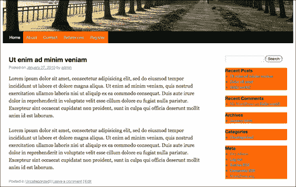

# 第二章：在 WordPress 中使用 jQuery

现在我们了解了 jQuery 和 WordPress 的基础知识，并对它们如何相互作用有了一点背景了，我们现在准备好看看如何使用 jQuery 动态增强 WordPress 安装了。我们将从在 WordPress 中包含 jQuery 开始，并以我们的第一个酷项目结束：展开和折叠内容。这只是你的 WordPress 站点中 jQuery 可能性的开始！再次强调，我们在这个标题中将使用 WordPress 3.0 和新的默认 Twenty Ten 主题与 jQuery 1.4.2，但请放心，如果你的站点或项目仍在使用 WordPress 2.9，这些 jQuery 技术也会很好地工作。

在本章中，我们将涵盖以下主题：

+   在 WordPress 中注册 jQuery

+   使用谷歌的 CDN 来包含 jQuery

+   回顾所有 jQuery 的“秘密武器”

+   我们的第一个 jQuery 和 WordPress 增强

# 将 jQuery 引入 WordPress

jQuery 可以以以下三种不同的方式包含到 WordPress 中：

+   你可以从`jQuery.com`下载，并直接在 XHTML 头标签中使用`script`标签包含它，放在你的主题的`header.php`文件中（这种方法可行，但出于各种原因并不推荐）

+   你可以在主题和插件中注册 WordPress 捆绑的 jQuery

+   你也可以利用谷歌的 CDN（代码分发网络）来注册和包含 jQuery 到你的主题和插件中。

我们在第一章中涵盖了第一种方法的基础知识，*开始：WordPress 和 jQuery*。WordPress 非常灵活，任何具有正确管理员级别的用户都可以更新、增强主题，或安装其他插件，这些插件可能也使用 jQuery 或其他 JavaScript 库的版本。因此，直接将 jQuery 或任何 JavaScript 直接包含到主题中，带有硬编码脚本标记，这并不推荐，因为它可能会与通过主题定制或添加到 WordPress 安装的插件中包含的其他脚本和库发生冲突。在本章中，让我们来看看使用剩余的两种方法，通过 WordPress 的**Script** API 注册 jQuery 和使用谷歌的 CDN。

## jQuery 现在与 WordPress 捆绑在一起

从 WordPress 2.7 开始，jQuery 和其他几个 JavaScript 库和插件已经捆绑到 WordPress 的 Script API 中，并通过一个叫做`wp_enqueue_script`的方便函数可用。实际上，WordPress 已经将 jQuery 和相当多的其他 JavaScript 库（包括与 Prototype 和更多其他库一起的`Script.aculo.us`）捆绑到`wp-includes`目录中一段时间了，但直到 2.7 版本，这些包都不那么容易访问。

### 在 WP 主题中注册 jQuery

你可以以两种不同的方式激活 WordPress 捆绑的 jQuery：

首先，在你的`header.php`文件中在闭合的`</head>`标签前放置以下代码：

```js
<?php wp_enqueue_script("jquery"); ?>
<?php wp_head(); ?>
<script type="text/javascript">
//add jQuery code here
jQuery(document).ready(function() {
jQuery("p").click(function() {
alert("Hello world!");
});
});
</script>

```

或者，你可以在主题的`functions.php`文件中注册`wp_enqueue_script`（以及你编写的任何自定义 jQuery 代码）。如果你的主题没有`functions.php`文件，只需创建一个新文件，命名为`functions.php`，并将其放在主题的根目录中，与其他模板文件一起放置（`functions.php`是一个与我们正在使用的默认主题一起提供的标准模板文件）。将以下代码放入你的`functions.php`文件中：

```js
<?php wp_enqueue_script('jquery');/*this registers jquery*/
function jq_test(){ /*This is your custom jQuery script*/
?>
<script type="text/javascript">
jQuery(document).ready(function() {
jQuery("p").click(function() {
alert("Hello world!");
});
});
</script>
<?php
}
add_filter('wp_head', 'jq_test');/*this adds your script to the wp_head() hook in the header.php file and ensures your custom jQuery script is run*/
?>

```

### 避免注册 jQuery 时遇到的问题

我第一次尝试使用`wp_enqueue_script`加载 jQuery 时（无论是在`functions.php`文件中还是通过`header.php`文件），都无法使其工作。在 WordPress Codex 上花了一些时间和一些头发后，我终于意识到了以下事实：

+   如果你直接加载到你的`header.php`模板文件中，请确保`wp_enqueue_script`函数位于你的`wp_head`函数之前。你的自定义 jQuery 代码必须位于`wp_head`函数之后。

+   如果你在`functions.php`文件中注册`wp_enqueue_script`，请确保它出现在通过`add_filter`函数加载到`wp_head`中的任何自定义函数之前。

    ### 提示

    **了解一下** `wp_enqueue_script` **函数！**

    这个函数是 WordPress 的脚本 API 的一部分，实际上它做的不仅仅是加载 jQuery！正如我所提到的，实际上有超过五十个 JavaScript 工具包、框架、用户界面库、插件和帮助程序，你可以安全地使用`wp_enqueue_script`函数进行加载。在这里查看：[`codex.wordpress.org/Function_Reference/wp_enqueue_script`](http://codex.wordpress.org/Function_Reference/wp_enqueue_script)。

## 使用 Google 的 CDN

就我个人而言，我对注册并引用 WordPress 自带的副本有些犹豫。我发现，有时从**Google Code 的代码分发网络**（**CDN**）加载库是一个更好的选择。CDN 节省了带宽，允许您的站点在下载其他脚本和相关内容时进行一些并行处理。而且，可以很容易地始终获取最新版本的 jQuery。从 Google 的 CDN 加载 jQuery 库非常快，作为一个额外的奖励，如果您的站点用户以前访问过另一个从 Google Code 的 CDN 提供 jQuery 的站点，该库将已经缓存。

### 在主题中通过 Google 的 CDN 注册和包含 jQuery

要从 Google Code 的 CDN 中包含 jQuery，我们将确保注销 jQuery，然后通过 Google 的 CDN 进行注册。这就是注册和使用 `wp_enqueue_script` 函数的美妙之处：如果任何其他插件或脚本需要 jQuery，并且与从 Google 加载的版本没有冲突，那么该脚本将使用已加载的 Google CDN 库。如果脚本依赖于特定版本的 jQuery，比如 1.3.2 或 1.2.6，并且 CDN 正在加载 1.4.2 版本，那么该脚本将继续加载它需要的 jQuery 版本。因为（正如我们将学到的那样）通过 Script API 加载的每个脚本都保持在 `noConflict` 模式下，所以只要它们被注册和需要，同时加载两个库版本是可以的。

```js
...
wp_deregister_script( 'jquery' );
wp_register_script( 'jquery', 'http://ajax.googleapis.com/ajax/libs/jquery/1.4/jquery.min.js');
...

```

Google 提供了一个很棒的版本控制系统，允许你尽可能精确，或者只拉取最新的稳定版本。考虑前面的代码示例（注意前面代码示例中的突出显示的数字，1.4）。

#### 了解 Google 的版本控制系统

上述注册脚本引用了 jQuery 的 1.4.2 版本（在撰写本标题时是最新版本）。当 jQuery 的开发人员发布一个新版本，比如 1.4.3 时，该版本将自动由相同的 URL 调用，因为我没有准确定位版本的具体细节。同样，我可以选择调用 `...jquery/1.3/jquery..`，这将给我 `1.3` 版本中的最高版本 `1.3.2`。你猜对了，针对一个简单的 `...jquery/1/..` 将会拉取最新版本的 jQuery，直到 jQuery 升级到 2.0 版本！

通常情况下，始终加载最新的库是一个好习惯，但你永远不知道，你可能会使用一个 jQuery 插件或编写一些自己的代码，与新版本不兼容。然后，你会想要针对与你的插件或自定义脚本兼容的库的最后一个特定版本，直到你能够修复和更新它们。

## 使用 WordPress 的捆绑 jQuery 与包含自己的 jQuery 下载或使用 Google 的 CDN

正如我之前提到的，`wp_enqueue_script` 函数允许安全地将 jQuery（和其他包含项）加载到 `noConflict` 模式中。只要你从 Google CDN 注销并注册 jQuery，该库就会以相同的 `noConflict` 模式保护加载到 WordPress 中。我真的很喜欢利用 Google 的 CDN，因为我提到的各种性能原因，但对于大型项目，有许多编辑和管理员对如何管理 WordPress 站点以及使用什么 WordPress 插件作出不同决策，我会保守行事并将捆绑版本注册到主题中。此外，对于开发而言，如果我正在开发一个主题，并且由于旅行（或需要提高生产力）而与网络断开连接，我会发现在我的 MAMP 或 LAMP 服务器上已经运行 jQuery 很好。一旦网站上线，我会考虑将其切换到 Google CDN 版本的 jQuery。

# 避免冲突！

因为 WordPress 和 jQuery 预期其他可能使用短变量`$`的库将被加载。`wp_enqueue_script`确保以`noConflict`模式加载 jQuery。因此，你还需要确保使用`noConflict`模式的**语法**编写你的自定义 jQuery 代码。最简单的方法是将`$`变量（在许多 jQuery 脚本中常见）替换为完整的`jQuery`变量，正如我在第一章中讨论的，*入门：WordPress 和 jQuery*，并在我之前的两个示例中完成的那样。

## 设置你自己的 jQuery 变量

如果你觉得写出`jQuery`变量很麻烦，但又想保持在`noConflict`模式下，你可以将标准的`$`变量替换为你想要的任何变量，如下所示：

```js
<script type="text/javascript">
var $jq = jQuery.noConflict();
$jq(document).ready(function() {
$jq("p").click(function() {
alert("Hello world!");
});
});
</script>

```

## 但我真的想使用$变量！

在 WordPress 中**不应**使用`$`变量来表示 jQuery。好吧，我知道，你有一个很好的理由。比如说，你正在从另一个非 WordPress 项目复制一个 jQuery 脚本，将所有的`$`变量转换为`jQuery`或一些其他自定义快捷变量可能会很麻烦。好吧。（从未听说过“查找和替换”？）无论如何，这里是一个如何将 jQuery 快捷方式安全地使用`$`变量的示例：

```js
jQuery(function ($) {
/* jQuery only code using $ can safely go here */
});

```

上述解决方案的唯一缺点是，我发现很容易开始使用`$`变量，然后忘记将其他脚本封装在上述 jQuery 函数中。如果我的所有 jQuery 脚本都使用`jQuery`变量或自定义变量（如`$jq`），我在`noConflict`模式下会更好地工作。

### 提示

**在 WordPress 插件中包含 jQuery**

你可以使用前面提到的任何方法将 jQuery 包含到 WordPress 插件中。但是，你需要对使用 WordPress 插件有所了解。我们将在稍后的第三章中详细介绍这个主题，*深入挖掘：理解 jQuery 和 WordPress*。

# 启动 jQuery 脚本

大多数时候，你希望你的脚本在 DOM 加载和准备好后立即启动和/或可用。为此，你可以使用标准的“文档就绪”技术，如下所示：

```js
jQuery(document).ready(function(){
// Your jQuery script go here
});

```

你可以通过使用以下代码稍微简化上述代码：

```js
jQuery(function(){
// Your jQuery script go here
});

```

如果调用了`jQuery`变量并立即传递了一个函数，jQuery 会假定暗示了`.ready`事件，并在 DOM 加载完成后立即运行下一个选择器和函数。

# 我们的第一个 WordPress 和 jQuery 设置

我明白了。已经说了足够多的话。让我们开始使用 jQuery 吧。本书的大部分代码和示例使用的是 WordPress 3.0 RC 和全新的默认主题“Twenty Ten”。这是一个很棒、干净、符合 HTML5 标准的主题。即使你想增强旧版本的 WordPress，比如 2.8 或 2.9，你也会很高兴地知道，本书的每一个脚本（或其近似版本）都是最初在 2.8.6 和 2.9.2 版本中编写和测试的，然后才移植到 3.0 版本中。

在适当的情况下，我将向你展示 WordPress 2.9.2 默认主题的替代 jQuery 解决方案，并指出 jQuery 1.3.2 库（随版本 2.9.2 捆绑）与 jQuery 1.4.2 库（随 WordPress 版本 3.0 捆绑）之间的区别。

每个示例的重点不仅是向你展示如何增强 WordPress 的默认主题，而是任何主题，我希望你能发挥创造力，利用这些示例找到将它们以独特的方式应用于各种 WordPress 版本、主题和插件的方法！

## 在我们的设置中注册 jQuery

因为随 WordPress 3.0 一起提供的捆绑版本的 jQuery 也恰好是可用的最新版本的 jQuery，即 1.4.2，我将简单地导航到`wp-content/themes/twentyten`并打开`header.php`文件，然后使用基本的`wp_enqueue_script`函数来调用 jQuery，如下所示：

```js
//placed right above the wp_head function
wp_enqueue_script( 'jquery' );
wp_head();

```

## 注册您自己的自定义脚本文件

接下来，我们需要将一个单独的脚本文件包含到我们的主题中，这个文件将有我们的自定义 jQuery 脚本。我想在主题中创建一个名为`js`的目录，我将在那里保存所有我的 JavaScripts。在那个目录中，我将创建一个文件并命名为`custom-jquery.js`。

这里有个很棒的东西：你可以使用`wp_enqueue_script`来包含你写的任何脚本。你将这样做是为了宣布该脚本依赖于 jQuery，因此如果出于某种原因，jQuery 尚未加载，WordPress 将加载 jQuery！你将想把你的自定义脚本放在 jQuery 调用下面，但在`wp_head()`调用之前。

```js
...
wp_enqueue_script( 'jquery' );
wp_enqueue_script('custom-jquery', get_bloginfo('stylesheet_directory') . '/js/custom-jquery.js', array('jquery'), '20100510' );
wp_head();

```

在上述函数`wp_enqueue_script`中，我首先注册了我的脚本名为`custom-jquery`。然后在下一个参数中，我告诉 WordPress 在哪里找到我的脚本，使用`get_bloginfo`模板标记将 WordPress 导向`twentyten`主题的文件夹 "`.../js/custom-jquery.js`"。对于函数的第三个参数，我将脚本设置为依赖于`jquery`，在最后一个参数中，我简单地设置了一个版本号。我通常将这个数字设置为当天的日期。如果我更新了脚本，我会尝试更新函数中的日期，因此当主题“渲染”时，我的脚本加载起来看起来像这样：

```js
<script type='text/javascript' src='http://localhost/wp-content/themes/twentyten/js/custom-jquery.js?ver=20100510'></script>

```

这有助于浏览器“新鲜”加载脚本，而不是如果我更新了脚本，则从缓存中加载脚本。

### 提示

**之前的自定义脚本包含方法也适用于 jQuery 库本身！**

比如，在不久的将来，jQuery 更新到版本 1.4.3（或 1.5 等等），但是在 WordPress 更新并包含该版本之前还需要一段时间。你当然可以使用 Google CDN 注册最新的脚本版本，但是，如果出于某种原因，你不想使用 Google CDN，那么你可以直接从 jQuery.com 网站下载最新版本的 jQuery，并将其放置在你主题的根目录中，并使用我们刚刚用来包含我们的 `custom-jquery.js` 文件的自定义注册方法进行注册。

别忘了首先 `deregister` 绑定的 jQuery！

还有：通过 `wp_enqueue_script` 调用脚本时，同时“注册”它，因此如果使用 `wp_enqueue_script`，就不需要单独调用 `register` 函数。

## 设置自定义 jQuery 文件

最后，让我们打开 `custom-jquery.js` 文件，并使用我们之前学到的技巧，设置 jQuery 的文档就绪函数的快捷方式如下：

```js
jQuery(function(){ /*<- shortcut for document ready*/
/*any code we write will go here*/
});//end docReady

```

就是这样！让我们开始探索 jQuery 的“秘密武器”并将它们投入使用吧。现在，你可以将以下各节描述的任何代码放入你的 `custom-jquery.js` 文件中，并进行实验！

# jQuery 的秘密武器 #1：使用选择器和过滤器

是时候开始享受一些 jQuery 的乐趣了！我觉得 jQuery 可以分解为三个核心优势，我称之为它的“秘密武器”：

+   理解选择器和过滤器

+   操纵 CSS 和内容

+   处理事件和效果

如果你掌握了这三个最重要的优点，那么你就已经在成为 jQuery 的巨星的路上了！

第一项，理解选择器和过滤器，是**必不可少**的。如果你想要能够使用 jQuery 做任何其他事情，你就需要对选择器和过滤器有很强的理解能力。你在使用选择器和过滤器方面越好，你在整个 jQuery 方面就会越好。

选择器和过滤器让你有能力（你猜对了！）将页面上的对象选择到 jQuery 包装器对象中，然后以几乎任何你认为合适的方式来使用和操作它们。选择器将允许你使用简单的 CSS 语法轻松地抓取一个元素数组。过滤器将进一步缩小和精炼该数组的结果。

请记住，使用选择器和过滤器将对象选择到 jQuery 包装器中后，这些对象不再是真正的 DOM 元素了。它们是一个对象数组，位于 jQuery 对象包装器中，具有一整套可用的函数和功能。如果你有需要的话，你可以通过每个数组元素中添加的 jQuery 项目和功能来逐个逐个地找到实际的 DOM 元素，但为什么呢？jQuery 的整个目的就是为了避免你这样做，但知道它在那里也是好的。

## 从文档中选择任何你想要的东西

在接下来的示例中，我们将看看选择器和过滤器；但为了说明 jQuery 的选择，我将使用一个名为`css()`的函数。我将在后面的部分中介绍该函数和更多内容。现在，只需关注样本开头的选择器和过滤器。

jQuery 选择器的本质是它们基于 CSS 语法。这意味着大多数人会发现，您可以非常容易地使用 jQuery，就像您如何使用 CSS 来定位和样式化页面上的特定元素一样。

选择在主要 jQuery 函数的开头声明：

```js
jQuery(function(){
jQuery("selector:filter").jqFunctionName();
});

```

您还可以根据 CSS 语法将以下元素选择到 jQuery 包装器中：

+   HTML **标签名称**，如 `body, p, h1, h2, div` 等等

+   使用在 CSS 中用 `#`（井号）表示的**id 属性**，如`#header`或`#sidebar`。

+   以及**类属性**，在 CSS 中用`.`（点）表示，如`.body`或`.post`

当然，您可以使用 CSS 中允许的任何组合来定位元素，您也可以使用 jQuery 执行。例如：

+   `标签`（空格，或无空格）`#id` 或 `.className`，例如 `div#sidebar li`—这将抓取`sidebar` ID 名称中的 `div` 中的 *所有* `li` 实例

+   `标签`，（逗号）`.class` 如 `p, .post`—逗号确保这将抓取所有 *要么* 是段落 *要么* 用`.post`类标记的内容

为了澄清，就像在 CSS 中一样，您也可以使用**语法**来*结构化*选择器：

+   逗号表示选择此元素，（和）此元素。例如：`div, p`（选择所有`div`标签*和*所有`p`标签）。

+   空格表示选择此元素（其中有）此元素在内部。例如：`div p .className`（选择所有具有段落`p`标签的`div`标签，其中 *带有* 任何其他分配给`.className`类的元素 *在* `p` 标签内）。

+   最后，**没有空格** 将表示直接应用于元素而不仅仅是包含在其中的类：`p.className`（选择所有带有`.className`分配的段落 `p` 标签。这将 *不会* 选择具有相同`.className`类分配的 `div` 标签）。

除了标准的 CSS 逗号空格和附加的 id 和类名之外，在 jQuery 中，您还可以使用这些额外的符号来澄清您的选择：

+   大于号 `>` 仅会查找符合选择条件的父元素的子元素。

    例如，`.post > p` 将找到直接位于 `.post` 类中的段落 `p` 标签。在 `.post` 类内部的不同类中的 `p` 标签 *将不* 被选择。

让我们比较 `".post（空格）p"` 和 `".post> p"` 并查看结果。

在我们的第一个示例中，我们将如下检查代码：

```js
jQuery(function(){
jQuery(".post p").css("background", "#f60");
});

```

请注意，此代码生成类似于下一个截图的输出，显示了所有段落的高亮显示，即使它们嵌套在具有名为`.entry-content`的类中：


然而，让我们看一下这个代码示例：

```js
jQuery(function(){
jQuery(".post > p").css("background", "#f60");
});

```

让我们也看一下以下截图。我们发现没有段落被突出显示，因为它们位于另一个具有名为 `.entry-content` 的 `div` 标签内，因此 *不* 是 `.post` 的子元素。


`+` 选择器将找到与匹配选择器相匹配的所有 *下一个* 元素。例如：`li + li` 将选择列表中每个列表项 `li`，*除了* 第一项。只有与该第一项 *相邻* 的项目如下所示：

```js
...
jQuery("li + li").css("background", "#f60");
...

```

以下截图说明了这一点：



`~` 选择器将找到选择器的所有兄弟元素。例如：`li ~ li` 将选择列表中除第一项之外的每个列表项，只选择该第一项的兄弟项。代码示例如下：

```js
...
jQuery("li ~ li").css("background", "#f60");
...

```

由于兄弟元素通常紧邻被选定的项，因此 `+` 和 `~` 选择器通常会获得类似的结果。注意以下截图与上一截图相似：


## 过滤这些选择

很多人可能只需使用基本的 CSS 样式选择器就能满足大部分需求。但是，等等，还有更多！过滤器是我发现非常有用的选择部分，特别是考虑到我们正在使用 WordPress。同样，对于 WordPress 主题，你的许多 HTML 元素、ID 和类名可能是由你不是作者的主题生成的，或者由于各种原因，你不想编辑它们，或者你可能被禁止编辑主题。（什么？设计师在开发人员开始编辑他们的标记时有点“暴躁”？我不知道。）但没关系。有了过滤器，你根本不必担心。

问题是，初学 jQuery 时，想要去更改 HTML 标记以便更容易地用 jQuery 进行选择是很诱人的。但是在 WordPress 中，这并不容易。更改标记意味着你有可能破坏主题，或者更糟糕的是，不得不提醒内容编辑者手动向帖子和页面添加特定标记（在某些方面，这有悖于使用 WordPress 的初衷）。理解过滤器将允许你在每种情况和场景中对你的选择进行精确控制，每一次。

很容易细化过滤器，你只需包括这些项目，它们将获取你选定的元素并将它们与特定条件匹配，例如它们相对于其他元素的位置或索引。同样，为了符合 CSS 选择语法的精神，一些这些过滤器看起来类似于 **CSS 伪类**，例如 `:hover` 和 `:first-child`。这些实际上并不都是 CSS 伪类；它们在 CSS 样式表中不起作用，但在 jQuery 中会起作用。

这些筛选器在 jQuery API 中分为以下类别（按我发现它们在 WordPress 开发中最有用的顺序列出）：基本筛选器、内容筛选器、子筛选器、表单筛选器、属性筛选器和可见性筛选器。

### 基本筛选器

当你使用 WordPress 时，我相信你会发现`:not()`筛选器和`:header`筛选器非常有用。`:header`筛选器允许你简单地选择*所有*选择中的标题，无论它们是什么级别的标题。而不是必须选择`h1`和`h2`等等，将`:header`筛选器添加到你的选择器中将抓取所有标题，从`h1`到`h6`都包含在包装器中。在你的`custom-jquery.js`文件中试一试，并添加以下代码（不要担心`.css(...)`；代码的一部分；我们稍后会讲到这一点。我只是用它来帮助我们可视化 jQuery 可以做什么）：

```js
jQuery(function(){
jQuery(":header").css("background", "#f60");
});

```

在下一个屏幕截图中，你将看到所有标题都被选择了，`h1, h2`，等等：


我最喜欢的筛选器是`:not`筛选器。曾经在飞机上有没有注意到，你经常被提醒“最近的出口可能在你身后”？同样的原则适用于当你试图将正确的元素装入你的 jQuery 包装器时。有时候告诉 jQuery 你*不*想要包装器中的东西会更容易！我曾经使用一个主题，里面有一些非常漂亮的电子邮件和 PDF 图标元素隐藏在`.post`类中。主题没有`.entry`类。这很烦人，因为我想对加载到 WordPress 文章中的图像应用一般的转换，但这些图标受到了影响！主题作者将它们包装在一个名为`.postIcons`的类中。使用`:not()`筛选器，我能够转换所有在`.post`类中但*不*在`.postIcons`类中的`img`标签。太棒了。

加上前述的`:header`选择器后再加上`:not`筛选器，看看会发生什么：

```js
...
jQuery(":header:not(li :header)").css("background", "#f60");
...

```

以下筛选器现在显示我们已选择所有标题，除了列表项中的标题：


你可能已经从前面的例子中注意到了，你可以在选择器中巧妙地使用筛选器，多次使用它们。

你说什么？没错，你说得对：`(":headers:not(li h2)")`会得到与前面例子*完全相同*的结果，而且是始终更好地选择最直接的路径来进行选择。我只是试图说明这两个筛选器如何使用。最终，你会遇到更复杂的情况，它们会非常有用。对于其他情况，在使用筛选器之前，先使用普通选择器。

让我们逐个查看每个基本过滤器，看看它的语法是什么样的，以及它的详细功能。因为大多数 WordPress 主题作者使用`.post`类，而且大多数时候你将会以文章元素为目标，所以使语法更有意义。我在示例中经常使用`.post`类名，但请记住，您的主选择器可以是 CSS 选择器语法中使用的任何`tag、id`名称或`class`名称！

| 示例 | 语法 | 描述 |
| --- | --- | --- |
| :not(selector) | `jQuery(".post img:not(.pIcon)").jqFn()`; | 过滤掉所有匹配给定选择器的元素。 |
| :header | `jQuery(".post:header").jqFn()`; | 过滤到所有标题元素，例如 h1、h2、h3 等。 |
| :first | `jQuery(".post:first") .jqFn()`; | 仅过滤到第一个选定的元素。 |
| :last | `jQuery(".post:last") .jqFn()`; | 仅过滤到最后一个选定的元素。 |
| :even | `jQuery(".post:even") .jqFn()`; | 仅过滤到偶数元素。注意：数组是从零开始索引的！零被视为偶数，因此您的第一个项目将被选中！ |
| :odd | `jQuery(".post:odd") .jqFn()`; | 仅过滤到奇数元素。注意：数组是从零开始索引的！零被视为偶数，因此您的第二个项目将被选中！ |
| :eq(number) | `jQuery(".post:eq(0)") .jqFn()`; | 通过其索引过滤到单个元素，这再次是从零开始计数的。 |
| :gt(number) | `jQuery(".post:gt(0)") .jqFn()`; | 过滤到所有索引**大于**给定索引的元素，再次强调，这是从零开始计数的。 |
| :lt(number) | `jQuery(".post:lt(2)") .jqFn()`; | 过滤到所有索引**小于**给定索引的元素。 |
| :animated | `jQuery(".post:animated").jqFn()`; | 过滤到当前正在进行动画的所有元素（我们将在本章后面讨论动画）。 |

### 子过滤器

在 jQuery 包装器中的任何内容都是一个数组，这些子过滤器会派上用场，但当你使用`li`标签或在 WordPress 中使用定义列表元素时，你可能会发现这些过滤器最有用。默认情况下，WordPress 将相当数量的链接内容拆分为 `li` 标签元素和画廊，这些画廊是通过将图像和描述包装在定义列表 (`dt dd` 元素) 中创建的。

| 示例 | 语法 | 描述 |
| --- | --- | --- |
| :nth-child(number/even/odd) | `jQuery(".linkcat li:nth-child(1)").css("background", "#f60")`; | 过滤到其选择器的“nth”子元素。请注意，这**不是**从零开始计数的！`1` 和 odd 选择**第一个**元素。 |
| :first-child | `jQuery(".linkcat li:first-child").css("background", "#f60")`; | 过滤到其父元素的第一个子元素。 |
| :last-child | `jQuery(".linkcat li:last-child").css("background", "#f60")`; | 过滤到其父元素的最后一个子元素。 |
| :only-child | `jQuery(".pagenav li:only-child").css("background", "#f60")`; | 筛选出只是其父元素的唯一子元素的元素。如果父元素有多个子元素，则不选中任何元素。 |

在这里您可以看到`only-child`过滤器的运行情况：

```js
...
jQuery("li:only-child").css("background", "#f60");
...

```


这是`nth-child`过滤器在 Meta 列表中的示例：

```js
...
jQuery(".widget_meta li:nth-child(odd)").css("background", "#f60");
...

```


### 内容过滤器

在基本和子过滤器之后，您将遇到的下一个最有用的过滤器是内容过滤器。内容过滤器允许您基于**匹配**各种类型的元素和内容进行选择。我经常在 WordPress 中使用的最有用的内容过滤器是`:has()`过滤器。我经常需要选择具有*内部内容*的元素，比如内部包含`img`图像标签的锚`a`标签，或者内部包含列表`li`标签的段落`p`标签，或者内部包含特定类名的其他元素。定位特定对象很容易，但如果您发现需要基于内部包含的元素类型来定位一个更大的父对象，`:has()`过滤器将成为您的好朋友。

接下来最有用的项目是`:contains()`元素，乍看之下，可能与`:has()`非常相似！但这个过滤器非常不同（而且非常酷），因为它允许您定位元素内的特定*文本*。

对于这两种过滤器要小心，尽量做好尽可能多的“预选”。确保 jQuery 针对您尝试选择的元素和文本指向正确的方向。仅仅指定 `...(p:contains('my text'))..`. 可能对于大量内容的页面太泛，会导致 jQuery 延迟，或者更糟糕的是，由于它必须搜索页面上每一个小的 `p, div` 或 `a` 元素的文本或元素，而导致挂起和超时。一个明确指定了 `...(#divIdName .className a:contains('my text'))...` 的 jQuery 要好得多，因为 jQuery 只需要搜索指定 ID 容器内指定类的文本中的每个 `a` 元素，而不是整个页面的内容。

让我们更详细地看一下以下内容过滤器：

| 示例 | 语法 | 描述 |
| --- | --- | --- |
| :has(selector) | `jQuery(".post:has(.entry)") .css("background", "#f60")`; | 筛选出至少有一个匹配元素内部的元素。 |
| :contains(text) | `jQuery(".post:contains('Hello world')").css("background", "#f60")`; | 筛选出包含特定文本的元素。注意：这是**区分大小写的！** |
| :empty | `jQuery(":empty')") .css("background", "#f60")`; | 筛选出没有子元素的元素。这包括文本节点。 |
| :parent | `jQuery(":parent')") .css("background", "#f60")`; | 筛选出是另一个元素的父元素的元素。这包括了文本节点。 |

举个详细的例子，让我们看一下默认主题的侧边栏。侧边栏有一些项目，没有用特殊的`id`名称或`class`进行标注。如果我想要定位仅在 Meta 标题下的`ul`列表，我可以使用`:has()`和`:contains()`来定位它。注意我如何“直接”告诉 jQuery，先预先选择或指向`.widget-area li`标签，这样 jQuery 在我告诉它查找子元素和包含的文本*之前*会忽略页面的其余部分。

您可以在下一个截图中看到以下代码的结果：

```js
...
jQuery(".widget-area li:has(h3:contains('Meta')) ul")
.css("background", "#f60");
...

```


### 表单过滤器

如果所有之前的选择器和过滤器还不够酷，你还可以明确过滤到几种类型的表单元素，以及这些元素的事件类型。使用这些过滤器，您将能够控制 WordPress 生成的评论表单以及自定义和 WordPress 插件表单，并使它们更直观和易于使用。在本书的后面，我们将看到 jQuery 如何使表单使用和验证变得非常简单。

| 示例 | 语法 | 描述 |
| --- | --- | --- |
| :input | `jQuery("form:input").css("background", "#f60")`; | 过滤到所有输入、文本区域、选择和按钮元素 |
| :text | `jQuery("form:text").css("background", "#f60")`; | 过滤到所有类型为文本的输入元素 |
| :password | `jQuery("form:password").css("background", "#f60")`; | 过滤到所有类型为密码的输入元素 |
| :radio | `jQuery("form:radio").css("background", "#f60")`; | 过滤到所有类型为单选框的输入元素 |
| :checkbox | `jQuery("form:checkbox").css("background", "#f60")`; | 过滤到所有类型为复选框的输入元素 |
| :submit | `jQuery("form:submit").css("background", "#f60")`; | 过滤到所有类型为提交的输入元素 |
| :image | `jQuery("form:image").css("background", "#f60")`; | 过滤到所有图像元素（分类为表单过滤器，但对常规图像也有用） |
| :reset | `jQuery("form:reset").css("background", "#f60")`; | 过滤到所有类型为 reset 的输入元素 |
| :button | `jQuery("form:button") .css("background", "#f60")`; | 过滤到所有类型为按钮的输入元素 |
| :file | `jQuery("form:file").css("background", "#f60")`; | 过滤到所有类型为文件的输入元素 |

使用以下代码，我只突出显示了`text`输入和`submit`按钮，如下一个截图所示：

```js
...
jQuery(":text, :submit").css("background", "#f60");
...

```


### 属性过滤器

属性就是在 HTML 标签内部找到的附加属性，允许标签自我完善。你可能最熟悉`id`和`class`属性，以及`img`和`script`标签的`src`属性，当然还有`a`标签的`href`属性。

属性是用于定义和细化 HTML 元素的强大属性，因此您可以想象使用它们进行过滤有多么强大。确实强大，但请记住，选择将项目放入 jQuery 包装器中的最简单和最直接的方法通常是最好的。我的示例将展示不同类别的选择，因为它们创建了漂亮的视觉示例，但实际上，最好使用常规选择器来定位类别项，并保留属性过滤器用于更精细、棘手的工作。

您会注意到这些过滤器与其他过滤器有所不同。而不是使用`:`（冒号标记），这些过滤器使用`[]`（方括号）。这意味着您可以轻松看到在您的选择器语法中，是否在过滤属性。您还会注意到，在 HTML 的 DOM 中的每个属性中，您都可以为其进行过滤。没有标准的“属性过滤器名称”集合；您只需使用方括号来指示您想要过滤的任何属性。您甚至可以以几种方式构建属性过滤器：

| 示例 | 语法 | 描述 |
| --- | --- | --- |
| [attribute] | `jQuery("div [href]").css("background", "#f60")`; | 过滤一个属性，无论其值如何 |
| [attribute=value] | `jQuery("div [class='entry']").css("background", "#f60")`; | 过滤属性和*精确*指定的值 |
| [attribute!=value] | `jQuery("div [class!='entry']").css("background", "#f60")`; | 过滤不具有指定值的属性 |
| [attribute^=value] | `jQuery("div [href^='http://']").css("background", "#f60")`; | 过滤具有以特定字符串*开头*的值的属性 |
| [attribute$=value] | `jQuery("div [href$='/']").css("background", "#f60")`; | 过滤具有以特定字符串*结尾*的值的属性 |
| [attribute*=value] | `jQuery("div [href*='page_id']").css("background", "#f60")`; | 过滤包含特定字符串的属性 |

在这里，我们可以通过以下 jQuery 代码查看仅针对侧边栏中的本地链接进行定位：

```js
...
jQuery(".widget-area [href^='http://localhost']").css("background", "#f60");
...

```

以下截图显示了结果，只有指向 WordPress 安装的`localhost`链接被突出显示：


### 可见性

我把这两个过滤器放在最后，主要是因为在我大多数的 WordPress 项目中我很少使用它们，但它们是选择器/过滤器 API 的一部分，所以我会在这里介绍它们。

大多数情况下，你使用 jQuery 需要操作的元素默认是可见的。但偶尔会有一些通过 jQuery 转换隐藏的项目或者隐藏的表单字段，你可能需要对它们进行转换。对于这种情况，你可以使用 `:hidden` 过滤器。这有点棘手，因为你已经将项目选中到你的包装器中，但你不一定会看到任何转换（除非转换是使其可见的）。如果你发现自己有很多隐藏的元素，你可以随时过滤出可见的元素，如果这样更容易的话。

| 示例 | 语法 | 描述 |
| --- | --- | --- |
| :hidden | `jQuery("form:input:hidden") .css("background", "#f60")`; | 用于选择显示值为 none 或类型值为 hidden 或具有显式宽度和高度为 `0` 的元素的过滤器 |
| :visible | `jQuery("div .post:visible") .css("background", "#f60")`; | 用于选择可见元素的过滤器 |

### 注意

我已经涵盖了我作为 WordPress 开发者最常使用的主要选择器和过滤器。务必查阅 jQuery 文档，了解所有按字母顺序列出的选择器和过滤器：[`api.jquery.com/category/selectors/`](http://api.jquery.com/category/selectors/)。

# jQuery 的秘密武器 #2：操作 CSS 和 DOM 中的元素

现在我们可以可靠地选择 WordPress 网站在页面上显示的任何 *对象*，让我们开始操纵和增强我们的选择！我们可以操作显示我们对象的 CSS 样式，如果这还不够酷，我们还可以在 DOM 中操作 HTML 对象本身。让我们开始操作 CSS。

## 操作 CSS

到目前为止，我们所看到的关于选择器和过滤器的所有内容都是必不可少的，用于定位你想要影响的元素。现在你可以将任何你想要的东西选入到包装器中了，让我们开始做些事情吧！多亏了之前的所有示例，你已经熟悉了 `css()` 函数。大多数情况下，你会使用这个函数来赋予标准的 CSS 属性值，比如：`background、border、padding、margins` 等等。如果你可以在 CSS 样式表中分配属性，你也可以使用 `css()` 函数来分配它。你还可以使用这个函数检索和获取 CSS 属性。

在 jQuery 的属性 API 中，你会发现更多的 CSS 操作特性，比如 `.addClass、.removeClass` 和 `.toggleClass`。这三个函数单独就能给你很大的动态化你的 WordPress 网站的能力。不要被我继续谈论属性所迷惑了！我们不再处理选择器和过滤器了。我们正在处理允许你操作这些选择的函数。让我们详细了解一下 jQuery 的 CSS 和类属性操作函数：

| 示例 | 语法 | 描述 |
| --- | --- | --- |
| .css('property', 'value') | `jQuery(".post") .css("background", "#f60");` | 添加或更改所选元素的 CSS 属性。 |
| .addClass('className') | `jQuery(".post") .addClass("sticky");` | 将所列类添加到每个所选元素中。 |
| .removeClass('className') | `jQuery(".post") .removeClass("sticky");` | 从每个所选元素中删除所列类。 |
| .toggleClass('className', switch-optional) | `jQuery(".post") .toggleClass("sticky");` | 根据它们当前的状态，从每个所选元素中切换所列类。如果类存在，则删除，如果不存在，则添加。 |
| .hasClass('className') | `jQuery(".post") .hasClass("sticky");` | 如果每个所选元素中存在所列类，则返回 true 或 false。 |

让我们通过向所有帖子添加默认主题的`sticky`类来检查一下`addClass()`函数。

### 注意

当进行选择时，您需要从`id`名称和`tag`名称中标注`class`名称，但在这些 jQuery 类属性函数中，您只需要输入类名。您不需要用"."来表示它。该函数只期望一个类名，因此不是必需的。正如您可能期望的那样，您显然不能使用`addClass`函数向选择添加`id`名称（不好意思，没有`addId`函数！）

```js
...
jQuery(".post").addClass("sticky");
...

```

现在，您可以在下一个截图中看到，通过 jQuery 而不是 WordPress，已将`.sticky`类添加到所有`.post`类中！


### 操纵属性

您也可以影响特定对象的属性（这对于切换我们的图像路径很方便，并提供了与`class`名称甚至`object`ID 名称一起使用的另一种方法）

| 示例 | 语法 | 描述 |
| --- | --- | --- |
| .attr | `jQuery(".post") .attr();` | 检索所选元素的第一个元素的属性值 |
| .removeAttr | `jQuery(".post a") .removeAttr("href");` | 从每个所选元素中移除一个属性 |

### 提示

**CSS 的更多控制力：**

如果您需要以友好的跨浏览器方式处理 HTML 对象，那么很容易检索并设置任何目标选择器上的一系列属性、高度和宽度变量。偶尔，这些变量会派上用场，但您会发现大部分工作都是在前一个表中列出的函数中完成的。尽管如此，您可能会想查看 jQuery 的 CSS API 下的定位、高度和宽度函数：[`docs.jquery.com/CSS`](http://docs.jquery.com/CSS)。

## 操纵元素和内容

jQuery 的 API 中的 Manipulation 部分再次非常广泛，但我发现其中一些函数对帮助我的 WordPress 和 jQuery 的增强非常有用。例如，如果你想要制作可展开或可收起的内容，你将需要一个元素来处理该事件，而不是每次都进入每篇文章并添加控制按钮（或提醒你的客户或站点编辑在每篇文章中添加控制链接或按钮 —— 是的，他们会这样做）。你可以使用 jQuery 在运行时添加和删除内容和 HTML 元素。

最有用的函数是 `prepend()` 和 `append()` 函数，允许您在选择之前或之后包含文本。这些函数允许您专注于内容，或者是选择器内的特定选择器，以便您更容易地进行目标选择。

接下来最有用的函数是 `before()` 和 `after()` 以及 `instertBefore()` 和 `instertAfter()` 函数。如果你发现需要在类名或 HTML 元素内部包装元素以添加额外的样式，那么使用 `wrap()` 函数就没问题了。你甚至可以删除和克隆元素！让我们更详细地看一下这些操作函数。

| 示例 | 语法 | 描述 |
| --- | --- | --- |
| .append(html 和 text) | `jQuery(".post") .append("<b>文章在这里结束</b>");` | 将参数中的内容插入到每个选定元素的末尾。 |
| .appendTo(selector) | `jQuery("<b>文章在这里结束</b>").appendTo(".post");` | 执行与 append 相同的操作，只是反转了元素选择和内容参数。 |
| .prepend(html 和 text) | `jQuery(".post") .prepend("<b>文章从这里开始</b>");` | 将参数中的内容插入到每个选定元素的开头。 |
| .prependTo(selector) | `jQuery("<b>文章从这里开始</b>").prependTo(".post");` | 执行与 prepend 相同的操作，只是反转了元素选择和内容参数。 |
| .after(string) | `jQuery(".post") .after("<b>这个在后面</b>");` | 将参数中的内容插入到每个选定元素之后并在外部。 |
| .insertAfter(selector) | `jQuery("<b>这个在后面</b>").insertAfter(".post");` | 执行与 after 相同的操作，只是反转了元素选择和内容参数。 |
| .before(HTML 和 text) | `jQuery(".post") .before("<b>这个在前面</b>");` | 将参数中的内容插入到每个选定元素之前并在外部。 |
| .insertBefore(selector) | `jQuery("<b>这个在前面</b>") .insertBefore("class");` | 执行与 before 相同的操作，只是反转了元素选择和内容参数。 |
| .wrap(html 或 functionName) | `jQuery(".post").wrap("<div class=".fun" />");` | 在每个选定元素周围包装一个 HTML 结构。您还可以构造一个将每个元素包装在 HTML 中的函数。 |
| .wrapAll(HTML) | `jQuery(".post").wrapAll("<div />");` | 类似于 wrap，但将 HTML 结构放置在所有元素周围，而不是每个单独的元素周围。 |
| .wrapInner(selector) | `jQuery(".post") .wrapInner("<div class=".fun" />");` | 类似于包装，但它将 HTML 结构放置在所选元素的每个文本或子元素周围。 |
| .html(HTML 和文本) | `jQuery(".post") .html("<h2>替换文本</h2>");` | 用参数中的内容替换所选项的任何内容和子元素。 |
| .text(仅限文本 HTML 字符将被转义) | `jQuery(".post") .text("替换文本");` | 类似于 HTML，但只限文本。任何 HTML 字符都将被转义为 ASCII 代码。 |
| .empty(selector) | `jQuery(".post").empty(".entry");` | 删除所选元素的任何内容和子元素。保留元素。 |
| .remove(selector) | `jQuery(".post").remove()`; | 类似于 empty 但删除整个元素。 |
| .clone(selector) | `jQuery(".post").clone()`; | 复制所选元素。 |

在这里，我们可以看到使用这些类型的函数是多么容易：

```js
...
jQuery(".post").append("<div style='text-align:right;
border-bottom: 1px solid #333'>End of Post</div>");
...

```

上述 jQuery 脚本将在以下截图中为每篇文章的末尾添加**文章结束**：


## 操作 DOM

使用 jQuery，您实际上可以遍历和处理 DOM 本身，而不仅仅是处理 jQuery 包装器集中的元素（请记住，这些不再是纯粹的 DOM 元素数组）。为了直接处理 DOM，您可以使用一些 jQuery 函数和属性。jQuery 的文档站点本身列出了大约 20 或 30 个函数，您可以使用这些函数来帮助您遍历 DOM，尽管再次强调，与 WordPress 一起工作时，您很可能不需要直接处理它。我最常使用的是 jQuery 的核心部分，而不是遍历 API 找不到的，但我使用它们类似于帮助我细化和导航 DOM 对象。 

| 示例 | 语法 | 描述 |
| --- | --- | --- |
| .length 或 size() | `jQuery(".post") .length;` | 返回所选集合中的元素数量。 |
| .get(数字-可选) | `jQuery(".post") .get(3);` | 这将返回原生 DOM 元素的数组。如果您不想直接处理 DOM 而不是 jQuery 包装元素，这将很方便。 |
| .find(selector) | `jQuery(".post") .find(".entry b");` | 返回与查找函数的选择器匹配的第一个选择器内的 jQuery 元素的数组。 |
| .each(functionName) | `jQuery(".post") .each(function(){//code});` | 这将对与 jQuery 选择器匹配的每个元素运行一个函数。 |

由于这些函数返回数字和数组，您将发现它们在故障排除时最有用。要轻松引用其中一个函数，我只需设置带有我的 jQuery 语句的 `alert()` 函数，如下所示：

```js
...
alert("How many posts does this blog have? "+jQuery(".post").length);
jQuery(".post").each(function(){
alert("one alert for each .post")
});
...

```

您可以在以下截图中看到结果警示：


### 提示

**一定要查看完整的遍历函数。**

再次强调，jQuery 的目的是让你摆脱 DOM 的细节，但随着你对 jQuery 的运用变得更加复杂，你不想忘记这些函数在[`docs.jquery.com/Traversing`](http://docs.jquery.com/Traversing)可以使用。

你也可以更仔细地查看 jQuery 核心部分在[`docs.jquery.com/Core`](http://docs.jquery.com/Core)。

# jQuery 秘密武器#3：事件和效果（又名：锦上添花）

好了，你是*选择*大师；你可以从任何人的 CSS 和 WordPress 主题中获取任何你想要的东西，你可以*操纵*这些选择的 CSS 属性和属性，直到牛回到家。仅从这些第一个例子中，你可能已经设法想出了自己的令人印象深刻的 jQuery 增强功能。但等等，还有更多！让我们用事件和效果把它们结合起来。

## 处理事件

你可以使用 jQuery 处理很多事件。你可以手动**绑定**和**解绑**元素的事件，你可以引用**统一事件对象**，还可以使用事件助手。我们暂时不会深入研究 jQuery 的统一事件对象，现在先看一下开始处理事件的最直接方法。

### 助手非常有用！

辅助函数，也经常被称为“快捷方式”，让你可以轻松地设置点击或悬停事件。你也可以轻松地切换事件。在 CSS 操作部分，我们看到了`toggleClass()`函数是多么有用；想象一下能够切换*更多*的函数。

大多数情况下，`hover()`函数能够满足你的需求，但如果你想要的是点击事件，那么`toggle()`函数可能是最合适的。`toggle()`函数比`hover`更灵活一些，因为你可以添加额外的函数，而不仅仅限于一个或两个函数。

| 示例 | 语法 | 描述 |
| --- | --- | --- |
| .click(functionName) | `jQuery(".post") .click(function(){//code});` | 绑定一个要在单击时执行的函数到`click`事件类型。 |
| .dbclick(functionName) | `jQuery(".post") .dbclick(function(){//code});` | 绑定一个函数到`click`事件类型，当双击时执行。 |
| .hover(functionName1, functionName2) | `jQuery(".post") .hover(function(){//code});` | 适用于`mouseenter/mouseleave`事件类型，为所选元素绑定两个函数，分别在`mouseenter`和`mouseleave`时执行。 |
| .toggle(functionName1, functionName2, functionName3, etc) | `jQuery(".post") .toggle(function(){//code});` | 适用于`click`事件类型，为所选元素绑定两个或更多函数，交替执行。 |
| .mouseenter(functionName) | `jQuery(".post") .mouseenter(function(){//code});` | 绑定一个要在鼠标进入所选元素时执行的函数。 |
| .mouseleave(functionName) | `jQuery(".post") .mouseleave(function(){//code});` | 绑定一个函数，在鼠标离开选定的元素时执行。 |
| .keydown(functionName) | `jQuery(".post") .keydown(function(){//code});` | 将一个函数绑定到`keydown`事件类型，仅在选定的元素有 *焦点* 且按键按下时执行。 |
| .keyup(functionName) | `jQuery(".post") .keyup(function(){//code});` | 将一个函数绑定到`keyup`事件类型，仅在选定的元素有 *焦点* 且按键后释放时执行。 |

随着事件的发生，页面更加活跃和动态。让我们在侧边栏导航项目上设置一个非常简单的悬停效果：

```js
...
jQuery(".widget-area li ul li").hover(function(){
jQuery(this).css("background", "#f60");
},
function(){
jQuery(this).css("background", "none");
});
...

```


### 使用 bind、unbind 和事件对象

我们只需快速概述这些函数；使用这种方法有点过火，但在特定情况下可能会派上用场，如果没有其他办法，它会让你感激 jQuery 提供的所有辅助快捷函数。

有时，您可能需要真正细化事件的控制，并使用`bind()`和`unbind()`函数，您很可能会为自己处理这些问题。您可以传递事件类型的参数，例如`click`或`mouseenter`；您也可以传递一些数据以及事件处理程序（或者您可以调用另一个函数）。数据是一个可选参数，这超出了本章的范围，但对于那些真正对使用 jQuery 进行开发感兴趣的人来说，知道您可以传递数据是很有用的（即使在本章中，我们也会稍微提及）！

让我们仔细看看并分解这些函数的各个部分：

| 示例 | 语法 | 描述 |
| --- | --- | --- |
| .bind(event type, data, functionName) | `jQuery(".post").bind("mouseenter", function(){//code})`; | 将一个函数附加到选定元素上触发的事件类型。 |
| .unbind(event type, functionName) | `jQuery(".post").bind("mouseenter", function(){//code})`; | 从选定的元素中移除事件类型。 |

我们可以通过使用`bind`和`unbind`来重新创建我们用 hover 类实现的效果。这有点麻烦，最终并不是实现简单悬停效果的最优雅方式。`bind`的优点是可以传递数据。以下示例演示了传递数据，即我们背景的颜色，到事件的函数：

```js
...
jQuery(".widget-area li ul li").bind("mouseenter", {color: "#f60"}, function(event){
jQuery(this).css("background", event.data.color);
jQuery(this).unbind("mouseleave");
});
jQuery(".widget-area li ul li").bind("mouseleave", function(){
jQuery(this).css("background", "none");
jQuery(this).unbind("mouseenter");
});
...

```

在前面的代码示例中，我们使用了 jQuery 的事件对象来传递数据。使用数据，统一的事件对象返回可以帮助您创建精细的 jQuery 转换，我经常使用对象的信息来帮助传递事件信息到函数中以获得更干净的代码，并帮助我进行故障排除。

| 示例 | 描述 |
| --- | --- |
| `event.type` | 返回事件类型，例如点击或`mouseenter`或`keyup`。 |
| `event.target` | 返回触发事件的选定元素。 |
| `event.data` | 返回并包含通过绑定函数传递的可选数据。 |
| `event.pageX, .pageY` | 确定鼠标相对于文档左边缘（pageX）或顶部（pageY）的位置。 |
| `event.result` | 返回由由此事件触发的事件处理程序返回的最后一个值。用于故障排除非常有用。 |
| `event.timeStamp` | 返回触发事件的 Unix 时间戳。 |

下面的代码将跟踪单击事件对象属性：

```js
...
jQuery(".post").click(function(event){
jQuery(this).html("event type: "+event.type+"<br/>event timestamp: "+event.timeStamp+"<br/>event x: "+event.pageX+"<br/>event y: "+event.pageY);
});
...

```

下面是一个你可能会发现有用的事件对象函数——`preventDefault()函数`。它可以阻止元素的默认操作。最常见的例子是使`link`标签不执行其`href`。如果你需要知道一个元素的默认事件是否已经调用了这个函数，你可以使用`isPreventDefault()`函数进行测试。

| 示例 | 语法 | 描述 |
| --- | --- | --- |
| .preventDefault() | `jQuery(.post a).preventDefault()`; | 将阻止所选元素执行其浏览器设置的默认操作。 |
| .isPreventDefault() | `jQuery(.post a).isPreventDefault()`; | 如果在一组选定的元素上调用了`ispreventDefault`，则返回 true 或 false。 |

## 添加效果

所以现在我们准备好了本章的有趣部分——添加华丽的效果。jQuery 库为我们提供了一些非常基本的动画和效果函数。这些都是视觉效果，如显示和隐藏，淡入淡出，向上和向下滑动，或者使用`animate`函数在屏幕上移动元素，更精确地说。大多数人都会对标准的快捷动画函数感到满意，但我们也会看一下`animate`函数。

这些函数中的大多数也允许使用回调函数，这使得在元素动画完成时触发其他动画或功能变得容易。让我们开始使用效果和动画吧。

### 显示和隐藏

关于显示和隐藏的第一件事情要注意的是，目标元素的大小和淡入淡出效果会受到影响。如果你只想淡化或影响大小，那么你需要查看其他动画函数。你也可以非常容易地使用我们之前讨论过的`toggle`事件来帮助你的效果。

| 示例 | 语法 | 描述 |
| --- | --- | --- |
| .show(speed-optional, functionName) | `jQuery(".post") .css("background", "#f60").show("slow")`; | 显示匹配的元素；如果设置了速度，对象从左到右增长，alpha 淡入从 0 到 1。完成后可以调用一个函数。速度可以是"slow"或"fast"或毫秒。 |
| .hide(speed-optional, functionName) | `jQuery(".post") .css("background", "#f60").show(200)`; | 类似于 show 但是隐藏。如果设置了速度，元素会从右到左收缩，alpha 渐隐从 1 到 0。完成后可以调用一个函数。速度可以是"slow"或"fast"或毫秒。 |

### 滑入和滑出

你会注意到显示和隐藏对象是从右到左“增长”的。滑动是一种优雅的处理打开和关闭元素的方式，带有更直接的上下运动。

| 例子 | 语法 | 描述 |
| --- | --- | --- |
| .slideUp(speed, 函数名称) | `jQuery(".post") .slideUp('slow', function() {``// 代码``})`; | 从底部向上滑动所选元素，直到它被隐藏。速度可以是“快”或“慢”，也可以是毫秒数。动画完成时可以调用函数。 |
| .slideDown(speed, 函数名称) | `jQuery(".post") .slideDown('slow', function() {``// 代码``})`; | 从顶部向下滑动隐藏的所选元素，直到其大小被定义。速度可以是“快”或“慢”，也可以是毫秒数。动画完成时可以调用函数。 |
| .slideToggle() | `jQuery(".post") .slideToggle('slow', function() {``// 代码``})`; | 使用幻灯片动画切换所选元素的可见性。速度可以是“快”或“慢”，也可以是毫秒数。动画完成时可以调用函数。 |

### 淡入和淡出

良好的淡入淡出效果也很好。我想指出的是，`fadeIn()` 和 `fadeOut()` 只有在从 alpha 为 `0` 或 `1` 开始时才有效。例如：`fadeOut` 只有在元素的 alpha 设置为 `1` 时才有效，而 `fadeIn` 只有在元素的 alpha 设置为 `0` 时才有效。

我还想指出，如果之前使用了 `fadeTo()` 函数来淡出到特定的 alpha 数字，然后尝试全部`fadeOut()` 或全部`fadeIn()` ，这是行不通的。继续使用 `fadeTo()` 函数来平滑地进行渐变效果。此外，当使用 `fadeOut()` 时，一旦元素的 alpha 为 `0`，它就会完全消失。它所占用的任何空间都会发生一种相当惊人的坍塌效果。在决定使用 `fadeOut()` 时，请考虑此因素。

| 例子 | 语法 | 描述 |
| --- | --- | --- |
| .fadeOut(speed, 函数名称) | `jQuery(".post") .fadeOut("slow"`, | 将处于可见状态或 alpha 为 `1` 的所选元素淡出为 `0` |
| .fadeIn(speed, 函数名称) | `jQuery(".post") .fadeIn("slow"`, | 将一个处于隐藏状态或 alpha 设置为 `0` 的所选元素淡入为 `1` |
| .fadeTo(speed, alpha, 函数名称) | `jQuery(".post") .fadeTo("slow"`, | 将所选元素淡出到特定的 alpha 值，从 `0` 到 `1` |

### 使用 `animate` 函数

上表中的三个动画函数将满足大部分需求。然而，你可能会发现自己处于需要更多控制的情况。在这种罕见的情况下，你可以使用 `animate` 函数。

| 例子 | 语法 | 描述 |
| --- | --- | --- |
| .animate(css 属性, 持续时间, 缓动, 函数名称) | `jQuery(".post") .animate({width:` | 在所选元素上创建自定义 CSS 属性的过渡 |
| .stop() | `jQuery(".post").stop()`; | 停止所选元素上的动画 |

这里有一个使用`animate()`函数自定义动画`img`的示例：

```js
...
jQuery(".post img").animate({
opacity: 0.25,
left: '+=50',
height: 'toggle'}, 1000, function() {
//alert("animate function finished");
});
...

```

在书中捕捉动画是很困难的，所以我没有尝试其他示例，但是在这里，你可以了解到帖子图像部分动画（图像高度正在减小，透明度正在向 0 逼近）的想法：


# 使用语句链使一切变得容易

正如我所提到的，jQuery 的众多强大功能之一是语句链，也就是说，将多个函数串在一起，这些函数将按照它们添加到链中的顺序（从左到右）在所选集合上执行，所有这些都可以在一行漂亮的代码字符串中完成。例如，我们可以用一行代码改变 CSS 属性，隐藏所选元素，并平滑地淡出它们：

```js
...
jQuery(".post").css("background", "#f60").hide().fadeIn("slow");
...

```

要深入了解语句链的更多示例，请开始我们的第一个 WordPress jQuery 项目。

# 我们的第一个项目：扩展/折叠 WordPress 帖子

好了，这是一个快速项目，但是需要我们使用我们刚刚讨论过的一点东西。我一直喜欢 WordPress 有`<!--more->`功能，可以使帖子在主帖视图页面上"可压缩"，但这并不总适用于我某些类型的帖子。让我们假设我的博客将有相对较短的帖子，但我真的希望读者能够在屏幕上方看到尽可能多的标题，而无需滚动或扫描任何内容（我们将暂时忽略现实，并假装我的帖子标题仅仅是非常有趣和引人入胜的）。

我希望用户能够选择扩展他感兴趣的帖子，同时保持在所有其他帖子标题的上下文中。你可能在许多网站上看到过类似的增强功能。这是一个非常受欢迎的 jQuery 增强功能，适用于 FAQ 和新闻发布帖子。

让我们看看如何做到这一点。在你的主题中设置一个干净的`custom-jquery.js`文件，然后让我们开始吧。

首先，我们需要隐藏我们的帖子内容：

```js
jQuery(".post .entry-content").hide();

```

接下来，我们需要一些控件，让人们点击，并给他们一些直观的说明。当然，让编辑器为每篇文章添加一个控件元素会非常低效，所以我们不会这样做（但不幸的是，我在一些项目中看到过这样做）。我们可以将其添加到主题的`post.php`页面，但是，如果用户禁用了 JavaScript，则该控件将显示出来。我们希望它可以优雅地退化，毕竟这是一种*增强*。

如果有人在移动浏览器中遇到此内容，而没有 JavaScript 支持或仅支持文本或文本到语音浏览器，则我们希望他们只能查看正常的内容，而无需任何非功能性元素干扰他们。我们将使用 jQuery 添加我们的控制元素。如果 JavaScript 被禁用，它就不会出现。

```js
jQuery(".post").after("<div class='openIt' style='border-top: 1px solid #666; color: #036; text-align:right; cursor:pointer;'>Expand</div>");

```

现在我们只需要一种好的方法来显示和隐藏帖子的内容：

```js
jQuery(".openIt").click(function() {
jQuery(this).prev(".post").find(".entry").slideToggle("slow");
});

```

最后，让我们确保`.openIt` div 中的说明更新：

```js
jQuery(".openIt").toggle(function(){
jQuery(this).html("Close")},
function(){
jQuery(this).html("Expand")
});
...

```

就是这样！这是你的第一个，*有用的*用于 WordPress 的 jQuery 增强。下面是它的屏幕截图：


## 使 jQuery 可读

在现实世界中，这种增强可以被彻底清理和优化。例如，最好为`.openIt`拥有现有的 CSS 样式，而不是将样式应用到`div`。

另外，我强烈建议编写单独的、具有名称的函数。例如，这样更容易阅读：

```js
...
jQuery(".openIt").toggle(closePost, expandPost);

```

然后，在下面看到：

```js
function expandPost(evt){
//jQuery(evt.target)...
}
function closePost(evt){
//jQuery(evt.target)...
}
...

```

如果你发现自己与其他开发人员一起在一个项目上工作，请考虑像这样将你的函数拆分开来，而不是像我的第一个例子那样直接将它们打包到 jQuery 函数中。这样做可以使代码更易于维护，并且你可以将你的函数与其他 jQuery 函数和脚本一起重用。

# 摘要

总结一下，我们通过注册 WordPress 捆绑版本和使用 Google 的 CDN 来将 jQuery 包含到 WordPress 中。我们还研究了 jQuery 的三个“秘密武器”：

+   选择器和过滤器

+   操纵和改变内容

+   事件和效果

在探索 WordPress 中的 jQuery 基础知识并且对它们的工作方式有所了解之后，你可能会觉得你已经准备好了！在很多方面，你确实已经准备好了，但我们将会继续深入探讨 WordPress 和 jQuery，更详细地了解 WordPress 生成内容的部分，我们可以使用 jQuery 来增强它们：我们将更深入地研究 WordPress 主题和插件，以及看看另一种类型的插件，即 jQuery 插件。主题和插件可以使我们的 WordPress 开发工作在多个站点和项目中非常强大和灵活。
