# 第三章：深入了解 jQuery 和 WordPress

现在我们已经了解了 WordPress 中 jQuery 的基础知识，我们准备通过理解以下内容深入了解：

+   WordPress 主题、WordPress 插件和 jQuery 插件是什么以及它们的作用

+   创建您自己的 WordPress 主题、插件和 jQuery 插件的基础知识

+   如何在主题或 WordPress 插件中直接应用 jQuery 的最佳实践是什么，以及将其作为脚本或 jQuery 插件。

通过仔细研究 WordPress 的这两个主要组成部分，主题和插件，以及如何将我们的 jQuery 代码封装为 jQuery 插件，以便在项目中更轻松地使用，我们正在掌握动态 WordPress 开发的路上。

# 将 jQuery“插入”WordPress 网站的两种方法

您知道 WordPress 是一个令人印象深刻的发布平台。它的核心优势在于完美地将内容、显示和功能分开。同样，jQuery 是一个令人印象深刻的 JavaScript 库，花了很多精力使其跨平台工作，非常灵活和可扩展，但是，如果用户由于某种原因未启用 JavaScript，则优雅地退化。

您知道 WordPress 主题控制您网站的外观和感觉，WordPress 插件可以帮助您的网站做更多事情，但是我们将详细了解这两个组件在 WordPress 系统中的工作原理以及如何从主题或 WordPress 插件中使用 jQuery。通过这样做，您将能够更好地利用它们来开发您的 jQuery 增强功能。

说到 jQuery 增强功能，jQuery 脚本可以转换为它们自己的插件类型，不要与 WordPress 插件混淆。这使得您在 jQuery 中所做的工作可以轻松地在不同的项目和用途中使用。

在这三个组件之间，主题、WordPress 插件和 jQuery 插件，您会发现几乎您想要创建的任何东西都近在咫尺。更好的是，您会意识到大部分工作已经完成。这三种组件类型都有广泛的已开发的第三方创作库。大多数都是免费的！如果它们不是免费的，您将准备好确定它们是否物有所值。

通过了解编辑主题和创建您自己的 WordPress 和 jQuery 插件的基础知识，您将准备好穿越第三方创作的世界，并为您的项目找到最佳解决方案。您还将能够确定是与其他开发人员的主题、插件或 jQuery 插件一起工作更好还是更快，还是从头开始创建自己的。

## WordPress 主题概述

WordPress 主题是根据 WordPress codex 的说法*一组文件，这些文件共同产生一个带有统一设计的图形界面，用于博客*。主题包括一系列模板文件和网页素材，例如图像、CSS 样式表和 JavaScript。主题允许您修改 WordPress 站点的外观方式，而无需了解 WordPress 的工作原理，更不用说修改其工作方式了。有许多站点提供免费主题或销售高级 WordPress 主题。快速搜索“wordpress 主题”将让您了解可用选项的庞大性。然而，当首次寻找或研究主题时，始终可以从 WordPress 的免费主题库开始，您可以轻松地查看和演示不同的主题和样式：[`wordpress.org/extend/themes/`](http://wordpress.org/extend/themes/)。下一个截图显示了 WordPress 主题目录的主页：

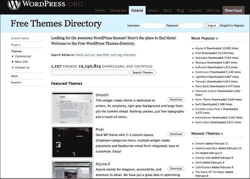

一旦您选择了要使用或处理的主题，您将通过导航到 WordPress 安装管理面板的左侧面板中的**管理 | 外观 | 主题**来激活主题。下一个截图显示了**管理主题**面板：

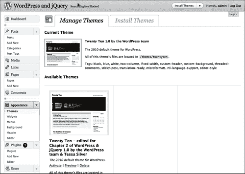

这就是您作为 WordPress 用户需要了解的关于主题的最低要求。在我们深入了解之前，让我们先简要了解一下 WordPress 插件和 jQuery 插件。

## WordPress 插件概览

因此，主题改变了 WordPress 的外观，而不影响其功能。但是，如果您想要更改或添加功能怎么办？WordPress 插件允许对 WordPress 站点进行轻松修改、定制和增强。您可以通过安装和激活 WordPress 插件来添加功能，而不必深入了解 WordPress 的主要文件并更改其核心编程。

WordPress 开发团队非常注意，通过使用 WordPress 提供的访问点和方法来创建插件变得很容易，这些访问点和方法由 WordPress 的**插件 API**（应用程序接口）提供。搜索插件的最佳位置是：[`wordpress.org/extend/plugins/`](http://wordpress.org/extend/plugins/)。以下是 WordPress 插件目录主页的截图：

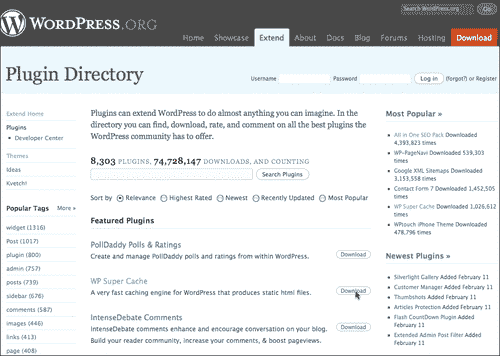

一旦您安装了插件，只需解压文件（通常只需解压缩），然后阅读包含的`readme.txt`文件以获取安装和激活说明。对于大多数 WordPress 插件来说，这只是将文件或目录上传到您的 WordPress 安装的`wp-content/plugins`目录，然后导航到**管理 | 插件 | 已安装**面板来激活它。下一个截图显示了**插件**管理面板，其中包含了默认的**Askimet、Hello Dolly**和新的**WordPress Importer**插件的激活屏幕：

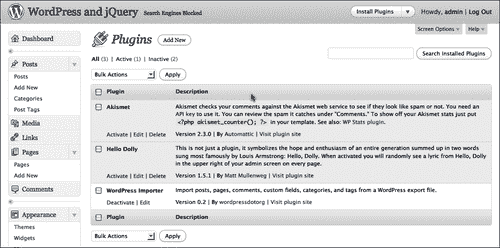

那么 WordPress 插件与 jQuery 插件有什么不同呢？在理论和意图上，差别不大，但在实践中，有相当多的区别。让我们来看看 jQuery 插件。

## jQuery 插件概览

jQuery 有能力让你将你创建的脚本封装到 jQuery 函数对象中。这使得你的 jQuery 代码可以做一些关键的事情。首先，它变得更容易地移植到不同的情况和用途中。其次，你的插件作为一个函数可以集成到较大脚本中作为 jQuery 语句链的一部分。

浏览 jQuery 插件的最佳地点是 jQuery 插件页面（[`plugins.jquery.com/`](http://plugins.jquery.com/)），如下截图所示：

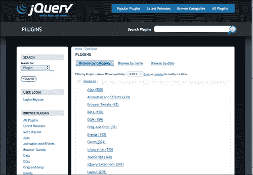

除了已经捆绑了 jQuery 外，WordPress 还捆绑了相当多的 jQuery 插件。WordPress 自带 **Color, Thickbox** 以及 **Form** 还有大多数 **jQuery UI** 插件。这些插件中的每一个都可以通过在主题的 `header.php` 文件或 `function.php` 文件中使用 `wp_enqueue_script` 来启用，就像我们在 第二章 中学到的那样，*在 WordPress 中使用 jQuery*。在本章中，我们将简要学习如何直接在 WordPress 插件中启用一个 jQuery 插件。

当然，你也可以下载 jQuery 插件并将它们手动包含到你的 WordPress 主题或插件中。你可以为那些没有与 WordPress 捆绑在一起的插件这样做，或者如果你需要以某种方式修改插件。

是的，你注意到 WordPress 中没有简单的 jQuery 插件激活面板。这就是了解你选择的主题和 WordPress 插件的地方！很快你会发现，在利用 jQuery 时有很多选择。现在我们已经对 WordPress 主题、插件和 jQuery 插件有了一个概述，让我们学习如何更好地利用它们。

# WordPress 主题的基础知识

到目前为止，你已经明白了 WordPress 主题基本上包含了包裹和样式化你的 WordPress 内容的 HTML 和 CSS。因此，当你将 jQuery 整合到站点中时，通常这是你会开始的地方。大多数情况下，这是一个好的方法。了解更多关于主题如何工作以及编辑它们的最佳实践只会让你的 jQuery 开发变得更加顺畅。让我们来看看主题的结构以及编辑主题的最佳实践。

### 小贴士

**想了解更多关于 WordPress 主题设计的内容吗？**

这个标题专注于你在 WordPress 中使用 jQuery 最需要了解的内容。如果你对 WordPress 主题开发感兴趣，我强烈推荐*April Hodge Silver*和*Hasin Hayer*的**WordPress 2.7 Complete**。除了涵盖管理 WordPress 站点的完整核心能力，第六章*WordPress 和 jQuery 的 UI*还对编辑和创建 WordPress 的标准主题进行了概述。

如果你真的想深入主题设计，我的标题**WordPress 2.8 主题设计**会带你创建一个工作的 HTML 和 CSS 设计模型，并从头开始编码。

## 理解模板的层次结构

我们已经讨论过，WordPress 主题包括许多文件类型，包括模板页面。模板页面有它们的结构或层次结构。这意味着，如果一个模板类型不存在，那么 WordPress 系统将调用下一个级别的模板类型。这使开发人员能够创建非常详细的主题，充分利用了所有可用模板页面类型的层次结构，使设置变得非常简单。一个完全运行的 WordPress 主题只需一个`index.php`文件！

要充分利用主题进行 jQuery 增强（更不用说帮助你解决常见的 WordPress 问题），最好先了解主题的层次结构。

除了这些模板文件，主题当然还包括图像文件、样式表，甚至自定义模板页和 PHP 代码文件。基本上，你可以在你的 WordPress 主题中拥有 14 种不同的默认页面模板，不包括你的`style.css`表或者像`header.php, sidebar.php`和`searchform.php`这样的包含文件。如果你利用 WordPress 对个别自定义页面、类别和标签模板的能力，还可以拥有更多模板页面。

如果你打开我们一直在使用的默认主题的目录，你会看到大部分这些模板文件，以及一个图像目录，`style.css`和`js`目录中的我们在第二章中开始的`custom-jquery.js`文件，*用 jQuery 在 WordPress 中使用*。下面的屏幕截图展示了 WordPress 3.0 的新默认主题**Twenty Ten**中的主要文件：

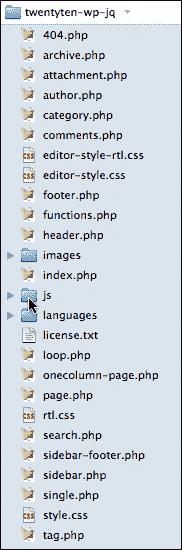

下一个列表包含一般的模板层次结构规则。你可以拥有的最简单的主题必须包含一个`index.php`页面。如果没有其他特定的模板页面存在，那么`index.php`就是默认的。

然后你可以开始扩展你的主题，添加以下页面：

+   当查看类别、标签、日期或作者页面时，`archive.php`优先于`index.php`。

+   当查看主页时，`home.php`优先于`index.php`。

+   当查看单个帖子时，`single.php`优先于`index.php`。

+   当查看搜索结果时，`search.php`优先于`index.php`。

+   当 URI 地址找不到现有内容时，`404.php`优先于`index.php`。

+   当查看静态页面时，`page.php`优先于`index.php`。

    +   选择自定义**模板**页面，例如：`page_about.php`，通过页面的**管理**面板后，将优先于`page.php`，而当查看该特定页面时，将优先于`index.php`。

+   当查看类别时，`category.php`优先于`archive.php`，然后优先于`index.php`。

    +   选择自定义**category-ID**页面，例如：`category-12.php`，将优先于`category.php`。这又优先于`archive.php`，而优先于`index.php`。

+   当查看标签页面时，`tag.php`优先于`archive.php`。这又优先于`index.php`。

    +   选择自定义**tag-tagname**页面，例如：`tag-reviews.php`，将优先于`tag.php`。这将优先于`archive.php`，而优先于`index.php`。

+   当查看作者页面时，`author.php`优先于`archive.php`。这又优先于`index.php`。

+   当查看日期页面时，`date.php`优先于`archive.php`。这将优先于`index.php`。

    ### 注意

    您可以在此处了解有关 WordPress 主题模板层次结构的更多信息：

    [`codex.wordpress.org/Template_Hierarchy`](http://codex.wordpress.org/Template_Hierarchy)。

### 一个全新的主题

如果您想要创建一个新主题，或者像本书的情况一样，如果您将大幅修改一个主题，您将想要创建一个类似于先前解释的层次结构的目录。再次强调，因为它是分层的，您不必创建每个建议的页面，更高级的页面将承担角色，除非您另有决定。正如我所提到的，只有一个`index.php`文件的工作主题是可能的。

我将修改默认主题，但仍希望可以参考原始默认主题。我将复制默认主题的目录并将其重命名为：`twentyten-wp-jq`。WordPress 依赖于主题目录的命名空间。这意味着，每个主题都需要一个唯一命名的文件夹！否则，您将复制另一个主题。下一个截图显示了此目录的创建：

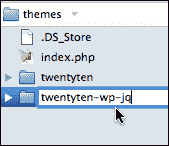

然后我将打开`style.css`文件并修改 CSS 文件开头的信息：

```js
/*
Theme Name: Twenty Ten - edited for Chapter 3 of WordPress & jQuery
WordPress themenew theme, creatingTheme URI: http://wordpress.org/
Description: The 2010 default theme for WordPress.
Author: the WordPress team & Tessa Silver
Version: 1.0
Tags: black, blue, white, two-columns, fixed-width, custom-header, custom-background, threaded-comments, sticky-post, translation-ready, microformats, rtl-language-support, editor-style
*/
...

```

我的“新”主题将出现在管理面板的**管理主题**页面中。您可以拍摄新主题或修改后的主题的新截图。如果没有截图，框架将显示一个灰色框。由于主题的外观将有些变化，我暂时从目录中删除了`screenshot.png`文件，您可以在下一个截图中看到：

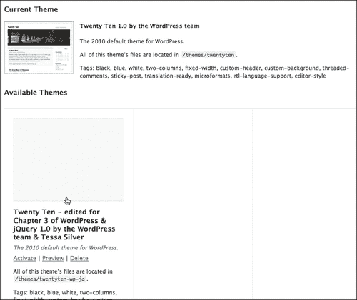

## 循环

在第一章，*入门：WordPress 和 jQuery*和第二章，*在 WordPress 中使用 jQuery*中，我们学到了 jQuery 在包装器中“循环”所选元素有多有用。WordPress 也有自己的一些循环；事实上，它非常重要，以至于被命名为“循环”。 **循环**是您的 WordPress 主题的重要组成部分。它按时间顺序显示您的帖子，并使用包含在 HTML 标记中的各种 WordPress 模板标记定义自定义显示属性。

在 WordPress 中，循环是一个**while 循环**，因此以 PHP 代码开始：`while (have_posts()):`，后跟模板标签`the_post()`。然后，所有标记和额外的模板标签都应用于每个要循环显示的帖子。然后，使用 PHP 的`endwhile`语句结束循环。

每个模板页面视图都可以有自己的循环，以便您可以修改和更改每种类型的帖子排序的外观和布局。每个模板页面本质上只是以不同的方式对您的帖子进行排序。例如，不同的类别或标记模板页面将帖子排序和精炼到满足特定标准。那些排序的帖子可以与主页上的帖子或存档列表中的帖子看起来不同，等等。下一个示例是从 WordPress 2.9.2 的默认 Kubrick 主题中取出的一个非常简单的循环：

```js
...
<?php while (have_posts()) : the_post(); ?>
<div <?php post_class() ?> id="post-<?php the_ID(); ?>">
<h2>
<a href="<?php the_permalink() ?>"
rel="bookmark" title="Permanent Link to
<?php the_title_attribute(); ?>">
<?php the_title(); ?>
</a>
</h2>
<small><?php the_time('F jS, Y') ?>
<!-- by <?php the_author() ?> -->
</small>
<div class="entry">
<?php the_content('Read the rest of this entry &raquo;'); ?>
</div>
<p class="postmetadata">
<?php the_tags('Tags: ', ', ', '<br />'); ?>
Posted in <?php the_category(', ') ?> |
<?php edit_post_link('Edit', '', ' | '); ?>
<?php comments_popup_link('No Comments »',
'1 Comment »', '% Comments »'); ?>
</p>
</div>
<?php endwhile; ?>
...

```

循环被嵌套在一个大的`if/else`语句中，最重要的是检查是否有要排序的帖子。如果没有匹配的帖子要显示，则显示“抱歉”消息，并使用`get_search_form()`包含标签包含`searchform.php`文件。

新的 WordPress 3.0 Twenty Ten 主题将其循环分离到名为`loop.php`的自己的模板页面中，其中包含了相当多的`if/else`语句，以便相同的循环代码可以处理许多不同的情况，而不是为不同的模板页面编写单独的循环。总的来说，新主题中使用的基本模板标签以及条件和包含标签与以前的默认主题中的使用方式相同。现在只有几个新的模板和包含标签可以帮助您简化主题。

让我们仔细看一些这些模板标签、包含标签和条件标签，以及 WordPress 主题中可用的 API 挂钩。

## 标签和挂钩

在循环内，你可能会注意到一些有趣的代码片段被包裹在 PHP 标签中。这些代码不是纯 PHP，大多数是 WordPress 特定的标签和函数，比如**模板标签**，它们只在 WordPress 系统中工作。在循环中最显然重要的模板标签是`the_title()`和`the_content()`。你会注意到大多数标签和函数可以通过它们传递各种参数。你会注意到在前面的代码片段中，`the_content` 标签有一个参数`'Read the rest of this entry &raquo;'`传递给它。如果 `<!--more-->` 标签被放置到帖子中，这串带有右尖括号的文本将出现。

并非所有 WordPress 标签和函数都放在循环内。如果你在 第一章——*入门：WordPress 和 jQuery* 和 第二章——*在 WordPress 中使用 jQuery* 中浏览过`header.php`文件，你可能会注意到诸如`blog_info()`和`body_class()`，当然还有我们在安装中使用的`wp_enqueue_script()`来注册 jQuery。

在需要处理主题模板文件进行开发和增强时，我发现以下模板标签和函数是有用的：

+   `bloginfo()`——此标签可以传递参数来检索关于你的博客的各种信息。在 `header.php` 文件中，你会注意到它最常用于查找你的样式表目录 `bloginfo('stylesheet_directory')` 和样式表 URL `bloginfo('stylesheet_url')`。它还可以显示你的 RSS URL，你的站点正在运行的 WordPress 版本，以及一些其他详细信息。更多详情，请查看：[`codex.wordpress.org/Template_Tags/bloginfo`](http://codex.wordpress.org/Template_Tags/bloginfo)。

+   `wp_title()`——此标签可以在循环外，并显示页面或单个帖子的标题（不是若干帖子的排序列表）。你可以传递一些选项，比如在标题中使用什么文本分隔符，以及分隔符文本是显示在左侧还是右侧。你还可以传递一个布尔值 true 或 false 来显示标题。`wp_title("--",true,"right")`。更多详情，请查看[`codex.wordpress.org/Template_Tags/wp_title`](http://codex.wordpress.org/Template_Tags/wp_title)。

+   `the_title()`——此标签放在循环内。它显示当前文章的标题，你可以传递任何你想将标题包裹在其中的文本字符：`the_title("<h2>", "</h2>")`。更多详情，请查看[`codex.wordpress.org/Template_Tags/the_title`](http://codex.wordpress.org/Template_Tags/the_title)。

+   `the_content()`—这个标签放在循环中，用于显示帖子的内容。如果您不传递任何 `params`，它将在帖子中使用 `<!--more-->` 标签时显示一个通用的**阅读更多**链接。否则，您可以传递您想要的“阅读更多”说明（我甚至发现在这里传递现有的标签也起作用。`the_content("Continue Reading".the_title())`）。有关更多详细信息，请查看 [`codex.wordpress.org/Template_Tags/the_content`](http://codex.wordpress.org/Template_Tags/the_content)。

+   `the_category()`—这个标签也必须放在循环中，它显示分配给帖子的类别的链接或链接。如果有多个类别，您可以传递您选择的文本分隔符。`the_category(", ")`。有关更多详细信息，请查看 [`codex.wordpress.org/Template_Tags/the_category`](http://codex.wordpress.org/Template_Tags/the_category)。

+   `the_author_meta()`—这个标签也必须放在循环中。它有丰富的参数可供传递。你可能最熟悉的是 `the_author_meta("nickname")`，或者 `the_author_meta("first_name")`，或者 `the_author_meta("last_name")`。你还可以获取作者的简介，`the_author_meta("description")`，以及电子邮件和网站的 URL。最好的办法是查看 Codex，了解可以使用这个标签做什么：[`codex.wordpress.org/Template_Tags/the_author_meta`](http://codex.wordpress.org/Template_Tags/the_author_meta)。

    ### 注意

    WordPress 模板标签库非常丰富，您可以在主题中使用这些标签的创造性方式几乎无限。我包括了使模板有用且出色的标签，但请务必查看 Codex：

    [`codex.wordpress.org/Template_Tags`](http://codex.wordpress.org/Template_Tags)。

### 条件标签

条件标签可以在模板文件中使用，根据页面匹配的条件改变显示的内容以及如何显示该内容。例如，您可能希望在一系列帖子上方显示一小段文字，但只在博客的主页上显示。使用 `is_home()` 条件标签，这个任务就变得很容易。

几乎可以为一切内容编写条件标签；在所有条件标签中，以下是我在主题开发中最常需要的几个：

+   `is_page()`

+   `is_home()` 或 `is_front_page()`

+   `is_single()`

+   `is_sticky()`

所有这些函数都可以使用以下参数：帖子 ID 或页面 ID 数字，帖子或页面标题，或帖子或页面别名。尽管主题很棒，但我相信您已经遇到过这样的困境，即您或您的客户不希望每个页面或帖子上都有完全相同的侧边栏。

我使用这些条件标签来确保特定页面可以打开或关闭特定样式或内容 div，并显示或不显示特定内容。这些标签真的有助于使项目站点具有真正的自定义网站感觉。

### 注意

条件标签的乐趣并不止于此。你可能会发现还有许多其他标签在帮助你的主题自定义方面非常有用：

[`codex.wordpress.org/Conditional_Tags`](http://codex.wordpress.org/Conditional_Tags).

### 模板包含标签

在 `index.php` 模板页面和其他模板页面，比如 `single.php` 或 `page.php` 等等，你可能会注意到这些包含标签。它们允许你将标准页面包含到其他模板页面中：

+   `get_header()` 

+   `get_footer()`

+   `get_sidebar()`

+   `comments_template()`

+   自定义包含：`include(TEMPLATEPATH."/file-name.php")`

#### 创建自定义头部、尾部、侧边栏包含

有一段时间了，WordPress 2.7 引入了创建*自定义*头部、尾部和侧边栏模板的能力。你只需创建自定义的头部、尾部或侧边栏，并使用标准的 include 模板标签调用它。确保添加一个文件*前缀*为 `header-`、`footer-` 或 `sidebar-`，以及你自己的文件名。然后，你可以按如下方式调用你的自定义模板文件：

+   `get_header('customHeader')` 将包含 `header-customHeader.php`

+   `get_footer('customFooter')` 将包含 `footer-customFooter.php`

+   `get_sidebar('customSidebar')` 将包含 `sidebar-customSidebar.php`

### 插件钩子

一般来说，除非你是插件开发者，否则你可能没有太多需要研究插件 API 的需求。然而，有一些钩子应该放在主题中，以便插件能够有效地与你的主题配合使用。如果你正在编辑一个主题，请确保不要删除这些钩子标签，或者如果你正在创建一个自定义主题，请确保包含它们：

+   `wp_head:` 放在 `header.php` 模板的 `<head>` 标签内：

    ```js
    <?php wp_head(); ?>

    ```

+   `wp_footer:` 放在 `footer.php` 模板中：

    ```js
    <?php wp_footer(); ?>

    ```

+   `wp_meta:` 你最有可能将这个钩子放在`sidebar.php`模板中。但是，最好在你打算让插件和小部件出现的任何地方添加这个钩子：

    ```js
    <?php wp_meta(); ?>

    ```

+   `comment_form:` 放在 `comments.php` 和 `comments-popup.php` 中，在 `</form>` 结束标签之前：

    ```js
    <?php do_action('comment_form'); ?>

    ```

### 项目：编辑默认主题中的主循环和侧边栏

好了！那看起来可能是关于主题的很多知识！作为一个只是想用 jQuery 增强 WordPress 网站的人，你可能会问：“真的有必要了解这些吗？”即使你对创建自定义主题没有兴趣，但是偶尔在使用 jQuery 时，了解 WordPress 主题的工作原理、主题输出的 HTML 标记以及大多数不同标记和函数的作用，对你会非常有用。

当然，在第二章中，*在 WordPress 中使用 jQuery*，我强烈建议您学习如何精通 jQuery 的选择器，以便能够在不编辑其主题的情况下增强任何 WordPress 网站。虽然您应该对 jQuery 的选择器和过滤器了如指掌，但这并不总是最快或最简单的方式。有时，虽然您可以选择和编辑页面上的任何内容，但 jQuery 的选择过程和语句链显得臃肿；如果某些元素只有特定的 HTML 标签，`class`或`id`属性，那么它或许可以被清理并缩减代码。有很多情况下直接编辑主题将使您能够更快地创建 jQuery 增强功能，并减少代码。更不用说，许多主题都很棒，但通常能够通过简单的主题调整使其更好并更加个性化适合您的网站。现在让我们做这个，并将我们刚刚学到的关于主题的东西付诸实践。

现在，我们使用的新的 Twenty Ten 默认主题很好，但是如果在帖子中日期更加突出，并且侧边栏被清理得更像“官方”链接，而不只是项目列表，会更好。

#### 改变循环

既然我们正在修改主题，我想改变循环显示的内容。我们要假设这是一个客户的网站，我知道客户*最终*会想要关注帖子的作者（在这个“假设”的网站上有很多作者），尽管日期很重要，但它不应该与作者的姓名放在同一行。我相信你肯定见过一些博客在帖子旁边有一个小日历或 iCal 样式的图标。我认为那是显示类似信息的一种视觉上吸引人的方式，而且不会占据太多空间。

使用免费的开源矢量编辑器 Inkscape ([`inkscape.org`](http://inkscape.org))，我制作了一个可以在顶部显示当天日期并在下面显示三个月份缩写的日历背景图标。该图标约为 32 像素正方形。您可以使用您喜欢的任何图形程序，比如 GIMP，Photoshop，Illustrator 等，来创建一个类似的图标，或者您可能在网上找到免版税的图像。

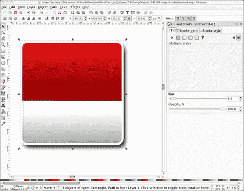

为了让我们的日历背景在日期后面并且格式正确，让我们深入循环。默认主题的循环位于名为 `loop.php` 的模板文件中。如果这是您第一次使用 Twenty Ten 默认主题，那么这个循环可能比您所习惯的要长得多。最终，我们对显示在网站“主页”或默认博客页面上的“正常”或“其他一切”视图感兴趣。您会在代码的第 **127** 行左右找到它，以 `<div class="entry-meta">` 开头。

要开始，注释掉自定义的 PHP 函数 `twentyten_posted_on`（它引用了主题的`function.php`文件中的自定义函数，这有点超出了这个标题的范围），然后在粗体中添加以下 HTML 标记和 PHP 模板标签:

```js
...
<div class="entry-meta">
<?php //twentyten_posted_on();//comment this out ?>
<small class="date">
<?php the_time('d') ?><br/>
<span><?php the_time('M') ?></span>
</small>
</div><!-- .entry-meta -->
...

```

我们要关注的是日期显示。日期以称为`the_time`的模板标签显示，其中的参数设置为显示完整的月份，"如所说"的日期和年份；例如；2010 年 2 月 4 日。

我只想显示日期的数字和月份的三个字母缩写。`the_time`标签的参数实际上不允许我添加 HTML 换行标记，因此我将我的日期分为两个独立的`the_time`标签调用，以便我可以更好地控制 HTML。我还希望确保我的样式仅适用于这个循环，而不适用于其他模板页面循环中包裹的`<small>`日期和内容，因此我一定要为`<small>`标签添加自定义`date`类。我还将年份日期显示包含在一些`<span>`标签中，以便我可以对其进行额外的样式控制。我的日期显示和类最终如下：

```js
...
<small class="date">
<?php the_time('d') ?><br/>
<span><?php the_time('M') ?></span>
<!-- by <?php the_author() ?>-->
</small>
...

```

接下来，我们打开 CSS 的`style.css`样式表，并添加特殊类名的规则到日期显示，并修改标题显示。我只是简单地将我的修改添加到`style.css`样式表的底部。如果碰巧我的样式名称与样式表中已经定义的任何东西相同，我的规则将继承自上一个规则并进行更改（或者明确表示我需要更独特的样式名称）。

首先，我会将主页上的`h2`标题（位于`.post`类中）向上移动 40 个像素，以便为我的日期腾出空间。接下来，我将把我的日期移到`.post`类中，向上移动约 25 个像素，使其与标题并排。在这条规则中，我还为自己在 Inkscape 中创建的`dateBackground.png`分配了背景，并微调日期数字的大小、颜色和其他一些属性。最后，我在 span 标签中设置了月份显示大小和颜色，结果如下：

```js
...
/*----------twentyten chapter 3 customizations------------*/
.home .post .entry-title{
padding-left: 40px;
}
.post small.date{
display:block;
background: url(images/dateBackground.png) no-repeat;
margin-top: -25px;
padding-top: 4px;
width: 32px;
height: 32px;
font-size: 20px;
line-height: 12px;
text-align: center;
color: #eee;
}
.post small.date span{
font-size: 10px;
color: #666;
}
...

```

然后，下一张截图展示了我们帖子的标题和日期的现在的样子：

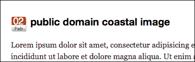

不错！现在，让我们来处理一下侧边栏。

#### 改变侧边栏

侧边栏很容易。Twenty Ten 默认主题中的整个侧边栏都是小部件化的，因此我们想要重新排序的任何内容都可以通过管理面板进行。但是，我们确实想微调一下侧边栏项目的项目符号列表的 CSS。在修改一个不是从头开始创建的主题时，最好总是将新的类添加到标记和样式表中，而不是更改或编辑作者放置的任何原始样式。这样做只会使多种原因下还原更容易。正如你之前可能已经注意到的，我总是将我的新自定义样式添加到`style.css`样式表的底部。

让我们从在编辑器中打开`sidebar.php`开始，只需添加一个新的类名，我们可以用来为加载到任何小部件区域的任何小部件设置样式。无论我在哪里找到`<ul class="xoxo">`标签，我都会在.xoxo 类之后添加一个额外的类，称为.currentsidebar。这在`sidebar.php`文件中大约在第**12**行附近出现了两次，还有一次大约在第**51**行附近。

```js
...
<ul class="xoxo currentsidebar">
...
<ul class="xoxo currentsidebar">
...

```

接下来，我们现在只需打开我们的`style.css`样式表，在其底部再次编写我们的新的.currentsidebar CSS 规则以影响列表项：

```js
...
.currentsidebar li{
padding: 0;
margin: 15px 0 20px 0;
}
.currentsidebar li ul li{
list-style: none;
padding: 5px 0; margin: 0 0 0 -15px; border-bottom: 1px solid #ddd;
font-size: 105%;
}
...

```

哇！正如您在下一个截图中所见，我们的页面和侧边栏导航现在是这样的：

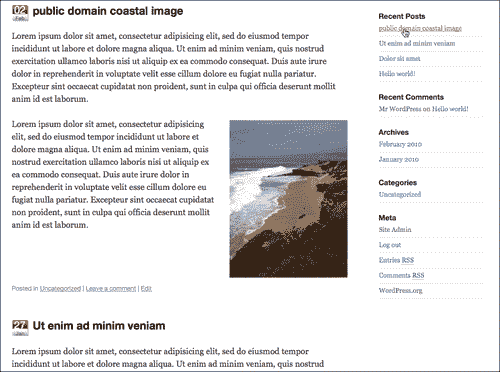

如您所见，对 WordPress 主题进行微调很容易。您不仅可以自定义主题以满足您的外观和功能需求，还可以想象调整主题的 HTML 标记以便更轻松地添加您的 jQuery 增强功能有多容易。接下来，让我们转向 WordPress 插件。

# WordPress 插件的基础知识

现在说实话，撰写 WordPress 插件的细节远远超出了本标题的范围；我的目标是向您展示简单 WordPress 插件的结构以及如何构建插件的基础知识。理解这一点，您可以开始编写自己的基本插件，并且在评估其他人的插件时更有信心，看看它们为您的 WordPress 站点提供了什么样的功能，以及您是否需要为您的 jQuery 增强功能进行任何调整。即使是我们将要进行的简单和基本的工作，您也会看到 WordPress 插件确实有多么强大。

### 提示

**想成为 WordPress 插件之星？**

您可以再次选择**WordPress 2.7 完全手册**，作者是*April Hodge Silver*和*Hasin Hayder*。其中有一章介绍了插件，指导您创建非常有用的简单插件，以及一个更复杂的插件，可以写入 WordPress 数据库。此外，您还可以查看*Vladimir Prelovac*的**WordPress 插件开发入门指南**。不要被标题迷惑，Vladimir 将通过清晰的、逐步的代码讲解，使您按照 WordPress 的编码标准生成功能丰富、动态的 WordPress 插件。

使用插件需要一些 PHP 经验。对于非 PHP 开发人员，我将保持这个解释相当简单，而有 PHP 经验的人应该能够看到如何在 WordPress 中扩展此示例以便于您。总的来说，如果您迄今为止一直在本书中跟随 jQuery 和 WordPress PHP 示例，那么您应该没问题。

与主题一样，WordPress 插件需要一点结构才能开始使用它们。插件文件没有明确定义的层次结构，但你至少需要一个带有特殊注释的 PHP 文件，以便 WordPress 可以在插件管理页面中显示它。虽然有一些单文件插件存在，比如你的 WordPress 安装中自带的 Hello Dolly 插件，但是当你开始开发时，你永远不知道一个插件可能会如何增长。为了安全起见，我喜欢将我的插件组织成一个唯一命名的文件夹。再次强调，与主题一样，WordPress 依赖于插件目录的命名空间，因此唯一性非常重要！

在`wp-content/plugins`目录中，你可以放置一个独特的文件夹，在其中创建一个`.php`文件，并在文件的开头，在`<?php ?>`标签内包含以下头信息。只有粗体信息是绝对必需的。其余信息是可选的，并填充了管理插件页面中的**管理插件**。

```js
<?php
WordPress pluginabout/*
Plugin Name: your WordPress Plugin Name goes here
Plugin URI: http://yoururl.com/plugin-info
Description: Explanation of what it does
Author: Your Name
Version: 1.0
Author URI: http://yoururl.com
*/
//plugin code will go here
?>

```

### 提示

确保你的`<?php`标签前后没有任何**空格**。如果有的话，WordPress 会显示一些错误，因为系统会出现关于页面标题已经被发送的错误。

一旦你在插件目录中设置好了自己的`.php`文件，你就可以在其中添加一个基本的 PHP 函数。然后，你可以决定如何调用该函数，使用一个**动作挂钩**或一个**过滤器挂钩**。例如：

```js
<?php
filter hookusing/*
Plugin Name: your WordPress Plugin Name goes here
Plugin URI: http://yoururl.com/plugin-info
Description: Explanation of what it does
Author: Your Name
Version: 1.0
Author URI: http://yoururl.com
*/
function myPluginFunction(){
//function code will go here
}
add_filter('the_title', 'myPluginFunction');
//or you could:
/*add_action('wp_head', 'myPluginFunction');*/
?>

```

记得在前面的主题部分，我讲解了插件挂钩以及它们在主题中的重要性吗？这就是原因所在。如果你的主题中没有`wp_head`或`wp_footer`，许多插件就无法正常运行，而且你只能使用你自己编写的插件。在我的插件中，我主要使用`wp_header`和`init`动作挂钩。

幸运的是，大多数过滤器挂钩在你的插件中也会起作用，因为 WordPress 会在循环中运行它们。在很大程度上，你将在插件中使用`the_title`和`the_content`过滤器挂钩完成大部分工作。当 WordPress 在循环中循环这些模板标签时，每个过滤器挂钩都会执行你的函数。

### 提示

**想知道有哪些可用的过滤器和动作挂钩吗？**

列表是详尽的。事实上，它是如此之庞大，以至于 WordPress codex 似乎没有将它们全部记录下来！如果你想要查看所有动作和过滤器挂钩的最完整列表，包括 2.9.x 版本中可用的新挂钩，你应该查看亚当·布朗的**WordPress 挂钩数据库：** [`adambrown.info/p/wp_hooks`](http://adambrown.info/p/wp_hooks)

对数据库感到不知所措？当然，查看弗拉基米尔的**WordPress 插件开发：初学者指南**将帮助你入门，并提供一系列动作和过滤器挂钩。

你现在理解了 WordPress 插件的基础知识！让我们开始做点什么吧。

## 项目：编写一个 WordPress 插件以显示作者简介

正如我们所讨论的，插件可以帮助扩展 WordPress 并赋予其新功能。然而，我们已经看到，在大多数情况下，直接向主题添加 jQuery 脚本并在各处编辑其模板页面即可完成任务。但让我们想象一个更复杂的情况，使用我们修改过的默认主题和本章前一个项目中提到的假想客户。

当我们调整默认主题时，我想到这个客户可能希望她网站的重点更加倾向于新闻报道，因此，她希望每篇文章的作者引起一些关注。我是对的，她是这样希望的。然而，有一个问题。她不只是想要显示他们的 WordPress 昵称；她更希望显示他们完整的名字，因为这更加专业。她还想显示他们简要的自传，并附带一个指向他们自己网址的链接，但又不想让这些信息“妨碍”文章本身，也不想让它们丢失在文章底部。这里真正有趣的是；她希望这种变化不仅影响到这个站点，还要覆盖她的一系列特定类型新闻站点的网络，至少有 20 个（天啊，我忘记了她有这么多站点！幸好她只是假设的）。

对于这个特定的 WordPress 站点，很容易进入并注释掉我们之前处理过的自定义函数：添加 `the_author` 标签并显示两次，为每个标签传递一些参数以显示名字的第一个和最后一个字。我还可以添加一个标签来显示用户面板中的作者简介片段和 URL（如果他们填写了该信息）。此外，很容易添加一小段 jQuery 脚本，使得该简介 `div` 在鼠标悬停在作者姓名上时显示出来。然而，将所有这些工作复制并重新复制到其他 20 个不同的站点中，其中许多站点不使用默认主题，大多数站点也没有将 jQuery 包含到他们的主题中，听起来确实是一项不必要的工作（此外，客户提到她正在考虑一些新主题用于一些站点，但她还不知道哪些站点将获得哪些新主题）。

这是一项不必要的工作量。与其修改这个主题，然后在其他 20 个主题中来回测试、粘贴、测试和调整，不如花费这些时间创建一个 WordPress 插件。然后，将其轻松部署到客户的所有站点上，而且每个站点使用的主题都不重要。让我们开始吧！

### 编写插件

首先，浏览客户的站点网络，不多的站点显示作者的昵称或姓名。只有少数几个这样做，而其中的姓名是不引人注意的。有一个插件显示作者的姓名会更容易，然后注释掉或删除一些主题中的 `the_author` 标签。

这里有一个需要注意的小细节：模板标签在插件中表现得不太好。这是因为模板标签，即一个函数，被设置为显示文本，而在另一个函数内，我们实际上不需要这样。我们想要做的是获取信息并将其传递给我们的钩子，当插件函数运行时显示它。大多数模板标签都有可比的 WordPress 函数，它们只会获取信息而不会立即写入或显示它。对于编写插件，我喜欢查看**函数参考**，而不是查看 WordPress Codex 的**模板标签**函数列表。几乎以`get_`开头的任何内容都适用于插件。有关更多详细信息，请参阅[`codex.wordpress.org/Function_Reference`](http://codex.wordpress.org/Function_Reference)。

Codex 函数参考有一个`get_the_author()`，它将满足我在这个项目中的一些需求，但我更喜欢使用在 WordPress 版本 2.8 中出现的一个新函数，称为`get_the_author_meta()`。与`get_the_author`不同，您可以向此函数传递超过 25 个参数，以了解您在 WordPress 用户上关心的几乎任何内容。

接下来给出的是我的插件基本的`addAuthor`函数，然后是我的`add_filter`钩子，它将在每个帖子的内容上运行我的函数。您可以阅读加粗的注释以获取更多详细信息：

```js
...
//add author function
function addAuthor($text) {
/*the $text var picks up content from hook filter*/
//check if author has a url, a first name and last name.
//if not, no "Find out more" link will be displayed
//and just the required nickname will be used.
if (get_the_author_meta('user_url')){
$bioUrl = "<a href='".get_the_author_meta('user_url')."'>
Find Out More</a>";
}
if (get_the_author_meta('first_name')
&& get_the_author_meta('last_name')){
$bioName = get_the_author_meta('first_name').
" ".get_the_author_meta('last_name');
}else{
$bioName = get_the_author_meta('nickname');
}
//check if author has a description, if not
//then, no author bio is displayed.
if (get_the_author_meta('description')){
$bio = "<div class='authorName'>by <strong>".$bioName."</strong>
<div class='authorBio'>"
.get_the_author_meta('description')." ".$bioUrl."
</div>
</div>";
}else{
$bio = "<div class='authorName'>
by <strong>".$bioName."</strong>
</div>";
}
//returns the post content
//and prepends the bio to the top of the content
return $bio.$text;
}//addAuthor
//calls the post content and runs the function on it.
add_filter('the_content', 'addAuthor');
...

```

您会注意到在上一个代码片段中，我特别注意检查 WordPress 用户的个人资料中是否填写了 URL，并且他们是否已添加了他们的名字和姓氏以及简介描述。如果没有，我的插件将仅显示用户的昵称（昵称是必填字段），通常与用户的登录名相同。

如果任何作者没有填写他们的名字和姓氏，或者没有填写简介，我会让我们的客户强制他们更新他们的个人资料。与此同时，插件不会显示任何空白、空的或损坏的内容，因此不会造成任何损害。

现在我只关注将作者的姓名和简介放入 WordPress 中，现在姓名和简介应该已经生成了，我只是想确保简介的样式漂亮，以便与帖子内容区分开来，但又不会太过显眼。

为此，我将在我的插件目录中添加一个名为`authover.css`的样式表，并添加以下样式：

```js
.authorBio {
border-top: 2px solid #666;
border-bottom: 2px solid #999;
background-color: #ccc;
padding: 10px;
font-size: 10px;
}

```

现在，我将 CSS 放在自己的样式表中，而不是作为另一个功能脚本化到插件中的字符串，主要是为了演示使用 Script API 中的`wp_register_style`和`wp_enqueue_style`函数的最佳实践。正如使用`wp_enqueue_scripts`函数帮助我们避免与其他 JavaScript 和 jQuery 库冲突一样，这些函数注册新样式表并加载它，确保不会与其他同名样式表冲突。

对于样式表，我很确定它将是我插件的独特之处，甚至更甚的是，仅仅针对一个单一规则来说，这可能有些小题大作，但你应该了解这种方法，特别是当你查阅更健壮的常用插件时，你可能会遇到它。而且，这会使插件在未来更容易扩展。你不需要在 PHP 字符串中编辑或修改 CSS。事实上，如果你要编写一个样式表足够长的插件，你可以把样式表交给一个 CSS 设计师，而你专注于 PHP 功能。更不用说，这样可以使你的插件对其他用户更有用。一个没有 PHP 经验的 WordPress 用户可以下载并安装这个插件，并轻松编辑其 CSS 样式表，使其在其网站设计中看起来很好。

下面是我的`addCSS`函数。此外，不同于通过过滤挂钩激活样式表，我希望样式表可以在 WordPress 加载之前注册并加载，甚至在`wp_head`挂钩之前！因此，你会看到我使用了`init`动作挂钩。

除了我加粗的评论之外，你还会注意到`WP_PLUGIN_URL`变量的使用。这类似于我在主题部分向你展示的`TEMPLATEPATH`变量，用于创建一个自定义包含，不同的是，这个变量在插件中使用，帮助 WordPress 动态地找到你的插件文件，而不是硬编码它们。

请阅读下一个代码块中加粗的评论，了解每个代码语句的作用：

```js
...
// Some CSS to position for the paragraph
function authorCSS() {
//These variables set the url and directory paths:
$authorStyleUrl =
WP_PLUGIN_URL . '/add_author_bio-tbs/authover.css';
$authorStyleFile =
WP_PLUGIN_DIR . '/add_author_bio-tbs/authover.css';
//if statement checks that file does exist
if ( file_exists($authorStyleFile) ) {
//registers and evokes the stylesheet
wp_register_style('authorStyleSheet', $authorStyleUrl);
wp_enqueue_style( 'authorStyleSheet');
}
}
//evoke the authorCSS function on WordPress initialization
add_action('init', 'authorCSS');

```

好了！应该没问题了。现在我们需要激活我们的插件并在 WordPress 中检查一下。

### 在 WordPress 中激活我们的插件

我们的插件已经在 WordPress 的`wp-content/plugins`目录中。这意味着我们只需要导航到我们的**管理插件**页面并激活它即可。

代码注释头中的`Plugin Name：`空间中名为**jQuery Add Author Biography**的插件显示在插件表中，如下截图所示：

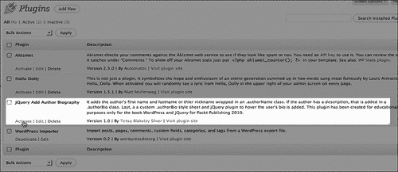

一旦插件被激活，我们可以导航到网站上查看它的运行情况：

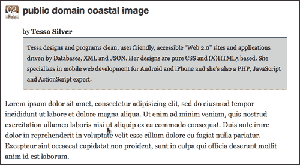

它正在工作！主题中不包含`the_author_meta`标签，现在显示作者的全名和简介描述。简介描述使用了我们插件类中的 CSS 规则来进行样式设置。

你现在已经手动编辑了一个主题，并进一步通过从头开始创建一个 WordPress 插件来扩展了这个网站。干得好！但是你说什么？你希望再做一点 jQuery？你是对的。让我们通过创建一个 jQuery 插件来进一步增强这个网站。

# jQuery 插件的基础

我们会发现，与 WordPress 主题和插件相比，jQuery 插件实际上并不那么复杂。

要设置一个 jQuery 插件，你需要遵循 jQuery 的**插件结构**。基本结构包括如下设置 jQuery 函数来定义你的插件。请注意加粗的`.fn`添加到 jQuery 对象中。这是使你的函数成为 jQuery 函数的关键。

```js
jQuery.fn.yourFunctionName = function() {
//code
};

```

在其中，最好的做法是添加一个`this.each(function(){...})`来确保你的函数会运行每个 jQuery 选择器中的每个项目。

```js
jQuery.fn.yourFunctionName = function() {
return this.each(function(){
//code
});
};

```

与 WordPress 不同，WordPress 在主题 CSS 样式表和插件头部需要特定格式的注释，而 jQuery 不需要注释头部，但在顶部添加一个是很好的习惯。

```js
/*
You can name the plugin
Give some information about it
Share some details about yourself
Maybe offer contact info for support questions
*/
jQuery.fn.yourFunctionName = function() {
return this.each(function(){
//code
});
};

```

注意，你在插件中包装和使用的每个函数和方法都必须以一个";"分号结尾。否则你的代码可能会出错，如果你压缩它，它肯定会出错。

这就是，一个 jQuery 插件所需要的全部。现在，让我们深入了解如何使用 jQuery 插件来增强我们的 WordPress 插件的输出。

## 项目：jQuery 淡入子 div 插件

采用前面讨论过的所需的 jQuery 函数，我将编写一个基本函数，它不仅可以传递给主要的 jQuery 包装选择器，还可以传递一个额外的选择器参数，以便轻松地定位所选择的`div`的子元素，或者传递参数的 jQuery 选择器的特定参数。

再次注意，跟着我的`authorHover`函数里的粗体注释一起看：

```js
...
//sets up the new plugin function: authorHover
jQuery.fn.authorHover = function(applyTo) {
//makes sure each item in the wrapper is run
return this.each(function(){
//if/else to determine if parameter has been passed
//no param, just looks for the child div
if(applyTo){
obj = applyTo
}else{
jQuery pluginchild div pluginobj = "div";
}
//hides the child div or passed selector
jQuery(this).find(obj).hide();
//sets the main wrapper selection with a hover
jQuery(this).css("cursor", "pointer").hover(function(){
//restyles the child div or passed selector
// and fades it in
jQuery(this).find(obj).css("position","absolute")
.css("margin-top","-10px").css("margin-left","-10px")
.css("width","400px")
.css("border", "1px solid #666").fadeIn("slow");
}, function(){
//fades out the child selector
jQuery(this).find(obj).fadeOut("slow");
});
});
};

```

就是这样。现在我们已经创建了一个 jQuery 插件脚本，让我们首先在我们的主题中快速测试一下。我们所需要做的就是将我们的新 jQuery 插件命名为`jquery.authover.js`嵌入到我们的主题中，在`wp_enque_script`调用下面，在`wp_head` hook 下方调用它：

```js
...
<script type="text/javascript">
jQuery(function(){
jQuery(".authorName").authorHover();
});
</script>
...

```

我们可以在我们的网站上查看结果。我截取了两张截图，这样你就可以看到淡入效果。在下面的截图中，你可以看到新的`div`开始淡入：

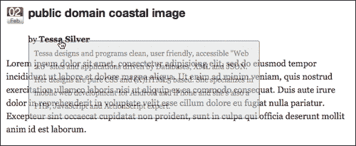

在接下来的截图中，你可以看到完成的淡入动画：

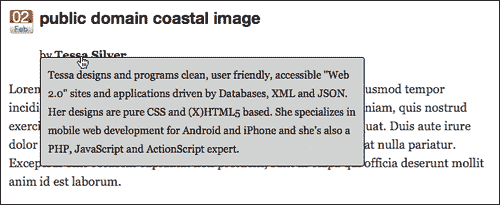

### 额外加分：将你的新 jQuery 插件添加到你的 WordPress 插件中

现在你可以自由地安装你的 WordPress 插件，并在需要时在尽可能多的网站上包含 jQuery 插件！但是，如果你想知道的话，是的，我们可以进一步完善安装过程，只需将此 jQuery 插件合并到我们的 WordPress 插件中即可。

第一步是简单地将我们的`jquery.authover.js`脚本放在我们的插件目录中，然后使用`wp_enqueue_script`来调用它。你需要特别注意`wp_enqueue_script`函数的使用，因为如果主题或插件中还没有注册 jQuery 1.4.2，它将会自动包含 jQuery 1.4.2！这意味着客户的网站，如果还没有包含 jQuery，也不用担心！只需安装此插件即可自动包含它！

```js
...
function addjQuery() {
wp_enqueue_script('authover',
WP_PLUGIN_URL . '/add_author_bio-tbs/jquery.authover.js',
array('jquery'), '1.4.2' );
}
...

```

然后，我们将在 WordPress 插件中添加一个函数，该函数会写入使用插件的`authorHover`函数的 jQuery 脚本。通常情况下，最好并且推荐通过`wp_enque_script`函数加载所有脚本，但对于非常小的、定制化程度极高的脚本，你确信不会出现冲突，并且你知道 jQuery 已经正确加载（就像我们使用插件一样），如果你愿意，你可以像这样硬编码脚本标签：

```js
...
function addAuthorHover(){
echo '<script type="text/javascript">
jQuery(function(){
jQuery(".authorName").authorHover();
});
</script>';
}
...

```

最后，我们添加激活这些功能的动作过滤器：

```js
...
add_action('init', 'addjQuery');
add_action('wp_head', 'addAuthorHover');
?>

```

现在，如果你从主题中移除你的 jQuery 插件，并确保你的插件已被激活，你应该看到与之前完全相同的结果！在下一个截图中，你会注意到我已经添加了一个 URL 到我的个人资料中，现在**了解更多**功能设置得非常好，如果没有 URL 存在，它会自动降级。太棒了。

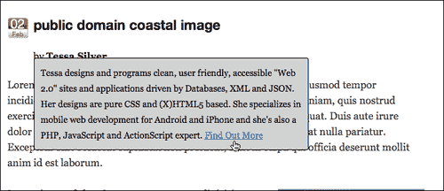

# 综合起来：编辑主题还是创建自定义插件？

在本章中，我们学习了编辑主题、创建 WordPress 插件和 jQuery 插件的简易方法。对于大部分 WordPress 开发工作，直接将 jQuery 增强功能添加到主题中就可以了。如果你觉得你的 jQuery 脚本有点复杂，并且你被允许编辑主题（当然，假设你不会破坏布局或大幅改变外观），你可能会发现在 WordPress 内容中包裹自定义 HTML 标签，带有特殊的`class`或`id`属性是一个巨大的帮助和时间节省。

本章项目示例中的“假设客户请求”还表明，如果你的工作有可能或将被重复使用或部署到多个单独的 WordPress 安装中，你应该考虑将工作封装在 jQuery 插件、WordPress 插件中，或者我们发现的两者都要考虑。

除了考虑你的工作是否需要被重复使用或部署之外，你可能还想考虑 jQuery 增强和 WordPress 主题的寿命。很容易认为 jQuery 增强实际上更多是主题的一部分，因为它在视觉上影响主题，但真的是这样吗？我发现，我更多的 WordPress 和 jQuery 开发工作似乎集中在将 jQuery 开发封装到 WordPress 插件中，或者使 WordPress 插件更有效地使用 jQuery。

由于将 jQuery 包含到 WordPress 站点中只有两种方法，通过主题或插件，如果你对编辑和创建插件感到舒适，你可能会发现这是更好的方法（当然，总是有例外的）。使用 jQuery 增强 WordPress 插件，甚至将 jQuery 插件封装在 WordPress 插件中，都将使您能够轻松地独立扩展主题设计和任何 jQuery 功能/增强。

这种方法非常方便，如果你喜欢经常重新设计或更新主题，或者你有一个有点“主题换来换去”的客户。如果你想保留酷炫的 jQuery 增强表单、图像和画廊灯箱以及各种其他功能，甚至只是你为网站创建的“整洁眼睛糖果”，而不必一次又一次地手动更新一个新主题，创建一个插件是一个不错的选择，不管是为了 jQuery、WordPress 还是两者兼有。

最终，这取决于你和你的舒适度，以及对项目最有利的做法，但我发现，除了一些例外，我们将在后面的章节中提到的例子，尝试让大多数 jQuery 增强功能不要嵌入 WordPress 主题中对我来说效果很好。

# 摘要

现在你应该理解以下内容：

+   WordPress 主题、WordPress 插件和 jQuery 插件是什么。

+   如何编辑主题并创建自己的基本 WordPress 和 jQuery 插件。

+   了解何时编辑和自定义主题，或者制作 WordPress 插件、jQuery 插件或三者兼有的最佳实践！

掌握了这些信息，我们将继续进行下一章，在那里我们将看看如何使用一个 jQuery 插件与一个即插即用的 WordPress 插件。我们还将讨论如何通过 jQuery 增强和扩展 WordPress 插件的功能。准备好用灯箱模态窗口迷住用户，并用易于使用的表单给用户带来惊喜。
