# 第四章：用更少的东西做更多的事情：利用 jQuery 和 WordPress 的插件

在这一点上，你已经足够了解 jQuery 和 WordPress 基础知识，以及将它们整合在一起的不同方法，你可以开始在解决方案中真正发挥创造力。在本章和接下来的三章中，我们将卷起袖子，为一些经常请求的项目制定解决方案，并开始让 jQuery 在我们的 WordPress 网站中执行一些有用且很酷的工作。

我们将把 WordPress 和 jQuery 的所有可用组件结合起来。在本章中，我们将：

+   使用非常强大和受欢迎的 jQuery 插件 ColorBox，由*Jack Moore* 的 Color Powered 提供。

+   我们还将使用由*Oliver Seidel* 的 Deliciousdays 提供的强大且受欢迎的 WordPress 插件 cforms II。

+   然后，我们将自定义我们的默认主题，使其与 cforms II 和 ColorBox 无缝配合，为我们的网站提供无缝的活动注册体验。

+   我们还没有完成！然后，我们将通过 jQuery 来增强 cform II 已经很棒的验证，以获得流畅的用户体验。

准备好让你的 WordPress 网站发挥作用！

# 项目概述：无缝活动注册

虽然我们将继续使用默认主题，但我们将为这一章的 jQuery 增强设想一个不同的假想客户和情景。

在这种情况下，“客户”是一个非营利性/意识组织。他们在他们的 WordPress 网站中创建了一个**活动**类别，每当计划举办新活动时，每个活动的协调员都可以将有关即将举办活动的信息发布到活动类别。

他们大多数的活动都是免费的，但非常混乱，因为每个协调员决定如何接受活动的注册，通过电子邮件或电话。人们感到困惑，向网站上的错误人发送电子邮件，然后无法确定谁参加了哪些活动，以便组织的领导者可以从忙碌的活动协调员那里收集统计数据，以跟踪活动对其事业的有效性。

好消息是，我们仍然可以帮助他们解决所有这些问题。

## “客户”想要什么

在坐下来讨论所有选项之后，最终，他们希望有一个简单的注册表单，可以将活动名称传递给它，然后通过电子邮件发送给活动管理员，后者将 RSVP 分配给各个活动组织者。

他们还收到了注册者的反馈，抱怨活动的发布日期使他们困惑：他们不注册活动，因为除非协调员将日期加粗或将其放在标题中，否则看起来就像活动是在那一天发生的，或者已经过去了。因此，客户希望重新设计并清理一下他们的活动发布模板，以便更容易识别它们为活动，而不是网站上的其他帖子。

最后，也是最重要的是，他们对最近在几个网站上看到的反馈和其他形式印象深刻并受到影响，他们真的很希望他们的注册表单在模态框中打开，这样人们就可以在停留在**活动**页面的同时注册活动。当他们完成活动注册后，他们可以继续浏览**活动**类别并轻松注册更多活动。

# 第一部分：准备好所有设置

幸运的是，有了一点 WordPress 和 jQuery 知识，这个任务并不像听起来那么复杂。在上一章中，我赞美了将设计和功能分开以及将您的 jQuery 增强功能包装在 WordPress 插件中的优点。我还提到了总有例外的事实。好吧，这里有一个场景，我们倾向于直接将我们的增强功能应用于主题的几个原因：

+   我们将调整主题以创建一个用于活动的自定义类别页面。

+   而且，我们还需要为可以加载到模态框中的表单创建一个自定义页面模板，而不需要重新加载站点的页眉和页脚

因为这些请求要求客户端明白，如果他们想要更新或替换他们的主题，他们就需要小心，我们可能会充分利用 WordPress 主题 API 为这一增强功能提供的全部功能。

## 我们需要什么

让我们从增强的主要部分开始：我们需要一个具有电子邮件功能的表单和一个加载它的模态框。其余的我们将通过几个自定义的 jQuery 脚本和对 WordPress 主题的自定义来完成。

### ColorBox

对于模态框，有几个很好的 jQuery 插件。你可能听说过很好的 ThickBox，但我个人更喜欢 ColorBox，因为有几个使用和美观的原因。

你可以从这里下载 jQuery ColorBox 插件：[`www.colorpowered.com/colorbox/`](http://www.colorpowered.com/colorbox/)。

### 注意

**为什么选择 ColorBox 而不是 ThickBox？**

ThickBox 插件与 WordPress 捆绑在一起，我是 ThickBox 的忠实粉丝，但我也更喜欢 jQuery LightBox 的简洁性（jQuery LightBox 仅适用于图像）。当我发现 ColorBox 时，我感到非常惊讶，有几个原因：

+   ThickBox 和 ColorBox 插件都提供了不仅仅是图像的模态窗口。

+   你可以调用内联元素、外部文件和 iFrame，以及基本的 AJAX 调用。一点问题都没有。

然而，与 ThickBox 相比，ColorBox 有一些优势。对于 ColorBox，*Jack Moore* 确实花了一些时间和精力设计了五种非常漂亮的模态窗口样式，以及一套不错的回调和扩展函数供更高级的开发者使用。其次，模态窗口组件（透明背景、关闭、**下一步**和**上一步**按钮）的所有图像加载都完全在样式表中处理，因此设计师很容易自定义模态窗口的样式。有几次，我不得不手动编辑 `thickbox js` 文件，以便让图像正确加载，如果它们不是相对于插件 js 文件的方式，那是 ThickBox 的意图，或者如果我需要添加新图像。

最后，ThickBox 依赖于您手动向要从中启动模态窗口的元素添加 `.thickbox` 类属性。虽然这种方法对于有幸手工编码所有内容的 Web 开发者来说效果很好，但对于在 WordPress 等发布平台内实现的 less 技术性用户来说是一种痛苦。必须指导（和劝说）客户将他们的管理面板编辑器设置为**HTML**并自定义添加 `class` 属性到他们的标记中，这简直是一种痛苦。对于 ColorBox 来说，这一切都是不必要的。它可以轻松通过 jQuery 选择器进行控制，因此主题或插件开发者可以根据 WordPress 的 HTML 输出进行选择，从而使内容编辑者只需专注于他们的内容而不需要任何 HTML 理解。

### Cforms II

要创建注册表单，我们有许多 WordPress 插件可供选择，但我发现最好的是 **cforms II**。Cforms II 在一开始就声明：“诚然，cforms 不是最容易的表单邮件插件，但它可能是最灵活的。” 他们是对的。并且在使用一次后，你会发现它比你想象的要简单得多。

您可以从这里下载 WordPress 的 cformsII 插件：[`www.deliciousdays.com/cforms-plugin/`](http://www.deliciousdays.com/cforms-plugin/)。

### 安装 WordPress 插件

下载 cforms II 插件后，请按照开发者提供的说明进行安装和激活。

本质上，这意味着解压包，将 `cforms` 目录放置在您的 WordPress 安装的 `wp-content/plugins` 目录中，然后导航到管理员的 **管理插件** 页面。然后您将为插件选择 **激活**。

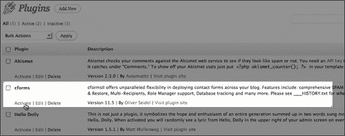

安装并激活插件后，让我们开始使用它。

### 使用 cforms II 设置注册表单

cforms II 插件为不那么技术性的 WordPress 管理员提供了许多强大的表单构建功能。作为一个更技术性的 WordPress 开发者，它可以帮你节省大量时间。cforms 管理界面确实需要一些时间来适应，但它是我在 WordPress 中使用过的最强大和灵活的表单插件。

CformsII 是一个复杂的插件，需要大量的管理空间和多个屏幕页面。因此，一旦你激活了该插件，你会发现在左侧管理区域有一个全新的面板可用。

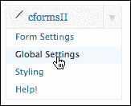

出厂设置中，cformsII 允许使用 AJAX，在不重新加载页面的情况下提交和更新表单。它还允许非常轻松地创建所有基本类型的表单元素：`input、select、check`和`radio`框以及`textarea`框。你可以用`legend`文本标签包装自定义的`fieldset`标签，方便对相关表单元素进行分组。

内置了强大的服务器端验证。很容易将字段指定为必填项并检查有效的电子邮件地址。除此之外，你还可以轻松地为自定义验证分配自己的自定义正则表达式。cforms **帮助！**面板甚至为你提供了可以使用的有用的正则表达式示例。

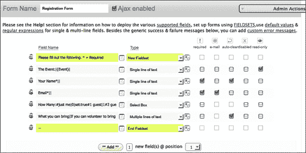

### 小贴士

**安全地设置 cforms II**

你会想要查阅 cforms 文档，并且如果可能的话，与网站管理员或托管提供商的技术支持进行交谈。你需要仔细查看**全局设置**面板，并确保你的 cforms II 安装对你的表单需求尽可能安全。

如果可能的话，尽量使用验证码字段来减少垃圾邮件，并在不需要时关闭文件上传功能。

#### 平衡：表单应该简短易懂，同时检索到有用的信息。

表单的目标是在尽可能从用户那里获取尽可能多的信息的同时，不让他们感觉到你在要求过多的个人信息，或者至少不让他们因为填写过多字段而感到无聊。

我把这个注册表单保持得非常简短和简洁。首先，我填写了表单名称，并将其设置为**启用 Ajax**。这将对我们有所帮助，因为页面将在模态框中加载，所以当它刷新时，它不会弹出到一个新页面，在模态窗口之外。

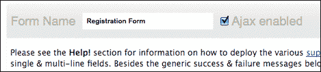

接下来，使用已提供的默认表单集，让我们设置一个带有`legend`文本和事件协调员需要了解的五个表单输入的`fieldset`。

首先是事件，即事件名称将通过邮政传递，而不是由用户填写，但我想显示它，并且需要将其放在表单元素中以便发送给管理员。

在事件字段之后，我们需要询问用户的姓名。由于没有交换金钱，而且这个表单更多是为了统计人数，所以我将其保留为单个字段。这是一个必填字段，但我允许用户随意或正式填写。

接下来，我们将要求输入电子邮件地址。这是必填项，我选择了使用右侧的复选框进行服务器端验证。如果用户表示他们可以为活动带来一些东西，活动协调员可能希望回复他们并与他们保持联系。此外，可能需要向注册者广播有关活动的更新，因此有效的电子邮件至关重要。

现在，让我们设置一个下拉框，询问注册者可以带多少位客人参加活动。

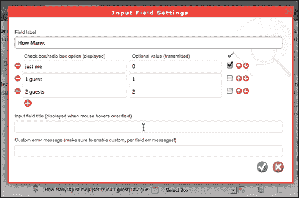

最后，消息区域是一个文本区域，其中包含一些文本，建议注册者提供一些东西，并且如果他们可以的话，在消息区域中说明他们可以提供什么。

好了。所以这是我们的表单。为了查看它，现在需要将它放在 WordPress 页面或帖子中。我们将把它放在自己的页面中，这意味着我们应该在 WordPress 中创建该页面。

### 使用 WordPress 3.0 的自定义菜单选项创建注册页面

如果您查看管理面板左侧的页面列，您现在会发现 pageMash 插件是选项之一。

我们只需从 **页面** 下的左侧菜单中选择 **添加新**，并创建一个名为 **注册** 的页面。我们将内容区域留空，但是您现在会注意到，在 **编辑** 视图中，编辑面板中有一个 **cforms** 按钮用于页面/帖子。

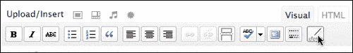

单击该按钮将允许您选择要放置在页面上的表单（您可以在 cforms II 中创建多个表单，甚至在单个帖子或页面中放置多个表单，但这对我们来说太过了）。选择表单后，您应该会看到一个用于占位符的空间。

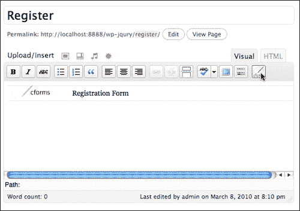

您现在应该在站点上的 **注册** 页面中看到您的表单，如下截图所示：

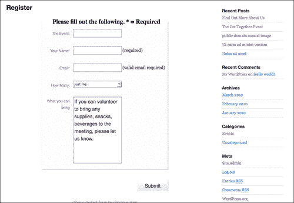

## 使用 WordPress 3.0 的自定义菜单选项

然而，我们不希望 **注册** 页面出现在我们的页面导航中，并且我们需要它在自己的模板页面中，以便更好地加载到我们的模态框中，而不带有主题的页眉和页脚图形和样式。我们需要修改我们的模板，但首先，让我们在 WordPress 3.0 中创建一个自定义菜单，该菜单将覆盖 **页面** 菜单，然后我们可以轻松指定应显示哪些页面，以便注册页面不会出现在我们站点的导航中。

首先，您需要在管理面板中导航至**外观 | 菜单**。一旦进入，您可以点击 +（加号）选项卡创建一个新菜单，然后从右侧选择要添加到菜单的选项。然后，您可以在右上面板中设置菜单为您的“主要导航”，这将覆盖 Twenty Ten 默认主题页眉中的标准页面导航。以下屏幕截图说明了设置新的主导航并将其分配为站点主导航的三个主要步骤：

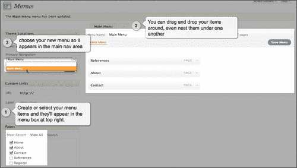

您还可以将**事件**类别包括在菜单中，如下面的屏幕截图所示（稍后我们将需要访问此页面）：

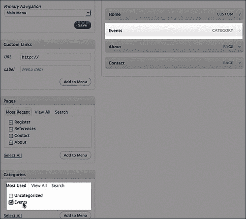

好了！现在我们有一个“隐藏”的页面，保存着我们的注册表单。让我们开始进行主题自定义。

## 自定义主题

再次，我们需要以两种方式自定义主题：首先，我们需要一个自定义页面模板来容纳我们的注册表单，该表单将加载到模态框中；其次，我们需要创建一个自定义分类模板并修改它，以便仅显示分配给**事件**类别的帖子，并在其中启动包含注册表单的模态框。

### 创建自定义页面模板

首先，我们需要创建一个新的页面模板，以便将我们的注册页面分配给它。我们将从创建**page.php**模板的副本开始，并将其重命名为**registration-page.php**。


此表单的整个目的是加载 ColorBox 模态窗口，因此使用我们主题的页眉和页脚样式会有些分散注意力。我们将从此模板页面中简单地删除`get_header()`和`get_footer()` WordPress 模板标记命令。

接下来，虽然我们不需要页眉和页脚样式，但我们需要页面成为一个格式正确的 HTML 页面，可以加载 jQuery。我们将手动添加一个 doctype，并从`header.php`文件中借用一些 WordPress 页眉代码，从一个`body`标记到这个模板的循环的开头，如下所示：

```js
<!DOCTYPE html PUBLIC "-//W3C//DTD XHTML 1.0 Transitional//EN" "http://www.w3.org/TR/xhtml1/DTD/xhtml1-transitional.dtd">
<html  <?php language_attributes(); ?>>
<head profile="http://gmpg.org/xfn/11">
<meta http-equiv="Content-Type" content="<?php bloginfo('html_type'); ?>; charset=<?php bloginfo('charset'); ?>" />
<title><?php wp_title('&laquo;', true, 'right'); ?> <?php bloginfo('name'); ?></title>
<link rel="stylesheet" href="<?php bloginfo('stylesheet_url'); ?>" type="text/css" media="screen" />
<link rel="pingback" href="<?php bloginfo('pingback_url'); ?>" />
<?php wp_enqueue_script("jquery"); ?>
<?php wp_head(); ?>
<style type="text/css">
<!--
.cform fieldset{
border:1px solid #036;
}
.success{
font-size: 140%;
font-weight: bold;
}
-->
</style>
</head>
<body>
...

```

您会注意到，与`header.php`文件的`head`标签代码相比，我们简化了它很多。我们不需要担心此页面上的注释或侧边栏，因此这些 PHP WordPress 代码块已被删除。我们确实需要加载 jQuery，我还额外添加了一些手动样式，以美化我们的表单。

然后，我们将在此模板页面的循环正下方添加这个新的页脚标记；即在模板页面的循环的下方添加关闭的`body`和 HTML 标记：

```js
...
<?php wp_footer(); ?>
</body>
</html>

```

### 提示

**在自定义模板页面时不要忘记插件挂钩**

注意，我确保`wp_head()`和`wp_footer()`手动放置在我们的注册模板页面中。许多插件需要这些钩子在主题中才能正常工作。如果你正在创建自定义页面，请确保它们包含在页眉或页脚中，或者如果主题的`header.php`和`footer.php`文件不会被包含，则手动放置它们，就像这个模板页面一样。

最后，为了使这个新页面被识别为 WordPress 的特殊模板，我们必须在文档的最顶部添加一个**模板头部**，以 PHP 的注释形式添加，如下所示：

```js
<?php
/*
Template Name: Register Form
*/
?>
...

```

### 注意

与我们在第三章中的插件一样，*深入挖掘：理解 WordPress 和 jQuery*，请确保在`<?php`标记之前没有空格或硬回车。否则，你可能会收到已发送头文件的错误信息。

现在，如果我们回到管理面板中的**注册**页面，在右侧，我们将看到我们的新页面模板可以分配给该页面。

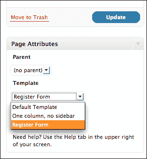

我们现在可以看到，如果我们使用浏览器的地址栏导航到我们**注册**页面的 URL，它会加载而没有任何其他 WordPress 样式，并且已经准备好加载到我们的 ColorBox 模态窗口中。

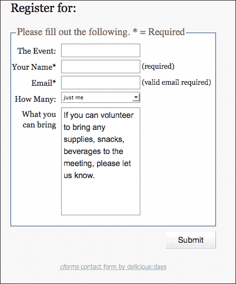

这是我们解决方案的第一半。现在让我们完成它。

### 创建自定义分类模板

现在我们需要为**活动**类别创建一个特殊的分类模板。同样，我们希望每个事件都有一个注册链接。该链接将事件的标题传递给注册表单。

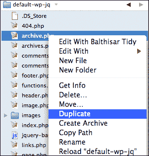

要开始这个过程，如果你还记得第三章中的模板层次结构，*深入挖掘：理解 WordPress 和 jQuery*，`category.php`模板页面优先于`archive.php`模板页面。事实证明，我们正在使用的默认模板没有`category.php`页面。我们只需通过复制`archive.php`页面并将其命名为`category.php`来创建一个。

但等等；我们不只是想让这个页面显示*任何*类别。我们只想显示**活动**类别。你还会记得在第三章中，*深入挖掘：理解 WordPress 和 jQuery*，你可以通过特定的`category-ID.php`模板页面进一步取代`category.php`模板，例如**category-3.php**。

在我的本地 WordPress 设置中，事件类别的 ID 恰好是 3，所以我们将文件命名为这个。

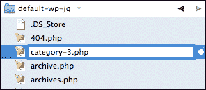

### 注意

**查找你的分类 ID**

在您自己的 WordPress 安装中工作的人，类别 ID 号是在创建类别时分配的。首先，您需要确定您的**Events**类别的 ID 号是多少。您可以通过在管理面板中导航到**Posts | Categories**页面，然后在**Events**类别下选择**编辑**来执行此操作。然后您可以检查该类别**编辑**页面中的 URL。在 URL 的最后，您将看到该类别的 ID 号。

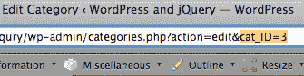

现在我们准备好自定义 **Events** 页面的`category-3.php`模板了。

首先，正如我们在上一章节中看到的，这个页面调用了`get_template_part( 'loop', 'category' )`函数，来自`loop.php`模板页面。我们实际上只想要一个自定义、非常简单的设置，仅限于**Events**类别。虽然我们确实可以更新`loop.php`中的`if...else`语句，添加一个额外的自定义循环（这略微超出了本书的范围，敬请期待 Packt 出版社即将推出的 **WordPress 3.0 主题设计** 书籍！），但对于这个自定义客户项目，我们只需注释掉对该循环的调用，并添加我们自己非常简单的循环，多亏了模板层次结构，这个循环只会在我们的**Events**类别页面上起作用。

```js
<?php
//start the loop:
while (have_posts()) : the_post(); ?>
<div <?php post_class() ?>>
<h2 id="post-<?php the_ID(); ?>" class="entry-title">
<a href="<?php the_permalink() ?>" rel="bookmark"
title="Permanent Link to
<?php the_title_attribute(); ?>">
<?php the_title(); //adds the title ?></a></h2>
<div class="entry">
<?php
//add the content
the_content() ?>
</div>
<?php //add the registration button ?>
<p><a class="register"
href="/wp-jqury/register/?evnt=<?php the_title(); ?>">
Register</a>
</p>
<div class="register-separate"></div>
</div>
<?php endwhile; ?>

```

### 注意

如果您还没有这样做，您可能想要停用我们在上一章节中构建的 **添加作者简介** 插件。这对这个项目不是必需的，虽然激活它不会有什么坏处（它将只是坐在那里，在活动的帖子中）。

注意在底部的循环中，我们制作了一个引用注册表单的`link`标签。我修改了一个名为`evnt`的 **变量字符串** 到该链接，并使用`get_title()`模板标签添加了事件的标题，如下所示：

```js
...
<p><a class="register"
href="/wp-jqury/register/?evnt=<?php the_title(); ?>">
Register</a>
</p>
<div class="register-separate"></div>
...

```

现在我们将回到模板页面的顶部，确保标题的设置是合理的。顶部有一堆`if...else`语句，检查返回的内容是否来自存档、类别或标签（请记住，这个页面是从默认模板的`archive.php`页面复制的）。由于这个模板页面现在只会加载事件帖子，所以我们实际上不需要所有那些 PHP，但也没什么坏处。主要是，我们将想要添加一个带有以下标记和代码的主标题：

```js
...
<h1 class="pagetitle"> Upcoming Events <?php single_cat_title(); ?></h1>
...

```

这将在页面上给我们一个名为**即将举行的活动**的标题（或者实际上您给自己的**Events**类别命名的任何名称，即，Shows、Parties 等等——您可以自己命名。那个 `single_cat_title()` 模板标签会为您提取它）。

在主题的`style.css`样式表的最底部，我们将添加以下规则来为我们的注册链接设置样式，并将其浮动到右侧：

```js
...
.register {
display:block;
background-color: #ccc;
border: 1px solid #069;
width: 100px;
padding: 10px;
text-align: center;
}
p a.register{
float: right;
}
.register-separate{
clear:both;
padding-top: 10px;
border-bottom:1px solid #999;
}

```

现在当我们查看一个事件帖子时，我们会看到我们的事件帖子底部有一个动态链接到**注册**的链接：

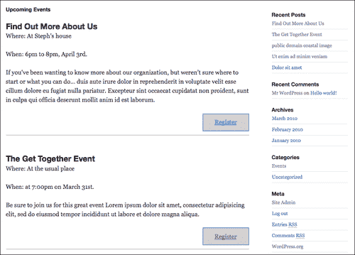

## 将 jQuery 纳入规划

好了！我不知道你怎么想，但我觉得这是相当多的准备工作。当我们加载 ColorBox 插件并编写最后几个自定义 jQuery 脚本时，一切都会结合在一起。

### 包括 ColorBox 插件

在我们的主题中，让我们创建一个 `js` 目录，在该目录中，让我们创建一个名为 **colorbox** 的附加目录。这将允许我们放置 ColorBox 插件的 CSS 表和图像资产，并保持一切整洁和按照它喜欢在 **colorbox.css** 表中工作的方式进行。

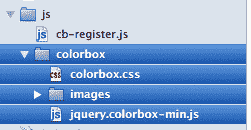

我们将解压缩我们的 ColorBox 插件，并将缩小版移到我们的 `js/colorbox` 目录中。然后，我们将从 `example1` 文件夹中获取样式表和资产（我最喜欢它，有条纹的，透明的背景和圆角非常棒），并将它们放入 **colorbox** 目录中。然后，我们将转到我们主题的 `header.php` 文件，并像下面所示，在主题的主样式表下方包括 **colorbox.css** 样式表：

```js
...
<link rel="stylesheet" type="text/css" media="all"
href="<?php bloginfo( 'stylesheet_url' ); ?>" />
<link rel="stylesheet" href="<?php bloginfo('stylesheet_directory'); ?>/js/colorbox/colorbox.css" type="text/css" media="screen" />
...

```

然后，在 `wp_head` 函数的上方，我们将按照前几章学到的方法添加我们的主要 jQuery 包括以及 ColorBox 插件，利用脚本 API 如下所示：

```js
...
wp_enqueue_script( 'jquery' );
wp_enqueue_script('colorbox', get_bloginfo('stylesheet_directory') . '/js/colorbox/jquery.colorbox-min.js', array('jquery'), '20100516' );
...

```

### 编写自定义 jQuery 脚本

现在，在我们的 `js` 目录的根目录中，让我们创建一个新的 `custom-jquery.js` 文件，并确保在我们的 `header.php` 文件中包含它，在我们的 ColorBox 包含项 *下方*，如下所示：

```js
...
wp_enqueue_script('custom-jquery', get_bloginfo('stylesheet_directory') . '/js/custom-jquery.js', array('jquery'), '20100510' );
...

```

现在准备一些 jQuery 的乐趣。由于我们辛苦地手动将 ColorBox 插件包含到我们的 WordPress 主题中，我们也可以确保它能够加载图像，以及我们的注册表单。

为了确保 ColorBox 只加载图片，而不是页面上的每个链接，我们会想到一些在第二章中的示例，*在 WordPress 中使用 jQuery*，并进行一些创造性的选择。我们将把这个规则添加到我们的 `custom-jquery.js` 文件中：

```js
jQuery(function(){
jQuery(".entry-content a:has(img)").colorbox({height:"98%"});
});//end docReady

```

此选择仅适用于帖子中位于 `.entry` 类中的标签链接，其中 *有* 缩略图 `img` 标签。没有其他链接会触发 ColorBox。

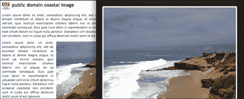

现在，为了让注册页面启动 ColorBox，我们要聪明一点。虽然我已经添加了一个 `.registration` 类，但我不想依赖它来启动 ColorBox。唯一应该触发模态窗口的链接是指向注册表单的链接，所以我一定要为此选择。在我的 `cb-registration.js` 文件中，在我的文档就绪函数内以及在我的图片选择 `colorbox` 函数之后，我将添加此脚本：

```js
...
jQuery("a[href*='register']")
.colorbox({iframe:true, width:"500px", height: "600px"});
...

```

那个特定的 jQuery 选择器将确保只有包含（这就是星号 `*` 的作用）`href` 属性中包含 `register` 一词的链接才会触发 ColorBox 模态窗口，在 ColorBox 的 iframe 模式下。

你会注意到我还使用了 ColorBox 提供的参数来为注册表单的模态框设置约束的高度和宽度。

现在，只有我们的注册链接和带缩略图的图片链接启动 ColorBox：

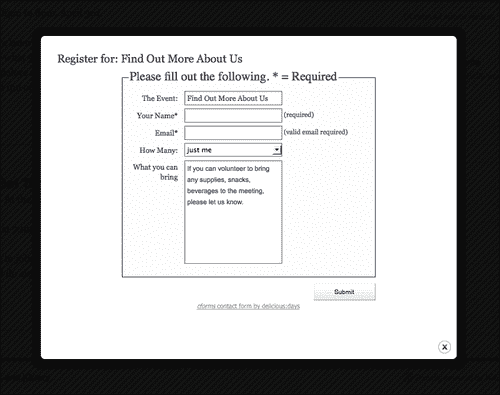

## 总结：需要一个微小的 cforms II hack

你还记得我们设置了我们的注册链接通过**GET 调用**（有时称为**变量字符串**）将事件的名称以 URL 方式传递到注册表单。

目前，cforms 管理面板无法捕获该变量，但对于 cforms 来说，有一个快速且相当常用的"hack"可以确保您可以向表单传递自定义变量。

cforms II 为它可以捕捉的变量创建了有小括号括起来的模板名称，比如添加变量模板：`{Title}`将显示表单所在的帖子或页面标题。我们希望传递一个来自另一页的文章标题（而不是手动将此表单添加到每个事件帖子），因此我们将向 cformsII 插件添加我们自己的变量模板。

### 提示

**定制插件？记笔记！**

WordPress 和 jQuery 开发者通常会不断更新和改进他们的插件。你最好的选择是尽量寻找一个不需要你编辑实际插件源文件的解决方案。然而，就像在这种情况下一样，如果你发现你确实编辑了插件的源文件，那就在目录中添加你自己的`customization-readMe.txt`文件，并详细记录你在插件中修改或编辑的内容。当开发者发布并升级他们的插件时，尤其是有时需要更新以跟上当前 WordPress 核心版本的 WordPress 插件，当你更新插件时，你会丢失你的修改和黑客。你的笔记将使重新整合它们变得容易。

在 cforms II 插件目录中，定位`lib_aux.php`文件。在大约第 421 行，就在看起来像`...$m = str_replace( '{BLOGNAME}',..`的代码之后，添加这行代码：

```js
...
$m = str_replace( '{Event}', esc_attr($_GET['evnt']), $m );
...

```

然后，在我的注册表单的 cforms 管理面板中，我们现在可以向`lib_aux.php`页面中的**{Event}**变量添加到`Event`字段。让我们还确保该字段设置为"只读"。

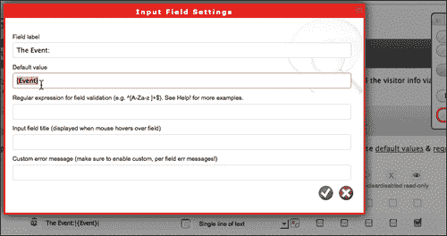

为了清晰起见，我希望事件名称也显示在表单的标题中。标题不是 cforms 的一部分，而是页面模板的一部分。在我的主题目录中，我将打开`registration-page.php`，在第 41 行的标题`the_title()`模板标签旁边，我将添加以下代码：

```js
...
<h2><?php the_title(); ?> for: <?php $evnt = esc_attr($_GET['evnt']); echo $evnt;?></h2>
...

```

当表单启动时，你现在会在标题和事件字段中看到事件的名称，该字段设置为只读，不可由用户编辑。现在表单提交并发送给管理员时，清楚地显示了注册是为哪个事件。

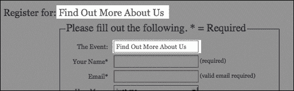

现在我们有了一个事件页面，显示用户即将到来的事件，并让他们无缝注册参加这些活动，这将在一个模态窗口中加载。干得好！让我们看看如何使这种体验变得更好。

# 第二部分：表单验证——确保提交的内容是正确的

令人振奋的消息是，cformsII 已经内置并准备好了漂亮、令人赞叹的 CSS 样式的服务器端验证。您可以看到，如果我在未填写必填详细信息或格式不正确的电子邮件地址的情况下点击**提交**，表单将重新加载，显示我填写错误的字段。

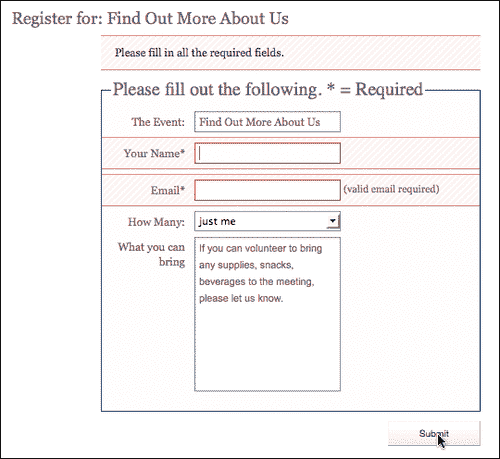

但为什么要等到用户点击**提交**按钮呢？虽然**服务器端验证**是必不可少的，也是唯一正确验证数据的方法，但通过添加一些**客户端**验证，使用 jQuery，我们可以很容易地提升并加快用户的流程，通过在用户填写表单时提醒他们丢失细节或数据格式不正确。

### 注意

**为什么服务器端验证很重要？**

使用 JavaScript 和 jQuery 进行客户端验证绝不能全部依赖于数据验证或防止提交不正确格式的信息到服务器。用户始终可以在浏览器中禁用 JavaScript，然后提交他们想要的任何值（有时使用不正确格式的值通过表单入侵您的服务器）。出于这个原因，客户端验证应该仅用于*增强*用户体验，而不是实际保护服务器或数据完整性。

## 客户端验证的技巧：不要只告诉他们错误时发生了什么！

每个人都对积极的反馈做出回应。与其等待用户弄错或忘记一个字段，借助 jQuery 和一些样式，您可以通知他们已经正确填写了字段，并可以继续进行。

使用 Inkscape，我做了一组简单的“√”和“×”图标，可以作为由 jQuery 添加的 span 的背景图应用。使用 CSS 精灵图像技术来调整背景位置显示“√”或“×”图标，用户将迅速看到表单字段是否被正确填写，并且可以继续。

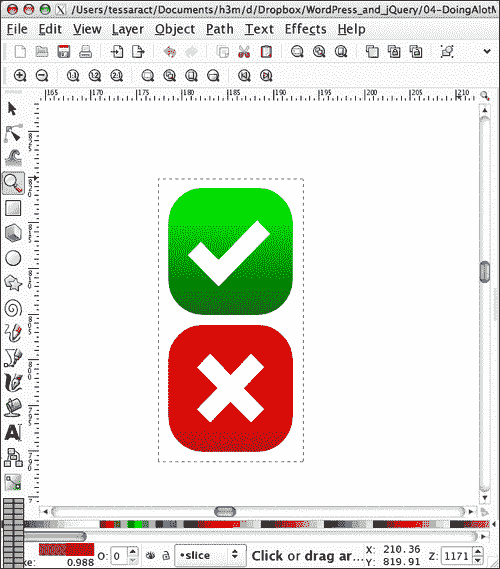

### 空输入验证

为了设置基本验证，我们将编写一个 jQuery 脚本，该脚本选择输入项目，并在`blur`时启动一个功能。让我们把这个脚本放在`registration-page.php`中，就在循环代码下面，`wp-footer()`挂钩上面，如下所示（注意代码中粗体的注释，以便跟踪每个 jQuery 语句的操作）：

```js
...
jQuery(".cform :input").blur(function(){
/*this "if" makes sure we don't target the submit button or email field*/
if (jQuery(this).val() != "Submit") {
/*this "if" targets only empty fields*/
if (jQuery(this).val().length == 0) {
jQuery(this).after('<span class="wrong"> ! </span>');
}else{
/*"else" otherwise field is fine*/
jQuery(this).after('<span class="correct"> thanks. </span>');
}//end if no length
}//end ifelse !submit
});//end blur function
...

```

以前的代码对于无效的、空的字段会附加一个感叹号 (`!`)，对于有效的、填写完整的字段则附加一个快速的 `thanks`。然而，当用户焦点和模糊输入字段时，`span` 会不断地附加上 `after` 函数。为了补偿这一点，我们将在我们的 `blur` 脚本下方添加一个工作于 `focus` 上的自定义脚本。它将删除附加的 `after` spans，如下所示：

```js
...
jQuery(".cform :input").focus(function(){
jQuery(this).next("span").remove();
});//end focus function
...

```

这给了我们一些非常好的基本验证，检查空输入。您会注意到我们的 `span` 标签已经添加了类。我已经将 "check" 和 "x" 图像添加到我的主题的图像目录中，现在，在我的主题的 `style.css` 样式表的最底部，我将添加以下类规则：

```js
...
/*for registration form*/
.wrong{
display:block;
float:right;
margin-right: 120px;
height: 20px;
width: 20px;
background: url(images/form-icons.png) no-repeat 0 -20px;
text-indent: -3000px;
}
.correct{
display:block;
float:right;
margin-right: 120px;
height: 20px;
width: 20px;
background: url(images/form-icons.png) no-repeat 0 0;
text-indent: -3000px;
}

```

最终结果是在你鼠标或者通过字段切换时，留下两个必填字段为空，然后再点击 **Submit** 按钮时发生的一个非常好的、明显的视觉显示。

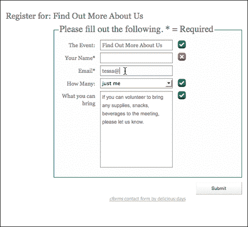

### 正确格式的电子邮件验证

让我们再向前迈进一小步。留下电子邮件地址为空是一回事，但我们也可以指出它是否格式良好。史蒂夫·雷诺兹在他的网站上有一篇关于使用 jQuery 验证电子邮件地址的绝佳文章。你可以在这里阅读：[`www.reynoldsftw.com/2009/03/live-email-validation-with-jquery/`](http://www.reynoldsftw.com/2009/03/live-email-validation-with-jquery/)。

史蒂夫的代码演示特别有趣，值得一看，因为他使用 jQuery 的 `keyup` 函数实时检查电子邮件表达式的验证。

对于我们的目的，我们将借用史蒂夫的正则表达式函数，并将其适应到我们已经开始的验证检查中，这个检查是在 `blur` 函数上工作的。

首先，在我们现有的脚本下面，我们将添加史蒂夫的 `isValidEmailAddress` 函数，如下所示：

```js
...
function isValidEmailAddress(emailAddress) {
form validatione-mail address, validatingvar pattern = new RegExp(/^(("[\w-\s]+")|([\w-]+(?:\.[\w-]+)*)|("[\w-\s]+")([\w-]+(?:\.[\w-]+)*))(@((?:[\w-]+\.)*\w[\w-]{0,66})\.([a-z]{2,6}(?:\.[a-z]{2})?)$)|(@\[?((25[0-5]\.|2[0-4][0-9]\.|1[0-9]{2}\.|[0-9]{1,2}\.))((25[0-5]|2[0-4][0-9]|1[0-9]{2}|[0-9]{1,2})\.){2}(25[0-5]|2[0-4][0-9]|1[0-9]{2}|[0-9]{1,2})\]?$)/i);
return pattern.test(emailAddress);
}//is valid e-mail
...

```

接下来，我们将仔细检查我们现有的脚本。我们想要做的是，在检查到没有值（`val().length == 0`）之后，我们会再次检查输入字段是否不是电子邮件字段。

使用 Firefox 和 Firebug，我探索了 DOM 并发现电子邮件字段表单具有一个名为 `.fldemail` 的唯一类。

我们将把我们的新语句作为我们当前的 if 语句的扩展，并在我们一般的 else 语句之前使用一个 `else if` 语句。

我们更新的 `blur` 脚本现在如下所示（注意加粗的新的电子邮件验证，`if...else` 语句）：

```js
...
jQuery(".cform :input").blur(function(){
/*this if makes sure we don't target the submit button or email field*/
if (jQuery(this).val() != "Submit") {
/*this "if" targets empty fields*/
if (jQuery(this).val().length == 0) {
jQuery(this).after('<span class="wrong"> ! </span>');
/*This "else if" targets if the field is the email field*/
}else if(jQuery(this).hasClass("fldemail") == true){
var email = jQuery(this).val();
/*Run's Steve's function and return true or false*/
if(isValidEmailAddress(email)){
//This shows the user the form is valid
jQuery(this).after(
'<span class="correct"> thanks. </span>');
}else{
//This shows the user the form is invalid
jQuery(this).after('<span class="wrong"> ! </span>');
}//if...else
//end email check
}else{
/*otherwise field is fine*/
jQuery(this).after('<span class="correct"> thanks. </span>');
}//end if no length
}//end if...else !submit
});//end blur function
...

```

现在我们不仅可以检查空字段，还可以在字段输入的 `blur` 时检查有效的电子邮件地址：

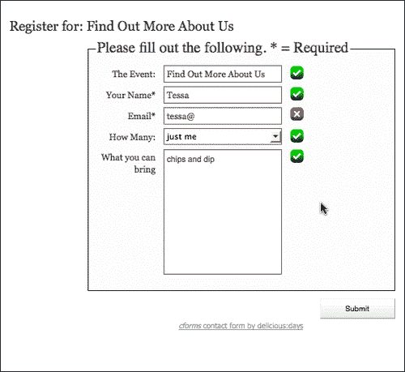

### 提示

**验证提示：不要过度使用！**

cforms II 插件的服务器端验证已经足够了。再次强调，我们只是想通过一点客户端验证来加快速度，并且不想因为为数据创建了一堆严格的格式化规则而让用户感到沮丧。有些人的电话号码或邮政编码的格式可能与您预期的有所不同，但就大多数情况而言，这是可以接受的。您最好使用 jQuery 验证来提示提示和内联帮助，并指导用户，而不是强迫他们遵守精确的数据格式。

# 最后的想法和项目总结：一切都关乎优雅的降级

与您使用 jQuery 所做的一切一样，您需要记住，您正在创建的是非常有用的增强功能，这些功能很棒，但如果某个用户由于某种原因没有启用或可用 JavaScript，流程或站点不会中断。

我们的客户对我们无缝的注册解决方案非常满意。禁用 JavaScript 进行注册过程时，注册过程使用标准浏览器返回键完全可以正常工作。我唯一发现的缺点是，注册表单会*在* WordPress 主题之外加载，这是我们必须做的，以便它可以很好地加载到 ColorBox 模态窗口中。

总的来说，我不认为这是一个很大的问题。浏览了我的各种网站统计数据后，我很难找到一个没有启用 JavaScript 的访客。那两三个没有启用 JavaScript 的可能是在纯文本浏览器中，所以缺少 WordPress 主题可能根本不会被注意到（事实上，对于使用文本转语音浏览器的残障用户来说，不必费力浏览头部信息以到达表单可能是一件好事）。

因为在这个标题中我们总是考虑假设情况，如果恰好，客户决定在事件 JavaScript 被禁用的情况下，希望表单在 WordPress 模板之外正常工作，我想出了以下解决方案：

首先，您需要将表单加载到*两个* WordPress 页面中。一个命名为`register`，就像我们在特殊模板中所做的一样，另一个命名为`register-b`（这只是永久链接的缩略名，标题仍然可以在两个页面上都是**Register**）。对于`register-b`页面，您不会分配特殊模板；您会将**页面模板**保留为**默认模板**。您可以在尽可能多的页面和文章中放置一个 cform，因此在两个位置放置此表单绝对不会成为问题。

接下来，您将进入`category-3.php`事件模板页面，并更改链接以调用替代的默认主题页面，如下所示（请注意，粗体的`-b`是与我们原始链接唯一的不同之处）：

```js
...
<p><a class="register" href="/wp-jqury/register-b/?evnt=<?php the_title(); ?>">Register</a></p>
...

```

最后，在你的 `custom-jquery.js` 文件中，你只需创建一个 jQuery 脚本，将 `href` 链接重写为删除 `-b` 的模态页面表单。确保将此脚本 *放在* 您的 colorBox 功能脚本之前，只是为了确保在设置 colorBox 功能之前 `href` 转换。

```js
...
jQuery("a[href*='register']").each(function(){
this.src = this.src.replace(/register\-b/, "/register/");
});
...

```

如果启用了 JavaScript，jQuery 将更改所有注册的 `href` 实例，并且整个流程将按计划使用 ColorBox 插件进行。如果没有，用户将使用标准的 WordPress 主题表单注册，而不会受到任何影响。

正如您在以下截图中所见，如果 JavaScript 被禁用，表单将只作为站点的一部分加载：

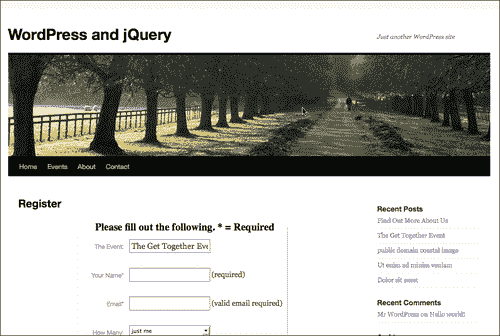

# 摘要

我们现在学会了如何：

+   真正利用主题来帮助 jQuery 增强。

+   使用 jQuery ColorBox 插件和一些自定义脚本增强非常强大的 cforms II WordPress 插件。

而这只是许多实现这个特定解决方案的方法之一！由于本书的目标是在 WordPress 中使用 jQuery，我选择了更注重 jQuery 和易于访问的 WordPress 功能的路线。但当然，我们可以将 ColorBox 插件制作成插件；我们可以将整个东西制作成插件！或者制作一个仅扩展 cforms 插件的插件。解决方案策略的列表几乎是无穷无尽的。

再次，您需要查看每个项目并据此评估。在下一章中，准备好通过一些流畅的基于 HTML 和 CSS 的图表动画以及图库幻灯片和旋转器，以及一些其他巧妙的方法来吸引用户的注意力。
