# 第五章：在 WordPress 中的 jQuery 动画

我们将继续在 jQuery 和 WordPress 的知识基础上深入探讨使用 jQuery 进行动画处理。动画是 jQuery 的强项之一，虽然您可能认为动画是轻浮的或者是廉价的技巧，只是为了“眼睛糖果”，但如果正确实现，它确实非常有用。

通过对 CSS 属性、颜色和界面元素进行 jQuery 动画处理，可以确保用户清楚地看到警报、错误和确认消息。动画还使界面对象能够淡入和淡出以获得更好的用户体验。最重要的是，一点点“眼睛糖果”肯定不会影响网站对用户的兴趣和受欢迎程度。

在本章中，我们将使用动画来实现：

+   吸引用户的注意力并将其引导到警报

+   节省空间并通过一系列旋转的置顶帖子进行动画处理

+   创建一些流畅的、动画的鼠标悬停效果和简单的动画图表

让我们开始将实用的、高端的动画应用到我们的 WordPress 站点上。

# jQuery 动画基础

首先，我们已经有一点 jQuery 动画的经验。让我们回顾一下：在第二章，*在 WordPress 中使用 jQuery*，在*事件和效果*部分，我们了解了以下函数：`show(), hide(), fadeIn(), fadeOut(), fadeTo(), slideUp(), slideDown()`和`slideToggle()`。我还提到了`animate()`和`stop()`函数。

我们在之前的项目中已经使用过几种这些函数，分别是第二章，*在 WordPress 中使用 jQuery*；第三章，*深入挖掘：理解 jQuery 和 WordPress*；和第四章，*以更少的工作做更多事情：利用 jQuery 和 WordPress 的插件*，特别是，`show()`和`hide()`，以及`fadeTo()`和`slideToggle()`。正如我们所看到的，这些快捷函数可以轻松满足您的大部分动画需求，但同时也受到它们的限制。现在让我们更仔细地看一下`animate()`函数，并掌握一些对我们的 jQuery 动画具有精细控制的方法。

## CSS 属性的魔法

`.animate()`函数允许您对任何*数字*CSS 属性进行动画处理。`px`是大多数数字属性值的理解规范，但您可以指定`em`和`%`（百分比）单位。几乎您可以放置在便捷的`.css()`函数中的任何东西，都可以在`.animate()`函数中使用。

此外，您可以将快捷字符串`"show", "hide"`和`"toggle"`添加到任何属性中，而不是数值。它们基本上会将值从 0 变为 100，或者反之，或者从 0 或 100 切换到相反的数字。

让我们快速看一下这个聪明函数的一个简单示例。记住，你会想把你编写的任何 jQuery 脚本放在`document ready` 函数内：`jQuery(function(){//code here})`；同样也要放在`<script>` 标签内，这样你的 jQuery 将在 DOM 加载完成时启动：

```js
...
jQuery('.post p').animate({ fontSize: '140%',
border: '1px solid #ff6600',}, 3000);
...

```

此代码片段将为页面上的所有`.post p`段落标签添加动画效果，增大字体大小并添加边框。

你会注意到我添加了一个没有单一数值的`border` 属性。当你在你的网站上测试这段代码时，你还会注意到，边框不会动画显示出来；相反，在动画完成时，它只会在最后一刻出现。添加不是基本数字值的 CSS 属性（如边框或背景颜色、十六进制值）将不会进行动画处理，但是你可以使用`.animate()` 函数添加所有 CSS 属性，一旦完成运行，它将像`.css()` 函数一样运行。这可能不是添加常规 CSS 属性的最佳方法，但如果你无论如何都要进行动画处理，只要知道你可以添加其他非数值 CSS 属性，它们只是不会动画显示。

### 小贴士

**你的属性不起作用吗？**

你可能早在第二章 *在 WordPress 中使用 jQuery* 就注意到了这一点，使用`.css()` 函数时，但以防万一你没有注意到：属性名称必须采用**驼峰命名法**才能被`.animate()` 和`.css()` 函数使用。这可能有点令人困惑，因为你可能只把它们当作在实际 CSS 样式表中使用的属性，但是你需要指定`paddingBottom` 而不是`padding-bottom`，`marginRight` 而不是`margin-right`。

### 使它多姿多彩

你可能同意，尽管`.animate()` 函数很酷，但如果没有颜色（并且颜色突然在动画结束时发生变化，这样会有点刺眼），它并不那么令人印象深刻。你渴望在灿烂的颜色中交叉淡入。谁不希望呢？不幸的是，核心的 animate 函数并不够强大，无法计算单个十六进制网络颜色中的所有变化，更不用说两个十六进制颜色之间的变化了（让我们只说，这涉及到一些严重的数学问题）。这比从 0 到 100 移动一个值，或者再次移动回来要复杂得多。

好消息是，`animate` 函数可以通过 Color 插件进行*扩展*。更好的消息？是的，这个插件已经捆绑在 WordPress 中了！

让我们像这样使用`wp_enqueue_script` 将这个插件添加到我们的主题中：

```js
...
<?php wp_enqueue_script("jquery-color"); ?>
<?php wp_head(); ?>
...

```

### 小贴士

**注册并包含一个只需要在特定页面加载的脚本？**

在第二章中，*在 WordPress 中使用 jQuery*，你会记得，你可以将你的`wp_enqueue_script()`函数包裹在`if`语句中，这些语句使用 WordPress 的条件标签来检查站点所在的页面：`is_home()`，或`is_front_page()`，或`is_admin()`等等。一定要善用这些条件标签，帮助你的站点尽可能地保持优化，并且不要通过加载不需要的脚本来不必要地减慢网站速度。要了解更多关于条件标签的信息，请查看它们在第二章中与脚本 API 一起使用的情况，以及在第九章中的条件标签快速参考，*jQuery 和 WordPress 参考指南*。你也可以查看 WordPress 的 Codex 网址：[`codex.wordpress.org/Conditional_Tags`](http://codex.wordpress.org/Conditional_Tags)。

再次强调，这个插件*扩展*了现有的`.animate()`函数，所以没有新的属性需要学习！一旦你将 Color 插件包含到你的项目中，你就可以随心所欲地动画化背景颜色了。

```js
...
jQuery('.post p').animate({'backgroundColor':'#99ccff'}, 2000);
...

```

现在你应该看到`.post`段落优雅地淡化成一个漂亮的浅蓝色，就像下一个截图中所示的那样：

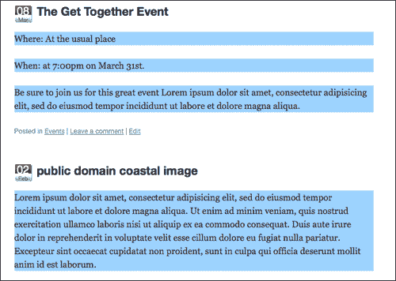

## 放松一下，用缓动控制

如果你熟悉使用各种视频编辑工具或 Adobe Flash 进行动画制作，你可能听说过缓动。**缓动**是动画中加速和减速的控制。它最常见的用途是给动画一个更自然的感觉，模仿现实世界中发现的各种物理属性，而不是计算和刚性的运动。

几乎与动画化十六进制颜色值一样复杂，缓动将虚拟物理属性应用于被动画化的对象，使用各种算法来控制动画的速度，使其在开始和结束时加速。这确实是严肃的数学。jQuery 带有一种内置的缓动类型，所以我们不必真正考虑其中的任何问题。

jQuery 的默认缓动选项称为“swing”。从技术上讲，有两个选项——“linear”和“swing”。**线性缓动**简单地沿着从点 A 到点 B 的值动画对象，就像一个良好的编程脚本应该做的那样。没有加速或减速，所以是的，它有点“僵硬”。

**Swing 缓动**开始时速度较慢，达到最大速度，然后随着动画完成而再次减慢。jQuery 选择 swing 作为默认的缓动选项，因为它在大多数情况下看起来最好。这可能是因为这就是我们现实世界中大多数物体的反应方式；在达到最大速度时稍微缓慢启动，然后在靠近停止时减速和减慢（前提是物体在最大速度时没有撞到任何东西）。

由于摆动缓动是*默认*的，让我们看看我们之前用来使文章段落背景色动画的脚本，并看看我们能否检测到差异：

```js
...
jQuery('.post p').animate({'backgroundColor':'#99ccff'
}, 2000, 'linear');
...

```

这是微妙的，但明显的差异在那里。线性缓动更加严格。

### 小贴士

**高级缓动：有一个插件可以做到！**

正如你可能猜到的，许多“数学派”的人已经找出了各种各样的缓动算法变体，以模仿各种不同的物理环境，是的，有一个 jQuery 插件可以做到这一点。虽然这个插件没有与 WordPress 捆绑在一起，但这不应该阻止你下载并尝试它。你可以在这里下载并测试所有可用的缓动选项：[`gsgd.co.uk/sandbox/jquery/easing/`](http://gsgd.co.uk/sandbox/jquery/easing/)。

这个插件，就像 Color 插件一样，*扩展了* `.animate()` 函数，并为你提供了超过 25 个缓动选项，其中包括一些非常酷的选项，比如 jswing bounce 和 elastic，以及一系列向量缓动路径，如圆形和正弦波。

大多数项目中这些选项都有点过度了，但我确实喜欢弹性和弹跳的缓动选项。顺便说一下，如果你是我刚才提到的那些“数学派”的人之一，你会喜欢查看这里缓动算法背后的魔力：[`www.robertpenner.com/easing/`](http://www.robertpenner.com/easing/)。

## 时间把控至关重要：顺序、延迟和控制动画队列

如果你对动画很熟悉，无论是传统动画、视频，还是与 Flash 进行多媒体工作，你可能已经了解——*时间把控至关重要*。你对动画的时间和播放控制得越多，越好。例如，缓动效果取决于给对象动画和移动多少时间。无论你想让一个对象移动得有多“平滑”，如果你只给它一秒钟或更少的时间来穿过屏幕，它看起来都会相当颠簸。让我们看看掌握时间和播放的三种主要方法。

### 让你的事情井然有序：把它们链接起来

我们在之前的章节中讨论了函数链，你很可能知道你在 jQuery 语句中链接在一起的任何事件会按照它们被*附加*到链中的顺序启动。据我所知，并根据专家的说法，你可以链接任意多的函数，无限地（或直到浏览器崩溃）。

总的来说，我发现将 jQuery 函数分布在单独的行中，具有它们自己的选择器集，可能会占用一些空间，但会使您的 jQuery 脚本更有组织和可管理性。请记住，您始终从包装器集的初始选择器开始执行 jQuery 语句，但基于额外的链式函数，可以使您在 DOM 中移动并获取其自己的选择器，您会发现您可以仅通过一个语句在 DOM 中移动和影响很多。沿途，可能会生成一些相当壮观的“意大利面代码”，很难跟踪，并且会让任何不得不与您合作的开发人员憎恨您的内心。

但是，对于需要在单个初始选择器集上运行的函数，特别是动画函数，我真的很喜欢 jQuery 链，因为它们有助于保持我的动画序列按照我想要的顺序开始，而且很明确哪个包装器集将受到链的影响。

以下是一个示例：

```js
...
jQuery('.post:first').hide().slideDown(5000, 'linear').fadeTo('slow', .5);
...

```

现在，即使最初简明的动画链也可能变得有点复杂。没关系；与一些脚本语言不同，JavaScript 和 jQuery 依赖于分号 ";" 作为清晰的结束语句，而不是实际行的结尾。因此，您可以将链组织成单独的行，以便更容易跟踪和编辑，如下所示：

```js
...
jQuery('.post:first')
.hide()
.slideDown(5000, 'linear')
.fadeTo('slow', .5);
...

```

### 延迟订单！

因为时间至关重要，我经常发现我希望函数的动画完成，然而，根据缓动选项，特别是*弹性*或*反弹*，我并不一定希望下一个函数就这么快开始！从 jQuery 1.4 开始，使用`.delay()`函数可以轻松**暂停**链。让我们在我们的链中放置一个三秒的暂停，如下所示：

```js
...
jQuery('.post:first')
.hide()
.slideDown(5000, 'linear')
.delay(3000)
.fadeTo('slow', .5);
...

```

### 提示

**检查您的 jQuery 版本！** `delay()` **需要 1.4+**

一旦此功能可用，我就在我的 jQuery 动画中以各种无价的方式使用它。但是，如果您发现延迟函数不起作用，那么您可能正在使用版本 1.3.2 或更早的 jQuery。延迟函数仅在版本 1.4+中可用。您可能想回到第二章，*在 WordPress 中使用 jQuery*并查看关于从 Google CDN 注册 jQuery 或直接将其包含在主题中的内容。

### 插队

队列——这些令人烦恼的队列确保每个人或每件事都按照它们到达的顺序公平处理。jQuery 的动画队列工作方式类似，只处理每个对象的动画请求，按分配给对象的顺序进行处理。有时会出现不应该被迫在队列中浪费时间的特殊需求和要求。

到目前为止，我们已经看到`.animate()`函数，除了 CSS 属性之外，还可以传递各种可选参数，指定 *持续时间*（slow、fast 或数字毫秒）和 *缓动* 类型（swing、linear 或插件扩展缓动）。

`que`参数是一个**真或假**布尔值，如果你不想让动画函数等待其轮到，则可以设置它。对于你希望一个对象同时运行多个动画以与彼此并行的实例，比如同时滑动*和*淡化，禁用`queue`在你的动画函数中将起作用。

为了在你的代码中设置`queue`选项，而不是使用我们之前一直在使用的语法，你将不得不*将*所有其他选项包装到更高级的语法中，清楚地标记每个可选参数，像这样：

```js
...
jQuery animationqueue, jumpingjQuery('.post:first')
.hide()
.fadeTo(0, .1)
.css("height","5px")
.animate({
height: '+=500px',
},
{
duration: 4000,
easing: 'swing',
queue: false
}
)
.fadeTo(4000, 1);
...

```

以下屏幕截图显示了帖子在淡出*同时*同时改变高度：

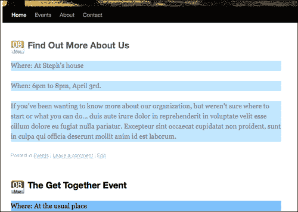

通过前面的屏幕截图可以看出，我们刚刚编写的代码在下滑时淡化了第一个`.post` div。如果你将`false`改为`true`，然后重新加载页面，你会发现第一个`.post` div 滑动到`500`像素高度后*然后*淡入。

### 完成跳转

可以传递到`.animate()`函数的最终选项是`step`和`complete`。`step`参数允许你设置一个额外的函数，在每个动画步骤完成后调用它（有时对于你正在动画化的多个 CSS 属性很有用）。`complete`参数允许你指定一个回调函数，当整个动画函数完成时调用。请记住，你可以链接多个动画函数，而具有完成参数的步骤是属于它们所属的每个动画函数的唯一实例。

如果你有一个动画绝对不应该在当前动画函数完成之前启动的情况，`.delay()`函数可能不是最好的方法。你可以使用`step`和`complete`参数按照你希望的确切顺序启动其他函数和动画。

```js
...
jQuery('.post:first')
.hide()
.fadeTo(0, .1)
.css("height","5px")
.animate({
height: '+=500px',
},
{
duration: 4000,
easing: 'swing',
queue: false,
step: function() {alert('step done!');},
complete: function() {alert('completely done!');}
}
)
.fadeTo(4000, 1);
...

```

前面的代码片段将在`.animate()`函数完全完成后在完成的步骤中生成 JavaScript 警报。

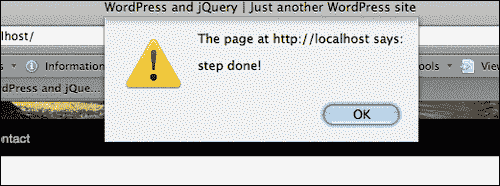

我个人从未需要钩入 WordPress 项目的`step`参数，但我可以看出它如何在钩入和创建一系列级联类型效果方面非常有用。我发现完整的`parameter`对我的许多动画非常有用。

# 吸引用户的注意力

好了，除了示例代码片段，现在是时候开始工作了！回到“假设的世界”，我们的前一些客户热情地向几位同事推荐了我们的 jQuery 解决方案，现在我们收到了很多有关 WordPress 网站的帮助请求。让我们看看一些新的假设客户情况，看看我们是否能解决他们的问题。

首先：许多网站采用的一种常见方法是“置顶”帖子以及如何利用一点 jQuery 动画来增强它们。

## 项目：动画提示置顶帖子

这是一个快速简单的情况。你有一个客户，他有一个好朋友，经营着一个非营利性教育组织的网站，他们需要一个帮助（意思是：请"免费"做这个，请）。

组织的课后照顾根据公立学校的时间表运行（因为许多孩子是从不同的学校乘坐校车过来的）。如果公立学校系统放假或发生其他紧急情况，课后项目也会关闭。组织尽力通过他们的 WordPress 站点通知人们。

尽管向家长明确表示他们有责任查看网站或致电了解中心的时间表，但是有一些人声称他们查看了网站但 *"没有看到关闭警报"*。显然，即使他们将帖子设置为 "sticky"，使其保持在顶部，但这些帖子看起来与网站的其他内容非常相似。

你很乐意帮忙（特别是因为他们是由一个有高薪工作的客户推荐给你的）。这是一个真正容易解决的问题。首先，你可以简单地在他们主题的 `style.css` 文件中添加几个 `.sticky` 样式，这样在网站上粘性帖子就会更加突出。

他们明确表示，他们只使用 "sticky" 功能来发布日托和其他影响组织中心建筑对公众开放的警示，因此你决定快速搜索 "creative `commons, public domain, alert icon svg`"，并从 [`commons.wikimedia.org/wiki/File:Nuvola_apps_important.svg`](http://commons.wikimedia.org/wiki/File:Nuvola_apps_important.svg) 下载了一个非常漂亮的 SVG 文件。

让我们将 SVG 文件打开到 Inkscape 中，并将其缩小到 48 像素宽以保存一个透明的 `.png` 文件（我冒昧地给阴影加了一点模糊，但你可能不想要）。将 PNG 命名为 `sticky-alert.png`。

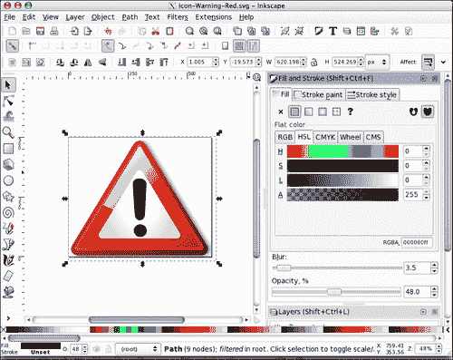

然后，你将新的 `sticky-alert.png` 图像添加到他们主题的图像目录，并在样式表的最底部*或下面*已存在的 `.sticky` 类之后，如果存在的话，用一些 `.sticky` 调用的类规则更新它，如下所示：

```js
...
/*change the .sticky background */
.home .sticky { background-color: #ffff9c;}
/*add the icon to the entry-content div inside the sticky post*/
.home .sticky .entry-content{
background: url(images/sticky-alert.png) no-repeat 0 20px; }
/*nudge the paragraph and lists out of the way of the icon*/
.home .sticky .entry-content p,
.sticky .entry-content ul{margin-left: 60px;}
...

```

以下截图展示了新样式的粘性帖子：

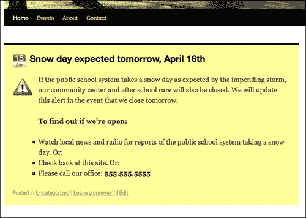

这已经足够好了。现在无论是否可用 JavaScript，任何访问站点的人都肯定会注意到。但是，嘿，既然你已经在主题中挖掘了，而且决定注册 jQuery，从 WordPress 捆绑包中添加 jQuery Color 插件，并将 `custom-jquery.js` 页面包含到他们的 `header.php` 文件中，你也可以加入这几行漂亮而简单的代码。

```js
jQuery(function(){
jQuery('.home .sticky')
.animate({'backgroundColor':'#ff6600'}, 'slow')
.animate({'backgroundColor':'#ffff99'}, 'slow')
.animate({'backgroundColor':'#ff6600'}, 'slow')
.animate({'backgroundColor':'#ffff99'}, 'slow');
});

```

前面的代码将我们的粘性帖子从浅黄色渐变为较深的橙色，然后再次*重复*以突出显示。以下图像显示了帖子渐变为较深的橙色：

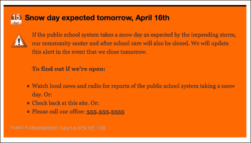

在书中很难看到动画效果，但我们确保了警报 `.sticky` 帖子在加载时会淡入到橙色 (`#ff9900`)，然后再淡出到黄色 (`#ffffcc`)，然后再重复一次，产生了相当明显的 "橙色警报" 效果。

现在警报帖子非常明显了，组织对你感激不尽！这已经足够补偿你几分钟的工作了。

## 创建简单、动态的图表

这个非营利组织对你的警报粘性帖子解决方案印象深刻，他们已经调拨了一些资金，并向你提出了另一个请求。他们注意到你如何使用 Inkscape 修复了警报图标，并询问你为另一个他们发布的帖子生成一个月度图表会有多大麻烦。这篇帖子是关于他们的绿色回收项目的前五个统计数据。

虽然项目符号列表对网站管理员来说非常容易实施，但人们并不真正注意或记住信息，因此他们正在考虑在网站上发布图表，但需要有人来绘制或以某种方式生成它们。

浏览他们的网站，你注意到编辑总是一贯地格式化发布的信息。所有的帖子标题都包含 **"... 月度统计"**，所有的信息都是用项目符号列出的，百分比数字始终位于冒号 "**:**" 之后。管理员一直保持如此一致是很好的。这将使得解决方案的制定变得非常容易，让编辑继续做他们一直以来做的事情。当前的帖子看起来像这样：

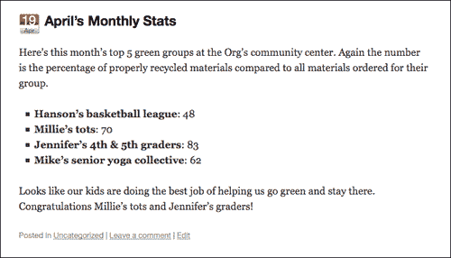

你告诉管理员只要他/她继续一贯地格式化帖子，你可以为他们撰写一个 jQuery 脚本来为他们绘制图表。他们几乎不相信你，很高兴让你继续进行。

要开始，我们首先需要确保我们只针对 **月度统计** 的正确帖子。我们将通过设置一个 jQuery 选择器来实现这一点，如下所示：

```js
...
jQuery('
.post h2:contains(Monthly Stats)')
.siblings('.entry-content')
.children('ul:first')
.css({background: '#ccffee'});
...

```

如我们所见，这个小的 "测试" 选择抓取了所有包含 "月度统计" 文本的 `.posts` 内部的 `h2` 标签。然后我们沿着 DOM 移动并定位 `.entry-content` div，然后定位其中的 **第一个** `ul`。我们可以通过改变背景颜色来看到先前的代码正确地定位了我们在这些帖子中想要的内容，如下一张截图所示：

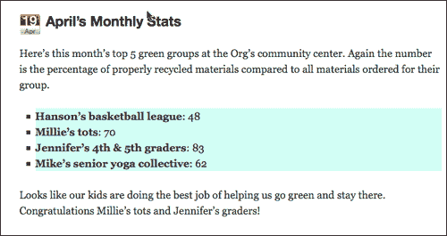

现在我们可以针对特定的帖子进行定位，而无需更改主题的输出或让我们的客户做任何工作，让我们开始着手处理剩下的图表吧！

首先，因为我们将加载一个背景图片，而这些图片从主题的样式表中加载起来会更加顺畅（更容易定位图片），让我们再次使用 Inkscape 来帮助我们创建一个基本的背景，大约 450 像素宽，显示从 "刚刚开始" 到 "Yes!" 的进展，如下所示：

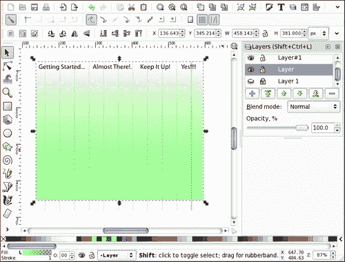

让我们导出该图形的 PNG 并将其添加到客户主题的图像目录中。然后，使用 jQuery，让我们动态地向所有目标`ul`添加一个类：

```js
...
jQuery('.post h2:contains(Monthly Stats)')
.siblings('.entry-content').children('ul').addClass('greenStats');
...

```

现在，我们可以进入客户主题的样式表，并且就像我们为粘性警报发布的那样，为我们的新类创建自定义 CSS 规则。打开主题的`style.css`样式表，并在末尾添加以下规则：

```js
...
.entry-content .greenStats{
margin: 0;
background:url(images/greenBackground.png) no-repeat;
border: 1px solid #006633;
padding: 40px 20px 5px 20px;
}
.entry-content .greenStats li:before{content:none;}
.entry-content .greenStats li{padding-left: 10px; margin: 0}
...

```

第一条规则添加了我们的新的`greenBackground.png`图表图像，并设置了一些基本属性，以便列表项可以开始适应我们即将添加的 jQuery。接下来的两条规则修复了客户主题（在本例中为默认主题）放置在每个`.entry-content` div 中的每个`li`元素上的特定`.entry-content li`问题。我们不希望在我们的图表项目之前有“小方块”，我们希望每个`li`的填充再多`10px`。同样，我们只想在 jQuery 添加了我们的`.greenStats`类时才影响`.entry-content` li 项，所以务必将该类名添加到 CSS 规则中。

现在，我们准备进行一些严肃的 jQuery 魔术了。我希望你到目前为止已经对选择器和 DOM 遍历非常熟悉了。我们将不得不运用相当多的这方面的知识来完成接下来的几项任务。

我们想要在我们的目标`li`上放置一个`.each()`函数项，并开始操纵其中的内容。

我们将从设置这个 jQuery 语句开始：

```js
...
jQuery('.post h2:contains(Monthly Stats)')
.siblings('.entry-content').children('ul').children('li')
.each(function(){
//code here
});//end jQ li
...

```

接下来，在我们的`.each()`函数*内部*，我们将放置一些代码，开始操纵每个`li`对象内部的 HTML 和文本。我们想要查找冒号“:”，并将其用作在其后的数字周围包装一个`div`的点。之后，我们将寻找结束的`</li>`标签，并使用它作为关闭我们开始的`div`的点。我们将使用`.text()`和`.replace()`函数来实现这一点，代码如下：

```js
...
var string1 =
jQuery(this).text().replace(': ',':<div class="nVal">');
var string2 = string1.replace('</li>','</div></li>');
//place back into the li element as html markup and text:
jQuery(this).html(string2);
...

```

前面的代码片段现在为我们提供了自定义带有类`.nVal`的`div`，我们可以开始使用它。`.nVal` div 最终将成为我们绿色统计图中的“柱形”。在上一个代码下面，我们将继续完善我们的`.each()`函数，并再次在`.each()`函数中*内部*放置以下代码：

```js
...
//set the default css values of each nVal div:
jQuery(this).children('.nVal').css({width: '0',
padding: '10px 0 10px 20px', fontSize: '130%',
color: '#ffffff', marginBottom: '5px'});
//retrieve the number text from inside the nVal div:
var nVar = jQuery(this).children('.nVal').text();
//animate the nVal divs with the nVar values:
jQuery(this).children('.nVal').delay(600)
.animate({backgroundColor: '#006600', width: nVar*(3.8)}, 2000);
...

```

在前面的代码片段中，请注意我使用了`.delay()`函数。如果您没有使用 jQuery 1.4.2 或更高版本的库，则该函数是可选的。我只是认为，为了确保用户注意到动画，有一个大约半秒的暂停是有帮助的。

我们再次使用`.text()`函数从`.nVal` div 中提取文本，并将其用于数学方程以计算`.animate()`函数中 div 的`width`。我们将`nVar`乘以`3.8`，因为在我们的图表设计中，大约 380 像素宽的 div 相当于 100%。如果您的图表尺寸不同，您需要相应地更改这些尺寸，以确保图表柱正确地延伸出去。

结果看起来很棒！这是我们开始动画的图表：

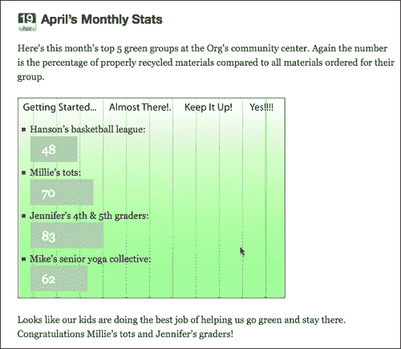

在完成时，这就是它的样子，一个有趣、视觉清晰的组织绿色统计图的展示：

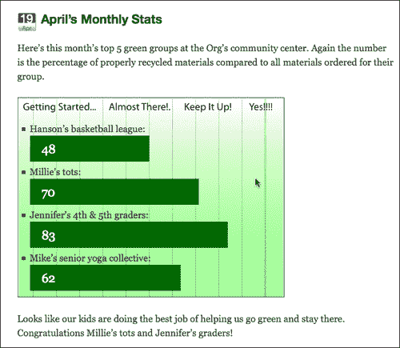

# 深入了解动画

多亏了你的动态绿色统计图表，你已经准备好应对一些稍微复杂的请求了：客户*坚持*要求 Flash 开发。作为一个在 90 年代通过 Flash 进入 Web 开发的人，Flash 开发的请求没有问题。无论你抱怨多么多，你都必须承认，Flash 确实可以做动画。

然而，Flash 确实需要一个插件，尽管它是最流行的桌面浏览器插件，但并不总是显示你希望确保每个人都能看到的核心内容的好方法，更不用说像网站导航这样的基本元素了。此外，虽然 Flash 是最受欢迎的*桌面/笔记本浏览器*插件，但在 iPhone 的 Safari 移动版和大多数智能手机的基于 WebKit 的浏览器中，Flash 是“不适用”的。

在当今浏览器中，随着 CSS 和 JavaScript 在浏览器中的支持不断进步（尤其是移动浏览器），我对 Flash 请求的第一个问题总是：“好的。首先，告诉我你想要做什么，然后我们再看看。”确实，我们的客户希望他们的主导航面板具有动画效果。

Flash 当然可以做到这一点，但 jQuery 也可以，而当 JavaScript 不是一个选择时，它会优雅地退化为漂亮的样式化 CSS 元素，并且在最坏的情况下，没有 CSS，页面将加载我们的 WordPress 主题的干净、语义化的 XHTML 到纯文本浏览器中。

虽然有很多种方法来提供 Flash 内容和应用程序，使它们优雅地退化为符合 HTML 标准的替代方案（并且当使用 Flash 播放器时，你应该*总是*提供这些替代方案），但如果这不是必要的，为什么要增加额外的开发和复杂性呢？客户不需要提供流媒体视频，也不需要定制卡通角色动画，更不用说想要一个深度的、多媒体浸润和混搭的**丰富界面应用程序**（**RIA**）。因此，让我们把 Flash 留给 Flash 最擅长的事情，并使用 jQuery 来增强我们客户的 WordPress 网站已经做得最好的事情。

幸运的是，客户是理性的，并且愿意在我们诉诸 Flash 之前看看 jQuery 能做些什么。让我们通过一点 jQuery 的灵感展示一下他们的 WordPress 网站是由什么组成的。

## 项目：创建时髦的导航

我们受到 Flash 启发的客户经营着一个回收和翻新 NASA 和其他空间机构废弃并出售的材料的业务。他们希望他们的导航面板能够向用户展示这种未来主义（同时也是复古）的感觉，并提供一个页面导航，根据客户的说法：“具有流畅的动画和我们的徽标/图标火箭作为指针”。

让我们继续准备主题，以便我们可以开始。我们将继续使用默认主题，并使用我们在第二章中制作的页面导航 CSS 更改，*在 WordPress 中使用 jQuery 工作*。我们将增强导航栏的效果，使其在菜单项上悬停时触发平滑的缩进和释放动画。最后，我们将添加一个酷炫的浮动指针选择器（也是站点的太空飞船图标）。

首先，我们需要将客户的标志中使用的太空飞船图标追踪成基本的轮廓形式，以便我们可以创建一个浮动指针。同样，这可以很容易地通过 Inkscape 完成：

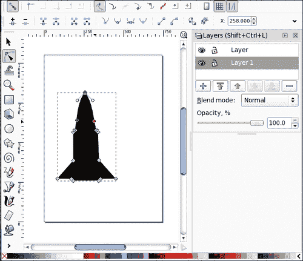

我们会在这里多做一步，旋转飞船，并且由于它将成为一个透明的 PNG 文件，添加一个漂亮的阴影和光泽效果，使其更有深度：

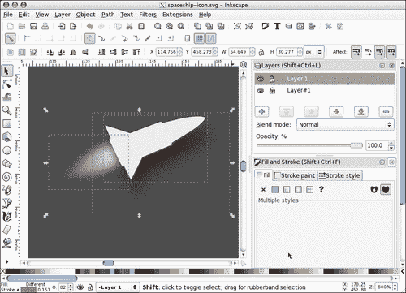

我们将把这张图片导出为一个宽度为 37 像素的透明`.png`文件。接下来，我们需要准备我们主题的样式表以接受这个背景图片。我们将在 jQuery 中创建一个名为`#shipSlide`的`div`来容纳这张图片，因此我们的样式表需要适应那个`id`名称：

```js
...
#shipSlide{
position: absolute; margin-top: 12px; margin-left: -7px;
width: 37px; height: 20px;
background: url(images/spaceship-icon.png) no-repeat;
}
...

```

### 注意

同样，就像本书中的许多示例一样，为了保持流程简洁易懂，我们将尽可能直接地进行操作，但不一定尽可能优化。在实际项目中，您可能想为此类项目创建一个单独的样式表，或者将您的 jQuery 工作包装到一个插件中，甚至在 WordPress 插件中使用我们在第三章中介绍的技术，*深入了解 jQuery 和 WordPress*。这完全取决于您希望增强的 jQuery 后续功能有多灵活和可移植。

现在，我们将在 jQuery 中开始工作。像往常一样，对于每个项目，您都要确保将 jQuery 包含到主题中，并且已经包含并设置为工作的`custom-jquery.js`文件。此外，对于此导航，我们将使用 Color 和 Easing 插件。您可以注册捆绑的 Color 插件，但是您需要手动从以下位置下载并包含自定义 Easing 插件到您的主题中。获取地址：[`gsgd.co.uk/sandbox/jquery/easing/`](http://gsgd.co.uk/sandbox/jquery/easing/)。

在我们特定的默认主题中，我们将使用一些 jQuery 来使我们的导航条更清晰一些。

我们的第一部分 jQuery 看起来像这样：

```js
...
//this adds our #shipSlide div
//under the twenty ten theme's menu header div
jQuery('.menu-header').prepend('<div id="shipSlide"> </div>');
//this fades the ship div to 40%
jQuery('#shipSlide').fadeTo('slow', 0.4);
...

```

在我使用 jQuery 的`.fadeTo()`函数淡化`#shipSlide` div 之前，我将其加载到浏览器中检查并确保背景图片是从 CSS 中加载的。下面的截图显示了船图像被我们初步的 jQuery 脚本加载并淡化：


好的，接下来，让我们设置一个基本动画，将导航`li.page_item`对象从左侧推入 35 像素，相对于它们的位置。 然后，我们将针对标签，并更改它们的背景颜色。 我们将使用`.hover`函数确保这发生在`li.page_item`对象的悬停和移出时：

```js
...
jQuery('li.menu-item')
.hover(function() {
//animates each menu item to the right (from the left)
jQuery(this).animate({paddingLeft: '+=25px'}, 400, 'swing');
//this over rides the style sheet's background on hover
jQuery(this).find('a').css('background','none');
//ship move code will go here
}, function(){
//returns the menu item to it's location
jQuery(this).animate({paddingLeft: '-=25px'}, 400, 'swing');
});//end hover
...

```

最后，在第一个悬停函数*内*，在 a 对象的颜色动画的*下方*，我们将添加以下代码片段，它将将`#shipSlide`对象移动到`li.item_page`的位置（注意只有粗体代码）：

```js
...
//this custom moves the ship image
var p = jQuery(this);
var position = p.position();
jQuery("#shipSlide").fadeTo('slow', 1)
.animate({marginLeft: position.left-175},
{duration: 600, easing: 'easeOutBack', queue: false});
...

```

在这里，我们设置了一个名为`position`的变量，并且还使用了一个名为`.position()`的函数，以便能够从`li.page_item`对象中提取一系列信息。

`#shipSlide`对象的动画函数将船向左移动到`page_item`的`position.left`，减去 175 个像素的`marginLeft`位置。

在前面的代码片段中，您还会注意到我们将`animate`函数中的`queue`设置为`false`，并且我们正在使用`easeOutBack`缓动方法，这仅因为我们包含了缓动插件。

我们需要的最后一小部分代码，在`li.page_item .hover()`代码的*下方*是另一个 jQuery 选择和`.hover()`函数，它将在`#mainNav`对象悬停时使`#shipSlide`对象淡入和淡出。同样，将此 jQuery 放置在所有其他导航代码的下方：

```js
...
//this fades and moves the ship back to it's starting point
jQuery('.menu-header').hover(function(){
jQuery("#shipSlide").fadeIn(1000);
}, function(){
jQuery("#shipSlide").fadeTo('slow', .4)
.animate({marginLeft: '-5px'},
{duration: 600, easing: 'easeOutBack', queue: false});
});//end hover
...

```

最终结果看起来很棒，船和菜单项目动画流畅，客户对他们新的时髦导航非常满意。


## 项目：创建旋转的置顶帖子

早些时候，我们发现使用 WordPress 的特色帖子非常简单！这很好，因为我们的“我想要 Flash”客户现在请求了一个额外的增强解决方案。 他们使用 WordPress 的特色帖子来让网站观众了解他们正在推广的产品。 牢记这些帖子的内容，使他们的产品推广置于前列（通常一次两到四篇），而他们的常规新闻帖子和更新则在产品功能下方流动。

但是，当他们要展示两个以上的产品时（尤其是当他们要展示三个或更多产品时），他们当前的帖子会被推到下面，有时甚至被推到页面底部以下。 他们担心只偶尔瞥一眼网站的人如果不花时间向下滚动并查看当前的帖子，可能会觉得网站过时。

他们已经看到了许多网站示例，这些网站具有非常酷的图像旋转器，带有幻灯片或交叉淡入淡出效果，位于特色项目的顶部，并且他们想在他们的网站中加入类似的东西。 他们最初认为他们会在 Flash 中完成这个过程并放弃方便，但是由于 jQuery 导航面板效果很好，他们想要创建一个解决方案：

+   节省空间，避免将其他帖子推至“折叠”下方

+   看起来非常漂亮，并且引人注目的吸引注意力的特色文章

+   这意味着他们的营销管理员仍然很容易实现新的特色项目（只需要创建一个帖子并将其标记为“置顶”！）

这个客户的主题已经稍微改变了置顶帖子的 CSS 样式，在底部的 `style.css` 样式表中，我们可以找到简单的背景，使帖子具有暗色渐变以及一些字体颜色变化。

```js
...
.sticky { background: #000 url(images/sticky-background.png)
repeat-x; color: #ccc;}
.sticky small.date{display:none;}
.sticky h2 a{color: #0099ff;}
...

```

结果看起来像这样，你可以看到只有三个置顶帖子不留任何空间供查看下面的当前帖子，并且使用户需要滚动相当多的距离：

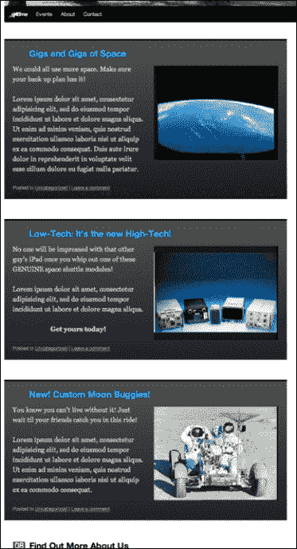

本质上，我们希望将这些置顶帖子叠在一起，如果可能的话，可能使它们稍微缩短一点，隐藏除了*第一个*置顶帖子之外的所有帖子，然后开始逐渐显示*第一个帖子上方的*其余帖子。

首先，这似乎是显而易见的，但再次确保你已经注册并将 jQuery 与之前讨论过的 Color 和 Easing 插件一起包含到主题中。你可以以任何你想要的方式包含 jQuery，但我将使用 WordPress 3.0 包中讨论的 1.4.2 版本，正如第二章中讨论的那样，*在 WordPress 中使用 jQuery*。另外，你还需要确保在主题中包含一个 `custom.js` 文件，这样你就可以将 jQuery 代码从 WordPress 的 `header.php` 模板中移出（这也在第二章中有所涉及，*在 WordPress 中使用 jQuery*）。

一旦 jQuery 和你的插件包含在主题中，我们将开始使用 jQuery。因为网站的功能是完全符合要求的，而且客户也接受这种替代视图，我们将保持主题和 `style.css` 不变，并确保我们所有的增强都是通过 jQuery 完成的。

### 注意

再次说明，下面的代码可能不是实现客户目标最优雅的方式，但它是写成的，以确保发生的每一步都是清晰可见的。

让我们首先改变置顶帖子的 CSS 属性，使它们都堆叠在一起。这样做的最简单的方法？将 `.sticky` 类的 `position: absolute`。让我们也确保宽度和高度正确，并且任何溢出都被隐藏，像这样：

```js
jQuery(function(){
jQuery(".sticky")
.css({
position: 'absolute',
top: '0',
margin: '0',
width: '650px',
height: '320px',
overflow: 'hidden'
});
...

```

接下来，我们将把 `h2` 标题向上移动一点，最重要的是，由于我们实际的帖子是*处于*定位绝对的 `.sticky` 帖子下面，我们将把它们移下来，使它们显示在即将动画化的置顶帖子下面。我们还将调整图片的右侧边距一点以便放置。

```js
...
//move the header back over if it's affected by the css
//you could also do this in the CSS directly
jQuery('.sticky h2').css({margin: '0', padding: '0'});
//move the margin over a bit
//you could also do this in the CSS directly
jQuery('.sticky img').css('marginRight','30px');
//this pushes the other posts down out of the way
jQuery('.post:not(.sticky):first').css('margin-top','360px');
...

```

特别注意前一个代码片段中粗体的 jQuery 选择器。如果需要复习选择器的使用方法，你可以参考第三章，*深入挖掘：了解 jQuery 和 WordPress*。基本上，我们在定位*第一个*未分配`.sticky`类的`.post` div。很好！

结果如下所示：

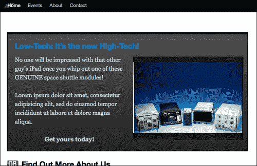

好的！jQuery 有一个我们之前看过的非常好的函数，叫做`.each`，它将在包装集合中的每个对象上运行附加函数。如果我们只想遍历每个项目一次，我们可以使用这段代码：

```js
...
jQuery('.sticky')
.hide()/*hide each post*/
.each( function (i){
/*i = numeric value that will increase with each loop*/
jQuery(this)
/*make sure each div is on it's own z-index*/
.css('z-index','i+10')
//using the animate function to fade in each div
//3 seconds apart*/
.animate({'backgroundColor': '#000000'}, i*3000, function(){
/*actual div fade in*/
jQuery(this).fadeIn('slow');
}
);//end animate
});//end each
...

```

看起来不错！然而，一旦最后一个`div`淡入，它就停止了，不再继续。

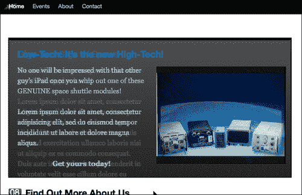

没有，没有超级流畅的 jQuery 方法来保持`.each()`函数的继续。然而，一个`.each()`函数如此容易设置，不利用它，即使是用于“无限循环”，也是一种遗憾。

现在，这里快速解释一下：如果你敢的话，你可以通过谷歌搜索`"infinite animation loops jquery"`，看看约一万条结果中，看起来有大约一万种 JavaScript 开发人员喜欢设置重复或无限循环的方法，每个开发人员似乎都认为（当然！）他们的方法是可用的最好方法。我更倾向于求助于常规 JavaScript，并使用一个`setInterval`函数和一些自定义变量设置的方式，这样可以很容易地利用我的现有 jQuery`.each()`语句和函数。

要开始创建我们的循环，我们将采用我们现有的 jQuery 语句，并将其放置在*自己的*函数内。你需要确保这个函数**位于**你的主要`jQuery(function(){...`文档准备好函数之外。否则，`setInterval`函数将无法正确启动它。

让我们称之为我们的新函数`loopStickies`。除了第一个语句之外，你会觉得它很熟悉：

```js
...
function loopStickies(duration){
/*note the variable "duration" being passed*/
///we'll need to make sure everything fades out
//except the first sticky post*/
jQuery('.sticky:not(:first)').fadeOut();
/*this should look almost the same*/
jQuery('.sticky')
.each( function (i){
/*i = numeric value that will increase with each loop*/
jQuery(this)
/*make sure each div is on it's own z-index*/
.css('z-index','i+10')
/*using the animate function & "duration" var for timing*/
.animate({'backgroundColor': '#000000'}, i*duration,
function(){
jQuery(this).fadeIn('slow');
}
);//end animate
}); //end each
}//end loopStickies

```

好的，这只是一个开始，现在我们有了我们的`loopStickies`函数，位于 jQuery 文档准备好函数之外，让我们将剩下的代码放回**jQuery(function(){...**文档准备好函数内。跟随粗体中的注释：

```js
...
/*set the stickies in a wrapper set to overflow hidden*/
jQuery('.sticky').wrapAll('<div id="stickyRotate"
style="position: absolute; padding: 0; margin-top: 5px;
width: 650px; height: 320px; border: 2px solid #000;
overflow:hidden;"></div>');
//make sure the first .sticky post fades in:
jQuery('.sticky:first').fadeIn();
//set the "duration" length to 6 seconds for each slide:
//(this is the var our function uses)
var duration = 6000;
/*create the interval duration length, based on the duration:*/
var intervalDuration = duration * jQuery('.sticky').length;
/*the function needs to run once before the setInterval kicks in*/
loopStickies(duration);
//the setInterval will kick off loopStickies in
//18 seconds: (6secs x number of sticky posts) */
setInterval( 'loopStickies("'+duration+'")', intervalDuration
);
...

```

这个工作原理是，我们的原始 jQuery 语句和`.each()`函数通过调用`loopStickies`函数在 jQuery 选择中的每个粘性帖子上运行。*同时*，`setInterval`函数被启动，但由于我们将`intervalDuration`变量设置为计算我们的`duration`变量乘以粘性帖子数量，它将不会在 18 秒后启动。正好是我们的原始函数完成的时候！`setInterval`函数会接管并将我们的粘性帖子循环到无限远。

好的，让我们来看看；我们现在有一组非常好的便签，持续六秒钟，然后淡出到下一个便签！

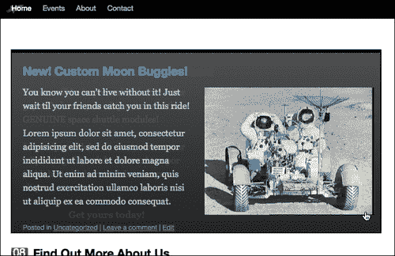

### 添加一点额外的努力：添加循环指示器

旋转便签非常棒！然而，尽管客户一次只会有三到四个便签在旋转，但至少让用户知道他们要查看所有旋转的时间大致是个好习惯。大多数旋转幻灯片都会在某个地方添加指示器，让用户知道将显示多少个面板，并允许用户在面板之间导航。

让我们看看如何将此功能添加到我们的旋转便签中。首先，我们需要创建一个小的界面。在我们之前创建的`#stickyRotate`包装器内，添加在最后一个便签对象后的一个带有内联样式的`div`。再次强调，这对于一个工作项目来说不一定理想，但我想让每一步都清晰明了。实际上，你可能会创建自定义样式表或修改你正在工作的主题。无论如何，这是我们的交互容器。我把这段代码放在了我的前一个代码的底部，在 jQuery 文档准备好函数内部：

```js
...
jQuery('.sticky:last')
.after('<div id="stickyNav"
style="position: absolute; padding: 10px 0 0 0; margin-top: 280px;
height: 25px; width: 650px; color: #eee; background: #000;
text-align: center"></div>');
...

```

并在那段代码下面，我们将添加一些更多的 jQuery 代码，这些代码将把每个便签的编号插入到我们刚刚创建的`#stickyNav` div 中：

```js
...
rotating sticky postsloop indicator, addingjQuery('.sticky')
.each( function (i){
jQuery('#stickyNav').fadeTo(0, 0.8)
.append("<div class='sN'
style='display:inline; margin: 0 5px;
border: 1px solid #999;
padding: 2px 5px;'>"+(i+1)+"</div> ");
});
...

```

这段代码使用了另一个`each`函数，但我们只需要，并且希望它运行一次，并将数字 1 到 3（或者我们有多少个便签）附加到`#stickyNav` div 中。

最后，为了真正完成这个效果，我们需要回到我们的`loopStickies`函数内部。在`.animate`函数的回调函数内部，我们将添加以下粗体代码：

```js
...
jQuery('.sticky')
.each( function (i){
/*i = numeric value that will increase with each loop*/
jQuery(this)
/*make sure each div is on it's own z-index*/
.css('z-index','i+10')
/*using the animate function for timing*/
.animate({'backgroundColor': '#000000'}, i*duration, function(){
jQuery(this).fadeIn('slow');
//interactivity
jQuery("#stickyNav .sN").css('color','#666666');
jQuery('#stickyNav .sN:eq('+i+')').css('color','#ffffff');
}
);//end animate
}); //end each
...

```

在前面的代码中使用`:eq()`选择器，我们能够定位到界面显示中的相应编号，并使其与其他编号突出显示。这样可以让用户看到有多少个幻灯片，以及他们在哪个幻灯片上。

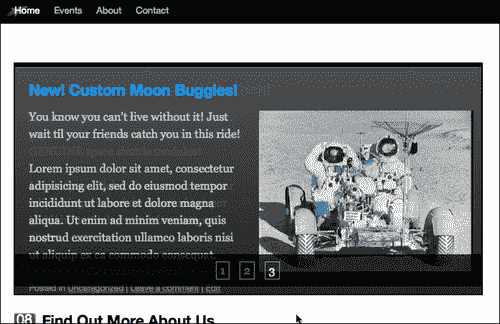

# 总结

你现在已经是使用 jQuery 处理动画的专家了！通过这些示例，你可能会发现几种方法来进一步增强你的 WordPress 站点。你现在应该知道如何：

+   使用动画引导用户注意关键信息

+   生成动画条形图

+   创建一些非常流畅、带有动画的页面导航

+   开发旋转便签

接下来，让我们看看 jQuery UI 插件以及它如何使 WordPress 站点受益的许多方法。
