# 第六章：WordPress 和 jQuery 的 UI

我们现在准备好去看看 jQuery 最受欢迎的插件了：UI。当然，UI 代表**用户界面**。jQuery UI 插件简化了已经通过 jQuery 简化的许多最受欢迎的任务。我知道，很难想象它会变得更简单，但这正是这个插件所做的。最重要的是，虽然增强的效果很好，但 UI 插件提供了界面小部件以及一种简单的方式来对其进行样式化或“主题化”，而无需编写特定的界面元素代码，如选项卡、对话框等等。

在本章中，我们将：

+   快速了解 UI 插件的内容和入门方式

+   学习如何将 jQuery UI 小部件应用到我们的 WordPress 站点中，使其更加直观、易于理解内容，并鼓励用户采取行动。

+   学习如何使用常见的 WordPress 功能实现流行的 UI 功能和小部件

让我们开始吧。

# 了解 jQuery 的 UI 插件

您可以访问 [`www.jqueryui.com`](http://www.jqueryui.com) 了解 jQuery UI 插件的使用方法。

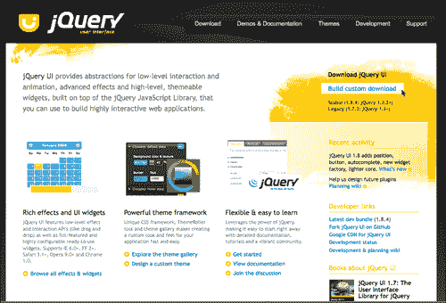

UI 插件提供了一组标准化的小部件、交互和效果。让我们详细看看每种类型的提供内容。

## 小部件

jQuery 中的“小部件”一词与 WordPress 的小部件有些不同，WordPress 的小部件是设计成在主题的侧边栏中很好地显示的小插件。在 jQuery 的 UI 插件中，小部件描述了一组完整功能的用户界面控件，这些控件在项目中通常是必需的，并由 jQuery 开发人员创建。UI 小部件为 jQuery 开发人员节省了大量时间，他们不再需要编写 jQuery 语句和链接函数来创建相同的界面和效果。以下是 jQuery UI 提供的界面小部件：

+   **手风琴**：此小部件通过点击每个部分的标题来展开和折叠被划分为逻辑部分的内容。在任何给定时间只能打开一个部分。

+   **自动完成**（1.8+）：这是 1.8 版本中提供的新功能。**自动完成**小部件在您输入时提供建议。建议源以基本的 JavaScript 数组形式提供。

+   **按钮**（1.8+）：1.8 版本中的新功能是**按钮**小部件。这使您可以采用不同类型的标记并将 UI 的按钮样式和功能应用于它。

+   **日期选择器**：**日期选择器**小部件可以应用于标准表单输入字段。聚焦输入字段会在一个小叠加层中打开一个交互式日历。

+   **对话框**：此小部件是页面内的一个叠加层。它有一个标题栏和一个内容区域，并且可以通过默认情况下的“x”图标或通过传递给它的额外按钮参数来移动、调整大小和关闭。

+   **进度条：** **进度条** 小部件旨在通过传递给它的值参数简单显示当前进度完成的百分比。它默认缩放以适应其父容器内。

+   **滑块：** jQuery UI **滑块** 小部件将对象（例如空的`div`标签）转换为滑块。有各种选项，例如多个手柄和范围，然后可以将其传递给其他对象和函数。您可以使用鼠标或箭头键来更改滑块的位置。

+   **选项卡：** **选项卡** 小部件用于将内容分成多个部分，可以通过单击选项卡标题来交换，以节省空间，就像手风琴一样。

## 交互

jQuery UI 交互采用了一组更常见的复杂 jQuery 行为，开发人员通常需要为项目创建，然后将它们打包成方便易用的函数，如下所示：

+   **可拖动：** 这种交互使所选元素可通过鼠标拖动。

+   **可放置：** 这种交互与可拖动元素配合使用，并使所选元素可放置（即它们接受可拖动元素放置在其上）。

+   **可调整大小：** 这种交互通过在对象上添加可视的“手柄”使所选元素可调整大小。您可以指定一个或多个手柄，以及最小和最大宽度和高度。

+   **可选择：** 这种交互允许通过在元素上用鼠标拖动“套索”或框选来选择元素。

+   **可排序：** 这使所选元素可通过鼠标拖动进行排序。

## 特效

主要特点是`.effect()`函数，但 jQuery 中可用的标准动画函数和快捷方式都已经通过 jQuery UI 插件的“效果核心”进行了增强。该核心还包括对颜色、动画的能力，还包括额外的缓动选项；因此，如果将其包含到项目中，您将不再需要之前我们一直在使用的 Color 或 Easing 插件。jQuery 效果包括：

+   **效果：** 此函数允许您为任何对象分配来自 15 种效果中的一个。

+   **显示：** 这种增强型显示方法可选择接受 jQuery UI 高级效果。

+   **隐藏：** 这种增强型隐藏方法可选择接受 jQuery UI 高级效果。

+   **切换：** 这种增强型切换方法可选择接受 jQuery UI 高级效果。

+   **颜色动画：** 我们在第五章中学到的 Color 插件被包含到 jQuery UI 效果核心中。同样，它简单地扩展了`animate`函数，以便能够同时动画化颜色。

+   **添加类：** 将指定的类添加到一组匹配元素中的每个元素，可选择在状态之间进行可选的过渡。

+   **删除类：** 从一组匹配元素中删除所有或指定的类，可选择在状态之间进行可选的过渡。

+   **切换类：** 如果不存在指定的类，则添加指定的类，并在存在指定的类时删除指定的类，使用可选的过渡。

+   **切换类：** 从第一个参数中定义的类切换到第二个参数中定义的类，使用可选的过渡。

## WordPress 中捆绑的 jQuery UI 插件版本

大多数 jQuery UI 插件的主要**小部件**和**交互**核心都捆绑到了你的 WordPress 安装中。如果你正在使用 WordPress 2.9.2，你已经捆绑了 jQuery 1.3.2，并且 UI 插件核心是 1.7.1，并且你还可以使用以下 jQuery UI 小部件和交互：**对话框、可拖动、可放置、可调整大小、可选择、可排序**和**选项卡**。

如果你正在使用 WordPress 3.0+，你的安装中已经捆绑了 jQuery 1.4.2，并且捆绑了 UI 核心 1.7.3。同样，这是与上一段提到的相同的小部件和交互。

如果你想利用 UI 插件的*效果*，或者如果你正在使用 jQuery 1.4.2 并想利用 UI 插件的 1.8+ 功能，你需要通过从 jQuery UI 网站或 Google 的 CDN 单独下载 UI 插件版本 1.8+ 的副本。

## 从 jQuery UI 网站挑选和选择

从 jQuery UI 网站下载的优点是你可以为你的项目挑选你需要的内容。如果你去下载页面[`www.jqueryui.com/download`](http://www.jqueryui.com/download)，你会在右侧看到可以选择版本**1.7.3**或**1.8.4**并单击**下载**按钮；这将给你一切。

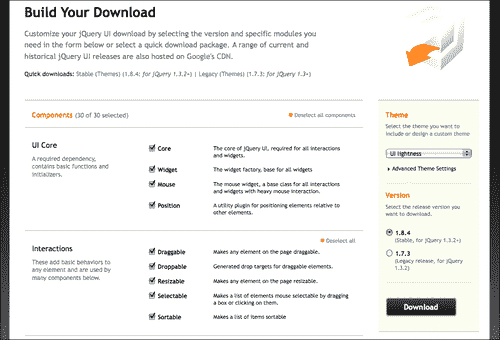

为了开发目的，你可以直接下载整个文件。ZIP 文件超过 4 MB，但其中包含一个充满示例和文档的开发捆绑目录；这些内容都不会加载到你的项目中。

选择所有选项后，你加载到 WordPress 项目中的实际 UI 插件的 `.js` 文件约为 200 KB，根据你从网站选择了什么或者你如何自己创建，你可以添加大约另外 100 KB 到项目中的 CSS 主题中。如果你确切地知道你要使用哪些功能，你可以通过只选择你想要使用的内容来减少一些千字节。

下载页面很棒，因为它不会让你取消选择依赖于你选择的另一个功能的任何内容，而你想要使用它。这是一个关于选择你需要的东西的警报的截图：

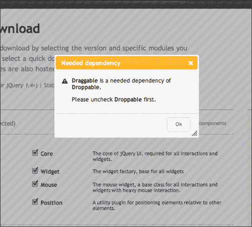

### 提示

**确保下载与你的 jQuery 版本相匹配的正确 UI 插件版本！**

如果你的项目使用的是 WordPress 2.9.2，捆绑的版本是 jQuery 1.3.2，所以你需要确保下载 UI 插件版本 1.7.3。如果你使用的是 Google CDN 或你自己的 jQuery 下载版本是 1.4+，你可以下载并使用 jQuery UI 插件版本 1.8+。

## 让它看起来正确：简易 UI 主题化

无论你从哪里引入 UI 插件，你自己的下载，Google CDN，还是 WordPress 捆绑的 UI 选项，你都需要为其提供自己的样式。你可以在你的项目中包含许多出色的主题，或者轻松地自己“创建”一个以最好地匹配你站点设计的主题。

在 jQuery 的 UI 网站上从导航栏中选择 **Themes**，或者访问：[`jqueryui.com/themeroller/`](http://jqueryui.com/themeroller/)。

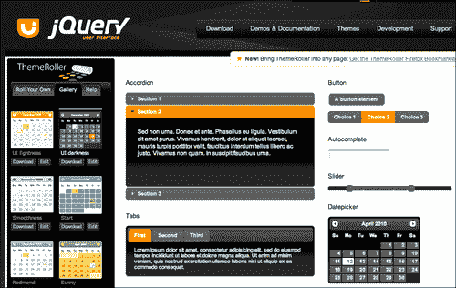

你可以直接调整生成的主题的 CSS 样式表，或者简单地在你的 WordPress 样式表之前加载 jQuery UI 样式表。在 Firefox 中使用 WebDeveloper 的 **Toolbar** 或 **Firebug**，可以很容易地查看 UI 生成的样式并在主 WordPress 样式表中覆盖它们。

## 将 jQuery UI 插件功能包含到你的 WordPress 站点中

到目前为止，你应该已经非常熟悉将 jQuery 插件包含到你的 WordPress 站点中。因为 UI 插件的 *特定组件* 已经捆绑在 WordPress 中，我们将以几种不同的方式讨论将它们包含到你的项目中。

### 从 WordPress 的捆绑包含 jQuery 的 UI

WordPress 捆绑的 jQuery 的 UI 插件被拆分成单独的 `.js` 文件。你首先必须在你的项目中注册 UI 核心文件，以及你想要包含在项目中的每个小部件或特定交互。再次强调，唯一可用的小部件和交互是：**Dialog、Draggable、Droppable、Resizable、Selectable、Sortable** 和 **Tabs**。

在你的 WordPress 主题中注册核心：

```js
...
<?php
if (!is_admin()) {//checking for is_admin makes sure that the UI doesn't load in admin
//adding array('jquery') means the ui-core requires jquery
wp_enqueue_script("jquery-ui-core", array('jquery'));
}//end of is_admin
?>
...

```

然后，注册你想要的特定小部件：

```js
...
<?php
if (!is_admin()) {//checking for is_admin makes sure that the UI doesn't load in admin
//requires jquery AND the ui-core
wp_enqueue_script("jquery-ui-dialog",
array('jquery','jquery-ui-core'));
}//end of is_admin()
?>
...

```

只需重复上述代码以添加额外的小部件。小部件 `.js` 文件名称如下：

```js
jquery-ui-tabs
jquery-ui-sortable
jquery-ui-draggable
jquery-ui-droppable
jquery-ui-selectable
jquery-ui-resizable
jquery-ui-dialog

```

### 注意

再次，WordPress 的捆绑 JavaScript 的完整列表可以在 Codex 中找到：[`codex.wordpress.org/Function_Reference/wp_enqueue_script`](http://codex.wordpress.org/Function_Reference/wp_enqueue_script)。

### 从 Google CDN 包含

你可以非常类似于通过 Google CDN 包含 jQuery，包含 jQuery 的 UI 插件。UI 插件路径是：[`ajax.googleapis.com/ajax/libs/jqueryui/1.8.0/jquery-ui.min.js`](http://ajax.googleapis.com/ajax/libs/jqueryui/1.8.0/jquery-ui.min.js)。注意这里的粗体版本号。你可以将它更改为你需要的 UI 插件版本。如果你使用的是 jQuery 版本 1.3.2，请确保目标是 1.7.2。如果你使用的是 1.4.2，你可以选择 1.8.0。

让我们回顾一下如何使用 `wp_register_script` 来调用从捆绑包或从 Google 的 CDN 可用的脚本：

```js
...
if (!is_admin()) {//checking for is_admin makes sure that UI doesn't load in admin
wp_deregister_script( 'jquery-ui-core' );
wp_register_script( 'jquery-ui-core', 'http://ajax.googleapis.com/ajax/libs/jqueryui/1.8.0/jquery-ui.min.js');
/*this brings over the entire 1.8 core and all widgets, interactions and effects from the Google CDN*/
}//end of is_admin
...

```

您应该注意，虽然我们正在注销捆绑的 `jquery-ui-core` 文件，但我们从 Google CDN 加载的是 *完整的* jQuery UI 插件，可以访问其所有小部件、交互和效果。最好在您的代码中添加注释，以便其他开发人员知道他们无需在项目中注册单独的小部件和交互。

### 从您的主题或插件目录加载您自己的自定义下载

如果您已将 UI 包含到您的主题或插件目录中，您将通过以下方法重新加载，再次使用 `wp_enqueue_script`：

从主题中包含 UI 插件的本地副本：

```js
...
if (!is_admin()) {//checking for is_admin() makes sure that UI doesn't load in admin
wp_enqueue_script('jquery-ui-1.8.custom.min', get_bloginfo('stylesheet_directory') . '/js/jquery-ui-1.8.custom.min.js', array('jquery'), '20100410' );
}//end of is_admin()
...

```

同样，在脚本末尾添加 `array('jquery')`，这让 WordPress 知道 jQuery 是必需的，以防尚未注册。

要从 WordPress 插件中包含 UI 插件的本地副本，请使用以下 `wp_register_script` 函数：

```js
...
function myPluginFunction(){
if (!is_admin()) {//checking for is_admin makes sure that the UI doesn't load in admin
wp_register_script('jquery-ui-1.8.custom.min',
WP_PLUGIN_URL . '/js/jquery-ui-1.8.custom.min.js');
}//end of is_admin
}//end of myPluginFunction()
add_action('wp_head', 'myPluginFunction');
...

```

### 不要忘记您的样式！

无论您从哪里获取 UI 插件，WordPress、Google 的 CDN 还是您自己的下载，您都需要为 UI 插件包含 CSS 样式。如果之前没有玩过主题设置器，请返回并进行操作。选择一个主题或修改其中一个主题使用主题设置器，或者从头开始创建自定义的主题，以创建与网站现有设计相匹配的小部件。

完成后，您可以选择您的主题或自定义的主题并将其放置在您的主题或插件目录中。请确保包含随主题提供的图片目录。然后，您可以将其包含在`header.php` 主题文件中或使用我们之前使用的 `wp_enqueue_style` 函数将其包含到插件或主题中，通过 `functions.php` 页面：

要直接在您的 WordPress 主题中直接包含 UI 主题，请使用以下链接：

```js
...
<link rel="stylesheet" href="<?php bloginfo('stylesheet_directory'); ?>/js/smoothness/jquery-ui-1.8.custom.css" type="text/css" media="screen" />
...

```

从主题的 `functions.php` 页面使用 `wp_enqueue_style` 将 UI 主题包含到 WordPress 主题中：

```js
...
<?php
function addUIstyles(){
wp_enqueue_style('ui-theme', bloginfo('stylesheet_directory')
'/js/smoothness/jquery-ui-1.8.custom.css', array('style'), '1.0', 'screen');
}
add_action('init', 'addUIstyles');
?>
...

```

将 UI 主题包含到 WordPress 插件中使用 `wp_enqueue_style` 与上面的示例类似，但请确保使用 `WP_PLUGIN_DIR` 以定位您的插件目录。

```js
...
wp_enqueue_style('ui-theme', WP_PLUGIN_DIR .
.'/js/smoothness/jquery-ui-1.8.custom.css',
array('style'), '1.0', 'screen');
...

```

# 使用 jQuery UI 增强效果

您可能会认为在选择主题或创建自定义主题后，我们会立即开始使用小部件。我们会的！但是，在我们从 第五章 中仍然清楚地记得动画和交互的时间内（尽管，如果您在跳来跳去，不用担心），您会感兴趣了解，设置大部分那些动画和效果是这么容易，事情可以变得更加引人注目很多次，使用 UI 插件。

首先，目前 *这些效果未捆绑* 在 WordPress 中。因此，为了使用这些 UI 效果，您需要通过您自己的下载或从 Google CDN 导入 UI 插件。

## 轻松制作效果

插件所做的是添加一个名为`.effect()`的新函数，提供了大约 15 个新的、时髦的动画效果。特别是，`blind`，像百叶窗一样卷起物体；`shake`，稍微晃动一下；以及`explode`，它成功地“打破”了对象并将其片段分散在几个方向上。

让我们在鼠标悬停在标题上时对我们的文章应用`shake`效果。除了在我们的 WordPress 项目中注册和/或包含必要的 jQuery 和 jQuery UI 插件文件之外，你还应该将一个`custom-jquery.js`文件包含到你的主题中以使用。完成这些步骤后，包含以下代码：

```js
jQuery(function(){
jQuery(".post h2").hover(function(){
jQuery(this).effect('shake', 200);
}, function(){
jQuery(this).effect('shake', 200);
});
});

```

你可以（在某种程度上）在以下截图中看到这个效果：

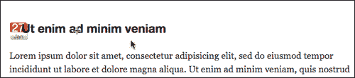

## 缓动同样容易

除了`.effects`函数外，UI 插件还*扩展了* jQuery 的现有`.animate`函数以及快捷函数，例如`.hide, .show, .toggle, .addClass, .removeClass`和`.toggleClass`。与我们在第五章中介绍的优秀的缓动插件（由*罗伯特·彭纳*引入）一起，*在 WordPress 中使用 jQuery 动画*。因此，如果你使用 jQuery UI 插件并将效果核心包含在下载中，那么在项目中单独包含缓动插件是没有必要的。

## 使用 jQuery UI 进行颜色动画

除了包含的缓动插件外，jQuery UI 还内置了颜色动画插件。在第五章，*在 WordPress 中使用 jQuery 动画* 中，我们使用了与我们的 WordPress 安装捆绑在一起的 Color 插件。但是，如果你打算使用已下载的版本或 Google CDN 版本的 UI 插件，就像使用缓动插件一样，你就不需要单独使用或从 WordPress 捆绑包中注册它了。

为了在我们的项目中测试它，我们没有注册 Color 插件，但正在引用我们下载的 UI 插件版本 1.8，让我们应用`easeOutBounce`缓动选项来动画化我们标题文本的颜色：

```js
...
jQuery(".post h2").hover(function(){
jQuery(this).animate({'backgroundColor':'#ccccff'}, 2000,
'easeOutBack');
}, function(){
jQuery(this).animate({'backgroundColor': '#999999'}, 2000,
'easeOutBack');
});
...

```

然后，它会动画到浅蓝色，如下截图所示：

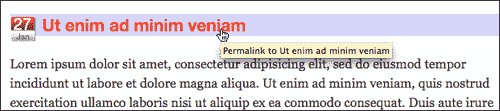

然后，回到灰色：

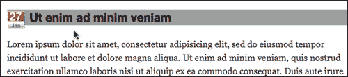

你注意到，在 jQuery UI 插件的效果核心中使用颜色动画和缓动功能与使用独立的 Color 动画或缓动插件没有区别。同样，除了哪个版本更方便和有用外，即独立插件还是 UI 插件，应该没有任何区别，对你的 WordPress 项目而言。

# 提升 WordPress 站点的用户界面

我们可以看到 jQueryUI.com 上的 UI 演示确实看起来很酷，但是既然我们已经将 UI 插件加载到我们的项目中，那么我们如何真正地在 WordPress 项目中使用这些功能呢？不同类型的界面可以帮助我们更轻松地组织和关联各种类型的信息，并减少混淆。WordPress 的主题 API 允许以逻辑块的形式在网站设计中显示各种类型的信息，主要是帖子和列表。让我们看看我们是否可以使用 UI 功能来增强其中的任何信息。

我们已经看到 UI 插件提供了：手风琴、选项卡、对话框、日期选择器，以及实现拖放和排序的简单方法。此外，如果您使用的是最新版本，即 1.8 或更高版本（本章示例使用的是），还有像**自动完成**和**按钮**这样的酷炫小部件。让我们再假设有另一个客户，并看看一些小的界面增强如何帮助他们的网站。

## 项目：将帖子转换为选项卡

你可能最近在网站上看到越来越多地使用选项卡。在您的网站中使用选项卡的主要原因是，它允许用户轻松地一次查看一组相关内容（这就是为什么“选项卡样式”网站导航也很受欢迎的原因）。作为设计师，它还允许您将内容放入一个方便的模块中，节省宝贵的屏幕空间。

在我们的第五章中，*在 WordPress 中使用 jQuery 动画*，我们学会了如何堆叠置顶帖子，使它们以幻灯片方式旋转。虽然对不相关的内容进行动画处理很有效，以确保每个人都能一瞥，但将内容加载到选项卡中意味着内容是相关的，是的，您还想节省空间，也许将信息放在折叠部分之上，以便用户更有可能接受它。

你最新的假设性客户有三个与了解他们公司相关的信息。这些内容变化不大，但他希望网站的用户能够在一开始就获得信息概览，并有下载白皮书的选项，而无需滚动。

客户已经在他的网站上有了这些内容。这些帖子被分配到一个名为**我们的结构**的唯一类别中。这些帖子现在已经相当陈旧，甚至在网站的主页上都没有显示出来，所以客户一直在手动在网站的各个其他页面中链接到这些帖子的永久链接。

要开始，我们决定从 WordPress 主题中获取一点帮助会对我们有所裨益。

### 在 WordPress 主题中设置自定义循环

让我们从进入客户主题开始，并设置一个仅从 **我们的结构** 类别中提取的循环。然后，使用 jQuery UI，我们将以一组选项卡的形式显示这些帖子，这样大部分内容都可以在“折叠”部分查看，确保站点访问者可以首先获得组织的最重要信息概述，而一般的帖子项目将会在下方流动。

首先，在 `index.php` 页面中，我们将创建一个新循环，在现有的仅显示 **我们的结构** 类别的 `loop.php` 包含之上。不过，在我们这样做之前，我们将转到 jQuery UI 网站，并查看选项卡设置的演示：[`jqueryui.com/demos/tabs/`](http://jqueryui.com/demos/tabs/)。

本质上，我们看到演示选项卡具有列出标题的 `ul`，包裹在调用指向内容 `div` 的 `href` 的锚点中。这意味着我们的主题实际上将需要 *两个* 自定义 WordPress 循环来适应此小部件。

我们将在我们的 `index.php` 模板文件中设置它们，就在我们的主要内容 `loop.php` 包含的上方，*在*我们正在使用的主题中的 `#content` div 内部，这是默认主题。第一个循环将设置我们的自定义 `#ourStructure` div，其中包含标题的 `ul` 列表：

```js
...
<div id="ourStructure">
<ul>
<?php//start custom loop
//get posts in the proper category
$postList = get_posts('category=4');
foreach($postList as $post):
setup_postdata($post);
?>
//set up a list item with a unique anchor link
<li>
<a href="#post-<?php the_ID(); ?>">
<?php the_title(); ?></a>
</li>
<?php endforeach; ?>
</ul>
<!--//second loop goes here-->
</div><!--//end of ourStructure-->
...

```

接下来，在上一个循环之下，但仍在 `#ourStructure` div 内部，我们将再次运行循环，现在专注于帖子的标题和内容，如下所示：

```js
...
<!--//second loop goes here-->
<?php
//again, call correct category
$postContent = get_posts('category=4');
foreach($postContent as $post):
setup_postdata($post);
?>
//assign a unique ID to div
<div id="post-<?php the_ID(); ?>">
<h2><?php the_title(); ?></h2>
//add content:
<div class="entry">
<?php the_content('Read the rest of this entry &raquo;'); ?>
</div>
</div>
<?php endforeach; ?>
</div><!--//end of ourStructure-->
...

```

这给我们带来了一个看起来像下一个屏幕截图的结果。虽然不是非常漂亮，但它是功能齐全的，而且肯定能将重要信息展示出来，并允许用户链接到 `id` 实例的锚点名称。

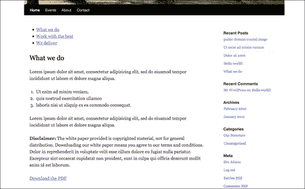

然后，我们将使用 jQuery 的 UI 选项卡增强该标记，如下所示，通过针对 `#ourStructure` div，我们在我们的 `custom.js` 文件中设置以下 jQuery 语句：

```js
...
jQuery("#ourStructure").tabs();
...

```

是的。难以置信，但多亏了 WordPress 的灵活性和我们使主题为我们完成的工作，这就是我们需要的 *全部* jQuery！

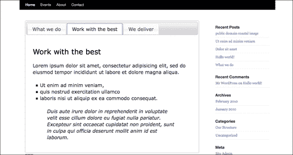

不错！现在内容使用我们选择的 jQuery UI 主题 "Smoothness" 包含在顶部（再次强调，我们正在使用撰写本书时随 3.0 一起提供的默认 WordPress 主题）。让我们看一些 UI 插件的其他用法。

### 使用 jQuery 完全实现选项卡

通过调整 WordPress 主题，我们实现了上述选项卡方案，包括在 HTML 中包含标题的 `ul` 列表，然后在下面使用 div 标签包裹帖子内容。这样做很有效，因为它生成了一个 `ul` 列表，其中包含指向锚点名称的 `href` 链接，即使在未启用 JavaScript 的浏览器中，仍然可以呈现内容并正常工作。

但是，对于其他情况，例如 WordPress 已经呈现您需要的内容（例如，一篇帖子或页面中已经包含了一组`h2`或`h3`标题和内容），或者您只是无法编辑主题，可能更容易通过在前面应用一点 jQuery 来生成 UI `.tab`功能所需的 DOM 对象。

对于在单个页面或 WordPress 帖子中添加的`h3`标题和`p`段落标签的列表，我们仍然可以将该内容包装在 UI 标签小部件中。

下一张屏幕截图描述了**关于**页面，其中已经包含了所有内容；我们只需“调整”它以尽可能满足 jQuery UI 标签的要求：

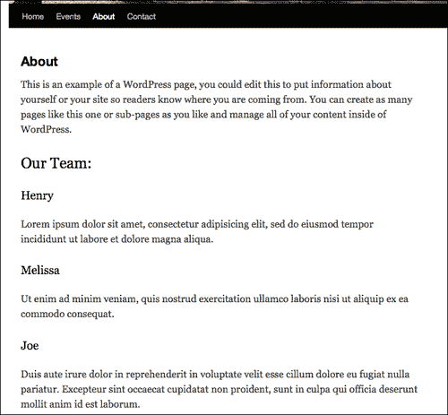

首先，我们将目标页面。WordPress 也可以输出唯一的页面 ID 以及一系列类名；您将不得不在浏览器中查看 WordPress 主题的 HTML 输出的**查看源代码**，看看主题是否利用了这个功能（大多数良好的 WordPress 主题都会这样）。这种能力可以帮助我们仅针对我们想要影响的内容进行定位。例如，如果我们只想增强我们的**关于**页面，我们可以查看源代码，并看到帖子的唯一 ID 是`#post-104`。这样我们就可以通过首先在`ul`标题列表前面添加一个`ul`列表来定位我们想要添加标签的帖子。

一旦我们有了`ul`列表，我们需要将所有内容包装在一个新的、可选的带有 ID 为`#aboutUs`的 div 中。然后，我们将循环遍历每个`h3`项，创建带有锚链接的单独的`li`列表项，并将每个后续的`h3`和`p`标签都包装在其自己的带有锚点命名的`id`div 中。

阅读代码中的粗体注释以便跟踪：

```js
...
//add in a ul list on the About page only, before the first h3
jQuery("#post-104 h3:first").before("<ul></ul>");
//select the ul, the h3's AND the h3's p tags
//and wrap them in a new div
//use the .add() function to make sure everything is selected
jQuery("#post-104 ul").add("#post-104 h3")
.add("#post-104 h3+p").wrapAll("<div id='aboutUs'></div>");
//for EACH h3 item:
jQuery("#post-104 h3").each(function(i){
//add text to the ul list w/ anchor links
var titleTxt = jQuery(this).text();
var htmlTxt = "<li>
<a href='#name-"+i+"'>"+titleTxt+"</a></li>";
jQuery("#post-104 ul").append(htmlTxt);
//wrap each h3 AND p in a div with anchor names
//this time, use .andSelf to make sure everything is selected
jQuery(this).next("p").andSelf()
.wrapAll("<div id='name-"+i+"'></div>");
});
//remove .entry class so list items don't have right quotes
//this is a list style in the default theme
jQuery("#post-104 .entry").removeClass('entry');
//Last, create the tabs widget
jQuery("#post-104 #aboutUs").tabs();
...

```

现在刷新页面显示如下：

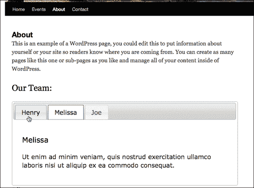

再次强调，您对 WordPress 主题和 jQuery 的了解越多，您就越能决定哪种路线在决定是否操纵主题以帮助您的 jQuery 增强功能，或者是否更好地使用纯 jQuery 方面更快或更好。。

## 项目：使边栏成为手风琴

手风琴几乎具有与标签相同的功能。大多数情况下，它们只是垂直而不是水平的。与标签一样，您将希望将它们用于将相似的信息组合到一个更整洁的空间中，从而使站点用户能够按逻辑块查看信息，而不必沿着站点或滚动条向下浏览。

在我们一直使用的默认主题中，边栏上的页面导航有一些信息，我们希望人们能够一目了然地看到，并且不会将标题推到可能错过它们的地方。通过将各节分组成可以展开并显示附加信息和链接的手风琴，我们可以节省一些空间，并确保当页面加载时用户至少可以看到重要的组织标题，并知道可能需要展开并查看更多信息。

手风琴小部件与列表非常配合，这就是侧边栏的用途。正如您可以通过[`jQueryUI.com/demos/accordion`](http://jQueryUI.com/demos/accordion)的示例代码看到的那样，该小部件识别并与一致的、分层次顺序设置的标题和段落或 `div` 标签一起工作。您还可以使用各种选项将特定的 DOM 对象设置为标题和导航元素。

我们默认主题的 WordPress 侧边栏是一个大的 `ul` 列表，位于一个 `div` 内。这对手风琴小部件来说是完美的，但由于我们设置了一些自定义 CSS，使页面列表显示更像导航按钮，我们想要针对导航列表项 *下面* 的下两个列表进行定位。不用担心，很容易选择并应用手风琴小部件到下列项目中，如下所示：

```js
...
//select the proper li level and exclude the inner ul lists then wrap in a targetable div
jQuery(".xoxo ul li:gt(10)").not(".xoxo ul li ul li")
.wrapAll('<div id="sideAccordion"></div>');
//select the new target and assign the widget
jQuery('.xoxo').accordion().css({'marginTop':'30px'});
...

```

小部件的默认状态是显示顶部手风琴打开。客户希望它完全关闭。为了实现这一点，我们将向小部件添加一些参数，包括 `active: -1`，通常用于选择要打开的条，但通过将其设置为 `-1`，它们都将关闭：

```js
...
jQuery('.xoxo')
//options for the accordion
.accordion({header: 'h2', collapsible: true, active: -1})
.css({'marginTop':'30px'});
//last, some extra styles to the headers and ul lists
//to line them up
jQuery(".xoxo h3")
.css({'padding':'5px 0 5px 25px', 'height':'15px'});
jQuery(".xoxo ul").css({'height': 'auto', 'margin': '0px',
'paddingLeft': '25px', 'paddingTop': '5px',
'paddingBottom': '5px'});
...

```

我们页面导航下的侧边栏现在以一种漂亮的样式成为手风琴式，与我们页面的标签相匹配。

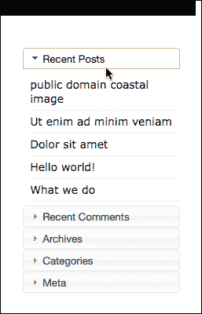

当页面加载时，这些手风琴标题是关闭的，这样网站用户就可以选择要探索的内容。

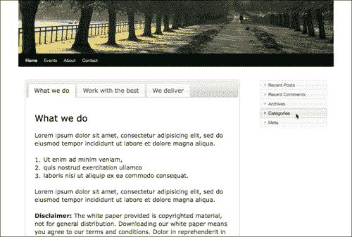

现在让我们继续进行我们客户的最后一个增强。

## 项目：向下载按钮添加带图标的对话框

对话框是提醒和引导人们注意非常重要信息的好方法，确保他们理解下一步需要采取的步骤，以及确认操作。

我们的客户对主页的选项卡信息和精简的手风琴侧边栏非常满意。他们只需要进行一个增强。主页上的第一个选项卡提供了一个关于他们的方法、产品以及各种用途信息的白皮书的 PDF 下载。正如您可以从下一个截图看到的那样，客户希望用户了解他们正在下载有版权的信息，并且该文档不能自由分发。

正如您可以在接下来的截图中看到的那样，他们在 PDF 文件的下载链接之前放置了一些免责声明语言：

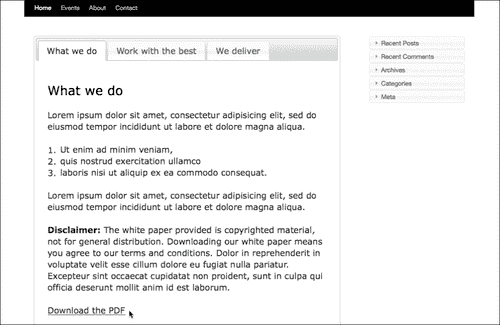

一般来说，这就是他们的法律部门声称他们需要的全部，但他们希望更清晰一些。我们可以通过使用按钮小部件使下载过程更加突出，并将以前的 **免责声明** 文本变成对话框来进一步增强这一下载过程。用户随后必须在对话框上选择 **同意** 才能继续 PDF 下载，客户可以放心，通过启用 JavaScript 的浏览器下载他们的白皮书的大多数人肯定意识到免责声明。

首先，让我们设置好将 **免责声明** 文本放在我们的对话框内。我们将定位段落并如下所示应用对话框小部件：

```js
...
//select p that contains the disclaimer text
jQuery("#post-98 p:contains(Disclaimer:)")
.wrapAll("<div id='disclaimer'></div>");
//create the disclaimer dialog widget
jQuery("#disclaimer").dialog();
...

```

如果重新加载页面，您会看到 **免责声明** 文本现在以对话框的形式出现如下：

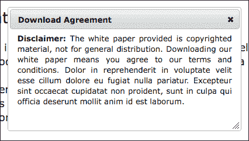

对话框的默认设置是将文本“居中”对齐。对于单行文本来说很好，但我们的段落看起来有点奇怪，所以我们已经向我们的 `.wrapAll` HTML 添加了样式，如下所示：

```js
...wrapAll("<div id='disclaimer' style='text-align:justify'></div>");...

```

接下来，我们真的不希望对话框立即出现，所以我们将其选项 `autoOpen` 设置为 `false`。我们还希望确认按钮出现，以及对话框顶部栏上的标题。对话框小部件还可以容纳按钮，所以我们将它们添加进去，并为其添加功能，如下所示：

```js
...
//create the disclaimer dialog widget
jQuery("#disclaimer").dialog({
//set the dialog to close
autoOpen: false,
//set the title
title: 'Download Agreement',
// set up two buttons
buttons: {
//activates the URL placed in the a href
"I Agree": function() {
//get the URL of the PDF
var pdfFile = jQuery("#post-98 a").attr('href');
//direct the browser to that URL
window.location.href = pdfFile;
},
//close the dialog box
"Close" : function() {
jQuery(this).dialog("close");
}
},
});
...

```

上面的方法效果很好——或者至少我们认为是这样。现在对话框的 `autoOpen` 选项已设置为 `false`，我们无法确定！我们需要 **下载 PDF** 链接来启动对话框，顺便说一句，我们需要确保链接的 `href` 不会触发 PDF 下载。

如果你有在关注，你可能已经准备好使用 `.removeAttr()` 函数从链接中移除 `href` 属性并使其无效。这是一个好主意；然而，在前面的代码片段中，我们引用了链接的 `href` 属性。该引用直到对话框出现后才会触发，这意味着在我们将其从对象中移除之后，我们的 `window.location.href` JavaScript 将不知道要去哪里。

我们最好使用另一个称为 `preventDefault()` 的出色函数，它将保留链接的所有属性，但阻止其像点击链接一样操作。让我们添加这个新的链接功能：

```js
...
jQuery("#post-98 a")
//set up a click function on the link
.click(function(event){
//open the dialog box
jQuery("#disclaimer").dialog("open");
//ensures that the link to the href is disabled
event.preventDefault();
});
...

```

最后，在刷新页面并查看之前，让我们先把 PDF 下载链接变得更“可点击”一点。因为我们使用的是来自 Google CDN 的 jQuery 版本 1.4.2，以及 jQuery UI 插件的 1.8 版本，我们可以通过选择链接并为其添加按钮小部件来实现这一点。

### 注意

如果您没有使用 UI 插件的 1.8 版本，则此步骤是可选的。您可以简单地使用 CSS 样式或 `.css()` 函数来自定义链接的样式。

我们将简单地在现有的链接选择之后 *链式* 使用 `.button()` 小部件函数，*在* `.click()` 函数之后，如下所示：

```js
...
jQuery("#post-98 a")
//set up a click function on the link
.click(function(event){
//open the dialog box
jQuery("#disclaimer").dialog("open");
//ensures that the link to the href is disabled
event.preventDefault();
})
//add the button widget
.button();
...

```

你可以刷新页面并查看新按钮，如下截图所示：

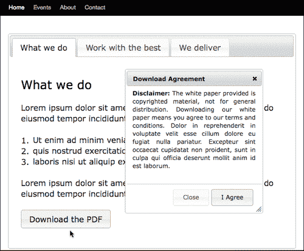

尽管按钮化的链接看起来很棒，但只需稍加努力，再添加一些图标，就可以清楚地表明点击按钮将给人们带来什么，并鼓励他们采取行动。

jQuery UI 插件主题附带一系列 **框架图标**。如果你将 `image` 目录相对于你的 jQuery UI 样式表，你就可以访问它们。

按钮小部件允许将图标放置在“主要”和“次要”位置。主要位置位于按钮左侧，次要位置位于按钮文本之后的右侧。让我们按照以下方式将“circle-arrow-s”图标和“document”图标添加到我们的按钮中：

```js
...
jQuery("#post-98 a")
//set up a click function on the link
.click(function(event){
//open the dialog box
jQuery("#disclaimer").dialog("open");
//ensures that the link to the href is disabled
event.preventDefault();
})
//add the button widget
.button({
//add the icons
icons: {primary:'ui-icon-circle-arrow-s',
secondary:'ui-icon-document'}
});
...

```

一旦人们点击按钮，我们的“标志性”按钮和对话框如下所示：

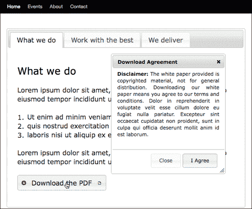

### 小贴士

想找出小部件可用的图标？请查看主题定制器：[`jqueryui.com/themeroller/`](http://jqueryui.com/themeroller/)。在页面底部，你会看到所有框架图标。将鼠标悬停在它们上面将显示它们的 `title` 标签信息，其中包含你要在 jQuery 语句中引用的名称。

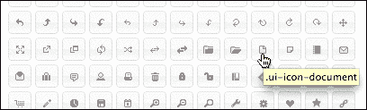

通过此增强功能进行测试的最后一项任务是，点击 **我同意** 将启动下载，如下截图所示，功能正常！

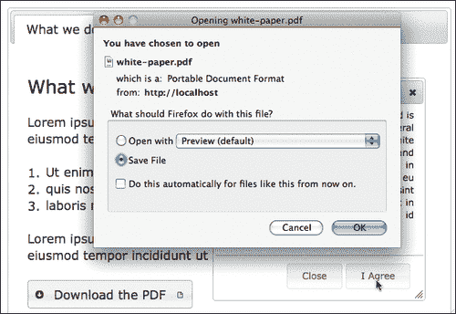

这实际上是向网站添加的大量互动性，同时，它也会很好地降级，而且没有 JavaScript 的情况下也能正常工作。这真是很好地利用了 jQuery 和 jQuery UI 插件。

# 总结

这是我们对 jQuery UI 插件的看法，以及它如何真正有益于 WordPress 网站的一些方式。有数十种，甚至数百种方法，这取决于你的站点或项目及其需求。

请记住，jQuery 在客户端、浏览器中运行，WordPress 为浏览器提供成品 HTML 页面。这意味着你不仅可以增强 WordPress 内容，还可以增强大多数 WordPress 插件，例如 cforms II，大多数边栏小部件应该很容易通过 jQuery 和 jQuery UI 插件来增强。

在本章中，我们看到了：

+   UI 插件及各种在 WordPress 中包含它并开始使用它的方法

+   理解将 UI 元素应用于我们的 WordPress 网站如何使其更直观、更易理解，并鼓励用户采取行动。

+   使用常见的 WordPress 功能实现流行的 UI 功能的常见方法

现在让我们继续下一章，看看如何使用 jQuery 来帮助我们创建 AJAX 交互。
