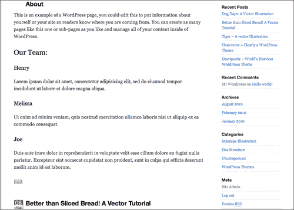
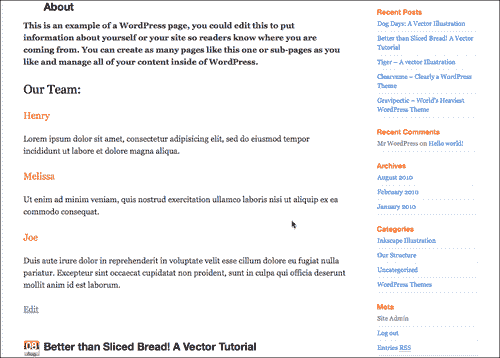
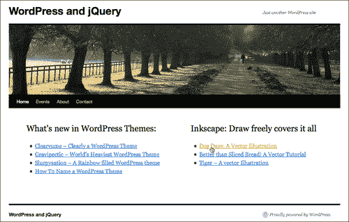
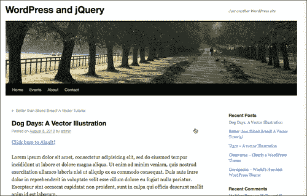
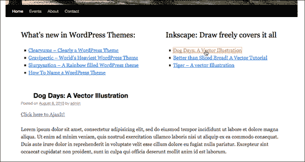
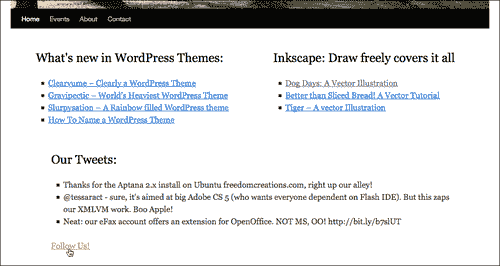
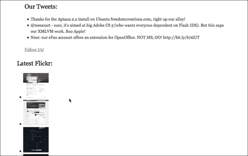
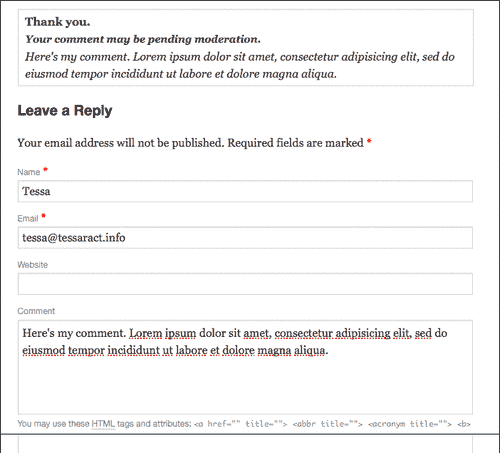
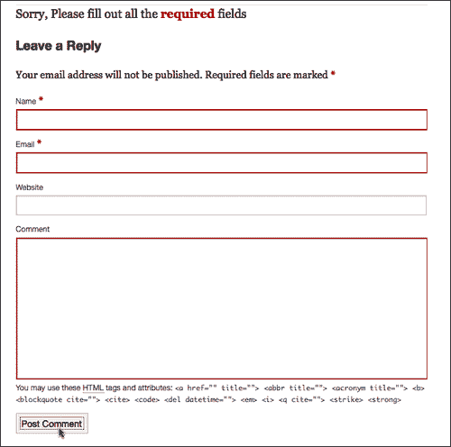

# 第七章：使用 jQuery 和 WordPress 进行 AJAX

AJAX 是 *杰西·詹姆斯·加勒特* 在 2005 年创立的用户体验专家，他是[www.AdaptivePath.com](http://www.AdaptivePath.com)的创始人，AJAX 是一个缩写词。 它很快就变成了一个流行词，其描述性（以及动词性）远远超出了其实际缩写定义。 我们将快速了解 AJAX 究竟是什么，以及它有多容易实现，更不用说为我们的“假想”客户想出更多酷炫的解决方案。

在本章中，我们将重点讨论以下内容：

+   使用 jQuery 的 AJAX `.load()` 函数和更健壮的 `.ajax()` 函数的基础知识

+   使用 JSON 和连接到其他站点的 API

+   创建自定义 AJAX 增强首页和评论表单

+   使用动画和事件来优化该功能

让我们开始看看 jQuery 为 AJAX 做了什么。

# AJAX 是什么，不是什么：一个快速入门

首先，如果您对 AJAX 不熟悉，我只想指出 **AJAX** 其实并不是一种技术或语言！ 这个缩写代表 **Asynchronous JavaScript and XML**。 它是使用 JavaScript 和 XML 在 Web 浏览器和 Web 服务器之间发送和接收数据的技术。 这种技术最明显（也是最酷的）的用途是，您可以通过调用服务器动态更新网页上的一部分内容，而无需重新加载整个页面。

此技术的实施使许多 Web 开发人员明白他们可以开始创建高级 Web 应用程序（有时称为 **Rich Interface Applications(RIAs)**），这些应用程序的工作方式和感觉更像是桌面软件应用程序，而不是网页。

如上所述，AJAX 这个词开始拥有自己的含义（正如您在本书和其他书籍中偶尔看到的一样，以及网络上到处都是的正式名词：“Ajax”，而不是全大写的缩写）。 例如，一个主要使用 Microsoft 技术的 Web 开发人员可能会使用名为 VBScript 的浏览器脚本语言，而不是 JavaScript，来对内容进行排序和显示，这些内容转换成了称为 JSON 的轻量级数据格式，而不是 XML。 你猜对了，该开发人员的站点仍然会被视为 AJAX 站点，而不是 “AVAJ” 站点（承认吧，AJAX 听起来更酷）。

实际上，正如我们在 第五章 中所指出的 *jQuery Animation within WordPress*，现在几乎网站上的任何东西（不是 Flash 中的）都会被视为“具有 AJAX 特性”的网站，包括滑动、移动、淡入、弹出而不会渲染新的浏览器窗口。 实际上，大多数这样的网站并不真正符合使用 AJAX 的标准，如果你在 WordPress 站点中仅使用本书中的几个 jQuery 示例，它可能会被认为是具有 AJAX 特性的，尽管没有异步调用服务器。 但在本章之后，它将是。

# AJAX：使用 jQuery 更好

在过去，当我为 AJAX 撰写介绍或者与我的客户讨论在他们的项目中使用 AJAX 的利弊时，我过去常常为使用 AJAX 技术提供长篇的、深入的免责声明和警告：讲述最坏情况的故事和对于特殊需求用户而言丧失的浏览器功能，更不用说破坏了可访问性。虽然其中一些担忧仍然存在，但使用 jQuery 的“实施恐惧”基本上已经消失了。

就像我们到目前为止学到的所有 jQuery 东西一样，重点是创建出色的*增强功能*，逐渐降级到基本的、可工作的 HTML 功能。只要以 jQuery 深思熟虑地实现了 AJAX 技术，你会发现同样适用。如果你的网站的核心内容或功能可以在浏览器中启用 JavaScript 的情况下访问和检索，你会发现所有用户，无论他们的浏览器或可访问性要求是什么，都应该能够享受你的内容并有效地使用你的网站。你的大部分用户将能够使用你的网站，并且能够使用使网站更易于使用并且甚至可以帮助理解内容的时髦、视觉上令人愉悦的增强功能。

## 评估 AJAX 是否适合你的网站——一个较短的免责声明

当然，除了可访问性和合规性之外，还有一些考虑因素要考虑你网站的用户。尤其是，当你开始意识到 AJAX 技术可以为你的网站带来的强大功能时，你将希望努力遵守*标准网络实践的惯例*。基本上，大多数网络用户希望网页，即使是非常酷的网页，都简单地像网页一样运行！

这并不意味着你不能打破标准惯例，尤其是如果你的网站更像是一个 RIA 而不是一个纯内容网站。只要确保你告诉用户可以期待什么。例如，如果导航面板不在网站的顶部或侧边栏，你需要找到一些方法提前告诉人们它在哪里以及为什么你认为将其放置在那里更加方便。如果你使用的不是下划线和按钮框之类的不同指示符来指示可点击对象，告诉人们要寻找什么，这样他们就知道什么是可点击的，什么是不可点击的。

话虽如此，让我们来看看我们最新一批假设客户向我们提出了什么问题，并开始工作。

# 开始使用 jQuery 的 AJAX 功能

jQuery 的 AJAX 功能的核心是`.ajax()`函数。这个小家伙让你能够完成一些繁重的工作，并且为你所有的**XML HTTP 请求** (**XHR**) 需求提供了一切。

对于那些有一点 AJAX 经验的人来说，你会高兴地发现，这个函数符合 jQuery 的真正形式，它消除了设置传统的`if/else`语句来测试对`XMLHTTPRequest`对象的支持以及如果没有的话，则是对`ActiveXObject`（对于 IE 浏览器）的需要。

## 使用`.ajax()`函数

让我们快速看一下`.ajax`调用中可用的一些功能：

```js
jQuery.ajax({
type: //"GET" or "POST",
url: //"url/to/file.php",
dataType: //"script", "xml", "json", or "html"
data: //a query string "name=FileName&type=PDF"
beforeSend://a callback function
function(){
alert("Starting Request");
}
success: //a callback function
function(){
alert("Request successful");
}
complete: //a callback function
function(){
alert("Request complete");
}
error: //a callback function
function(){
alert("Request returned and error!");
}
});
...

```

例如，在 WordPress 中实现，一个`.ajax()`调用可能是这样的：

```js
...
jQuery(".ajaxIt").click(function(){
//.ajaxIt is a class assigned to link in the first post
jQuery.ajax({
//url to the about page:
url: "/wp-jquery/about/",
data: "html",
success: function(data){
//limit the overflow and height on the first post
jQuery('.post:first')
.css({overflow: "hidden", height: "310px"})
//add in the data
.html(data);
//alert just shows the function kicked off
alert('loaded up content');
}
});
});
...

```

在给定的代码中，当用户在下一张截图中看到的那样点击`.ajaxIt`对象的 jQuery 选择器时，`.ajax`函数将整个**关于**页面加载到第一篇文章的`.post` div 中：


通过改变 div 上的 CSS 属性来隐藏溢出并设置高度，我们可以避免它看起来太凌乱：


就是这样！这是你在 WordPress 中使用 AJAX 的第一次！不过，你可能会想：“为了某事我在现实生活中可能并不想做的事情，这也太费事了。（将整个网站重新加载到一个包括头部在内的 div 中？呃！）”

你说得对。让我们来看看如何在一些更易访问和更有用的功能上快捷操作。

### 缩短路径

你可以看到`.ajax()`函数相当强大和灵活。尽管它很酷，但你可能已经希望有一个快捷方式。不用担心，与我们已经使用过的`.animate()`函数类似，jQuery 已经很好地将一些更“常规”的任务分解成了更易于使用和利用的小函数。以下是对 WordPress 用户最重要的几个：

+   `.load`—你可以通过这个函数进行 POST 和 GET 调用，然后从中提取特定的、经过 jQuery 选择的内容，并将其轻松地塞进其他 jQuery 选择的区域。

+   `.get`—和`.load`类似，但只执行 get 请求。

+   `.post`—和`.load`一样，但专注于 POST 请求。

+   `.getJSON`—允许你拉取 JSON 数据（如果你进行跨站点脚本编写，即从其他 URL 中拉取数据，比如`twitter.com`，那么这是一个好方法）。

+   `.getScript`—允许你启动一个不附加到你的 WordPress 主题的脚本中隐藏的操作。（如果您想添加不希望其他人轻易找到和搜索的功能，这将非常有用，您还可以从其他域中引入 JavaScript 以进行操作。）

在大多数 WordPress 项目中，你会发现你根本不需要使用`.ajax()`函数。你会使用`.load, .post`或`.get`，有时是`.getJSON`或`.getScript`。但是，就像`.animate()`函数一样，偶尔会出现需要`.ajax`函数的灵活性和细粒度控制的情况。

所有这些快捷功能中最有用的，也是我们将重点关注的功能是`.load`函数。

### 指定`.load()`位置

我们可以通过这里简化的代码获得我们在完整的`.ajax()`函数中得到的完全相同的效果：

```js
...
jQuery('.post:first').css({overflow: "hidden",
height: "310px"}).load('about-2/');
...

```

再次，有点酷，代码片段变得简单多了。这就是 AJAX；页面本身不重新加载，但为什么你*想*要这样做呢？（为了避免示例太凌乱，我使用了 `.css` 函数来改变 CSS 属性，隐藏溢出和锁定 `.post` div 的高度。）

这似乎很少有项目会对这有用（如果有用的话，一个`iframe`会实现相同的效果）。我们真正想做的是能够将另一页中的关键内容加载到我们当前页面中。好消息是，我们可以很容易实现：

```js
...
jQuery('.post:first').load('about-2/ #post-104');
...

```

通过扩展 `.load` 函数的 `url` 参数，给定的代码片段将用关于页面**关于**的 `#post-104` div 的内容替换我们的第一个 `.post` div。结果是这样的：



你还会注意到我能够删除 `.css` 函数，因为只有有用的内容被加载进来，清爽而干净。

### 转换加载的内容

假设我们需要转换一些我们加载进来的内容。没问题。有一个基本的“成功”回调函数可用。我们可以这样利用它：

```js
...
jQuery('.post:first').load('about-2/ #post-104', function(){
jQuery('h3').css("color","#ff6600");
jQuery('#post-104 p:first').css("font-weight","bold");
});
...

```



正如你所看到的，内容现在“成为”了我们页面的一部分，并且在 ajaxed 内容中被更改的 DOM 对象集，以及页面上的其他选定匹配项（例如 h3），也随之改变。现在这似乎更有用。我打赌你可以想出很多像这样的功能用途！猜猜——我们的“客户”也可以。

# 项目：使帖子 AJAX 化

假设你有一个客户（放松，这是*最后*一个假设的客户！），他是一位“开源媒体设计师”，想要一个非常简洁和稀少的首页。如此稀少，他只想让两个特定类别中最新帖子的标题列表出现。（在理想的世界中，像这样的决定将确保他们网站出色的设计能在用户面前沉淀下来，然后再向他们提供内容。）

他们当然想要它看起来漂亮。当你点击一篇文章的标题时，它会通过 AJAX 加载，非常流畅。没有重新加载到单独的内容页面。

要开始处理这个请求，我们必须参考我们对模板层次结构和自定义循环的理解。我们将创建一个 `home.php` 模板页面，它将成为默认的主页，仅显示 "WordPress 设计" 和 "Inkscape 插图" 类别中最近的五篇帖子。听起来很简单，让我们开始吧。

首先创建一个名为 `home.php` 的新自定义模板页面，并插入你的 `#content` div 标记以及主题的页眉和页脚（以及其他任何你想要的内容）。

```js
<?php get_header(); ?>
<div id="content" role="main">
</div><!--//content-->
<?php get_footer(); ?>

```

接下来，在我们的 `#content` div 内部，我们将放置加载"WordPress 主题"和"Inkscape 插图"类别的自定义循环。我们知道类别 ID 分别为 `5` 和 `6` ，因此我们的自定义"迷你循环"看起来是这样的：

```js
...
<div style="float:left; width: 380px;">
<h2>What's new in WordPress Themes:</h2>
<ul>
<?php global $post;
$wpposts = get_posts('numberposts=5&category=6');
foreach($wpposts as $post):
setup_postdata($post);?>
<li><a href="<?php the_permalink() ?>">
<?php the_title(); ?></a></li>
<?php endforeach; ?>
</ul>
</div>
<div style="float:right; width: 380px;">
<h2>Inkscape: Draw freely covers it all</h2>
<ul>
<?php global $post;
$inkposts = get_posts('numberposts=5&category=7');
foreach($inkposts as $post):
setup_postdata($post);?>
<li><a href="<?php the_permalink() ?>">
<?php the_title(); ?></a></li>
<?php endforeach; ?>
</ul>
</div>
<div style="clear:both;">&nbsp;</div>
...

```

自定义循环将导致一个看起来像这样的页面：



因为我们设置了我们的循环以在单页布局的 `href` 链接内显示标题，如果我们在 WordPress 中检查到目前为止的内容，我们将看到帖子标题，如果点击它们，我们将被带到完整的帖子页面，如下一个截图所示：



这就是我们想要的。如果用户由于任何原因未启用 JavaScript，则站点仍将正常工作并向他们提供所需的信息。这总是我们使用 jQuery 时要从基础、可工作的 HTML 和 CSS 开始的地方。目标始终是 *增强* 而不是排除那些由于各种原因不使用最新浏览器或没有启用 JavaScript 的酷手机的人。

此时，我们将利用我们在第六章中略微尝试过的技术。我们将“劫持”帖子的链接（这种技术通常称为“劫持”），并在 jQuery 的 `.load` 命令中利用 URL 以获取优势。

首先，我们需要将内容加载到某个地方，因此在我们的 `custom-jquery.js` 文件中，我们将一个新的 `div` 追加到 `#content` div 的底部。

```js
...
jQuery('.home #content').append('<div class="displayPost"></div>');
...

```

现在，正如我们在先前的示例中看到的那样，我们当然不希望加载从开头的 body 标记到结尾的 *所有* 内容！我们真正想要的只是 `.post div`。因此，让我们设置我们的 `.load` 函数并缩小加载内容的范围如下：

```js
...
jQuery('#content li a').click(function(event){
//This keeps the href from reloading the page
event.preventDefault();
//grab the page link
var page = jQuery(this).attr('href');
jQuery('.displayPost')
//use the grabbed link in the load function
.load(page+' .post')
.fadeOut()//fade out the previous content
.slideDown(2000);//slide in the new content
});
...

```

你能相信这是多么简单吗？点击的任何链接都会 *淡出* 加载的内容，并 *滑入* 新内容！我们现在在我们的首页上有了一个非常简单地使用 AJAX 的超级流畅效果。



# .getJSON：小鸟获得最多转发

如今，Twitter 极其受欢迎，因此已经有大量出色的 jQuery 插件可以连接到它。我个人最喜欢的是：*Damien du Toit* 的 **jQuery Plugin for Twitter：** [`coda.co.za/blog/2008/10/26/jquery-plugin-for-twitter`](http://coda.co.za/blog/2008/10/26/jquery-plugin-for-twitter)。如果你真的想要对你的 Twitter 显示有很好的控制权，那么这个插件绝对不会让你失望。

然而，Twitter 搜索和用户时间线 API 方法对于 JSON 来说相当简单；因此，这对于如何使用 jQuery 的 `.getJSON` 函数进行“快速教程”非常适合。

另外，你猜对了，我们假想的客户认为初始首页布局可能“太稀疏”，询问我们是否可以只添加他们用户名下的三条最新推文。

## JSON 和 jQuery 基础知识

在我们深入了解 Twitter 和其他服务之前，让我们先了解 JSON 的基础知识以及如何与 jQuery 结合使用。

JSON（经常发音为 Jason）是**JavaScript 对象表示法**的首字母缩写。本质上，它是一种简单的机器可读数据交换格式，使在 JavaScript 中构建和处理 API 应用程序变得轻而易举（它也可以与其他编程语言一起使用）。如果您想了解其历史，可以访问[`json.org`](http://json.org)了解更多信息。

### JSON 是什么样的

您会惊喜地发现，JSON 标记语法看起来与您到目前为止在 jQuery 中或与 CSS 一起使用的大多数参数/值语法相同。它基于大多数 C 语言对象表示法，如 Java 和 JavaScript，因此在处理 JavaScript 和 jQuery 时非常方便。

例如，jQuery 的`.css()`函数可以在`{}`大括号内传递多个值，如下所示：

```js
.css({background: '#ff6600', color: '#333333', height: '300px'});

```

以同样的方式，JSON 数据可以设置如下：

```js
{"results":[{"text":"text string here",
"to_user_id":0001,"user_name":"ThunderCat"}]}

```

非常相似对吧！让我们看看如何在 jQuery 中使用它。

### 在 jQuery 中使用 JSON

让我们仔细看看`.getJSON`函数。

```js
jQuery.getJSON(
url, //the location of the data
data, //if you need to send anything to the service POST
function(){
//callbackfunction
}
);
...

```

此函数的第一个参数与`.load`函数非常相似；您将放置您计划阅读的 URL。如果您需要将数据 POST 到 URL（您可以在查询字符串或数组对象中执行此操作），则使用`data`参数。回调函数不是必需的，除非您从自己的服务器以外的服务器调用 URL。

现在让我们看看如何在我们的 WordPress 网站中使用`.getJSON`。

### 使用 .getJSON 与 Twitter

首先，在处理其他服务的 API 时，没有理由不阅读并使用它们的文档。服务经常更新其 API 以使其更好、更快，但连接到它们并使用它们的方法有时会发生变化。要使代码与 API 保持最新有时需要相当多的努力。Twitter 的 API 文档可以在这里找到：[`apiwiki.twitter.com/Twitter-API-Documentation`](http://apiwiki.twitter.com/Twitter-API-Documentation)。

另外，许多 API 服务要求您注册为开发者，并使用 OAuth 使用其中一些或全部服务（或他们自己的身份验证系统来保护您的用户登录和数据）。

### 注意

**OAuth 是什么？**

OAuth 是一种开放标准，允许用户向托管数据的服务提供商提供令牌而不是用户名和密码。许多 API 服务提供商使用它，您可以从他们的网站了解更多信息：[`oauth.net/about/`](http://oauth.net/about/)。

在本节中，我将介绍在 Twitter API 中连接到用户时间线方法的基础知识。只要用户有一个公开可见的 Twitter 流，此方法就不需要 OAuth，因此您不需要注册 OAuth 应用程序（但是注册也不会有害）。

### 使用 Twitter 的用户时间线方法

我们的`.getJSON`函数中的 URL 参数将包含以下 API，格式化的 URL：

```js
http://api.twitter.com/1/statuses/user_timeline/username.format

```

你可以选择以下格式（但猜猜我们将使用哪一个！）：

+   atom

+   **json**

+   rss

+   xml

首先，我们需要将我们的推文放在主页上。

这里我们有两个选项，我们可以进入`home.php`模板文件并创建一个“实际的”`div`和`ul`列表，或者我们可以完全使用 jQuery 创建它。

说实话，这样的调用完全取决于你。在本书的这一部分，你应该已经非常熟悉编辑和调整你的主题文件，或者使用 jQuery 生成有用的 DOM 对象了。

因为推文完全依赖于 JavaScript 的启用，并且我们不试图使用模板标签定制显示任何 WordPress 内容，所以我很乐意在 jQuery 中完成所有工作。

我们将从我们的`custom-jquery.js`文件开始，在文档准备就绪的语句内，像这样创建推文的空间：

```js
...
//we'll want to make sure we add our div to the home page only,
//referencing the WordPress body class .home (make sure your theme is
//using the template tag body_class() in the body HTML tag!)
jQuery('.home #content')
//this .append string is a div, h2 heading, and three list items
//in a ul with a Follow Us link:
.append('<div class="tweets"><h2>Our Tweets:</h2>
<ul><li></li><li></li><li></li></ul>
<p>
<a href="http://twitter.com/ozoopa">Follow Us!</a>
</p></div>');
...

```

接下来，我们将使用我们“客户”的 Twitter API URL 作为一个变量（我们将使用我的其中一个：ozoopa）。

```js
...
var tweetURL = 'http://api.twitter.com/1/statuses/user_timeline/ozoopa.json?callback=?';
...

```

现在我们可以设置我们的`getJSON`调用：

```js
jQuery.getJSON(tweetURL, function(twitter){
//'twitter' is the callback function that returns the tweets
//for each li in the twees class we'll drop in the text
jQuery('.tweets li').each(function(i){
//we only want the tweet text, nothing else
jQuery(this).html(twitter[i].text);
});
});
...

```

正如你在下一张屏幕截图中所看到的，我们的推文显示得非常好！



#### 推特在发送什么？

我们注意到，我们只专注于获取“推文”文本本身。以下是推特实际通过 JSON 在 URL 中发送的内容（粗体部分是我们实际使用的）：

```js
[{"coordinates":null,"in_reply_to_screen_name":null,"geo":null,"favorited":false,"truncated":false,"in_reply_to_status_id":null,"source":"web","in_reply_to_user_id":null,"contributors":null,"user":{"profile_background_image_url":"http://s.twimg.com/a/1274899949/images/themes/theme1/bg.png","profile_link_color":"0000ff","url":"http://ozoopa.com","description":"","followers_count":14,"profile_background_tile":false,"profile_sidebar_fill_color":"e0ff92","location":"","notifications":null,"friends_count":3,"profile_image_url":"http://s.twimg.com/a/1274899949/images/default_profile_3_normal.png","statuses_count":10,"profile_sidebar_border_color":"87bc44","lang":"en","favourites_count":0,"screen_name":"ozoopa","contributors_enabled":false,"geo_enabled":false,"profile_background_color":"9ae4e8","protected":false,"following":null,"time_zone":"Central Time (US & Canada)","created_at":"Tue Sep 15 21:54:45 +0000 2009","name":"ozoopa open source","verified":false,"profile_text_color":"000000","id":74567461,"utc_offset":-21600},"created_at":"Tue May 11 19:34:09 +0000 2010","id":13805349673,"place":null,"text":"Thanks for the Aptana 2.x install on Ubuntu freedomcreations.com, right up our alley!"}, ...//more tweets follow...]

```

正如你所看到的，你得到了很多数据可以使用！再次强调，深入研究 API 并查看可利用的内容是值得的；你也可以花几个小时尝试显示 JSON 源中可用的各种项目，这也很有趣。

### 使用 Flickr 的 getJSON

客户喜欢它！当然，他们现在认为主页“文字太多”。那么在边栏中添加来自 Flickr 图像标记为`"wordpress theme"`的最新的六张图片如何？这应该平衡一下。

幸运的是，这也不是一个问题。

再次强调，你的首选应该是 Flickr API 文档：[`www.flickr.com/services/api/`](http://www.flickr.com/services/api/)。

但我们将继续开始，在主页边栏中为图像创建一些空间：

```js
...
jQuery('.home).append('<div class="flickr">
<h2>Latest Flickr:</h2></div>');
...

```

这里有他们的公共照片流方法 URL：

```js
...
var flickrURL = 'http://api.flickr.com/services/feeds/photos_public.gne?tags=wordpress,themes&tagmode=all&format=json&jsoncallback=?';
...

```

现在我们可以设置我们的`getJSON`调用：

```js
...
jQuery.getJSON(flickrURL, function(flickrImgs){
jQuery('.flickr li').each(function(i){
jQuery(this)
.html('');
});
});
...

```

Flickr 的 JSON 字符串返回一个名为`items`的数组，其中提供了各种各样的数据。你会注意到，当定位我们想要的信息时，与 Twitter API 相比，情况有所不同。通过将`media.m`的 URL 拉取到缩略图，我们能够创建一个快速的图像列表。

它看起来像是这样的，在**我们的推文**下面：



## 提供 JSON 格式的其他受欢迎的服务

乐趣不必止步于此！现在您熟悉了如何使用`.getJSON`，您的世界就可以在您的 WordPress 站点中实现各种自定义跨站混搭和解决方案。理解 JSON 和`.getJSON`函数还使您更能熟练地将良好的 WordPress 或 jQuery 插件"调整"以更好地处理您的定制需求。

以下流行的服务提供带有 JSON 支持的 API：

+   YouTube：[`code.google.com/apis/youtube/2.0/developers_guide_json.html`](http://code.google.com/apis/youtube/2.0/developers_guide_json.html)

+   Netflix：[`developer.netflix.com/`](http://developer.netflix.com/)

+   delicious：[`delicious.com/help/api`](http://delicious.com/help/api)

+   bitly：[`code.google.com/p/bitly-api/wiki/ApiDocumentation`](http://code.google.com/p/bitly-api/wiki/ApiDocumentation)

+   goodreads：[`www.goodreads.com/api`](http://www.goodreads.com/api)

+   LibraryThing：[`www.librarything.com/api`](http://www.librarything.com/api)

环顾四周！如果您使用的优秀服务提供任何类型的"社交"功能，它们可能会提供以 JSON 格式提供数据的 API。您可能需要向该服务注册为开发者，以便验证您的请求（通常使用 OAuth），但如果您得到的最终结果是一个 JSON 字符串，您就可以使用 jQuery 和您的 WordPress 项目了！

# 项目：Ajax-化内置评论表单

从我们到目前为止完成的`.load`和`.getJSON`的工作样本中，您可能会想到许多极其酷的方式来在您的 WordPress 站点中实现 AJAX。其中最有用的应用是评论表单。

首先，我们甚至不需要修改任何模板页面 HTML 或 WordPress 模板标签、PHP 代码。这很棒，因为我们总是希望我们的站点尽可能（实际上是一直）在没有 jQuery 增强的情况下工作。

Ajax 化 WordPress 评论表单其实很简单。对于您这些"高级"主题开发者来说，这是一种吸引人们下载您主题的好方法："内置 AJAX 评论！"。这是我们希望完全控制的东西，因此我们将使用`.ajax()`函数而不是`.load`（看，我告诉过您`.ajax`偶尔会派上用场）。

首先，在尝试评论表单的实验中，我们希望将其 CSS 属性更改为警示用户错误。我发现最好将表单的 CSS 设置为一致的内容，然后可以轻松在 jQuery 中进行其他用途的更改。将以下代码添加到您的`custom-jquery.js`文件中，以更改默认主题评论表单样式的 CSS 属性。

```js
...
jQuery('#commentform input')
.css({border: '1px solid #ccc', padding: '5px'});
jQuery('#commentform textarea')
.css({border: '1px solid #ccc', padding: '5px'});
...

```

现在我们准备"控制"表单。提交后，我们希望我们的 jQuery 发挥作用，而不是表单的"action"属性。因此，我们将使用一个方便的函数叫做`.submit()`，如下所示：

```js
jQuery('#commentform').submit(function(){
//turns all the form info into an object
var formData = jQuery("#commentform").serialize();
//so we can display the comment back to the user
var comment = jQuery('textarea#comment').val();
});
...

```

注意我们使用了另一个方便但不太知名的 jQuery 函数叫 `.serialize()`。这个函数将我们的 `#commentform` 表单中的所有数据在提交时转换为一个方便的对象，现在我们可以将其传递给我们的 `.ajax` 函数。

在 `.submit` 函数内，*在* comment 变量之下，让我们添加我们的 `.ajax` 调用。我们将使用这个函数，因为我们需要一点额外的控制，并且将利用其`success:` 和 `error:` 回调函数。阅读代码中粗体注释以跟随：

```js
...
jQuery.ajax({
type: "POST",
//this is the script that the comment form submits to:
url: "/wp-jqury/wp-comments-post.php",
//formData is our serialized content object
data: formData,
success: function(){
//on success load content and fade in:
},
error: function(){
//on error, inform user of what to do:
}
});
//this makes sure the page doesn't reload!
return false;
...

```

这就是要点。我们现在准备通过设置 `success:` 和 `error:` 函数来开始工作。让我们从 `success:` 函数开始。

我们首先要创建一个包含消息的 `div`。然后，我们将我们的消息添加到该 div 中，以及我们稍早设置的 `comment` 变量（在我们的 `formData` 序列化对象之下）来将表单中输入的评论拉入我们的代码中。

我们还会确保添加一点 jQuery 的“闪光”，并利用 第五章 中的一些动画技巧，*在 WordPress 中使用 jQuery 动画*，以确保`success`响应加载得顺畅而漂亮。*在* `success: function()` 大括号内，插入以下代码：

```js
...
//on success load content and fade in:
//create the div that the message goes in
jQuery('#respond').prepend('<div class="message"></div>');
jQuery('#respond .message')
.html("<div style='border: 1px solid #ccc; padding: 5px 10px'>
<b>Thank you.</b><br/>
<span style='font-size: 90%;'>
<i>Your comment may be pending moderation.</i>
</span><br/> "+comment+"</div>")
.hide() //then hide it!
.fadeIn(2000); //then fade it in nicely
...

```

当表单填写正确时，最终结果是这样一个淡入的消息：



现在我们准备处理那些没有正确填写表单的人。如果必填字段没有填写，`wp-comments-post.php` 文件会抛出一个错误。我们可以利用这一点，只需使用 `error:` 函数检查错误即可。



Nice，我们刚刚使用 AJAX 为我们的 WordPress 站点创建了一些流畅的评论功能！

### 小贴士

**难道这些例子中应该有一些是 WordPress 插件吗？**

如 第三章 所述，*深入挖掘：理解 jQuery 和 WordPress*，如果你创建了一个不需要对 WordPress 主题进行任何调整或编辑，并且适用于大多数公开发布的主题的 jQuery 增强功能，你可能需要考虑将你的脚本打包成一个单独的 WordPress 插件。

如果你很忙，不想每次更换主题时都要修改新主题的所有自定义 jQuery 脚本，或者如果你是一个较大项目的一部分，有很多人，或者你只是想与不太懂技术的 WordPress 用户分享你的 jQuery 工作，那么这是一个方便的做法。按照 第三章 中的步骤，将你的 jQuery 脚本和插件打包成简单的 WordPress 插件，以便任何不太懂技术的管理员可以轻松地将它们添加到他们的项目中或将其移除。

还要记住，第三章也向您展示了如何创建 jQuery 插件。你可能可以通过将代码放入一个 jQuery 插件中，然后将其包装成一个 WordPress 插件来压缩和清理你的代码。这样也可以更轻松地管理脚本的更新和增强功能。然后，你将拥有更好组织的代码，可以与两个世界分享和共享：jQuery 开发人员和 WordPress 爱好者。

不过想想看：如果一个 jQuery 增强功能*依赖于*你编辑主题生成的任何自定义特殊标记（例如我们在本章开头的文章列表示例），最好将该 jQuery 脚本作为主题的一部分留下，因为它在外部无法正常工作。这对于超级自定义或高级主题来说是一件好事。通过将您的增强功能作为主题的一部分，您可以吸引人们下载它，因为它提供了他们无需再去寻找单独的 WordPress 插件的功能。

# 概要

谁知道 AJAX 如此容易呢？正如你所看到的，利用 WordPress 主题的优势和 jQuery 的 AJAX 事件和请求，可以非常容易地创建一些功能强大的动态站点。在本章中，我们了解了以下内容：

+   创建自定义加载内容并劫持（hijack）链接以按照我们的意愿操作

+   使用`.getJSON`和其他站点的 API

+   创建我们自己的自定义 AJAX 加载评论表单（可能是 WordPress 站点所有者最受欢迎的增强主题功能和插件之一）

+   进一步增强我们的 AJAX 工作，使用简单的 jQuery 动画功能

现在你已经了解了如何将 jQuery 应用于 WordPress 站点的特定增强功能和特性。我们从基础知识开始，真正学习了如何利用选择器，以便您的 WordPress 编辑工作流程不必中断，并将其应用于一些非常令人兴奋的增强功能，包括流畅的动画、UI 插件和 AJAX。我们还介绍了如何将这些解决方案集成到 WordPress 站点的主题、WordPress 插件以及 jQuery 插件中。对于你大多数的 WordPress 和 jQuery 开发需求，你已经准备好了！

在下一章中，我们将看一些与 jQuery 和 WordPress 一起工作的技巧和诀窍；本书的最后附录是一个精简的“速查表”，包含关键的 jQuery 函数以及重要的 WordPress 函数和模板标记和类，都是为了帮助您进行 jQuery 和 WordPress 的开发。
