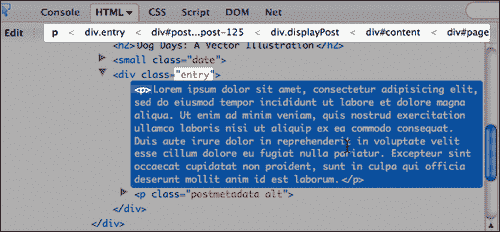
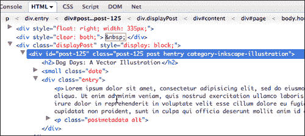

# 第八章：jQuery 与 WordPress 工作的技巧和诀窍

您现在已准备好将您的 jQuery 知识应用到 WordPress 的世界中。但首先，让我们看看本章将涵盖的内容：

+   适当加载我们的 jQuery 脚本的技巧和诀窍，确保它们与其他脚本、库和插件兼容

+   一些使用 Firefox 和 Firebug 以加速和帮助您 jQuery 开发的技巧和诀窍

+   有效的 WordPress 标记的优点以及如何让网站的内容编辑人员更轻松

以下是使用 jQuery 和 WordPress 所需的技巧和诀窍。

# 保持一个代码武器库

“片段集合”，或者我称之为“代码武器库”，将帮助您大有作为，不仅仅是与 jQuery 和 WordPress 代码相关，还可以帮助您处理一般 HTML 标记甚至您创建的 CSS 解决方案，更不用说您工作的其他任何代码语言了。

我很不擅长记住代码，标记和 CSS 的语法。我经常知道我需要什么，但从来不记得应该如何正确地编写。我过去常常花费数小时查看以前项目的各种样式表，标记和代码，将它们复制到我当前的项目中，还要不断地在网页上搜索（并“再次搜索”）我需要的语法示例。

如果您经常发现自己处于类似情况，常用的 HTML/代码编辑器中通常具备的“片段”或“剪辑”功能将为您摆脱这个乏味（和非常耗时）的任务。您只需在编辑器中的“片段”或“剪辑”面板中键入或粘贴 WordPress 模板标签，功能，PHP 代码，关键的 CSS 规则和 jQuery 函数（以及您发现最需要使用的任何其他代码语法），应用程序会为您保存它，以备将来使用。

当您参与不同的项目时，您可能会提出您可能希望在将来再次使用的解决方案，比如，用于无序列表的一组 CSS 规则，以使之成为一个漂亮的画廊视图，或两个 jQuery 函数的非常巧妙的使用。每当您创建您认为可能会派上用场的东西（它确实会再次派上用场），请务必立即保存它，供将来参考。

诸如 Dreamweaver、HTML-Kit 和 Coda 等优秀的编辑器通常具有组织片段的功能，可使它们逻辑分组，易于访问。一些编辑器甚至允许您分配自定义的“键快捷键”，或直接将片段拖放到您的工作文件中。多么简单呀！

## 解放您的武器库

一旦你发现这有多方便，你可能想要让你的工具箱在你使用的其他程序中也可用，特别是如果你在多个编辑器和创作环境之间切换。我建议你投资一个多剪贴板应用程序，它可以让你保存和组织你的代码片段。当我使用 PC 时，我用了一个叫做 Yankee Clipper 3 的很棒的小应用（免费，网址是 [`www.intelexual.com/products/YC3/`](http://www.intelexual.com/products/YC3/)），现在在 Mac 上，我使用 iPaste（价格适中；网址是 [`www.iggsoftware.com/ipaste/`](http://www.iggsoftware.com/ipaste/)）。除了可以从任何应用程序方便地使用你的工具箱之外，当你在项目上工作时，能够回溯最近复制到剪贴板的大约 10 个项目，真的可以节省时间。

## 你的随身工具箱

最后，我发现我喜欢随身携带大部分工具。如果你使用手持设备或者有一个笔记应用程序，可以让你对笔记进行分类和搜索（尤其是那种可以从桌面或网络服务同步的应用程序），你可能会发现把你的部分或所有工具箱都放在其中是很有用的，这样你可以随时轻松查找你的工具箱中的语法。我偶尔会在需要我使用他们的计算机而不是我的笔记本电脑的地方做自由职业工作，所以在我的设备上访问我的工具箱非常有用。

多年来，Palm 的原生笔记应用非常适合我；现在我把大部分工具都存放在 Google 文档中，并使用一个名叫 NoteSync 的小桌面应用，它让你可以快速写作和查看 Google 文档的笔记（他们很快就会推出安卓应用，但目前我在安卓设备上使用 Gdocs 来查看我的笔记）。我有很多朋友都对 EverNote 的系统赞不绝口（尽管他们的移动应用目前仅在 iPhone 上离线可用，而在安卓上尚未支持）。

一旦你所有经常使用的和创造性的一次性解决方案都位于一个方便的（希望是分类和关键字可搜索的）地方，你会惊讶于你的开发速度提高了多少，以及这样做会让你的开发更加轻松。

# 在 WordPress 中使用 jQuery 的技巧和诀窍

让我们先来谈谈我喜欢的一些 jQuery 技巧和诀窍，然后再关注 WordPress。这些项目中的大多数已经在书中详细讨论过了，这是为了提醒你它们很重要（在某种程度上，这是第一个“提示”，不要省略基本要点）。这里还有一些尚未涵盖的小贴士，将帮助你加快 jQuery 开发速度。

## 尝试使用最新版本的 jQuery

这是使用捆绑的 WordPress 版本的缺点之一：它可能会落后于当前版本的 jQuery，直到下一个 WordPress 版本出来为止。我完全赞成保持在最新版本上，因为 jQuery 版本发布的主要目标不仅是提供新功能，而且不断简化和改进现有功能的性能和速度。如果 CDN 上提供的最新版本的 jQuery 大于捆绑的版本，请务必先`deregister` jQuery，或者使用我们在第三章学到的`if else`语句限制您的新版本，以便它仅在所需页面上的站点前端加载。否则，您可能会在使用捆绑的 WordPress 版本的插件中出现问题。

### 与谷歌 CDN 保持最新

保持最新的最佳方式就是简单地使用谷歌的 CDN。我在第二章和附录 A 中介绍了这一点。这里还有从谷歌 CDN 加载的额外优势。您的站点可以同时从谷歌 CDN 加载主要库以及其他本地 jQuery 脚本和附件，而不必从您的服务器一次加载 JavaScript、库和资源。好处是对于访问过其他加载自谷歌 CDN 的站点的用户，jQuery 将被缓存。务必查看附录 A，获取有关`wp_enque_script`的完整参考。

## 保持在**无冲突**模式下

WordPress 的一个伟大之处在于一个站点可以有很多人以许多不同的方式为其做贡献：撰写内容、工作在主题上，并添加 WordPress 插件。WordPress 的一个最糟糕之处在于，许多人可以轻松地根据他们的管理员状态为站点做出贡献，一些其他的合作者可以向他们添加，或者他们可以安装什么样的插件。

对于 WordPress 来说，保持在**无冲突**模式下是必须的。这与使用`wp_enque_script`来在 WordPress 中加载确保 jQuery 不会被“挤出”是一起的，如果有人加载任何其他使用 MooTools 或 Scriptaculous 或甚至只是旧版本 jQuery 的插件。

保持在`noConflict`模式下很容易。最简单的方法就是我们在整本书中一直在做的！只需在脚本前使用`jQuery`，而不是快捷符号`$`。

```js
jQuery('.selector').function();

```

## 确保主题或插件中的其他脚本使用 Script API

如果你正在使用第三方的主题或插件，请浏览主题的 `header.php` 文件或插件的 PHP 页面，并仔细检查所有的脚本是否已经使用 `register` 和 `wp_enqueu_script` 方法加载。我曾经遇到过一些相当令人沮丧的情况，导致一些头发被拔掉，因为我们试图弄清楚为什么我的 jQuery 脚本无法工作，或者想知道我是如何在将它们转移到现场时"破坏"它们的。事实证明，现场网站安装了一个我的沙箱网站没有的插件，并且你猜对了，该插件包含了一个旧版本的 jQuery 和一个使用硬编码 `script` 标签而不是 `wp_enqueue_script` 方法的自定义脚本文件。一旦这个问题被找到并解决了，将所有东西设置为 `noConflict` 模式，一切都恢复正常了！

## 检查你的 jQuery 语法

这个总是让我困扰。你编写了一个漂亮的 jQuery 链，对它进行了一些调整，然后这该死的东西就停止工作了。而且你知道它是对的！嗯，至少，你认为它是对的。对吧？这就是一个好的代码编辑器派上用场的地方。你会希望有一些不错的**查找**功能，让你逐步查看并查看每一个返回的**查找**，以及让你不仅可以对整个文档进行查找，还可以对单个选择进行查找。我喜欢选择 "有问题的链" 并对其运行以下**查找**功能，看看会出现什么情况。

### 冒号和分号

对于 `:`（冒号）进行**查找**，你可能会发现一些意外地设置为`;`（分号）在你的函数的各种对象参数中，或者你可能在应该是分号的地方输入了冒号。

### `闭合括号`

我还会运行一次对于闭合括号 `)` 的**查找**，并确保每一个出现的括号都是一个持续的链的一部分，或者是用 `;` 标记的链的结束。

### 不匹配的双引号和单引号

最后，快速检查匹配的单引号和双引号有时会显示我哪里搞错了。Panic's Coda 允许你在**查找**中放入"通配符"，因此搜索 `"'*` 或 `'*"'` 通常会发现一个讨厌的问题。

大多数优秀的代码编辑器都有颜色编码语法，这在识别语法错误时非常有帮助，比如根本没有闭合引号或括号。但是，上面的问题往往很棘手，因为它们通常会显示为正确的颜色编码语法，所以在运行脚本之前你不知道有什么问题。

## 使用 Firefox 和 Firebug 来帮助调试

`Firebug 有一个名为“控制台日志”的功能。在我看来，这是 Firebug 的众多优秀功能之一。多年来，我经常借助 JavaScript 的“alert”语句来尝试显示“内部”工作，但 Firebug 控制台处理的远不止于此。这真的很有用，因为有时您必须调试“实时”站点，并设置 JavaScript 警报有点冒险，因为您可能会使站点的访问者感到困惑。使用 Firebug 的控制台日志可以消除这种困惑。`

`首先，有 `console.log` 和 `console.info` 语句，您可以将它们添加到您的 jQuery 脚本中，以将信息传递给您，并返回有关您的脚本的大量有用（有时是不那么有用，但有趣的）信息。`

``console.profile` 和 `console.time` 对于测量浏览器处理脚本的速度非常有用。`

`要全面了解 Firebug 控制台的所有功能，请查看：[`www.getfirebug.com/logging`](http://www.getfirebug.com/logging)。`

## `了解 jQuery 对 DOM 的影响`

`再爱 Firefox 也不为过，尽管我喜欢 Opera 和 Chrome，但是当我无法选择页面上的文本和对象，并右键单击**查看选定的源**时，我感到无助和盲目。`

`如果您的 jQuery 脚本在运行时动态创建了新的 DOM 对象或者在操作对象，则右键单击**查看页面源代码**将仅显示服务器提供的内容，而不会显示 jQuery 和 JavaScript 在浏览器中创建的内容。`

`这是一个很好、快速且简单的方法，可以查看 jQuery 是否添加了该类，或者是否将所选元素包装在您的新 div 中。选择由 jQuery 生成的内容或者应该受到您的 jQuery 脚本影响的内容，并右键单击**查看选定的源**以查看 DOM 中实际内容。`

``

#### `Web 开发工具包：查看生成的源代码`

`如果您发现必须进行选择限制，并且希望查看整个“生成的”源代码是什么样子，您可以使用 Web 开发工具包来查看 jQuery 影响的页面。`

``

#### `查看 Firebug 的视图`

`查看 DOM 中生成的 HTML 对象的最可靠方式来自于使用 Firebug 的**HTML**视图。通过选择**HTML**标签以及**单击页面中的元素以检查**标签，您可以在 HTML 视图中将鼠标悬停在任何元素上，并立即查看其在嵌套下拉对象中的外观。`

`起初，我发现这个视图有点繁琐，因为我通常只是试图确认新对象或操作的属性是否存在，但我很快就习惯了它的强大之处，它能帮助我调试 jQuery 脚本，我们将在下一个提示中看到，甚至编写选择器。`

``

## `编写优秀选择器的技巧`

如果你碰巧只是浏览或跳过了第二章，*在 WordPress 中使用 jQuery（或者还没有看过的话）*，你会想要回去仔细复习一下。你还会发现接下来的附录有顶级“备忘单”选择器过滤器要点，一旦你了解了选择器的基本原理，这会很有帮助。

熟悉了你的选择器意味着你能够用 jQuery 做任何你想做的事情。真的！我还没有遇到过必须推迟回到 WordPress 内容编辑器的问题。但有时当涉及开始我的 jQuery 脚本时，定位我需要的选择器可能会有一点挑战，特别是当与一个陌生的自定义主题一起工作时。

再次，Firebug 拯救。还记得我们之前用 HTML 视图的技巧吗？你可以使用那个视图来选择你想要用 jQuery 影响的内容，并轻松看到如何为其构建一个选择器。

例如，看一下以下截图的高亮区域：



如果我们想选择那个段落`<p>`标签，很明显我们只需编写我们的 jQuery 选择器：

```js
jQuery('**.entry p**')... 
```

我们还可以看到，我们可以更具体地定位 id 为`#post-125`，如果我们只想影响那个特定的帖子中的`<p>`标签。通过点击显示 ID 和类名层次结构的顶部区域中的特定类或 ID，它将扩展具有该类或 ID 的对象，这样我们就可以完全看到我们的选项。例如，我们也可以定位`category-inkscape-illustration`中的段落。



### 不要忘记你的选择过滤器！

记住：有时候告诉 jQuery 你不想选择什么使用`:not`过滤器，或者告诉它你特别想选择什么，比如`:first`或`:has()`过滤器。附录 A,"jQuery 和 WordPress 参考指南" 中有关于在 WordPress 中使用的最佳选择器过滤器概述，当然，第二章，“在 WordPress 中使用 jQuery”，有一个全面的列表和示例集。

就是这样。简单易懂的 jQuery 选择器！你在使用 jQuery 选择方面越有经验，你会发现生成你自己的 HTML 和对象来辅助你的 jQuery 增强会更容易。这很有用，因为我们的下一个技巧是让网站的编辑者简化一切。

## 让 WordPress 编辑器的工作流“流畅”

几年前，当我第一次开始使用其他知名的 JavaScript 库时，我发现它们对于我自己编写的项目或前端界面项目非常有用，但是在像 WordPress 这样的 CMS 网站上实现它们及其插件通常令人失望。大多数脚本都依赖于向 HTML 中添加特殊的标记或属性。这意味着网站编辑必须知道如何将这些标记添加到他们的文章和页面中，如果他们想要这个功能，而他们大多数人都做不到，导致我面对沮丧的客户，他们不得不推迟回到我或其他网络管理员，只是为了实现内容。

另外，这会增加我的工作量，消耗了我本来可以用来为网站编写其他功能的时间（输入内容到网站的 CMS 中，并不是我喜欢的网站开发的一部分）。jQuery 改变了这一切，使编写增强功能非常容易，这些功能可以轻松地与页面上已有的任何 HTML 一起工作！

尽管如今几乎所有东西都在线上 "云" 上，但大多数人并不擅长 HTML。事实上，随着我们从 Web 2.0 完全进入 Web 3.0，以及更远的未来，越来越少的人会知道任何 HTML，或者根本不需要知道，这是因为有了众多优秀的基于网络的应用程序，如 WordPress 和各种社交网络平台，它们将用户的原始信息组织好，以及样式化和展示给世界。

如果你的增强功能要求用户转到**HTML**视图，并手动添加特殊的标签或属性，那就不是有效的 jQuery 增强！不要这样做！

用户应该能够添加内容并使用内置的**可视化**所见即所得编辑器进行格式化。你，伟大的 jQuery 和 WordPress 开发者，将开发一个与现有 HTML 兼容的解决方案，而不是强加要求，你的客户和编辑将为此而惊叹，并永远爱你。

### 但是我的 jQ 脚本或插件需要具体的元素！

正如我们在本书的几章中所看到的，事实上，你的 jQuery 插件可能需要 DOM 中存在某些元素才能将内容转换为小部件或交互。

记住这件事：*如果 HTML 元素可以构建以使增强功能正常工作，你可以使用 jQuery 在 DOM 中动态创建这些 HTML 元素*。你不必强迫你的客户在编辑器中创建它们！

查看我们在第六章中的工作，*WordPress 和 jQuery 的 UI*，使用 UI 插件，我们将简单的基本`h3`标题和段落动态包装在适当的 jQueryUI 标签小部件中。或者，甚至在之前的第五章中，*WordPress 中的 jQuery 动画*，我们拿客户的独特帖子文本（与 HTML 没有任何关系！）并且能够用它构建一个可爱的动画图表。

`jQuery 的核心在于选择器，这是真实的。有时，要开始工作，您需要首先选择清晰而独特的内容！在进行增强时与网站的编辑者合作。对于大多数内容编辑者来说，仅需为某些帖子应用唯一的类别或标签即可使增强效果生效，或者甚至手动添加关键字到帖子的标题或以特定方式格式化内容（例如 第五章 中的图表示例，*在 WordPress 中安装 jQuery*）。首先与网站的编辑者一起查看所有这些选项，以确保增强确实对所有人都是增强。`

`# 为最佳 jQuery 增强提供的 WordPress 小贴士和技巧

只是因为您已经掌握了 jQuery 并不意味着您可以忽略在 WordPress 安装中发生的服务器端情况。让我们来看看处理 WordPress 时需要记住的一些关键事项。

## 始终使用 wp_enqueue_script 加载 jQuery，并为自定义脚本的插件使用 wp_register_script。

我们在 第三章 中详细讨论过这一点，*深入了解 jQuery 和 WordPress*，但再次强调，您将希望确保为您所有的 jQuery 加载需求使用 `wp_enqueue_script`。`wp_enqueue_script` 和 `wp_register_script` 是 WordPress 解决多个版本脚本不必要加载或取消其他版本的解决方案。

您可以使用 `wp_enqueue_script` 轻松加载 jQuery 和 WordPress 捆绑的插件，甚至可以从 Google CDN 加载。如果您有自己的自定义脚本，您可以使用 `wp_register_script` 将您的自定义脚本注册到 WordPress 中，然后可以使用 `wp_enqueue_script` 加载它，使其依赖于 jQuery 或其他 jQuery 插件或 JavaScript 库。

附录 A, *jQuery 和 WordPress 参考指南*，向您展示了如何为所有顶级 jQuery 和 WordPress 实现使用 `wp_enqueue_script` 的快速简便方法。

## 始终从基本的、工作正常的“纯 HTML”WordPress 站点开始

我已经说了几百遍了（或者看起来是这样），但游戏的名字是增强。不要编写任何在某种方式下禁用 JavaScript 或不可用时将会中断的内容。大多数 WordPress 主题已经以这种方式工作，显示使用简单的 `http` 调用链接到其他内容页面或锚点名称的内容和链接。如果您正在从头开始开发一个将通过 jQuery 增强的主题，请尽可能完整地开发它，以便在添加 jQuery 增强之前，它可以与基本的 `http` 功能一起正常工作。这将确保您的内容无论通过何种浏览器或设备访问都可以看到。

越来越多的高级主题都内置了 jQuery 和其他 JavaScript 增强功能。你需要在浏览器中关闭 JavaScript，看看在没有增强功能的情况下该内容如何处理。如果网站在没有 JavaScript 的情况下完全“崩溃”并且无法正确显示内容，那取决于你打算部署到哪些设备，你可能不想使用该主题！

## 验证，验证，验证！

如果你的 HTML 不规范或损坏，jQuery 很难进行选择。通常修复方法是修复损坏的 HTML 标记。

验证的最简单方法是转到 [`validator.w3.org/`](http://validator.w3.org/)，如果你的文件在服务器上，你可以直接输入 URL 地址。如果你是在本地工作，从浏览器中，你需要选择 **另存为** 并保存一个 HTML 文件，该文件是项目的 WordPress 输出，并使用提供的上传字段将该完整的 HTML 文件输出上传到验证器。

另外，Firebug 的主控制台视图会自动验证加载到页面上的标记。Firebug 的好处是，你可以选择错误，然后立即跳转到有问题的代码行。我发现 Firebug 对错误的解释比 W3C 的某些网站更容易理解，但是 Firebug 还会发现所有种类的 W3C 没有发现的“小问题”，据我所知，它并不影响我的 jQuery 开发，所以使用 W3C 验证器通常更简单一些。

## 检查你的 PHP 语法

就像 jQuery 语法一样，即使经过多年的经验，小而简单的 PHP 语法错误和拼写错误也总是会让我困扰。

如果你遇到 PHP 错误，大多数情况下 PHP 只会显示错误消息并注明有问题的脚本页面和代码行号，而不会渲染整个页面。这样很容易找到并修复 PHP 问题。

仍然可能存在一个 PHP 语法问题，而不会抛出错误。如果你已经检查了其他所有内容，请快速浏览以下关于 PHP 经常出现的常见问题。

### PHP 速记法

双重检查，确保你没有使用任何 PHP 的速记法。确保你有开启和闭合的 `<?php ?>` 括号，并确保在第一个括号后面有 `php`。有些系统没有开启速记法，你在沙盒托管服务器或本地服务器上运行的内容可能在实际服务器上无法运行。避免使用 PHP 的速记法以防止此类问题。

### 检查是否有适当的分号

与 jQuery 一样，因为语法相似，你最好使用代码编辑器的**查找**功能，双重检查语句结束的分号是否写成冒号 `:` 或逗号 `,`，或者根本就没有写。

### `拼接`

`当从 JavaScript 和 jQuery 转到 PHP 时，情况就变得棘手了；语法非常相似！然而，在 PHP 中，串联是用 .（点）而不是 `+`（加号）处理的。在 JavaScript 和 jQuery 上工作一段时间，然后尝试在 WordPress 主题上工作，并继续使用 JavaScript 语法是很容易的。`

`# 概要`

就是这样。我希望这份关于 jQuery 和 WordPress 的技巧和窍门清单对您有所帮助。我们看了一下：

+   与 WordPress 最大程度兼容其他脚本、库和插件的最佳 jQuery 集成方法

+   所有 Firefox 和 Firebug 在开发中为您提供的各种方式

+   确保您保持 WordPress 用户的工作轻松，并且您的 WordPress HTML 有效且易于处理的提示和技巧

接下来是我们的最后一章！如果你甚至想称之为“章节”，附录 A, *jQuery 和 WordPress 参考指南*，提供了丰富而简单的快速参考，涵盖了您在大多数 jQuery 增强工作中所需的顶级 jQuery 和 WordPress 知识和语法。
