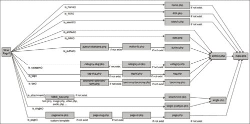

# 附录 A. jQuery 和 WordPress 参考指南

好的！欢迎来到本书的最后一部分！这个附录与其他附录不同，因为它实际上是一个快速参考指南，旨在在您阅读和理解在 WordPress 站点中使用 jQuery 的基本原理、应用和最佳实践之后帮助您。把这一章当作您的“备忘单”。

在适当的情况下，我会指向本书中详细描述该函数或技术的位置，以及指向任何其他有用链接的地方，如果您对更多细节感兴趣的话。

在本附录中，我们将涵盖的主题包括：

+   顶级、基本的 jQuery 选择器和函数

+   使用模板层次结构，以及关键模板标记和 WordPress 函数

+   WordPress 短代码

# WordPress 的 jQuery 参考

在接下来的几个部分中，我们将看一下您在 WordPress 中进行 jQuery 开发时最需要的顶级参考资料。让我们从保持在 `noConflict` 模式下并查看最有用的 `selector` 过滤器开始。

## noConflict 模式语法

最简单的方法就是在所有的选择语句中只使用 jQuery 变量：

```js
jQuery('.selector').function();

```

您还可以设置自己的变量：

```js
<script type="text/javascript">
var $jq = jQuery.noConflict();
$jq(document).ready(function() {
$jq("p").click(function() {
alert("Hello world!");
});
});
</script>

```

如果设置正确，甚至可以安全地使用 `$` 变量：

```js
jQuery(function ($) {
/* jQuery only code using $ can safely go here */
$("p").css('border','#ff6600');
});

```

## 用于在 WordPress 中工作的有用选择器过滤器

记住：有时将不想要的内容从选择集中 *排除* 出来比选择您想要的一切更容易。

### 选择过滤器语法

这是使用选择器过滤器的基本语法：

```js
jQuery('.selector:filter(params if any)').function();

```

### 选择器过滤器

这是您在 WordPress 中工作时最有用的顶级选择器过滤器（`:not` 是我个人最喜欢的）：

| 示例 | 语法 | 描述 |
| --- | --- | --- |
| :not(selector) | `jQuery(".post img:not(.pIcon)").jqFn();` | 过滤掉所有匹配给定选择器的元素。 |
| :header | `jQuery(".post :header").jqFn();` | 筛选出所有标题元素，例如 h1、h2、h3 等。 |
| :first | `jQuery(".post:first").jqFn();` | 仅筛选到第一个选择的元素。 |
| :last | `jQuery(".post:last").jqFn();` | 仅筛选到最后选择的元素。 |
| :even | `jQuery(".post:even").jqFn();` | 仅筛选到偶数元素。注意：数组索引从零开始！零被视为偶数，因此您的第一个项目将被选中！ |
| :odd | `jQuery(".post:odd").jqFn();` | 仅筛选到奇数元素。注意：数组索引从零开始！零被视为偶数，因此您的第二个项目将被选中！ |
| :eq(number) | `jQuery(".post:eq(0)").jqFn();` | 通过其索引筛选出单个元素，索引从零开始。 |
| :gt(number) | `jQuery(".post:gt(0)").jqFn();` | 筛选出所有索引 **大于** 给定值的元素，这也是从零开始的。 |
| :lt(number) | `jQuery(".post:lt(2)").jqFn();` | 筛选出所有索引小于给定值的元素。 |
| :animated | `jQuery(".post:animated").jqFn();` | 筛选为当前正在执行动画的所有元素（我们将在本章后面讨论动画）。 |

### 内容过滤器语法

在常规选择器过滤器之后，您会发现这些内容过滤器非常有用（特别是`:has()`）。

```js
jQuery(".selector:content-filter(params if any)").function();

```

### 内容过滤器

几乎所有内容过滤器都与 WordPress 配合使用非常方便。它们帮助您很好地处理页面和文章所见即所得编辑器的输出。

| 示例 | 语法 | 描述 |
| --- | --- | --- |
| :has(selector) | `jQuery(".post:has(.entry)").css("background", "#f60");` | 筛选为至少有一个匹配元素的元素。 |
| :contains(text) | `jQuery(".post:contains('Hello world')").css("background", "#f60");` | 筛选包含特定文本的元素。注意：**区分大小写！** |
| :empty | `jQuery(":empty')").css("background", "#f60");` | 筛选为空的元素。这包括文本节点。 |
| :parent | `jQuery(":parent')").css("background", "#f60");` | 筛选为其他元素的父元素。这包括文本节点。 |

### 子过滤器语法

这是使用子元素过滤器语法的基本语法：

```js
jQuery(".selector:child-filter(params if any)").function();

```

### 子过滤器

当处理 WordPress 输出的各种列表标记时，您会发现子过滤器非常有用。类别、页面、画廊页面，您将能够使用这些过滤器控制它们并选择特定元素。

| 示例 | 语法 | 描述 |
| --- | --- | --- |
| :nth-child(number/even/odd) | `jQuery(".linkcat li:nth-child(1)").css("background", "#f60");` | 筛选为其选择器的“nth”子元素。注意，这不是零索引！1 和 odd 选择第一个元素。 |
| :first-child | `jQuery(".linkcat li:first-child").css("background", "#f60");` | 筛选为其父元素的第一个子元素。 |
| :last-child | `jQuery(".linkcat li:last-child").css("background", "#f60");` | 筛选为其父元素的最后一个子元素。 |
| :only-child | `jQuery(".pagenav li:only-child").css("background", "#f60");` | 筛选为其父元素的唯一子元素。如果父元素有多个子元素，则不选择任何元素。 |

### 表单过滤器语法

这是表单过滤器的语法：

```js
jQuery(":form-filter").function();

```

### 表单过滤器

WordPress 本地具有简单的内容表单和单个输入字段。但是，WordPress Cforms II 插件对大多数项目非常有用，如果您使用该插件，您会发现大多数这些过滤器都很有用：

| 示例 | 语法 | 描述 |
| --- | --- | --- |
| :input | `jQuery("form:input").css("background", "#f60");` | 筛选为所有输入、文本区域、选择和按钮元素。 |
| :text | `jQuery("form:text").css("background", "#f60");` | 筛选为类型为 text 的所有输入元素。 |
| :password | `jQuery("form:password").css("background", "#f60");` | 筛选为类型为 password 的所有输入元素。 |
| :radio | `jQuery("form:radio").css("background", "#f60");` | 过滤所有类型为单选按钮的输入元素。 |
| :checkbox | `jQuery("form:checkbox").css("background", "#f60");` | 过滤所有类型为复选框的输入元素。 |
| :submit | `jQuery("form:submit").css("background", "#f60");` | 过滤所有类型为提交的输入元素。 |
| :image | `jQuery("form:image").css("background", "#f60");` | 过滤所有图像元素（分类为表单过滤器，但对常规图像也很有用）。 |
| :reset | `jQuery("form:reset").css("background", "#f60");` | 过滤所有类型为重置的输入元素。 |
| :button | `jQuery("form:button").css("background", "#f60");` | 过滤所有类型为按钮的输入元素。 |
| :file | `jQuery("form:file").css("background", "#f60");` | 过滤所有类型为文件的输入元素。 |

## jQuery：用于在 WordPress 中工作的有用函数

虽然我已经对大多数选择器过滤器进行了简要总结，因为它们非常有用，但在下一节中，我将介绍您在 WordPress 项目中最常使用的顶级函数的语法和用法。

不用担心，你可以快速浏览第二章，《在 WordPress 中使用 jQuery》以获取完整列表，以及这里未涉及的函数的使用方法。

### 处理类和属性

使用 jQuery 可以快速地通过更改它们的 CSS 属性来转换对象中最简单但最强大的事物之一。

| 示例 | 语法 | 描述 |
| --- | --- | --- |
| .css('property', 'value') | `jQuery(".post") .css("background", "#f60");` | 添加或更改所选元素的 CSS 属性。 |
| .addClass('className') | `jQuery(".post") .addClass("sticky");` | 将列出的类（们）添加到所选元素的每个中。 |
| .removeClass('className') | `jQuery(".post") .removeClass("sticky");` | 从所选元素的每个中删除列出的类（们）。 |
| .toggleClass('className', switch-optional) | `jQuery(".post") .toggleClass("sticky");` | 根据它们当前的状态从所选元素的每个中切换列出的类（们）。如果存在类，则删除它；如果不存在，则添加它。 |
| .hasClass('className') | `jQuery(".post") .hasClass("sticky");` | 如果所选元素的列出的类（们）存在，则返回 true；否则返回 false。 |
| .attr | `jQuery(".post").attr();` | 检索所选元素的第一个元素的属性值。 |

## 遍历 DOM

`.append`和`.prepend`将成为您在 DOM 函数中最常用的。但是，您会发现`.wrapAll`对于帮助包含您创建的任何新元素非常宝贵。

| 示例 | 语法 | 描述 |
| --- | --- | --- |
| .append(html & text) | `jQuery(".post") .append("<b>帖子到此结束</b>");` | 将参数中的内容插入到每个选定元素的末尾。 |
| .appendTo(selector) | `jQuery("<b>帖子在这里结束</b>").appendTo(" .post");` | 做的事情与 append 相同，只是反转了元素选择和内容参数。 |
| .prepend(html & text) | `jQuery(".post") .prepend("<b>帖子从这里开始</b>");` | 将参数中的内容插入到每个所选元素的开头。 |
| .prependTo(selector) | `jQuery("<b>帖子从这里开始</b>").prependTo(" .post");` | 做的事情与 prepend 相同，只是反转了元素选择和内容参数。 |
| .after(string) | `jQuery(".post") .after("<b>这个在后面</b>");` | 将参数中的内容插入到每个所选元素之后，并在外部插入。 |
| .insertAfter(selector) | `jQuery("<b>这个在后面</b>").insertAfter(" .post");` | 做的事情与 after 相同，只是反转了元素选择和内容参数。 |
| .before(html & text) | `jQuery(".post") .before("<b>这个在前面</b>");` | 将参数中的内容插入到每个所选元素之前，并在外部插入。 |
| .insertBefore(selector) | `jQuery("<b>这个在前面</b>") .insertBefore("class");` | 做的事情与 before 相同，只是反转了元素选择和内容参数。 |
| .wrap(html or functionName) | `jQuery(".post").wrap("<div class=".fun" />");` | 在每个所选元素周围包装 HTML 结构。您还可以构造一个将每个元素包装在 HTML 中的函数。 |
| .wrapAll(html) | `jQuery(".post") .wrapAll("<div class=" .fun" />");` | 类似于 wrap，但将 HTML 结构放置在所有元素周围，而不是每个单独的元素。 |
| .wrapInner(selector) | `jQuery(".post") .wrapInner("<div class=" .fun" />");` | 类似于 wrap，但是它将 HTML 结构放置在所选元素的每个文本或子元素周围。 |
| .html(html & text) | `jQuery(".post") .html("<h2>替换文本</h2>");` | 用参数中的内容替换所选项的任何内容和子元素。 |
| .text(text only html chars will be escaped) | `jQuery(".post") .text("替换文本");` | 类似于 HTML，但仅限文本。任何 HTML 字符都将转义为 ASCII 码。 |

## 重要的 jQuery 事件

大多数情况下在 WordPress 中，都是关于`.click`和`.hover`，但`.toggle`和`.dbclick`也很方便。

| 示例 | 语法 | 描述 |
| --- | --- | --- |
| .click(functionName) | `jQuery(".post") .click(function(){//code});` | 将函数绑定到单击事件类型，单击时执行。 |
| .dbclick(functionName) | `jQuery(".post") .dbclick(function(){//code});` | 将函数绑定到双击事件类型，双击时执行。 |
| .hover(functionName1, functionName2) | `jQuery(".post") .hover(function(){//code});` | 与 mouseenter/mouseleave 事件类型配合使用，并将两个函数绑定到所选元素，分别在 mouseenter 和 mouseleave 时执行。 |
| .toggle(函数名 1, 函数名 2, 函数名 3, ...) | `jQuery(".post") .toggle(function(){//code});` | 与点击事件类型一起工作，并将两个或多个函数绑定到选定的元素上，以便在交替点击时执行。 |

## 最佳的动画效果

任何进行动画的元素都会看起来很酷。确保您知道如何处理这些函数以获得一些一流的 jQuery 增强功能。

| 示例 | 语法 | 描述 |
| --- | --- | --- |
| .slideUp(速度, 函数名) | `jQuery(".post") .slideUp('slow', function() { // code });` | 将选定元素从底部向上滑动，直到它被隐藏。速度可以是 "快速" 或 "慢速" 或毫秒。动画完成时可以调用函数。 |
| .slideDown(速度, 函数名) | `jQuery(".post") .slideDown('slow', function() { // code });` | 从顶部向下滑动隐藏的选定元素，直到它达到定义的大小。速度可以是 "快速" 或 "慢速" 或毫秒。动画完成时可以调用函数。 |
| .slideToggle() | `jQuery(".post") .slideToggle('slow', function() { // code });` | 使用滑动动画切换选定元素的可见性。速度可以是 "快速" 或 "慢速" 或毫秒。动画完成时可以调用函数。 |
| .fadeOut(速度, 函数名) | `jQuery(".post") .fadeOut("slow", function(){//code});` | 将可见的选定元素淡出或透明度设置为 1 到 0。 |
| .fadeIn(速度, 函数名) | `jQuery(".post") .fadeIn("slow", function(){//code});` | 将选定的元素淡入，其可见性为隐藏或透明度设置为 0 到 1。 |
| .fadeTo(速度, 透明度, 函数名) | `jQuery(".post") .fadeTo("slow", .3, function(){//code});` | 将选定的元素淡出到指定的透明度，范围从 0 到 1。 |
| .animate(css 属性, 持续时间, 缓动, 函数名) | `jQuery(".post") .animate({width: 200, opacity: .25}, 1000, function(){//code});` | 在选定的元素上创建自定义的 CSS 属性过渡效果。 |
| .stop() | `jQuery(".post") .stop();` | 停止选定元素上的动画。 |

# 充分利用 WordPress

这些是您需要了解 jQuery 的顶级元素，现在让我们看看如何在 WordPress 方面保持运行流畅。首先，您了解如何利用主题层次结构，就可以更轻松地创建视图和页面以与 jQuery 结合使用。

## WordPress 模板层次结构

需要稍微调整主题？了解模板层次结构可以帮助您以最少的编程头痛创建所需的视图。下面的列表包含一般模板层次结构的规则。您可以拥有的绝对最简单的主题必须包含一个 `index.php` 页面。如果不存在其他特定的模板页面，则 `index.php` 是默认页面。

接下来，您可以通过添加以下页面来开始扩展您的主题：

+   `archive.php` 当查看类别、标签、日期或作者页面时优先于 `index.php`。

+   当查看主页时，`home.php`优先于`index.php`。

+   当查看单独的文章时，`single.php`优先于`index.php`。

+   当查看搜索结果时，`search.php`优先于`index.php`。

+   当 URI 地址找不到现有内容时，`404.php`优先于`index.php`。

+   查看静态页面时，`page.php`优先于`index.php`。

    +   当通过页面的**管理**面板选择时，自定义**模板**页面，例如：`page_about.php`，优先于查看特定页面时的`page.php`，这又优先于`index.php`。

+   当查看分类页面时，`category.php`优先于`archive.php`。这又优先于`index.php`。

    +   自定义**分类-ID**页面，例如：`category-12.php`优先于`category.php`。这又优先于`archive.php`，优先于`index.php`。

+   当查看标签页面时，`tag.php`优先于`archive.php`。这又优先于`index.php`。

    +   自定义**标签-tagname**页面，例如：`tag-reviews.php`优先于`tag.php`。这又优先于`archive.php`，优先于`index.php`。

+   查看作者页面时，`author.php`优先于`archive.php`。当查看作者页面时，这又优先于`index.php`。

+   当查看日期页面时，`date.php`优先于`archive.php`。这又优先于`index.php`。

    ### 注

    您可以在这里了解有关 WordPress 主题模板层次结构的更多信息：[`codex.wordpress.org/Template_Hierarchy`](http://codex.wordpress.org/Template_Hierarchy)。

## 顶级 WordPress 模板标签

以下是我发现在 jQuery 和主题开发中最有用的顶级 WordPress 模板标签：

| 模板标签 | 描述 | 参数 |
| --- | --- | --- |
| `bloginfo()`示例：`bloginfo('name');` | 显示您的博客信息，由您的用户配置文件和管理面板中的一般选项提供。**更多信息：**[`codex.wordpress.org/Template_Tags/bloginfo`](http://codex.wordpress.org/Template_Tags/bloginfo)。 | 您想在标签前后以及它们之间显示的任何文本字符，以及分隔它们的字符 — `name，description，url，rdf_url，rss_url，rss2_url，atom_url，comments_rss2_url，pingback_url，admin_email，charset，version`。默认：不带参数将不显示任何内容。您必须使用参数。 |
| `wp_title()`示例：`wp_title('——',true,'');` | 显示页面或单独文章的标题。**注意：**在循环外的任何地方使用此标签。**更多信息：**[`codex.wordpress.org/Template_Tags/wp_title`](http://codex.wordpress.org/Template_Tags/wp_title)。 | 您想用来分隔标题的任何文本字符 — " `--` "。您可以设置一个布尔值来显示标题 — " `--`，`false` "。从版本 2.5+ 开始：您可以决定分隔符是在标题之前还是之后 — " `--`，`true`，`right` "。默认：如果分隔符分配了默认值，则不带参数将在左边显示页面标题与分隔符。 |
| `the_title()`示例：`the_title('<h2>', '</h2>');` | 显示当前帖子的标题。**注意：**在循环中使用此标签（见第三章，“深入了解 jQuery 和 WordPress”以了解如何设置循环）。**更多信息：**[`codex.wordpress.org/Template_Tags/the_title`](http://codex.wordpress.org/Template_Tags/the_title)。 | 您希望出现在标题之前和之后的任何文本字符 ——`（"<h2>",``"</h2>"）`。您还可以设置一个布尔值将显示关闭为 false ——`（"<h2>",``"</h2>", "false"）`。默认：如果没有参数，将显示没有标记的标题。 |
| `the_content()`示例：`the_content('more_link_text', strip_teaser, 'more_file');` | 显示您编辑到当前文章中的内容和标记。**注意：**在循环中使用此标签（见第三章，“深入了解 jQuery 和 WordPress”以了解如何设置循环）。**更多信息：**[`codex.wordpress.org/Template_Tags/the_content`](http://codex.wordpress.org/Template_Tags/the_content)。 | 你可以添加文本以显示“更多链接”，一个布尔值以显示或隐藏“预告文本”，还有一个第三个参数用于更多文件，目前不起作用——`（"继续阅读" . the_title（））`。你还可以设置一个布尔值将显示关闭为 false ——`（"<h2>",``"</h2>", "false"）`。默认：如果没有参数，将显示具有通用“阅读更多”链接的内容。 |
| `the_category()`示例：`the_category(', ');` | 显示帖子分配给的类别或类别的链接。**注意：**在循环中使用此标签（见第三章，“深入了解 jQuery 和 WordPress”以了解如何设置循环）。**更多信息：**[`codex.wordpress.org/Template_Tags/the_category`](http://codex.wordpress.org/Template_Tags/the_category)。 | 如果有多个类别，则可以包含文本分隔符 ——`('&gt;')`。默认：如果有多个类别分配，将显示逗号分隔。 |
| `the_author_meta()`示例：`the_author_meta();` | 显示帖子或页面的作者。**注意：**在循环中使用此标签（见第三章，“深入了解 jQuery 和 WordPress”以了解如何设置循环）。**更多信息：**[`codex.wordpress.org/Template_Tags/the_author_meta`](http://codex.wordpress.org/Template_Tags/the_author_meta)。 | 此标签接受大量参数。它们在前面的部分中涵盖了，您还可以查看 codex。 |
| `wp_list_pages()`示例：`wp_list_pages('title_li=');` | 以链接形式显示 WordPress 页面列表。**更多信息：**[`codex.wordpress.org/Template_Tags/wp_list_pages`](http://codex.wordpress.org/Template_Tags/wp_list_pages)。 | `title_li` 是最有用的，因为它将页面名称和链接包裹在列表标签`<li>`中。其他参数可以通过用`&`分隔来设置：`depth, show_date, date_format`,`child_of, exclude, echo, authors`,`sort_column`。默认：没有参数将在`<li>`列表中显示每个标题链接，并在列表周围包含一个`<ul>`标签（如果您想要向页面导航添加自定义项目，则不建议使用）。 |
| `wp_nav_menu()`；示例：`wp_nav_menu( array('menu' => '主导航' ));` | 以链接形式显示分配给 WordPress 3.0+ 菜单的菜单项列表。**更多信息：**[`codex.wordpress.org/Function_Reference/wp_nav_menu`](http://codex.wordpress.org/Function_Reference/wp_nav_menu)。 | 此标记接受大量参数，最常见的参数是在管理面板的菜单工具中设置的菜单的名称。如果没有可用的菜单，该函数将默认为`wp_list_pages();`标记。请参阅 codex 以获取更多参数。 |
| `next_post_link()`示例：`next_post_link('<strong> %title </strong>');` | 显示到当前文章的时间顺序中存在的下一篇文章的链接。**注意：**在循环中使用此标记。 （参见第三章，*深入挖掘：了解 jQuery 和 WordPress*，了解如何设置循环）。**更多信息：**[`codex.wordpress.org/Template_Tags/next_post_link`](http://codex.wordpress.org/Template_Tags/next_post_link)。 | 想要出现任意标记和文本字符—(`<strong>%title</strong>`）。`%link` 将显示永久链接，`%title` 下一篇文章的标题。默认：没有参数将显示下一篇文章标题的链接，并在后面加上尖括号（`>>`）。 |
| `previous_post_link()`示例：`previous_post_link('<strong> %title </strong>');` | 显示到当前文章的时间顺序中存在的上一篇文章的链接。**注意：**在循环中使用此标记。 （参见第三章，*深入挖掘：了解 jQuery 和 WordPress*，了解如何设置循环）。**更多信息：**[`codex.wordpress.org/Template_Tags/previous_post_link`](http://codex.wordpress.org/Template_Tags/previous_post_link)。 | 想要出现任意标记和文本字符—`(<strong>%title</strong>)`。`%link` 将显示永久链接，`%title` 下一篇文章的标题。默认：没有参数将显示上一篇文章标题的链接，并在前面加上尖括号（`<<`）。 |
| `comments_number()`示例：`comments_number('暂无回应', '1 条回应', '% 条回应');` | 显示帖子的评论总数、引用和 Pingback。**注意：**在循环中使用此标签。（见第三章，*深入了解 jQuery 和 WordPress*关于如何设置循环。）**更多信息：**[`codex.wordpress.org/Template_Tags/comments_number`](http://codex.wordpress.org/Template_Tags/comments_number)。 | 允许您指定如果没有评论，只有 1 条评论或有许多评论时如何显示—`('暂无回应','1 条回应','% 条回应')`。您还可以用额外的标记包装项目—`("暂无评论","<span class="bigNum">1</span> 条回应","<span class="bigNum">%</span> 条评论")`。默认：不带参数将显示：没有评论，或 1 条评论，或?条评论。 |
| `comments_popup_link()`示例：`comments_popup_link('发表你的想法');` | 如果未使用`comments_popup_script`，则显示到评论的普通链接。**注意：**在循环中使用此标签。（见第三章，*深入了解 jQuery 和 WordPress*关于如何设置循环。）**更多信息：**[`codex.wordpress.org/Template_Tags/comments_popup_link`](http://codex.wordpress.org/Template_Tags/comments_popup_link)。 | 允许您指定如果没有评论，只有 1 条评论或有许多评论时如何显示—`("还没有评论", "到目前为止 1 条评论", "到目前为止%条评论（这算多吗？）", "评论链接", "此帖子的评论已关闭")`。默认：不带参数将显示与`comments_number()`标签相同的默认信息。 |
| `edit_post_link()`示例：`edit_post_link('编辑', '<p>', '</p>');` | 如果用户已登录且有权限编辑帖子，则显示链接以编辑当前帖子。**注意：**在循环中使用此标签。（见第三章，*深入了解 jQuery 和 WordPress*关于如何设置循环。）**更多信息：**[`codex.wordpress.org/Template_Tags/edit_post_link`](http://codex.wordpress.org/Template_Tags/edit_post_link)。 | 任何您想要放在链接名称中的文本，以及您想要放在其之前和之后的标记—`("编辑我！", "<strong>", "</strong>")`。默认：不带参数将显示一个没有额外标记的链接，上面写着“编辑”。 |
| `the_permalink()`示例：`the_permalink();` | 显示当前文章的永久链接的 URL。**注意：**在循环中使用此标记。（参见第三章 *深入了解 jQuery 和 WordPress 的使用方式* 如何设置循环。）**更多信息：**[`codex.wordpress.org/Template_Tags/the_permalink`](http://codex.wordpress.org/Template_Tags/the_permalink)。 | 这个标记没有参数。 |
| `the_ID()`示例：`the_ID();` | 显示当前文章的数字 ID。**注意：**在循环中使用此标记。（参见第三章 *深入了解 jQuery 和 WordPress 的使用方式* 如何设置循环。）**更多信息：**[`codex.wordpress.org/Template_Tags/the_ID`](http://codex.wordpress.org/Template_Tags/the_ID)。 | 这个标记没有参数。 |
| `wp_get_archives()`示例：`wp_get_archives('type=monthly');` | 显示基于日期的存档列表。**更多信息：**[`codex.wordpress.org/Template_Tags/wp_get_archives`](http://codex.wordpress.org/Template_Tags/wp_get_archives)。 | 你可以通过用一个“`&`”来分隔它们来设置参数- （'type=monthly&limit=12'）。另外的参数有`type, limit, format, before, after, show_post_count`。默认：没有参数将以 HTML 格式显示所有的月度存档列表，不包含前后标记，并且`show_post_count`设置为 false。 |
| `get_calendar()`示例：`get_calendar(false);` | 显示当前月份/年份的日历。**更多信息：**[`codex.wordpress.org/Template_Tags/get_calendar`](http://codex.wordpress.org/Template_Tags/get_calendar)。 | 可以设置一个布尔值，如果设置为 true，将显示单个字母的缩写（`S = 星期日`）。否则，它将根据本地化显示缩写（`Sun = 星期日`）- （真）默认：没有参数将显示单个字母的缩写。 |

### 条件标签

条件标签可以用于你的模板文件中，根据页面匹配的条件来更改所显示的内容以及如何显示该内容。例如，你可能希望在你的博客主页面上方显示一小段文本，但只在你的博客的主页面上。使用`is_home()`条件标签，这个任务就变得很容易。

几乎所有的操作都有条件标签，其中，这七个是我在主题开发中最需要的：

+   `is_admin()`

+   `is_page()`

+   `is_single()`

+   `is_sticky()`

+   `is_home()`

+   `is_category()`

+   `in_category()`

所有这些功能都可以使用以下参数：`文章 ID`或`页面 ID`数字，文章或页面`标题`，或文章或页面`slug`。

第一个条件标签，`is_admin()`，你会注意到我们在这个标题中多次使用，以及 `is_home()` 一起加载我们的 `wp_enqueue_scripts`，以便我们可以避免在从管理面板查看主题时加载脚本（例如审核主题）。脚本可能会与管理面板中的脚本冲突，因此最好确保它们只在不从管理面板加载主题时加载。

另外，如果您有任何仅影响主页的 jQuery 脚本，比如说，“置顶帖子轮播器”脚本或类似的脚本，您可能希望考虑将`wp_enqueue_script`调用放在一个 `if(is_home()){wp_enqueue_script(//)}` 调用内。这样，脚本将仅在您需要它的页面上加载，而不是在站点的每个页面上，即使它没有被使用时也是如此。

至于其余的条件标签，尽管主题很棒，但我相信你一定遇到过这样的困境，你或者你的客户不希望每个页面或帖子上都有完全相同的侧边栏。

我使用这些条件标签，以便特定页面可以打开或关闭特定样式或内容 div，并显示或不显示特定内容。这七个标签确实有助于使我的客户的定制主题网站具有真正的、定制的网站感觉，而不是标准的：“设计不错，但每个页面都有完全相同的侧边栏，这可能是另一个 WordPress 站点”的感觉。

条件标签的乐趣并不止于此。在这里列出了许多您可能发现在辅助主题定制方面非常有用的标签：[`codex.wordpress.org/Conditional_Tags`](http://codex.wordpress.org/Conditional_Tags)。

## 循环函数的快速概述

所有这些模板和条件标签是一回事，将它们应用在循环中是另一回事。在本书的许多章节中，我们不得不在主题的模板文件中修改循环或创建一个自定义循环。以下表格包含了对循环的每个部分的描述。

| 循环函数 | 描述 |
| --- | --- |
| `<?php if(have_posts()) : ?>` | 此函数检查是否有帖子可以显示。如果有，代码将继续到下面的下一个函数。 |
| `<?php while(have_posts()) : the_post(); ?>` | 此函数显示可用的帖子，并继续到下面的下一个函数。 |
| `<?php endwhile; ?>` | 此函数关闭了上面打开的`while(have_posts...`循环，一旦显示了可用帖子，就会关闭。 |
| `<?php endif; ?>` | 此函数在上面打开的`if(have_posts...`语句一旦`while(have_posts..`循环完成时结束。 |

## 设置 WordPress 短代码

整个附录都是关于有用的参考资料。我们应该快速浏览一下短代码。它们首次在版本 2.5 中引入。如果你熟悉在 WordPress 中编写函数，短代码可以帮助你将较长的代码片段（如自定义循环和复杂的模板标签字符串）或甚至只是你在主题（或插件）中感觉会经常使用的标记和文本压缩成更干净、更简单的可重复使用的代码片段。你可以将短代码添加到你主题的`functions.php`文件中。

你可能已经熟悉了短代码，但可能没有意识到。如果你曾经研究过 WordPress 的媒体管理器如何在图像中插入标题，你可能会注意到类似于：

```js
...
[caption id="attachment_12" align="alignleft" width="150"
caption="this is my caption"][/caption]
...

```

那是 WordPress 中用于标题和对齐的内置短代码。

要创建一个短代码，你确实需要在你主题的`functions.php`文件中创建一个 PHP 函数。如果你的主题没有`functions.php`文件，只需创建一个新文件并命名为`functions.php`，然后将其放置在你主题目录的根目录下。

### 创建一个基本的短代码

我们首先打开我们的`functions.php`文件，在文件末尾创建一个简单的函数，返回文本和标记的字符串，就像这样：

```js
<?php
...
function quickadd() {
//code goes here
$newText = 'This page is brought to you by
<a href="#">the letter Z</a>';
return $newText;
}
?>

```

现在，要真正利用短代码，你确实需要了解一些 PHP，而要完全覆盖，这有点超出了本标题的范围。但即使没有太多的 PHP 经验，如果你跟随这个示例，你会开始看到这个 WordPress 功能在节省时间方面有多灵活，不仅在你的主题中，还在你日常使用 WordPress 中。

在上一个示例中，在我们的函数括号`{}`内部，我设置了一个非常基本的变量**`$donateText`**，并为其分配了一串文本和标记。

`return`语句是一个非常基本的 PHP 函数，它将确保我们的`quickadd`函数返回分配给该变量的任何内容。

现在我们已经准备好使用 WordPress 的`add_shortcode()`函数了，只需将其添加到我们之前设置的`quickadd`函数*下方*即可。`add_shortcode`函数有两个参数。对于第一个参数，你将输入你的短代码的引用名称，在第二个参数中，你将输入你希望你的短代码调用的函数名称，就像这样：

```js
...
add_shortcode('broughtby', 'quickadd');
?>

```

现在是有趣的部分：在你的主题中选择任何模板页面，并通过简单添加`broughtby`短代码来使用它：

```js
...
[broughtby]
...

```

无论你在主题的模板文件中粘贴`[broughtby]`短代码在哪里，都会出现**本页面由字母 Z 提供**的文字，带有指向该字母页面的链接！

**奖励:** 你不仅限于在你的模板文件中使用这个短代码！直接通过管理面板将其粘贴到文章或页面中，你会得到相同的结果。而且，你猜对了，短代码的输出可以很容易地利用和增强 jQuery！

如果您的增强功能需要比 WordPress 的所见即所得编辑器处理的 HTML 标记更多，而网站内容编辑器在切换到 HTML 视图时不知所措，那么使用短代码创建解决方案可能正是您所需要的！例如，对于您的客户来说，添加一组带有一些参数的方括号要比标记定义列表更容易，而基本的所见即所得编辑器不允许这样做。

这将转变为：

```js
...
<dl>
<dt><a href='#'>Event Name and Location</a></dt>
<dl>Event description</dl>
</dl>
...

```

转变为更简单的：

```js
...
[event title="Event Name and Location"
description="Event description" url="#"]
...

```

除了帮助 WordPress 内容编辑人员处理标记外，如果您是一个忙碌的 WordPress 内容作者，短代码也是节省时间的好方法。即使您不是从头开始创建自己的主题，也可以轻松地将自己的短代码添加到任何主题的 `functions.php` 文件中，从而提高您的生产力。

如果您更熟悉 PHP，可以查看 WordPress 的短代码 API，了解如何通过为其添加参数来扩展和增强您的短代码功能：[`codex.wordpress.org/Shortcode_API`](http://codex.wordpress.org/Shortcode_API)。

# 总结

希望您在阅读本附录后能够标记它，并相信您将随时在使用或语法方面遇到与 jQuery 和 WordPress 相关的主要问题时再次查阅。我们还快速浏览了 WordPress 核心功能和短代码的“内幕”，希望这能让您了解为 WordPress 网站创建有用增强功能的无限可能性。希望您喜欢本书，并发现它在帮助您通过 jQuery 创作和增强 WordPress 网站方面非常有用。
