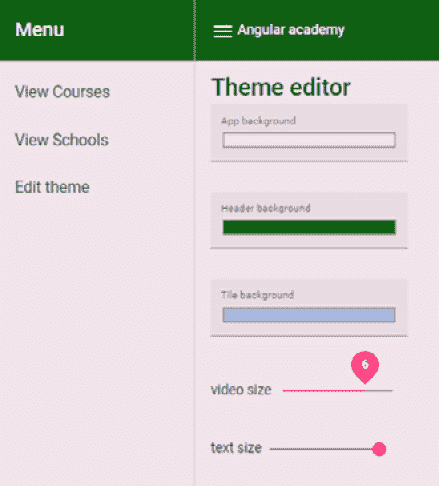

# 第二章：*第五章*：使用 CSS 自定义属性

现在，我们将深入探讨如何在 Angular Academy 应用程序中实现你在 *第一部分 快速且实用的 Angular Ivy 指南* 中遇到的功能的实践细节，这将允许你浏览并选择可用的 Angular 视频课程。

我们将首先描述 Angular Academy 应用程序，同时涵盖以下主题：

+   使用自定义 CSS 属性构建主题选择器

+   实现主题服务

+   使用自定义 CSS 属性控制 CSS 网格模板

到本章结束时，你将在实际应用程序中使用自定义 CSS 属性方面获得实践经验。

# 技术要求

结合并使用 Angular Academy 应用程序中的所有新功能将涉及一系列通常隐藏在 *第一部分*，*快速且实用的 Angular Ivy 指南* 描述中的实际选择，这意味着我们需要提供整个应用程序的概述。

因此，在我们深入所有细节描述之前，让我们先查看代码，并在阅读即将到来的章节中的深入描述时进行检查。

打开终端并执行以下命令：

```js
 git clone https://github.com/PacktPublishing/Accelerating-Angular-Development-with-Ivy
```

示例项目源代码将被放置在 `projects`/`demo` 目录中，可以在你的开发机器上启动，如下所示：

```js
cd Accelerating-Angular-Development-with-Ivy
npm install
ng serve demo
```

如果你在你的浏览器中访问 [`localhost:4200`](http://localhost:4200)，你现在应该能够看到 Angular Academy 应用程序：


图 5.1 – 在 Angular Academy 应用程序中，你可以看到一系列 YouTube 视频课程列表

当 Angular Academy 应用程序启动时，你将在默认页面上看到一系列 YouTube 课程（如图 5.1 所示）。请随意浏览，以了解我们将在接下来的章节中介绍的内容。例如，尝试点击 **编辑主题** 菜单项以打开主题选择器。我们将在下一节中探讨这个问题。

# 使用自定义 CSS 属性构建主题选择器

为你的应用程序提供一个主题是一个常见且重要的用例，这已经被流行的 Angular 库所覆盖。你可能知道 Angular Material 已经支持几个可用的主题（例如，流行的 **deeppurple-amber** 和 **indigo-pink**）。当使用 SCSS 时，使用预处理器变量的常见方法已经存在了一段时间。但现在，你可以使用自定义 CSS 属性来支持动态主题，而无需使用预处理器生成 CSS 文件。这为我们提供了新的交互式主题选项，我们将在本节中介绍。

由于可以使用 CSS 自定义属性构建进一步的 CSS 规则，我们现在可以直接从应用程序中的一个组件开始更改多个样式规则。在这里，可以通过`--headerbackground`自定义属性动态计算一个或多个 CSS 类，或者简单地通过将属性的值作为 CSS 类附加，如下所示：

```js
.mycomponent {
  background: var(--headerbackground, white);
}
```

用户可以使用类似于这样的主题选择器结构来选择`headerbackground`颜色：

```js
<input name="headerBackground" type="color" />
```

对于交互式使用，`headerbackground`自定义属性的值可以是存储在`localStorage`中的变量，在使用期间可用。然后`headergroundcolor`可以影响特定瓷砖组件内部元素的样式。

在 Angular Academy 应用程序中，我们将在主题组件模板中使用 Angular Material 表单字段将其包装，如下所示：

```js
<mat-form-field appearance="fill">
   <mat-label> Header background </mat-label>
   <input
    matInput
    name="headerBackground"
    (blur)="update($event)"
    type="color"
    [value]="headerBackground"
    />
 </mat-form-field>
```

在主题选择器组件中使用 Material 表单输入字段将看起来像这样：


图 5.2 – 您可以使用主题选择器组件来选择标题的背景颜色

我们可以直接从自定义 SCSS 属性将选定的颜色应用到应用程序中相关组件的 SCSS 文件，或者在应用程序作用域内直接使用 Ivy 实现的样式语法优先级使用，如下所示：

为了实际应用，我们将使用`@HostBinding`将每个主题设置绑定到应用程序作用域的主题变量，如下所示：

```js
export class AppComponent {
  @HostBinding('style.--background')
  background: string;

  @HostBinding('style.--headerbackground')
  headerBackground: string;

  @HostBinding('style.--tilebackground')
  tileBackground: string; 
  constructor(themeService: ThemeService) {
    this.background = themeService.getSetting(
     'background');
    this.headerBackground = themeService.getSetting(
     'headerBackground');
    this.tileBackground = themeService.getSetting(
     'tileBackground');
  }
}
```

可以通过 getter 在主题组件中检索 CSS 属性的值，该 getter 通过主题服务检索值，如下所示：

```js
  get headerBackground(): string {
    return this.themeService.getSetting(
     'headerBackground');
  }
```

主题组件上的`update($event)`回调可以引用主题服务，这将更新幕后选择的值。此外，主题组件将通过绑定到应用程序的作用域来允许访问自定义 CSS 属性的所选值，如下所示：

```js
  update(event: any): void {
    this.themeService.setSetting(event.target.name, 
     event.target.value);
  }
```

在应用程序组件中，我们引用相同的主题服务来处理与主题组件相关的数据更新。通过将处理数据更新分离到服务中，我们可以抽象出如何存储和检索主题设置的细节，以便以后使用。

# 实现主题服务

主题服务负责检索动态主题设置。

让我们从使用`localStorage`的简单实现开始。在这个实现中，如果值不可用，我们还将提供默认设置：

```js
import { Injectable } from '@angular/core';
@Injectable({
  providedIn: 'root',
})
export class ThemeService {
  constructor() {} 
  public setSetting(name: string, value: string): void {
    localStorage.setItem(name, value);
  } 
  public getSetting(name: string): string {
    switch (name) {
      case 'background':
        return localStorage.getItem(name) || 'yellow';
      case 'tileBackground':
        return localStorage.getItem(name) || '#ffcce9';
      case 'headerBackground':
        return localStorage.getItem(name) || '#00aa00';
    }
    return 'white';
  }
}
```

在这里，如果设置没有之前的值，我们将提供示例设置。例如，如果`headerBackground`之前没有被设置，那么我们将将其设置为`#00aa00`。

使用主题选择器组件的主题服务的一个好处是，在以后的某个阶段，你可以选择实现主题服务以使用另一种机制来存储和检索设置（例如，你可以选择从可能包含默认设置的机构设计令牌系统中检索值）。此外，你还可以使用服务提供者作用域来共享与使用场景相关的数据，正如你将在*第八章*，“附加提供者作用域”中看到的。主题的另一个方面是控制屏幕上项目的相对大小和位置，这取决于用户偏好。对此的现代方法是使用 CSS 网格，而且我们发现我们可以很好地使用自定义 CSS 属性封装这些设置。我们将在下一节中介绍如何做到这一点。

# 使用自定义 CSS 属性控制 CSS 网格模板

假设你想强调视频文本描述的重要性，因此你想增加文本的空间量，并且很可能会减少用于视频的空间量。这可以通过使用一些 TypeScript 逻辑的动态查看器来实现，该查看器可以在运行时执行尺寸计算。鉴于你希望能够在手机上查看内容，你需要为较小屏幕的网格布局考虑。这个额外要求足够复杂，以至于需要自定义主题。然而，实际上，我们可以以既紧凑又易于理解的方式将媒体查询与内联自定义 CSS 属性结合起来。

如果我们为课程视频瓷砖引入`video`和`text` CSS 类，那么我们可以使用自定义 CSS 属性和 CSS 网格技术来设置它们的样式，同时参考`container`网格列，如下所示：

```js
.tile {
  background: var(--tilebackground, grey);
  padding: 15px 15px 15px;
  overflow: hidden;
  &.video {
    grid-column: span var(--videosize, 9);
  }
  &.text {
    grid-column: span var(--textsize, 3);
  }
}
```

`videosize`和`textsize` CSS 属性将控制分配给`video`和`text`的列数。`container`网格的声明如下：

```js
.container {
  display: grid;
  grid-template-columns: repeat(12, 1fr);
  grid-template-rows: 1fr;
  grid-auto-flow: dense;
  padding: 15px 15px 15px;
  align-content: center;
}
```

这些新的 CSS 类可以在`Course`组件中组合使用，以渲染视频和相关的文本描述，如下所示：

```js
<div class="container">
  <div class="tile video">
    <p>
      <youtube-player videoId="{{ videoId }}"></youtube-
       player>
    </p>
  </div>
  <div class="tile text">
    <h3>
      <i>{{ title }}</i>
    </h3>
    <p>
      <a href="https://youtube.com/watch?v={{ videoId }}"> 
       Open on youtube</a>
    </p>
    <p>{{ description }}</p>
  </div>
</div>
```

为了控制课程瓷砖内的尺寸，我们将向主题组件引入两个新变量：**视频大小**和**文本大小**。这两个变量将绑定在 CSS 网格（在这种情况下，为 12）的可用列数范围内。此外，它们相加应该等于列数。

**视频大小**和**文本大小**滑块可以作为主题选择器的一部分来实现。这看起来是这样的：



图 5.3 – 使用滑块调整视频和文本大小

对于实际应用，我们将绑定 `3` 和 `7`（以允许最大值为 `5` 的 **文本大小**）。这应该为网格内的视频和文本留下足够的空间。这种简单的方法可以通过 Material Slider 实现，如下所示：

```js
    <mat-label> video size </mat-label>
    <mat-slider
      thumbLabel
      min="3" max="7" step="1"
      (input)="setSize('videoSize', $event)"
      [value]="videoSize"
    >
    </mat-slider>
```

在这里，`setSize` 回调将以与其他变量相同的方式使用主题服务更新变量——只是增加了复杂性，因为我们收到了一个 `MatSliderChange`：

```js
  setSize(name: string, event: MatSliderChange): void {
    this.themeService.setSetting(name, 
     event.value?.toString() || '1');
    location.reload();
  }
```

每当我们更改其中一个滑块的值时，网格内组件的布局可能会发生变化。在包含具有自己布局系统的外部组件的输出时，我们应该注意（例如，YouTube Player）。我们将在下一章学习如何集成 YouTube Player，但现在，让我们只满足于简单的 `location.reload()`。这应该可以说明如何强制渲染网格（以及所有其他组件）。

在我们离开从 Angular 使用自定义 CSS 属性的话题之前，让我们记住，我们还想支持较小的屏幕。实际上，我们可以通过结合自定义 CSS 属性和媒体查询，而不需要引用 Angular 代码，来引入一个优雅的解决方案，如下所示：

```js
.tile {
  background: var(--tilebackground, grey);
  padding: 15px 15px 15px;
  overflow: hidden;
  @media screen and (min-width: 768px) {
    &.video {
      grid-column: span var(--videosize, 9);
    }
    &.text {
      grid-column: span var(--textsize, 3);
    }
  }
  @media only screen and (max-width: 768px) {
    grid-column: span 12;
  }
}
```

在这里，我们可以看到直接在应用程序范围内添加对使用自定义 CSS 属性的支持的一个优势：通过结合 CSS 自定义属性和媒体查询，我们可以依赖那些几乎不需要了解 Angular 代码的专门设计师的专长。此外，我们还可以选择创建可以检索企业设计令牌系统主题设置的集成，而无需在设计令牌更改时重新部署应用程序。

# 摘要

在本章中，您第一次遇到了 Angular Academy 应用程序，并学习了如何使用 CSS 自定义属性通过主题服务实现主题选择器。在这个过程中，您也对课程列表中的 YouTube Player 有了一个简短的初次接触。

在下一章中，我们将更深入地探讨如何使用 YouTube Player，以及您如何可以使用在 *第一部分，Angular Ivy 快速实用指南* 中学到的 Angular 组件组合 YouTube 视频课程。
