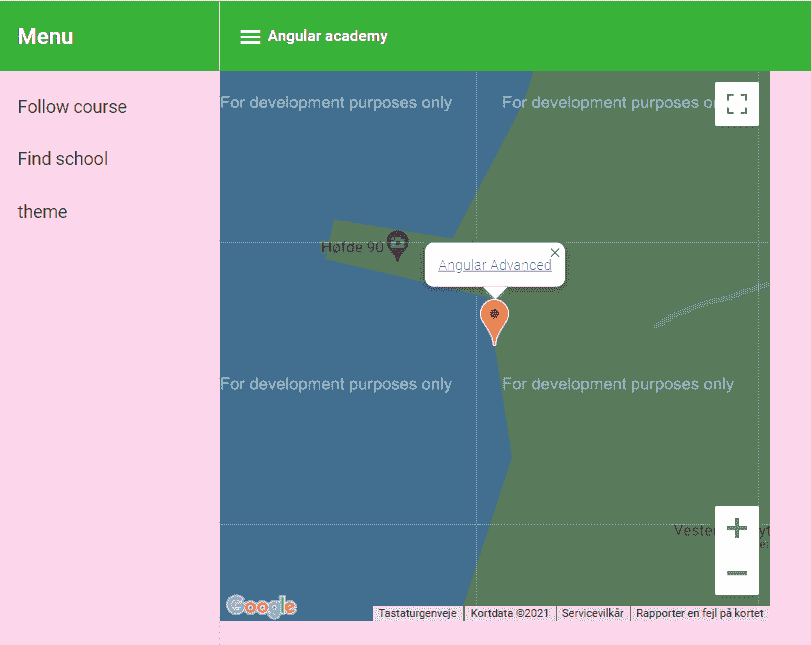

# 第三章：*第六章*：使用 Angular 组件

在上一章中，我们介绍了 Angular Academy 应用程序，并通过演示如何使用 CSS 自定义属性来控制主题属性和 CSS 网格布局，简要地触及了其表面。在本章中，我们将深入探讨如何使用我们在*第四章*，*探索 Angular 组件功能*中介绍的新 Angular 组件来实现应用程序。

注意，在本章中我们将涉及很多内容，所以我建议如果您想了解 Angular 组件或需要复习，请重新阅读*第四章*，*探索 Angular 组件功能*。本章将介绍如何使用新的官方 Angular 组件，以及如何在我们的 Angular Academy 示例应用程序中将它们连接起来。

更具体地说，在本章中，我们将涵盖以下主题：

+   理解 Angular Academy 应用程序

+   使用 Angular YouTube Player 显示课程视频

+   使用新的 Clipboard 服务

+   使用 Angular Google Maps 组件查找您的学校

如果您和我们一样，那么您可能急于深入了解如何使用新的官方 Angular 组件，但让我们退一步，反思 Angular Academy 应用程序，以便我们了解我们将要构建的内容。

通过这种方式从头开始，我们希望您能够通过看到如何使用服务和导航将它们连接起来，从而对如何使用新组件有一个更具体的理解。

# 理解 Angular Academy 应用程序

在使用组件时，您首先应该考虑的是**用户通过使用组件能够完成什么**，以及在使用案例中需要哪些数据，然后再深入了解您将要使用的组件的细节。

我们对 Angular Academy 应用的主要用途是允许定制视频课程列表，这将向用户提供一个定制的视频列表和视频内容的地理位置信息。为了实现这一点，我们将使用 Angular YouTube Player 来显示视频，并通过 Angular Google Maps（用于**如何实现**）选择学校。课程将由学校创建，课程将包含用户将观看的一个或多个视频。

在确定用例之后，我们现在可以思考一下我们将使用哪些数据，在描述我们将如何显示或使用数据之前。这将使数据检索和存储与不同组件的实际使用更容易分离。因此，在我们使用新的 Angular 组件之前，让我们先建立一个数据模型。

建立数据模型

我们有多种描述数据模型的方式，但为了简洁起见，我们将限制自己使用简单的 TypeScript 接口来描述模型，并使用 Angular 服务与后端进行通信。

我们将使用以下模型来支持我们的用例：

+   学校

+   课程

+   视频

你在前一章中看到的视频列表与一个由学校制作的课程相关。我们将首先给课程一个标题，一个可选的描述，以及一个用户可以观看的视频列表：

```js
export interface ICourse {
  id: string;
  title: string;
  description?: string;
  videos: IVideo[];
}
```

我们需要的每个视频的基本信息包括在哪里可以访问 YouTube 上的视频，上传日期，制作它的作者，以及一个可选的关于它的描述：

```js
export interface IVideo {
  externalId: string;  // YouTube ID
  title: string;
  date: Date;
  author?: string;
  description?: string;
}
```

我们将为每个学校附加一个名称以及纬度和经度，这样我们就可以在地图上找到它们：

```js
export interface ISchool {
  id: string;
  name: string;
  longitude: number;
  latitude: number;
  courses: ICourse[];
}
```

此外，我们将在`courses`数组中描述学校提供的课程。请注意，`courses`数组中的描述将使用 Course 模型作为 School 模型的一部分。Course 接口的共享使用将允许在 Schools 和 Course 组件之间重用逻辑。

## 将应用程序分解为组件

现在，我们将应用程序分为以下三个主要模块。这些模块将在屏幕上分别显示：

+   课程

+   主题

+   学校

Course 组件将使用我们在第五章，“使用 CSS 自定义属性”中引入的布局网格，以及一个视频组件，该组件将通过 Angular YouTube Player 模块显示 YouTube 视频。

主题组件也应该让你想起第五章，“使用 CSS 自定义属性”，在那里我们使用它来通过 CSS 属性控制主题设置。主题设置应该影响 Schools 和 Course 组件的图形显示。

Schools 组件将允许你通过 Angular Google Maps 组件找到你的学校，并允许你从所选学校选择一个课程来跟随（并将你重定向到 Course 组件）。

每个组件都将映射到`app.module.ts`中的导航，如下所示：

```js
const routes: Routes = [
  { path: '', redirectTo: 'course/1', pathMatch: 'full' },
  { path: 'course/:id', component: CourseComponent },
  { path: 'schools', component: SchoolsComponent },
  { path: 'theme', component: ThemeComponent },
];
```

注意，Course 组件将需要一个参数来指定要显示的课程。为了简单起见，我们假设用户已经登录，选择了 ID 为`1`的课程，并将其显示为默认路由。稍后的实现可以添加登录页面和用户模型，这样可以在启动时将用户重定向到所选课程（所选课程可以存储在用户模型中）。我们将在第八章，“附加提供者作用域”中重新讨论这个问题。

现在我们已经将应用程序分解为组件，是时候开始考虑如何为这些模块包含依赖项了。

## 使用模块包含依赖项

我们将首先将应用程序指定为一个模块，该模块导入 Course、Schools 和 Theme 模块：

```js
@NgModule({
  bootstrap: [AppComponent],
  declarations: [AppComponent, NavigationComponent],
  imports: [
    CommonModule,
    BrowserAnimationsModule,
    RouterModule.forRoot(routes, { initialNavigation: 
     'enabledNonBlocking' }),
    LayoutModule,
    CourseModule,
    SchoolsModule,
    ThemeModule,
    MaterialModule,
  ],
})
export class AppModule {}
```

课程模块将包括视频模块：

```js
@NgModule({
  declarations: [CourseComponent],
  imports: [CommonModule, ThemeModule, VideoModule, 
   MaterialModule],
  exports: [VideoModule],
})
export class CourseModule {}
```

Video 模块将包括`YouTubePlayerModule`和`ClipboardModule`依赖项：

```js
@NgModule({
  declarations: [VideoComponent],
  imports: [
    CommonModule
    YouTubePlayerModule,
    ClipboardModule,
  ],
  exports: [VideoComponent],
})
export class VideoModule {}
```

最后，Schools 模块将包括`GoogleMapsModule`：

```js
@NgModule({
  declarations: [SchoolsComponent],
  imports: [CommonModule, MaterialModule, 
   GoogleMapsModule],
})
export class SchoolsModule {}
```

你注意到我们只包括了所需的特定依赖项吗？这种构建应用程序的方式可以帮助您更清晰地了解应用程序中的依赖关系。

## 使用服务检索数据

现在我们已经指定了示例数据模型并将应用程序划分为模块，是时候指定我们将如何从组件中访问数据了。我们将使用以下 Angular 服务来完成这项工作：

+   `CourseService`

+   `SchoolsService`

每个服务都将被设置为异步获取数据。这里的主要区别是`CourseService`将一次检索一个课程，而`SchoolsService`将一次检索多个学校。

`CourseService`将有一个`getCourse`调用，用于检索单个课程：

```js
@Injectable({
  providedIn: 'root'
})
export class CourseService {
  constructor() { }
  getCourse(courseId: string): Observable<ICourse> {
    return of(mockCourse);
  }
}
```

课程模型将包含要显示的课程视频列表。

重要提示

在这里，我们使用模拟数据，但这种方法应该可以说明您如何通过`Course`组件从服务器实现异步数据检索。

同样，我们将介绍`SchoolsService`，它将检索提供课程的学校列表：

```js
@Injectable({
  providedIn: 'root'
})
export class SchoolsService {
  constructor() { }
  getSchools():  Observable<ISchool[]> {
      return of(mockSchools);
  }
}
```

在这里，我们将通过`getSchools`调用返回几个学校。我们的想法是，每个返回的学校都应该提供链接到一或多个可以通过`CourseService`检索的课程。我们将通过在“学校”组件中提供学校提供的课程链接来展示这一点。

## 连接导航

为了简单起见，我们假设用户已经注册了学校，这样我们就可以将用户引导到所选学校中的课程。在这里，默认链接将在启动时通过默认路由显示所选学校中的课程视频。

我们将首先设置屏幕左侧导航组件中 Material 侧边导航容器的链接，如下所示：

```js
   <mat-nav-list>
      <a mat-list-item href="/#">Watch course</a>
      <a mat-list-item href="/schools">Find school</a>
      <a mat-list-item href="/theme">Edit theme</a>
  </mat-nav-list>

```

在这里，您可以看到默认路由`/`将有一个标题为**观看课程**。这将在路由描述中映射到课程组件。

在建立了导航和数据模型，并将应用程序划分为模块之后，我们可以开始描述如何在 Angular Academy 应用程序中使用 Angular 组件。我们将首先描述如何使用 Angular YouTube Player 来显示课程视频。

# 使用 Angular YouTube Player 显示课程视频

在本节中，我们将创建一个单独的视频组件来显示与课程相关联的视频。为了简单起见，我们将在视频组件内部接受`@Input`信息，如下所示：

```js
 @Component({
  selector: 'workspace-video',
  templateUrl: './video.component.html',
  styleUrls: ['./video.scss'],
})
export class VideoComponent implements OnDestroy, OnInit {
  private youtubeIframeScript: HTMLScriptElement;
  @Input()
  public title!: string;
  @Input()
  public name!: string;
  @Input()
  public videoId!: string;
  @Input()
  public description!: string;
  @Input()
  public snippet!: string;
  get youtubeLink () {
   return this.title 
     + ": https://www.youtube.com/watch?v="+this.videoId;
  }
  constructor(@Inject(DOCUMENT) private document: Document) {
    this.youtubeIframeScript = 
     this.document.createElement('script');
    this.youtubeIframeScript.src = 
     'https://www.youtube.com/iframe_api';
    this.youtubeIframeScript.async = true;
  }
  ngOnInit(): void {
    this.document.body.appendChild(
     this.youtubeIframeScript);
  }
  ngOnDestroy(): void {
    this.document.body.removeChild(
     this.youtubeIframeScript);
  }
} 
```

这段代码应该与您在*第四章*，“探索 Angular 组件功能”的介绍中很熟悉，在那里我们介绍了如何使用它。现在我们可以编写视频组件的模板来显示 YouTube 视频，如下所示：

```js
<div class="container">
  <div class="tile video">
    <p>
      <youtube-player videoId="{{ videoId }}"></youtube-
       player>
    </p>
    <p>
      <button [cdkCopyToClipboard]="youtubeLink">Copy video 
       link to clipboard</button>
    </p>
  </div>
  <div class="tile text">
    <h3>
      <i>{{ title }}</i>
    </h3>
    <p>{{ description }}</p>
 </div>
</div>
```

您还记得我们如何在上一章中使用自定义的 `videoSize` CSS 属性来调整网格列的大小吗？这项努力正在得到回报 – 我们在这里只需要引用 `video` 类（根本不直接引用动态大小）。对 `tile` 类的引用使我们能够使用主题组件来操作瓦片颜色设置。

您也注意到我们在这里如何引入 `cdkCopyToClipboard` 功能了吗？当您想在桌面应用程序中从运行的应用程序中提取数据到剪贴板时，这个功能可能会很有用。

在建立了 Video 组件之后，我们现在可以从 Course 组件中使用它，如下所示：

```js
<ng-container *ngIf="course$ | async as course">
  {{ course.title }}
  <div *ngFor="let video of course.videos">
    <workspace-video
      videoId="{{video.externalId}}"
      title="{{video.title}}"
      description="{{video.description}}"
    >
    </workspace-video>
  </div>
</ng-container>
```

注意在 `course$` 上使用 `async` 管道操作符。在这里，我们正在等待数据被检索，以便我们可以开始使用 Video 组件渲染视频。

现在我们已经介绍了如何使用 Angular YouTube Player 显示课程视频，我们将学习如何使用 Angular Google Maps 组件查找学校，并展示从 School 组件到 Course 组件的导航工作方式。

# 使用 Angular Google Maps 组件查找您的学校

Schools 组件将允许您通过点击学校放置的标记在 Google Maps 中查找学校。这将打开 **MapInfo** 窗口，您可以在其中点击可以观看的学校课程。点击此课程将带您到之前章节中看到的课程概述。

您可以通过点击 Angular Academy 应用程序中的 **查找学校** 菜单条目来找到 Schools 组件。这将渲染 Schools 组件，您将看到示例 **Angular Advanced** 学校。

当您在 Angular Academy 应用程序中打开 Schools 组件时，它应该以红色默认 Google Maps 标记打开。如果您点击它，那么您的显示应该看起来像这样：



图 6.1 – 打开红色 Google Maps 标记

如果您在地图信息窗口中点击 **Angular Advanced** 链接，您将被转移到具有 **Angular Advanced** 课程 ID 的课程组件。

我们期望 Schools 组件地图信息窗口中传入的课程数据来自 Schools 服务，作为一个异步调用，如图所示：

```js
@Component({
  selector: 'workspace-schools',
  templateUrl: './schools.component.html',
  styleUrls: ['./schools.component.scss'],
})
export class SchoolsComponent {
  @ViewChild(GoogleMap, { static: false }) map!: GoogleMap;
  @ViewChild(MapInfoWindow, { static: false }) info!: 
   MapInfoWindow;
  school!: ISchool;
  schools$: Observable<ISchool[]>;
  constructor(
    schoolsService: SchoolsService
  ) {
    this.schools$ = schoolsService.getSchools();
  }
  openInfo(anchor: MapAnchorPoint, school: ISchool): void {
    this.school = school;
    this.info.open(anchor);
  }
}
```

在这里，您可以看到我们如何在 `openInfo` 调用中点击地图锚点时打开 `MapInfoWindow`。

我们将在 Angular Google Maps 组件的 `mapClick` 函数上注册 `openInfo` 调用，并使其打开一个显示学校提供的课程链接的 **MapInfo** 窗口：

```js
<ng-container *ngIf="schools$ | async as schools">
  <google-map [center]="{ lat: 56.783778, lng: 8.228937 }">
    <map-marker
      *ngFor="let school of schools"
      #marker="mapMarker"
      [position]="{ lat: school.longitude, lng: 
       school.latitude }"
      (mapClick)="openInfo(marker, school)"
    ></map-marker>
    <map-info-window>
      <div *ngFor="let course of school?.courses">
        <a href="course/{{ course.id }}"> {{ course.title 
         }} </a>
      </div>
    </map-info-window>
  </google-map>
</ng-container>
```

注意在 `schools$` 可观察对象上使用异步管道。这将使学校数据在 `schools` 变量中可用。结合 `<ng-container>` 上的 `NgIf`，您可以在数据可用之前停止渲染数据。

如果您还没有尝试过，我建议您尝试通过点击**查找您的学校**并点击**Angular 高级**课程来找到课程列表。

您是否注意到课程列表是通过从学校数据模型中检索到的课程 ID 来打开的？在我们的示例应用程序中，我们已经注册了`course/:id`路由来通过`id`参数打开课程组件。目前，我们假设用户只有一个课程可用，并且该课程在启动时被选中。这个简单的例子有助于说明 Angular Academy 的基本流程是如何设计的。在更现实的场景中，我们会允许用户登录，并将选中的课程存储在会话中。我们将在*第八章*，*附加提供者作用域*中重新讨论这个问题，我们将介绍用户登录。

# 摘要

在本章中，我们通过提供一个具体的 Angular Academy 应用程序的例子，向您介绍了如何使用新的 Angular 组件。该例子包括如何使用服务检索数据以及如何通过 Angular 模块结构化依赖项的包含。在下一章中，我们将描述如何使用 Angular 组件 Harnesses 的测试作为用户的方法。
