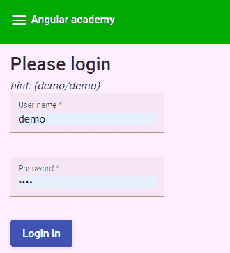

# 第五章：*第八章*：额外的提供者作用域

本章旨在解释如何使用依赖注入作用域在 Angular Ivy 中开发更精简的组件和功能。为了探索这些功能，我们将学习如何创建非单例服务以及如何在 Angular 元素之间重用依赖项。

我们将通过修改主题服务，使其能够在使用`any`提供者作用域的不同场景中接受特定配置，并重新配置学校和课程模块以进行懒加载来引入`any`提供者作用域。

然后，我们将通过构建一个新的登录元素来结束*第二部分，使用您学到的 Angular Ivy 功能构建真实世界的应用程序*，该元素展示了如何通过使用 Angular Elements 的平台提供者作用域来跨应用程序边界共享信息。

我们在本章中将涵盖以下主题：

+   重新审视根提供者作用域

+   使用任何提供者作用域的可配置主题服务

+   使用平台提供者作用域在应用程序边界之间共享信息

在我们深入探讨新提供者作用域的细节之前，让我们花一点时间回顾一下我们迄今为止使用根提供者作用域引入的服务。

# 重新审视根提供者作用域

到目前为止，我们在 Angular Academy 应用程序中使用根作用域提供者讨论了以下服务：

+   `SchoolsService`：检索有关可用学校的详细信息。

+   `CourseService`：检索有关课程的详细信息。

+   `ThemeService`：设置和检索有关当前主题的详细信息。

这些服务作为单例在应用程序中一直为我们服务得很好——通过`Injectable`装饰器标记服务以使用`providedIn: 'root'`使得它们在标准用例中很容易使用。如果您从 Angular 的早期阶段就开始使用，那么您可能已经习惯了在每个特定模块中将服务作为依赖项进行注入——例如，您可能想知道为什么`SchoolsService`没有列在学校的模块的提供者数组中：

```js
@NgModule({
  declarations: [SchoolsComponent],
  imports: [CommonModule, GoogleMapsModule],
  exports: [SchoolsComponent],
})
export class SchoolsModule {}
```

我们不需要在这里插入显式的提供者，因为我们从 Angular 版本 6 以来就有可摇树振的提供者。我们现在可以只依赖`injectable`装饰器。这使得 Angular 模块更加精简且易于配置，我们可以在以后提供服务的替代实现。

在根作用域上提供单例服务本身听起来很有用（在第六章*Chapter 6*中效果很好，*使用 Angular 组件*）。但如果我们想针对每个用例拥有特定的服务实例呢？实际上，我们可以通过使用主题服务的任何提供者作用域并将模块改为懒加载而不是默认的急加载来实现这一点。让我们深入了解如何做到这一点。

# 使用可配置的 ThemeService 的任何提供者作用域

让我们使用任何提供者作用域为可配置的 `ThemeService` 注入可配置设置，这些设置取决于我们加载的每个模块的使用情况：

```js
@Injectable({
  providedIn: 'any',
})
export class ThemeService {
  constructor(@Inject(themeToken) private theme: ITheme) {}
  public setSetting(name: string, value: string): void {
    this.setItem(name, value);
  }
  public getSetting(name: string): string {
    switch (name) {
      case 'background':
        return this.getItem(name) ?? this.theme.background;
      case 'tileBackground':
        return this.getItem(name) ?? 
         this.theme.tileBackground;
      case 'headerBackground':
        return this.getItem(name) ?? 
         this.theme.headerBackground;
      case 'textSize':
        return this.getItem(name) ?? this.theme.textSize;
      case 'videoSize':
        return this.getItem(name) ?? this.theme.videoSize;
    }
    return 'white';
  }
  private setItem(name: string, value: string): void {
    localStorage.setItem(this.prefix(name), value);
  }
  private getItem(name: string): string | null {
    return localStorage.getItem(this.prefix(name));
  }
  private prefix(name: string): string {
    return this.theme.id + '_' + name;
  }
}
```

我们在第 *第五章** 中介绍了主题服务，即使用 CSS 自定义属性*。让我们通过引入一个用于主题的 `InjectionToken` 实例来使其可配置：

```js
import { InjectionToken } from '@angular/core';
import { ITheme } from './theme/theme.model';
export const themeToken = new InjectionToken<ITheme>('theme');
```

主题令牌持有实现 `ITheme` 接口的配置设置：

```js
export interface ITheme {
  id: string;
  background: string;
  headerBackground: string;
  tileBackground: string;
  textSize: string;
  videoSize: string;
}
```

我们可以在 `AppModule` 中使用 `InjectionToken` 令牌 `theme` 通过这些值使用 `green` 主题：

```js
import { ITheme } from './app/theme/theme.model';
export const theme: ITheme = {
  id: 'green',
  background: '#f8f6f8',
  tileBackground: '#f4ecf4',
  headerBackground: '#00aa00',
  textSize: '3',
  videoSize: '7',
};
```

注意，配置的设置将是起始值。用户仍然可以在系统运行时更改它们。

现在，我们可以使用主题服务将主题设置注入到注入器作用域。当我们使用任何提供者作用域时，我们可以为每个注入服务的懒加载模块获取一个实例。以下是一个片段，展示了如何通过应用程序路由模块重新配置模块以进行懒加载，同时在 `AppModule` 中运行 `green` 主题：

```js
// (...)
import { themeToken } from './theme.token';
import { theme } from '../green.theme';
import { AppRoutingModule } from './app-routing.module';
// (...)
@NgModule({
  declarations: [AppComponent],
  imports: [
    // (...)
    AppRoutingModule,
  ],
  providers: [
    {
      provide: themeToken,
      useValue: theme,
    },
  ],
  bootstrap: [AppComponent],
})
export class AppModule {}
```

在这里，我们在应用程序模块作用域上为 `ThemeService` 提供默认设置。每个模块的依赖项将像这样从 `AppRoutingModule` 内部动态加载：

```js
const routes: Routes = [
  {path: '', redirectTo: 'login', pathMatch: 'full',},
  {
    path: 'course',
    loadChildren: () =>
      import('./course/course.module').then((m) => 
       m.CourseModule),
  },
  {
    path: 'login',
    loadChildren: () =>
      import('./login/login.module').then((m) => 
       m.LoginModule),
  },
  {
    path: 'schools',
    loadChildren: () =>
      import('./schools/schools.module').then((m) => 
       m.SchoolsModule),
  },
  {
    path: 'theme',
    loadChildren: () =>
      import('./theme/theme.module').then((m) => 
       m.ThemeModule),
  },
];
```

然后，我们需要为每个模块建立路由模块。以课程模块为例，其路由模块看起来如下所示：

```js
import { CourseComponent } from './course.component';
const routes: Routes = [{ path: ':id', component: CourseComponent }];
@NgModule({
  imports: [RouterModule.forChild(routes)],
  exports: [RouterModule],
})
export class CourseRoutingModule {}
```

我们已经在应用程序模块的 `Provider` 作用域中定义了设置，该模块使用课程模块，因此如果我们想为模块使用 `green` 主题，则不需要在此处重新定义它。但如果我们想使用另一个主题，则可以通过 `theme` 令牌引入另一个主题配置，如下所示：

```js
import { ITheme } from './app/theme/theme.model';
export const theme: ITheme = {
  id: 'metallic',
  background: '#ffeeff',
  tileBackground: '#ffefff',
  headerBackground: '#ccbbcc',
  textSize: '3',
  videoSize: '7',
};
```

我们可以通过平台注入器作用域使用 `metallic` 主题在懒加载的 `LoginModule` 上，如下所示：

```js
// (...)
import { theme } from '../../metallic.theme'
// (...)
@NgModule({
  declarations: [LoginComponent],
  imports: [
    CommonModule,
    MaterialModule,
    FormsModule,
    ReactiveFormsModule,
    LoginRoutingModule,
  ],
  providers: [
    {
      provide: themeToken,
      useValue: theme,
    },
  ],
})
export class LoginModule {}
```

由于我们正在懒加载登录模块，我们现在将创建主题服务的新的实例 – 这样 `login` 组件就可以使用 `metallic` 主题而不是像应用程序其余部分一样使用 `green` 主题。通过这种方式，我们可以使用主题服务的实例使用 `green` 主题渲染工具栏，并使用 `metallic` 主题渲染 `login` 组件，如下所示：



图 8.1 – 登录屏幕。请注意，这里的背景来自金属主题

这将是您启动 Angular Academy 应用程序时看到的第一个屏幕。请注意，金属卡片背景是在 `login.component.scss` 文件中设置的，使用了您在 *第五章** 中学习到的机制，即使用 CSS 自定义属性*：

```js
.mat-card {
  background: var(--background, green);
}
```

`background` 变量将在 `LoginComponent` 中设置，如下所示：

```js
@Component({
  selector: 'workspace-login',
  templateUrl: './login.component.html',
  styleUrls: ['./login.component.scss'],
})
export class LoginComponent {
  @HostBinding('style.--background')
  background: string;
  loginForm: FormGroup;
  constructor(
    public fb: FormBuilder,
    public authService: AuthService,
    private themeService: ThemeService
  ) {
    this.background = themeService.getSetting(
     'background');
    this.loginForm = this.fb.group({
      name: [''],
      password: [''],
    });
  }
  loginUser(): void {
    this.authService.login(this.loginForm.value);
  }
}
```

`LoginComponent` 将用户信息从 `loginForm` 传递到 `AuthService`：

```js
@Injectable({
  providedIn: 'platform',
})
export class AuthService {
  public loginEvent: EventEmitter<string> = new 
   EventEmitter();
  login(user: IUser): void {
    if (user.name === 'demo' && user.password === 'demo') {
      this.token = 'thisTokenShouldBeProvidedByTheBackend';
      this.loginEvent.emit(this.token);
    }
  }
  logout(): void {
    this.token = '';
  }
  set token(value: string) {
    localStorage.setItem('token', value);
  }
  get token(): string {
    return localStorage.getItem('token') ?? '';
  }
}
```

注意，我们在这里使用了一种非常简单的方法来为 `demo` 用户获取 `login` 令牌，密码为 `demo`。这个例子可以被扩展，以调用您选择的后端，并在这样做之后提交 `LoginEvent`。

策略是这样的：我们可以像这样对 `LoginEvent` 做出反应：

```js
  this.authService.loginEvent.subscribe((token: string) => {
      const courseId: string | null = 
       this.preferenceService.getCourseId();
      if (courseId) {
        router.navigate(['/course', courseId]);
      } else {
        router.navigate(['/schools']);
      }
    });
```

到目前为止，我们希望您已经有机会尝试使用 Angular Academy 应用程序，看看事物是如何连接在一起的。您注意到在第二次登录后，您会被直接重定向到 Angular Academy 中的课程吗？第一次登录时，您应该有机会从地图中选择一所学校——然后从学校中选择一个课程。当您选择一个课程时，这将通过偏好服务进行存储。然后可以使用这个偏好将用户重定向到课程。

Angular Academy 应用程序使用一些相当复杂的导航逻辑，这些逻辑仅在应用内部相关——但如果我们想在应用外部共享信息呢？我们可以通过结合使用 `platform` 提供者作用域和 Angular 元素来实现这一点。

# 使用平台提供者作用域在应用程序边界之间共享信息

我们可以通过创建一个作为 Angular 元素的推文按钮来展示如何在外部共享信息。这个 Angular 元素也可以在应用外部使用。让我们深入了解如何做到这一点。

首先，我们将通过运行以下命令将 Angular 元素添加到应用中：

```js
ng add i @angular/elements
```

然后，我们像这样在页面中包含 Twitter 小部件 SDK：

```js
  <script
      src="img/widgets.js"
      type="text/javascript"
    ></script
```

然后，我们可以使用 `TweetCourse` 组件构建一个推文标签按钮，如下所示：

```js
<ng-container *ngIf="course$ | async as course">
  <a
    href="https://twitter.com/intent/tweet?button_hashtag=     {{ course.hashtag }}"
    class="twitter-hashtag-button"
    >Tweet {{ course.hashtag }}</a
  >
</ng-container>
```

`TweetCourse` 组件使用 `CourseService` 和平台提供者作用域来检索数据：

```js
@Component({
  selector: 'workspace-tweetcourse',
  templateUrl: './tweetcourse.component.html',
})
export class TweetCourseComponent implements OnInit {
  @Input()
  courseId!: string;
  public course$: Observable<ICourse> | undefined;
  constructor(
    private courseService: CourseService
  ) {
  }
  ngOnInit(): void{
    this.course$ = this.courseService.getCourse(
     this.courseId);
  }
}
```

现在，我们像这样注册 `TweetCourseComponent` 作为 Angular 元素：

```js
export class AppModule implements DoBootstrap {
  constructor(private injector: Injector) {
    const el = createCustomElement(TweetCourseComponent, {
      injector: this.injector,
    });
    customElements.define('tweet-course', el);
  }
  ngDoBootstrap(): void {}
}
```

然后，它可以作为一个 Web 组件使用：

```js
  <tweet-course courseId="1"></tweet-course>
```

由于 `CourseService` 已在平台提供者作用域上注册，我们现在可以从我们新的 `<tweet-course>` Angular 元素以及我们的 Angular Academy 应用程序内部使用它。

我们在应用程序桌面版本的导航栏中插入 `<tweet-course>` 元素，如下所示，在导航组件内部：

```js
    <mat-nav-list>
      <a *ngIf="!token" mat-list-item 
       href="/login">Login</a>
      <ng-container *ngIf="token">
        <a mat-list-item *ngIf="courseId" 
         routerLink="course/{{ courseId }}"
          >Follow course</a
        >
        <a mat-list-item routerLink="/schools">Find 
         school</a>
        <a mat-list-item routerLink="/theme">Theme</a>
        <a *ngIf="token" mat-list-item (click)="logout()" 
         href="#">Logout</a>
      </ng-container>
      <ng-container *ngIf="courseId">
        <tweet-course courseId="courseId"></tweet-course>
      </ng-container>
    </mat-nav-list>
```

在这里，您可以看到，如果您已经选择了一个课程（如果您有一个 `courseId` 实例），则 `<tweet-course>` 元素应该在侧边栏中渲染。它应该看起来像这样：


图 8.2 – 介绍 Tweet #AcceleratingIvy 按钮

如果您在点击 `#AcceleratingIvy` 标签时已登录 Twitter。如果您在课程服务中为您的课程注册另一个标签，那么这个标签将被展示。

也许您有其他想法，可以将组件用于应用程序之外？您注意到我们将 `AuthService` 标记为 `providedIn:` `'platform'` 吗？您可以导出 `Login` 组件作为 Angular 元素，并将其更新以集成到您自己的应用程序平台中，以执行单点登录。

# 摘要

在本章中，我们首先扩展了根提供者作用域的使用，并在 Angular Academy 应用程序上下文中介绍了新的 `any` 和 `platform` 提供者作用域。然后，我们通过应用 `AppRoutingModule` 中的延迟加载来介绍 `any` 提供者作用域，这使得我们可以为 `LoginModule` 使用单独的主题。最后，我们看到了如何创建一个可以与平台提供者作用域一起使用的推文按钮。

在下一章中，我们将开始介绍本书的第三部分，即升级您的视图引擎应用程序和开发工作流程到 Angular Ivy，并探讨迁移和使用 Angular Ivy 的更多实际方面。
