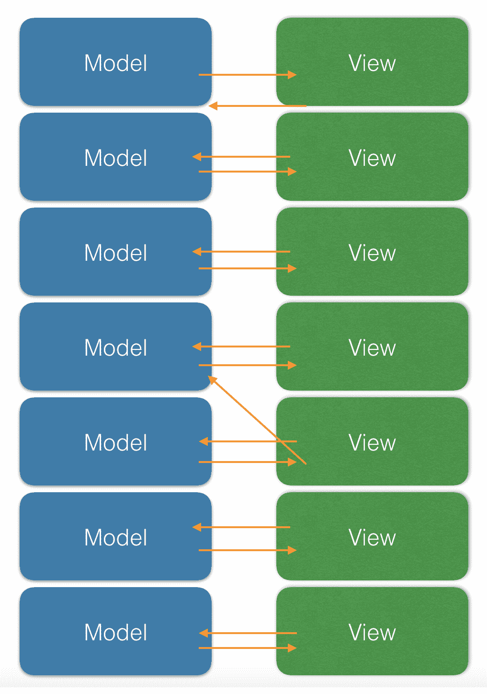
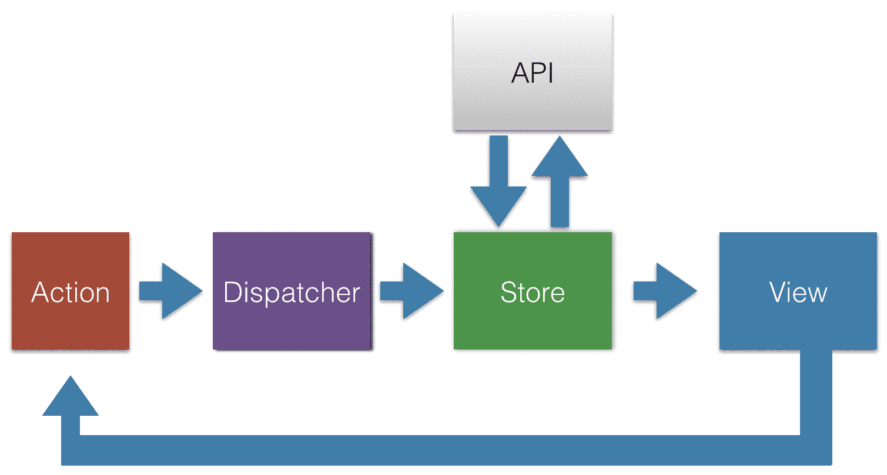
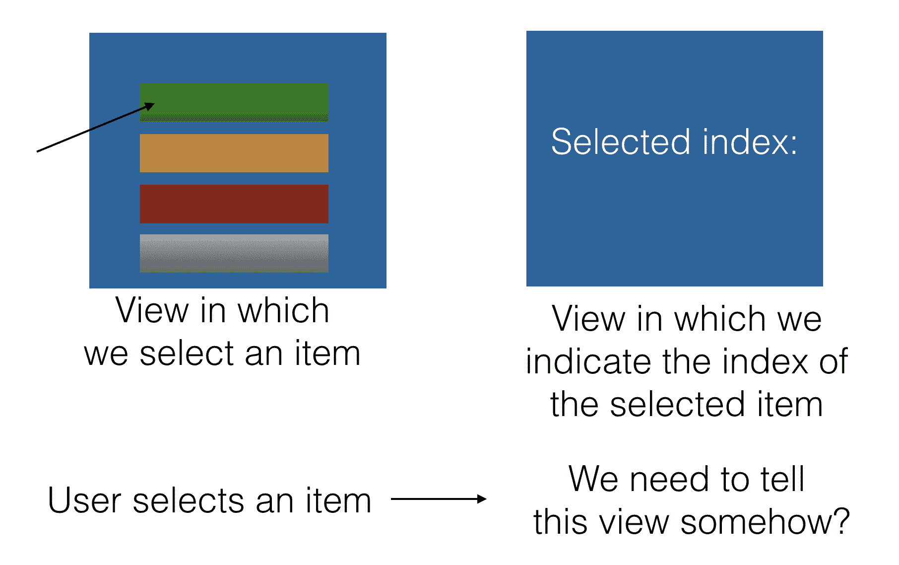
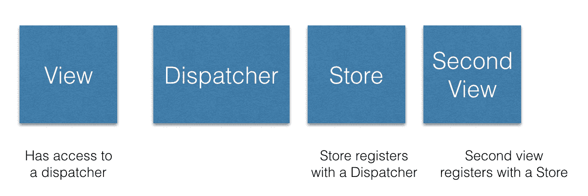
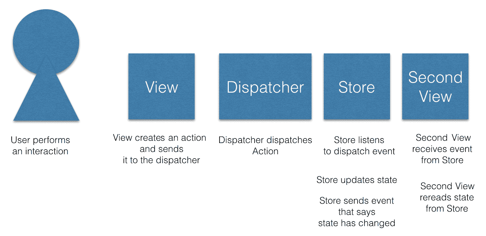
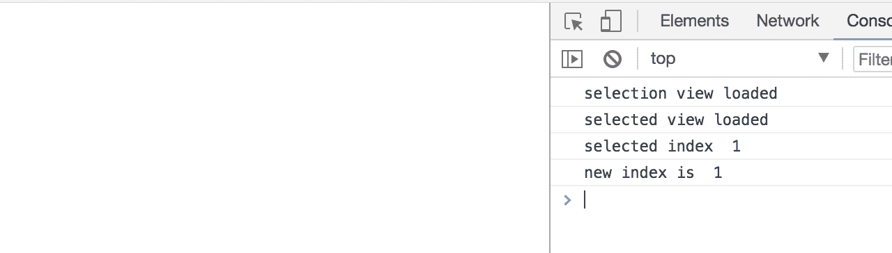
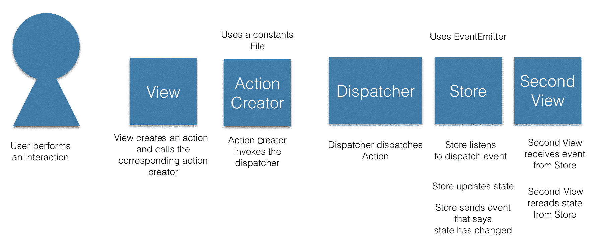
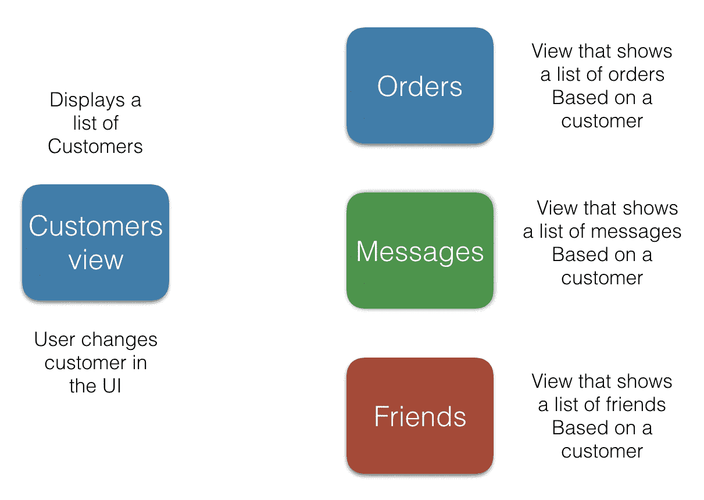

# 1.21 吉瓦 – Flux 模式解释

让我们先来解释一下我们的标题。我们所说的 1.21 吉瓦是什么意思？我将引用电影《回到未来》中的角色 Doc Brown 的话（[`www.imdb.com/name/nm0000502/?ref_=tt_trv_qu`](http://www.imdb.com/name/nm0000502/?ref_=tt_trv_qu)）:

"马蒂，我很抱歉，但唯一能够产生 1.21 吉瓦电力的电源是一道闪电。"

为什么我们要谈论电影《回到未来》？这就是 Flux 这个名字的由来。现在，是时候从同一部电影中引用另一句话了：

"是的！当然！1955 年 11 月 5 日！那就是我发明时间旅行的日子。我记忆犹新。我站在马桶边缘挂钟，瓷器是湿的，我滑倒了，头撞到了水槽上，当我醒来时，我有一个启示！一个愿景！一个脑海中的画面！这就是这个画面！这就是使时间旅行成为可能的原因：**flux**电容器！"

所以，正如你所看到的，Flux 这个名字有一个解释。它显然允许我们进行时间旅行。至少对于 Redux 来说，我们将在本书的后面部分讨论，时间旅行可以通过称为时间旅行调试的东西来实现。是否需要一道闪电，亲爱的读者，将由你来发现。

Flux 是由 Facebook 创建的一种架构模式。它是在人们意识到 MVC 模式根本无法扩展的情况下出现的。对于大型代码库来说，它无法扩展，因为它们往往变得脆弱，随着越来越多的功能被添加，通常变得复杂，最重要的是，不可预测。现在让我们暂停一下，关注一下“不可预测”这个词。

人们认为大型系统变得不可预测，因为当模型和视图的数量真正增长时，它们在模型和视图之间出现了双向数据流，如下面的图所示：



在这里，我们可以看到模型和视图的数量开始增长。只要一个模型与一个视图通信，反之亦然，一切似乎都在控制之中。然而，这种情况很少发生。在前面的图中，我们可以看到视图突然可以与多个模型通信，反之亦然，这意味着系统出现了级联效应，我们突然失去了控制。当然，只有一个偏离的箭头看起来并不那么糟糕，但想象一下，如果这是一十个箭头，那么我们真的会遇到大问题。

正是因为我们允许双向数据流发生，事情才变得复杂，我们失去了可预测性。针对这种情况的药物或治疗方法被认为是一种更简单的数据流类型，即单向流。现在，有一些关键角色参与启用单向数据流，这把我们带到了本章旨在教给我们的内容。

在本章中，我们将学习：

+   动作和动作创建者的定义

+   分发器如何在您的应用程序中扮演中心角色，作为消息的中心

+   使用存储进行状态管理

+   如何通过编写 Flux 应用程序流程来将我们对 Flux 的知识付诸实践

# 核心概念概述

Flux 模式的核心是一个单向数据流。它使用一些核心概念来实现这种流。主要思想是当在 UI 上创建一个事件，通过用户的交互，会创建一个动作。这个动作由意图和有效载荷组成。意图是你试图实现的目标。将意图视为一个动词。添加项目、删除项目等等。有效载荷是需要发生以实现我们意图的数据更改。如果我们试图添加一个项目，那么有效载荷就是新创建的项目。然后，在调度器的帮助下，动作在流程中传播。动作及其数据最终进入存储。

构成 Flux 模式的概念包括：

+   动作和动作创建者，其中我们设置了一个意图和数据有效载荷

+   调度器，我们网络中的蜘蛛，能够左右发送消息

+   存储，我们中央的状态和状态管理的地方

所有这些共同构成了 Flux 模式，并促进了单向数据流。考虑以下图示：



这里展示的是一个非方向性数据流。数据从**视图**流向**动作**，从**动作**流向**调度器**，从**调度器**流向**存储**。触发流程有两种可能的方式：

+   应用程序首次加载时，数据将从**存储**中拉取以填充视图。

+   视图中发生用户交互，导致改变某物的意图。这个意图封装在一个**动作**中，然后通过**调度器**发送到**存储**。在**存储**中，它可能通过**API**持久化到数据库中，或保存为应用程序状态，或者两者兼而有之。

让我们在接下来的章节中更详细地探讨每个概念，同时突出一些代码示例。

# 统一数据流

让我们从最顶层开始介绍我们统一数据流中的所有参与者，并逐步向下，概念到概念。我们将构建一个包含两个视图的应用程序。在第一个视图中，用户将从列表中选择一个项目。这应该会导致创建一个动作。然后，通过调度器，这个动作将被分发。动作及其有效载荷将最终进入存储。与此同时，另一个视图监听存储的变化。当选择一个项目时，第二个视图将得知并可以在其用户界面中指示已选择特定项目。从高层次来看，我们的应用程序及其流程将如下所示：



# 动作 – 捕获意图

动作是像意图伴随数据一样简单的东西，即消息。然而，动作是如何产生的呢？动作是在用户与 UI 交互时产生的。用户可能在列表中选择一个特定的项目，或者按下按钮以提交表单。提交表单应该反过来导致创建一个产品。

让我们看看两种不同的动作：

+   在列表中选择一个项目，我们感兴趣的是保存所选项目的索引

+   将待办事项保存到待办事项列表

动作由一个对象表示。该对象有两个有趣的属性：

+   类型：这是一个唯一的字符串，告诉我们动作的意图，例如，`SELECT_ITEM`

+   数据：这是我们打算持久化的数据，例如，所选项目的数值索引

给定我们的第一个示例动作，该动作的代码表示如下：

```js
{
  type: 'SELECT_ITEM',
  data: 3 // selected index
}
```

好的，所以我们已经准备好了我们的动作，我们也可以将其视为消息。我们希望消息被发送，以便在 UI 中突出显示所选项目。由于这是一个单向流，我们需要遵循既定的路线，并将我们的消息传递给下一方，即调度器。

# 调度器 – 网络中的蜘蛛

将调度器视为网络中处理传递给它的消息的蜘蛛。你也可以将调度器视为一个邮递员，他承诺你的消息将到达目标目的地。调度器存在的一个原因是为了将消息发送给任何愿意监听的人。在一个 Flux 架构中通常只有一个`dispatcher`，典型的用法看起来像这样：

```js
dispatcher.dispatch(message);
```

# 监听调度器

我们已经确定调度器将消息发送给任何愿意监听的人。现在是我们成为那个监听者的时刻。调度器需要一个`register`或`subscribe`方法，这样你，作为监听者，就有能力监听传入的消息。这种设置的通常看起来是这样的：

```js
dispatcher.register(function(message){});
```

现在，当你以这种方式设置监听器时，它将能够监听任何正在发送的消息类型。你希望缩小这个范围；通常，监听器被指定为只处理围绕某个主题的少数几种消息类型。你的监听器可能看起来像这样：

```js
dispatcher.register((message) => {
  switch(message.type) {
    case 'SELECT_ITEM':
      // do something
  }
});
```

好的，所以我们能够过滤出我们关心的消息类型，但在实际填写代码之前，我们需要考虑这个监听者是谁。答案是简单的：它是存储。

# 存储 – 管理状态、数据检索和回调

容易将存储视为我们的数据所在的地方。然而，这并不是它的全部。存储的职责可以通过以下列表来表示：

+   持有状态

+   管理状态，能够在需要时更新它

+   能够处理副作用，例如通过 HTTP 获取/持久化数据

+   处理回调

如您所见，这不仅仅是存储状态。现在让我们重新连接到我们在设置`dispatcher`监听器时所做的操作。让我们将这段代码移动到我们的存储文件`store.js`中，并将我们的消息内容持久化到存储中：

```js
// store.js

let store = {};

function selectIndex(index) {
  store["selectedIndex"] = index;
}

dispatcher.register(message => {
  switch (message.type) {
    case "SELECT_INDEX":
      selectIndex(message.data);
      break;
  }
});
```

好的，所以现在存储已经被告知新的索引，但缺少一个重要的部分，我们如何告诉 UI？我们需要一种方法来告诉 UI 发生了变化。变化意味着 UI 应该重新读取其数据。

# 视图

为了告诉视图发生了什么并对其采取行动，需要发生三件事：

+   视图需要向存储注册为监听器

+   存储需要发出一个事件，传达已发生更改

+   视图需要重新加载数据

从存储开始，我们需要构建它，以便您可以注册为它的事件监听器。因此，我们添加了`addListener()`方法：

```js
// store-with-pubsub.js

function selectIndex(index) {
  store["selectedIndex"] = index;
}

// registering with the dispatcher
dispatcher.register(message => {
  switch (message.type) {
    case "SELECT_INDEX":
      selectIndex(message.data);

      // signals to the listener that a change has happened
      store.emitChange();
 break;
 }
});

class Store {
  constructor() {
    this.listeners = [];
  }

  addListener(listener) {
 if (!this.listeners["change"]) {
      this.listeners["change"] = [];
    }
 this.listeners["change"].push(listener);
  }

  emitChange() {
    if (this.listeners["change"]) {
      this.listeners["change"].forEach(cb => cb());
    }
  }

  getSelectedItem() {
    return store["selectedIndex"];
  }
}

const store = new Store();
export default store;
```

在前面的代码中，我们还添加了通过添加`emitChange()`方法来发出事件的能力。您可以通过轻松切换此实现来使用`EventEmitter`或类似的东西。所以现在是我们将视图连接到存储的时候了。我们通过调用`addListener()`方法来实现这一点：

```js
// view.js

import store from "./store-with-pubsub";

class View {
  constructor(store) {
    this.index = 0;
    store.addListener(this.notifyChanged);
  }

  // invoked from the store
  notifyChanged() {
    // rereads data from the store
 this.index = store.getSelectedItem();

    // reloading the data
    render();
  }
  render() {
    const elem = document.getElementById('view');
    elem.innerHTML = `Your selected index is: ${this.index}`;
  }
}

let view = new View();

// view.html
<html>
  <body>
    <div id="view"></div>
  </body>
</html>
```

在前面的代码中，我们实现了`notifyChanged()`方法，当调用该方法时，它会从存储中调用`getSelectedItem()`方法，从而接收新的值。

在这一点上，我们已经描述了整个链：一个视图如何接收用户交互，将其转换为动作，然后将其分发给存储，存储更新其状态。存储随后发出一个事件，另一个视图正在监听这个事件。当接收到事件时，视图会重新读取存储的状态，然后视图可以自由地以它认为合适的方式渲染它刚刚读取的状态。

在这里，我们描述了两件事：

+   如何设置流程

+   Flux 中信息流的方式

设置流程可以用以下图表表示：



对于第二个场景，信息在系统中的流动可以以下方式表示：



# 展示统一数据流

好的，所以我们已经描述了我们的应用程序由哪些部分组成：

+   一个用户可以从中选择索引的视图

+   一个允许我们发送消息的分发器

+   包含我们选择索引的存储

+   从存储中读取选择索引的第二个视图

让我们从所有这些构建一个真正的应用程序。以下代码位于代码库中的`Chapter2/demo`目录下。

# 创建选择视图

首先，我们需要我们的视图，在其中我们将执行选择操作：

```js
// demo/selectionView.js

import dispatcher from "./dispatcher";

console.log('selection view loaded');

class SelectionView {
  selectIndex(index) {
 console.log('selected index ', index);
    dispatcher.dispatch({
 type: "SELECT_INDEX",
      data: index
 });
 }
}

const view = new SelectionView();
export default view;
```

我们在上面的`selectIndex()`方法上加了粗体，这是我们打算使用的。

# 添加分发器

接下来，我们需要一个能够接收我们的消息的分发器：

```js
// demo/dispatcher.js

class Dispatcher {
  constructor() {
    this.listeners = [];
  }

  dispatch(message) {
    this.listeners.forEach(listener => listener(message));
  }

  register(listener) {
    this.listeners.push(listener);
  }
}

const dispatcher = new Dispatcher();
export default dispatcher;
```

# 添加存储

存储将作为我们状态的数据源，但也可以告诉任何监听器存储何时发生变化：

```js
// demo/store.js

import dispatcher from './dispatcher';

function selectIndex(index) {
  store["selectedIndex"] = index;
}

// 1) store registers with dispatcher
dispatcher.register(message => {
  switch (message.type) {
    // 3) message is sent by dispatcher ( that originated from the first view)
    case "SELECT_INDEX":
      selectIndex(message.data);
      // 4) listener, a view, is being notified of the change
      store.emitChange();
      break;
    }
});

class Store {
  constructor() {
    this.listeners = [];
  }

  // 2) listener is added by a view
  addListener(listener) {
    if (!this.listeners["change"]) {
      this.listeners["change"] = [];
    }

    this.listeners["change"].push(listener);
  }

  emitChange() {
    if (this.listeners["change"]) {
      this.listeners["change"].forEach(cb => cb());
    }
  }

  getSelectedItem() {
    return store["selectedIndex"];
  }
}

const store = new Store();
export default store;
```

# 添加一个选择视图

这个视图将向存储注册自己并请求其内容的更新。如果有任何更新，它将收到通知，并从存储中读取数据，然后这个视图将传达存储的当前值：

```js
// demo/selectedView.js

import store from "./store";

console.log('selected view loaded');

class SelectedView {
  constructor() {
    this.index = 0;
    store.addListener(this.notifyChanged.bind(this));
  }

  notifyChanged() {
    this.index = store.getSelectedItem();
    console.log('new index is ', this.index);
  }
}

const view = new SelectedView();
export default SelectedView;
```

# 运行演示

在我们能够运行我们的演示之前，我们需要一个应用程序文件，`app.js`。`app.js`文件应该引入我们的视图并执行选择：

```js
// demo/app.js

import selectionView from './selectionView';
import selectedView from './selectedView';

// carry out the selection
selectionView.selectIndex(1);

```

为了运行我们的演示，我们需要编译它。上面我们使用 ES2015 模块。为了编译这些模块，我们将使用`webpack`。我们需要在终端中键入以下内容来安装`webpack`：

```js
npm install webpack webpack-cli --save-dev
```

一旦我们这样做，我们需要创建一个`webpack.config.js`文件，告诉 Webpack 如何编译我们的文件以及将结果包放在哪里。这个文件看起来如下：

```js
// webpack.config.js

module.exports = {
  entry: "./app.js",
  output: { 
    filename: "bundle.js"
  },
  watch: false
};
```

这告诉 Webpack，`app.js`是应用程序的入口点，它应该在创建输出文件`bundle.js`时爬取所有依赖项。Webpack 默认将`bundle.js`放在`dist`目录中。

再说一件事，我们需要一个名为`index.html`的 HTML 文件。我们将将其放在`dist`文件夹下。它应该看起来像这样：

```js
// demo/dist/index.html

<html>
  <body>
    <script src="img/bundle.js"></script>
  </body>
</html>

```

最后，为了运行我们的应用程序，我们需要用 Webpack 编译它，启动一个 HTTP 服务器并启动一个浏览器。我们将使用以下命令从`demo`目录中完成所有这些：

```js
webpack && cd dist && http-server -p 5000
```

现在，启动一个浏览器并导航到`http://localhost:5000`。你应该看到以下内容：



所有这些都展示了如何通过使用`dispatcher`和存储使视图能够进行通信。

# 向我们的流程中添加更多动作

让我们在这里做一个现实检查。我们没有像我们本可以做的那样把 Flux 流程做得那么漂亮。整体图景是正确的，但如果我们可以稍微清理一下，为更多的动作腾出空间，那么我们就能真正感受到应用程序应该如何从这里开始增长。

# 清理视图

第一件事是看看我们的第一个视图以及它是如何响应用户交互的。它目前看起来是这样的：

```js
// first.view.js

import dispatcher from "./dispatcher";

class FirstView {
  selectIndex(index) {
    dispatcher.dispatch({
      type: "SELECT_INDEX",
      data: index
    });
  }
}

let view = new FirstView();
```

在混合中添加更多动作意味着我们需要扩展视图以包含一些方法，如下所示：

```js
// first.viewII.js

import dispatcher from "./dispatcher";

class View {
  selectIndex(data) {
    dispatcher.dispatch({
      type: "SELECT_INDEX",
      data
    });
  }

  createProduct(data) {
    dispatcher.dispatch({
      type: "CREATE_PRODUCT",
      data
    });
  }

  removeProduct(data) {
    dispatcher.dispatch({
      type: "REMOVE_PRODUCT",
      data
    });
  }
}

let view = new View(); 
```

好的，所以现在我们知道了如何添加动作。不过，由于所有这些对`dispatcher`和魔法字符串的调用，它看起来有点丑陋，所以我们通过创建一个包含常量的文件来清理一下，这个文件叫做`product.constants.js`，它包含以下代码：

```js
// product.constants.js

export const SELECT_INDEX = "SELECT_INDEX",
export const CREATE_PRODUCT = "CREATE_PRODUCT",
export const REMOVE_PRODUCT = "REMOVE_PRODUCT"
```

让我们再做一些事情。让我们把`dispatcher`移动到`product.actions.js`文件中；这通常被称为动作创建器。这将包含`dispatcher`并引用我们的`product.constants.js`文件。所以让我们创建这个文件：

```js
// product.actions.js

import {
  SELECT_INDEX,
  CREATE_PRODUCT,
  REMOVE_PRODUCT
} from "./product-constants";
import dispatcher from "./dispatcher";
import ProductConstants from "./product.constants";

export const selectIndex = data =>
  dispatcher.dispatch({
    type: SELECT_INDEX,
    data
  });

export const createProduct = data =>
  dispatcher.dispatch({
    type: CREATE_PRODUCT,
    data
  });

export const removeProduct = data =>
  dispatcher.dispatch({
    type: REMOVE_PRODUCT,
    data
  });
```

使用这些结构，我们可以大大清理我们的视图，使其看起来像这样：

```js
// first.viewIII.js

import { 
  selectIndex, 
  createProduct, 
  removeProduct 
} from 'product.actions';

function View() {
  this.selectIndex = index => {
    selectIndex(index);
  };

  this.createProduct = product => {
    createProduct(product);
  };

  this.removeProduct = product => {
    removeProduct(product)
  };
}

var view = new View();
```

# 清理存储

我们可以在存储上做一些改进。实际上，没有必要编写我们目前所做的所有代码。事实上，有一些库在处理某些功能方面做得更好。

在我们应用所有这些我们心中的变化之前，让我们回顾一下我们的商店能做什么，以及清理工作之后还需要哪些功能。

让我们提醒自己，我们的商店目前能做什么：

+   处理状态变化：它处理状态变化；商店能够在创建、更新、列出或删除状态时改变状态。

+   订阅功能：它允许您订阅它；对于商店来说，拥有订阅功能非常重要，这样视图就可以在状态改变时监听商店的状态。视图的一个合适的反应是，例如，根据新数据重新渲染。

+   可以通信状态变化：它可以发送一个事件，表明其状态已更改；这与能够订阅商店的能力相一致，但这实际上是通知监听器状态已更改的行为。

# 添加`EventEmitter`

最后两个要点实际上可以归纳为一个主题，即事件处理，或者注册和触发事件的能力。

那么，商店的清理看起来是什么样子，我们为什么需要清理它？清理的原因是它使代码更简单。在构建商店时，经常使用的一个标准库是`EventEmitter`。这个库处理的就是我们之前提到的，即它能够注册和触发事件。这是一个简单的发布/订阅模式的实现。基本上，`EventEmitter`允许您订阅某些事件，并允许您触发事件。有关该模式的更多信息，请参阅以下链接：[`en.wikipedia.org/wiki/Publish%E2%80%93subscribe_pattern`](https://en.wikipedia.org/wiki/Publish%E2%80%93subscribe_pattern)。

您当然可以为此编写自己的代码，但能够使用一个专门的库来专注于其他重要的事情，比如解决业务问题，这会很好。

我们决定使用`EventEmitter`库，并且我们以以下方式使用它：

```js
// store-event-emitter.js

export const Store = (() => {
  const eventEmitter = new EventEmitter();
  return {
    addListener: listener => {
      eventEmitter.on("changed", listener);
    },
    emitChange: () => {
      eventEmitter.emit("changed");
    },
    getSelectedItem: () => store["selectedItem"]
  };
})();
```

这使得我们的代码更加简洁，因为我们不再需要保留一个内部订阅者列表。尽管如此，我们还可以做出更多改变，所以让我们在下一节中讨论这一点。

# 添加和清理注册方法

商店的一个任务就是处理事件，特别是当商店想要向视图传达其状态发生变化时。在`store.js`文件中，还有其他事情在进行，比如用`dispatcher`注册自己并能够接收分发的动作。我们使用这些动作来改变商店的状态。让我们提醒自己这看起来是什么样子：

```js
// store.js

let store = {};

function selectIndex(index) {
  store["selectedIndex"] = index;
}

dispatcher.register(message => {
  switch (message.type) {
    case "SELECT_INDEX":
      selectIndex(message.data);
      break;
  }
});
```

在这里，我们只支持一个动作，即`SELECT_INDEX`。这里我们需要做两件事：

+   添加其他两个动作`CREATE_PRODUCT`和`REMOVE_PRODUCT`，以及相应的函数`createProduct()`和`removeProduct()`

+   停止使用魔法字符串，开始使用我们的常量文件

+   使用我们在 `store-event-emitter.js` 文件中创建的存储

让我们实施我们前面列表中的建议更改：

```js
// store-actions.js

import dispatcher from "./dispatcher";
import {
  SELECT_INDEX,
  CREATE_PRODUCT,
  REMOVE_PRODUCT
} from "./product.constants";

let store = {};

function selectIndex(index) {
  store["selectedIndex"] = index;
}

export const Store = (() => {
  var eventEmitter = new EventEmitter();
  return {
    addListener: listener => {
      eventEmitter.on("changed", listener);
    },
    emitChange: () => {
      eventEmitter.emit("changed");
    },
    getSelectedItem: () => store["selectedItem"]
  };
})();

dispatcher.register(message => {
  switch (message.type) {
    case "SELECT_INDEX":
      selectIndex(message.data);
      break;
  }
});

const createProduct = product => {
  if (!store["products"]) {
    store["products"] = [];
  }
 store["products"].push(product);
};

const removeProduct = product => {
  var index = store["products"].indexOf(product);
  if (index !== -1) {
    store["products"].splice(index, 1);
  }
};

dispatcher.register(({ type, data }) => {
  switch (type) {
    case SELECT_INDEX:
      selectIndex(data);
      break;
    case CREATE_PRODUCT:
      createProduct(data);
 break;
    case REMOVE_PRODUCT:
      removeProduct(data);
 }
});
```

# 进一步改进

我们肯定可以对这段代码进行更多的改进。我们确实使用了 ES2015 导入来导入其他文件，但大部分代码是用 ES5 编写的，所以为什么不使用 ES2015 提供的大部分功能呢？我们可以做出的另一个改进是引入不可变性，并确保我们的存储不被修改，而是从一个状态过渡到另一个状态。

让我们看看存储文件，主要是因为那里我们可以添加最多的 ES2015 语法。我们的模块揭示模式目前看起来是这样的：

```js
// store-event-emitter.js

var Store = (function(){
  const eventEmitter = new EventEmitter();

  return {
    addListener: listener => {
      eventEmitter.on("changed", listener);
    },
    emitChange: () => {
      eventEmitter.emit("changed");
    },
    getSelectedItem: () => store["selectedItem"]
  };
})();
```

这可以用一个简单的类来替换，而不是实例化一个 `EventEmitter`，我们可以从它继承。公平地说，我们本可以使用 ES2015 继承或合并库来避免创建单独的 `EventEmitter` 实例，但这展示了 ES2015 可以如何使事情变得优雅：

```js
// store-es2015.js

import { EventEmitter } from "events";
import {
SELECT_INDEX,
CREATE_PRODUCT,
REMOVE_PRODUCT
} from "./product.constants";

let store = {};

class Store extends EventEmitter {
  constructor() {}
    addListener(listener) {
 this.on("changed", listener);
  }

 emitChange() {
 this.emit("changed");
  }

 getSelectedItem() {
 return store["selectedItem"];
  }
}

const storeInstance = new Store();

function createProduct(product) {
  if (!store["products"]) {
    store["products"] = [];
  }
  store["products"].push(product);
}

function removeProduct(product) {
  var index = store["products"].indexOf(product);
  if (index !== -1) {
    store["products"].splice(index, 1);
  }
}

dispatcher.register(({ type, data }) => {
  switch (type) {
    case SELECT_INDEX:
      selectIndex(data);
      storeInstance.emitChange();
      break;
    case CREATE_PRODUCT:
      createProduct(data);
      storeInstance.emitChange();
      break;
    case REMOVE_PRODUCT:
      removeProduct(data);
      storeInstance.emitChange();
  }
});
```

# 添加不可变性

我们可以做的另一件事是添加不可变性。最初使用不可变性的原因是为了使你的代码更具可预测性，并且一些框架可以使用这一点来进行更简单的变更检测，并依赖于引用检查而不是脏检查。当 AngularJS 在 Angular 被编写时，其整个变更检测机制发生了变化，这就是这种情况。从实际的角度来看，这意味着我们可以在存储中针对某些函数并应用不可变原则。第一个原则是不修改，而是创建一个全新的状态，而不是新的状态是 *旧状态 + 状态变更*。一个简单的例子如下：

```js
var oldState = 3;
var newState = oldState + 2
```

在这里，我们创建了一个新的变量 `newState`，而不是修改我们的 `oldState` 变量。有一些函数可以帮助我们完成这个任务，称为 `Object.assign` 和 `filter` 函数。我们可以使用这些函数来更新场景，以及从列表中添加或删除事物。让我们使用这些函数并重写我们存储代码的一部分。让我们突出显示我们打算更改的代码：

```js
// excerpt from store-actions.js

const createProduct = product => {
  if (!store["products"]){ 
    store["products"] = [];
  }
  store["products"].push(product);
};

const removeProduct = product => {
  var index = store["products"].indexOf(product);
  if (index !== -1) {
    store["products"].splice(index, 1);
  }
};
```

让我们应用 `Object.assign` 和 `filter()`，并记住不要修改任何东西。最终结果应该看起来像这样：

```js
// excerpt from our new store-actions-immutable.js

const createProduct = product => {
  if (!store["products"]) {
    store["products"] = [];
  }
  store.products = [...store.products, Object.assign(product)];
};

const removeProduct = product => {
  if (!store["products"]) return;

  store["products"] = products.filter(p => p.id !== product.id);
};
```

我们可以看到，`createProduct()` 方法使用了 ES2015 的一个构造，即扩展运算符 `...`，它将一个列表的成员转换成一个以逗号分隔的项目列表。我们使用 `Object.assign()` 来复制对象中的所有值，因此我们存储的是对象值而不是其引用。当我们使用过滤方法时，`removeProduct()` 方法变得非常简单。我们只需创建一个不包括我们要删除的产品的新投影；删除从未如此简单或优雅。我们没有对任何东西进行修改。

# 总结

我们的清理工作从视图开始；我们想要移除与 `dispatcher` 的直接连接，并停止使用魔法字符串，因为这很容易出错，也容易拼错。相反，我们可以依赖常量。为了解决这个问题，我们创建了一个与 `dispatcher` 通信的动作创建器类。

我们还创建了一个常量模块来移除魔法字符串。

此外，我们通过开始使用 `EventEmitter` 来改进了商店。最后，我们通过向其中添加更多动作并开始引用常量来进一步改进了商店。

到目前为止，我们的解决方案已经准备好添加更多操作，我们应该对需要添加哪些文件有相当清晰的认识，因为我们支持越来越多的用户交互。

最后，我们在 ES2015 和不可变性方面进行了改进，这使得我们的代码看起来干净得多。有了这个基础，我们现在可以准备好从静态数据过渡到涉及副作用和 Ajax 的下一节。

让我们通过一个显示我们流程中添加的结构的图表来总结我们的所有改进：



很明显，使用动作创建器并不是严格必要的，但它确实使代码更加整洁，同样，在商店中使用 `EventEmitter` 也是如此；它很好，但不是必要的。

# 添加 AJAX 调用

到目前为止，我们只在我们 Flux 流中处理静态数据。现在，是时候向流程添加真实的数据连接和真实数据了。是时候开始通过 AJAX 和 HTTP 与 API 通信了。由于有了 fetch API 和像 RxJS 这样的库，获取数据现在相当简单。在将它们融入流程时，你需要考虑的是：

+   HTTP 调用的放置位置

+   如何确保商店更新并且通知感兴趣的视图

我们有一个注册商店到 `dispatcher` 的点，使用以下代码：

```js
// excerpt from store-actions-immutable.js

const createProduct = (product) => {
  if (!store["products"]) {
    store["products"] = [];
  }

  store.products = [...store.products, Object.assign(product)];
}

dispatcher.register(({ type, data }) => {
  switch (type) {
    case CREATE_PRODUCT:
      createProduct(data);
      store.emitChange();
      break;
      /* other cases below */
  }
})
```

如果我们真的这样做，也就是说，调用 API 来持久化此产品，`createProduct()` 就是我们进行 API 调用的地方，如下所示：

```js
// example use of fetch()

fetch(
  '/products' ,
  { method : 'POST', body: product })
  .then(response => {
   // send a message to the dispatcher that the list of products should be reread
}, err => {  
  // report error
});
```

调用 `fetch()` 返回一个 `Promise`。但是，让我们使用 async/await，因为它使调用更加易读。代码中的差异可以在以下示例中看到：

```js
// contrasting example of 'fetch() with promise' vs 'fetch with async/await'

fetch('url')
 .then(data => console.log(data))
 .catch(error => console.error(error));

 // using async/await
 try {
   const data = await fetch('url');
   console.log(data);
 } catch (error) {
   console.error(error);
 }
```

用这个替换 `createProduct()` 中的内容会增加很多噪音，所以将你的 HTTP 交互包装在一个 API 构造中是个好主意，如下所示：

```js
// api.js 

export class Api {
  createProduct(product) {
    return fetch("/products", { method: "POST", body: product });
  }
}
```

现在让我们将 `createProduct()` 方法的内容替换为对 API 构造的调用，如下所示：

```js
// excerpt from store-actions-api.js

import { Api } from "./api";

const api = new Api();

createProduct() {
  api.createProduct();
}
```

但这还不够。因为我们通过 API 调用创建了一个产品，所以我们应该分发一个动作来强制重新读取产品列表。我们没有在商店中处理这种情况的动作或支持方法，所以让我们添加一个：

```js
// product.constants.js

export const SELECT_INDEX = "SELECT_INDEX";
export const CREATE_PRODUCT = "CREATE_PRODUCT";
export const REMOVE_PRODUCT = "REMOVE_PRODUCT";
export const GET_PRODUCTS = "GET_PRODUCTS";
```

现在让我们在商店中添加所需的方法和处理它的案例：

```js
// excerpt from store-actions-api.js

import { Api } from "./api";
import {
  // other actions per usual
  GET_PRODUCTS,
} from "./product.constants";

const setProducts = (products) => {
 store["products"] = products;
}

const setError = (error) => {
  store["error"] = error;
}

dispatcher.register( async ({ type, data }) => {
  switch (type) {
    case CREATE_PRODUCT:
      try {
        await api.createProduct(data);
        dispatcher.dispatch(getProducts());
      } catch (error) {
        setError(error);
        storeInstance.emitError();
      }
      break;
    case GET_PRODUCTS:
 try {
 const products = await api.getProducts();
 setProducts(products);
 storeInstance.emitChange();
 }
 catch (error) {
 setError(error);
 storeInstance.emitError();
 }
 break;
  }
});
```

我们可以看到，`CREATE_PRODUCT` 情况将调用相应的 API 方法 `createProduct()`，在完成之后将分派 `GET_PRODUCTS` 动作。这样做的原因是，当我们成功创建一个产品时，我们需要从端点读取以获取产品列表的更新版本。我们没有看到详细情况，但它是通过我们调用 `getProducts()` 来触发的。再次强调，有一个包装器来包装所有被分派的操作是件好事，这个包装器就是一个动作创建器。

整个文件看起来像这样：

```js
// store-actions-api.js

import dispatcher from "./dispatcher";
import { Action } from "./api";
import { Api } from "./api";
import {
  CREATE_PRODUCT,
  GET_PRODUCTS,
  REMOVE_PRODUCT,
  SELECT_INDEX
} from "./product.constants";

let store = {};

class Store extends EventEmitter {
  constructor() {}
  addListener(listener) {
    this.on("changed", listener);
  }

  emitChange() {
    this.emit("changed");
  }

  emitError() {
    this.emit("error");
  }

  getSelectedItem() {
    return store["selectedItem"];
  }
}

const api = new Api();
const storeInstance = new Store();

const selectIndex = index => {
  store["selectedIndex"] = index;
};

const createProduct = product => {
  if (!store["products"]) {
    store["products"] = [];
  }
  store.products = [...store.products, Object.assign(product)];
};

const removeProduct = product => {
  if (!store["products"]) return;
  store["products"] = products.filter(p => p.id !== product.id);
};

const setProducts = products => {
  store["products"] = products;
};

const setError = error => {
  store["error"] = error;
};

dispatcher.register(async ({ type, data }) => {
  switch (type) {
    case "SELECT_INDEX":
      selectIndex(message.data);
      storeInstance.emitChange();
      break;
    case CREATE_PRODUCT:
      try {
        await api.createProduct(data);
        storeInstance.emitChange();
      } catch (error) {
        setError(error);
        storeInstance.emitError();
      }
      break;
    case GET_PRODUCTS:
      try {
        const products = await api.getProducts();
        setProducts(products);
        storeInstance.emitChange();
      } catch (error) {
        setError(error);
        storeInstance.emitError();
      }
      break;
   }
});
```

# 一个更大的解决方案

到目前为止，我们一直在描述一个只包含产品主题和通信只发生在视图之间的解决方案。在一个更现实的应用中，我们会有很多主题，比如用户管理、订单等等；它们的确切名称取决于你应用程序的领域。至于视图，完全有可能你会有很多视图在监听另一个视图，就像这个例子一样：



这描述了一个包含四个不同视图组件的应用程序，这些组件围绕它们自己的主题。**客户视图**包含客户列表，并允许我们更改我们当前想要关注的客户。其他三个辅助视图显示**订单**、**消息**和**朋友**，它们的内容取决于当前突出显示的客户。从 Flux 的角度来看，**订单**、**消息**和**朋友**视图可以轻松注册到存储中，以便知道何时更新，这样它们就可以获取/重新获取所需的数据。然而，想象一下，辅助视图本身也想支持 CRUD 操作；那么，它们就需要自己的常量集、动作创建器、API 和存储。因此，现在你的应用程序可能看起来像这样：

```js
/customers 
  constants.js
  customer-actions.js
  customer-store.js
  customer-api.js
/orders
  constants.js
  orders-actions.js
  orders-store.js
  orders-api.js
/messages
  constants.js
  messages-actions.js
  messages-store.js
  messages-api.js
/friends
  constants.js
  friends-actions.js
  friends-store.js
  friends-api.js
/common
  dispatcher.js
```

这里存在两种有趣的情况：

+   你有一个自包含的视图；所有的 CRUD 操作都发生在这个视图内

+   你有一个需要监听其他视图的视图

对于第一种情况，一个好的经验法则是创建它自己的常量集、动作创建器、API 和存储。

对于第二种情况，确保你的视图将自己注册到该主题的存储中。例如，如果朋友视图需要监听客户视图，那么它需要将自己注册到客户存储中。

# 摘要

我们最初的目标只是解释 Flux 架构模式。提到它与 React 的结合以及有哪些优秀的库和工具支持 Flux 和 React，那会非常简单。然而，那样做可能会使我们的注意力从更框架无关的角度解释模式上转移。因此，本章的其余部分旨在解释核心概念，如动作、动作创建者、调度器、存储和统一数据流。我们逐步改进代码，开始使用常量、动作创建者以及像 `EventEmitter` 这样的优秀支持库。我们解释了 HTTP 如何融入其中，最后讨论了如何构建我们的应用程序。关于 Flux 有很多可以说的，但我们选择限制范围，以便理解基础知识，这样我们就可以在后续章节深入探讨 Redux 和 NgRx 时进行比较，而这本书的主要关注点就是这些内容。
