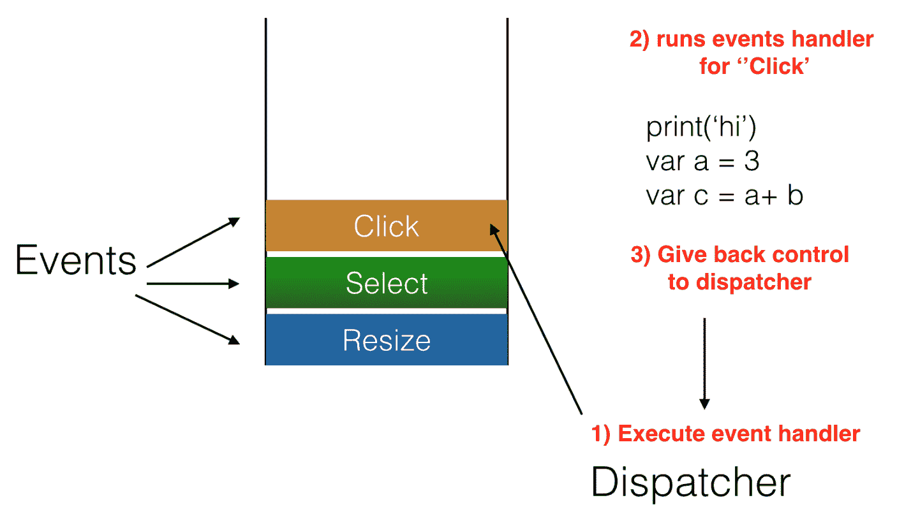
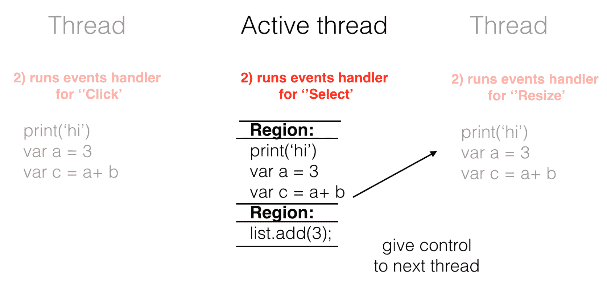

# 异步编程

要了解异步代码是什么，我们首先来了解一下同步代码是什么。使用同步代码，一个语句在另一个语句之后执行。代码是可预测的；你知道会发生什么以及何时发生。这是因为你可以像这样从上到下阅读代码：

```js
print('a')
print('b')
print('c')

// output
a, b, c
```

现在，使用异步代码，你将失去同步代码提供的所有美好的可预测性。事实上，关于异步代码，你了解的很少，除了它最终会执行完成。所以，异步代码，或者称为 async 代码，看起来更像是这样的：

```js
asyncPrint('a')
asyncPrint('b')
asyncPrint('c')

// output
c, b, a
```

如你所见，一个语句完成的顺序并不是由该语句在代码中出现的顺序决定的。相反，有一个时间元素参与其中，它决定了何时一个语句完成了它的运行过程。

异步代码在事件循环中运行。这意味着 async 代码按照以下顺序运行：

1.  运行异步代码

1.  等待响应准备好，然后触发中断

1.  运行事件处理器

在这里需要强调的一个重要事情是，异步代码是非阻塞的——其他操作可以在异步代码运行时进行。因此，异步代码是处理 I/O、长时间运行的任务和网络请求的好候选。

在本章中，我们将：

+   了解异步编程是什么以及它与同步编程有何不同

+   解释回调模型

+   描述承诺以及它们是如何完全改变我们编写异步代码的方式

+   看看其他存在的异步库以及它们应该在什么情况下使用

+   发现新的标准 async/await

# 回调模式

以前，我们描述了当你在作为开发者的日常生活中遇到异步和同步代码时，它们看起来是什么样子。可能有趣的是了解操作系统如何看待此类代码以及它是如何处理它们的。操作系统通过以下概念来处理异步代码：

+   事件，这些是向操作系统发出信号的消息，表明已经发生某种类型动作

+   事件处理器，这是当事件发生时应该运行的代码片段

+   事件队列，这是放置所有事件及其事件处理器的位置，等待执行

让我们在以下图中说明这种流程：



在前面的图像中，我们可以看到事件是如何从一个事件队列中被选取的。在这里，当分发器告诉它时，**点击**事件会被执行，并且相应的事件处理程序被执行。事件处理程序运行事件处理程序中的相关代码行，当完成时，将控制权交还给分发器。之后，队列中的下一个事件开始新一轮的循环。这就是在单线程系统中通常的样子，其中一次只执行一个事件处理程序。也存在多线程系统。在多线程系统中，存在多个线程。这意味着我们可能同时执行几个事件处理程序。但尽管有多个线程，只有一个活动线程。系统本身仍然是单线程的。困惑吗？这里的关键是：多线程系统中的线程是协作的，这意味着它们可以被中断。这意味着在完成一个工作单元后，活动线程会被改变。这产生了一种效果，似乎所有事情都在并行发生。让我们为了清晰起见来举例说明：



在这里，我们可以看到一段代码被分成了不同的区域。当某个区域被执行后，它将控制权交给下一个**线程**，这个线程成为新的**活动线程**。一旦该线程通过其某个区域执行了代码，它将控制权交给下一个线程。随着多个 CPU 的出现，我们能够从感知的并行性（之前已描述）转变为实际的并行执行。在这种现实中，每个 CPU 存在一个线程，因此我们有多条活动线程。

这些是您可以执行异步代码的不同方式。我们将关注单线程执行，因为这是 JavaScript 和网页中实现的方式。

# 网页上的回调模式

处理它的方法是附加函数到未来的事件上。当事件发生时，我们附加的函数被执行。一个例子是`XMLHttpRequest`，它看起来像这样：

```js
const xhr = new XMLHttpRequest();
xhr.open('GET','/path', true);
xhr.onload = () => {
  // run me when the request is finished
}

xhr.send(null);
```

在这里，我们可以看到除了`xhr.onload`之外的所有行都是同步执行的。将函数附加到`onload`是同步的，但是运行`onload`指向的函数不会发生，直到请求完成。我们也可以定义其他事件，例如`onreadystatechange`，并将一个函数附加到它上：

```js
xhr.onreadystatechange = () => {}
```

由于网页是单线程的，这就是我们处理异步代码的方式。`onreadystatechange`对象及其回调被注册到操作系统中。一旦异步部分完成，操作系统会被一个事件分发唤醒。之后，回调被调用。

# Node.js 中的回调模式

Node.js 是单线程的，就像网络一样。为了处理长时间运行的操作，它也使用回调模式。Node.js 中的回调模式有一些更详细的细节，可以描述为具有以下属性：

+   只有一个函数来处理成功和错误响应

+   回调只被调用一次

+   函数是调用函数的最后一个参数

+   回调包含参数的错误和结果，顺序排列，这也被称为错误优先

现在我们来展示调用代码的样子，其中回调作为函数的最后一个参数提供：

```js
callAsync('1',2, (error, response) => {
  if(error) {
    console.error(error);
  } else {
    console.log('response', response); 
    // do something with the response
  }
})
```

这段代码满足了模式所规定的所有属性，即函数调用中的最后一个参数是回调函数。此外，回调函数将错误作为第一个参数，将响应作为第二个参数。此外，回调函数的主体首先检查是否存在错误，然后在没有错误的情况下处理我们得到的响应。

作为参考，让我们也看看`callAsync()`是如何实现的：

```js
function callAsync(param, param2, fn) {
  setTimeout(() => {
   if(param > param2) {
     fn(null, 'success');
   } else {
     fn('error', null);
   }
}
```

之前的实现只是一个原型，但它确实展示了两个重要的方面。一方面是`setTimeout()`函数所代表的时间因素，以及函数需要时间才能完成的事实。

另一方面是我们的第三个参数`fn()`，它的调用方式不同。当一切顺利时，我们调用`fn(null, 'success')`；当发生错误时，我们调用`fn('error', null)`。我们调用`fn()`的方式就是如何传达成功和失败。

# 结构化异步代码的问题——回调地狱

在上一节中，我们介绍了回调模式作为处理异步调用的方法。该模式提供了一种处理此类调用的结构化方式，因为我们总可以在其方法签名中知道期望什么；错误是第一个参数，第二个参数是响应，依此类推。但是，该模式确实有其缺点。这些缺点可能一开始并不明显，因为你可能只是像这样调用代码：

```js
openFile('filename', (err, content) => {
  console.log( content );
  statement4;
  statement5;
})

statement2;
statement3
```

我们在这里看到的是如何调用`openFile()`方法。一旦它运行完成，回调就会被调用，并在回调内部，我们继续调用`statement4`和`statement5`。

从可读性的角度来看，这看起来是不错的。但是，当你需要连续进行多个异步调用，并且这些调用相互依赖时，问题就出现了。可能首先需要登录到系统中，然后获取其他数据，或者可能意味着你需要进行一个调用，以确定哪些数据需要作为下一个调用的输入，就像这个例子中一样：

```js
getData('url', (err, data) => {
  getMoreData('newurl/'+ data.id, (moreData) => {
    getEvenMoreData('moreurl/'+ moreData.id, () => {
      console.log('done here');
    })
  })
})
```

我们在这里看到的一个反模式是表格化和可读性的丧失。对于每一次调用，我们看到代码缩进了一步；它是嵌套的。当我们有三次这样的调用时，我们可以看到代码看起来并不美观；它是可读的，但并不那么吸引人。另一个缺点是，从技术上讲，正确地放置括号和大括号也是一项技术挑战，我们可能会在放置这些符号时遇到困难。如果在其中加入几个`if...else`语句，你将很难匹配所有符号。

有几种方法可以解决这个问题：

+   保持代码简洁，并使用命名函数而不是匿名函数

+   减少认知负担，并将函数移动到它们自己的模块中

+   使用更高级的结构，例如 Promise、生成器和 ES7 及其他异步库中的异步函数

保持代码简洁是关于给我们的匿名函数一个专有的名字并将它们拆分成自己的函数；这样我们的代码看起来会是这样：

```js
function getEvenMoreDataCallback(err, evenMoreData) {
  console.log('done here');
}

function getMoreDataCallback(err, moreData){
  getEvenMoreData('moreurl/'+ moreData.id, getEvenMoreDataCallback);
}

function getDataCallback(err, data){
  getMoreData('newurl/'+ data.id, getMoreDataCallback);
}

getData('url', getDataCallback)
```

这清楚地扁平化了代码，并使其更容易阅读。它还消除了正确匹配大括号的必要性，因为函数只有一层深度。

这将代码部分移除，但仍然存在认知负担，因为我们不得不处理三个函数定义和一个函数调用。我们可以将它们移动到它们自己的专用模块中，如下所示：

```js
let getDataCallback  = require('./datacallback');
getData('url', getDataCallback);
```

对于其他方法，它看起来会是这样：

```js
function getEvenMoreDataCallback(err, evenMoreData) {
  console.log('done here');
}
```

以及这个：

```js
var getEvenMoreDataCallback = require('./evenmorecallback');

function getMoreDataCallback(err, moreData){
  getEvenMoreData('moreurl/'+ moreData.id, getEvenMoreDataCallback);
}
```

现在我们已经移除了很多认知代码。在这个例子中，它可能没有物有所值，因为方法并不长，但想象一下，如果方法有 30 或 40 行长；将它们放入一个单独的模块中会更有意义。

第三个选择是使用更高级的结构来处理这类代码。我们将在接下来的章节中讨论这些内容。

# Promises

Promises 的出现是对上一节中描述的回调地狱问题的一种回应。它们有着相当长的历史，可以追溯到 20 世纪 80 年代初，当时传奇人物*芭芭拉·利斯科夫*提出了`Promise`这个术语。`Promise`的想法是将异步代码扁平化。一个`Promise`据说有以下状态：

+   **Pending**：这意味着它尚未决定，或者数据尚未可用

+   **Fulfilled**：数据已返回

+   **Rejected**：操作过程中发生了错误

# Thenables

有一个重要的事情要知道，`Promise`会立即返回，但结果不会立即可用。Promise 也被称为*thenables*，因为一旦数据接收，你需要使用其`then()`方法注册一个回调，如下所示：

```js
const promise = new Promise((resolve, reject) => {
  // either call resolve() if we have a success or reject() if it fails 
});

// the 'promise' variable points to a construct 
// that will eventually contain a value

promise((data) => {  // <- registering a callback on then()
  // our data has arrived at this point
})
```

在前面的代码中，我们展示了如何创建一个 Promise 以及如何使用`then()`方法注册它。`promise`变量实例包含一个会立即返回的结构。`then()`方法中的回调会在数据准备好供我们使用时被调用。从这个意义上说，`Promise`类似于回调模式。

`Promise`实际上只是围绕异步构造的一个包装。

简而言之，要使用 Promises，我们需要：

+   创建`promise`并确保在数据到达或发生错误时调用`resolve()`或`reject()`

+   使用其`then()`方法注册回调

+   注册一个回调来处理错误，因为这是负责任的做法

要使用承诺，我们需要实例化它并使其成为方法的一部分，如下所示：

```js
function getData() {
  return new Promise((resolve, reject) => {
    setTimeout(() => {
      resolve('data');
    },1000);
  })
}
```

我们看到，当我们实例化一个`Promise`对象时，它的构造函数接受两个参数，`resolve`和`reject`。让我们将这个与我们所知的承诺可以有的状态联系起来，即挂起、已解决和拒绝。当`getData()`最初被调用时，返回的`promise`处于`pending`状态。两秒后，承诺将得到解决，因为我们调用了`resolve()`方法。让我们看看`getMoreData()`方法，看看我们如何将`Promise`置于拒绝状态：

```js
function getMoreData() {
  return new Promise((resolve, reject) => {
    setTimeout(() => {
      reject('error from more data')
    },1000);
  })
}
```

在这种情况下，我们在两秒后调用`reject()`方法。这将使承诺处于拒绝状态。要从`promise`实例获取数据，我们需要在其上调用`then()`方法，如下所示：

```js
promise.then( successCallback, <optional error call back> );
```

承诺的`then()`方法接受两个回调：第一个回调是数据回调，第二个回调是可选的错误回调。让我们在我们的定义的`getData()`方法中使用它，如下所示：

```js
getData().then( (data) => {
  console.log('data', data);
})
```

很明显，我们不能直接在方法上调用`getData()`来获取数据，但我们需要在它返回的`promise`上调用`.then()`。一旦我们提供了一个回调，我们就能获取数据并按我们的意愿处理它。

# 处理拒绝的承诺

对于拒绝的承诺，我们有两种处理方式：我们可以在`.then()`方法中使用第二个回调，或者我们可以使用`.catch()`方法。以下是我们可以使用的两个版本：

```js
// alternative 1
getMoreData().then(
  data => { 
    console.log('data',data); 
  }, 
  err => { 
    console.log('error',err); 
  }
)

// alternative 2
getMoreData().then(data => {
  console.log('data', data);
})
.catch((err) => { 
  console.log('error', err); 
}); 
```

在第一种情况下，我们在`then()`方法中添加了第二个回调，而在第二种版本中，我们将一个`catch()`方法链接到现有的`then()`方法上。它们是等效的，所以你可以使用任何一个，但只能使用一个。

# 链式操作 – 处理多个承诺

承诺最强大的功能在于其链式调用的能力，从而使代码看起来是同步的。一个链式调用看起来像这样：

```js
getData()
  .then(getMoreData)
  .then(getEvenMoreData)
  .catch(handleError)
```

这使得代码非常易于阅读。你可以知道事情发生的顺序；即，`getData()`之后是`getMoreData()`，然后是`getEvenMoreData()`。我们不仅能够按照我们想要的顺序运行方法，而且还可以访问前一个`promise`中的数据，如下所示：

```js
function getData() {
  return new Promise((resolve, reject) => {
    setTimeout(() => {
      resolve('data');
    })
  })
}

function getMoreData(data) { // data is from getData
  return new Promise((resolve, reject) => {
    setTimeout(() => {
      resolve('data');
    })
  })
}

getData().then(getMoreData)
```

我们还可以看到如何将`.catch()`方法添加到末尾以处理错误。链式承诺的性质是这样的，错误会一直传播到`catch()`方法。

然而，在特定级别处理错误是完全可能的，如下所示：

```js
getData()
  .then(getMoreData, (err) => {}) // local error handler
  .then(getEvenMoreData )
  .then(data => {} )
  .catch(handleError ) // global error handler
```

现在我们有两个错误处理器，一个在本地级别，即`.then(getMoreData, (err) => {})`作为`then()`方法的第二个参数。这与只在调用链底部添加`.catch()`的效果不同。如果只有底部的`.catch()`方法存在，那么链路就会短路。目前，当`getMoreData()`方法拒绝`promise`时，当前链路将调用本地错误函数、`.catch()`方法和最后一个`.then()`方法。然而，如果`promise`被拒绝，最后一个`.then()`方法中的数据参数将不会被设置。链式调用非常强大，它给我们带来了以下功能：

+   按顺序调用异步方法

+   将之前解析的承诺（promise）数据作为我们方法的输入

+   能够全局处理错误以及针对每个承诺（promise）处理错误，尽管结果可能不同

# 异步库

到目前为止，我们讨论了回调模式以及使用承诺如何给你的代码带来急需的秩序感。编写异步代码不仅仅是停止自己陷入混乱的代码中，它还关乎生产力。有些库可以让你在真正致力于直接处理异步编程时变得非常高效。在撰写本文时，最知名的库包括：

+   **Async**：这是最广为人知的。它可以在[`caolan.github.io/async/`](https://caolan.github.io/async/)找到。

+   **步骤**：这个库将自己定位为一个可以帮助你进行串行执行、并行执行，并承诺使错误处理变得轻松的库。它可以在[`github.com/creationix/step`](https://github.com/creationix/step)找到。

+   **Node fibers**：这是一个与前面两个库非常不同的库，可以将其视为为 JavaScript 带来轻量级线程（light-thread）支持。它可以在[`github.com/laverdet/node-fibers`](https://github.com/laverdet/node-fibers)找到。

# Async 库

我们已经展示了回调和承诺。我们从回调的问题，即回调地狱，以及承诺是如何解决这个问题的。然而，有一个名为**async**的库，它是回调和承诺的替代品。那么，我们为什么要使用 async 库呢？async 库旨在在异步上下文中操作集合。库的作者自己是这样说的：

Async 是一个提供直接、强大函数的实用模块，用于处理异步 JavaScript

因此，如果你的异步代码开始变得难以管理，而你又发现自己想要操作异步集合而不是零散的几个调用，这个库可能适合你。在大多数情况下，承诺（promises）可能是你想要的。

Async 库提供了许多有用的功能。Async 库的思路是让你的代码看起来更好，这样你就可以专注于构建事物，而不是挣扎着去理解代码在做什么。

要使用它，只需通过输入以下命令进行安装：

```js
npm install async --save
```

# async.map()

让我们看看一个例子，其中`async`大放异彩，能够移除不必要的代码。以下示例展示了我们如何调用`fs.stat()`方法，该方法将异步地告诉我们关于文件的信息，例如其大小、创建时间等。一个普通的调用`fs.stat()`看起来像这样：

```js
// async-demo/app.js

const fs = require('fs');

const basePath = __dirname + '/files/';
const files = ['file1.txt', 'file2.txt', 'file3.txt'];

fs.stat(basePath + 'file1.txt', (err, result) => {
  if(err) {
    console.log('err');
  } else {
    const { size, birthtime } = result;
    console.log('Size',size);
    console.log('Created', birthtime);
  }
});
```

如果我们想要进行多个电话并且想要知道几个文件的状态呢？一次发送多个电话——每个文件一个电话——意味着我们的电话会在不同时间返回，这取决于文件的大小。如果我们不介意在所有电话都返回之前不关心响应怎么办？这正是异步库能帮助我们解决的问题。这里有一个`map()`函数，它允许我们同时发送多个电话，并且只有在所有电话都完成后才返回，如下所示：

```js
// app-map.js

const async = require('async');
const fs = require('fs');
const basePath = __dirname + '/files/';
const files = ['file1.txt', 'file2.txt', 'file3.txt'];
const mappedFiles = files.map( f => basePath + f);

async.map(mappedFiles, fs.stat,(err, results) => {
  if(err) {
    console.log('error', err);
  }else {
    // looping through our results array
    results.forEach(({size, birthtime}) => {
      console.log('Size',size);
      console.log('Created', birthtime);
    });
  }
});
```

那么，是什么让它如此出色呢？首先，我们的代码旨在找出每个文件的一些文件统计信息。让我们看看没有异步库的生活会是什么样子：

```js
// example of running a callback method in a forEach()

['file1','file2','file3'].forEach( f => {
  var states = [];
  fs.stat(f, (err, stat) => {
    console.log('stat', stat);
    states.push( stat );
  })
})
```

我们可以看到，我们需要引入一个状态数组来收集所有结果，即使这样，我们可能还需要添加一些逻辑来知道我们是否处于数组的最后一个项目，因此可以根据我们现在已经拥有所有结果的事实开始处理。

因此，从所有这些中我们可以得出的结论是，`async.map()`帮助我们调用一系列异步调用到一个调用中，使我们能够在每个电话完成后处理所有结果，而不是在之前。

# async.parallel()

这个库中另一个重要的方法是`async.parallel()`，它允许我们并行发送很多语句，如下所示：

```js
// async-demo/app-parallell.js

const async = require('async');

function getMessages(fn) {
  setTimeout(() => {
    fn(null,['mess1', 'mess2', 'mess3']);
  }, 3000);
}

function getOrders(fn) {
  setTimeout(() => {
    fn(null, ['order1', 'order2', 'order3']);
  }, 5000);
}

async.parallel([
  getMessages,
  getOrders
],(error, results) => {
  if(error) {
    console.log('error', error);
  } else {
    console.log('results', results);
  }
});
```

从前面的代码中我们可以看到，它允许我们并行启动多个电话。我们在提供给`async.parallell([])`方法的数组中指定电话。从你在这里可以辨别出的信息来看，我们提供的函数接受一个参数，`fn`，它是回调函数，例如`getOrders(fn) {}`。

# async.series()

另一种情况是，你可能希望电话一个接一个地发生。为此，我们得到了`async.series()`方法，我们这样调用它：

```js
async.series([
  function login(){}
  function loadUserDetails() {}
],(result) => {})
```

以这种方式运行代码保证了代码的运行顺序，同时也确保了如果发生错误，调用链不会继续。

这个库中有许多有用的函数，我们强烈建议您查看[`caolan.github.io/async/docs.html`](https://caolan.github.io/async/docs.html)上的文档。

# Async/await

async/await 是 ECMAScript 标准 ES2017 的一部分。这个构造在处理异步操作时提供了同步的体验。目前，您需要像 Babel 这样的工具在前端运行它，但对于 Node.js 来说，在版本>= 8 上运行它就足够了。Async/await 在后台通过一个称为生成器（generators）的概念来实现。生成器是可以在之后退出和重新进入的函数。要了解更多关于生成器的信息，请查看以下链接：[`developer.mozilla.org/en-US/docs/Web/JavaScript/Reference/Statements/function*`](https://developer.mozilla.org/en-US/docs/Web/JavaScript/Reference/Statements/function*)。这是处理异步代码的新方法，它确实有助于使我们的代码看起来更同步，从而减少了与异步编程相关的认知痛苦。

让我们回顾一下我们的旧例子，说明回调地狱的情况：

```js
getData()
  .then( data => {
    getMoreData(moreData => {
      getEvenMoreData(() => {
        // do stuff
      })
    })
  });
```

我们清楚地看到了以这种方式调用代码的缺点。async/await 扮演了救世主的角色，因为它确实清理了这里的事情。然而，让我们首先解释不同的部分以及我们如何努力重构先前的例子。使用 async/await 的方法通常是最高级的方法；在链式`async`方法中的最高级意味着它是第一个被调用的方法。在先前的例子中，这将是由`getData()`方法。让我们将`getData()`转换成如下形式：

```js
async function getData() {
  // more to come
} 
```

在这一点上，我们需要意识到的是，我们需要将另外两个方法`getMoreData()`和`getEvenMoreData()`重构为返回 Promise 而不是基于回调的方法。为什么你会这样问呢？好吧，当我们使用 async/await 时，我们希望以某种方式调用代码。正如之前所暗示的，我们将在`getData()`函数前使用关键字`async`。更重要的是，我们希望以下方式使用关键字`await`：

```js
async function getData() {
  let data = await getMoreData();
  let otherData = await getEvenMoreData();
} 
```

看看前面的代码，我们意识到我们的现有方法签名存在不匹配。不匹配不是我们需要将我们的实现切换为基于 Promise 的主要原因。真正的原因是`await`关键字能够展开 Promise，但不能展开基于回调的方法。展开意味着它可以从我们的异步操作的结果中取出值并返回。

在将它们转换为 Promise 之前，我们的方法当前的状态是：

```js
function getMoreData(cb) { 
  setTimeout(() => cb('more data'), 3000); 
}
function getEvenMoreData(cb) { 
  setTimeout( () => cb('even more data'), 3000 ); 
}
```

将它们转换为基于 Promise 的方法意味着它们现在应该看起来像这样：

```js
function getMoreData() { 
  return new Promise((resolve, reject) => {
    setTimeout(() => resolve('more data'))
  });

}

function getEvenMoreData() { 
  return new Promise((resolve, reject) => {
    setTimeout(() => resolve('more data'))
  });
}
```

在这一点上，我们准备返回到`getData()`方法并添加缺失的代码。当我们调用`getMoreData()`和`getEvenMoreData()`时，我们现在可以使用关键字`await`等待 Promise 解析，如下所示：

```js
async function getData() {
  var data = await Promise.resolve('data');
  var moreData = await getMoreData(data);
  var evenMoreData = await getEvenMoreData(moreData);
  return evenMoreData; 
}
```

现在我们得到的是完全同步看起来似的代码。那么我们如何从`getData()`中检索数据呢？很简单——它返回一个`promise`。因此，我们可以这样调用它：

```js
getData().then((result) => console.log('result', result) );
```

async/await 真的是一个强大的结构，因为它消除了由回调地狱引起的许多认知痛苦，并进一步改进了承诺的概念。

# 摘要

在本章中，我们介绍了异步代码的使用情况及其目的。很明显，随着异步代码的增多，其可读性和可维护性会越来越低，从而产生了诸如回调地狱等模式。本章描述了处理这些问题的几种技术。改变你的编码风格是一种方法。查看诸如承诺（promises）之类的结构，尤其是在与 async/await 结合使用时，是另一种方法。使用 async/await 意味着我们突然获得了一种可以类比为异步代码中的顺序的东西。我们尽量保持尽可能不依赖框架，因为理解所有提到的概念而不将它们与特定应用框架的概念混淆是很重要的。尽管如此，可以说：Angular 允许你使用任何你想要的异步方法来组织你的代码。例如，进行 HTTP 调用时，使用的是与 RxJS 库紧密相关的 Angular 服务，但你也可以自由地使用基于承诺的样式，如`fetch()` API。使用 Babel 和它支持的转换器，也可以利用 Angular 中的 async/await。

本章为异步编程奠定了基础。下一章将通过介绍**函数式响应式编程**（**FRP**）的概念来在此基础上进行构建。它更多地涉及如何处理数据似乎在它想出现的时候出现的事实。尽管听起来很混乱，但如果我们将数据视为流，即使是这种情况也可以被建模，以创建一种结构和秩序的感觉。更多内容将在下一章中介绍。
