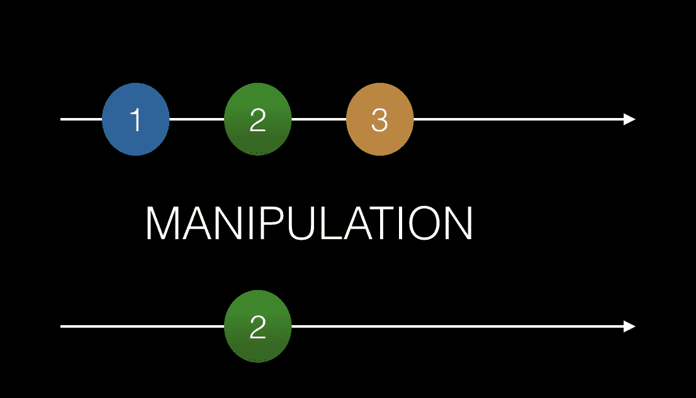

# 函数式响应式编程

根据维基百科，**函数式响应式编程**（**FRP**）是一种响应式编程的编程范式，它使用函数式编程的构建块。好吧，这听起来很复杂，但它究竟意味着什么呢？为了理解整个句子，我们需要将其分解一下。让我们尝试定义以下内容：

+   **编程范式**是一个涵盖性理论，或工作方式，它围绕程序应该如何组织和结构化。面向对象编程和函数式编程是编程范式的例子。

+   **响应式编程**简而言之，是使用异步数据流的编程。异步数据流是值可以在任何时间点到达的数据流。

+   **函数式编程**是一种编程范式，它采用更数学化的方法，将函数调用视为数学计算，从而避免改变状态或处理可变数据。

因此，简而言之，我们的维基百科定义意味着我们有一种函数式编程方法来处理可能在任何时间点到达的值。这实际上并没有太多意义，但希望到本章结束时，事情会有所澄清。

在本章中，我们将学习以下内容：

+   声明式编程与命令式编程之间的区别

+   异步数据流

+   如何操作这些流

# 函数式编程与命令式编程的比较

我们将讨论和描述两种不同的编程风格：命令式编程和声明式编程。函数式编程是声明式编程的一个子集。解释声明式编程的最简单方法就是将其与它的对立面——命令式编程——进行比较。命令式编程关注的是程序应该如何达到其结果。另一方面，函数式编程是一种声明式编程范式，这意味着它的重点是程序应该完成什么，或者说“什么”。这是一个重要的区别。

# 命令式编程与声明式编程的比较

命令式编程由帮助改变程序状态的语句组成。如前所述，它关注的是“如何”而不是“什么”。让我们看看代码中这可能是什么样子，以便使其更清晰：

```js
let sum = 0;

function updateSum(records) {
  for( let i = 0; i< records.length; i++ ) {
    sum += records[i]; 
  }
}

updateSum([1,2,3,4]);
```

上述代码具有以下效果：当我们调用`updateSum()`时，变量`sum`会被更新。我们还可以看到，该函数非常明确地说明了求和应该“如何”发生。

声明式编程更关注“什么”要实现。很容易将其视为更高级的，因为你说出了你想要实现什么。让我们看看一些 SQL 代码。SQL 是一种声明式编程语言：

```js
// content of table 'orderitem'
-------------------
id  price productId
-------------------
1     100   1
1      50  11  

SELECT 
  SUM(price) as total 
FROM orderitem

// result of the query
150
```

在这里，我们正在查询一个表以获取多个记录，同时告诉 SQL 我们想要汇总的内容。我们明显在进行相同类型的操作，即汇总某物。区别在于，在我们的声明性示例中，我们告诉 SQL 我们想要做什么；我们信任 SQL 知道如何汇总。

# 一等高阶函数

“一等”这个术语意味着语言本身将函数视为值；它们可以作为其他函数的参数传递。高阶函数是接受其他函数作为参数的函数。让我们通过一个例子来使这一点更清晰：

```js
function project(obj, fn) {
  return fn(obj);
}

project( { name : 'chris', age: 37 }, (obj) => obj['name'] ); // 'chris'
project({ name : 'chris', age: 37 }, (obj) => obj['age'] ) // 37 
```

在这里，我们可以看到我们的`project()`函数的第二个参数是一个函数。该函数被应用于第一个参数。我们还可以看到，根据我们给高阶函数作为其第二个参数的输入参数，高阶函数的行为会有所不同。

# 纯函数

纯函数是一个没有副作用的函数。函数所做的任何操作都不会影响它之外的变量。这意味着在计算中使用输入参数时，不应引起副作用，例如与文件系统交互或打开网络连接等。让我们来看一个例子：

```js
function notAPureFunction(filePath) {
  const fileContent = fs.readFileSync(filePath);
  const rows = fileContent.split(',');
  let sum = 0;
  rows.forEach(row => { sum += row; });
  return sum;
}
```

如我们所见，我们的函数打开一个文件，遍历其行，并计算所有行内容的总和。不幸的是，这个函数与文件系统进行交互，这被认为是一个副作用。这看起来可能有点牵强，但在一个更长的函数中，同时看到计算——记录日志和与数据库交互——发生，或者至少是我的经验是这样的。这样的代码远非理想，它存在关注点分离和其他许多问题。然而，当涉及到纯函数时，将纯部分隔离到它们自己的函数中是一个好主意，这将导致以下结果：

```js
function calculateSum(rows) {  // now it's pure
  let sum = 0;
  rows.forEach(row => { sum += row; });
  return sum;
}

function getRows(filePath) {  // still not pure, but some things needs to perform side-effects
  const fileContent = fs.readFileSync(filePath);
  const rows = fileContent.split(',');
}
```

如您所见，我们现在有两个函数。我们设法将纯部分隔离到一个名为`calculateSum()`的函数中，并最终创建了执行副作用的`getRows()`函数。大多数程序都以某种形式具有副作用，但作为程序员，你的任务是尽可能地将这些函数与纯函数分开。

实际上，我们在这里描述了两件事：

+   **纯函数**：它们更像是没有副作用的数学计算。

+   **单一职责原则**（**SRP**）：做好函数式编程的一部分是编写小而专注的函数。尽管这并不是函数式编程或纯函数的严格属性，但它是一个重要的原则，将帮助你采用函数式编程生活方式时拥有正确的思维方式。

我们没有提到的一件事是为什么纯函数在函数式编程中扮演着至关重要的角色。它们通过其计算性质是可预测的，这使得它们易于测试。构建主要由许多小型可预测函数组成的系统，使整个系统可预测。

# 递归

“要理解递归这个词，请看递归这个词。”

这是在大多数工程学院中流传的一个笑话，它以非常简短的方式解释了它。递归是一个数学概念。让我们进一步解释一下。官方定义如下：

递归是当程序的一个步骤涉及调用程序本身时，程序所经历的过程。经历递归的程序被称为“递归”。

好吧，这在人类语言中意味着什么？它说在运行我们的函数的某个时刻，我们将调用自己。这意味着我们有一个看起来像这样的函数：

```js
function something() {
  statement;
  statement;
  if(condition) {
    something();
  }
  return someValue;
}
```

我们可以看到，在函数`something()`的某个地方，它的主体调用了自身。一个递归函数应该遵守以下规则：

+   应该调用自身

+   最终应该遇到退出条件

如果递归函数没有退出条件，由于函数将无限期地调用自身，我们将耗尽内存。某些类型的问题比其他类型的问题更适合应用递归编程。这些问题的例子包括：

+   遍历树

+   编译代码

+   编写压缩算法

+   排序列表

有许多更多例子，但重要的是要记住，尽管它是一个伟大的工具，但它不应该到处使用。让我们看看递归真正闪耀的例子。我们的例子是一个链表。链表由知道它们连接到的节点的节点组成。`Node`结构的代码如下：

```js
class Node {
  constructor(
    public left, 
    public value
  ) {}
}
```

使用`Node`这样的结构，我们可以构建由多个链接节点组成的链表。我们可以以下列方式连接一组节点实例：

```js
const head = new Node(null, 1);
const firstNode = new Node(head, 2);
const secondNode = new Node(firstNode, 3);
```

上述代码的图形表示如下图。在这里，我们可以清楚地看到我们的节点由什么组成以及它们是如何连接的：


在这里，我们有一个链表，其中我们有三个连接的节点实例。头节点没有连接到左侧的节点。然而，第二个节点连接到第一个节点，第一个节点连接到头节点。以下类型的列表操作可能很有趣：

+   给定链表中的任何节点，找到头节点

+   在链表中给定位置插入一个节点

+   从链表中给定位置删除一个节点

让我们看看我们如何解决第一个要点。首先，我们将使用命令式方法，然后我们将使用递归方法来查看它们之间的区别。更重要的是，让我们讨论为什么递归方法可能更受欢迎：

```js
// demo of how to find the head node, imperative style

const head = new Node(null, 1);
const firstNode = new Node(head, 2);
const secondNode = new Node(firstNode, 3); 

function findHeadImperative (startNode)  {
  while (startNode.left !== null) {
    startNode = startNode.left;
  }
  return startNode;
}

const foundImp = findHeadImperative(secondNode);
console.log('found', foundImp);
console.log(foundImp === head);

```

正如我们所见，我们正在使用一个`while`循环遍历列表，直到我们找到`left`属性为空的节点实例。现在，让我们展示递归方法：

```js
// demo of how to find head node, declarative style using recursion

const head = new Node(null, 1);
const firstNode = new Node(head, 2);
const secondNode = new Node(firstNode, 3); 

function findHeadRecursive(startNode) {
  if(startNode.left !== null) {
    return findHeadRecursive(startNode.left);
  } else {
    return startNode;
  }
}

const found = findHeadRecursive(secondNode);
console.log('found', found);
console.log(found === head);

```

在前面的代码中，我们检查`startNode.left`是否为空。如果是这种情况，我们就达到了退出条件。如果我们还没有达到退出条件，我们就继续调用自己。

好的，所以我们有两种方法：命令式方法和递归方法。为什么后者会好得多呢？嗯，使用递归方法，我们从一个长长的列表开始，每次调用自己时都会使列表变短：有点像一种*分而治之*的方法。递归方法中明显突出的一点是我们通过说“不，我们的退出条件还没有满足，继续处理”来推迟执行。继续处理意味着我们像在`if`子句中那样调用自己。递归编程的目的是我们得到更少的代码行数吗？嗯，这可能是一个结果，但更重要的是：它改变了我们解决问题的思维方式。在命令式编程中，我们有一种*从上到下解决问题*的思维方式，而在递归编程中，我们的思维方式更倾向于，定义何时完成，将问题切割成更容易处理的部分。在前面的例子中，我们丢弃了不再有趣的链表部分。

# 没有更多的循环

当开始以更函数式的方式编写代码时，一个更显著的变化是我们摆脱了`for`循环。现在我们知道了递归，我们可以直接使用它。让我们看看一个简单的命令式代码片段，它打印一个数组：

```js
// demo of printing an array, imperative style

let array = [1, 2, 3, 4, 5];

function print(arr) {
  for(var i = 0, i < arr.length; i++) {
    console.log(arr[i]); 
  }
}

print(arr);
```

使用递归的相应代码看起来像这样：

```js
// print.js, printing an array using recursion

let array = [1, 2, 3, 4, 5];

function print(arr, pos, len) {
  if (pos < len) {
    console.log(arr[pos]);
    print(arr, pos + 1, len);
  }
  return;
}

print(array, 0, array.length);
```

如我们所见，我们的命令式代码在精神上仍然存在。我们仍然从`0`开始。此外，我们继续进行，直到我们到达数组的最后一个位置。一旦我们达到退出条件，我们就退出方法。

# 重复模式

到目前为止，我们还没有真正将递归作为一个概念推销出去。我们有点理解，但可能还没有说服自己为什么好的老式`while`或`for`循环不能被替换。递归在解决看起来像重复模式的问题时特别出色。一个例子就是树。树有一些类似的概念，比如由节点组成。没有子节点连接的节点被称为叶子。有子节点但没有向上节点连接的节点被称为根节点。让我们用一张图来展示这一点：


我们在树上想要执行的一些有趣的操作包括：

+   总结节点值

+   计算节点数量

+   计算宽度

+   计算深度

为了尝试解决这个问题，我们需要思考如何将树作为数据结构存储。最常见的方法是通过创建一个表示节点具有值、`left`属性和`right`属性的表示，然后这两个属性依次指向节点。因此，该节点类的代码可能看起来像这样：

```js
class NodeClass {
  constructor(left, right, value) {
    this.left = left;
    this.right = right;
    this.value = value;
  }
}
```

下一步是思考如何创建树本身。此代码显示了如何创建一个具有根节点和两个子节点的树，以及如何将这些节点绑定在一起：

```js
// tree.js

class NodeClass {
  constructor(left, right, value) {
    this.left = left;
    this.right = right;
    this.value = value;
  }
}

const leftLeftLeftChild = new NodeClass(null, null, 7);
const leftLeftChild = new NodeClass(leftLeftLeftChild, null, 1);
const leftRightChild = new NodeClass(null, null, 2);
const rightLeftChild = new NodeClass(null, null, 4);
const rightRightChild = new NodeClass(null, null, 2);
const left = new NodeClass(leftLeftChild, leftRightChild, 3);
const right = new NodeClass(rightLeftChild, rightRightChild, 5);
const root = new NodeClass(left, right, 2);

module.exports = root;

```

值得注意的是，实例`left`和`right`没有子节点。我们可以看到这一点，因为我们创建时将它们的值设置为`null`。另一方面，我们的根节点有对象实例`left`和`right`作为子节点。

# 总结

此后，我们需要思考如何总结节点。仅从外观上看，这似乎意味着我们应该总结顶层节点及其两个子节点。因此，代码实现将开始如下：

```js
// tree-sum.js

const root = require('./tree');

function summarise(node) {
  return node.value + node.left.value + node.right.value;
}

console.log(summarise(root)) // 10
```

如果我们的树增长并突然看起来像这样：


让我们向前面的代码添加一些内容，使其看起来像这样：

```js
// example of a non recursive code

function summarise(node) {
  return node.value + 
    node.left.value + 
    node.right.value +
    node.right.left.value +
    node.right.right.value + 
    node.left.left.value + 
    node.left.right.value;
}

console.log(summarise(root)) // 19
```

这实际上是正常工作的代码，但可以改进。此时，我们应该在树中看到的是重复的模式。我们有以下三角形：


一个三角形由**2**、**3**、**5**组成，另一个由**3**、**1**、**2**组成，最后一个由**5**、**4**、**2**组成。每个三角形通过取节点本身，加上其左子节点和右子节点来计算其和。递归就是关于这个：发现重复的模式并将其编码化。我们现在可以使用递归来实现我们的`summarise()`函数，如下所示：

```js
function summarise(node) {
  if(node === null) {
    return 0;
  }
  return node.value + summarise(node.left) + summarise(left.right);
}
```

我们在这里所做的是将重复的模式表示为`节点 + 左节点 + 右节点`。当我们调用`summarise(node.left)`时，我们只是再次为该节点运行`summarise()`。前面的实现既简短又优雅，能够遍历整个树。一旦你发现你的问题可以看作是一个重复的模式，递归就真正变得优雅了。完整的代码如下：

```js
// tree.js

class NodeClass {
  constructor(left, right, value) {
    this.left = left;
    this.right = right;
    this.value = value;
  }
}

const leftLeftLeftChild = new NodeClass(null, null, 7);
const leftLeftChild = new NodeClass(leftLeftLeftChild, null, 1);
const leftRightChild = new NodeClass(null, null, 2);
const rightLeftChild = new NodeClass(null, null, 4);
const rightRightChild = new NodeClass(null, null, 2);
const left = new NodeClass(leftLeftChild, leftRightChild, 3);
const right = new NodeClass(rightLeftChild, rightRightChild, 5);
const root = new NodeClass(left, right, 2);

module.exports = root;

// tree-sum.js

const root = require("./tree");

function sum(node) {
  if (node === null) {
    return 0;
  }
  return node.value + sum(node.left) + sum(node.right);
}

console.log("sum", sum(root));
```

# 计数

现在我们开始理解递归的本质，实现一个计算树中所有节点数量的函数变得相当简单。我们可以重用之前的总结函数，简单地计算每个非空节点为`1`，空节点为`0`。所以，我们只需修改现有的总结函数，如下所示：

```js
//tree-count.js

const root = require("./tree");

function count(node) {
  if (node === null) {
    return 0;
  } else {
    return 1 + count(node.left) + count(node.right);
  }
}

console.log("count", count(root));
```

前面的代码确保我们成功遍历了每个节点。我们的退出条件发生在我们到达 null 时。也就是说，我们试图从一个节点移动到其不存在的子节点之一。

# 宽度

要创建一个宽度函数，我们首先需要定义我们所说的宽度是什么。让我们再次看看我们的树：


这棵树的宽度是**4**。这是怎么回事？对于树中的每一步向下，我们的节点向左和向右各扩展一步。这意味着为了正确计算宽度，我们需要遍历树的边缘。每次我们必须向左或向右遍历一个节点时，我们就会增加宽度。从计算的角度来看，我们感兴趣的是像这样遍历树：


因此，代码应该反映这一事实。我们可以这样实现：

```js
// tree-width.js

const root = require("./tree");

function calc(node, direction) {
  if (node === null) {
    return 0;
  } else {
    return (
      1 + (direction === "left" ? 
      calc(node.left, direction) : 
      calc(node.right, direction))
    );
  }
}

function calcWidth(node) {
  return calc(node.left, "left") + calc(node.right, "right");
}

console.log("width", calcWidth(root));
```

特别注意在`calcWidth()`函数中，我们分别用`node.left`和`node.right`作为参数调用`calc()`。我们还添加了`left`和`right`参数，在`calc()`方法中意味着我们将继续朝那个方向前进。我们的退出条件是最终遇到 null。

# 异步数据流

异步数据流是一系列数据，其中值一个接一个地发出，它们之间有延迟。异步这个词意味着发出的数据可以在任何时间出现，比如一秒后甚至两分钟后。异步流的一种建模方法是将在时间轴上放置发出的值，如下所示：


有很多事情可以被认为是异步的。其中之一是通过 AJAX 获取数据。数据何时到达取决于许多因素，例如：

+   您的连接速度

+   后端 API 的响应性

+   数据的大小，以及许多其他因素。

重点是数据并不是在这个非常时刻到达。

可以被认为是异步的其他事情包括用户发起的事件，如滚动或鼠标点击。这些是在任何时间点都可能发生的事件，取决于用户的交互。因此，我们可以将这些 UI 事件视为时间轴上的连续数据流。以下图表描绘了代表用户多次点击的数据流。每次点击都会导致一个点击事件，**c**，我们将它放置在时间轴上：


初看我们的图表描绘了四个点击事件。仔细观察后，我们发现点击事件似乎被分组了。前一个图表包含以下两条信息：

+   发生了多次点击事件

+   点击事件之间有特定的延迟发生

在这里，我们可以看到前两次点击似乎在时间上非常接近；当两个事件在时间上非常接近时，这将被解释为双击。因此，我们上面的图像告诉我们发生了哪些事件；它还告诉我们它们何时以及多久发生一次。查看前面的图表，区分单击和双击相当容易。

我们可以为每种点击行为分配不同的动作。双击可能意味着我们想要放大，而单击可能意味着我们想要选择某个东西；具体取决于你正在编写的应用程序。

第三个例子是输入的情况。如果我们有一个用户在输入一段时间后停止输入的情况呢？在经过一定时间后，用户期望 UI 做出反应。这就是搜索字段的情况。在这种情况下，用户可能在搜索字段中输入一些内容，并在完成后按下搜索按钮。在 UI 中模拟这种情况的另一种方式是提供一个搜索字段，并等待用户停止输入，作为开始搜索用户想要的内容的信号。最后一个例子被称为**自动完成**行为。它可以按以下方式建模：


输入的前三个字符似乎属于同一个搜索查询，而第四个字符输入得晚得多，可能属于另一个查询。

本节的目的在于强调不同的事物适合作为流来建模，以及时间轴上发出的值的放置可以意味着某些东西。

# 将列表与异步流比较——为 RxJS 做准备

到目前为止，我们已经讨论了如何将异步事件建模为时间轴上的连续数据流，或称为流建模。事件可以是 AJAX 数据、鼠标点击或其他类型的事件。以这种方式建模事物为事物提供了一个有趣的视角，但例如，在双击的情况下，除非我们能够挖掘出数据，否则这并没有什么意义。可能还有另一种情况，我们需要过滤掉某些数据。我们在这里讨论的是如何操作流。如果没有这种能力，流建模本身就没有实际价值。

有不同的方法来操作数据：有时我们希望将发出的数据改变为其他数据，有时我们可能希望改变数据被发送到监听器的频率。有时，我们希望我们的数据流变成一个完全不同的数据流。我们将尝试模拟以下情况：

+   **投影**：改变发出的值的 数据

+   **过滤**：改变被发出的内容

# 将函数式编程范式与流结合

本章已经涵盖了函数式编程和异步数据流。使用 RxJS 不需要对函数式编程有深入的了解，但你确实需要理解声明式意味着什么，以便专注于正确的事情。你的关注点应该是你想要完成的事情，而不是你想要如何完成它。作为一个库，RxJS 将负责如何完成。更多内容将在下一章中介绍。

这些可能看起来是两个不同的主题。然而，将它们结合起来，我们就能获得操纵流的能力。流可以被看作是一系列数据，其中数据在某个时间点可用。如果我们开始将我们的流视为列表，特别是不可变列表，那么就有一些与列表一起进行的操作，通过应用操作符来操纵列表。操纵的结果是一个新列表，而不是一个被修改的列表。所以，让我们开始应用我们的列表哲学及其操作符到以下情况。

# 投影


在这里，我们可以看到我们的流正在发出值**1**、**2**、**3**和**4**，然后发生了一个操作，将每个值增加一个。这是一个相当简单的情况。如果我们将其视为一个列表，我们可以看到我们在这里所做的只是一个投影，我们会这样编码：

```js
let newList = list.map(value => value + 1)
```

# 过滤

列表和流中可能有一些你不希望的项目。为了解决这个问题，你需要创建一个过滤器来过滤掉不需要的数据。通过模拟初始数组、操作和结果数组，我们得到以下内容：



在 JavaScript 中，我们可以通过编写以下代码来完成这个任务：

```js
let array = [1,2,3];
let filtered = array.filter(data => data % 2 === 0);
```

# 结合思维模式

那么，我们在这个部分试图表达什么？显然，我们已经展示了如何操纵列表的例子。好吧，我们所做的是展示了我们如何显示轴上的项目。从这个意义上说，我们可以看到异步事件和值列表以相同的方式思考是很容易的，因为我们以相同的方式图形化地描绘它们。问题是，我们为什么要这样做？原因在于，这正是 RxJS 库希望你在下一章开始操纵和制作流时拥有的心态。

# 概述

本章已经确立，我们可以将异步事件建模为时间轴上的值。我们引入了将这些流与列表进行比较的想法，并因此应用了不会改变列表本身但仅创建一个新列表的功能方法。应用函数式范式的优点在于，我们可以专注于*要实现什么*而不是*如何实现*，从而采用声明式方法。我们意识到将异步和列表结合起来并从中创建可读的代码并不容易。幸运的是，这正是 RxJS 库为我们做的事情。正是这种认识使我们为即将到来的第五章，*RxJS 基础*，做好了准备，在那里我们介绍 RxJS 作为一个库：在异步混乱中创建秩序，将一切建模为流。有了 RxJS，我们真正可以专注于*要实现什么*而不是*如何实现*，因为它附带了一系列流操作函数。在阅读下一章之后，你将了解 RxJS 在基本层面的工作原理，以及它如何解决本章中提到的问题。
