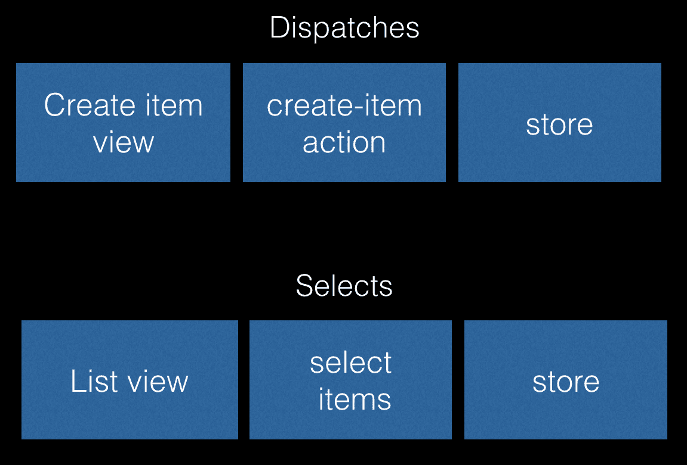
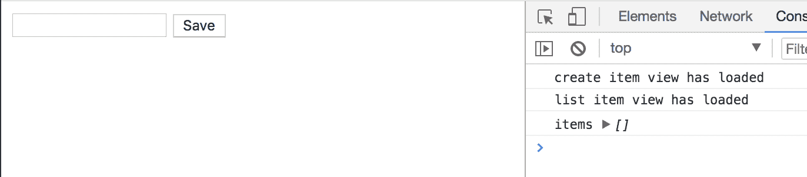
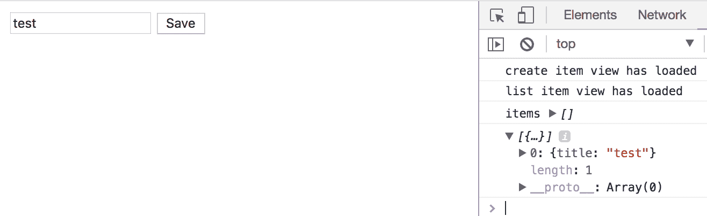
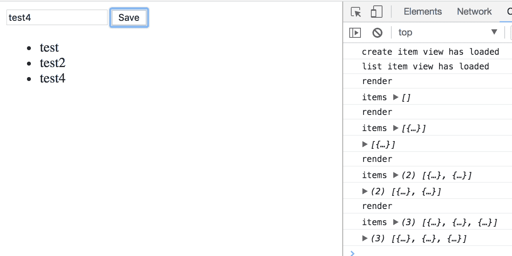

# Redux

在一个应用中维护和控制状态，当我们的应用比 Todo 应用更大时，这会迅速变得复杂，尤其是如果我们有多个视图、模型以及它们之间的依赖关系。多种状态类型，如缓存数据、服务器响应以及当你与该应用一起工作时仅在本地存在的数据，使得情况更加复杂。由于多个参与者、同步和异步代码可以更改状态，更改状态变得更加复杂。随着应用的不断增长，最终结果是一个非确定性的系统。这样的系统的问题是，你失去了可预测性，这反过来意味着你可能会有难以复现的 bug，并且使得应用及其数据难以推理。我们渴望秩序和可预测性，但我们两者都没有。

为了尝试解决这个问题，我们在前一章中介绍了 Flux 模式。一切都很顺利，对吧？我们不需要另一个模式。或者我们需要吗？好吧，Flux 有问题。其中一个问题是你的数据被分割成几个存储。你可能会想，那有什么问题呢？想象一下你有一个在多个存储中触发的动作。很容易忘记在所有存储中处理一个动作。所以，这个问题更多的是一个管理问题。多个存储的另一个问题是，很难获得一个关于你的状态构成的良好概览。更新是我们与 Flux 的另一个问题。有时你有很多更新；更新状态和顺序很重要。在 Flux 中，这是通过一个称为`waitFor`的结构来处理的。想法是，你应该能够指定在什么顺序下发生什么。这听起来很好，但想象一下，这被分散在许多模块中；这变得难以跟踪，因此容易出错。

变更和异步行为是两个难以处理的概念。变更意味着我们更改数据。异步意味着某事需要时间来完成；当它完成时，可能会更改状态。想象一下混合同步和异步操作，所有这些操作都在更新状态。我们意识到由于这一点，跟踪代码变得不容易，而且与状态变更混合在一起使得整个情况更加复杂。

这引导我们思考 Redux 能为我们做什么，那就是使我们的变更可预测，但它也给我们一个存储，一个单一的真实来源。

在本章中，你将学习：

+   核心概念

+   数据如何流动

+   如何通过构建自己的 Redux 迷你实现来将你的技能付诸实践

+   在 Redux 的上下文中如何处理 AJAX

+   一些最佳实践

# 原则

Redux 建立在三个原则之上：

+   单一真实来源：我们有一个地方存放所有数据。

+   状态是只读的：无变更；改变状态只有一种方式，那就是通过一个动作。

+   变更通过纯函数进行：通过应用变更并产生新状态来生成新状态；旧状态永远不会被更改。

让我们逐一点探索这些要点。

# 单一事实来源

数据生活在 Redux 的单个存储中，而不是像 Flux 那样的多个存储。数据由一个对象树表示。这带来了很多好处，例如：

+   在任何给定时刻更容易看到你的应用程序知道什么，因此它很容易进行序列化或反序列化。

+   在开发中更容易处理，更容易调试和检查。

+   如果所有应用的动作都产生一个新的状态，那么执行撤销/重做等操作会更简单。

一个单存储的例子可能如下所示：

```js
// principles/store.js

class Store {
  getState() {
    return {
      jedis: [
        { name: "Yoda", id: 1 },
        { name: "Palpatine", id: 2 },
        { name: "Darth Vader", id: 3 }
      ],
      selectedJedi: {
        name: "Yoda",
        id: 1
      }
    };
  }
}

const store = new Store();
console.log(store.getState());

/*
{
  jedis: [
    { name: 'Yoda', id: 1 },
    { name: 'Palpatine', id: 2 },
    { name: 'Darth Vader', id: 3 }
  ],
  selectedJedi: {
    name: 'Yoda', id: 1
  }
}
*/
```

如您所见，这只是一个对象。

# 只读状态

我们希望确保只有一种方式可以改变状态，那就是通过称为动作的中介。一个动作应该描述动作的意图以及应该应用于当前状态的数据。我们通过`store.dispatch(action)`来分发动作。动作本身应该看起来像以下这样：

```js
// principles/action.js

// the action
let action = {
  // expresses intent, loading jedis
  type: "LOAD_JEDIS", 
  payload:[
    { name: "Yoda", id: 1 },
    { name: "Palpatine", id: 2 }, 
    { name: "Darth Vader", id: 3 }
  ]
};
```

在这个阶段，让我们尝试实现一个存储可能的样子以及它最初包含的内容：

```js
// principles/storeII.js

class Store {
  constructor() {
    this.state = {
      jedis: [],
      selectedJedi: null
    }
  }

  getState() {
    return this.state;
  }
}

const store = new Store();

console.log(store.getState());
// state should now be
/*
{
  jedis : [],
  selectedJedi: null
}
*/
```

我们可以看到它是一个由两个属性组成的对象，`jedis`是一个数组，`selectedJedi`是一个包含我们选择的对象的对象。在这个时候，我们想要分发一个动作，这意味着我们将使用前面代码中显示的旧状态，并产生一个新的状态。我们之前描述的动作应该改变`jedis`数组，并用传入的数组替换空数组。但是，请记住，我们并没有修改现有的存储对象；我们只是取它，应用我们的更改，并产生一个新的对象。让我们分发我们的动作并查看最终结果：

```js
// principles/storeII-with-dispatch.js

class Store {
  constructor() {
    this.state = {
      jedis: [],
      selectedJedi: null
    }
  }

  getState() {
    return this.state;
  }

  dispatch(action) {
 // to be implemented in later sections
 }
}

// the action
let action = {
  type: 'LOAD_JEDIS',
  payload:[
    { name: 'Yoda', id: 1 },
    { name: 'Palpatine', id: 2 }, 
    { name: 'Darth Vader', id: 3 }
  ]
}

// dispatching the action, producing a new state
store.dispatch(action);

console.log(store.getState());
// state should now be
/*
{
  jedis : [
 { name: 'Yoda', id: 1 },
 { name: 'Palpatine', id: 2 }, 
 { name: 'Darth Vader', id: 3 }
 ],
  selectedJedi: null
}
*/
```

前面的代码是伪代码，因为它实际上还没有产生预期的结果。我们将在后面的章节中学习如何实现存储。好的，现在我们的状态已经改变，传入的数组已经替换了我们之前使用的空数组。我们再次强调，我们没有修改现有的状态，而是根据旧状态和我们的动作产生了新的状态。让我们看看下一个关于*纯函数*的部分，并进一步解释我们的意思。

# 使用纯函数改变状态

在上一个部分，我们介绍了动作的概念以及它是我们允许改变状态的媒介。然而，我们并没有在正常意义上改变状态，而是取了旧状态，应用了动作，并产生了新状态。为了完成这个任务，我们需要使用一个纯函数。在 Redux 的上下文中，这些被称为 reducers。让我们自己写一个`reducer`：

```js
// principles/first-reducer.js

module.exports = function reducer(state = {}, action) {
  switch(action.type) {
    case "SELECT_JEDI":
      return Object.assign({}, action.payload);
    default:
      return state;
  }
}
```

我们强调前面`reducer`的纯特性。它从`action.payload`中获取我们的`selectedJedi`，使用`Object.assign()`进行复制，分配它，并返回新状态。

我们所写的是一个`reducer`，它根据我们尝试执行的动作进行切换，并执行更改。让我们将这个纯函数投入使用：

```js
const reducer = require("./first-reducer");

let initialState = {};
let action = { type: "SELECT_JEDI", payload: { id: 1, name: "Jedi" } };
let state = reducer(initialState, action);
console.log(state);

/* this produces the following:
{ id: 1, name: 'Yoda' }
*/
```

# 核心概念

在 React 中，我们正在处理三个核心概念，我们已经介绍了状态、动作和 reducer。现在，让我们深入了解，真正理解它们是如何结合在一起以及它们是如何工作的。

# 不可变模式

状态的全部意义在于接受一个现有的状态，对其应用一个动作，并产生一个新的状态。它可以写成这样：

```js
old state + action = new state
```

假设你正在进行基本的计算，那么你将开始这样写：

```js
// sum is 0
let sum = 0;

// sum is now 3
sum +=3;
```

然而，Redux 的方式是将前面的操作改为：

```js
let sum = 0;
let sumWith3 = sum + 3;
let sumWith6 = sumWith3 + 3; 
```

我们没有做任何修改，而是为我们所做的每一件事都产生一个新的状态。让我们看看不同的构造，以及在实际中不修改意味着什么。

# 修改列表

我们可以在列表上执行两种操作：

+   向列表中添加项目

+   从列表中移除项目

让我们拿第一个要点，以旧的方式做出这个改变，然后以 Redux 的方式做出这个改变：

```js
// core-concepts/list.js

// old way
let list = [1, 2, 3];
list.push(4);

// redux way
let immutablelist = [1, 2, 3];
let newList = [...immutablelist, 4];

console.log("new list", newList);
/*
  [1, 2, 3, 4]
*/

```

前面的代码取旧列表及其项目，创建一个新的列表，包含旧列表加上我们的新成员。

对于我们的下一个要点，要移除一个项目，我们这样做：

```js
// core-concepts/list-remove.js

// old way
let list = [1, 2, 3];
let index = list.indexOf(1);
list.splice(index, 1);

// redux way
let immutableList = [1, 2, 3];
let newList = immutableList.filter(item => item !== 1);

```

如您所见，我们产生了一个不包含我们的项目的列表。

# 修改对象

修改对象涉及到在它上面更改属性以及向它添加属性。首先，让我们看看如何更改现有值：

```js
// core-concepts/object.js

// the old way
let anakin = { name: "anakin" };
anakin.name = "darth";
console.log(anakin);

// the Redux way
let anakinRedux = { name: "anakin" };
let darth = Object.assign({}, anakinRedux, { name: "darth" });

console.log(anakinRedux);
console.log(darth);
```

这就涵盖了现有情况。那么，添加新属性怎么办？我们可以这样做：

```js
// core-concepts/object-add.js

// the old way
let anakin = { name: "anakin" };
console.log("anakin", anakin);

anakin["age"] = "17";
console.log("anakin with age", anakin);

// the Redux way
let anakinImmutable = { name: "anakin" };
let anakinImmutableWithAge = Object.assign({}, anakinImmutable, { age: 17 });

console.log("anakin redux", anakinImmutable);
console.log("anakin redux with age", anakinImmutableWithAge);
```

# 使用 reducer

在上一节中，我们介绍了如何以旧的方式更改状态以及如何以新的 Redux 方式执行。reducer 不过是纯函数；纯的意思是它们不改变，而是产生一个新的状态。但是，reducer 需要一个动作来工作。让我们深化我们对 reducer 和动作的了解。让我们创建一个动作，用于向列表添加项目，以及与之对应的 reducer：

```js
// core-concepts/jedilist-reducer.js

let actionLuke = { type: "ADD_ITEM", payload: { name: "Luke" } };
let actionVader = { type: "ADD_ITEM", payload: "Vader" }; 

function jediListReducer(state = [], action) {
  switch(action.type) {
    case "ADD_ITEM": 
      return [... state, action.payload];
    default: 
      return state;
  }
}

let state = jediListReducer([], actionLuke);
console.log(state);
/*
[{ name: 'Luke '}]
*/

state = jediListReducer(state, actionVader);
console.log(state);
/*
[{ name: 'Luke' }, { name: 'Vader' }] 
*/

module.exports = jediListReducer;
```

好的，现在我们知道如何处理列表了；那么对象呢？我们再次需要定义一个动作和一个 reducer：

```js
// core-concepts/selectjedi-reducer.js

let actionPerson = { type: "SELECT_JEDI", payload: { id: 1, name: "Luke" } };
let actionVader = { type: "SELECT_JEDI", payload: { id: 2, name: "Vader" } };

function selectJediReducer({}, action) {
  switch (action.type) {
    case "SELECT_JEDI":
      return Object.assign({}, action.payload);
    default:
      return state;
  }
}

state = selectJediReducer({}, actionPerson);
console.log(state);
/*
{ name: 'Luke' }
*/

state = selectJediReducer(state, actionVader);
console.log(state);
/*
{ name: 'Vader' }
*/

module.exports = selectJediReducer;
```

我们在这里看到的是如何通过调用`SELECT_JEDI`使一个对象完全替换另一个对象的内容。我们还看到我们如何使用`Object.assign()`来确保我们只复制传入对象中的值。

# 合并所有 reducer

好的，现在我们已经有了一个处理`jedis`列表的 reducer，以及一个专门处理特定`jedis`选择的 reducer。我们之前提到，在 Redux 中，我们有一个单一的存储，所有我们的数据都存储在那里。现在是我们创建这个单一存储的时候了。这可以通过创建以下函数`store()`轻松实现：

```js
// core-concepts/merged-reducers.js

function store(state = { jedis: [], selectedJedi: null }, action) {
  return {
    jedis: jediListReducer(state.jedis, action),
    selectedJedi: selectJediReducer(state.selectedJedi, action)
  };
}

let newJediActionYoda = { type: "ADD_ITEM", payload: { name: "Yoda"} };
let newJediActionVader = { type: "ADD_ITEM", payload: { name: "Vader"} };
let newJediSelection = { type: "SELECT_JEDI", payload: { name: "Yoda"} };

let initialState = { jedis: [], selectedJedi: {} };

let state = store(initialState, newJediActionYoda);
console.log("Merged reducers", state);
/*
  { 
    jedis: [{ name: 'Yoda' }], 
    selectedJedi: {} 
  }
*/

state = store(state, newJediActionVader);
console.log("Merged reducers", state);
/*
 { 
   jedis: [{ name 'Yoda' }, {name: 'Vader'}], 
   selectedJedi: {} 
 }
*/

state = store(state, newJediSelection);
console.log("Merged reducers", state);

console.log(state);
/*
{
  jedis: [{ name: 'Yoda' }, { name: 'Vader'}],
  selectedJedi: { name: 'Yoda' }
}
*/
```

从我们在这里看到的情况来看，我们的`store()`函数所做的不过是返回一个对象。返回的对象是我们的当前状态。我们选择如何称呼状态对象的属性，就是我们想要在显示存储内容时引用的内容。如果我们想要改变存储的状态，我们需要重新调用`store()`函数，并给它提供一个表示我们改变意图的动作。

# 数据流

好的，所以我们知道了动作、reducer 和以纯方式操作状态。那么，如何在实际应用中将所有这些结合起来呢？我们该如何做呢？让我们尝试模拟我们应用程序的数据流。想象一下，我们有一个视图处理向列表添加项目，还有一个视图处理显示列表。然后，我们的数据流可能看起来像以下这样：



在创建项目视图的情况下，我们输入创建项目所需的数据，然后我们派发一个动作，即 create-item，这最终会将项目添加到存储中。在我们的其他数据流中，我们只有一个列表视图，它从存储中选择项目，这导致列表视图被填充。我们意识到在实际应用中可能有以下步骤：

1.  用户交互

1.  创建表示我们意图的动作

1.  派发一个动作，这导致我们的状态改变其状态

上述步骤适用于我们的创建项目视图。对于我们的列表视图，我们只想从存储中读取并显示数据。让我们尝试使这一点更具体，并将至少 Redux 部分转换为实际代码。

# 创建动作

我们将首先创建一个动作创建器，一个辅助函数，帮助我们创建动作：

```js
// dataflow/actions.js

export function createItem(title){
  return { type: "CREATE_ITEM", payload: { title: title } };
}
```

# 创建控制器类 – create-view.js

现在想象一下，我们处于处理创建项目的视图代码中；它可能看起来像这样：

```js
// dataflow/create-view.js

import { createItem } from "./actions";
import { dispatch, select } from "./redux";

console.log("create item view has loaded");

class CreateItemView {
  saveItem() {
    const elem = document.getElementById("input");
    dispatch(createItem(elem.value));
    const items = select("items");
    console.log(items);
  }
}

const button = document.getElementById("saveButton");
const createItemWiew = new CreateItemView();

button.addEventListener("click", createItemWiew.saveItem);

export default createItemWiew;
```

好的，所以，在我们的 `create-view.js` 文件中，我们创建了一个 `CreateItemView` 类，它上面有一个 `saveItem()` 方法。`saveItem()` 方法是响应 ID 为 `saveButton` 的按钮点击事件的第一响应者。当按钮被点击时，我们的 `saveItem()` 方法被调用，这最终会调用我们的 `dispatch` 函数，使用 `createItem()` 动作方法，该方法反过来使用输入元素值作为输入，如下所示：

```js
dispatch(createItem(elem.value));
```

# 创建存储实现

我们还没有创建 `dispatch()` 方法，所以我们将接下来做这件事：

```js
// dataflow/redux.js

export function dispatch(action) {
  // implement this
}
```

从前面的代码中我们可以看到，我们有一个 `dispatch()` 函数，这是我们从这个文件导出的东西之一。让我们尝试填写实现：

```js
// dataflow/redux-stepI.js

// 1)
function itemsReducer(state = [], action) {
 switch(action.type) {
 case "CREATE_ITEM":
 return [...state, Object.assign(action.payload) ];
 default: 
 return state;
 } 
}

// 2)
let state = {
 items: []
};

// 3
function store(state = { items: [] }, action) {
 return {
 items: itemsReducer(state.items, action)
 };
}

// 4)
export function getState() {
 return state;
}

// 5)
export function dispatch(action) {
  state = store(state, action);
}
```

让我们解释一下我们从顶部做了什么。我们首先定义了一个名为 `itemsReducer` 的 reducer 1)，它可以根据新项目生成新状态。之后，我们创建了一个状态变量，即我们的状态 2）。这之后是 `store()` 函数 3)，这是一个设置哪个属性与哪个 reducer 配对的函数。之后，我们定义了一个名为 `getState()` 的函数 4)，它返回我们的当前状态。最后，我们有我们的 `dispatch()` 函数 5)，它只是调用 `store()` 函数并传递给它我们提供的动作。

# 测试我们的存储

现在是时候使用我们的代码了；首先，我们将创建一个 `redux-demo.js` 文件来测试我们的 Redux 实现，然后我们将对其进行一些润色，最后我们将将其用于我们之前创建的视图中：

```js
// dataflow/redux-demo.js

import { dispatch, getState, select, subscribe } from "./redux";

const { addItem } = require("./actions");
subscribe(() => {
console.log("store changed");
});
console.log("initial state", getState());
dispatch(addItem("A book"));
dispatch(addItem("A second book"));
console.log("after dispatch", getState());
console.log("items", select("items"));

/* 
this will print the following

state before: { items: [] }
state after: { items: [{ title: 'a new book'}] }
*/

```

# 清理实现

好的，所以我们的 Redux 实现看起来似乎正在工作。现在是时候对其进行一些清理了。我们需要将 reducer 移动到它自己的文件中，如下所示：

```js
// dataflow/reducer.js

function itemsReducer(state = [], action) {
  switch(action.type) {
    case "CREATE_ITEM":
      return [...state, Object.assign(action.payload) ];
    default: 
      return state;
  }    
}
```

也是一个好主意，向存储中添加一个 `select()` 函数，因为我们有时不想移动整个状态，而只想移动其中的一部分。我们的列表视图将受益于 `select()` 函数的使用。让我们添加这个函数：

```js
// dataflow/redux-stepII.js
 // this now refers to the reducers.js file we broke out
import { itemsReducer } from "./reducers";

let state = {
  items: []
};

function store(state = { items: [] }, action) {
  return {
   items: itemsReducer(state.items, action)
  };
}

export function getState() {
  return state;
}

export function dispatch(action) {
  state = store(state, action);
}

export function select(slice) {
  return state[slice];
}
```

# 创建第二个控制器类 – `list-view.js`

让我们现在将注意力转移到我们尚未创建的 `list-view.js` 文件上：

```js
// dataflow/list-view.js

import { createItem } from "./actions";
import { select, subscribe } from "./redux";

console.log("list item view has loaded");

class ListItemsView {
  constructor() {
    this.render();
    subscribe(this.render);
  }

  render() {
    const items = select("items");
    const elem = document.getElementById("list");

    elem.innerHTML = "";
    items.forEach(item => {
      const li = document.createElement("li");
      li.innerHTML = item.title;
      elem.appendChild(li);
    });
  }
}

const listItemsView = new ListItemsView();
export default listItemsView;
```

好的，所以我们利用 `select()` 方法从我们创建的 `redux.js` 文件中的状态中获取状态的一部分。然后我们渲染响应。只要这些视图在不同的页面上，我们总是会从我们的状态中获得 `items` 数组的最新版本。然而，如果这些视图同时可见，那么我们就有一个问题。

# 为我们的存储添加订阅功能

某种程度上，列表视图需要监听存储中的变化，以便在发生变化时重新渲染。实现这一点的办法当然是设置某种类型的监听器，当发生变化时触发事件。如果我们作为视图订阅这些变化，那么我们可以相应地采取行动并重新渲染我们的视图。有几种不同的方法可以实现这一点：我们可以实现一个可观察的模式，或者使用一个库，例如 `EventEmitter`。让我们更新我们的 `redux.js` 文件来实现这一点：

```js
// dataflow/redux.js

import { itemsReducer } from "./reducer";
import EventEmitter from "events";
const emitter = new EventEmitter();

let state = {
  items: []
};

function store(state = { items: [] }, action) {
  return {
    items: itemsReducer(state.items, action)
  };
}

export function getState() {
  return state;
}

export function dispatch(action) {
  const oldState = state;
  state = store(state, action);
  emitter.emit("changed");
}

export function select(slice) {
  return state[slice];
}

export function subscribe(cb) {
  emitter.on("changed", cb);
}
```

# 创建一个程序

到目前为止，我们已经创建了一系列文件，具体如下：

+   `redux.js`：我们的存储实现。

+   `create-view.js`：一个控制器，它监听输入和按钮点击。控制器将在按钮点击时读取输入，并派发输入的值以便将其保存在存储中。

+   `list-view.js`：我们的第二个控制器，负责显示存储的内容。

+   `todo-app.js`：创建我们整个应用的启动文件（我们尚未创建此文件）。

+   `index.html`：我们应用的 UI（我们尚未创建此文件）。

# 设置我们的环境。

也许你已经注意到我们正在使用用于 ES6 模块的导入语句？有许多方法可以使它工作，但我们选择了一个现代选项，即利用 webpack。为了成功设置 webpack，我们需要做以下事情：

+   安装 npm 库 `webpack` 和 `webpack-cli`

+   创建一个 `webpack.config.js` 文件并指定应用的入口点。

+   在 `package.json` 文件中添加一个条目，以便我们可以通过简单的 `npm start` 来构建和运行我们的应用。

+   添加一个 HTTP 服务器，以便我们可以展示应用。

我们可以通过输入以下命令来安装所需的库：

```js
npm install webpack webpack-cli --save-dev
```

此后，我们需要创建我们的 `config` 文件，`webpack.config.js`，如下所示：

```js
// dataflow/webpack.config.js

module.exports = {
  entry: "./todo-app.js",
  output: {
    filename: "bundle.js"
  },
  watch: true
};
```

在前面的代码中，我们声明入口点应该是 `todo-app.js`，并且输出文件应该命名为 `bundle.js`。我们还通过将 `watch` 设置为 `true` 来确保我们的包将被重新构建。让我们通过在 `script` 标签中添加以下内容来将所需的入口添加到 `package.json` 文件中：

```js
// dataflow/package.json excerpt

"scripts": {
  "start" : "webpack -d"
}
```

在这里，我们定义了一个启动命令，它使用 webpack 的`-d`标志调用 webpack，这意味着它将生成源映射，从而提供良好的调试体验。

对于我们的最后一步设置，我们需要一个 HTTP 服务器来显示我们的应用程序。Webpack 本身有一个叫做`webpack-dev-server`的，或者我们可以使用`http-server`，这是一个 NPM 包。这是一个相当简单的应用程序，所以两者都可以。

# 创建缺失的文件并运行我们的程序

我们的应用程序需要一个 UI，让我们创建它：

```js
// dataflow/dist/index.html

<html>
  <body>
    <div>
      <input type="text" id="input">
      <button id="saveButton">Save</button>
    </div>
    <div>
      <ul id="list"></ul>
    </div>
    <button id="saveButton">Save</button>
    <script src="img/bundle.js"></script>
  </body>
</html>

```

因此，这里我们有一个输入元素和一个按钮，我们可以按下它来保存一个新项目。接下来是一个列表，我们的内容将会在这里渲染。

接下来，让我们创建`todo-app.js`。它应该看起来像以下这样：

```js
// dataflow/todo-app.js

// import create view
import createView from "./create-view";
// import list view
import listView from "./list-view";
```

在这里，我们正在引入两个控制器，这样我们就可以收集输入以及显示存储内容。让我们通过在终端窗口中输入`npm start`来尝试我们的应用程序。这将在 dist 文件夹中创建`bundle.js`文件。为了显示应用程序，我们需要打开另一个终端窗口并定位到`dist`文件夹。你的 dist 文件夹应该包含以下文件：

+   `index.html`

+   `bundle.js`

现在我们已经准备好通过输入`http-server -p 5000`来启动应用程序。你可以在浏览器中的`http://localhost:5000`找到你的应用程序：



我们看到我们期望的应用程序，有一个输入元素和一个按钮，我们还看到右侧的控制台显示我们的两个控制器都已加载。此外，我们还看到存储对象 items 属性的内容，它指向一个空数组。这是预期的，因为我们还没有向其中添加任何项目。让我们通过向我们的输入元素添加一个值并按下保存按钮来向我们的存储添加一个项目：



在右侧，我们可以看到我们的存储现在包含了一个项目，但我们的 UI 没有更新。原因是我们没有实际订阅这些变化。我们可以通过向我们的 list-view.js 控制器文件中添加以下代码片段来改变这一点：

```js
// dataflow/list-view.js

import { createItem } from "./actions";
import { select, subscribe } from "./redux";

console.log("list item view has loaded");

class ListItemsView {
  constructor() {
    this.render();
    subscribe(this.render);
  }

  render() {
    const items = select("items");
    const elem = document.getElementById("list");
    elem.innerHTML = "";
    console.log("items", items);

    items.forEach(item => {
      const li = document.createElement("li");
      li.innerHTML = item.title;
      elem.appendChild(li);
    });
  }
}

const listItemsView = new ListItemsView();
export default listItemsView;
```

现在我们的应用程序应该按预期渲染，并且看起来应该像这样，前提是你添加了一些项目：



# 处理异步调用

分发动作始终是同步完成的。数据通过 AJAX 异步获取，那么我们如何让异步与 Redux 良好地协同工作呢？

当设置异步调用时，你应该以下述方式定义你的 Redux 状态：

+   加载：在这里，我们有显示旋转器、不渲染 UI 的一部分，或者以其他方式向用户传达 UI 正在等待某物的机会

+   数据成功获取：你应该为获取的数据设置一个状态

+   发生错误：你应该以某种方式记录错误，这样你就能告诉用户发生了错误

根据惯例，您使用单词 fetch 来表示您正在获取数据。让我们看看这可能会是什么样子。首先，让我们定义我们需要采取的步骤：

1.  创建一个 reducer。这个 reducer 应该能够根据我们是在等待响应、已收到响应还是发生了错误来设置不同的状态。

1.  创建动作。我们需要一个文件的动作来支持我们之前提到的状态；创建这个文件更多的是关于便利性。

1.  更新我们的 `redux.js` 文件以使用我们新的 reducer。

1.  测试我们的创建。

假设我们正在从 API 获取一本书。我们应该有一个看起来像以下的 reducer：

```js
// async/book-reducer.js

let initialState = {
  loading: false,
  data: void 0,
  error: void 0
};

const bookReducer = (state = initialState, action) => {
  switch(action.type) {
    case 'FETCH_BOOK_LOADING':
      return {...state, loading: true };
    case 'FETCH_BOOK_SUCCESS':
      return {...state, data: action.payload.map(book => ({ ... book })) };
    case 'FETCH_BOOK_ERROR': 
      return {...state, error: { ...action.payload }, loading: false }; 
  }
}

module.exports = bookReducer;
```

现在我们已经涵盖了 reducer 部分，让我们继续创建动作。它看起来如下：

```js
// async/book-actions.js

const fetchBookLoading = () => ({ type: 'FETCH_BOOK_LOADING' });
const fetchBookSuccess = (data) => ({ type: 'FETCH_BOOK_SUCCESS', payload: data });
const fetchBookError = (error) => ({ type: 'FETCH_BOOK_ERROR', payload: error });

module.exports = {
  fetchBookLoading,
  fetchBookSuccess,
  fetchBookError
};
```

现在我们需要转向我们的 `store` 文件并更新它：

```js
// async/redux.js

const bookReducer = require('./book-reducer');
const EventEmitter = require('events');
const emitter = new EventEmitter();

let state = {
  book: {}
};

function store(state = {}, action) {
  return {
    book: bookReducer(state.book, action)
  };
}

function getState() {
  return state;
}

function dispatch(action) {
  const oldState = state;
  state = store(state, action);
  emitter.emit('changed');
}

function select(slice) {
  return state[slice];
}

function subscribe(cb) {
  emitter.on('changed', cb);
}

module.exports = {
  getState, dispatch, select, subscribe
}
```

# 使用 Redux 和异步创建一个演示

现在是时候测试一切了。我们在这里感兴趣的是确保我们的存储状态按预期工作。我们希望存储反映我们正在加载数据、接收数据，以及如果发生错误，这也应该得到反映。让我们先模拟一个 AJAX 调用：

```js
const { fetchBookLoading, fetchBookSuccess, fetchBookError } = require('./book-actions');
const { dispatch, getState } = require('./redux');

function fetchBook() {
  return new Promise(resolve => {
    setTimeout(() => {
      resolve({ title: 'A new hope  - the book' });
    }, 1000);
  })
}
```

作为我们接下来的业务，让我们为状态设置一些日志记录，并分发我们的第一个动作 `fetchBookLoading`，这表示一个 AJAX 请求正在进行中。理想情况下，我们希望在这个状态下反映 UI 并显示一个旋转器或类似的东西：

```js
console.log(getState());
// { book: {} }

dispatch(fetchBookLoading());

console.log(getState());
// { book: { loading: true } }
```

最后一步是调用我们的 `fetchBook()` 方法并适当地设置存储状态：

```js
async function main() {
try {
  const book = await fetchBook();
  dispatch(fetchBookSuccess(book));
  console.log(getState());

  // { book: { data: { title: 'A new hope - the book'}, loading: false } }
} catch(err) {
  dispatch(fetchBookError(err));
  console.log(getState());

  // { book: { data: undefined, error: { title: 'some error message' } } }
  }
}

main();
```

到目前为止，我们已经从上到下分步骤描述了我们的演示。完整的代码应该像这样：

```js
// async/demo.js

const { fetchBookLoading, fetchBookSuccess, fetchBookError } = require('./book-actions');
const { dispatch, getState } = require('./redux');

function fetchBook() {
  return new Promise(resolve => {
    setTimeout(() => {
      resolve({ title: 'A new hope - the book' });
    }, 1000);
  })
}

console.log(getState());
dispatch(fetchBookLoading());
console.log(getState());

async function main() {
  try {
    const book = await fetchBook();
    dispatch(fetchBookSuccess(book));
    console.log(getState());
  } catch(err) {
    dispatch(fetchBookError(err));
    console.log(getState());
  }
}

main();
```

如您所见，处理异步操作实际上并没有太多复杂的地方，你只需要在异步操作完成其流程后，分配合适的状态即可。尽管如此，处理异步操作还是有相应的库。如果您是 React 用户，那么研究 Sagas 可能是值得的；如果您喜欢 Angular，那么 NgRx 和 effects 就是您的首选。存在这些独立库的原因在于，异步交互，尤其是 AJAX 交互，被视为副作用，因此它们位于 *正常* 流程之外。最终，是否需要这样的库取决于您的个人判断。

# 最佳实践

到目前为止，我们已经走得很远了。我们已经涵盖了原则、核心概念，甚至自己构建了 Redux 实现。在这个时候，我们应该非常自豪。尽管如此，我们还有一些内容尚未涉及，那就是如何以最佳方式使用 Redux。有一些关键规则我们可以遵循。

优化文件系统。在构建应用程序时，您不应该只有几个文件，而应该有很多，通常按功能组织。这导致了一个功能以下面的文件设置：

+   **Reducer**：我们应该为每个 reducer 有一个文件

+   **Actions**：我们应该有一个文件来描述我们可能需要分发的所有动作

+   **视图/组件文件**：这与 Redux 无关，但无论我们选择哪个框架，我们通常都有一个文件来描述我们试图构建的组件

还有另一个值得做的事情，那就是优化我们 store 的设置过程。store 通常需要用多个 reducer 进行初始化。我们可以编写一些类似这样的代码：

```js
const booksReducer = require("./books/reducer");
const personReducer = require("./reducer");

function combineReducers(config) {
  const states = Object.keys(config);
  let stateObject = {};

  states.forEach(state => {
    stateObject[state] = config[state];
  });

  return stateObject;
}

const rootReducer = combineReducers({
  books: booksReducer,
  person: personReducer
});

const store = createStore(rootReducer);

store.reduce({ type: "SOME_ACTION", payload: "some data" });
```

这里的设置没有问题，但是如果你有很多功能，每个功能都有一个 reducer，最终你会有很多导入，你的 `combineReducers()` 调用会越来越长。解决这个问题的方法是在每个 reducer 中注册它自己到 `rootReducer`。这样，我们可以切换以下调用：

```js
const rootReducer = combineReducers({
  books: booksReducer,
  person: personReducer
});

const store = createStore(rootReducer);
```

它将被替换为以下内容：

```js
const store = createStore(getRootReducer());
```

这迫使我们创建一个新的 `root-reducer.js` 文件，其结构如下：

```js
// best-practices/root-reducer.js

function combineReducers(config) {
  const states = Object.keys(config);
  let stateObject = {};

  states.forEach(state => {
    stateObject[state] = config[state];
  });

  return stateObject;
}

let rootReducer = {};

function registerReducer(reducer) {
  const entry = combineReducers(reducer);
  rootReducer = { ...rootReducer, ...entry };
}

function getRootReducer() {
  return rootReducer;
}

module.exports = {
  registerReducer,
  getRootReducer
};
```

我们在这里突出了重要部分，即 `registerReducer()` 方法，reducer 现在可以使用它来注册自己到 `rootReducer`。在这个时候，回到我们的 reducer 并更新它以使用 `registerReducer()` 方法是值得的：

```js
// best-practies/books/reducer.js

const { registerReducer } = require('../root-reducer');

let initialState = [];

function bookReducer(state = initialState, action) {
  switch(action.type) {
    case 'LIST_BOOKS':
      return state;
    case 'ADD_BOOK':
      return [...state, {...action.payload}];
  }
}

registerReducer({ books: bookReducer });
```

# 摘要

本章内容丰富多彩，从描述原则到核心概念，再到能够理解和甚至构建自己的 Redux。我们花费时间研究如何处理 AJAX 调用和适合该状态的模式。我们了解到这实际上并没有什么复杂。我们通过查看最佳实践来结束本章。到目前为止，我们能够更好地理解和欣赏 NgRx，因为我们知道了其底层模式和存在的理由。我们可以知道，在书的最后一章我们将学习 NgRx。目标是涵盖其原则和概念，如何在实践中使用它，以及涵盖一些必要的工具，以确保我们真正成功。
