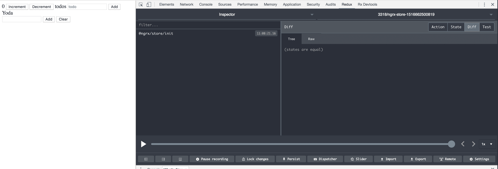
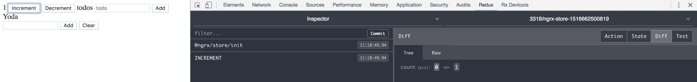
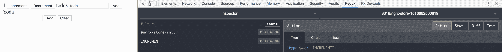
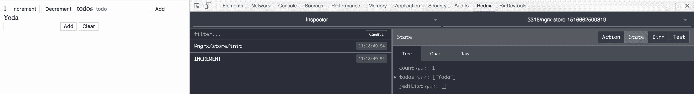
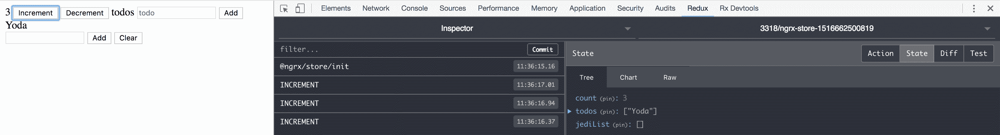
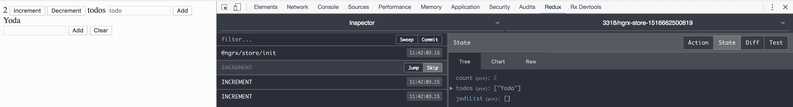
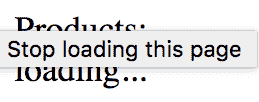
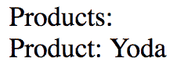

# NgRx – Reduxing that Angular App

我们已经到达了这本书的最后一章。现在是时候理解 NgRx 库了。到目前为止，已经涵盖了不同的主题，使您作为读者更习惯于思考诸如不可变数据结构和响应式编程等问题。我们这样做是为了使您更容易消化本章中将要介绍的内容。NgRx 是为 Angular 制作的 Redux 实现，因此诸如存储、动作创建器、动作、选择器和还原器等概念被广泛使用。您通过阅读前面的章节可能已经了解到了 Redux 的工作原理。通过阅读上一章，您将发现您所学的 Redux 知识如何转化为 NgRx 以及其代码组织原则。本章旨在描述核心库 `@ngrx-store`，如何使用 `@ngrx-effects` 处理副作用，以及如何像专业人士一样使用 `@ngrx/store-devtools` 进行调试，以及其他内容。

在本章中，我们将学习：

+   使用 `@ngrx/store` 进行状态管理

+   使用 `@ngrx/effects` 处理副作用

+   如何使用 `@ngrx/store-devtools` 进行调试

+   如何使用 `@ngrx/router-store` 捕获和转换路由状态

# NgRx 概述

NgRx 由以下部分组成：

+   `@ngrx/store`：这是包含我们维护状态和分发动作方式的核心。

+   `@ngrx/effects`：这将处理副作用，例如，例如 AJAX 请求。

+   `@ngrx/router-store`：这确保我们可以将 NgRx 与 Angular 路由集成。

+   `@ngrx/store-devtools`：这将安装一个工具，例如，通过提供时间旅行调试功能，给我们调试 NgRx 的机会。

+   `@ngrx/entity`：这是一个帮助我们管理记录集合的库。

+   `@ngrx/schematics`：这是一个脚手架库，在您使用 NgRx 时提供帮助。

# 关于状态管理的一些话

一些组件必须具有状态。当有其他组件需要了解那个非常相同的状态时，第一个组件需要找到一种方法将这个状态传达给其他组件。有许多实现这一目标的方法。一种方法是通过确保所有应该共享的状态都生活在中央存储中。将这个存储视为一个单一的真实来源，所有组件都可以从中读取。并不是每个状态都一定需要最终进入中央存储，因为状态可能只关注特定的组件。在 NgRx 和 Redux 之前，解决这一问题的方法之一是将所有内容放入一个全局可访问的对象或服务中。正如我们提到的，存储就是这样。它在全局上是可访问的，因为它可以被注入到可能需要它的任何组件中。一个警告：尽管将所有状态放入我们的存储中很有诱惑力，但我们真的不应该这样做。需要在不同组件之间共享的状态值得放入那里。

从拥有集中式存储中我们得到的另一个好处是，保存应用程序的状态以便稍后恢复非常容易。如果状态只存在于一个地方，比如用户或系统，那么用户可以轻松地将该状态持久化到后端，这样下次，如果他们想要从上次离开的地方继续，他们可以通过查询后端的状态来轻松地做到这一点。所以，除了想要在许多组件之间共享数据之外，还存在另一个想要集中存储的原因。

# @ngrx/store – 状态管理

本节中的所有文件都指向`Chapter9/State`项目。

这是我们一直等待的时刻。我们实际上该如何开始呢？这真的很简单。首先，让我们确保我们已经安装了 Angular CLI。我们通过在终端中输入以下内容来完成此操作：

```js
npm install -g @angular/cli
```

在这一点上，我们需要一个 Angular 项目。我们使用 Angular CLI 来做这件事，并使用以下命令搭建一个新项目：

```js
ng new <my new project>
```

一旦搭建过程完成，我们使用简单的`cd <项目目录>`命令导航到我们新创建的项目目录。我们想要使用`@ngrx/store`库提供的核心功能，因此我们通过输入以下内容来安装它：

```js
npm install @ngrx/store --save 
```

现在我们打开我们搭建的项目中的`app.module.ts`文件。是时候将 NgRx 导入并注册到`AppModule`中了：

```js
// app.module.ts

import { BrowserModule } from "@angular/platform-browser";
import { NgModule } from "@angular/core";
import { StoreModule } from "@ngrx/store";
import { AppComponent } from "./app.component";
import { counterReducer } from "./reducer";

@NgModule({
  declarations: [AppComponent],
  imports: [
    BrowserModule,
    StoreModule.forRoot({ counter: counterReducer }),
  ],
  bootstrap: [AppComponent]
})
export class AppModule {}
```

在前面的代码中，我们突出显示了重要部分，即导入`StoreModule`并通过输入将其与`AppModule`注册：

```js
StoreModule.forRoot({ counter: counterReducer })
```

在这里，我们告诉存储应该存在什么状态，即`counter`，以及`counterReducer`是负责该状态片段的 reducer。正如你所见，代码还没有完全工作，因为我们还没有创建`counterReducer`，让我们接下来创建它：

```js
// reducer.ts

export function counterReducer(state = 0, action) {
  switch(action.type) {
    case 'INCREMENT':
      return state + 1;
    case 'DECREMENT':
      return state -1;
    default:
      return state;
  }
}
```

希望你已经阅读了第八章，*Redux*，并理解为什么我们以这种方式编写 reducer 文件。让我们回顾一下，并声明 reducer 只是一个函数，它接受一个状态并根据一个动作产生一个新的状态。同样重要的是强调，reducer 被称为纯函数，它不会改变状态，而是根据旧状态加上传入的动作产生一个新的状态。让我们在这里展示如果我们想在 Redux 之外使用 reducer 时会如何理论性地使用它。我们这样做只是为了演示 reducer 是如何工作的：

```js
let state = counterReducer(0, { type: 'INCREMENT' });
// state is 1
state = counterReducer(state, { type: 'INCREMENT' });
// state is 2
```

如我们所见，我们从初始值`0`开始，并计算出一个新值，结果为`1`。在函数的第二次执行中，我们向它提供现有的状态，其值为`0`。这导致我们的状态现在变为`2`。这看起来可能很简单，但这几乎是一个 reducer 可能达到的复杂程度。通常，你不会自己执行 reducer 函数，而是将其注册到 store 中，并向 store 发送动作。这将导致 reducer 被调用。那么，我们如何告诉 store 发送动作呢？很简单，我们使用 store 上的`dispatch()`函数。对于这段代码，让我们转到`app.component.ts`文件。我们还需要创建一个名为`app-state.ts`的文件，它是一个接口，是我们 store 的类型化表示：

```js
// app-state.ts
export interface AppState {
  counter: number;
}

// app.component.ts
import { Component } from "@angular/core";
import { Store } from "@ngrx/store";
import { Observable } from "rxjs/Observable";
import { AppState } from "./app-state";

@Component({
  selector: "app-root",
  template: `
  {{ counter$ | async }}
 `
})
export class AppComponent {
  counter$;

  constructor(private store: Store<AppState>) {
    this.counter$ = store.select("counter");
  }
}
```

从前面的代码中，我们可以看到我们如何将 store 服务注入到构造函数中，如下所示：

```js
constructor(private store: Store<AppState>) {
  this.counter$ = store.select("counter");
}
```

此后，我们调用`store.select("count")`，这意味着我们正在向 store 请求其状态的`count`属性部分，因为这就是这个组件所关心的。`store.select()`的调用返回一个`Observable`，当解析时包含一个值。我们可以通过将其添加到模板标记中轻松显示此值，如下所示：

```js
{{ counter$ | async }}
```

这样就处理了获取和显示状态。那么，发送动作怎么办？store 实例上有一个名为`dispatch()`的方法，它接受一个包含属性类型的对象。所以以下是一个完美的输入：

```js
// example input to a store

store.dispatch({ type: 'INCREMENT' });
store.dispatch({ type: 'INCREMENT', payload: 1 });
store.dispatch({})
// will throw an error, as it is missing the type property
```

现在，让我们构建我们的组件，并创建一些方法和标记，以便我们可以发送动作并看到这样做的结果：

```js
// app.component.ts

import { Component } from "@angular/core";
import { Store } from "@ngrx/store";
import { AppState } from "./app-state";

@Component({
  selector: "app-root",
  template: `
  {{ counter$ | async }}
  <button (click)="increment()" >Increment</button>
 <button (click)="decrement()" >Decrement</button>
 `
})
export class AppComponent {
  counter$;

  constructor(private store: Store<AppState>) {
    this.counter$ = store.select("counter");
  }

  increment() {
 this.store.dispatch({ type: 'INCREMENT' });
 }

 decrement() {
 this.store.dispatch({ type: 'DECREMENT' }); 
 }
}
```

我们在类体中添加了`increment()`和`decrement()`方法，并在标记中添加了两个按钮，这些按钮调用这些函数。尝试这样做，我们可以看到我们的 UI 在每次按钮按下时都会更新。当然，这是因为每个发送的动作都会隐式调用我们的`counterReducer`，也因为我们在`counter$`变量的形式中持有对状态的引用。由于这是一个`Observable`，这意味着当发生变化时它会被更新。当发送动作时，变化会被推送到我们的`counter$`变量。这很简单，但很强大。

# 一个更复杂的例子——一个列表

到目前为止，我们已经学习了如何通过导入和注册其模块来设置 NgRx。我们还学习了`select()`函数，它给我们一个状态切片，以及允许我们发送动作的`dispatch()`函数。这些都是基础知识，我们将使用这些非常相同的基础知识来创建一个新的 reducer，以巩固我们已知的知识，同时引入负载的概念。

我们需要做以下事情：

+   告诉 store 我们有一个新的状态，`jedis`

+   创建一个`jediListReducer`并将其注册到 store 中

+   创建一个组件，它不仅支持显示我们的`jediList`，还能够发送改变我们状态切片`jedis`的动作。

让我们开始定义我们的 reducer，`jediListReducer`：

```js
// jedi-list.reducer.ts
export function jediListReducer(state = [], action) {
  switch(action.type) {
    case 'ADD_JEDI':
      return [ ...state, { ...action.payload }];
    case 'REMOVE_JEDI':
      return state.filter(jedi => jedi.id !== action.payload.id);
    case 'LOAD_JEDIS':
      return action.payload.map(jedi => ({...jedi}));
    default:
      return state;
  }
}
```

让我们解释一下这里的每个 case 发生了什么。首先，我们有`ADD_JEDI`。我们取我们的`action.payload`并将其添加到列表中。或者技术上，我们取我们的现有列表并根据旧列表构建一个新列表，加上我们在`action.payload`中找到的新列表项。其次，我们有`REMOVE_JEDI`，它使用`filter()`函数来移除我们不希望看到的列表项。最后，我们有`LOAD_JEDIS`，它接受一个现有列表并替换我们的状态。现在，让我们通过在这里调用它来演示这个 reducer：

```js
let state = jediListReducer([], { type: 'ADD_JEDI', payload : { id: 1, name: 'Yoda' });
// now contains [{ id: 1, name: 'Yoda' }]

state = jediListReducer(state, { type: 'ADD_JEDI', payload: { id: 2, name: 'Darth Vader'} });
// now contains [{ id: 1, name: 'Yoda' }, { id: 2, name: 'Darth Vader'}];

state = jediListReducer(state, { type: 'REMOVE JEDI', payload: { id: 1 } });
// now contains [{ id: 2, name: 'Darth Vader'}];

state = jediListReducer(state, { type: 'LOAD_JEDIS', payload: [] });
// now contains []
```

现在，让我们将这个 reducer 注册到 store 中。因此，我们将返回到`app.module.ts`：

```js
// app.module.ts

import { BrowserModule } from "@angular/platform-browser";
import { NgModule } from "@angular/core";
import { StoreModule } from "@ngrx/store";
import { AppComponent } from "./app.component";
import { counterReducer } from "./reducer";
import { jediListReducer } from "./jedi-list-reducer";

@NgModule({
  declarations: [AppComponent],
  imports: [
    BrowserModule,
    StoreModule.forRoot({ 
      count: counterReducer, 
 jediList: jediListReducer }),
  ],
  bootstrap: [AppComponent]
})
export class AppModule {}
```

由于我们刚刚向我们的 store 添加了一个新的状态，我们应该让`app-state.ts`文件知道它，我们还应该创建一个`Jedi`模型，这样我们就可以在组件中稍后使用它：

```js
// jedi.model.ts

export interface Jedi {
  id: number;
  name: string;
}

// app-state.ts

import { Jedi } from "./jedi.model";

export interface AppState {
  counter: number;
  jediList: Array<Jedi>;
}
```

从前面的代码中，我们可以看到`jediListReducer`以及状态`jediList`被添加到作为`StoreModule.forRoot()`函数输入的对象中。这意味着 NgRx 知道这个状态，并将允许我们检索它并向它分发动作。为了做到这一点，让我们构建一个只包含这个功能的组件。我们需要创建`jedi-list.component.ts`文件：

```js
// jedi-list.component.ts

import { Component } from "@angular/core";
import { Store } from "@ngrx/store";
import { AppState } from "../app-state";
import { Jedi } from "./jedi.model";

@Component({
  selector: "jedi-list",
  template: `
  <div *ngFor="let jedi of list$ | async">
    {{ jedi.name }}<button (click)="remove(jedi.id)" >Remove</button>
  </div>
  <input [(ngModel)]="newJedi" placeholder="" />
  <button (click)="add()">Add</button>
  <button (click)="clear()" >Clear</button>
 `
})
export class JediListComponent {
  list$: Observable<Array<Jedi>>;
  counter = 0;
  newJedi = "";

  constructor(private store: Store<AppState>) {
    this.list$ = store.select("jediList");
  }

  add() {
    this.store.dispatch({ 
 type: 'ADD_JEDI', 
 payload: { id: this.counter++, name: this.newJedi } 
 });
    this.newJedi = '';
  }

  remove(id) {
    this.store.dispatch({ type: 'REMOVE_JEDI', payload: { id } }); 
  }

  clear() {
    this.store.dispatch({ type: 'LOAD_JEDIS', payload: [] });
    this.counter = 0;
  }
}
```

我们最后需要做的是将这个组件注册到我们的模块中，我们应该有一个可工作的应用程序：

```js
// app.module.ts

import { BrowserModule } from "@angular/platform-browser";
import { NgModule } from "@angular/core";
import { StoreModule } from "@ngrx/store";
import { AppComponent } from "./app.component";
import { counterReducer } from "./reducer";
import { jediListReducer } from "./jedi-list.reducer"; 
import { JediListComponent } from './jedi-list.component';

@NgModule({
  declarations: [AppComponent, JediListComponent ],
  imports: [
    BrowserModule,
    StoreModule.forRoot({ count: counterReducer, jediList: JediListReducer }),
  ],
  bootstrap: [AppComponent]
})
export class AppModule {}
```

# 最佳实践

以下文件指向演示项目`Chapter9/BestPractices`。

到目前为止，我们已经创建了一些可工作的代码，但它可以看起来好得多，并且错误的可能性也更小。我们可以采取一些步骤来改进代码，那些是：

+   摆脱所谓的魔法字符串并依赖常量

+   在你的 reducer 中添加一个默认状态

+   创建所谓的动作创建者

+   将所有内容移动到一个专用模块中，并将其拆分为几个组件

让我们看看我们的第一个项目符号。根据我们在`jediList`上执行的动作类型，我们可以为它们创建一个`constants.ts`文件，如下所示：

```js
// jedi.constants.ts

export const ADD_JEDI = 'ADD_JEDI';
export const REMOVE_JEDI = "REMOVE_JEDI";
export const LOAD_JEDIS ="LOAD_JEDIS";
```

现在，当我们引用这些动作时，我们可以改用导入这个文件并使用这些常量，从而降低我们输入错误的几率。

我们可以做的第二件事是通过创建所谓的动作创建者来简化动作的创建。到目前为止，我们已经习惯了输入以下内容来创建一个动作：

```js
const action = { type: 'ADD_JEDI', payload: { id: 1, name: 'Yoda' } };
```

在这里，一个更好的习惯是创建一个为我们做这件事的函数。对于列表 reducer 的情况，有三种可能发生的情况，所以让我们把这些都放在一个`actions.ts`文件中：

```js
// jedi.actions.ts

import { 
  ADD_JEDI, 
  REMOVE_JEDI, 
  LOAD_JEDIS 
} from "./jedi.constants";

export const addJedi = (id, name) => ({ type: ADD_JEDI, payload: { id, name } });
export const removeJedi = (id) => ({ type: REMOVE_JEDI, payload:{ id } });
export const loadJedis = (jedis) => ({ type: LOAD_JEDIS, payload: jedis });
```

创建`actions.ts`文件的目的在于，当我们分发动作时，我们不需要写太多的代码。而不是写以下内容：

```js
store.dispatch({ type: 'ADD_JEDI', payload: { id: 3, name: 'Luke' } });
```

我们现在可以写成这样：

```js
// example of how we can dispatch to store using an actions method

import { addJedi } from './jedi.actions';
store.dispatch(addJedi(3, 'Luke'));
```

# 一个清理示例

以下场景可以在代码仓库的**`Chapter9/BestPractices`**文件夹中找到。

让我们解释一下我们是从哪里来的，以及为什么可能需要清理你的代码。如果你从一个非常简单的应用开始，你可能会在项目的根模块中添加 reducer、actions 和组件。一旦你想添加另一个组件，这可能会造成混乱。让我们在开始清理之前展示一下我们的文件结构可能的样子：

```js
app.component.ts
app.module.ts
jedi-list-reducer.ts
jedi-constants.ts
jedi-list-actions.ts
jedi-list-component.ts
```

从这个角度来看，很明显，如果我们的应用只包含那个一个组件，这只会持续下去。一旦我们添加了更多组件，事情就会开始变得混乱。

让我们列出我们需要做什么来创建一个更好的文件结构，同时尽可能好地利用动作创建者、常量和 reducers：

+   创建一个专门的功能模块和目录

+   创建 reducer 和动作文件可以使用的动作常量

+   创建一个包含所有我们打算执行的动作的动作创建者文件

+   创建一个处理派发的 reducer

+   创建一个能够处理我们打算使用的所有动作的`JediList`组件

+   将我们的 reducer 和状态注册到 store 中

# 创建一个专门的目录和功能模块

由于这个原因，我们希望将所有东西都放在一个专门的目录`jedi`中。最容易的方法是使用 Angular CLI 并运行以下命令：

```js
ng g module jedi
```

上述代码将生成以下文件：

```js
jedi/
 jedi.module.ts
```

将自己置于新创建的`jedi`目录中，并输入以下内容：

```js
ng g component jedi-list
```

这将在你的`jedi`目录中添加以下结构：

```js
jedi/
  jedi.module.ts
  jedi-list/
 jedi-list.component.html
 jedi-list.component.ts
 jedi-list.component.css
 jedi-list.component.spec.ts
```

然而，我们在前面的部分中已经创建了`jedi-list.component`及其相关文件，所以现在我们将移除这些生成的文件，并将已经创建的文件移动到`jedi-list`目录下。所以，你的目录应该看起来像这样：

```js
jedi/
  jedi.module.ts
  jedi-list/
```

# 添加 reducer 和常量

让我们创建我们的 reducer，如下所示：

```js
// jedi/jedi-list/jedi-list.reducer.ts

import { 
  ADD_JEDI, 
  REMOVE_JEDI, 
  LOAD_JEDIS 
} from './jedi-list.constants.ts'

const initialState = [];

export function jediListReducer(state = initialState, action) {
  switch(action.type) {
    case ADD_JEDI:
      return [ ...state, { ...action.payload }];
    case REMOVE_JEDI:
      return state.filter(jedi => jedi.id !== action.payload.id);
    case LOAD_JEDIS:
      return action.payload.map(jedi => ({ ...jedi}));
    default:
      return state;
  }
}
```

我们下一个任务是我们的常量文件，它已经被创建，只需要移动，如下所示：

```js
// jedi/jedi-list/jedi-list-constants.ts

export const ADD_JEDI = 'ADD_JEDI';
export const REMOVE_JEDI = "REMOVE_JEDI";
export const LOAD_JEDIS ="LOAD_JEDIS";
```

一个一般的建议是，如果你发现组件和文件的数量在增长，考虑为它们创建一个专门的目录。

接下来是我们也已经创建并需要移动到我们的`jedi`目录的动作创建者文件，如下所示：

```js
// jedi/jedi-list/jedi-list-actions.ts

import { ADD_JEDI, REMOVE_JEDI, LOAD_JEDIS } from "./jedi-list-constants";

let counter = 0;

export const addJedi = (name) => ({ type: ADD_JEDI, payload: { id: counter++, name }});
export const removeJedi = (id) => ({ type: REMOVE_JEDI, payload: { id } });
export const loadJedis = (jedis) => ({ type: LOAD_JEDIS, payload: jedis });
```

我们的目录现在应该看起来像这样：

```js
jedi/
  jedi.module.ts
  jedi-list/    jedi-list.reducer.ts
 jedi-list.actions.ts
```

# 将组件移动到我们的 jedi 目录

下一点是关于将我们的`JediListComponent`移动到我们的`jedi`目录，如下所示：

```js
// jedi/jedi-list/jedi-list.component.ts

import { Component } from "@angular/core";
import { Store } from "@ngrx/store";
import { Observable } from "rxjs/Observable";
import { AppState } from "../app-state";
import { 
  addJedi, 
  removeJedi, 
  loadJedis 
} from './jedi-list-actions';

@Component({
  selector: "jedi-list",
  template: `
  <div *ngFor="let jedi of list$ | async">
    {{ jedi.name }}<button (click)="remove(jedi.id)" >Remove</button>
  </div>
  <input [(ngModel)]="newJedi" placeholder="" />
  <button (click)="add()">Add</button>
  <button (click)="clear()" >Clear</button>
 `
})
export class JediListComponent {
  list$: Observable<number>;
  counter = 0;
  newJedi = "";

  constructor(private store: Store<AppState>) {
    this.list$ = store.select("jediList");
  }

  add() {
    this.store.dispatch(addJedi(this.newJedi));
    this.newJedi = '';
  }

  remove(id) {
    this.store.dispatch(removeJedi(id)); 
  }

  clear() {
    this.store.dispatch(loadJedis([]));
    this.counter = 0;
  }
}
```

在我们将`jedi-list`组件移动之后，我们的目录现在应该看起来如下所示：

```js
jedi/
  jedi.module.ts
  jedi-list/    jedi-list.reducer.ts
    jedi-list.actions.ts    jedi-list.component.ts
```

# 在 store 中注册我们的 reducer

最后，我们只需要对`app.module.ts`文件进行轻微的更新，使其正确指向我们的`JediListReducer`，如下所示：

```js
// app.module.ts

import { BrowserModule } from "@angular/platform-browser";
import { NgModule } from "@angular/core";
import { StoreModule } from "@ngrx/store";
import { AppComponent } from "./app.component";
import { counterReducer } from "./reducer";
import { JediModule } from './jedi/jedi.module';
import { jediListReducer } from "./jedi/jedi-list/jedi-list.reducer";  

@NgModule({
  declarations: [AppComponent],
  imports: [
    BrowserModule,
    StoreModule.forRoot({ 
      counter: counterReducer, 
 jediList: JediListReducer 
    }),
    JediModule
  ],
  bootstrap: [AppComponent]
})
export class AppModule {}
```

# 利用类型和功能模块

以下文件指向的是演示项目`Chapter9/FeatureModules`。

好的，我们可以肯定改进的一点是，我们如何告诉`StoreModule`我们的应用中存在哪些状态和 reducers。让我们快速回顾一下，并看看它的当前状态：

```js
// from app.module.ts

StoreModule.forRoot({ count: counterReducer, jediList: JediListReducer })
```

因此，我们实际上是在向`forRoot()`方法传递一个对象。这有什么问题吗？好吧，想象一下你有十个不同的功能模块，每个功能模块可能有三到四个状态，那么传递给`forRoot()`的对象将增大，你需要在`app.module.ts`中进行的导入数量也将增加。它看起来可能像这样：

```js
StoreModule.forRoot({ 
  featureModuleState1: featureModuleState1Reducer, 
  featureModuleState2 : featureModuleState2Reducer
  .
  .
  .
  .
  .
  .
  .
  .
})
```

# 从 forRoot()到 forFeature()

要解决我们在`app.module.ts`中造成的混乱，我们现在将使用在`StoreModule`上的`forFeature()`方法，这将允许我们为每个功能模块设置所需的各个状态。让我们从现有的设置开始，进行重构：

```js
// app.module.ts

StoreModule.forRoot({  }) // this would be empty
```

我们将两个还原器条目移动到它们各自的功能模块中，`counter.module.ts`和`jedi.module.ts`。现在它看起来可能像这样：

```js
// counter.module.ts
@NgModule({
  imports: [StoreModule.forFeature(
    // add reducer object here
  )]
})

// jedi.module.ts
@NgModule({
  imports : [StoreModule.forFeature(
  // add reducer here
  )]
})
```

我们故意省略了这里的实现，因为我们需要退后一步。记得当我们调用`StoreModule.forRoot()`时，我们可以直接传递一个对象。使用`forFeature()`时看起来并不完全一样。有一点不同，所以让我们尝试解释一下这个差异。我们习惯于通过传递一个对象来设置我们的存储，这个对象看起来像这样：

```js
{
  sliceOfState : reducerFunction,
  anotherSliceOfState: anotherReducerFunction
}
```

# 将 forFeature()从字符串转换为选择函数

我们可以以几乎相同的方式设置它，但我们需要传递一个功能模块的名称。让我们看看我们的`counter.module.ts`，并给它添加一些代码：

```js
// counter.module.ts

@NgModule({
  imports: [
    StoreModule.forFeature('counter',{
      data: counterReducer    
    })
  ]
})
```

这将改变我们选择状态的方式。想象一下我们处于`counter.component.ts`内部，当前的实现看起来如下：

```js
// counter.component.ts

@Component({
  selector: 'counter',
  template: `{{ counter$ | async }}`
})
export class CounterComponent {
  counter$;

  constructor(private store: Store<AppState>) {
    // this needs to change..
    this.counter$ = this.store.select('counter');
  }
}
```

因为我们在`counter.module.ts`中改变了状态的外观，我们现在需要在`counter.component.ts`中反映这一点，如下所示：

```js
// counter.component.ts
@Component({
  selector: 'counter',
  template: `{{ counter$ | async }}`
})
export class CounterComponent {
  counter$;

  constructor(private store: Store<AppState>) {
    this.counter$ = this.store.select((state) => {
 return state.counter.data;
 });
  }
}
```

# 介绍用于设置状态的 NgRx 类型

到目前为止，我们已经学习了如何将存储状态声明从`app.module.ts`移动并注册到每个功能模块中。这将给我们带来更多的秩序。让我们仔细看看用于注册状态的类型。`ActionReducerMap`是我们迄今为止隐式使用的一个类型。每次我们调用`StoreModule.forRoot()`或`StoreModule.forFeature()`时，我们都在使用它。我们在使用它的意义上，传递包含状态及其还原器的对象由这种类型组成。让我们通过转向我们的`counter.module.ts`来证明这一点：

```js
// counter.module.ts

@NgModule({
  imports: [
    StoreModule.forFeature('counter',{
      data: counterReducer    
    })
  ]
})
```

让我们稍作改变，变成这样：

```js
// counter.reducer.ts

export interface CounterState = {
 data: number
};

export reducer: ActionReducerMap<CounterState> = {
 data: counterReducer
}

// counter.module.ts

@NgModule({
  imports: [
    StoreModule.forFeature('counter', reducer)
  ]
})
```

现在，我们可以看到我们正在利用`ActionReducerMap`，这是一个泛型，它强制我们提供给它一个类型。在这种情况下，类型是`CounterState`。运行这段代码应该可以正常工作。那么，为什么要显式地使用`ActionReducerMap`呢？

# 给 forFeature()一个类型

好吧，`forFeature()`方法也是一个泛型，我们可以像这样显式指定它：

```js
// counter.module.ts

const CounterState = {
  data: number
};

const reducers: ActionReducerMap<CounterState> = {
  data: counterReducer
}

@NgModule({
  imports: [
    StoreModule.forFeature<CounterState, Action>('counter', reducers)
  ]
})
```

这保护我们不会向`forFeature()`方法添加它不期望的状态映射对象。例如，以下将引发错误：

```js
// example of what NOT to do interface State {
  test: string;
}

function testReducer(state ="", action: Action) {
  switch(action.type) {
    default:
      return state;
  }
}

const reducers: ActionReducerMap<State> = {
  test: testReducer
};

@NgModule({
  imports: [
    BrowserModule,
    StoreModule.forFeature<CounterState, Action>('counter', reducers)
  ],
  exports: [CounterComponent, CounterListComponent],
  declarations: [CounterComponent, CounterListComponent],
  providers: [],
})
export class CounterModule { }
```

原因在于我们向`forFeature()`方法提供了错误类型。它期望 reducer 参数是`ActionReducerMap<CounterState>`类型，这显然不是，因为我们发送的是`ActionReducerMap<State>`。

# 同一特征模块中的多个状态

以下场景可以在代码仓库的`Chapter9/TypesDemo`文件夹中找到。

好的，现在我们知道了`ActionReducerMap`类型，我们也知道可以向`forFeature()`方法提供一个类型，使其使用更安全。如果我们特征模块中有多个状态，会发生什么？答案是相当简单的，但让我们首先更仔细地看看我们所说的“多个状态”究竟是什么意思。我们的计数器模块包含`counter.value`状态。这在我们`counter.component.ts`中显示。如果我们想添加一个`counter.list`状态，我们需要添加支持常量、reducer、actions 和一个组件文件，以便我们能够正确地显示它。因此，我们的文件结构应该如下所示：

```js
/counter
  counter.reducer.ts
  counter.component.ts
  counter.constants.ts
  counter.actions.ts
  /counter-list
 counter-list.reducer.ts
 counter-list.component.ts
 counter-list.constants.ts
 counter-list.action.ts    counter.model.ts
counter.module.ts
```

我们需要为所有这些加粗的文件添加实现。

# 添加计数器列表的 reducer

让我们从 reducer 开始：

```js
// counter/counter-list/counter-list.reducer.ts

import {
  ADD_COUNTER_ITEM,
  REMOVE_COUNTER_ITEM
} from "./counter-list.constants";
import { ActionPayload } from "../../action-payload";
import { Counter } from "./counter.model";

export function counterListReducer(state = [], action: ActionPayload<Counter>) {
  switch (action.type) {
    case ADD_COUNTER_ITEM:
      return [...state, Object.assign(action.payload)];
    case REMOVE_COUNTER_ITEM:
      return state.filter(item => item.id !== action.payload.id);
    default:
      return state;
  }
}
```

这个 reducer 支持两种类型，`ADD_COUNTER_ITEM`和`REMOVE_COUNTER_ITEM`，这将使我们能够向列表中添加和移除项目。

# 添加组件

这个部分分为两部分，HTML 模板和类文件。让我们先从类文件开始：

```js
// counter/counter-list/counter-list.component.ts

import { Component, OnInit } from "@angular/core";
import { AppState } from "../../app-state";
import { Store } from "@ngrx/store";
import { addItem, removeItem } from "./counter-list.actions";

@Component({
  selector: "app-counter-list",
  templateUrl: "./counter-list.component.html",
  styleUrls: ["./counter-list.component.css"]
})
export class CounterListComponent implements OnInit {
  list$;
  newItem: string;
  counter: number;

  constructor(private store: Store<AppState>) {
    this.counter = 0;
    this.list$ = this.store.select(state => state.counter.list);
  }

  ngOnInit() {}

  add() {
    this.store.dispatch(addItem(this.newItem, this.counter++));
    this.newItem = "";
  }

  remove(id) {
    this.store.dispatch(removeItem(id));
  }
}
```

HTML 模板文件相当简单，看起来像这样：

```js
// counter/counter-list/counter-list.component.html

<div>
  <input type="text" [(ngModel)]="newItem">
  <button (click)="add()">Add</button>
</div>
<div *ngFor="let item of list$ | async">
  {{item.title}}
  <button (click)="remove(item.id)">Remove</button>
</div>
```

在前面的代码中，我们支持以下内容：

+   显示计数器对象的列表

+   将项目添加到列表中

+   从列表中移除项目

# 添加常量

接下来是添加常量。常量是件好事；它们可以保护我们免受在处理 action creators 和 reducers 时因误输入而犯错的困扰：

```js
// counter/counter-list/counter-list.constants.ts

export const ADD_COUNTER_ITEM = "add counter item";
export const REMOVE_COUNTER_ITEM = "remove counter item";
```

# 添加动作方法

我们还必须定义动作方法。这些只是帮助我们创建动作的函数，所以我们需要输入的更少：

```js
// counter/counter-list/counter-list.actions.ts

import {
  ADD_COUNTER_ITEM,
  REMOVE_COUNTER_ITEM
} from "./counter-list.constants";

export const addItem = (title, id) => ({
  type: ADD_COUNTER_ITEM,
  payload: { id, title }
});

export const removeItem = id => ({
  type: REMOVE_COUNTER_ITEM,
  payload: { id }
});
```

# 添加模型

我们需要为我们的计数器列表指定类型。为此，我们需要创建一个模型：

```js
// counter/counter-list/counter.model.ts

export interface Counter {
  title: string;
  id: number;
}
```

# 注册我们的 reducer

我们确实需要添加和实现所有加粗的文件，但我们也需要更新`counter.module.ts`文件，以便我们能够处理添加的状态：

```js
// counter/counter.module.ts

import { NgModule } from "@angular/core";
import { CommonModule } from "@angular/common";
import { CounterComponent } from "./counter.component";
import { StoreModule, ActionReducerMap } from "@ngrx/store";
import { counterReducer } from "./counter.reducer";
import { CounterListComponent } from "./counter-list/counter-list.component";
import { Counter } from "./counter-list/counter.model";
import { counterListReducer } from "./counter-list/counter-list.reducer";
import { FormsModule } from "@angular/forms";

export interface CounterState {
  data: number;
  list: Array<Counter>;
}

const combinedReducers: ActionReducerMap<CounterState> = {
  data: counterReducer,
  list: counterListReducer
};

@NgModule({
  imports: [
    CommonModule,
    StoreModule.forFeature("counter", combinedReducers),
    FormsModule
  ],
  declarations: [CounterComponent, CounterListComponent],
  exports: [CounterComponent, CounterListComponent]
})
export class CounterModule {}
```

我们需要添加一个`CombinedState`接口，它代表所有我们的 reducer 及其状态。最后，我们更改对`StoreModule.forFeature()`的调用。这就完成了我们在同一模块内处理多个状态和 reducer 的方法。

# 组件架构

有不同种类的组件。在 NgRx 的上下文中，有两种类型的组件值得关注：智能组件和哑组件。

智能组件也被称为容器组件。它们应该在应用程序的最高级别，并处理路由。例如，如果`ProductsComponent`处理`route/products`，它应该是一个容器组件。它还应该了解存储。

纯组件的定义是它没有关于存储的知识，并且完全依赖于 `@Input` 和 `@Output` 属性——它完全是关于展示的，这也是为什么它也被称为展示组件。因此，在这个上下文中，一个展示组件可以是 `ProductListComponent` 或 `ProductCreateComponent`。一个功能模块的快速概述可能看起来像这样：

```js
ProductsComponent // container component
ProductsListComponent // presentational component
ProductsCreateComponent // presentational component
```

让我们看看一个小代码示例，以便你理解这个概念：

```js
// products.component.ts  - container component
@Component({
  template: `
    <products-list [products]="products$ | async">
  `
})
export class ProductsComponent {
  products$: Observable<Product>;

  constructor(private store: Store<AppState>) {
    this.products$ = this.store.select('products'); 
  }
}

// products-list.component.ts  - dumb component
@Component({
  selector: 'products-list',
  template : `
  <div *ngFor="let product of products">
  {{ products.name }}
  </div>
  `
})
export class ProductsListComponent {
  @Input() products;
}
```

我们的 `ProductsComponent` 负责处理 `/products` 路由。`ProductsListComponent` 是一个纯组件，它只被分配了一个列表，并且非常乐意将其渲染到屏幕上。

# @ngrx/store-devtools – 调试

以下场景可以在代码仓库的 `Chapter9/DevTools` 目录下找到。

要使 DevTools 工作正常，我们需要做三件事：

+   安装 NPM 包：`npm install @ngrx/store-devtools --save`。

+   安装 Chrome 扩展程序：`http://extension.remotedev.io/`。这个扩展程序被称为 Redux DevTools 扩展程序。

+   在你的 Angular 模块中设置它：这需要我们将 DevTools 导入到我们的 Angular 项目中。

假设我们已经完成了前两个步骤，那么我们只剩下设置阶段了，所以我们需要打开 `app.module.ts` 文件：

```js
import { BrowserModule } from "@angular/platform-browser";
import { NgModule } from "@angular/core";
import { StoreModule } from "@ngrx/store";
import { AppComponent } from "./app.component";
import { counterReducer } from "./reducer";
import { StoreDevtoolsModule } from '@ngrx/store-devtools';

@NgModule({
  declarations: [AppComponent],
  imports: [
    BrowserModule,
    StoreModule.forRoot({
      counter: counterReducer,
      StoreDevtoolsModule.instrument({
 maxAge: 25 // Retains last 25 states
      })
  ],
  bootstrap: [AppComponent]
})
export class AppModule {}
```

好的，现在一切都已经设置好了，我们准备运行我们的应用程序并看看我们的调试工具能告诉我们什么。让我们使用 `ng serve` 启动我们的应用程序，并访问 `http://localhost:4200/`。我们首先想要做的是在 Chrome 中打开开发者工具，并点击一个名为 Redux 的标签页。你应该会看到如下内容：



Redux 标签

在左侧，我们有我们的应用程序 UI，在右侧，我们有 Redux 插件。在这个时候，除了存储的初始化之外，没有执行任何动作，这可以在插件的“检查器”部分看到。只有一个日志条目，`@ngrx/store/init`。让我们通过点击增量按钮与 UI 交互，看看我们的存储会发生什么：



增量按钮

如你所见，我们有一个新的条目叫做 INCREMENT。从调试的角度来看，现在有两个事情值得关注：

+   派发了哪些动作？

+   这些动作对存储有什么影响？

我们通过与插件右侧的标签按钮交互来了解这两个问题的答案。名为 Action 的按钮会告诉我们派发了什么动作以及它是否有任何负载：



动作按钮

在这里，清楚地说明了派发了一个类型值为 Increment 的动作。现在，关于我们的第二个问题；这些动作对存储有什么影响？为了找出答案，我们只需点击状态按钮：



状态按钮

我们的状态告诉我们它由三个属性组成，`count`、`todos`和`jediList`。我们的`count`属性值为 1，是我们点击增加按钮所影响的。让我们再点击几次增加按钮来看看这是否真的如此：



增加按钮

我们现在看到我们的`count`属性值为`3`，并且有三个增加动作条目。

现在，让我们谈谈一个真正酷的功能，时间旅行调试。是的，您没有看错，我们可以通过重放派发动作来控制我们存储中的时间，甚至通过删除派发动作来改变历史，所有这些都是在调试的名义下。Redux 插件为我们提供了几种实现这一点的途径：

+   在左侧点击特定的派发动作，并选择跳过派发它

+   使用滑块来控制和重放所有事件，并根据您的需要来回穿梭时间

让我们调查第一种方法——点击特定的动作：



点击特定的动作

在这里，我们点击了跳过按钮以跳过一个派发动作，最终结果是这个派发动作被移除，这通过动作被划掉来表示。我们还可以看到，我们的`count`属性现在值为`2`，因为动作从未发生。如果我们想恢复它，可以再次点击跳过。

我们提到了另一种控制已派发动作流的方法，即使用滑块。有一个名为“滑块”的按钮可以切换滑块。点击它会导致我们看到一个带有播放按钮的滑块控制，如下所示：


播放按钮

如果您按下播放按钮，它将简单地播放所有派发动作。然而，如果您选择与滑块上的光标进行交互，您可以将它向左拉，以回到过去，或者向右拉，以进入未来。

如您所见，Redux 插件是一个真正强大的工具，可以帮助我们快速了解以下方面：

+   在特定时间点您的应用状态是什么

+   UI 的哪个部分会导致存储中的哪些副作用

# @ngrx/effects – 处理副作用

到目前为止，我们对 NgRx 有一个基本的了解。我们知道如何设置我们的状态并创建所有相关的工件，如动作、动作创建者和减少器。此外，我们还熟悉了 Chrome 的 Redux 插件，并理解它可以帮助我们快速了解应用的状态，最重要的是，它可以帮助我们调试与 NgRx 相关的任何问题。

现在，是时候讨论一些不太适合我们有序和同步的 reducer 和 actions 世界的东西了。我正在谈论的是叫做副作用的东西。副作用是诸如访问文件或网络资源之类的操作，尽管它们可能包含我们想要的数据的容器，或者是我们持久化数据的地方，但它们实际上与我们应用程序的状态并没有真正关系。正如我们刚才说的，派发的动作是以同步方式派发的，我们的状态变化是立即发生的。副作用是可能需要时间的事情。想象一下，我们访问一个大型文件或使用 AJAX 在网络上请求资源。这个请求将在未来某个时候完成，完成后可能会影响我们的状态。我们如何让这些耗时和异步的操作与我们的同步和瞬时的世界相适应？在 NgRx 中的答案是名为 `@ngrx/effects` 的库。

# 安装和设置

安装它就像在终端执行以下命令一样简单：

```js
npm install @ngrx/effects --save
```

下一步是设置它。设置可以看作是两个步骤：

+   创建我们的效果

+   将效果注册到 `EffectsModule`

一个效果只是一个可注入的服务，它监听特定的动作。一旦效果被关注，它可以在离开控制之前执行一系列操作和转换。它通过派发一个动作来放弃控制。

# 创建我们的第一个效果 – 一个真实场景

以下场景可以在代码库的 `Chapter9/DemoEffects` 下找到。

这听起来有点晦涩，所以让我们用一个真实场景来说明。你想要从一个端点使用 AJAX 获取产品。如果你考虑以下步骤中你将要做什么：

1.  派发一个 `FETCHING_PRODUCTS`，这设置我们的状态，这样我们就可以看到 AJAX 请求正在进行中，我们可以利用这一点来显示一个旋转器，直到 AJAX 请求完成等待。

1.  执行 AJAX 调用并检索你的产品。

1.  如果成功检索到产品，则派发 `FETCHING_PRODUCTS_SUCCESSFULLY`。

1.  如果出现错误，则派发 `FETCHING_PRODUCTS_ERROR`。

让我们以下面的步骤来解决这个问题：

1.  为它创建一个 reducer。

1.  创建动作和动作创建者。

1.  创建一个效果。

1.  将前面的效果注册到我们的效果模块中。

为了执行所有这些，我们将创建一个功能模块。为此，我们创建一个 `product/` 目录，包含以下文件：

+   `product.component.ts`

+   `product.actions.ts`

+   `product.constants.ts`

+   `product.reducer.ts`

+   `product.selectors.ts`

+   `product.module.ts`

+   `product.effect.ts`

我们都知道这些文件，除了 `product.effect.ts`。

# 创建我们的常量

让我们从我们的常量文件开始。我们需要的是支持我们发起 AJAX 请求的常量。我们还需要一个常量来表示我们成功获取数据，但我们还需要应对可能发生的任何错误。这意味着我们需要以下三个常量：

```js
// product/product.constants.ts

export const FETCHING_PRODUCTS = "FETCHING_PRODUCTS";
export const FETCHING_PRODUCTS_SUCCESSFULLY = "FETCHING_PRODUCTS_SUCCESSFULLY";
export const FETCHING_PRODUCTS_ERROR = "FETCHING_PRODUCTS_ERROR";
```

# 动作创建者

我们需要公开一系列函数，这些函数可以为我们构建包含类型和有效载荷属性的对象。根据我们调用的函数不同，我们将赋予它不同的常量，当然，如果使用一个，也会赋予不同的有效载荷。动作创建者 `fetchProducts()` 将创建一个只设置类型的对象。接着是一个 `fetchSuccessfully()` 动作创建者，它将在数据从端点返回时被调用。最后，我们有 `fetchError()` 动作创建者，如果发生错误，我们将调用它：

```js
// product/product.actions.ts

import { 
  FETCHING_PRODUCTS_SUCCESSFULLY, 
  FETCHING_PRODUCTS_ERROR,
  FETCHING_PRODUCTS 
} from "./product.constants";

export const fetchSuccessfully = (products) => ({ 
  type: FETCHING_PRODUCTS_SUCCESSFULLY, 
  payload: products 
});

export const fetchError = (error) => ({ 
  type: FETCHING_PRODUCTS_ERROR, 
  payload: error 
});

export const fetchProductsSuccessfully = (products) => ({ 
  type: FETCHING_PRODUCTS_SUCCESSFULLY, 
  payload: products 
});

export const fetchProducts =() => ({ type: FETCHING_PRODUCTS });
```

# 带有新类型默认状态的 reducer

初看，下面的 reducer 就像你之前写的任何 reducer 一样。它是一个接受参数状态和动作的函数，并包含一个 switch 构造，用于在不同动作之间切换。到目前为止，一切都是熟悉的。不过，`initialState` 变量是不同的。它包含 `loading`、`list` 和 `error` 属性。`loading` 是一个简单的布尔值，表示我们的 AJAX 请求是否仍在挂起。`list` 是我们的数据属性，一旦返回，它将包含我们的产品列表。`error` 属性是一个简单的属性，如果 AJAX 请求返回错误，它将包含错误：

```js
// product/product.reducer.ts

import {
  FETCHING_PRODUCTS_SUCCESSFULLY,
  FETCHING_PRODUCTS_ERROR,
  FETCHING_PRODUCTS
} from "./product.constants";
import { Product } from "./product.model";
import { ActionReducerMap } from "@ngrx/store/src/models";

const initialState = {
  loading: false,
  list: [{ name: "init" }],
  error: void 0
};

export interface ProductState {
  loading: boolean;
  list: Array<Product>;
  error: string;
}

export interface FeatureProducts {
  products: ProductState;
}

export const ProductReducers: ActionReducerMap<FeatureProducts> = {
  products: productReducer
};

export function productReducer(state = initialState, action) {
  switch (action.type) {
    case FETCHING_PRODUCTS_SUCCESSFULLY:
      return { ...state, list: action.payload, loading: false };
    case FETCHING_PRODUCTS_ERROR:
      return { ...state, error: action.payload, loading: false };
    case FETCHING_PRODUCTS:
      return { ...state, loading: true };
    default:
      return state;
  }
}
```

# 效果 – 监听特定的分发的动作

因此，我们来到了效果。我们的效果像一个监听分发的动作的监听器。这给了我们执行一个工作单元的机会，一旦这项工作完成，我们还可以分发一个动作。

我们已经创建了所有我们习惯的组件，所以现在是我们创建处理整个工作流程的效果的时候了：

```js
// product/product.effect.ts

import { Actions, Effect } from "@ngrx/effects";

@Injectable()
export class ProductEffects {
  @Effect() products$: Observable<Action>;

  constructor(
    private actions$: Actions<Action>>
  ) {}
}
```

该效果只是一个用 `@Injectable` 装饰器装饰的类。它还包含两个成员：一个是 `Actions` 类型的成员，另一个是 `Observable<Action>` 类型的成员。动作来自 `@ngrx/effects` 模块，并且不过是一个带有 `ofType()` 方法的特殊 `Observable`。`ofType()` 是一个接受字符串常量的方法，这是我们正在监听的事件。在上面的代码中，`products$` 是我们用 `@Effect` 装饰器装饰的 `Observable`。我们的下一步是将 `products$` 与 `actions$` 连接起来，并定义我们的效果应该如何工作。我们用以下代码来完成：

```js
// product/product.effect.ts, starting out..

import { Actions, Effect, ofType } from "@ngrx/effects";
import { switchMap } from "rxjs/operators";
import { Observable } from "rxjs/Observable";
import { Injectable } from "@angular/core";

@Injectable()
export class ProductEffects {
  @Effect() products$: Observable<Action> = this.actions$.pipe(
 ofType(FETCHING_PRODUCTS),
 switchMap(action => {
 // do something completely else that returns an Observable
 })
 );

  constructor(
    private actions$: Actions<Action>>
  ) {}
}
```

好的，所以我们已经稍微设置好了我们的效果。对 `ofType()` 的调用确保我们为自己设置了监听特定分发的动作。对 `switchMap()` 的调用确保我们能够将我们目前所在的当前 `Observable` 转换为完全不同的东西，比如调用 AJAX 服务。

现在让我们回到我们的例子，看看我们如何在其中加入一些与产品相关的逻辑：

```js
// product/product.effect.ts

import { Actions, Effect, ofType } from "@ngrx/effects";
import { HttpClient } from "@angular/common/http";
import { FETCHING_PRODUCTS } from "./product.constants";
import { Injectable } from "@angular/core";
import { Observable } from "rxjs/Observable";
import { delay, map, catchError, switchMap } from "rxjs/operators";
import { fetchProductsSuccessfully, fetchError } from "./product.actions";
import { Action } from "@ngrx/store";

@Injectable()
export class ProductEffects {
  @Effect()
  products$ = this.actions$.pipe(
    ofType(FETCHING_PRODUCTS),
    switchMap(action =>
      this.http
      .get("data/products.json")
      .pipe(
 delay(3000),
        map(fetchProductsSuccessfully),
 catchError(err => of(fetchError(err)))
      )
    )
  );

  constructor(private actions$: Actions<Action>, private http: HttpClient) {}
}
```

在前面的代码中，我们监听 `FETCHING_PRODUCTS` 动作，并对 AJAX 服务进行调用。我们添加了对 `delay()` 操作符的调用，以模拟我们的 AJAX 调用需要一些时间来完成。这将给我们一个机会来显示一个加载旋转器。`map()` 操作符确保我们在收到 AJAX 响应时分发一个动作。我们可以看到我们调用了动作创建器 `fetchProductsSuccessfully()`，它隐式地调用 reducer 并在产品属性上设置新的状态。

在这一点上，我们需要在继续之前注册效果。我们可以在根模块或功能模块中这样做。这是一个非常相似的调用，所以让我们描述两种方法：

```js
// app.module.ts - registering our effect in the root module, alternative I

/* omitting the other imports for brevity */
import { EffectsModule } from "@ngrx/effects";
import { ProductEffects } from "./products/product.effect";

@NgModule({
  declarations: [AppComponent],
  imports: [
    BrowserModule,
    StoreModule.forRoot({}),
    ProductsModule,
    StoreDevtoolsModule.instrument({
      maxAge: 25 // Retains last 25 states
    }),
    EffectsModule.forRoot([ ProductEffects ])
  ],
  bootstrap: [AppComponent]
})
export class AppModule {}
```

另一方面，如果我们有一个功能模块，我们可以在 `EffectsModule` 上使用 `forFeature()` 方法，并在我们的功能模块中这样调用：

```js
// product/product.module.ts, registering in the feature module, alternative II

import { NgModule } from "@angular/core";
import { ProductComponent } from "./product.component";
import { BrowserModule } from "@angular/platform-browser";
import { ProductEffects } from "./product.effect";
import { EffectsModule } from "@ngrx/effects";
import { StoreModule, Action } from "@ngrx/store";
import { ProductReducers } from "./product.reducer";
import { HttpClientModule } from "@angular/common/http";
import { ActionReducerMap } from "@ngrx/store/src/models";

@NgModule({
  imports: [
    BrowserModule,
    StoreModule.forFeature("featureProducts", ProductReducers),
    EffectsModule.forFeature([ProductEffects]),
    HttpClientModule
  ],
  exports: [ProductComponent],
  declarations: [ProductComponent],
  providers: []
})
export class ProductModule {}
```

# 添加组件 - 介绍选择器

就这样，这就是创建效果所需的所有内容。不过，我们还没有完成，我们需要一个组件来显示我们的数据，以及一个旋转器，在我们等待 AJAX 请求完成时。

好吧，首先的事情是：我们对应该使用 NgRx 的组件了解多少？明显的答案是它们应该注入 store，这样我们就可以监听 store 中的状态片段。我们监听状态片段的方式是通过调用 stores 的 `select()` 函数。这将返回一个 `Observable`。我们知道我们可以通过使用异步管道轻松地在模板中显示 Observables。所以让我们开始绘制我们的组件：

```js
// product/product.component.ts

import { Component, OnInit } from "@angular/core";
import { AppState } from "../app-state";
import { Store } from "@ngrx/store";

@Component({
  selector: "products",
  template: `
    <div *ngFor="let product of products$ | async">
      Product: {{ product.name }}
    </div>
  </div>
`
})
export class ProductsComponent {
  products$;
  loading$;

  constructor(private store: Store<AppState>) {
    this.products$ = this.store.select((state) => {
      return state.products.list;
    });
  }
}
```

我们组件的这一部分不应该让人感到太意外；我们在构造函数中注入 store，调用 `select()`，并返回一个 Observable。但是，这里有一个“但是”，我们调用 `select()` 方法的方式不同。我们过去传递一个字符串到 `select()` 函数，而现在我们传递一个函数。为什么是这样？嗯，因为我们改变了我们的状态看起来。让我们再次展示我们的新状态，以保持清晰：

```js
const initialState = {
  loading: false,
  list: [],
  error: void 0
}
```

上述代码显示我们不能简单地做 `store.select("products")`，因为这会返回整个对象。所以我们需要一种方法来深入到前面的对象中，以便抓住应该包含我们的产品列表属性。要做到这一点，我们可以使用 `select` 方法的变体，它接受一个函数。我们就是这样做的，以下代码所示：

```js
this.products$ = this.store.select((state) => {
  return state.products.list;
});

```

好吧，但这真的会是类型安全的吗？`AppState` 接口不会抱怨吗？它知道我们改变的状态结构吗？嗯，我们可以告诉它它知道，但我们需要确保我们的 reducer 导出一个代表我们新状态结构的接口。因此，我们将 reducer 改成如下所示：

```js
// product/products-reducer.ts

import { 
  FETCHING_PRODUCTS_SUCCESSFULLY, 
  FETCHING_PRODUCTS_ERROR,
  FETCHING_PRODUCTS 
} from "./product-constants";

export interface ProductsState {
 loading: boolean;
 list: Array<Product>;
 error: string;
}

const initialState: ProductsState = {
  loading: false,
  list: [],
  error: void 0
}

export function productReducer(state = initialState, action) {
  switch(action.type) {
    case FETCHING_PRODUCTS_SUCCESSFULLY:
      return { ...state, list: action.payload, loading: false };
    case FETCHING_PRODUCTS_ERROR:
      return { ...state, error: action.payload, loading: false };
    case FETCHING_PRODUCTS:
      return { ...state, loading: true };
    default:
      return state;
  }
}
```

当然，我们需要更新 `AppState` 接口，使其看起来像这样：

```js
// app-state.ts

import { FeatureProducts } from "./product/product.reducer";

export interface AppState {
  featureProducts: FeatureProducts;
}

```

好的，这使得我们的`AppState`知道我们的`products`属性实际上是什么样的怪物，因此使得`store.select(<Fn>)`调用成为可能。我们提供给`select`方法的函数被称为选择器，实际上它不必存在于组件内部。原因是我们可能希望在别处访问那个状态片段。因此，让我们创建一个`product.selectors.ts`文件。我们将随着继续支持 CRUD 而向其中添加内容：

```js
// product/product.selectors.ts
import { AppState } from "../app-state";

export const getList = (state:AppState) => state.featureProducts.products.list; 
export const getError = (state:AppState) => state.featureProducts.products.error;
export const isLoading = (state:AppState) => state.featureProducts.products.loading;
```

好的，所以现在我们已经创建了我们的选择器文件，我们就可以立即开始改进我们的组件代码，并在继续添加内容之前对其进行一些清理：

```js
// product/product.component.ts

import { Component, OnInit } from "@angular/core";
import { AppState } from "../app-state";
import { Store } from "@ngrx/store";import { getList } from './product.selectors';

@Component({
  selector: "products",
  template: `
    <div *ngFor="let product of products$ | async">
      Product: {{ product.name }}
    </div>
`
})
export class ProductsComponent {
  products$;

  constructor(private store: Store<AppState>) {
    this.products$ = this.store.select(getList);
  }
}
```

我们代码看起来好多了。现在是时候开始关注这个的其他方面了；如果我们的 HTTP 服务需要几秒钟，甚至一秒钟来返回，会怎样？这是一个真正的担忧，尤其是当我们的用户可能处于 3G 连接时。为了解决这个问题，我们从产品状态中获取`loading`属性，并将其用作模板中的条件。我们基本上会说，如果 HTTP 调用仍在挂起，显示一些文本或图像来向用户指示正在加载。让我们将这个功能添加到组件中：

```js
import { Component, OnInit } from "@angular/core";
import { AppState } from "../app-state";
import { Store } from "@ngrx/store";import { getList, isLoading } from "./products.selectors";

@Component({
  selector: "products",
  template: `
    <div *ngFor="let product of products$ | async">
      Product: {{ product.name }}
    </div>
    <div *ngIf="loading$ | async; let loading">
      <div *ngIf="loading">
      loading...
 </div>
    </div>
`
})
export class ProductsComponent {
  products$;
  loading$;

  constructor(private store: Store<AppState>) {
    this.products$ = this.store.select(getList);
    this.loading$ = this.store.select(isLoading);
  }
}
```

让我们再确保通过订阅`products.error`来显示任何错误。我们只需用以下更改更新组件：

```js
import { Component, OnInit } from '@angular/core';
import { AppState } from "../app-state";
import { Store } from "@ngrx/store";import { getList, isLoading, getError } from "./products.selectors";

@Component({
  selector: "products",
  template: `
    <div *ngFor="let product of products$ | async">
      Product: {{ product.name }}
    </div>
    <div *ngIf="loading$ | async; let loading">
      <div *ngIf="loading">
      loading...
      </div>
    </div>
 <div *ngIf="error$ | async; let error" >
 <div *ngIf="error">{{ error }}</div> 
 </div>
`
})
export class ProductsComponent {
  products$;
  loading$;
  error$;

  constructor(private store: Store<AppState>) {
    this.products$ = this.store.select(getList);
    this.loading$ = this.store.select(isLoading);
    this.error$ = this.store.select(getError);
  }
}
```

好的，我们现在启动应用程序。这里有一个非常小的问题；我们根本看不到任何产品。为什么是这样？解释很简单。我们实际上没有派发一个会导致 AJAX 调用执行的动作。让我们通过向我们的组件添加以下代码来修复这个问题：

```js
import { Component, OnInit } from '@angular/core';
import { AppState } from "../app-state";
import { Store } from "@ngrx/store";import { getList, isLoading, getError } from "./products.selectors";
import { fetchProducts } from "./products.actions";

@Component({
  selector: "products",
  template: `
    <div *ngFor="let product of products$ | async">
      Product: {{ product.name }}
    </div>
    <div *ngIf="loading$ | async; let loading">
      <div *ngIf="loading">
      loading...
      </div>
    </div>
    <div *ngIf="error$ | async; let error" >
      <div *ngIf="error">{{ error }}</div> 
    </div>  `
})
export class ProductsComponent implements OnInit {
 products$;
 loading$;
 error$;

 constructor(private store: Store<AppState>) {
   this.products$ = this.store.select(getList);
   this.loading$ this.store.select(isLoading);
   this.error$ = this.store.select(getError); }

 ngOnInit() {
   this.store.dispatch(fetchProducts); 
 }
}
```

这当然会触发我们的效果，这将导致我们的 HTTP 调用，这将导致调用`fetchProductsSuccessfully()`，从而我们的状态将被更新，`products.list`将不再是一个空数组，这意味着我们的 UI 将显示产品列表。成功了！

# 在我们的示例中扩展创建效果

到目前为止，我们已经走过了添加效果、构建组件和通过选择器改进代码的全过程。为了确保我们真正理解如何使用效果以及应用程序如何随着它而扩展，让我们添加另一个效果，这次让我们添加一个支持 HTTP POST 调用的效果。从应用程序的角度来看，我们想要做的是向列表中添加另一个产品。这应该更新 UI 并显示我们添加的产品。数据方面发生的事情是，我们的存储应该反映这种变化，并且作为副作用，执行一个 HTTP POST。我们需要以下内容来完成此操作：

+   一个支持向产品列表添加产品的 reducer

+   一个监听产品添加动作并执行 HTTP POST 的效果

+   我们还需要注册创建的效果

# 更新常量文件

就像获取产品一样，我们需要支持一个触发所有操作的动作。我们需要另一个动作来处理 HTTP 请求成功的情况，以及一个最后的动作来支持错误处理：

```js
// product.constants.ts

export const FETCHING_PRODUCTS = "FETCHING_PRODUCTS";
export const FETCHING_PRODUCTS_SUCCESSFULLY = "FETCHING_PRODUCTS_SUCCESSFULLY";
export const FETCHING_PRODUCTS_ERROR = "FETCHING_PRODUCTS_ERROR";
export const ADD_PRODUCT = "ADD_PRODUCT";
export const ADD_PRODUCT_SUCCESSFULLY = "ADD_PRODUCT_SUCCESSFULLY";
export const ADD_PRODUCT_ERROR ="ADD_PRODUCT_ERROR";
```

# 更新 reducer

在这一点上，我们取我们的现有`reducer.ts`文件并添加我们需要支持添加产品的内容：

```js
// products.reducer.ts

import {
  FETCHING_PRODUCTS_SUCCESSFULLY,
  FETCHING_PRODUCTS_ERROR,
  FETCHING_PRODUCTS,
  ADD_PRODUCT,
 ADD_PRODUCT_SUCCESSFULLY,
 ADD_PRODUCT_ERROR
} from "./product.constants";

import { Product } from "./product.model";

const initialState = {
  loading: false,
  list: [],
  error: void 0
}

export interface ProductsState {
  loading: boolean;
  list: Array<Product>,
  error: string;
}

function addProduct(list, product) {
  return [ ...list, product];
}

export function productsReducer(state = initialState, action) {
  switch(action.type) {
    case FETCHING_PRODUCTS_SUCCESSFULLY:
      return { ...state, list: action.payload, loading: false };
    case FETCHING_PRODUCTS_ERROR:
    case ADD_PRODUCT_ERROR:
      return { ...state, error: action.payload, loading: false };
    case FETCHING_PRODUCTS:
    case ADD_PRODUCT:
      return { ...state, loading: true };
    case ADD_PRODUCT_SUCCESSFULLY:
      return { ...state, list: addProduct(state.list, action.payload) };
    default:
      return state;
  }
}
```

值得注意的是我们如何创建帮助函数`addProduct()`，它允许我们创建一个包含旧内容和新产品的新的列表。同样值得注意的还有，我们可以将`FETCHING_PRODUCTS_ERROR`和`ADD_PRODUCT_ERROR`动作分组，以及`ADD_PRODUCT`和`ADD_PRODUCT_SUCCESSFULLY`。

# 额外的动作

接下来的任务是更新我们的`products.actions.ts`文件，添加我们需要支持前面代码的新方法：

```js
// products.actions.ts

import {
  FETCHING_PRODUCTS_SUCCESSFULLY,
  FETCHING_PRODUCTS_ERROR,
  FETCHING_PRODUCTS,
 ADD_PRODUCT,
 ADD_PRODUCT_SUCCESSFULLY,
 ADD_PRODUCT_ERROR
} from "./product.constants";

export const fetchProductsSuccessfully = (products) => ({ 
  type: FETCHING_PRODUCTS_SUCCESSFULLY,
  payload: products
});

export const fetchError = (error) => ({ 
  type: FETCHING_PRODUCTS_ERROR, 
  payload: error 
});
export const fetchProductsLoading = () => ({ type: FETCHING_PRODUCTS });
export const fetchProducts = () => ({ type: FETCHING_PRODUCTS });
export const addProductSuccessfully (product) => ({ 
  type: ADD_PRODUCT_SUCCESSFULLY },
  payload: product
);
export const addProduct = (product) => ({ 
  type: ADD_PRODUCT,
  payload: product
});
export const addProductError = (error) => ({ 
  type: ADD_PRODUCT_ERROR, 
  payload: error 
});
```

值得注意的是，创建的动作中`addProduct()`方法接受一个产品作为参数。这样做的原因是我们希望副作用使用它作为即将到来的 HTTP POST 请求的正文数据。

# 添加另一个效果

现在我们终于准备好构建我们的效果了。它将非常类似于现有的一个：

```js
import { Injectable } from "@angular/core";
import { HttpClient } from "@angular/common/http";
import { Action } from "@ngrx/store";
import { Actions, Effect, ofType } from "@ngrx/effects";
import { Observable } from "rxjs/Observable";
import { of } from "rxjs/observable/of";
import "rxjs/add/observable/of";
import { 
  catchError, 
  map, 
  mergeMap, 
  delay, 
  tap, 
  switchMap 
} from "rxjs/operators";
import { FETCHING_PRODUCTS, ADD_PRODUCT } from "./product.constants";
import { 
  fetchProductsSuccessfully, 
  fetchError, 
  addProductSuccessfully, 
 addProductError 
} from "./product.actions";
import { Product } from "./product.model";
import { ActionPayload } from "../interfaces";

@Injectable()
export class ProductEffects {  @Effect() productsAdd$: Observable<Action> = this.actions$.pipe(
 ofType(ADD_PRODUCT),
 switchMap(action =>
 this.http.post("products/", action.payload).pipe(
 map(addProductSuccessfully),
 catchError((err) => of(addProductError(err)))</strong>
 **)**
 **)**
 **);** @Effect() productsGet$: Observable<Action> = this.actions$.pipe(
    ofType(FETCHING_PRODUCTS),
    switchMap(action =>
      this.http.get("data/products.json").pipe(
        delay(3000),
        map(fetchProductsSuccessfully),
        catchError((err) => of(fetchError(err)))
      )
    )
  );
 constructor(
    private http: HttpClient,
    private actions$: Actions<ActionPayload<Product>>
  ) {}
} 
```

在这里我们首先重用我们的`ProductEffects`类，并给它添加一个新成员`productsAdd$`。同时，我们将`products$`重命名为`productsGet$`。只要我们处理产品，我们就可以继续添加到这个类中。

我们看到与现有效果相似之处在于我们设置了`ofType()`操作符来监听我们选择的已分发动作。之后，我们继续进行副作用，即调用`HttpClient`服务，最终成为一个 HTTP POST 调用。

# 在我们的组件中支持效果

在我们的组件中我们不需要做太多。当然，在模板中我们需要添加一些内容来支持添加产品。在 NgRx 方面，我们只需要分发`ADD_PRODUCT`动作。让我们看看代码：

```js
import { Component, OnInit } from "@angular/core";
import { AppState } from "../app-state";
import { Store } from "@ngrx/store";
import { fetchProducts, addProduct } from "./product.actions";
import { getList, isLoading, getError } from "./products.selectors";

@Component({
selector: "products",
  template: `
  <div>
    <input [(ngModel)]="newProduct" placeholder="new product..." />
    <button (click)="addNewProduct()"></button>
  </div>
  <div *ngFor="let product of products$ | async">
  Product: {{ product.name }}
  </div>
  <div *ngIf="loading$ | async; let loading">
    <div *ngIf="loading">
    loading...
    </div>
  </div>
  <div *ngIf="error$ | async; let error">
  {{ error }}
  </div>
  `
})
export class ProductsComponent implements OnInit {
  products$;
  loading$;
  error$;
  newProduct: string; 
  constructor(private store: Store<AppState>) {
    this.products$ = this.store.select(getList);
    this.loading$ = store.select(isLoading);
    this.error$ = store.select(getError);
  }

  ngOnInit() {
    this.store.dispatch(fetchProducts());
  }

  addNewProduct() {
 this.store.dispatch(addProduct(this.newProduct));
    this.newProduct = "";
  }
}
```

好的，从这段代码中，我们设置了一个输入控件和一个按钮来处理用户输入新产品。对于类，我们添加了`newProduct`字段，并且还添加了`addNewProduct()`方法，在其主体中调用`addProduct()`方法，从而传递一个`ADD_PRODUCT`动作。我们实际上不需要做更多。我们的产品添加在执行 HTTP 调用之前设置加载状态，因此如果我们想的话，可以显示一个加载指示器，我们的错误状态会捕捉到可能发生的任何错误并在 UI 中展示它们。最后，别忘了将`FormsModule`添加到`product.module.ts`中的`import`属性。

# 运行应用的演示

要尝试我们的应用，我们可以在终端中简单地运行`ng serve`命令。我们期望看到的是屏幕上显示加载状态三秒钟，随后被获取到的数据所替代。这将展示加载状态的分发，以及我们在数据到达后将其派发到存储中的过程。以下是我们数据尚未到达时的初始屏幕。我们触发`FETCHING_PRODUCTS`动作，这使得加载文本显示出来：



下一个屏幕是我们数据到达时的情景。随后，我们触发`ADD_PRODUCT_SUCCESSFULLY`以确保获取到的数据被放置在存储中：



# 摘要

在本章中，我们经历了很多。其中涉及的内容包括安装和使用存储。在此基础上，我们增加了一些最佳实践来组织你的代码。重要的是要注意一致性。有许多组织代码的方式，只要选择的方式在整个应用中保持一致，这就是最重要的因素。因此，按照领域组织代码是 Angular 推荐的做法。至于 NgRx 是否也是如此，取决于你，亲爱的读者。将最佳实践视为指南而不是规则。此外，我们还涵盖了副作用以及如何使用`@ngrx/effects`来处理这些副作用。`@store-devtools`也是我们讨论的内容之一，它允许我们使用浏览器轻松地调试我们的存储。在下一章，也就是最后一章，我们将涵盖`@ngrx/schematics`和`@ngrx/entity`，这样我们就能涵盖 NgRx 提供的所有内容。此外，我们将展示如何自己构建 NgRx，以进一步了解底层发生了什么。如果你对底层发生的事情不感兴趣，那么你可能选择了错误的专业！一切都被设置为使最后一章非常有趣。
